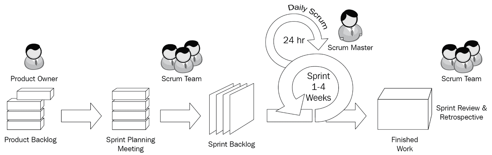
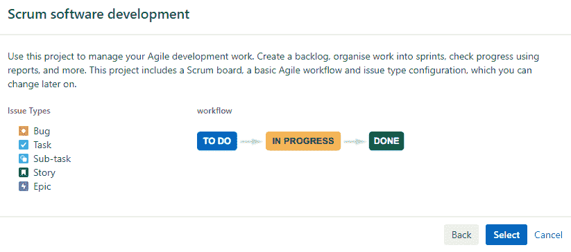
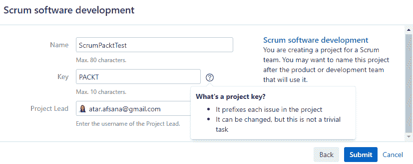
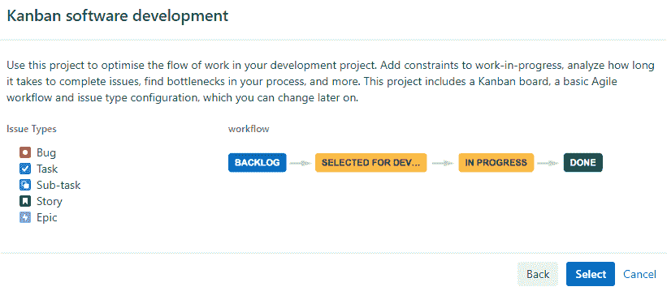
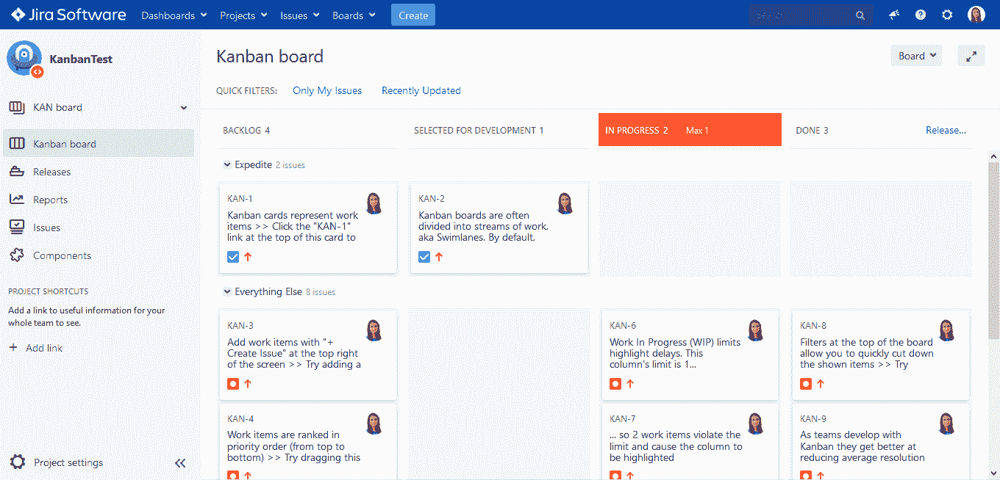
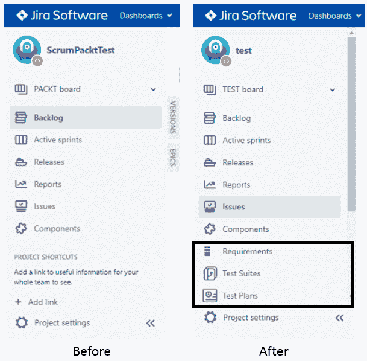
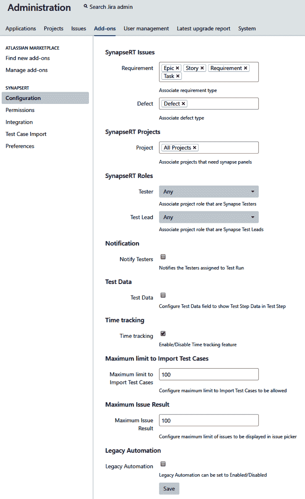
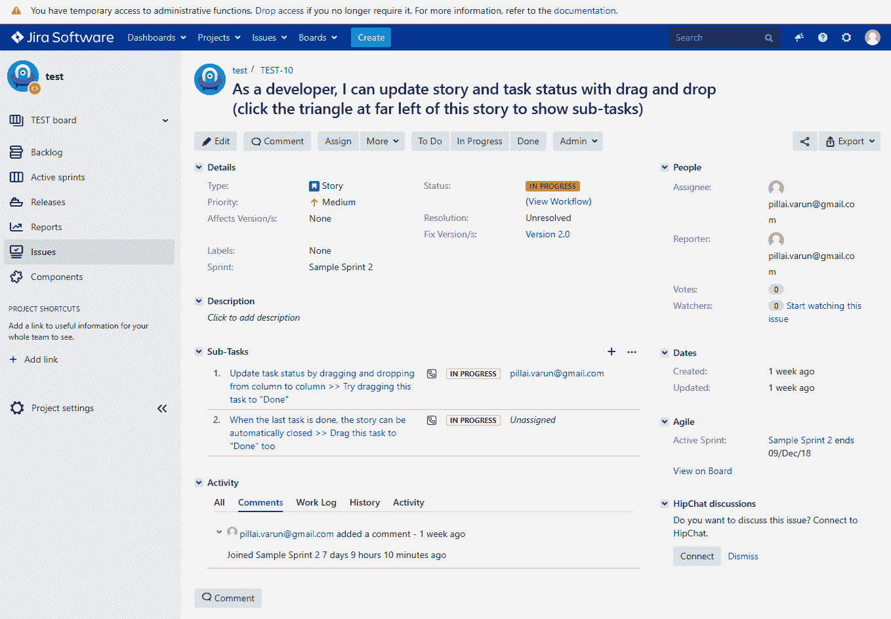
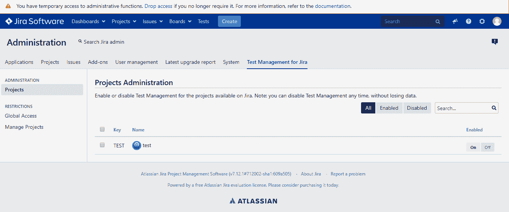
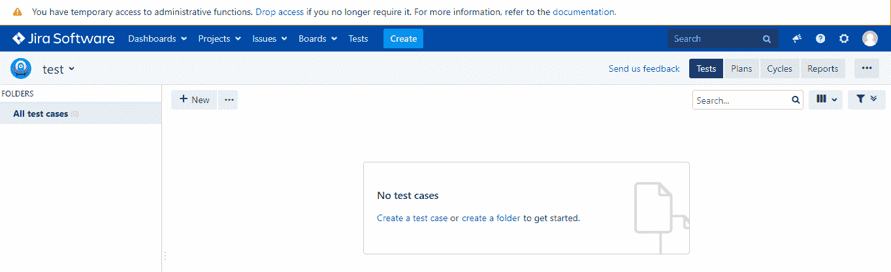

# 第二章：开始使用 Jira

项目的成功是开发团队在开发过程的每个阶段所采用的方法的结果。为了取得成功，开发团队需要一个优秀的项目经理，他具备良好的项目管理技能和经验，能够交付满足最终用户需求的产品。项目管理流程分为以下阶段： 

+   启动

+   规划

+   执行

+   监控和控制

+   结束

在本章中，我们将涵盖以下主题：

+   Jira 是什么，以及如何用于项目管理

+   如何设置 Jira 进行项目的启动和规划

+   三个插件——synapseRT、Zephyr 和测试管理的功能和特性概述

# 什么是 Jira？

Jira 是由澳大利亚的 Atlassian 公司开发的软件工具，提供了一种有效的组织和管理项目的方式。它还提供了满足敏捷项目管理需求的能力。

Jira 就像一个容器，包含在 Jira 项目下分类的不同类型的 Jira 问题。使用 Jira，您可以设计、管理和定制各种类型的任务、工作流程和报告，并简化项目管理流程。它有助于简化创建和管理项目工件的过程，并为项目利益相关者提供了一个共享平台来监控项目进展。

Jira 通过以下方式提高协作和生产力：

+   减少跟踪客户所花费的工作...

# 使用 Jira 组织项目

现在我们已经了解了 Jira 是什么，我们可以学习如何使用它来组织项目。

Jira 可以在企业级别上用于为各个部门创建不同的项目。虽然没有固定的创建项目的规则，但决定某些参数可以通过将项目分隔，有助于有效地制定工作策略。

# 使用 Jira 进行敏捷项目管理

组织正在从传统的瀑布项目管理流程转向迭代、快速、顺畅和系统化的敏捷项目管理流程。产品开发的敏捷方法在每个迭代或周期中选择最相关的需求，并在每个周期中生成最终产品的部分。

迭代通常较短，因此计划为有限期。它提供了在不影响正在开发的更大产品的情况下撤销任何新变更的灵活性。因此，它有助于减少失败的风险并控制其影响。与传统的瀑布流程相比，每个开发阶段都是完整的，但又相互依赖于前一个阶段。...

# 什么是 Scrum？

Scrum 是一个框架，通过其自适应、迭代和系统化的方法，帮助解决客户需求和复杂产品需求。它帮助团队以不同的迭代方式交付产品，以实现目标。作为产品开发的一部分，它提供了定义利益相关者角色和组织任务的机会，将复杂的项目范围分解为更小、更易理解的需求，并提供了更好的集成范围变更的方式。下图显示了敏捷 Scrum 方法论中的阶段和参与者，我们将在接下来详细讨论：

https://commons.wikimedia.org/wiki/File:Scrum_process.svg

# 详细了解 Scrum

在 Scrum 中，项目需求可以使用产品待办事项和冲刺待办事项进行组织：

+   **产品待办事项**：这是一个包含复杂用户需求、愿望清单、需求和想法的列表。产品负责人负责根据客户需求组织和优先考虑这个列表。利益相关者可以随时向列表中添加需求，但只有产品负责人负责优先考虑和删除需求。因此，产品待办事项总是处于增长阶段。

+   **冲刺待办事项**：一旦需求被拆分成一个较小的项目列表，团队就会准备和计划需要在即将到来的冲刺中交付的任务列表。这些项目是...

# Scrum 会议

Scrum 相信协作，并要求利益相关者参加会议，以使每个人都了解和知晓范围内的事项、障碍、依赖关系、风险、资源可用性等，以便能够有效地进行规划和解决。

Scrum 中有五种关键会议类型：

+   **待办事项细化会议**：也称为产品待办事项整理，旨在为产品负责人和团队提供一些时间来准备、重新排序和组织下一个冲刺的待办事项之前。通常，Scrum 主管、产品负责人和开发团队参加待办事项整理会议。

+   **冲刺规划**：这是所有利益相关者承诺**产品待办事项**（**PBI**）和相关任务的机会，他们将作为即将到来的冲刺的一部分完成。这些会议帮助团队确定用户故事，分配故事点等。

+   **冲刺回顾**：验证用户故事是否符合团队指定和同意的范围和验收标准，以及它们是否满足客户的需求是很重要的。冲刺回顾会议旨在向产品负责人展示开发和测试的产品。

+   **冲刺回顾**：由于 Scrum 是一个持续的自适应框架，了解做对了什么和做错了什么是必要的。冲刺回顾会议为所有利益相关者提供了一个机会，以确定改进的范围，并保留在当前冲刺期间运作良好的做法。这个会议通常在冲刺结束时进行。

+   **每日 Scrum**：为了及时应对障碍并跟踪项目的进展，所有利益相关者分享他们正在处理的任何工作项的当前状态是很重要的。每日 Scrum 会议旨在解决这些问题，并且顾名思义，它们每天都会发生（平均持续 15 分钟）。

读者可以在此链接找到有关 Scrum 的更多信息：[`www.scrumalliance.org/`](https://www.scrumalliance.org/)。

# 什么是 Kanban？

Kanban 是一个持续交付、精益调度的流程，旨在帮助人们更有效地作为团队合作。Kanban 和 Scrum 的目标都是及时交付产品。然而，Kanban 使用 SDLC 的阶段来跟踪工作项的进展，从需求收集到产品或软件的交付。这些不同的泳道是待办事项、选择开发、进行中和完成。

与 Scrum 不同，Kanban 不遵循迭代方法，而是具有增量性质的长期开发周期。由于没有迭代，工作项不需要在特定时间开始或结束，而是取决于其他因素，例如工作项的优先级等。

# 项目启动和管理

现在我们已经了解了 Scrum 和 Kanban 的基础知识，让我们发现 Jira 如何帮助我们使用预定义的项目模板创建和管理我们的敏捷项目。我们将利用 Scrum 和 Kanban 的软件开发模板来规划我们的项目。

# 在 Jira 中如何启动项目

Jira 为团队提供了灵活性，可以根据他们的角色组织项目条目。我们将在下一节讨论这些用户角色和权限。然而，管理员角色是我们可以根据需要创建和设置项目的角色。

设置 Jira 项目是一个非常简单的过程。注册后，您将看到欢迎页面，在那里您可以从提供的模板中创建项目，例如 Scrum、看板等。

让我们点击“创建新项目”按钮。它为我们提供了在软件或业务中创建项目的模板。在软件中，我们可以看到基本软件开发、Scrum 软件开发和看板软件开发项目的模板。这...

# Jira 中的基于角色的权限

Jira 可以针对不同的用户角色进行设置和配置，以满足团队的需求。敏捷项目有各种角色，如 Scrum 主管、开发经理、产品经理、项目所有者、团队负责人、开发人员、QA 工程师、设计师、技术作家等。借助管理员用户角色，我们可以满足每个用户组的需求，并相应地自定义 Jira 权限。

Jira 中有三种主要类型的权限：

+   **全局权限**：基本上是具有管理员权限的用户。这是一个可以访问 Jira 中所有项目的用户。

+   **项目权限**：这是一种受限权限，仅限于所选项目。这样的用户无法访问他们没有访问权限的项目。但是，对于任何给定的项目，他们可以创建、编辑和管理项目问题，并将其来回分配给其他团队成员。

+   **问题安全权限**：这是在问题类型级别上的受限访问，只提供给有限的受众。Jira 是一个基于票据的系统，您可以创建不同类型的票据或问题，并使用问题安全权限限制其访问。例如，如果问题类型是史诗，那么您只能将经理添加到列表中，以便能够查看史诗问题类型的票据。

然而，这些权限的每个级别都有管理员，如下所示：

+   **Jira 管理员**：这是一个用户可以自定义、管理和配置 Jira 的角色

+   **项目管理员**：项目管理员可以控制与冲刺相关的任务，如创建、开始、移动、编辑、结束、删除、完成和重命名冲刺

+   **看板管理员**：看板管理员可以通过创建看板、修改工作流程、添加/移除状态等来控制仪表板

确保您了解您的项目需求。确保您提前了解您的团队可能需要的问题类型，以及团队想要使用的默认或自定义工作流程、字段或组件的类型。

在下一节中，我们将使用 Jira 管理员用户角色创建和管理项目。

# 使用 Jira 进行 Scrum

让我们从在 Jira 中创建一个 Scrum 项目开始：

1.  选择 Scrum 软件开发选项后，它会带您到以下页面。列出的问题类型将作为您的项目的默认问题类型，并具有指定的默认工作流程。记住，您始终可以添加新的或修改现有的问题类型和工作流程。这在下面的截图中显示：

1.  为您的项目提供一个名称和一个关键字，并指定项目负责人，如下面的截图所示：

1.  点击提交后，项目将...

# 使用 Jira 进行看板

现在让我们在 Jira 中创建一个看板项目：

1.  选择看板软件开发选项后，它会带您到以下页面：

列出的问题类型将作为您的看板项目的默认问题类型，并具有指定的默认工作流程。如前所述，您始终可以添加新的或修改现有的问题类型和工作流程。

1.  通过指定名称和关键字并分配项目负责人来创建看板项目。

1.  点击提交后，看板项目将被创建，您将看到看板。

1.  现在，您可以通过创建问题、计划并将其组织到泳道中来添加项目项。以下截图显示了一个看板，其中的需求通过不同的泳道，如“待办事项”、“选择进行开发”、“进行中”和“完成”：

现在我们已经准备好了我们的项目，让我们探索 Jira 支持的插件，以了解其测试管理方面。

# 探索 Jira 的测试管理插件

测试管理流程有助于组织、跟踪和管理与测试相关的项目需求。软件开发经历了各种阶段，测试也有其自己的一系列阶段。每个阶段都有一系列活动，通过这些活动我们可以跟踪项目的进展，例如创建测试计划和测试用例，将它们组织到测试套件中，创建测试周期，管理执行，创建和重新测试缺陷等。STLC 及其与 SDLC 的集成在第一章中已经介绍过，即*软件质量保证概述*。

在接下来的章节中，我们将详细了解不同的测试管理阶段，如管理、计划、设计...

# synapseRT

synapseRT 是一个支持 Jira 端到端测试和需求管理的应用程序。它是一个插件，可以与 Jira 环境无缝集成，通过使测试人员、测试经理和项目经理能够计划、执行和跟踪项目在 SDLC 期间的进展来扩展其功能。它将整个测试过程组织成四个部分：

+   **测试用例**：这个部分是测试人员可以设计和维护测试用例的地方。它还提供了在需要时重复使用它们的灵活性。

+   **测试执行**：这是测试人员可以设计和计划当前发布所需的测试策略的阶段。

+   **测试自动化**：synapseRT 可以与其他第三方自动化或持续集成工具无缝集成，借助这些工具，测试专业人员可以执行自动化脚本并获取执行状态。

+   **需求**：在需求管理方面，团队跟踪项目进展是至关重要的，这样资源的分配和分配就变得容易。此外，这有助于在测试的早期阶段识别和减轻风险。synapseRT 生成的可追溯性报告对此非常有用。

在接下来的章节中，我们将详细介绍 synapseRT 的每个部分，并探索其用途和最佳实践。在这一部分，让我们在 Jira 中安装 synapseRT，并了解启动所需的基本配置设置。

Jira 可以根据用户的需求进行定制，synapseRT 也可以。它提供了设计自定义工作流程和添加问题类型或字段的灵活性。您可以从 Atlassian Marketplace 安装 synapseRT。

只需登录 Jira 并在“添加-ons”部分搜索`synapseRT`。在购买之前，可以使用其免费试用版本进行探索。本书使用的是 synapseRT 的当前版本（v9.3.1）。启用插件后，Jira 项目资源管理器将添加“需求”、“测试套件”和“测试计划”选项。在接下来的截图中，您将看到安装前后的屏幕：

为了查看问题类型（在您的情况下是需求）的 synapseRT 字段，例如史诗、故事、任务等，您需要进行以下配置：

缺陷问题类型是一个新的问题类型，我们将在接下来的章节中学习如何添加。

以下是一个链接，可以了解与 Jira 一起使用的支持版本 synapseRT：[`doc.go2group.com/synapsert/latest/en/synapsert-ver-9-x/supported-jira-versions`](https://doc.go2group.com/synapsert/latest/en/synapsert-ver-9-x/supported-jira-versions)。

# Zephyr

Zephyr for Jira 是 Jira 支持的另一个测试管理工具。就像 synapseRT 一样，它可以用于设计和组织测试用例。它帮助测试人员计划测试执行并在全局或项目级别管理自定义字段。借助敏捷测试面板，团队可以管理和报告工作进展。它还支持使用**Zephyr 查询语言**（**ZQL**）进行高级搜索选项。它可以轻松集成其他自动化工具，以及使用 ZAPI 的持续集成工具。

Zephyr 可以从 Atlassian Marketplace 下载。本书使用的是当前版本的 Zephyr（v4.0.2）。

在以下屏幕截图中，您将看到安装前后的情况...

# 测试管理

测试管理插件是 Jira 支持的另一个工具。它具有与 synapseRT 和 Zephyr 类似的组件，并通过不同的测试套件创建和管理测试用例。测试人员可以根据所选需求的测试类型创建测试周期，例如不同浏览器的测试等。

可以使用追溯矩阵跟踪缺陷的需求。它通过 REST API 扩展了对自动化工具和 DevOps 工具的支持。测试管理工具可用于使用英语、德语、西班牙语、葡萄牙语和意大利语等本地化语言。

测试管理工具可以从 Atlassian Marketplace（[`marketplace.atlassian.com/`](https://marketplace.atlassian.com/)）下载。本书使用的是当前版本的测试管理工具（v5.1.1）。

在以下屏幕截图中，您将看到安装前后的情况。

在安装和启用测试管理插件之前，Jira 项目在菜单栏中没有 Tests 选项卡：

如您所见，它在管理下拉菜单中添加了一个名为“Tests and Test Management for Jira”的选项卡：

为了查看问题类型（在您的情况下是需求）的测试管理工具，例如 Epic、Story、Task 等，您需要启用它。启用项目的插件后，您将能够从以下位置的 Tests 选项卡为项目创建测试：

# 摘要

在本章中，我们了解了 Jira 和 Jira 支持的插件，以满足您的敏捷项目需求。Jira 是一个项目管理工具，提供各种模板来创建和管理项目工件。Scrum 和 Kanban 是两种最常用的敏捷项目管理方法。Jira 支持这两种方法，并提供工具来满足您的测试管理需求。使用简单的步骤，您可以在 Jira 中创建和管理项目，并使用不同的权限和角色限制信息访问。我们探讨了在 Scrum 和 Kanban 中创建项目的工作流程。在最后一节中，我们探讨了三个测试管理插件 synapseRT、Zephyr 和 Test Management 的安装和配置...
