# 第三章：了解 Jira 中的测试组件

需求、测试套件、测试计划、可追溯性和报告是 Jira 测试管理解决方案的主要组成部分。测试套件，也称为测试存储库，用于组织测试用例。在进行测试执行阶段之前，测试计划是一个重要因素。可追溯性和报告帮助我们跟踪项目发布周期中测试工作的覆盖范围和进展情况。

在本章中，我们将介绍使用 Jira 中的插件进行测试管理的方法。首先，我们将了解需求和测试计划的一些基础知识，包括问题类型，以及 Jira 中每种问题类型经历的默认工作流程。我们将学习创建自定义工作流程，并将其添加到项目中使用工作流方案。然后，我们将创建自己的问题类型，并将这个新创建的工作流应用到该问题类型。我们还将详细了解问题类型，并比较三个插件提供的测试套件功能。我们将从了解测试计划的一些基础知识开始，以及它在 Jira 插件中的位置。

本章中，我们将详细讨论以下主题：

+   什么是需求？

+   问题类型

+   什么是测试套件及其优势？

+   什么是测试计划？

+   什么是可追溯性矩阵及其好处？

+   报告及其类型

# 需求

需求基本上是解决最终用户问题的解决方案的一部分。它们也可以是吸引最终用户使用产品或服务的可取之处。此外，需求还可能包含在市场上现有产品中广泛使用的功能，这使得它对于新产品进入市场至关重要。

# 什么是需求？

需求可以是功能性/非功能性和隐式/显式的功能列表。无论哪种方式，它们基本上被分类为产品或服务的核心需求或好要求。规范因目标受众和组织开发的产品类型而异。

在软件行业中，一旦项目正式启动并分配给软件开发团队，项目利益相关者的第一个任务是收集需求。收集需求有助于团队了解项目范围、时间表、预算、支持的技术、其限制、所需资源数量、所请求的功能、客户的愿望清单等。

在收集和记录需求之后，项目协调员（充当最终用户和软件开发团队之间的联络人）会从最终用户那里获得批准。在获得开发阶段的批准后，需求被分析并分解为更小的工作包，成为团队的任务。Jira 提供了一种有效的方式来帮助团队组织和管理这些任务。

Jira 是一个基于工单的系统，其中每个任务都表示为一个工单。因此，团队的需求在 Jira 中变成了一个工单。Jira 还允许利用问题类型对任务进行分类（基本上有助于对需求进行分类以分隔工作）。每个 Jira 项目默认支持问题类型。现在，如果你想知道你的项目是否支持某个问题类型，可以在创建新项目时在第一个屏幕上确认：

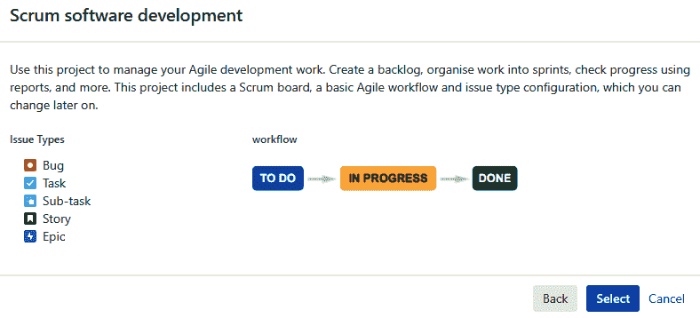

在前面的截图中看到的默认问题类型是 Bug、Task、Sub-task、Story 和 Epic。Jira 还提供了灵活性，可以通过添加、编辑和/或删除问题类型以及工作流程来自定义项目支持的问题类型。如果项目或组织需要对项目中的项目进行进一步的分离和分类，超出了默认提供的内容，那么团队成员也可以创建自己的问题类型，我们将在下一节中看到。

在第九章中，*需求管理*，我们将学习如何将 Jira 问题类型配置为测试需求。我们还将使用这些问题类型使用 Jira 插件与相关测试用例进行链接。

# 问题类型

创建和使用新的问题类型涉及以下六个步骤：

1.  以`Admin`身份登录，导航到 Administration | Issues | Add issue type，并按照官方文档中的步骤进行操作（*定义问题类型字段值*：[`confluence.atlassian.com/adminjiraserver/defining-issue-type-field-values-938847087.html`](https://confluence.atlassian.com/adminjiraserver/defining-issue-type-field-values-938847087.html)）添加一个新的问题类型。我们已经创建了一个名为`ProdIssue`的新问题类型：

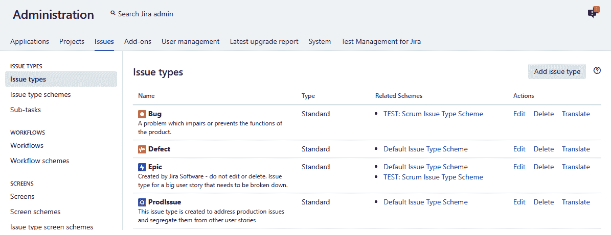

1.  让我们为`ProdIssue`创建一个新的工作流。要创建一个新的工作流，以`Admin`身份登录，导航到 Administration | Workflows | Add Workflow，并按照官方文档中的步骤进行操作（*使用工作流*：[`confluence.atlassian.com/adminjiraserver072/working-with-workflows-828787890.html ...`](https://confluence.atlassian.com/adminjiraserver072/working-with-workflows-828787890.html)

# 测试套件

当软件开发公司获得一个大项目时，必须将项目分成较小的组件，以便可以应用*分而治之*的策略。然后通过集成这些较小的组件来创建最终产品。划分更大项目的一般程序是将共同特征的需求分组，形成较小的项目。然后将这些较小的项目分配给开发团队。因此，每个团队都致力于交付较大最终产品的一部分：

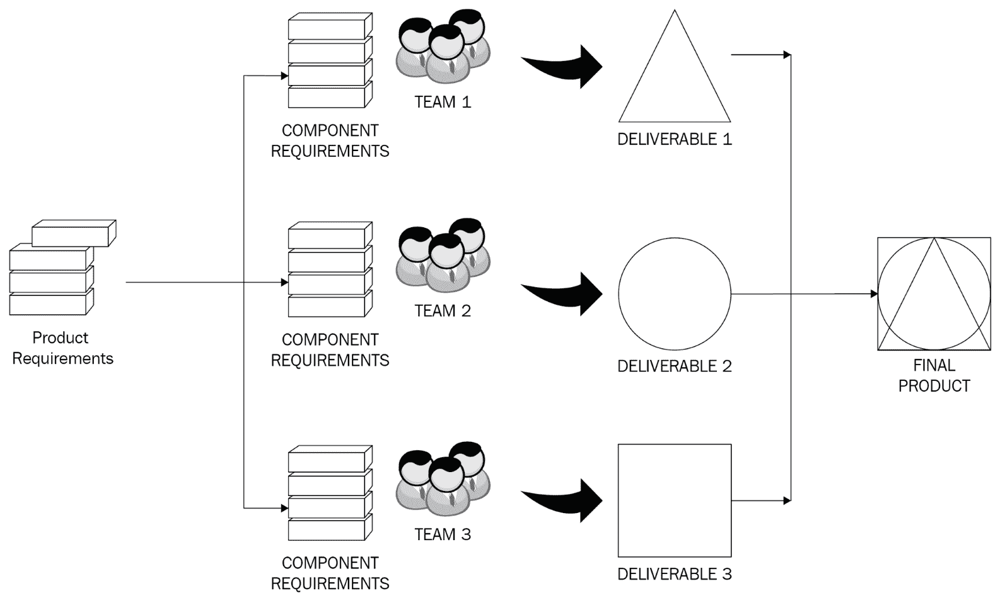

这些项目的测试工作始于测试人员创建测试场景和测试用例。测试用例的数量和复杂性因项目的大小、持续时间、复杂性、使用的测试工具和测试策略而异。然而，最大的挑战是将这些测试用例分开，以便它们易于访问，并且可以跨项目或整个组织进行引用或重复使用。这就是测试套件的概念派上用场的地方。

# 什么是测试套件？

**测试套件**只是一个容纳具有相似行为或目标的测试用例集合的容器。每个测试套件都有由基础测试用例定义的共同特征，并且数量不同。

各种特征有助于识别和区分测试套件的模式，即以下内容：

+   需求。

+   优先级：

+   高

+   低

+   关键

+   组件。

+   测试环境：

+   开发

+   测试

+   生产

+   测试输入参数或类型。这些包括不同的值集或类型，例如`.csv`文件、图像、变量、对象，甚至是从函数返回的值。

+   预期行为。

+   测试类型：

+   回归

+   冒烟

+   特定于浏览器

+   团队用于测试的特定工具，例如...

# synapseRT 中的测试套件

在 synapseRT 中，测试套件选项卡显示在项目页面的左侧面板上。从这个部分，我们可以创建和管理主要和子测试套件的测试用例。以下截图显示了主测试套件“移动银行应用测试”，其中包含四个测试用例，这些测试用例已经组织成两个子测试套件“IOS 设备测试”和“Android 设备测试”。我们还可以选择将测试用例从一个测试套件克隆到另一个测试套件，删除，甚至导出测试用例：

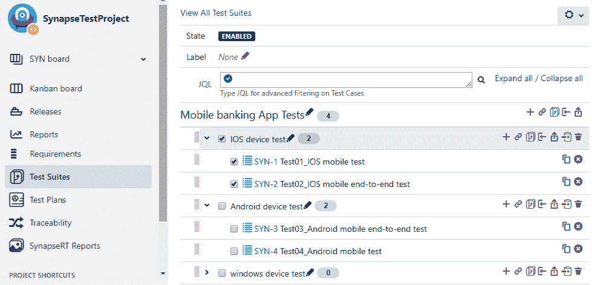

# Zephyr 中的测试套件

Zephyr 提供了一种通过测试周期管理测试执行的方式。但是，它并没有提供按测试套件组织测试用例的功能。测试摘要屏幕提供了按版本、组件或标签组织的测试用例数量的详细视图，以及它们的执行状态：

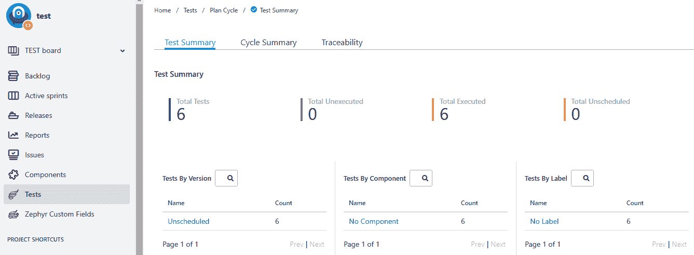

# 测试管理中的测试套件

单击“测试”选项卡，并在“文件夹”部分创建一个新文件夹。这些文件夹将成为您的测试套件。您可以通过单击屏幕上的“+新建”按钮来添加新的测试用例。我们已经为我们的银行示例创建了一些测试套件和测试用例，如下所示：

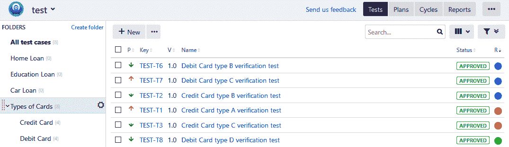

对于前面的银行示例，测试人员还可以基于移动测试、Web 应用程序测试、信用卡测试、个人银行测试、账户类型测试、负载类型测试等高层次创建测试套件。

# 测试套件的优势

对于测试专业人员来说，拥有组织良好的测试套件是有益的，原因如下：

+   它有助于区分需要执行的任务类型，以验证需求

+   以时间和资源需求为单位进行的工作估计变得容易

+   它充当了知识库存储库

+   它可以帮助轻松识别测试用例以减轻风险

+   先前发布的组件的识别和重新测试变得容易。

测试套件通常会随着项目的进展而增长。良好组织的测试套件对于有效的测试管理至关重要。

# 测试计划

如果您想成功交付项目，规划是很重要的。我们在开发过程的每个阶段都会为每个活动进行规划。测试也不例外。为了确保产品的质量并进行验证，测试计划至关重要。

# 什么是测试计划？

测试计划是一份详细的文档，概述了您验证和测试软件产品的方法。这是由测试经理或测试负责人准备的详细文档，突出显示需要验证的功能、测试策略、资源的可用性及其角色。它还包含有关测试范围、不属于测试阶段的组件、支持的浏览器类型和版本、用于测试的工具的限制等详细信息。

SDLC 中的每个阶段都会生成一系列可交付成果。例如，需求收集阶段会生成 BRD，设计阶段会生成高级和低级系统和组件设计计划，测试规划阶段会生成...

# synapseRT 中的测试计划

测试计划是 synapseRT 中的另一种问题类型。单击“创建”按钮后，我们可以选择将问题类型设置为测试计划。一旦输入所有细节并创建我们的测试计划，我们可以添加测试用例和测试周期，如下截图所示。synapseRT 提供了一种有效的管理测试周期的方式。在开始执行之前，您可以随时向所选周期添加或删除测试用例。

但是，一旦周期开始，用户只能向测试周期添加新的测试用例：

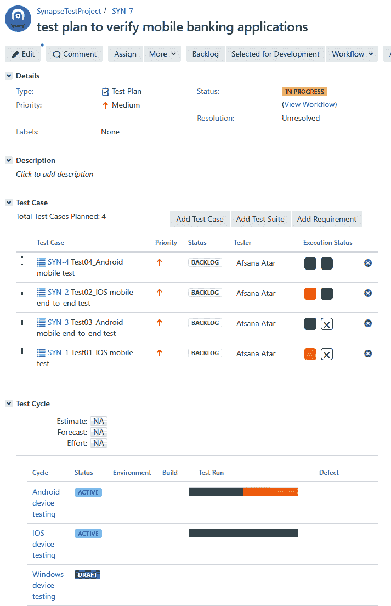

# Zephyr 中的测试计划

Zephyr 使用 Cycle Summary 来规划测试周期。一旦计划好周期，测试团队可以根据需要添加和删除测试用例。测试用例经过内容和细节的验证，并分配给团队进行同行评审。同行评审后，可以标记为“准备测试”，并分配给负责执行测试用例的团队成员。一旦更新了测试用例的周期准备就绪，就可以将其移动到目标发布测试周期下，并且团队可以开始执行阶段。以下截图显示了如何规划测试周期：

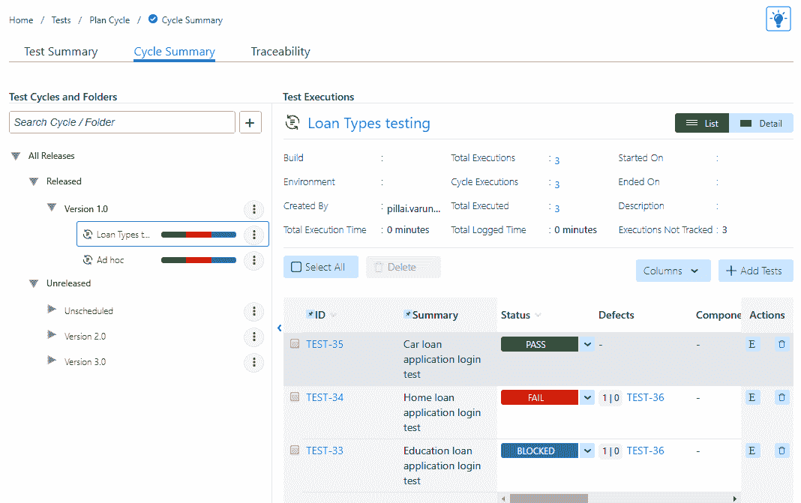

# 测试管理中的测试计划

测试管理提供了一个名为“计划”的选项卡来创建和管理测试计划：

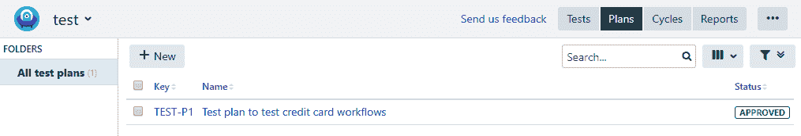

创建测试计划后，可以添加包含测试用例的测试周期，如下截图所示。然后可以从测试计划的追溯部分查看：

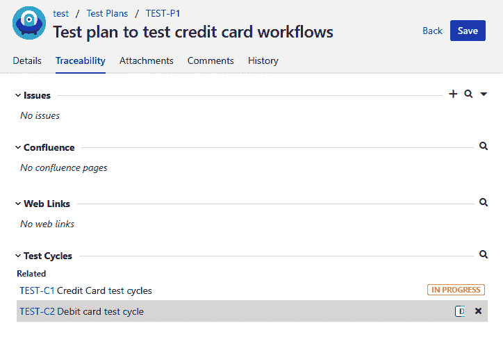

# 追溯

需求通常记录在 BRD、**软件需求和规格**（**SRS**）文档中，或者记录在项目管理工具（如团队使用的 Jira）的需求部分。测试场景和测试用例是为了验证所述需求而创建的。重要的是要确保并跟踪所有需求都有相应的测试用例，并在测试和验证阶段中得到覆盖。这就是追溯矩阵帮助我们管理的内容。

# 什么是追溯矩阵？

追溯矩阵，也称为**需求追溯矩阵**（**RTM**），是一份文件，帮助测试专业人员建立被要求测试的内容与测试阶段覆盖的内容之间的关联。它在需求和确定的测试场景或测试用例之间建立了多对多的关系，这些将用于验证相关需求。追溯矩阵帮助我们识别质量泄漏，并确保完整的测试覆盖，以便不会漏掉任何需求的部分。

一旦执行阶段开始，测试专业人员将按照测试用例中提到的详细步骤开始应用验证过程。主要目标是确定模块是否满足条件并符合预期结果。如果是，测试通过，如果不是，我们称之为**缺陷**。缺陷的数量可能会因执行周期而异。

项目利益相关者了解测试执行状态的重要性，这样他们就能了解尚未验证的需求，并及时解决障碍。在系统中提出缺陷时，如果与相关测试用例相关联，就很容易追溯缺陷到测试用例，然后追溯到给定的需求。通常，在追溯矩阵的情况下，添加测试执行状态以及相关缺陷的细节非常重要。有各种格式的 RTM 可用于建立被测试需求与测试用例和相关缺陷之间的关系。

# 追溯矩阵的类型

最受欢迎的 RTM 类型如下示例所示：

+   **正向追溯矩阵：** 这是将需求与测试用例相关联的地方：

| **业务需求 ID#** | **用例 ID#** | **优先级** | **测试用例 ID#** |
| --- | --- | --- | --- |
| BR_1 | UC_1 | High | TC#001 |
|  | UC_2 | High | TC#002TC#005 |
| BR_2 | UC_3 | Medium | TC#003TC#004 |

+   **反向追溯矩阵：** 这是将测试用例映射到需求的地方：

| **测试用例 ID#** | **用例 ID#** | **优先级** | **业务需求 ID#** |
| --- | --- | --- | --- |
| TC#001 | UC_1 | High | BR_1 |
| TC#002 | UC_2 | High | BR_1 |
| TC#003 | UC_3 | Medium | BR_2 |
| TC#004 | UC_3 | Medium | BR_2 |
| TC#005 | UC_1 | High | BR_1 |

+   **双向可追溯矩阵：** 这是...

# 可追溯矩阵的好处

以下是可追溯矩阵的好处：

+   它使跟踪测试执行状态变得容易

+   它有助于确保测试场景在测试执行开始之前提供完整的测试覆盖

+   它确定了哪些需求在资源分配、时间、调试或缺陷解决时间方面需要更多的测试工作。

+   它提前解决问题，以减少对项目的影响

+   它通过减少失败的风险，监控项目的进展并提前估计完成时间

在第八章中，*缺陷管理阶段*，我们将看到如何将缺陷与测试用例关联，在第九章中，*需求管理*，我们将学习如何将需求与测试用例关联。现在，让我们看看每个 Jira 插件如何生成可追溯报告。

# synapseRT 中的可追溯性

synapseRT 中的可追溯矩阵可以从页面左侧的可追溯性选项卡生成。我们必须输入详细信息，例如需求（Epic、Task、Story 或 Requirement）或项目，以及我们要生成可追溯矩阵的相关测试计划（如果存在）。以下截图显示了在 synapseRT 中生成的前向可追溯矩阵。它显示了需求的详细信息，其相关的测试用例，它们当前的执行状态以及任何关联的缺陷。我们还可以选择将可追溯性视为矩阵或树：

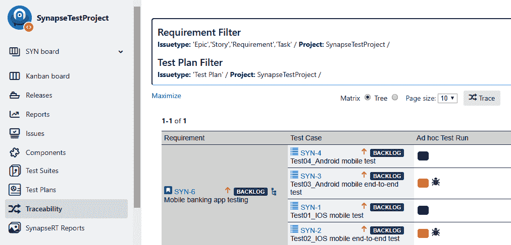

# Zephyr 中的可追溯性

Zephyr 提供前向和后向的可追溯报告。让我们详细了解如何创建它们：

1.  要创建前向可追溯矩阵，指定当前版本并从列表中选择需求问题类型，例如 Epic、Story 或 Tasks，并单击搜索图标。根据输入参数，Zephyr 在页面上列出了相关的问题类型。选择问题的复选框和要生成可追溯矩阵的需求到缺陷：

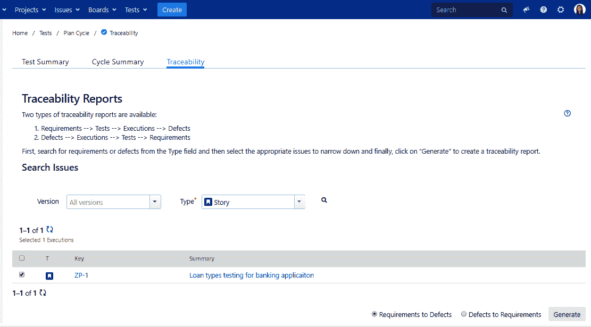

1.  Zephyr 生成的前向可追溯矩阵显示了需求、其关联的测试用例、其执行状态和关联的缺陷之间的关系。我们有一个需求`ZP-1`，并且有三个测试用例添加到此需求。`Executions`列显示了每个测试用例的执行状态的进一步详细信息，例如，作为一个测试用例，`ZP-9`有两次执行，两次都失败。它还有一个链接的缺陷`ZP-11`，添加在`Defects`列中：

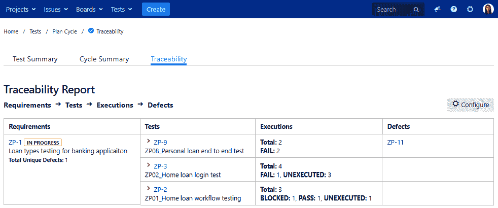

1.  使用上述步骤生成后向可追溯矩阵。在这种情况下，我们将选择 Bug 作为问题类型，我们希望为其生成 Zephyr 的可追溯矩阵，屏幕上显示了所有相关的 bug 问题-选择要生成可追溯性的问题，选择类型为缺陷到需求，并单击生成按钮：

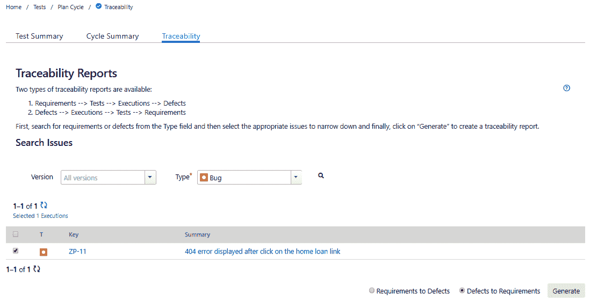

1.  如下截图所示，我们有一个后向可追溯矩阵，它建立了测试用例的缺陷与相关需求之间的关系。该矩阵具有带有链接的 Jira 问题的缺陷、执行、测试和需求列。在这两种情况下，我们可以选择以 HTML 或 Excel 格式导出可追溯性：

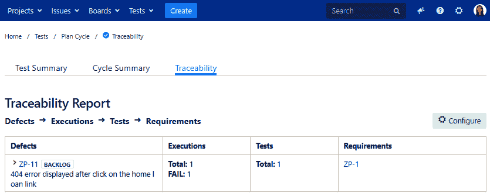

# 测试管理中的可追溯性

在测试管理插件中，可追溯报告详细说明了覆盖范围，显示了需求；测试用例和测试执行结果，显示了测试用例的详细信息；以及问题，详细说明了测试执行期间发现的缺陷：

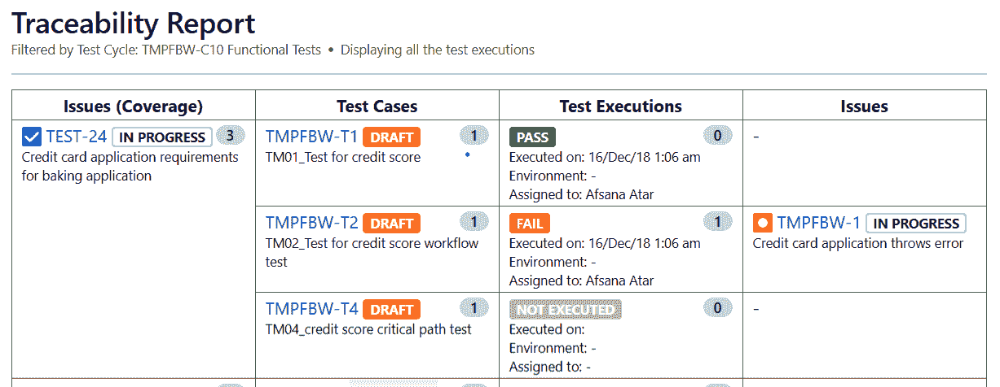

# 报告

报告是有效和定期传达项目进展状态的正式方式。它们在项目管理过程中发挥着关键作用。报告中提供的细节有助于识别和减轻可能导致项目失败的风险。

报告充当项目健康检查员，并帮助管理者跟踪任何偏离约定范围、时间、成本、预算和所需资源的情况，以满足质量要求。这些报告也作为知识库的一部分，可以在组织内进行维护和共享。

# 报告类型

报告的需求根据目标受众而有所不同。Jira 报告有助于确定项目的统计数据，并可以根据我们将在这里探讨的人员、项目、版本或问题类型进行定制。在第十章中，《测试执行状态报告》，我们将探讨 Jira 插件支持的不同类型的报告。现在，让我们看看 Jira 支持的报告类型：

+   **敏捷**：敏捷报告有助于通过生成各种类型的报告来跟踪项目的进展。它可以更深入地了解项目，并帮助项目团队及时解决问题。它有助于比较和对比项目的预期时间表。

+   **燃尽图**：这张图有助于...

# 摘要

在本章中，我们介绍了如何使用 Jira 中的测试管理插件执行测试管理的每个阶段。我们还比较了每个插件提供的功能。需求是最终用户的文档化需求，可以使用问题类型在 Jira 中捕获。我们学会了如何在 Jira 中为我们的项目添加和修改问题类型和工作流程。测试用例可以根据组件或需求进行组织，使用测试套件。我们看到了如何使用插件在 Jira 中创建测试套件。规划对于管理测试阶段至关重要。测试计划使我们能够制定测试的执行策略。我们比较了每个插件如何提供测试计划功能。可追溯性报告帮助我们将缺陷追溯到测试用例和需求。我们探讨了每个插件如何提供其版本的可追溯性报告。最后，我们熟悉了 Jira 中的报告部分，这将在第十章中《测试执行状态报告》中进行详细介绍。

在下一章中，我们将根据项目的需求，探讨选择各种项目执行工作流的最佳方法。
