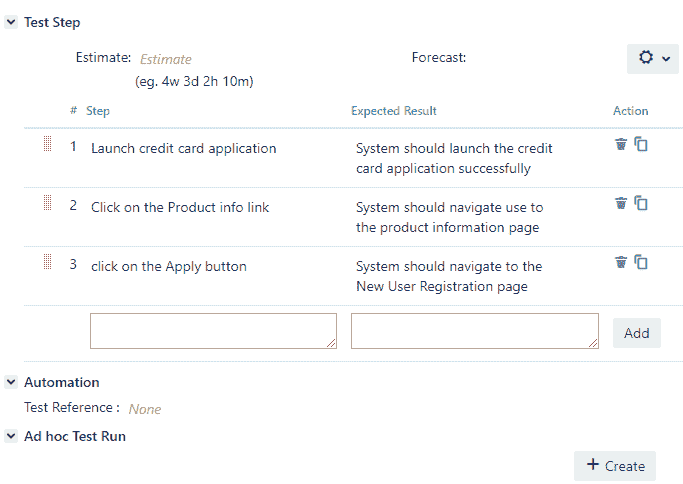
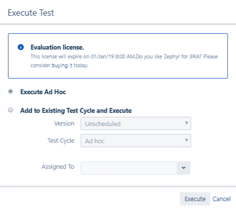
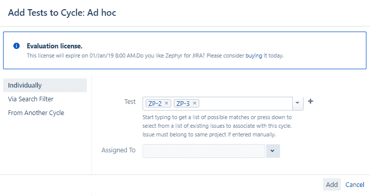
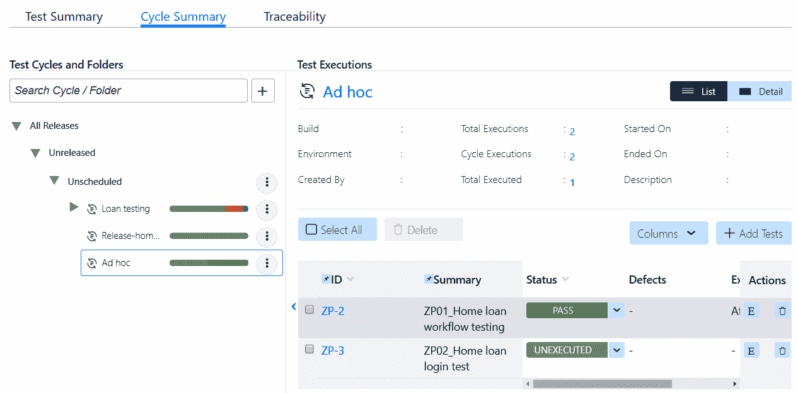
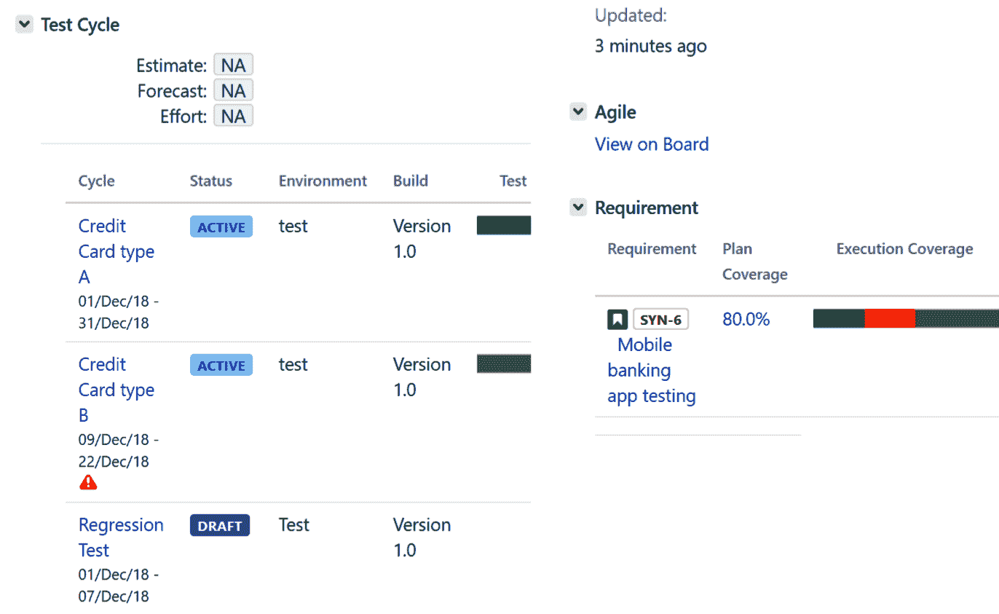
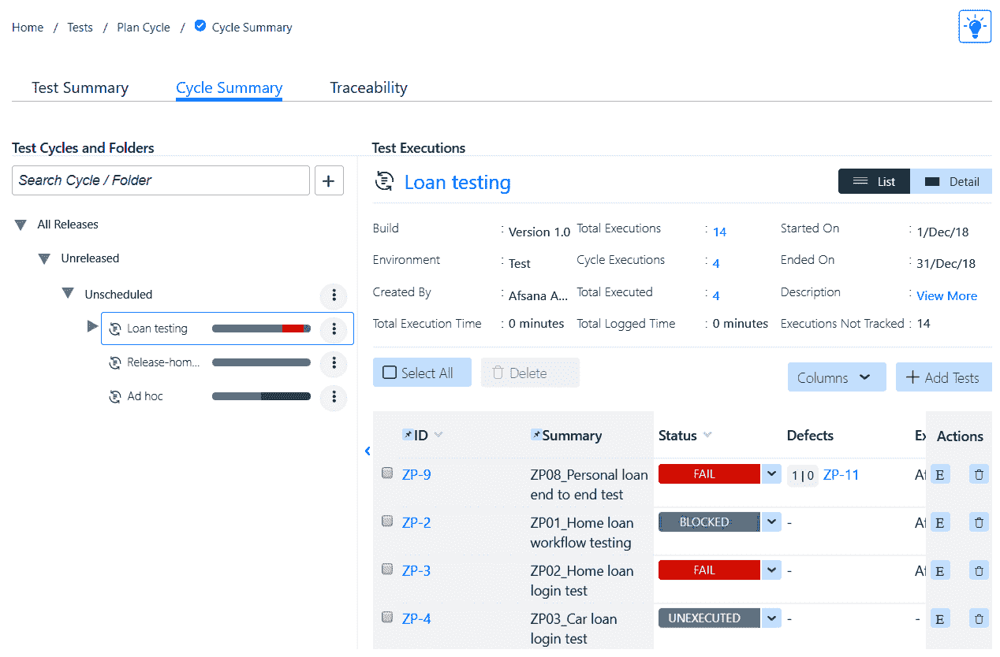
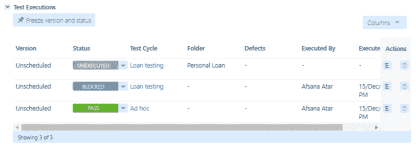
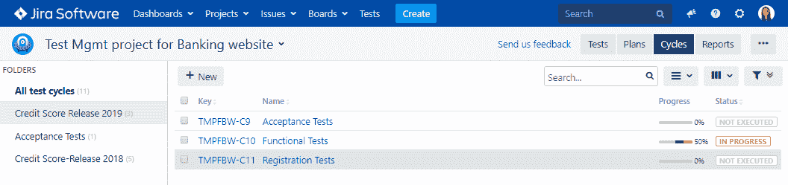

# 第四章：测试管理方法

测试管理方法中的执行策略在确定测试周期的成功或失败方面起着至关重要的作用。该策略有助于识别优化的路径以尽早减轻风险。在本章中，我们将详细介绍根据项目需求选择各种项目执行工作流程的最佳方法。我们将学习如何创建临时测试运行并将测试用例作为测试计划的一部分在测试周期中执行。然后，我们将了解每种执行类型的重要性、其优势和目标目的。让我们开始 TMap 的结构化测试执行策略。

在本章中，我们将涵盖以下主题：

+   TMap 结构化测试的执行策略

+   在选定的发布中进行测试周期内的执行

+   测试管理的最佳实践

# TMap 结构化测试的执行策略

随着软件行业及其标准的发展，强调的重点是流程应该由业务目标驱动，而不是流程成为业务目标的驱动因素。这导致了以下两种评估测试流程的方式的创建：

+   **规定性**：在这种方法中，模型提供了一个框架，以及每个测试单元的**关键绩效指标**（KPI）和需要询问的问题。这有助于您识别低效的根本原因。它还提供了应该解决每个这些低效的顺序以改进流程。

+   **非规定性**：在这种方法中，模型提供了一个框架，以及 KPI 和问题...

# 临时测试运行

测试团队在测试过程中面临各种情况，这取决于组织中遵循的流程成熟度以按计划交付产品。以下是这些情况的一些示例：

+   周转时间窗口很短，例如以下示例：

+   产品上线后进行错误修复的测试

+   在维护阶段需要快速处理的小更改请求

+   需要验证的工作流程不太复杂，例如以下示例：

+   针对范围较小且需要较少测试的需求进行测试，例如向表单添加验证弹出窗口以提示最终用户填写所有字段

+   诸如在 UI 中将按钮上的文本从“确定”更改为“接受”等外观变化

在这些情况下，潜在因素是变化不是激烈的，测试范围非常有限。因此，在这种情况下，我们可以采用临时测试方法。

**临时测试**程序是一个理解需求、为测试需求构建测试用例并根据需要执行它们的三个步骤。在这种方法中，测试专业人员只需创建最少量的测试用例，将它们链接到相关需求，然后在测试用例级别执行测试。在测试执行过程中，测试人员可以更新执行状态，并提供所需的工件支持。这节省了大量的开销和时间，无需安排会议、准备测试计划、测试周期，等待获得测试计划的签字等。

让我们看看如何在 synapseRT、Zephyr 和测试管理工具中将测试用例作为临时测试运行的一部分执行。

# synapseRT

测试用例可以作为临时执行的一部分在需要时执行。在 synapseRT 中，您可以将测试用例创建为 Jira 工单。由于测试用例只是另一种类型的 Jira 工单，它在“详细信息”部分具有默认字段，就像其他问题类型一样。但是，它包含测试步骤、自动化和临时测试运行部分，如下面的屏幕截图所示：

现在，点击创建按钮，为所选的测试用例创建了一个临时测试运行。测试人员可以执行每个步骤并更新执行状态，添加新缺陷或链接现有缺陷，附加工件等，如下所示...

# Zephyr

Zephyr 将测试用例作为临时运行或作为临时测试周期的一部分执行。为了这样做，用户只需创建一个测试用例问题类型并输入所有必需的详细信息。创建后，您可以在测试用例摘要字段下看到“执行”按钮，如下截图所示：

或者，我们也可以通过导航到 Tests | Cycle Summary 选项卡来创建一个临时测试周期。它给了我们一个选项，可以添加或删除多个测试用例作为临时测试周期的一部分：

在将测试用例添加到临时周期后，它看起来像以下的截图。正如您所看到的，它给了我们一个选项，可以根据您的发布来组织临时测试周期。它还显示了添加的测试用例的详细摘要，包括它们的票号、摘要、当前执行状态和链接的缺陷：

# 测试管理

临时测试执行选项不受测试管理工具支持。然而，它支持在测试周期中执行，我们将在下一节中详细介绍。

# 为选定的发布执行测试周期

临时测试是测试较短工作流程的一种灵活和更快的方式。然而，当您想要为整个发布计划或想要覆盖多种测试类型/特性（如性能、安全性、验收和集成）时，这种方法并不有效。在这种情况下，我们可以考虑准备测试周期，然后根据测试计划中定义的测试策略执行测试用例。让我们考虑一些在使用临时方法时测试团队面临的情况：

+   周转时间更长，例如以下示例：

+   团队正在建立一个新项目，并计划在年底发布产品。

+   计划在本季度发布产品的升级。

+   验证工作流程具有更多步骤和/或更复杂，例如以下示例：

+   客户要求进行更彻底的测试，因为变更具有大型、复杂的要求。

+   当测试一个报告的错误影响应用程序的多个组件时，需要进行严格的测试。

在这些情况下，我们需要分析问题并计划我们的测试策略。在周期内规划和执行测试用例可能是确保我们已经覆盖了所需产品或应用程序的所有类型的测试的最有效方式。因此，我们采用“测试周期中的执行”方法，这使我们有机会准备一个详细的测试计划，做以下事情：

+   调用所有依赖项

+   列出执行测试用例所需的输入和输出参数

+   定义通过测试的成功标准

+   定义缺陷跟踪和测试策略

+   根据用例设计和执行端到端工作流程

+   计划不同类型的测试并将它们集成到测试周期中

+   为冒烟测试、理智测试、集成测试、跨浏览器测试或环境测试等设计测试用例

由于变化很大，因为它的影响，我们最好准备好前面的方法。让我们详细看看 Jira 插件如何用于计划我们在不同类型的周期中的执行。

# synapseRT

测试周期是 synapseRT 中测试计划票的一部分。因此，为了创建测试周期，我们需要首先创建一个测试计划。一旦测试计划准备好，您可以添加测试用例或测试套件，然后根据它们的类型、优先级或其他执行标准将其分类到测试周期下。

以下截图显示了一个包含三个测试周期的测试计划——`信用卡类型 A`，`信用卡类型 B`和`回归测试`：

我们将在第七章中详细介绍如何跟踪和执行这些测试周期，*测试执行阶段*。

# Zephyr

另一方面，如果您想根据测试需求创建不同类型的测试周期，Zephyr 将它们归类到测试部分的周期摘要选项卡下。以下图片显示了两个主要的测试周期——`贷款测试`和`临时测试`。`贷款测试`包括`教育贷款`，`个人贷款`，`汽车贷款`和`房屋贷款`子测试周期：

测试用例票据还有一个测试执行部分，显示了这个测试已经被执行了多少次，是临时执行还是作为其他测试周期的一部分。如下截图所示，如果我们展开测试执行部分，它会显示所有测试运行和它所执行的测试周期。它还显示了关联的缺陷和执行日期：

# 测试管理

在测试管理工具中，可以从周期选项卡创建测试周期。如下截图所示，对于银行应用程序，我们有`信用评分发布`作为主要测试周期。在此之下，我们有三个子测试周期——`验收测试`，`功能测试`和`回归测试`。每个周期包含所需的测试用例，其执行状态可以从进度列中查看：

# 测试管理的最佳实践

TMap 提供了在组织中实施结构化测试方法的指导。以下是一些重要因素，将帮助您建立一个坚实的基础，以建立测试管理实践：

+   利用基于开发流程的测试活动模型。在我们的情况下，我们使用 STLC 模型，这是测试活动的 SDLC 模型的子集。TMap 生命周期模型可用于测试管理活动。

+   确保采用适当的测试工具和技术，如检查表，来识别、执行、跟踪和沟通进展和结果。沟通是必不可少的，以便及时识别和解决障碍。

+   建立所需的测试环境，满足测试产品的软件和硬件要求。这还包括设置测试数据库和测试数据。这将使执行阶段更加顺利。

+   为了有效的测试管理，测试团队应该是一个具有正确测试技能和产品知识的团队。这也意味着组织应确保员工接受培训，并改进流程，以实现建立可扩展和可重复的成功故事所需的成熟水平。建立一个成熟的组织和流程确保团队遵循共同的术语、方法、工具、技术、进入和退出标准、每周或每日电话会议和报告格式。这有助于高层管理生成标准的报告文档。

+   自动化是关键，因此组织必须尝试整合开源或付费测试工具，这将帮助测试人员更有效地执行工作。自动化重复活动可以帮助测试人员专注于探索性测试，而测试工具执行回归测试。在采用这些工具之前，应进行成本效益分析，因为这些工具需要相当长的培训和技能获取时间，员工才能有效地使用它们。

+   利用 BDTM 过程的每个步骤的成果，确保测试目标明确并与测试需求具体相关。这有助于彻底分析测试基础，及时实施策略，并实现良好的测试覆盖。

+   测试的目的是对产品的功能和需求进行可行的测试覆盖。项目越大，测试级别和测试单元就越多。因此，使用测试套件对它们进行组织是至关重要的。此外，避免将大型复杂需求合并到一个测试用例中，通过添加大量的测试步骤来覆盖它们，而是将它们添加到单独的测试用例中，以更准确地验证功能。

# 摘要

在本章中，我们涵盖了选择各种项目执行策略的最佳方法，以及在测试执行阶段执行测试用例的不同方法。TMap 提供了一种结构化的测试方法。我们了解了 BDTM 方法。对于较短和不太复杂的需求，可以使用临时测试策略来有效和高效地测试和验证需求。我们了解了如何使用 Jira 插件来实施临时测试。对于更大更复杂的项目，需要在测试周期内执行以组织和管理测试用例。我们了解了如何使用 Jira 插件创建和组织测试周期。最后，我们讨论了建立最佳实践的方法来...
