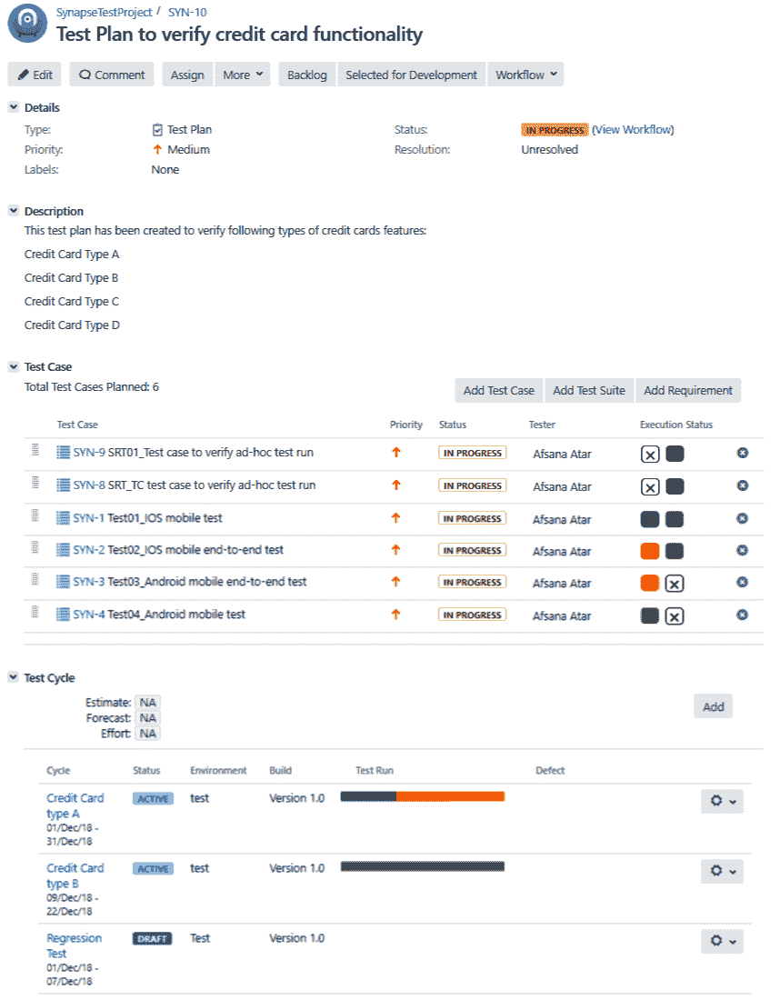
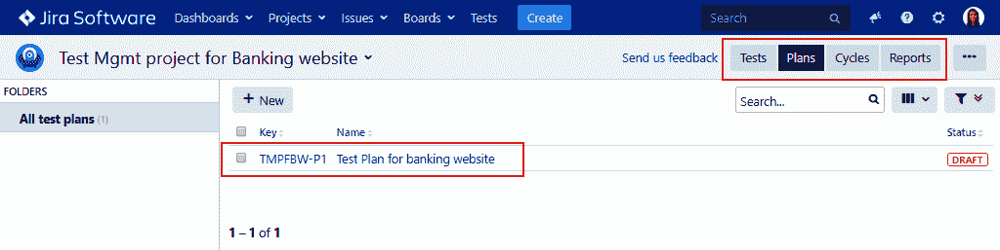
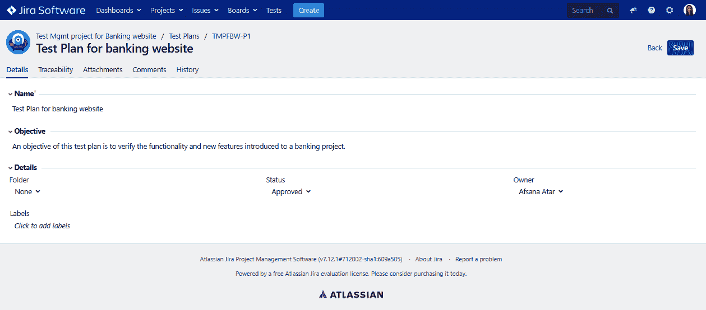
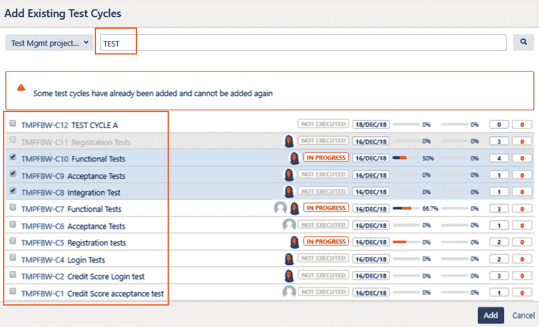
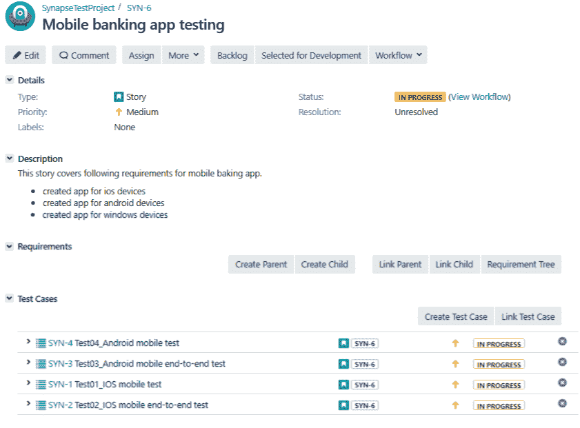
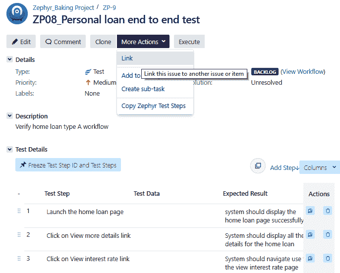
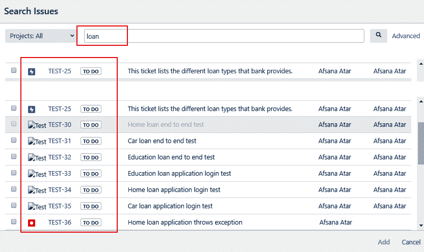
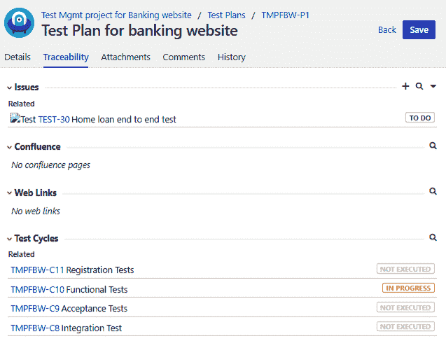

# 第五章：测试规划

测试规划是 STLC 中最重要的阶段。规划为测试专业人员提供了建立对问题的理解的机会，以了解需求的复杂性。这是通过分析基于用例的工作流程，然后从中推导测试用例来实现的。需求文档是指定应用功能的测试基础。然后，测试计划通过使用多种工件，包括测试分配、方法和测试策略，指定了如何在测试中覆盖这些项目。测试策略是测试过程中特别重要的工件。

在理解需求和测试计划之间的关系的同时，我们将涵盖测试规划和测试策略的不同方面。我们还将看看 Jira 如何帮助我们使用 synapseRT、Zephyr 和 Jira 测试管理工具来定义和比较我们的测试需求的策略。

在本章中，我们将学习以下主题：

+   使用 Jira 插件创建和组织测试计划

+   定义和实施测试策略

+   建立需求和测试计划之间的关系

# 使用 Jira 插件创建和组织测试计划

测试规划阶段涉及各种工作流程。如果使用 TMap 方法，测试规划阶段对应于 TMap 生命周期中的规划和控制阶段。规划阶段包括使用产品风险分析、估算和规划创建测试策略，而控制阶段旨在通过监控、报告和调整实现持续的质量改进以达到测试目标。让我们深入了解测试规划阶段的活动。

一旦测试分配确认，团队开始讨论规划会议期间所述规格，团队试图解决模糊和复杂的问题...

# synapseRT

在 synapseRT 中，测试计划只是另一种问题类型。一旦我们创建了一个测试计划票，就该是添加优先级、描述和当前状态的时间了。之后，我们可以创建一个新的测试用例或者添加所需的测试用例的测试套件。此外，我们还可以创建测试周期来分隔这些测试用例，并使它们成为所选周期的一部分：

使用 synapseRT 创建测试计划

# Zephyr

测试计划选项仅适用于 Zephyr 企业版，用户可以使用测试周期创建和管理测试计划。

请随意从此链接探索 Zephyr 企业版：[`zephyrdocs.atlassian.net/wiki/spaces/ZE6/pages/149455000/Test+Planning`](https://zephyrdocs.atlassian.net/wiki/spaces/ZE6/pages/149455000/Test+Planning)。

# 测试管理工具

为了在测试管理工具中创建测试计划，我们需要按照以下步骤进行：

1.  导航到 Tests | Plans 部分。单击+New 按钮创建一个新计划。在左侧面板上有一个选项，可以创建多个文件夹，并将测试计划组织在主文件夹或子文件夹下：

1.  一旦我们添加了一些基本细节，比如名称、目标、状态或所有者，我们就可以转到 Traceability 选项卡：

1.  在 Traceability 选项下，我们可以搜索现有的测试周期，并选择一个或多个测试周期将其添加到测试计划中。在搜索现有的测试周期时，它还显示了每个测试周期的执行状态，包括所有者的详细信息、日期和已识别的缺陷：

# 定义和实施测试策略

您的测试策略完全取决于应用程序的测试需求；主要是每个需求的风险等级。例如，如果需求是验证应用程序是否能够处理同时访问应用程序的 1,000 个用户的请求，那么我们需要将性能测试添加到我们的测试策略中。作为测试策略的一部分，我们可以通过发现超过允许阈值的断点来执行压力测试。我们还可以通过分析基于允许用户限制同时访问应用程序的性能来执行负载测试。我们还可以测量应用程序的响应时间，以呈现所有页面组件/对象...

# 建立需求和测试计划之间的关系

正如我们在第三章中所看到的，“在 Jira 中理解测试组件”，可追溯矩阵对于清晰了解项目进展并确定需要更多测试工作或存在更多缺陷的需求非常有用。可追溯矩阵还指示了测试策略、测试活动的类型以及测试专业人员定义和计划的任务，以验证所述需求。这在阶段初期创建，以便项目利益相关者审查，从而有足够的时间监控它，提供反馈，并根据团队的要求调整测试流程以实现测试目标。

建立需求和测试计划之间的关系是创建可追溯矩阵的第一步。每当在 Jira 中创建需求票证时，测试专业人员可以准备一个测试计划票证并将其链接到需求。一个需求可能有一个主测试计划和/或多个子测试计划，具体取决于测试需求。这为项目经理提供了跟踪所选需求的测试计划细节的机会。这些需求可以是具有目标发布截止日期的史诗或故事，也可以是客户报告的需要大量测试的任何错误。

让我们了解如何使用 Jira 插件建立需求和测试计划之间的关系。

# synapseRT

使用测试用例很容易建立需求和测试计划之间的关系。在前面的部分创建测试计划时，我们看到了如何将测试用例添加到测试计划中。同样，您也可以将相同的测试用例添加到需求票证中。下面的屏幕截图显示了一个故事问题类型，其中包含了四个测试用例：

一旦我们将相同的测试用例添加到测试计划中，我们可以在需求部分下看到需求覆盖率，如下面的屏幕截图所示。这表明，为了验证需求，测试人员已经添加了四个...

# Zephyr

由于测试计划功能仅在 Zephyr Enterprise 中可用，我们可以将测试用例与需求关联起来，以建立它们之间的关系。如下面的屏幕截图所示，打开现有的测试用例，转到“更多操作”|链接选项。然后，搜索相关的需求问题票证并进行链接，如下所示：

# 测试管理工具

在测试管理工具中，转到“测试”|计划，并选择要添加需求的测试计划。然后，转到可追溯性部分，在那里您可以搜索现有的用户故事或需求，并将它们链接到测试计划，如下所示：

如下面的屏幕截图所示，“问题”部分显示了为其创建了该测试计划的相关需求，以及需要执行的测试周期，以完成验证过程：

# 摘要

在本章中，我们涵盖了测试规划和测试策略的不同方面，同时了解了需求和测试计划之间的关系。我们了解了通用测试计划的组成部分，可以在测试规划过程中使用。我们还学会了如何使用 Jira 插件编写测试计划。

有各种各样的方法来定义测试策略。我们看了一个使用 TMap 方法为银行应用创建测试策略的例子。为了创建一个可追溯的矩阵，我们需要建立测试用例和测试计划以及测试需求之间的关系。在本章中，我们清楚地看到了如何将测试计划与其相关的需求联系起来。

在下一章中，我们将学习测试用例设计和创建的过程。我们还将学习如何组织测试用例，并磨练重复使用测试用例和测试数据的技能。
