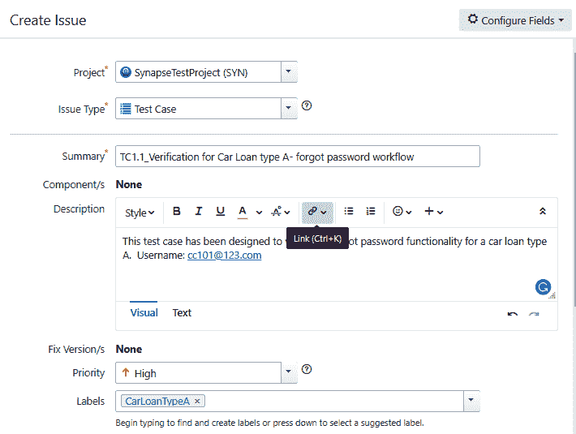
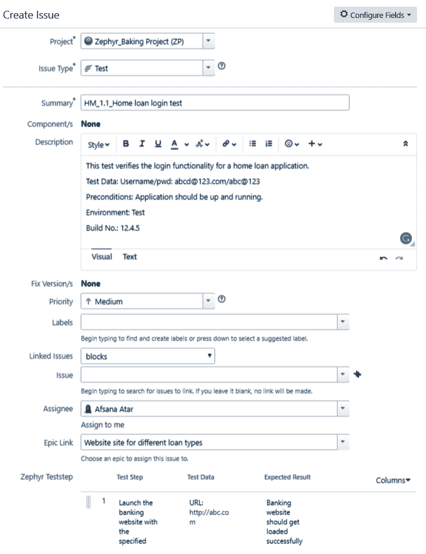
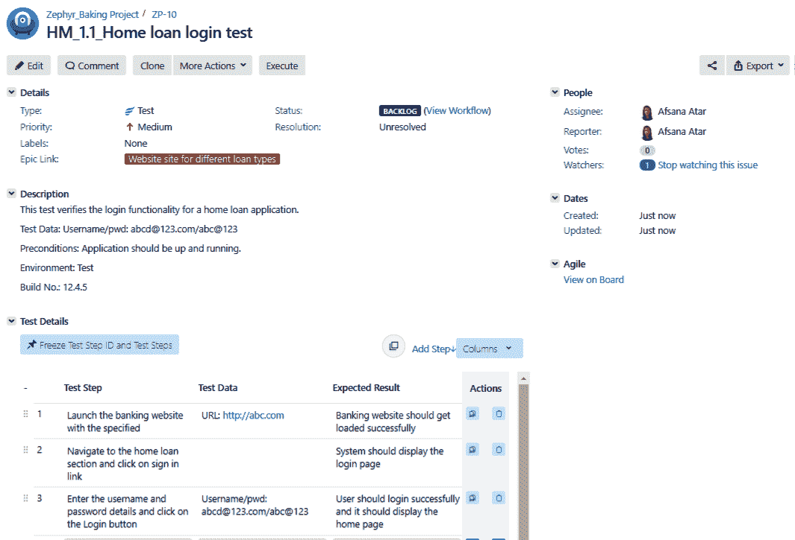
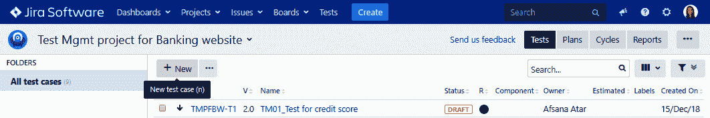
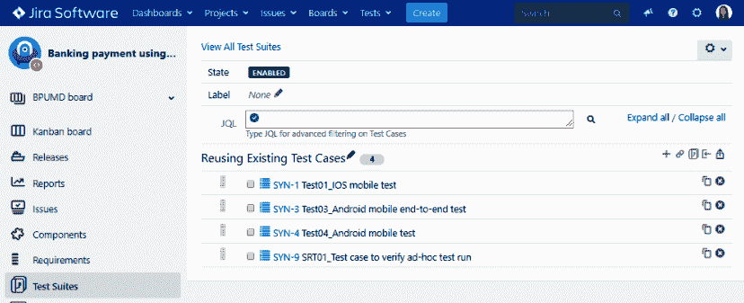
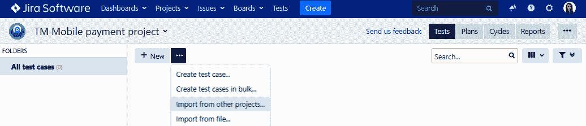
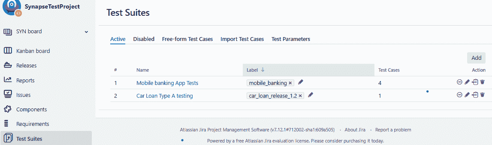
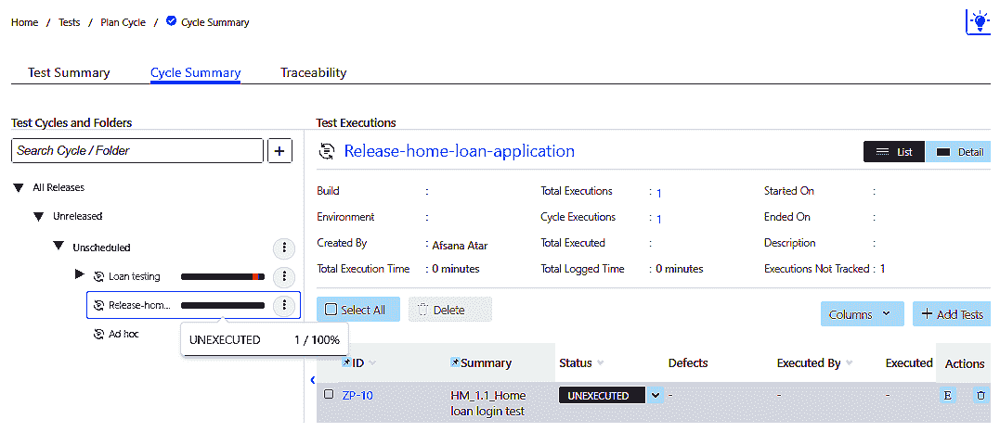
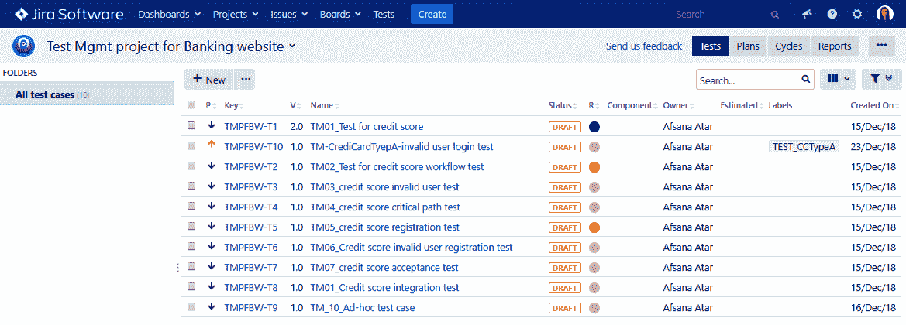

# 测试设计阶段

测试用例可以定义为一组用户（测试人员）的指令，以便他们可以在预定义状态下对应用程序进行测试。他们还需要预定义的测试数据来获得需求中提到的预期结果。没有测试用例，就无法进行测试，因为产品验证过程是从这些测试用例开始的。它们可以是自动化的或手动的，但目标是相同的。

在本章中，我们将涵盖以下主题，并详细了解测试设计阶段：

+   创建和维护测试用例

+   重用测试用例和测试数据

+   组织测试用例

# 创建测试用例

在测试团队了解项目需求之后，测试计划得到准备和批准。现在，测试团队可以开始**测试设计阶段**——这个阶段需要测试团队创建测试场景和测试用例。在涉及自动化测试的情况下，产品的可测试版本变得可用，这导致了测试脚本的创建。

测试用例应简要描述测试的目的、用户操作以及这些操作的预期结果。在创建测试用例时添加的详细信息如下：

| **测试用例字段** | **描述** |
| --- | --- |
| TC-ID | 测试用例 ID 帮助您唯一标识测试用例。通常，由测试...添加 |

# 对测试用例进行优先排序

有各种方法可以组织测试用例。您可以添加标签、项目名称、需求的详细信息，甚至测试套件的详细信息，以将它们分组到单个分支下。其中一个例子是**测试优先级**。测试优先级是组织测试用例的有效方式。测试优先级设置了验证所述功能的选定测试用例的重要性，通过定义决定执行顺序的紧急程度级别。优先级状态通常是以下之一：

+   **关键**：这些需要添加到项目验证迭代中，并且需要在迭代开始时执行。设计和执行关键测试用例有助于降低产品风险。

+   **高**：这些对于需求验证过程很重要。在验证了关键优先级测试用例之后，测试团队将转向高优先级测试用例。

+   **中**：这些包括值得验证的功能；但是它们的影响是中等的。因此，在紧张的执行计划中，团队会从列表中挑选出最相关的一些测试用例进行执行。

+   **低**：这对应用程序的功能影响很小，主要用于验证应用程序中的化妆变化。

# 测试用例状态

测试设计阶段的测试用例状态表示测试用例的当前状态。因此，对团队来说，根据测试用例状态采取行动是有帮助的。测试设计阶段的测试状态可以有所不同，可以是以下任何一种：

+   **草稿/进行中**：顾名思义，当测试用例仍处于设计阶段且不完整时，其状态标记为草稿。

+   **准备好审核**：一旦测试人员完成了测试用例中的详细信息，并且可以进行审核，状态可以设置为准备好审核。

+   **审核完成**：一旦测试用例经过同行审核，其状态可以更新为审核完成。

+   **准备/未执行/未运行**：测试用例可以标记为准备...

# 管理测试工件及其格式

测试用例可以以各种格式编写和捕获，例如存储在文本文件、Word 文档、Excel 工作簿中，或者利用专门的测试捕获工具。然而，最普遍的方式是在 Excel 表中创建测试用例，并将其加载到 HP ALM、Jira 等测试管理工具中。

除了详细的测试执行步骤之外，测试用例还可以附有各种支持文档或工件，例如以下内容：

+   测试人员想要在执行阶段参考的原型文档

+   用户凭据

+   测试执行所需的一组 SQL 查询和/或过程

+   关于预定作业的详细信息

+   可以在执行过程中参考的文档链接

此外，如果同一个测试用例已用于一个或多个发布版本，则它可能包含执行工件，例如在上一个发布版本测试期间生成的日志文件或截图。参考先前附加的工件并比较当前执行结果非常有帮助。

让我们看看如何使用 Jira 工具创建测试用例并添加相关细节。

# synapseRT

要在 synapseRT 中创建测试用例，测试专业人员需要按照以下步骤进行：

1.  从问题类型字段中选择测试用例选项。默认问题类型为故事；将其更改为测试用例并选择相关项目。

1.  选择问题类型后，是时候输入所有其他必需的细节，如摘要，描述，优先级，标签，受让人和史诗链接。一旦准备好创建测试用例，点击“创建”按钮。我们始终可以使用 Jira 问题右上角的“配置字段”图标配置要在此页面显示的字段：

1.  Jira 将成功创建...

# Zephyr

Zephyr 还将测试用例识别为另一种问题类型。要在 Zephyr 中创建测试用例，我们需要按照以下步骤进行：

1.  选择问题类型为测试。我们还需要输入其他必需的细节，如摘要，描述，优先级，关联问题，受让人，测试步骤与预期结果以及测试数据。单击“创建”按钮创建测试用例：

1.  创建测试用例后，您会看到它包含了我们输入的所有细节。与任何 Jira 工单一样，我们始终可以修改这些细节。我们还可以选择克隆测试用例，添加更多相关问题或需求，甚至通过单击“执行”按钮开始执行：

# 测试管理

要在测试管理工具中创建测试用例，我们需要按照以下步骤进行：

1.  首先，从主选项卡中导航到“测试”部分，然后单击“+新建”按钮添加新的测试用例。现在，我们需要在“银行网站测试管理项目”项目下添加一个新的测试用例：

1.  单击“+新建”按钮后，在“详细信息”选项卡中输入必需的细节，如测试用例名称，目标，前提条件（如果有），以及其他相关细节，如标签，状态，优先级，所有者等。

1.  现在，是时候添加测试步骤了。单击“测试脚本”选项卡以添加步骤，预期结果和相关...

# 在不同项目之间重用测试用例

现在我们已经学会了如何编写新的测试用例，让我们看看如何有效地重用现有的项目。

对于完全新的项目或发布，没有来自过去项目或发布的任何依赖或相关工件，测试团队必须为所有发布的功能请求设计所有测试用例。然而，随着产品的发展和多次发布，一些常见的未触及的功能保持稳定。这为将来的发布重用测试用例提供了机会。 

有各种原因会让您想要重用现有的测试用例：

+   如果有新团队成员加入团队，现有的测试用例可以帮助他们通过查看现有的测试用例来熟悉产品。

+   它减少了为先前版本中未更改和已经验证的功能创建所有测试用例的工作量。测试人员可以简单地在当前迭代中提取现有的有效测试用例。

+   它为测试人员提供了一个基准，附带了附件，以便比较应用程序的功能。

+   通过比较先前版本的执行结果，可以帮助找到缺失的功能。

+   它有助于回归测试和验证在目标发布中未更改的应用程序部分。

+   它帮助团队了解可能与相关测试用例相关联的现有报告的缺陷。这为测试人员验证上次发布时出现故障的功能提供了方向。

+   对于已存在相关测试用例的相同功能，审查测试用例可以节省时间和精力。

+   当其他团队想要参考现有的测试用例了解先前发布的产品或服务时，它也可以帮助他们。

+   如果新项目作为先前产品的扩展引入，团队可以重用现有的测试用例进行集成或兼容性测试。

让我们看看如何通过使用 Jira 插件重用现有的测试用例并将它们链接到多个项目。

# synapseRT

我们可以通过将现有测试用例添加到不同项目下的测试套件中来重用 synapseRT 中的现有测试用例。如下图所示，测试用例`SYN-1`、`SYN-3`和`SYN-4`属于`SynapseTestProject`，已添加到`Reusing Existing Test Cases`测试套件中，该测试套件是`Banking payment using mobile devices project`的一部分：

# Zephyr

Zephyr 不支持从一个项目复制测试用例或测试周期的功能。但是，为了在另一个项目中重用现有的测试用例，可以复制测试用例的结构，这只会克隆问题结构。

如果您想探索这个选项，请随时参考以下页面：[`wiki.almworks.com/display/structure/Copying+a+Structure`](https://wiki.almworks.com/display/structure/Copying+a+Structure)。

# 测试管理

测试用例可以在测试管理工具中复制到另一个项目，以便重用。要将它们添加到新项目中，我们需要按照以下步骤进行：

1.  转到测试选项卡，单击省略号。选择**从其他项目导入**...的选项。如下图所示，我们正在将测试用例添加到一个新项目，即`TM Mobile payment project`：

1.  现在，从项目下拉菜单中，选择要复制测试用例的项目名称。一旦选择了项目名称，它就会显示该项目下存在的测试用例。选择所有测试用例的复选框...

# 组织主测试套件和子测试套件

在创建主测试套件和子测试套件以组织测试用例时，有各种因素需要考虑。主测试套件可以基于项目名称或模块创建，添加子测试套件有助于根据测试类型、环境、用户角色等进一步对其进行分类。如测试创建表中所述，我们可以使用一个或多个字段对其进行分类，例如项目名称、需求 ID、测试验证环境、构建编号或测试类型。

最好的做法是在创建测试用例时立即添加，而不是批量整理它们。

Jira 插件还为我们提供了根据我们的标准组织测试用例的灵活性。现在让我们详细看一下这一点。

# synapseRT

关于项目的测试用例可以从“测试套件”选项卡中查看。如下截图所示，在“测试套件”选项卡的活动部分中，我们可以看到`SynapseTestProject`项目的所有活动测试套件。我们可以选择在同一项目中不同的测试套件之间克隆测试用例的选项：

要查看所有子测试套件和测试用例，请点击该测试套件的编辑图标。如下截图所示，我们在编辑模式下有一个测试套件视图。它有两个子测试套件，共有四个测试用例：

# Zephyr

在 Zephyr 中，当前项目的所有测试用例都在“测试”选项卡下按照不同的周期和子周期进行组织。如下截图所示，我们可以通过选择测试周期来查看测试用例的数量和它们当前的执行状态：

# 测试管理

在测试管理工具中，所有的测试用例都可以在“测试”选项卡下进行组织。以下截图显示了所有测试用例都在“所有测试用例”文件夹下，然后可以进一步组织在主测试套件和子测试套件下：

# 总结

在本章中，我们学习了通过为当前项目创建和组织测试用例以及在不同项目下重用它们来进行测试设计阶段。测试用例描述了测试人员需要执行的逐步操作以获得他们期望的结果。设置当前数据或适当的环境对于获得准确的结果至关重要，因为环境和测试数据的任何更改都可能改变这些结果。根据需要在不同项目中重用这些测试用例可以最大程度地减少创建和审查测试用例所花费的时间和精力。

我们看到了如何使用 Jira 插件在项目中跨项目重用测试用例。在测试存储库中有各种组织测试用例的方法。我们可以根据测试套件、子测试套件、标签、需求 ID 等进行分类。我们看到了如何使用 Jira 插件为项目创建这些测试存储库。

在下一章中，我们将更详细地了解测试执行阶段以及如何使用 Jira 进行管理。
