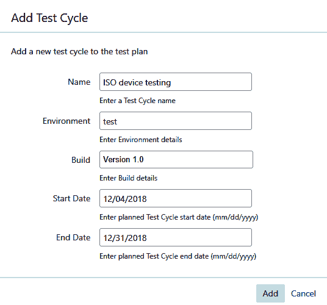
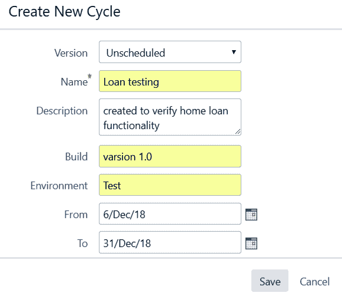
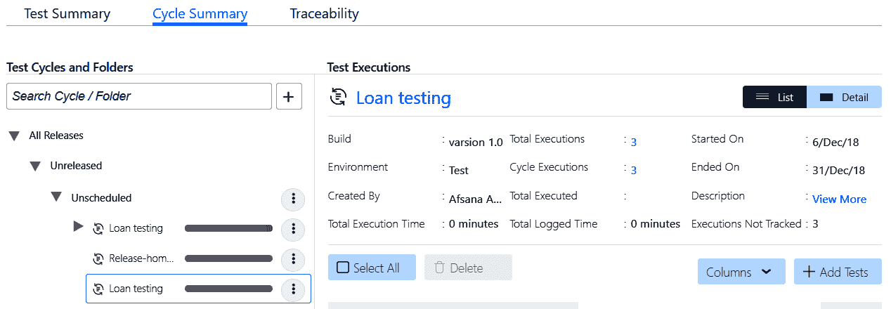
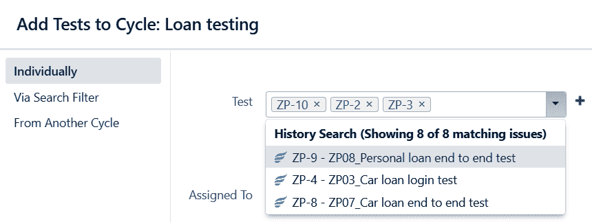
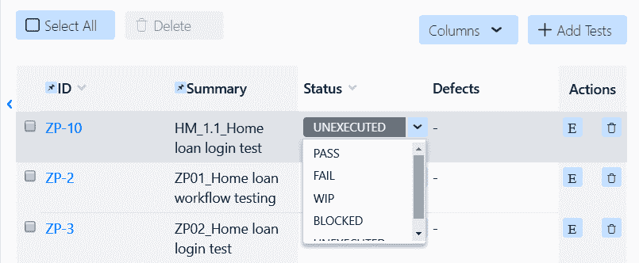
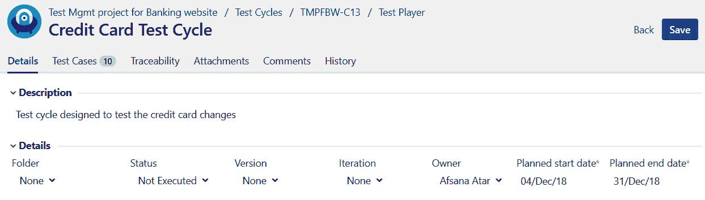
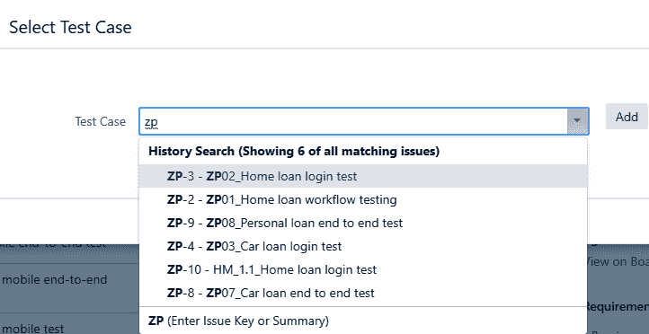
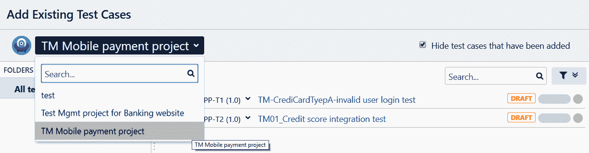

# 第七章：测试执行阶段

现在我们了解了测试设计阶段是什么，是时候进入下一个阶段了，即测试执行阶段。这是软件测试生命周期中的一个阶段，在这个阶段，构建代码使用在测试设计阶段设计和创建的测试用例进行验证。

在开发团队忙于构建应用程序代码的同时，测试团队开始准备测试设计和测试周期准备阶段。它还利用这段时间准备测试环境和测试数据。然后团队开始执行测试用例，但只有在最新的代码更改部署到测试环境后或者第一个可测试组件被部署进行测试后才开始。一旦测试...

# 定义测试周期

测试周期的设计基于测试团队正在处理的项目类型。在设计测试周期时，测试团队执行以下任务：

1.  验证测试覆盖范围：这确保测试执行阶段包括验证所有需求所需的所有测试用例。

1.  估计工作量：基于需求的复杂性、测试用例的优先级、分配资源的当前技能水平、测试工具的可用性以及范围和分配的时间，测试团队估计完成测试执行所需的时间。

1.  定义迭代：如果在初始测试执行迭代期间发现了多个缺陷，这对应用程序的功能产生了巨大影响，测试团队可以随时添加另一个测试执行迭代。根据循环次数、缓冲时间、缺陷重新测试时间和预定会议，测试执行的估计可能会有所不同。

根据定义和隐含的客户需求，测试团队可以设计各种类型的测试周期/迭代。一些测试用例也应设计为冒烟测试和回归测试周期的一部分：

+   冒烟测试周期：此周期使测试人员能够在执行一小组测试用例后检查当前部署的版本是否可测试。例如，在银行网站的情况下，一些基本测试，如启动应用程序、浏览各种选项卡、单击可用链接以及登录和退出应用程序，可以帮助您了解应用程序是否正常工作。如果应用程序在启动后立即崩溃或在单击个人银行链接后崩溃，团队可以报告一个缺陷。然后，开发人员可以立即开始修复。冒烟测试有助于确保已在请求的测试环境中部署了正确版本的构建。有时，在部署阶段，构建可能会失败，开发人员可能需要回滚更改并重新部署新构建。在这种情况下，冒烟测试很有用，因为它可以确定当前部署的构建是否具有所有基本功能可供测试，并且当前部署的构建中没有文件或功能缺失。

+   回归测试周期：此周期用于识别新添加/实施的需求对产品或应用程序现有可行解决方案的任何不利影响。我们还可以使用自动化工具安排回归测试，并根据需要收集结果。

在第四章中，《测试管理方法》，我们看了如何将测试周期添加到测试计划中。在接下来的部分中，我们将更详细地了解如何向测试周期添加和移除测试用例，以及如何在测试执行阶段开始、完成和中止测试周期。

# 从同一项目添加测试用例到测试周期

由于我们已经完成了必要的测试用例，它们已经准备好使用，我们可以将它们添加到测试周期中。从当前项目添加测试用例是通过拖放或将测试用例链接到新创建的测试周期中完成的。让我们看看如何创建和初始化测试周期。一旦我们创建了测试周期，就可以向其中添加测试用例，更新测试周期，然后开始测试执行阶段。

# 初始化测试周期

测试用例被分组形成测试周期或测试迭代。在执行周期之前，重要的是要检查我们是否已经添加了完整的测试用例集，以验证功能请求。在初始化测试周期之前，您应该检查以下内容：

+   测试将要执行的当前构建版本

+   测试将要执行的测试环境

+   执行开始和结束日期

+   测试用例应该根据其优先级进行组织

+   测试用例应该分配给负责执行测试用例的测试人员

让我们看看如何使用 Jira 插件创建和执行测试周期。

# synapseRT

在 synapseRT 中，一旦测试计划已经创建并准备就绪，因为已经添加了测试用例，我们可以创建测试周期：

1.  单击“测试周期”部分的“添加”按钮，输入测试周期的详细信息，例如名称、环境、开始日期和结束日期，如下面的屏幕截图所示：

1.  创建周期后，我们可以选择将其状态从草稿更改为开始、完成或中止。我们还可以查看和编辑其详细信息。要修改其详细信息，请单击新创建的测试周期旁边的“编辑”，如下面的屏幕截图所示：

1.  添加测试周期后，我们可以看到所有的测试用例...

# Zephyr

与 synapseRT 一样，Zephyr 不需要测试计划或测试用例来创建测试周期。按照以下步骤创建测试周期：

1.  在 Zephyr 中创建测试周期时，我们可以更加具体地设置其详细信息，例如版本、描述、名称、开始和结束日期等。这些详细信息帮助我们区分不同的测试周期：

1.  如下面的屏幕截图所示，一旦我们添加了一个测试周期，它将显示在“周期摘要”选项卡下。该选项卡显示了在该测试周期下添加的测试用例的总数，其创建者，总执行次数，开始和结束日期等信息：

1.  通过单击“+添加测试”按钮从测试周期中添加和删除测试用例。我们还可以选择按其票号选择测试用例或从另一个测试周期中添加测试用例的选项。如下面的屏幕截图所示，我们已经使用它们的票号添加了三个测试用例：

1.  在 Zephyr 的情况下，我们可以在测试用例级别更新测试状态，也可以在测试步骤级别更新测试状态。以下屏幕截图显示了在测试用例级别更新测试用例的执行状态。默认情况下，Zephyr 具有未执行、通过、失败、进行中和阻塞的测试执行状态：

# 测试管理

与 Zephyr 一样，测试管理工具不需要测试计划或测试用例来创建测试周期：

1.  我们可以通过导航到“测试|周期”部分来添加测试周期。一旦我们单击“新建”按钮添加新周期，我们将看到以下详细信息屏幕，在这里我们可以输入有关此周期的详细信息，例如文件夹、状态、版本、迭代、所有者、计划开始日期和计划结束日期、描述等：

1.  一旦我们添加了新的测试周期，我们将获得其唯一标识符，以便我们可以将其与其他周期区分开。所有周期都可以在“周期”选项卡下查看。在这一部分，我们...

# 测试执行状态

测试执行状态定义了其在执行阶段的当前状态。以下是最常用的测试执行状态：

+   **未运行/未执行**：当测试用例已添加到测试周期中时，将显示未运行或未执行的测试状态。然后根据执行结果更新其状态。

+   **通过**：如果测试中提到的所有测试步骤满足预期结果，其状态可以标记为通过。

+   **失败**：如果任何测试步骤未能满足预期结果，那么可以将其标记为失败。

+   **不适用/不在范围内**：有时，测试用例不需要作为当前测试周期的一部分执行。在这种情况下，测试执行状态可以更新为不适用。

+   **阻塞**：如果一个未解决的缺陷影响了一个或多个测试用例的测试，那么相关的测试用例可以被标记为阻塞，并与更新的缺陷号相关联。

如果在测试用例的执行过程中的任何时候测试步骤失败，那么整个测试用例的状态将被标记为失败。此时，测试人员可以选择在步骤级别或测试用例级别创建缺陷并将其链接到测试用例。

此外，在每次测试运行期间，测试工具会创建一个新的测试运行实例。因此，相对容易比较同一周期内测试的测试执行结果。

# 组织测试周期

就像我们可以对测试用例进行优先排序一样，测试周期也可以根据其优先级进行排序。顺序排列和重新排序测试周期通常可以节省重新测试一个或多个测试用例，甚至整个周期的时间和精力，并有助于在测试执行周期的初始阶段验证最完整或最紧急的需求。

这有助于早期发现缺陷，并为团队提供足够的时间来修复和重新测试任何更改。随着执行的进行，测试团队更新所有项目利益相关者有关当前执行状态的信息，其中包含有关此版本考虑的测试用例总数，标记为通过的测试用例数量，...

# 完成测试周期

在确认关闭测试周期之前，需要您查看以下检查表：

+   该周期中的所有测试用例都已标记为通过或不适用

+   与测试用例相关的所有缺陷都已修复并重新测试，并且相关的测试用例已通过

+   所有作为文本执行一部分的工件都已生成并附加到相关的测试用例

+   所有生成的工件，包括测试报告，都满足测试计划的退出或测试完成标准

+   测试执行报告已生成并与项目利益相关者共享，并已获得相关审批者的批准

一旦完成了这个检查表，测试团队可以正式宣布选择的测试周期/迭代或执行阶段的关闭。

# 从不同项目添加测试用例到测试周期

最好重用以前版本或不同项目中的测试用例。我们可以将它们添加到当前项目并将其用作当前周期的一部分。让我们看看如何将不同项目中的测试用例添加到测试周期中。

# synapseRT

我们可以从另一个项目中添加测试用例到测试周期中。要做到这一点，点击测试用例中的“添加测试用例”按钮，并搜索所需的测试用例。正如您在以下截图中所看到的，我们通过搜索其 ID 简单地从另一个项目中添加测试用例：

# 风神

我们可以从另一个项目中向 Zephyr 中添加测试用例。导航到测试周期，然后点击“添加测试”按钮；您将看到以下屏幕。现在，通过它们的票号从另一个项目中搜索任何测试用例，并将它们添加到项目中：

# 测试管理

在将测试用例添加到当前测试周期时，测试管理为您提供了选择必要项目的选项。当前项目会被默认选择。我们可以从其他项目中选择要添加测试用例的项目。选择后，我们可以看到所有可供我们添加到当前测试周期的测试用例。选择所需的测试用例，然后点击“添加”按钮：

# 摘要

在本章中，我们学习了如何使用 Jira 插件创建和执行测试周期。测试执行阶段的测试周期可以包括开始和结束日期、指定的测试人员、构建编号等详细信息。在开始测试周期之前，可以修改测试周期以添加或移除当前项目中的测试用例。测试用例也可以从之前的版本中重复使用，作为当前版本的一部分。

在下一章中，我们将讨论缺陷管理的重要性，并看看 Jira 如何帮助我们有效地跟踪和管理缺陷。
