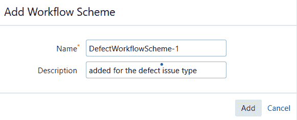
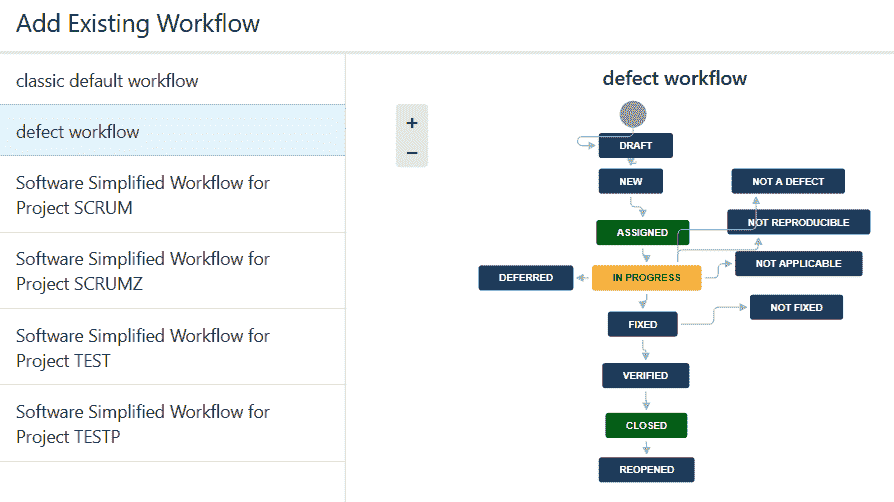
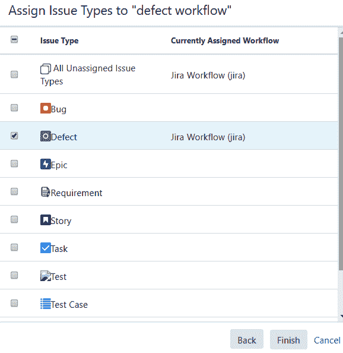
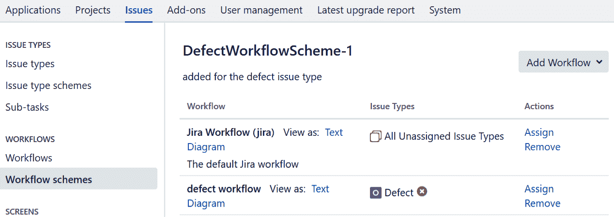
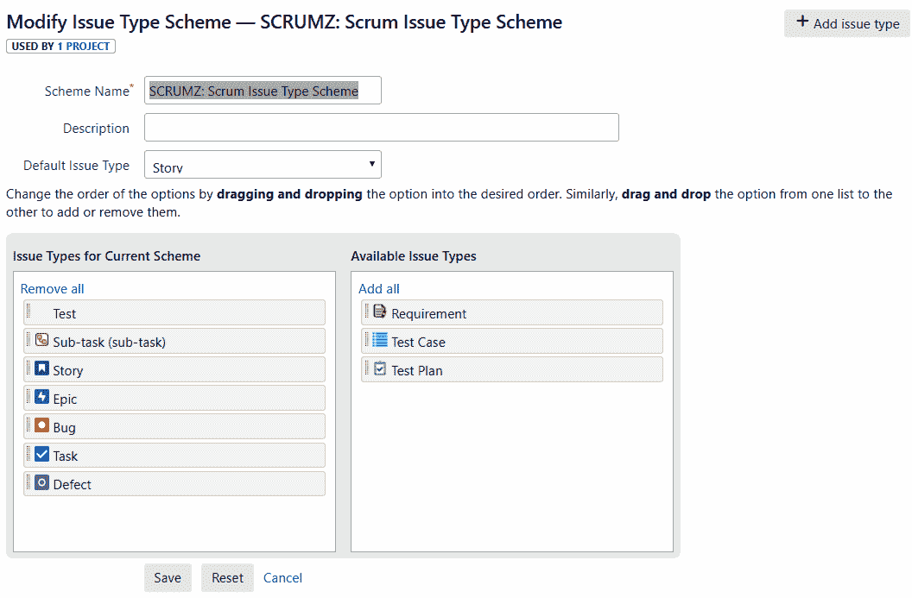
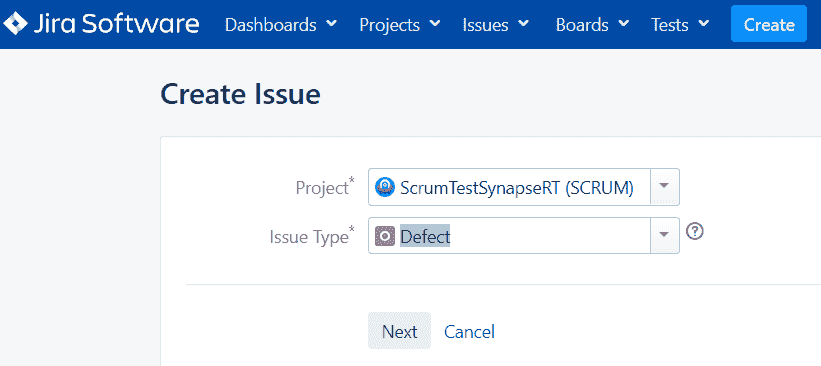
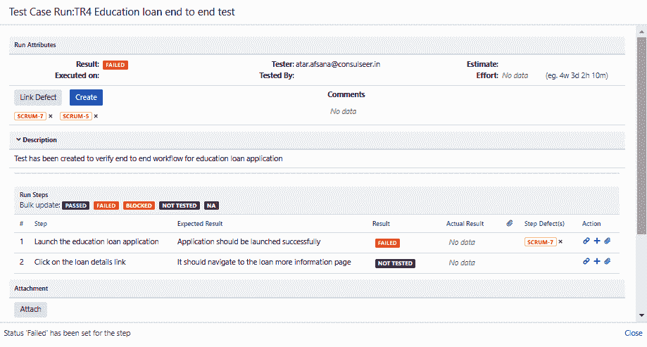
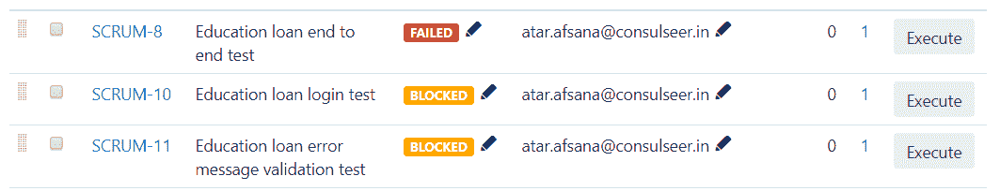
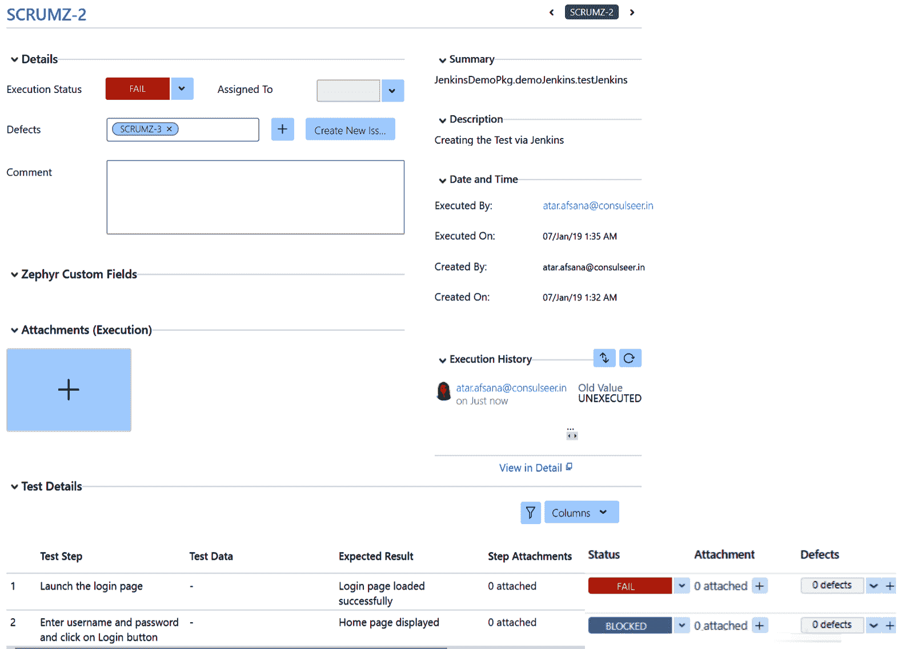
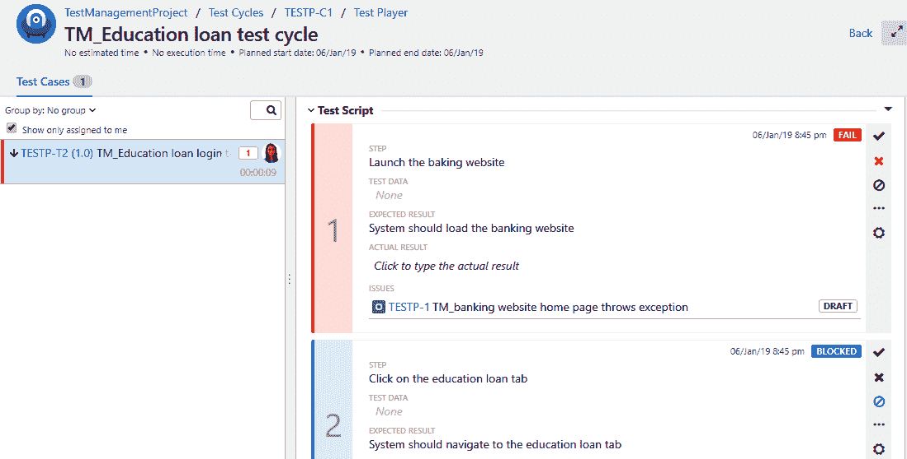

# 第八章：缺陷管理阶段

只有生成令人满意的结果且没有任何故障的软件产品才能受到信任。无效的结果可能会对最终用户产生负面影响。有缺陷的产品会让消费者感到不满并引起沮丧。因此，及时发现故障或问题可以帮助开发人员交付高质量的产品。然而，我们需要了解如何对缺陷进行分类，以及有效报告缺陷的方法，以确认缺陷是否已解决。

在本章中，我们将涵盖以下主题：

+   理解记录缺陷的重要性

+   创建新缺陷

+   将现有缺陷链接到测试用例

我们还将看到 Jira 如何帮助我们有效地跟踪和管理缺陷。

# 理解记录缺陷的重要性

在理解缺陷的重要性之前，让我们先了解一下在软件行业中缺陷实际上意味着什么。当团队开始处理项目的某个部分或组件时，他们会根据预定义的一组要求或条件开始构建它。同样，当测试团队创建测试用例时，他们也是基于相同组件的相同要求。

现在，在测试执行阶段，测试团队开始逐步与测试环境中的实际产品进行交互验证，因为最终用户将执行相同的操作，并将其与预期结果进行比较。如果结果匹配，测试人员可以通过所选的步骤...

# 创建新缺陷

简而言之，与预期结果的偏差被视为缺陷。在行业中还有一些术语可以互换使用来定义问题，例如故障、错误或错误。然而，无论称呼如何，任何形式的问题在推出产品之前都必须得到解决。

软件缺陷可能是以下原因的结果：

+   基于无效或不完整的要求构建了一个功能

+   需求文件中规定了一个功能，但缺少了相应的软件

+   代码中使用的函数未返回预期结果，或者在无限循环中运行，或者接受无效的数字/输入参数类型

+   用户未受限制地执行无效/未经授权的操作

+   错误消息未按预期显示

+   未满足明示和隐含的要求

+   文本和图像无法阅读

+   无效的代码被合并到构建中，并部署到测试环境中

一旦确认应用程序展示的行为与规定的要求不符，并且开发团队也确认了这一点，测试团队就可以将其标记为缺陷，并在测试管理系统中记录。我们将在接下来的章节中看看如何使用 Jira 插件创建和记录缺陷。

现在我们知道了什么是缺陷，让我们开始缺陷创建过程。测试管理工具可用于报告新发现的缺陷。跟踪缺陷并帮助测试人员与团队顺利合作是有帮助的。在创建新缺陷之前，有必要检查系统中是否已存在类似的缺陷以及其当前状态。只有在可重现的情况下才能成功报告和修复缺陷；因此，在将其记录在系统中之前，有必要多次重现它。

建议在记录任何缺陷之前遵守以下检查表。虽然这是一个常见的检查表，但可以根据您的要求添加更多步骤：

+   需求文件中指定的应用程序行为与实际结果不同

+   验证测试是否在正确的环境中进行，并且具有预期的配置

+   检查应用程序的构建版本是否正确，并且已根据测试要求配置

+   检查应用程序的所有必需服务是否正常运行

+   检查应用程序是否与指定的操作系统、浏览器或第三方应用程序兼容

+   检查测试是否是从具有有效测试数据的应用程序的指定状态执行的

+   检查用户角色是否具有执行测试用例中提到的所有必要权限

+   检查应用程序、服务器和数据库之间是否存在连接

在缺陷中添加更多细节有助于开发人员在执行根本原因分析时，识别特定代码部分的初始位置以开始调试，而不是检查整个产品或模块。让我们看看在记录缺陷时应添加哪些细节。

有关缺陷管理的更多信息，请查看位于[`www.red-gate.com/simple-talk/dotnet/software-delivery/a-primer-on-defect-managment/`](https://www.red-gate.com/simple-talk/dotnet/software-delivery/a-primer-on-defect-managment/)的缺陷管理文章。

# 如何使用 Jira 插件创建缺陷

通常，测试管理工具提供一个模板，其中包含一些默认字段来记录缺陷。但是，我们总是可以更详细，例如通过指定以下内容：

+   用于识别缺陷的唯一标识符

+   缺陷的摘要

+   重现缺陷所需执行的操作

+   实际结果与预期结果之间的差异

+   用于执行测试的测试环境

+   预置条件，例如被测试应用程序的状态

+   被测试应用程序的版本及其配置详细信息

+   部署在测试环境中的代码构建版本

+   用于执行测试的测试数据

+   缺陷创建日期

+   缺陷的当前状态

+   名称...

# 在 Jira 中设计和管理缺陷工作流程

缺陷工作流程可以定制为具有其自己的一组缺陷问题类型可以经历的状态。组织可以拥有自己的工作流程。让我们看看缺陷应该经历的一些推荐状态。这也被称为缺陷生命周期：

+   **草稿**：当测试人员仍需要提供与之相关的更多细节时，可以将缺陷设置为草稿

+   **新/打开**：当所有细节都已添加并且准备分配给开发人员时，可以为缺陷设置此状态

+   **已分配**：一旦项目团队确定了将处理记录的缺陷的开发人员，缺陷的状态可以设置为**已分配**，并应分配给相关的开发人员

+   **进行中**：一旦缺陷被分配，开发人员可以将缺陷状态更改为**进行中**，以指示开发人员正在努力解决问题

+   **已修复**：一旦实施了所需的代码更改并且已供测试人员验证更改，开发人员可以将缺陷状态更改为**已修复**

+   **未修复**：如果缺陷仍然可以重现，并且修复不符合要求，则测试人员将缺陷状态设置为**未修复**

+   **关闭**：如果已修复的缺陷按预期工作并且符合规定的要求，则测试人员关闭缺陷并将其状态设置为**关闭**

+   **重新打开**：如果先前已解决的缺陷现在再次出现，则测试人员可以将缺陷状态更改为**重新打开**

+   **不适用**：如果新创建的缺陷与已验证的更改无关，则开发人员可以将缺陷状态更改为**不适用**

+   **非缺陷**：如果应用程序或功能的行为符合预期，则开发人员可以将缺陷状态更改为**非缺陷**

+   **无法重现**：如果开发人员无法在相同的环境和构建版本中重新创建缺陷，则其状态可以更新为**无法重现**

+   **重复**：如果系统中已经存在类似的缺陷，则开发团队可以将缺陷状态更新为**重复**

+   **已验证**：如果测试人员已验证了缺陷的代码更改，那么其状态可以标记为“已验证”。

+   **待定**：如果由于环境、测试数据或资源不可用而导致缺陷验证暂停，那么其状态可以更新为“待定”。

+   **已延迟**：如果团队决定在即将到来的迭代或发布中修复缺陷，则可以将缺陷状态标记为“已延迟”。

既然我们现在熟悉了缺陷工作流程，让我们使用 Jira 创建一个：

1.  为了在 Jira 中创建自定义工作流，我们需要添加工作流方案并将自定义工作流添加到此方案中。添加工作流方案的选项可在“管理” | “问题” | “工作流” | “工作流方案”下找到。为此缺陷工作流方案指定一个名称，例如`DefectWorkflowScheme-1`，添加描述，然后点击“添加”按钮创建方案：

1.  如下截图所示，定制的缺陷工作流具有与我们之前讨论过的类似的各种状态。此工作流已分类为缺陷工作流，将添加到工作流方案中：

1.  选择现有工作流后，点击“下一步”按钮。下图显示了要应用于此工作流的问题类型。选择“缺陷”问题类型，然后点击“完成”按钮，如图所示：

1.  添加缺陷工作流后，可以从项目设置 | 问题 | 工作流部分查看。如下截图所示，当前项目有两种工作流，即 Jira 工作流和缺陷工作流。缺陷工作流字段有一个关联的问题类型为缺陷。在这里，它会提示您发布更改，一旦发布，新添加的工作流将添加到缺陷问题类型中：

1.  现在，转到项目 | 项目设置 | 问题部分。在这里，您需要自定义项目以具有缺陷问题类型。如下截图所示，我们已将缺陷问题类型添加到当前方案的问题类型部分，以便将其添加到当前项目方案中：

1.  点击保存，我们的缺陷工作流已创建。

# synapseRT

synapseRT 还有其他问题类型，包括需求、测试用例和测试计划，但缺少缺陷问题类型。从前面的部分，我们现在知道如何将带有自定义工作流的缺陷问题类型添加到我们的项目中。添加问题类型后，请按照以下步骤记录缺陷：

1.  由于缺陷是另一种问题类型，点击“创建”按钮创建一个缺陷，选择相关项目，然后选择问题类型为缺陷，如下截图所示。然后，点击“下一步”按钮：

1.  这将加载带有标题“创建问题”的问题描述页面，如下所示...

# 将现有缺陷链接到测试用例

建立缺陷与测试用例之间的关系有助于确定缺陷对当前测试用例执行的影响。如果单个缺陷影响多个测试用例，那么测试人员可以将相同的缺陷链接到所有受影响的测试用例，并将测试用例状态更新为“已阻塞”。

除了影响分析之外，它还有助于生成可追溯性矩阵，其中需求与测试用例相关联，测试用例与缺陷相关联。缺陷可以在测试用例级别或测试步骤级别与测试用例相关联。如果一个测试用例有更多的测试步骤，并且对同一个测试用例观察到多个缺陷，那么在这种情况下，将这些缺陷在测试步骤级别相关联更有意义，以确定错误具体发生在哪个步骤。

# 根据缺陷更改测试用例状态

每当测试团队记录一个缺陷并将其链接到相关的测试用例时，测试用例的状态将更新为失败。现在，测试用例状态将保持为失败，直到相关的缺陷被关闭或推迟。一旦缺陷关闭，相关的测试用例状态将更新为通过。

然而，如果在测试步骤级别链接了缺陷，那么正常工作的步骤将被更新为通过。观察到缺陷的步骤将被更新为失败，而测试人员无法执行的剩余步骤将保持默认的未执行或未运行状态。

让我们使用 Jira 插件将缺陷链接到测试用例。

# synapseRT

synapseRT 提供了在测试用例级别或测试步骤级别链接缺陷的选项。在 synapseRT 中选择任何测试用例并创建一个临时运行。在执行过程中，它会创建一个新的测试运行，并显示在运行属性部分下链接现有缺陷或创建新缺陷的选项。我们还可以选择在测试步骤级别更新测试状态。

在下面的截图中，步骤一已标记为失败，并且在测试步骤级别有一个关联的 SCRUM-7 缺陷。然而，在测试用例级别有两个缺陷，SCRUM-7 和`SCRUM-5`。由于这里有一个测试步骤失败，整个测试用例的状态被更新为失败：

如果在测试周期中由于单个缺陷而阻塞了多个测试用例，那么可以将相同的缺陷链接到测试用例，并将它们的状态更新为阻塞。以下截图展示了这种行为：

总共有三个测试用例。其中一个由于缺陷而失败，而相同的缺陷正在阻止当前测试周期中剩余的两个测试用例。

# Zephyr

在 Zephyr 的情况下，一旦我们开始执行所选测试周期中的测试用例，我们可以在测试用例级别或测试步骤级别更新测试状态。

在执行测试时，我们还可以选择在测试步骤级别或测试用例级别链接缺陷。如下截图所示，由于有一个步骤标记为失败，整个测试用例的状态已更改为失败。以下步骤标记为阻塞。在缺陷部分，它有一个与之链接的缺陷`SCRUMZ-3`：

完成此运行后，可以在测试周期级别查看测试执行的状态及其链接的缺陷。...

# 测试管理

测试管理工具还提供了在测试步骤和测试用例级别链接缺陷并更新测试步骤状态的选项。

如下截图所示，测试用例`TESTP-T2`在步骤 1 处标记为失败，并且其 ISSUES 部分指示了链接的缺陷。在我们的情况下，这是`TESTP-1`。剩下的步骤被标记为阻塞：

# 摘要

在本章中，我们学习了缺陷创建和管理过程。我们学会了识别缺陷并了解它们可能的根本原因。我们还看了在报告缺陷之前应执行的初步检查，以及在系统中记录缺陷时应提供的详细信息。

然后，我们学会了通过具有自定义问题类型（如**缺陷**）和自定义工作流的 Jira 来创建缺陷。为了创建可追溯性，我们学会了如何在测试执行阶段通过 Jira 插件将缺陷链接到相关的测试用例，无论是在测试步骤还是测试用例级别。

在下一章中，我们将讨论如何使用 Jira 问题来跟踪项目需求。...
