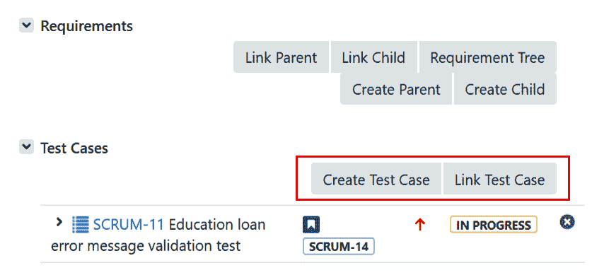
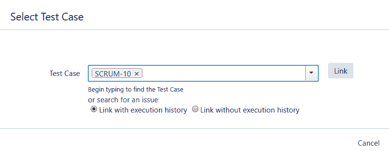
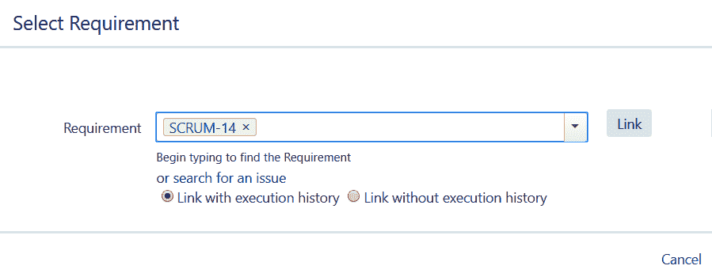
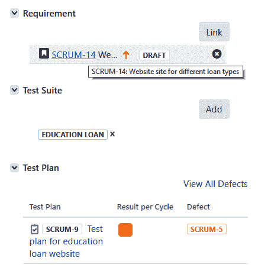
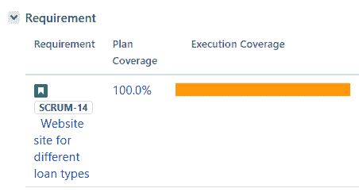
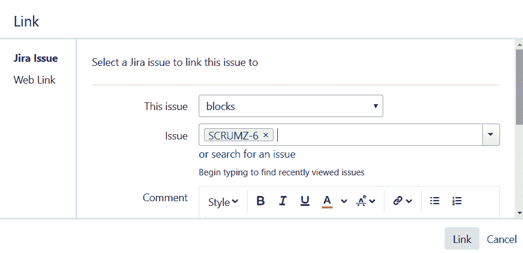
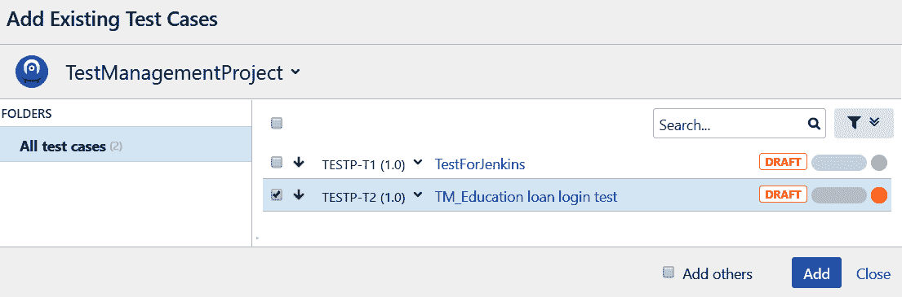
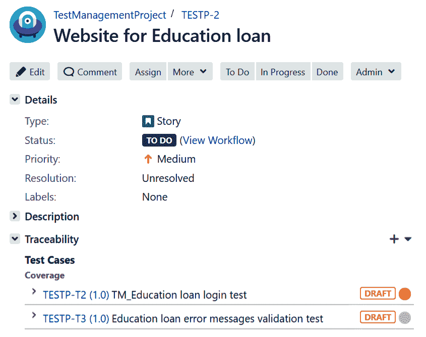
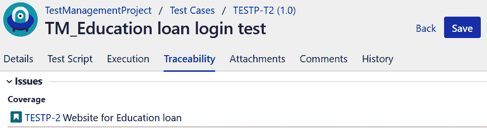

# 需求管理

需求是与项目相关定义的客户需求。它们使用 Jira 中的需求编号或工单编号进行跟踪，以监控和控制项目的进展。将需求与测试用例关联帮助项目团队估计不仅在资源方面所需的工作量和验证相关需求所需的时间，还有助于了解在执行阶段哪些需求存在更多缺陷。

在本章中，我们将涵盖以下主题：

+   将 Jira 问题类型创建为需求

+   建立需求和测试用例之间的关系

我们还将看看 Jira 如何帮助我们使用 Jira 问题定义项目需求... 

# 将 Jira 问题类型创建为需求

在 Jira 中，我们有默认的问题类型，如史诗、故事、任务、子任务和错误。这些问题类型使我们能够根据项目的要求灵活定义自己的问题类型。但是，每种问题类型都可以被视为一个需求。一旦需求在系统中定义和记录，就变得容易跟踪和管理它们。我们在第三章中学习了如何在 Jira 中定义需求，*了解使用 Jira 进行测试的组件*。现在，让我们在 Jira 中创建它们。

# 创建需求

Jira 有一组预定义的字段来创建 Jira 工单。此外，我们可以根据所选的问题类型添加自定义字段。任何需求问题类型通常应包含以下内容：

+   团队预期完成的需求或任务的目的

+   将复杂需求细分为更多细节和规格的详细描述

+   问题类型的优先级

+   问题类型的当前状态

在创建需求问题类型时添加了以下细节：

| **需求字段** | **描述** |
| --- | --- |
| 需求 ID | 此字段有助于唯一标识需求。大多数情况下，业务需求由业务分析师准备... |

# 对需求进行优先排序

需求优先级是基于向最终用户交付功能的需求和紧急性进行的。在对需求进行优先排序时，项目团队还考虑其复杂性和完成所请求任务所需的工作量。项目团队可以根据优先级采取行动。

例如，如果功能请求具有关键优先级，这意味着其重要性非常高，时间非常短。因此，为了在短时间内实现上述任务所需的所有事物，如数据、工具、权限、技能和资源，都在短时间内获得，并且项目团队努力按照设定的时间表实现其目标。

Jira 默认为任何问题类型分配了四种不同的优先级类型：

+   **关键**：这些是非常紧急的需求，对业务影响很大。这些方面需要在最短时间内解决并修复，以便紧急交付给最终用户。

+   **高**：这些是需要尽快解决和处理的需求。但是，时间通常由项目利益相关者指定。

+   **中等**：这些是中等优先级的需求，它们在交付所有关键或高优先级项目后进行处理，因为它们的紧急程度是中等的。

+   **低**：低优先级的需求紧急性较低。因此，它们是开发人员优先级列表中要处理的最后一项。有时，具有低优先级状态的任务/子任务也可以移至另一个发布或冲刺，如果项目团队需要更多时间专注于当前发布/冲刺中最关键/高优先级的项目。

# 需求状态

需求状态帮助项目团队了解其当前状态，并为下一步行动做好准备。设置状态是工作流程的一部分。因此，组织可能会有一个可以根据项目或问题类型而有所不同的定制状态。

一般来说，以下状态对需求问题类型是有用的：

+   草案：顾名思义，如果有进一步需要添加的细节，可以使用这个状态。一般来说，业务分析师负责创建业务需求。如果不是，那么项目负责人会在系统中创建它们。

+   草稿完成：一旦所有需求细节都被添加，它们的状态可以被更新...

# 管理需求工件

需求可以以各种格式创建，同时可能存在不同类型的工件，包括以下内容：

+   项目章程：这启动了项目。

+   项目批准的需求文件：包含高层次的批准需求。

+   项目的高层次和低层次设计文档：这些详细定义了项目架构。

+   项目计划：这包括有关范围、时间、成本、预算和其他相关计划的详细信息，包括变更管理策略计划和资源分配计划。它还定义了每个阶段结束时可接受的可交付成果清单及其格式。

+   项目相关的第三方工具文档：这些将与当前项目相关，例如产品信息、教程或需要访问工具的用户权限。

+   风险缓解策略和行动计划：用于了解项目风险以及减轻风险所需的步骤。

+   知识库存储库：其中包含与当前项目相关的所有文档，以及项目团队可以使用的任何其他相关项目。例如，以前发布的经验教训和回顾文件可以被项目团队参考。

+   培训文件：这些是与资源培训相关的文件和视频，如果有的话。

+   角色和责任：这些是与资源角色和责任相关的文件。

+   项目会议：这包括项目规划、每周和/或每日会议或电话会议、讨论报告，包括会议记录或用于确认项目特性的需求或条件的任何电子邮件。

+   项目进展报告：这份报告是在每个冲刺结束或产品开发的每个阶段生成的。例如冲刺报告、史诗报告、项目燃尽图、测试执行报告、测试周期报告和测试计划报告。

由于在项目之前、期间和结束时生成了各种类型的文档，根据冲刺或发布管理项目存储库是必要的。

# 建立需求和测试用例之间的关系

建立追溯矩阵的第一步是将基于需求设计的测试用例与系统中记录的相关需求进行关联。追溯矩阵帮助测试团队了解测试覆盖范围，并通过根据需要添加或删除测试用例来适当地管理测试用例。

在测试执行阶段，这个链接帮助测试团队了解哪些需求失败或需要更多时间来执行。测试经理可以决定采取策略来克服这些问题，并根据需要分配更多资源或时间。

让我们看看如何使用 Jira 插件将测试用例与需求关联起来。

# synapseRT

要将测试用例链接到 Jira 中的不同问题类型，我们需要从配置部分将问题类型配置为需求。配置正确后，这些问题类型将具有一个测试用例部分，可用于将测试用例链接到工单。现在，让我们观察以下步骤来链接测试用例：

1.  如下面的屏幕截图所示，故事问题类型已配置为需求。因此，它具有一个测试用例部分，使用户可以创建新的测试用例或将现有的测试用例链接到故事。下面的屏幕截图显示了一个测试用例`SCRUM-11`，它链接到了故事`SCRUM-14`：

1.  创建测试用例选项将打开一个创建问题页面，您可以在其中创建一个新的测试用例，并且它将自动链接到故事。为了链接现有的测试用例，单击“链接测试用例”按钮，并且如下面的屏幕截图所示，它会给您选择测试用例并将其链接到工单的选项：

1.  由于 synapseRT 中的测试用例是另一种问题类型，我们还可以从测试用例问题类型链接需求。为了这样做，打开测试用例问题，然后从“选择需求”部分单击“链接”按钮。如下面的屏幕截图所示，通过其 ID 选择需求，然后单击“链接”：

1.  链接需求之后，如果您现在返回到测试用例的需求部分，您将看到 Jira 已经在测试用例和测试用例问题类型的故事之间创建了链接。如下面的屏幕截图所示，除了需求部分，我们还可以添加有关测试用例所属的测试套件以及测试计划的详细信息：

1.  我们在 synapseRT 中还有一个选项，称为测试计划问题类型，用于查看所选需求的测试用例覆盖范围。为了首先查看覆盖范围，我们需要将相同的一组测试用例添加到需求问题类型中，以及在测试计划中添加。之后，如果您打开测试计划问题，您可以从需求部分查看测试用例覆盖范围，如下面的屏幕截图所示。在这种情况下，需求覆盖率为 100.0%，因为计划到需求的所有测试用例都与需求问题类型链接，并且已添加到测试计划中以验证功能：

# Zephyr

在 Zephyr 中，我们可以通过链接问题来建立需求问题类型和测试用例之间的关系。

1.  为此，首先在 Zephyr 中创建一个需求问题类型。在创建问题屏幕上，有一个名为“链接问题”的字段。单击它。这将显示以下屏幕截图，从中可以链接相关问题-在我们的情况下，是一个测试用例：

1.  一旦我们完成将所有测试用例链接到需求问题类型，链接就可以从“问题链接”部分查看。现在，由于 Zephyr 中的测试用例也是一个问题类型，通过以下相同的步骤，我们可以将需求链接到测试用例问题。...

# 测试管理

在 Jira 插件的测试管理中，我们可以从“可追溯性”部分将测试用例添加到需求问题类型。该部分提供多个选项，可以创建或链接测试用例，甚至测试周期：

1.  单击故事问题类型的“可追溯性”部分的+图标。

1.  选择一个选项，添加现有的测试用例。这将显示以下屏幕，用于选择现有的测试用例。它在“添加现有测试用例”窗口中显示所有现有的测试用例。选择所需的测试用例的复选框，然后单击“添加”按钮将这些测试用例添加到需求问题类型中：

1.  将现有的测试用例链接到故事类型后，所有链接的测试用例都可以从可追溯性部分查看。如下截图所示，在故事`TESTP-2`的情况下，我们已经链接了两个测试用例，`TESTP-T2(1.0)`和`TESTP-T3(1.0)`：

1.  我们还可以从测试用例中链接需求。为了这样做，转到测试部分，打开任何现有的测试，并单击追溯性选项卡。在问题部分单击添加按钮，然后选择要链接到测试用例的所需问题。问题可以从当前项目或其他项目中搜索。选中要链接的所需问题的复选框，然后单击添加按钮。

1.  添加需求后，应该在可追溯性 | 问题部分显示。如下截图所示，我们已经从测试用例追溯性部分将`TESTP-T2`测试用例与`TESTP-2`需求进行了关联：

# 总结

在本章中，我们学习了如何在 Jira 中有效地管理和记录需求。我们看到了 Jira 问题可以用于跟踪测试阶段的需求。然后我们了解了如何使用可追溯性矩阵来追踪测试覆盖率。此外，我们使用每个 Jira 插件创建了可追溯性矩阵，通过将需求与相关的测试用例进行关联。

在下一章中，我们将探讨 Jira 如何通过报告帮助监控和控制项目，并详细介绍 Jira 提供的各种报告。
