# 测试执行状态报告

项目状态报告可以让我们了解项目在项目开发阶段的健康状况。这有助于监控和控制项目进展，以确保交付达到所需的质量标准和截止日期。Jira 提供了各种类型的报告。报告的主要目标是识别任何运行时问题和障碍，或需要实施的最后一分钟更改。报告帮助所有项目利益相关者了解项目的当前状态，并允许他们就包含计划中的任何偏差做出民主决策。

项目经理提前计划以识别风险并创建风险缓解策略。他们还处理变更管理和沟通管理中的活动。报告是沟通管理的一部分。

在本章中，我们将涵盖以下主题：

+   测试计划执行报告

+   临时测试运行报告

+   基于需求的报告

+   缺陷矩阵报告

+   测试套件报告

+   燃尽图

我们还将涵盖项目测试执行阶段创建的报告，因为 Jira 插件对生成这些报告很有用。

# 测试计划执行报告

在测试执行阶段，测试执行是按照测试周期或迭代进行的。每个迭代或测试周期都有一组计划的测试用例。根据周期或迭代跟踪测试执行的进度是有用的。如果迭代或测试周期是测试计划的一部分，那么生成测试计划执行报告可以让我们清楚地了解当前执行的测试用例及其状态。

让我们使用 Jira 插件生成一个测试计划执行报告。

# synapseRT

synapseRT 有一个选项可以生成测试计划执行报告，借助这个选项，项目团队可以跟踪当前执行的进展：

1.  synapseRT 有一个 SynapseRT 报告选项卡，我们可以从中选择测试计划执行报告选项来自定义和生成测试计划执行报告。

1.  如下截图所示，我们可以选择测试计划和特定周期，或所有周期，以及测试用例执行状态。在选择所有适当的值后，点击“生成报告”按钮来创建报告：

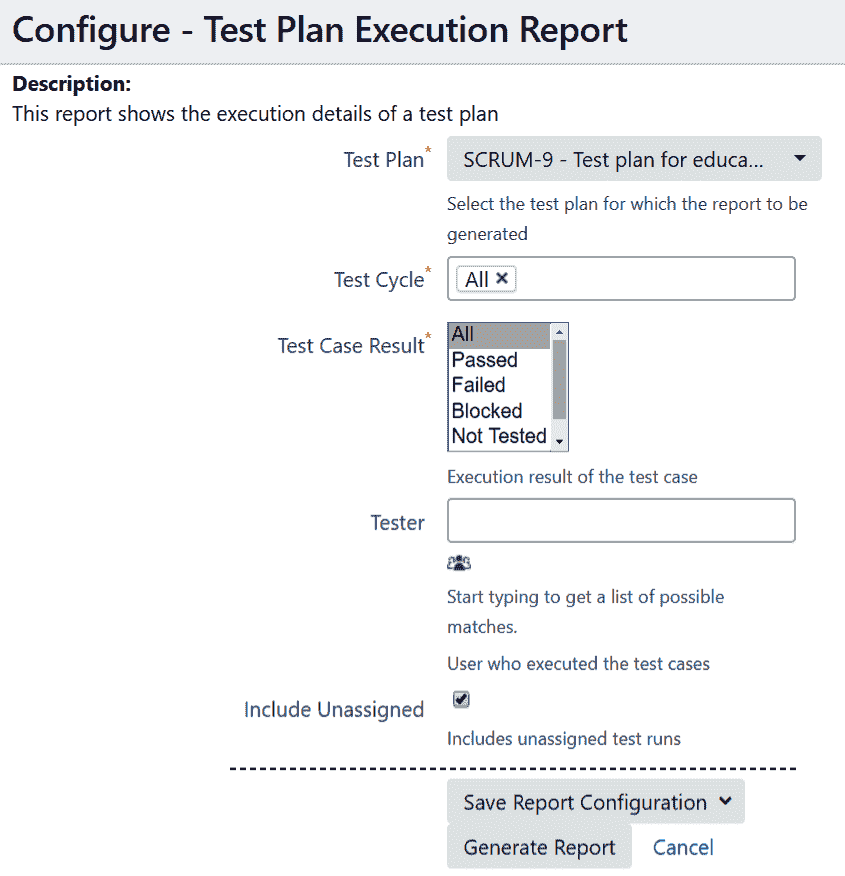

1.  这创建了下图所示的报告。报告列出了属于所选测试周期的所有测试用例，它们在“结果”列中的当前状态，分配给测试用例的测试人员，以及执行测试用例的人（在“测试者”列中）。还有一些更多的细节，比如“执行时间”（指执行的日期和时间），缺陷，估计和工作量。我们还有一个选项以 Excel 格式提取此报告：

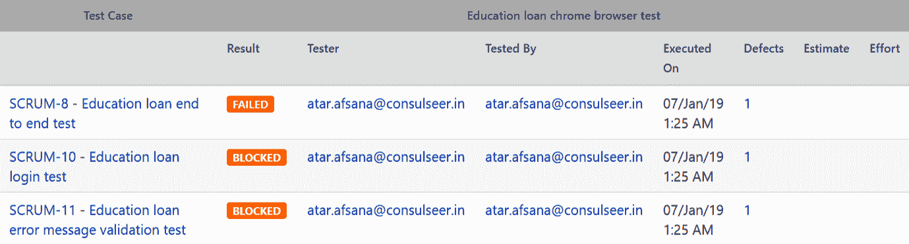

1.  通过测试计划部分，我们还可以查看测试计划当前执行的状态。转到测试计划选项卡，然后转到“未解决的计划”部分。它列出了所有没有关闭状态的测试计划。只需点击下拉图标，它会显示按测试周期分隔的执行进度。如下截图所示，我们有两个状态为“活动”的测试周期。它还显示了测试运行，缺陷及其当前状态等详细信息：

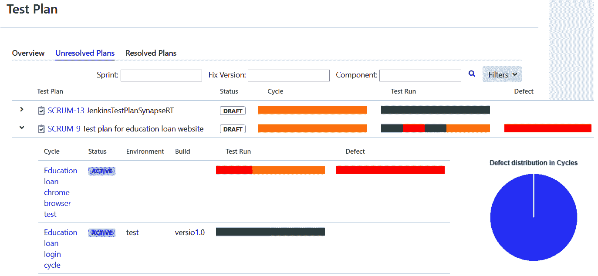

# Zephyr

在 Zephyr 中，我们可以生成测试用例执行报告来查看每个周期的进展及其关联的测试用例：

1.  为了生成报告，导航到 Jira 中的报告部分。有两个主要部分——所有报告和其他。测试用例执行报告列在其他部分下。点击它以创建一个。如下截图所示，这样做会显示用于根据项目、测试周期、版本等自定义报告的配置页面。提供适当的值，然后点击**下一步**。在下面的截图中，我们将测试周期的数量设置为`3`：

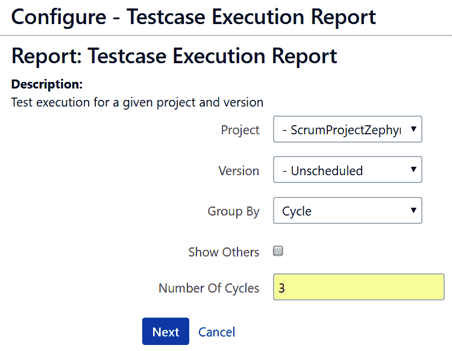

1.  以下报告...

# 测试管理

测试管理有一个选项，可以创建由测试周期组成的测试计划：

1.  为了通过测试计划生成测试报告，导航到测试选项卡并转到报告部分。这显示了生成报告的多个选项；选择按测试计划选项执行的测试执行结果。它允许您根据项目、开始和结束日期以及基于最近或全部的执行来自定义报告。在选择所有必需的选项后，点击**生成**按钮：

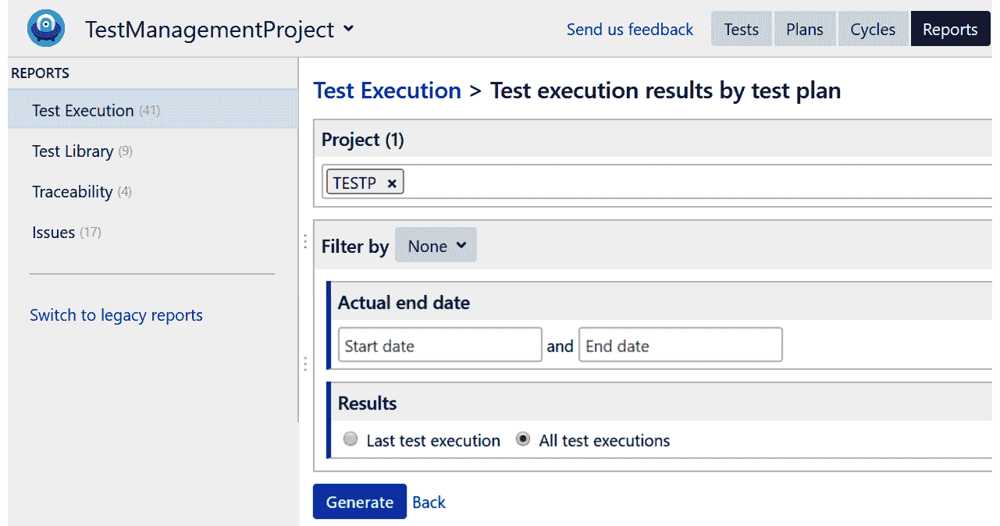

1.  它生成了以下报告。*y*轴表示所选测试计划的数量，*x*轴显示了具有当前执行状态的测试用例的数量。下面的截图显示，我们总共计划了八个测试用例，其中一个被阻止，一个通过了，两个失败了，四个测试用例没有被执行。我们还有一个选项可以打印或以 Excel 格式导出报告：

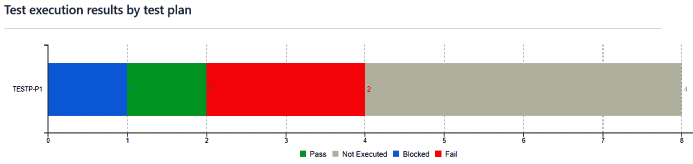

# 自定义测试运行报告

自定义测试运行报告指示所选测试用例作为自定义测试运行的一部分已执行的次数。在这种情况下，测试用例不是任何测试计划的一部分，独立执行。跟踪其状态变化也很有用。如果在自定义测试运行期间附加了任何工件，例如测试数据、截图或日志，测试人员可以使用这些信息来比较其上次执行的结果。Jira 插件有生成此类报告的选项。让我们逐个创建它们。

# synapseRT

synapseRT 有一个选项，可以从自定义测试运行部分查看单个测试用例级别的自定义测试运行详细信息。如下截图所示，所选测试用例已执行三次，其状态从 BLOCKED 变化到 FAILED 和 PASSED。它还显示了测试运行的 ID，执行者，执行日期和时间以及相关缺陷（如果有）等细节：

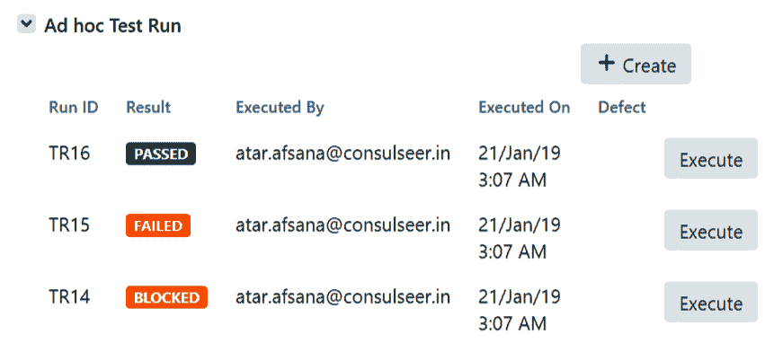

可以为所有测试用例生成自定义测试运行报告：

1.  为了生成这样的报告，导航到**SynapseRT 报告**选项卡，并选择自定义测试运行报告选项。如下截图所示，输入所需的细节，如执行类型和开始日期和结束日期，并点击**生成报告**按钮：

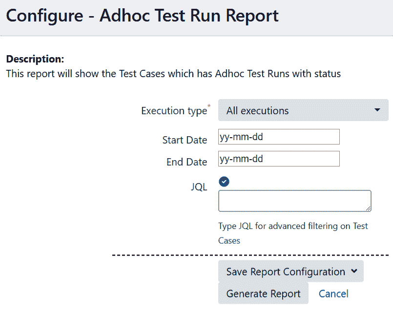

1.  如下截图所示，生成了自定义测试运行报告。它显示了测试用例的名称；它们在**结果**列中的当前状态；在**测试人员**列中测试了谁；在**执行时间**中的执行日期和时间；以及**缺陷**列中的关联缺陷（如果有）：

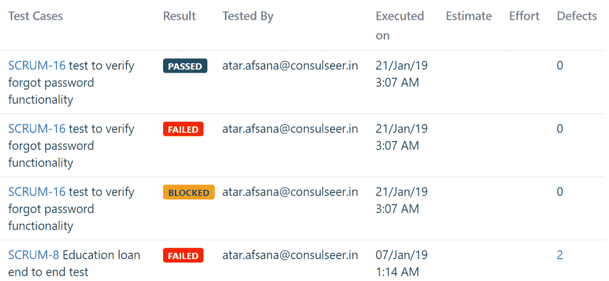

# Zephyr

Zephyr 有一个自定义测试周期，可以向其中添加并执行测试用例。我们可以从**周期摘要**选项卡查看所选周期的状态：

1.  导航到测试 | 测试摘要 | 周期摘要选项卡。它显示了所有发布的所有测试周期。

1.  将鼠标悬停在临时周期上，并观察它列出了该周期中所有测试用例的当前状态。它还指示了一个颜色条，以显示绿色、红色和蓝色来表示通过、失败和阻塞的状态进度。如下截图所示，临时测试周期共有四个测试用例，其中两个，即总测试用例的 50%，处于通过状态，一个处于失败状态，一个处于阻塞状态...

# 测试管理

在测试管理工具中，我们可以通过导航到报告|测试执行|测试执行结果（列表）报告来查看所选测试用例已执行的次数：

1.  要创建此报告，请转到测试|报告|测试执行选项卡并选择测试执行结果（列表）选项。输入所需的细节，例如您要测试的周期。如下截图所示，我们已选择了测试周期和项目。在输入所有必需的细节后，点击生成按钮：

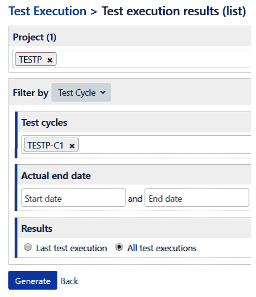

这生成了以下截图中显示的报告。其中列出了在所选测试周期下添加的测试用例列表。在我们的案例中，我们有`TESTP-T2`测试用例，作为`TESTP-C1`测试周期的一部分共执行了四次。状态列显示了每次执行期间的状态，还有其他列提供其他细节：

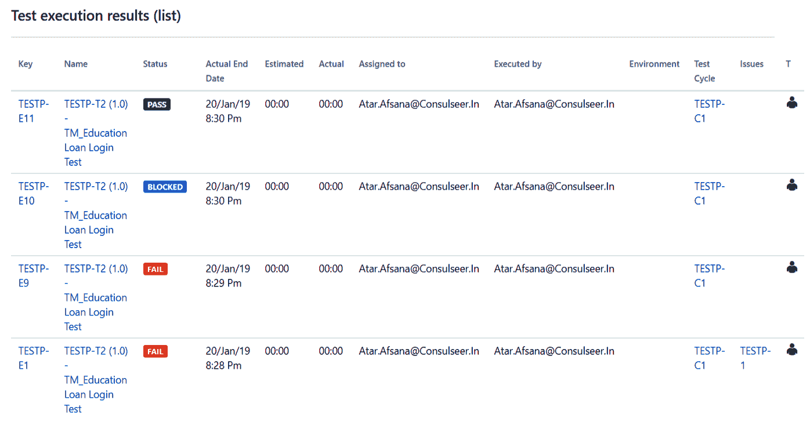

# 基于需求的报告

基于需求的报告帮助我们了解所选需求的当前执行状态。在有多个需求的项目中，这些报告很有帮助，因为它们根据 Jira 中的需求工单对测试用例进行分组。让我们使用 Jira 插件创建一个报告。

# synapseRT

synapseRT 有一个选项可以生成基于需求的报告，并根据需求跟踪当前执行的进度：

1.  要在 synapseRT 中创建基于需求的报告，请转到 SynapseRT 报告选项卡并选择基于需求的报告选项。这让您可以根据需求自定义报告。如下截图所示，输入所有必需的细节以及测试计划，它将生成与所选需求工单关联的报告：

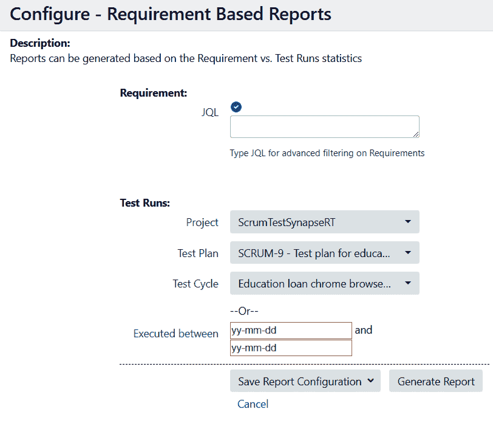

1.  它生成了以下截图中显示的报告。图表显示了所选需求工单的执行状态。它还有摘要报告和详细报告部分。摘要报告部分显示了项目名称、其需求以及关联的测试用例及其当前执行状态等详细信息：

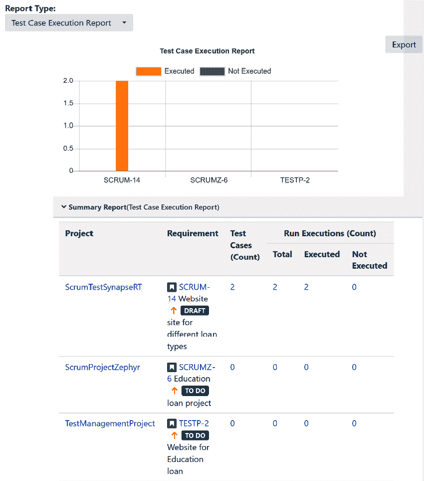

详细报告部分显示了所选需求及其关联的测试用例、测试周期和执行结果的详细信息。

# Zephyr

Zephyr 没有生成基于需求的报告的功能。

# 测试管理

测试管理工具使用测试执行结果覆盖报告，该报告根据关联的需求显示了测试用例的当前状态：

1.  要创建测试执行结果覆盖报告，请转到测试|报告|测试执行选项卡并选择测试执行结果覆盖选项。这将显示配置页面以自定义报告并根据需要生成。如下截图所示，在配置页面上，输入所需的细节，例如项目、文件夹、开始日期和结束日期，然后点击生成按钮：

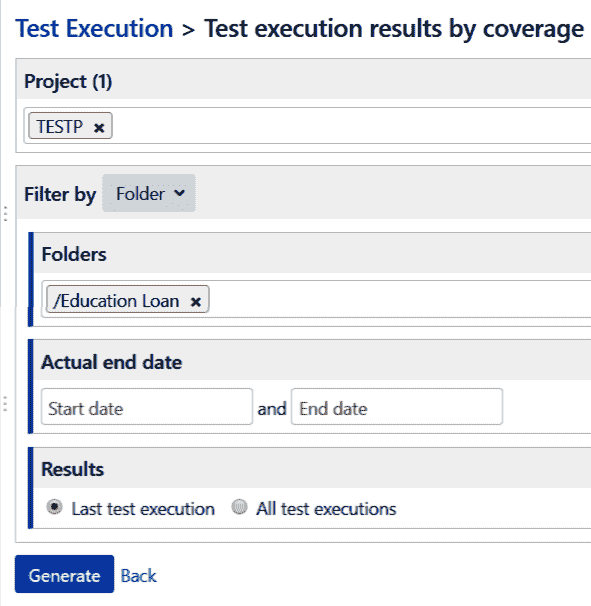

1.  这生成了下面截图中显示的报告。*y*轴显示了用户故事列表，*x*轴显示了按用户故事分组的测试用例数量。以下图表表明`TESTP-6`用户故事共有八个测试用例与之关联，其中两个被阻塞，两个失败，四个通过：

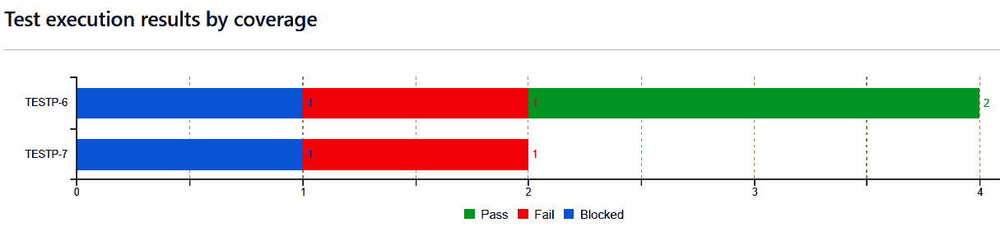

# 缺陷矩阵报告

正如名称所示，缺陷矩阵报告可用于了解与测试用例关联的缺陷的当前状态。因此，它有助于了解所选项目的当前测试周期和测试计划的进展情况。根据缺陷的当前状态、受托人、优先级、组件等，有各种选项可供定制和生成此类报告。让我们尝试使用 Jira 插件生成缺陷矩阵报告。

# synapseRT

synapseRT 有一个选项来创建缺陷矩阵报告，并验证团队报告的当前周期或测试计划执行的缺陷状态：

1.  为了在 synapseRT 中生成缺陷矩阵报告，请导航到 SynapseRT Reports 选项卡，并选择 Defect Matrix Report 选项。这显示了配置报告的选项。我们还可以通过选择*x*轴和*y*轴的值来选择报告的查看方式。在输入所有必需的细节后，点击生成报告按钮：

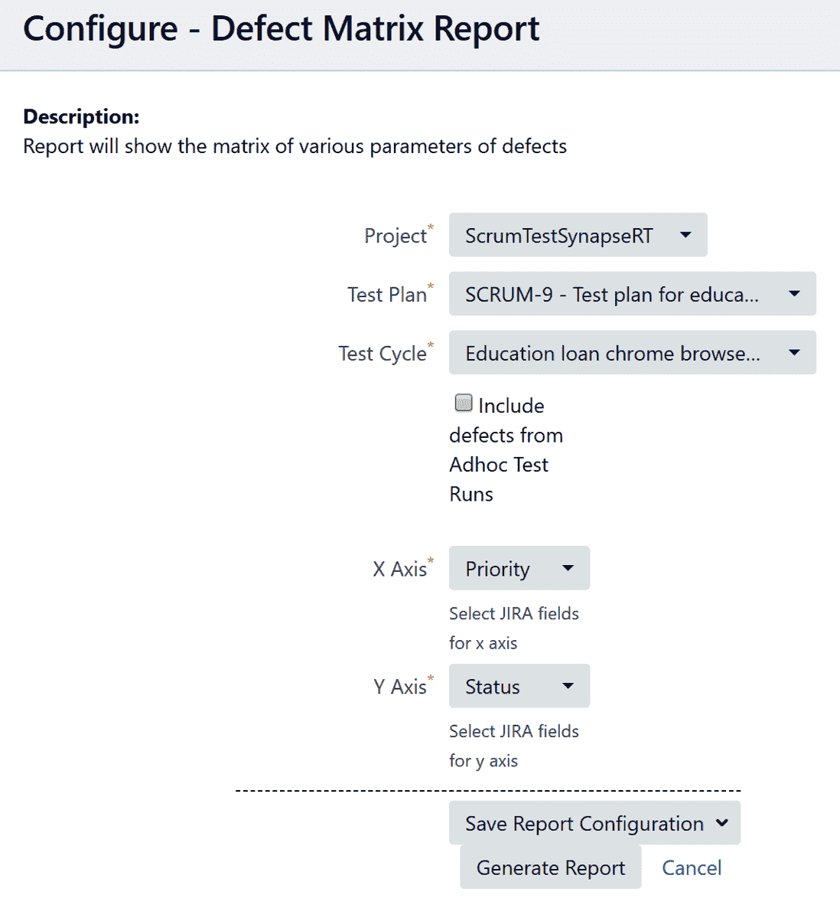

1.  生成了以下报告，以图形格式显示了缺陷状态。如下截图所示，所选的测试周期共有三个缺陷，其中两个是中等优先级，一个是高优先级。它还提供了缺陷的详细信息，比如在缺陷列中的缺陷编号和解决方案：

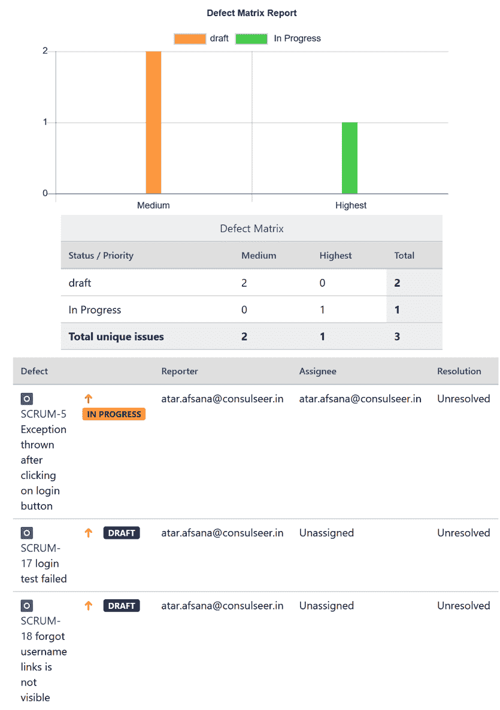

# Zephyr

Zephyr 没有生成缺陷矩阵报告的功能。然而，它帮助我们识别对测试执行阶段产生高影响的缺陷：

1.  为了生成这个报告，请导航到报告选项卡，并从其他报告部分选择 Top Defects Impacting Testing 选项。

1.  为了定制报告，输入必需的细节，输入要查看的缺陷数量和缺陷的状态。现在，如下截图所示，选择的缺陷数量为 10，状态为草稿。点击下一步生成报告：

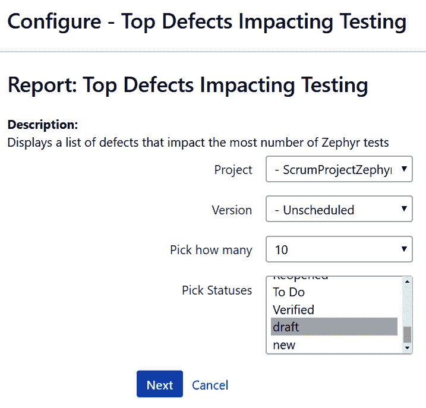

1.  生成了以下报告。它列出了缺陷...

# 测试管理

测试管理有一个测试执行（问题）报告，列出了在所选周期、测试计划、版本、迭代甚至文件夹中报告的所有问题。此报告可以从报告选项卡生成：

1.  为了创建测试执行（问题）报告，请导航到 Tests | Reports | Test Execution 选项卡。测试管理已添加了额外的报告；然而，我们仍然可以使用传统的报告选项来生成报告。

1.  选择切换到传统报告选项以使用传统的报告格式。

1.  切换视图后，导航到测试执行选项卡并选择测试执行（问题）选项。如下截图所示，这样做会显示报告配置页面。输入必需的细节。选择测试周期，输入开始和结束日期，然后点击生成按钮：

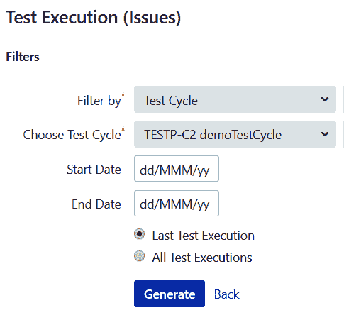

生成了以下报告，显示了创建的总缺陷及其优先级、状态等：

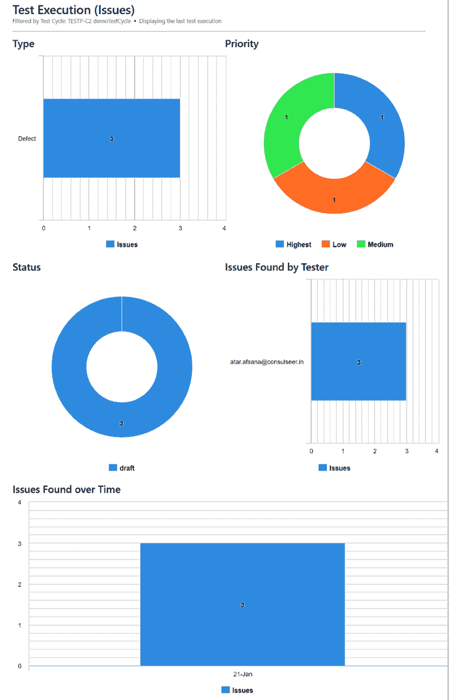

在问题部分，您还可以看到缺陷的详细信息，比如在关键列中的问题 ID 和摘要：

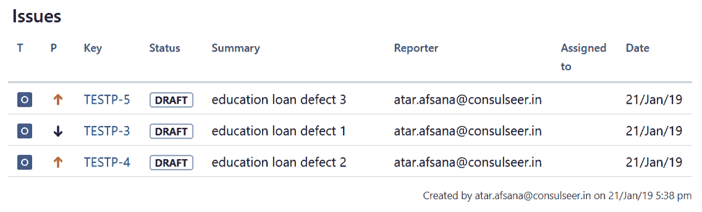

# 测试套件报告

如果测试用例是基于测试套件添加和执行的，那么生成基于测试套件的测试执行报告是很好的选择。这提供了有关测试用例的当前执行状态、谁执行了它们以及负责测试的人的详细信息。让我们借助 Jira 插件生成这份报告。

# synapseRT

synapseRT 有一个选项可以生成测试套件报告，借助它可以跟踪测试套件的进度：

1.  要在 synapseRT 中生成测试套件报告，请导航到 SynapseRT 报告选项卡，并选择测试套件报告选项。这使您可以根据项目、测试套件、测试计划、测试周期等配置报告的选项。

1.  在所有必填字段中输入数据，然后点击生成报告按钮。如下截图所示，我们提供了有关这些测试用例所添加的项目、测试套件和测试计划的详细信息：

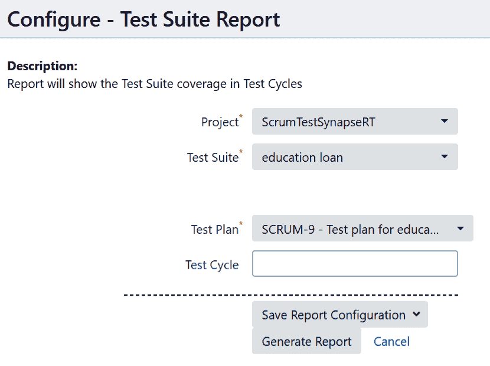

这将生成以下截图中显示的报告。报告有诸如测试套件覆盖率和搜索细节之类的部分。测试套件覆盖率部分指示所选周期的测试用例总数及其当前状态。

周期和运行详细信息指示了这些测试用例所添加的测试周期及其当前执行状态和其他详细信息。此报告还列出了所有与这些测试用例相关联的缺陷：

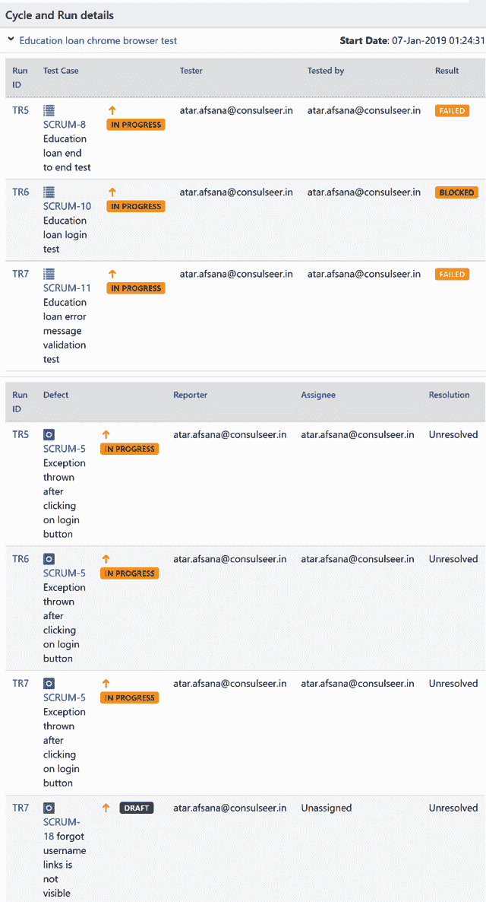

# Zephyr

Zephyr 没有生成测试套件报告的功能。但是，我们仍然可以查看所选测试周期的执行测试的状态，如前面的 Zephyr 特别测试运行报告所示。

# 测试管理

测试管理具有用于组织测试用例的文件夹结构，因此在基于测试套件生成报告时，我们将不得不根据文件夹选择选项：

1.  要在测试管理中生成测试套件报告，请导航到 Tests | Reports | Test Execution 选项卡，并输入所需的详细信息。如下截图所示，输入项目名称，需要生成报告的文件夹（测试套件）等，然后点击生成按钮：

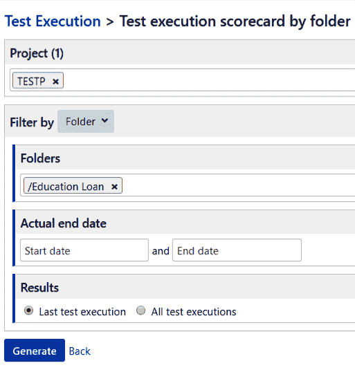

1.  这将生成以下截图中显示的报告。报告列出了已创建此报告的文件夹名称、测试用例总数及其执行状态。它还指示了任何给定状态的测试用例的百分比。在这种情况下，我们有 33.33%的测试用例处于通过状态。它还显示了有关测试执行剩余量、已完成情况等的详细信息。问题部分列出了与测试用例相关联的缺陷（如果有）：

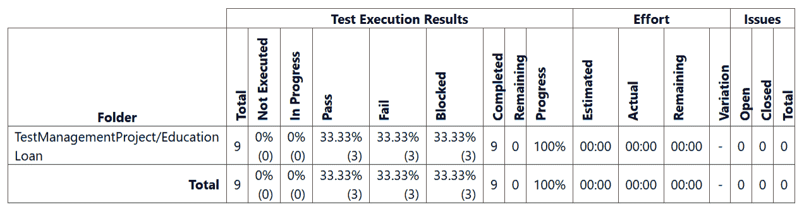

# 燃尽图

测试用例燃尽图帮助项目团队跟踪所选测试周期的测试用例执行速度。它还指示了已在所选日期、周或月执行的测试用例数量以及剩余测试用例。它帮助团队了解完成所选测试周期还需要多少努力。让我们借助 Jira 插件创建这份报告。

# synapseRT

synapseRT 有一个选项可以生成测试用例燃尽报告，用于跟踪测试执行速度：

1.  要在 synapseRT 工具中生成测试用例燃尽报告，请导航到 SynapseRT 报告部分，并选择测试用例燃尽报告选项。这让您可以选择必须生成报告的项目、测试计划和测试周期。

1.  如下截图所示，输入所有必填详细信息，然后点击生成报告按钮：

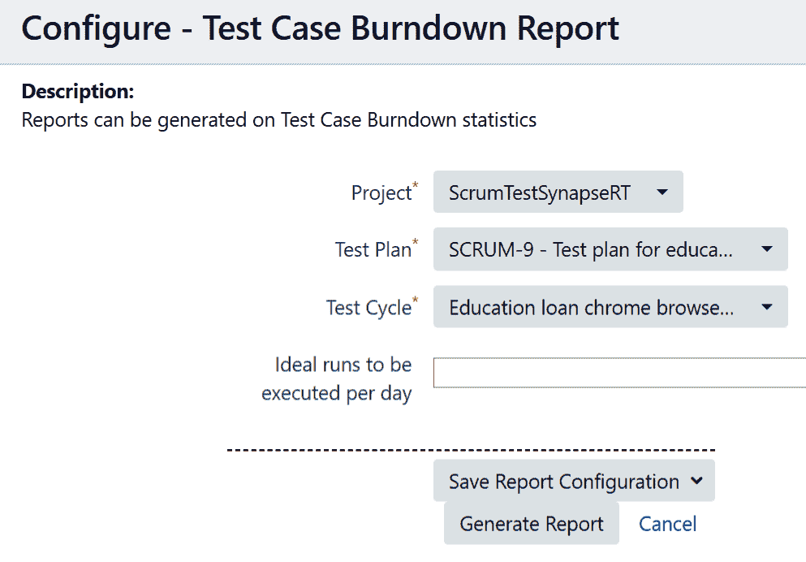

1.  这将生成测试用例燃尽报告，如下面的屏幕截图所示。 *x*轴表示测试用例的数量，*y*轴表示执行这些测试用例的日期。如下面的屏幕截图所示，执行开始日期是 1 月 7 日，执行的最后日期是 1 月 22 日，这是生成此报告的日期：

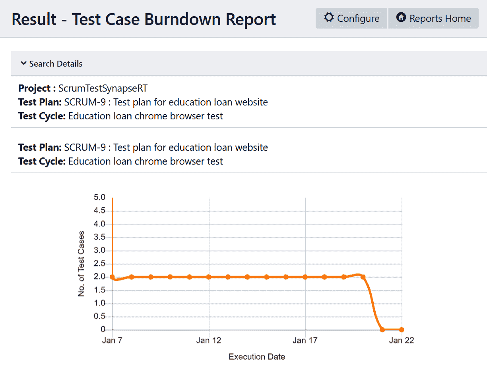

1.  如果我们将鼠标悬停在节点上，它会提供更多详细信息，例如需要执行的测试用例的日期和剩余数量。如下面的屏幕截图所示，所选节点的日期是 2019 年 1 月 17 日，截至当天仍有两个测试用例需要执行：

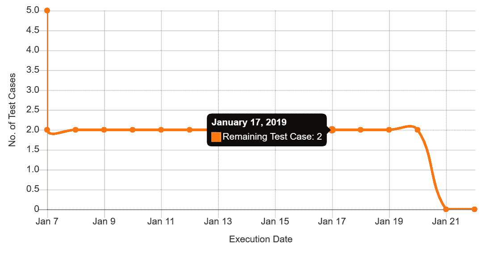

# 风神

Zephyr 有一个选项可以生成测试执行燃尽图，这有助于团队了解当前测试执行阶段的状态：

1.  要创建此报告，请导航到报告部分，并从报告的其他部分中选择 Test Execution Burndown Chart 选项。输入详细信息，如下面的屏幕截图所示，以生成所有周期的测试执行燃尽图：

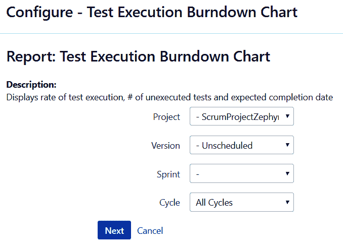

这生成以下图表。图表显示了执行的平均速率，剩余的未执行测试总数和预期完成日期：

在这种情况下，这些值如下：

+   平均...

# 测试管理

测试管理有一个选项可以生成测试执行燃尽图，借助该选项可以跟踪测试执行的速率：

1.  要在测试管理工具中生成测试执行燃尽图，请导航到 Tests | Reports | Test execution 选项卡，并选择 Test execution burn down 选项。这将显示配置页面。

1.  输入详细信息，选择报告的持续时间，然后单击生成按钮：

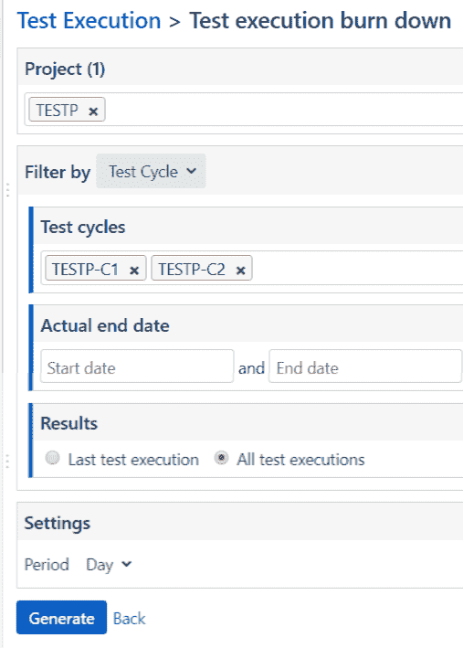

1.  这将生成以下报告，显示了所选的两个测试周期的测试用例的每日执行速率。 *y*轴表示测试用例的总数，*x*轴显示了执行这些测试用例的日期：

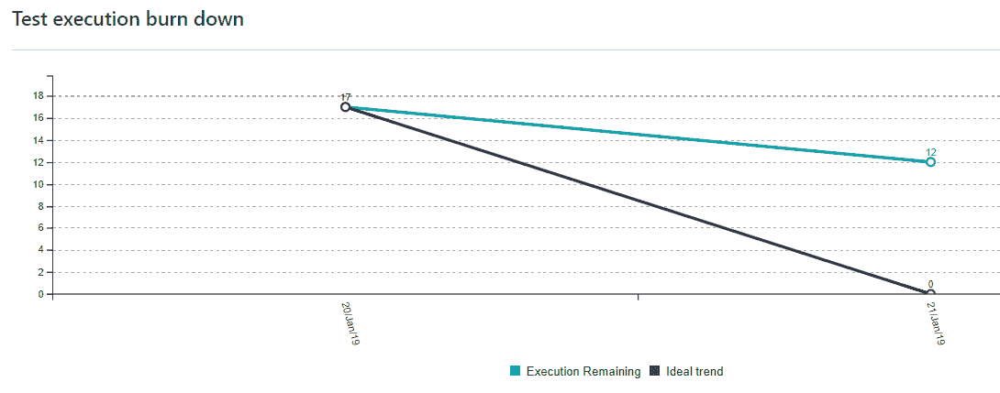

# 摘要

在本章中，我们学习了如何使用 Jira 插件创建各种报告，并了解了每种类型的目的。我们看到报告如何帮助监控和控制测试活动。

正如我们所知，报告作为一个重要的沟通工具，可以在项目开发生命周期中提供关于项目的见解。因此，项目团队和管理层理解其重要性，并找到适当利用其项目的重要报告的方法是至关重要的。

在下一章中，我们将探讨如何将第三方自动化测试工具集成到 Jira 中，以管理自动化测试用例。
