# Jira 与自动化测试工具集成

在之前的章节中，我们已经了解了什么是测试管理，以及 Jira 如何帮助 SQA 团队有效地管理测试过程。现在，让我们看看如何利用 Jira 和 DevOps 管道来自动化和管理测试执行，以改善开发生命周期中的敏捷性。

在本章中，我们将涵盖以下主题：

+   理解 DevOps 管道

+   配置 Jira 插件以连接 Jenkins

+   理解集成和执行自动化脚本的示例工作流程

我们还将学习 Jira 如何在软件项目中帮助**持续集成**（**CI**）和**持续交付**（**CD**）。

# 理解 DevOps 管道

DevOps 是一个涉及持续开发、测试、集成、部署和监控循环的软件开发范式。这个模型是成熟的软件开发实践的结果，特别是随着敏捷方法学的出现，它要求更快的产品和服务发布，同时确保足够的质量措施。以下图表显示了 DevOps 周期中的各个阶段：

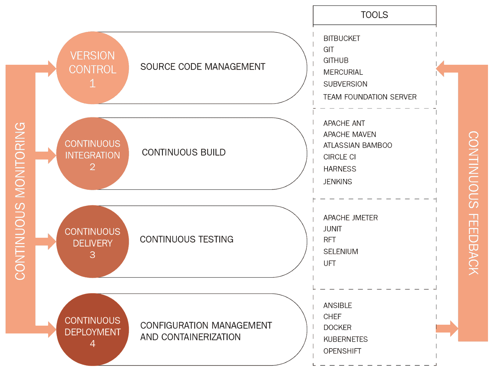

如前图所示，DevOps 需要开发、测试和运维功能协同工作。DevOps 阶段基本上是敏捷 SDLC 中开发阶段的自动化和流程化实现。

在开发阶段，开发人员根据产品需求开始编写代码。同时，测试人员开始编写自动化测试的测试用例或脚本。这要求开发人员和测试人员在实现最终可工作的构建之前，对其代码和脚本的多个版本进行多次提交。因此，源代码管理对于有效和高效的开发至关重要。在没有版本控制工具的团队环境中，这可能会成为一个问题。因此，DevOps 采用了几种版本控制工具，如 GitHub、Bitbucket 和 Team Foundation。

一旦开发人员提交了代码，DevOps 流程就会被触发，自动编译和构建代码以及团队其他成员的代码提交。如果编写了适当的单元测试，DevOps 流程会执行这些测试以断言结果是否符合预期。在这个阶段发现的任何缺陷或问题都会通过电子邮件和工单通知给开发团队。市场上有几种 CI 工具，如 Jenkins 和 Circle CI。在本章中，我们将学习如何利用 Jenkins 与 Jira 进行集成。Jenkins 是一个用于 CI 的开源工具。它可以与多种软件开发工具集成，以自动化 CI/CD 的过程。

一旦构建通过了开发级别的单元测试和集成测试，发布构建就会部署到适当的测试服务器上，供测试团队启动他们的测试。此时，如果有自动化测试脚本，将会触发自动化测试来测试构建。自动化确保了 DevOps 阶段的连续性；否则，会导致开发过程的敏捷性受阻。有几种测试自动化框架和工具可用，如 Selenium、TestComplete 和 Eggplant，可以帮助自动化测试过程。

构建一旦经过测试并修复了所有缺陷，就准备好部署了。经过产品团队和利益相关者的适当批准后，它将部署到生产服务器上。部署构建的容器化有助于促进弹性服务器，以及有效的负载平衡和配置管理。市场上有许多容器化工具，包括 Docker、Ansible 和 Kubernetes。

DevOps 流程的所有阶段都需要持续监控，使用 Prometheus、Splunk 和 Ganglia 等工具，以提醒开发团队需要高效解决的问题。持续监控对于解决瓶颈并改进更快交付机制的流程至关重要。持续反馈是另一种通过帮助团队规划下一次部署来改进产品的机制。

现在我们了解了 DevOps 流程的基础知识，让我们看看如何配置 Jenkins 与 Jira 和测试自动化工具集成。

# 配置 Jira 插件连接到 Jenkins

synapseRT、Zephyr 和 Jira 的测试管理工具插件都有各自连接 CI/CD 工具（如 Jenkins）的方式。我们将看看如何为 Jenkins 安装和配置这些 Jira 插件。

# synapseRT

synapseRT 预先安装了与 CI/CD 工具的集成。让我们配置插件以连接到我们的 Jenkins 安装：

1.  转到 Administration | Add-ons | synapseRT | Integration，然后点击“添加”按钮。

1.  将 Jenkins 设置为应用程序类型，并提供 Jenkins URL。在我们的情况下，我们在 Docker 实例上托管了 Jira，而 Jenkins 托管在端口`8081`的本地主机上。因此，我们提供`http://host.docker.internal:8081`作为 URL，而不是`http://localhost:8081`，以及 Jenkins 实例的用户名和密码：

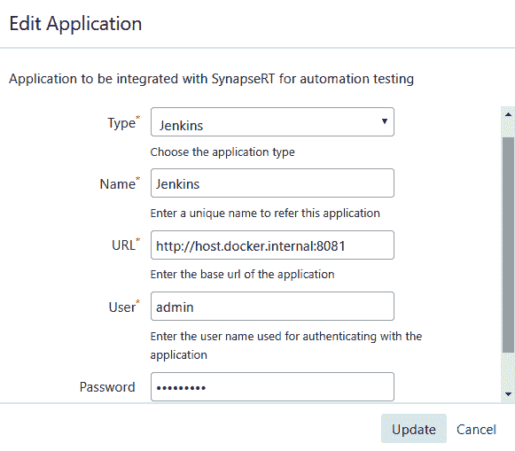

有关配置和设置 synapseRT 与 Jenkins 的问题的更多信息或澄清，请访问[`bit.ly/2RBEAfA`](https://bit.ly/2RBEAfA)。

# Zephyr

Zephyr 提供了与 Jenkins 集成的插件。

1.  要安装插件，请点击“管理 Jenkins”|“管理插件”：

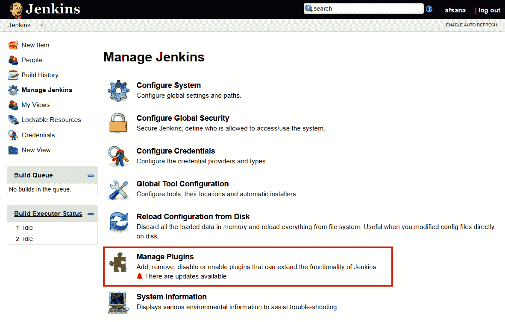

1.  点击“可用”选项卡，搜索`Zephyr for Jira`，然后点击“无需重启安装”或“立即下载并在重启后安装”按钮。安装成功后，插件将显示在“已安装”选项卡上：

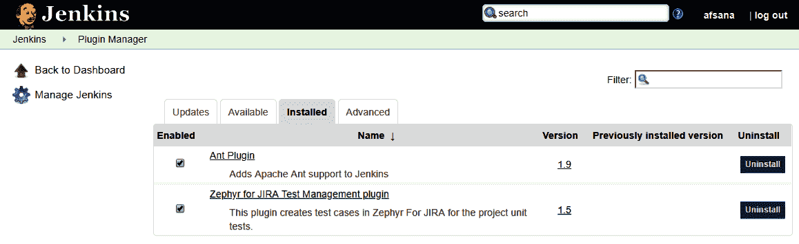

安装后，我们可以配置插件以将其与我们 Jira 实例中的 Zephyr for Jira 连接。

1.  现在，点击“管理 Jenkins”，然后点击“配置系统”。如果插件...

# 测试管理

Jira 的测试管理提供了与 Jenkins 集成的插件。

1.  要安装插件，请点击“管理 Jenkins”|“管理插件”，就像你为 Zephyr 所做的那样。

1.  然后，点击“可用”选项卡，搜索“Jira 的测试管理”，然后点击“无需重启安装”或“立即下载并在重启后安装”按钮。安装成功后，插件将显示在“已安装”选项卡上：

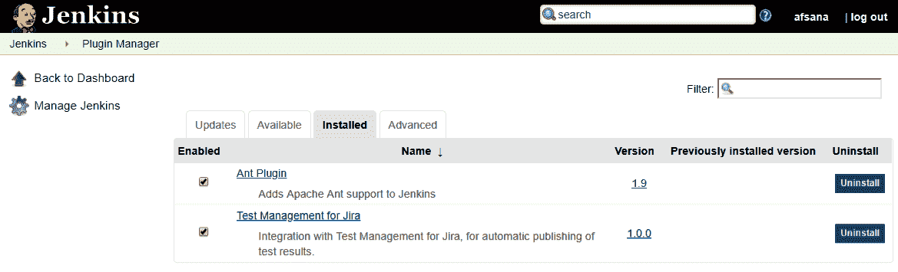

1.  安装后，我们可以配置插件以将其与我们 Jira 实例中的测试管理连接。点击“管理 Jenkins”，然后点击“配置系统”。如果插件安装正确，配置系统将有一个名为“Jira 的测试管理”的部分。选择组织中 Jira 实例的类型。在我们的情况下，我们选择了 Jira 服务器。

1.  提供 Jira URL 和与 Jira 项目连接的凭据。点击“测试配置”按钮验证设置。如果一切验证通过，它会看起来像这样：

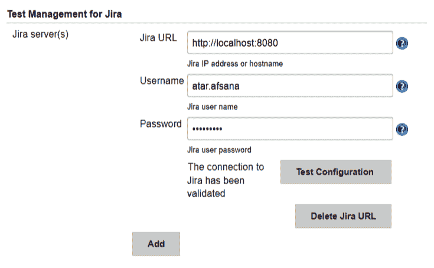

有关配置和设置 Jira 的测试管理插件与 Jenkins 的问题的更多信息或澄清，请访问以下链接：[`www.adaptavist.com/doco/display/KT/Jenkins`](https://www.adaptavist.com/doco/display/KT/Jenkins)。

# 集成和执行自动化脚本的示例工作流程

现在我们已经配置了插件与 Jenkins 集成，我们现在看到了 DevOps 流水线如何使用每个插件的示例。对于这个工作流程，我们使用以下自动化测试脚本：

1.  在 Eclipse 中使用 TestNG 构建脚本的测试自动化代码。为此，我们使用 Eclipse 在 Java 中创建了代码。我们在一个名为`JenkinsDemoPkg`的新包中创建了一个新的 Java 项目，其中包含一个名为`demoJenkins`的类。我们还使用`JenkinsDemoPkg.demoJenkins: testJenkins`来获取类和方法的完整名称，这将用于插件中的跟踪：

```
package JenkinsDemoPkg;import org.testng.annotations.Test;public class demoJenkins {
```

# synapseRT

让我们看看将 Jenkins 与 synapseRT 集成的步骤。

1.  捕获构建操作的结果作为后期构建活动。为了捕获 Jenkins 中的构建结果，以便 synapseRT 可以拉取它们，需要为 Jenkins 作业配置后期构建操作如下：

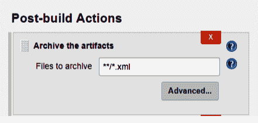

1.  synapseRT 允许我们从测试周期内触发 Jenkins 作业。为了 synapseRT 能够跟踪执行结果，需要将测试参考添加到自动化部分的测试用例中：

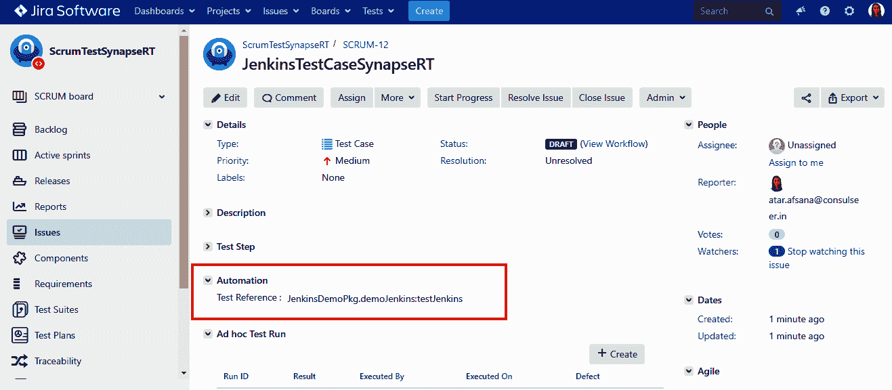

1.  自动化|测试参考是我们在第 1 步中捕获的模块的完整名称。然后，将测试用例添加到测试周期，并单击“运行”按钮以触发 Jenkins 作业：

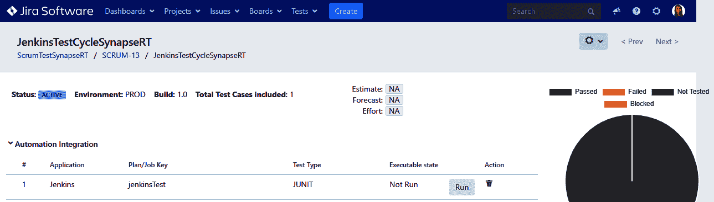

当单击“运行”按钮时，Jenkins 作业开始运行：

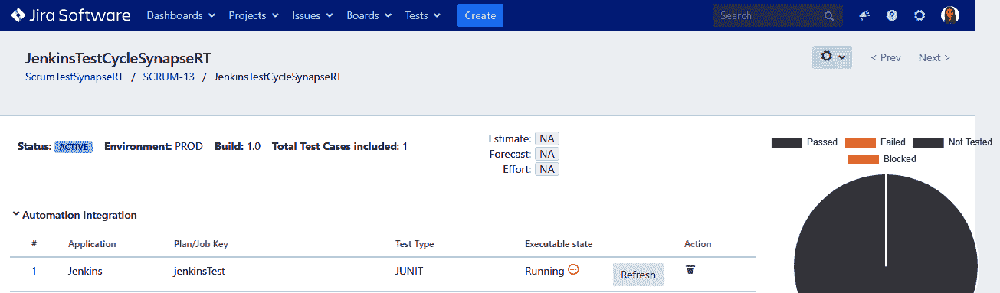

1.  在 Jira 插件中捕获构建结果。大约 60 秒后，作业的结果将在 Jira 中被捕获：

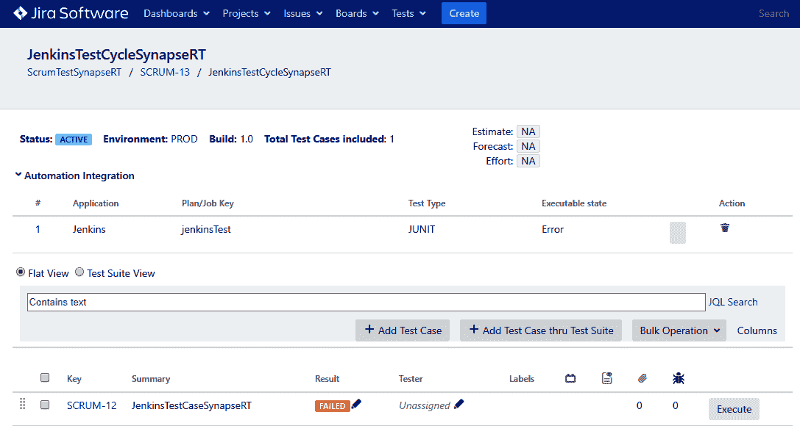

# Zephyr

让我们看看将 Jenkins 与 Zephyr 集成的步骤。

1.  将构建操作的结果作为后期构建活动捕获。为了捕获 Jenkins 中的构建结果，以便 Zephyr 可以拉取它，需要为 Jenkins 作业配置后期构建操作。为 Zephyr 项目提供项目名称，并选择适当的周期和版本：

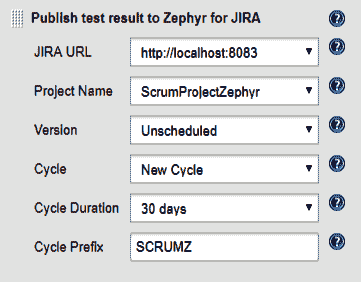

1.  要触发 Jenkins 作业，请在单击作业名称后单击“立即构建”按钮：

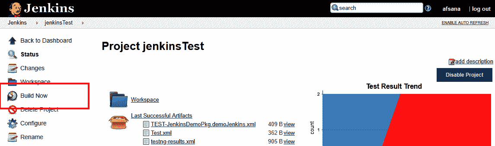

1.  在 Jira 插件中捕获构建结果。Jenkins 作业完成后，...

# 测试管理

将 Jira 的测试管理与 Jenkins 和其他 CI/CD 工具集成，就像我们为 Zephyr 执行的设置一样。这在以下链接的帮助部分中有详细介绍：[`www.adaptavist.com/doco/display/KT/Integrations`](https://www.adaptavist.com/doco/display/KT/Integrations)。

# 摘要

在本章中，我们学习了使用 Jira 插件的 DevOps 流水线和执行。我们了解了如何在软件开发项目中利用 DevOps 流水线，实现真正的敏捷交付，并不断改进交付过程。我们配置了我们的 Jira 测试管理插件，以与 Jenkins 集成为我们的 CI/CD 工具。我们看到了一个简单的实际示例，演示了在 DevOps 流水线中自动化测试用例管理。

我们漫长的旅程到此结束。希望您喜欢阅读本书！
