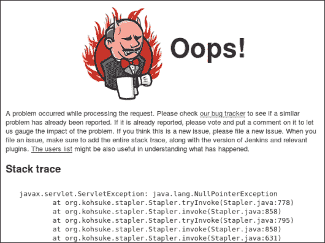
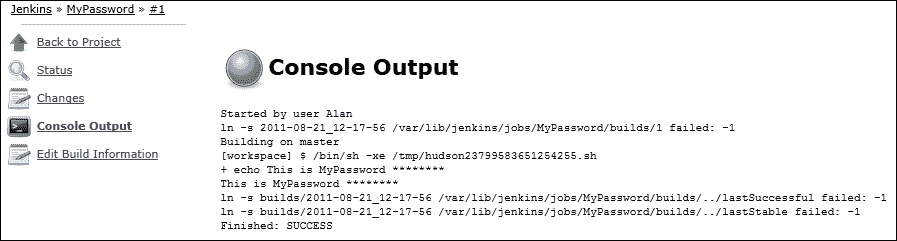

# 第二章： 增强安全性

在本章中，我们将涵盖以下内容：

+   测试 OWASP 十大安全问题

+   通过模糊测试在 Jenkins 中查找 500 错误和 XSS 攻击

+   通过小型配置更改提高安全性

+   使用 JCaptcha 防止注册机器人

+   通过 Groovy 查看 Jenkins 用户

+   使用审计追踪插件

+   安装 OpenLDAP

+   使用脚本领域身份验证进行配置

+   通过自定义组脚本查看基于项目的矩阵策略

+   管理 OpenLDAP

+   配置 LDAP 插件

+   安装 CAS 服务器

+   在 Jenkins 中启用 SSO

+   探索 OWASP Dependency-Check 插件

# 介绍

在本章中，我们将讨论 Jenkins 的安全性，考虑到 Jenkins 可以存在于多样的基础架构中。我们还将探讨如何扫描 Jenkins 编译时使用的 Java 代码库中已知安全问题。

唯一完全安全的系统是不存在的系统。对于真实服务，你需要注意不同面向攻击的表面。Jenkins 的主要表面是其基于 Web 的图形用户界面及其与从节点和本机操作系统的信任关系。在线服务需要严密关注其安全表面。对于 Jenkins，主要有三个原因：

+   Jenkins 有能力通过其插件或主从拓扑结构与各种基础架构通信

+   插件周围的代码更改速度很快，可能意外包含与安全相关的缺陷

+   你需要加固默认安装，使其对外开放

一个平衡因素是，使用 Jenkins 框架的开发人员应用经过验证的技术，例如 XStream（[`xstream.codehaus.org/`](http://xstream.codehaus.org/)）用于配置持久性，Jelly（[`commons.apache.org/jelly/`](http://commons.apache.org/jelly/)）用于呈现 GUI。这种使用知名框架最小化了支持代码数量，而使用的代码经过了充分测试，限制了漏洞范围。

另一个积极的方面是 Jenkins 代码是免费供审查的，核心社区保持警惕。贡献代码的任何人不太可能故意添加缺陷或意外的许可证标头。然而，你应该信任但要核实。

本章前半部分致力于 Jenkins 环境。在后半部分，你将看到 Jenkins 如何融入更广泛的基础架构。

**轻量级目录访问**（**LDAP**）广泛可用，并且是企业目录服务的事实标准。我们将使用 LDAP 进行 Jenkins 的身份验证和授权，然后使用 JASIG 的**中央认证服务**（**CAS**）进行**单点登录**（**SSO**）。了解更多，请访问[`www.jasig.org/cas`](http://www.jasig.org/cas)。CAS 允许您登录一次，然后转到其他服务而无需重新登录。当您希望从 Jenkins 链接到其他受密码保护的服务（例如组织的内部 wiki 或代码浏览器）时，这非常有用。同样重要的是，CAS 可以在幕后连接到多种类型的身份验证提供者，例如 LDAP、数据库、文本文件以及越来越多的其他方法。这使得 Jenkins 间接地可以使用许多登录协议，这些协议已经由其插件提供。

### 提示

**安全公告**

Jenkins 相关安全公告有电子邮件列表和 RSS 源。您可以在[`wiki.jenkins-ci.org/display/JENKINS/Security+Advisories`](https://wiki.jenkins-ci.org/display/JENKINS/Security+Advisories)找到公告源的链接。

# 测试 OWASP 的十大安全问题

本文介绍了使用 OWASP 的渗透测试工具 w3af 对 Jenkins 进行已知安全问题的自动测试。有关更多信息，请访问[`w3af.sourceforge.net`](http://w3af.sourceforge.net)。OWASP 的目的是使应用程序安全可见。2010 年 OWASP 的十大不安全性列表包括以下内容：

+   **A2-跨站脚本（XSS）**：当应用程序将未经转义的输入返回给客户端的浏览器时，可能会发生 XSS 攻击。Jenkins 管理员可以通过作业描述默认执行此操作。

+   **A6-安全配置错误**：Jenkins 插件赋予您编写自定义身份验证脚本的能力。通过错误的配置很容易出错。

+   **A7-不安全的加密存储**：Jenkins 有 600 多个插件，每个插件都将其配置存储在单独的 XML 文件中。密码以明文形式存储可能会有罕见的错误。您需要仔细检查。

+   **A9-传输层保护不足**：Jenkins 默认运行在 HTTP 上。获取受信任的证书可能会很麻烦并涉及额外的成本。您可能会心生诱惑，不实施 TLS，从而使您的数据包处于开放状态。

您会发现 2013 年的 OWASP 十大不安全性与 2010 年版本相比有些变化。最显著的变化是包含了 A9-使用已知弱点组件。如果您的软件依赖于旧库，那么就有机会利用已知弱点进行操纵。

Jenkins 拥有一个由积极、分散和勤奋的社区编写的大量插件。由于代码的大量更改，可能会无意中添加安全缺陷。例如，在配置文件中明文留下密码，或者使用不移除可疑 JavaScript 的不安全渲染。你可以通过手动审查配置文件来找到第一类缺陷。第二类缺陷对更广泛的受众可见，因此更容易被破解。你可以手动攻击新的插件。互联网上有很多有用的备忘单（[`ha.ckers.org/xss.html`](http://ha.ckers.org/xss.html)）。这种工作很乏味；自动化测试可以覆盖更多内容，并作为 Jenkins 作业的一部分定期安排。

在名为*探索 OWASP Dependency-Check 插件*的配方中，你将配置 Jenkins，让它基于自动审查你的代码依赖关系来警告你已知的攻击向量。

### 提示

**OWASP 商店**

OWASP 每年发布一份关于 Web 应用程序十大最常见安全攻击向量的列表。他们通过 [`lulu.com`](http://lulu.com) 发布此文档和各种书籍。在 Lulu，你可以免费获取 OWASP 文档的 PDF 版本，或者购买廉价的按需打印版本。你可以在官方商店找到它：[`stores.lulu.com/owasp`](http://stores.lulu.com/owasp)。

## 准备工作

渗透测试有可能损坏正在运行的应用程序。确保你备份了 Jenkins 工作空间的副本。你可能需要重新安装。同时关闭 Jenkins 中的任何已启用安全性：这样可以让 w3af 自由地漫游安全表面。

从 SourceForge 下载 w3af 的最新版本（[`w3af.org/download/`](http://w3af.org/download/)），并且也下载并阅读 OWASP 的十大已知攻击列表（[`www.owasp.org/index.php/Category:OWASP_Top_Ten_Project`](https://www.owasp.org/index.php/Category:OWASP_Top_Ten_Project)）。

w3af 同时具有 Windows 和 *NIX 安装包；使用您选择的操作系统安装。但是，Windows 安装程序不再受支持，没有安装程序的安装过程很复杂。因此，最好使用工具的 *NIX 版本。

### 注意

w3af 的 Debian 包比 Linux 的 SourceForge 包老旧且不稳定。因此，不要使用 `apt-get` 和 `yum` 安装方法，而是使用从 SourceForge 下载的包。

## 如何操作...

1.  要安装 w3af，请按照开发者网站上给出的说明进行操作（[`w3af.org/download/`](http://w3af.org/download/)）。如果 Ubuntu 存在任何无法解决的依赖问题，请退回到 `apt-get` 安装方法，并安装工具的旧版本，方法如下：

    ```
    sudo apt-get install w3af

    ```

1.  运行 w3af。

1.  在**配置文件**选项卡下，选择**OWASP_TOP10**。

1.  在**目标**地址窗口下，填写 `http://localhost:8080/`，将主机名更改为适合您的环境。

1.  点击 **Start** 按钮。现在将进行渗透测试，而 **Start** 按钮将更改为 **Stop**。在扫描结束时，**Stop** 按钮将更改为 **Clear**：

1.  通过选择 **Log** 标签查看攻击历史记录。

1.  通过单击 **Results** 标签查看结果。

1.  在第一次扫描后，在 **Profiles** 下选择 **full_audit**。

1.  点击 **Clear** 按钮。

1.  在 **Target** 地址窗口中键入 `http://localhost:8080/`。

1.  点击 **Start** 按

1.  等待扫描完成并查看 **Results** 标签。

## 它是如何工作的...

w3af 由安全专业人员编写。它是一个可插拔的框架，具有为不同类型的攻击编写的扩展。配置文件定义了您将在渗透测试中使用的插件及其关联的配置。

您首先使用 **OWASP_TOP10** 配置文件进行攻击，然后再次使用更全面的插件进行攻击。

结果会根据您的设置而变化。根据插件，偶尔会标记出不存在的安全问题。您需要手动验证所提到的任何问题。

在写作时，使用这种方法未发现重大缺陷。然而，该工具指出了缓慢的链接并生成了服务器端异常。这是你想在错误报告中记录的信息类型。

## 还有更多...

一致地保护您的应用程序需要经验丰富的细节关注。以下是您需要审查的更多内容。

### 使用 Webgoat 进行目标练习

安全缺陷的前十名列表有时会难以理解。如果你有一些空闲时间，喜欢针对一个故意不安全的应用程序进行实践，那么你应该尝试一下 Webgoat ([`www.owasp.org/index.php/Category:OWASP_WebGoat_Project`](https://www.owasp.org/index.php/Category:OWASP_WebGoat_Project))。

Webgoat 配有提示系统和链接到视频教程的文档良好；它几乎没有误解攻击的余地。

### 更多工具

w3af 是一个强大的工具，但与以下工具一起使用效果更好：

+   **Nmap** ([`nmap.org/`](http://nmap.org/))：一个易于使用、非常流行、屡获殊荣的网络扫描器。

+   **Nikto** ([`cirt.net/nikto2`](http://cirt.net/nikto2))：一个 Perl 脚本，快速总结系统详细信息并查找最明显的缺陷。

+   **Skipfish** ([`code.google.com/p/skipfish/downloads/list`](https://code.google.com/p/skipfish/downloads/list))：一个利用大量请求长时间运行的 C 程序。您可以从不同的攻击字典中进行选择。这是一个极好的穷人压力测试；如果您的系统保持稳定，那么您就知道它已经达到了最低的稳定水平。

+   **Wapiti** ([`wapiti.sourceforge.net/`](http://wapiti.sourceforge.net/))：一个基于 Python 的脚本，发现可攻击的 URL，然后循环遍历一个邪恶参数列表。

Jenkins 是灵活的，因此可以通过运行作业中的脚本调用各种工具，包括提到的安全工具。

### 注

有许多优秀的资源可用于保护本地操作系统，包括 Debian 安全指南（[`www.debian.org/doc/manuals/securing-debian-howto/`](https://www.debian.org/doc/manuals/securing-debian-howto/)）；对于 Windows，可以在 MSDN 安全中心下找到相关文章（[`msdn.microsoft.com/en-us/security/`](http://msdn.microsoft.com/en-us/security/)）；对于 Mac，可以参考苹果官方的安全指南（[`www.apple.com/support/security/guides/`](https://www.apple.com/support/security/guides/)）。在线服务需要高度关注其安全性。

## 另请参阅

+   *通过模糊查找 Jenkins 中的 500 错误和 XSS 攻击* 配方

+   *通过小配置更改提高安全性* 配方

+   *探索 OWASP 依赖检查插件* 配方

# 通过模糊查找 Jenkins 中的 500 错误和 XSS 攻击

该配方描述了如何使用模糊器在您的 Jenkins 服务器中查找服务器端错误和 XSS 攻击。

模糊器会遍历一系列网址，盲目地附加不同的参数，并检查服务器的响应。输入的参数是关于脚本命令的变化，例如 `<script>alert("random string");</script>`。如果服务器的响应包含脚本的未转义版本，那么就发现了一种攻击向量。

跨站脚本攻击目前是较流行的一种攻击形式（[`en.wikipedia.org/wiki/Cross-site_scripting`](http://en.wikipedia.org/wiki/Cross-site_scripting)）。该攻击涉及将脚本片段注入客户端浏览器，以便脚本以来自受信任网站的方式运行。例如，一旦您已登录应用程序，您的会话 ID 可能存储在 cookie 中。注入的脚本可能会读取 cookie 中的值，然后将信息发送到另一台服务器，以备重用尝试。

一个模糊器会发现攻击目标站点上的链接以及站点网页中存在的表单变量。对于发现的网页，它会基于历史攻击和大量微小变化重复发送输入。如果返回的响应与发送的相同的随机字符串，模糊器就知道它发现了一个**恶意网址**。

要完全与基于 Web 的应用程序的构建流程集成，您需要构建应用程序、部署和运行应用程序、从脚本运行模糊器，并最终使用日志解析来在输出中提到恶意网址时失败构建。对于您希望集成的其他命令行工具，该流程将类似。有关日志解析的更多信息，请参阅第一章 中的 *通过日志解析故意失败构建* 配方，*Maintaining Jenkins*。

## 准备工作

备份你的牺牲 Jenkins 服务器并关闭其安全性。预计攻击结束时应用程序将不稳定。

你需要在你的计算机上安装 Python 编程语言。要下载和安装 Wapiti，你需要按照 [`wapiti.sourceforge.net`](http://wapiti.sourceforge.net) 上的说明进行操作。

### 注意

如果你从本地机器攻击本地机器，那么你可以关闭其网络。攻击将留在环回网络驱动程序中，不会有数据包逃逸到互联网。

在这个教程中，方法和命令行选项都是正确的。但是，在阅读时，提到的结果可能不存在。Jenkins 经历了快速的生命周期，开发人员迅速清除错误。

## 如何操作...

1.  在 `wapiti` bin 目录中运行以下命令：

    ```
    python wapiti  http://localhost:8080 -m "-all,xss,exec" -x http://localhost:8080/pluginManager/* -v2

    ```

1.  当命令运行完成时，你将在控制台输出中看到最终报告的位置：

    ```
    Report
    ------
    A report has been generated in the file
    ~/.wapiti/generated_report
    ~/.wapiti/generated_report/index.html with a browser to see this report.

    ```

1.  在网页浏览器中打开报告并进行审阅：

1.  点击**内部服务器错误**链接。

1.  对于其中一个名为**在 /iconSize 中发现的异常**的项目，从**cURL 命令行**选项卡中复制 URL：

1.  在网页浏览器中打开 URL。现在你会看到一个新生成的 Jenkins 错误报告页面，如下图所示：

1.  运行以下命令：

    ```
    python wapiti http://localhost:8080 -m "-all,xss,permanentxss" -x http://localhost:8080/pluginManager/*

    ```

1.  查看输出以验证 `permanentxss` 模块是否已运行：

    ```
    [*] Loading modules :
    mod_crlf, mod_exec, mod_file, mod_sql, mod_xss, mod_backup, mod_htaccess, mod_blindsql, mod_permanentxss, mod_nikto
    [+] Launching module xss
    [+] Launching module permanentxss

    ```

## 工作原理...

Wapiti 载入不同的模块。默认情况下，会使用所有模块。你需要进行选择；对于 Ubuntu Linux 的 Version 2.2.1，这会导致 Wapiti 崩溃或超时。

要加载特定模块，请使用 `-m` 选项。

`-m "-all,xss,exec"` 语句告诉 Wapiti 忽略所有模块，除了 `xss` 和 `exec` 模块。

`exec` 模块非常擅长在 Jenkins 中找到 500 错误。这主要是由于 Jenkins 无法很好地处理意外输入。这纯粹是一组外观问题。但是，如果开始出现与文件或数据库服务等资源相关的错误，则应提高问题的优先级并发送错误报告。

`-x` 选项指定要忽略的 URL。在这种情况下，我们不想给插件管理器带来麻烦。如果这样做，它将向一个无辜的外部服务生成大量请求。

Wapiti 爬取网站。如果你不小心，工具可能会跟踪到你不想测试的位置。为了避免尴尬，请小心使用排除 URL 的选项 `-x`。

`-v2` 选项设置日志的详细程度最高，这样你就可以看到所有攻击。

在 Wapiti 的第二次运行中，你还使用了 `permanentxss` 模块，有时会发现真正的 XSS 攻击，这取决于开发人员构建功能和清理错误之间的竞争。

### 注意

**穷人版的质量保证**

模糊测试器擅长覆盖应用程序的大部分 URL 空间，触发可能会耗费大量时间来查找的错误。考虑在项目的 QA 过程中通过 Jenkins 作业进行自动化。

## 还有更多...

您在此方法中生成的报告提到的服务器错误比 XSS 攻击要多得多。这是因为许多生成的错误是由于意外的输入导致失败，这些失败只被最后一层错误处理捕获，本例中为错误报告页面。如果您认为错误值得报告，请按照 bug 报告页面上的说明操作。

这里有一些关于堆栈跟踪输出背后含义的指南：

+   `java.lang.SecurityException`：如果 Jenkins 用户正在进行程序员认为不安全的操作，比如访问 URL，则只有在您登录后才能到达此处。

+   `java.lang.IllegalArgumentException`：Jenkins 检查了参数的有效范围，参数值超出了该范围。这是故意抛出的异常。

+   `java.lang.NumberFormatException`：Jenkins 没有检查有效的字符串，然后尝试将一个不符合规范的字符串解析为数字。

+   `java.lang.NullPointerException`：通常发生在您访问一个没有设置所有参数的 URL 时，Jenkins 期望的参数值不存在。在程序员的语言中：代码期望存在一个不存在的对象，然后尝试调用不存在对象的方法，而不检查对象是否存在。程序员需要添加更多的错误检查。编写一个错误报告。

## 另请参阅

+   测试 OWASP 前 10 大安全问题的方法

+   通过小的配置更改提高安全性的方法

# 通过小的配置更改提高安全性

此方法描述了修改后的配置，以加强 Jenkins 的默认安全设置。重新配置包括在控制台输出中掩码密码和添加一次性随机数，这使得很难伪造表单输入。这些调整的组合极大地加强了 Jenkins 的安全性。

## 准备就绪

您将需要安装 Mask Passwords 插件 ([`wiki.jenkins-ci.org/display/JENKINS/Mask+Passwords+Plugin`](https://wiki.jenkins-ci.org/display/JENKINS/Mask+Passwords+Plugin))。

## 如何操作...

1.  创建一个作业。

1.  单击**掩码密码**复选框并添加一个变量。

1.  在**名称**字段中键入`MyPassword`，在**密码**字段中键入`changeme`，如下面的屏幕截图所示：

1.  在**执行 shell**中键入`echo This is MyPassword $MyPassword`。

1.  运行作业。

1.  查看**控制台输出**：

1.  返回**配置全局安全性**页面，单击**防止跨站点请求伪造攻击**，确保选择了**默认 Crumb 发行者**选项：

## 工作原理...

屏蔽密码插件将密码从屏幕或控制台中删除，并用 **x** 替换，从而避免意外阅读。 除非你发现未记录的副作用或需要调试一个任务，否则你应该始终保持该插件打开状态。

### 注意

你可以在 **配置系统** 的 **自动屏蔽密码参数** 部分全局设置参数。

跨站请求伪造（[`en.wikipedia.org/wiki/Cross-site_request_forgery`](http://en.wikipedia.org/wiki/Cross-site_request_forgery)）的例子，例如，如果你意外地访问了第三方位置；该位置上的脚本尝试使你的浏览器执行一个动作（如删除一个任务），方法是让你的网页浏览器访问 Jenkins 中已知的 URL。 Jenkins 会认为浏览器是在执行你的命令，然后遵循该请求。 一旦开启了 nonce 特性，Jenkins 通过生成一个称为**nonce**的随机一次性数字来避免 CSRF，在请求的一部分返回。 这个数字不容易被知晓，并且在短时间内失效，限制了重放攻击的风险。

## 还有更多...

Jenkins 使用起来非常愉快。 这是因为 Jenkins 使得完成工作变得容易，并且可以通过插件与多种基础架构进行通信。 这意味着，在许多组织中，随着服务的有机增长，管理员的数量迅速增加。 在管理员团队习惯于能够添加任意标记的灵活性之前，考虑及早开启 HTML 转义。

考虑偶尔重播 *通过模糊测试查找 Jenkins 中的 500 错误和 XSS 攻击* 的方法，以验证消除此潜在 XSS 攻击源。

## 请参阅

+   *测试 OWASP 前十大安全问题* 的方法

+   *通过模糊测试查找 Jenkins 中的 500 错误和 XSS 攻击* 的方法

# 使用 JCaptcha 避免注册机器人

**CAPTCHA** 代表 **Completely Automated Public Turing Test to tell Computers and Humans Apart**。 最常见的 CAPTCHA 是显示为图形的连续字母和数字，你必须正确输入到文本输入框中。

如果你允许任何人在你的 Jenkins 服务器上注册账号，那么你最不想要的就是机器人（自动化脚本）创建账号，然后将其用于不礼貌的用途。 机器人具有规模经济效应，能够快速扫描互联网而且永远不会感到无聊。 CAPTCHA 是对这些愚蠢攻击的必要防御手段。

机器人的负面目的如下：

+   对你的服务器执行 **拒绝服务** (**DOS**) 攻击，例如，通过自动创建大量的重型任务

+   **分布式拒绝服务攻击** (**DDOS**)，通过利用多个 Jenkins 服务器发送大量请求来攻击其他服务器

+   通过注入不需要的广告或指向恶意网站的内容

+   通过添加永久存储并在用户意外浏览 Jenkins 站点时运行的脚本

    ### 注意

    商业动机导致犯罪分子绕过 CAPTCHA 的行为在法律案例中有着充分的记录。你可以在[`www.wired.com/2010/10/hacking-captcha/`](http://www.wired.com/2010/10/hacking-captcha/)找到其中一个案例。

## 准备就绪

确保已备份你的 Jenkins 服务器。你将修改其安全设置。很容易出现服务变更错误。

### 提示

JCaptcha 插件是基于 Java 实现的，你可以在[`jcaptcha.atlassian.net/wiki/display/general/Home`](https://jcaptcha.atlassian.net/wiki/display/general/Home)找到。

## 如何操作...

1.  以管理员身份登录。

1.  点击**配置全局安全性**链接。

1.  在**安全领域**下选择 Jenkins 自己的用户数据库。

1.  如下截图所示，选择**允许用户注册**：

1.  点击**保存**。

1.  浏览注册位置`http://localhost:8080/signup`。你会看到类似以下截图的内容：

1.  在**管理 Jenkins**页面点击**管理插件**链接。

1.  选择**可用**选项卡。

1.  安装 JCaptcha 插件。

1.  在**管理 Jenkins**页面下点击**配置全局安全性**链接。

1.  在**安全领域**下选择 Jenkins 自己的用户数据库。

1.  如下截图所示，选择**在注册时启用验证码**：

1.  点击**保存**，然后点击**注销**链接。

1.  浏览注册位置`http://localhost:8080/signup`。该页面现在通过 CAPTCHA 进行了防御，如下截图所示：

## 工作原理...

安装该插件将在注册流程中添加 CAPTCHA 图像。图像需要模式识别才能解读。人类在这方面非常擅长；自动化流程则要差得多，但在不断改善。

## 还有更多...

这里有几个你可以考虑的要点。

### 深度防御

防御方法（如 CAPTCHA）与进攻方法（如越来越智能的机器人）之间存在一场竞赛。没有一种解决方案能将风险降至零。最佳实践是考虑采用分层方法。根据你的要求，考虑添加身份验证、限制访问到已知 IP 地址、备份配置、审查日志文件、漏洞测试以及改善站点的一般安全卫生情况。

### 提示

SANS 研究所撰写了一篇关于深度防御策略的论文[`www.sans.org/reading-room/whitepapers/basics/defense-in-depth-525`](http://www.sans.org/reading-room/whitepapers/basics/defense-in-depth-525)。

### 有关机器人的更多信息

安全竞赛仍在继续。机器人变得越来越聪明，脚本小子也更多。以下是关于这场竞赛的一些背景文章：

+   要了解更多关于脚本小子的信息，请访问[`en.wikipedia.org/wiki/Script_kiddie`](http://en.wikipedia.org/wiki/Script_kiddie)。

+   Imperva 的一份报告解释了为什么 CAPTCHA 越来越容易破解，见[`www.imperva.com/docs/HII_a_CAPTCHA_in_the_Rye.pdf`](http://www.imperva.com/docs/HII_a_CAPTCHA_in_the_Rye.pdf)。

+   谷歌正在改进模仿 CAPTCHA 的难度([`www.cnet.com/news/whats-up-bot-google-tries-new-captcha-method/`](http://www.cnet.com/news/whats-up-bot-google-tries-new-captcha-method/))。

## 另请参阅

+   *测试 OWASP 十大安全问题*配方

# 通过 Groovy 查看 Jenkins 用户

Groovy 脚本在主机服务器上作为 Jenkins 用户运行。此处介绍的配方突显了 Jenkins 应用程序和主机服务器的威力和危险性。

## 准备就绪

以管理员身份登录您的测试 Jenkins 实例。

## 如何做...

1.  从**脚本控制台**(`http://localhost:8080/script`)运行以下脚本：

    ```
    def printFile(location) {
    pub = new File(location)
    if (pub.exists()){ 
    println "Location ${location}"
    pub.eachLine{line->println line}
        } else{
    println "${location} does not exist"
        }
    }

    printFile("/etc/passwd")
    printFile("/var/lib/jenkins/.ssh/id_rsa")
    printFile("C:/Windows/System32/drivers/etc/hosts")
    ```

1.  查看输出。

    对于典型的*NIX 系统，它将类似于以下截图：

    

    对于 Windows 系统，它将类似于以下截图：

    

## 它是如何工作的...

您运行的脚本并不像看起来那么良性。Groovy 脚本可以做任何 Jenkins 用户在主机服务器上以及测试 Jenkins 服务器内具有权限执行的操作。定义了一个方法，该方法读取作为字符串传递的文件的位置。然后脚本打印内容。如果文件不存在，则也会提到。测试了三个位置。您可以轻松添加更详细的位置集。

文件的存在清晰地定义了所使用的操作系统类型和磁盘分区的结构。

`/etc/passwd`文件通常不包含密码。密码隐藏在一个影子密码文件中，安全地不可见。但是，用户名具有真实的登录帐户（不是`/bin/false`），以及它们是否具有 shell 脚本，这提示了要尝试通过专注于字典攻击来尝试破解的帐户。

如果为 Jenkins 生成私钥和公钥，则可以节省配置工作量。这允许脚本在用户的许可下运行，而无需密码登录。Jenkins 通常用于控制其从属节点。通过 Groovy 脚本检索密钥代表了更广泛基础架构的进一步危险。

如果任何插件以明文或可解密文本存储密码，则可以捕获插件的 XML 配置文件并进行解析。

您不仅可以读取文件，还可以更改权限并覆盖二进制文件，使攻击更难发现并更具侵略性。

## 更多信息...

限制风险的最佳方法是限制具有在**脚本控制台**中运行 Groovy 脚本权限的登录帐户数，并定期审查审计日志。

通过使用基于矩阵的策略，限制管理员帐户变得更加容易，你可以决定每个用户或组的权限。这一策略的一个改进是基于项目的矩阵策略，其中可以选择每个作业的权限。然而，基于项目的矩阵策略在管理方面的成本要高得多。

### 注意

自 Jenkins 的版本 1.430 以来，矩阵式安全策略暴露了额外的权限，以决定哪个组或用户可以运行 Groovy 脚本。随着时间的推移，预计会增加更多的权限。

## 另请参阅

+   *使用审计跟踪插件*配方

+   *通过自定义组脚本审查项目矩阵策略*配方

# 使用审计跟踪插件

任务可能会失败。如果你能看到最后运行任务的人以及他们做了什么改变，可以加快调试速度。这个配方确保你已经启用了审计，并创建了一组本地审计日志，其中包含大量事件的历史记录，而不是默认定义的小日志大小。

## 准备工作

安装审计跟踪插件（[`wiki.jenkins-ci.org/display/JENKINS/Audit+Trail+Plugin`](https://wiki.jenkins-ci.org/display/JENKINS/Audit+Trail+Plugin)）。

## 如何操作...

1.  访问**配置 Jenkins**屏幕（`http://localhost:8080/configure`）。

1.  在**审计跟踪**部分，点击**添加记录器**按钮。

1.  修改**审计跟踪**的默认设置以允许长时间的观察。将**日志文件大小 MB**更改为`128`，**日志文件计数**更改为`40`。

1.  点击**高级...**按钮以审查所有设置。

## 工作原理...

审计插件创建了一个名为**审计跟踪**的日志记录器（[`wiki.jenkins-ci.org/display/JENKINS/Logger+Configuration`](https://wiki.jenkins-ci.org/display/JENKINS/Logger+Configuration)）。你可以访问日志的**记录器**页面，网址为`http://localhost:8080/log/?`来查看哪些记录器正在记录。

日志记录器的输出通过 Jenkins 配置屏幕中看到的**URL 模式来记录**进行过滤。你会发现日志文件格式比大多数日志更易读，以日期时间戳开始，日志中间描述正在发生的事情，并在最后指明操作的用户。看看以下示例：

*2011 年 7 月 18 日下午 3:18:51 由用户 Alan 启动的 job/Fulltests_1/ #3*

*2011 年 7 月 18 日下午 3:19:22 /job/Fulltests_1/configSubmit by Alan*

现在清楚地知道谁什么时候做了什么。

### 注意

考虑将`audit.log`文件本身放在版本控制系统下。这样做有三个主要原因。首先是在存储故障的情况下。第二个是为了使更难以修改审计日志而不留下证据。最后，这是一个集中收集整个企业的小日志文件的地方。

## 还有更多...

这里还有一些你应该考虑的东西。

### 一个补充插件 - JobConfigHistory

一个补充插件，用于跟踪配置更改并在作业内部显示信息，称为 JobConfigHistory 插件 ([`wiki.jenkins-ci.org/display/JENKINS/JobConfigHistory+Plugin`](https://wiki.jenkins-ci.org/display/JENKINS/JobConfigHistory+Plugin))。该插件的优点是您可以看到谁做了这些关键更改。缺点是它向潜在的完整 GUI 添加了一个图标，为其他功能留下了较少的空间。

### 缺少审计日志

对于安全官员来说，略微偏执有所帮助。如果您的审计日志突然丢失，那么这很可能是黑客希望掩盖其踪迹的迹象。如果一个文件丢失或审计时间出现间隙，这也是真实的。即使这是由于配置问题或损坏的文件系统引起的，您也应该调查。缺少日志应触发对相关服务器的更广泛审查。至少，审计插件的行为与预期不符。

考虑为这些极具价值的日志添加一个小的报告脚本。例如，考虑修改 第三章中的*在 Jenkins 中报告替代代码度量*配方，*构建软件*，以解析日志文件并制作随后以图形显示的度量。这使您可以随着时间查看团队工作的起伏。当然，数据可以伪造，但这需要额外的努力。

### 注意

减少日志文件篡改风险的一种方法是将日志事件发送到中央远程 syslog 服务器。您可以配置审计追踪插件以与**配置系统**页面中的 syslog 配合使用。

### Swatch

您可以想象一种情况，您不希望某些用户运行 Groovy 脚本，并且希望在发生意外操作时收到电子邮件。如果您想要立即对特定日志模式做出反应且尚未有基础设施，请考虑使用 Swatch，这是一个开源产品，可以在大多数 *NIX 发行版中免费使用。([`sourceforge.net/projects/swatch/`](http://sourceforge.net/projects/swatch/) 和 [`www.jaxmag.com/itr/online_artikel/psecom,id,766,nodeid,147.html`](http://www.jaxmag.com/itr/online_artikel/psecom,id,766,nodeid,147.html))。

Swatch 是一个 Perl 脚本，定期审查日志。如果发现模式，则通过电子邮件或执行命令做出反应。

## 另请参阅

+   *通过小的配置更改改善安全性*配方

+   *通过 Groovy 查看 Jenkins 用户*配方

+   第三章中的*在 Jenkins 中报告替代代码度量*配方，*构建软件*

# 安装 OpenLDAP

**轻量级目录访问协议**（**LDAP**）提供了一个非常流行的开放标准目录服务。它在许多组织中用于向世界展示用户信息。LDAP 还用作保存用户密码进行身份验证的中央服务，并且可以包含外部系统可能需要的路由邮件、POSIX 帐户管理以及各种其他信息。Jenkins 可以直接连接到 LDAP 进行身份验证，或间接通过 CAS SSO 服务器（[`www.jasig.org/cas`](http://www.jasig.org/cas)），后者再使用 LDAP 作为其密码容器。Jenkins 还有一个电子邮件插件（[`wiki.jenkins-ci.org/display/JENKINS/LDAP+Email+Plugin`](https://wiki.jenkins-ci.org/display/JENKINS/LDAP+Email+Plugin)），它从 LDAP 中提取其路由信息。

因为 LDAP 是一个常见的企业服务，Jenkins 在构建应用程序的测试基础设施时也可能会遇到 LDAP，作为集成测试的一部分。

本教程向您展示如何快速安装一个名为 `slapd` 的 OpenLDAP 服务器（[`www.openldap.org/`](http://www.openldap.org/)），然后通过 **LDAP 数据交换格式**（**LDIF**）添加组织、用户和组，LDIF 是一种简单的文本格式，用于存储 LDAP 记录（[`en.wikipedia.org/wiki/LDAP_Data_Interchange_Format`](http://en.wikipedia.org/wiki/LDAP_Data_Interchange_Format)）。

### 注意

Active Directory 在企业环境中也很流行。Jenkins 有一个用于 Active Directory 的插件（[`wiki.jenkins-ci.org/display/JENKINS/Active+Directory+plugin`](https://wiki.jenkins-ci.org/display/JENKINS/Active+Directory+plugin)）。

## 准备工作

本教程假定你正在运行一个现代的基于 Debian 的 Linux，比如 Ubuntu。

### 注意

有关在 Windows 上安装 OpenLDAP 的详细说明，请参阅 [`www.userbooster.de/en/support/feature-articles/openldap-for-windows-installation.aspx`](http://www.userbooster.de/en/support/feature-articles/openldap-for-windows-installation.aspx)。

将以下 LDIF 条目保存到 `basic_example.ldif` 文件中，并将其放在您的主目录中：

```
dn: ou=mycompany,dc=nodomain
objectClass: organizationalUnit
ou: mycompany

dn: ou=people,ou=mycompany,dc=nodomain
objectClass: organizationalUnit
ou: people

dn: ou=groups,ou=mycompany,dc=nodomain
objectClass: organizationalUnit
ou: groups

dn: uid=tester1,ou=people,ou=mycompany,dc=nodomain
objectClass: inetOrgPerson
uid: tester1
sn: Tester
cn: I AM A Tester
displayName: tester1 Tester
userPassword: changeme
mail: tester1.tester@dev.null

dn: cn=dev,ou=groups,ou=mycompany,dc=nodomain
objectclass: groupofnames
cn: Development
description: Group for Development projects
member: uid=tester1,ou=people,dc=mycompany,dc=nodomain

```

## 如何做...

1.  通过执行以下命令安装 LDAP 服务器 `slapd`：

    ```
    sudo apt-get install slapdldap-utils

    ```

1.  当询问时，请填写管理员密码。

1.  从命令行添加 LDIF 记录；然后会要求输入你在第 2 步中使用的管理员密码。执行以下命令：

    ```
    ldapadd -x -D cn=admin,dc=nodomain -W -f ./basic_example.ldif

    ```

## 工作原理...

LDIF 是 LDAP 中记录的文本表达形式。

+   **区别名称**（**dn**）：这是每个记录的唯一标识符，结构化使对象驻留在组织树结构中。

+   `objectClass`：`objectClass`，比如 `organizationalUnit`，定义了一组必需和可选属性。在 `organizationalUnit` 的情况下，`ou` 属性是必需的。这对于捆绑定义目的的属性很有用，比如创建属于一个组织结构的属性或拥有电子邮件帐户。

在示例中，在安装 LDAP 服务器后，我们通过包安装期间创建的管理员帐户（默认`dn:cn=admin,dc=nodomain`）导入了数据；如果是这种情况，您将需要更改示例第 2 步中`-D`选项的值。

管理员帐户的默认`dn`可能会有所不同，这取决于您安装了哪个版本的 slapd。

LDIF 创建了一个具有三个组织单位的组织结构：

+   `dn`：ou=mycompany,dc=nodomain

+   `dn`：ou=people,ou=mycompany,dc=nodomain：搜索人员的位置

+   `dn`：ou=groups,ou=mycompany,dc=nodomain：搜索组的位置

为了测试，创建了一个用户（`dn: uid=tester1,ou=people,ou=mycompany,dc=nodomain`）。记录必须具有的属性列表由`inetOrgPerson`对象类定义。

通过`groupOfNames`对象类创建了一个组（`dn: cn=dev,ou=groups,ou=mycompany,dc=nodomain`）。通过添加指向用户的`dn`的成员属性，将用户添加到组中。

Jenkins 查找用户名以及用户所属的组。在 Jenkins 中，您可以根据他们的组信息定义用户可以配置哪些项目。因此，您应考虑添加与您的 Jenkins 作业结构匹配的组，例如开发、验收，以及为那些需要全局权限的人员添加一个组。

## 更多信息...

这个 LDIF 示例没有涵盖添加`objectClass`和**访问控制列表**（**ACLs**）：

+   `objectClass`：LDAP 使用`objectClass`对传入的记录创建请求进行检查。如果记录中不存在所需的属性，或者类型错误，则 LDAP 将拒绝数据。有时需要添加一个新的`objectClass`；您可以使用图形工具完成此操作。*管理 OpenLDAP*示例展示了这样一个工具。

+   **访问控制列表**：这些定义了哪个用户或哪个组可以做什么。有关这个复杂主题的信息，请访问[`www.openldap.org/doc/admin24/access-control.html`](http://www.openldap.org/doc/admin24/access-control.html)。您还可以从`man slapd.access`命令行中查看您的 OpenLDAP 服务器的主要入口。

## 另请参阅

+   *管理 OpenLDAP*示例

+   *配置 LDAP 插件*示例

# 使用脚本领域认证进行配置

对于许多企业应用程序，配置发生在用户首次登录时。例如，可以创建带有内容的目录，将用户添加到电子邮件分发列表，修改访问控制列表，或者向市场部门发送电子邮件。

这个示例将向您展示如何使用两个脚本：一个用于通过 LDAP 登录并执行示例配置，另一个用于返回用户所属的组列表。这两个脚本都使用 Perl，这使得代码紧凑。

## 准备工作

您需要安装 Perl 和`Net::LDAP`模块。对于 Debian 发行版，您应通过以下命令安装`libnet-ldap-perl`软件包：

```
sudo apt-get install libnet-ldap-perl

```

你还需要安装 Script Realm 插件（[`wiki.jenkins-ci.org/display/JENKINS/Script+Security+Realm`](https://wiki.jenkins-ci.org/display/JENKINS/Script+Security+Realm)）。

## 如何做到...

1.  作为 Jenkins 用户，将以下文件放置在 Jenkins 控制的目录下，并赋予可执行权限。将文件命名为 `login.pl`。确保 `$home` 变量指向正确的工作空间：

    ```
    #!/usr/bin/perl
    use Net::LDAP;
    use Net::LDAP::Utilqw(ldap_error_text);

    my $dn_part="ou=people,ou=mycompany,dc=nodomain";
    my $home="/var/lib/jenkins/userContent";
    my $user=$ENV{'U'};
    my $pass=$ENV{'P'};

    my $ldap = Net::LDAP->new("localhost");
    my $result =$ldap->bind("uid=$user,$dn_part", password=>$pass);
    if ($result->code){
    my $message=ldap_error_text($result->code);
    print "dn=$dn\nError Message: $message\n";
    exit(1);
        }
    # Do some provisioning
    unless (-e  "$home/$user.html"){
    open(HTML, ">$home/$user.html");
    print HTML "Hello <b>$user</b> here is some information";
    close(HTML);
    }
    exit(0);
    ```

1.  作为 Jenkins 用户，将以下文件放置在 Jenkins 控制的目录下，并赋予可执行权限。将文件命名为 `group.pl`：

    ```
    #!/usr/bin/perl
    print "guest,all";
    exit(0);
    ```

1.  通过 **全局安全配置** 屏幕下的 **安全领域** 子部分配置插件，然后添加以下详细信息：

    +   检查 **通过自定义脚本进行身份验证**

    +   **登录命令**：`/var/lib/Jenkins/login.pl`

    +   **分组命令**：`/var/lib/Jenkins/group.pl`

    +   **分组分隔符**

1.  点击 **保存** 按钮。

1.  使用用户名 `tester1` 和密码 `changeme` 登录。

1.  访问 `http://localhost:8080/userContent/tester1.html` 中的配置内容。你会看到以下截图：

## 工作原理...

`login.pl` 脚本从环境变量 `U` 和 `P` 中提取用户名和密码。然后脚本尝试将用户自绑定到计算出的唯一 LDAP 记录。例如，用户 `tester1` 的专有名称是 `uid=tester1, ou=people,ou=mycompany,dc=nodomain`。

### 注

自绑定发生在你搜索自己的 LDAP 记录并同时进行身份验证时。这种方法的优点是允许你的应用程序在不使用全局管理帐户的情况下测试密码的真实性。

如果身份验证失败，则返回退出码 `1`。如果身份验证成功，则进行配置过程，然后返回退出码 `0`。

如果文件尚不存在，则会创建它。在配置过程中会创建一个简单的 HTML 文件。这只是一个示例；你可以做更多的事情，从发送电子邮件提醒到在整个组织范围内进行完整的帐户配置。

`group.pl` 脚本简单地返回包括每个用户的两个组，即 guests 和 all。Guest 是仅供访客使用的组。All 是所有用户（包括访客）都属于的组。稍后，如果你想发送关于服务维护的电子邮件，那么你可以使用 LDAP 查询通过 all 组收集电子邮件地址。

## 还有更多...

根据所使用的模式，LDAP 服务器用于多种目的。你可以路由邮件、创建登录帐户等。这些帐户由常见的认证平台强制执行，如**可插拔认证模块**（**PAM**），特别是 `PAM_LDAP`（[`www.padl.com/OSS/pam_ldap.html`](http://www.padl.com/OSS/pam_ldap.html) 和 [`www.yolinux.com/TUTORIALS/LDAP_Authentication.html`](http://www.yolinux.com/TUTORIALS/LDAP_Authentication.html)）。

在阿姆斯特丹大学，我们使用自定义架构，以便用户记录具有一个用于倒计时记录的属性。计划任务执行对计数器的 LDAP 搜索，然后将计数器递减一。任务注意到当计数器达到某些数字时，并执行诸如发送电子邮件警告之类的操作。

您可以想象将此方法与自定义登录脚本结合使用。一旦顾问首次登录 Jenkins，他们将在将其 LDAP 记录移至“待忽略”分支之前获得一定的宽限期。

## 另请参阅

+   *通过自定义组脚本审查基于项目的矩阵策略*示例

# 通过自定义组脚本审查基于项目的矩阵策略

安全最佳实践要求您应该将个别用户的权限限制到他们所需的级别。

本示例探讨了基于项目的矩阵策略。在此策略中，您可以逐个作业地为个别用户或组分配不同的权限。

本示例使用启用了 Script Security 插件的自定义领域脚本，允许您使用任何长度大于五个字符的名称和密码登录，并将测试用户放置在其自己的独特组中。这将允许您测试基于项目的矩阵策略。

使用自定义脚本进行用户认证和定义组，使您的测试 Jenkins 服务器能够连接到各种非标准的身份验证服务。

## 准备就绪

您需要安装 Script Security Realm 插件 ([`wiki.jenkins-ci.org/display/JENKINS/Script+Security+Realm`](https://wiki.jenkins-ci.org/display/JENKINS/Script+Security+Realm)) 并且还要安装具有 URI 模块的 Perl ([`search.cpan.org/dist/URI/URI/Escape.pm`](http://search.cpan.org/dist/URI/URI/Escape.pm))。URI 模块包含在现代 Perl 发行版中，因此在大多数情况下，脚本将直接运行。

## 操作步骤...

1.  将以下脚本复制到 Jenkins 工作区的`login2.pl`文件中：

    ```
    #!/usr/bin/perl
    my $user=$ENV{'U'};
    my $pass=$ENV{'P'};
    my $min=5;

    if ((length($user) < $min) || (length($pass) < $min)) {
        //Do something here for failed logins
    exit (-1);
    }
    exit(0);
    ```

1.  将脚本的所有者和组更改为`jenkins`，如下所示：

    ```
    sudo chown jenkins:jenkins /var/lib/jenkins/login2.pl

    ```

1.  将以下脚本复制到 Jenkins 工作区的`group2.pl`文件中：

    ```
    #!/usr/bin/perl
    use URI;
    use URI::Escape;
    my $raw_user=$ENV{'U'};
    my $group=uri_escape($raw_user);
    print "grp_$group";
    exit(0);
    ```

1.  将脚本的所有者和组更改为`jenkins`，如下所示：

    ```
    sudo chown jenkins:jenkins /var/lib/jenkins/group2.pl

    ```

1.  在**全局安全性配置**屏幕下的**安全域**子部分配置插件。

1.  选择**通过自定义脚本进行身份验证**单选按钮，并添加以下详细信息：

1.  选中**基于项目的矩阵授权策略**复选框。

1.  添加名为`adm_alan`的用户并授予完整权限，如下截图所示：

1.  点击**保存**按钮。

1.  尝试以密码少于五个字符登录`adm_alan`。

1.  以`adm_alan`登录，密码大于五个字符即可。

1.  创建一个名为`project_matrix_test`且无配置的新作业。

1.  在作业中选中**启用基于项目的安全性**复选框。

1.  添加`grp_proj_tester`组的完全权限（例如，选中所有复选框）：

1.  以用户`I_cant_see_you`身份登录。注意，您无法查看最近创建的作业`project_matrix_test`。

1.  以`proj_tester`身份登录。注意，您现在可以查看和配置`project_matrix_test`。

## 它是如何工作的...

`login2.pl`脚本允许任何用户名-密码组合成功登录，只要它至少是`$min`变量定义的长度。

`group2.pl`脚本从环境中读取用户名，然后转义名称，以确保以后不会意外运行任何恶意脚本。`group2.pl`脚本将用户放入`grp_username`组中。例如，如果`proj_tester`登录，则属于`grp_proj_tester`组。

组脚本允许我们以任意用户身份登录并查看用户的权限。在基于项目的矩阵策略中，用户或组的权限在两个级别上定义：

+   通过 Jenkins 配置页面进行全局设置。这是您应该为系统范围管理定义全局账户的地方。

+   通过作业配置屏幕的每个项目。全局账户可以获得额外的项目权限，但不能失去权限。

在这个示例中，您以一个行为类似根管理员的全局账户`adm_alan`登录。然后，您以`I_cant_see_you`登录；这根本没有额外权限，甚至看不到作业首页。最后，您以`proj_tester`登录，他属于`grp_proj_tester`组，具有特定作业的完全权限。

使用每个项目的权限，不仅限制个人用户的权力，还可以确定他们可以查看哪些项目。这个功能对于拥有大量作业的 Jenkins 主服务器特别有用。

## 还有更多...

还有一些事情您应该考虑。

### 我自己的自定义安全漏洞

我希望您已经发现了这一点。登录脚本存在一个重大的安全缺陷。由`U`变量定义的用户名输入未经检查是否有恶意内容。例如，用户名可以如下：

```
<script>alert('Do something');</script>
```

稍后，如果任意插件将用户名显示为自定义视图的一部分，那么如果插件没有安全转义，用户名将在最终用户的浏览器中运行。这个例子展示了安全性出错有多容易。最好在可以的时候使用知名且受信任的库。例如，OWASP 的 Java 特定`AntiSamy`库（[`www.owasp.org/index.php/Category:OWASP_AntiSamy_Project`](https://www.owasp.org/index.php/Category:OWASP_AntiSamy_Project)）在过滤 CSS 或 HTML 片段形式的输入方面表现出色。

对于 Perl，在这个主题上有很多优秀的文章，比如[`www.perl.com/pub/2002/02/20/css.html`](http://www.perl.com/pub/2002/02/20/css.html)。

### 静态代码审查、污点标记和去污点标记

静态代码审查是指读取未运行的代码并查找已知代码缺陷的工具。PMD 和 FindBugs 是很好的示例（[`fsmsh.com/2804.com`](http://fsmsh.com/2804.com)）。这些通用工具之一可以检查您的代码以查找安全缺陷。采取的一种方法是如果输入来自外部来源（例如 Internet）或直接来自文件，则将其视为输入污染。要解除污染，必须首先将输入传递给正则表达式，并安全地转义、移除或报告不需要的输入。

## 另请参阅

+   *使用脚本领域身份验证进行配置*教程

# OpenLDAP 管理

本教程是 LDAP 管理的快速入门。它详细介绍了如何通过命令行添加或删除用户记录，并强调了使用示例 LDAP 浏览器的方法。这些技能对于维护用于集成测试或 Jenkins 帐户管理的 LDAP 服务器非常有用。

## 准备工作

要尝试此操作，您需要安装带有`Net::LDAP`模块的 Perl。例如，对于 Debian 发行版，您应该安装`libnet-ldap-perl`包（[`ldap.perl.org`](http://ldap.perl.org)）。

您还需要安装 LDAP 浏览器 JExplorer（[`jxplorer.org/`](http://jxplorer.org/)）。

## 如何做...

1.  要将用户添加到 LDAP，您需要将以下 LDIF 记录写入名为`basic_example.ldif`的文件中：

    ```
    dn: uid=tester121,ou=people,ou=mycompany,dc=nodomain
    objectClass: inetOrgPerson
    uid: tester121
    sn: Tester
    givenName: Tester121 Tester
    cn: Tester121 Tester
    displayName: Tester121 Tester
    userPassword: changeme
    mail: 121.tester@dev.null
    ```

1.  在记录末尾添加一行，并将前一条记录复制到文本文件中，在第二条记录中将数字`121`替换为`122`。

1.  运行以下`ldapadd`命令，并在询问时输入 LDAP 管理员密码。

    ```
    ldapadd -x -D cn=admin,dc=nodomain -W -f ./basic_example.ldif

    ```

1.  运行 Jxplorer，连接以下值：

    +   **主机**：`localhost`

    +   **级别**：`Anonymous`

    +   选择**Schema**选项卡，然后在**objectClasses**下选择**account**。

    +   在**Table Editor**中，您会看到以**MAY**或**MUST**提及的属性：

    

1.  通过选择**文件**，然后选择**断开连接**来断开与`Anonymous`帐户的连接。

1.  选择**文件**，然后选择**连接**，以`admin`帐户重新连接。添加以下细节：

    +   **主机**：**Localhost**

    +   **级别**：用户+密码

    +   **用户 DN**：`cn=admin,dc=nodomain`

    +   **密码**：您的密码

1.  在**Explore**选项卡下，选择**tester1**。

1.  在**Table Editor**中，将**1021 XT**值添加到**postalCode**中，然后单击**提交**。

1.  在屏幕顶部选择**LDIF**菜单选项，然后单击**Export Subtree**。

1.  单击**确定**按钮，然后编写要将 LDIF 导出到的文件的名称，然后单击**保存**。

1.  创建具有以下代码行的可执行脚本并运行它：

    ```
    #!/usr/bin/perl
    use Net::LDAP;
    use Net::LDAP::Utilqw(ldap_error_text);

    my $number_users=2;
    my $counter=0;
    my $start=100;

    my $ldap = Net::LDAP->new("localhost");
    $ldap->bind("cn=admin,dc=nodomain",password=>"your_password");

    while ($counter < $number_users){
      $counter++;
        $total=$counter+$start;
    my $dn="uid=tester$total,ou=people,ou=mycompany,dc=nodomain";
    my $result = $ldap->delete($dn); 
    if ($result->code){
    my $message=ldap_error_text($result->code);
    print "dn=$dn\nError Message: $message\n";
        }
    }
    ```

## 工作原理...

在这个示例中，你已经执行了一系列任务。 首先，你使用一个 LDIF 文件添加了两个用户。 这对于小组织中的 LDAP 管理员来说是一个典型的事件。 你可以保存 LDIF 文件，然后进行小的修改以添加或删除用户、组等。

接下来，通过 LDAP 浏览器（在本例中是 Jxplorer）匿名查看了目录结构。 Jxplorer 可以在各种操作系统上运行，并且是开源的。 你的操作突显出 LDAP 是一个企业目录服务，即使是匿名用户也能找到其中的内容。 在 Jxplorer 中页面快速渲染的事实突显出 LDAP 是一个读取优化的数据库，能够高效返回搜索结果。

当要呈现的对象数量增加时，使用 LDAP 浏览器通常会更加令人沮丧。 例如，在阿姆斯特丹大学，有超过 60,000 个学生记录在一个分支下。 在这些情况下，你被迫使用命令行工具或者对搜索过滤器非常小心。

能够查看`ObjectClass`，了解你*可能*使用的属性以及哪些属性是必须使用的，可以帮助你优化你的记录。

接下来，你以管理员用户绑定（执行某些操作）并操作 tester1 的记录。 对于小组织来说，这是一种高效的管理方式。 将记录导出为 LDIF 文件允许你将该记录用作进一步导入记录的模板。

删除脚本是程序控制的一个示例。 这给了你在通过改变几个变量而实现大规模生成、修改和删除记录时很大的灵活性。 Perl 之所以被选择，是因为它的减少冗长性。 这种类型脚本的使用对于整合测试的配置是很典型的。

在删除脚本中，你会看到要删除的用户数量被设置为 2，测试账号的起始值为 100。 这意味着之前生成的两个记录将被删除，例如`tester101`和`tester102`。

这个脚本首先以管理员账号绑定一次，然后通过使用`$counter`来计算每个记录的专有名称，循环处理一系列记录。 对每个记录调用删除方法，任何生成的错误都将被打印出来。

## 还有更多内容...

你应该考虑删除用户的 Perl 脚本，作为整合测试中高效进行 LDAP 服务器配置或清理的示例。 要创建一个添加脚本而不是删除脚本，你可以编写类似的脚本，用以下行代码替换我的`$result = $ldap->delete($dn)`：

```
my$result=$ldap->add($dn,attrs=>[ @$whatToCreate]);
```

这里，`@$whatTOCreate`是一个包含属性和`objectClass`的哈希。 获取更多示例，请访问[`search.cpan.org/~gbarr/perl-ldap/lib/Net/LDAP/Examples.pod#OPERATION_-_Adding_a_new_Record`](http://search.cpan.org/~gbarr/perl-ldap/lib/Net/LDAP/Examples.pod#OPERATION_-_Adding_a_new_Record)。

## 参见

+   *安装 OpenLDAP*配方

+   *配置 LDAP 插件*配方

# 配置 LDAP 插件

LDAP 是企业目录服务的标准。 本配方解释了如何将 Jenkins 连接到您的测试 LDAP 服务器。

## 准备工作

若要尝试此方法，您应首先执行*安装 OpenLDAP*配方中提到的步骤。

## 如何实现...

1.  转到**配置全局安全性**屏幕并选择**启用安全性**。

1.  勾选**LDAP**复选框。

1.  将**服务器**值添加为`127.0.0.1`。

1.  单击**高级**按钮，然后添加以下详细信息：

    +   **用户搜索基础**：`ou=people,ou=mycompany,dc=nodomain`

    +   **用户搜索过滤器**：`uid={0}`

    +   **组搜索基础**：`ou=groups,ou=mycompany,dc=nodomain`

## 工作原理...

测试 LDAP 服务器支持匿名绑定：您可以在未验证的情况下搜索服务器。 大多数 LDAP 服务器都允许这种方法。 但是，一些服务器配置为执行特定的信息安全策略。 例如，您的策略可能强制要求能够匿名验证用户记录是否存在，但您可能无法检索特定属性，例如他们的电子邮件或邮政地址。

匿名绑定简化了配置；否则，您需要为 LDAP 中具有执行搜索权限的用户添加帐户详细信息。 这个账号拥有强大的 LDAP 权限，绝不能共享，并且可能会在您的安全防线中出现漏洞。

用户搜索过滤器`uid={0}`用于查找其`uid`等于用户名的用户。 许多组织更喜欢使用`cn`而不是`uid`； 属性的选择是一种品味问题。 您甚至可以想象使用电子邮件属性来唯一标识一个人，只要该属性不能被用户更改。

### 提示

**安全领域**

当您登录时，将调用`hudson.security.LDAPSecurityRealm`类的一个实例。 代码定义在 Groovy 脚本中，您可以在`Jenkins.war`文件内的**WEB-INF/security/LDAPBindSecurityRealm.groovy**中找到。

欲了解更多信息，请访问[`wiki.hudson-ci.org/display/HUDSON/Standard+Security+Setup`](http://wiki.hudson-ci.org/display/HUDSON/Standard+Security+Setup)。

## 有更多内容...

以下是您需要考虑的一些事情。

### 配置错误与坏凭据之间的区别

首次配置 LDAP 插件时，您的身份验证过程可能由于配置错误而失败。幸运的是，Jenkins 会生成错误消息。 对于 Debian Jenkins 软件包，您可以在`/var/log/jenkins/jenkins.log`中找到日志文件。 对于作为服务运行的 Windows 版本，您可以通过在 Jenkins 源上过滤来查找相关日志查看器中的事件。

两个主要经常出现的错误如下：

+   **用户搜索基础或组搜索基础的配置错误**：相关日志条目将如下所示：

    ```
    org.acegisecurity.AuthenticationServiceException: LdapCallback;[LDAP: error code 32 - No Such Object]; nested exception is javax.naming.NameNotFoundException: [LDAP: error code 32 - No Such Object]; remaining name 'ou=people,dc=mycompany ,dc=nodomain'

    ```

+   **凭证错误**：如果用户不存在于 LDAP 中，您可能要么输入了错误的密码，要么意外地搜索了 LDAP 树的错误部分。因此，日志错误将以以下文本开头：

    ```
    org.acegisecurity.BadCredentialsException: Bad credentials

    ```

### 搜索

应用程序以多种方式从 LDAP 中检索信息：

+   **匿名获取一般信息**：这种方法仅适用于向世界公开的信息。但是，LDAP 服务器也可以将搜索查询限制为特定的 IP 地址。应用程序将取决于您的组织准备披露的属性。如果信息安全政策发生变化，则可能导致应用程序意外中断。

+   **自绑定**：应用程序绑定为用户，然后使用该用户的权限进行搜索。这种方法最清晰。但是，在日志记录中并不总是清楚应用程序背后的操作。

+   **使用具有许多权限的特定于应用程序的管理员帐户**：该帐户获取您的应用程序所需的所有信息，但如果泄露给错误的人，可能会迅速引起重大问题。

    ### 注意

    如果 LDAP 服务器有账户锁定策略，那么黑客很容易锁定应用程序。

实际上，所选择的方法由企业目录服务的预定义访问控制策略定义。

### 小贴士

**审查插件配置**

目前，Jenkins 有超过 600 个插件。虽然偶尔可能会在工作区目录或插件目录中的 XML 配置文件中以纯文本存储密码，但这种情况可能性很小。每次安装需要超级用户账户的新插件时，都应仔细检查相关的配置文件。如果看到纯文本，应编写一个附带补丁的错误报告。

## 另请参阅

+   *安装 OpenLDAP* 配方

+   *管理 OpenLDAP* 配方

# 安装 CAS 服务器

Yale CAS ([`www.jasig.org/cas`](http://www.jasig.org/cas)) 是一个单点登录服务器。它被设计为校园范围的解决方案，因此易于安装并且相对简单地配置以满足您特定的基础设施需求。CAS 允许您登录一次，然后在不再登录的情况下自动使用许多不同的应用程序。这使得用户在一天中使用的典型 Jenkins 用户的应用程序范围内的互动更加愉快。

Yale CAS 在 Java 和 PHP 中有辅助库，可简化第三方应用程序的集成。

Yale CAS 还具有一个可插拔的处理程序集合的显着优势，该处理程序集合通过一系列后端服务器进行身份验证，例如 LDAP、openid ([`openid.net/`](http://openid.net/)) 和 radius ([`en.wikipedia.org/wiki/RADIUS`](http://en.wikipedia.org/wiki/RADIUS))。

在此示例中，您将安装完整版本的 CAS 服务器，从 Tomcat 7 服务器内运行。这个示例比本章中的其他示例更详细，而且很容易配置错误。本示例中提到的修改后的配置文件可从书籍网站下载。

## 准备工作

从 3.4 系列中下载 Yale CAS ([`www.apereo.org/cas/download`](https://www.apereo.org/cas/download)) 并解压缩。本文档是使用版本 3.4.12.1 编写的，但应该可以在 3.4 系列的早期或晚期版本中进行少量修改后运行。

安装 Tomcat 7 ([`tomcat.apache.org/download-70.cgi`](http://tomcat.apache.org/download-70.cgi))。本文档假定已安装的 Tomcat 服务器最初处于关闭状态。

### 注意

从 2014 年 6 月起，CAS 4 文档已从 JASIG 网站移至 [`jasig.github.io/cas/4.0.x/index.html`](http://jasig.github.io/cas/4.0.x/index.html)。

## 如何操作...

1.  在解压缩的 Tomcat 目录中，编辑 `conf/server.xml`，注释掉端口 `8080` 的配置信息，如下所示：

    ```
    <!--
    <Connector port="8080" protocol="HTTP/1.1"   …..
    -->
    ```

1.  在需要启用 SSL 的端口 `9443` 下面添加以下内容：

    ```
    <Connector port="9443"  protocol="org.apache.coyote.http11.Http11Protocol" SSLEnabled="true"
    maxThreads="150" scheme="https" secure="true"
    keystoreFile="${user.home}/.keystore" keystorePass="changeit"
    clientAuth="false" sslProtocol="TLS" />
    ```

1.  Tomcat 将以哪个用户身份运行，可以通过以下命令创建自签名证书：

    ```
    keytool -genkey -alias tomcat -keyalg RSA

    ```

    ### 注意

    如果在你的 `PATH` 环境变量中找不到 `keytool`，那么你可能需要填写已安装的 Java 的 `bin` 目录的完整路径。

1.  从解压缩的 CAS 服务器根目录下方，复制 `modules/cas-server-uber-webapp-3.x.x` 文件（其中 `x.x` 是具体版本号）到 Tomcat Web 应用程序的目录，确保文件重命名为 `cas.war`。

1.  启动 Tomcat。

1.  使用用户名等于密码，例如，`smile`/`smile`，通过 `https://localhost:9443/cas/login` 登录。

1.  停止 Tomcat。

1.  要么修改 `webapps/cas/Web-INF/deployerConfigContext.xml` 文件，要么替换为先前从书籍网站下载的示例文件。要进行修改，你需要注释掉 `SimpleTestUsernamePasswordAuthenticationHandler` 行，如下所示：

    ```
    <!--
      <bean class="org.jasig.cas.authentication.handler.support.SimpleTestUsernamePasswordAuthenticationHandler" />
    -->
    ```

1.  在注释掉的代码下面，添加 LDAP 的配置信息：

    ```
    <bean  class="org.jasig.cas.adaptors.ldap.BindLdapAuthenticationHandler">
    <property name="filter" value="uid=%u" />
    <property name="searchBase" value="ou=people,ou=mycompany,dc=nodomain" />
    <property name="contextSource" ref="contextSource" />
    </bean>
    </list>
    </property>
    </bean>
    ```

1.  在 `</bean>` 后添加额外的 bean 配置，将 `password value` 替换为你自己的密码：

    ```
    <bean id="contextSource" class="org.springframework.ldap.core.support.LdapContextSource">
    <property name="pooled" value="false"/>
    <property name="urls">
    <list>
    <value>ldap://localhost/</value>
    </list>
    </property>
    <property name="userDn" value="cn=admin,dc=nodomain"/>
    <property name="password" value="adminpassword"/>
    <property name="baseEnvironmentProperties">
    <map>
    <entry>
    <key><value>java.naming.security.authentication</value>
    </key>
    <value>simple</value>
    </entry>
    </map>
    </property>
    </bean>
    ```

    重新启动 Tomcat。

1.  使用 `tester1` 帐户通过 `https://localhost:9443/cas/login` 登录。如果看到类似以下截图的页面，恭喜你；你现在已经运行了 SSO!

## 工作原理...

默认情况下，Tomcat 运行在端口 `8080` 上，这恰好是 Jenkins 的端口号。要将端口号更改为 `9443` 并启用 SSL，您必须修改 `conf/server.xml`。为了让 SSL 正常工作，Tomcat 需要一个带有私有证书的密钥库。使用 `${user.home}` 变量指向 Tomcat 用户的主目录，例如，`keystoreFile="${user.home}/.keystore" keystorePass="changeit"`。

您选择的协议是 TLS，这是 SSL 的一个较新且安全的版本。有关更多详细信息，请访问[`tomcat.apache.org/tomcat-7.0-doc/ssl-howto.html`](http://tomcat.apache.org/tomcat-7.0-doc/ssl-howto.html)。

接下来，生成一个证书并将其放置在 Tomcat 用户的证书存储中，准备供 Tomcat 使用。您的证书存储可能包含许多证书，因此`tomcat`别名唯一标识证书。

在下载的 CAS 包中，存在两个 CAS WAR 文件。较大的 WAR 文件包含所有认证处理程序的库，包括所需的 LDAP 处理程序。

默认设置允许您使用与用户名相同的密码登录。此设置仅用于演示目的。要替换或串联处理程序，您必须编辑`webapps/cas/Web-INF/deployerConfigContext.xml`。更多详细信息，请参考[`wiki.jasig.org/display/CASUM/LDAP`](https://wiki.jasig.org/display/CASUM/LDAP)。

如果在任何时候您遇到配置问题，最好检查的地方是 Tomcat 的主日志，`logs/catalina.out`。例如，错误的用户名或密码将生成以下错误：

```
WHO: [username: test]
WHAT: error.authentication.credentials.bad
ACTION: TICKET_GRANTING_TICKET_NOT_CREATED
APPLICATION: CAS
WHEN: Mon Aug 08 21:14:22 CEST 2011
CLIENT IP ADDRESS: 127.0.0.1
SERVER IP ADDRESS: 127.0.0.1

```

## 还有更多...

这里有一些您应该考虑的事情。

### 后端认证

Yale CAS 具有广泛的后端认证处理程序，对于 Java 开发人员来说，撰写自己的处理程序是直截了当的。下表列出了当前的处理程序。请注意，通过使用受支持良好的第三方框架如 JAAS 和 JDBC 实现，您可以连接到比下表中提到的更广泛的服务：

| **Active Directory** | 这连接到您的 Windows 基础设施。 |
| --- | --- |
| **JAAS** | 这实现了标准**可插入认证模块**（**PAM**）框架的 Java 版本。这允许您引入其他认证机制，如 Kerberos。 |
| **LDAP** | 这连接到您的企业目录服务。 |
| **RADIUS** | 这连接到 RADIUS。 |
| **受信任** | 这用于将一些认证卸载到 Apache 服务器或另一个 CAS 服务器。 |
| **通用** | 一组小型通用处理程序，例如从列表或文件中接受用户的处理程序。 |
| **JDBC** | 这个连接数据库，甚至还有用于电子表格和 LDAP 的驱动程序。 |
| **传统** | 这支持 CAS2 协议。 |
| **SPNEGO** | 简单和受保护的 GSSAPI 协商机制允许 CAS 服务器在后端服务之间协商协议。它潜在地允许在后端服务之间过渡。 |
| **X.509 证书** | 这需要一个可信客户端证书。 |

### 使用 ESUP CAS 的另一种安装方法

**ESUP** 联盟还提供了一个经过重新打包的 CAS 版本，包括额外的易用功能，包括一个即开即用的演示版本。然而，ESUP 版本的 CAS 服务器落后于最新版本。如果您想比较这两个版本，您可以在[`esup-casgeneric.sourceforge.net/install-esup-cas-quick-start.html`](http://esup-casgeneric.sourceforge.net/install-esup-cas-quick-start.html)找到 ESUP 的安装文档。

### 注意

ESUP 软件包比此配方更容易安装和配置；但是，它包含的是 CAS 的旧版本。

### 信任 LDAP SSL

在测试 LDAP 服务器上启用 SSL 可以避免在网络上传送可嗅探的密码，但您需要让 CAS 服务器信任 LDAP 服务器的证书。来自 JASIG WIKI 的相关引用是：

*请注意，您的 JVM 需要信任启用 SSL 的 LDAP 服务器的证书，否则 CAS 将拒绝连接到您的 LDAP 服务器。您可以将 LDAP 服务器的证书添加到 JVM 信任存储库 ($JAVA_HOME/jre/lib/security/cacerts) 中来解决此问题。*

### 几个有用的资源

在 JASIG WIKI（[`wiki.jasig.org/`](https://wiki.jasig.org/)）上有许多有用的 CAS 3.4 系列资源：

+   保护您的 CAS 服务器 ([`wiki.jasig.org/display/CASUM/Securing+Your+New+CAS+Server`](https://wiki.jasig.org/display/CASUM/Securing+Your+New+CAS+Server))

+   将 CAS 连接到数据库 ([`wiki.jasig.org/display/CAS/Examples+to+Configure+CAS`](https://wiki.jasig.org/display/CAS/Examples+to+Configure+CAS))

+   创建一个高可用基础设施 ([`www.ja-sig.org/wiki/download/attachments/22940141/HA+CAS.pdf?version=1`](http://www.ja-sig.org/wiki/download/attachments/22940141/HA+CAS.pdf?version=1))

## 另请参阅

+   *在 Jenkins 中启用 SSO* 配方

# 在 Jenkins 中启用 SSO

在这个配方中，您将通过使用 CAS1 插件在 Jenkins 中启用 CAS。为了使 CAS 协议正常工作，您还需要在 Jenkins 和 CAS 服务器之间建立信任关系。Jenkins 插件信任 CAS 服务器的证书。

## 准备就绪

要尝试此操作，您需要按照 *安装 CAS 服务器* 配方和 Cas1 插件 ([`wiki.jenkins-ci.org/display/JENKINS/CAS1+Plugin`](https://wiki.jenkins-ci.org/display/JENKINS/CAS1+Plugin)) 中描述的步骤安装 CAS 服务器。

### 注意

Cas1 插件在作者尝试过的环境中表现稳定。然而，还有第二个 CAS 插件 ([`wiki.jenkins-ci.org/display/JENKINS/CAS+Plugin`](https://wiki.jenkins-ci.org/display/JENKINS/CAS+Plugin))，旨在通过提供新功能与现有功能一起，例如支持 CAS 2.0 协议，来取代 CAS1 插件。

熟悉了这个配方后，考虑尝试使用 CAS 插件。

## 如何做…

1.  您需要导出 CAS 服务器的公共证书。通过在 Firefox 网页浏览器中访问 `http://localhost:9443` 来执行此操作。在地址栏中，您会看到一个锁定的锁图标位于左侧。点击图标；一个安全弹出对话框将出现。

1.  点击**更多信息**按钮。

1.  点击**查看证书**按钮。

1.  选择**详细信息**选项卡。

1.  点击**导出**按钮。

1.  选择公共证书存储的位置。

1.  按下**保存**。

1.  按以下方式导入到 Java 的密钥库中：

    ```
    sudo keytool -import -alias myprivateroot -keystore ./cacerts -file  location_of_exported certificate

    ```

1.  要配置您的 CAS 设置，请访问 Jenkins 中的**全局安全配置**屏幕，位于**安全领域**部分下。在**访问控制**下，勾选**CAS 协议版本 1**复选框，并添加以下详细信息：

    +   **CAS 服务器 URL**：`https://localhost:9443`

    +   **Hudson 主机名**：`localhost:8080`

1.  从 Jenkins 注销。

1.  登录 Jenkins。您现在将被重定向到 CAS 服务器。

1.  登录 CAS 服务器。您现在将被重定向回 Jenkins。

## 工作原理...

CAS 插件无法验证客户端的凭据，除非它信任 CAS 服务器证书。如果证书由知名的受信任机构生成，那么它们的**根**证书很可能已经存在于默认的密钥库（**cacerts**）中。这是随您的 Java 安装一起预先打包的。然而，在您创建的 CAS 安装配方中，您创建了一个自签名的证书。

CAS 插件的配置细节微不足道。请注意您将**角色验证脚本**字段留空。这意味着您的基于矩阵的策略将不得不依赖于用户被赋予特定权限，而不是由定制的 CAS 服务器定义的组。

恭喜，您拥有一个可以与许多其他应用程序和身份验证服务无缝配合的工作中的 SSO！

## 另请参阅

+   *安装 CAS 服务器* 配方

# 探索 OWASP 依赖检查插件

OWASP 依赖检查工具将 Java 程序和 JavaScript 库与 CVE 数据库中已知的威胁进行比较（[`cve.mitre.org/`](https://cve.mitre.org/)）。CVE 是约 69,000 个公开已知信息安全漏洞和曝光的词典。这个过程是对 OWASP 十大 A9 - 使用已知的易受攻击组件的自然防御。

CVE 数据库被用作漏洞扫描器报告问题的标准，允许工具用户使用一个通用语言来比较其软件的易受攻击程度。CVE 报告包括描述、问题首次报告位置和估计的危险级别。

### 注意

依赖检查工具并不总是准确的，因为它需要将库与漏洞联系起来，有时很难准确匹配库签名。因此，您需要根据输出审查和过滤操作。

## 准备工作

安装 OWASP 依赖检查插件。

## 如何做...

1.  点击 **管理 Jenkins** 页面中的 **配置系统** 链接。

1.  查看 **OWASP 依赖检查** 部分，如以下截图所示：

1.  按下 **高级...** 按钮，您将得到类似以下截图的内容：

1.  按下 **分析器...** 按钮，您将得到类似以下截图的内容：

1.  访问 `http://localhost:8080/view/All/newJob`。

1.  创建一个名为 `OWASP` 的自由样式作业。

1.  为 **调用 OWASP 依赖检查分析** 添加一个 **构建** 步骤。

1.  在 **要扫描的路径** 字段中，键入 `/var/lib/jenkins/workspace` 或您选择的项目的路径。

1.  确保 **生成可选的 HTML 报告** 是唯一被选中的复选框。请注意，您未选择 **禁用 CPE 自动更新** 复选框：

1.  按下 **保存**。

1.  按下 **立即构建** 图标。

1.  作业完成后，请按以下工作区图标：

1.  点击 **dependency-check-vulnerabilty.html** 链接。根据 Jenkins 工作区内运行的作业，您将看到类似以下截图的报告：

## 工作原理...

安装插件会自动安装 OWASP 依赖检查工具。您可以在工具的主页上找到工具的主页：[`www.owasp.org/index.php/OWASP_Dependency_Check`](https://www.owasp.org/index.php/OWASP_Dependency_Check)：


通过 Jenkins 界面，您配置了工具查看 Jenkins 主目录下的每个 Java 库 `.jar` 文件。如果您的 Jenkins 服务器配置了许多作业，扫描将需要一些时间。

**禁用 CPE 自动更新** 选项未被选中。这是必要的，因为工具首次运行需要从外部 CVE 数据库下载安全信息。如果不允许此操作发生，则报告将不包含任何信息。虽然下载最新的威胁信息需要时间，但这是找到新问题的最安全方法。

## 更多内容...

在撰写本文时，Jenkins 中的依赖插件选项落后于命令行工具可用的选项。为了让您了解插件中可能的更改，从 [`www.owasp.org/index.php/OWASP_Dependency_Check`](https://www.owasp.org/index.php/OWASP_Dependency_Check) 下载命令行工具。

工具下载并解压缩后，按如下方式运行高级帮助：

```
sh dependency-check.sh –advancedHelp

```

你的输出将类似于以下截图：


该文本后跟有一组简要的描述，涵盖了所有选项，例如：

```
-n,--noupdate             Disables the automatic updating of the CPE data.

```

选项在 Jenkins GUI 配置中反映出来，或将被反映出来。

### 注意

您可以在 GitHub 上找到该工具的最新代码源（[`github.com/jeremylong/DependencyCheck`](https://github.com/jeremylong/DependencyCheck)）。

## 另请参阅

+   Chapter 1 中的*汇报总体存储使用量*配方，*维护 Jenkins*

+   Chapter 1 中的*通过日志解析添加作业以警告存储使用违规*配方，*维护 Jenkins*
