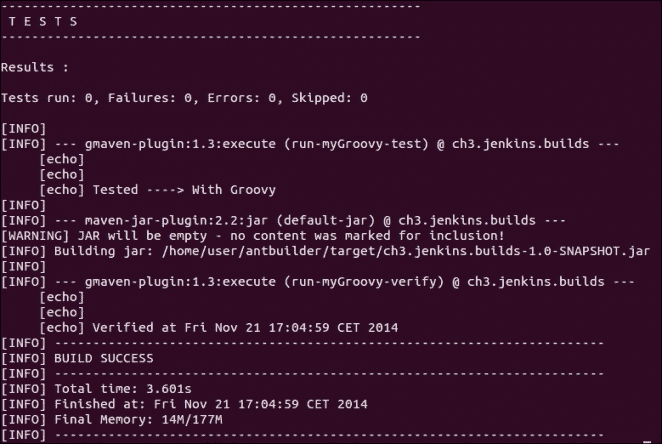
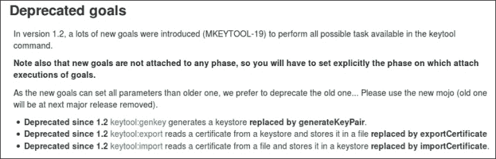

# 第三章：构建软件

本章中，我们将介绍以下内容：

+   在 Jenkins 中绘制替代代码指标图

+   通过 Maven 运行 Groovy 脚本

+   操纵环境变量

+   通过 Maven 在 Groovy 中运行 Ant

+   基于 JSP 语法错误使 Jenkins 作业失败

+   为集成测试配置 Jetty

+   使用 Rat 查看许可证违规情况

+   在 Maven 中审查许可证违规

+   通过构建描述公开信息

+   通过 groovy-postbuild 插件对生成的数据做出反应

+   通过 Jenkins API 远程触发作业

+   自适应站点生成

# 介绍

本章回顾了 Jenkins 和 Maven 构建之间的关系，还包含了一些使用 Groovy 和 Ant 进行脚本编写的内容。

Jenkins 是灵活性的大师。它在多个平台和技术上表现出色。Jenkins 具有直观的界面和清晰的配置设置。这对完成工作很有帮助。然而，同样重要的是，您清楚地定义 Jenkins 插件与 Maven 构建文件之间的界限。缺乏区分会使您不必要地依赖于 Jenkins。如果您知道您将始终通过 Jenkins 运行构建，则可以放置一些核心工作在 Jenkins 插件中，获得有趣的额外功能。

然而，如果您希望始终能够直接构建、测试和部署，那么您将需要保持`pom.xml`中的细节。您必须权衡利弊；拥有“功能蔓延”是很容易的。与编写冗长的`pom.xml`文件相比，UI 更容易配置。提高的可读性会导致较少的与配置相关的缺陷。对于您来说使用 Jenkins 完成大多数常见任务，如传输工件、通信和绘制测试趋势，也更加简单。Jenkins 与 Maven 之间的互动示例是使用 Jenkins Publish Over SSH 插件（[`wiki.jenkins-ci.org/display/JENKINS/Publish+Over+SSH+Plugin`](https://wiki.jenkins-ci.org/display/JENKINS/Publish+Over+SSH+Plugin)）。您可以配置传输文件或将以下内容添加到`pom.xml`中：

```
<build>
<plugins>
  <plugin>
    <artifactId>maven-antrun-plugin</artifactId>
    <configuration>
      <tasks>
        <scp file="${user}:${pass}@${host}:${file.remote}" localTofile="${file.local}"/>
      </tasks>
    </configuration>
    <dependencies>
      <dependency>
        <groupId>ant</groupId>
        <artifactId>ant-jsch</artifactId>
        <version>1.6.5</version>
      </dependency>
      <dependency>
        <groupId>com.jcraft</groupId>
        <artifactId>jsch</artifactId>
        <version>0.1.42</version>
      </dependency>
    </dependencies>
  </plugin>
</plugins>
</build>
```

记住特定 JAR 和版本的依赖关系，有时使用 Maven 插件会感觉像魔术一样。Jenkins 插件简化了细节。

Maven 使用配置文件，以便您可以在项目中使用不同的配置，例如开发、验收或生产服务器名称。这还允许您更新插件的版本号，从而简化维护工作。有关更多信息，请访问 [`maven.apache.org/guides/introduction/introduction-to-profiles.html`](http://maven.apache.org/guides/introduction/introduction-to-profiles.html)。

在本章后面，您将有机会使用 AntBuilder 运行 Groovy 脚本。每种方法都是可行的；使用取决于您的偏好而不是一个明确的选择。

Jenkins 插件可以很好地协同工作。例如，推广构建插件（[`wiki.jenkins-ci.org/display/JENKINS/Promoted+Builds+Plugin`](https://wiki.jenkins-ci.org/display/JENKINS/Promoted+Builds+Plugin)）在构建满足某些条件时发出信号，并在成功构建旁边放置一个图标，如下截图所示：


你可以使用此功能来发出信号，例如，通知质量保证团队需要测试构建，或者通知系统管理员收集构件并部署。其他插件也可以通过推广触发（例如，当开发人员使用推广插件签署构建时），包括 SSH 插件。然而，Maven 不知道推广机制。随着 Jenkins 的发展，预计会有更多的插件相互关系。

Jenkins 精通操作的编排。你应该将作业的运行时间最小化，并将较重的作业偏移到节点上。较重的作业往往聚集在文档生成或测试周围。Jenkins 允许你将作业链接在一起，因此作业将与特定的 Maven 目标相结合，例如集成测试（[`Maven.apache.org/guides/introduction/introduction-to-the-lifecycle.html#Lifecycle_Reference`](http://Maven.apache.org/guides/introduction/introduction-to-the-lifecycle.html#Lifecycle_Reference)）。在这种情况下，你可以选择编写一些构建文件，也许是一个多模块项目（[`maven.apache.org/guides/mini/guide-multiple-modules.html`](http://maven.apache.org/guides/mini/guide-multiple-modules.html)），或者是一个更厚的`pom.xml`文件，其中包含不同的目标，可以在作业之间调用。**保持简单傻瓜**（**KISS**）倾向于决策朝着一个较大的单一文件。

## Jenkins 是一个企业友好的技术中立平台。

Jenkins 是技术中立的，可以将组织、开发团队和软件在生命周期中的位置的项目技术粘合在一起。Jenkins 让你可以运行自己选择的脚本语言，轻松地使用 Git、子版本、CVS 和许多其他版本控制系统拉取源代码。如果 Jenkins 不兼容，开发人员可以通过一点实践编写自己的集成。

在本书中，你将看到涉及到子版本和 GIT 项目。这代表了一个现实的混合。许多人认为 Git 比子版本更加灵活多变。请放心在本书的示例中选择 Git 作为你的存储库。从一开始就设计，Jenkins 使你可以轻松选择不同的版本控制系统。

### 注

如果你看一下 2014 年初 Ohoh 的代表性集合中 Git 和子版本的相对使用情况，对于 Git，有 247,103 个存储库（总数的 37%），子版本有 324,895 个存储库（总数的 48%）。

典型企业在使用最现代化的服务时落后于小型组织，因为他们不愿改变工作流程。因此，预计与较小组织相比，这类企业的子版本仓库比例较高。

## 一个 pom.xml 模板

本章中的配方将包括`pom.xml`示例。为节省页面空间，只显示必要的细节。您可以从书籍网站下载完整的示例。

这些示例是针对 Maven 3.2.1 进行测试的，尽管这些示例应该与最新版本的 Maven 一起工作。

从主 Jenkins 配置屏幕（`http://localhost:8080/configure`）下的**Maven**部分，您将需要安装此版本，并为其提供标签`3.2.1`。

要为 Maven 项目生成基本模板，您有两个选择。您可以通过原型目标（[`Maven.apache.org/guides/introduction/introduction-to-archetypes.html`](http://Maven.apache.org/guides/introduction/introduction-to-archetypes.html)）创建项目，或者您可以从这里开始一个简单的`pom.xml`文件：

```
<project 

xsi:schemaLocation="http://maven.apache.org/POM/4.0.0 http://Maven.apache.org/maven-v4_0_0.xsd">
<modelVersion>4.0.0</modelVersion>
<groupId>org.berg</groupId>
<artifactId>ch3.builds.xxx</artifactId>
<version>1.0-SNAPSHOT</version>
<name>Template</name>
</project>
```

模板看起来简单，但只是较大有效`pom.xml`的一部分。它与 Maven 中隐藏的默认值相结合。要查看扩展版本，您需要运行以下命令：

```
mvn help:effective-pom

```

除非另有说明，否则应将配方中提到的片段插入模板中，就在`</project>`标签之前，根据约定更新您的`groupID`、`artifactID`和`version`值。有关更多详细信息，请访问[`maven.apache.org/guides/mini/guide-naming-conventions.html`](http://maven.apache.org/guides/mini/guide-naming-conventions.html)。

## Maven 变更

Maven 2 已经结束其生命周期（[`maven.apache.org/maven-2.x-eol.html`](http://maven.apache.org/maven-2.x-eol.html)），开发团队已经停止支持它。您不能指望及时删除新发现的错误。在撰写本书时，Maven 4 正在规划中，尚未发布。

如果您已经安装了作为软件包的 Maven 2，并希望升级到 Maven 3，则需要安装 Maven 软件包。要在不同 Maven 版本之间切换，您需要运行以下 Ubuntu 命令：

```
sudo update-alternatives --config mvn

```

## 设置文件系统 SCM

在前几章中，您使用了将文件复制到工作区的配方。这很容易解释，但受操作系统特定。您还可以通过文件系统 SCM 插件（[`wiki.jenkins-ci.org/display/JENKINS/File+System+SCM`](https://wiki.jenkins-ci.org/display/JENKINS/File+System+SCM)）进行文件复制，因为这是与操作系统无关的。您需要安装该插件，并确保文件具有正确的权限，以便 Jenkins 用户可以复制它们。在 Linux 中，考虑将文件放在 Jenkins 主目录`/var/lib/jenkins`下。

# 在 Jenkins 中绘制替代代码度量

本篇介绍了如何使用绘图插件绘制自定义数据（[`wiki.jenkins-ci.org/display/JENKINS/Plot+Plugin`](https://wiki.jenkins-ci.org/display/JENKINS/Plot+Plugin)）。这使您可以通过可视化方式展示数值构建数据。

Jenkins 有许多插件可以创建由构建生成的测试结果的视图。分析收集器插件从这些插件中汇总结果以创建聚合摘要和历史记录（[`wiki.jenkins-ci.org/display/JENKINS/Analysis+Collector+Plugin`](https://wiki.jenkins-ci.org/display/JENKINS/Analysis+Collector+Plugin)）。这非常适合绘制标准结果类型的历史记录，如 JUnit、JMeter、FindBugs 和 NCSS。还有一个 SonarQube 插件（[`docs.codehaus.org/display/SONAR/Jenkins+Plugin`](http://docs.codehaus.org/display/SONAR/Jenkins+Plugin)）支持将数据推送到 SonarQube（[`www.sonarsource.org/`](http://www.sonarsource.org/)）。SonarQube 专注于报告项目的代码质量。然而，尽管选项很多，但可能会有一天你需要绘制自定义结果。

假设你想了解在集成测试期间你的自定义缓存中生成了多少次命中或未命中的历史记录。通过构建的绘图可以让你了解代码的变化是改善还是降低了性能。数据是伪造的：一个简单的 Perl 脚本会生成随机结果。

## 准备工作

在 Jenkins 的插件**管理器**部分（`http://localhost:8080/pluginManager/available`），安装绘图插件。创建一个名为`ch3.building_software/plotting`的目录。

## 如何操作...

1.  创建`ch3.building_software/plotting/hit_and_miss.pl`文件，并添加以下代码行：

    ```
    #!/usr/bin/perl
    my $workspace = $ENV{'WORKSPACE'};

    open(P1, ">$workspace/hits.properties")|| die;
    open(P2, ">$workspace/misses.properties")|| die;
    print P1 "YVALUE=".rand(100);
    print P2 "YVALUE=".rand(50);
    ```

1.  创建一个自由样式的作业，**作业名称**为`ch3.plotting`。

1.  在**源代码管理**部分，勾选**文件系统**，并在**路径**字段中添加你的绘图目录的完全限定路径，例如`/var/lib/jenkins/cookbook/ch3.building_software/plotting`。

1.  在**构建**部分，为**执行 Shell**选择**添加构建步骤**，或者在 Windows 系统中，选择**执行 Windows**批处理命令。

1.  对于命令，添加`perl hit_and_miss.pl`。

1.  在**后构建操作**部分，选中**绘制构建数据**复选框。

1.  将以下值添加到新扩展区域：

    +   **绘图组**：`缓存数据`

    +   **绘图标题**：`命中和未命中`

    +   **绘图 y 轴标签**：`命中或未命中的次数`

    +   **绘图样式**：**堆积面积**

1.  在**数据系列文件**中输入`misses.properties`，在**数据系列图例**标签中输入`Misses`。

1.  在**数据系列文件**中输入`hits.properties`，在**数据系列图例**标签中输入`Hits`。

1.  在配置页面底部，点击**保存**按钮，如下图所示：

1.  多次运行该作业。

1.  查看**Plot**链接，你会看到类似以下截图：

## 它是如何工作的...

Perl 脚本生成两个属性文件：`hits`和`misses`。 `hits`文件包含介于 0 和 100 之间的`YVALUE`，而`misses`文件包含介于`0`和 50 之间的`YVALUE`。这些数字是随机生成的。然后绘图插件从`YVALUE`属性中读取值。

两个属性文件被绘图插件读取。该插件跟踪历史记录，它们的值显示在趋势图中。你将不得不尝试不同的图形类型，找到最佳的绘图方法来适应自定义测量。

目前有两种其他数据格式可供使用：XML 和 CSV。然而，在在线帮助清楚解释所使用的结构之前，我建议仍然使用属性格式。

选择 Perl 的原因是其编码简洁和跨平台特性。该脚本也可以用 Groovy 编写，并在 Maven 项目中运行。你可以在*通过 Maven 运行 Groovy 脚本*方法中看到一个 Groovy 示例。

## 更多信息...

绘图插件允许选择多种绘图类型，包括**区域**、**条形**、**条形 3D**、**线条**、**线条 3D**、**堆叠区域**、**堆叠条形**、**堆叠条形 3D**和**瀑布**。如果选择正确的图形类型，可以生成漂亮的图形。

如果想将这些自定义图形添加到报告中，必须保存它们。您可以通过在浏览器中右键单击图像来完成。

你可能希望有不同大小的图形。你可以通过访问`http://host/job/JobName/plot/getPlot?index=n&width=x&height=y`生成图像。

`[Width]`和`[height]`参数定义了图形的大小。 `n`是指向特定图表的索引号。如果只有一个图表，那么`n=0`。如果配置了两个图表，那么`n`可以是 0 或 1。要发现索引，请访问图表的链接，并检查**跳转到**下拉菜单，从中选择最高的**图表**编号之一，如下截图所示：


要根据本方法中的作业生成尺寸为 800 x 600 的 PNG 格式图形，可以使用类似`localhost:8080/job/ch3.plotting/plot/getPlot?index=0&width=800&height=600`的 URL。

### 提示

欲下载图像而不登录自己，请使用*通过 Jenkins API 远程触发作业*方法中提到的可脚本化身份验证方法。

## 参见

+   *通过 Maven 运行 Groovy 脚本*方法

+   *自适应站点生成*方法

+   *通过 Jenkins API 远程触发作业*方法

# 通过 Maven 运行 Groovy 脚本

本方法描述如何使用 GMaven 插件（[`docs.codehaus.org/display/GMAVEN/Home`](http://docs.codehaus.org/display/GMAVEN/Home)）运行 Groovy 脚本。

在构建中运行 Groovy 脚本的能力可以让您在 Maven 和 Jenkins 中始终使用同一种脚本语言。Groovy 可以在任何 Maven 阶段运行。有关详细信息，请参阅本篇中*关于 Maven 阶段*部分。

Maven 可以从构建文件内部执行 Groovy 源代码，也可以在另一个文件位置或从远程 Web 服务器执行。

### 注意

另一种插件是 GMavenPlus。要比较 GMaven 和 GMavenPlus 插件之间的差异，请访问[`docs.codehaus.org/display/GMAVENPLUS/Choosing+Your+Build+Tool`](http://docs.codehaus.org/display/GMAVENPLUS/Choosing+Your+Build+Tool)。

您可以在[`groovy.github.io/GMavenPlus/index.html`](http://groovy.github.io/GMavenPlus/index.html)找到有关如何配置插件的说明。

## 准备工作

创建一个名为`ch3.building_software/running_groovy`的目录。

### 提示

**脚本的可维护性**

为了以后重复使用，请考虑在构建文件之外集中您的 Groovy 代码。

## 如何做...

1.  在模板文件（在介绍中提到）的`</project>`标签之前添加以下代码行。确保`pom.xml`文件可被 Jenkins 读取：

    ```
    <build>
      <plugins>
        <plugin>
          <groupId>org.codehaus.gmaven</groupId>
          <artifactId>gmaven-plugin</artifactId>
          <version>1.3</version>
          <executions><execution>
          <id>run-myGroovy</id>
          <goals><goal>execute</goal></goals>
          <phase>verify</phase>
          <configuration>
            <classpath>
              <element>
                <groupId>commons-lang</groupId>
                <artifactId>commons-lang</artifactId>
                <version>2.6</version>
              </element>
            </classpath>
            <source>
              Import org.apache.commons.lang.SystemUtils
              if(!SystemUtils.IS_OS_UNIX) { fail("Sorry, Not a UNIX box")}
              def command="ls -l".execute()
              println "OS Type ${SystemUtils.OS_NAME}"
              println "Output:\n ${command.text}"
            </source>
          </configuration>
          </execution></executions>
        </plugin>
      </plugins>
    </build>
    ```

1.  创建一个自由风格的作业，将**作业名称**设为`ch3.groovy_verify`。

1.  在**源代码管理**部分，勾选**文件系统**并在**路径**字段中输入您的绘图目录的完整路径，例如`/var/lib/jenkins/cookbook/ch3.building_software/running_groovy`。

1.  在**构建**部分中，为**调用顶级 Maven 目标**选择**添加构建步骤**。在新展开的部分中，添加以下细节：

    +   **Maven 版本**：`3.2.1`

    +   **目标**：`verify`

1.  运行作业。如果您的系统是在*NIX 系统上，您将获得以下输出：

    ```
    OS Type Linux
    Output:
    total 12
    -rwxrwxrwx 1 jenkins jenkins 1165 2011-09-02 11:03 pom.xml
    drwxrwxrwx 1 jenkins jenkins 3120 2014-09-02 11:03 target

    ```

    在已正确配置 Jenkins 的 Windows 系统上，脚本将失败并显示以下消息：

    ```
    Sorry, Not a UNIX box

    ```

## 它是如何工作的...

您可以在构建过程中多次执行 GMaven 插件。在示例中，`verify`阶段是触发点。

要使 Groovy 插件能够找到其核心功能之外导入的类，您需要在`<classpath>`标签中添加一个元素。源代码包含在`<source>`标签内：

```
Import org.apache.commons.lang.SystemUtils
if(!SystemUtils.IS_OS_UNIX) { fail("Sorry, Not a UNIX box")}
def command="ls -l".execute()
println "OS Type ${SystemUtils.OS_NAME}"
println "Output:\n ${command.text}"
```

`Import`语句起作用是因为依赖项在`<classpath>`标签中被提及。

`SystemUtils`类（[`commons.apache.org/proper/commons-lang/javadocs/api-2.6/org/apache/commons/lang/SystemUtils.html`](https://commons.apache.org/proper/commons-lang/javadocs/api-2.6/org/apache/commons/lang/SystemUtils.html)）提供助手方法，例如判断您正在运行哪个操作系统、Java 版本和用户的主目录。

在这种情况下，`fail`方法允许 Groovy 脚本使构建失败，注意当您不在*NIX 操作系统上运行构建时。大部分时间，您希望您的构建是与操作系统无关的。然而，在集成测试期间，您可能希望使用特定操作系统通过一个特定的 Web 浏览器执行功能测试。如果您的测试发现自己在错误的节点上，检查将停止构建。

### 提示

一旦您满意您的 Groovy 代码，请考虑将代码编译成底层 Java 字节码。您可以在 [`docs.codehaus.org/display/GMAVEN/Building+Groovy+Projects`](http://docs.codehaus.org/display/GMAVEN/Building+Groovy+Projects) 找到完整的说明。

## 还有更多...

以下是您可能会发现有用的一些提示。

### 警告跟踪

重要的是要审查您的日志文件，不仅在失败时，还要注意警告。在这种情况下，您会看到两个警告：

+   `[WARNING] 使用平台编码（实际上是 UTF-8）进行复制`

+   `[WARNING] JAR will be empty - no content was marked for inclusion!`

平台编码警告说明将使用默认平台编码复制文件。如果更改服务器并且服务器上的默认编码不同，则复制结果也可能不同。为了保持一致性，最好在`<build>`标签之前添加以下行以强制在文件中使用特定编码：

```
<properties><project.build.sourceEncoding>UTF8</project.build.sourceEncoding>
</properties>
```

更新您的模板文件以考虑这一点。

JAR 警告是因为我们只运行了一个脚本，并没有内容来制作一个 JAR。如果您在比 JAR 打包更早的阶段调用了脚本，就不会触发警告。

### 我的源代码在哪里？

还有两种指向要执行的 Groovy 脚本的方法。第一种方法是指向文件系统，如下所示：

```
<source>${script.dir}/scripts/do_some_good.Groovy</source>
```

另一种方法是通过以下方式通过 URL 连接到 Web 服务器：

```
<source>http://localhost/scripts/test.Groovy</source>
```

使用 Web 服务器存储 Groovy 脚本会为基础架构增加额外的依赖性。但是，它也非常适合在具有 Web 访问权限的 SCM 中集中代码。

### Maven 阶段

Jenkins 将工作组合在作业中。它对于具有预先和后续构建支持的粗粒度构建是有效的。相比之下，Maven 更加精细，具有 21 个阶段作为触发点。有关更多信息，请访问 [`Maven.apache.org/guides/introduction/introduction-to-the-lifecycle.html`](http://Maven.apache.org/guides/introduction/introduction-to-the-lifecycle.html)。

目标绑定阶段。例如，有四个阶段 `pre-site`、`site`、`post-site` 和 `site-deploy` 用于站点目标，所有这些阶段都将按顺序由 `mvn site` 调用，或者直接使用 `mvn site:phase` 语法调用。

思想是将一系列轻量级作业串在一起。您应该将任何重型作业（例如集成测试或大量 JavaDoc 生成）分配给从节点。您还应该按时间分离以均匀负载并帮助诊断问题。

您可以在 [`git-wip-us.apache.org/repos/asf?p=maven.git;a=blob;f=maven-core/src/main/resources/META-INF/plexus/components.xml`](https://git-wip-us.apache.org/repos/asf?p=maven.git;a=blob;f=maven-core/src/main/resources/META-INF/plexus/components.xml) 找到 XML 配置生命周期代码的方式。

您会在 `components.xml` 中的以下行下找到 Maven 阶段的提及：

```
<!-- START SNIPPET: lifecycle -->
```

Maven 插件绑定到特定阶段。对于站点生成，`<reporting>` 标签围绕大部分配置。在报告下配置的插件生成有用信息，其结果保存在 `target/site` 目录下。有一些插件会获取生成的结果，然后绘制它们的历史。一般来说，Jenkins 插件不执行测试；它们消耗结果。有一些例外，比如 Sloccount 插件 ([`wiki.jenkins-ci.org/display/JENKINS/SLOCCount+Plugin`](https://wiki.jenkins-ci.org/display/JENKINS/SLOCCount+Plugin)) 和任务扫描器插件 ([`wiki.jenkins-ci.org/display/JENKINS/Task+Scanner+Plugin`](https://wiki.jenkins-ci.org/display/JENKINS/Task+Scanner+Plugin))。这些差异将在稍后的 第五章 *使用度量改进质量* 中探讨。

### 注意

要安装 sloccount 插件，您首先需要安装静态分析实用程序插件。

Groovy 插件在所有阶段都非常有用，因为它不专门针对任何特定任务，比如打包或部署。它为您提供了一种统一的方法来应对超出 Maven 通用功能范围之外的情况。

### 小贴士

**Maven 版本之间的差异**

要升级到 Maven 3 项目之间的 Maven 2 和 Maven 3，您需要了解差异和不兼容性。有一些差异，特别是围绕站点生成。它们在 [`cwiki.apache.org/confluence/display/MAVEN/Maven+3.x+Compatibility+Notes`](https://cwiki.apache.org/confluence/display/MAVEN/Maven+3.x+Compatibility+Notes) 中总结。

您可以在 [`cwiki.apache.org/confluence/display/MAVEN/Maven+3.x+Plugin+Compatibility+Matrix`](https://cwiki.apache.org/confluence/display/MAVEN/Maven+3.x+Plugin+Compatibility+Matrix) 找到插件兼容性列表。

## 另请参阅

+   在 Maven 中通过 Groovy 运行 Ant 的配方

+   使用 groovy-postbuild 插件 *响应生成的数据的差异* 配方

+   *自适应站点生成* 配方

# 操作环境变量

本配方向您展示如何将变量从 Jenkins 传递到您的构建作业，并说明不同变量是如何被覆盖的。它还描述了一种在关键信息未正确传递时使构建失败的方法。

在典型的开发/验收/生产环境中，您可能希望保留相同的 `pom.xml` 文件，但传递不同的配置。一个示例是属性文件的扩展名，例如 `.dev`、`.acc` 和 `.prd`。如果由于人为错误导致关键配置值丢失，您将希望使构建失败。

Jenkins 有许多插件可用于将信息传递给构建，包括 EnvFile 插件 ([`wiki.jenkins-ci.org/display/JENKINS/Envfile+Plugin`](https://wiki.jenkins-ci.org/display/JENKINS/Envfile+Plugin)) 和 EnvInject 插件 ([`wiki.jenkins-ci.org/display/JENKINS/EnvInject+Plugin`](https://wiki.jenkins-ci.org/display/JENKINS/EnvInject+Plugin))。由于 EnvInject 插件据说可以与节点一起工作并提供广泛的属性注入选项，因此选择了 EnvInject 插件用于此配方。

## 准备工作

安装 EnvInject 插件 ([`wiki.jenkins-ci.org/display/JENKINS/EnvInject+Plugin`](https://wiki.jenkins-ci.org/display/JENKINS/EnvInject+Plugin))。创建名为`ch3.building_software/environment`的配方目录。

## 如何操作...

1.  创建一个可由 Jenkins 读取的`pom.xml`文件，并添加以下代码行：

    ```
    <project 

    xsi:schemaLocation="http://maven.apache.org/POM/4.0.0 http://maven.apache.org/maven-v4_0_0.xsd">
    <modelVersion>4.0.0</modelVersion>
    <groupId>org.berg</groupId>
    <artifactId>ch3.jenkins.builds.properties</artifactId>
    <version>1.0-SNAPSHOT</version>
    <name>${name.from.jenkins}</name>
    <properties><project.build.sourceEncoding>UTF8</project.build.sourceEncoding>
    </properties>
    <build>
    <plugins><plugin>
    <groupId>org.codehaus.gmaven</groupId>
    <artifactId>gmaven-plugin</artifactId>
    <version>1.3</version>
    <executions><execution>
    <id>run-myGroovy</id>
    <goals><goal>execute</goal></goals>
    <phase>verify</phase>
    <configuration>
    <source>
    def environment = System.getenv()
    println "----Environment"
    environment.each{println it } 
    println "----Property"
    println(System.getProperty("longname"))
    println "----Project and session"
    println "Project: ${project.class}"
    println "Session: ${session.class}"
    println "longname: ${project.properties.longname}"
    println "Project name: ${project.name}"
    println "JENKINS_HOME: ${project.properties.JENKINS_HOME}"
    </source>
    </configuration>
    </execution></executions>
    </plugin></plugins>
    </build>
    </project>
    ```

1.  在与`pom.xml`文件相同的目录中创建一个名为`my.properties`的文件。然后，在`my.properties`文件中添加以下代码行：

    ```
    project.type=prod
    secrets.file=/etc/secrets
    enable.email=true
    JOB_URL=I AM REALLY NOT WHAT I SEEM
    ```

1.  创建一个空白的自由风格作业，**作业名称**为`ch3.environment`。

1.  在**源码管理**部分，勾选**文件系统**并在**路径**字段中添加您目录的完全合格路径，例如`/var/lib/jenkins/cookbook/ch3.building_software/environment`。

1.  在**构建**部分，为**调用顶级 Maven 目标**选择**添加一个构建步骤**。在新展开的部分中，添加以下细节：

    +   **Maven 版本**: `3.2.1`

    +   **目标**: `verify`

1.  点击**高级**按钮，在**属性**中键入`longname=超级好`。

1.  通过选中作业配置页面顶部附近的**为作业准备环境**复选框来注入`my.properties`中的值。

1.  对于**属性文件路径**，添加`/full_path/my.properties`；例如`/home/var/lib/cookbook/ch3.building_software/environment/my.properties`。

    前面的选项如下图所示：

    

1.  运行作业。构建将失败:

    ```
    ----Project and session
    Project: class org.apache.Maven.model.Model
    Session: class org.apache.Maven.execution.MavenSession
    longname: SuperGood
    [INFO] -------------------------------------------------------
    [ERROR] BUILD ERROR
    [INFO] -------------------------------------------------------
    [INFO] Groovy.lang.MissingPropertyException: No such property: name for class: script1315151939046

    ```

1.  在**构建**部分，对于**调用顶级 Maven 目标**，点击**高级**按钮。在新展开的部分中，添加一个额外的属性 `name.from.jenkins=带名称的构建`。

1.  运行作业。现在应该成功了。

## 工作原理...

EnvInject 插件对于将属性注入到构建中非常有用。

在这个配方中，Maven 被运行了两次。第一次，它在没有定义`name.from.jenkins`变量的情况下运行，Jenkins 作业失败了。第二次，它在定义了该变量的情况下运行，Jenkins 作业现在成功了。

Maven 期望定义了`name.from.jenkins`变量，否则项目的名称也将不会被定义。通常，这还不足以阻止您的作业成功。但是，当运行 Groovy 代码时，特别是`println "Project name: ${project.name}"`行中的`project.name`调用将导致构建失败。这对于防止缺少属性值非常有用。

Groovy 代码可以看到`org.apache.Maven.model.Model`项目的实例和`org.apache.Maven.execution.MavenSession`类的实例。项目实例是您可以以编程方式访问的 XML 配置的模型。您可以通过`project.properties.longname`引用来获取`longname`属性。如果属性不存在，您的 Maven 目标将失败。您还可以通过`System.getProperty("longname")`调用获取属性。但是，您无法通过使用`System.getenv()`环境调用获取属性。

值得学习各种选项：

+   **保留 Jenkins 环境变量** 和 **保留 Jenkins 构建变量**：这两个选项影响您的作业看到的与 Jenkins 相关的变量。保持您的环境尽可能干净是很好的，因为这将有助于您以后进行调试。

+   **属性内容**：您可以覆盖属性文件中的特定值。

+   **环境脚本文件路径**：此选项指向一个脚本，该脚本将设置您的环境。如果您想要检测运行环境的特定细节并相应地配置构建，这将非常有用。

+   **填充构建原因**：您可以使 Jenkins 设置`BUILD_CAUSE`环境变量。该变量包含有关触发作业的事件的信息。

## 还有更多...

Maven 有一个用于读取属性的插件（[`mojo.codehaus.org/properties-maven-plugin/`](http://mojo.codehaus.org/properties-maven-plugin/)）。要在属性文件之间进行选择，您需要在插件配置中设置一个变量，并在 Jenkins 作业中调用它，如下所示：

```
<build>
<plugins>
<plugin>
<groupId>org.codehaus.mojo</groupId>
<artifactId>properties-maven-plugin</artifactId>
<version>1.0-alpha-2</version>
<executions>
<execution>
<phase>initialize</phase>
<goals>
<goal>read-project-properties</goal>
</goals>
<configuration>
<files>
<file>${fullpath.to.properties}</file>
</files>
</configuration>
</execution>
</executions>
</plugin>
</plugins>
</build>
```

如果您使用相对路径到属性文件，则该文件可以驻留在您的源代码中。如果您使用全路径，则属性文件可以存储在 Jenkins 服务器上。如果包含敏感密码（例如数据库连接密码），则第二个选项更可取。

Jenkins 有能力在您手动运行作业时请求变量。这称为参数化构建（[`wiki.jenkins-ci.org/display/JENKINS/Parameterized+Build`](https://wiki.jenkins-ci.org/display/JENKINS/Parameterized+Build)）。在构建时，您可以通过从属性文件位置的选择中进行选择来选择您的属性文件。

## 另请参见

+   *在 Maven 中通过 Groovy 运行 Ant* 的步骤

# 在 Maven 中通过 Groovy 运行 Ant

Jenkins 与技术背景广泛的观众进行交互。有许多开发人员在转向使用 Maven 之前已经熟练掌握了 Ant 脚本编写，这些开发人员可能更喜欢编写 Ant 任务而不是编辑`pom.xml`文件。在大部分组织中，仍然运行着关键任务的 Ant 脚本。

在 Maven 中，您可以直接使用 AntRun 插件（[`maven.apache.org/plugins/maven-antrun-plugin/`](http://maven.apache.org/plugins/maven-antrun-plugin/)）或通过 Groovy（[`docs.codehaus.org/display/GROOVY/Using+Ant+from+Groovy`](http://docs.codehaus.org/display/GROOVY/Using+Ant+from+Groovy)）运行 Ant 任务。AntRun 代表了一条自然的迁移路径。这是最初工作量最小的路径。

对于将 Groovy 作为任务的一部分使用的 Jenkins 管理员来说，Groovy 方法是有意义的。Groovy 作为一种一流的编程语言，拥有一系列难以在 Ant 中复制的控制结构。您可以部分地通过使用`Ant-contrib`库（[`ant-contrib.sourceforge.net`](http://ant-contrib.sourceforge.net)）来实现这一点。然而，作为一个功能丰富的编程语言，Groovy 更加表达力强。

本教程详细介绍了如何运行涉及 Groovy 和 Ant 的两个 Maven POM。第一个 POM 向您展示了如何在 Groovy 中运行最简单的 Ant 任务，而第二个则执行一个 Ant-contrib 任务，以安全地从大量计算机复制文件。

## 准备工作

创建一个名为`ch3.building_software/antbuilder`的目录。

## 如何做...

1.  创建一个模板文件并命名为`pom_ant_simple.xml`。

1.  更改`groupId`、`artifactId`、`version`和`name`的值以适应您的偏好。

1.  在`</project>`标签之前添加以下 XML 片段：

    ```
    <build>
    <plugins><plugin>
    <groupId>org.codehaus.gmaven</groupId>
    <artifactId>gmaven-plugin</artifactId>
    <version>1.3</version>
    <executions>
    <execution>
    <id>run-myGroovy-test</id>
    <goals><goal>execute</goal></goals>
    <phase>test</phase>
    <configuration>
    <source>
    def ant = new AntBuilder()
    ant.echo("\n\nTested ----> With Groovy")
    </source>
    </configuration>
    </execution>
    <execution>
    <id>run-myGroovy-verify</id>
    <goals><goal>execute</goal></goals>
    <phase>verify</phase>
    <configuration>
    <source>
    def ant = new AntBuilder()
    ant.echo("\n\nVerified at ${new Date()}")
    </source>
    </configuration>
    </execution>
    </executions>
    </plugin></plugins>
    </build>
    ```

1.  运行`mvn test –f pom_ant_simple.xml`。查看输出（请注意，没有关于空 JAR 文件的警告）：

1.  运行`mvn verify –f pom_ant_simple.xml`。查看输出；它应该类似于以下屏幕截图：

1.  创建第二个模板文件并命名为`pom_ant_contrib.xml`。

1.  更改`groupId`、`artifactId`、`version`和`name`的值以适应您的偏好。

1.  在`</project>`标签之前添加以下 XML 片段：

    ```
    <build>
    <plugins><plugin>
    <groupId>org.codehaus.gmaven</groupId>
    <artifactId>gmaven-plugin</artifactId>
    <version>1.3</version>
    <executions><execution>
    <id>run-myGroovy</id>
    <goals><goal>execute</goal></goals>
    <phase>verify</phase>
    <configuration>
    <source>
    def ant = new AntBuilder()
    host="Myhost_series"
    print "user: "
    user = new String(System.console().readPassword())
    print "password: "
    pw = new String(System.console().readPassword())

    for ( i in 1..920) {
    counterStr=String.format('%02d',i)
    ant.scp(trust:'true',file:"${user}:${pw}${host}${counterStr}:/${full_path_to_location}",
    localTofile:"${myfile}-${counterStr}", verbose:"true")   
    }
    </source>
    </configuration>
    </execution></executions>
    <dependencies>
    <dependency>
    <groupId>ant</groupId>
    <artifactId>ant</artifactId>
    <version>1.6.5</version>
    </dependency>
    <dependency>
    <groupId>ant</groupId>
    <artifactId>ant-launcher</artifactId>
    <version>1.6.5</version>
    </dependency>
    <dependency>
    <groupId>ant</groupId>
    <artifactId>ant-jsch</artifactId>
    <version>1.6.5</version>
    </dependency>
    <dependency>
    <groupId>com.jcraft</groupId>
    <artifactId>jsch</artifactId>
    <version>0.1.42</version>
    </dependency>
    </dependencies>
    </plugin></plugins>
    </build>
    ```

这只是代表性代码，除非您已经设置它指向真实服务器上的真实文件：

```
mvn verify –f pom_ant_simple.xml will fail

```

## 它的工作原理...

Groovy 运行基本的 Ant 任务而无需额外的依赖关系。创建一个`AntBuilder`实例（[`groovy.codehaus.org/Using+Ant+Libraries+with+AntBuilder`](http://groovy.codehaus.org/Using+Ant+Libraries+with+AntBuilder)），然后调用 Ant echo 任务。在底层，Groovy 调用 Ant 用于执行`echo`命令的 Java 类。在`echo`命令中，通过直接创建一个匿名对象打印日期：

```
ant.echo("\n\nVerified at ${new Date()}").
```

您配置了`pom.xml`文件以在两个阶段触发 Groovy 脚本：`test`阶段，然后稍后在`verify`阶段。`test`阶段发生在生成 JAR 文件之前，因此避免了创建有关空 JAR 文件的警告。顾名思义，此阶段用于打包前的测试。

第二个示例脚本突显了将 Groovy 与 Ant 结合使用的优势。SCP 任务 ([`ant.apache.org/manual/Tasks/scp.html`](http://ant.apache.org/manual/Tasks/scp.html)) 在许多服务器上多次运行。脚本首先要求输入用户名和密码，避免存储在您的文件系统或版本控制系统中。Groovy 脚本期望您注入 `host`、`full_path_to_location` 和 `myfile` 变量。

注意 Ant SCP 任务与 `pom_ant_contrib.xml` 文件中表达方式的相似之处。

## 还有更多...

通过 Groovy 运行 Ant 的另一个示例是动态创建自定义属性文件。这允许您将信息从一个 Jenkins 作业传递到另一个作业。

您可以通过 AntBuilder 使用 `echo` 任务创建属性文件。以下代码行创建一个包含两行 `x=1` 和 `y=2` 的 `value.properties` 文件：

```
def ant = new AntBuilder()
ant.echo(message: "x=1\n", append: "false", file: "values.properties")
ant.echo(message: "y=2\n", append: "true", file: "values.properties")
```

第一个 `echo` 命令将 `append` 设置为 `false`，这样每次构建发生时，都会创建一个新的属性文件。第二个 `echo` 附加其消息。

### 注意

你可以移除第二个 `append` 属性，因为默认值已设置为 `true`。

## 另请参阅

+   *通过 Maven 运行 Groovy 脚本* 配方

# 基于 JSP 语法错误导致 Jenkins 作业失败

**JavaServer Pages** (**JSP**) ([`www.oracle.com/technetwork/java/overview-138580.html`](http://www.oracle.com/technetwork/java/overview-138580.html)) 是一种使创建简单 Web 应用程序变得简单的标准。您可以将 HTML 编写到文本文件中，例如带有额外标签的页面与 Java 代码交错。如果您在运行的 Web 应用程序中执行此操作，则代码将在下一页调用时重新编译。此过程支持敏捷编程实践，但风险在于开发人员编写混乱、难以阅读的 JSP 代码，难以维护。如果 Jenkins 能够显示有关代码质量的指标，那将很好。

用户首次请求页面时，JSP 页面会即时编译。用户会将此视为页面加载缓慢，并可能阻止他们未来的访问。为了避免这种情况，您可以在构建过程中编译 JSP 页面，并将编译后的代码放置在您 Web 应用程序的 `WEB-INF/classes` 目录中或打包到 `WEB-INF/lib` 目录中。这种方法具有更快的第一页加载速度的优势。

拥有已编译源代码的次要优势是您可以在代码库上运行许多统计代码审查工具，并获取可测试性指标。这将生成供 Jenkins 插件显示的测试数据。

本文介绍了如何基于 maven-jetty-jspc-plugin ([`www.eclipse.org/jetty/documentation/current/jetty-jspc-maven-plugin.html`](http://www.eclipse.org/jetty/documentation/current/jetty-jspc-maven-plugin.html)) 编译 JSP 页面的配方。编译后的代码将与 Jetty 服务器一起使用，Jetty 服务器通常用于集成测试。

### 注意

本教程中提到的 JSP 故意不安全，因此稍后在本书中进行测试。

用于 Tomcat 部署的补充插件是 Tomcat Maven 插件 ([`tomcat.apache.org/maven-plugin.html`](http://tomcat.apache.org/maven-plugin.html))。

## 准备工作

创建一个名为 `ch3.building_software/jsp_example` 的目录。

## 如何操作...

1.  通过输入以下命令从 Maven 原型创建一个 WAR 项目：

    ```
    mvn archetype:generate -DarchetypeArtifactId=maven-archetype-webapp

    ```

1.  输入以下值：

    +   **groupId**: `ch3.packt.builds`

    +   **artifactId**: `jsp_example`

    +   **version**: `1.0-SNAPSHOT`

    +   **package**: `ch3.packt.builds`

1.  单击 **输入以确认值**。

1.  通过添加以下构建部分编辑 `jsp_example/pom.xml` 文件：

    ```
    <build>
    <finalName>jsp_example</finalName>
    <plugins>
    <plugin>
    <groupId>org.mortbay.jetty</groupId>
    <artifactId>maven-jetty-jspc-plugin</artifactId>
    <version>6.1.14</version>
    <executions>
    <execution>
    <id>jspc</id>
    <goals>
    <goal>jspc</goal>
    </goals>
    <configuration>
    </configuration>
    </execution>
    </executions>
    </plugin>
    <plugin>
    <groupId>org.apache.maven.plugins</groupId>
    <artifactId>maven-war-plugin</artifactId>
    <version>2.4</version>
    <configuration>
    <webXml>${basedir}/target/web.xml</webXml>
    </configuration>
    </plugin>
    </plugins>
    </build>
    ```

1.  将 `src/main/webapp/index.jsp` 文件中的代码段替换为以下代码行：

    ```
    <html>
      <head>
        <meta http-equiv="Content-Type" content="text/html; charset=UTF-8">
        <title>Hello World Example</title>
      </head>
      <body>
        <% String evilInput= null;
          evilInput = request.getParameter("someUnfilteredInput");
          if (evilInput==null){evilInput="Hello Kind Person";}
        %>
        <form action="index.jsp">
          The big head says: <%=evilInput%><p>
          Please add input:<input type='text' name='someUnfilteredInput'>
          <input type="submit">
        </form>
      </body>
    </html>
    ```

1.  使用 `mvn package` 命令创建 WAR 文件。

1.  修改 `./src/main/webapp/index.jsp`，在以 `if` 开头的行下面添加 `if (evilInput==null)`，以使其不再是有效的 JSP 文件。

1.  运行 `mvn package` 命令。现在，构建将因以下错误消息而失败：

    ```
    [ERROR] Failed to execute goal org.mortbay.jetty:maven-jetty-jspc-plugin:6.1.14:jspc (jspc) on project jsp_example: Failure processing jsps -> [Help 1]

    ```

## 工作原理...

您使用原型创建了一个模板项目。

Maven 插件在看到 `index.jsp` 页面时，会将其编译为名为 `jsp.index_jsp` 的类，并将编译后的类放置在 `WEB-INF/classes` 下。然后，该插件在 `WEB-INF/web.xml` 中将该类定义为一个 servlet，并将其映射到 `/index.jsp`。让我们看一下以下示例：

```
<servlet>
  <servlet-name>jsp.index_jsp</servlet-name>
  <servlet-class>jsp.index_jsp</servlet-class>
</servlet>

<servlet-mapping>
  <servlet-name>jsp.index_jsp</servlet-name>
  <url-pattern>/index.jsp</url-pattern>
</servlet-mapping>
```

### 提示

原型列表会随着时间的推移而增加。您可以在 [`maven-repository.com/archetypes`](http://maven-repository.com/archetypes) 找到完整的列表。如果您正在使用 Ubuntu，则会在 `~/.m2` 目录中找到名为 `archetype-catalog.xml` 的本地 XML 目录，其中列出了所有的原型。

## 还有更多...

以下是您应考虑的一些事项。

### 不同的服务器类型

默认情况下，Jetty Maven 插件（版本 6.1.14）使用 JDK 15 加载 JSP 2.1 库。这对于所有服务器类型都不起作用。例如，如果将此教程生成的 WAR 文件部署到 Tomcat 7 服务器上，则将无法正确部署。如果查看 `logs/catalina.out`，您将看到以下错误：

```
javax.servlet.ServletException: Error instantiating servlet class jsp.index_jsp
Root Cause
java.lang.NoClassDefFoundError: Lorg/apache/jasper/runtime/ResourceInjector;

```

这是因为不同的服务器对 JSP 代码的编译方式以及运行所依赖的库有不同的假设。对于 Tomcat，您需要调整所使用的编译器以及 Maven 插件的依赖关系。有关更多详细信息，请访问 [`wiki.eclipse.org/Jetty/Feature/Jetty_Maven_Plugin`](http://wiki.eclipse.org/Jetty/Feature/Jetty_Maven_Plugin)。

### Eclipse JSP 页面模板

Eclipse 是 Java 开发人员的流行开源 IDE ([`www.eclipse.org/`](http://www.eclipse.org/))。如果您正在使用 Eclipse 的默认 JSP 页面模板，则您的页面可能无法编译。这是因为在撰写本文时，默认编译器不喜欢在 `<html>` 标签之前提及的元信息，如下所示：

```
<%@ page language="java" contentType="text/html;charset=UTF-8"
pageEncoding="UTF-8"%>
<!DOCTYPE html PUBLIC "-//W3C//DTD HTML 4.01 Transitional//EN" "http://www.w3.org/TR/html4/loose.dtd">
```

由于元信息遵循 JSP 规范，所以很可能以后 JSP 编译器会接受这些信息。在那一天之前，只需在编译之前删除这些行或更改你使用的 JSP 编译器。

## 另请参阅

+   *配置 Jetty 进行集成测试*配方

# 配置 Jetty 进行集成测试

通常保留测试历史记录的 Jenkins 插件是 Maven 构建中生成的数据的使用者。要让 Maven 自动运行集成、性能或功能测试，它需要访问一个活动的测试服务器。你有两个主要选择：

+   **部署你的艺术品，比如 WAR 文件到一个活动的服务器**：这可以通过 Maven Wagon 插件（[`mojo.codehaus.org/wagon-maven-plugin/`](http://mojo.codehaus.org/wagon-maven-plugin/)）或通过一个 Jenkins 插件来完成，比如名为 Deploy 的插件（[`wiki.jenkins-ci.org/display/JENKINS/Deploy+Plugin`](https://wiki.jenkins-ci.org/display/JENKINS/Deploy+Plugin)）。

+   **在构建中运行轻量级 Jetty 服务器**：这简化了你的基础设施。但是，服务器将作为 Jenkins 作业的一部分运行，消耗潜在的稀缺资源。这将限制 Jenkins 可以运行的并行执行器数量，降低作业的最大吞吐量。这应该委托给专门为此目的设置的专用从节点。

这个配方运行了在*基于 JSP 语法错误的失败 Jenkins 作业*配方中开发的 Web 应用程序，通过在运行测试之前启动服务器并在测试之后关闭来将 Jetty 与集成测试联系起来。该构建创建了一个自签名证书。为 HTTP 和安全的 TLS 流量定义了两个 Jetty 连接器。为了创建一个到 Telnet 的端口，还定义了`shutdown`命令。

## 准备工作

按照*基于 JSP 语法错误的失败 Jenkins 作业*配方生成一个 WAR 文件。将项目复制到名为`ch3.building_software/jsp_jetty`的目录中。

## 如何做...

1.  在`pom.xml`文件的`</plugins>`标签之前添加以下 XML 片段：

    ```
    <plugin>
    <groupId>org.codehaus.mojo</groupId>
    <artifactId>keytool-maven-plugin</artifactId>
    <version>1.5</version>
    <executions>
    <execution>
    <phase>generate-resources</phase>
    <id>clean</id>
    <goals>
    <goal>clean</goal>
    </goals>
    </execution>
    <execution>
    <phase>generate-resources</phase>
    <id>generateKeyPair</id>
    <goals>
    <goal>generateKeyPair</goal>
    </goals>
    </execution>
    </executions>
    <configuration>
    <keystore>${project.build.directory}/jetty-ssl.keystore</keystore>
    <dname>cn=HOSTNAME</dname>
    <keypass>jetty8</keypass>
    <storepass>jetty8</storepass>
    <alias>jetty8</alias>
    <keyalg>RSA</keyalg>
    </configuration>
    </plugin>
    <plugin>
    <groupId>org.mortbay.jetty</groupId>
    <artifactId>jetty-maven-plugin</artifactId>
    <version>8.1.16.v20140903</version>
    <configuration>
    <war>${basedir}/target/jsp_example.war</war>
    <stopPort>8083</stopPort>
    <stopKey>stopmeplease</stopKey>
    <connectors>
    <connector implementation="org.eclipse.jetty.server.nio.SelectChannelConnector">
    <port>8082</port>
    </connector>
    <connector implementation="org.eclipse.jetty.server.ssl.SslSocketConnector">
    <port>9443</port>
    <keystore>
    ${project.build.directory}/jetty-ssl.keystore</keystore>
    <password>jetty8</password>
    <keyPassword>jetty8</keyPassword>
    </connector>
    </connectors>
    </configuration>
    <executions>
    <execution>
    <id>start-jetty</id>
    <phase>pre-integration-test</phase>
    <goals>
    <goal>run</goal>
    </goals>
    <configuration>
    <daemon>true</daemon>
    </configuration>
    </execution>
    <execution>
    <id>stop-jetty</id>
    <phase>post-integration-test</phase>
    <goals>
    <goal>stop</goal>
    </goals>
    </execution>
    </executions>
    </plugin>
    ```

1.  运行`mvn jetty:run`命令。现在你会看到 Jetty 服务器启动时的控制台输出。

1.  使用 Web 浏览器，访问`https://localhost:9443`位置。在通过有关自签名证书的警告后，你将看到 Web 应用程序正常工作。

1.  按下*Ctrl* + *C*停止服务器。

1.  运行`mvn verify`。现在你会看到服务器启动然后停止。

## 工作原理...

在 `<executions>` 标签内，Jetty 在 Maven 的 `pre-integration-test` 阶段运行，并且在 Maven 的 `post-integration-test` 阶段停止。在 `generate-resources` 阶段，Maven 使用 `keytool` 插件创建自签名证书。证书存储在具有已知密码和别名的 Java `keystore` 中。密钥加密设置为 RSA。如果您的证书中未正确设置 **Common Name** (**CN**)，则您的网络浏览器将会报错。要将证书的 **Distinguished Name** (**DN**) 更改为您主机的名称，请修改 `<dname>cn=HOSTNAME</dname>`。

Jetty 配置有两种连接器类型：端口 `8082` 用于 HTTP，端口 `9443` 用于安全连接。选择这些端口是因为它们在端口 `1023` 以上，因此您无需管理员权限即可运行构建。端口号还避免了 Jenkins 使用的端口。`jetty` 和 `Keytool` 插件都使用 `keystore` 标签来定义密钥库的位置。

生成的 WAR 文件由 `webapp` 标签指向，并且 Jetty 运行应用程序。

### 注意

对于功能测试人员来说，使用自签名证书会增加额外的工作量。每当他们遇到证书的新版本时，他们都需要在其网络浏览器中将证书接受为安全异常。最好使用来自知名权威机构的证书。通过删除密钥生成并将 `keystore` 标签指向已知文件位置，您可以通过此方法实现这一点。

## 还有更多...

Maven 3 对于定义插件版本比 Maven 2.2.1 更挑剔。这是有充分理由的。如果你知道你的构建能够很好地与特定版本的 Maven 配合工作，那么这可以防止不必要的变化。例如，在撰写本书时，此示例中使用的 Jetty 插件被保持在版本 8.1.16.v20140903。正如你可以从[这里的错误报告](http://jira.codehaus.org/browse/JETTY-1071)中看到的，配置细节随着版本的变化而变化。

另一个优点是，如果插件版本过旧，则插件将被从中央插件仓库中移除。当您下次清理本地仓库时，这将破坏您的构建。这正是您想要的，因为这清晰地表明了需要进行审查然后升级。

## 另请参阅

+   *基于 JSP 语法错误的 Jenkins 作业失败* 方法

+   *自适应站点生成* 方法

# 使用 Rat 查看许可证违规行为

此方法描述了如何在 Jenkins 中搜索任何作业的许可证违规情况。它基于 Apache Rat 项目 ([`creadur.apache.org/rat/`](http://creadur.apache.org/rat/))。您可以通过直接运行贡献的 Ant 任务或通过 Maven 来运行 Rat JAR 文件以搜索许可证违规情况。在此方法中，您将通过 JAR 文件直接运行。报告输出会发送到控制台，准备供 Jenkins 插件（如日志解析插件）处理信息。

## 准备工作

在 Jenkins 主目录 (`/var/lib/jenkins`) 下创建 `License_Check` 目录。登录 Jenkins。

## 怎么做...

1.  创建一个名为 `License_Check` 的 Maven 作业。

1.  在**源代码管理**部分，勾选**Subversion**。

1.  在**Modules, Repository URL**中填入 `http://svn.apache.org/repos/asf/creadur/rat/trunk/`。

1.  将**Check-out Strategy**设置为**尽可能使用 'svn update'**。

1.  在**Build**部分，添加 `clean package` 到 **Goals and options**。

1.  在**Post steps**部分，勾选**仅在构建成功时运行**。

1.  添加**Post-build step**来执行**Shell**（假设你正在运行一个 NIX 系统）。如果需要，将以下文本添加到**执行 Shell**文本区域中，替换 JAR 版本号：

    ```
    java -jar ./apache-rat/target/apache-rat-0.12-SNAPSHOT.jar --help
    java -jar ./apache-rat/target/apache-rat-0.12-SNAPSHOT.jar -d ${JENKINS_HOME}/workspace/License_Check/  -e '*.js'  -e '*target*'

    ```

1.  点击**保存**按钮并运行作业。

1.  查看作业工作区的路径。访问**配置 Jenkins**界面，例如 `http://localhost:8080/configure`。在**Home Directory**下方，点击**高级**按钮。如下截图所示，**Workspace Root Directory** 的值变得可见：

## 它是如何工作的...

Rat 源代码被编译然后运行两次——第一次打印出帮助信息，第二次检查许可证头部。

代码库正在改变；随着时间的推移，预计选项的数量会增加。通过运行 `help`，你将找到最新的信息。

`–d` 选项告诉应用程序你的源代码在哪个目录中。在这个示例中，你使用了 `${JENKINS_HOME}` 变量来定义路径的顶层。接下来，我们假设作业位于 `./job/jobname/workspace` 目录下。你在第 9 步骤中检查了这个假设是否正确。如果不正确，你需要调整选项。要为另一个项目生成报告，只需通过替换作业名称更改路径。

`–e` 选项排除了某些文件名模式的审核。你已经排除了 JavaScript 文件 `'*.js'` 和 `'*target*'`，适用于目标目录下的所有生成文件。在一个复杂的项目中，预计会有很长的排除列表。

### 注意

即使要检查的目录不存在，构建仍将成功，并报告错误如下：

```
ERROR: /var/lib/jenkins/jobs/License_Check/workspace
Finished: Success

```

你将需要使用一个日志解析插件来强制失败

## 更多内容...

用于更新源代码许可证的一款 Maven 插件是 maven-license 插件 ([`code.mycila.com/license-maven-plugin/`](http://code.mycila.com/license-maven-plugin/))。你可以使用它来保持源代码许可头部的更新。要添加/更新源代码的 `src/etc/header.txt` 许可证，请将以下 XML 片段添加到你的构建部分：

```
<plugin>
<groupId>com.mycila.maven-license-plugin</groupId>
<artifactId>maven-license-plugin</artifactId>
<version>2.6</version>
<configuration>
<header>src/etc/header.txt</header>
</configuration>
</plugin>
```

然后你需要添加你自己的 `src/etc/header.txt` 许可证文件。

一个强大的功能是你可以添加变量来扩展。在下面的示例中，`${year}` 将会被扩展为如下内容：

```
Copyright (C) ${year} Licensed under this open source License
```

要格式化你的源代码，你需要运行以下命令：

```
mvn license:format -Dyear=2012

```

## 另请参阅

+   *在 Maven 中审查许可证违规行为*食谱

+   *使用 groovy-postbuild 插件对生成的数据进行反应*食谱

# 在 Maven 中审查许可证违规行为

在本示例中，您将通过 Maven 运行 Rat。然后它将检查源代码中的许可证违规行为。

## 准备就绪

创建名为`ch3.building_software/license_maven`的目录。

## 如何操作...

1.  创建一个模板`pom.xml`文件。

1.  更改`groupId`、`artifactId`、`version`和`name`的值以适应您的偏好。

1.  在`</project>`标记之前添加以下 XML 片段：

    ```
    <pluginRepositories>
    <pluginRepository>
    <id>apache.snapshots</id>
    <url>http://repository.apache.org/snapshots/</url>
    </pluginRepository>
    </pluginRepositories>
    <build>
    <plugins><plugin>
    <groupId>org.apache.rat</groupId>
    <artifactId>apache-rat-plugin</artifactId>
    <version>0.11-SNAPSHOT</version>
    <executions><execution>
    <phase>verify</phase>
    <goals><goal>check</goal></goals>
    </execution></executions><configuration>
    <excludeSubProjects>false</excludeSubProjects><numUnapprovedLicenses>597</numUnapprovedLicenses>
    <excludes>
    <exclude>**/.*/**</exclude>
    <exclude>**/target/**/*</exclude>
    </excludes>
    <includes>
    <include>**/src/**/*.css</include>
    <include>**/src/**/*.html</include>
    <include>**/src/**/*.java</include>
    <include>**/src/**/*.js</include>
    <include>**/src/**/*.jsp</include>
    <include>**/src/**/*.properties</include>
    <include>**/src/**/*.sh</include>
    <include>**/src/**/*.txt</include>
    <include>**/src/**/*.vm</include>
    <include>**/src/**/*.xml</include>
    </includes>
    </configuration>
    </plugin></plugins></build>
    ```

1.  使用**项目名称**为`ch3.BasicLTI_license`创建一个 Maven 项目。

1.  在**源代码管理**部分，选中**Subversion**，**URL 仓库**为`https://source.sakaiproject.org/svn/basiclti/trunk`。

    ### 注意

    不要向 SVN 仓库发送垃圾邮件。确保没有激活任何构建触发器。

1.  在**构建**部分设置，添加以下详细信息：

    +   **Root POM**：`pom.xml`

    +   **目标和选项**：`clean`

1.  在**预处理步骤**部分，调用注入环境变量并将以下内容添加到属性的上下文中：

    ```
    rat.basedir=/var/lib/Jenkins/workspace/ch3.BasicLTI_license
    ```

1.  在**后续步骤**部分，调用顶级 Maven 目标：

    +   **Maven 版本**：`3.2.1`

    +   **目标**：`verify`

1.  点击**高级**按钮。

1.  在扩展部分中，将**POM**部分设置为 Rat 的 POM 文件的完整路径，例如，`/var/lib/cookbook/ch3.building_software/license_maven/pom.xml`。

1.  在**后续步骤**部分，添加一个复制命令以将报告移动到您的工作空间（例如 `cp /var/lib/cookbook/ch3.building_software/license_maven/target/rat.txt ${WORKSPACE}`）和**执行 Shell**。

1.  运行作业。您现在可以访问工作区并查看`./target/rat.txt`。文件应类似于以下屏幕截图：

## 它是如何工作的...

您从一个开源项目中拉取了源代码；在这种情况下，从 Apereo 基金会的一个子版本和 Git 仓库中拉取（[`source.sakaiproject.org/svn/`](https://source.sakaiproject.org/svn/)）。

### 注意

2013 年，Sakai 基金会 ([www.sakaiproject.org](http://www.sakaiproject.org)) 与 JASIG ([www.jasig.org](http://www.jasig.org)) 合并成为 Apereo 基金会 ([www.apereo.org](http://www.apereo.org))。

Sakai 是被许多百万学生每天使用的**学习管理系统**（**LMS**）。Apereo 基金会代表着 100 多个组织，主要是大学。

源代码包含由 Rat Maven 插件检查的不同许可证。插件在`verify`阶段调用，并检查 Jenkins 注入的`${WORKSPACE}`变量所定义的作业的工作区位置。

将`excludeSubProjects`语句设置为`false`，告诉 Rat 除了主项目外还要访问任何子项目。`numUnapprovedLicenses`语句是在作业失败之前可接受的未批准许可证数量。

`excludes` 语句排除目标目录和任何其他目录。 `includes` 语句覆盖 `src` 目录下的特定文件类型。 根据项目中使用的框架类型，包含的范围将会改变。

### 注意

有关定制 Rat 以适用于特定许可证类型的信息，请访问：

[`creadur.apache.org/rat/apache-rat-plugin/examples/custom-license.html`](http://creadur.apache.org/rat/apache-rat-plugin/examples/custom-license.html)。

## 还有更多...

这里还有一些有用的审查提示。

### 多种方法和反模式

配置 Jenkins 作业有多种方法。 您可以通过在 Maven 插件配置中固定其位置来避免复制 Rat 报告文件。 这样做的好处是避免了复制操作。 您还可以使用多个源码管理器插件（[`wiki.jenkins-ci.org/display/JENKINS/Multiple+SCMs+Plugin`](https://wiki.jenkins-ci.org/display/JENKINS/Multiple+SCMs+Plugin)）首先将源代码复制到工作空间中。 您还应考虑将其拆分为两个作业，然后将 Rat 作业指向源代码的工作空间。 最后一种方法是最佳实践，因为它清晰地将测试与源代码分开。

### 快照

与构件的固定版本不同，快照不能保证其详细信息随时间不变。 如果要测试最新和最好的内容，则快照很有用。 但是，为了获得最可维护的代码，最好使用固定版本构件。

为了捍卫基本稳定性，考虑编写一个在 `pom.xml` 文件中触发小 Groovy 脚本的作业，以访问所有项目。 脚本需要搜索 `version` 标签中的 `SNAPSHOT` 单词，然后为 groovy-postbuild 插件写入一个可识别的警告，以便该作业在必要时失败。 使用这种方法，您可以逐步加强边界，给开发人员改进其构建的时间。

## 另请参阅

+   *使用 Rat 检查许可证违规* 配方

+   *使用 groovy-postbuild 插件对生成的数据做出反应* 配方

# 通过构建描述公开信息

设置插件允许您从构建日志中获取信息，并将其作为构建历史的描述添加。 这非常有用，因为它允许您稍后快速评估问题的历史原因，而无需深入查看控制台输出。 这样可以节省很多鼠标点击。 现在，您可以立即在趋势报告中看到详细信息，而无需逐个查看所有构建结果。

设置插件使用正则表达式来解析描述。 此配方向您展示了如何做到这一点。

## 准备工作

安装描述设置插件（[`wiki.jenkins-ci.org/display/JENKINS/Description+Setter+Plugin`](https://wiki.jenkins-ci.org/display/JENKINS/Description+Setter+Plugin)）。 创建一个名为 `ch3.building_software/descriptions` 的配方文件目录。

## 怎么做...

1.  创建一个模板 `pom.xml` 文件。

1.  更改`groupId`、`artifactId`、`version`和`name`的值以满足您的偏好。

1.  在`</project>`标签之前添加以下 XML 片段：

    ```
    <build>
    <plugins><plugin>
    <groupId>org.codehaus.gmaven</groupId>
    <artifactId>gmaven-plugin</artifactId>
    <version>1.3</version>
    <executions><execution>
    <id>run-myGroovy</id>
    <goals><goal>execute</goal></goals>
    <phase>verify</phase>
    <configuration>
    <source>
    if ( new Random().nextInt(50) > 25){
    fail "MySevere issue:  Due to little of resource X"
    } else {
    println "Great stuff happens because: This world is fully resourced"
    }
    </source>
    </configuration>
    </execution></executions>
    </plugin></plugins>
    </build>
    ```

1.  创建一个 Maven 项目，**作业名称**设为 `ch3.descriptions`。

1.  在**源代码管理**部分，选中**文件系统**并在**路径**字段中添加您目录的完全限定路径，例如`/var/lib/Jenkins/cookbook/ch3.building_software/description`。

1.  勾选**设置构建描述**并添加以下截图中显示的值：

1.  多次运行作业并查看**构建历史记录**。您会发现每次构建的描述都不同：

## 工作原理...

Groovy 代码是作为`install`目标的一部分调用的。该代码会根据`MySever issue`模式使作业失败，或者根据`Great stuff happens because`模式将输出打印到构建中：

```
if ( new Random().nextInt(50) > 25){
fail "MySevere issue:  Due to little of resource X"
} else {
println "Great stuff happens because: This world is fully resourced"
```

作为后置构建操作，将触发 description-setter 插件。在构建成功时，它会查找`Great stuff happens because: (.*)`模式。

`(.*)`模式将第一个模式部分后的任何文本拉入`"\1"`变量中，稍后在设置特定构建的描述中展开。

对于失败的构建也是如此，除了在`"\1"`展开之前添加了一些额外文本。您在**失败构建的描述**配置中定义了这些内容。

### 提示

可以通过扩展正则表达式获得比`\1`更多的变量。例如，如果控制台输出是`fred is happy`，那么`(.*)`模式生成的`"\1"`等于`fred`，`"\2"`等于`happy`。

## 还有更多...

该插件获取其解析文本的能力来自 token-macro 插件 ([`wiki.jenkins-ci.org/display/JENKINS/Token+Macro+Plugin`](https://wiki.jenkins-ci.org/display/JENKINS/Token+Macro+Plugin))。token-macro 插件允许在文本中定义宏；然后通过调用实用方法来扩展它们。这种使用实用程序插件的方法简化了插件的创建，并支持一致性。

## 另请参阅

+   *使用 groovy-postbuild 插件响应生成的数据* 的方法

# 使用 groovy-postbuild 插件响应生成的数据

构建信息有时会被模糊地记录在日志文件或报告中，这些对于 Jenkins 来说很难暴露。本文将展示一种将这些细节拉到 Jenkins 中的方法。

groovy-postbuild 插件允许您在构建运行后运行 Groovy 脚本。因为该插件在 Jenkins 中运行，所以可以编程地访问服务，例如能够读取控制台输入或更改构建摘要页面。

该方法在 Maven 的 `pom.xml` 中使用了一个 Groovy 脚本来将文件输出到控制台。然后，插件中的 Groovy 代码会捕获控制台输入，并在构建历史记录中显示关键统计信息。构建摘要详情也被修改了。

## 准备工作

遵循*从 Maven 内部审查许可证违规*的配方。添加 groovy-postbuild 插件（[`wiki.jenkins-ci.org/display/JENKINS/Groovy+Postbuild+Plugin`](https://wiki.jenkins-ci.org/display/JENKINS/Groovy+Postbuild+Plugin)）。

## 操作方法...

1.  通过在`pom.xml`文件中在`</plugins>`标记之前添加以下 XML 片段来更新文件：

    ```
    <plugin>
    <groupId>org.codehaus.gmaven</groupId>
    <artifactId>gmaven-plugin</artifactId>
    <version>1.3</version>
    <executions><execution>
    <id>run-myGroovy</id>
    <goals><goal>execute</goal></goals>
    <phase>verify</phase>
    <configuration>
    <source>
    new File("${basedir}/target/rat.txt").eachLine{line->println line}
    </source>
    </configuration>
    </execution></executions>
    </plugin>
    ```

1.  在**后构建操作**部分更新`ch3.BasicLTI_license`作业的配置。选中**Groovy Postbuild**。将以下脚本添加到 Groovy 脚本文本输入中：

    ```
    def matcher = manager.getMatcher(manager.build.logFile, "^(.*) Unknown Licenses\$")
    if(matcher?.matches()) {
    title="Unknown Licenses: ${matcher.group(1)}"
    manager.addWarningBadge(title)
    manager.addShortText(title, "grey", "white", "0px", "white")
    manager.createSummary("error.gif").appendText("<h2>${title}</h2>", false, false, false, "grey")
    manager.buildUnstable()
    }
    ```

1.  确保**如果脚本失败**选择框设置为**什么都不做**。

1.  点击**保存**。

1.  运行作业多次。在**构建历史**中，您将看到类似以下截图的结果：

1.  单击最新构建链接会显示有关未知许可证的摘要信息的构建页面，如以下截图所示：

## 它是如何工作的...

Rat 许可报告保存到`target/rat.txt`文件中。然后，Groovy 代码读取 Rat 文件并将其打印到控制台，以便 groovy-postbuild 插件接收。您可以在 groovy-postbuild 插件中完成所有工作，但以后可能希望重用构建。

构建完成后，groovy-postbuild 插件将运行。插件可见一些 Jenkins 服务：

+   `manager.build.logFile`: 这会获取日志文件，其中现在包括许可信息。

+   `manager.getMatcher`: 这会检查日志文件以查找与`"^(.*) Unknown Licenses\$"`匹配的模式。符号`^`检查行的开头，`\$`检查行的结尾。以`Unknown Licenses`模式结尾的任何行将与之前存储在`matcher.group(1)`中的任何内容匹配。它将`title`字符串设置为未知许可证的数量。

+   `manager.addWarningBadge(title)`: 这会向构建历史框添加警告徽章，`title`将用作鼠标悬停在图标上时显示的文本。

+   `manager.addShortText`: 这会在图标旁添加可见文本。

+   通过`manager.createSummary`方法创建摘要。已在 Jenkins 中存在的图像将以标题的形式添加。

## 还有更多...

通过搜索常规模式将信息提取到报告中称为爬取。爬取的稳定性依赖于在 Rat 报告中生成一致的模式。如果更改 Rat 插件的版本，则模式可能会更改并破坏报告。可能时，最好使用稳定的数据源，例如具有明确定义语法的 XML 文件。

## 另请参阅

+   *通过构建描述公开信息*配方

+   *通过小的配置更改增强安全性*配方在第二章中，*增强安全性*

# 通过 Jenkins API 远程触发作业

Jenkins 具有远程 API，允许您启用、禁用、运行和删除作业；它还允许您更改配置。API 随着每个 Jenkins 版本的增加而增加。要获取最新的详细信息，您需要查看`http://yourhost/job/Name_of_Job/api/`。其中`yourhost`是您的 Jenkins 服务器的位置，`Name_of_Job`是服务器上存在的作业的名称。

此方案详细介绍了如何使用安全令牌远程触发构建。这将允许您从 Maven 内运行其他作业。

## 准备工作

此方案期望 Jenkins 安全性已打开，以便您可以作为用户登录。它还假设您已安装了现代版本的`wget`（[`www.gnu.org/software/wget/`](http://www.gnu.org/software/wget/)）。

## 如何执行...

1.  创建一个自由风格项目，**项目名称**为`ch3.RunMe`。

1.  检查**此构建已参数化**，选择**字符串参数**，并添加以下细节：

    +   **名称**：`myvariable`

    +   **默认值**：`默认`

    +   **描述**：`这是我的示例变量`

1.  在**触发构建**部分下，勾选**远程触发构建**（例如，从脚本中）。

1.  在**身份验证令牌**文本框中添加`changeme`。

1.  点击**保存**按钮。

1.  点击**带参数构建**链接。

1.  将要求您输入名为`myvariable`的变量。点击**构建**。

1.  访问您的个人配置页面，例如`http://localhost:8080/user/your_user/configure`，其中您将`your_user`替换为您的 Jenkins 用户名。

1.  在**API 令牌**部分，点击**显示 API 令牌…**按钮。

1.  将令牌复制到`apiToken`中。

1.  从终端控制台远程运行`wget`以登录并运行作业：

    ```
    wget --auth-no-challenge --http-user=username --http-password=apiToken http://localhost:8080/job/ch3.RunMe/build?token=changeme

    ```

1.  检查 Jenkins 作业以验证其未运行并返回`405`HTTP 状态代码：

    ```
    Resolving localhost (localhost)... 127.0.0.1Connecting to localhost (localhost)|127.0.0.1|:8080... connected.
    HTTP request sent, awaiting response... 405 Method Not Allowed
    2014-08-14 15:08:43 ERROR 405: Method Not Allowed.

    ```

1.  从终端控制台运行`wget`以登录并运行返回`201`HTTP 状态代码的作业：

    ```
    wget --auth-no-challenge --http-user=username --http-password=apiToken http://localhost:8080/job/ch3.RunMe/buildWithParameters?token=changeme\&myvariable='Hello World'
    Connecting to localhost (localhost)|127.0.0.1|:8080... connected.
    HTTP request sent, awaiting response... 201 Created

    ```

    ### 注意

    HTTP 可以被第三方抓包。传输密码时请使用 HTTPS。

## 工作原理...

要运行作业，您需要作为用户进行身份验证，然后获取运行特定作业的权限。这通过`apiTokens`实现，您应该将其视为密码的一种。

有两个远程方法调用。第一个是 build，用于在不传递参数的情况下运行构建。该方法当前不被接受。第二个有效的方法是`buildWithParameters`，它期望您至少向 Jenkins 传递一个参数。参数用`\&`分隔。

`wget`工具承担了大部分工作；否则，您将不得不编写一些棘手的 Groovy 代码。为了简短的方案，我们选择了简单性和操作系统的依赖性。运行一个可执行文件会使您的构建依赖于操作系统。可执行文件将取决于底层环境的设置方式。然而，有时您需要做出妥协以避免复杂性。

有关更多详细信息，请访问 [`wiki.jenkins-ci.org/display/JENKINS/Authenticating+scripted+clients`](https://wiki.jenkins-ci.org/display/JENKINS/Authenticating+scripted+clients).

### 注意

你可以在以下网址找到等效的 Java 代码：

[`wiki.jenkins-ci.org/display/JENKINS/Remote+access+API`](https://wiki.jenkins-ci.org/display/JENKINS/Remote+access+API).

## 还有更多...

以下是一些你应该考虑的事项。

### 从 Maven 中运行作业

使用 `maven-antrun` 插件，你可以轻松运行 `wget`。以下是等效的 `pom.xml` 片段：

```
<build>
<plugin>
<groupId>org.apache.maven.plugins</groupId>
<artifactId>maven-antrun-plugin</artifactId>
<version>1.7</version>
<executions><execution>
<phase>compile</phase>
<configuration>
<tasks>
<exec executable="wget">
<arg line="--auth-no-challenge --http-user=username --http-password=apiToken http://localhost:8080/job/ch3.RunMe/build?token=changeme" />
</exec>
</tasks>
</configuration>
<goals><goal>run</goal></goals>
</execution></executions>
</plugin>
</build>
```

你可以使用 exec-maven 插件来实现与 maven-ant 插件相同的目的。有关更多详细信息，请访问 [`mojo.codehaus.org/exec-maven-plugin/`](http://mojo.codehaus.org/exec-maven-plugin/).

### 远程生成作业

还有一个项目可以让你通过 Maven 远程创建 Jenkins 作业（[`github.com/evgeny-goldin/maven-plugins/tree/master/jenkins-maven-plugin`](https://github.com/evgeny-goldin/maven-plugins/tree/master/jenkins-maven-plugin)）。这种方法的优点是它能够在作业之间强制执行一致性和重用。你可以使用一个参数选择 Jenkins 服务器并填充它。这对于生成一组结构一致的作业非常有用。

## 另请参阅

+   *在 Maven 中通过 Groovy 运行 Ant* 示例

# 自适应站点生成

Jenkins 是一个出色的通信工具。它可以消耗构建生成的测试结果。Maven 有一个用于站点生成的目标，在 `pom.xml` 文件中，许多 Maven 测试插件被配置。配置受 `reporting` 标签限制。

当站点生成时，Jenkins Maven 软件项目作业记录，并在作业主页上创建一个快捷图标。这是一个非常显眼的图标，你可以将其与内容链接起来：


通过触发 Groovy 脚本，你可以对 Maven 站点生成进行细粒度控制，以在不同的 Maven 阶段中构建站点。

在这个示例中，你将使用 Groovy 生成一个动态站点菜单，该菜单具有根据脚本中的随机选择而不同的菜单链接。然后，第二个脚本生成每个站点生成的新结果页面。如果你想公开自定义的测试结果，这些操作非常有用。*在 Jenkins 中报告替代代码度量* 的示例描述了如何在 Jenkins 中绘制自定义结果，进一步增强用户体验。

### 注意

该示例适用于 Maven 版本 2.2.1 或更早版本。Maven 3 在站点生成方面有稍微不同的方法。

要在你的 `pom.xml` 文件中强制使用最低 Maven 版本，你需要添加 `<prerequisites><maven>2.2.1</maven></prerequisites>`。

## 准备工作

创建一个名为 `ch3.building_software/site` 的目录。安装 `Copy Data to Workspace` 插件 ([`wiki.jenkins-ci.org/display/JENKINS/Copy+Data+To+Workspace+Plugin`](https://wiki.jenkins-ci.org/display/JENKINS/Copy+Data+To+Workspace+Plugin))。这将使你练习另一个有用的插件。你将使用此插件将文件复制到 Jenkins 工作空间中，如本教程中所述。这用于将包含密码的敏感配置文件复制到项目中，你不希望它们出现在版本控制系统中。

## 如何操作...

1.  在你的模板 `pom.xml` 文件中的 `</project>` 之前添加以下 XML 片段（在介绍中提到），确保 `pom.xml` 文件可被 Jenkins 读取：

    ```
    <url>My_host/my_dir</url>
    <description>This is the meaningful DESCRIPTION</description>
    <build>
    <plugins><plugin>
    <groupId>org.codehaus.gmaven</groupId>
    <artifactId>gmaven-plugin</artifactId>
    <version>1.3</version>
    <executions>
    <execution>
    <id>run-myGroovy-add-site-xml</id>
    <goals><goal>execute</goal></goals>
    <phase>pre-site</phase>
    <configuration>
    <source>
    site_xml.Groovy
    </source>
    </configuration>
    </execution>
    <execution>
    <id>run-myGroovy-add-results-to-site</id>
    <goals><goal>execute</goal></goals>
    <phase>site</phase>
    <configuration>
    <source>
    site.Groovy
    </source>
    </configuration>
    </execution></executions>
    </plugin></plugins>
    </build>
    ```

1.  在与你的 `pom.xml` 文件相同的目录中创建 `site_xml.Groovy` 文件，并使用以下代码行：

    ```
    def site= new File('./src/site')
    site.mkdirs()
    defs xml=new File('./src/site/site.xml')
    if (sxml.exists()){sxml.delete()}

    sxml<< '<?xml version="1.0" encoding="ISO-8859-1"?>'
    sxml<< '<project name="Super Project">'
    sxml<< '<body>'
    def random = new Random()
    if (random.nextInt(10) > 5){
    sxml<< '    <menu name="My super project">'
    sxml<< '     <item name="Key Performance Indicators" href="/our_results.html"/>'
    sxml<< '   </menu>'
    print "Data Found menu item created\n"
    }
    sxml<< '   <menu ref="reports" />'
    sxml<< '  </body>'
    sxml<< '</project>'

    print "FINISHED - site.xml creation\n"
    ```

1.  在与你的 `pom.xml` 文件相同的目录中添加 `site.Groovy` 文件，并使用以下代码行：

    ```
    def site= new File('./target/site')
    site.mkdirs()
    def index = new File('./target/site/our_results.html')
    if (index.exists()){index.delete()}
    index<< '<h3>ImportAnt results</h3>'
    index<< "${new Date()}\n"
    index<< '<ol>'

    def random = new Random()
    for ( i in 1..40 ) {
    index<< "<li>Result[${i}]=${random.nextInt(50)}\n"
    }
    index<< '</ol>'
    ```

1.  创建一个名为 `ch3.site` 的 Maven 项目。

1.  在 **构建** 部分，填写以下细节：

    +   **Maven 版本**: `2.2.1`

    +   **根 POM**: `pom.xml`

    +   **目标和选项**: `site`

1.  在 **构建环境** 部分，选择 **将数据复制到工作空间**。

1.  将你放置文件的任何目录（在本教程中提到）添加到 **文件夹路径** 字段。

1.  运行作业多次，查看生成的站点。在右侧，你应该看到一个名为 **我的超级项目** 的菜单部分。对于一半的运行，将会有一个名为 **关键绩效指标** 的子菜单链接：

## 工作原理...

有两个 Groovy 脚本在站点目标的两个不同阶段运行。第一个生成 `site.xml` 文件。Maven 使用此文件在索引页面的左侧创建一个额外的菜单结构。第二个 Groovy 脚本生成一个随机结果页面。

`site_xml.Groovy` 文件在 `pre-site` 阶段运行。`site.Groovy` 文件在站点生成期间执行。`site_xml.Groovy` 文件生成 `src/site` 目录，然后生成 `src/site/site.xml` 文件。这是 Maven 站点生成插件用于定义站点菜单左侧的文件。有关此过程的更多详细信息，请访问 [`Maven.apache.org/guides/mini/guide-site.html`](http://Maven.apache.org/guides/mini/guide-site.html)。

然后 Groovy 脚本在 `if (random.nextInt(10) > 5)` 行中随机决定何时显示额外的结果页面菜单项。

`site.Groovy` 文件生成一个包含 40 个条目的随机结果页面。如果存在旧的结果页面，Groovy 脚本会将其删除。该脚本通过首先创建 `target/site 目录`来稍微作弊。如果你想要更长或更短的页面，请修改 `for ( i in 1..40 ) {` 行中的数字 `40`。

构建脚本运行后，Jenkins 检查站点是否位于传统位置，并将图标添加到任务中。

### 注意

在撰写本书时，只有**Maven**项目作业意识到生成的站点的存在并发布站点图标。自由样式作业不行。

## 还有更多...

这里还有一些有用的信息。

### 搜索示例站点生成配置

有时，在配置站点生成时可能会出现任意的 XML 魔法。学习的一种快速方法是使用软件代码搜索引擎。例如，尝试使用 Black Duck 代码搜索引擎（[`code.ohloh.net/`](http://code.ohloh.net/)）搜索术语 `<reporting>`。

### Maven 2 和 3 的陷阱

Maven 3 在大多数情况下与 Maven 2 向后兼容。然而，它确实有一些你可以在[`cwiki.apache.org/confluence/display/MAVEN/Maven+3.x+Compatibility+Notes`](https://cwiki.apache.org/confluence/display/MAVEN/Maven+3.x+Compatibility+Notes)中审查的差异。关于兼容插件的列表，请访问[`cwiki.apache.org/confluence/display/MAVEN/Maven+3.x+Plugin+Compatibility+Matrix`](https://cwiki.apache.org/confluence/display/MAVEN/Maven+3.x+Plugin+Compatibility+Matrix)。

在幕后，Maven 3 是 Maven 2 的重写，具有改进的架构和性能。强调兼容性与 Maven 2。你不想破坏传统配置，因为那会导致不必要的维护工作。Maven 3 对语法比 Maven 2 更挑剔。如果你忘记为任何依赖项或插件添加版本号，它会抱怨。例如，在本书的第一版中，基于 JSP 语法错误的 *失败的 Jenkins 作业* 配方包括一个没有定义版本的 `pom.xml` 文件中的 `keytool-maven-plugin` 浮动：

```
<plugin>
<groupId>org.codehaus.mojo</groupId>
<artifactId>keytool-maven-plugin</artifactId>
<executions>
<execution>
<phase>generate-resources</phase>
<id>clean</id>
<goals>
<goal>clean</goal>
</goals>
</execution>
<execution>
<phase>generate-resources</phase>
<id>genkey</id>
<goals>
<goal>genkey</goal>
</goals>
</execution>
</executions>
```

当使用 Maven 3 运行时，该配方将失败，并显示以下输出。


`genkey` 目标不再存在，因为 Maven 3 正在使用最新版本的插件进行扫描，即版本 1.5。在插件的网站[`mojo.codehaus.org/keytool/keytool-maven-plugin/`](http://mojo.codehaus.org/keytool/keytool-maven-plugin/)上查看，明显我们需要更新版本号和目标：



更改体现在更新的 `pom.xml` 文件中：

```
<plugin>
  <groupId>org.codehaus.mojo</groupId>
  <artifactId>keytool-maven-plugin</artifactId>
 <version>1.5</version>
  <executions>
    <execution>
      <phase>generate-resources</phase>
      <id>clean</id>
      <goals>
        <goal>clean</goal>
      </goals>
    </execution>
    <execution>
      <phase>generate-resources</phase>
        <id>generateKeyPair</id>
        <goals>
 <goal>generateKeyPair</goal>
        </goals>
    </execution>
  </executions>
</plugin>
```

另一个陷阱是 Maven 3 中 Maven 站点插件的使用反映在 `<reporting>` 部分配置的方式上。

从 Maven 2 升级站点生成的有效方法是从 Maven 3 生成的工作原型开始，并逐步将功能从 Maven 2 项目转移和测试。一旦你有了完整功能的 Maven 3 项目，你可以稍后将其转换为自己的原型，以充当进一步项目的模板。

### 注意

你可以在[`maven.apache.org/guides/mini/guide-creating-archetypes.html`](http://maven.apache.org/guides/mini/guide-creating-archetypes.html)找到关于构建自己原型的信息。

当从 Maven 2 升级到 3 时，你会发现大多数 JAR 依赖关系和版本都是明确指定的。让我们看一个以下示例：

```
<dependencies>
  <dependency>
    <groupId>junit</groupId>
    <artifactId>junit</artifactId>
      <version>3.8.1</version>
    <scope>test</scope>
  </dependency>
</dependencies>
```

升级是寻找是否可以找到新版本，其中已经修复了错误和已知安全问题的理想时机。Maven 仓库搜索引擎（[`search.maven.org/`](http://search.maven.org/)）是寻找新版本的合适地方。你还可以考虑浏览 [`search.maven.org/#browse`](http://search.maven.org/#browse) 上的仓库，然后点击 JUnit 的链接：


现在你可以看到不同的版本号和上传日期。在 JUnit 的情况下，我会升级到最新版本；如果由于 API 不兼容而导致构建失败，那么回退到最后一个稳定的点版本，即版本 3.8.2。

## 另请参阅

+   *通过 Maven 运行 Groovy 脚本* 配方

+   *在 Jenkins 中绘制备选代码指标* 配方

+   *基于 JSP 语法错误的 Jenkins 作业失败* 配方
