# 第四章。通过 Jenkins 进行沟通

在本章中，我们将涵盖以下配方：

+   使用简单主题插件为 Jenkins 进行皮肤定制

+   使用 WAR 覆盖层对 Jenkins 进行皮肤定制和配置

+   生成主页

+   创建 HTML 报告

+   高效使用视图

+   使用仪表板视图插件节省屏幕空间

+   使用 HTML5 浏览器发出声音

+   用于接待区的极端视图

+   使用 Google 日历进行移动演示

+   适用于 Android 和 iOS 的移动应用程序

+   通过 Google Analytics 了解您的受众

+   使用 R 插件简化强大的可视化

# 介绍

本章探讨了通过 Jenkins 进行沟通，认识到有不同的目标受众。

Jenkins 是一种有才能的沟通工具。其首页显示所有作业的状态，让您能够快速做出决策。您可以轻松设置多个视图，自然地优先考虑信息。Jenkins 具有大量的插件，可以通过电子邮件、仪表板和 Google 服务通知您。它通过移动设备向您发出呼唤，在您经过大屏幕时辐射信息，并用 USB 海绵导弹发射器向您发射。

它的主要受众是开发人员，但不要忘记希望使用正在开发的软件的更广泛受众。定期看到 Jenkins 以一致的视图和公司的外观和感觉进行构建，可以增强对软件路线图的信心。本章包括帮助您触及更广泛受众的配方。

在创建连贯的沟通策略时，有许多 Jenkins 特定的细节需要配置。以下是本章将考虑的一些细节：

+   **通知**：开发人员需要快速了解何时出现问题。Jenkins 有许多插件：您应该选择一些适合团队理念的插件。

+   **页面装饰**：页面装饰器是一种插件，可以向每个页面添加内容。您可以通过添加自己的样式表和 JavaScript 便宜地生成公司的外观和感觉。

+   **覆盖 Jenkins**：使用 Maven WAR 插件，您可以将自己的内容覆盖在 Jenkins 之上。您可以使用此功能添加自定义内容并配置资源，例如主页，从而增强公司的外观和感觉。

+   **优化视图**：前页视图是以选项卡显示的作业列表。受众使用前页快速决定选择哪个作业进行审查。插件扩展了视图类型的选择并优化了信息消化。这可能避免了查找更多信息的需要，节省了宝贵的时间。

+   **随身通知**：极端的视图可以在大型监视器上直观地显示信息。如果您将监视器放置在接待处或咖啡机等地方，那么过路人将会吸收工作状态变化的起伏。这种视图巧妙地暗示了您公司的专业水平和产品路线图的稳定性。

+   **跟踪你的受众群体**：如果你在公开交流，那么你应该跟踪使用模式，以便改进服务。考虑将你的 Jenkins 页面连接到 Google Analytics 或 Piwik，一个开源分析应用程序。

### 提示

**Subversion 存储库**

从本章开始，你将需要一个 Git 或 Subversion 存储库。这将使你能够以最自然的方式使用 Jenkins。为了简洁起见，我们在示例中仅提到 Subversion，但选择 Git 也很容易。如果你还没有存储库，你可以在互联网上注册一些免费或半免费的服务，例如[`www.straw-dogs.co.uk/09/20/6-free-svn-project-hosting-services/`](http://www.straw-dogs.co.uk/09/20/6-free-svn-project-hosting-services/)或 Git 存储库的示例 [`bitbucket.org/`](https://bitbucket.org/)。

或者，你可以考虑在本地设置 Subversion 或 Git。有关 Ubuntu 的安装说明，请访问 [`help.ubuntu.com/community/Subversion`](https://help.ubuntu.com/community/Subversion) 和 [`help.ubuntu.com/lts/serverguide/git.html`](https://help.ubuntu.com/lts/serverguide/git.html)。

# 使用简单主题插件美化 Jenkins

本示例通过主题插件修改了 Jenkins 的外观和感觉。

主题插件是一个页面装饰器：它在每个页面上添加额外的 HTML 标签。该插件允许你上传样式表和 JavaScript 文件。然后通过本地 URL 访问这些文件。然后，每个 Jenkins 页面都使用使用这些 URL 的 HTML 标签装饰。虽然简单，但如果正确制作，视觉效果是强大的。

## 准备工作

安装主题插件（[`wiki.jenkins-ci.org/display/JENKINS/Simple+Theme+Plugin`](https://wiki.jenkins-ci.org/display/JENKINS/Simple+Theme+Plugin)）。

## 如何操作...

1.  在 Jenkins 的 `userContent` 目录下，创建一个名为 `my.js` 的文件，其中包含以下代码行：

    ```
    document.write("<h1 id='test'>Example Location</h1>")
    ```

1.  在 Jenkins 的 `userContent` 目录中创建一个名为 `mycss.css` 的文件，其中包含以下代码行：

    ```
    @charset "utf-8";
    #test {
      background-image: url(/userContent/camera.png);
    }
    #main-table{
      background-image: url(/userContent/camera.png) !important;
    ```

1.  下载并解压图标存档[`sourceforge.net/projects/openiconlibrary/files/0.11/open_icon_library-standard-0.11.tar.bz2/download`](http://sourceforge.net/projects/openiconlibrary/files/0.11/open_icon_library-standard-0.11.tar.bz2/download)并查看可用图标。或者，你可以使用书籍网站下载的图标。将图标添加到 `userContent` 目录并将其重命名为 `camera.png`。

1.  访问 Jenkins 的主配置页面：`/configure`。在 **Theme** 部分下，填写 CSS 和 JavaScript 文件的位置：

    +   **主题 CSS 的 URL**：`/userContent/myjavascript.css`

    +   **主题 JS 的 URL**：`/userContent/mycss.js`

1.  点击 **保存**。

1.  返回 Jenkins 主页并查看你的工作，如下截图所示：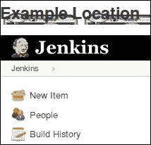

## 工作原理...

简单主题插件是一个页面装饰器。它向每个页面添加以下信息：

```
<script>
<link rel="stylesheet" type="text/css" href="/userContent/mycss.css" /><script src="img/myjavascript.js" type="text/javascript">
</script>
```

JavaScript 在生成的页面顶部附近写入一个带有`id="test"`的标题。通过 CSS 定位符`#test`触发级联样式表规则会将相机图标添加到背景中。

图片尺寸未经调整，不适合屏幕顶部；它们被浏览器裁剪。这是一个你可以通过实验来解决的问题。

第二个 CSS 规则针对`main-table`触发，这是 Jenkins 生成的标准首页的一部分。完整的相机图标显示在那里。

当访问 Jenkins 的其他部分时，您会注意到相机图标看起来不合适，而且过大。您需要时间修改 CSS 和 JavaScript 来生成更好的效果。通过小心和自定义代码，您可以使 Jenkins 适应公司形象。

### 提示

**CSS 3 怪癖**

各种浏览器类型和版本在支持各种 CSS 标准上存在一些怪异之处。有关概述，请访问[`www.quirksmode.org/css/contents.html`](http://www.quirksmode.org/css/contents.html)。

## 还有更多...

这里还有一些需要考虑的事情。

### CSS 3

CSS 3 有许多功能。要在 JavaScript 生成的标题周围绘制按钮，请将 CSS 文件中的`#test`部分更改为以下代码：

```
#test {
  width: 180px; height: 60px;
  background: red; color: yellow;
  text-align: center;
  -moz-border-radius: 40px; -webkit-border-radius: 40px;
}
```

使用 Firefox，CSS 规则生成了以下按钮：


### 注意

对于急于行动的人，你可以在 Smashing Magazine 网站上下载 CSS 3 技巧表：[`coding.smashingmagazine.com/wp-content/uploads/images/css3-cheat-sheet/css3-cheat-sheet.pdf`](http://coding.smashingmagazine.com/wp-content/uploads/images/css3-cheat-sheet/css3-cheat-sheet.pdf)

### 包含的 JavaScript 库框架

Jenkins 使用 YUI 库[`yuilibrary.com/`](http://yuilibrary.com/)。在每个 HTML 页面中装饰，核心 YUI 库(`/scripts/yui/yahoo/yahoo-min.js`)已经准备好以供重复使用。然而，许多 web 开发人员习惯于 jQuery。你也可以通过安装 jQuery 插件（[`wiki.jenkins-ci.org/display/JENKINS/jQuery+Plugin`](https://wiki.jenkins-ci.org/display/JENKINS/jQuery+Plugin)）来包含此库。你还可以考虑通过 WAR 叠加层将你喜欢的 JavaScript 库添加到 Jenkins 的`/scripts`目录中（参见下一个示例）。

### 信而验证

伴随着巨大的能力而来的是巨大的责任。如果只有少数管理员维护您的 Jenkins 部署，则您很可能信任每个人都可以添加 JavaScript 而不会产生有害的副作用。然而，如果有大量管理员使用各种各样的 Java 库，则您的维护和安全风险会迅速增加。请考虑您的安全策略，并至少添加审计追踪插件（[`wiki.jenkins-ci.org/display/JENKINS/Audit+Trail+Plugin`](https://wiki.jenkins-ci.org/display/JENKINS/Audit+Trail+Plugin)）以跟踪行动。

## 另请参阅

+   *使用 WAR 覆盖为 Jenkins 进行换肤和资源配置* 配方

+   *生成主页* 配方

# 使用 WAR 覆盖为 Jenkins 进行换肤和资源配置

本配方描述了如何将内容覆盖到 Jenkins WAR 文件上。通过 WAR 覆盖，你可以更改 Jenkins 的外观和感觉，以进行企业品牌化和主页内容配置。本示例基本上只添加了自定义的 `favicon.ico`（在网页浏览器地址栏中的图标）。包含更多内容几乎不需要额外的努力。

Jenkins 将其版本作为依赖项保存在 Maven 仓库中。你可以使用 Maven 拉取 WAR 文件，展开它，添加内容，然后重新打包。这使你能够提供资源，如图像、主页、地址栏中称为 `fav` 图标的图标，以及影响搜索引擎浏览你内容的 `robots.txt`。

要小心：如果 Jenkins 的结构和图形内容随时间发生根本性变化，使用 WAR 覆盖将很便宜。然而，如果覆盖物破坏了结构，那么你可能要进行详细的功能测试才能发现这一点。

你还可以考虑通过 WAR 覆盖进行最小更改，也许只更改 `favicon.ico`，添加图像和 `userContent`，然后使用简单主题插件（参见前面的配方）进行样式设置。

## 准备工作

创建名为 `ch4.communicating/war_overlay` 的目录以存放此配方中的文件。

## 如何实现...

1.  浏览到 Maven 仓库 [`repo.jenkins-ci.org/releases/org/jenkins-ci/main/jenkins-war/`](http://repo.jenkins-ci.org/releases/org/jenkins-ci/main/jenkins-war/) 并查看 Jenkins 的依赖项。

1.  创建以下 `pom.xml` 文件。随意更新为更新版本的 Jenkins：

    ```
    <project  
    xsi:schemaLocation="http://maven.apache.org/POM/4.0.0 http://maven.apache.org/maven-v4_0_0.xsd">
    <modelVersion>4.0.0</modelVersion>
    <groupId>nl.uva.berg</groupId>
    <artifactId>overlay</artifactId>
    <packaging>war</packaging>
    <!-- Keep version the same as Jenkins as a hint -->
    <version>1.437</version>
    <name>overlay Maven Webapp</name>
    <url>http://maven.apache.org</url>
    <dependencies>
    <dependency>
    <groupId>org.jenkins-ci.main</groupId>
    <artifactId>jenkins-war</artifactId>
    <version>1.437</version>
    <type>war</type>
    <scope>runtime</scope>
    </dependency>
    </dependencies>
    <repositories>
    <repository>
          <id>Jenkins</id>
          <url>http://repo.jenkins-ci.org/releases</url>
         </repository>
    </repositories>
    </project>
    ```

1.  访问 `favicon.ico` 生成网站，例如 [`www.favicon.cc/`](http://www.favicon.cc/)。按照其说明，创建你自己的 `favicon.ico`。或者，使用提供的示例。

1.  将 `favicon.ico` 添加到 `src/main/webapp` 位置。

1.  创建目录 `src/main/webapp/META-INF` 并添加一个名为 `context.xml` 的文件，其中包含以下一行代码：

    ```
    <Context logEffectiveWebXml="true" path="/"></Context>
    ```

1.  在你的顶层目录中，运行以下命令：

    ```
    mvn package
    ```

1.  在新生成的目标目录中，你将看到 WAR 文件 `overlay-1.437.war`。检查内容，验证你是否已修改了 `favicon.ico`。

1.  [可选] 部署 WAR 文件到本地 Tomcat 服务器，验证并浏览更新后的 Jenkins 服务器：

## 工作原理...

Jenkins 通过中央 Maven 仓库公开了其 WAR 文件。这允许你通过标准的 Maven 依赖管理拉取 Jenkins 的特定版本。

Maven 使用约定。它期望在 `src/main/webapp` 或 `src/main/resources` 中找到要覆盖的内容。

`context.xml` 文件定义了 Web 应用程序的某些行为，例如数据库设置。在此示例中，设置 `logEffectiveWebXML` 要求 Tomcat 在应用程序启动时记录特定信息（[`tomcat.apache.org/tomcat-7.0-doc/config/context.html`](http://tomcat.apache.org/tomcat-7.0-doc/config/context.html)）。 Jenkins Wiki 推荐了此设置（[`wiki.jenkins-ci.org/display/JENKINS/Installation+via+Maven+WAR+Overlay`](https://wiki.jenkins-ci.org/display/JENKINS/Installation+via+Maven+WAR+Overlay)）。该文件放置在 `META-INF` 目录中，因为 Tomcat 可以在此处获取设置而无需重新启动服务器。

`<packaging>war</packaging>` 标签告诉 Maven 使用 WAR 插件进行打包。

您在最终叠加 WAR 的名称中使用了与原始 Jenkins WAR 版本相同的版本号。这样可以更容易地发现 Jenkins 版本是否更改。这再次凸显了使用惯例有助于提高可读性并减少错误机会。在从验收环境部署到生产环境时，应删除版本号。

在 `pom.xml` 文件中，您将 [`repo.jenkins-ci.org/releases`](http://repo.jenkins-ci.org/releases) 定义为查找 Jenkins 的存储库。

Jenkins WAR 文件作为 `war` 类型的依赖项和 `runtime` 范围的依赖项引入。运行时范围表示该依赖项不需要进行编译，但是需要执行。有关作用域的更详细信息，请参阅 [`maven.apache.org/guides/introduction/introduction-to-dependency-mechanism.html#Dependency_Scope`](http://maven.apache.org/guides/introduction/introduction-to-dependency-mechanism.html#Dependency_Scope)。

有关 WAR 叠加的更多详细信息，请参阅 [`maven.apache.org/plugins/maven-war-plugin/index.html`](http://maven.apache.org/plugins/maven-war-plugin/index.html)。

### 提示

**避免工作

为了减少维护工作量，最好安装额外的内容，而不是替换可能在其他地方或由第三方插件使用的内容。

## 还有更多...

如果您希望完全修改 Jenkins 的外观和感觉，则需要涵盖许多细节。以下部分提及了一些细节。

### 您可以替换哪些类型的内容？

Jenkins 服务器部署到两个主要位置。第一个位置是核心应用程序，第二个位置是存储更改信息的工作空间。为了更全面地了解内容，请查看目录结构。Linux 中一个有用的命令是 tree 命令，它显示目录结构。要在 Ubuntu 下安装，请使用以下命令：

```
apt-get install tree

```

对于 Jenkins Ubuntu 工作空间，使用以下命令生成工作空间的树状视图：

```
tree –d –L 1 /var/lib/Jenkins

```

**├── 指纹**（用于存储文件的校验和以唯一标识文件）

**├── 工作**（存储作业配置和构建结果）

**├── 插件**（插件部署和通常配置的位置）

**├── tools**（部署 Maven 和 Ant 等工具的位置）

**├── updates**（更新）

**├── userContent**（在`/userContent` URL 下提供的内容）

**└── users**（显示在`/me` URL 下的用户信息）

Web 应用程序的默认 Ubuntu 位置是`/var/run/jenkins/war`。如果您从命令行运行 Jenkins，则放置 Web 应用程序的选项是：

```
–webroot

```

**├── css**（Jenkins 样式表的位置）

**├── executable**（用于从命令行运行 Jenkins）

**├── favicon.ico**（在此方法中替换的图标）

**├── help**（帮助内容目录）

**├── images**（不同尺寸的图形）

**├── META-INF**（manifes 文件和生成的 WAR 的`pom.xml`文件的位置）

**├── robots.txt**（用于告诉搜索引擎允许爬行的位置）

**├── scripts**（JavaScript 库位置）

**├── WEB-INF**（Web 应用程序的 servlet 部分的主要位置）

**└── winstone.jar**（Servlet 容器：[`winstone.sourceforge.net/`](http://winstone.sourceforge.net/)）

### 搜索引擎和 robots.txt

如果您要添加自己的自定义内容，例如用户主页、公司联系信息或产品详情，请考虑修改顶级`robots.txt`文件。目前，它将搜索引擎从所有内容中排除在外：

```
# we don't want robots to click "build" links
User-agent: *
Disallow: /
```

您可以在[`www.w3.org/TR/html4/appendix/notes.html#h-B.4.1.1`](http://www.w3.org/TR/html4/appendix/notes.html#h-B.4.1.1)找到`robots.txt`结构的完整详情。

Google 使用更丰富的结构，允许和禁止；请参阅[`developers.google.com/webmasters/control-crawl-index/docs/robots_txt?csw=1`](https://developers.google.com/webmasters/control-crawl-index/docs/robots_txt?csw=1)

下面的`robots.txt`允许 Google 爬虫访问`/userContent/corporate/`目录。所有网络爬虫是否会遵守意图尚不确定。

```
User-agent: *
Disallow: /
User-agent: Googlebot
Allow: /userContent/corporate/
```

### 注意

为了帮助保护您的 Jenkins 基础架构，请参考第二章中的方法，*Enhancing Security*。

## 另请参阅

+   用简单主题插件为 Jenkins 设置样式的方法

+   *生成主页*的方法

# 生成主页

用户的主页是表达您组织身份的好地方。您可以创建一致的外观和感觉，表达您团队的精神。

本方法将探讨位于`/user/userid`目录下的主页的操作，并由用户通过 Jenkins `/me` URL 配置。

### 注意

值得审查的类似插件是 Gravatar 插件。您可以在[`wiki.jenkins-ci.org/display/JENKINS/Gravatar+plugin`](https://wiki.jenkins-ci.org/display/JENKINS/Gravatar+plugin)找到插件主页

## 准备工作

安装 Avatar 插件（[`wiki.jenkins-ci.org/display/JENKINS/Avatar+Plugin`](https://wiki.jenkins-ci.org/display/JENKINS/Avatar+Plugin)）。

为用户 `fakeuser` 创建一个 Jenkins 帐户。 您可以配置 Jenkins 以使用许多身份验证策略；选择将影响您如何创建用户。 一个例子是使用 *Reviewing project-based matrix tactics via a custom group script* 中详细介绍的基于项目的矩阵策略，位于 Chapter 2，*Enhancing Security* 中的配方。

### 注意

除非作为 Jenkins 管理员您在 **Configure Global Security** 页面下配置了 **Markup Formatter** 为 **Raw**，否则您将无法使此配方起作用。 通过这样做，您允许任何可以编辑描述的人注入他们自己的脚本代码。 如果您是一个非常信任的小型开发团队，这可能是一种可行的做法。 但是，一般来说，考虑这是一个安全问题。

## 如何操作...

1.  浏览到 [`en.wikipedia.org/wiki/Wikipedia:Public_domain_image_resources`](http://en.wikipedia.org/wiki/Wikipedia:Public_domain_image_resources) 以获取图片的公共领域来源列表。

1.  在 [`commons.wikimedia.org/wiki/Main_Page`](http://commons.wikimedia.org/wiki/Main_Page) 搜索开源图像。

1.  通过点击以下截图中显示的 **Download Image File: 75 px** 链接，从 [`commons.wikimedia.org/wiki/File%3ACharles_Richardson_(W_H_Gibbs_1888).jpg`](http://commons.wikimedia.org/wiki/File%3ACharles_Richardson_(W_H_Gibbs_1888).jpg) 下载图像：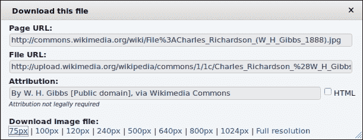

    ### 注意

    如果图像不再可用，请选择另一个。

1.  以 `fakeuser` 身份登录到您的 Jenkins 服务器并访问其配置页面，地址为 `http://localhost:8080/user/fakeuser/configure`。

1.  在 **Avatar** 部分上传图像：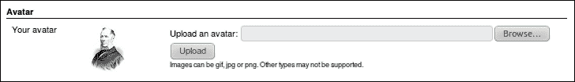

1.  查看 URL `http://localhost:8080/user/fakeuser/avatar/image`。

    ### 注意

    现在，您随时都可以使用此已知的 URL 来显示您的头像。

1.  将以下文本添加到用户配置文件描述中：

    ```
    <script type="text/JavaScript">
    functionchangedivview()
    {
    var elem=document.getElementById("divid");
    elem.style.display=(elem.style.display=='none')?'block':'none';
    }
    </script>
    <h2>OFFICIAL PAGE</h2>
    <div id="divid">
    <table border=5 bgcolor=gold><tr><td>HELLO WORLD</td></tr></table>
    </div>
    <a href="javascript:;" onClick="changedivview();">Switch</a>  
    ```

1.  访问 `/user/fakeuser` 页面。 您将在描述中看到一个名为 **Switch** 的链接。 如果您点击该链接，则 **HELLO WORLD** 内容将会出现或消失。

1.  复制 `fakeuser` 的用户目录到一个名为 `fakeuser2` 的目录，例如，`/var/lib/jenkins/user/fakeuser`。 在 `fakeuser2` 目录中找到的 `config.xml` 文件中，将 `<fullName>` 标签的值从 `fakeuser` 更改为 `fakeuser2`。 将 `<emailAddress>` 的值更改为 `fakeuser2@dev.null`。

1.  以 `fakeuser2` 的身份登录，密码与 `fakeuser` 相同。

1.  访问主页 `/user/fakeuser2`。 注意电子邮件地址的更新。

## 它是如何工作的...

Avatar 插件允许您将图像上传到 Jenkins。 图像的 URL 位于固定位置。 您可以通过简单的主题插件重复使用它，以添加内容而不使用 WAR 覆盖。

有大量的公共领域和开源图片可供免费使用。在生成自己的内容之前，值得在互联网上查看资源。如果你创建内容，请考虑捐赠给开源存档，比如[archive.org](http://archive.org)。

除非你过滤掉 HTML 标签和 JavaScript 的描述（参见第三章 *构建软件* 中的 *通过构建描述公开信息* 这一做法），否则你可以使用自定义 JavaScript 或 CSS 动画来为个性化的 Jenkins 添加吸引眼球的效果。

你的`fakeuser`信息存储在`/user/fakeuser/config.xml`中。通过将其复制到另一个目录并略微修改`config.xml`文件，你创建了一个新的用户帐户。这种格式易于阅读，并且易于结构化成用于创建更多帐户的模板。你创建了`fakeuser2`帐户来证明这一点。

通过使用 WAR 覆盖配方并添加额外的`/user/username`目录，其中包含自定义的`config.xml`文件，你可以控制 Jenkins 用户群体，例如，从一个中央配置脚本或在第一次登录尝试时，使用自定义授权脚本（参见第二章 *增强安全性* 中的 *使用脚本领域认证进行配置的做法*）。

## 更多内容……

通过使用模板`config.xml`来强制执行一致性。这将强制执行更广泛的统一结构。你可以将初始密码设置为已知值或空值。只有在用户从创建到首次登录的时间非常短的情况下，空密码才有意义。你应该考虑这是一种不好的做法，是一个等待发生问题的问题。

描述存储在描述标签下。内容以 URL 转义文本形式存储。例如，`<h1>描述</h1>`存储为：

```
<description>&lt;h1&gt;DESCRIPTION&lt;/h1&gt;</description>
```

许多插件也将它们的配置存储在同一个`config.xml`文件中。随着你在 Jenkins 服务器中增加插件的数量，这是很自然的，因为你了解了这个产品，你需要偶尔审查你的模板的完整性。

## 另请参阅

+   *使用简单主题插件装饰 Jenkins 的做法*

+   *使用 WAR 覆盖的皮肤和提供 Jenkins 的做法*

+   在第二章 *增强安全性* 中的 *通过自定义组脚本审查基于项目矩阵的策略* 这一做法

# 创建 HTML 报告

作业仪表板左侧菜单是有价值的房地产。开发者的眼睛自然会扫描这个区域。这个教程描述了如何将自定义 HTML 报告的链接添加到菜单中，以便更快地注意到报告。

## 准备工作

安装 HTML 发布者插件（[`wiki.jenkins-ci.org/display/JENKINS/HTML+Publisher+Plugin`](https://wiki.jenkins-ci.org/display/JENKINS/HTML+Publisher+Plugin)）。我们假设你有一个已提交了 Packt 代码的 Subversion 仓库。

## 怎么做…

1.  创建一个自由风格的软件项目，并将其命名为`ch4.html_report`。

1.  在**源代码管理**部分下，单击**Subversion**。

1.  在**模块**部分下，将`Repo/ch4.communicating/html_report`添加到**存储库 URL**，其中`Repo`是您的子版本存储库的 URL。

1.  在**构建后操作**部分下，检查**发布 HTML 报告**。 添加以下详细信息：

    +   **要存档的 HTML 目录**：`target/custom_report`

    +   **索引页面[s]**：`index.html`

    +   **报告标题**：`My HTML Report`

    +   选中**保留过去的 HTML 报告**复选框

1.  单击**保存**。

1.  运行作业并查看左侧菜单。 现在您将看到一个指向您报告的链接，如下面的屏幕截图所示：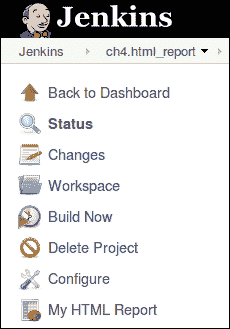

## 工作原理...

您的子版本存储库包含一个`index.html`文件，该文件被拉入作业的工作区。 插件按照广告中的方式运行，并添加了一个指向 HTML 报告的链接。 这使得您的受众可以有效地找到您生成的自定义信息。

## 还有更多...

示例报告如下所示：

```
<html><head><title>Example Report</title>
<link rel="stylesheet" type="text/css" href="/css/style.css" /></head>
<body>
<h2>Generated Report</h2>
Example icon: 
</body></html>
```

它拉取了主 Jenkins 样式表`/css/style.css`。

当您在应用程序中更新样式表时，可能会出现在清除浏览器缓存之前看不到更改的情况。 Jenkins 以一种巧妙的方式解决了这个延迟问题。 它使用一个带有每个 Jenkins 版本都会更改的唯一数字的 URL。 例如，对于`css`目录，您有两个 URL：

+   `/css`

+   `/static/uniquenumber/css`

大多数 Jenkins URL 使用后一种形式。 考虑为您的样式表也这样做。

### 注意

每个版本的唯一编号都会更改，因此您需要为每次升级更新 URL。

在 Maven 构建中运行`site`目标时，将生成一个本地网站（[`maven.apache.org/plugins/maven-site-plugin`](http://maven.apache.org/plugins/maven-site-plugin)）。 此网站在 Jenkins 作业内有一个固定的 URL，您可以使用**My HTML Report**链接指向它。 这使得诸如测试结果之类的文档易于访问。

## 另请参阅

+   *高效使用视图*配方

+   *使用 Dashboard View 插件节省屏幕空间* 配方

# 高效使用视图

Jenkins 具有令人上瘾的易配置性，非常适合创建大量作业。 这会增加开发人员暴露的信息量。 Jenkins 需要通过有效地利用浏览器空间来避免混乱。 一种方法是定义最小化视图。 在本配方中，您将使用 DropDown ViewsTabBar 插件。 它将视图作为标签删除，并用一个选择框替换这些标签。 这有助于更快地导航。 您还将看到如何使用脚本生成的简单 HTML 表单快速提供大量作业。

### 提示

在本配方中，您将创建大量视图，稍后可能需要删除。 如果您使用的是虚拟盒映像，请考虑克隆映像，并在完成后将其删除。

## 准备工作

安装 DropDown ViewsTabBar 插件 ([`wiki.jenkins-ci.org/display/JENKINS/DropDown+ViewsTabBar+Plugin`](https://wiki.jenkins-ci.org/display/JENKINS/DropDown+ViewsTabBar+Plugin))。

## 如何操作...

1.  复制并粘贴以下 Perl 脚本到一个名为`create.pl`的可执行文件中：

    ```
    #!/usr/bin/perl
    $counter=0;
    $end=20;
    $host='http://localhost:8080';
    while($end > $counter){
      $counter++;
      print "<form action=$host/createItem?mode=copy method=POST>\n";
      print "<input type=text name=name value=CH4.fake.$counter>\n";
      print "<input type=text name=from value=Template1 >\n";
      print "<input type=submit value='Create CH4.fake.$counter'>\n";
      print "</form><br>\n";
      print "<form action=$host/job/CH4.fake.$counter/doDelete method=POST>\n";
      print "<input type=submit value='Delete CH4.fake.$counter'>\n";
      print "</form><br>\n";
    }
    ```

1.  根据 Perl 脚本的输出创建一个 HTML 文件，例如：

    ```
    perl create.pl > form.html
    ```

1.  在网页浏览器中，以管理员身份登录 Jenkins。

1.  创建作业`Template1`，添加任何您希望的细节。这是您将复制到许多其他作业中的模板作业。

1.  在同一个浏览器中加载`form.html`。

1.  点击其中一个**创建 CH4.fake**按钮。Jenkins 返回一个错误消息：

    ```
    HTTP ERROR 403 Problem accessing /createItem. Reason:
    No valid crumb was included in the request
    ```

1.  访问`http://localhost:8080/configureSecurity`上的**配置全局安全性**，取消勾选**防止跨站请求伪造漏洞**框。

1.  点击**保存**。

1.  点击所有的**创建 CH4.fake**按钮。

1.  访问 Jenkins 的首页，验证作业已经创建并基于`Template1`作业。

1.  创建大量视图，并随机选择作业。查看首页，注意混乱。

1.  访问配置屏幕`/configure`，在**视图选项卡栏提供下拉菜单以选择视图**中的**视图选项卡栏**下拉框中选择**DropDownViewsTabBar**。在**DropDownViewsTabBar**的子部分中，勾选**显示作业计数**框，如下图所示：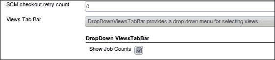

1.  点击**保存**按钮：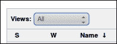

1.  在 Jenkins 中，访问**配置全局安全性**`http://localhost:8080/configureSecurity`，并勾选**防止跨站请求伪造漏洞**框。

1.  点击**保存**。

## 工作原理是...

只要 Jenkins 中的面包屑安全功能关闭，该表单就能正常工作。当开启此功能时，它会生成一个随机数，表单在提交时必须返回该随机数。这样 Jenkins 就知道该表单是与服务器进行的有效对话的一部分。生成的 HTTP 状态错误在 4xx 范围内，这意味着客户端输入无效。如果 Jenkins 返回了 5xx 错误，则意味着服务器错误。因此，在提交我们自己的数据时，我们不得不关闭此功能。我们不建议在生产环境中这样做。

一旦您以管理员身份登录 Jenkins，您可以创建作业。您可以通过 GUI 或通过发送 POST 信息来执行此操作。在本教程中，我们将一个名为`Template1`的作业复制到以`CH4.fake`开头的新作业中，如下所示：

```
<form action=http://localhost:8080/createItem?mode=copy method=POST>
<input type=text name=name value=CH4.fake.1>
<input type=text name=from value=Template1 >
<input type=submit value='Create CH4.fake.1'>
</form>
```

您使用的 POST 变量是`name`用于新作业的名称，`from`用于模板作业的名称。POST 操作的 URL 是`/createItem?mode=copy`。

要更改主机名和端口号，您需要更新 Perl 脚本中找到的`$host`变量。

要删除一个作业，Perl 脚本生成的表单中的操作指向`/job/Jobname/doDelete`（例如，`/job/CH4.fake.1/doDelete`）。不需要额外的变量。

要增加表单条目的数量，您可以更改变量`$end`的值为`20`。

## 还有更多...

Jenkins 使用标准库 Stapler ([`stapler.kohsuke.org/what-is.html`](http://stapler.kohsuke.org/what-is.html))将服务绑定到 URL。插件也使用 Stapler。当您安装插件时，潜在的操作数量也会增加。这意味着您可以通过类似于本文中的 HTML 表单激活许多操作。您将在第七章中发现，使用 Stapler 编写绑定代码所需的工作量很小，*探索插件*。

## 另见

+   *使用仪表板视图插件节省屏幕空间* 步骤

# 使用仪表板视图插件节省屏幕空间

在*高效使用视图*步骤中，您发现可以使用 Views 插件节省水平选项卡空间。在这个步骤中，您将使用 Dashboard View 插件来压缩水平空间的使用。压缩水平空间有助于高效吸收信息。

仪表板视图插件允许您配置视图的区域以显示特定功能，例如作业的网格视图或显示失败作业子集的区域。用户可以在屏幕上拖放这些区域。

### 注意

开发人员已经使仪表板易于扩展，因此稍后会有更多选择。

## 准备工作

安装仪表板视图插件 ([`wiki.jenkins-ci.org/display/JENKINS/Dashboard+View`](https://wiki.jenkins-ci.org/display/JENKINS/Dashboard+View))。要么手动创建一些作业，要么使用上一个步骤中提供的 HTML 表单创建作业。

## 操作步骤...

1.  作为 Jenkins 管理员，登录到 Jenkins 实例的主页。

1.  点击屏幕顶部的第二个标签页上的**+**号创建一个新视图。

1.  选择**仪表板**视图。

1.  在**作业**部分，选择一些您的虚拟作业。

1.  将**仪表板控件**保留为默认设置。

1.  点击**确定**。您现在将看到一个空白的视图屏幕。

1.  在左侧菜单中，点击**编辑视图**链接。

1.  在视图的**仪表板控件**部分，选择以下内容：

    +   将仪表板控件添加到视图顶部：**- 作业网格**

    +   将仪表板控件添加到视图底部：**- 不稳定的作业**

1.  在配置屏幕底部，点击**确定**按钮。现在您将看到**仪表板**视图: 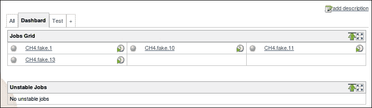

您可以使用箭头图标扩展或收缩功能区域：


## 工作原理...

仪表板插件将屏幕划分为不同的区域。在仪表板配置期间，您可以选择作业网格和不稳定的作业控件。其他仪表板控件包括作业列表、最新构建、从属统计、测试统计图或网格以及测试趋势图。随着插件的成熟，将会有更多的选择。

与其他视图相比，**作业网格**控件节省空间，因为显示的作业密度很高。

### 提示

如果你还在使用 **Many Views** 标签（请参阅前面的教程），可能会有一点小问题。当你点击仪表板标签时，会显示原始的视图集，而不是选择框。

## 还有更多...  

仪表板插件提供了一个框架，供其他插件开发者创建仪表板视图。这种用法的一个例子是项目统计插件 ([`wiki.jenkins-ci.org/display/JENKINS/Project+Statistics+Plugin`](https://wiki.jenkins-ci.org/display/JENKINS/Project+Statistics+Plugin))。

## 另请参阅

+   *创建 HTML 报告* 教程

+   *高效使用视图* 教程

# 使用 HTML5 浏览器发出声音

这个教程描述了如何在 Jenkins 用户的浏览器中发送自定义声音，当事件发生时，比如一个成功的构建。你也可以在任意时间发送声音消息。这不仅适用于喜欢被名人唱歌或者大喊的开发者，也适用于在大型服务器群中寻找计算机的系统管理员。

## 准备工作

安装 Jenkins 声音插件 ([`wiki.jenkins-ci.org/display/JENKINS/Jenkins+Sounds+plugin`](https://wiki.jenkins-ci.org/display/JENKINS/Jenkins+Sounds+plugin))。确保已安装兼容的网络浏览器，如最新版本的 Firefox 或 Chrome。

### 注意

若要了解更多关于浏览器中的 HTML5 兼容性的详细信息，请考虑查阅：[`en.wikipedia.org/wiki/Comparison_of_layout_engines_%28HTML5%29`](http://en.wikipedia.org/wiki/Comparison_of_layout_engines_%28HTML5%29)。

## 如何做...

1.  以 Jenkins 管理员身份登录，访问**配置系统**屏幕`/configure`。

1.  在**Jenkins 声音**部分，勾选**通过启用 HTML5 音频浏览器播放**。

    ### 注意

    如果 Jenkins 在查找声音存档时出现问题，例如错误消息中出现`文件未找到 'file:/C:/Users/Alan/.jenkins/jar:file:/C:/Users/Alan/.jenkins/plugins/sounds/WEB-INF/lib/classes.jar/sound-archive.zip'`，那么解压`classes.jar`文件，并将`sounds-archive.zip`文件移动到错误消息中提到的相同目录中。最后，将配置指向存档，例如`file:/C:/Users/Alan/.jenkins/plugins/sounds/WEB-INF/lib/sound-archive.zip`。

1.  点击**保存**按钮。

1.  选择位于 Jenkins 主页上的**Job creation**链接。

1.  创建一个名为 `ch4.sound` 的**新作业**。

1.  选择**构建一个自由风格的软件项目**。

1.  点击**确定**。

1.  在**后构建操作**部分，勾选**Jenkins 声音**选项。

1.  添加两个声音：**EXPLODE** 和 **doh**：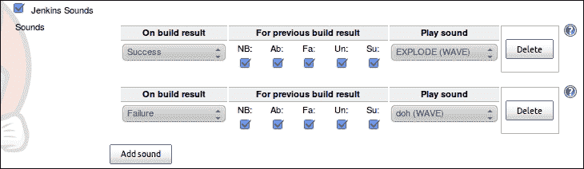

1.  点击**保存**。

1.  点击**立即构建**链接。

1.  成功时，你的浏览器将播放`EXPLODE`wav 文件。

1.  编辑你的作业，使其失败，例如添加一个不存在的源代码仓库。

1.  再次构建任务。失败时，你的网络浏览器将播放`doh`wav 文件。

## 工作原理...

你已成功配置了你的作业，根据构建的成功或失败播放不同的声音。

您还可以通过配置哪些事件转换将触发声音来进一步优化插件的反应，例如，如果前一个构建结果是失败，当前构建结果是成功。这在**对于上一个构建结果**一组复选框中定义。

该插件作为页面装饰器工作。它添加了以下异步轮询新声音的 JavaScript。您的浏览器正在执行大部分工作，释放服务器资源：

```
<script src="img/script" type="text/javascript"></script><script type="text/javascript" defer="defer">function _sounds_ajaxJsonFetcherFactory(onSuccess, onFailure) {
  return function() {
    newAjax.Request("/sounds/getSounds", {
      parameters: { version: VERSION },
      onSuccess: function(rsp) {
        onSuccess(eval('x='+rsp.responseText))
      },
      onFailure: onFailure
    });
  }
} 
if (AUDIO_CAPABLE) {
    _sounds_pollForSounds(_sounds_ajaxJsonFetcherFactory);
}</script>
```

## 还有更多...

该声音插件还允许您向连接的网络浏览器流式传输任意声音。这不仅对于恶作剧和针对您分布式团队的激励演讲有用，还可以执行诸如在重新启动服务器之前发出 10 分钟警告警报等有用操作。

您可以在[`www.archive.org/details/opensource_audio`](http://www.archive.org/details/opensource_audio)找到一些不错的音乐收藏。

例如，您可以在[`www.archive.org/details/OpenPathMusic44V2`](http://www.archive.org/details/OpenPathMusic44V2)找到一份“每个孩子一台笔记本电脑”音乐库的副本。在收藏中，您将发现`shenai.wav`。首先，将声音添加到互联网上的某个地方，以便找到。一个好的地方是 Jenkins 的`userContent`目录。要在任何连接的网络浏览器上播放声音，您需要访问触发地址（将`localhost:8080`替换为您自己的地址）：

`http://localhost:8080/sounds/playSound?src=http://localhost:8080/userContent/shenai.wav`

## 另请参阅

+   在第一章中的 *Maintaining Jenkins*，*通过 Firefox 与 Jenkins 保持联系* 配方

# 接待区的极端观点

敏捷项目强调沟通的作用胜过于文档的需求。**信息辐射器**有助于快速获得反馈。信息辐射器具有两个主要特征：它们随时间变化，并且呈现的数据易于消化。

eXtreme Feedback Panel 插件是信息辐射器的一个示例。它是一个高度视觉化的 Jenkins 视图。如果布局格式一致，并在大型监视器上显示，则非常适合此任务。还将其视为对您的开发流程的积极广告。您可以将其显示在接待处后面，或者放在一个受欢迎的社交区域，例如靠近咖啡机或项目室。

在此配方中，您将添加 eXtreme Feedback Panel 插件，并通过描述中的 HTML 标签修改其外观。

## 准备工作

安装 eXtreme Feedback Panel 插件（[`wiki.jenkins-ci.org/display/JENKINS/eXtreme+Feedback+Panel+Plugin`](https://wiki.jenkins-ci.org/display/JENKINS/eXtreme+Feedback+Panel+Plugin)）。

## 如何做...

1.  创建一个名为`Blackboard Report Pro Access`的作业，并添加以下描述：

    ```
    <center>
    <p>Writes Blackboard sanity reports<br>
    and sends them to a list.
    <table border="1" class="myclass"><tr><td>More Details</td></tr></table>
    </center>
    ```

1.  创建一个名为`eXtreme`的新视图（`/newView`）。选中 **eXtremeFeedBack Panel**，然后点击 **OK**。

1.  选择 6-24 个已经创建的作业，包括本配方中之前创建的作业。

1.  将列数设置为**2**。

1.  将刷新时间设置为**20**秒。

1.  点击**显示作业描述**。

1.  点击**确定**。

1.  尝试设置（特别是字体像素大小）。优化视图取决于使用的显示器以及观众观看显示器的距离，如下图所示：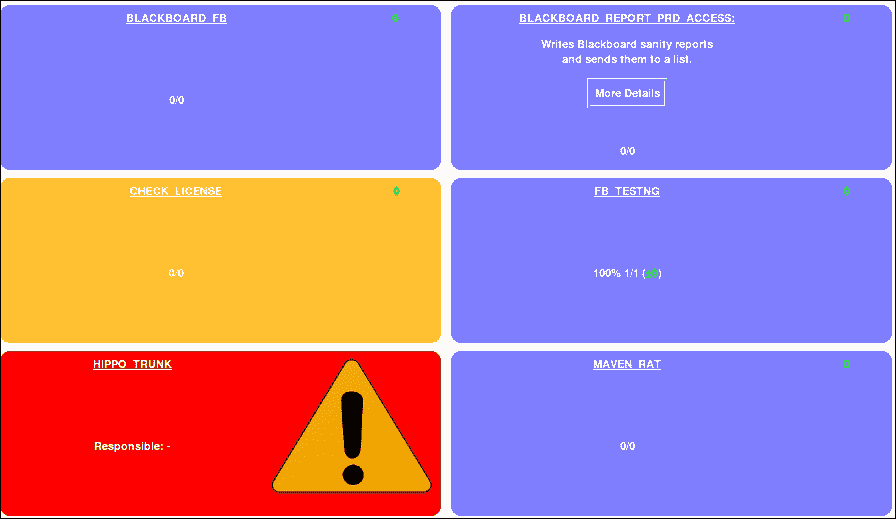

## 它的工作原理...

设置和运行这个信息辐射器很容易。结果呈现了软件流程动态的精美视图。

将刷新率设置为 20 秒存在争议。更新之间的长时间延迟会降低观看者的兴趣。

你已经写了一个描述，在极端视图中部分格式化，但在作业配置页面和 Jenkins 的其他位置中是 HTML 转义的。你可以看到信息区比其他项目更容易消化。这突显了编写一致描述的必要性，这些描述遵循内部惯例，并且在一定长度以下，以自然地适应屏幕。为工作取一个更长、更具描述性的名称有助于观众更好地理解工作的背景。

### 注意

通过 URL `http://localhost:8080/view/Jobname/configure`快速配置视图，将`Jobname`中的任何空格替换为`%20`。

## 还有更多...

信息辐射器有趣且形态各异。从在大型显示器上显示不同视图，到 USB 海绵导弹的发射和名人的声音滥用（参见*使用 HTML5 浏览器制造噪音*配方）。

Jenkins 中值得探索的一些示例电子项目包括：

+   **熔岩灯**：[`wiki.jenkins-ci.org/display/JENKINS/Lava+Lamp+Notifier`](https://wiki.jenkins-ci.org/display/JENKINS/Lava+Lamp+Notifier)

+   **USB 导弹发射器**：[`github.com/codedance/Retaliation`](https://github.com/codedance/Retaliation)

+   **交通灯**：[`code.google.com/p/hudsontrafficlights/`](http://code.google.com/p/hudsontrafficlights/)

记住，让我们小心一些。

## 另请参阅

+   *使用仪表板视图插件节省屏幕空间*配方

+   *使用 HTML5 浏览器制造噪音*配方

# 使用 Google 日历进行移动演示

Jenkins 插件可以将构建历史推送到不同的知名社交媒体服务。现代 Android 或 iOS 手机预装了这两种服务的应用程序，降低了采用的门槛。在这个配方中，我们将配置 Jenkins 与 Google 日历一起工作。

## 准备工作

下载并安装 Google 日历插件（[`wiki.jenkins-ci.org/display/JENKINS/Google+Calendar+Plugin`](https://wiki.jenkins-ci.org/display/JENKINS/Google+Calendar+Plugin)）。确保你有一个用于 Gmail 的测试用户帐户。

## 如何做...

1.  登录 Gmail 并访问**日历**页面。

1.  通过单击**添加**链接在**我的日历**部分下创建新的日历。

1.  添加日历名称 `Test for Jenkins`。

1.  点击 **创建日历**。默认情况下，新日历是私有的。暂时保持私有。

1.  在 **我的日历** 部分，点击 **Test for Jenkins** 旁边的向下图标。选择 **日历设置** 选项。

1.  在 XML 按钮上右键单击 **复制链接位置**：

1.  查看 **嵌入此日历** 部分。它描述了如何将您的日历添加到网页中。将提供的代码复制并粘贴到空的 HTML 页面中。保存并在 web 浏览器中查看。

1.  以管理员身份登录 Jenkins。

1.  创建一个名为 `Test_G` 的新作业。

1.  在 **构建后** 部分，勾选 **将作业状态发布到 Google 日历**。

1.  将您从 XML 按钮复制的日历详细信息添加到 **日历网址** 文本框中。

1.  添加您的 Gmail 登录名和密码。

    ### 提示

    您的 Gmail 凭据将以明文形式存储在 `server.xml` 文件中。除非您的服务器得到了适当的安全保护，否则不建议这样做。

    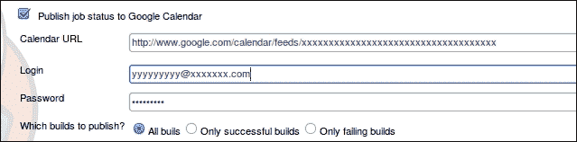

1.  点击 **保存**。

1.  构建您的作业，确保它成功。

1.  登录 Gmail。访问 **日历** 页面。您现在会看到构建成功已经发布，如下面的截图所示：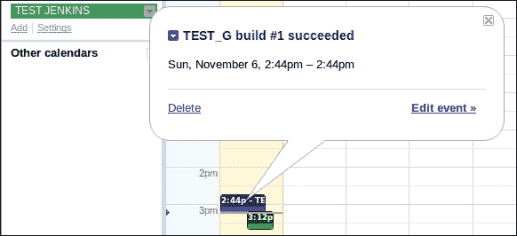

## 工作原理...

通过在 Google 中创建日历，并仅使用三个配置设置，您已将选定的 Jenkins 作业暴露给了 Google 日历。使用相同数量的配置，您可以将大多数现代智能手机和平板电脑连接到日历。

### 注意

Jenkins 有一个凭据管理器，您可以在 `http://localhost:8080/credential-store/` 找到它。凭据管理器可以与许多插件一起使用；然而，在撰写本文时，与 Google 日历插件不兼容。获取最新的兼容性信息，请访问：[`wiki.jenkins-ci.org/display/JENKINS/Credentials+Plugin`](https://wiki.jenkins-ci.org/display/JENKINS/Credentials+Plugin)

## 还有更多...

在 Jenkins 工作空间中的插件目录下，您将找到一个用于 Google 插件配置帮助的 HTML 文件 `/plugins/gcal/help-projectConfig.html`

用以下内容替换原文：

```
<div>
<p>
Add your local comments here:
</p>
</div>
```

重新启动 Jenkins 服务器后，访问插件配置 `/configure`。您现在会看到新内容，如下面的截图所示：

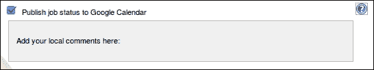

此示例是一种反模式。如果您需要根据本地需求更改内容，那么最好与社区合作，在 Jenkins SCM 中添加内容，以便每个人都能看到并改进。

您将立即收到通知，您的内容尚未国际化。它需要翻译成 Jenkins 原生支持的语言。幸运的是，在每个 Jenkins 页面的底部，都有一个链接，志愿者可以使用它来上传翻译。翻译需要很少的启动工作量，并且是开始参与开源项目的简单方式。

### 注意

有关如何在 Jenkins 中使用属性文件进行国际化的更多开发详细信息，请阅读 [`wiki.jenkins-ci.org/display/JENKINS/Internationalization`](https://wiki.jenkins-ci.org/display/JENKINS/Internationalization)。

## 另请参阅

+   *Android 和 iOS 的移动应用程序* 教程

# Android 和 iOS 的移动应用程序

有许多用于通知 Jenkins 作业状态的丰富移动应用程序。本教程指向它们的主页，以便您可以选择您喜欢的。

## 准备就绪

您将需要一个可以从互联网访问的 Jenkins 实例或使用 [`ci.jenkins-ci.org/`](http://ci.jenkins-ci.org/)，这是最佳实践的一个很好的例子。我们还假设您有一个移动设备。

## 如何做...

1.  作为管理员，访问**配置系统**（`/configure`）屏幕。

1.  检查 Jenkins URL；如果指向 `localhost`，请更改为使您的服务器链接能够从互联网访问。

1.  访问以下应用程序页面，如果兼容，安装并使用：

    +   **JenkinsMobi** ([`www.jenkins-ci.mobi`](http://www.jenkins-ci.mobi))

    +   **Blamer** ([`www.androidzoom.com/android_applications/tools/blamer_bavqz.html`](http://www.androidzoom.com/android_applications/tools/blamer_bavqz.html) 和 [`github.com/mhussain/Blamer`](https://github.com/mhussain/Blamer))

    +   **Jenkins 心情小部件** ([`wiki.jenkins-ci.org/display/JENKINS/Jenkins+Mood+monitoring+widget+for+Android`](https://wiki.jenkins-ci.org/display/JENKINS/Jenkins+Mood+monitoring+widget+for+Android))

    +   **Jenkins 移动监控** ([`www.androidzoom.com/android_applications/tools/jenkins-mobile-monitor_bmibm.html`](http://www.androidzoom.com/android_applications/tools/jenkins-mobile-monitor_bmibm.html))

    +   **Hudson Helper** ([`wiki.hudson-ci.org/display/HUDSON/Hudson+Helper+iPhone+and+iPod+Touch+App`](http://wiki.hudson-ci.org/display/HUDSON/Hudson+Helper+iPhone+and+iPod+Touch+App))

    +   **Hudson2Go Lite** ([`www.androidzoom.com/android_applications/tools/hudson2go-lite_nane.html`](http://www.androidzoom.com/android_applications/tools/hudson2go-lite_nane.html))

1.  在您的移动设备上，搜索 Google Marketplace 或 iTunes 并安装任何新的 Jenkins 应用程序，这些应用程序是免费的并具有积极的用户推荐。

## 它是如何工作的...

大多数应用程序使用 Jenkins 的 RSS 源（例如 `/rssLatest` 和 `/rssFailed`）获取信息，然后通过移动 Web 浏览器加载链接的页面。除非 Jenkins URL 配置正确，否则链接将断开，您的浏览器将返回`404` `页面未找到`错误。

您很快会注意到，您的应用程序刷新率可能会产生过多的通知，与接收及时信息之间存在微妙的平衡。

**JenkinsMobi** 应用可以在 Android 和 iOS 操作系统上运行。它使用 XML 的远程 API 来收集数据 ([`www.slideshare.net/lucamilanesio/jenkinsmobi-jenkins-xml-api-for-mobile-applications`](http://www.slideshare.net/lucamilanesio/jenkinsmobi-jenkins-xml-api-for-mobile-applications))，而不是更原始的 RSS 订阅。这个选择使得应用的作者能够添加各种功能，使其成为收藏中最引人注目的应用之一。

## 还有更多...

这里还有一些需要考虑的事情。

### Android 1.6 和 Hudson 应用

Jenkins 由于关于 Hudson 名称的商标问题而从 Hudson 的源代码中分离出来 ([`en.wikipedia.org/wiki/Jenkins_%28software%29`](http://en.wikipedia.org/wiki/Jenkins_%28software%29))。大多数开发者转向了与 Jenkins 的合作。这导致了很多第三方 Hudson 代码要么得不到支持，要么被重新命名为 Jenkins。然而，Hudson 和 Jenkins 有很大的共同基础，包括 RSS 订阅的内容。这些细节可能随着时间的推移而有所不同。对于较旧版本的 Android，如 Android 1.6，在 Google Marketplace 中你不会看到任何 Jenkins 应用。可以尝试寻找 Hudson 应用。它们大多在 Jenkins 上运行。

### Virtualbox 和 Android x86 项目

有多种选择可以运行 Android 应用。最简单的方法是通过 Google Marketplace 下载到移动设备上。然而，如果你想在 PC 上通过模拟器来玩耍 Android 应用，可以考虑下载 Android SDK ([`developer.android.com/sdk/index.html`](http://developer.android.com/sdk/index.html))，并使用模拟器和像 `adb` 这样的工具 ([`developer.android.com/guide/developing/tools/adb.html`](http://developer.android.com/guide/developing/tools/adb.html)) 来上传和安装应用。

你也可以通过 VirtualBox、VMware Player 等虚拟机运行一个 x86 映像 ([`www.android-x86.org`](http://www.android-x86.org))。这种方法的一个显著优势是 Android OS 的原始速度，以及保存虚拟机在特定状态下的能力。然而，你不会总是得到预安装的 Google Marketplace。你要么自己找到特定应用的 `.apk` 文件，要么添加其他的市场，比如 **Slide me** ([`m.slideme.org`](http://m.slideme.org))。不幸的是，第二市场提供的选择要少得多。

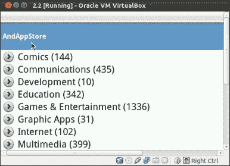

Windows Android 模拟器 [`bluestacks.com/home.html`](http://bluestacks.com/home.html) 展示了很大的潜力。它不仅是一个模拟器，还提供了一个云服务，可将应用程序从您的移动设备移入和移出模拟器。这承诺是一种高效的开发方法。然而，如果您选择使用此模拟器，请务必彻底审查您在安装时同意的许可证。BlueStacks 希望获取关于您的系统的详细信息，以帮助改进其产品。

## 参见

+   使用 Google 日历进行移动演示的食谱

# 通过 Google Analytics 了解您的受众

如果您有将构建历史或其他信息（例如主页）推送到公共位置的策略，那么您将希望了解查看者的习惯。一种方法是使用 Google Analytics。通过 Google，您可以实时观察访问者访问您的网站。详细的报告提到了流量的整体量、浏览器类型（例如，如果移动应用程序正在访问您的网站）、入口点和国家来源等内容。当您的产品达到路线图的关键点并且您希望了解客户兴趣时，这是特别有用的。

在此食谱中，您将创建一个 Google Analytics 帐户并在 Jenkins 中配置跟踪。然后，您将实时观看流量。

## 准备工作

安装 Google Analytics 插件 ([`wiki.jenkins-ci.org/display/JENKINS/Google+Analytics+Plugin`](https://wiki.jenkins-ci.org/display/JENKINS/Google+Analytics+Plugin))。

### 提示

如果您不是 Jenkins URL 的所有者，请在创建 Google Analytics 档案之前先征得许可。

## 如何操作...

1.  使用您的 Gmail 帐户登录 Google Analytics ([`www.google.com/analytics/`](http://www.google.com/analytics/))。

1.  填写**创建新帐户**页面的详细信息：

    +   **账户名称**：我的 Jenkins 服务器

    +   **网站名称**：Jenkins 服务器 X

    +   **网站 URL**：与 Jenkins `/configure` 屏幕中的 Jenkins URL 相同。

    +   **报告时区**：输入正确的值

    +   选择**数据共享设置** | **共享设置** | **不共享我的 Google Analytics 数据**

    +   点击**获取跟踪 ID**

    +   点击**接受**以接受**Google Analytics 服务条款**

1.  点击**创建帐户**。

1.  您现在位于新创建的档案的 **帐户** 页面。复制 **TrackingID**，类似于 `UA-121212121212121-1`。

1.  打开第二个浏览器，并以管理员身份登录 Jenkins。

1.  在 **Jenkins 配置系统** 屏幕 (`/configure`) 中，添加从 Google Analytics **Web Property ID** 复制的 **Profile ID**，并将 **Domain Name** 设置为您的 Jenkins URL。

1.  点击**保存**按钮。

1.  访问 Jenkins 的首页以触发跟踪。

1.  返回 Google Analytics，您应该仍然在 **跟踪代码** 选项卡上。点击页面底部的 **保存**。现在，您将看到警告 **跟踪未安装** 已消失。

## 工作原理...

该插件在每个 Jenkins 页面上都添加了一个 JavaScript 页面跟踪器，其中包括域和配置文件 ID。JavaScript 是通过从 Google Analytics 主机中获取并保持更新的，如下所示的代码所示：

```
<script type="text/javascript">
var _gaq = _gaq || [];
_gaq.push(['_setAccount', ' UA-121212121212121-1']);
_gaq.push(['_setDomainName', 'Domain Name']);
_gaq.push(['_trackPageview']);

(function() {
  varga = document.createElement('script'); 
  ga.type = 'text/javascript'; ga.async = true;
  ga.src = ('https:' == document.location.protocol ? 'https://ssl' : 'http://www') + '.google-analytics.com/ga.js';
  var s = document.getElementsByTagName('script')[0]; 
  s.parentNode.insertBefore(ga, s);
})();
</script>
```

Google Analytics 有能力彻底深入了解您的网络使用情况。考虑浏览 Jenkins 并查看通过实时报告功能生成的流量。

### 注意

Google 定期更新其分析服务。如果您注意到任何更改，则分析的帮助页面将记录这些更改（[`support.google.com/analytics`](https://support.google.com/analytics)）。

## 还有更多...

Google Analytics 的开源版本是 Piwik（[`piwik.org/`](http://piwik.org/)）。您可以在本地设置服务器并使用等效的 Jenkins 插件（[`wiki.jenkins-ci.org/display/JENKINS/Piwik+Analytics+Plugin`](https://wiki.jenkins-ci.org/display/JENKINS/Piwik+Analytics+Plugin)）来生成统计信息。这样做的好处是可以将您的本地数据使用保持在您的控制之下。

顾名思义，Piwik 插件是一个页面装饰器，以与 Google Analytics 插件类似的方式注入 JavaScript。

## 另请参阅

+   *生成首页* 示例

# 使用 R 插件简化强大的可视化效果

R 是一种流行的统计编程语言 [`en.wikipedia.org/wiki/R_(programming_language)`](http://en.wikipedia.org/wiki/R_(programming_language))。它有许多扩展，并具有强大的图形功能。在本示例中，我们将向您展示如何在 Jenkins 任务中使用 R 的图形功能，然后指向一些优秀的入门资源。

### 注意

要查看可改善 Jenkins UI 的插件的完整列表，包括 Jenkins 的图形功能，请访问 [`wiki.jenkins-ci.org/display/JENKINS/Plugins#Plugins-UIplugins`](https://wiki.jenkins-ci.org/display/JENKINS/Plugins#Plugins-UIplugins)。

## 准备工作

安装 R 插件（[`wiki.jenkins-ci.org/display/JENKINS/R+Plugin`](https://wiki.jenkins-ci.org/display/JENKINS/R+Plugin)）。查看 R 安装文档（[`cran.r-project.org/doc/manuals/r-release/R-admin.html`](http://cran.r-project.org/doc/manuals/r-release/R-admin.html)）。

## 如何做...

1.  从命令行安装 R 语言：

    ```
    sudo apt-get install r-base

    ```

1.  查看可用的 R 包：

    ```
    apt-cache search r-cran | less

    ```

1.  创建一个名为 `ch4.powerfull.visualizations` 的自由式任务。

1.  在 **构建** 部分，在 **添加构建步骤** 下选择 **执行 R 脚本**。

1.  在 **脚本** 文本区域添加以下代码：

    ```
    paste('=======================================');
    paste('WORKSPACE: ', Sys.getenv('WORKSPACE'))
    paste('BUILD_URL: ', Sys.getenv('BUILD_URL'))
    print('ls /var/lib/jenkins/jobs/R-ME/builds/')
    paste('BUILD_NUMBER: ', Sys.getenv('BUILD_NUMBER'))
    paste('JOB_NAME: ', Sys.getenv('JOB_NAME'))
    paste('JENKINS_HOME: ', Sys.getenv('JENKINS_HOME'))
    paste( 'JOB LOCATION: ', Sys.getenv('JENKINS_HOME'),'/jobs/',Sys.getenv('JOB_NAME'),'/builds/', Sys.getenv('BUILD_NUMBER'),"/test.pdf",sep="")
    paste('=======================================');

    filename<-paste('pie_',Sys.getenv('BUILD_NUMBER'),'.pdf',sep="")
    pdf(file=filename)
    slices<- c(1,2,3,3,6,2,2)
    labels <- c("Monday", "Tuesday", "Wednesday", "Thursday", "Friday","Saturday","Sunday")
    pie(slices, labels = labels, main="Number of failed jobs for each day of the week")

    filename<-paste('freq_',Sys.getenv('BUILD_NUMBER'),'.pdf',sep="")
    pdf(file=filename)
    Number_OF_LINES_OF_ACTIVE_CODE=rnorm(10000, mean=200, sd=50)
    hist(Number_OF_LINES_OF_ACTIVE_CODE,main="Frequency plot of Class Sizes")

    filename<-paste('scatter_',Sys.getenv('BUILD_NUMBER'),'.pdf',sep="")
    pdf(file=filename)
    Y <- rnorm(3000)
    plot(Y,main='Random Data within a normal distribution')
    ```

1.  点击 **保存** 按钮。

1.  点击 **立即构建** 图标。

1.  在 **构建历史** 下，点击 **工作空间** 按钮。

1.  通过单击链接 **freq_1.pdf**、**pie_1.pdf** 和 **scatter_1.pdf** 来查看生成的图形，如下截图所示：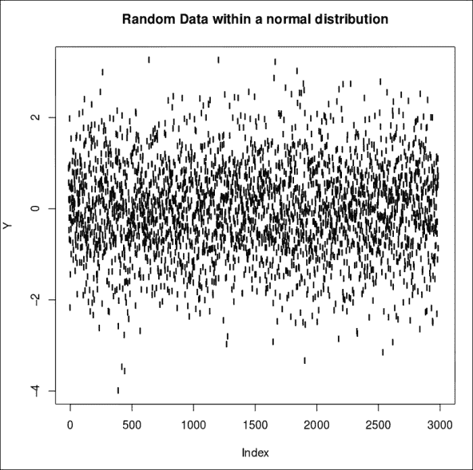

以下截图是由 R 脚本在构建过程中生成的随机数据的值的直方图。该数据模拟了大型项目中的班级规模。

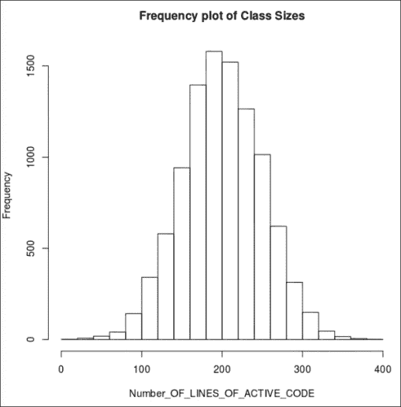

另一个视图是饼图。伪数据表示一周中每天失败任务的数量。如果你将其与你自己的值绘制在一起，可能会看到特别糟糕的日子，比如周末前后的日子。这可能会影响开发人员的工作方式，或者周内的动力分配。

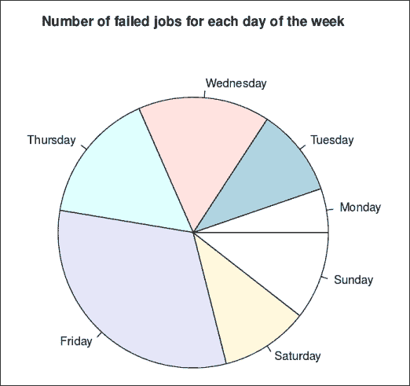

执行以下步骤：

1.  运行任务并查看 **工作区**。

1.  点击 **控制台输出**。你会看到类似于以下内容的输出：

    ```
    Started by user anonymous
    Building in workspace /var/lib/jenkins/workspace/ch4.Powerfull.Visualizations
    [ch4.Powerfull.Visualizations] $ Rscript /tmp/hudson6203634518082768146.R
    [1] "======================================="
    [1] "WORKSPACE:  /var/lib/jenkins/workspace/ch4.Powerfull.Visualizations"
    [1] "BUILD_URL:  "
    [1] "ls /var/lib/jenkins/jobs/R-ME/builds/"
    [1] "BUILD_NUMBER:  9"
    [1] "JOB_NAME:  ch4.Powerfull.Visualizations"
    [1] "JENKINS_HOME:  /var/lib/jenkins"
    [1] "JOB LOCATION: /var/lib/jenkins/jobs/ch4.Powerfull.Visualizations/builds/9/test.pdf"
    [1] "======================================="
    Finished: SUCCESS

    ```

1.  点击 **返回项目**。

1.  点击 **工作区**。

## 工作原理...

用几行 R 代码，你就生成了三个不同的、精美的 PDF 图表。

R 插件在构建过程中运行了一个脚本。该脚本将 `WORKSPACE` 和其他 Jenkins 环境变量打印到控制台上：

```
paste ('WORKSPACE: ', Sys.getenv('WORKSPACE'))
```

然后，文件名以附加到字符串 `pie_` 的构建号设置。这样可以使脚本每次运行时生成不同的文件名，如下所示：

```
filename <-paste('pie_',Sys.getenv('BUILD_NUMBER'),'.pdf',sep="")
```

脚本现在通过命令 `pdf(file=filename)` 打开输出到 `filename` 变量中定义的位置。默认情况下，输出目录是任务的工作区。

接下来，我们为图表定义了伪数据，表示一周中任意一天失败任务的数量。注意，在模拟世界中，星期五是一个糟糕的日子：

```
slices <- c(1,2,3,3,6,2,2)
labels <- c("Monday", "Tuesday", "Wednesday", "Thursday", "Friday","Saturday","Sunday")
```

绘制饼图：

```
pie(slices, labels = labels, main="Number of failed jobs for each day of the week")
```

对于第二个图表，我们在正态分布内生成了 10,000 个随机数据。伪数据表示运行给定作业的活动代码行数，如下所示：

```
Number_OF_LINES_OF_ACTIVE_CODE=rnorm(10000, mean=200, sd=50)
```

`hist` 命令生成频率图：

```
hist(Number_OF_LINES_OF_ACTIVE_CODE,main="Frequency plot of Class Sizes")
```

第三个图表是一个散点图，包含在正态分布内随机生成的 3,000 个数据点。这代表了一个典型的抽样过程，比如使用 Sonar 或 FindBugs 找到的潜在缺陷数量，如下所示：

```
Y <- rnorm(3000)
plot(Y,main='Random Data within a normal distribution')
```

我们将把将真实数据与 R 的绘图功能链接起来的工作留给读者作为练习。

## 更多内容...

这里还有几点让你思考。

### RStudio 或 StatET

用于 R 的一个流行的 IDE 是 **RStudio**（[`www.rstudio.com/`](http://www.rstudio.com/)）。开源版本是免费的。功能集包括带有代码完成和语法高亮的源代码编辑器、集成帮助、可靠的调试功能以及一系列其他功能，如下面的截图所示：

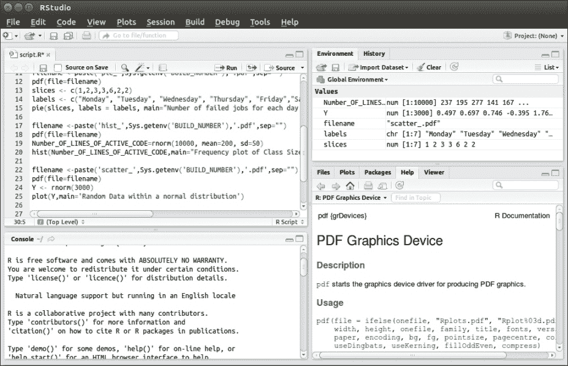

Eclipse 环境的另一种选择是 StatET 插件（[`www.walware.de/goto/statet`](http://www.walware.de/goto/statet)）。

### 快速获取帮助

学习 R 的第一步是从 R 控制台输入 `help.start()`。该命令会启动一个带有主要文档概述的浏览器。

如果你想要 R 命令的描述，那么在命令前输入 `?` 将生成详细的帮助文档。例如，在我们查看 `rnorm` 命令的配方时。键入 `?rnorm` 将产生类似的文档：

**正态分布**

**描述**

**用平均值等于 mean 和标准差等于 sd 的正态分布的密度、分布函数、分位数函数和随机生成。**

**使用方法**

**dnorm(x, mean = 0, sd = 1, log = FALSE)**

**pnorm(q, mean = 0, sd = 1, lower.tail = TRUE, log.p = FALSE)**

**qnorm(p, mean = 0, sd = 1, lower.tail = TRUE, log.p = FALSE)**

**rnorm(n, mean = 0, sd = 1)**

### 了解更多信息

R 语言有很好的文档。以下是一些有用的资源：

+   **Data Camp** ([`www.datacamp.com/courses`](https://www.datacamp.com/courses))：这是一个包括基本介绍和更详细的统计课程的免费在线课程的绝佳集合。

+   **为其他语言用户准备的 R 编程** ([`www.johndcook.com/blog/r_language_for_programmers/`](http://www.johndcook.com/blog/r_language_for_programmers/))：这是一个快速介绍，针对具有其他语言经验的新程序员可能遇到的问题。

+   **Google 的 R 风格指南** ([`google-styleguide.googlecode.com/svn/trunk/Rguide.xml`](https://google-styleguide.googlecode.com/svn/trunk/Rguide.xml))：如果你遵循这些指南，你的代码将保持一致且易读。

+   **MOOCs**：Edx、Coursera 等网站提供了许多在线课程。值得浏览它们的课程列表以寻找相关课程。要获取最新的 Coursera 课程列表，请访问 [`www.coursera.org/courses`](https://www.coursera.org/courses)。

+   **两分钟教程** ([`www.twotorials.com/`](http://www.twotorials.com/))：这里包含许多在 R 中可以做的事情的两分钟 YouTube 示例。

+   **R 的 Wiki 书籍** ([`en.wikibooks.org/wiki/Category:R_Programming`](http://en.wikibooks.org/wiki/Category:R_Programming))：这里汇集了许多优秀的文章和示例。

## 另请参阅

+   在 第五章 的 *使用指标来提高质量* 中的 *使用 R 插件分析项目数据* 配方
