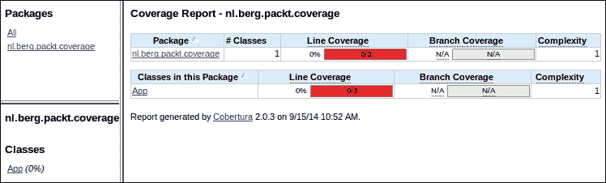
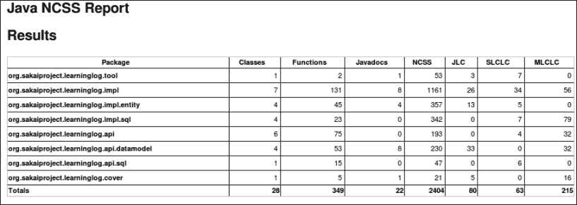

# 第五章。使用指标提高质量

在本章中，我们将涵盖以下内容：

+   通过 Sloccount 估算你的项目价值

+   通过代码覆盖率查找“臭味”代码

+   激活更多的 PMD 规则集

+   创建自定义 PMD 规则

+   使用 FindBugs 查找错误

+   启用额外的 FindBug 规则

+   使用 FindBugs 查找安全缺陷

+   验证 HTML 的有效性

+   使用 JavaNCSS 进行报告

+   使用外部 pom.xml 文件检查样式

+   伪造 Checkstyle 结果

+   将 Jenkins 与 SonarQube 集成

+   使用 R 插件分析项目数据

    ### 注意

    一些构建文件和代码有故意的错误，比如糟糕的命名约定、糟糕的编码结构或平台特定的编码。

    这些缺陷存在是为了让 Jenkins 有一个测试的目标。

# 介绍

本章探讨了使用 Jenkins 插件显示代码指标和失败构建。自动化降低成本并提高一致性。这个过程不会感到疲倦。如果你在项目开始之前确定了成功和失败的标准，那么这将减少发布会议中的主观辩论。

在 2002 年，NIST 估计软件缺陷每年给美国造成了大约 600 亿美元的损失 ([`www.abeacha.com/NIST_press_release_bugs_cost.htm`](http://www.abeacha.com/NIST_press_release_bugs_cost.htm))。预计这个成本已经大大增加。

为了节省成本并提高质量，你需要尽早在软件生命周期中消除缺陷。Jenkins 测试自动化创建了一张测量的安全网。另一个关键的好处是，一旦你添加了测试，就很容易为其他项目开发类似的测试。

Jenkins 与最佳实践（如**测试驱动开发**（**TDD**）或**行为驱动开发**（**BDD**））配合得很好。使用 TDD，你首先编写失败的测试，然后构建通过测试所需的功能。使用 BDD，项目团队以行为的形式编写测试描述。这使得描述对更广泛的受众可理解。更广泛的受众对实施细节具有更多的影响。

回归测试增加了重构软件时没有破坏代码的信心。代码测试覆盖率越高，信心越足。*通过代码覆盖率查找“有异味”的代码*的方法向您展示了如何使用 Cobertura（[`cobertura.github.io/cobertura/`](https://cobertura.github.io/cobertura/)）来测量覆盖率。类似的框架还有 Emma（[`emma.sourceforge.net/`](http://emma.sourceforge.net/)）。您还会在静态代码审查方面找到 PMD 和 FindBugs 的相关方法。静态意味着您可以查看代码而无需运行它。PMD 检查`.java`文件是否存在特定的错误模式。使用 PMD 规则设计器编写新的错误检测规则相对较容易。FindBugs 扫描编译后的`.class`文件；您可以直接查看应用的`.jar`文件。FindBugs 规则准确，大多数指向实际缺陷。在本章中，您将使用 FindBugs 搜索安全缺陷，并使用 PMD 搜索设计规则违例。

本章还提到了使用已知缺陷的 Java 类。我们将使用这些类来检查测试工具的价值。这与病毒检查器的基准类似，病毒检查器会解析具有已知病毒签名的文件。注入已知缺陷的优势在于您可以了解到违反的规则。这是收集项目中发现的实际缺陷并对其进行特征化和重复利用的好方法。考虑将自己的类添加到项目中，以查看 QA 过程是否能够捕捉到缺陷。

良好的文档和源代码结构有助于代码的可维护性和可读性。Sun 编码规范强制执行跨项目的一致标准。在本章中，您将使用 Checkstyle 和 JavaNCSS 来将您的源代码与 Sun 编码规范进行比较（[`www.oracle.com/technetwork/java/codeconventions-150003.pdf`](http://www.oracle.com/technetwork/java/codeconventions-150003.pdf)）。

Jenkins 插件生成的结果可以通过违例插件（[`wiki.jenkins-ci.org/display/JENKINS/Violations`](https://wiki.jenkins-ci.org/display/JENKINS/Violations)）聚合为一个报告。还有其他针对特定工具的插件，例如 PMD 或 FindBugs 插件。这些插件由分析收集器插件支持（[`wiki.jenkins-ci.org/display/JENKINS/Analysis+Collector+Plugin`](https://wiki.jenkins-ci.org/display/JENKINS/Analysis+Collector+Plugin)），该插件将其他报告聚合为一个统一的整体。可以通过 Portlets 仪表板插件显示单个插件报告，该插件在第四章 *通过 Jenkins 进行通信*中讨论过 *使用仪表板视图插件节约屏幕空间*。

Jenkins 不仅限于测试 Java；许多插件如 SLOCCount 或 DRY 插件（它可以发现代码的重复）是与语言无关的。甚至还有针对.NET 中的 NUnit 测试或其他语言的编译的特定支持。

### 注意

NUnit、JUnit、RUnit 和几个其他单元测试框架都遵循 xUnit 标准。详细信息请参阅维基百科条目：[`en.wikipedia.org/wiki/XUnit`](http://en.wikipedia.org/wiki/XUnit)

如果你缺少特定功能，你总是可以按照第七章 *插件探索*中的详细说明构建自己的 Jenkins 插件。

有许多关于软件度量的好介绍。这些包括关于指标细节的维基书籍（[`en.wikibooks.org/wiki/Introduction_to_Software_Engineering/Quality/Metrics`](http://en.wikibooks.org/wiki/Introduction_to_Software_Engineering/Quality/Metrics)）和 Diomidis Spinellis 撰写的一本写得很好的书籍*Code Quality: The Open Source Perspective*。

在本章的*将 Jenkins 与 SonarQube 集成*中，你将把 Jenkins 项目链接到 Sonar 报告上。Sonar 是一个专业工具，用于收集软件指标并将其分解为可理解的报告。Sonar 详细说明了项目的质量。它使用了一系列指标，包括本章中提到的 FindBugs 和 PMD 等工具的结果。项目本身正在快速发展。考虑使用 Jenkins 进行早期警告并发现明显的缺陷，比如糟糕的提交。然后你可以使用 Sonar 进行更深入的审查。

最后，你将运行解析项目中所有文件并报告简单指标的 R 代码。这个自定义过程很容易根据 R 语言中包含的丰富的统计包进行复杂的分析。

### 注意

在撰写本文时，FindBugs 和 PMD Jenkins 插件都需要特定版本的 Maven。作为管理员，你可以通过主配置屏幕（`http://hostname/configure`）下的**Maven**部分，通过按下**添加 Maven**按钮来自动安装 Maven 版本。稍后当你创建一个任务时，Jenkins 会给你选择 Maven 版本的选项。

当处理多模块的 Maven 项目时，Maven 插件会生成一系列结果。Maven 项目类型严格假设结果存储在常规位置，但这并不总是一致的。对于自由样式项目，你可以明确告诉 Jenkins 插件在哪里找到结果，使用与 Ant 文件集一致的正则表达式（[`ant.apache.org/manual/Types/fileset.html`](http://ant.apache.org/manual/Types/fileset.html)）。

# 通过 sloccount 估算你项目的价值

了解项目价值的一种方法是计算项目中的代码行数并在代码语言之间进行计数。 由 Dr. David Wheeler（[`www.dwheeler.com/sloccount/`](http://www.dwheeler.com/sloccount/)）编写的 SLOCCount，发音为“sloc-count”，是一个用于计算潜在大型软件系统中物理源代码行（SLOC）的命令行工具套件。 通过这些指标，您可以估算编写代码和估算开发成本需要多少小时。

## 准备工作

安装 SLOCCount 插件（[`wiki.jenkins-ci.org/display/JENKINS/SLOCCount+Plugin`](https://wiki.jenkins-ci.org/display/JENKINS/SLOCCount+Plugin)）。 为此配方代码创建一个新目录。 如 [`www.dwheeler.com/sloccount`](http://www.dwheeler.com/sloccount) 所述，在 Jenkins 实例上安装 SLOCCount。 如果您正在运行 Debian 操作系统，则以下安装命令将起作用：

```
sudo apt-get install sloccount

```

有关如何在其他系统上安装 SLOCCount 的详细信息，请查看：[`www.dwheeler.com/sloccount/sloccount.html`](http://www.dwheeler.com/sloccount/sloccount.html)

## 如何操作...

1.  创建一个自由风格的项目并将其命名为`ch5.quality.sloccount`。 将`SLOCCOUNT REPORT Project`添加为描述。

1.  在**源代码管理**部分，勾选**Subversion**，添加**存储库 URL**：[`source.sakaiproject.org/svn/shortenedurl/trunk`](https://source.sakaiproject.org/svn/shortenedurl/trunk)。

1.  在**构建**部分中，从**添加构建**步骤中选择**执行 shell**。 添加`/usr/bin/sloccount --duplicates --wide --details . >./sloccount.sc 命令`。

1.  在**后构建操作**部分，检查**发布 SLOCCount 分析结果**，添加到文本输入**SLOCCount 报告**，`sloccount.sc`。

1.  单击**保存**。

运行任务并查看详情。 您现在将看到相关语言的概述，如下图所示：


在顶级，您还将看到随时间推移代码每种语言的代码行数的时间序列。 这对需要估算完成项目所需资源的经理非常有用：


报告还允许您深入研究特定文件。 文件越大，开发人员就越容易迷失代码的含义。 如果您看到一个特别大的文件，那么值得审查，如下图所示：


### 注

要将您生成的报告与更广泛的 Sakai 项目进行比较，请访问[`www.openhub.net/p/sakai#`](https://www.openhub.net/p/sakai#)。

## 工作原理...

该秘籍引入了实际代码，这是一个基于 Java 的服务，用于生成缩短的 URL（[`confluence.sakaiproject.org/display/SHRTURL`](https://confluence.sakaiproject.org/display/SHRTURL)）。Jenkins 插件将 SLOCCount 生成的结果转换为详细信息。报告分为四个标签页的表格，按文件、模块、文件夹和语言进行汇总和排序。通过这些信息，您可以估计从头开始重建项目所需的工作程度。

工作描述包含指向 open hub ([`blog.openhub.net/2014/07/black-duck-open-hub/`](http://blog.openhub.net/2014/07/black-duck-open-hub/)) 的 URL，这是一个值得信赖的第三方服务。Open hub 是一个众所周知的服务，其隐私规则有着良好的描述（[`blog.openhub.net/privacy/`](http://blog.openhub.net/privacy/)）。然而，如果您不完全信任第三方服务的声誉，那么就不要通过 Jenkins 描述进行链接。

您可以通过访问[`www.openhub.net/p/sakai#`](https://www.openhub.net/p/sakai#)了解有关 Sakai 学习管理系统的信息。缩短的 URL 服务只是其中的一小部分。综合统计数据可以让访问者更好地了解更广泛的背景，如下面的屏幕截图所示：


## 还有更多...

还有一些细节需要考虑。

### 软件成本估算

SLOCCount 使用 COCOMO 模型 ([`en.wikipedia.org/wiki/COCOMO`](http://en.wikipedia.org/wiki/COCOMO)) 来估算项目成本。您不会在 Jenkins 报告中看到此内容，但如果您从命令行运行 SLOCCount，您可以生成估算成本。

成本估计为 `effort * personcost * overhead`。

随着时间推移，变化最大的元素是人力成本（以美元计）。您可以使用命令行参数`–personcost`来更改该值。

### 再见 Google 代码搜索；你好 code.ohoh.net

谷歌宣布已关闭其源代码搜索引擎。幸运的是，[code.ohloh.net](http://code.ohloh.net)（之前是[koders.com](http://koders.com)）另一个可行的搜索引擎，宣布将提供对[ohloh.net](http://ohloh.net)中描述的代码库的覆盖。使用这个搜索引擎，您将能够审查大量的开源项目。该搜索引擎补充了您可以在您喜爱的在线存储库（如 GitHub 和 Bitbucket）中搜索的代码。

## 另请参阅

+   *通过 Jenkins 进行通信* 的第四章中的 *使用 Google Analytics 了解您的受众* 秘籍

+   *使用 R 插件分析项目数据* 秘籍

# 通过代码覆盖寻找“臭味”代码

本秘籍使用 **Cobertura** ([`cobertura.sourceforge.net/`](http://cobertura.sourceforge.net/)) 来查找未被单元测试覆盖的代码。

没有持续的实践，编写单元测试将变得像向`stdout`写入调试信息一样困难。大多数流行的 Java 特定 IDE 都内置支持运行单元测试。Maven 将它们作为测试目标的一部分运行。如果您的代码没有回归测试，那么在重构过程中代码更容易中断。测量代码覆盖率可用于搜索未测试代码的热点。

### 注

欲了解更多信息，您可以查看：[`onjava.com/onjava/2007/03/02/statement-branch-and-path-coverage-testing-in-java.html`](http://onjava.com/onjava/2007/03/02/statement-branch-and-path-coverage-testing-in-java.html)。

## 准备工作

安装 Cobertura 代码覆盖插件 ([`wiki.jenkins-ci.org/display/JENKINS/Cobertura+Plugin`](https://wiki.jenkins-ci.org/display/JENKINS/Cobertura+Plugin))。

## 怎么做...

1.  使用以下命令生成模板项目：

    ```
    mvn archetype:generate -DgroupId=nl.berg.packt.coverage -DartifactId=coverage -DarchetypeArtifactId=maven-archetype-quickstart -Dversion=1.0-SNAPSHOT 

    ```

1.  使用以下命令测试未修改项目的代码覆盖率：

    ```
    mvn clean cobertura:cobertura

    ```

1.  审查 Maven 的输出。它看起来类似于以下输出：

    ```
    -------------------------------------------------------
    T E S T S
    -------------------------------------------------------
    Running nl.berg.packt.coverage.AppTest
    Tests run: 1, Failures: 0, Errors: 0, Skipped: 0, Time
    elapsed: 0.036 sec

    Results :
    Tests run: 1, Failures: 0, Errors: 0, Skipped: 0

    [INFO] [cobertura:cobertura {execution: default-cli}]
    [INFO] Cobertura 1.9.4.1 - GNU GPL License (NO WARRANTY) –
    Cobertura: Loaded information on 1 classes.
    Report time: 107ms
    [INFO] Cobertura Report generation was successful.

    ```

1.  在网络浏览器中，查看`/target/site/cobertura/index.html`。请注意，如下屏幕截图所示，没有代码覆盖率：

1.  将以下内容添加到`src/main/java/nl/berg/packt/coverage/Dicey.java`：

    ```
    package nl.berg.packt.coverage;
    import java.util.Random;
    public class Dicey {
      private Random generator;
      public Dicey(){
        this.generator = new Random();
        throwDice();
      }

      private int throwDice() {
        int value = generator.nextInt(6) + 1;
        if (value > 3){
          System.out.println("Dice > 3");
        }else{
          System.out.println("Dice < 4");
        }
        return value;
      }
    }
    ```

1.  修改`src/test/java/nl/berg/packt/coverage/AppTest.java`以通过更改`testApp()`方法来实例化一个新的 `Dicey` 对象：

    ```
    Public void testApp(){
      new Dicey();
      assertTrue( true );
    }
    ```

1.  使用以下命令测试 JUnit 测试的代码覆盖率：

    ```
    mvn clean cobertura:cobertura

    ```

1.  查看 Maven 输出，注意 `Dicey` 构造函数内部的 `println` 也已包含在内：

    ```
    -------------------------------------------------------
    T E S T S
    -------------------------------------------------------
    Running nl.berg.packt.coverage.AppTestDice < 4 Tests run: 1, Failures: 0, Errors: 0, Skipped: 0, Time elapsed: 0.033 sec
    ```

1.  在网络浏览器中打开`view /target/site/cobertura/index.html`。您的项目现在具有代码覆盖率，并且您可以看到尚未调用的代码行，如下屏幕截图所示：

1.  将以下**构建**部分添加到您的`pom.xml`中：

    ```
    <build>
      <plugins>
        <plugin>
          <groupId>org.codehaus.mojo</groupId>
          <artifactId>cobertura-maven-plugin</artifactId>
            <version>2.6</version>
            <configuration>
            <formats>
              <format>xml</format>
              <format>html</format>
            </formats>
          </configuration>
        </plugin>
      </plugins>
    </build>
    ```

1.  使用以下命令测试 JUnit 测试的代码覆盖率：

    ```
    mvn clean cobertura:cobertura

    ```

1.  访问位置`target/site/cobertura`，注意现在结果也存储在`coverage.xml`中。

1.  运行`mvn clean`以删除目标目录。

1.  将 Maven 项目添加到您的 Subversion 仓库中。

1.  创建一个名为`ch5.quality.coverage`的新 **Maven** 项目。

1.  在**源代码管理**部分中，勾选**Subversion**并添加您的存储库位置。

1.  在**构建**部分下的**目标和选项**中添加`clean cobertura:cobertura`。

1.  在**后期构建操作**部分中勾选**发布 Cobertura 覆盖率报告**。对于 Cobertura xml 报告模式输入，添加`**/target/site/cobertura/coverage.xml`。

1.  点击**保存**。

1.  点击两次**立即构建**以生成工作的趋势，然后审查结果。

趋势图是类，条件（例如 `if` 语句的分支），文件，代码行，方法和包的百分比的线性图。Jenkins 使用不同颜色的线显示每种类型，如下屏幕截图所示：


## 它是如何工作的...

Cobertura 在编译期间对 Java 字节码进行仪器化。Maven 插件会生成 HTML 和 XML 报告。HTML 报告允许你从命令行快速查看代码状态。XML 报告需要 Jenkins 插件解析。

你将插件配置放在了**build**部分而不是报告部分，以避免运行带有额外阶段的**site**目标。

自由样式项目被用来使 Cobertura 插件捡起多个 XML 报告。这是由文件集 `**/target/site/cobertura/coverage.xml` 定义的，该文件集表示工作空间下任何 `target/site/cobertura` 目录下的任何报告都称为 `coverage.xml`。

Maven 运行了 `clean cobertura:cobertura`。`clean` 目标会删除所有的 target 目录，包括以前编译和仪器化的代码。`cobertura:cobertura` 目标编译和仪器化代码，运行单元测试，然后生成报告。

`testApp` 单元测试调用了 `Dicey` 类的构造函数。构造函数随机生成从 1 到 6 的数字，模拟骰子，并在一个 `if` 语句的两个分支中进行选择。cobertura 报告允许你放大到源代码并发现做出的选择。该报告非常适用于识别遗漏的测试。如果你重构代码，那么在这些区域将没有单元测试，以便在代码意外更改行为时发现。该报告还擅长发现比周围环境更复杂的代码。代码越复杂，越难理解，也越容易引入错误。

以下文章是如何使用 cobertura 以及生成的指标背后含义的绝佳示例：[`www.ibm.com/developerworks/java/library/j-cq01316/index.html?ca=drs`](http://www.ibm.com/developerworks/java/library/j-cq01316/index.html?ca=drs)。

## 更多内容...

另一个开源工具替代品是 Emma ([`emma.sourceforge.net`](http://emma.sourceforge.net))。Emma 还有一个相关的 Jenkins 插件 [`wiki.jenkins-ci.org/display/JENKINS/Emma+Plugin`](https://wiki.jenkins-ci.org/display/JENKINS/Emma+Plugin)。在 Maven 中，你不需要在 `pom.xml` 文件中添加任何配置。你只需运行目标 `clean emma:emma package` 并将 Jenkins 插件指向结果。

### 注意

另一个替代框架是 Jacoco ([`www.eclemma.org/index.html`](http://www.eclemma.org/index.html))。Jacoco 被设计为 Emma 的一个后代。你可以在这里找到其 Jenkins 插件的完整描述：[`wiki.jenkins-ci.org/display/JENKINS/JaCoCo+Plugin`](https://wiki.jenkins-ci.org/display/JENKINS/JaCoCo+Plugin)。

# 激活更多的 PMD 规则集

PMD 有规则来捕获特定的错误。它将这些规则捆绑到规则集中。例如，有一个主题是关于 Android 编程的规则集，另一个是关于代码大小或设计的规则集。默认情况下，测量了三个非有争议的 PMD 规则集：

+   **基础**：此规则集包含每个开发人员都应遵循的明显实践，例如不要忽略已捕获的异常。

+   **未使用的代码**：此规则集可查找从未使用过的代码以及可消除的行，避免浪费并增加可读性。

+   **导入**：此规则集可发现不必要的导入。

此示例向您展示如何启用更多规则。主要风险是额外规则会生成大量误报，使真正的缺陷难以辨别。好处是您将捕获更广泛的缺陷，其中一些在进入生产环境后会造成严重后果。

## 准备工作

安装 Jenkins PMD 插件 ([`wiki.jenkins-ci.org/display/JENKINS/PMD+Plugin`](https://wiki.jenkins-ci.org/display/JENKINS/PMD+Plugin))。

### 提示

**Jenkins bug [Jenkins-22252]**

[`issues.jenkins-ci.org/browse/JENKINS-22252`](https://issues.jenkins-ci.org/browse/JENKINS-22252)

在撰写本文时，Jenkins 中的 Maven 3.2.1 与 PMD 插件不兼容。短期解决方案是在构建中使用 Maven 3.0.5。但是，到您阅读此警告时，我期望该问题已得到解决。

您可以从 Jenkins 的主配置屏幕 (`http://localhost:8080/configure`) 自动安装不同版本的 Java、Maven 或 Ant。

## 如何做...

1.  使用以下命令生成模板项目：

    ```
    mvn archetype:generate -DgroupId=nl.berg.packt.pmd -DartifactId=pmd -DarchetypeArtifactId=maven-archetype-quickstart -Dversion=1.0-SNAPSHOT

    ```

1.  使用以下内容将 Java 类 `src/main/java/nl/berg/packt/pmd/PMDCandle.java` 添加到项目中：

    ```
    package nl.berg.packt.pmd;
    import java.util.Date;
    public class PMDCandle {
      private String MyIP = "123.123.123.123";
      public void dontDontDoThisInYoourCode(){
        System.out.println("Logging Framework please"); 
        try {
          int x =5;
        }catch(Exception e){} String myString=null;
        if (myString.contentEquals("NPE here"));
      }
    }
    ```

1.  使用以下命令测试您的未修改项目：

    ```
    mvn clean pmd:pmd

    ```

1.  查看目录 `target`，您会注意到结果 `java-basic.xml`、`java-imports.xml`、`java-unusedcode.xml`，以及聚合结果 `pmd.xml`。

1.  在 web 浏览器中查看文件 `target/site/pmd.html`。

1.  将以下报告部分添加到您的 `pom.xml` 文件中：

    ```
    <reporting>
      <plugins>
        <plugin>
          <groupId>org.apache.maven.plugins</groupId>
          <artifactId>maven-jxr-plugin</artifactId>
          <version>2.3</version>
        </plugin>
       <plugin>
      <groupId>org.apache.maven.plugins</groupId>
      <artifactId>maven-pmd-plugin</artifactId>
      <version>3.2</version>
      <configuration>
      <targetJdk>1.6</targetJdk>
      <format>xml</format>
      <linkXref>true</linkXref>
      <minimumTokens>100</minimumTokens>
      <rulesets>
        <ruleset>/rulesets/basic.xml</ruleset>
        <ruleset>/rulesets/braces.xml</ruleset>
        <ruleset>/rulesets/imports.xml</ruleset>
        <ruleset>/rulesets/logging-java.xml</ruleset>
        <ruleset>/rulesets/naming.xml</ruleset>
        <ruleset>/rulesets/optimizations.xml</ruleset>
        <ruleset>/rulesets/strings.xml</ruleset>
        <ruleset>/rulesets/sunsecure.xml</ruleset>
        <ruleset>/rulesets/unusedcode.xml</ruleset>
      </rulesets>
      </configuration>
        </plugin>
      </plugins>
    </reporting>
    ```

1.  使用以下命令测试您的项目：

    ```
    mvn clean pmd:pmd

    ```

1.  在 web 浏览器中查看文件 `target/site/pmd.html`，注意到现在发现了额外的违规行为。这是由于在 `pom.xml` 文件中添加了额外规则造成的。

1.  运行 `mvn clean` 来删除 `target` 目录。

1.  将源代码添加到您的 Subversion 仓库。

1.  创建一个名为 `ch5.quality.pmd` 的新 **Maven** Jenkins 作业，包含以下详细信息：

    +   **源代码管理** | **Subversion**：您的仓库

    +   **构建** | **目标和选项**：`clean pmd:pmd`

    +   **构建设置**：**发布 PMD 分析结果**

1.  单击 **保存**。

1.  单击 **立即构建** 两次以生成趋势。查看结果。

顶层报告汇总了缺陷数量及其优先级。它还提到了一些详细信息，如下图所示：


你可以放大代码并查看高亮显示的区域以查找缺陷：


## 工作原理...

Maven PMD 插件测试了一系列规则集。当你从 PMD 网站下载二进制包（[`pmd.sourceforge.net/`](http://pmd.sourceforge.net/)）时，你可以通过列出 `pmd.jar` 文件的内容找到规则集的路径。在 *NIX 系统下执行此操作的命令是：

```
unzip –l pmd-version.jar | grep rulesets

```

你添加了一个标准的基准，一个具有已知缺陷的 Java 类，触发 PMD 警告。例如，以下两行代码中有多个缺陷：

```
String myString=null;
if (myString.contentEquals("NPE here"));
```

最重要的缺陷是 Java 程序员需要首先放置文本来避免 `NullPointerException`，例如：

```
"NPE here".contentEquals(myString)
```

当 `myString` 为 `null` 时，首先返回 false。`if` 语句周围缺少大括号是一个问题。当触发 `if` 语句时，同样适用于缺少要运行的命令。

另一个微不足道的例子是将基础设施细节硬编码到你的源代码中。例如，密码、IP 地址和用户名。最好将细节移到仅驻留在部署服务器上的属性文件中。以下一行测试 PMD 是否能够发现这种类型的缺陷：

```
private String MyIP = "123.123.123.123";
```

FindBugs 和 PMD 都有自己的一套 bug 模式检测器。两者都不会捕获所有类型的缺陷。因此，值得运行这两个工具来捕获最广泛范围的缺陷。有关这两款产品的评论，请访问[`www.freesoftwaremagazine.com/articles/destroy_annoying_bugs_part_1`](http://www.freesoftwaremagazine.com/articles/destroy_annoying_bugs_part_1)。

你可能会对其他几个静态代码审查工具感兴趣，例如 QJPro ([`qjpro.sourceforge.net/`](http://qjpro.sourceforge.net/)) 和 Jlint ([`jlint.sourceforge.net/`](http://jlint.sourceforge.net/))。

## 还有更多...

Out-of-the-box，PMD 测试了一组合理的 bug 缺陷；然而，每个项目都是不同的，你需要进行调整。

### 减少 PMD 规则集的速率

重要的是要理解规则集的重要性，并塑造 Maven 配置，仅包括有用的规则。如果你不为一个中等规模的项目做这个，报告将包含数千个违规行为，隐藏了真正的缺陷。然后报告将需要时间在你的网络浏览器中渲染。考虑启用一个长列表的规则，只有当你想要使用体积作为项目成熟度的指标时。

要减少，排除代码的部分并系统地清理报告的区域。

### 注意

你可以在这里找到当前的 PMD 规则集：[`pmd.sourceforge.net/rules/index.html`](http://pmd.sourceforge.net/rules/index.html)

### 不要重复自己的原则

剪切和粘贴编程，克隆，然后修改代码会导致重构的噩梦。如果代码没有正确封装，很容易在代码库中散落着略有不同的代码片段。如果你想要删除已知的缺陷，那将需要额外的工作。

PMD 通过查找重复代码来支持不要重复自己（DRY）原则。触发点通过 `minimumTokens` 标签进行配置。然而，PMD 插件不会拾取结果（存储在 `cpd.xml` 中）。您需要安装和配置 DRY 插件（[`wiki.jenkins-ci.org/display/JENKINS/DRY+Plugin`](https://wiki.jenkins-ci.org/display/JENKINS/DRY+Plugin)）或 Jenkins 违规插件。

### 注意

如果您从其网站下载了 PMD 二进制文件（[`sourceforge.net/projects/pmd/files/pmd/`](http://sourceforge.net/projects/pmd/files/pmd/)），那么在 bin 目录中，您会找到 `cpdgui`。这是一个允许您在源代码中探索重复的 Java swing 应用程序。

## 参见

+   *创建自定义 PMD 规则* 配方

+   *使用 R 插件分析项目数据* 配方

# 创建自定义 PMD 规则

与其他静态代码审查工具相比，PMD 有两个额外的功能。第一个是 `cpdgui` 工具，允许您查找从代码库的一个部分复制粘贴到另一个部分的代码。第二个，也是我们将在这个配方中探索的，是使用 Xpath 为 Java 源代码设计自定义 bug 发现规则的能力。

## 准备工作

确保您已安装了 Jenkins PMD 插件（[`wiki.jenkins-ci.org/display/JENKINS/PMD+Plugin`](https://wiki.jenkins-ci.org/display/JENKINS/PMD+Plugin)）。从 [`pmd.sourceforge.net`](http://pmd.sourceforge.net) 下载并解压 PMD 发行版。访问 PMD bin 目录，并验证您是否具有启动脚本 `run.sh designer` 和 `designer.bat`。

## 如何做...

1.  使用以下命令从命令行创建一个 Maven 项目：

    ```
    mvn archetype:generate -DgroupId=nl.berg.packt.pmdrule -DartifactId=pmd_design -DarchetypeArtifactId=maven-archetype-quickstart -Dversion=1.0-SNAPSHOT

    ```

1.  在 `pom.xml` 文件中，`</project>` 标记之前添加一个 `reporting` 部分，内容如下：

    ```
    <reporting>
      <plugins>
        <plugin>
          <groupId>org.apache.maven.plugins</groupId>
          <artifactId>maven-jxr-plugin</artifactId>
          <version>2.1</version>
        </plugin>
      <plugin>
      <groupId>org.apache.maven.plugins</groupId>
      <artifactId>maven-pmd-plugin</artifactId>
      <version>2.6</version>
      <configuration>
      <targetJdk>1.6</targetJdk>
      <format>xml</format>
      <rulesets>
        <ruleset>password_ruleset.xml</ruleset>
      </rulesets>
      </configuration>
        </plugin>
      </plugins>
    </reporting>
    ```

    ### 注意

    此配方仅适用于版本 2.6。

1.  在顶层目录下，创建名为 `password_ruleset.xml` 的文件，内容如下：

    ```
    <?xml version="1.0"?>
    <ruleset name="STUPID PASSWORDS ruleset"

      xsi:schemaLocation="http://pmd.sf.net/ruleset/1.0.0 http://pmd.sf.net/ruleset_xml_schema.xsd"
      xsi:noNamespaceSchemaLocation="http://pmd.sf.net/ruleset_xml_schema.xsd">
      <description>
      Lets find stupid password examples
      </description>
    </ruleset>
    ```

1.  编辑 `src/main/java/nl/berg/packt/pmdrule/App.java`，使得主方法为：

    ```
    public static void main( String[] args )
    {
      System.out.println( "Hello World!" );
      String PASSWORD="secret";
    }
    ```

1.  根据您的操作系统，使用启动脚本 `bin/run.sh designer` 或 `bin/designer.bat` 运行 pmd designer。

1.  点击屏幕左上角的 **JDK** 选项，选择 **JDK 1.6** 作为 Java 版本。

1.  在 **源代码** 文本区域中，添加要针对测试的示例代码。在本例中：

    ```
    public class RuleTest {
      static final String PASSWORD="secret";
    }
    ```

1.  对于 **查询（如果有的话）** 文本区域，添加：

    ```
    //VariableDeclaratorId[@Image='PASSWORD']
    ```

1.  点击 **Go**。你现在会看到结果 **第 2 行第 20 列的 ASTVariableDeclarorID**，如下截图所示：

1.  在屏幕顶部的 **操作** 菜单选项下，选择 **创建规则 XML**。添加以下值：

    +   **规则名称**：无密码

    +   **规则消息**：如果我们看到密码，我们应该标记

    +   **规则描述**：让我们找到愚蠢的密码示例

1.  点击 **创建规则 XML**。生成的 XML 应该有一个类似于的片段：

    ```
    <rule  name="NO_PASSWORD"
      message="If we see a PASSWORD we should flag"
      class="net.sourceforge.pmd.rules.XPathRule">
      <description>
      If we see a PASSWORD we should flag
      </description>
      <properties>
        <property name="xpath">
        <value>
    <![CDATA[
    //VariableDeclaratorId[@Image='PASSWORD']

    ]]>
        </value>
        </property>
      </properties>
      <priority>3</priority>
      <example>
    <![CDATA[
    public class RuleTest {
        static final String PASSWORD="secret";
    }
    ]]>
      </example>
    </rule>
    ```

    

1.  将生成的代码复制并粘贴到`password_ruleset.xml`中的`</ruleset>`之前。

1.  将项目提交到您的 Subversion 存储库。

1.  在 Jenkins 中，创建一个名为`ch5.quality.pmdrule`的**Maven**作业。

1.  在**源代码管理**部分，勾选**Subversion**，并为**存储库 URL**添加您的 Subversion 存储库位置。

1.  在**构建**部分的**目标和选项**中，将值设置为`clean site`。

1.  在**构建设置**部分，勾选**发布 PMD 分析结果**。

1.  点击**保存**。

1.  运行作业。

1.  查看**PMD 警告**链接，如下截图所示：

## 工作原理是什么...

PMD 分析源代码并将其分解为称为抽象语法树（AST）的元数据（[`onjava.com/pub/a/onjava/2003/02/12/static_analysis.html`](http://onjava.com/pub/a/onjava/2003/02/12/static_analysis.html)）。PMD 能够使用 Xpath 规则在 AST 中搜索模式。W3Schools 提供了 Xpath 的简明介绍（[`www.w3schools.com/xpath/`](http://www.w3schools.com/xpath/)）。设计工具使您能够编写 Xpath 规则，然后针对源代码示例测试您的规则。为了可读性，测试代码中应该只包含必要的细节。然后将规则存储在 XML 中。

要将 XML 规则打包在一起，你必须将规则添加为`<ruleset>`标记的一部分。

Maven PMD 插件有能力从其类路径、本地文件系统或通过 HTTP 协议从远程服务器读取规则集。您通过添加配置选项添加了您的规则集：

```
<ruleset>password_ruleset.xml</ruleset>
```

如果你建立了一套规则集，应该将所有规则都放入一个项目中以便管理。

您还可以根据已有规则创建自己的自定义规则集，提取您喜欢的错误检测模式。这可以通过带有指向已知规则的`<rule>`标记来实现，例如，以下从`imports.xml`规则集中提取了`DuplicateImports`规则：

```
<rule ref="rulesets/imports.xml/DuplicateImports"/>
```

本示例生成的规则测试了名称为`PASSWORD`的变量。我们在真实项目中多次触发了该规则。

我们将 Maven PMD 插件的版本锁定为 2.6，以确保在插件的将来发布版本后仍然可以使用本示例。

### 注意

PMD 主页是了解 Xpath 规则可能性的好地方。它包含了规则集的描述和详细信息，例如，日志规则；请参阅[`pmd.sourceforge.net/pmd-4.3.0/rules/logging-java.html`](http://pmd.sourceforge.net/pmd-4.3.0/rules/logging-java.html)。

## 还有更多...

如果静态代码审查工具能够就如何修复代码提出建议将是非常有效的。然而，这有点危险，因为检测器并不总是准确的。作为一个实验，我编写了一个小型的 Perl 脚本，首先修复字面量，然后删除一些资源的浪费。这段代码是一个概念验证，因此不能保证正确运行。它的好处在于简洁，参见：

[`source.sakaiproject.org/contrib/qa/trunk/static/cleanup/easy_wins_find_java.pl`](https://source.sakaiproject.org/contrib/qa/trunk/static/cleanup/easy_wins_find_java.pl)

## 另请参阅

+   *激活更多的 PMD 规则集* 示例

# 使用 FindBugs 查找错误

在静态代码审查工具发现的缺陷数量中很容易迷失方向。另一个质量保证攻击模式是逐个清理缺陷包，集中开发者的时间在最常用的功能上。

这个示例将向您展示如何为特定包生成和报告 FindBugs 发现的缺陷。

## 准备工作

安装 Jenkins FindBugs 插件 ([`wiki.jenkins-ci.org/display/JENKINS/FindBugs+Plugin`](https://wiki.jenkins-ci.org/display/JENKINS/FindBugs+Plugin))。

### 提示

**Java 版本**

FindBugs 插件版本 3 需要 Java 7 或更高版本。

## 如何操作...

1.  从命令行创建一个 Maven 项目：

    ```
    mvn archetype:generate -DgroupId=nl.berg.packt.FindBugs_all - DartifactId=FindBugs_all -DarchetypeArtifactId=maven- archetype-quickstart -Dversion=1.0-SNAPSHOT

    ```

1.  在 `pom.xml` 文件中，在`</project>`标签之前添加一个**构建**部分，内容如下：

    ```
    <build>
    <plugins>
    <plugin>
    <groupId>org.codehaus.mojo</groupId>
    <artifactId>FindBugs-maven-plugin</artifactId>
    <version>3.0.0</version>
    <configuration>
    <FindBugsXmlOutput>true</FindBugsXmlOutput>
    <FindBugsXmlWithMessages>true</FindBugsXmlWithMessages>
    <onlyAnalyze>nl.berg.packt.FindBugs_all.candles.*</onlyAnal yze>
    <effort>Max</effort>
    </configuration>
    </plugin>
    </plugins>
    </build>
    ```

1.  创建目录 `src/main/java/nl/berg/packt/FindBugs_all/candles`。

1.  在 `candles` 目录中包括名为 `FindBugsCandle.java` 的文件，内容如下：

    ```
    package nl.berg.packt.FindBugs_all.candles;

    public class FindBugsCandle {
      public String answer="41";
      public boolean myBad(){
        String guess= new String("41");
    if (guess==answer){ return true; }
        return false;
      }
    }
    ```

1.  创建一个名为 `ch5.quality.FindBugs` 的**Maven**项目。

1.  在**源代码管理**部分，选中**Subversion**单选框，添加到**Repository URL**中您的存储库 URL。

1.  在**构建**部分中添加 `clean compile findBugs:findBugs` 作为**目标和选项**。

1.  在**构建后操作**选项中，选择**发布 FindBugs 分析结果**。

1.  点击**保存**。

1.  运行作业。

1.  查看结果。

第一页是一个摘要页面，可以让您有效地放大细节，如下图所示：


查看诸如**BAD_PRACTICE**之类的类别，可以查看触发的每种错误类型的描述：


您可以随后查看相关的代码。突出显示的代码有助于集中注意力，如下图所示：


## 工作原理...

在这个示例中，您已经创建了一个标准的 Maven 项目，并添加了一个带有已知缺陷的 Java 文件。

`pom.xml` 配置强制 FindBugs 仅报告 `nl.berg.packt.FindBugs_all.candles` 包中类的缺陷。

在标准蜡烛中，`guess==answer` 这一行是一个典型的程序错误。两个对象的引用被比较，而不是它们字符串的值。由于 `guess` 对象是在上一行创建的，结果将始终为 `false`。这类缺陷可能会出现在程序中作为微妙的问题。JVM 缓存字符串，有时两个表面上不同的对象实际上是同一个对象。

## 更多内容...

FindBugs 在开发者中很受欢迎，并为多个流行的 IDE 提供插件。其结果通常作为其他工具的更广泛报告的一部分。

### FindBugs Eclipse 插件

Eclipse 插件的自动安装位置为 [`findbugs.cs.umd.edu/eclipse`](http://findbugs.cs.umd.edu/eclipse)。

默认情况下，FindBugs Eclipse 插件只启用了有限数量的规则。要增加测试集，您需要转到 **窗口** 下的 **首选项** 菜单选项，在左侧菜单中选择 **FindBugs**。在右侧，您将看到 **报告的 (可见的) 缺陷类别** 选项在 **报告者配置** 下。您现在可以调整可见的类别，如下图所示：


### Xradar 和 Maven 仪表板

但是，对于生成的软件度量的累积，还有其他替代方案。Maven 仪表板就是一个例子 ([`mojo.codehaus.org/dashboard-maven-plugin/`](http://mojo.codehaus.org/dashboard-maven-plugin/))。您将需要将其连接到自己的数据库。在书籍 *Apache Maven 3 Cookbook, Srirangan, Packt Publishing* ([`www.packtpub.com/application-development/apache-maven-3-cookbook`](https://www.packtpub.com/application-development/apache-maven-3-cookbook)) 中的 第四章，*报告和文档* 中有一个名为 *设置 Maven 仪表板* 的配方。

Xradar 是仪表板的另一个例子 ([`xradar.sourceforge.net/usage/maven-plugin/howto.html`](http://xradar.sourceforge.net/usage/maven-plugin/howto.html))，而 QALab 是第三个 ([`qalab.sourceforge.net/multiproject/maven2-qalab-plugin/index.html`](http://qalab.sourceforge.net/multiproject/maven2-qalab-plugin/index.html))。

## 另请参阅

+   *启用额外的 FindBug 规则* 配方

+   *使用 FindBugs 查找安全缺陷* 配方

+   *激活更多 PMD 规则集* 配方

# 启用额外的 FindBug 规则

FindBugs 拥有广泛的辅助缺陷模式检测器。这些检测器被捆绑到一个贡献者项目中，托管在 SourceForge ([`sourceforge.net/projects/fb-contrib/`](http://sourceforge.net/projects/fb-contrib/))。

本配方详细介绍了如何从 `fb-contrib` 项目中添加额外的缺陷检测器到 FindBugs，并使用这些检测器捕获已知缺陷。

## 准备就绪

假设您已经按照之前的配方*使用 FindBugs 查找错误*。您将使用该配方的 Maven 项目作为起点。

### 提示

**fb-contrib 版本更改**

在以下配方中，Maven 会自动下载一个库文件（`.jar`）。构建可能会失败，因为开发人员已经增加了版本号。在这种情况下，要找到正确的文件名，请浏览[`downloads.sourceforge.net/project/fb-contrib/Current/`](http://downloads.sourceforge.net/project/fb-contrib/Current/)。

## 如何做...

1.  将顶层的`pom.xml`文件复制到`pom_fb.xml`。

1.  用以下内容替换`pom_fb.xml`的 FindBugs `<plugin>`部分：

    ```
    <plugin>
    <groupId>org.codehaus.mojo</groupId>
    <artifactId>FindBugs-maven-plugin</artifactId>
    <version>3.0.0</version>
    <configuration>
    <FindBugsXmlOutput>false</FindBugsXmlOutput>
    <FindBugsXmlWithMessages>true</FindBugsXmlWithMessages>
    <onlyAnalyze>nl.berg.packt.FindBugs_all.candles.*</onlyAnal yze>
    <pluginList>http://downloads.sourceforge.net/project/fb- contrib/Current/fb-contrib-6.0.0.jar</pluginList>
    <effort>Max</effort>
    </configuration>
    </plugin>
    ```

1.  在`src/main/java/nl/berg/packt/fingbugs_all/candles`目录中，向`FindBugsFBCandle.java` Java 类添加以下代码片段：

    ```
    package nl.berg.packt.FindBugs_all.candles;

    public class FindBugsFBCandle {
      public String FBexample(){
        String answer="This is the answer";
        return answer;
      }
    }
    ```

1.  将更新提交到您的 Subversion 仓库。

1.  创建一个名为`ch5.quality.FindBugs.fb`的 Jenkins **Maven**作业。

1.  在**源代码管理**部分，选中**Subversion**单选框，并为**仓库 URL**添加代码的 URL。

1.  在**build**部分设置：

    +   **Root POM**设置为`pom_fb.xml`

    +   **目标和选项**设置为`clean compile Findbugs:Findbugs`

1.  在**构建设置**部分，检查**发布 FindBugs 分析结果**。

1.  点击**保存**。

1.  运行作业。

1.  当作业构建完成后，查看**FindBugs 警告**链接。您现在将看到一个新的警告**USBR_UNNECESSARY_STORE_BEFORE_RETURN**。

## 它是如何工作的...

要包含外部检测器，您添加了一行额外的内容到 FindBugs Maven 配置中，如下所示：

```
<pluginList>http://downloads.sourceforge.net/project/fb- contrib/Current/fb-contrib-6.0.0.jar</pluginList>
```

值得访问 SourceForge 检查检测器的最新版本。

目前，使用 Maven 的依赖管理无法从存储库中拉取检测器，尽管这可能会改变。

在这个配方中，您已经添加了一个 Java 类来触发新的错误检测规则。反模式是在返回之前创建答案对象的不必要行。匿名返回对象更加简洁，例如：

```
return "This is the answer";
```

反模式触发了**USBR_UNNECESSARY_STORE_BEFORE_RETURN**模式，该模式在`fb-contrib`项目的主页上有描述。

## 还有更多...

Java 语言有许多难以理解的微妙边界情况，直到通过真实示例解释。捕捉知识的一种极好方式是在您的代码中遇到问题时自己编写示例。注入标准蜡烛是测试团队知识的一种自然方式，并在 QA 过程中进行目标练习。

FindBugs 项目根据 Joshua Bloch 和 Neal Gafter 的书《Java Puzzlers》（[`www.javapuzzlers.com/`](http://www.javapuzzlers.com/)）的内容生成了一些他们的检测器。

## 另请参阅

+   *使用 FindBugs 查找错误*配方

+   *使用 FindBugs 查找安全缺陷*配方

+   *激活更多 PMD 规则集*配方

# 使用 FindBugs 查找安全缺陷

在本示例中，你将使用 FindBugs 发现 Java 服务器页面中的安全漏洞以及有缺陷的 Java 类中的一些安全缺陷。

## 准备工作

要么按照第三章 *构建软件* 中的 *基于 JSP 语法错误失败的 Jenkins 任务* 配方，要么使用 Packt Publishing 网站提供的项目下载。

## 如何操作...

1.  在 `<build>` 下的 `<plugins>` 中编辑 `pom.xml` 文件，添加 FindBugs 插件并添加以下内容：

    ```
    <plugins>
    <plugin>
    <groupId>org.codehaus.mojo</groupId>
    <artifactId>findBugs-maven-plugin</artifactId>
    <version>3.0.0</version>
    <configuration>
    <FindBugsXmlOutput>true</FindBugsXmlOutput>
    <FindBugsXmlWithMessages>true</FindBugsXmlWithMessages>
    <effort>Max</effort>
    </configuration>
    </plugin>
    ```

1.  创建目录结构 `src/main/java/nl/berg/packt/finbugs_all/candles`。

1.  添加 Java 文件 `FindBugsSecurity.java`，内容如下：

    ```
    package nl.berg.packt.FindBugs_all.candles;

    public class FindBugsSecurityCandle {
      private final String[] permissions={"Read", "SEARCH"};
      private void infiniteLoop(int loops){
        infiniteLoop(99);
      }

      public String[] exposure(){
        return permissions;
      }
      public static void main(String[] args) { 
        String[] myPermissions = new FindBugsSecurityCandle().exposure();
        myPermissions[0]="READ/WRITE";
        System.out.println(myPermissions[0]);
      }
    }
    ```

1.  将更新提交到你的 Subversion 仓库。

1.  创建一个名为 `ch5.quality.FindBugs.security` 的 **Maven** Jenkins 任务。

1.  在 **源代码管理** 部分，选中 **Subversion** 单选框，并在 **Repository URL** 文本框中添加你的 Subversion 仓库位置**。**

1.  在 **目标和选项** 的 **build** 部分下，将值设置为 `clean package findBugs:findBugs`。

1.  在 **构建设置** 部分，选中 **发布 FindBugs 分析结果**。

1.  点击 **保存**。

1.  运行该任务。

1.  当任务完成后，查看 **FindBugs Warning** 链接。注意，JSP 包存在一个关于 **XSS_REQUEST_PARAMETER_TO_JSP_WRITER** 的警告。然而，该链接无法找到源代码的位置。

1.  将 `src/main/webapp/index.jsp` 复制到 `jsp/jsp.index_jsp`。

1.  提交到你的 Subversion 仓库。

1.  再次运行任务。

1.  在 **FindBugs Warning** 链接下查看结果。你现在可以查看 JSP 源代码了。

## 工作原理...

JSP 首先从文本转换为 Java 源代码，然后编译。FindBugs 通过解析编译后的 Java 字节码来工作。

原始的 JSP 项目存在严重的安全漏洞。它信任来自互联网的输入。这导致了许多攻击向量，包括 XSS 攻击 ([`en.wikipedia.org/wiki/Cross-site_scripting`](http://en.wikipedia.org/wiki/Cross-site_scripting))。使用允许标记的白名单来解析输入是减少风险的一种方法。FindBugs 发现了这个缺陷并以 `XSS_REQUEST_PARAMETER_TO_JSP_WRITER` 进行警告。Jenkins FindBugs 插件详细说明了错误类型，因为你在配置中打开了消息：

```
<FindBugsXmlWithMessages>true</FindBugsXmlWithMessages>
```

FindBugs 插件尚未实现对 JSP 文件位置的理解。当单击链接到源代码时，插件会在错误的位置查找。一个临时解决方案是将 JSP 文件复制到 Jenkins 插件期望的位置。

FindBugs 报告的行号位置也毫无意义。它指向了生成自 `.jsp` 文件的 `.java` 文件中的行，而不是直接指向 JSP 文件。尽管存在这些限制，FindBugs 仍然能够发现有关 JSP 缺陷的有用信息。

### 注意

JSP Bug 检测的替代方案是 PMD。你可以从命令行配置它仅扫描 JSP 文件，使用选项 `–jsp`，参见：[`pmd.sourceforge.net/jspsupport.html`](http://pmd.sourceforge.net/jspsupport.html)

## 还有更多...

虽然 FindBugs 有一些属于安全类别的规则，但还有其他发现安全相关缺陷的 bug 检测器。标准烛台类包括两种此类缺陷。第一个是一个递归循环，将不断从其内部调用相同的方法，如下面的代码所示：

```
private void infiniteLoop(int loops){
  infiniteLoop(99);
}
```

也许程序员打算使用计数器来在 99 个循环后强制退出，但是并不存在执行此操作的代码。如果调用此方法，最终结果是它将不断调用自身，直到堆栈保留的内存被消耗完并且应用程序失败。这也是一个安全问题；如果攻击者知道如何到达此代码，他们可以通过**拒绝服务**（**DOS**）攻击使相关应用程序崩溃。

标准烛台中捕获的另一个攻击是能够更改看起来不可变的数组中的内容。确实，数组的引用不能更改，但是数组元素的内部引用可以。在示例中，一个有动机的黑客可以访问内部对象，并将 READ 权限更改为 READ/WRITE 权限。为了防止这种情况发生，考虑制作原始数组的防御性副本，并将副本传递给调用方法。

### 注意

OWASP 项目提供了大量关于测试安全性的信息，请查看以下链接：

[`www.owasp.org/index.php/Category:OWASP_Java_Project`](https://www.owasp.org/index.php/Category:OWASP_Java_Project)

## 另请参阅

+   *使用 FindBugs 查找 bug 的方法*

+   *启用额外的 FindBug 规则* 配方

+   *激活更多 PMD 规则集* 配方

+   第三章 中的 *为集成测试配置 Jetty* 配方，*构建软件*

# 验证 HTML 的有效性

该配方告诉你如何使用 Jenkins 对 HTML 页面进行验证，以符合 HTML 和 CSS 标准。

Web 浏览器并不挑剔。您可以在应用程序中拥有损坏的模板，生成的 HTML 在一个浏览器上可以正常工作，但在另一个浏览器上却很难看。验证可以提高一致性，并及早发现非平凡但难以发现的问题。

您可以上传并验证您的 HTML 文件是否符合 W3C 的统一验证器 ([`code.w3.org/unicorn`](http://code.w3.org/unicorn))。统一验证器将根据多个聚合服务检查您的网页的正确性。Jenkins 插件会自动为您执行此操作。

## 准备工作

安装 Unicon 验证插件（[`wiki.jenkins-ci.org/display/JENKINS/Unicorn+Validation+Plugin`](https://wiki.jenkins-ci.org/display/JENKINS/Unicorn+Validation+Plugin)）。如果还没有安装，请同时安装 Plot 插件（[`wiki.jenkins-ci.org/display/JENKINS/Plot+Plugin`](https://wiki.jenkins-ci.org/display/JENKINS/Plot+Plugin)）。

## 如何操作...

1.  创建一个名为 `ch5.quality.html` 的自由风格作业。

1.  在 **构建** 部分内，**添加构建步骤**，选择 **Unicorn 验证器**。

1.  对于要验证的站点 **Site to validate** 输入，请添加允许测试的站点的 URL。

1.  单击 **保存**。

1.  运行作业。

1.  查看 **工作区**，单击 `unicorn_output.html` 链接，然后单击 `markup-validator_errors.properties`。对于属性文件的内容，您将看到类似 `YVALUE=2` 的内容。

1.  **配置** 项目。在 **后构建操作** 部分，勾选 **绘制构建数据**，添加以下细节：

    +   **绘图组**：验证错误

    +   **绘图标题**：标记验证错误

    +   **要包含的构建数**：40

    +   **绘图 y 轴标签**：错误

    +   **绘图样式**：区域

    +   **数据系列文件**：`markup-validator_errors.properties`

    +   验证 **从属性文件加载数据** 单选框是否被选中

    +   **数据系列图例标签**：反馈错误

1.  单击 **保存**。

1.  运行作业。

1.  查看 **绘图** 链接。

## 工作原理...

Unicon 验证插件使用 W3C 的验证服务生成配置的 URL 的报告。插件处理返回的报告并获取缺陷的绝对计数。然后，总计值被放置在属性文件中，然后绘图插件会获取这些值（请参阅 第三章 中的 *在 Jenkins 中绘制替代代码度量* 配方，*构建软件*）。如果看到警告突然激增，请查看 HTML 页面以查找重复缺陷。

## 还有更多...

从单元测试中获得良好的代码覆盖率相当困难。这在项目较大且有多个团队采用不同实践的情况下尤为明显。通过使用尽可能访问应用程序中尽可能多的链接的工具，可以显著提高对 Web 应用程序的自动化测试覆盖率。这包括 HTML 验证器、链接检查器、搜索引擎爬虫和安全工具。考虑在集成测试期间设置一系列工具来访问您的应用程序，并记住解析日志文件以查找意外错误。您可以使用 第一章 中的 *通过日志解析故意失败的构建* 配方自动化日志解析，*维护 Jenkins*。

### 注意

有关逐步验证在线内容的详细信息，请访问 [`www.w3.org/QA/2002/09/Step-by-step`](http://www.w3.org/QA/2002/09/Step-by-step)。

# 使用 JavaNCSS 进行报告

JavaNCSS ([`javancss.codehaus.org/`](http://javancss.codehaus.org/)) 是一个软件度量工具，它计算两种类型的信息：第一种是包中活动的、注释的或与 JavaDoc 相关的源代码行数的总数。第二种类型基于存在多少不同的决策分支来计算代码的复杂性。

Jenkins JavaNCSS 插件忽略了复杂性计算，而是专注于更容易理解的行数统计。

### 注意

**NCSS** 代表**非注释源语句**，即代码行数减去注释和额外的换行符。

## 准备就绪

安装 JavaNCSS 插件 ([`wiki.jenkins-ci.org/display/JENKINS/JavaNCSS+Plugin`](https://wiki.jenkins-ci.org/display/JENKINS/JavaNCSS+Plugin))。

## 如何做...

1.  创建一个名为 `ch5.quality.ncss` 的**Maven**项目。

1.  在**源代码管理**部分，选择**Subversion**单选框。

1.  添加**仓库 URL** [`source.sakaiproject.org/contrib/learninglog/tags/1.0`](https://source.sakaiproject.org/contrib/learninglog/tags/1.0)。

1.  查看**构建触发器**，确保没有激活。

1.  在**构建**部分的**目标和选项**下，键入`clean javancss:report`。

1.  在**构建设置**部分，勾选**发布 Java NCSS 报告**。

1.  点击**保存**。

1.  运行该作业。

1.  查看**Java NCSS 报告**链接。

1.  查看工作区中的顶级 `pom.xml` 文件，例如，`http://localhost:8080job/ch5.quality.ncss/ws/pom.xml`。

## 工作原理...

该作业从 Sakai 项目的学习日志工具子版本库中提取了源代码。该项目是一个多模块项目，API 与实现分离。

JavaNCSS 不需要编译的类或对 Maven `pom.xml` 文件的修改；这使得循环简单。该作业运行了一个 Maven 目标，通过 JavaNCSS Jenkins 插件发布了报告。

回顾报告，实现相对于其他包具有更多的活动代码行数。API 的文档对其他开发人员重用代码至关重要。值得注意的是，API 中没有 JavaDoc 行。

摘要表中的缩写具有以下含义：

+   **类**：这是包中类的数量。

+   **函数**：这是包中函数的数量。

+   **JavaDocs**：这是包中不同 JavaDoc 块的数量。这并不完全准确，因为大多数现代 IDE 使用样板模板生成类。因此，您可能会生成大量质量低劣的 JavaDoc，从而产生误导性结果。

+   **NCSS**：这是源代码中非注释行的数量。

+   **JLC**：这是 JavaDoc 的行数。

+   **SLCLC**：这是仅包含单个注释的行数。

+   **MLCLC**：这是多行注释中包含的源代码行数。

构建摘要显示了当前任务与上一任务之间的变更（增量）信息，例如：

```
    classes (+28)
    functions (+349)
    ncss (+2404)
    javadocs (+22)
    javadoc lines (+80)
    single line comments (+63)
    multi-line comments (+215)
```

`+` 符号表示代码已添加，`-` 表示已删除。如果你看到大量代码涌入，但 JavaDoc 的涌入量低于平常，那么要么代码是自动生成的，要么更可能是为了赶上市场而匆忙开发。

## 这还不是全部...

当你已经习惯于相对简单的 JavaNCSS 摘要的含义后，考虑将 JDepend 添加到您的代码度量安全网中。JDepend 生成了更广泛的与质量相关的指标（[`clarkware.com/software/JDepend.html`](http://clarkware.com/software/JDepend.html)，[`mojo.codehaus.org/jdepend-maven-plugin/plugin-info.html`](http://mojo.codehaus.org/jdepend-maven-plugin/plugin-info.html)，以及 [`wiki.jenkins-ci.org/display/JENKINS/JDepend+Plugin`](https://wiki.jenkins-ci.org/display/JENKINS/JDepend+Plugin)）。

JDepend 生成的最重要的指标之一是**循环依赖**。如果类 A 依赖于类 B，而类 B 又依赖于类 A，那么这就是一个循环依赖。当存在这样的依赖关系时，表明存在某种事情可能出错的风险，例如资源竞争、无限循环或同步问题。可能需要重构以消除责任不清晰性。

# 使用外部 pom.xml 文件检查代码样式

如果你只想检查代码的文档质量而不更改其源代码，则注入自己的 `pom.xml` 文件。这个配方向你展示了如何为 Checkstyle 进行此操作。Checkstyle 是一个工具，根据明确定义的标准（例如 Sun 编码规范）检查大多数文档。

## 准备就绪

安装 Checkstyle 插件（[`wiki.jenkins-ci.org/display/JENKINS/Checkstyle+Plugin`](https://wiki.jenkins-ci.org/display/JENKINS/Checkstyle+Plugin)）。

### 小贴士

如果您因为 **AbstractMapBasedMultimap** 上的 **illegalAccessError** 错误而遇到问题，那么这可能是由于 **Jenkins-22252** 报告的错误所致（[`issues.jenkins-ci.org/browse/JENKINS-22252`](https://issues.jenkins-ci.org/browse/JENKINS-22252)）。当前解决方案是使用 Maven 的版本 3.0.5 运行。

## 如何执行...

1.  创建名为 `/var/lib/jenkins/OVERRIDE` 的目录。

1.  确保目录的所有者是 Jenkins 用户和组 `sudo chown jenkins:jenkins /var/lib/jenkins/OVERRIDE`。

1.  创建文件 `/var/lib/Jenkins/OVERRIDE/pom_checkstyle.xml`，内容如下：

    ```
    <project  
      xsi:schemaLocation="http://maven.apache.org/POM/4.0.0 http://maven.apache.org/maven-v4_0_0.xsd">
      <modelVersion>4.0.0</modelVersion>
      <groupId>nl.berg.packt.checkstyle</groupId>
      <artifactId>checkstyle</artifactId>
      <packaging>pom</packaging>
      <version>1.0-SNAPSHOT</version>
      <name>checkstyle</name>
      <url>http://maven.apache.org</url>

    <modules>
    <module>api</module>
    <module>help</module>
    <module>impl</module>
    <module>util</module>
    <module>pack</module>
    <module>tool</module>
    <module>assembly</module>
    <module>deploy</module>
    <module>bundle</module>
    </modules>
    <build>
    <plugins>
          <plugin>
            <groupId>org.apache.maven.plugins</groupId>
            <artifactId>maven-checkstyle-plugin</artifactId>
            <version>2.8</version>
          </plugin>
        </plugins>
    </build>
    <properties>
    <project.build.sourceEncoding>UTF-8
    </project.build.sourceEncoding>
    </properties>
    </project>
    ```

1.  确保文件的所有者是 Jenkins 用户和组 `sudo chown jenkins:jenkins /var/lib/jenkins/OVERRIDE/pom_checkstyle.xml`。

1.  创建一个名为 `ch5.quality.checkstyle.override` 的 **Maven** 任务。

1.  在 **源码管理** 部分，选中 **Subversion** 并添加 Subversion 存储库 [`source.sakaiproject.org/svn/profile2/tags/profile2-1.4.5`](https://source.sakaiproject.org/svn/profile2/tags/profile2-1.4.5)。

1.  在**添加预构建**步骤的**预步骤**部分中，选择**执行 shell**。

1.  在命令文本区域中添加 `cp /var/lib/Jenkins/OVERRIDE/pom_checkstyle.xml`。

1.  在**build**部分下添加：

    +   **根 POM**：`pom_checkstyle.xml`

    +   **目标和选项**：`clean checkstyle:checkstyle`

1.  在**构建设置**部分，勾选**发布 Checkstyle 分析结果**。

1.  单击**保存**。

1.  运行作业多次，查看输出。

## 工作原理...

**profile2** 工具在全球范围内由数百万用户在 Sakai 学习管理系统([`sakaiproject.org`](http://sakaiproject.org))中使用。这是一个真实的工业级编码。它是一个社交中心，用于管理其他人可以看到你帐户详细信息的内容。该项目将代码分为实现、API 和模型。

在这个案例中，您创建了一个替换的`pom.xml`文件。您不需要复制原始`pom.xml`中的任何依赖项，因为 Checkstyle 不需要编译代码来进行计算。

然后作业将`pom_checkstyle.xml`文件复制到主工作区。`pom_checkstyle.xml`文件中未详细配置 Checkstyle，因为我们只对总体趋势感兴趣。但是，如果您想要放大细节，可以配置 Checkstyle 以基于特定指标生成结果，例如布尔表达式的复杂性或非注释源语句（NCSS）[`checkstyle.sourceforge.net/config_metrics.html`](http://checkstyle.sourceforge.net/config_metrics.html)。

## 还有更多...

您可以使用 Jenkins XML API 远程查看大多数质量测量工具的统计信息。Checkstyle、PMD、FindBugs 等的语法是：

```
Jenkins_HOST/job/[Job-Name]/[Build-Number]/[Plugin-URL]Result/api/xml

```

例如，在这个案例中，类似下面的 URL 将起作用：

```
localhost:8080/job/ch5.quality.checkstyle.override/11/checkstyleResult/api/xml

```

此食谱的返回结果类似于以下内容：

```
<checkStyleReporterResult>
<newSuccessfulHighScore>true</newSuccessfulHighScore>
<warningsDelta>38234</warningsDelta>
<zeroWarningsHighScore>1026944</zeroWarningsHighScore>
<zeroWarningsSinceBuild>0</zeroWarningsSinceBuild>
<zeroWarningsSinceDate>0</zeroWarningsSinceDate>
</checkStyleReporterResult>
```

要远程获取数据，您需要进行身份验证。有关如何执行远程身份验证的信息，请参阅第三章中的*通过 Jenkins API 远程触发作业*食谱，*构建软件*。

## 另请参阅

+   *伪造 Checkstyle 结果* 食谱

# 伪造 Checkstyle 结果

本食谱详细介绍了如何伪造 Checkstyle 报告。 这将允许您将自定义数据挂接到 Checkstyle Jenkins 插件（[`wiki.jenkins-ci.org/display/JENKINS/Checkstyle+Plugin`](https://wiki.jenkins-ci.org/display/JENKINS/Checkstyle+Plugin)），公开您的自定义测试结果而无需编写新的 Jenkins 插件。 与在第三章 *构建软件*中使用*在 Jenkins 中绘制替代代码指标*的食谱相比，它显示结果的位置。 您可以使用 Analysis Collector 插件（[`wiki.jenkins-ci.org/display/JENKINS/Analysis+Collector+Plugin`](https://wiki.jenkins-ci.org/display/JENKINS/Analysis+Collector+Plugin)）将虚假结果与其他指标摘要汇总。

## 准备工作

如果尚未安装 Checkstyle，请安装并在您的 Subversion 存储库中为代码创建一个新目录。

## 如何做...

1.  创建一个名为`generate_data.pl`的 Perl 脚本文件，内容如下：

    ```
    #!/usr/bin/perl
    $rand=int(rand(9)+1);

    print <<MYXML;
    <?xml version="1.0" encoding="UTF-8"?>
    <checkstyle version="5.4">
    <file name="src/main/java/MAIN.java">
        <error line="$rand" column="1" severity="error"  message="line=$rand" source="MyCheck"/>
    </file>
    </checkstyle>
    MYXML
    #Need this extra line for the print statement to work
    ```

1.  创建目录`src/main/java.`

1.  添加 Java 文件`src/main/java/MAIN.java`，内容如下：

    ```
    //line 1
    public class MAIN {
    //line 3
    public static void main(String[] args) {
      System.out.println("Hello World"); //line 5
    }
    //line 7
    }
    //line 9
    ```

1.  将文件提交到您的 Subversion 存储库。

1.  创建一个 Jenkins 自由风格作业`ch5.quality.checkstyle.generation`。

1.  在**源代码管理**部分，选中**Subversion**并添加**存储库 URL**：您的存储库 URL。

1.  在**构建**部分，选择**构建步骤**为**执行 Shell**。 在命令输入中添加命令`perl generate_data.pl > my-results.xml`。

1.  在**后构建操作**部分，选中**发布 Checkstyle 分析结果**。 在**Checkstyle 结果**文本输入中，添加`my-results.xml`。

1.  点击**保存**。

1.  运行作业多次，审查结果和趋势。

顶层报告提到了您的新规则：


点击代码链接**MAIN.java**会带您到代码页面，并随机选择由 Perl 代码突出显示的错误行，如下截图所示：


## 它是如何工作的...

本章中使用的插件将其信息存储在 XML 文件中。 Checkstyle XML 结构是所有工具中最简单的，因此是我们生成的虚假结果所选择的 XML 格式。

Perl 代码创建一个简单的 XML 结果文件，选择 1...9 之间的一行失败。 输出格式与以下代码类似：

```
<checkstyle version="5.4">
<file name="src/main/java/MAIN.java">
    <error line="9" column="1" severity="error" message="line=9" source="MyCheck"/>
</file>
```

文件位置是相对于 Jenkins 工作空间的。 Jenkins 插件打开此位置找到的文件，以便它可以将其显示为源代码。

对于找到的每个错误，创建一个`<error>`标签。 该插件将严重级别`错误`映射到`高`。

## 还有更多...

您可能不必将结果强制转换为虚假格式。首先考虑使用 xUnit 插件 ([`wiki.jenkins-ci.org/display/JENKINS/xUnit+Plugin`](https://wiki.jenkins-ci.org/display/JENKINS/xUnit+Plugin))。这是一个实用插件，支持从不同的回归测试框架转换结果。该插件将不同的结果类型转换为标准化的 JUnit 格式。您可以在以下位置找到 JUnit 结果模式：[`windyroad.org/dl/Open%20Source/JUnit.xsd`](http://windyroad.org/dl/Open%20Source/JUnit.xsd)。

## 另请参阅

+   *使用外部 pom.xml 检查样式* 配方

# 将 Jenkins 与 SonarQube 集成

SonarQube，以前称为 Sonar，是一个快速发展的应用程序，用于报告质量指标和查找代码热点。本篇详细介绍了如何通过 Jenkins 插件生成代码指标，然后直接将其推送到 Sonar 数据库。

## 准备工作

安装 Sonar 插件 ([`docs.codehaus.org/display/SONAR/Jenkins+Plugin`](http://docs.codehaus.org/display/SONAR/Jenkins+Plugin))。

下载并解压 SonarQube。您可以直接从 bin 目录中运行它，选择其中的 OS 目录。例如，Desktop Ubuntu 的启动脚本是 `bin/linux-x86-32/sonar.sh console`。现在您有一个不安全的默认实例运行在端口 `9000` 上。要获取更完整的安装说明，请查看：

[`docs.codehaus.org/display/SONAR/Setup+and+Upgrade`](http://docs.codehaus.org/display/SONAR/Setup+and+Upgrade) 和 [`docs.sonarqube.org/display/SONAR/Installing`](http://docs.sonarqube.org/display/SONAR/Installing)

## 如何做...

1.  在主要的 Jenkins 配置 (`/configure`) 中，在 **Sonar** 部分为 **Name** 添加 `localhost`。

1.  点击 **保存**。

1.  创建一个名为 `ch5.quality.sonar` 的 **Maven** 作业。

1.  在 **源代码管理** 部分的 **Repository URL** 下添加 [`source.sakaiproject.org/svn/announcement/tags/announcement-2.9.3`](https://source.sakaiproject.org/svn/announcement/tags/announcement-2.9.3)。

1.  在 **构建触发器** 部分，验证未选择任何构建触发器。

1.  在 **构建** 部分的 **Goals and options** 下添加 `clean install`。

1.  对于 **后构建操作** 部分，勾选 **Sonar**。

1.  点击 **保存**。

1.  运行该作业。

1.  点击 **Sonar** 链接并查看新生成的报告。

报告的顶层提供了关键质量指标的快速摘要，如下图所示：


从左侧菜单中，您可以深入了解详细信息：


## 它的工作原理...

源代码是 Sakai 中使用的公告工具。该项目是一个带有一些相对复杂细节的多模块项目。

默认的 SonarQube 实例预配置了内存数据库。Jenkins 插件已经知道默认配置，并且需要很少的额外配置。Jenkins Sonar 插件不需要你重新配置 `pom.xml`。Jenkins 插件处理生成结果的所有细节。

该作业首先运行 Maven 清理工具来清除工作空间中的旧编译代码，然后运行 `install` 目标，将代码编译为其一个阶段的一部分。

Jenkins Sonar 插件然后直接与 Sonar 数据库联系，并添加先前生成的结果。现在你可以在 Sonar 应用程序中看到结果了。

## 还有更多……

Sonar 是一个专门用于测量软件质量指标的应用程序。像 Jenkins 一样，它拥有一个专门的、活跃的社区。你可以期待一个积极进取的改进路线图。例如，它具有指出可疑代码热点的能力、视觉上吸引人的报告仪表板、易于配置和详细控制检查规则以查看等功能，目前都使它与 Jenkins 有所区别。

### SonarQube 插件

通过添加额外的插件很容易扩展 Sonar 的功能。你可以在以下 URL 中找到官方提到的插件集：

[`docs.codehaus.org/display/SONAR/Plugin+Library`](http://docs.codehaus.org/display/SONAR/Plugin+Library)

这些插件包括一些与 Jenkins 中找到的功能相当的功能。Sonar 明显不同的地方在于治理插件，代码覆盖率成为捍卫项目质量的核心。

### 备选的聚合器 - 违规插件

Jenkins 违规插件接受来自一系列质量度量工具的结果，并将它们合并成一个统一的报告。这个插件是 Jenkins 中最接近 Sonar 的功能。在决定是否需要在基础架构中添加额外应用程序之前，值得对其进行审查，以查看它是否满足你的质量度量需求。

## 另请参阅

+   *通过代码覆盖率寻找“有味道”的代码* 配方

+   *激活更多的 PMD 规则集* 配方

+   *使用 JavaNCSS 进行报告* 配方

# 使用 R 插件分析项目数据

这个配方描述了如何使用 R 来处理项目工作空间中每个文件的度量标准。该配方通过遍历工作空间并收集特定扩展名（如 Java）的文件列表来实现此目的。然后，R 脚本分析每个文件，最终将结果以图形格式绘制到 PDF 文件中。这种工作流程几乎适用于所有与软件项目质量相关的分析。该配方很容易定制，以适应更复杂的任务。

在这个例子中，我们正在查看文本文件的字数大小，将大文件的名称打印到控制台，并绘制所有文件的大小。通过可视化表示，你可以很容易地看出哪些文件特别大。如果你的属性文件比其他属性文件大得多，那么它可能是损坏的。如果 Java 文件太大，那么它就难以阅读和理解。

## 准备工作

假设你已经按照第四章中*Simplifying powerful visualizations using the R plugin*一节的方法，并且已经安装了 R 插件([`wiki.jenkins-ci.org/display/JENKINS/R+Plugin`](https://wiki.jenkins-ci.org/display/JENKINS/R+Plugin))。

## 操作步骤...

1.  创建一个名为`ch5.R.project.data`的自由样式作业。

1.  在**源代码管理**部分，选择**Subversion**。

1.  添加**仓库 URL**为[`source.sakaiproject.org/svn/profile2/trunk`](https://source.sakaiproject.org/svn/profile2/trunk)。

1.  在**构建**部分，选择**添加构建步骤**，然后选择**执行 R 脚本**。

1.  在**脚本文本**区域添加以下代码：

    ```
    processFile <- function(file){
      text <- readLines(file,encoding="UTF-8")
      if (length(text)> 500) print(file)
      length(text)
    }
    javaFiles <- list.files(Sys.getenv('WORKSPACE'), recursive = TRUE, full.names = TRUE, pattern = "\\.java$")
    propertiesFiles <- list.files(Sys.getenv('WORKSPACE'), recursive = TRUE, full.names = TRUE, pattern = "\\.properties$")
    resultJava <- sapply(javaFiles, processFile)
    resultProperties <- sapply(propertiesFiles,processFile)
    warnings()
    filename <-paste('Lengths_JAVA_',Sys.getenv('BUILD_NUMBER'),'.pdf',sep ="")
    pdf(file=filename)
    hist(resultJava,main="Frequency of length of JAVA files")

    filename <-paste('Lengths_Properties_',Sys.getenv('BUILD_NUMBER'),'.pdf',sep="")
    pdf(file=filename)
    hist(resultProperties,main="Frequency of length of Property files")
    ```

1.  点击**保存**按钮。

1.  点击**立即构建**图标。

1.  查看构建的控制台输出。它应该类似于以下内容：

    ```
    At revision 313948
    no change for https://source.sakaiproject.org/svn/profile2/trunk since the previous build
    [ch5.R.project.data] $ Rscript /tmp/hudson7641363251840585368.R
    [1] "/var/lib/jenkins/workspace/ch5.project.data/api/src/java/org/sakaiproject/profile2/logic/SakaiProxy.java"
    [1] "/var/lib/jenkins/workspace/ch5.project.data/impl/src/java/org/sakaiproject/profile2/conversion/ProfileConverter.java"
    [1] "/var/lib/jenkins/workspace/ch5.project.data/impl/src/java/org/sakaiproject/profile2/dao/impl/ProfileDaoImpl.java"
    14: In readLines(file, encoding = "UTF-8") :
      incomplete final line found on '/var/lib/jenkins/workspace/ch5.project.data/tool/src/java/org/apache/wicket/markup/html/form/upload/MultiFileUploadField_ca_ES.properties'
    Finished: SUCCESS
    ```

1.  访问工作空间，查看文件`Lengths_Properties_1.pdf`，`Lengths_JAVA_1.pdf`。

注意具有大量行的落单文件。属性文件的长度应该大致相同，因为它们包含了 GUI 的国际翻译。


这感觉像是一个平衡良好的项目，因为只有少数文件有大量的代码行。

## 工作原理...

你从子版本加载了[profile2 工具](https://source.sakaiproject.org/svn/profile2/trunk)。这个代码被全球数百万学生使用，代表了成熟、现实的生产代码。

在你的 R 脚本中，你定义了一个函数，它以文件名作为输入，然后将文件读入文本对象。然后函数检查行数是否大于 500。如果行数大于 500，则文件名会打印到控制台输出。最后，函数返回文本文件的行数。

```
processFile <- function(file){
  text <- readLines(file,encoding="UTF-8")
  if (length(text)> 500) print(file)
  length(text)
}
```

接下来，脚本会在工作空间下查找属性和 Java 文件。文件搜索由`pattern`参数定义的值进行过滤。在这种情况下，`.java`：

```
javaFiles <- list.files(Sys.getenv('WORKSPACE'), recursive = TRUE, full.names = TRUE, pattern = "\\.java$")
propertiesFiles <- list.files(Sys.getenv('WORKSPACE'), recursive = TRUE, full.names = TRUE, pattern = "\\.properties$")
```

文件名列表逐个传递给之前定义的`processFile`函数。结果是一系列文件长度，存储在`resultJava`和`resultProperties`对象中：

```
resultJava <- sapply(javaFiles, processFile)
resultProperties <- sapply(propertiesFiles,processFile)
```

`warnings()`函数生成了在运行`sapply`命令时生成的问题列表：

```
14: In readLines(file, encoding = "UTF-8") :
  incomplete final line found on '/var/lib/jenkins/workspace/ch5.project.data/tool/src/java/org/apache/wicket/markup/html/form/upload/MultiFileUploadField_ca_ES.properties'
```

这表明期望文件末尾有一个新行。这不是一个关键问题。显示警告是发现损坏文件的有益方法。

最后，我们生成了两个结果的直方图，一个用于 Java 文件，另一个用于属性文件。文件名由一个常量字符串和一个唯一设置为每次构建的`BUILD_NUMBER`环境变量组成。`pdf`函数告诉 R 输出要存储在 PDF 文件中，而`hist`函数则绘制结果的直方图：

```
filename <-paste('Lengths_JAVA_',Sys.getenv('BUILD_NUMBER'),'.pdf',sep="")
pdf(file=filename)
hist(resultJava,main="Frequency of length of JAVA files")
```

## 还有更多...

当编写用于处理文件的 R 代码时，不要重复造轮子。R 有许多用于操作文本的库。`stringi`库就是一个例子（[`cran.r-project.org/web/packages/stringi/stringi.pdf`](http://cran.r-project.org/web/packages/stringi/stringi.pdf)）。这是一些计算文本文件中单词数量的示例代码：

```
library(stringi)
processFile <-function(file){
stri_stats_latex(readLines(file,encoding="UTF-8"))
}
results<-processFile(file.choose())
paste("Number of words in file:", results[4])
```

脚本定义了函数`processFile`。该函数需要一个文件名。文件被读入`stri_stats_latex`函数中。这个函数包含在`stringi`库中。它以矢量（一系列数字）的形式返回文件的摘要。

`file.choose()`函数弹出一个对话框，允许您浏览文件系统并选择文件。调用返回文件的完全限定路径。它将值传递给`processFile`函数调用。结果存储在结果矢量中。然后脚本打印出第四个数字，即文件中的单词数。

### 注

另一个用于文本挖掘的有趣的 R 包是`tm`：([`cran.r-project.org/web/packages/tm/tm.pdf`](http://cran.r-project.org/web/packages/tm/tm.pdf))。`tm`包具有加载一组文本文件并以多种不同方式分析它们的能力。

## 另请参阅

+   *利用 R 插件简化强大的可视化* 在 第四章 中的配方，*通过 Jenkins 进行通信*

+   *通过日志解析添加一个警告存储使用违规的作业* 在 第一章 中的配方，*维护 Jenkins*
