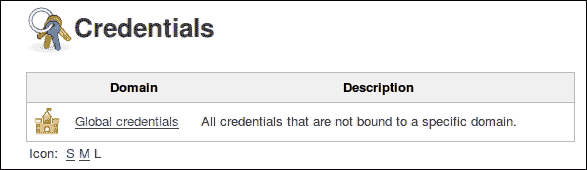

# 第六章：远程测试

在本章中，我们将涵盖以下配方：

+   从 Jenkins 部署 WAR 文件到 Tomcat

+   创建多个 Jenkins 节点

+   为从节点定制设置脚本

+   使用 FitNesse 进行测试

+   激活 FitNesse HtmlUnit 夹具

+   运行 Selenium IDE 测试

+   使用 Selenium WebDriver 触发 failsafe 集成测试

+   创建 JMeter 测试计划

+   报告 JMeter 性能指标

+   使用 JMeter 断言进行功能测试

+   启用 Sakai Web 服务

+   使用 SoapUI 编写测试计划

+   报告 SoapUI 测试结果

# 介绍

本章结束时，您将对 Web 应用程序和 Web 服务运行性能和功能测试。其中包括两个典型的设置配方：第一个是通过 Jenkins 将 WAR 文件部署到应用服务器，第二个是创建多个从节点，准备将测试工作从主节点移开。

通过 Jenkins 进行远程测试会显著增加基础设施中的依赖关系，从而增加了维护工作量。远程测试是一个特定于域的问题，减少了可以编写测试的受众规模。

本章强调了使测试编写对大众可及的必要性。接纳尽可能多的受众可以提高测试捍卫应用程序意图的机会。

突出显示的技术包括：

+   **FitNesse**：这是一个 wiki，您可以在其中编写不同类型的测试。使用 wiki 类似的语言来实时表达和更改测试，为功能管理员、顾问和最终用户提供了一个表达其需求的地方。您将学会如何通过 Jenkins 运行 FitNesse 测试。FitNesse 还是一个框架，您可以扩展 Java 接口以创建新的测试类型。这些测试类型称为夹具；有许多可用的夹具，包括用于数据库测试、从命令行运行工具以及对 Web 应用程序进行功能测试的夹具。

+   **JMeter**：这是一个流行的开源工具，用于压力测试。它还可以通过使用断言进行功能测试。JMeter 有一个允许您构建测试计划的 GUI。然后将测试计划存储在 XML 格式中。可以通过 Maven 或 Ant 脚本执行 JMeter。JMeter 非常高效，通常一个实例就足以对基础设施造成很大压力。但是，对于超高负载场景，JMeter 可以触发一系列 JMeter 实例。

+   **Selenium**：这是功能测试 Web 应用程序的事实工业标准。使用 Selenium IDE，您可以在 Firefox 或 Chrome 中记录您的操作，以 HTML 格式保存以供以后重播。测试可以通过 Maven 使用 Selenium RC（远程控制）重新运行。通常会使用具有不同操作系统和浏览器类型的 Jenkins 从节点来运行测试。另一种选择是使用 Selenium Grid（[`code.google.com/p/selenium/wiki/Grid2`](https://code.google.com/p/selenium/wiki/Grid2)）。

+   **Selenium 和 TestNG 单元测试**：编写单元测试使用 TestNG 框架进行功能测试的程序员特定方法。单元测试应用 Selenium WebDriver 框架。Selenium RC 是控制 Web 浏览器的代理。相反，WebDriver 框架使用本机 API 调用来控制 Web 浏览器。您甚至可以运行 HtmlUnit 框架，消除了对真实 Web 浏览器的依赖。这使得测试独立于操作系统，但去除了测试浏览器特定依赖的能力。WebDriver 支持许多不同类型的浏览器。

+   **SoapUI**：这简化了为 Web 服务创建功能测试的过程。该工具可以读取 Web 服务公开的 **WSDL**（Web 服务定义语言）文件，使用该信息生成功能测试的骨架。GUI 使理解过程变得容易。

# 从 Jenkins 部署 WAR 文件到 Tomcat

部署 Web 应用程序进行集成测试的三种主要方法如下：

+   在 Jenkins 作业中启动 Jetty 等容器本地运行 Web 应用程序。应用程序数据库通常是内存中的，并且存储的数据在作业结束后不会持久化。这样可以节省清理工作，并消除对基础设施的不必要依赖。

+   每晚都会创建一个夜间构建，应用程序会通过调度程序重新构建。不需要轮询 SCM。这种方法的优点是团队分布广，确切地知道新构建存在的时间和 URL，以及部署脚本很简洁。

+   部署到应用服务器。首先，在 Jenkins 中打包 Web 应用程序，然后部署准备好由第二个 Jenkins 作业进行测试。这种方法的缺点是，您正在动态替换应用程序，主机服务器可能不会始终稳定地响应。

在此示例中，您将使用 Deploy 插件将 WAR 文件部署到远程 Tomcat 7 服务器。此插件可以在一系列服务器类型和版本范围内部署，包括 Tomcat、GlassFish 和 JBoss。

## 准备就绪

为 Jenkins 安装 Deploy 插件（[`wiki.jenkins-ci.org/display/JENKINS/Deploy+Plugin`](https://wiki.jenkins-ci.org/display/JENKINS/Deploy+Plugin)）。下载最新版本的 Tomcat 7 并解压缩（[`tomcat.apache.org/download-70.cgi`](http://tomcat.apache.org/download-70.cgi)）。

## 如何做...

1.  为简单的 WAR 文件从命令行创建一个 Maven 项目：

    ```
    mvn archetype:generate -DgroupId=nl.berg.packt.simplewar -DartifactId=simplewar -Dversion=1.0-SNAPSHOT -DarchetypeArtifactId=maven-archetype-webapp 

    ```

1.  将新创建的项目提交到您的 Git 或子版本库中。

1.  为避免与监听端口 `8080` 的 Jenkins 冲突，在 Tomcat 根目录下编辑 `conf/server.xml`，将默认连接器端口号更改为 `38887`：

    ```
     <Connector port="38887" protocol="HTTP/1.1" connectionTimeout="20000" redirectPort="8443" />

    ```

1.  从命令行启动 Tomcat：

    ```
    bin/startup.sh

    ```

1.  登录 Jenkins。

1.  创建名为 `ch6.remote.deploy` 的 Maven

1.  在 **源代码管理** 部分，选中 **Subversion** 单选框，将您自己的子版本库 URL 添加到 **Repository URL**。

1.  在**构建**部分，对于**目标和选项**，添加`clean package`。

1.  在**后期构建操作**部分，勾选**部署 war/ear 到容器**，添加以下配置:

    +   **WAR/EAR 文件**: `target/simplewar.war`

    +   **容器**: Tomcat 7.x

    +   **管理器用户名**: `jenkins_build`

    +   **管理器密码**: `mylongpassword`

    +   **Tomcat URL**: `http://localhost:38887`

1.  点击**保存**。

1.  运行构建。

1.  构建将以类似以下的输出失败: **java.io.IOException: 服务器返回 HTTP 响应代码: 401，网址为: http://localhost:38887/manager/text/list**。

1.  通过在`conf/tomcat-users.xml`中添加以下内容，编辑：在`</tomcat-users>`之前：

    ```
    <role rolename="manager-gui"/>
    <role rolename="manager-script"/>
    <role rolename="manager-jmx"/>
    <role rolename="manager-status"/>
    <user username="jenkins_build" password="mylongpassword" roles="manager-gui,manager-script,manager-jmx,manager-status"/>
    ```

1.  重新启动 Tomcat。

1.  在 Jenkins 中，再次构建该任务。现在构建将成功。查看 Tomcat 日志`logs/catalina.out`将显示类似于以下内容的输出: **Oct 06, 2014 9:37:11 PM org.apache.catalina.startup.HostConfig deployWAR**

    **信息: 正在部署 Web 应用程序存档 /xxxxx/apache-tomcat-7.0.23/webapps/simplewar.war**。

1.  使用 Web 浏览器访问`http://localhost:38887/simplewar/`，如下面的屏幕截图所示: 

### 注意

一个可能的陷阱：如果你在后期构建配置中拼错了 WAR 文件的名称，那么它会悄无声息地失败，但构建仍然会成功。

## 工作原理...

在撰写本文时，Deploy 插件部署到以下服务器类型和版本:

+   Tomcat 4.x/5.x/6.x/7.x

+   JBoss 3.x/4.x

+   GlassFish 2.x/3.x

在此示例中，Jenkins 打包了一个简单的 WAR 文件并部署到了 Tomcat 实例。默认情况下，Tomcat 监听`8080`端口，Jenkins 也是如此。通过编辑`conf/server.xml`，将端口移动到了`38887`，避免了冲突。

Jenkins 插件调用 Tomcat Manager。在部署失败且出现`401`未经授权错误([`www.w3.org/Protocols/rfc2616/rfc2616-sec10.html`](http://www.w3.org/Protocols/rfc2616/rfc2616-sec10.html))后，你创建了一个具有所需角色的 Tomcat 用户。实际上，新用户比部署所需的权限更大。用户有权查看用于监控的 JMX 数据。这会帮助你以后进行调试。

在生产环境中部署时，使用 SSL 连接以避免在网络上传送未加密的密码。

## 还有更多...

启动时，Tomcat 日志会提到缺少 Apache Tomcat 本机库:

**信息: 基于 APR 的 Apache Tomcat 本机库，允许在生产环境中获得最佳性能，在 java.library.path 中找不到: /usr/java/packages/lib/i386:/usr/lib/i386-linux-gnu/jni:/lib/i386-linux-gnu:/usr/lib/i386-linux-gnu:/usr/lib/jni:/lib:/usr/lib**。

该库在 Linux 平台上运行时提高了性能，基于 Apache Portable Runtime 项目的努力 ([`apr.apache.org/`](http://apr.apache.org/))。

你可以在`bin/tomcat-native.tar.gz`中找到源代码。构建说明可以在[`tomcat.apache.org/native-doc/`](http://tomcat.apache.org/native-doc/)找到。

## 另请参阅

+   第三章 中的 *为 Jetty 配置集成测试* 配方，*构建软件*

# 创建多个 Jenkins 节点

测试是一个繁重的过程。如果您想要扩展您的服务，那么您需要计划将大部分工作分配给其他节点。

Jenkins 在组织中的一个进化路径是从一个 Jenkins 主节点开始。随着作业数量的增加，我们需要将更重的作业，例如测试，推送到从节点。这使得主节点更轻巧且更专业地聚合结果。还有其他原因可以分配测试，例如当您希望在不同的操作系统下使用不同的网络浏览器或在本机运行 .NET 应用程序时进行功能测试。

此配方使用 Multi slave config 插件 ([`wiki.jenkins-ci.org/display/JENKINS/Multi+slave+config+plugin`](https://wiki.jenkins-ci.org/display/JENKINS/Multi+slave+config+plugin)) 在本地安装额外的 Jenkins 节点。它是针对 Linux 的，允许 Jenkins 通过 SSH 安装、配置和控制从节点。

## 准备工作

在 Jenkins 中安装 Multi slave config 插件。您还需要一个 Ubuntu 的测试实例，如 *使用测试 Jenkins 实例* 配方中描述的那样，第一章，*维护 Jenkins*。

## 如何操作...

1.  从从节点的命令行创建用户 `jenkins-unix-nodex`：

    ```
    sudo adduser jenkins-unix-nodex

    ```

1.  使用空密码为主 Jenkins 生成私钥和公共证书：

    ```
    sudo -u jenkins ssh-keygen -t rsa
    Generating public/private rsa key pair.
    Enter file in which to save the key 
    (/var/lib/jenkins/.ssh/id_rsa): 
    Created directory '/var/lib/jenkins/.ssh'.
    Enter passphrase (empty for no passphrase): 
    Enter same passphrase again: 
    Your identification has been saved in 
    /var/lib/jenkins/.ssh/id_rsa.
    Your public key has been saved in 
    /var/lib/jenkins/.ssh/id_rsa.pub

    ```

1.  创建 `.ssh` 目录和 Jenkins 的公共证书到 `.ssh/authorized_keys`。

    ```
    sudo -u jenkins-unix-nodex mkdir /home/jenkins-unix-nodex/.ssh 
    sudo cp /var/lib/jenkins/.ssh/id_rsa.pub /home/jenkins-unix-nodex/.ssh/authorized_keys

    ```

1.  更改 `authorized_keys` 的所有者和组为 `jenkins-unix-nodex`:`jenkins-unix-nodex`：

    ```
    sudo chown jenkins-unix-nodex:jenkins-unix-nodex /home/jenkins-unix-nodex/.ssh/authorized_keys

    ```

1.  测试您是否可以无密码登录到 `jenkins-unix-nodex` 作为 `jenkins`。

    ```
    sudo –u Jenkins ssh jenkins-unix-nodex@localhost
    The authenticity of host 'localhost (127.0.0.1)' can't be established.
    ECDSA key fingerprint is 
    xx:yy:21:zz:46:dd:02:fa:1w:15:27:20:e6:74:3e:a2.
    Are you sure you want to continue connecting (yes/no)? yes
    Warning: Permanently added 'localhost' (ECDSA) to the list of known hosts.

    ```

    ### 注意

    您将需要接受密钥指纹。

1.  登录到 Jenkins。

1.  访问凭据存储库（`localhost:8080/credential-store`）。

1.  单击 **全局凭据** 链接，如下图所示：

1.  单击 **添加凭据**。

1.  添加以下详细信息：

    +   **类型**：带私钥的 SSH 用户名

    +   **范围**：**全局**

    +   **用户名**：`jenkins-unix-nodex`

    +   **私钥**：**来自 Jenkins 主机的 ~/.ssh**

1.  单击 **保存**。

1.  访问 **Manage Jenkins** 下的 **MultiSlave Config Plugin**（`localhost:8080/multi-slave-config-plugin/?`）。

1.  单击 **添加从节点**。

1.  添加到 **使用空格分隔的名称创建从节点**：**unix-node01**，然后单击 **继续**。

1.  在 **Multi Slave Config Plugin – 添加从节点** 屏幕上，添加以下详细信息：

    +   **描述**：**我是一个愚蠢的 Ubuntu 节点**

    +   **执行器数量**：**2**

    +   **远程文件系统根目录**：**/home/jenkins-unix-nodex**

    +   **设置标签**：**unix dumb functional**

1.  选择启动方法为 **通过 SSH 在 Unix 机器上启动从节点** 并添加详细信息：

    +   **主机**：**localhost**

    +   **凭据**：**jenkins-unix-nodex**

1.  点击**保存**。

1.  返回到主页面。 您现在将看到**Build Executor Status**中包含**Master**和**unix-node01**，如下图所示：

## 它是如何工作的...

在这个示例中，您已经将一个节点部署到本地*NIX 框中。 使用了第二个用户帐户。 该帐户使用了 Jenkins 用户的公钥以便更轻松地进行管理：Jenkins 现在可以在没有密码的情况下使用`ssh`和`scp`。 

多从节点配置插件可以消除部署从节点的繁琐工作。 它允许您从一个模板从节点复制并部署多个节点。

Jenkins 可以以多种不同的方式运行节点：使用 SSH，主节点运行自定义脚本，或通过 Windows 服务（[`wiki.jenkins-ci.org/display/JENKINS/Distributed+builds`](https://wiki.jenkins-ci.org/display/JENKINS/Distributed+builds)）。 最可靠的方法是通过 SSH 协议。 这种方法的优点是多方面的：

+   使用 SSH 是流行的，意味着对大多数人来说学习曲线较为平缓。

+   SSH 是一种可靠的技术，经过多代人的实践证明其稳健性。

+   大多数操作系统都有 SSH 守护程序，不仅仅是*NIX。 一种选择是在 Windows 上安装 Cygwin（[`www.cygwin.com/`](http://www.cygwin.com/)）并带有一个 SSH 守护程序。

    ### 注意

    如果您希望在 Cygwin 下的 Windows 中运行您的 Unix 脚本，请考虑安装 Cygpath 插件。 该插件将 Unix 样式路径转换为 Windows 样式。 有关更多信息，请访问

    [`wiki.jenkins-ci.org/display/JENKINS/Cygpath+Plugin`](https://wiki.jenkins-ci.org/display/JENKINS/Cygpath+Plugin)。

配置的节点已分配了三个标签：`unix`，`dumb`和`functional`。 在创建新作业时，检查设置**限制此项目可以运行的位置**并添加其中一个标签，将确保作业在具有该标签的节点上运行。

主节点根据优先级列表计算要运行作业的节点。 除非另有配置，否则在只有主节点时创建的作业仍将在主节点上运行。 新创建的作业默认将在从节点上运行。

当部署多个 Jenkins 节点时，如果您的环境结构保持一致，则可以节省工作量。 考虑使用从相同基本镜像开始的虚拟环境。 CloudBees（[`www.cloudbees.com`](http://www.cloudbees.com)）是一个以部署虚拟实例为中心的商业服务的示例。

### 注意

您可以在[`wiki.jenkins-ci.org/display/JENKINS/Step+by+step+guide+to+set+up+master+and+slave+machines`](https://wiki.jenkins-ci.org/display/JENKINS/Step+by+step+guide+to+set+up+master+and+slave+machines)找到有关为 Jenkins 从节点安装 Windows 服务的更多信息。

## 还有更多...

从版本 1.446 开始（[`jenkins-ci.org/changelog`](http://jenkins-ci.org/changelog)），Jenkins 已经内置了 SSH 守护程序。这将减少编写客户端代码的工作量。命令行界面可以通过 SSH 协议访问。您可以通过 Jenkins 管理网页设置守护程序的端口号，或者将端口号浮动。

Jenkins 使用头部信息发布端口号为 **X-SSH-Endpoint**。要自己查看，请使用 curl（[`curl.haxx.se/`](http://curl.haxx.se/)）查找从 Jenkins 返回的头部信息。例如，对于 *NIX 系统，可以尝试从命令行输入：

```
curl -s -D - localhost:8080 -o /dev/null

```

头部信息被发送到`stdout`供您查看，而正文被发送到`/dev/null`，这是一个系统位置，忽略所有输入。

来自 Jenkins 的响应将类似于以下内容：

```
HTTP/1.1 200 OK
Cache-Control: no-cache,no-store,must-revalidate
X-Hudson-Theme: default
Content-Type: text/html;charset=UTF-8
Set-Cookie: JSESSIONID.bebd81dc=1mkx0f5m97ipsjqhygljrbqmo;Path=/;HttpOnly
Expires: Thu, 01 Jan 1970 00:00:00 GMT
X-Hudson: 1.395
X-Jenkins: 1.583
X-Jenkins-Session: 5c9958f6
X-Hudson-CLI-Port: 39269
X-Jenkins-CLI-Port: 39269
X-Jenkins-CLI2-Port: 39269
X-Frame-Options: sameorigin
X-SSH-Endpoint: localhost:57024
X-Instance-Identity: MIIBIjANBgkqhkiG9w0BAQEFAAOCAQ8AMIIBCgKCAQEAjOABhI+cuNtKfu5b46FKGr/IXh9IgaTVgf16QgCmoAR41S00gXJezDRJ1i4tC0tB6Tqz5SuKqcDDxU19fndIe7qhmNOPdAIMUU8i/UmKLC4eY/WfYqE9y4PpIR23yCVd2RB+KzADEhTB/voiLLoEkogj22WtUd7TZWhzRnAW58wrzI6uAWHqOtHvlO7MxFo1AY4ZyXLw202Dz+1tlKkECr5oy9dFyKy3U1lnpilg6snG70AYz+/uFs52FeOl3qkCfDVCGMDHqLEvJJzWsZ5hAv37fEaj1QyMA69joBjesgt1n1CeJeD0cy5+BIkwoHmrGW2VwvrxssIkm3RVhjJbeQIDAQABContent-Length: 19857
Server: Jetty(8.y.z-SNAPSHOT)
```

## 另请参阅

+   第一章中的 *使用测试 Jenkins 实例* 方法，*维护 Jenkins*

+   从节点的*自定义设置脚本*方法

# 从节点的自定义设置脚本

此方法向您展示如何在从节点上运行自己的初始化脚本。这使您可以执行节点系统清理、检查健康状况、设置测试以及执行其他必要的任务。

## 准备工作

要使此方法生效，您需要按照*创建多个 Jenkins 节点*的方法描述安装一个从节点。

您还将安装了从节点设置插件（[`wiki.jenkins-ci.org/display/JENKINS/Slave+Setup+Plugin`](https://wiki.jenkins-ci.org/display/JENKINS/Slave+Setup+Plugin)）。

## 操作方法...

1.  创建一个名为`ch6.remote.slave.setup`的自由样式作业。

1.  检查**限制**此项目可运行的位置。

1.  在 **标签表达式** 中添加文本`dumb`，如以下截图所示：

1.  点击**保存**，然后构建作业。

1.  点击**返回仪表板**。

1.  在**构建执行者状态**下点击**unix-node01**。

1.  点击**脚本控制台**。

1.  将以下文本添加到**脚本控制台**，然后点击**运行**：

    ```
    println "pwd".execute().text
    println "ls ./workspace".execute().text
    ```

1.  创建目录`/var/lib/jenkins/myfiles`。

1.  创建文件`/var/lib/jenkins/myfiles/banner.sh`，内容如下：

    ```
    #!/bin/sh
    echo -------------------------- > slave_banner.txt
    echo THIS IS A SLAVE INIT BANNER  >> slave_banner.txt
    echo WORKING ON SLAVE: ${NODE_TO_SETUP_NAME} >> slave_banner.txt
    date >> slave_banner.txt
    echo SCRIPT DOES SOME WORK HERE >> slave_banner.txt
    echo -------------------------- >> slave_banner.txt
    mv slave_banner.txt  /home/jenkins-unix- nodex/workspace/ch6.remote.slave.setup/
    ```

1.  访问**配置系统**页面（`http://localhost:8080/configure`）。

1.  在**从节点设置**部分，点击**添加**按钮添加**从节点设置列表**。

1.  添加以下细节：

    +   **设置文件目录**：`/var/lib/jenkins/myfiles`

    +   **复制后的设置脚本**：`./banner.sh`

    +   **标签表达式**：`dumb`

    

1.  检查 **立即保存部署**。

1.  点击**保存**。

1.  运行作业`ch6.remote.slave.setup`。

1.  查看工作空间。您现在将看到一个名为`banner.txt`的文件，内容类似于以下内容：

    ```
    --------------------------
    THIS IS A SLAVE INIT BANNER
    WORKING ON SLAVE: unix-node01
    Tue Oct 14 13:39:09 CEST 2014
    SCRIPT DOES SOME WORK HERE
    --------------------------

    ```

## 工作原理...

您使用从节点设置插件将`banner.sh`从`/var/lib/jenkins`复制到从节点的主目录下的 `banner.sh`。此操作在每次节点上运行作业之前运行。

选择**保存后部署**以确保从节点上获取的脚本是最新的。

你使用脚本控制台发现了节点的主目录位置。你还验证了工作区包含了与`ch6.remote.slave.setup`作业同名的目录。

在作业中，您将其运行限制在具有**dumb**标签的节点上。这样，您就可以确保作业在节点上运行。

`banner.sh`默认使用的是`sh` shell，实际上指向了**Bourne Again Shell** ([`www.gnu.org/software/bash/`](http://www.gnu.org/software/bash/))，或者是**Debian Almquist Shell** ([`gondor.apana.org.au/~herbert/dash/`](http://gondor.apana.org.au/~herbert/dash/))的`dash`。

### 注意

有关在 Ubuntu 中使用破折号的原因，请访问[`wiki.ubuntu.com/DashAsBinSh`](https://wiki.ubuntu.com/DashAsBinSh)。

为了显示已运行，脚本将一个带有时间戳的小横幅输出到`banner.txt`。脚本中的最后一个命令将`banner.txt`移动到节点工作区下的作业目录。

作业运行后，从节点将工作空间复制回 Jenkins 主服务器的工作空间。稍后您会查看结果。

## 还有更多...

如果您的 Jenkins 节点支持其他语言，例如 Perl，您可以通过在脚本的第一行添加`#!`约定，指向脚本语言的二进制完整路径来运行它们。要发现二进制文件的路径，您可以使用节点脚本控制台并运行`which`命令：

```
println "which perl".execute().text
```

这导致了`/usr/bin/perl`。

一个“Hello World”Perl 脚本将如下代码所示：

```
#!/usr/bin/perl
print "Hello World"
```

## 另请参阅

+   *创建多个 Jenkins 节点*配方

# 使用 FitNesse 进行测试

FitNesse ([`fitnesse.org`](http://fitnesse.org))是一个完全集成的独立 wiki 和验收测试框架。您可以在表格中编写测试并运行它们。在 wiki 语言中编写测试扩大了潜在测试编写者的受众，并减少了学习新框架所需的初始工作量。


如果测试通过，则表格行以绿色显示。如果失败，则以红色显示。测试可以被 wiki 内容包围，以在相同位置提供上下文信息，如用户故事。您还可以考虑在 FitNesse 中创建您的 Web 应用程序的模拟以及将测试指向这些模拟。

本配方描述了如何远程运行 FitNesse 并在 Jenkins 中显示结果。

## 准备工作

从[`fitnesse.org/FitNesseDownload`](http://fitnesse.org/FitNesseDownload)下载最新稳定的 FitNesse JAR。从[`wiki.jenkins-ci.org/display/JENKINS/FitNesse+Plugin`](https://wiki.jenkins-ci.org/display/JENKINS/FitNesse+Plugin)安装 Jenkins 的 FitNesse 插件。

### 注意

用于测试此配方的发布号是`20140901`。

## 如何做...

1.  创建目录`fit/logs`并将其放置在`fitnesse-standalone.jar`的`fit`目录中。

1.  从命令行运行 FitNesse 帮助并查看选项：

    ```
    java -jar fitnesse-standalone.jar –help
    Usage: java -jar fitnesse.jar [-vpdrleoab]
    -p <port number> {80}
    -d <working directory> {.}
    -r <page root directory> {FitNesseRoot}
    -l <log directory> {no logging}
    -f <config properties file> {plugins.properties}
    -e <days> {14} Number of days before page versions expire
    -o omit updates
    -a {user:pwd | user-file-name} enable authentication.
    -i Install only, then quit.
    -c <command> execute single command.
    -b <filename> redirect command output.
    -v {off} Verbose logging

    ```

1.  从命令行运行 FitNesse 并查看启动输出：

    ```
    java -jar fitnesse-standalone.jar -p 39996 -l logs -a tester:test
    Bootstrapping FitNesse, the fully integrated standalone wiki and acceptance testing framework.
    root page: fitnesse.wiki.fs.FileSystemPage at ./FitNesseRoot#latest
    logger: /home/alan/Desktop/X/fitness/logs
    authenticator: fitnesse.authentication.OneUserAuthenticator
    page factory: fitnesse.html.template.PageFactory
    page theme: fitnesse_straight
    Starting FitNesse on port: 39996

    ```

1.  使用 web 浏览器，访问`http://localhost:39996`。

1.  单击**验收测试**链接。

1.  单击**套件**链接。这将激活一组测试。根据您的计算机，测试可能需要几分钟才能完成。直接链接是`http://localhost:39996/FitNesse.SuiteAcceptanceTests?suite`。

1.  单击**测试历史记录**链接。您需要以用户`tester`和密码`test`登录。

1.  查看`fit/logs`目录中的日志。再次运行套件后，您现在将看到类似于以下条目：

    ```
    127.0.0.1 - tester [01/Oct/2014:11:14:59 +0100] "GET /FitNesse.SuiteAcceptanceTests?suite HTTP/1.1" 200 6086667

    ```

1.  登录 Jenkins 并创建一个名为`ch6.remote.fitnesse`的自由风格软件项目。

1.  在**构建**部分，从**添加构建步骤**中选择**执行 fitnesse 测试**选项。

1.  检查**FitNesse 实例已运行**选项，并添加：

    +   **FitNesse 主机**：`localhost`

    +   **FitNesse 端口**：`39996`

    +   **目标页面**：`FitNesse.SuiteAcceptanceTests?suite`

    +   检查**目标是否为套件？**选项

    +   **HTTP 超时（毫秒）**：`180000`

    +   **fitnesse xml 结果文件路径**：`fitnesse-results.xml`

1.  在**后构建操作**部分，检查**发布 FitNesse 结果**报告选项。

1.  将值`fitnesse-results.xml`添加到输入**fitnesse xml 结果文件路径**中。

1.  单击**保存**。

1.  运行该任务。

1.  通过点击**FitNesse 结果**链接查看最新的任务。

## 它的工作原理...

FitNesse 有一组内置的验收测试，用于检查自身是否存在回归。Jenkins 插件调用测试，并要求以 XML 格式返回结果，使用 HTTP `GET` 请求的 URL：`http://localhost:39996/FitNesse.SuiteAcceptanceTests?suite&format=xml`。结果看起来类似于以下内容：

```
<testResults>
<FitNesseVersion>v20140901</FitNesseVersion>
<rootPath>FitNesse.SuiteAcceptanceTests</rootPath>
<result>
<counts><right>103</right>
<wrong>0</wrong>
<ignores>0</ignores>
<exceptions>0</exceptions>
</counts>
<runTimeInMillis>27</runTimeInMillis>
<relativePageName>CopyAndAppendLastRow</relativePageName>
<pageHistoryLink>
FitNesse.SuiteAcceptanceTests.SuiteFitDecoratorTests.CopyAndAppendLastRow?pageHistory&resultDate=20141101164526
</pageHistoryLink>
</result>
```

然后，Jenkins 插件解析 XML 并生成报告。

默认情况下，FitNesse 页面上没有启用安全性。在这个示例中，启动时定义了用户名和密码。但是，我们没有进一步定义页面的安全权限。要激活，您需要转到页面左侧的属性链接，并检查`secure-test`的安全权限。

您还可以通过文本文件中的用户列表或 Kerberos/ActiveDirectory 进行身份验证。有关更多详细信息，请查看[`fitnesse.org/FitNesse.FullReferenceGuide.UserGuide.AdministeringFitNesse.SecurityDescription`](http://fitnesse.org/FitNesse.FullReferenceGuide.UserGuide.AdministeringFitNesse.SecurityDescription)。

也有一个为 LDAP 认证贡献的插件：[`github.com/timander/fitnesse-ldap-authenticator`](https://github.com/timander/fitnesse-ldap-authenticator)

### 注意

考虑应用 `深度安全性`：通过防火墙在 FitNesse 服务器上添加 IP 限制可以创建额外的防御层。例如，你可以在 wiki 前面放置一个 Apache 服务器，并启用 SSL/TLS 来确保密码加密。一个比 Apache 更轻量的替代方案是 Nginx：[`wiki.nginx.org`](http://wiki.nginx.org)。

## 还有更多...

你可以在其 GitHub 主页上找到有关构建最新版本 FitNesse 的源代码信息：[`github.com/unclebob/fitnesse`](https://github.com/unclebob/fitnesse)

如果你喜欢 FitNesse，为什么不参与社区讨论呢？你可以订阅它的 Yahoo 群组 `<fitnesse-subscribe@yahoogroups.com>`，然后在 `<fitnesse@yahoogroups.com.>` 发布消息。Yahoo 的使用准则讨论了一般礼仪：[`info.yahoo.com/guidelines/us/yahoo/groups/`](http://info.yahoo.com/guidelines/us/yahoo/groups/)

## 另请参阅

+   *激活 FitNesse HtmlUnit fixtures* 教程

# 激活 FitNesse HtmlUnit fixtures

FitNesse 是一个可扩展的测试框架。可以编写自己的测试类型，称为 fixtures，并通过 FitNesse 表调用新的测试类型。这允许 Jenkins 运行不同于现有测试的替代测试。

此教程向你展示了如何集成使用 HtmlUnit fixture 的功能测试。同样的方法也适用于其他 fixtures。

## 准备工作

此教程假设你已经执行了 *使用 FitNesse 进行测试* 教程。

## 如何操作...

1.  访问 [`sourceforge.net/projects/htmlfixtureim/`](http://sourceforge.net/projects/htmlfixtureim/)，下载并解压缩 `HtmlFixture-2.5.1`。

1.  将 `HtmlFixture-2.5.1/lib` 目录移动到 `FitNesseRoot` 目录下。

1.  将 `HtmlFixture-2.5.1/log4j.properties` 复制到 `FitNesseRoot/log4j.properties`。

1.  启动 FitNesse：

    ```
    java -jar fitnesse-standalone.jar -p 39996 -l logs -a tester:test

    ```

1.  在网络浏览器中访问 `http://localhost:39996/root?edit`，添加以下内容，将 `FitHome` 替换为你的 Fitnesse 服务器主目录的完全限定路径：

    ```
    !path /FitHome/FitNesseRoot/lib/*
    !fixture com.jbergin.HtmlFixture 
    ```

1.  访问 `http://localhost:39996`。在左侧菜单中，点击 **编辑**。

1.  在页面底部添加文本 `ThisIsMyPageTest`。

1.  点击 **保存**。

1.  点击新的 **ThisIsMyPageTest** 链接。

1.  点击 **工具** 按钮。

1.  选择 **属性**。

1.  点击 **页面类型** 测试。

1.  一个弹出窗口会询问你的 **用户名** 和 **密码**。输入 `tester` 和 `test`。

1.  你将被返回到 **ThisisMyPageTest** 页面；点击 **保存**。

1.  点击左侧菜单上的 **编辑** 按钮。

1.  在以 `!contents` 开头的行后添加以下内容：

    ```
    |Import|
    |com.jbergin|
    '''STORY'''
    This is an example of using HtmlUnit:http://htmlunit.sourceforge.net/
    '''TESTS'''
    !|HtmlFixture|
    |http://localhost:8080/login| Login||
    |Print Cookies||
    |Print Response Headers||
    |Has Text|log in|
    |Element Focus|search-box|input|
    |Set Value|ch5||
    |Focus Parent Type|form|/search/||
    ```

1.  点击 **保存**。

1.  点击 **测试**。

1.  在 Jenkins 中 **新建任务** 下，从 `ch6.remote.fitness` 复制 **现有任务** / **复制** 到 **任务名称** `ch6.remote.fitness_fixture`。

1.  在 **构建** 部分，下面的 **目标** | **目标页面** 将 `FitNesse.SuiteAcceptanceTests` 替换为 `ThisIsMyPageTest`。

1.  不勾选 **目标是否为套件？**。

1.  点击 **Save**。

1.  运行任务。由于额外的调试信息与结果一起发送，导致 Jenkins 插件解析器混淆而失败。

1.  访问测试页面 `http://localhost:39996/ThisIsMyPageTest?edit`，用以下代码替换测试表格的内容：

    ```
    !|HtmlFixture|
    |http://localhost:8080/login| Login|
    |Has Text|log in|
    |Element Focus|search-box|input|
    |Set Value|ch5|
    |Focus Parent Type|form|/search/|
    ```

1.  再次运行 Jenkins 任务。现在结果将被解析。

## 工作原理...

Fixture 是用 Java 编写的。通过将下载的库放置在 FitNesse 的 `lib` 目录中，使它们可访问。然后在根页面中定义类路径和夹具位置，允许在启动时加载夹具。有关更多详细信息，请查看文件 `HtmlFixture-2.5.1/README`。

接下来，你使用 wiki 的 CamelCase 笔记法创建了链接到不存在的 **ThisIsMyPageTest** 页面。然后添加了一个 HtmlUnit 夹具测试。

首先，你需要导入夹具，其库路径在 Root 页面中定义：

```
|Import|
|com.jbergin|
```

接下来，添加了一些示例描述性 wiki 内容以显示你可以创建一个故事而不影响测试。最后，添加了测试。

表格 `!|HtmlFixture|` 的第一行定义要使用的夹具。第二行存储要测试的位置。

打印命令，如 `Print Cookies` 或 `Print Response` `Headers` 返回有助于构建测试的信息。

如果你不确定一系列可接受的命令，则故意制造语法错误，命令将作为结果返回。例如：

```
|Print something||
```

`Has Text` 命令是一个断言，如果返回页面的文本中找不到 `log in` 则失败。

通过聚焦到特定元素然后 `Set Value`，你可以向表单添加输入。

在测试期间，如果你想要显示特定请求的返回内容，则需要三列；例如，第一行显示返回的页面，第二行则不显示：

```
|http://localhost:8080/login| Login||
|http://localhost:8080/login| Login|
```

将 HTML 页面作为结果的一部分返回，为 Jenkins 插件提供了需要解析的额外信息。这容易出错。因此，在第 19 步中，你移除了额外的列，确保可靠的解析。

可以在 [`htmlfixtureim.sourceforge.net/documentation.shtml`](http://htmlfixtureim.sourceforge.net/documentation.shtml) 找到此夹具的完整文档。

## 还有更多...

FitNesse 有可能增加 Jenkins 可执行的远程测试的词汇量。有几个有趣的夹具需要审查：

+   **RestFixture 用于 REST 服务**：

    [`github.com/smartrics/RestFixture/wiki`](https://github.com/smartrics/RestFixture/wiki)

+   **使用 Selenium 进行基于 Web 的功能测试的 Webtestfixtures**：

    [`sourceforge.net/projects/webtestfixtures/`](http://sourceforge.net/projects/webtestfixtures/)

+   **DBfit 可以帮助你测试数据库**：

    [`gojko.net/fitnesse/dbfit/`](http://gojko.net/fitnesse/dbfit/)

## 另请参阅

+   *使用 FitNesse 进行测试* 配方

# 运行 Selenium IDE 测试

Selenium IDE 允许你在 Firefox 中记录你在网页中的点击操作，并重放它们。这对于功能测试非常有用。测试计划以 HTML 格式保存。

这个示例展示了如何使用 Maven 和 Jenkins 自动重放测试。它使用内存中的 X 服务器 **Xvfb** ([`en.wikipedia.org/wiki/Xvfb`](http://en.wikipedia.org/wiki/Xvfb))，这样 Firefox 就可以在无头服务器上运行。Maven 使用 Selenium RC 运行测试，然后充当测试和浏览器之间的代理。虽然我们使用 Firefox 进行录制，但你也可以使用其他类型的浏览器运行测试。

随着 Selenium 2.0 的发布，Selenium 服务器现在具有内置的网格功能 ([`code.google.com/p/selenium/wiki/Grid2`](https://code.google.com/p/selenium/wiki/Grid2))。本章不讨论这个功能，只是说明 Selenium 网格允许你在多个操作系统上并行运行 Selenium 测试。

## 准备工作

安装 Selenium HTML 报告插件 ([`wiki.jenkins-ci.org/display/JENKINS/seleniumhtmlreport+Plugin`](https://wiki.jenkins-ci.org/display/JENKINS/seleniumhtmlreport+Plugin)) 和 EnvInject 插件 ([`wiki.jenkins-ci.org/display/JENKINS/EnvInject+Plugin`](https://wiki.jenkins-ci.org/display/JENKINS/EnvInject+Plugin))。同时需要 Xvfb 和 Firefox。在 Ubuntu Linux 环境中安装 Xvfb 运行 `sudo apt-get install xvfb`。

### 注意

在 Jenkins 插件管理器中，该插件称为环境注入器插件，而在 Wiki 中称为 EnvInject 插件。这可能会让人感到困惑，但两个名称都属于同一个插件。

## 如何操作...

1.  从命令行创建一个简单的 Maven 项目：

    ```
    mvn archetype:generate -DgroupId=nl.berg.packt.selenium -DartifactId=selenium_html -DarchetypeArtifactId=maven-archetype-quickstart -Dversion=1.0-SNAPSHOT

    ```

1.  在新创建的 `pom.xml` 文件中，在 `</project>` 标签之前添加以下 `build` 部分：

    ```
    <build>
        <plugins>
         <plugin>
          <groupId>org.codehaus.mojo</groupId>
          <artifactId>selenium-maven-plugin</artifactId>
          <version>2.3</version>              
           <executions>
            <execution>
              <id>xvfb</id>
              <phase>pre-integration-test</phase>
              <goals>
                 <goal>xvfb</goal>
              </goals>
             </execution>
             <execution>
                <id>start-selenium</id>
                <phase>integration-test</phase>
             <goals>
             <goal>selenese</goal> 
            </goals>
           <configuration> <suite>src/test/resources/selenium/TestSuite.xhtml</suite>
         <browser>*firefox</browser>                        
         <multiWindow>true</multiWindow>
         <background>true</background>                           <results>./target/results/selenium.html</results> <startURL>http://localhost:8080/login/</startURL>
          </configuration>
         </execution>
        </executions>
       </plugin>
      </plugins>
    </build>
    ```

1.  创建 `src/test/resources/log4j.properties` 文件，并添加以下内容：

    ```
    log4j.rootLogger=INFO, A1
    log4j.appender.A1=org.apache.log4j.ConsoleAppender
    log4j.appender.A1.layout=org.apache.log4j.PatternLayout
    log4j.appender.A1.layout.ConversionPattern=%-4r [%t] %-5p %c %x - %m%n
    ```

1.  创建目录 `src/test/resources/selenium`。

1.  创建文件 `src/test/resources/selenium/TestSuite.xhtml`，并添加以下内容：

    ```
    <?xml version="1.0" encoding="UTF-8"?>
    <!DOCTYPE html PUBLIC "-//W3C//DTD XHTML 1.0 Strict//EN" "http://www.w3.org/TR/xhtml1/DTD/xhtml1-strict.dtd">
    <html  xml:lang="en" lang="en">
    <head>
      <meta content="text/html; charset=UTF-8" http-equiv="content-type" />
      <title>My Test Suite</title>
    </head>
    <body>
    <table id="suiteTable" cellpadding="1" cellspacing="1" border="1" class="selenium"><tbody>
    <tr><td><b>Test Suite</b></td></tr>
    <tr><td><a href="MyTest.xhtml">Just pinging Jenkins Login Page</a></td></tr>
    </tbody></table>
    </body>
    </html>
    ```

    HTML 将会渲染成以下截图：

    

1.  创建测试文件 `src/test/resources/selenium/MyTest.xhtml`，并添加以下内容：

    ```
    <?xml version="1.0" encoding="UTF-8"?>
    <!DOCTYPE html PUBLIC "-//W3C//DTD XHTML 1.0 Strict//EN" "http://www.w3.org/TR/xhtml1/DTD/xhtml1-strict.dtd">
    <html  xml:lang="en" lang="en">
    <head profile="http://selenium-ide.openqa.org/profiles/test-case">
    <meta http-equiv="Content-Type" content="text/html; charset=UTF-8" />
    <title>MyTest</title>
    </head><body>
    <table cellpadding="1" cellspacing="1" border="1">
    <thead>
    <tr><td rowspan="1" colspan="3">MyTest</td></tr>
    </thead><tbody>
    <tr><td>open</td><td>/login?from=%2F</td><td></td></tr>
    <tr><td>verifyTextPresent</td><td>log in</td><td></td></tr>
    </tbody></table></body></html>
    ```

    HTML 将会按照以下截图进行渲染：

    

1.  从命令行运行 Maven 项目，验证构建是否成功，如下所示：

    ```
    mvn clean integration-test –Dlog4j.configuration=file./src/test/resources/log4j.properties

    ```

1.  运行 `mvn clean` 然后提交项目到你的 Subversion 仓库。

1.  登录到 Jenkins 并创建一个名为 `ch6.remote.selenium_html` 的 Maven 作业。

1.  在 **Global** 部分（配置页面顶部），勾选 **Prepare an environment for the job** 并添加 `DISPLAY=:20` 到 **Properties Content**。

1.  在 **Source Code Management** 部分，勾选 **Subversion**，并将你的 Subversion URL 添加到 **Repository URL**。

1.  在 **build** 部分，将 `clean integration-test –Dlog4j.configuration=file./src/test/resources/log4j.properties` 添加到 **Goals and options**。

1.  在**后构建操作**部分，勾选**发布 Selenium HTML 报告**。

1.  将`target/results`添加到**Selenium 测试结果位置**。

1.  检查**如果解析结果文件时发生异常，则将构建结果状态设置为失败**。

1.  单击**保存**。

1.  运行作业，查看结果，如下图所示：

## 工作原理...

创建了一个原始的 Selenium IDE 测试套件，包含两个 HTML 页面。第一个`TestSuite.xhtml`定义了套件，其中包含指向测试的 HTML 链接。我们只在`MyTest.xhtml`中定义了一个测试。

该测试访问本地 Jenkins 的登录页面，并验证**登录**文本是否存在。

`pom.xml`文件定义了启动和关闭 Xvfb 服务器的阶段。默认配置是让 Xvfb 在`DISPLAY 20`上接受输入。

Maven 假设 Xvfb 二进制文件已安装，并且不尝试将其作为依赖项下载。对于 Firefox 浏览器也是如此。这样做会导致一个脆弱的特定于操作系统的配置。在复杂的 Jenkins 环境中，这种依赖项最有可能失败。自动化功能测试必须具有显著的优势，以抵消增加的维护工作量。

选项`Multiwindow`设置为 true，因为测试在它们自己的 Firefox 窗口中运行。选项`Background`设置为 true，以便 Maven 在后台运行测试。结果存储在相对位置`./target/results/selenium.html`，准备供 Jenkins 插件解析。有关 Selenium-Maven-plugin 的更多信息，请访问[`mojo.codehaus.org/selenium-maven-plugin/`](http://mojo.codehaus.org/selenium-maven-plugin/)。

Jenkins 作业将`DISPLAY`变量设置为`20`，以便 Firefox 在 Xvfb 中呈现。然后运行 Maven 作业并生成结果页面。然后 Jenkins 插件解析结果。  

增加自动功能测试的可靠性的两种方法是：

+   使用 HtmlUnit，它不需要特定于操作系统的配置。但是，您将失去执行跨浏览器检查的能力。

+   运行 WebDriver 而不是 Selenium RC。WebDriver 使用本地 API 调用，功能更可靠。与 Selenium RC 一样，WebDriver 可以针对多种不同的浏览器类型运行。

下一个示例将展示如何使用 WebDriver 和 HtmlUnit 进行单元测试。

## 还有更多...

在我的开发 Jenkins Ubuntu 服务器上，运行此示例的作业失败了。原因是 Maven 插件对 Selenium 的依赖项不喜欢由自动更新脚本安装的新版本 Firefox。解决问题的方法是在 Jenkins 主目录下安装一个已知工作的 Firefox 二进制文件，并在`pom.xml`文件中直接指向该二进制文件，将`<browser>*firefox</browser>`替换为`<browser>*firefox Path</browser>`。

这里，`Path`类似于`/var/lib/Jenkins/firefox/firefox-bin`。

另一个问题的原因是需要为 Firefox 创建一个自定义配置文件，其中包含停止弹出窗口或拒绝自签名证书的辅助插件。有关更完整的信息，请参阅：[`docs.seleniumhq.org/docs/`](http://docs.seleniumhq.org/docs/)

### 注意

Firefox 的替代方案是 Chrome。有一个 Jenkins 插件可以帮助在 Jenkins 节点上部署 Chrome ([`wiki.jenkins-ci.org/display/JENKINS/ChromeDriver+plugin`](https://wiki.jenkins-ci.org/display/JENKINS/ChromeDriver+plugin))。

在 Maven `pom.xml` 文件中，您将不得不将浏览器更改为 `*chrome`。

## 另请参见

+   使用 Selenium WebDriver 触发失败安全集成测试的方法

# 使用 Selenium WebDriver 触发失败安全集成测试

单元测试是程序员保护其代码免受回归的自然方式。单元测试轻量且易于运行。编写单元测试应该像编写打印语句一样容易。JUnit ([`www.junit.org/`](http://www.junit.org/)) 是 Java 的流行单元测试框架，另一个是 TestNG ([`testng.org/doc/index.html`](http://testng.org/doc/index.html))。

此方案使用 WebDriver 和 HtmlUnit 与 TestNG 结合编写简单的自动化功能测试。使用 HtmlUnit 而不是真正的浏览器可以创建稳定的与操作系统无关的测试，虽然它们不测试浏览器兼容性，但可以发现大多数功能失败。

## 准备工作

创建一个项目目录。查看 Maven 编译器插件文档 ([`maven.apache.org/plugins/maven-compiler-plugin/`](http://maven.apache.org/plugins/maven-compiler-plugin/))。

## 如何做...

1.  创建带有以下内容的 `pom.xml`：

    ```
    <?xml version="1.0" encoding="UTF-8"?>
    <project  
      xsi:schemaLocation="http://maven.apache.org/POM/4.0.0 http://maven.apache.org/maven-v4_0_0.xsd">
        <modelVersion>4.0.0</modelVersion>
        <groupId>nl.uva.berg</groupId>
        <artifactId>integrationtest</artifactId>
        <version>1.0-SNAPSHOT</version>
        <build> 
          <plugins>
            <plugin>
              <groupId>org.apache.maven.plugins</groupId>
              <artifactId>maven-compiler-plugin</artifactId>
                <version>2.3.2</version>
            </plugin>
          <plugin>
            <groupId>org.apache.maven.plugins</groupId>
            <artifactId>maven-failsafe-plugin</artifactId>
            <version>2.10</version>
        </plugin>
        </plugins>
      </build>
      <dependencies>
        <dependency>
          <groupId>org.testng</groupId>
            <artifactId>testng</artifactId>
            <version>6.1.1</version>
            <scope>test</scope>
      </dependency>
      <dependency>
        <groupId>org.seleniumhq.selenium</groupId>
        <artifactId>selenium-htmlunit-driver</artifactId>
        <version>2.15.0</version>
      </dependency>
      </dependencies>
    </project>
    ```

1.  通过添加以下内容的 `TestIT.java` 文件创建名为 `src/test/java/nl/berg/packt/webdriver` 的目录：

    ```
    package nl.berg.packt.webdriver;

    import org.openqa.selenium.WebDriver;
    import org.openqa.selenium.htmlunit.HtmlUnitDriver;
    import org.testng.Assert;
    import org.testng.annotations.*; 
    import java.io.File;
    import java.io.IOException;

    public class TestIT {
      private static final String WEBPAGE = "http://www.google.com";
      private static final String TITLE = "Google";
      private WebDriver driver;

      @BeforeSuite
      public void creatDriver(){
        this.driver= new HtmlUnitDriver(true);
      }

      @Test
      public void getLoginPageWithHTMLUNIT() throws IOException, InterruptedException {
          driver.get(WEBPAGE);
          System.out.println("TITLE IS ==>\""+driver.getTitle()+"\"");
        Assert.assertEquals(driver.getTitle(), TITLE);
      }

      @AfterSuite
      public void closeDriver(){
        driver.close();
      }
    }
    ```

1.  在顶级项目目录中，运行 `mvn clean verify`。构建应该成功，并输出类似于以下内容：

    ```
    TITLE IS ==>"Google"
    Tests run: 1, Failures: 0, Errors: 0, Skipped: 0, Time elapsed: 4.31 sec
    Results :
    Tests run: 1, Failures: 0, Errors: 0, Skipped: 0

    ```

1.  将代码提交到您的子版本库。

1.  登录 Jenkins 并创建名为 `ch6.remote.driver` 的新的 maven 项目。

1.  在 **Source Code Management** 部分，勾选 **Subversion**。

1.  在 **Modules** | **Repository URL** 下，添加本地子版本库的位置。

1.  在 **Goals and options** 的 **build** 部分中，添加 `clean verify`。

1.  单击 **保存**。

1.  运行该作业。成功构建后，您将看到一个指向**最新测试结果**的链接，详细说明功能测试情况。

## 它是如何工作的...

Maven 使用 Failsafe 插件 ([`maven.apache.org/surefire/maven-failsafe-plugin/`](http://maven.apache.org/surefire/maven-failsafe-plugin/)) 运行集成测试。如果其 `integration-test` 阶段包含故障，则插件不会导致构建失败。相反，它允许运行 `post-integration-test` 阶段，以执行拆卸任务。

`pom.xml` 文件提到了两个依赖项：一个是 TestNG，另一个是 HtmlUnit 驱动程序。如果要使用真正的浏览器，则需要定义它们的 Maven 依赖项。

有关 Failsafe 插件如何与 TestNG 框架配合使用的详细信息，请参阅 [`maven.apache.org/plugins/maven-failsafe-plugin/examples/testng.html`](http://maven.apache.org/plugins/maven-failsafe-plugin/examples/testng.html)

Java 类使用注解来定义代码将在单元测试周期的哪个部分调用。`@BeforeSuite` 在测试套件开始时调用 WebDriver 实例的创建。`@AfterSuite` 在测试运行结束后关闭驱动程序。`@test` 定义方法为一个测试。

测试访问 Google 页面并验证标题的存在。HtmlUnit 注意到返回的 Google 页面和资源中的样式表和 JavaScript 存在一些错误；然而，断言成功。

示例测试的主要弱点是未能将断言与网页导航分开。考虑根据网页创建 Java 类（[`code.google.com/p/selenium/wiki/PageObjects`](https://code.google.com/p/selenium/wiki/PageObjects)）。页面对象返回其他页面对象。然后，在单独的类中运行测试断言，将返回的页面对象的成员与预期值进行比较。这种设计模式支持更高程度的可重用性。

### 提示

支持页面对象架构的 Groovy 中的优秀框架是**Geb**（[`www.gebish.org/`](http://www.gebish.org/)）。

## 还有更多……

大脑处理的所有感官信息的 80% 通过眼睛传递。一张图片可以节省一千字的描述性文本。WebDriver 有捕获屏幕截图的能力。例如，以下代码对于 Firefox 驱动程序将截图保存到 `loginpage_firefox.png`：

```
public void getLoginPageWithFirefox() throws IOException, InterruptedException {
  FirefoxDriver driver = new FirefoxDriver();
  driver.get("http://localhost:8080/login); 
 FileUtils.copyFile(driver.getScreenshotAs(OutputType.FILE), new File("loginpage_firefox.png"));
  driver.close();
}
```

### 注意

不幸的是，HtmlUnit 驱动程序不会创建截图：[`code.google.com/p/selenium/issues/detail?id=1361`](http://code.google.com/p/selenium/issues/detail?id=1361)。

然而，您可以在 [`groups.google.com/forum/#!msg/selenium-developers/PTR_j4xLVRM/k2yVq01Fa7oJ`](https://groups.google.com/forum/#!msg/selenium-developers/PTR_j4xLVRM/k2yVq01Fa7oJ) 找到一个实验性更新。

## 另见

+   *运行 Selenium IDE 测试*食谱

+   *激活 FitNesse HtmlUnit 夹具*食谱

# 创建 JMeter 测试计划

JMeter（[`jmeter.apache.org`](http://jmeter.apache.org)）是一个用于压力测试的开源工具。它允许您可视化地创建测试计划，然后根据该计划对系统进行测试。

JMeter 可以进行多种类型的请求，称为**采样器**。它可以对 HTTP、LDAP 和数据库进行采样，使用脚本等等。它可以通过**监听器**进行可视化报告。

### 注意

有关 JMeter 的入门书籍是：《Apache JMeter》作者 Emily H. Halili，由 Packt Publishing 出版，ISBN 1847192955（[`www.packtpub.com/beginning-apache-jmeter`](http://www.packtpub.com/beginning-apache-jmeter)）。

同一出版商出版的另外两本更高级的书籍是 [`www.packtpub.com/application-development/performance-testing-jmeter-29`](https://www.packtpub.com/application-development/performance-testing-jmeter-29) 和 [`www.packtpub.com/application-development/jmeter-cookbook-raw`](https://www.packtpub.com/application-development/jmeter-cookbook-raw)。

在这个示例中，您将编写一个用于访问网页的测试计划，这些网页的 URL 在文本文件中定义。在下一个示例中，*报告 JMeter 测试计划*，您将配置 Jenkins 运行 JMeter 测试计划。

## 准备工作

下载并解压现代版本的 JMeter。（[`jmeter.apache.org/download_jmeter.cgi`](http://jmeter.apache.org/download_jmeter.cgi)）。JMeter 是一个 Java 应用程序，因此将在正确安装了 Java 的任何系统上运行。

## 如何实现...

1.  创建子目录 `plans` 和 `example`。

1.  创建一个 CSV 文件 `./data/URLS.csv`，内容如下：

    ```
    localhost,8080,/login
    localhost,9080,/blah
    ```

1.  运行 JMeter GUI—例如，`./bin/jmeter.sh` 或 `jmeter.bat`，根据操作系统而定。GUI 将启动一个新的测试计划。

1.  右键单击 **测试计划**，然后选择 **添加** | **线程（用户）** | **线程组**。

1.  将 **线程数（用户数）** 更改为 **2**。

1.  右键单击 **测试计划**，然后选择 **添加** | **配置元素** | **CSV 数据文件设置**。添加以下细节：

    +   **文件名**：CSV 文件的完整路径

    +   **变量名称（逗号分隔）**：`HOST`、`PORT`、`URL`

    +   **分隔符（使用 '\t' 表示制表符）**：`,`

1.  右键单击 **测试计划**，然后选择 **添加** | **配置元素** | **HTTP Cookie 管理器**。

1.  右键单击 **测试计划**，然后选择 **添加** | **监听器** | **查看树状结果**。

1.  右键单击 **线程组**，然后选择 **添加** | **采样器** | **HTTP 请求**。添加以下细节：

    +   **名称**：`${HOST}:${PORT}${URL}`

    +   **服务器名称或 IP**：`${HOST}`

    +   **端口号**：`${PORT}`

    +   在 **可选任务** 下，勾选 **从 HTML 文件中检索所有嵌入资源**

1.  点击 **测试计划** 然后 **文件** | **保存**。将测试计划保存为 `example/jmeter_example.jmx`。

1.  按下 *Ctrl* + *R* 运行测试计划。

1.  点击 **查看结果树** 并查看响应：

1.  将此项目提交到您的 Subversion 存储库。

## 工作原理...

JMeter 使用线程并行运行请求。每个线程应该大约模拟一个用户。实际上，真实用户对系统的影响远远小于线程。线程可以每秒击中系统多次，而通常用户大约每二十秒点击一次。

测试计划使用了许多元素：

+   **线程组**：这定义了运行的线程数。

+   **Cookie 管理器**：这个元素用于每个线程跟踪 cookie。如果您想在请求之间通过 cookie 跟踪，请确保使用这个元素。例如，如果一个线程登录到一个 Tomcat 服务器，需要为每个线程存储唯一的 `Jsessionid`。

+   **CSV Data Set Config**：此元素解析 CSV 文件的内容，并将值放入`HOST`、`PORT`和`URL`变量中。每个迭代每个线程读取 CSV 文件的一行。使用`${variable_name}`表示法在元素中展开变量。

+   **查看结果树**：此监听器将结果显示在 GUI 中，以请求和响应的树形式显示。这对调试很有用，但稍后应该将其删除。

一个常见的错误是假设一个线程等同于一个用户。主要区别在于线程的响应速度可能比平均用户快。如果在请求中不添加延迟因素，那么您可能会使用少量线程来让您的应用程序负荷过重。例如，阿姆斯特丹大学的在线系统每次点击的典型延迟为 25 秒。

### 提示

如果您想要诱发应用程序中的多线程问题，则使用随机延迟元素而不是常量延迟。这也更好地模拟了典型用户交互。

## 还有更多...

考虑将用户代理和其他浏览器标头存储在文本文件中，然后通过 CSV Data Set Config 元素选择这些值进行 HTTP 请求。如果返回给您的 Web 浏览器的资源（如 JavaScript 或图像）取决于用户代理，则这是有用的。然后，JMeter 可以循环遍历用户代理，断言资源存在。

## 另请参阅

+   报告 JMeter 性能指标 的示例

+   使用 JMeter 断言进行功能测试 的示例

# 报告 JMeter 性能指标

在这个示例中，将向您展示如何配置 Jenkins 来运行 JMeter 测试计划，然后收集和报告结果。还将解释如何从 Ant 脚本传递变量到 JMeter。

## 准备就绪

假设您已经按照上一个示例创建了 JMeter 测试计划。您还需要安装 Jenkins 性能插件 ([`wiki.jenkins-ci.org/display/JENKINS/Performance+Plugin`](https://wiki.jenkins-ci.org/display/JENKINS/Performance+Plugin))。

## 如何做...

1.  在 JMeter 中打开`./examples/jmeter_example.jmx`，并另存为`./plans/URL_ping.jmx`。

1.  选择**CSV Data Set Config**，将**Filename**更改为`${__property(csv)}`。

1.  在**文件**菜单下选择**保存**选项。

1.  在项目的顶层创建一个`build.xml`文件，并添加以下内容：

    ```
    <project default="jmeter.tests">
    <property name="jmeter" location="/var/lib/jenkins/jmeter" />
    <property name="target" location="${basedir}/target" />   
    <echo message="Running... Expecting variables [jvarg,desc]" />
    <echo message="For help please read ${basedir}/README"/>
    <echo message="[DESCRIPTION] ${desc}" />
    <taskdef  name="jmeter"  classname="org.programmerplanet.ant.taskdefs.jmeter.JMeterTask" classpath="${jmeter}/extras/ant-jmeter-1.0.9.jar" />
          <target name="jmeter.init">
          <mkdir  dir="${basedir}/jmeter_results"/>
          <delete includeemptydirs="true">
          <fileset dir="${basedir}/jmeter_results" includes="**/*" />
          </delete>
        </target>
        <target name="jmeter.tests" depends="jmeter.init" description="launch jmeter load tests">
        <echo message="[Running] jmeter tests..." />
    <jmeter jmeterhome="${jmeter}" resultlog="${basedir}/jmeter_results/LoadTestResults.jtl">
        <testplans dir="${basedir}/plans" includes="*.jmx"/>
        <jvmarg value="${jvarg}" />
        <property name="csv" value="${basedir}/data/URLS.csv" />
        </jmeter>
      </target>
    </project>
    ```

1.  将更新提交到您的 Subversion 项目。

1.  登录 Jenkins。

1.  使用名称为`ch6.remote.jmeter`的新自由风格任务。

1.  在**源代码管理**下，勾选**Subversion**，并将您的 Subversion 仓库 URL 添加到**Repository URL**中。

1.  在**构建**部分中，添加构建步骤**Invoke Ant**。

1.  点击新的**Invoke Ant**子部分中的**高级**，并添加属性：

    ```
    jvarg=-Xmx512m
    desc= This is the first iteration in a performance test environment – Driven by Jenkins
    ```

1.  在**后构建操作**部分，勾选**发布性能测试结果报告**。将输入`jmeter_results/*.jtl`添加到**报告文件**中。

1.  点击**保存**。

1.  运行作业几次并查看在 **性能趋势** 链接下找到的结果。

## 它是如何工作的...

`build.xml` 文件是一个 Ant 脚本，用于设置环境，然后调用库 `/extras/ant-jmeter-1.0.9.jar` 中定义的 JMeter Ant 任务。该 JAR 文件作为标准 JMeter 发行版的一部分安装。

找到 `plans` 目录下的任何 JMeter 测试计划都将被运行。将测试计划从 `examples` 目录移动到 `plans` 目录将其激活。结果将汇总在 `jmeter_results/LoadTestResults.jtl` 中。

Ant 脚本将 `csv` 变量传递给 JMeter 测试计划；CSV 文件的位置为 `${basedir}/data/URLS.csv`。 `${basedir}` 是由 Ant 自动定义的。顾名思义，它是 Ant 项目的基目录。

你可以在 JMeter 元素中使用结构 `${__functioncall(parameters)}` 调用 JMeter 函数。你已经将函数调用 `${__property(csv)}` 添加到测试计划 CSV Data Set Config 元素中。该函数引入了在 Ant 脚本中定义的 `csv` 的值。

Jenkins 作业运行 Ant 脚本，Ant 脚本然后运行 JMeter 测试计划并汇总结果。然后 Jenkins 性能插件解析结果，生成报告。

## 还有更多...

要快速构建复杂的测试计划，请考虑使用内置于 JMeter 中的透明代理 ([`jmeter.apache.org/usermanual/component_reference.html#HTTP_Proxy_Server`](http://jmeter.apache.org/usermanual/component_reference.html#HTTP_Proxy_Server))。你可以在本地机器上的给定端口上运行它，并设置浏览器中的代理首选项以匹配。然后，记录的 JMeter 元素将为您提供捕获请求中发送的参数的很好的概念。

一个替代方案是 **BadBoy** ([`www.badboysoftware.biz/docs/jmeter.htm`](http://www.badboysoftware.biz/docs/jmeter.htm))，它有自己的内置网络浏览器。它允许您以与 Selenium IDE 类似的方式记录操作，然后保存到 JMeter 计划中。

## 另请参阅

+   *创建 JMeter 测试计划* 的方法

+   *使用 JMeter 断言进行功能测试* 的方法

# 使用 JMeter 断言进行功能测试

此方法将向您展示如何在 Jenkins 作业中使用 JMeter 断言。JMeter 可以通过断言测试其 HTTP 请求和其他采样器的响应。这使得 JMeter 可以基于一系列 JMeter 测试来使 Jenkins 构建失败。当从 HTML 应用程序的底层代码快速变化时，这种方法尤其重要。

测试计划登录到您的本地 Jenkins 实例并检查登录响应中的大小、持续时间和文本。

## 准备工作

我们假设您已经执行了 *创建 JMeter 测试计划* 和 *报告 JMeter 性能指标* 的方法。

### 注意

该配方需要在 Jenkins 中创建一个名为 `tester1` 的用户。随意更改用户名和密码。记得在不再需要时删除测试用户。

## 如何操作...

1.  在 Jenkins 中创建名为 `tester1` 的用户，密码为 `testtest`。

1.  运行 JMeter。在**测试计划**元素中将**名称**更改为 `LoginLogoutPlan`，为**用户定义变量**添加：

    +   **名称**：`用户`，**值**：`tester1`

    +   **名称**：`密码`，**值**：`testtest`

    

1.  在**测试计划**上右键单击，然后选择**添加** | **配置元件** | **HTTP Cookie 管理器**。

1.  在**测试计划**上右键单击，然后选择**添加** | **监听器** | **查看树形结果**。

1.  在**测试计划**上右键单击，然后选择**添加** | **线程（用户）** | **线程组**。

1.  在**线程组**上右键单击，然后选择**添加** | **取样器** | **HTTP 请求**，如下图所示：

1.  将以下细节添加到**HTTP 请求取样器**中：

    +   **名称**：`/j_aceqi_security_check`

    +   **服务器名称或 IP**：`localhost`

    +   **端口号**：`8080`

    +   **路径**：`/j_aceqi_security_check`

1.  在**发送请求参数**部分中添加：

    +   **名称**：`j_username`，**值**：`${USER}`

    +   **名称**：`j_password`，**值**：`${PASS}`

1.  在**线程组**上右键单击，然后选择**添加** | **取样器** | **HTTP 请求**。

1.  将以下细节添加到**HTTP 请求取样器**中。如有必要，拖放新创建的元素，使其位于 `/j_acegi_security_check` 之后。

1.  将以下细节添加到**HTTP 请求取样器**中：

    +   **名称**：`/logout`

    +   **服务器名称或 IP**：`localhost`

    +   **端口号**：`8080`

    +   **路径**：`/logout`

1.  将测试计划保存到位置 `./plans/LoginLogoutPlan_without_assertions.jmx`。

1.  将更改提交到您的本地 SVN 仓库。

1.  在 Jenkins 中运行先前创建的作业 `ch6.remote.jmeter`。注意，在**性能报告**链接中，`/j_acegi_security_check` HTTP 请求取样器成功。

1.  将 `./plans/LoginLogoutPlan_without_assertions.jmx` 复制到 `./plans/LoginLogoutPlan.jmx`。

1.  在 JMeter 中编辑 `./plans/LoginLogoutPlan.jmx`。

1.  在 JMeter 元素 `j_acegi_security_check` 上右键单击，选择**添加** | **断言** | **持续时间断言**。

1.  在新创建的断言中，将**持续时间（毫秒）**设置为 `1000`。

1.  在 JMeter 元素 `j_acegi_security_check` 上右键单击，选择**添加** | **断言** | **大小断言**。

1.  在新创建的断言中，将**字节大小**设置为 `40000`，并将**比较类型**设置为 **<**。

1.  在 JMeter 元素 `j_acegi_security_check` 上右键单击，选择**添加** | **断言** | **响应断言**，并填写细节：

    +   在**应用于**部分中检查**仅主样本**

    +   在**要测试的响应字段**部分中检查**文本响应**

    +   在**模式匹配规则**部分中检查**包含**

    +   对于**要测试的模式**添加 **<title>仪表板 [Jenkins]</title>**

    

1.  保存测试计划并提交到您的本地子版本库。

1.  运行 JMeter（*Ctrl* + *R*）并查看 **查看结果树**。请注意，大小和响应断言失败。

1.  在 Jenkins 中运行先前创建的作业 `ch6.remote.jmeter`。注意，在 **性能报告** 链接中 `/j_acegi_security_check` 也会失败。

## 工作原理...

上一个配方中的脚手架没有改变。在 `plans` 目录下找到的任何 JMeter 测试计划都会在运行 Jenkins 作业时调用。

你创建了一个新的测试计划，其中包含两个 HTTP 请求采样器。第一个采样器将变量 `j_username` 和 `j_password` 提交到登录 URL `/j_acegi_security_check`。响应包含一个包含有效会话 ID 的 cookie，该 ID 被存储在 cookie 管理器中。还添加了三个断言元素作为 HTTP 请求登录采样器的子项。如果其中任何一个断言失败，则 HTTP 请求结果也会失败。在 Jenkins 中，您可以根据可定义的阈值配置作业以失败或警告的方式运行。

三个断言对于测试计划来说是典型的。它们是：

+   对返回结果的大小进行断言。大小不应大于 40,000 字节。

+   对持续时间进行断言。如果响应时间太长，那么您就有了一个需要进一步检查的性能回归。

+   最强大的断言用于检查文本模式。—在这种情况下，查看返回标题的详细信息。JMeter 元素还可以根据正则模式解析文本。

## 还有更多...

JMeter 具有使用请求进行压力测试的能力。每秒钟发出一个请求的 200 个线程大致相当于同时登录到一个应用程序的 5,000 个用户，每 25 秒点击一次。一个粗略的经验法则是，一个站点在一年中最繁忙的时间内约有 10% 的成员登录到应用程序中。因此，每秒点击一次的 200 个线程适合总成员数为 50,000 的站点。

了解使用模式也很重要；您对系统的使用了解越少，您就需要建立更宽的安全边界。为额外的容量进行计划不是不寻常的。额外的容量可能会成为您是否度假的差异。

### 注意

为了扩展其负载生成能力，JMeter 具有运行多个 JMeter 从节点的能力。有关此主题的官方教程，请参阅：[`jmeter.apache.org/usermanual/jmeter_distributed_testing_step_by_step.pdf`](http://jmeter.apache.org/usermanual/jmeter_distributed_testing_step_by_step.pdf)

## 另请参阅

+   *创建 JMeter 测试计划* 配方

+   *报告 JMeter 性能指标* 配方

# 启用 Sakai web 服务

Sakai CLE 是全球许多大学使用的应用程序。基于超过一百万行的 Java 代码，Sakai CLE 允许学生与在线课程和项目站点进行交互。它赋予教师轻松创建这些站点的权限。

在这个示例中，您将启用 Web 服务并编写自己的简单 ping 服务。在下一个示例中，您将为这些服务编写测试。

## 准备就绪

您可以在[`sakaiproject.org`](http://sakaiproject.org)找到到最新下载的链接。

从[`source.sakaiproject.org/release/2.8.1`](http://source.sakaiproject.org/release/2.8.1)下载并解压 Sakai CLE 版本 2.8.1。

最新版本可以在[`source.sakaiproject.org/release`](http://source.sakaiproject.org/release)找到。

请注意，服务器在第一次启动时所需的时间比后续启动要长。这是由于样例课程的初始创建。

## 如何做...

1.  编辑`sakai/sakai.properties`以包含：

    ```
    webservices.allowlogin=true
    webservices.allow=.*
    webservices.log-denied=true
    ```

1.  在 NIX 系统中，从根文件夹`./start-sakai.sh`运行 Sakai，或者在 Windows 中运行`./start-sakai.bat`。如果 Jenkins 或另一个服务正在端口`8080`上运行，Sakai 将无法启动，并显示：

    ```
    2012-01-14 14:09:16,845 ERROR main 
    org.apache.coyote.http11.Http11BaseProtocol - Error starting endpoint
    java.net.BindException: Address already in use:8080

    ```

1.  停止 Sakai `./stop-sakai.sh` 或者 `./stop-sakai.bat`。

1.  将端口号移动到`39955`，例如修改`conf/server.xml`文件：

    ```
    <Connector port="39955" maxHttpHeaderSize="8192" URIEncoding="UTF-8" maxThreads="150" minSpareThreads="25" maxSpareThreads="75" enableLookups="false" redirectPort="8443" acceptCount="100" connectionTimeout="20000" disableUploadTimeout="true" />
    ```

1.  在 NIX 系统中，从根文件夹`./start-sakai.sh`运行 Sakai，或者在 Windows 中运行`./start-sakai.bat`。

    ### 注意

    第一次启动可能需要很长时间，因为演示数据被填充到内置数据库中。

1.  在 Web 浏览器中访问`http://localhost:39955/portal`。

1.  以`admin`用户登录，密码为`admin`。

1.  注销。

1.  访问`http://localhost:39955/sakai-axis/SakaiScript.jws?wsdl`。

1.  通过将以下内容添加到`./webapps/sakai-axis/PingTest.jws`来创建一个简单的未经身份验证的 Web 服务：

    ```
    public class PingTest {
      public String ping(String ignore){
        return "Insecure answer =>"+ignore;
      }
      public String pong(String ignoreMeAsWell){
        return youCantSeeMe();}
      private String  youCantSeeMe(){
        return "PONG";
      }
    }
    ```

1.  要验证服务是否可用，请访问`http://localhost:39955/sakai-axis/PingTest.jws?wsdl`。

1.  要验证 REST 服务是否可用，请访问`http://localhost:39955/direct`。

## 它是如何工作的...

Sakai 软件包是自包含的，拥有自己的数据库和 Tomcat 服务器。它的主要配置文件是`sakai/sakai.properties`。您已经更新了它以允许从任何地方使用 Web 服务。在实际部署中，IP 地址受到更严格的限制。

为了避免与本地 Jenkins 服务器端口冲突，修改了 Tomcat 的`conf/server.xml`文件。

Sakai 同时具有 REST 和 SOAP Web 服务。您将在`/direct`URL 下找到 REST 服务。许多服务在`/direct/describe`下描述。服务向下提供一级。例如，要创建或删除用户，您需要使用在`/direct/user/describe`中描述的用户服务。

REST 服务使用 Sakai 框架注册到 Entitybroker ([`confluence.sakaiproject.org/display/SAKDEV/Entity+Provider+and+Broker`](https://confluence.sakaiproject.org/display/SAKDEV/Entity+Provider+and+Broker))。Entitybroker 确保服务之间的一致处理，节省了编码工作量。Entitybroker 负责以正确的格式提供服务信息。要以 XML 格式查看 Sakai 认为您当前是谁，请访问`http://localhost:39955/direct/user/current.xml`，要以 JSON 格式查看，请用`current.xml`替换为`current.json`。

SOAP 服务基于 Apache AXIS 框架 ([`axis.apache.org/axis/`](http://axis.apache.org/axis/))。要创建一个新的基于 SOAP 的 Web 服务，您可以将一个扩展名为`.jws`的文本文件放入`webapps/sakai-axis`目录中。Apache AXIS 在第一次调用时即时编译代码。这样可以实现快速应用程序开发，因为调用者可以立即看到对文本文件的任何修改。

`PingTest`包含一个没有包的类。类名与去除`.jws`扩展名的文件名相同。任何公共方法都会成为 Web 服务。如果访问`http://localhost:39955/sakai-axis/SakaiScript.jws?wsdl`，您会注意到`youCantSeeMe`方法没有公开; 这是因为它具有私有范围。

大多数有趣的 Web 服务都需要通过`/sakai-axis/SakaiLogin.jws`登录 Sakai，方法是`login`并传递`username`和`password`作为字符串。返回的字符串是一个 **GUID**（一个由字母和数字组成的长随机字符串），需要将其传递给其他方法以证明身份验证。

在交易结束时登出，使用方法`logout`并传递 GUID。

## 还有更多...

Sakai CLE 不仅仅是一个学习管理系统，它还是一个使开发新工具变得简单的框架。

新 Sakai 开发人员的程序员咖啡厅位于以下 URL：[`confluence.sakaiproject.org/display/BOOT/Programmer%27s+Cafe`](https://confluence.sakaiproject.org/display/BOOT/Programmer%27s+Cafe)

基于程序员咖啡厅的训练营定期在 Sakai 会议上或通过咨询活动进行。训练营指导开发人员使用 Eclipse 作为首选的标准 IDE 来创建他们的第一个 Sakai 工具。

您可以在[`www.packtpub.com/sakai-cle-courseware-management-for-elearning-research/book`](http://www.packtpub.com/sakai-cle-courseware-management-for-elearning-research/book)找到书籍*Sakai CLE 课程管理：官方指南*，*Packt Publishing*。

### 注意

另一个相关产品是 Apereo **开放学术环境**（**OAE**）[`www.oaeproject.org/`](http://www.oaeproject.org/)。

Apereo OAE，就像 Sakai 一样，是社区驱动的。它具有独特的功能，例如能够在多个组织中同时运行，每个组织看起来都不同，并且可以根据配置的组在组织之间搜索文档或不搜索文档。

## 另请参阅

+   *使用 SoapUI 编写测试计划*示例

+   *报告 SoapUI 测试结果*示例

# 使用 SoapUI 编写测试计划

SoapUI（[`www.soapui.org/`](http://www.soapui.org/)）是一个工具，允许高效地编写功能、性能和安全性测试，主要用于 Web 服务。

在本示例中，您将使用 SoapUI 对上一示例中创建的 Sakai SOAP Web 服务进行基本功能测试。

## 准备工作

如前一示例所述，我们假设您的 Sakai CLE 在端口`39955`上运行，并且`PingTest`服务可用。

要下载并安装 SoapUI，请访问[`www.soapui.org/getting-started/installing-soapui/installing-on-windows.html`](http://www.soapui.org/getting-started/installing-soapui/installing-on-windows.html)并按照安装说明进行操作。

要使 Linux 软件包与旧版本的 SoapUI 配合使用，您可能需要取消注释 SoapUI 启动脚本中的以下行：

```
JAVA_OPTS="$JAVA_OPTS -Dsoapui.jxbrowser.disable=true"
```

### 注意

此示例已针对 SoapUI 的 5.0.0 版本进行了测试。

## 如何操作...

1.  启动 SoapUI。

1.  右键单击**项目**，然后选择**新建 Soap 项目**。

1.  在对话框中填写以下详细信息：

    +   **项目名称**：`SakaiSoapTests`

    +   **初始 WSDL/WADL**：`http://localhost:39955/sakai-axis/PingTest.jws?wsdl`

    

1.  勾选**创建测试套件**。

1.  点击**确定**。

1.  点击**确定**以生成**测试套件**对话框。

1.  点击**确定**以创建**测试套件**。

1.  在左侧导航器中，单击**PingTestSoapBinding TestSuite**旁边的**+**图标。

1.  点击**ping TestCase**旁边的**+**图标。

1.  点击**测试步骤（1）**旁边的**+**图标。

1.  右键单击**ping**，然后选择**打开编辑器**。

1.  在编辑器顶部，点击**添加断言**图标 。

1.  选择**断言包含**，然后点击**确定**。

1.  对于**内容**选择`NOT IN TEXT`，然后点击**确定**。

1.  在左侧导航中，右键单击**PingTestSoapBinding TestSuite**，然后选择**显示测试套件编辑器**。

1.  在编辑器中点击**开始测试**图标 。

1.  查看结果。**ping TestCase**由于断言而失败，而**pong TestCase**成功。

1.  创建名为`src/test/soapui`的目录。

1.  右键单击**SakaiSoapTest**，然后在目录`src/test/soapui`中**另存项目为**`SakaiSoapTests-soapui-project.xml`。

## 工作原理...

SoapUI 让制作 Soap 服务的测试套件变得简单。SoapUI 使用`PingTest` WSDL 文件来发现服务的详细信息。

WSDL 代表 **Web Services Description Language** ([`www.w3.org/TR/wsdl`](http://www.w3.org/TR/wsdl))。 生成一个包含有关 `PingTest` 服务位置和使用信息的 XML 文件。

从 WSDL 文件中，SoapUI 为 `Ping` 和 `Pong` 服务创建了一个基本测试。 您在 `Ping` 服务下添加了一个断言，检查 SOAP 响应中是否存在文本 `NOT IN TEXT`。 由于文本确实存在，断言失败。

SoapUI 具有广泛的断言，它可以强制执行，包括检查 Xpath 或 Xquery 匹配，检查状态码，或由自定义脚本测试的断言。

最后，项目以 XML 格式保存，准备在下一个配方的 Maven 项目中重用。

## 还有更多...

SoapUI 不仅仅是 Web 服务的功能测试。 它通过检查边界输入执行安全性测试。 它还具有用于压力测试的负载运行程序。

另一个重要功能是它能够从 WSDL 文件构建模拟服务。 这允许在 Web 服务仍在开发中时在本地构建测试。 早期创建的测试减少了到达生产环境的缺陷数量，降低了成本。 您可以在 [`www.soapui.org/Service-Mocking/mocking-soap-services.html`](http://www.soapui.org/Service-Mocking/mocking-soap-services.html) 找到模拟服务的优秀介绍。

## 另请参阅

+   *启用 Sakai Web 服务* 配方

+   *报告 SoapUI 测试结果* 配方

# 报告 SoapUI 测试结果

在这个配方中，您将创建一个 Maven 项目，该项目运行上一个配方中创建的 SoapUI 测试。 使用 xUnit 插件 ([`wiki.jenkins-ci.org/display/JENKINS/xUnit+Plugin`](https://wiki.jenkins-ci.org/display/JENKINS/xUnit+Plugin)) 的 Jenkins 项目将解析结果并生成详细报告。

## 准备工作

安装 Jenkins xUnit 插件。 运行 *启用 Sakai Web 服务* 和 *使用 SoapUI 编写测试计划* 配方。 现在你已经拥有运行 Sakai CLE 和一个准备好使用的 SoapUI 测试计划。

要尝试最新版本的 Maven 插件，请访问 [`www.soapui.org/Test-Automation/maven-2x.html`](http://www.soapui.org/Test-Automation/maven-2x.html)

## 如何做...

1.  创建一个项目目录。 在项目的根目录下，添加一个包含以下内容的 `pom.xml` 文件：

    ```
    <project 

      xsi:schemaLocation="http://maven.apache.org/POM/4.0.0 http://maven.apache.org/maven-v4_0_0.xsd">
      <modelVersion>4.0.0</modelVersion>
      <name>Ping regression suite</name>
      <groupId>test.soapui</groupId>
      <artifactId>test.soapui</artifactId>
      <version>1.0-SNAPSHOT</version>
      <packaging>jar</packaging>
      <description>Sakai webservices test</description>
    <pluginRepositories>
      <pluginRepository>
        <id>eviwarePluginRepository</id>
        <url>http://www.eviware.com/repository/maven2/</url>
      </pluginRepository>
    </pluginRepositories>
      <build>
        <plugins>
          <plugin>
            <groupId>eviware</groupId>
            <artifactId>maven-soapui-plugin</artifactId>
            <version>4.0.1</version>
            <executions>
              <execution>
                <id>ubyregression</id>
                <goals>
              <goal>test</goal>
            </goals>
            <phase>test</phase>
          </execution>
        </executions>
        <configuration>
    <projectFile>src/test/soapui/SakaiSoapTests-soapui-project.xml</projectFile>
      <host>localhost:39955</host> <outputFolder>${project.build.directory}/surefire-reports</outputFolder>
              <junitReport>true</junitReport>
              <exportwAll>true</exportwAll>
              <printReport>true</printReport>
            </configuration>
          </plugin>
        </plugins>
      </build>
    </project>
    ```

1.  确保您已将 SoapUI 项目正确放置在 `src/test/soapui/SakaiSoapTests-soapui-project.xml`。

1.  从命令行运行：

    ```
    mvn clean test

    ```

1.  登录 Jenkins。

1.  创建一个名为 `ch6.remote.soapui` 的 Maven 项目。

1.  在 **源代码管理** 部分，检查 **Subversion**，添加您的 **仓库 URL**。

1.  在 **构建** 部分，下 **目标和选项**，添加 `clean test`。

1.  在 **后构建操作** 部分，检查 **发布测试工具结果报告**。

1.  单击 **添加** 按钮。

1.  选择 **JUnit**。

1.  在 **JUNIT 模式** 下添加 `**/target/surefire-reports/TEST-PingTestSoapBinding_TestSuite.xml`。

1.  单击 **保存**。

1.  运行作业。

1.  点击 **Latest Test Result** 链接。您将看到一个失败和一个成功的作业，如下图所示：

1.  您将在 `http://localhost:8080/job/ch6.remote.soapui/ws/target/surefire-reports/PingTestSoapBinding_TestSuite-ping_TestCase-ping-0-FAILED.txt` 找到失败的完整细节。

## 工作原理...

Maven 项目使用了 maven-soapui `plugin` ([`www.soapui.org/Test-Automation/maven-2x.html`](http://www.soapui.org/Test-Automation/maven-2x.html))。由于插件在主要的 Maven 仓库之一中不可用，您必须配置它以使用 `eviwarePluginRepository` 仓库。

SoapUI 插件被配置为从项目文件 `src/test/soapui/SakaiSoapTests-soapui-project.xml` 中获取其计划，并将结果保存到 `project.build.directory` 相对于工作空间的根目录。

设置的选项是：

```
<junitReport>true</junitReport>
<exportwAll>true</exportwAll>
<printReport>true</printReport>
```

`junitReport` 设置为 `true` 告诉插件创建一个 JUnit 报告。`exportwAll` 设置为 `true` 意味着所有测试的结果都会被导出，而不仅仅是错误。这个选项在调试阶段很有用，除非您有严重的磁盘空间限制，否则应该设置为 `on`。`printReport` 设置为 `true` 确保 Maven 发送一个小的测试报告到控制台，输出类似于：

**SoapUI 4.0.1 TestCaseRunner 概要**

**-----------------------------**

**总测试套件数：1**

**总测试用例数：2（1 个失败）**

**总请求断言数：1**

**总失败断言数：1**

**总导出结果数：1**

**[ERROR] java.lang.Exception: Not Contains in [ping] failed;**

**[响应包含令牌 [不安全的答案 =>？]]**

ping 测试用例失败，因为断言失败。pong 测试用例成功，因为服务存在。因此，即使没有断言，使用 SoapUI 的自动生成功能也可以快速生成一个框架，确保所有服务都在运行。随着项目的发展，您始终可以稍后添加断言。

创建 Jenkins 任务很简单。xUnit 插件允许您导入许多类型的单元测试，包括从 Maven 项目创建的 JUnit 测试。在第 10 步中设置位置为 `**/target/surefire-reports/TEST-PingTestSoapBinding_TestSuite.xml`。

### 提示

自定义报告选项是另一种将自定义数据引入并显示其在 Jenkins 中的历史趋势的方法。它通过使用自定义样式表解析插件找到的 XML 结果来实现。这使您可以灵活地添加自己的定制结果。

## 还有更多...

ping 服务很危险，因为它不过滤输入，输入通过输出反射回来。

许多网络应用程序使用 Web 服务将内容加载到页面中，以避免重新加载整个页面。一个典型的例子是当你输入搜索词并且替代建议即时显示时。通过一点社会工程魔法，受害者最终会发送一个包含脚本的请求到 Web 服务。在返回响应时，脚本将在客户端浏览器中运行。这绕过了同源策略的初衷（[`en.wikipedia.org/wiki/Same_origin_policy`](http://en.wikipedia.org/wiki/Same_origin_policy)）。这被称为非持久性攻击，因为脚本不会持久存储。

对于 XSS 攻击，Web 服务比网页更难测试。幸运的是，SoapUI 简化了测试流程，使其达到了可控制的水平。你可以在[`www.soapui.org/Security/working-with-security-tests.html`](http://www.soapui.org/Security/working-with-security-tests.html)找到关于 SoapUI 安全测试的入门教程。

## 另请参阅

+   *启用 Sakai Web 服务* 配方

+   *使用 SoapUI 编写测试计划* 配方
