# 第七章 探索插件

在本章中，我们将涵盖以下内容：

+   个性化 Jenkins

+   测试然后推广构建

+   享受固定 JSGames

+   查看 GUI 样本插件

+   更改 FileSystem SCM 插件的帮助信息

+   向作业描述添加横幅

+   创建一个 RootAction 插件

+   导出数据

+   在启动时触发事件

+   使用 Groovy 钩子脚本并在启动时触发事件

+   当 Web 内容发生变化时触发事件

+   回顾三个 ListView 插件

+   创建我的第一个 ListView 插件

# 介绍

本章有两个目的：第一个是展示一些有趣的插件，第二个是简要回顾插件的工作原理。如果你不是程序员，可以跳过关于"插件工作原理"讨论。

当我开始撰写这本书时，有超过 300 个 Jenkins 插件可用，撰写本页时已超过 1,000 个。很可能已经有插件满足你的需求。Jenkins 不仅是一个持续集成服务器，也是一个创建额外功能的平台。一旦掌握了一些概念，程序员可以调整现有插件以适应组织的需求。

如果你发现缺少某个功能，通常更容易修改现有的功能，而不是从头开始编写一个。如果你想要适应的话，插件教程（[`wiki.jenkins-ci.org/display/JENKINS/Plugin+tutorial`](https://wiki.jenkins-ci.org/display/JENKINS/Plugin+tutorial)）是一个很好的起点。该教程提供了你日常使用的基础架构相关背景信息。

插件中有大量信息可供了解。以下是一些关键点：

+   已有许多插件，还会有更多的开发。为跟上这些变化，你需要定期审查 Jenkins 插件管理器中可用的部分。

+   **与社区合作**：如果你将改进集中提交，那么它们将对更广泛的观众可见。在社区的仔细关注下，代码更有可能被审查和进一步改进。

+   **不要重复造轮子**：有了这么多插件，在大多数情况下，修改已存在的插件比从头开始编写要容易。

+   **固定插件**是指当无法通过 Jenkins 插件管理器更新插件到新版本时发生。固定有助于维护稳定的 Jenkins 环境。

+   大多数插件工作流程易于理解。然而，随着你使用的插件数量增多，无意中配置错误的可能性也增加。

+   Jenkins Maven 插件允许你在 Maven 构建中运行一个测试 Jenkins 服务器，而无需风险。

+   **规范节约精力**：插件中文件的位置很重要。例如，你可以在 Jenkins 中找到插件的描述显示在文件位置`/src/main/resources/index.jelly`中。遵循 Jenkins 的约定，你编写的源代码量将被最小化，可读性将提高。

+   在 Jenkins 中常用的三个框架是：

    +   **Jelly**用于创建 GUI

    +   **Stapler**将 Java 类绑定到 URL 空间

    +   **XStream**用于将配置持久化为 XML

    ### 注意

    本章中提到的一些插件的源代码在 Subversion 中。在撰写本文时，如果有代码被移动，很可能已经转移到 Jenkins 的 GitHub 存储库（[`github.com/jenkinsci`](https://github.com/jenkinsci)）。插件开发者的约定是在旧的 Subversion 存储库中留下一个`README`文件，列出新的 Git 位置。

# 个性化 Jenkins

本教程重点介绍了两个改善用户体验的插件：Green Balls 插件和 Favorite 插件。

Jenkins 拥有广泛的国际受众。有时，在 Jenkins 外观表达方式上可能会有微妙的文化差异。一个例子是，当一个构建成功时，蓝色的圆球被显示为图标。然而，许多人自然地将交通灯中的绿色与继续前进的信号联系在一起。

Favorite 插件允许你选择你喜欢的项目并在视图中显示一个图标以突出显示你的选择。

## 准备好了

安装 Green Balls 和 Favorite 插件（[`wiki.jenkins-ci.org/display/JENKINS/Green+Balls`](https://wiki.jenkins-ci.org/display/JENKINS/Green+Balls), [`wiki.jenkins-ci.org/display/JENKINS/Favorite+Plugin`](https://wiki.jenkins-ci.org/display/JENKINS/Favorite+Plugin)）。

## 如何做...

1.  创建一个空的新自由风格作业，命名为`ch7.plugin.favourite`。

1.  多次构建该作业，查看构建历史。现在你会看到绿色的球而不是通常的蓝色，如下面的屏幕截图所示: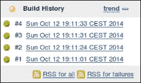

1.  返回到主页。

1.  要创建一个新的视图，请单击**+**图标。

1.  填写**FAV**作为名称。

1.  检查**列表视图**。

1.  在**作业过滤器**部分，选择**使用正则表达式将作业包含到视图中**。为**正则表达式**添加`.*`。

1.  在**列**部分，请确保您有三列**名称**、**状态**和**收藏夹**，如下面的屏幕截图所示: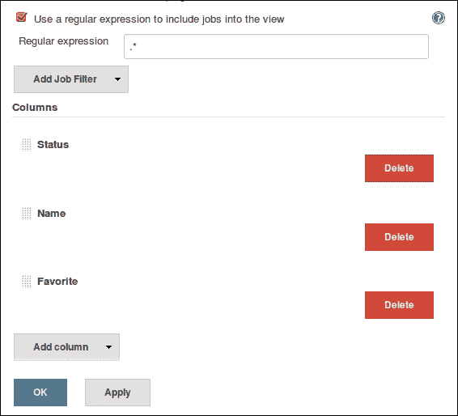

1.  点击**确定**。

1.  你将会进入**FAV**视图。通过点击星形图标，你可以选择/取消选择你喜欢的项目，如下面的屏幕截图所示: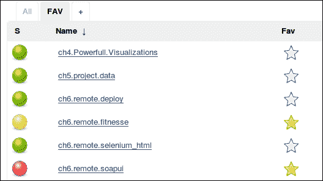

## 它如何运作...

Green Balls 插件表现如宣传的那样。Favorite 插件允许你选择最感兴趣的项目并将其显示为收藏夹图标。这提醒你项目需要一些即时行动。

### 注意

如果你对与社区合作感兴趣，那么这些插件是你可以增加额外功能的示例。你可以在这里找到官方的参与指南：[`wiki.jenkins-ci.org/display/JENKINS/Beginners+Guide+to+Contributing`](https://wiki.jenkins-ci.org/display/JENKINS/Beginners+Guide+to+Contributing)

## 还有更多...

最喜欢的项目的反义词，至少暂时是一个构建失败的项目。Claim 插件（[`wiki.jenkins-ci.org/display/JENKINS/Claim+plugin`](https://wiki.jenkins-ci.org/display/JENKINS/Claim+plugin)）允许个别开发人员声明失败的构建。这使得将工作流程映射到个人责任成为可能。

一旦安装了 Claims 插件，您就能在作业的**后构建操作**部分找到一个名为**允许声明破损构建**的复选框。一旦启用，如果构建失败，您可以声明特定的构建，并添加有关您动机的注释。

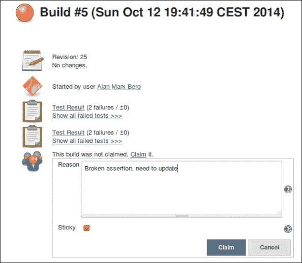

现在，在 Jenkins 主页上，有一个指向保留所有声明构建摘要的日志的链接。项目经理现在可以阅读有关问题的快速概述。该日志是直接链接到正在处理当前问题的团队成员，如下截图所示：

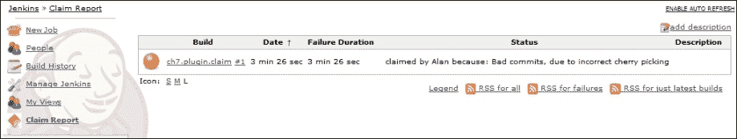

Favorite 插件在其简单性中非常优雅。在下一个配方中，测试然后推广将表示允许进一步将复杂工作流程纳入的信号。

## 另请参阅

+   *测试然后推广构建*配方

+   *与标记 JSGames 有趣*配方

# 测试然后推广构建

在自动测试之前，您不希望 QA 团队审查应用程序。为实现此目的，您可以使用推广插件。

在 Jenkins 中，推广是一种视觉信号。在特定构建旁边设置一个图标，以提醒团队执行操作。

促进和前面配方中提到的 Favorite 插件之间的区别在于，促进可以根据各种自动操作自动触发。这些操作包括运行脚本或验证其他上游或下游作业的状态。

在这个配方中，您将编写两个简单的作业。第一个作业将触发第二个作业；如果第二个作业成功，则将提升第一个作业。这是一个现实的质量保证流程的核心，即测试作业推动打包作业。

## 准备就绪

安装推广构建插件（[`wiki.jenkins-ci.org/display/JENKINS/Promoted+Builds+Plugin`](https://wiki.jenkins-ci.org/display/JENKINS/Promoted+Builds+Plugin)）。

## 如何操作...

1.  创建一个名为`ch7.plugin.promote_action`的自由风格作业。

1.  运行此作业并验证其成功。

1.  创建一个名为`ch7.plugin.to_be_promoted`的自由风格作业。

1.  在配置页面的顶部附近，勾选**当...促进构建**。

1.  填写以下细节：

    +   **名称**：由自动功能测试验证

    +   为**图标**选择**绿色星号**

    +   检查**在以下下游项目成功构建时**

    +   **作业名称**：`ch7.plugin.promote_action`

    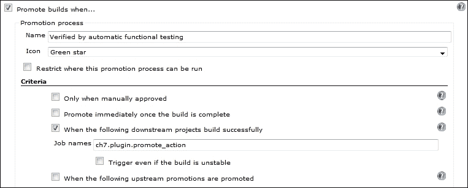

1.  在**后构建操作**部分检查**构建其他项目**。

1.  为**要构建的项目**填写`ch7.plugin.promote_action`。

1.  勾选**仅在构建稳定时触发**。

1.  点击**保存**。

1.  构建作业。

1.  单击**推广状态**链接，如下图所示：

1.  查看构建报告。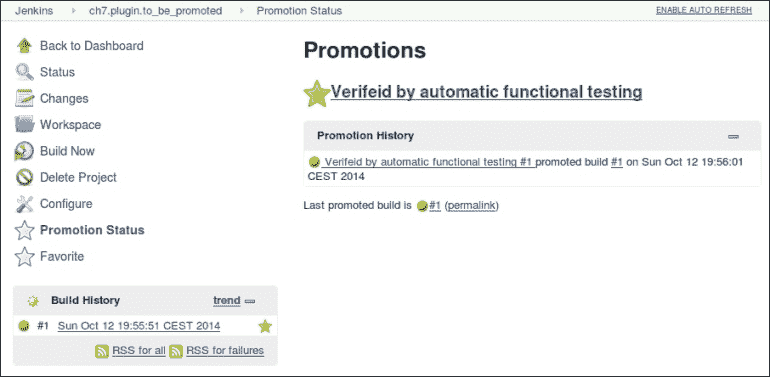

## 工作原理...

推广构建类似于 Favorite 插件，但具有工作流自动化。您可以根据由构件创建触发的作业来推广。这是典型的工作流程，当您希望作业在被拾起和审查之前经过基线质量测试时。

该插件具有足够的配置选项，使其适应大多数工作流程。另一个示例是，对于典型的开发、验收和生产基础设施，您不希望在开发和验收被推广之前将构件部署到生产环境。配置此方法是具有一系列作业，最后一个推广到生产取决于上游开发和验收作业的推广。

### 注

如果您想要添加人工干预，那么在作业配置中检查**仅在手动批准时**并添加批准者名单。

## 还有更多...

如果您依赖于人工干预且没有自动测试，请考虑使用简化的推广构建插件([`wiki.jenkins-ci.org/display/JENKINS/Promoted+Builds+Simple+Plugin`](https://wiki.jenkins-ci.org/display/JENKINS/Promoted+Builds+Simple+Plugin))。正如其名称所示，该插件简化了配置，并且可以很好地与大多数 QA 工作流配合使用。简化配置使得更容易解释，使更广泛的受众可以使用。

您可以在主 Jenkins 配置页面中配置不同类型的推广，如下图所示：

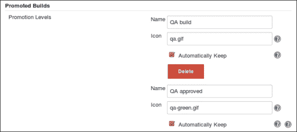

### 注

明智地使用**自动保存**功能。此选项告诉 Jenkins 保留构建的所有构件。如果作为增量构建过程的一部分使用，将最终占用大量磁盘空间。

该插件允许您提升推广。通过左侧构建上的链接可提供一个简单的选择。此功能允许您将一系列玩家添加到推广过程中。

### 注

当最终推广发生时，例如到**GA**（**一般可用**），推广将被锁定，不再能够被降级。

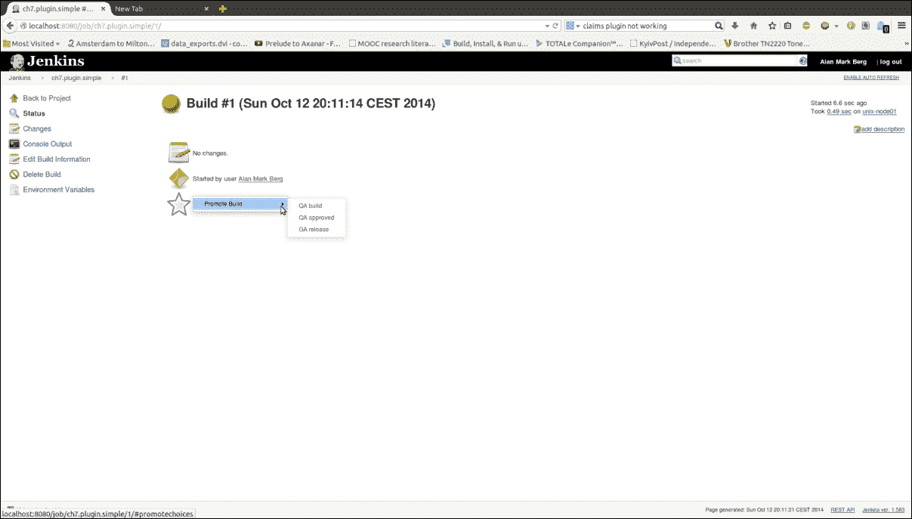

用户推广的能力取决于其权限。例如，如果您使用基于矩阵的安全性，则需要在作业的配置页面中看到额外选项之前更新其表格，如下图所示：

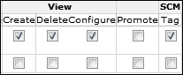

## 另请参阅

+   *个性化 Jenkins* 教程

# 与固定 JSGames 玩耍

本教程向您展示如何固定 Jenkins 插件。固定插件将阻止您能够在 Jenkins 插件管理器内更新其版本。

现在老板走了，生活并不总是关于代码质量。为了减轻压力，考虑让你的团队通过 JSGames 插件放松。

## 准备工作

安装 JSGames 插件 ([`wiki.jenkins-ci.org/display/JENKINS/JSGames+Plugin`](https://wiki.jenkins-ci.org/display/JENKINS/JSGames+Plugin))。

## 如何操作...

1.  检查并回顾你选择的目录下的标签 **jsgames-0.2**，命令如下：

    ```
    git clone https://github.com/jenkinsci/jsgames-plugin
    git tag
    git checkout jsgames-0.2

    ```

1.  查看 Jenkins 的首页；你会看到一个指向 JS Games 的链接，如下所示：

1.  点击链接，你将可以选择两个游戏，**马里奥卡丁车**和**俄罗斯方块**：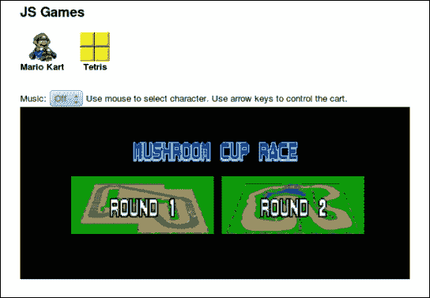

1.  作为 Jenkins 管理员，访问**管理插件**部分，然后点击已安装选项卡 (`http://localhost:8080/pluginManager/installed`)。注意 JSGames 插件没有被固定。

1.  从命令行，列出插件目录 (`JENKINS_HOME/plugin`) 的内容，例如：

    ```
    ls /var/lib/jenkins/plugins

    ```

    输出将类似于：

    ```
    ant                             ant.jpi
    jsgames                     jsgames.jpi
    maven-plugin             maven-plugin.jpi

    ```

1.  在插件目录中，创建一个名为 `jsgames.jpi.pinned` 的文件，例如：

    ```
    sudo touch /var/lib/jenkins/plugins/jsgames.jpi.pinned
    sudo chown jenkins /var/lib/jenkins/plugins/jsgames.jpi.pinned

    ```

1.  在你的网络浏览器中，刷新已安装插件页面。现在你会看到 `jsgames` 插件被固定了：

## 它是如何工作的...

固定一个插件会阻止 Jenkins 管理员更新插件的新版本。要固定一个插件，你需要在插件目录中创建一个与插件同名的文件，以 pinned 为扩展名结尾。参见 [`wiki.jenkins-ci.org/display/JENKINS/Pinned+Plugins`](https://wiki.jenkins-ci.org/display/JENKINS/Pinned+Plugins)。

Jenkins 的新版本大约每周发布一次，包含 bug 修复和功能更新。这导致改进快速地进入市场，但有时也会导致失败。将插件固定可以防止插件在你评估新版本的稳定性和价值之前被意外更新。固定是保持生产服务器稳定的工具。

## 还有更多...

源代码包括一个顶级 `pom.xml` 文件来控制 Maven 构建过程。按照惯例，四个主要的源代码区域是：

+   `src/test`：这包含构建过程中的测试代码。对于 JSGames，有一堆 JUnit 测试。

+   `src/main/java`：这是 Java 代码的位置。Jenkins 使用 Stapler ([`wiki.jenkins-ci.org/display/JENKINS/Architecture`](https://wiki.jenkins-ci.org/display/JENKINS/Architecture)) 将此目录中的 Java 对象与 Jenkins 在 `src/main/resources` 下找到的视图相映射。

+   `src/main/resources`：这是插件的视图位置。当你在 Jenkins 中进行交互时，例如 JS Games 的链接，你会使用与插件相关联的 GUI。视图是使用 Jelly 标记定义的。

+   `src/main/webapp`：这是资源的位置，如图像、样式表和 JavaScript。该位置映射到 URL 空间。`/src/main/webapp`映射到 URL `/plugin/name_of_plugin`。例如，位置`/src/main/webapp/tetris/resources/tetris.js`映射到 URL `/plugin/jsgames/tetris/resources/tetris.js`。

## 参见

+   *创建 RootAction 插件*的步骤

# 查看 GUI 示例插件

本篇描述如何通过 Maven 运行 Jenkins 测试服务器。在测试服务器中，你将看到示例 GUI 插件。GUI 插件展示了许多标签元素，稍后你可以在自己的插件中使用。

## 准备工作

创建一个目录来保存本篇的结果。

## 如何操作...

1.  在 recipe 目录中，在`pom.xml`文件中添加以下内容：

    ```
    <?xml version="1.0"?>
    <project   xsi:schemaLocation="http://maven.apache.org/POM/4.0.0 http://maven.apache.org/maven-v4_0_0.xsd">
     <modelVersion>4.0.0</modelVersion>
    <parent>
      <groupId>org.jenkins-ci.plugins</groupId>
      <artifactId>plugin</artifactId>   
      <version>1.584</version>
    </parent>
      <artifactId>Startup</artifactId>
      <version>1.0-SNAPSHOT</version>
      <packaging>hpi</packaging>
      <name>Startup</name>
      <repositories>
        <repository>
        <id>repo.jenkins-ci.org</id>
        <url>http://repo.jenkins-ci.org/public/</url>
        </repository>
        </repositories>
        <pluginRepositories>
        <pluginRepository>
        <id>repo.jenkins-ci.org</id>
        <url>http://repo.jenkins-ci.org/public/</url>
      </pluginRepository>
      </pluginRepositories>
      <properties>
        <project.build.sourceEncoding>UTF-8   
        </project.build.sourceEncoding>
      </properties>
    </project>
    ```

1.  从命令行运行`mvn hpi:run`。如果你在端口`8080`上有一个默认的 Jenkins 运行，那么你将看到类似于以下的错误消息：

    ```
    2012-02-05 09:56:57.827::WARN:  failed SelectChannelConnector @ 0.0.0.0:8080
    java.net.BindException: Address already in use
    at sun.nio.ch.Net.bind0(Native Method)

    ```

1.  如果服务器仍在运行，按下*Ctrl* + *C*。

1.  要在端口`8090`上运行，请输入以下命令：

    ```
    mvn hpi:run -Djetty.port=8090

    ```

1.  服务器现在正在运行，并从控制台生成一个**SEVERE**错误：

    ```
    SEVERE: Failed Inspecting plugin  /DRAFT/Exploring_plugins/hpi_run/./work/plugins/Startup.hpl
    java.io.IOException: No such file: /DRAFT/Exploring_plugins/hpi_run/target/classes

    ```

1.  访问`localhost:8090/jenkins`。在页面底部，查看 Jenkins 的版本号，如下截图所示：

1.  通过插件管理器（`http://localhost:8090/pluginManager/available`）安装 UI 示例插件。

1.  在首页上，点击**UI 示例**链接：

1.  查看所提及的各种示例类型，例如 AutoCompleteTextBox（`http://localhost:8090/ui-samples/AutoCompleteTextBox/`）。

## 工作原理...

对于开发目的，从 Maven 运行测试服务器的能力非常棒。你可以修改代码，编译，打包，然后在本地 Jenkins 实例上查看，而无需担心配置或破坏真实服务器。你不必太担心安全性，因为测试服务器只在测试期间运行。

目标`hpi:run`尝试打包并部署一个名为 Startup 的插件。但是，由于包不可用，它会记录一个投诉，并忠实地运行一个 Jenkins 服务器。Jenkins 服务器的版本号与`pom.xml`中定义的`<parent>`标签内的`<version>`标签相同。

为了避免与本地 Jenkins 实例使用相同的端口，你设置了`jetty.port`选项。

一旦运行，访问 GUI 示例插件会展示如何在 Jelly 中创建各种 GUI 元素的示例。这些元素稍后在编程自己的插件时会派上用场。插件中使用的 Jelly 文件位于`/src/main/resources`目录下。Jenkins 使用 Stapler 将在`src/main/java`中找到的任何相关类绑定起来。

你可以在`work`文件夹中找到 Jenkins 的工作空间。你在测试服务器上所做的任何配置更改都将保留在这里。为了重新开始，你需要手动删除该目录。

对于本章中的所有配方，我们将固定 Jenkins 版本为 1.584。原因有两个：

+   依赖项占用了大量空间。Jenkins war 文件和测试 war 文件大约占用本地 Maven 存储库的 120 MB。将此数字乘以使用的 Jenkins 版本数量，您很快就会填满几 GB 的存储空间。

+   将 Jenkins 版本固定在特定版本可以稳定配方。

欢迎更新到最新版本的 Jenkins，因为本章中的示例应该仍然适用。如果遇到困难，您可以随时返回已知的安全版本号。

## 更多内容...

在幕后，Maven 做了大量的繁重工作。`pom.xml` 文件定义了 [`repo.jenkins-ci.org/public/`](http://repo.jenkins-ci.org/public/) 存储库以获取依赖项。它调用版本 1.584 的 `org.jenkins-ci.plugins.plugin`。版本号与 Maven 运行的 Jenkins 版本号同步。

要发现可接受的版本号，请访问 [`repo.jenkins-ci.org/public/org/jenkins-ci/plugins/plugin/`](http://repo.jenkins-ci.org/public/org/jenkins-ci/plugins/plugin/)。

Jenkins 服务器的详细信息以及包含的任何额外插件可以在 `1.584/plugin-1.584.pom` 相对于前述 URL 找到。UI Samples 插件版本也固定在版本 1.584。

官方页面和插件构建的最新信息可以在 [`wiki.jenkins-ci.org/display/JENKINS/Plugin+tutorial`](https://wiki.jenkins-ci.org/display/JENKINS/Plugin+tutorial) 找到。

## 参见

+   *更改 FileSystem SCM 插件的帮助* 配方

# 更改 FileSystem SCM 插件的帮助

本配方审查了 FileSystem SCM 插件的内部工作原理。该插件允许您将代码放在本地目录中，并在构建中被检索到。例如，您将更改插件帮助文件中的文本。

## 准备工作

创建一个准备接受本配方代码的目录。在新创建的目录中，下载插件的源码：

```
git clone https://github.com/jenkinsci/filesystem_scm-plugin cd filesystem_scm-plugin/

```

## 操作方法...

1.  查看标签信息，然后检出最新的稳定标签：

    ```
    git tag –l
    filesystem_scm-0.1
    filesystem_scm-1.10
    filesystem_scm-1.20
    filesystem_scm-1.5
    filesystem_scm-1.6
    filesystem_scm-1.7
    filesystem_scm-1.8
    filesystem_scm-1.9
    git checkout –b filesystem_scm-1.20

    ```

1.  在顶级目录中，编辑 `pom.xml` 文件，在 `<parent>` 下更改版本为 `1.584`：

    ```
      <parent>
        <groupId>org.jenkins-ci.plugins</groupId>
        <artifactId>plugin</artifactId> 
        <version>1.584</version>
      </parent>
    ```

1.  用以下代码替换存储库和 `pluginRepositories` 部分：

    ```
      <repositories>
        <repository>
          <id>repo.jenkins-ci.org</id>
          <url>http://repo.jenkins-ci.org/public/</url>
        </repository>
      </repositories>
      <pluginRepositories>
        <pluginRepository>
          <id>repo.jenkins-ci.org</id>
          <url>http://repo.jenkins-ci.org/public/</url>
        </pluginRepository>
      </pluginRepositories>
    ```

1.  将 `src/main/webapp/help-clearWorkspace.html` 的内容替换为以下代码：

    ```
    <div>
      <p>
    <h3>HELLO WORLD</h3>
      </p>
    </div>
    ```

1.  运行 `mvn clean install`。单元测试失败，输出为：

    ```
    Failed tests:   test1(hudson.plugins.filesystem_scm.SimpleAntWildcardFilterTest): expected:<2> but was:<0>
    Tests run: 27, Failures: 1, Errors: 0, Skipped: 0

    ```

1.  运行 `mvn clean package -Dmaven.test.skip=true` 来跳过失败的测试。插件现在已经打包完毕。

    将插件上传到插件管理器的 **高级** 部分 (`http://localhost:8080/pluginManager/advanced`) 的 `./target/filesystem_scm.hpi` 中：

    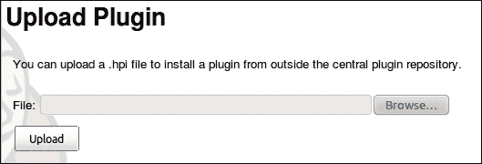

1.  重新启动 Jenkins 服务器。

1.  登录 Jenkins 并访问已安装插件的列表 (`http://localhost:8080/pluginManager/installed`)。

1.  创建一个名为 `ch7.plugins.filesystem_scm` 的 Maven 作业。

1.  在**源码管理**部分下，您现在有一个名为**文件系统**的部分。

1.  点击**帮助**图标获取**清理工作区**的相关信息。如下截图所示：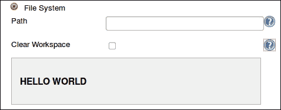

1.  要删除插件，请删除 `jpi` 文件和位于 `JENKINS_HOME/plugins` 下的扩展目录。

1.  重启 Jenkins。

## 工作原理...

恭喜，你已经更新了 SCM 插件。

首先，您修改了插件的 `pom.xml` 文件，更新了测试 Jenkins 服务器的版本，并指向了 Maven 下载工件的正确存储库。接下来，您修改了其帮助文件。

对于每个 Java 类，您都可以通过关联的 `config.jelly` 文件配置其 GUI 表示。映射来自 `src/main/java/package_path/classname.java`。

到 `src/main/resources/package_path/classname/config.jelly`。

例如，`src/main/resources/hudson/plugins/filestem_scm/FSSCM/config.jelly` 配置了 `src/main/java/hudson/plugins/filesystem_s_c_m/FSSCM.java` 的 Jenkins GUI。

帮助文件的位置在 `config.jelly` 中的 `entry` Jelly 标记的 `help` 属性中定义：

```
  <f:entry title="Clear Workspace" help="/plugin/filesystem_scm/help-clearWorkspace.html">
    <f:checkbox name="fs_scm.clearWorkspace" checked="${scm.clearWorkspace}"/>
  </f:entry>
```

`src/main/webapps` 目录为静态内容（如图像、样式表和 JavaScript 文件）提供了一个稳定的 Jenkins URL `/plugin/name_of_plugin`。这就是为什么帮助文件存储在这里。修改 `help-clearWorkspace.html` 会更新 `entry` 标签指向的帮助。

变量 `${scm.clearworkspace}` 是对 `FSSCM` 实例中 `clearWorkspace` 成员的引用。

## 还有更多...

插件通常包含两种类型的 Jelly 文件，即 `global.jelly` 和 `config.jelly`。`config.jelly` 文件生成配置作业时看到的配置元素。`global.jelly` 文件在主 Jenkins 配置页面中呈现。

使用 XStream 框架将数据持久化为 XML 文件。您可以在 Jenkins 工作区的 `/jobs/job_name/plugin_name.xml` 下找到作业配置的数据，以及在 `./work/name_of_plugin.xml` 下找到全局插件配置的数据。

## 另请参阅

+   *查看 GUI 示例插件*的配方

# 向作业描述添加横幅

想象一个场景。您的公司有一个面向公众的 Jenkins 实例。所有者不希望项目所有者在项目描述中写入未转义的标记。这会带来太多安全问题。但是，所有者确实希望在每个描述的底部放置公司横幅。在管理层开始购买不必要的建议之前，您有 15 分钟来解决这个问题。在前五分钟内，您确定转义标记插件（请参阅第二章中的*查找 Jenkins 中的 500 错误和 XSS 攻击*配方，*增强安全性*）执行了描述的转义。

此配方向您展示如何修改 Markup 插件以向所有描述添加横幅。

## 准备就绪

假设你正在本地进行测试，请为你的项目创建一个目录。在你新创建的目录中，检出转义标记插件的`escape-markup-plugin-0.1`标签：

```
git clone https://github.com/jenkinsci/escaped-markup-plugin

```

## 操作步骤...

1.  访问插件源代码的本地副本，列出可能的标签，并检出插件的稳定版本：

    ```
    cd escaped-markup-plugin
    git tag -l
    git –b checkout escaped-markup-plugin-0.1

    ```

1.  在项目的顶级目录中，尝试使用命令`mvn install`创建插件。构建失败。

1.  将`pom.xml`文件中的 Jenkins 插件版本从`1.408`更改为`1.58`：

    ```
    <parent>
      <groupId>org.jenkins-ci.plugins</groupId>
      <artifactId>plugin</artifactId>
      <version>1.584</version>
    </parent>
    ```

1.  用以下代码替换`repositories`和`pluginRepositories`部分：

    ```
      <repositories>
        <repository>
          <id>repo.jenkins-ci.org</id>
          <url>http://repo.jenkins-ci.org/public/</url>
        </repository>
      </repositories>
      <pluginRepositories>
        <pluginRepository>
          <id>repo.jenkins-ci.org</id>
          <url>http://repo.jenkins-ci.org/public/</url>
        </pluginRepository>
      </pluginRepositories>
    ```

1.  使用`mvn install`构建插件。构建将成功。你现在可以在`target/escaped-markup-plugin.hpi`找到该插件。

1.  通过访问插件管理器（`http://localhost:8080/pluginManager/advanced`）下的**高级**选项卡安装插件。

1.  在**上传插件**部分，上传`escaped-markup-plugin.hpi`文件。

1.  重新启动服务器，例如：

    ```
    sudo /etc/init.d/jenkins restart

    ```

1.  访问 Jenkins 安全配置页面（`http://localhost:8080/configureSecurity`）并查看**标记格式化器**。

1.  用以下代码替换`src/main/resources/index.jelly`：

    ```
    <div>
      This plugin escapes the description of project, use, view, and build  to prevent from XSS.
      Revision: Unescaped banner added at the end.
    </div>
    ```

1.  用以下代码替换`src/main/java/org/jenkinsci/plugins/escapedmarkup/EscapedMarkupFormatter.java`的类定义：

    ```
    public class EscapedMarkupFormatter extends MarkupFormatter
    {
      private final String BANNER= "\n<hr><h2>THINK BIG WITH xyz dot blah</h2><hr>\n";

      @DataBoundConstructor
      public EscapedMarkupFormatter() {
    }
    @Override
    public void translate(String markup, Writer output) throws IOException {
        output.write(Util.escape(markup)+BANNER);
      }
        @Extension
        public static class DescriptorImpl extends MarkupFormatterDescriptor {
        @Override
        public String getDisplayName() {
          return "Escaped HTML with BANNER";
        }
      }
    }
    ```

1.  使用`mvn install`进行构建。构建失败是由于测试未通过（这是件好事）。

1.  再次使用以下命令构建，这次跳过测试：

    ```
    mvn -Dmaven.test.skip=true -DskipTests=true clean install

    ```

1.  关闭 Jenkins，如下所示：

    ```
    sudo /etc/init.d/jenkins stop

    ```

1.  从 Jenkins 插件目录和相同目录中的扩展版本中删除转义标记插件，例如：

    ```
    sudo rm /var/lib/jenkins/plugins/escaped-markup-plugin.jpi
    sudo rm -rf /var/lib/jenkins/plugins/escaped-markup-plugin

    ```

1.  将插件`target/escaped-markup-plugin.hpi`复制到 Jenkins 插件目录。

1.  重启 Jenkins。

1.  访问已安装的插件页面：`http://localhost:8080/pluginManager/installed`。你现在将看到插件的更新描述，如下图所示：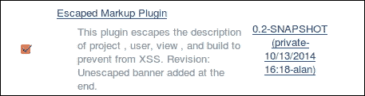

1.  在 Jenkins 中，作为管理员，访问配置页面：`http://localhost:8080/configureSecurity`。

1.  对于**标记格式化器**选择**带 BANNER 的转义 HTML**，如以下截图所示：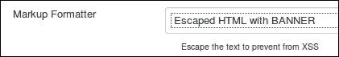

1.  点击**保存**。

1.  创建一个名为`ch7.plugin.escape`的新作业。

1.  在作业的主页面内，你现在将看到横幅：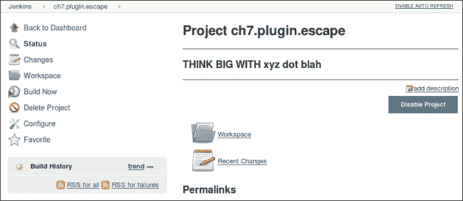

## 工作原理...

标记插件会转义描述中的标签，以防注入任意脚本操作。插件的使用方法在第二章*增强安全性*中的 *通过模糊测试在 Jenkins 中查找 500 错误和 XSS 攻击*配方中已经解释过了。

在这个配方中，我们修改了插件以转义项目描述，然后添加了一个横幅。横幅包含任意 HTML。

首先，您编译并上传了 Markup 插件。然后修改源代码以在作业描述末尾包含横幅。该插件重新部署到一个用于审查的牺牲测试实例上。您也可以使用`mvn hpi:run`目标通过 Maven 运行 Jenkins。有多种部署方法，包括直接将插件转储到 Jenkins 插件目录中。决定使用哪种部署方法取决于个人喜好。

插件渲染的描述在`src/main/resources/index.jelly`中定义。您更新了文件以准确描述新的横幅功能。

在 Jenkins 中，扩展点是模拟 Jenkins 功能的 Java 接口或抽象类。Jenkins 拥有丰富的扩展点（[`wiki.jenkins-ci.org/display/JENKINS/Extension+points`](https://wiki.jenkins-ci.org/display/JENKINS/Extension+points)）。您甚至可以制作自己的（[`wiki.jenkins-ci.org/display/JENKINS/Defining+a+new+extension+point`](https://wiki.jenkins-ci.org/display/JENKINS/Defining+a+new+extension+point)）。

Markdown 插件进行了最小的更改以满足我们的需求。我们扩展了`MarkupFormatter`扩展点。

Jenkins 使用注解。`@Override`注解告诉编译器重写该方法。在这种情况下，我们重写了`translate`方法，并使用一个实用类来使用 Jenkins 实用方法过滤`markup`字符串。最终，结果字符串加上横幅字符串被添加并传递给 Java 写入器。然后将写入器传递回调用方法。

插件的`selectbox`中的文本（见第 19 步）是在`DescriptorImpl`类的`getDisplayName()`方法中定义的。

### 注意

编写新的插件并理解 Jenkins 的对象模型需要比复制一个可以工作的插件然后进行微调要付出更多的努力。向已经存在的插件添加横幅功能所需的代码更改量很小。

## 还有更多……

Jenkins 有大量的文档可用。然而，对于技术宅程序员来说，最详细的信息源是审阅代码、在 IDE（如 Eclipse）中查找的 JavaDoc 以及代码补全功能。如果将 Jenkins 插件项目作为 Maven 项目导入 Eclipse，则最新版本的 Eclipse 会为您解决依赖关系，从而在编辑文件时启用代码补全功能。在 Jenkins 这样一个快速发展的项目中，有时会出现添加功能和文档之间存在的滞后情况。在这种情况下，代码需要是自说明的。代码补全结合良好编写的 JavaDoc 可以减轻开发人员的学习曲线。

下一张屏幕截图展示了在 Eclipse IDE 中运行 Jenkins 时代码补全的工作：

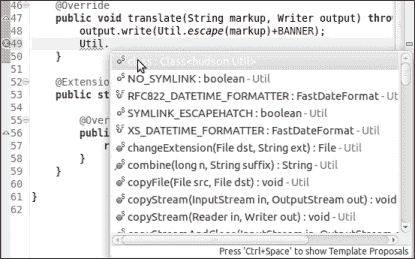

## 另请参阅

+   *在 第二章，*增强安全性* 中查找在 Jenkins 中发现 500 错误和 XSS 攻击的方法

+   *更改 FileSystem SCM 插件的帮助* 方法

+   *创建 RootAction 插件* 方法

# 创建一个 RootAction 插件

在构建自己的插件之前，值得看看是否可以改编另一个插件。在 *Fun with pinning JSGames* 方法中，插件在首页创建了一个链接，如下截图所示：


在这个方法中，我们将使用插件的元素在 Jenkins 主页上创建一个链接。

## 准备工作

在本地创建一个目录以存储你的源代码。

## 如何操作...

1.  复制 *Looking at the GUI samples plugin* 方法中的`pom.xml`文件，替换：

    ```
      <artifactId>Startup</artifactId>
      <version>1.0-SNAPSHOT</version>
      <packaging>hpi</packaging>
       <name>Startup</name>
    ```

    使用以下内容：

    ```
      <artifactId>rootaction</artifactId>
      <version>1.0-SNAPSHOT</version>
      <packaging>hpi</packaging>
       <name>Jenkins Root Action Plugin</name>
    ```

1.  创建目录`src/main/java/jenkins/plugins/rootaction`、`src/main/resources`和`src/main/webapp`。

1.  在`src/main/java/jenkins/plugins/rootaction`中添加文件`MyRootAction.java`，内容如下：

    ```
    package jenkins.plugins.rootaction;
    import hudson.Extension;
    import hudson.model.RootAction;

    @Extension
    public class MyRootAction implements RootAction {

      public final String getDisplayName() {
        return "Root Action Example";
      }

      public final String getIconFileName() {
        return "/plugin/rootaction/myicon.png";
      }

      //Feel free to modify the URL
      public final String getUrlName() {
        return "http://www.uva.nl";
      }
    }
    ```

1.  在`src/main/webapp`目录中，添加一个名为`myicon.png`的`png`文件。例如图片请见：[`www.iconfinder.com/icondetails/46509/32/youtube_icon`](http://www.iconfinder.com/icondetails/46509/32/youtube_icon)。

1.  添加文件`src/main/resources/index.jelly`，内容如下：

    ```
    <div>
      This plugin adds a root link.
    </div>
    ```

1.  在顶级目录中运行命令：

    ```
    mvn -Dmaven.test.skip=true -DskipTests=true clean install hpi:run -Djetty.port=8090

    ```

1.  访问主页：`http://localhost:8090/jenkins`：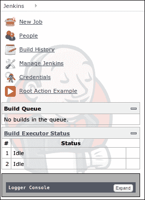

1.  点击**Root Action Example**链接。现在你的浏览器被发送到阿姆斯特丹大学的主网站([`www.uva.nl`](http://www.uva.nl))。

1.  查看 Jenkins 安装的插件页面(`http://localhost:8090/pluginManager/installed`)。

## 工作原理...

你实现了`RootAction`扩展点。它用于在 Jenkins 的主菜单中添加链接。

扩展点易于扩展。链接名称在`getDisplayName`方法中定义，图标的位置在`getIconFileName`方法中，链接到的 URL 在`getUrlName`中定义。

## 还有更多...

惯例节省了编程工作。按照惯例，插件的描述定义在`src/main/resources/index.jelly`中，链接名称在`pom.xml`文件中的`<name>`标签旁边的`<packaging>`标签下，例如：

```
  <artifactId>rootaction</artifactId>
  <version>1.0-SNAPSHOT</version>
  <packaging>hpi</packaging>
   <name>Jenkins Root Action Plugin</name>
```

Jenkins wiki 中的详细信息位置计算为一个固定的 URL ([`wiki.jenkins-ci.org/display/JENKINS/`](http://wiki.jenkins-ci.org/display/JENKINS/))，该 URL 后跟插件名称，并且名称中的空格被**+**符号替换。对于这个插件也是如此，生成的链接为`http://wiki.jenkins-ci.org/display/JENKINS/Jenkins+Root+Action+Plugin`。


## 另请参阅

+   *Fun with pinning JSGames* 方法

# 导出数据

Job Exporter 插件创建一个包含项目相关属性列表的属性文件。当你想让 Jenkins 将信息从一个作业传递到另一个作业时，这非常方便。

## 准备工作

安装 Job Exporter 插件（[`wiki.jenkins-ci.org/display/JENKINS/Job+Exporter+Plugin`](https://wiki.jenkins-ci.org/display/JENKINS/Job+Exporter+Plugin)）。

## 如何做…

1.  下载已知版本号的源代码：

    ```
    svn export -r 40275 https://svn.jenkins-ci.org/trunk/hudson/plugins/job-exporter

    ```

1.  创建一个名为`ch7.plugins.job_export`的自由风格作业。

1.  在**构建**部分，添加一个构建步骤**导出运行时参数**。

1.  点击**保存**。

1.  运行作业。

1.  在控制台输出中，您将看到作业构建历史中类似的输出：

    ```
    (Replace with email)
    Started by user Alan Mark Berg 
    Building remotely on unix-node01 (dumb functional unix) in workspace
     /home/jenkins-unix-nodex/workspace/c7.plugins.job_export ################################################################### job-exporter plugin started
     hudson.version: 1.584
     host: home.local
     id: 2014-10-13_16-58-18
     duration: 2.5 sec
     slave: unix-node01
     started: 2014-10-13T16:58:18
     result: SUCCESS
     summary: Executor #1 for unix-node01 : executing c7.plugins.job_export #1
     executor: 1
     elapsedTime: 2602
     number: 1
     jobName: c7.plugins.job_export
     we have 1 build cause:       Cause.UserIdCause  Started by user Alan Mark Berg
     user.id: aaaaaaa
     user.name: Alan Mark Berg
     user.fullName: Alan Mark Berg
     user.emailAddress: xxxxx@yyyy.zzz
     new file written: /home/jenkins-unix-nodex/workspace/c7.plugins.job_export/hudsonBuild.properties
     job-exporter plugin  finished.  That's All Folks! ################################################################### Finished: SUCCESS

    ```

1.  审查新创建的属性文件，您将看到类似的文本：

    ```
    #created by com.meyling.hudson.plugin.job_exporter.ExporterBuilder
    #Thu Feb 02 15:58:51 CET 2012
    build.user.id=Alan
    build.result=SUCCESS

    ```

## 工作原理…

Job Exporter 插件使 Jenkins 能够将与作业相关的信息导出到一个属性文件中，后续可以通过其他作业重新使用。

审查`src/main/java/com/meyling/hudson/plugin/job_exporter/ExporterBuilder.java`中的代码，该代码扩展了`hudson.tasks.Builder`，当运行构建时会调用其`perform`方法。 当调用`perform`方法时，`Build`实例会接收`hudson.model.Build`对象。 `Build`实例包含有关构建本身的信息。 调用`build.getBuiltOnStr()`方法会返回一个包含构建运行在哪个节点上的节点名称的字符串。 该插件使用一些这些方法来发现稍后输出到属性文件的信息。

## 还有更多…

在审查插件代码时，您可以找到一些有趣的技巧，可以在您自己的插件中重复使用。该插件通过以下方法发现环境变量：

```
final EnvVars env = build.getEnvironment(new LogTaskListener(Logger.getLogger(
  this.getClass().getName()), Level.INFO));
```

在此方法中，`EnvVars`是`hudson.EnvVars`类（[`javadoc.jenkins-ci.org/hudson/EnvVars.html`](http://javadoc.jenkins-ci.org/hudson/EnvVars.html)）。 `EnvVars`甚至有一个方法可以从远程 Jenkins 节点获取环境变量。

您还可以在**Jenkins 管理**区域的**系统信息**下找到为 Jenkins 定义的所有环境变量列表（`http://localhost:8080/systemInfo`）。

## 另请参阅

+   *我的第一个 ListView 插件* 配方

# 在启动时触发事件

经常在服务器启动时，您会希望执行清理操作，例如运行发送电子邮件给所有 Jenkins 管理员警告他们启动事件的作业。 您可以使用 Startup Trigger 插件实现这一点。

## 准备工作

安装 Startup Trigger 插件（[`wiki.jenkins-ci.org/display/JENKINS/Startup+Trigger`](https://wiki.jenkins-ci.org/display/JENKINS/Startup+Trigger)）。

## 如何做…

1.  下载源代码：

    ```
    svn export -r 40275 https://svn.jenkins-ci.org/trunk/hudson/plugins/startup-trigger-plugin

    ```

1.  创建一个名为`ch7.plugin.startup`的自由风格作业。

1.  在**构建触发器**部分，勾选**当作业节点启动时构建**。

1.  点击**保存**。

1.  重新启动 Jenkins。

1.  返回项目页面，您会注意到已触发一个作业。

1.  审查构建历史控制台输出。您将看到类似的输出：

    ```
    Started due to the start of a node.
    Building on master in workspace /var/lib/jenkins/workspace/ch7.plugins.startup
    Finished: SUCCESS

    ```

## 工作原理…

Startup Trigger 插件在启动时运行作业。 这在执行管理任务（例如，审查文件系统）时非常有用。它的设计也很简洁。

Startup Trigger 插件在 Java 类`/src/main/java/org/jvnet/hudson/plugins/triggers/startup/HudsonStartupTrigger`中扩展了`hudson.triggers.Trigger`，并覆盖了方法`start`，该方法在 Jenkins 启动时调用。 

`start`方法调用父类的 start 方法，如果它不是一个新实例，则调用方法`project.scheduleBuild`，然后启动构建。

```
@Override
  public void start( BuildableItem project, boolean newInstance )
  {
    super.start( project, newInstance );

    // do not schedule build when trigger was just added to the job
    if ( !newInstance )
    {
      project.scheduleBuild( new HudsonStartupCause() );
    }
  }
```

启动的原因在`HudsonStartupCause`中定义，它本身扩展了`hudson.model.Cause`。该插件覆盖了`getShortDescription()`方法，返回字符串`Started due to Hudson startup`。该字符串作为日志的一部分输出到控制台中：

```
@Override
   public String  getShortDescription()
  {
    return "Started due to Hudson startup.";
  }
```

## 参见

+   *当网页内容更改时触发事件*的方法

+   在启动时的 Groovy 钩子脚本和触发事件

# 在启动时的 Groovy 钩子脚本和触发事件

在前述的方法中，您看到您可以使用插件来运行任意的启动代码。另一种方法是将 Groovy 脚本`init.groovy`放在 Jenkins 主目录中。然后，您的 Jenkins 实例将在启动时运行 Groovy 脚本。

## 准备就绪

访问**Scriptler**网站[`scriptlerweb.appspot.com/catalog/list`](http://scriptlerweb.appspot.com/catalog/list)并查看当前可用的 Groovy 脚本。

## 操作步骤...

1.  访问[`scriptlerweb.appspot.com/script/show/256001`](http://scriptlerweb.appspot.com/script/show/256001)并查看安装的插件列表脚本。

1.  在 Jenkins 主目录中创建以下`init.groovy`脚本，如下面的代码所示：

    ```
    import jenkins.model.Jenkins
    import java.util.logging.LogManager
    def logger = LogManager.getLogManager().getLogger("")logger.info("RUNNING init.groovy from ${Jenkins.instance.getRootDir().absolutePath}")logger.info("Here are the Jenkins environment variables on startup")
    def env = System.getenv()
    env.each{
     logger.info("${it}")
    }
    logger.info("<PLUGINS>")
    count=0
    for(plugin in hudson.model.Hudson.instance.pluginManager.plugins.sort())
    {
     logger.info( plugin.shortName)
     count = count+1
    }
    logger.info("<PLUGINS>\nFound " + count + " plugins")
    logger.info("End of init.groovy \n... Goodbye Cruel world")
    ```

1.  重新启动 Jenkins 实例：

    ```
    sudo /etc/init.d/jenkins restart

    ```

1.  查看位于`/var/log/jenkins/jenkins.log`的日志文件。输出结果类似于以下内容（注意为了简洁起见，已删除了每秒钟的时间戳的每一行）：

    ```
    INFO: RUNNING init.groovy from /var/lib/jenkins
    INFO: Here are the Jenkins environment variables on startup
    INFO: TERM=xterm
    INFO: JENKINS_HOME=/var/lib/jenkins
    INFO: SHLVL=1
    INFO: XFILESEARCHPATH=/usr/dt/app-defaults/%L/Dt
    INFO: COLORTERM=gnome-terminal
    INFO: MAIL=/var/mail/jenkins
    INFO: XDG_SESSION_COOKIE=3e4cca1158bd9704ef8146c500000008-1413227204.360563-1079526024
    INFO: QT_QPA_PLATFORMTHEME=appmenu-qt5
    INFO: PWD=/var/lib/jenkins
    INFO: LOGNAME=jenkins
    INFO: _=/usr/bin/daemon
    INFO: NLSPATH=/usr/dt/lib/nls/msg/%L/%N.cat
    INFO: SHELL=/bin/bash
    INFO: PATH=/usr/local/bin:/usr/bin:/bin:/usr/local/games:/usr/games
    INFO: DISPLAY=:0.0
    INFO: USER=jenkins
    INFO: HOME=/var/lib/jenkins
    INFO: XAUTHORITY=/home/alan/.Xauthority
    INFO: XDG_SEAT=seat0
    INFO: XDG_SESSION_ID=c3
    INFO: XDG_VTNR=7
    INFO: LANG=en_US.UTF-8
    INFO: <PLUGINS>
    INFO: ant
    INFO: antisamy-markup-formatter
    INFO: buildresult-trigger
    INFO: claim
    INFO: credentials
    INFO: cvs
    INFO: 
    Found 46 plugins
    INFO: End of init.groovy
    ... Goodbye Cruel world

    ```

1.  访问`http://localhost:8080/systemInfo`并将日志文件与 Jenkins 中显示的系统信息进行比较，如下面的截图所示：

## 工作原理...

Jenkins 在启动时会寻找 Groovy 脚本来运行。可接受的位置在这里提到([`wiki.jenkins-ci.org/display/JENKINS/Groovy+Hook+Script`](https://wiki.jenkins-ci.org/display/JENKINS/Groovy+Hook+Script))，包括：

+   `$JENKINS_HOME/init.groovy`

+   `$JENKINS_HOME/init.groovy.d/*.groovy`（文件按其词法顺序运行）

Jenkins 从`init.groovy`中运行代码。它使用了我们初始化的标准`java.util.logging`框架，该框架的初始化代码如下：`def logger = LogManager.getLogManager().getLogger("")`。

建议使用日志记录框架而不是老式的`println`语句。在日志记录框架中，配置与报告分开。通过一点努力，这使您可以更改输出位置（文件系统、syslog 服务器等），格式、过滤器、旋转等。有关日志记录器框架的更多详细信息，请参阅[`docs.oracle.com/javase/8/docs/technotes/guides/logging/overview.html`](http://docs.oracle.com/javase/8/docs/technotes/guides/logging/overview.html)。

记录器可以以各种级别报告；然后您可以过滤结果。在此示例中，我们使用了`info`级别，因为我们没有在大声报告问题。

首先，脚本遍历环境变量：

```
def env = System.getenv()
env.each{
  logger.info("${it}")
}
```

接下来，您使用了 Scriptler 示例的稍微修改版本来列出 Jenkins 中的所有活动插件，如以下代码所示：

```
for(plugin in hudson.model.Hudson.instance.pluginManager.plugins.sort()) {
  logger.info( plugin.shortName)
```

最后，我们与**系统信息**页面进行了视觉比较，该页面也显示了相同的环境细节。

## 还有更多...

如果您希望分析系统信息以支持调试，请安装 Support Core 插件([`wiki.jenkins-ci.org/display/JENKINS/Support+Core+Plugin`](https://wiki.jenkins-ci.org/display/JENKINS/Support+Core+Plugin))。安装完成后，您可以在 URL `http://localhost:8080/support/`处进行配置。

单击**生成捆绑包**按钮将支持数据归档下载到您的浏览器中。 Jenkins 还将每小时生成类似的归档，并将 ZIP 文件放置在目录`$JENKINS_HOME/support`下。信息存储在多个文本文件中。例如，文件`support/plugins/active`列出了所有活动插件的当前版本：

```
ant:1.2
antisamy-markup-formatter:1.2
backup:1.6.1
cas1:1.0.1
credentials:1.16.1

```

以下截图显示了**支持**页面：


## 另请参阅

+   *启动时触发事件*示例

+   *当网页内容更改时触发事件*示例

# 当网页内容更改时触发事件

在这个示例中，URL 触发器插件将在网页更改其内容时触发构建。

Jenkins 部署到各种基础设施。在您的选择系统上，标准插件有时无法触发。Web 服务器是众所周知的技术。在大多数情况下，您要连接的系统具有其自己的 Web 界面。如果应用程序没有，则仍然可以设置一个网页，在需要 Jenkins 反应时更改该网页。

## 准备工作

安装 XTrigger 插件([`wiki.jenkins-ci.org/display/JENKINS/XTrigger+Plugin`](https://wiki.jenkins-ci.org/display/JENKINS/XTrigger+Plugin))。这将自动安装 URL 触发器插件和一些其他插件，这些插件监视两次检查之间的更改，例如运行本地脚本、Groovy 代码或监视文件或文件夹更改。

## 如何做

1.  创建一个名为`ch7.plugin.url`的新自由样式作业。

1.  在**构建触发器**部分，选中**[URL 触发器] - 使用 URL 轮询**复选框。

1.  点击**添加要监视的 URL**。

1.  对于**URL**，添加`http://localhost:8080`。

1.  检查**检查 URL 内容**。

1.  从**添加内容性质**中选择值**监视内容变化**，如下面的截图所示：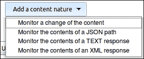

1.  添加一分钟的**时间表**。

1.  点击**保存**。

1.  在右侧，点击链接**URLTrigger Log**：

    现在，您将每分钟看到日志信息更新，内容类似于以下电子邮件：

    ```
    Inspecting Monitor a change of the content for URL http://localhost:8080
    Polling started on Oct 13, 2014 5:49:00 PM
    Polling for the job ch7.plugin.url
    Looking nodes where the poll can be run.
    Looking for a candidate node to run the poll.
    Looking for a node with no predefined label.
    Trying to poll with the last built on node.
    Trying to poll on master node.

    Polling on master.
    Invoking the url:   http://localhost:8080
    Inspecting the content
    The content of the URL has changed.

    Polling complete. Took 0.13 sec.
    Changes found. Scheduling a build.

    ```

1.  删除作业，因为我们不想每分钟轮询`http://localhost:8080`。

## 它是如何工作的...

您已经配置插件每分钟访问我们的本地 Jenkins `http://localhost:8080`，下载并比较更改。一分钟的时间表是积极主动的；考虑使用与您的 SCM 存储库类似的时间间隔，例如每 5 分钟一次。

由于返回的每个页面存在细微差异，触发器被激活。这一点通过查看**URLTrigger Log**得到了验证。

URLTrigger 插件也可用于 JSON 和文本或 XML 响应。

## 还有更多...

URI 模式的一部分指向您的本地文件系统（[`en.wikipedia.org/wiki/File_URI_scheme`](http://en.wikipedia.org/wiki/File_URI_scheme)）。当您将本地文件加载到 Web 浏览器中时，您会看到这些示例，如下图所示：

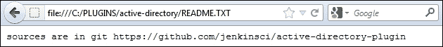

本地文件系统的更改无法通过此插件监视。如果重新配置作业指向位置`file:///`，您将收到以下错误消息：

```
java.lang.ClassCastException: sun.net.www.protocol.file.FileURLConnection cannot be cast to java.net.HttpURLConnection

```

您将不得不使用文件系统 SCM 插件。

## 另请参阅

+   *启动时触发事件*的方法

# 回顾三个 ListView 插件

Jenkins 首页放射出的信息很重要。您对项目质量的最初感知可能会通过这次初次接触来评判。

在这个示例中，我们将回顾可以添加到列表视图中的**最后成功**、**最后失败**和**最后持续时间**列，如下面的截图所示：

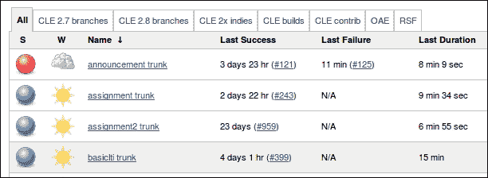

在下一个示例中，您将学习如何为列表视图编写自己的列插件。

## 准备就绪

安装 List View Columns 插件；最后失败版本列插件（[`wiki.jenkins-ci.org/display/JENKINS/Last+Failure+Version+Column+Plugin`](https://wiki.jenkins-ci.org/display/JENKINS/Last+Failure+Version+Column+Plugin)）；最后成功描述列插件（[`wiki.jenkins-ci.org/display/JENKINS/Last+Success+Description+Column+Plugin`](https://wiki.jenkins-ci.org/display/JENKINS/Last+Success+Description+Column+Plugin)）；以及最后成功版本列插件（[`wiki.jenkins-ci.org/display/JENKINS/Last+Success+Version+Column+Plugin`](https://wiki.jenkins-ci.org/display/JENKINS/Last+Success+Version+Column+Plugin)）。

## 如何操作...

1.  在选择的目录中将源代码安装到本地：

    ```
    git clone https://github.com/jenkinsci/lastfailureversioncolumn-plugin
    git clone https://github.com/jenkinsci/lastsuccessversioncolumn-plugin
    git clone https://github.com/jenkinsci/lastsuccessdescriptioncolumn-plugin

    ```

1.  在 Jenkins 中，创建一个名为 `ch7.plugin.lastview` 的新的自由样式作业。不需要进一步的配置。

1.  在主页面上，点击 **All** 选项卡旁边的 **+** 选项卡，如下图所示：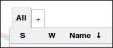

1.  创建一个名为 `LAST` 的 **列表视图**。

1.  在 **作业过滤器** | **作业** 下勾选 **ch7.plugin.lastview** 复选框：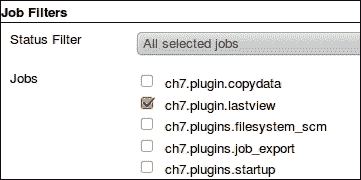

1.  点击 **确定**。您将返回到显示 **LAST** 列表视图的主页面：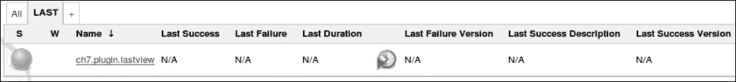

1.  按下 **构建** 图标以运行 `ch7.plugin.lastview` 作业：

1.  刷新页面。**最后成功版本** 列现在有了数据，并附带构建历史的链接。

1.  在 **最后成功说明** 列中，点击 **N/A** 链接。

1.  在右侧，点击 **添加描述**。

1.  为构建添加描述：**这是我的精彩描述**。

1.  点击 **提交**。

1.  通过点击页面顶部显示的面包屑中的 **LAST** 返回到 **LAST** 列表视图，如下图所示：

1.  **最后成功说明** 列现在已经填充：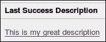

## 工作原理...

这三个插件执行类似的功能；唯一的区别是列的细节稍有不同。细节对于快速决策项目非常有用，例如，当构建成功时，向构建添加描述（例如**将核心库更新为与现代浏览器兼容**）可以让普通查看者了解项目中的最后一个重要操作的概况，而无需深入了解源代码。这样可以节省大量的点击：

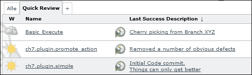

## 更多内容...

这里有大量的 ListView 插件，其中包括：

+   **额外列插件**：添加了计算成功和失败构建数量的选项，一个快捷方式到项目的配置页面，一个**启用/禁用项目**按钮，以及一个项目描述按钮。每个新列都允许您更好地了解项目的状态或更有效地执行操作。

+   **Cron 列插件**：显示项目中计划的触发器以及它们是否启用或禁用。如果您想要比较来自 Melody 插件的系统监视信息，这将非常有用。

+   **Emma Coverage** 插件：显示由 Emma 插件报告的代码覆盖率结果。如果您的组织有内部样式指南，并且代码需要达到特定的代码覆盖率水平，这将特别有用。

+   **进度条插件**：显示正在运行的作业的进度条。这为前台页面增加了一种活动感。

## 另请参阅

+   *创建我的第一个 ListView 插件* 配方

+   第四章, *通过 Jenkins 进行通信* 中的*高效使用视图*配方

+   第四章, *通过 Jenkins 进行通信* 中的*使用 Dashboard View 插件节省屏幕空间*配方

+   第一章, *维护 Jenkins* 中的*通过 JavaMelody 进行监控*配方

# 创建我的第一个 ListView 插件

在最后一个配方中，您将创建您的第一个自定义 ListView 插件。这允许您向标准列表视图添加一个额外的列，其中包含注释。列的内容代码是一个占位符，只等着您用自己的精彩实验替换它。

## 准备就绪

创建一个准备好的代码目录。

## 操作方法...

1.  创建一个顶级`pom.xml`文件，内容如下：

    ```
    <artifactId> rootaction</artifactId>
      <version>1.0-SNAPSHOT</version>
      <packaging>hpi</packaging>
       <name>Jenkins Root Action Plugin</name>
    <?xml version="1.0"?>
    <project 

    xsi:schemaLocation="http://maven.apache.org/POM/4.0.0
    http://maven.apache.org/maven-v4_0_0.xsd">
    <modelVersion>4.0.0</modelVersion>
    <parent>
         <groupId>org.jenkins-ci.plugins</groupId>
         <artifactId>plugin</artifactId>
         <version>1.548</version>
    </parent>
      <artifactId>rootaction</artifactId>
      <version>1.0-SNAPSHOT</version>
      <packaging>hpi</packaging>
       <name>Jenkins Root Action Plugin</name>
      <repositories>
        <repository>
          <id>repo.jenkins-ci.org</id>
          <url>http://repo.jenkins-ci.org/public/</url>
        </repository>
      </repositories>
      <pluginRepositories>
        <pluginRepository>
          <id>repo.jenkins-ci.org</id>
          <url>http://repo.jenkins-ci.org/public/</url>
        </pluginRepository>
      </pluginRepositories>
     <properties>
    <project.build.sourceEncoding>UTF-8</project.build.sourceEncoding>
      </properties>
    </project>
    ```

1.  创建目录`src/main/java/jenkins/plugins/comments`。

1.  在 comments 目录中，添加`CommentsColumn.java`，其内容如下：

    ```
    package jenkins.plugins.comments;
    import org.kohsuke.stapler.StaplerRequest;
    import hudson.views.ListViewColumn;
    import net.sf.json.JSONObject;
    import hudson.Extension;
    import hudson.model.Descriptor;
    import hudson.model.Job;

      public class CommentsColumn extends ListViewColumn {
        public String getFakeComment(Job job) {
          return "Comments for <em>"+job.getName()+"</em>"+
          "Short URL: <em>"+job.getShortUrl()+"</em>";
        }

        @Extension
        public static final Descriptor<ListViewColumn> DESCRIPTOR = new DescriptorImpl();
        public Descriptor<ListViewColumn> getDescriptor(){
          return DESCRIPTOR;
        }

        private static class DescriptorImpl extends Descriptor<ListViewColumn> {
          @Override
          public ListViewColumn newInstance(StaplerRequest req,
          JSONObject formData) throws FormException {
          return new CommentsColumn();
        }
        @Override
        public String getDisplayName() {
          return "FakeCommentsColumn";
        }
      }
    }
    ```

1.  创建目录`src/main/resources/jenkins/plugins/comments/CommentsColumn`。

1.  在`CommentsColumn`目录中，添加`column.jelly`，其内容如下：

    ```
    <j:jelly >
      <j:set var="comment" value="${it.getFakeComment(job)}"/>
      <td data="${comment}">${comment}</td>
    </j:jelly>
    ```

1.  在`CommentsColumn`目录中，添加`columnHeader.jelly`，其内容如下：

    ```
    <j:jelly >
      <th>${%Fake Comment}</th>
    </j:jelly>
    ```

1.  在`CommentsColumn`目录中，添加`columnHeader.properties`，其内容如下：

    ```
    Fake\ Comment=My Fake Column [Default]
    ```

1.  在`CommentsColumn`目录中，添加`columnHeader_an.properties`，其内容如下：

    ```
    Fake\ Comment=My Fake Column [an]
    ```

1.  在`src/main/resources`目录中，添加插件描述文件`index.jelly`，其内容如下：

    ```
    <div>
      This plugin adds a comment to the sections mentioned in list view.
    </div>
    ```

1.  在顶级目录中，运行以下命令：

    ```
    mvn -Dmaven.test.skip=true clean install hpi:run -Djetty.port=8090

    ```

1.  访问 Jenkins 作业创建页面：`http://localhost:8090/jenkins/view/All/newJob`。创建一个名为`ch7.plugin.l`的新自由样式作业。

1.  在 Jenkins 的主页面，`http://localhost:8090/jenkins`，现在将有一个名为**我的假栏 [默认]**的列视图。如果您将 web 浏览器的首选语言更改为**阿拉贡语 [an]**，那么该列现在将被称为**我的假栏 [an]**，如下面的屏幕截图所示：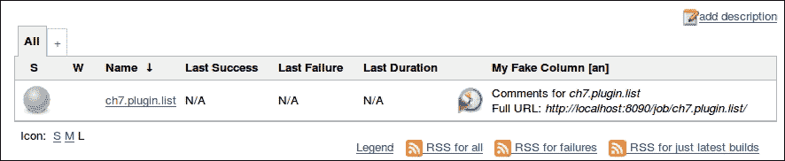

在 Ubuntu 的默认 Firefox 浏览器中，您可以在**编辑/首选项**内容选项卡下的**语言**部分更改首选语言，如下面的屏幕截图所示：

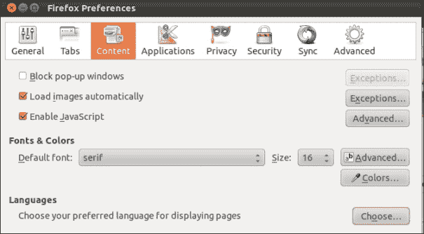

## 工作原理...

在这个配方中，创建了一个基本的 ListView 插件，具有以下结构：

```
├── pom.xml
└── src
 └── main
 ├── java
 │   └── jenkins
 │       └── plugins
 │           └── comments
 │               └── CommentsColumn.java
 └── resources
 ├── index.jelly
 └── jenkins
 └── plugins
 └── comments
 └── CommentsColumn
 ├── columnHeader_an.properties
 ├── columnHeader.jelly
 ├── columnHeader.properties
 └── column.jelly

```

插件中包含的一个 Java 文件是`CommentsColumn.java`，位于`/src/main/java/jenkins/plugins/comments`下。该类扩展了`ListViewColumn`扩展点。

方法`getFakeComment`期望输入类型为`Job`并返回一个字符串。此方法用于填充列中的条目。

在 ListView 中 GUI 是在 `/src/main/resources/packagename/Classname/` 下定义的。你可以找到 `/src/main/java/jenkins/plugins/comments/CommentsColumn.java` 对应到 `/src/main/resources/Jenkins/plugins/comments/CommentsColumn` 目录的 GUI。在这个目录中，有两个 Jelly 文件 `columnHeader.jelly` 和 `column.jelly`。

正如其名称所示，`columnHeader.jelly` 渲染了 ListView 中列的标题。其内容如下：

```
<j:jelly >
  <th>${%Fake Comment}</th>
</j:jelly>
```

`FAKE Comment` 在 `columnHeader.properties` 中定义。`%` 符号告诉 Jelly 根据 web 浏览器返回的语言设置值查找不同的属性文件。在这个示例中，我们将 web 浏览器的语言值设置为 `an`，这会首先查找 `columnHeader_an.properties` 文件。如果 web 浏览器返回的语言没有自己的属性文件，那么 Jelly 将默认使用 `columnHeader.properties`。

`columns.jelly` 的内容如下：

```
<j:jelly >
  <j:set var="comment" value="${it.getFakeComment(job)}"/>
  <td data="${comment}">${comment}</td>
</j:jelly>
```

`it.getFakeComment` 调用了 `CommentsColumn` 类的 `getFakeComment` 方法。这是对象实例的默认名称。返回的对象类型是按约定定义的，文件结构/`src/main/resources/Jenkins/plugins/comments/CommentsColumn`。

返回的字符串被放置在变量 `comment` 中，然后显示在 `<td>` 标签中。

### 注意

如果你对 Jenkins 中可用的 Jelly 标签感兴趣，请参阅 [`wiki.jenkins-ci.org/display/JENKINS/Understanding+Jelly+Tags`](https://wiki.jenkins-ci.org/display/JENKINS/Understanding+Jelly+Tags)。

## 还有更多...

如果你想参与社区活动，那么治理页面是必读的（[`wiki.jenkins-ci.org/display/JENKINS/Governance+Document`](https://wiki.jenkins-ci.org/display/JENKINS/Governance+Document)）。关于许可证的问题，该页面说明了：

*核心完全采用 MIT 许可证，因此大多数基础设施代码（运行项目本身的代码）和许多插件也是如此。我们鼓励托管的插件使用相同的 MIT 许可证，以简化用户的操作，但插件可以自行选择许可证，只要它是 OSI 批准的开源许可证即可。*

你可以在 [`opensource.org/licenses/alphabetical`](http://opensource.org/licenses/alphabetical) 找到已批准的 OSI 许可证列表。

大多数插件的顶级目录中都有一个 `LICENSE.txt` 文件，采用 MIT 许可证（[`en.wikipedia.org/wiki/MIT_License`](http://en.wikipedia.org/wiki/MIT_License)）。例如，请查看 [`github.com/jenkinsci/lastfailureversioncolumn-plugin/blob/master/LICENSE.txt`](https://github.com/jenkinsci/lastfailureversioncolumn-plugin/blob/master/LICENSE.txt)。其结构类似于以下内容：

```
The MIT License

Copyright (c) 20xx, Name x, Name y…

Permission is hereby granted, free of charge, to any person obtaining a copy of this software and associated documentation files (the "Software"), to deal in the Software without restriction, including without limitation the rights to use, copy, modify, merge, publish, distribute, sublicense, and/or sell copies of the Software, and to permit persons to whom the Software is furnished to do so, subject to the following conditions:

The above copyright notice and this permission notice shall be included in all copies or substantial portions of the Software.
THE SOFTWARE IS PROVIDED "AS IS", WITHOUT WARRANTY OF ANY KIND, EXPRESS OR IMPLIED, INCLUDING BUT NOT LIMITED TO THE WARRANTIES OF MERCHANTABILITY, FITNESS FOR A PARTICULAR PURPOSE AND NONINFRINGEMENT. IN NO EVENT SHALL THE AUTHORS OR COPYRIGHT HOLDERS BE LIABLE FOR ANY CLAIM, DAMAGES OR OTHER LIABILITY, WHETHER IN AN ACTION OF CONTRACT, TORT OR OTHERWISE, ARISING FROM, OUT OF OR IN CONNECTION WITH THE SOFTWARE OR THE USE OR OTHER DEALINGS IN THE SOFTWARE.
```

## 另见

+   *审查三个 ListView 插件* 配方
