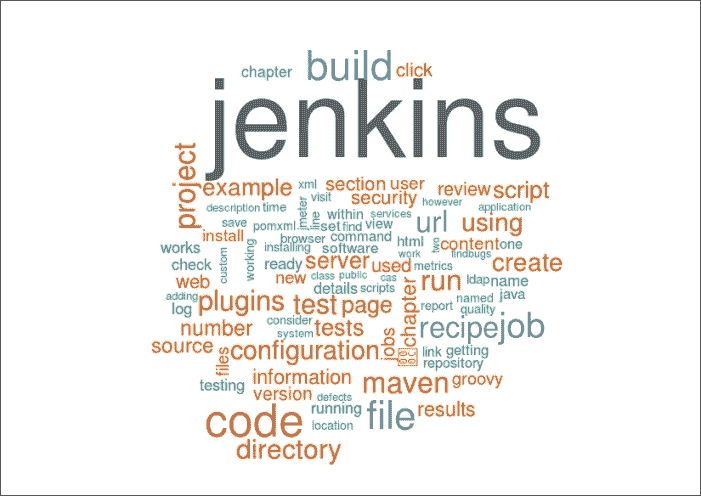
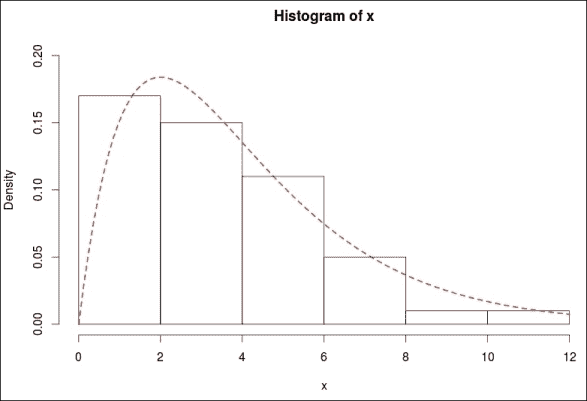
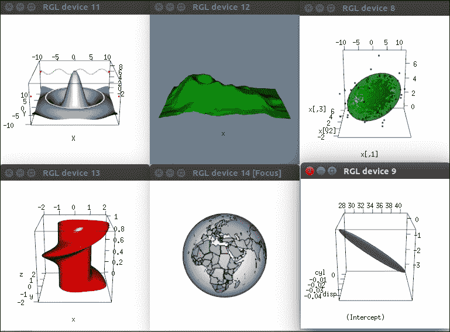

# 附录 A. 提高质量的流程

质量保证要求专家关注各种细节。这些细节与人类行为相关，而不仅仅是技术性的。本章提到了运行成功项目所需的软技能以及本书配方中所规范化的配置技能。以下是一些通过实践获得的观察。

# 早期失败

在软件生命周期的后期纠正问题，成本会更高。尽早失败比之后失败要便宜得多。持续集成允许您自动早期失败。通过插件或连接的云服务添加额外的测试会更有机会早期发现问题，从而提高质量并降低成本。接受问题是一种拥抱，因为这样可以节省时间和金钱。

以下是一些相关资源：

+   在第一章 *Maintaining Jenkins* 中的*通过日志解析有意失败的构建*配方

+   在第六章 *Testing Remotely* 中的*使用 Selenium Webdriver 触发故障安全集成测试* 配方

+   通过项目生命周期的错误成本递增在[`ntrs.nasa.gov/search.jsp?R=20100036670`](http://ntrs.nasa.gov/search.jsp?R=20100036670)

# 数据驱动的测试

如果您使用数据驱动的测试方法，您可以有效地覆盖您的测试范围。例如，在编写 JMeter 测试计划时，您可以使用 CSV 配置元素从文本文件中读取变量。这允许 JMeter 从 CSV 文件中读取参数，例如主机名，并横跨您的基础设施。这使得一个测试计划可以攻击许多服务器。对于 SoapUI 也是如此；通过添加 Excel 数据源并循环遍历行，您可以测试具有许多不同测试用户的应用程序，每个用户都具有一系列角色。数据驱动的测试有一种易于维护的倾向。在重构期间，不需要像应用程序中的 URL 一样更改测试计划，可以将 URL 因素化为 CSV 文件。

以下是一些相关资源：

+   在第六章 *Testing Remotely* 中的*创建 JMeter 测试计划* 配方

+   在第六章 *Testing Remotely* 中的*使用 SoapUI 编写测试计划* 配方

+   在第六章 *Testing Remotely* 中的*用于从属节点的自定义设置脚本* 配方

+   在第六章 *Testing Remotely* 中的*使用 Apache JMeter 测试云应用程序* 配方

+   使用 SoapUI 进行数据驱动方法的测试，[`www.soapui.org/Data-Driven-Testing/functional-tests.html`](http://www.soapui.org/Data-Driven-Testing/functional-tests.html)

# 历史教训

团队往往有自己的编码习惯。如果项目因代码质量而失败，请尝试弄清楚哪些代码指标会阻止代码达到生产环境。哪些错误经常出现？看看以下例子：

+   **周五下午的代码失效**：我们都是人，都有次要议程。到了一周的末尾，程序员可能把注意力放在代码之外的地方。一小部分程序员会受到影响，他们的代码质量会受到影响，而在排班的最后阶段会不断注入更多的缺陷。考虑安排一个每周执行的 Jenkins 作业，在注意力最不集中的时间附近设置更严格的质量指标阈值。

+   **代码变动**: 在将产品从验收环境移至产品环境之前，代码提交突然激增表明存在最后一刻的匆忙。对于一些有着较强代码质量意识的团队来说，这也是额外警惕的迹象。对于其他纪律性较差的团队来说，这可能是朝着毁灭的天真推进。如果项目失败，QA 因代码变动激增而不堪重负，请考虑根据提交速度设置一个警告 Jenkins 作业。如有必要，您可以展示您自己的定制指标。有关更多信息，请参阅 第三章 中的 *构建软件* 中的 *在 Jenkins 中绘制替代代码指标* 配方。

+   **一个流氓程序员**：并非所有开发者都能创造出统一高质量的代码。在一个项目中可能存在持续的表现不佳情况。流氓程序员会被人工代码审查发现。然而，作为第二道防线，考虑在 FindBugs 和 PMD 的静态代码审查报告中设置阈值。如果某个开发者没有遵循接受的做法，构建将会以极高的频率失败。有关更多信息，请参阅 第五章 中的 *使用指标提高质量* 中的 *使用 FindBugs 查找错误* 配方。

+   **GUI 没有意义**: 当您构建一个 Web 应用程序，最后时刻却被告知 GUI 与产品所有者预期的交互方式不太一样时，这不是很痛苦吗？一个解决方案是在 FitNesse 中编写一个模型，并用夹具将其包围起来进行自动功能测试。当 GUI 与计划的工作流程不符时，那么 Jenkins 将开始大声喊叫。有关更多信息，请参阅 第六章 中的 *远程测试* 中的 *激活 FitNesse HtmlUnit 夹具* 配方。

+   **跟踪责任**：错误总会发生，需要吸取教训。然而，如果没有清晰的责任链条记录，很难确定谁需要学习机会。一种方法是通过一系列连接的任务来构建 Jenkins 中的工作流程，并使用推广构建插件确保正确的团队在正确的时点进行验证。这种方法也适用于提醒团队完成短期任务。有关更多信息，请参阅第七章中的*测试然后推广构建*配方，*探索插件*。

# 将测试自动化视为一个软件项目

如果您将自动化测试视为一个软件项目，并应用已知原则，那么您将节省维护成本并提高测试的可靠性。

**不要重复自己**（**DRY**）原则是一个很好的例子。在时间压力下，从代码库的一个区域复制并粘贴类似的测试是诱人的：不要这样做。项目发展会扭曲代码库的形状；测试需要可重用以适应这种变化。脆弱的测试会增加维护成本。一个具体的例子是在第六章中简要讨论的，*远程测试*，就是使用 Selenium WebDriver 的页面对象。如果将代码分开成页面，那么当页面之间的工作流程发生变化时，大部分测试代码仍然保持不变。

有关更多信息，请参阅第五章中的*激活更多 PMD 规则集*配方，*使用指标提高质量*。

**保持简单愚蠢**（**KISS**）原则意味着尽可能地保持项目的每个方面简单。例如，可以使用真实的浏览器进行自动化功能测试，也可以使用 HtmlUnit 框架模拟浏览器。第二种选择避免了设置内存中的 X 服务器或 VNC（[`en.wikipedia.org/wiki/Virtual_Network_Computing`](http://en.wikipedia.org/wiki/Virtual_Network_Computing)）的需要，并且还会跟踪浏览器版本。这些额外的琐事会降低运行 Jenkins 作业的可靠性，但会增加测试的价值。因此，对于小型项目，考虑从 HtmlUnit 开始。对于较大的项目，额外的努力是值得的。有关更详细信息，请参阅第三章中的*使用 Selenium WebDriver 触发 failsafe 集成测试*配方，*构建软件*。

考虑是否需要一个独立的集成服务器，或者是否可以使用 Maven 中的集成目标调用 Jetty 服务器。有关更详细信息，请参阅第三章中的*为集成测试配置 Jetty*配方，*构建软件*。

# 可视化，可视化，可视化

当您拥有由不同团队和个人开发的许多项目散布在多个服务器上时，要理解关键指标和出现的问题是困难的。

80% 的信息通过您的大脑进行视觉处理，并且您的大脑是一个出色的模式识别器，理解底层复杂性的技巧之一是可视化您的 Jenkins 作业结果。

SonarQube 是可视化和获取项目整体质量概览的绝佳起点，并且用于深入研究代码不同领域之间的关系和耦合。有关更多信息，请参阅第五章中的 *将 Jenkins 与 SonarQube 集成* 配方，*使用指标改善质量*。

但是，如果您有专门的需求，您将需要构建图形生成。测试结果通常以 XML 或 CSV 格式存储。一旦积累了结果，您可以使用您选择的语言轻松地转换它们。

R 是专为统计学家和科学家设计的语言。数据收集后，会尝试探索哪些变量是相关的。为此，R 社区创建了许多辅助图形包。有关详细信息，请参阅第五章中的 *使用 R 插件分析项目数据* 配方，*使用指标改善质量*。

以下图形是总结本书内容的词云。在 10 行代码内，R 语言生成了它。R 使用 `tm` 和 `wordcloud` 包的组合。您可以从本书的网站下载代码。



R 中的图形库展示了令人瞩目的成果示例。将`example()`命令置于您选择的函数周围，基于该函数运行示例代码。以下代码显示了`plot`和`hist`图形函数的图形。代码包含在图形中：

```
example(plot)
example(hist)

x <- rchisq(100, df = 4)
hist(x, freq = FALSE, ylim = c(0, 0.2))
curve(dchisq(x, df = 4), col = 2, lty = 2, lwd = 2, add = TRUE)

```

一旦您发现了一个新的有趣函数，您可以通过搜索文档进一步探索其帮助。例如，键入 `?rchisq` 将输出以下信息：

`密度、分布函数、卡方分布（chi²）的分位函数和随机生成具有 df 自由度和可选非中心参数 ncp 的卡方分布。`

有关更多信息，请参阅第四章中简化 *使用 R 插件进行强大的可视化* 配方，*通过 Jenkins 进行通信*。

下图显示了`hist`函数生成的图形：



`rgl` 包具有生成引人注目图形的广泛功能。

要从 Ubuntu 命令行安装 `rgl` 包及其依赖项，请键入以下命令：

```
sudo apt-get install r-cran-rgl

```

要查看一些示例，请从 R 控制台运行以下命令：

```
library(rgl)
example(plot3d)
example(ellipse3d)
example(surface3d)
example(persp3d)

```

你会看到类似以下截图的输出：



以下是一些相关资源：

+   官方 R 包的完整列表在[`cran.r-project.org/web/packages/available_packages_by_name.html`](http://cran.r-project.org/web/packages/available_packages_by_name.html)

+   [rgl](http://cran.r-project.org/web/packages/rgl/rgl.pdf)包的文档

+   [tm](http://cran.r-project.org/web/packages/tm/tm.pdf)包的文档

+   [wordcloud](http://cran.r-project.org/web/packages/wordcloud/wordcloud.pdf)包的文档

# 约定是好的

遵循约定，你会减少维护量并降低代码中隐藏的缺陷数量。当有多个开发人员参与编写代码时，编码约定尤为重要。约定有助于可读性。一致缩进的代码会让人注意到编写不好的部分。良好结构化的变量名有助于避免组织不同部分编写的代码之间的命名冲突。命名中的结构突出了以后可以移动到配置文件中的数据，并增加了使用正则表达式进行半自动重构的机会，例如，你可以编写一小段 R 代码来可视化每个模块的全局变量数量。全局变量越多，多个用途使用相同变量的风险就越大。因此，图表是代码质量的一个粗略指标。

以下是一些相关资源：

+   第一章中的*通过日志解析故意失败的构建*配方，*维护 Jenkins*

+   第三章中的*在 Jenkins 中绘制替代代码度量*配方，*构建软件*

+   第五章中的*创建自定义 PMD 规则*配方，*使用度量来提高质量*

+   Java 程序员的谷歌代码约定在[`google-styleguide.googlecode.com/svn/trunk/javaguide.html`](https://google-styleguide.googlecode.com/svn/trunk/javaguide.html)

+   GCC 项目的编码和命名约定在[`gcc.gnu.org/codingconventions.html`](https://gcc.gnu.org/codingconventions.html)

# 测试框架和商业选择不断增加

在过去几年中，测试自动化方面取得了很多进展。一个例子是静态代码审查被更全面地用于安全检查。SonarQube 是一个全面报告项目质量的工具，新框架正在出现以改进旧框架。以下是一些含义：

+   **SonarQube**: 这可以衡量项目质量。其社区活跃。SonarQube 将比 Jenkins 的全部质量度量插件更快地发展。考虑使用 Jenkins 插件来提前警告负面质量变化，使用 SonarQube 进行深度报告。有关更多信息，请参阅 第五章 *使用指标改进质量* 中的 *将 Jenkins 与 SonarQube 集成* 配方。

+   **静态代码审查工具**: 这些正在改进。FindBugs 已将评论功能移到云中。正在开发更多的错误模式检测器。静态代码审查工具在查找安全性缺陷方面变得更加出色。随着时间的推移，您可能会期望显着改进的工具，可能只需更新当前工具的版本即可。有关更多详细信息，请参阅 第五章 *使用指标改进质量* 中的 *使用 FindBugs 查找安全性缺陷* 配方

+   **代码搜索**: 如果代码搜索引擎根据缺陷密度或编码实践在其搜索结果中对特定代码片段的位置进行排名，那不是很好吗？然后，您可以搜索广泛的开源产品以找到最佳实践。您可以搜索缺陷以删除，然后将补丁发送回代码的社区。

+   **云**: CloudBees 允许您在云中创建按需的从节点。预计在 Jenkins 周围会有更多类似云的集成。

有关 SonarQube 功能和 CloudBees 云服务的更多信息，请访问 [`www.sonarqube.org/features/`](http://www.sonarqube.org/features/) 和 [`www.CloudBees.com/products/dev`](http://www.CloudBees.com/products/dev)。

# 将工作分配到 Jenkins 节点

由于其丰富的插件，Jenkins 可以轻松连接到许多类型的系统。因此，在组织中，Jenkins 的使用可能会像病毒一样扩散。测试和 JavaDoc 生成会占用系统资源。最好使用主 Jenkins 快速报告分布在一系列 Jenkins 节点上的作业。这种方法使得更容易分析失败在基础架构中的位置。

如果您在规模上使用 JMeter 进行性能测试，请考虑将其从 Jenkins 转移到诸如 BlazeMeter ([`blazemeter.com/`](http://blazemeter.com/)) 等云服务。

对于使用 Selenium 进行功能测试，也有许多云服务可供选择。考虑使用它们不仅仅是因为负载，还因为它们提供了广泛的浏览器类型和版本。一个商业服务的例子是 Sauce Labs ([`saucelabs.com/`](https://saucelabs.com/))。定期审查市场以了解新的云服务是值得的。

以下是一些相关资源：

+   在第一章 *维护 Jenkins* 中的 *通过 JavaMelody 进行监控* 配方

+   *创建多个 Jenkins 节点* 在第六章中的*Testing Remotely*食谱中

+   *自定义从属节点的设置脚本* 在第六章中的*Testing Remotely*食谱中

# 使 QA/集成服务器处于饥饿状态

几百年前，煤矿工人会因矿井中甲烷和一氧化碳的积聚而死亡。为了提前警告这种情况，人们在矿井中引入了金丝雀。由于它们更加敏感，鸟类会首先晕倒，给矿工足够的时间逃脱。考虑在您的验收环境中为集成服务器采取同样的做法：故意使它们资源匮乏。如果它们崩溃了，您将有足够的时间进行审查，然后看着生产中的爆炸。

要了解更多信息，请参考第一章中的*通过 JavaMelody 进行监控*食谱，*Maintaining Jenkins*。

## 阅读 Jenkins 的变更日志

Jenkins 践行其所宣扬的。次要版本号发布大约每周一次。新功能出现，错误被解决，新错误被引入。一般来说，绝大多数的变更都会带来改进，但也有少数不会。然而，一旦引入，错误通常会很早被发现并迅速被修复。

在更新 Jenkins 以获取新功能和潜在稳定性故障之前，值得阅读变更日志（[`jenkins-ci.org/changelog`](http://jenkins-ci.org/changelog)）。偶尔，您可能希望因安全问题而加快部署到生产环境的速度，或者由于稳定性失误而错过某个版本。

### 注意

如果您专注于稳定性而不是功能丰富性，请考虑使用更老但更稳定的长期支持版本。更多详细信息请访问：[`wiki.jenkins-ci.org/display/JENKINS/LTS+Release+Line`](https://wiki.jenkins-ci.org/display/JENKINS/LTS+Release+Line)。

# 避免人为瓶颈

您的测试环境越简单，维护所需的技能就越少。随着您学习使用插件并探索新工具和脚本语言的潜力，组织需要维护稳定系统的知识越多。如果您希望在没有随机短信请求建议的情况下度假，请确保您的知识已传递至少给第二人。这听起来很明显，但在您日常工作的忙碌中，这个原则经常被遗忘或搁置一边。

共享知识的最简单方法之一是让几名开发人员一起参加同一场会议和活动（[`www.CloudBees.com/company/events/juc`](https://www.CloudBees.com/company/events/juc)）。

这就是经理在知识传播中发挥重要作用的地方。他们需要及时计划和活动，以便分享知识，而不是期望它会以魔术般的方式发生。

# 避免群体思维

在纸上变得完美很容易，定义了一套完整的 JavaDocs 和单元测试的重要性。然而，现实世界在最好的日子里也是混乱的。由于需要交付而产生的项目动力是一股难以抵御的力量。

与项目动力相关的是项目团队或资源所有者可能发生的群体思维现象。如果团队有错误的集体态度，作为质量保证专业人员，注入已经学到的现实主义会更加困难。质量保证不仅仅是尽早发现和捕获缺陷，还要在项目周期的不同阶段注入客观的成功或失败标准。

考虑将可衡量的标准添加到 Jenkins 构建中。显然，如果代码无法编译，则产品不应提交给验收和生产。不太明显的是，关于单元测试代码覆盖率的规则是否值得在发布管理会议上辩护？

在项目开始之前让整个团队参与，并在任何编码之前就达成一致，同意构建失败的度量标准。一种方法是将一个小成功项目与一个小失败项目进行比较。如果后来发生争议，那么争论的焦点就是流程和数字，而不是个性。

更多信息，请参阅 第五章 *使用指标提高质量* 中的 *通过代码覆盖寻找“有味道的代码”* 配方。

# 培训和社区

参与 Jenkins 和更广泛的测试人员社区的培训对于通向优化环境的长期学习路径至关重要。以下是一些相关资源：

+   CloudBees 是一家与 Jenkins 云服务合作的商业公司。在撰写本书时，CloudBees 的首席技术官是 Jenkins 的创始人 Kawaguchi Kohsuke。CloudBees 提供了许多培训机会和会议活动。该公司的培训信息可在[`www.CloudBees.com/jenkins/training`](http://www.CloudBees.com/jenkins/training)找到。

+   当开始参与在线社区时，首先审查并参与邮件列表是明智的选择。这样可以评估自己的水平，并逐渐被认可。邮件列表总结在[`jenkins-ci.org/content/mailing-lists`](http://jenkins-ci.org/content/mailing-lists)。一旦你有信心可以有效参与，请考虑通过 IRC 频道实时交流，链接在[`wiki.jenkins-ci.org/display/JENKINS/IRC+Channel`](https://wiki.jenkins-ci.org/display/JENKINS/IRC+Channel)。

+   ISTQB 软件认证机构在其网站上为软件测试人员考试提供示例文档。你可以在[`www.istqb.org/downloads.html`](http://www.istqb.org/downloads.html)找到这些文档。

+   Kohsuke Kawaguchi 解释参与漏斗作为构建社区方法的幻灯片可在 [`www.slideshare.net/kohsuke/building-developer-community`](http://www.slideshare.net/kohsuke/building-developer-community) 上找到。

# 对成功开发者进行可见的奖励

这是一个对资源经理的呼吁。开发人员和测试人员专门从事有时很难向不了解他们问题领域的人解释的技术问题。要达到最高水平的专业知识，并跟踪趋势需要时间（有时是他们自己的很多时间）、精力和动力。削弱他们的动力或低估建立技能所需的时间最终将降低产品的质量，并且最终会花费更多。考虑一下你可以做些什么来支持他们，从工资水平的跳跃、学习路径、为开发人员保留时间阅读和实践新想法，到会议和小工具。例如，在加薪之后，Kickstarter（[`www.kickstarter.com/`](https://www.kickstarter.com/)）是一个很好的地方，可以寻找激励性的奖励，并激发开发人员的创造力。

最后，不要让开发人员做非开发性的工作。一般来说，他们需要高度专注于理解详细的需求，并将其转化为牢固的代码的复杂任务。

# 稳定性和代码维护

本书提到了许多插件和一些语言和测试工具。在开发中进行实验然后推向验收是可以的，但是在生产中拥有更多的多样性，需要更多的技能来维护，尤其是编写流畅的工作流。微妙的选择，比如将 Jenkins 插件固定在已知版本，并且将 Jenkins 服务器的生产版本稳定在固定时间段内，有助于提高上线时间。同样重要的是，监控负载并将大部分工作远离主 Jenkins，确保工作的时序性。

限制工作维护意味着保持配置的简单和相似。在一个具有高度多样性的复杂组织中，这是不现实的。采用测试驱动的方法是有帮助的；惯例也简化了配置。随着多样性的增加，沟通和达成惯例变得重要。简单的策略——比如一份文档智慧的源头（例如，一个共同的维基），定期的经验总结会议，以及每周的回顾——变得至关重要。

# 质量保证资源

认为测试是测试人员的唯一责任是错误的。程序员应该对他们的代码质量负责，架构师应该对他们的设计质量负责，管理人员应该对项目的精神和项目规划负责，等等。以下是一些实用的资源范例，涵盖了可行的质量保证领域——这不仅仅是为了测试人员：

+   关于避免经过多年的艰辛和挫折的经典错误的许多明智的话语。其中一组深思熟虑的评论可以在[`www.exampler.com/testing-com/writings/classic/mistakes.html`](http://www.exampler.com/testing-com/writings/classic/mistakes.html)找到。

+   如果单元测试充分覆盖了你的代码，那么如果你在更新过程中破坏了一段代码，你将在下一次构建过程中迅速发现这一点。JUnit 可以说是这个领域中最著名的框架。你可以在[`junit.org/`](http://junit.org/)找到该框架的主页。

+   Jenkins 主页（[`jenkins-ci.org/`](http://jenkins-ci.org/)）涵盖了大量关于配置、插件、社区、提示和技巧的实用信息。

+   **开放式网络应用安全项目**（**OWASP**）是一个关于安全测试的信息和工具的重要来源。OWASP 致力于提高软件的安全性。其使命是使软件安全可见，以便全球个人和组织能够就真实的软件安全风险做出知情决策。你可以在[`www.owasp.org/index.php/Main_Page`](https://www.owasp.org/index.php/Main_Page)找到 OWASP 的主页。

+   如果你想要 OWASP 材料的实体书或电子书，你可以从 Lulu（[`www.lulu.com/spotlight/owasp`](http://www.lulu.com/spotlight/owasp)）下载或购买。

+   你可以在[`www.owasp.org/index.php/OWASP_Testing_Guide_v4_Table_of_Contents`](https://www.owasp.org/index.php/OWASP_Testing_Guide_v4_Table_of_Contents)找到 OWASP 的安全测试指南。

+   一个流行的商业公司销售云端 Jenkins 基础设施的例子是 Sauce Labs（[`docs.saucelabs.com/ci-integrations/jenkins/`](https://docs.saucelabs.com/ci-integrations/jenkins/)）。

+   有许多优秀的免费软件测试杂志可供下载。专业测试员就是其中之一，可以在[`www.professionaltester.com/`](http://www.professionaltester.com/)找到。

+   uTest 是世界上最大的致力于专业测试员和软件测试的开放社区。它的唯一目的是促进和推进测试专业及从事这项重要工作的人。更多信息，请访问[`www.utest.com/about-us`](http://www.utest.com/about-us)。

+   越来越多的免费 MOOC 课程，其中一些支持软件测试员的学习路径。你可以在[`www.mooc-list.com/`](https://www.mooc-list.com/)找到当前正在运行的 MOOC 课程的完整列表。

+   有数以百计的优秀博客聚焦于测试。马丁·福勒的博客（[`martinfowler.com/`](http://martinfowler.com/)）是一个很好的资源，而 Jenkins 的创始人小冈晃佑还有另一个博客（[`kohsuke.org/`](http://kohsuke.org/)）。

+   静态代码审查允许作业在不需要人工干预的情况下找到各种问题。我在 Free Software Magazine 上撰写的一系列关于静态代码审查的文章可以在[`www.freesoftwaremagazine.com/articles/destroy_annoying_bugs_part_1`](http://www.freesoftwaremagazine.com/articles/destroy_annoying_bugs_part_1)找到。

# 还有更多

总是有更多要考虑的地方。以下是一些精选的内容：

+   **模糊团队边界**：诸如 FitNesse 和 Selenium IDE 等工具使非 Java 程序员编写测试更加容易。编写测试越容易，相关测试捕获用户期望的本质细节的可能性就越大。寻找支持降低学习曲线的工具的新 Jenkins 插件。有关更多信息，请参阅第六章中的 *运行 Selenium IDE 测试* 配方，*远程测试*。

+   **故意添加缺陷**：通过轮流使用 Jenkins 构建，然后故意添加失败的代码，可以测试团队的警觉性和响应时间。

    ### 提示

    **警告**

    在添加缺陷之前，请确保团队已经同意了这个过程，否则你可能会在深夜收到愤怒的电子邮件。

+   **使用链接爬虫和安全扫描器增加代码覆盖率**：模糊器发现正在攻击的应用程序的输入，然后发射意外输入。这不仅对安全测试有好处，而且对边界测试也有好处。如果您的服务器返回意外错误，则使用模糊器触发更彻底的审核。模糊器和链接爬虫是增加测试代码覆盖率的廉价方法。有关更多信息，请参阅第二章中的 *在 Jenkins 中通过模糊测试查找 500 错误和 XSS 攻击* 配方，*增强安全性*。

+   在您的开发环境中，定期查看新的 Jenkin 插件。插件数量正在迅速增加，可能会有新的方式将 Jenkins 连接到组织基础设施的不同部分以进行持续集成。

# 最后评论

Jenkins 与积极的自动化测试的结合构成了对编码项目的坚实安全网络。本书中的配方支持最佳实践。

生成高质量的作品需要高度关注细节。Jenkins 可以关注许多细节，然后在发生违规行为时大声呼喊。

每个项目都是不同的，有许多方法来构建工作流程。幸运的是，有超过 1000 个插件，并且数量迅速增长，Jenkins 足够灵活，可以适应甚至最隐蔽的基础设施。

如果您没有您想要的确切插件，那么对于 Java 程序员来说，自行适应或创建自己的插件是很简单的。

### 注意

没有蓬勃发展的开源 Jenkins 社区，这一切都不可能实现。Jenkins 是开源精神在实践中的又一个积极例证。如果您同意，请考虑参与。
