# 第一章：探索 Jenkins

|   | *"持续的努力——而非力量或智慧——是解锁我们潜能的关键。"* |   |
| --- | --- | --- |
|   | --*温斯顿·丘吉尔* |

Jenkins 是一个用 Java 编写的开源应用程序，它是最受欢迎的**持续集成**（**CI**）工具之一，用于构建和测试各种项目。在本章中，我们将快速概览 Jenkins、其核心特性及其对 DevOps 文化的影响。在我们开始使用 Jenkins 之前，我们需要安装它。本章提供了一个详细的安装指南。安装 Jenkins 非常简单，且与操作系统版本无关。

我们还将学习 Jenkins 的基本配置。我们将快速浏览 Jenkins UI 的一些关键部分和插件安装。本章还将涵盖 DevOps 流水线以及后续章节将如何实现它。

具体来说，本章将讨论以下主题：

+   介绍 Jenkins 及其特性

+   在 Windows 和 CentOS 操作系统上安装 Jenkins

+   快速浏览 Jenkins 仪表板

+   如何在 Jenkins 中更改配置设置

+   什么是部署流水线

各就各位，预备，开始！

# 介绍 Jenkins 及其特性

首先，让我们理解什么是持续集成。CI 是近年来最流行的应用开发实践之一。开发者将错误修复、新功能开发或创新功能集成到代码仓库中。CI 工具通过自动化构建和自动化测试执行来验证集成过程，以检测应用程序当前源代码中的问题，并提供快速反馈。

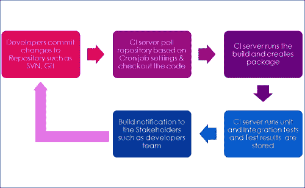

Jenkins 是一个简单、可扩展且用户友好的开源工具，为应用程序开发提供 CI 服务。Jenkins 支持 StarTeam、Subversion、CVS、Git、AccuRev 等 SCM 工具。Jenkins 可以构建 Freestyle、Apache Ant 和 Apache Maven 项目。

插件的概念使 Jenkins 更具吸引力，易于学习且易于使用。有多种类别的插件可用，例如源代码管理、从属启动器和控制器、构建触发器、构建工具、构建通知、构建报告、其他构建后操作、外部站点/工具集成、UI 插件、身份验证和用户管理、Android 开发、iOS 开发、.NET 开发、Ruby 开发、库插件等。

Jenkins 定义了接口或抽象类，这些接口或抽象类模拟了构建系统的一个方面。接口或抽象类定义了需要实现的内容；Jenkins 使用插件来扩展这些实现。

### 注意

要了解更多关于所有插件的信息，请访问 [`wiki.jenkins-ci.org/x/GIAL`](https://wiki.jenkins-ci.org/x/GIAL)。

要了解如何创建新插件，请访问 [`wiki.jenkins-ci.org/x/TYAL`](https://wiki.jenkins-ci.org/x/TYAL)。

要下载不同版本的插件，请访问[`updates.jenkins-ci.org/download/plugins/`](https://updates.jenkins-ci.org/download/plugins/)。

## 功能

Jenkins 是市场上最受欢迎的 CI 服务器之一。其受欢迎的原因如下：

+   在不同操作系统上易于安装。

+   易于升级——Jenkins 的发布周期非常快。

+   简单易用的用户界面。

+   通过使用第三方插件轻松扩展——超过 400 个插件。

+   在用户界面中轻松配置设置环境。还可以根据喜好自定义用户界面。

+   主从架构支持分布式构建，以减轻 CI 服务器的负载。

+   Jenkins 附带围绕 JUnit 构建的测试框架；测试结果以图形和表格形式提供。

+   基于 cron 表达式的构建调度（欲了解更多关于 cron 的信息，请访问[`en.wikipedia.org/wiki/Cron`](http://en.wikipedia.org/wiki/Cron)）。

+   预构建步骤中执行 Shell 和 Windows 命令。

+   与构建状态相关的通知支持。

# 在 Windows 和 CentOS 上安装 Jenkins

1.  前往[`jenkins-ci.org/`](https://jenkins-ci.org/)。在 Jenkins 网站首页找到**下载 Jenkins**部分。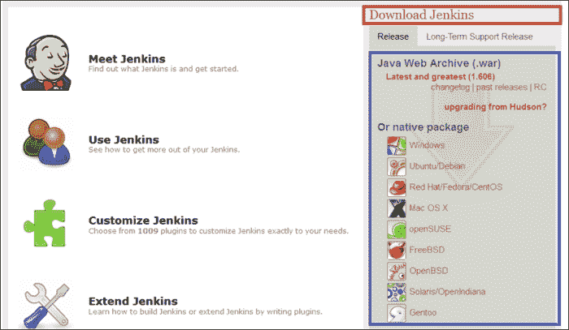

1.  根据您的操作系统下载`war`文件或原生包。运行 Jenkins 需要 Java 安装。

1.  根据您的操作系统安装 Java，并相应地设置 JAVA_HOME 环境变量。

## 在 Windows 上安装 Jenkins

1.  选择适用于 Windows 的原生包。它将下载`jenkins-1.xxx.zip`。在我们的例子中，它将下载`jenkins-1.606.zip`。解压后，您将得到`setup.exe`和`jenkins-1.606.msi`文件。

1.  点击`setup.exe`，并按顺序执行以下步骤。在欢迎屏幕上，点击**下一步**：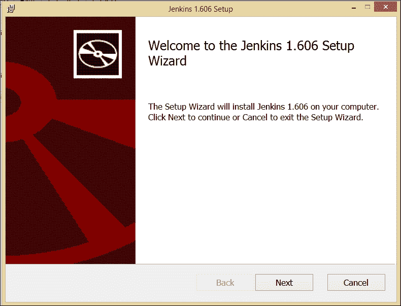

1.  选择目标文件夹并点击**下一步**。

1.  点击**安装**开始安装。请等待安装向导安装 Jenkins。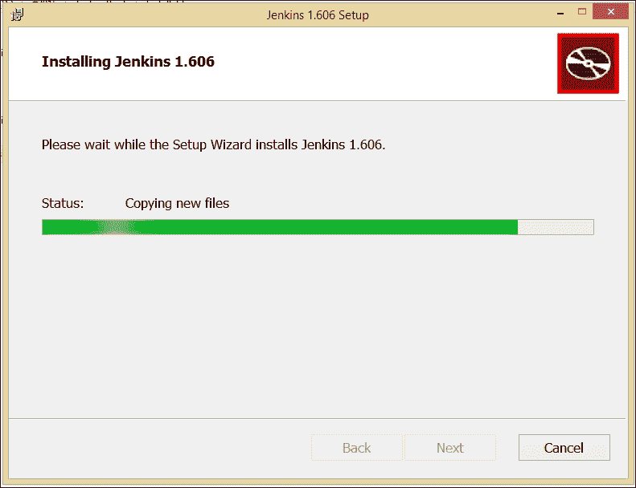

1.  完成 Jenkins 安装后，点击**完成**按钮。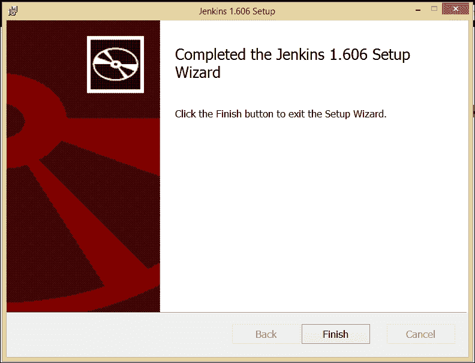

1.  通过在已安装 Jenkins 的系统上打开 URL `http://<ip_address>:8080`来验证 Windows 机器上的 Jenkins 安装。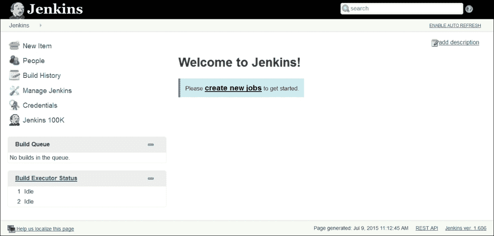

## 在 CentOS 上安装 Jenkins

1.  要在 CentOS 上安装 Jenkins，请将 Jenkins 仓库定义下载到本地系统的`/etc/yum.repos.d/`目录，并导入密钥。

1.  使用`wget -O /etc/yum.repos.d/jenkins.repo http://pkg.jenkins-ci.org/redhat/jenkins.repo`命令下载`repo`。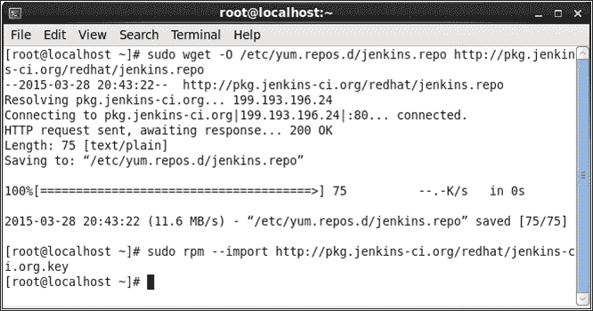

1.  现在，运行`yum install Jenkins`；它将解决依赖关系并提示安装。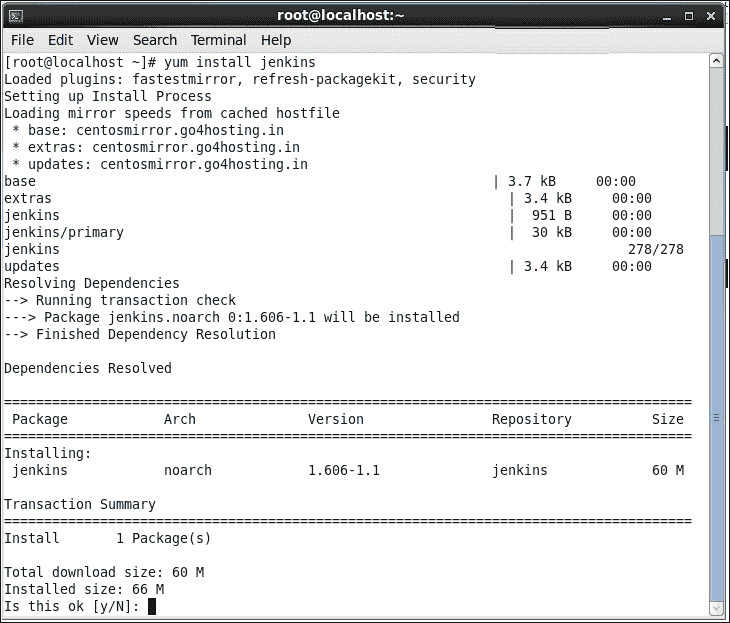

1.  回复`y`，它将下载所需的软件包以在 CentOS 上安装 Jenkins。通过执行`service jenkins status`命令来验证 Jenkins 状态。最初，它将处于停止状态。通过在终端中执行`service jenkins start`来启动 Jenkins。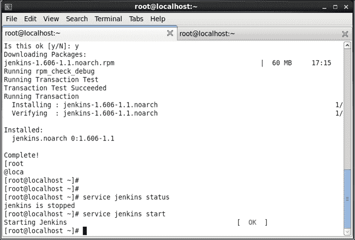

1.  通过在已安装 Jenkins 的系统上打开 URL `http://<ip_address>:8080`来验证 CentOS 机器上的 Jenkins 安装。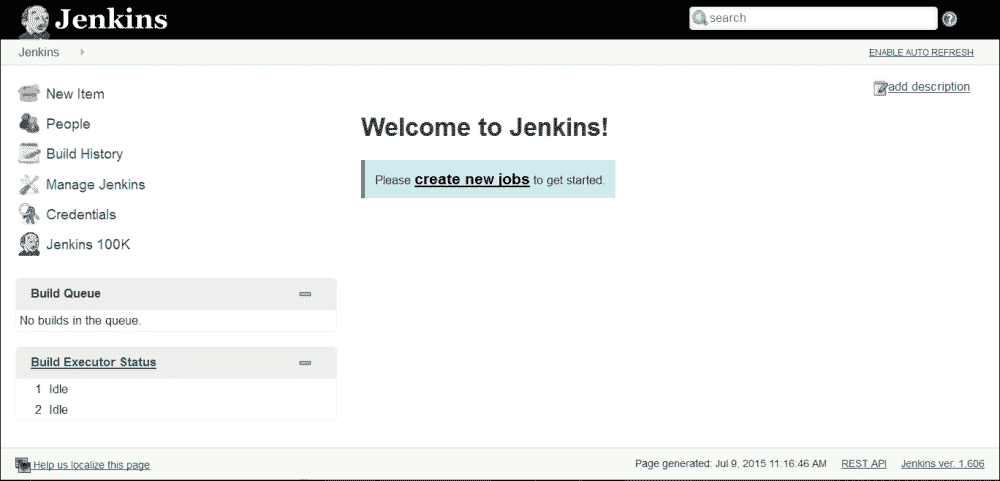

## 将 Jenkins 作为 Web 应用程序安装

1.  从[`jenkins-ci.org/`](http://jenkins-ci.org/)下载**Java Web 档案(.war)**（最新版本(1.606)）。

1.  将`jenkins.war`复制到您的虚拟或物理机中。根据操作系统打开命令提示符或终端。在我们的例子中，我们将它复制到一个 CentOS 虚拟机的目录中。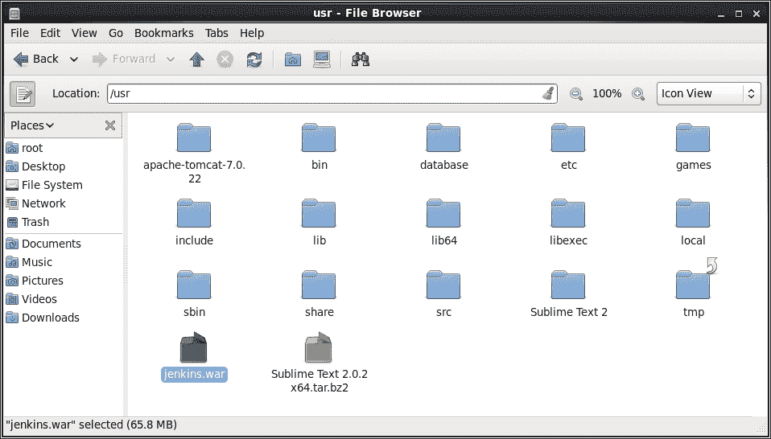

1.  打开命令提示符并执行`java –jar Jenkins.war`命令。通过在已安装 Jenkins 的系统上打开`http://<ip_address>:8080` URL 来验证系统上的 Jenkins 安装。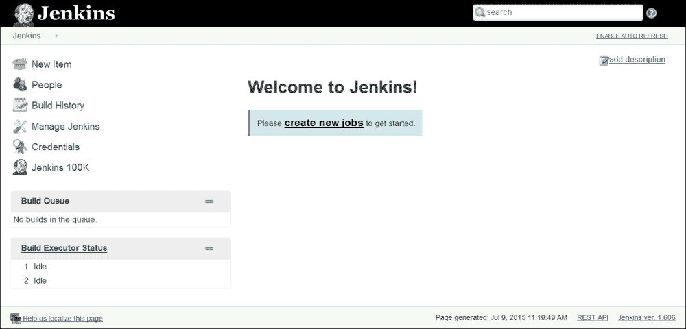

# Jenkins 仪表板的快速入门之旅

1.  在 Jenkins 仪表板上，点击**创建新作业**或**新建项**以创建自由风格或基于 Maven 的 CI 项目。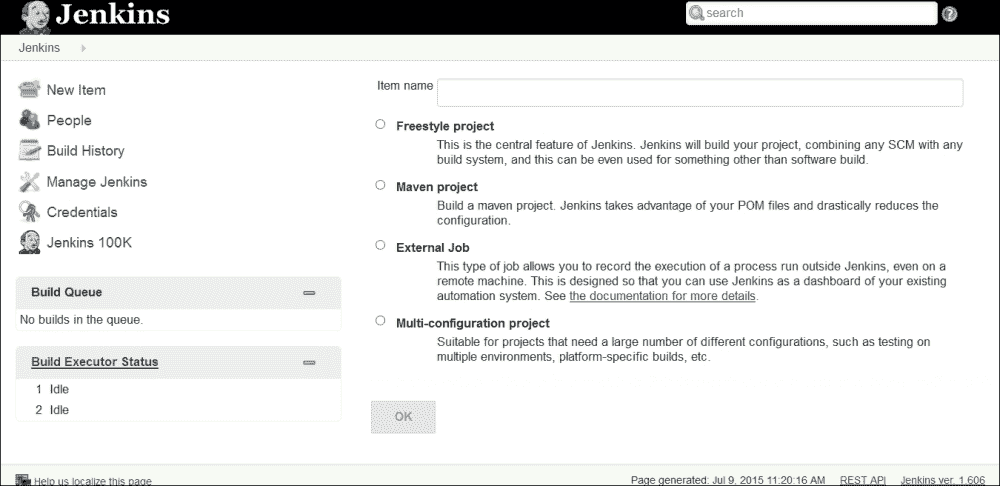

1.  要验证系统属性，请访问`http://<ip_address>:8080/systeminfo`，或点击**管理 Jenkins**，然后点击**系统信息**以获取环境信息以协助故障排除。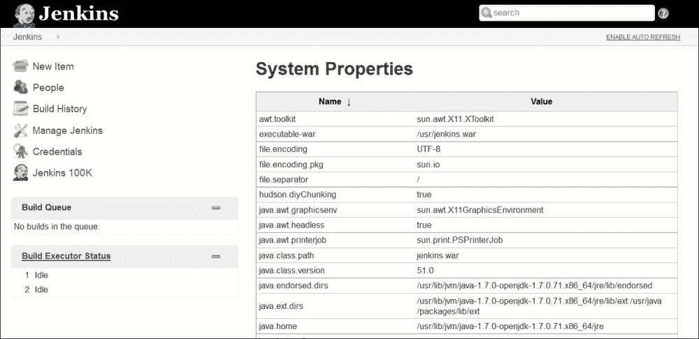

# 如何在 Jenkins 中更改配置设置

1.  点击仪表板上的**管理 Jenkins**链接以配置系统、安全、管理插件、从节点、凭证等。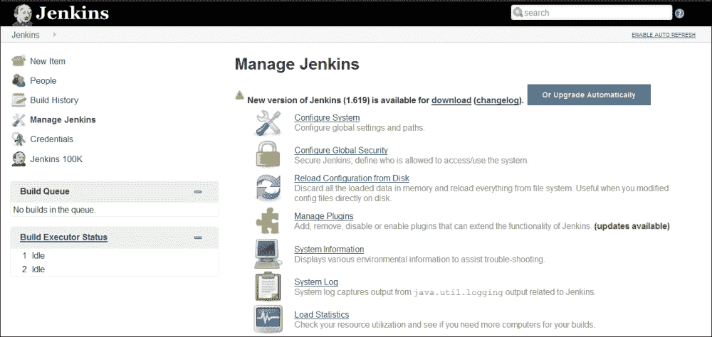

1.  点击**配置系统**链接以配置 Java、Ant、Maven 和其他第三方产品的相关信息。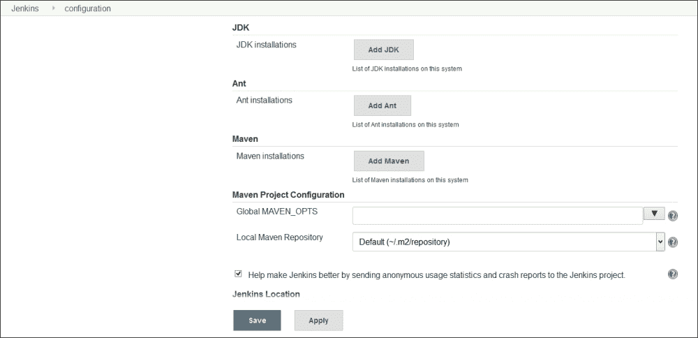

1.  Jenkins 使用 Groovy 作为其脚本语言。要在 Jenkins 仪表板上执行任意脚本进行管理/故障排除/诊断，请前往仪表板上的**管理 Jenkins**链接，点击**脚本控制台**，并运行`println(Jenkins.instance.pluginManager.plugins)`。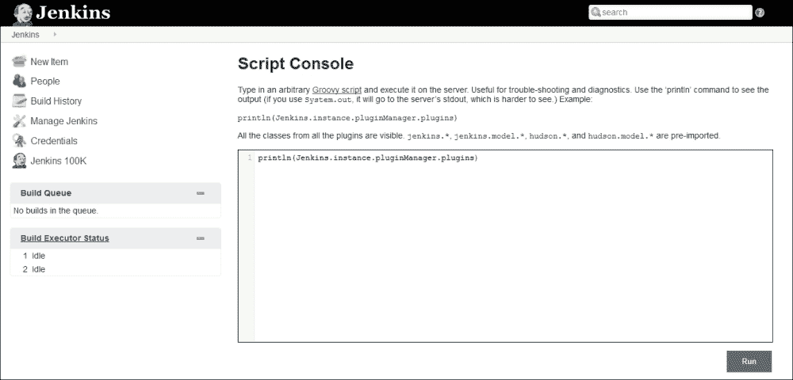

1.  要验证系统日志，请前往仪表板上的**管理 Jenkins**链接，点击**系统日志**链接，或访问`http://localhost:8080/log/all`。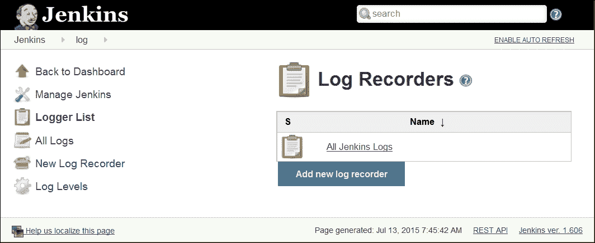

1.  要获取有关 Jenkins 中第三方库的更多信息——版本和许可证信息，请点击仪表板上的**管理 Jenkins**链接，然后点击**关于 Jenkins**链接。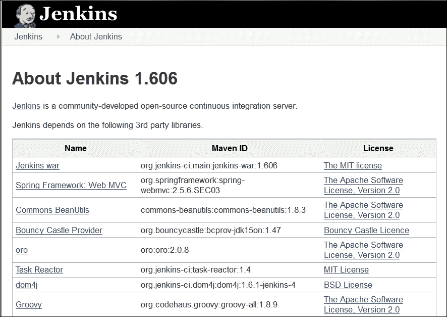

# 什么是部署管道？

应用程序开发生命周期传统上是一个漫长且手动的过程。此外，它需要开发和运维团队之间的有效协作。部署管道展示了应用程序开发生命周期中涉及的自动化，包括自动化构建执行和测试执行、向利益相关者通知以及在不同运行时环境中的部署。实际上，部署管道是 CI 和持续交付的结合，因此是 DevOps 实践的一部分。下图描绘了部署管道过程：

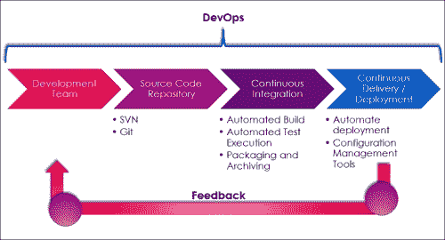

开发团队成员将代码检入源代码仓库。诸如 Jenkins 之类的 CI 产品被配置为从代码仓库轮询变更。仓库中的变更被下载到本地工作区，Jenkins 触发自动化构建过程，该过程由 Ant 或 Maven 辅助。自动化测试执行或单元测试、静态代码分析、报告以及成功或失败的构建过程通知也是 CI 过程的一部分。

一旦构建成功，它可以被部署到不同的运行时环境，如测试、预生产、生产等。在 JEE 应用程序中部署`war`文件通常是部署管道的最后阶段。

部署管道最大的好处之一是更快的反馈循环。在应用程序早期阶段识别问题，并且不依赖于手动努力，使得整个端到端过程更加有效。

在接下来的章节中，我们将看到如何使用 Jenkins 来实施现代化 IT 中的 CI 实践。

### 注意

欲了解更多信息，请访问[`martinfowler.com/bliki/DeploymentPipeline.html`](http://martinfowler.com/bliki/DeploymentPipeline.html)和[`www.informit.com/articles/article.aspx?p=1621865&seqNum=2`](http://www.informit.com/articles/article.aspx?p=1621865&seqNum=2)。

# 自测题

Q1. 什么是 Jenkins？

1.  一个持续集成产品

1.  一个持续交付产品

Q2. 是什么使得 Jenkins 可扩展？

1.  插件

1.  开源发布

Q3. 使用哪个命令来运行 Jenkins 安装文件的`war`格式？

1.  java –jar `Jenkins.war`

1.  java –j `Jenkins.war`

Q4. 如何在 Jenkins 仪表板上获取系统信息？

1.  访问`http://<ip_address>:8080/manage`

1.  访问`http://<ip_address>:8080/systeminfo`

Q5. 如何在 Jenkins 仪表板上更改全局配置设置？

1.  点击仪表板上的**管理 Jenkins**链接

1.  点击仪表板上的**凭据**链接

Q6. 什么是部署管道？

1.  持续集成实践

1.  持续交付实践

1.  展示应用程序开发生命周期中涉及的自动化

1.  以上都不是

Q7. 解释部署管道的好处是什么？

1.  更快的反馈循环

1.  在应用程序早期阶段识别问题

1.  不依赖于人工努力

1.  以上所有

# 总结

恭喜！我们已到达本章末尾，因此我们已在物理或虚拟机上安装了 Jenkins，您可以准备进入下一章。至此，我们涵盖了 CI 的基础知识以及 Jenkins 及其特性的介绍。我们完成了 Jenkins 在 Windows 和 CentOS 平台上的安装。我们还快速浏览了 Jenkins 仪表板中可用的功能。除此之外，我们还讨论了部署管道及其在 CI 中的重要性。

既然我们能够使用我们的 CI 服务器 Jenkins，我们可以开始创建一个作业并验证 Jenkins 的工作方式。
