# 第三章：Jenkins、SVN 与构建工具的集成

|   | *"改变的障碍不是太少关心；而是太多复杂性"* |   |
| --- | --- | --- |
|   | --*比尔·盖茨* |

我们已经了解了如何设置环境以使用 Jenkins 进行持续集成，并且已经在 Jenkins 中配置了构建工具。Eclipse 与 SVN 的集成将帮助开发人员轻松执行仓库操作。

现在我们准备好为持续集成创建我们的第一个构建作业。本章详细描述了如何使用 Ant 和 Maven 等构建工具为 Java 应用程序创建和配置构建作业；如何运行构建作业、单元测试案例。它涵盖了运行构建以创建用于部署的发行文件或`war`文件的所有方面，以及提供基于偏好的构建作业和测试结果定制显示的仪表板视图插件。以下是本章涵盖的主要点：

+   使用 Ant 为 Java 应用程序创建和配置构建作业

+   使用 Maven 为 Java 应用程序创建和配置构建作业

+   构建执行与测试案例

# 使用 Ant 为 Java 应用程序创建和配置构建作业

在为 Java 应用程序创建和配置构建作业之前，我们将安装一个仪表板视图插件，以更好地管理构建，并显示构建和测试的结果。我们已经在第二章，*代码仓库和构建工具的安装与配置*中看到了如何创建基本作业。

## 仪表板视图插件

此插件提供了一个新视图，为 Jenkins 构建作业提供类似门户的视图。从[`wiki.jenkins-ci.org/display/JENKINS/Dashboard+View`](https://wiki.jenkins-ci.org/display/JENKINS/Dashboard+View)下载。它适合展示结果和趋势。此外，它还允许用户以有效的方式排列显示项。在 Jenkins 仪表板上，转到**管理 Jenkins**链接，点击**管理插件**并安装 Dashboard View 插件。通过点击**已安装**标签验证安装。

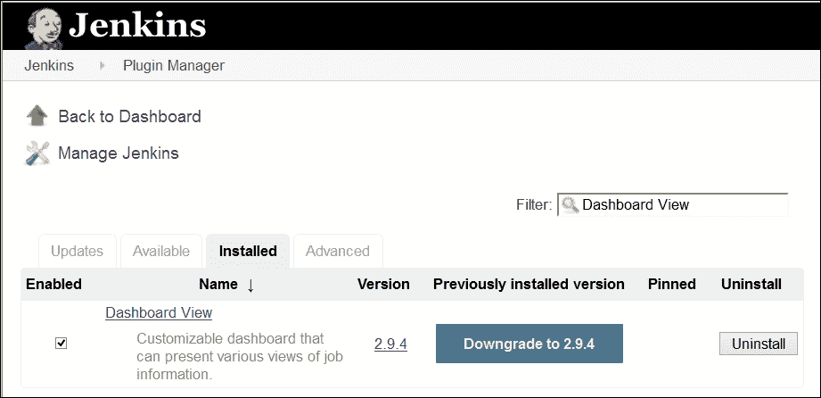

在 Jenkins 仪表板上，点击加号按钮创建新视图。提供一个**视图名称**并选择视图类型；在我们的例子中是**仪表板**，然后点击**确定**。

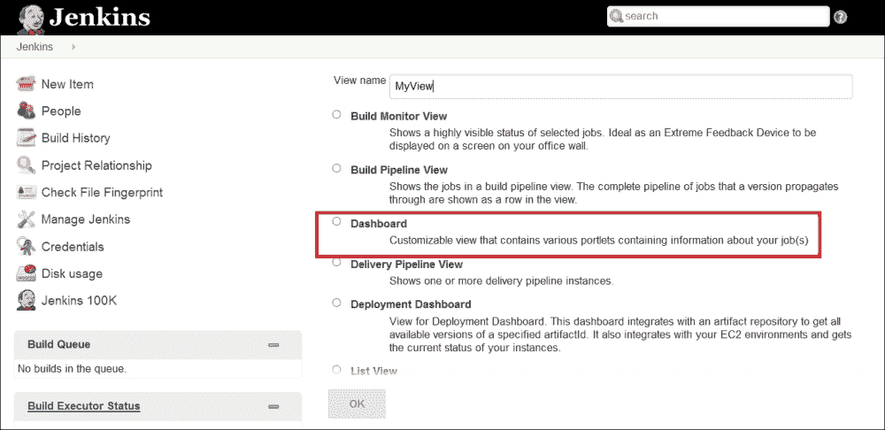

提供一个**名称**并选择需要在视图中包含的**作业**，如下面的截图所示：

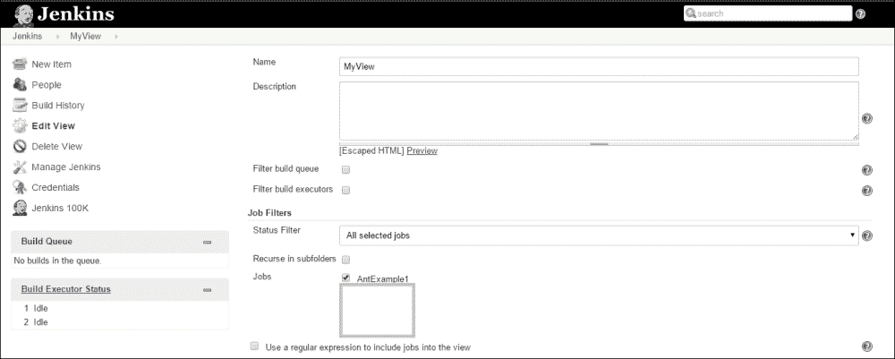

在视图配置中，点击**右侧栏添加仪表板小部件**，并选择**测试统计网格**。添加**测试统计图**。这将显示以统计和图表形式呈现的测试结果。

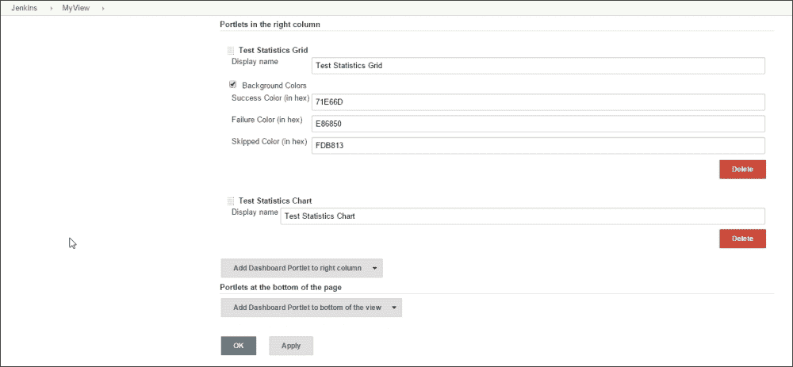

## 为 Java 应用程序创建和配置构建作业

在仪表板上点击**新建项**以创建一个使用 Ant 作为构建工具的 Java 应用程序的新构建。输入**项名称**，并选择**自由风格项目**。点击**确定**。

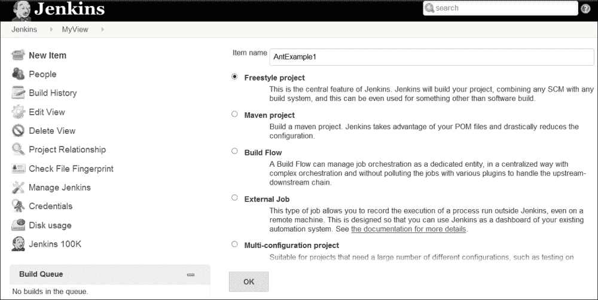

它将打开新构建作业的配置。在**源代码管理**中，选择**Subversion**。提供**仓库 URL**和**凭证**。在第二章中，我们安装了 Subversion 并将源代码添加到了 SVN。

提供您在浏览器中用于访问源代码仓库的 URL。

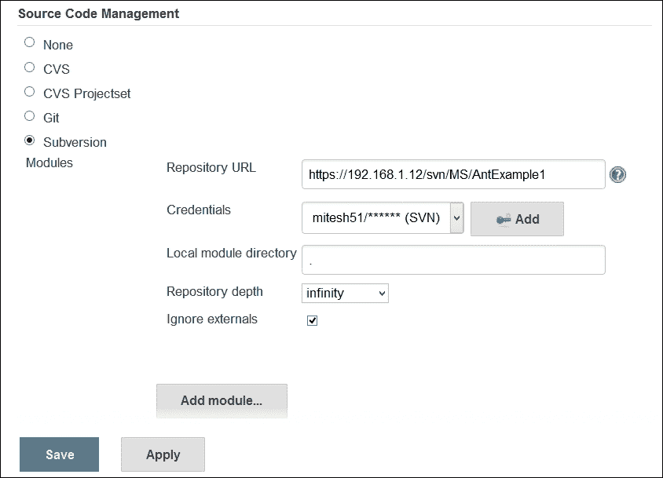

如果框中没有**凭证**，请点击**添加**按钮。提供**范围**、**用户名**、**密码**和**描述**，然后点击**添加**以使其在构建作业配置中的列表框中可用。**范围**决定凭证可以在哪里使用。例如，系统范围将凭证的使用限制在与凭证关联的对象上。它比全局范围提供更好的保密性。全局范围的凭证对与凭证关联的对象及其所有子对象可用。

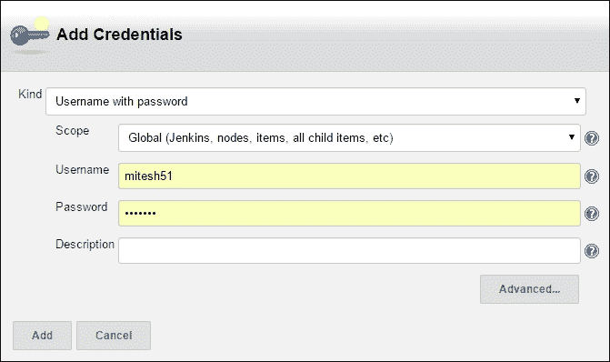

在构建作业配置中，转到**构建触发器**部分并选择**轮询 SCM**单选按钮。在*** * * * ***格式中提供计划详细信息，如图所示。它将每分钟轮询仓库以验证开发人员提交到仓库的更改。

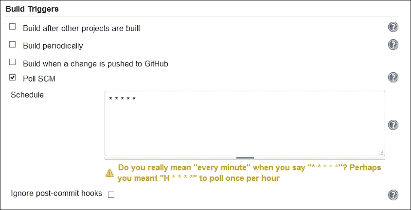

**计划**字段遵循 cron 语法，即分钟 小时 日 月 星期。

例如，H * * * * 表示每小时轮询一次，H/15 * * * * 表示每十五分钟轮询一次。

完成**构建触发器**和**源代码管理**配置后，我们需要提供与构建工具相关的详细信息，以便 Jenkins 在构建触发时可以使用它们来执行。点击**添加构建步骤**并选择**调用 Ant**。从下拉菜单中，选择在第二章中配置的 Ant，即*代码仓库和构建工具的安装与配置*，并提供您希望从构建中执行的**目标**名称。

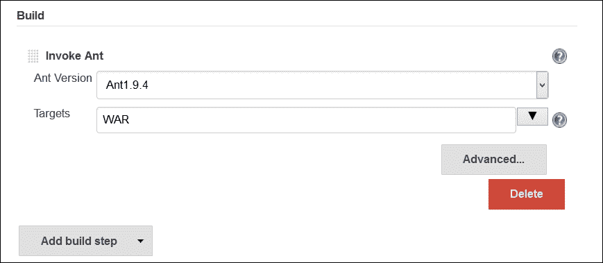

点击**应用**和**保存**按钮以完成配置。在 Jenkins 仪表板上点击**立即构建**按钮。它将检查源代码仓库中所有最新的可用代码，并与安装 Jenkins 的机器上的本地工作区进行对比，如图所示。在特定作业的**构建历史**部分，点击**构建编号**，然后点击**控制台输出**。

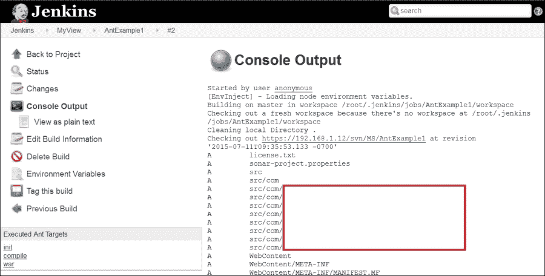

一旦检出过程完成，根据目标执行构建文件，如果本地工作区中所有构建执行所需的依赖项和文件都可用，则构建执行将成功，如图所示：

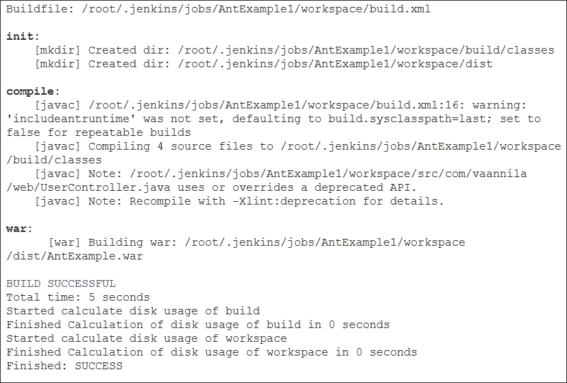

要验证本地工作区，请转到您创建的视图，选择**构建作业**，然后点击**工作区**。验证所有文件和文件夹是否都可用，如源代码仓库所提供。

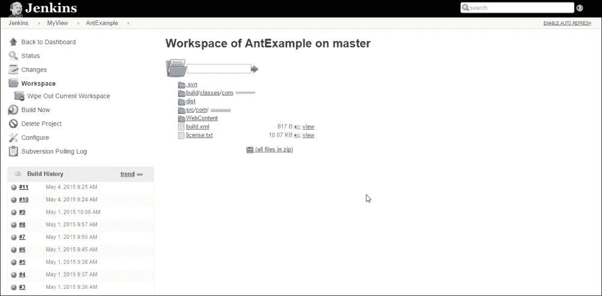

# 使用 Maven 为 Java 应用程序创建和配置构建作业

在仪表板上点击**新建项目**，为使用 Maven 作为构建工具的 Java 应用程序创建新的构建。输入**项目名称**并从列表中选择**Maven 项目**。

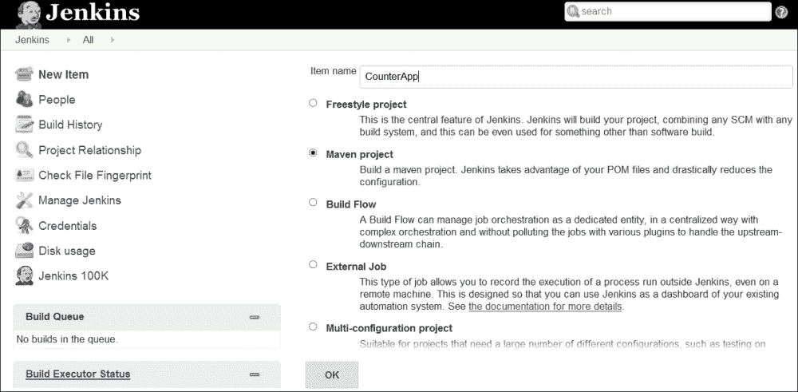

它将打开新构建作业的配置。在**源代码管理**中，选择**Subversion**。提供**仓库 URL**和**凭证**。在第二章，*代码仓库和构建工具的安装与配置*中，我们安装了**Subversion**，并将源代码添加到 SVN。

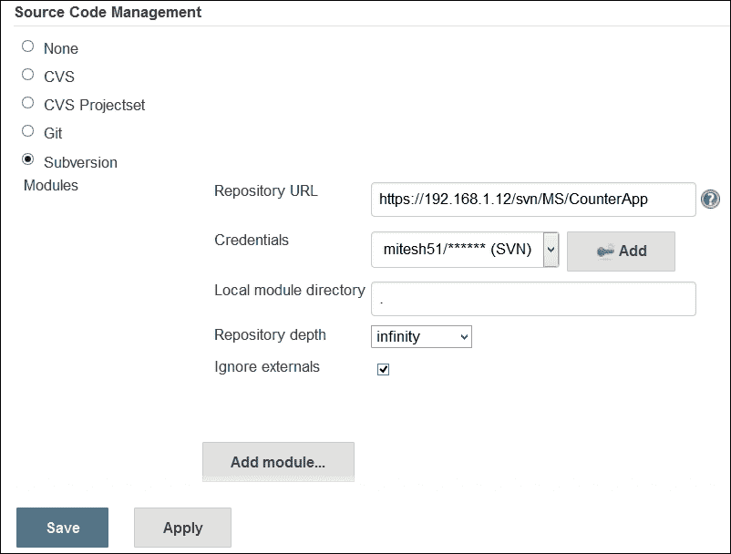

在构建作业配置中，转到**构建触发器**部分并选择**轮询 SCM**单选按钮。按照*** * * * ***格式提供计划详细信息，如图所示。它将每分钟轮询仓库以验证开发人员提交到仓库的更改。添加 Maven 构建步骤。提供构建文件的名称；默认情况下是`pom.xml`。提供**目标和选项**，如果留空，则将执行默认目标。

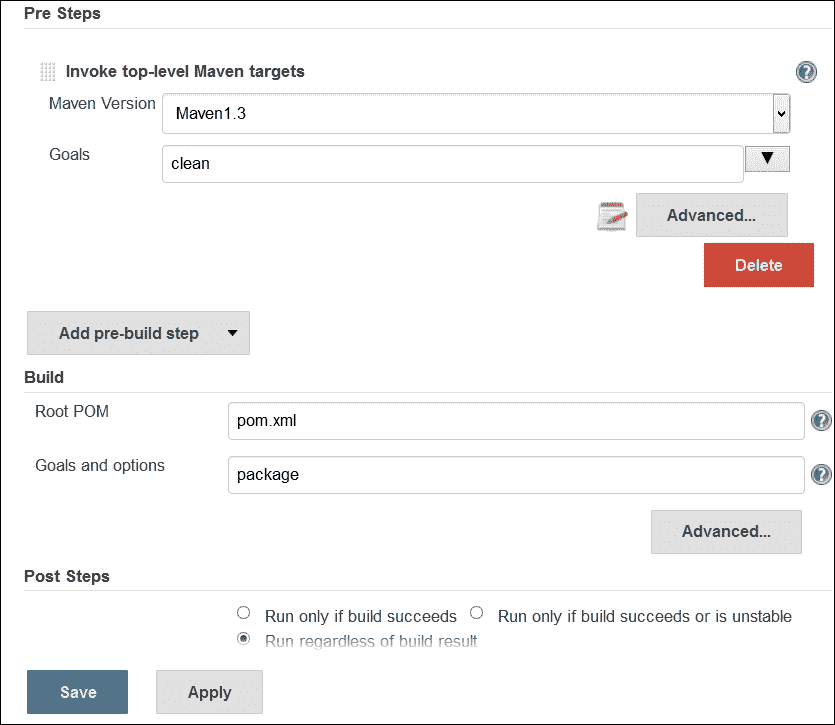

点击**立即构建**以执行构建作业或提交更新的代码到仓库，构建将根据我们在**构建触发器**中的配置自动执行。

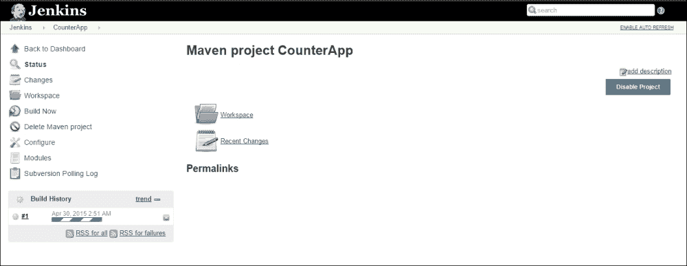

它将针对安装 Jenkins 的机器上的本地工作区，检出源代码仓库中所有最新的可用代码，如下所示。

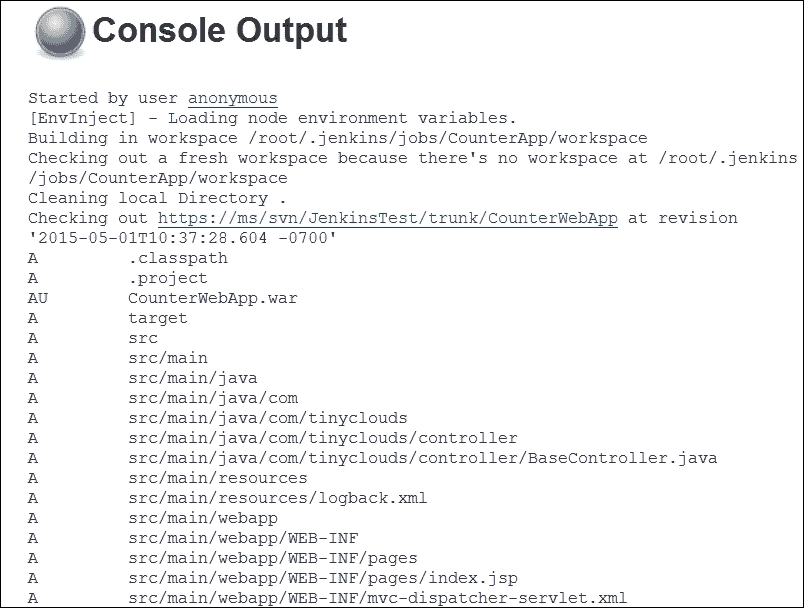

结账过程完成后，将根据目标启动构建文件执行，如果构建执行所需的所有依赖项和文件都可在本地工作区中获得，则构建执行将成功，如下所示。

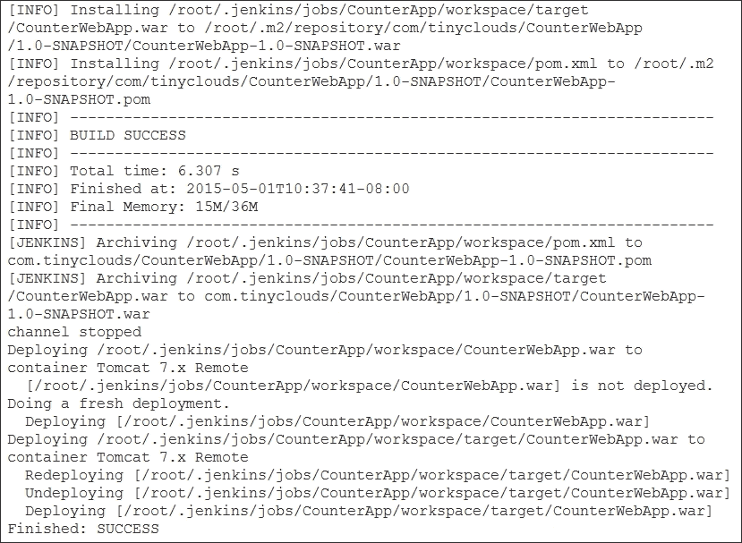

# 构建执行与测试案例

Jenkins 允许在仪表板上发布 JUnit 格式的测试结果。我们无需为此安装任何特定插件。如果我们已有用 JUnit 编写的测试案例，则执行它们很容易。确保在构建文件中为测试案例执行创建目标或任务。在构建作业配置中，点击**构建后操作**并选择**发布 JUnit 测试结果报告**。提供**测试报告 XMLs**文件的位置并保存构建作业配置。

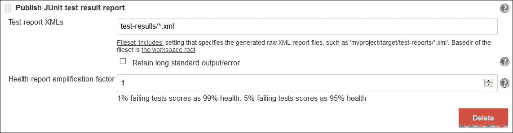

通过点击**立即构建**来执行构建。构建完成后，点击仪表板上的**测试结果**链接。

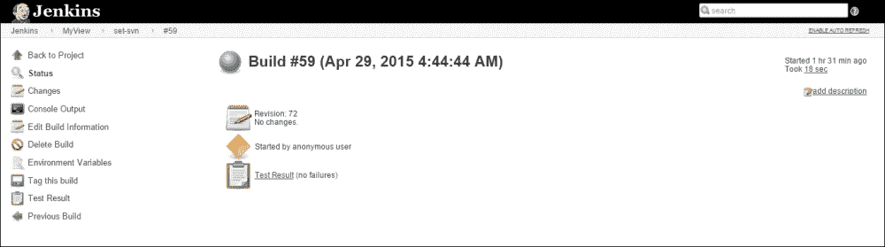

点击包链接以在摘要页面上获取详细的测试结果。

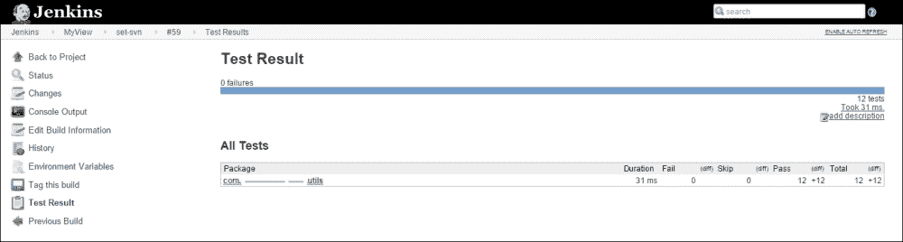

点击类链接以在页面上获取详细的测试结果。

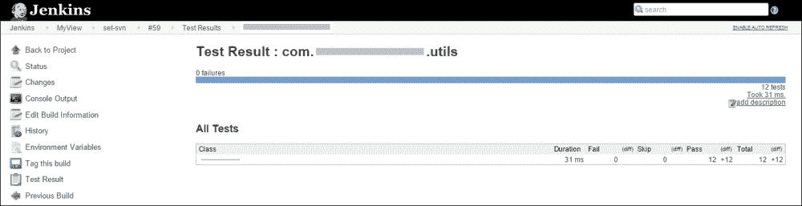

验证所有测试名称、持续时间和状态，如下所示：

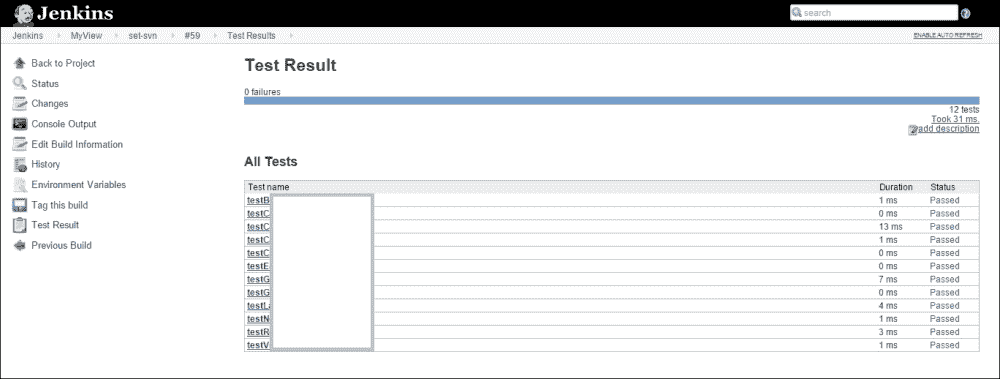

通过点击 Jenkins 仪表板上每个测试案例的单独链接进行验证。

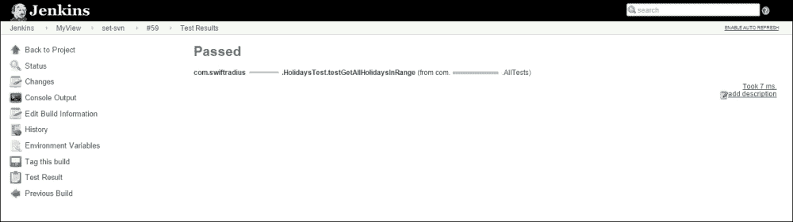

我们已配置仪表板视图插件以显示测试统计图和测试趋势图。

验证自定义视图中的成功、失败或跳过测试的数量及百分比，如下所示。

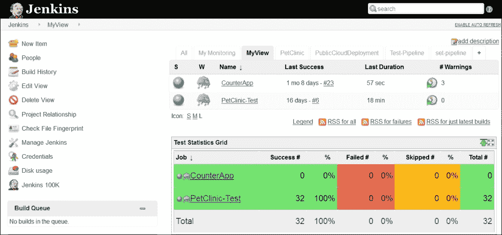

在仪表板视图中验证测试趋势图。

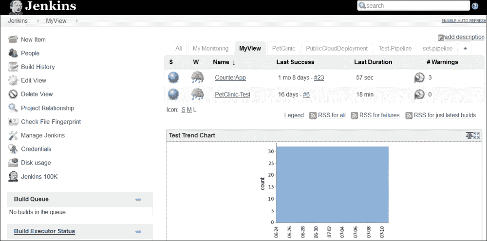

# 自测问题

Q1. 安装仪表板视图插件的目的是什么？

1.  为 Jenkins 构建作业提供类似门户的视图

1.  运行与 Jenkins 构建作业相关的测试案例

1.  显示构建结果

Q2. 为 SVN 创建凭据时可用的字段有哪些？

1.  **范围**、**用户名**、**密码**、**描述**

1.  **范围**、**用户名**、**密码**

1.  **用户名**、**密码**、**描述**

Q3. **构建触发器计划**部分中的*****是什么意思？

1.  每日轮询 SCM

1.  每小时轮询 SCM

1.  每分钟轮询 SCM

1.  每秒轮询 SCM

问题 4：Ant 和 Maven 的构建文件名称分别是什么？

1.  `pom.xml`, `build.xml`

1.  `build.xml`, `pom.xml`

1.  `pom.xml`, `root.xml`

1.  `ant.xml`, `maven.xml`

# 总结

我们再次来到本章中令人感到成就感的部分。在本章中，我们学习了如何定制 Jenkins 仪表板，并根据构建作业在仪表板上展示测试结果。我们还为示例 Java 应用程序创建了第一个构建作业。我们使用了 Ant 和 Maven 等构建工具来执行构建并创建构件。最后，我们了解了如何执行测试用例，并在 Jenkins 门户上显示结果。

在下一章中，我们将直接从 Jenkins 部署应用程序到应用服务器，并介绍在亚马逊网络服务上部署应用程序的入门知识。
