# 第四章：实施自动化部署

|   | *简洁是可靠性的前提* |   |
| --- | --- | --- |
|   | --*艾兹格·迪科斯彻* |

我们已经介绍了持续集成的概念，并了解了如何使用 Jenkins 实现它。现在是时候迈向应用程序部署管道的下一步，即自动化部署。在将应用程序自动化部署到 Tomcat 应用服务器之前，我们将首先理解持续交付和持续部署的概念。

本章将通过在本地或远程应用服务器上部署制品，进一步推进部署管道。它将深入了解自动化部署和持续交付流程。

+   持续交付与持续部署概述

+   从 Jenkins 向 Tomcat 服务器部署文件

# 持续交付与持续部署概述

持续交付是持续集成实践的延伸。应用程序制品以自动化方式达到生产就绪状态，但并未部署到生产环境中。持续部署是持续交付的延伸，其中应用程序的变更最终部署到生产环境中。持续交付是 DevOps 实践的必备条件。接下来我们将了解如何使用 Jenkins 部署应用程序制品。

### 注意

欲了解更多关于持续交付和持续部署的详情，请访问：

[持续交付与持续部署对比](http://continuousdelivery.com/2010/08/continuous-delivery-vs-continuous-deployment/)

[持续交付书籍](http://martinfowler.com/books/continuousDelivery.html)

# 安装 Tomcat

Tomcat 是由**Apache 软件基金会**（**ASF**）开发的开源 Web 服务器和 Servlet 容器。我们将使用 Tomcat 来部署 Web 应用程序。

1.  访问[Tomcat 官网](https://tomcat.apache.org)并下载 Tomcat。将所有文件解压到系统中的相关文件夹。

1.  在`conf/server.xml`中将端口号从`8080`更改为`9999`。

    ```
     <Connector port="9999" protocol="HTTP/1.1" 
     connectionTimeout="20000" 
     redirectPort="8443" />

    ```

1.  根据您的操作系统，打开终端或命令提示符。转到`tomcat`目录。转到`bin`文件夹，并运行`startup.bat`或`startup.sh`。以下是在 Windows 上运行`startup.bat`的示例。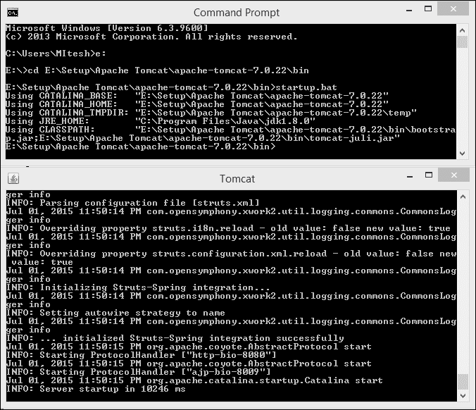

1.  打开浏览器并访问`http://localhost:9999`。我们也可以通过 IP 地址`http://<IP 地址>:9999`访问 Tomcat 主页。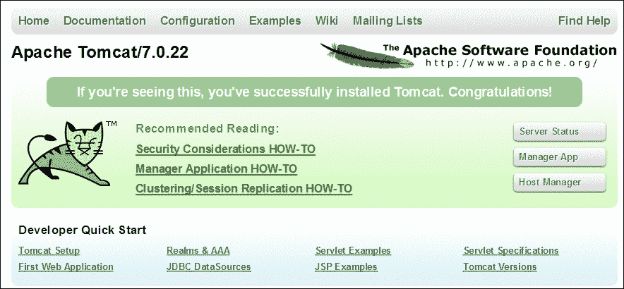

# 从 Jenkins 向 Tomcat 部署 war 文件

我们将使用[Jenkins 部署插件](https://wiki.jenkins-ci.org/x/CAAjAQ)将`war`文件部署到特定容器中。

部署插件会获取`war`/`ear`文件，并在构建结束时将其部署到本地或远程运行的应用程序服务器上。

它支持以下容器：

+   Tomcat: 4.x/5.x/6.x/7.x

+   JBoss: 3.x/4.x

+   Glassfish: 2.x/3.x

要在`Websphere`容器中部署`war`文件，请使用[`wiki.jenkins-ci.org/x/UgCkAg`](https://wiki.jenkins-ci.org/x/UgCkAg)上提供的 Deploy WebSphere 插件。

要在`Weblogic`容器中部署`war`文件，请使用[`wiki.jenkins-ci.org/x/q4ahAw`](https://wiki.jenkins-ci.org/x/q4ahAw)上提供的 WebLogic Deployer 插件。

1.  在 Jenkins 仪表板上，前往**管理 Jenkins**链接，然后点击**管理插件**并安装**Deploy plugin**。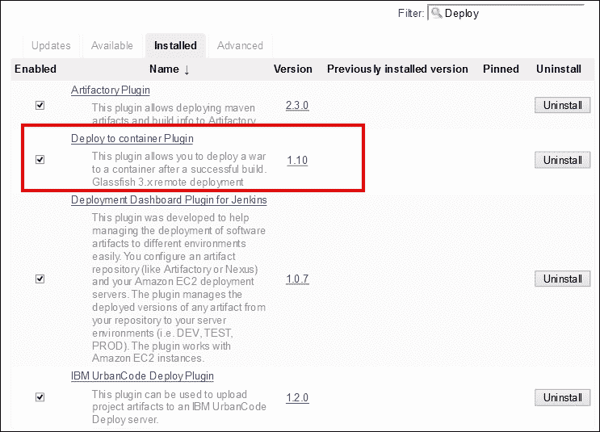

1.  等待**Deploy Plugin**安装完成。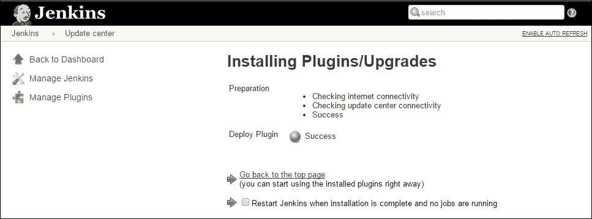

1.  前往 Jenkins 仪表板并选择任何构建作业。点击所选构建作业的**配置**链接。

1.  在相关作业的配置页面上点击**添加构建后操作**按钮，并选择**Deploy war/ear to container**，如图所示。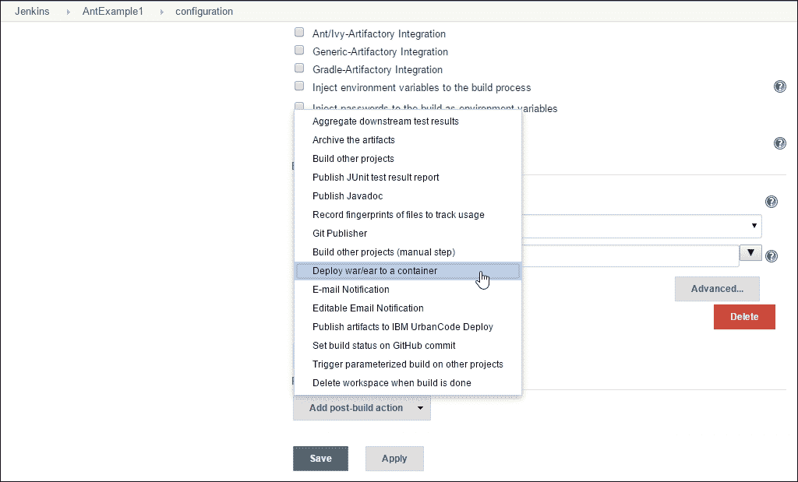

1.  在**构建后操作**部分添加**Deploy war/ear to a container**。提供一个相对于工作空间的**war**文件路径，并从可用列表框中选择**Tomcat 7.x**作为容器，如图所示。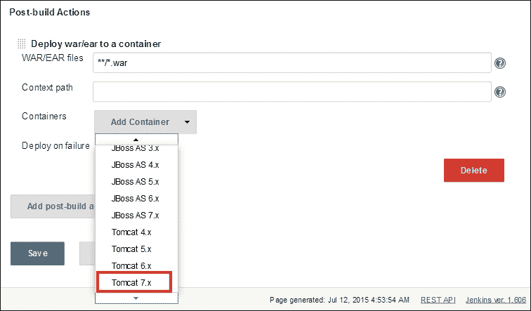

1.  提供**管理器用户名**和**管理器密码**；在`tomcat-users.xml`中，并取消以下内容的注释：

    ```
    <!--
      <role rolename="tomcat"/>
      <role rolename="role1"/>
      <user username="tomcat" password="tomcat" roles="tomcat"/>
      <user username="both" password="tomcat" roles="tomcat,role1"/>
      <user username="role1" password="tomcat" roles="role1"/>
    -->
    ```

1.  在未注释的部分添加以下内容：

    ```
    <role rolename="manager-script"/>
    <user username="mitesh51" password="*********" roles="manager-script"/>  
    ```

1.  重启 Tomcat，访问`http://localhost:9999/manager/html`，并输入用户名和密码。在 Jenkins 中使用相同的用户名和密码作为管理器凭证。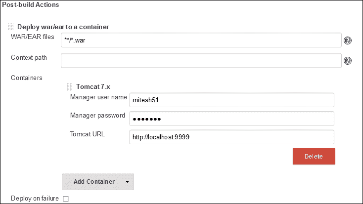

1.  点击**立即构建**。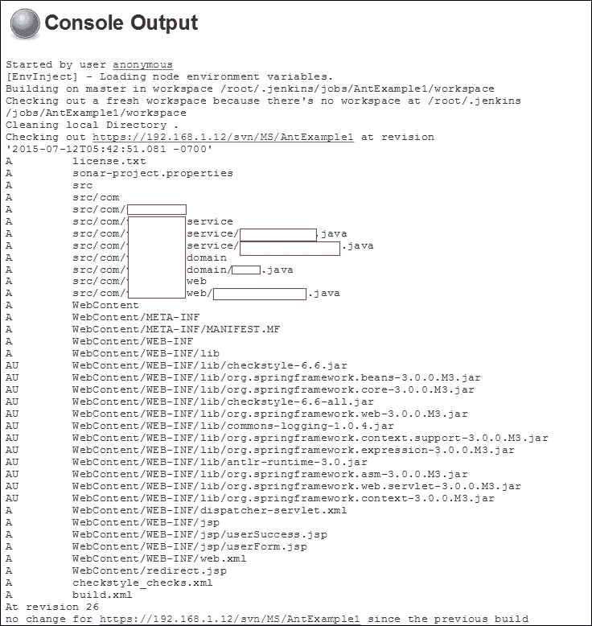

1.  构建完成后，验证 Tomcat 应用服务器中应用程序部署的控制台输出。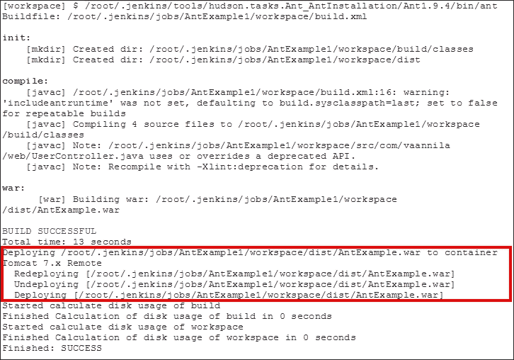

1.  验证 Tomcat 安装目录中的`webapps`目录。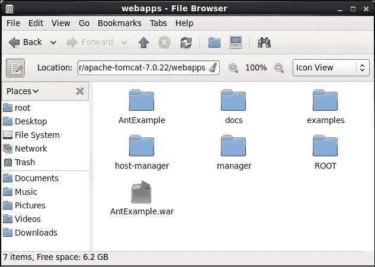

1.  验证 Tomcat 管理器，并检查 Tomcat 应用服务器中应用的状态。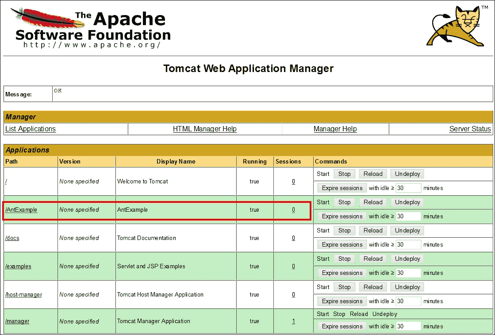

1.  如果 Tomcat 服务器安装在远程服务器上，则在 Tomcat URL 中使用 IP 地址，如图所示：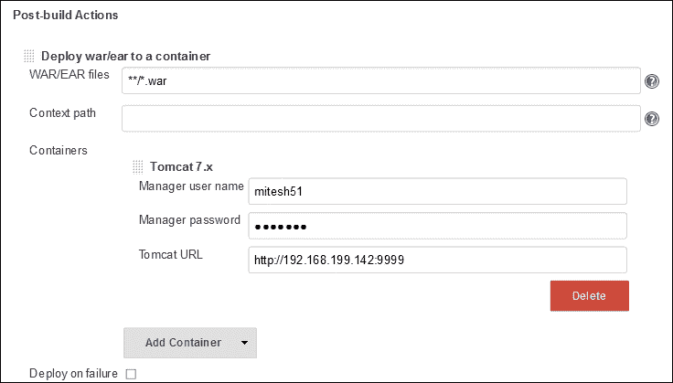

我们只需在远程部署时更改 Tomcat URL。

# 自测题

Q1. 持续交付和持续部署是相同的。

1.  正确

1.  错误

Q2. 如何启用 Tomcat 管理器访问？

1.  启动 Tomcat

1.  修改`server.xml`

1.  修改`tomcat-users.xml`

1.  修改`web.xml`

# 总结

做得好！我们已到达本章末尾；让我们总结一下所涵盖的内容。我们已经理解了持续交付和持续部署的概念。我们在这里主要探讨的是，在构建成功后，将应用程序工件部署到特定的应用程序服务器上。

在下一章中，我们将学习如何在云上管理 Jenkins，并探讨一些案例研究。
