# 第六章：管理代码质量和通知

|   | *"通过进行非常小的增量更改来限制您的负担"* |   |
| --- | --- | --- |
|   | --*匿名* |

我们看到了各种客户如何根据他们的需求在云上使用 Jenkins。我们还看到了 Red Hat OpenShift 和 CloudBees 的云端产品，以及案例研究，以了解 Jenkins 如何有效地使用。现在，是时候了解关于代码质量检查和构建失败通知的额外方面了。

本章将教你如何将静态代码分析行为集成到 Jenkins 中。代码质量是影响应用程序效能的极其重要的特性，通过与 Sonar、Checkstyle、FindBugs 等工具集成，用户可以洞察到代码中的问题部分。

+   与 Sonar 集成

+   探索静态代码分析插件

+   构建状态的电子邮件通知

# 与 Sonar 集成

代码质量是 DevOps 文化的一个重要方面。它提供了质量检查，突出了可靠性、安全性、效率、可移植性、可管理性等方面的水平。它有助于发现源代码中的错误或可能的错误，并建立与组织中编码标准一致的文化。

SonarQube 是一个开源的代码质量持续检查平台。它支持 Java、C#、PHP、Python、C/C++、Flex、Groovy、JavaScript、PL/SQL、COBOL、Objective-C、Android 开发等。它提供关于编码标准、代码覆盖、复杂代码、单元测试、重复代码、潜在错误、注释、设计和架构的报告。

1.  前往[`www.sonarqube.org/downloads/`](http://www.sonarqube.org/downloads/)，下载 SonarQube 5.1。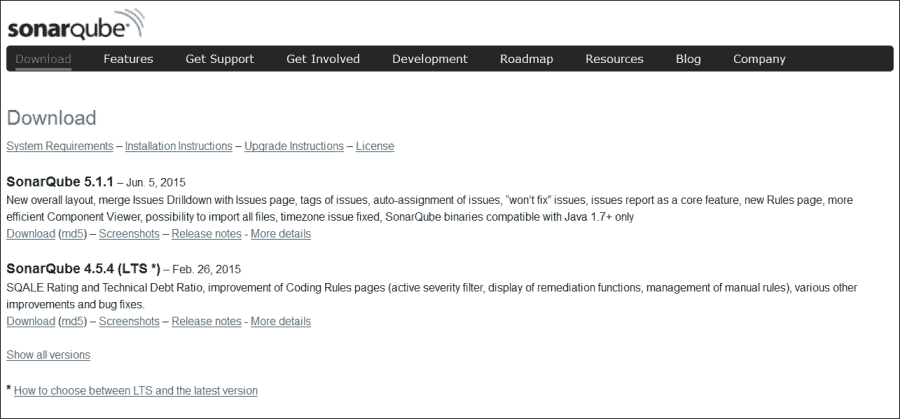

1.  提取文件，它将类似于以下截图：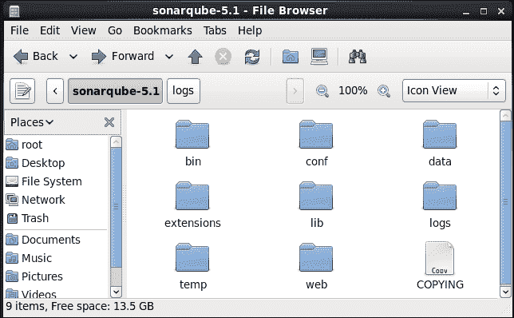

1.  根据您想要运行 SonarQube 的操作系统，转到`bin`文件夹以运行 SonarQube。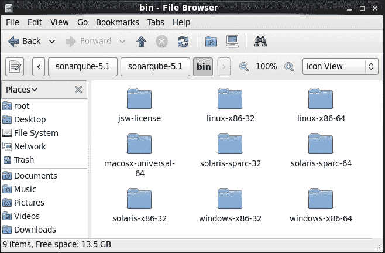

1.  根据您的平台选择一个文件夹，在我们的例子中，我们将在 CentOS 上安装，因此我们将选择`linux-x86-64`。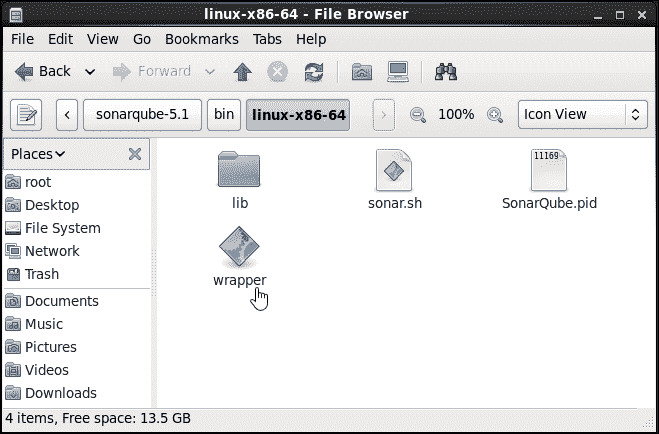

1.  打开终端并进入 SonarQube 的安装目录；转到`bin/linux-x86-64/`并运行`sonar.sh`。我们需要使用`sonar.sh`的参数，如下所示：

    ```
    [root@localhost linux-x86-64]# ./sonar.sh
    Usage: ./sonar.sh { console | start | stop | restart | status | dump }

    ```

    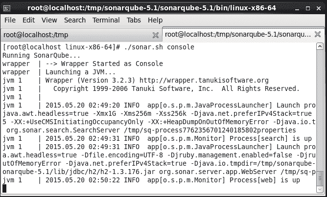

1.  访问`http://localhost:9000/`或`http://<IP 地址>:9000/`。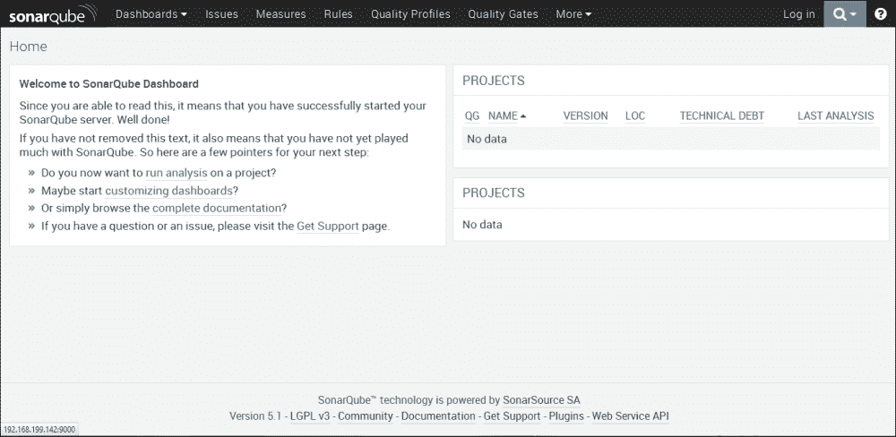

1.  探索 SonarQube 仪表板中的**规则**。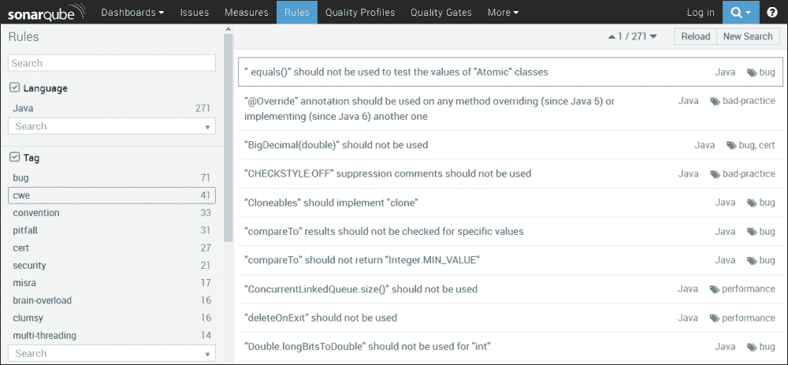

1.  验证 SonarQube 仪表板中的**设置**。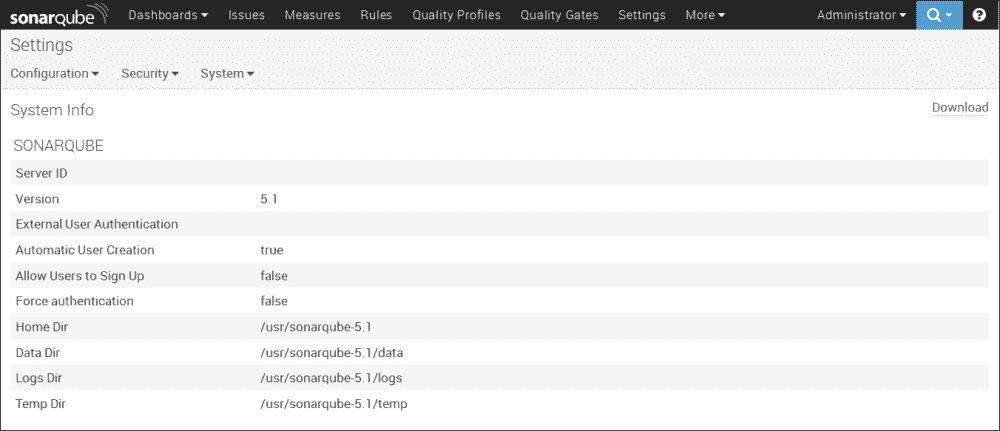

1.  创建`sonar-project.properties`，并将其保存在项目存储的仓库中：

    ```
    # must be unique in a given SonarQube instance
    sonar.projectKey=Ant:project
    # this is the name displayed in the SonarQube UI
    sonar.projectName=Ant project
    sonar.projectVersion=1.0
    sonar.sources=src

    ```

1.  在 Jenkins 中安装 SonarQube 插件。欲了解更多信息，请访问[`wiki.jenkins-ci.org/display/JENKINS/SonarQube+plugin`](https://wiki.jenkins-ci.org/display/JENKINS/SonarQube+plugin)。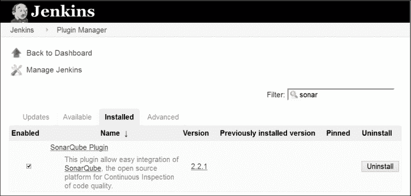

1.  点击**管理 Jenkins**并前往**系统配置**。转到**SonarQube**部分，并在 Jenkins 中配置 SonarQube。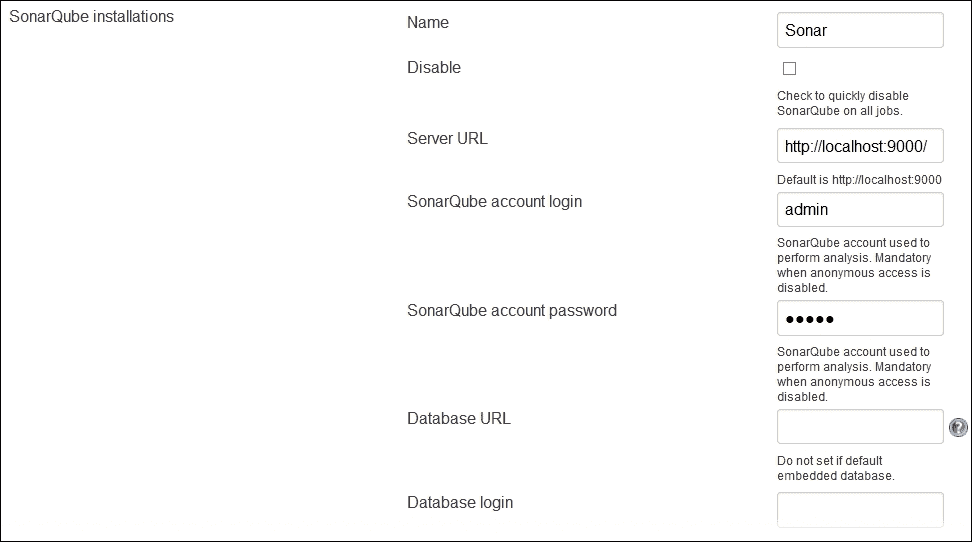

1.  在构建作业中添加构建步骤**调用独立 SonarQube 分析**。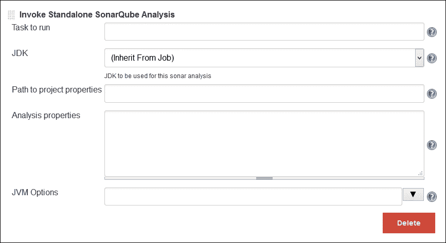

1.  运行构建作业，若遇到证书错误，执行`svn export`命令以解决证书问题。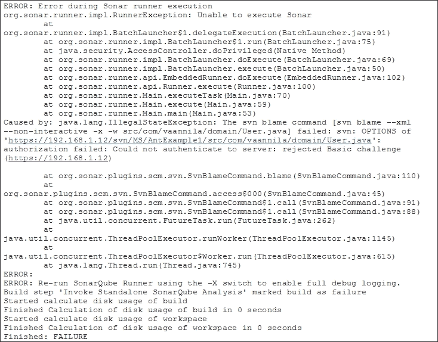

1.  执行`svn export`命令以解决虚拟机上安装的 SonarQube 和 Jenkins 的证书问题，如以下截图所示：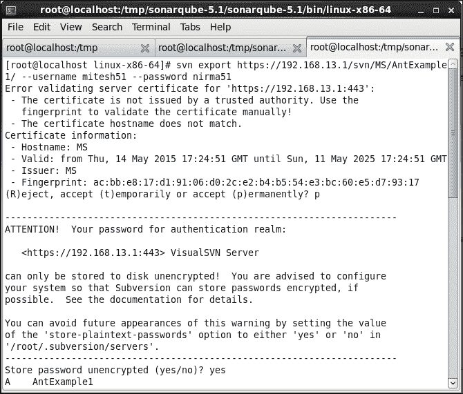

1.  运行构建作业。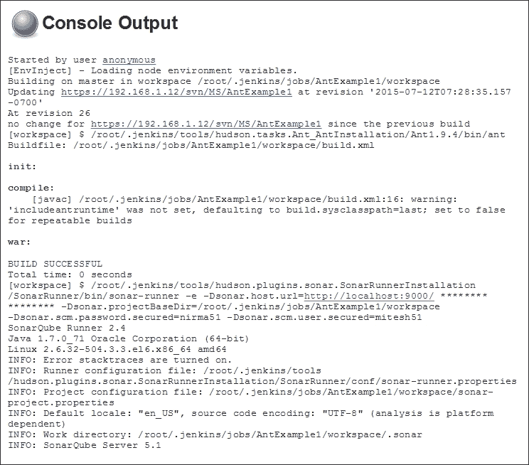

1.  在控制台中验证 Sonar 执行步骤。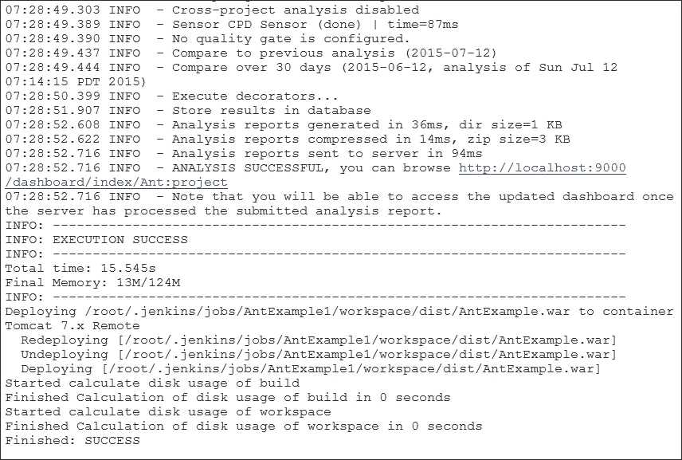

1.  刷新 SonarQube 仪表板，我们便能在 SonarQube 中查看最近执行的构建的详细信息，如以下截图所示：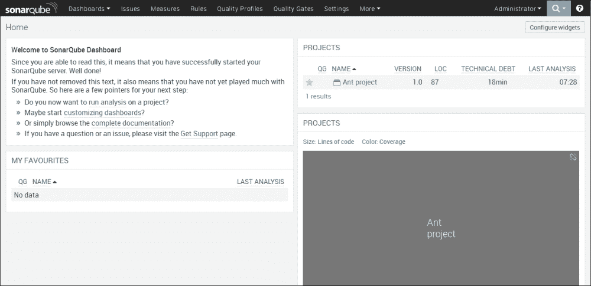

1.  如需获取更多代码验证详情，点击项目，我们将能看到**代码行数**、**重复度**、**复杂度**等详细信息。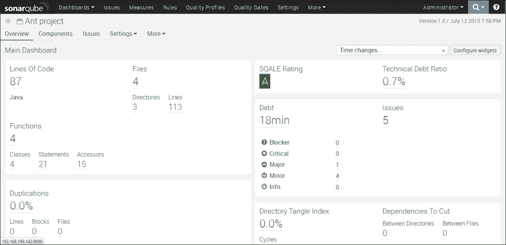

进一步探索 SonarQube 与 Jenkins 的集成，如下步骤所示。

# 探索静态代码分析插件

静态代码分析插件为静态代码分析插件提供实用工具。Jenkins 使用不同的插件进行配置和解析，解释了多个静态代码分析工具的结果文件。通过这些插件，我们可以更灵活地构建您所需的内容。

要安装这些插件中的任何一个，请前往 Jenkins 仪表板，点击**管理 Jenkins**，然后选择**管理插件**链接。转到**可用**标签页，找到相应的插件并选中它。点击**立即下载**，并在重启后安装。

所有这些结果均由同一后端可视化。以下插件使用相同的可视化方式：

## 检查样式插件

检查样式插件为开源静态代码分析程序 Checkstyle 生成报告。

欲了解更多关于检查样式插件的信息，请访问[`wiki.jenkins-ci.org/display/JENKINS/Checkstyle+Plugin`](https://wiki.jenkins-ci.org/display/JENKINS/Checkstyle+Plugin)。

## FindBugs 插件

FindBugs 插件由静态分析收集器插件支持，该插件在聚合趋势图、健康报告和构建稳定性中显示结果。

欲了解更多信息，请访问[`wiki.jenkins-ci.org/display/JENKINS/FindBugs+Plugin`](https://wiki.jenkins-ci.org/display/JENKINS/FindBugs+Plugin)。

## 编译器警告插件

编译器警告插件在控制台日志或日志文件中生成编译器警告的趋势报告。

欲了解更多信息，请访问[警告插件](https://wiki.jenkins-ci.org/display/JENKINS/Warnings+Plugin)。

要发布 Checkstyle、FindBugs 和编译器警告插件的组合结果，请前往任何作业的**构建**部分，点击**添加构建后操作**，并选择**发布组合分析结果**。

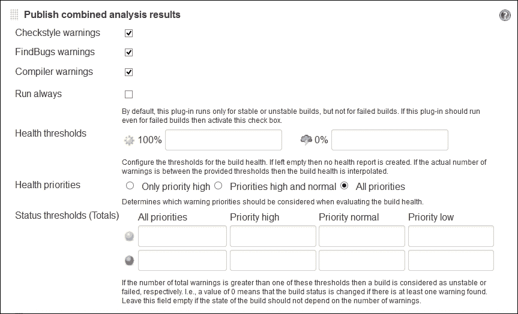

我们还可以通过使用仪表板视图插件查看这些结果。

在仪表板视图的配置中，点击**编辑视图**并在**警告数量**部分选择复选框。在不同部分添加**仪表板小部件**，用于 Checkstyle、编译器和 Findbug。

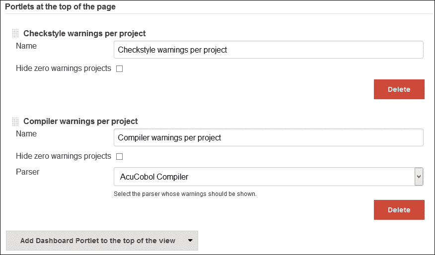

在所有更改和运行构建作业后验证视图。

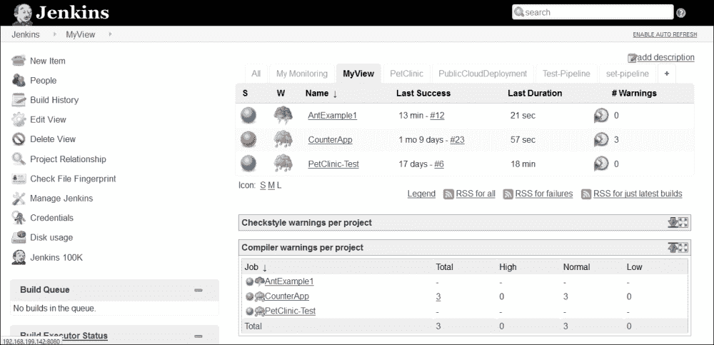

以下插件也很有用。

## DRY 插件

DRY 插件显示项目中的重复代码块。它仅显示重复代码检查工具的结果。

欲了解更多信息，请访问[DRY 插件](https://wiki.jenkins-ci.org/display/JENKINS/DRY+Plugin)。

## PMD 插件

PMD 插件扫描构建工作区中的`pmd.xml`文件，并报告警告。

欲了解更多信息，请访问[PMD 插件](https://wiki.jenkins-ci.org/display/JENKINS/PMD+Plugin)。

## 任务扫描器插件

任务扫描器插件扫描工作区文件中的开放任务并提供趋势报告。

欲了解更多信息，请访问[Jenkins 任务扫描器插件](https://wiki.jenkins-ci.org/display/JENKINS/Task+Scanner+Plugin)。

## CCM 插件

CCM 插件提供.NET 代码的圈复杂度详细信息。

欲了解更多信息，请访问[CCM 插件](https://wiki.jenkins-ci.org/display/JENKINS/CCM+Plugin)。

## Android Lint 插件

Android Lint 插件解析来自 Android lint 工具的输出。

欲了解更多信息，请访问[Android Lint 插件](https://wiki.jenkins-ci.org/display/JENKINS/Android+Lint+Plugin)。

## OWASP 依赖检查插件

依赖检查 Jenkins 插件具有执行依赖分析构建的能力。

欲了解更多信息，请访问[OWASP 依赖检查插件](https://wiki.jenkins-ci.org/display/JENKINS/OWASP+Dependency-Check+Plugin)。

# 构建状态的电子邮件通知

要基于构建状态发送电子邮件通知，我们需要配置 SMTP 详细信息。点击**管理 Jenkins**，然后进入**系统配置**。前往**电子邮件通知**部分。

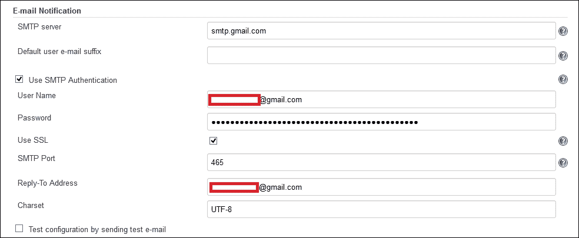

前往构建作业配置，点击**添加构建后操作**。选择**电子邮件通知**。提供收件人列表并保存。

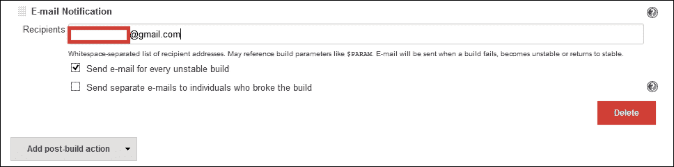

运行构建作业，若构建失败，则会在邮箱中收到电子邮件通知。

# 自测题

Q1. SonarQube 支持哪些编程语言？

1.  Java

1.  C#

1.  PHP

1.  Python

1.  C/C++

1.  JavaScript

1.  以上皆是

Q2. 以下哪项不是静态代码分析插件？

1.  DRY 插件

1.  PMD 插件

1.  任务扫描器插件

1.  FindBugs 插件

1.  上述皆非

# 总结

至此，我们又来到了另一章的结尾。我们需要记住，每一个新的开始都源自另一个开始的结束。总结一下，我们学习了如何管理已配置应用程序的代码质量，以及如何使用通知功能，在构建失败时向开发者发送信息。我们还简要介绍了一些静态代码分析插件，以对其有所了解。在下一章中，我们将学习如何管理和监控 Jenkins。
