# 第七章：管理与监控 Jenkins

|   | *"开始时跌倒 + 经常跌倒 + 学会快速恢复 = 更快上市时间"* |   |
| --- | --- | --- |
|   | --*匿名* |

上一章我们学习了 Sonar 与 Jenkins 的集成、静态代码分析插件概览以及构建状态的通知。现在，是时候专注于 Jenkins 的管理和监控了。

本章深入探讨了 Jenkins 节点的管理以及使用 Java Melody 监控它们，以提供资源利用情况的详细信息。还涵盖了如何管理和监控构建作业。本章详细描述了 Jenkins 中可用的基本安全配置，以实现更好的访问控制和授权。以下是本章将涵盖的主题列表：

+   管理 Jenkins 主节点和从节点

+   Jenkins 监控与 JavaMelody

+   管理磁盘使用

+   使用构建监控插件进行构建作业特定监控

+   管理访问控制和授权

+   维护基于角色和项目的权限

+   管理管理员账户

+   审计跟踪插件—概览与使用

# 管理 Jenkins 主节点和从节点

主节点代表 Jenkins 的基本安装，负责构建系统的所有任务。它能满足所有用户请求，并具备独立构建项目的容量。从节点是设置来减轻主节点构建项目负担的系统，但委托行为取决于每个项目的配置。委托可以具体配置为构建作业。

1.  在 Jenkins 仪表板上，前往**管理 Jenkins**。点击**管理节点**链接。它将提供所有节点的信息，如下面的截图所示：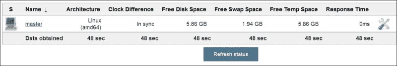

1.  要创建从节点，点击**新建节点**。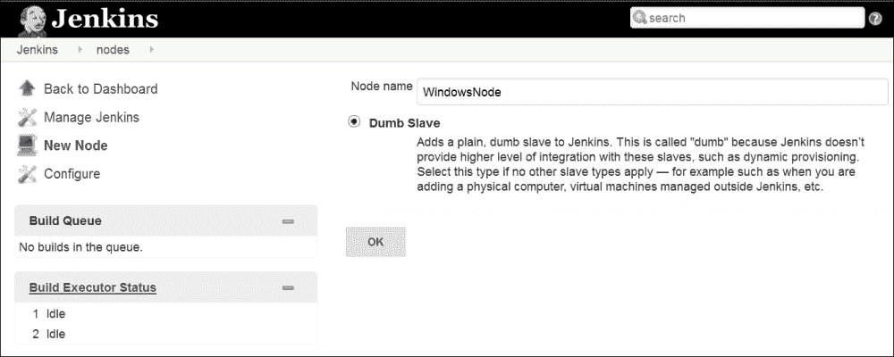

1.  提供**名称**、**描述**、**标签**等。选择**通过 Java Web Start 启动从节点代理**作为**启动方法**。提供**标签**；在我们的例子中，它是`java8`：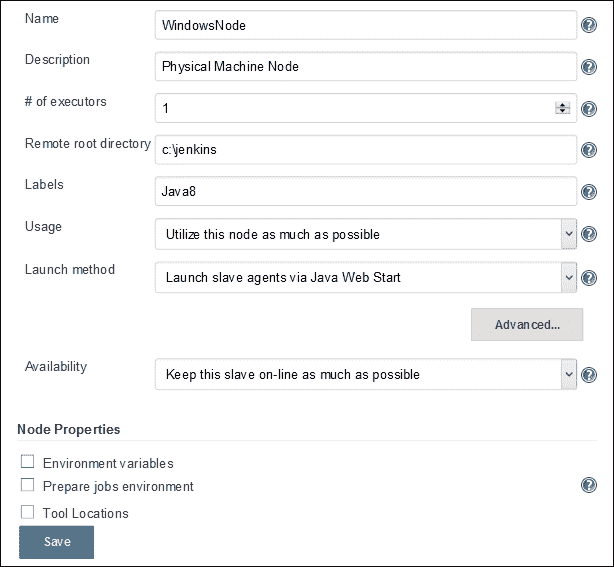

1.  点击**保存**。它将打开一个页面，详细说明如何启动从节点。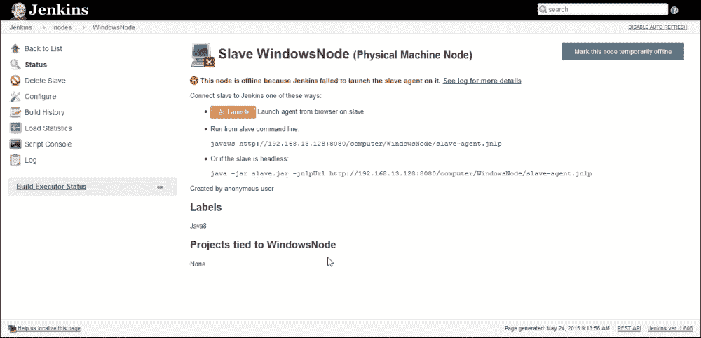

1.  在 Windows 机器上打开终端并运行`javaws http://192.168.13.128:8080/computer/WindowsNode/slave-agent.jnlp`。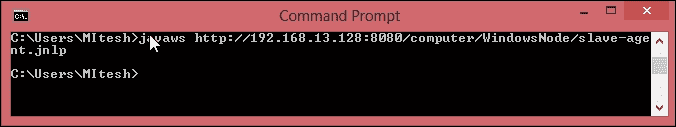

    它将打开一个下载应用程序的对话框。

    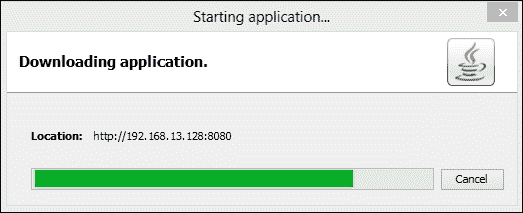

1.  运行**Jenkins 远程代理**。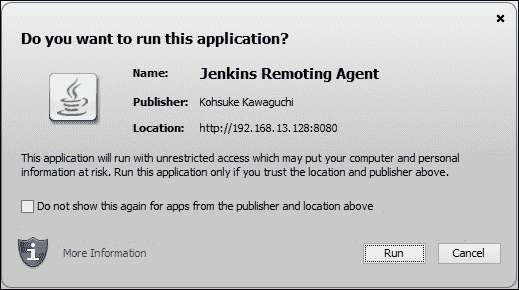

    将打开一个小窗口用于 Jenkins 从节点代理。

    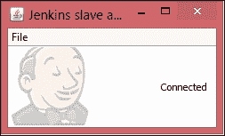

    **从节点 WindowsNode**将通过 JNLP 代理连接。

    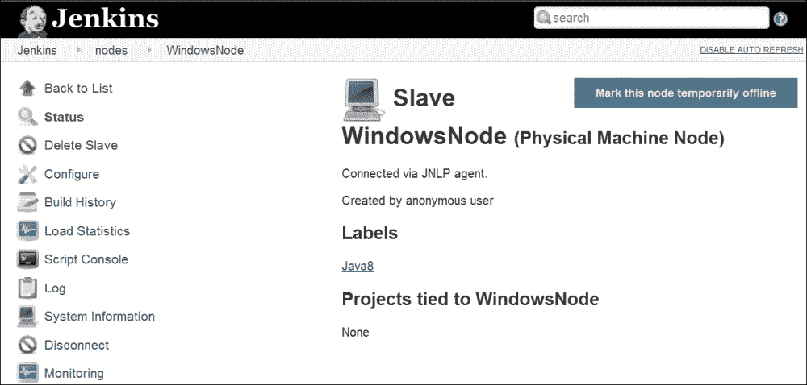

1.  在 Jenkins 仪表板上，前往**管理 Jenkins**。点击**管理节点**链接。它将提供所有节点的信息，如下截图所示。在左侧边栏的**构建执行器状态**部分验证两个节点。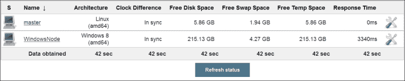

1.  如果我们想在特定节点上运行选择性构建作业，则可以按作业配置它，如下截图所示。勾选**限制此项目可运行的位置**并提供在作业配置页面上给定特定节点的**标签表达式**。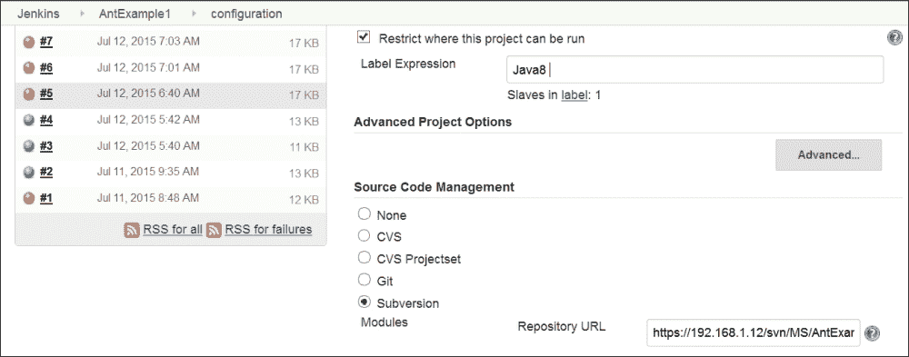

1.  点击**立即构建**以执行构建。验证控制台并查找我们在前一部分中配置的 WindowsNode 上的远程构建。

    它将在从节点上检出代码并在特定节点上执行操作。

    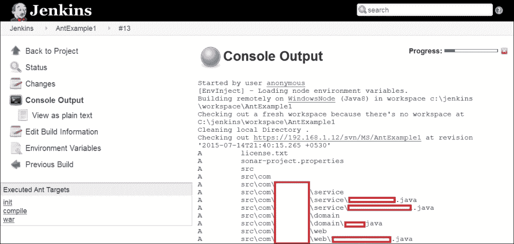

这种配置在希望在特定节点上可用的特定运行时环境中运行构建作业时很有用。

# Jenkins 监控与 JavaMelody

监控插件通过 JavaMelody 提供 Jenkins 的监控。它提供 CPU、内存、系统平均负载、HTTP 响应时间等图表。还提供 HTTP 会话、错误和日志、GC 操作、堆转储、无效会话等的详细信息。从 Jenkins 仪表板安装监控插件。

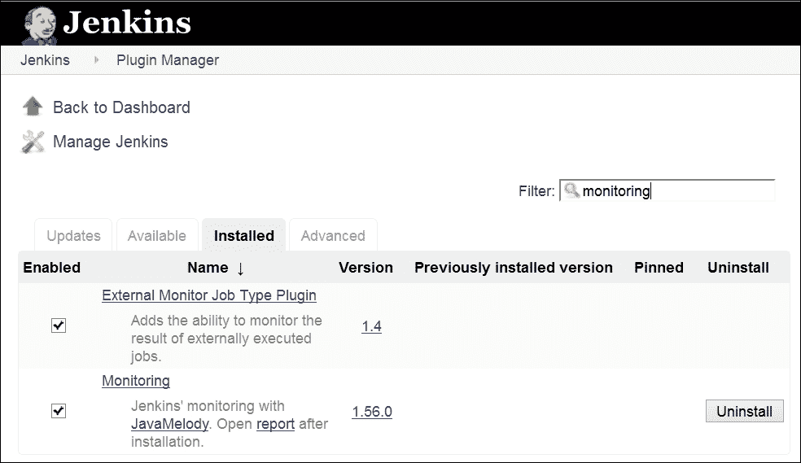

1.  在 Jenkins 仪表板上，点击**管理 Jenkins**。点击**Jenkins 主节点监控**，如下截图所示：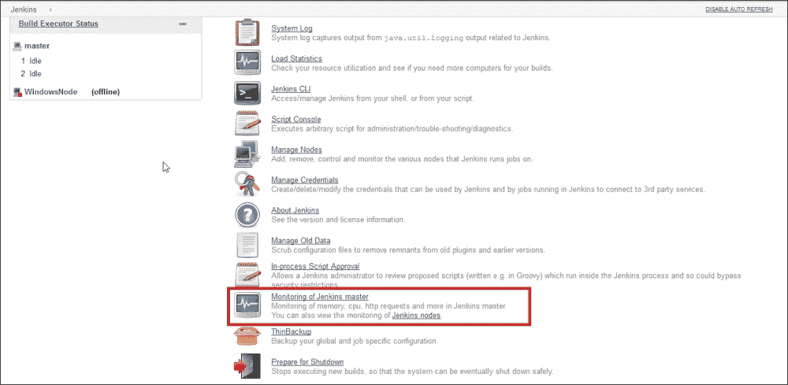

1.  它将打开 JavaMelody 监控的统计信息，如下截图所示。观察所有统计信息：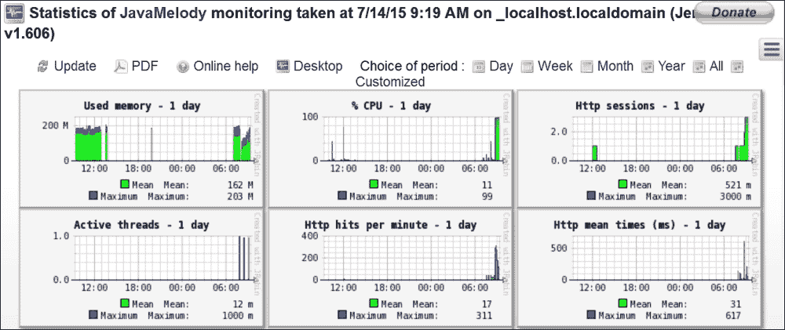

1.  向下滚动页面，我们将找到**系统错误日志统计信息**。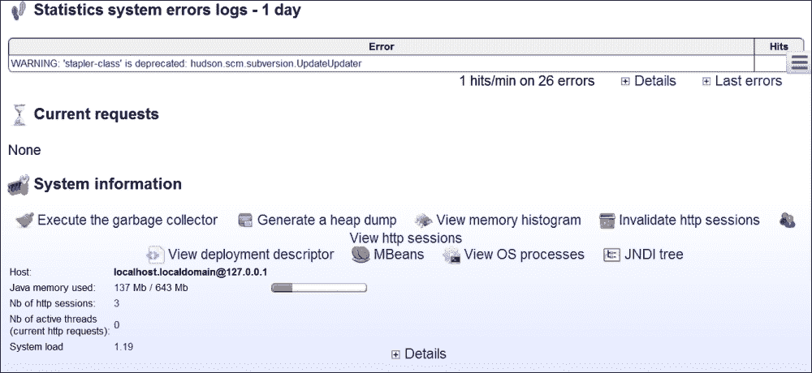

1.  要获取更多信息，请点击任何部分的**详细信息**链接。HTTP 统计信息如下所示：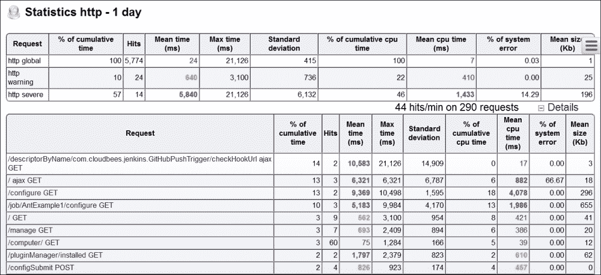

1.  更多详情请访问 [`wiki.jenkins-ci.org/display/JENKINS/Monitoring`](https://wiki.jenkins-ci.org/display/JENKINS/Monitoring) 了解监控插件。

# 管理磁盘使用

1.  磁盘使用插件记录磁盘使用情况。从 Jenkins 仪表板安装**磁盘使用插件**。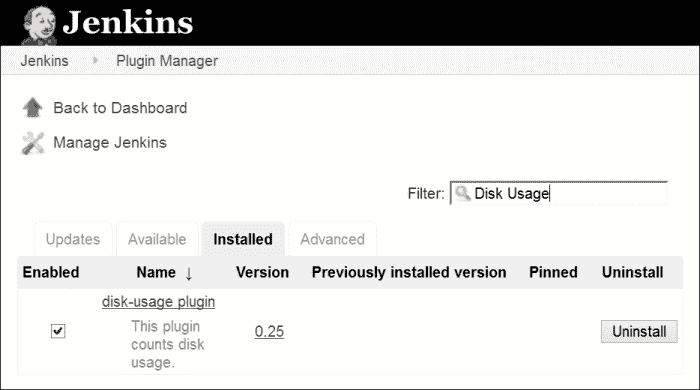

1.  插件成功安装后，我们将在管理 Jenkins 页面获得**磁盘使用**链接，如下截图所示：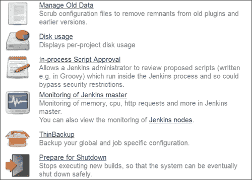

1.  磁盘使用插件将展示所有作业和所有工作区的项目级详细信息，并显示**磁盘使用趋势**。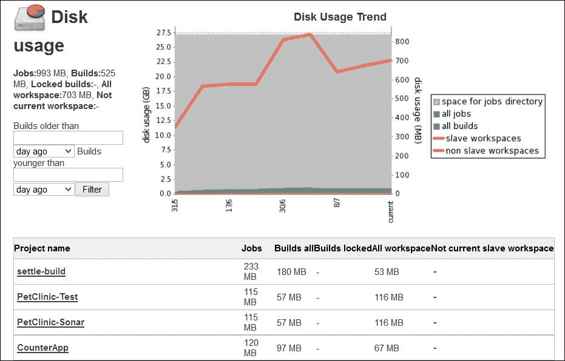

如需了解更多关于磁盘使用插件的详细信息，请访问[`wiki.jenkins-ci.org/display/JENKINS/Disk+Usage+Plugin`](https://wiki.jenkins-ci.org/display/JENKINS/Disk+Usage+Plugin)。

# 使用构建监控插件进行构建监控

**构建监控插件**提供所选 Jenkins 任务状态的详细视图。它显示所选任务的状态和进度，以及可能负责“破坏构建”的人员姓名。此插件支持 Claim 插件、视图任务过滤器、构建失败分析器和 CloudBees 文件夹插件。

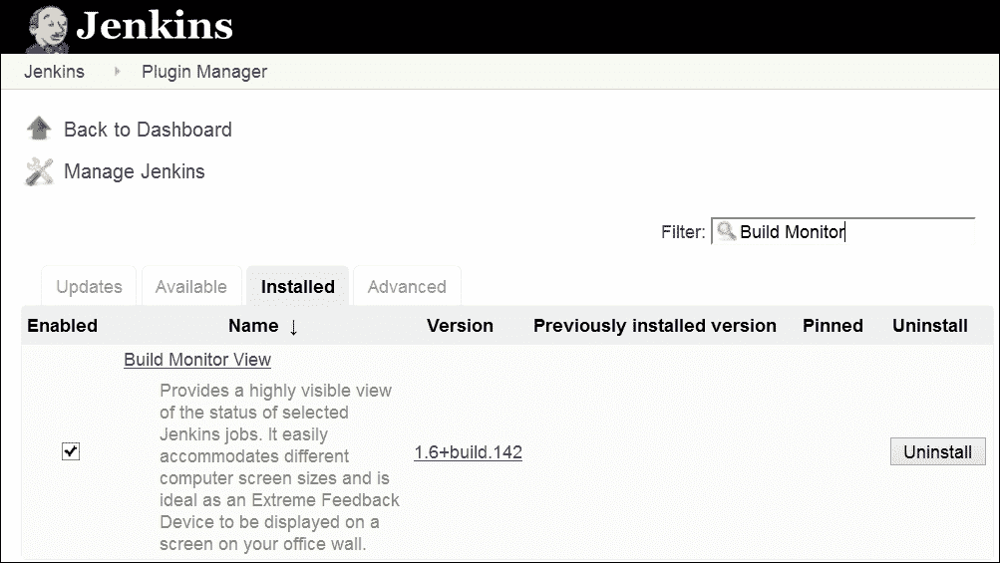

1.  将使用 Dashboard View 插件创建一个视图，该视图提供构建任务特定监控的详细信息。创建新视图并选择**构建监控视图**。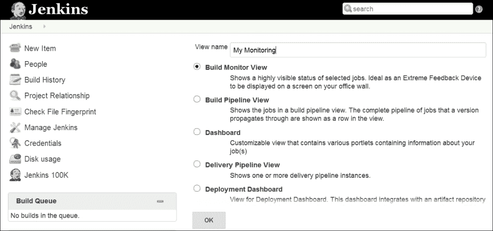

1.  选择**任务**并保存详细信息。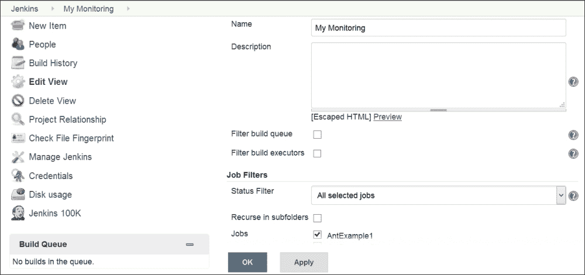

1.  点击新创建的视图，我们将看到类似于以下截图的界面：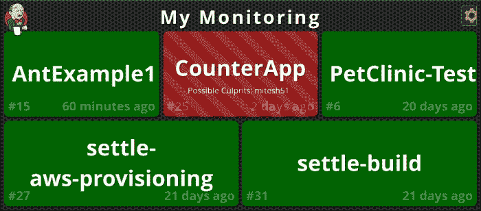

如需了解更多关于插件的详细信息，请访问[`wiki.jenkins-ci.org/display/JENKINS/Build+Monitor+Plugin`](https://wiki.jenkins-ci.org/display/JENKINS/Build+Monitor+Plugin)。

# 访问控制与授权管理

Jenkins 支持多种安全模型，并能与不同的用户存储库集成。

1.  转到 Jenkins 仪表板，点击**管理 Jenkins**，然后点击**配置全局安全**。

1.  点击**启用安全**。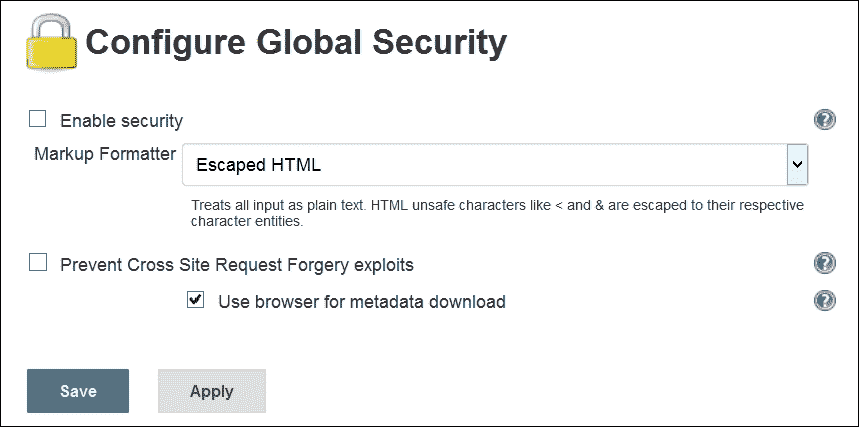

    一旦我们启用安全，所有选项都将可见，如下面的截图所示：

    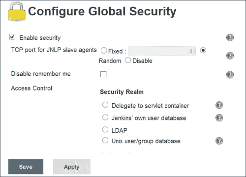

1.  点击**Jenkins 自有用户数据库**。点击**保存**。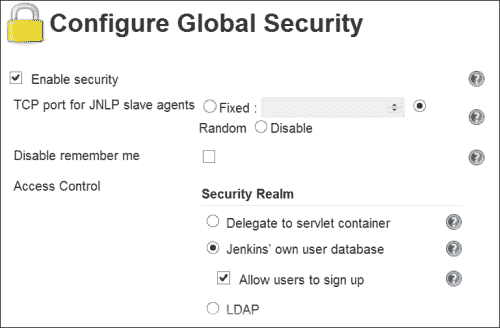

1.  现在，点击右上角的**注册**链接。提供**用户名**、**密码**、**全名**和**电子邮件地址**。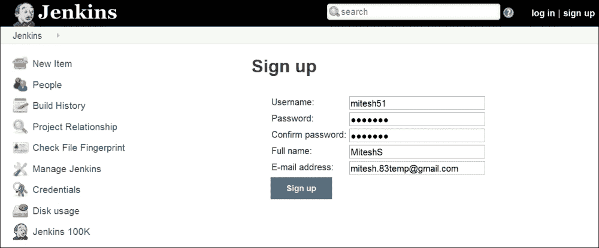

1.  点击仪表板上的**登录**链接。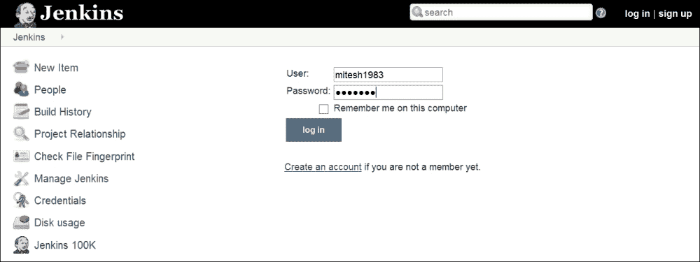

    我们将看到右上角显示用户名的 Jenkins 仪表板。

    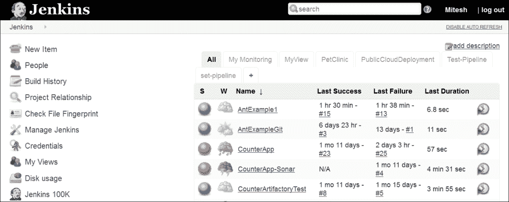

1.  点击**人员**以验证所有用户。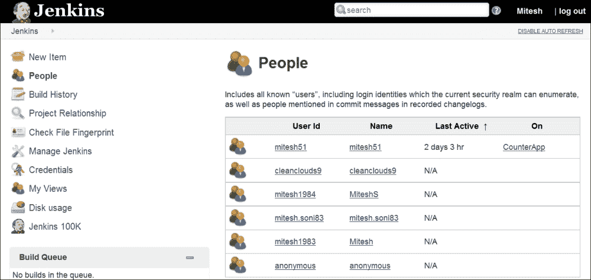

1.  在 Jenkins 仪表板上，点击**管理 Jenkins**。点击**管理用户**。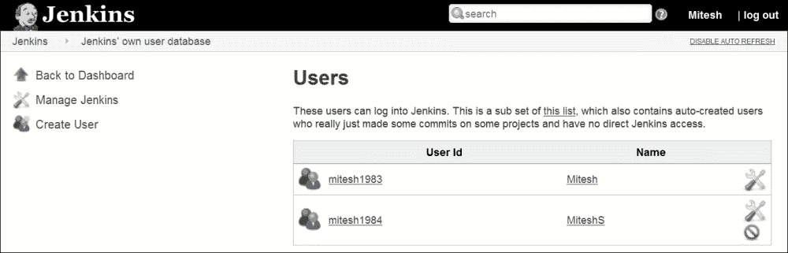

    我们可以在同一页面上编辑用户详细信息。这是用户的一个子集，其中也包含自动创建的用户。

# 维护角色和基于项目的安全性

对于授权，我们可以在**配置全局安全**页面上定义**基于矩阵的安全性**。

1.  添加组或用户，并根据不同部分如**凭证**、**从属**、**任务**等配置安全设置。

1.  点击 **保存**。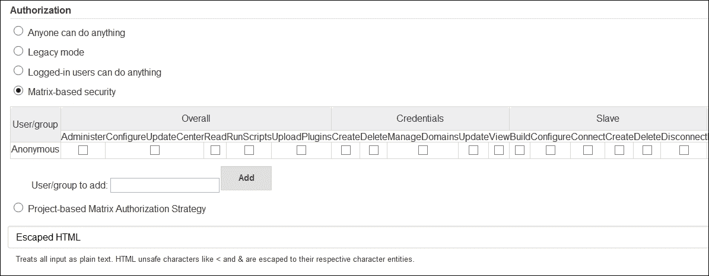

    我们可以使用多个用户进行基于矩阵的安全设置，如下面的截图所示：

    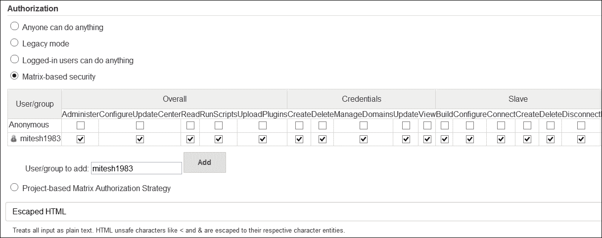

1.  尝试使用新添加的无权限用户访问 Jenkins 仪表板，我们将发现授权错误。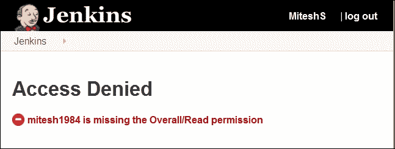

1.  现在为新添加的用户提供总体读取权限；构建、读取和工作区权限。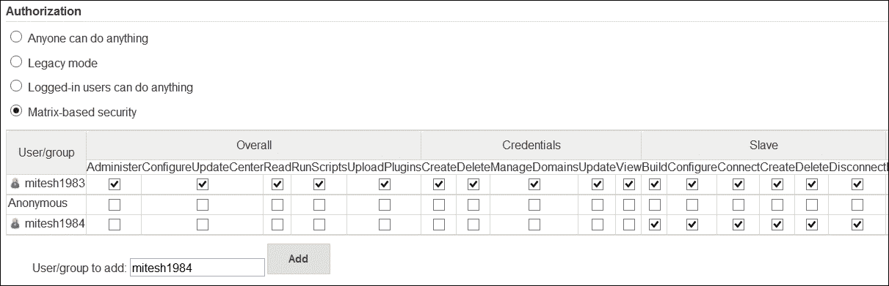

1.  使用新添加的用户登录并验证我们是否可以看到仪表板。我们看不到 **管理 Jenkins** 链接，因为我们未提供这些权限。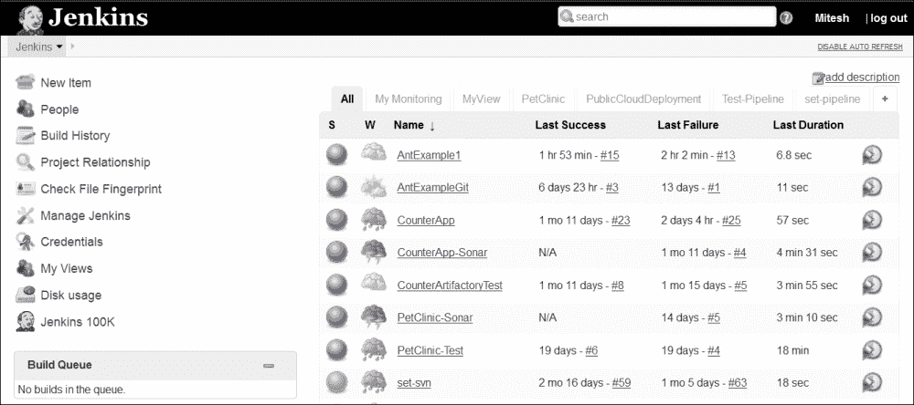

1.  点击任何构建作业。构建链接可用，因为我们已授予权限，但配置链接不可用，因为我们未为其授予权限。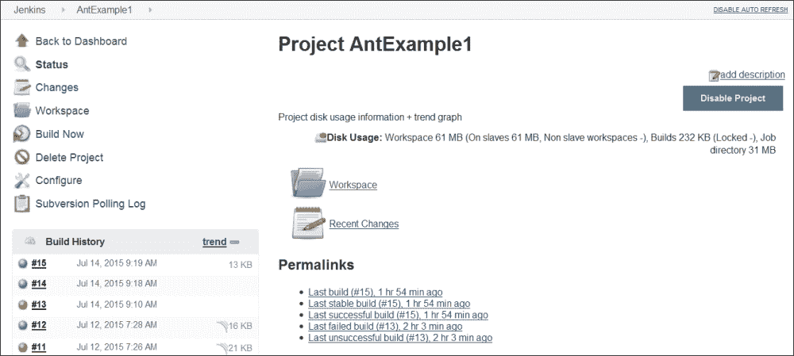

1.  我们还可以设置 **基于项目的矩阵授权策略**。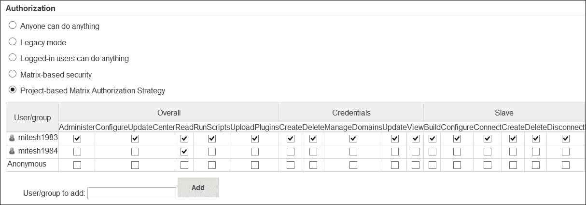

1.  转到特定构建作业的配置并 **启用基于项目的安 全**。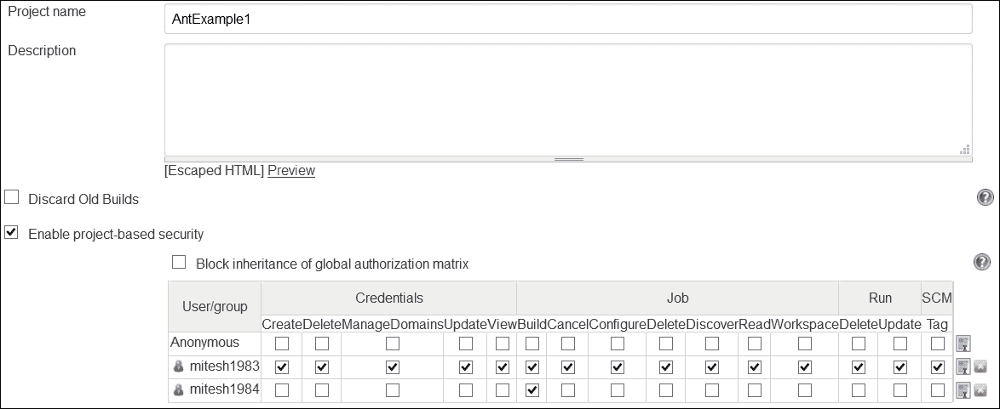

1.  为不同用户分配权限，并使用特定用户名登录以验证授权策略是否正常工作。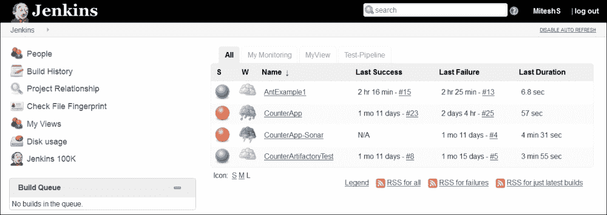

1.  验证构建详细信息，如下面的截图所示：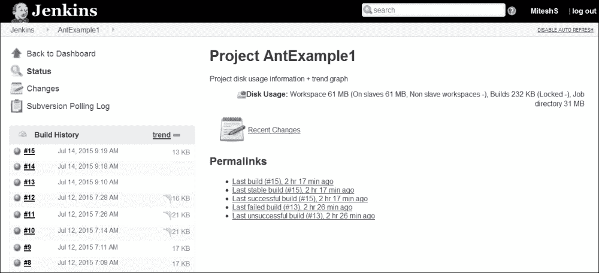

我们已经介绍了 Jenkins 安全配置的基础知识。作为练习，请探索其他选项。如果授权设置不正确，可以通过编辑 `config.xml` 进行更正。将其视为自学内容。

# 审计轨迹插件 – 概览与使用

审计轨迹插件记录执行特定 Jenkins 操作（如配置作业）的用户。此插件在 Jenkins 主配置页面中添加了一个 **审计轨迹** 部分。

安装 **审计轨迹插件**。

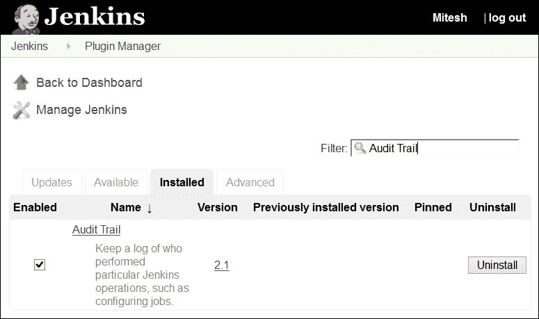

在 Jenkins 配置中，配置 **日志记录器**，如下面的截图所示：

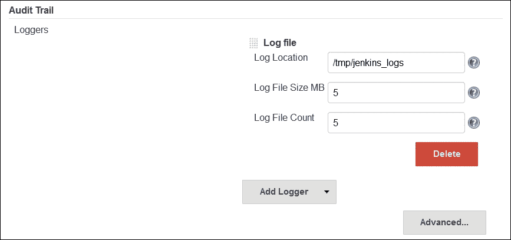

停止 Jenkins 服务器并重新启动。运行任何构建作业并打开日志文件以验证日志记录。

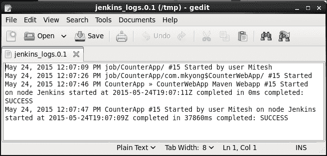

要获取更多详细信息，请访问 [`wiki.jenkins-ci.org/display/JENKINS/Audit+Trail+Plugin`](https://wiki.jenkins-ci.org/display/JENKINS/Audit+Trail+Plugin)。

# 自测问题

Q1. 使从节点上线有哪些不同方式？

1.  从浏览器在从节点上启动代理

1.  从命令行运行 `slave-agent.jnlp` 命令

1.  运行 `java -jar slave.jar`

1.  以上所有

Q2. Jenkins 监控为哪些选项提供图表？

1.  中央处理器

1.  内存

1.  系统负载平均值

1.  HTTP 响应时间

1.  以上所有

Q3. Jenkins 中的安全领域有哪些选项？

1.  委托给 Servlet 容器

1.  Jenkins 自身的用户数据库

1.  LDAP

1.  Unix 用户/组数据库

1.  以上所有

# 总结

无论我们构建了什么好东西，最终都会塑造我们自己。在本章中，我们介绍了主从节点的概念，如何监控构建作业，以及使用管理功能进行统计报告。我们还了解了如何通过使用基于角色的安全配置来确保 Jenkins 环境的安全，包括身份验证和授权。我们看到了审计跟踪插件如何在 Jenkins 中存储审计细节。

在下一章中，我们将介绍一些重要的插件，这些插件为 Jenkins 增加了显著的价值。在我们告别之前，让我们享受最后的旅程。
