# 第八章：超越 Jenkins 基础 —— 利用“必备”插件

|   | *"力量和成长只来自持续不断的努力和奋斗。"* |   |
| --- | --- | --- |
|   | --*拿破仑·希尔* |

在上一章中，我们涵盖了 Jenkins 的管理、监控以及安全方面。在安全方面，我们理解了认证和授权的工作原理。现在，是时候认识一些重要插件带来的附加价值了。

本章涵盖了 Jenkins 的高级用法，这在特定场景下极为有用。本章还涵盖了基于场景的特定插件的使用，这些插件有助于开发和运维团队更好地利用 Jenkins。其中一些插件在通知场景中极为有用。以下是本章将涵盖的主要主题：

+   Extended E-mail Plugin

+   Workspace cleanup Plugin

+   Pre-scm-buildstep Plugin

+   Conditional BuildStep Plugin

+   EnvInject Plugin

+   Build Pipeline Plugin

# Extended Email Plugin

Email-ext 插件扩展了 Jenkins 提供的电子邮件通知功能。它在触发邮件通知的条件和内容生成方面提供了更多定制化选项。

您可以从 Jenkins 仪表板安装此插件。

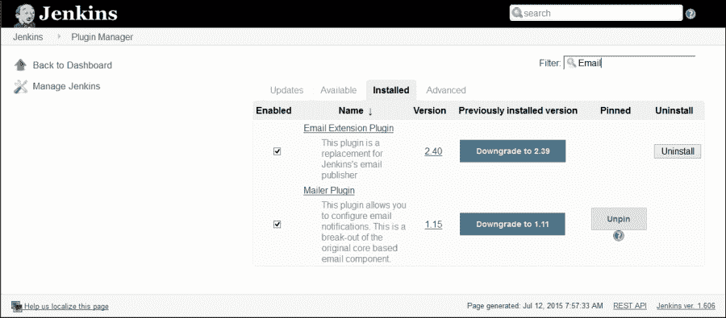

定制化可在三个领域进行：

+   触发器：我们可以选择导致发送电子邮件通知的条件

+   内容：我们可以指定每个触发电子邮件的主题和正文内容；我们可以在内容中使用默认环境变量

+   收件人：我们可以指定谁应该在触发时收到电子邮件

在 Jenkins 仪表板中，点击**管理 Jenkins**，然后点击**系统配置**。前往**扩展电子邮件通知**部分，配置应与您的 SMTP 邮件服务器设置相匹配的全球电子邮件扩展属性。

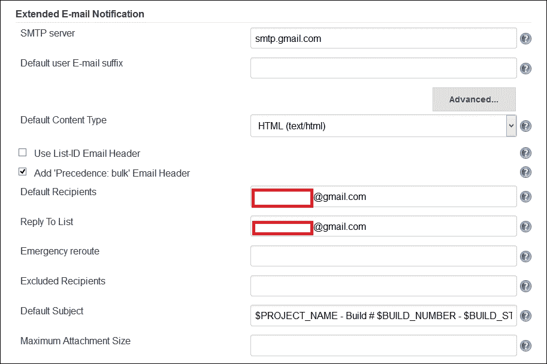

我们还可以自定义主题、最大附件大小、默认内容等。

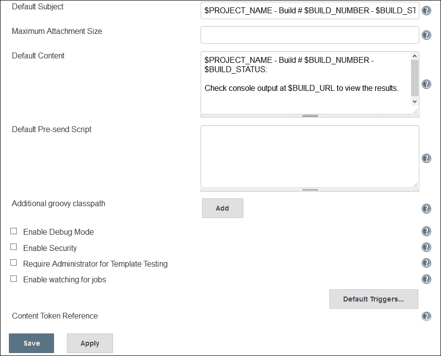

要在构建作业中配置特定的 Email-ext，请在项目配置页面上启用它。在**构建后操作**中选择标有**可编辑邮件通知**的复选框。配置由逗号（或空格）分隔的全球收件人、主题和内容列表。在高级配置中，我们可以配置预发送脚本、触发器、电子邮件令牌等。

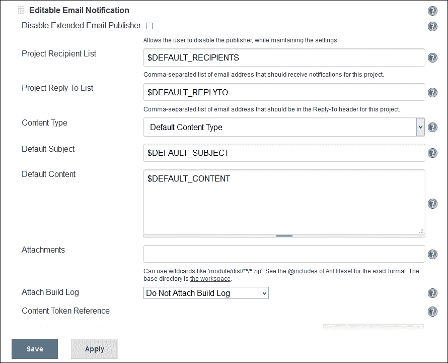

预发送脚本功能允许我们编写一个脚本，该脚本可以在发送消息之前修改`MimeMessage`对象。触发器允许我们配置必须满足的条件以发送电子邮件。Email-ext 插件使用令牌允许动态数据插入到收件人列表、电子邮件主题行或正文中。更多详情，请访问[`wiki.jenkins-ci.org/display/JENKINS/Email-ext+plugin`](https://wiki.jenkins-ci.org/display/JENKINS/Email-ext+plugin)。

# Workspace cleanup Plugin

工作区清理插件用于在构建之前或构建完成并保存工件时从 Jenkins 删除工作区。如果我们想在干净的工件区开始 Jenkins 构建，或者我们想在每次构建之前清理特定目录，那么我们可以有效地使用此插件。删除工作区有不同的选项。

你可以在 Jenkins 仪表板上安装此插件。

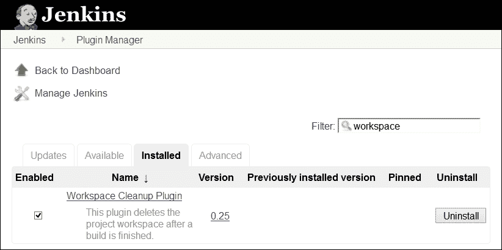

我们可以根据构建作业的状态应用要删除的文件的模式。我们可以添加工作区删除的后构建操作。

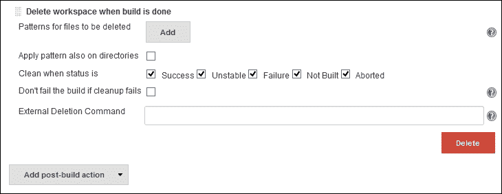

更多详情，请访问[`wiki.jenkins-ci.org/display/JENKINS/Workspace+Cleanup+Plugin`](https://wiki.jenkins-ci.org/display/JENKINS/Workspace+Cleanup+Plugin)。

# Pre-scm-buildstep 插件

Pre-scm-buildstep 插件允许在 SCM 检出之前运行特定构建步骤，以防我们需要根据任何特殊要求（如添加包含 SCM 设置的文件、执行创建某些文件的命令、清理或调用需要在检出前运行的其他脚本）对工作区执行任何构建步骤操作。

你可以在 Jenkins 仪表板上安装此插件。

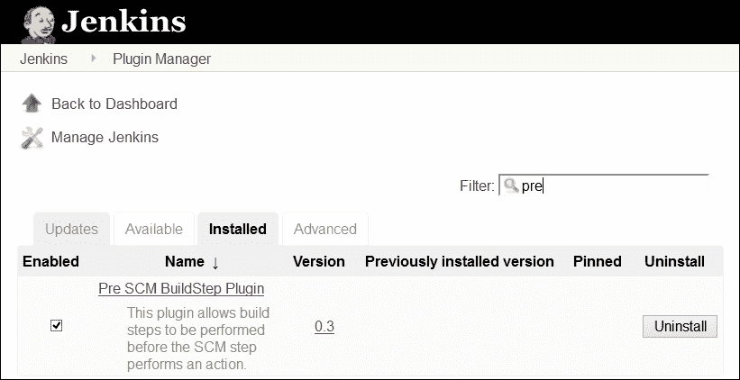

从列表中选择条件步骤，如下面的截图所示：

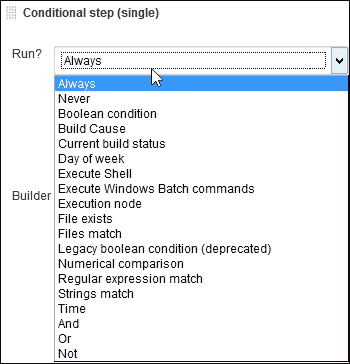

根据需求选择条件步骤，并提供基于操作系统的命令列表，如下面的截图所示：

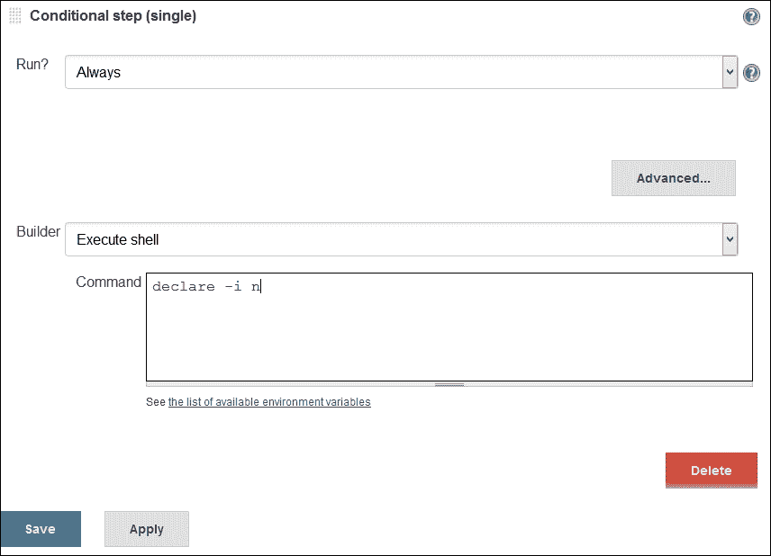

更多详情，请访问[`wiki.jenkins-ci.org/display/JENKINS/pre-scm-buildstep`](https://wiki.jenkins-ci.org/display/JENKINS/pre-scm-buildstep)。

# 条件构建步骤插件

构建步骤插件允许我们包装任意数量的其他构建步骤，根据定义的条件控制它们的执行。

你可以在 Jenkins 仪表板上安装此插件。

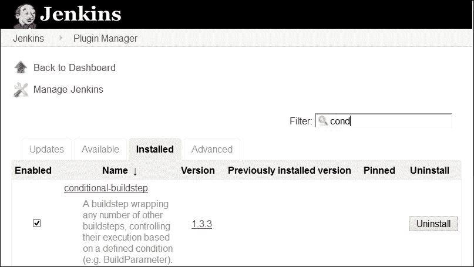

此插件定义了几种核心运行条件，例如：

+   始终/从不：从作业配置中禁用构建步骤

+   布尔条件：如果令牌扩展为 true 的表示，则执行步骤

+   当前状态：如果当前构建状态在配置/特定范围内，则执行构建步骤

+   文件存在/文件匹配：如果文件存在或匹配模式，则执行步骤

+   字符串匹配：如果两个字符串相同，则执行步骤

+   数值比较：根据比较两个数字的结果执行构建步骤

+   正则表达式匹配：提供正则表达式和标签，如果表达式与标签匹配，则执行构建步骤

+   时间/星期：在一天中的指定时间段或一周的某一天执行构建作业

+   与/或/非：逻辑操作，用于组合和反转运行条件的意义

+   构建原因：根据构建原因执行构建步骤，例如，由计时器、用户、SCM 变更等触发

+   脚本条件：利用 shell 脚本决定是否跳过某一步骤

+   批处理条件：利用批处理决定是否跳过某一步骤

从**添加构建步骤**中选择**条件步骤（单个）**。

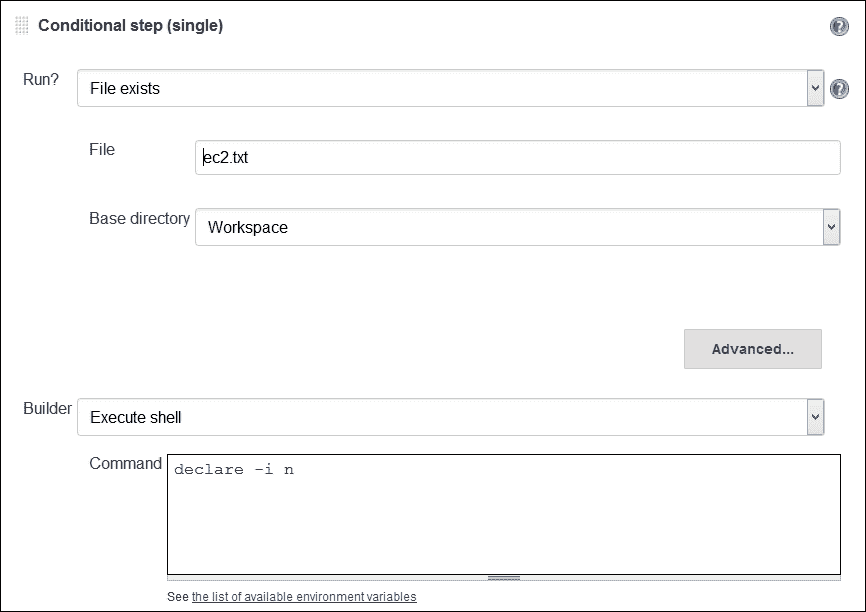

从**添加构建步骤**中选择**条件步骤（多个）**。我们可以在此条件步骤中添加多个条件步骤。

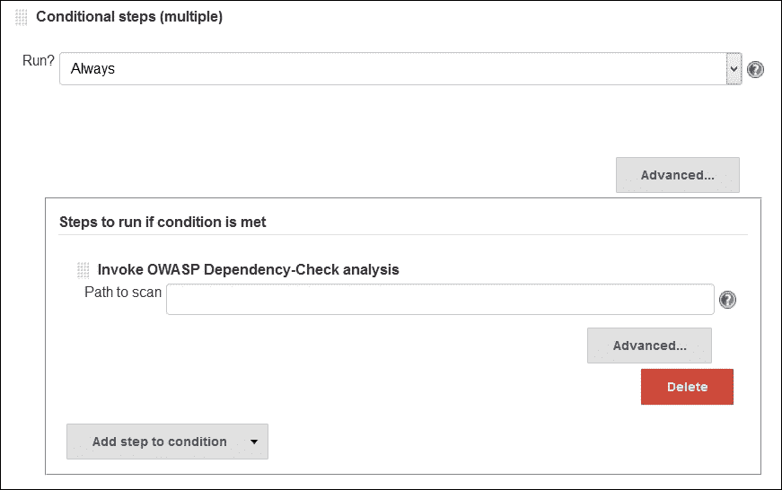

欲了解更多详情，请访问[`wiki.jenkins-ci.org/display/JENKINS/Conditional+BuildStep+Plugin`](https://wiki.jenkins-ci.org/display/JENKINS/Conditional+BuildStep+Plugin)。

# EnvInject 插件

我们知道，开发、测试和生产等不同环境需要不同的配置。

从 Jenkins 仪表板安装此插件。

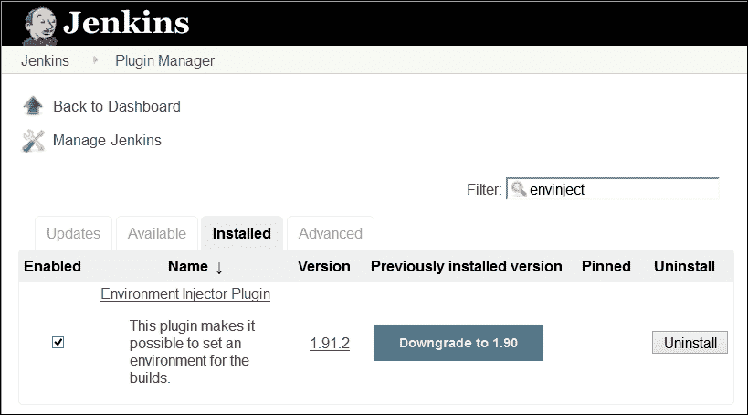

EnvInject 插件提供了为不同构建作业创建隔离环境的设施。EnvInject 插件在节点启动时、SCM 签出前后、运行时的构建步骤等情况下注入环境变量。选择**向构建过程注入环境变量**，具体针对构建作业。

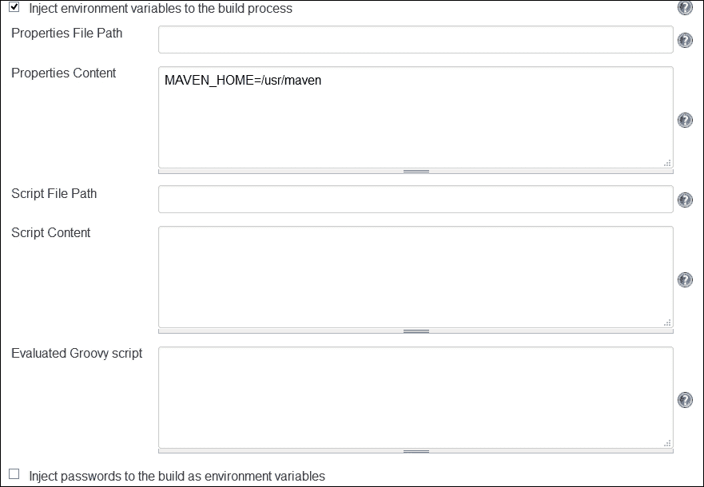

欲了解更多详情，请访问[`wiki.jenkins-ci.org/display/JENKINS/EnvInject+Plugin`](https://wiki.jenkins-ci.org/display/JENKINS/EnvInject+Plugin)。

# 构建管道插件

持续集成已成为应用程序开发的流行实践。构建管道插件提供了一个管道视图，显示上游和下游连接的工作，这些工作通常形成一个构建管道，并具有定义手动触发器或审批流程的能力。我们可以在部署到生产环境之前，通过不同的质量门协调版本升级，创建一系列工作。

从 Jenkins 仪表板安装此插件。

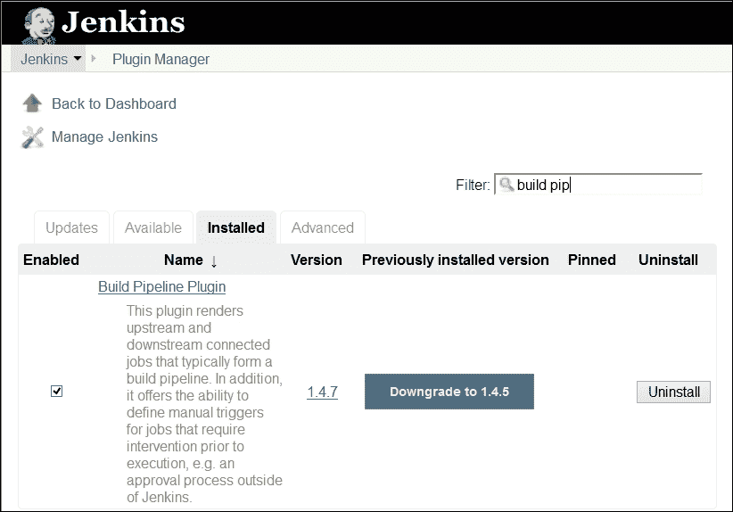

我们已安装仪表板视图插件。我们将为四个构建作业创建一个管道。假设我们有四个构建作业，如下图所示，每个构建作业的目标如下：

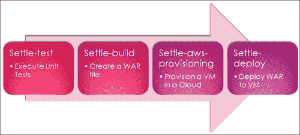

1.  创建一个新视图并选择**构建管道视图**。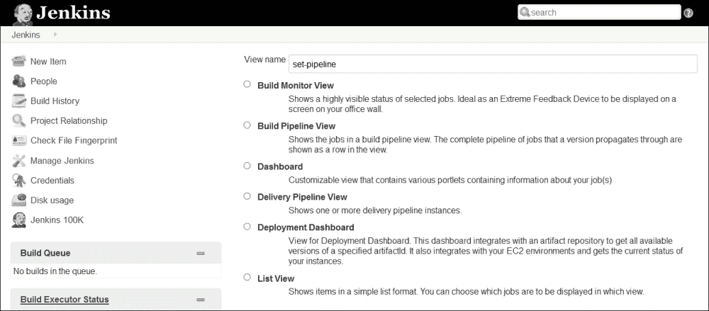

1.  在构建管道的配置中提供描述并选择布局。

1.  选择初始工作并设置显示的构建数量，然后保存配置。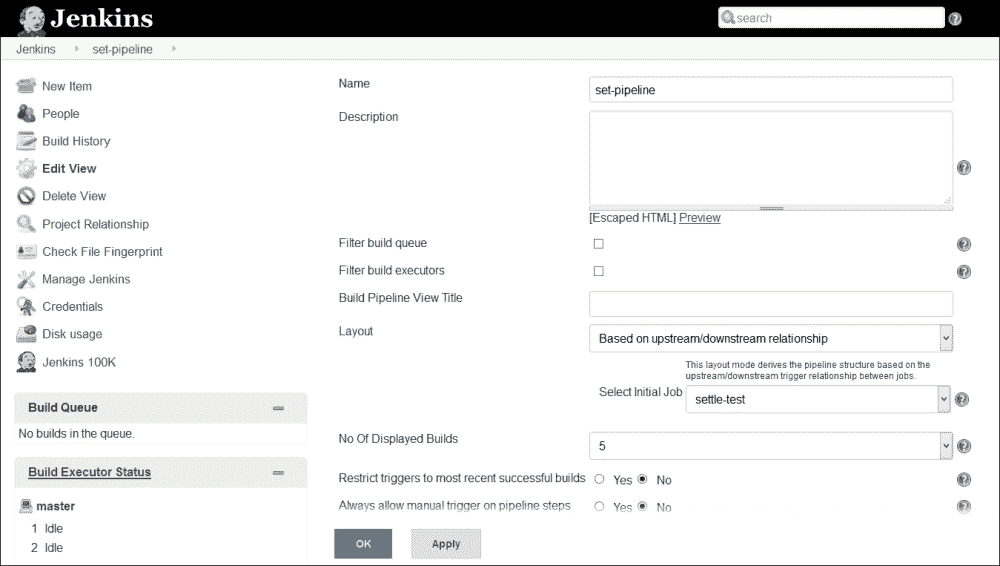

1.  在构建管道的配置中，选择触发参数化构建的工作，如**后构建操作**中的`settle-build`工作。它将是管道中的第一个构建工作。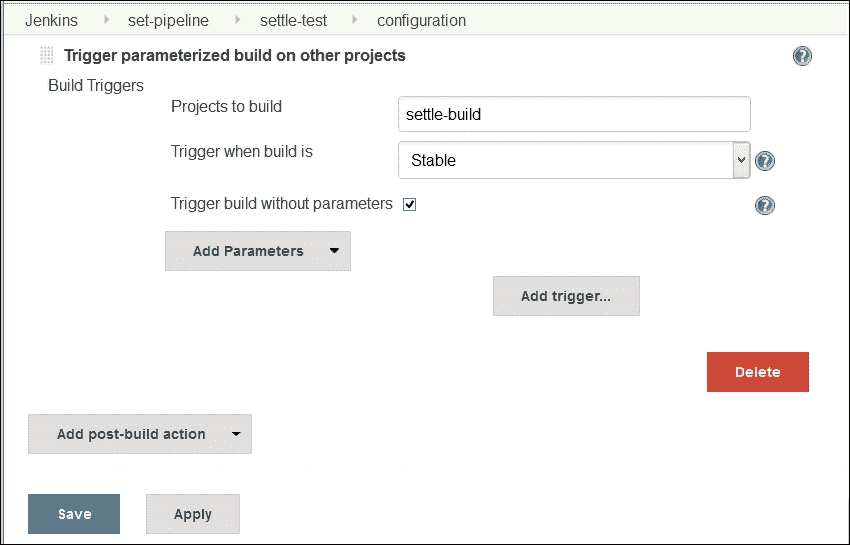

1.  在`settle-build`作业中，在**构建后操作**中触发`settle-aws-provisioning`作业的参数化构建。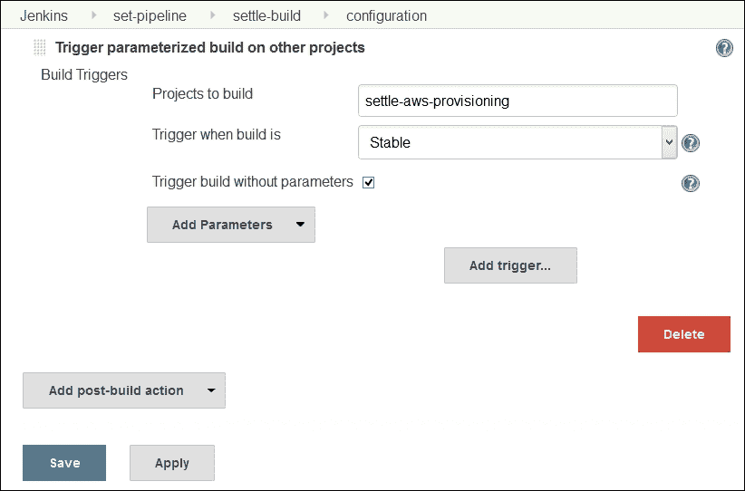

1.  在`settle-aws-provisioning`作业中，在**构建后操作**中为`settle-deploy`作业执行手动构建步骤。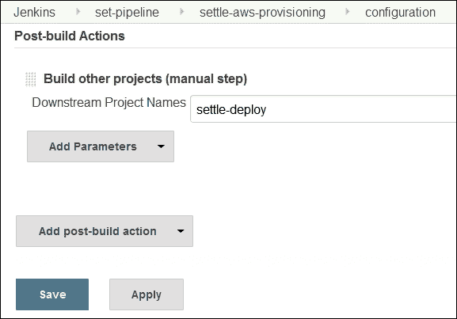

1.  在`settle-aws-provisioning`作业中，在**构建后操作**中触发`settle-deploy`作业的参数化构建。在`settle-deploy`构建作业中，我们可以编写脚本或执行命令，以便将`war`文件部署到云环境中新配置的虚拟机上。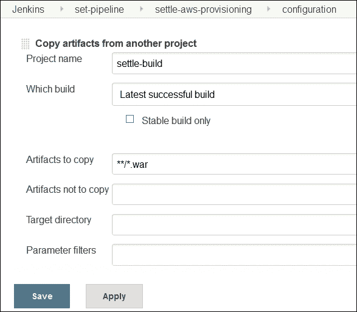

1.  前往我们之前创建的仪表板视图，并验证在上一节配置的构建作业后创建的管道。新的构建管道将如以下图示创建：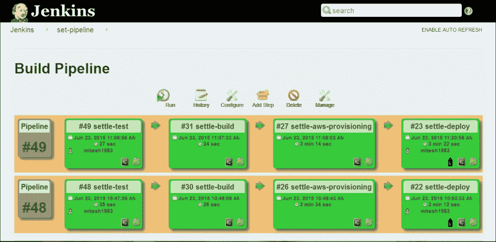

更多详情，请访问[`wiki.jenkins-ci.org/display/JENKINS/Build+Pipeline+Plugin`](https://wiki.jenkins-ci.org/display/JENKINS/Build+Pipeline+Plugin)。

# 自我测试问题

Q1. 扩展邮件插件在哪些领域提供定制化？

1.  触发器

1.  内容

1.  收件人

1.  以上所有

Q2. 工作区清理插件提供了一个选项，当构建状态为：

1.  成功

1.  不稳定

1.  失败

1.  未构建

1.  中止

1.  以上所有

# 总结

我们学习了如何使用一些重要插件来辅助 Jenkins 现有的功能，以满足特定需求。我们涵盖了 Jenkins 的基本使用，包括安装运行时环境、创建构建作业、使用 Jenkins 云、监控、管理、安全以及附加插件。对于本书的范围，这似乎已经足够。下一步是在云环境中动态配置资源，以实现 DevOps 旅程中的端到端自动化。

如果你想要一个幸福的结局，当然这取决于你在哪里停止你的故事。我们当然知道在哪里停止我们的故事！
