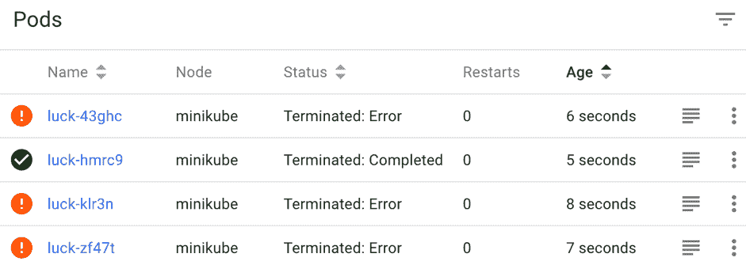
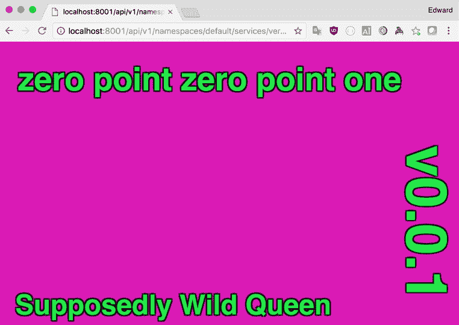
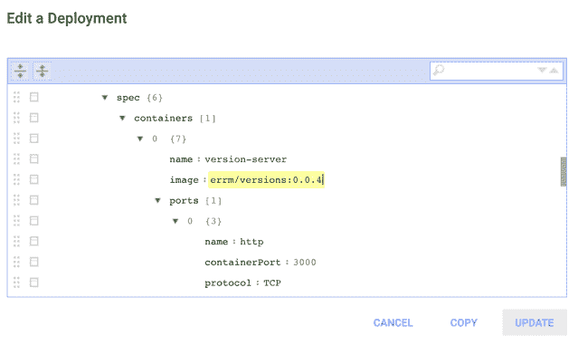

# 四、管理应用中的变更

在[第 2 章](02.html)、*启动你的引擎*中，我们首先看了使用部署在 Kubernetes 上运行应用。在本章中，我们将深入讨论 Kubernetes 提供的工具，这些工具用于管理我们在您的集群上运行的 pods。

*   我们将学习如何通过使用`Job`资源来确保批处理任务成功完成
*   我们将学习如何使用`CronJob`资源按计划的时间间隔运行作业
*   最后，我们将学习如何使用部署来保持长时间运行的应用无限期运行，并在需要进行更改时更新它们或它们的配置

我们将研究如何使用 Kubernetes 以不同的方式启动吊舱，具体取决于我们运行的工作负载。

您将了解更多关于如何使用部署资源来控制 Kubernetes 向长时间运行的应用推出更改的方式。您将发现使用 Kubernetes 执行常见部署模式的方法，例如蓝绿色和淡黄色部署。

根据设计，豆荚无论如何都不耐用。正如我们之前讨论过的，有一大堆条件会导致吊舱的寿命终止。它们包括:

*   **底层节点的故障**:可能是因为一些意外事件导致的，比如硬件故障。或者可能是故意的；例如，在利用现货价格实例的集群中，如果实例需求增加，节点可以在没有警告的情况下被终止。

*   **调度器发起的 pod 驱逐**:调度器可以在需要的时候发起 Pod 驱逐，以优化集群上的资源使用。这可能是因为某些进程比其他进程具有更高的优先级，或者只是为了优化集群上的装箱。
*   用户手动移除的豆荚。
*   由于计划维护而拆除的吊舱；例如，通过使用`kubectl drain`命令。
*   由于网络分区，该节点对集群不再可见。
*   为准备缩减操作而从节点中移除的 Pods。

所以，如果 Kubernetes 的设计预期豆荚是短暂的，我们如何部署可靠的应用？当然，我们需要某种方法来运行我们的程序而不失败？谢天谢地，事实并非如此。这种设计的重要部分是，它准确地模拟了由于底层硬件和软件以及管理过程而可能在系统中发生的各种问题。Kubernetes 提供了许多控制器，我们作为用户可以直接与之交互来构建弹性服务，而不是试图让原始构建块(pod)本身对故障具有弹性。这些控制器负责为由于各种原因而丢失的吊舱创建替换物。

这些控制器分为四组，我们的选择实际上取决于我们想要运行的工作负载类型:

*   对于我们期望结束的流程，例如批处理作业或其他有限的流程，Kubernetes 提供了作业抽象。作业确保 pod 至少运行一次完成。
*   对于我们期望长期运行的吊舱，例如网络服务器或后台处理人员，Kubernetes 提供部署和较低级别的复制控制器或复制集。
*   对于我们希望在所有机器(或其中的一部分)上运行的豆荚，Kubernetes 提供了 DaemonSet。DaemonSet 通常用于提供构成平台一部分的特定于机器的服务，如日志管理或监控代理，通常用于部署覆盖网络的每个节点组件。
*   对于每一个豆荚需要一个稳定的身份或访问持久存储的豆荚组，Kubernetes 提供`StatefulSets`。(我们将在[第九章](09.html)、*仓储状态*中介绍`StatefulSets`。)

如果你回想一下我们在[第 1 章](01.html)、*谷歌为我们其他人提供的基础设施*中了解到的库本内特架构，请务必记住控制器管理器(运行所有这些控制器的库本内特微服务)是一个独立于调度器的独特进程。Kubernetes 的核心低级部分，如调度器和 kubelet，只知道 pods，而高级控制器不需要了解节点上实际调度和运行 pods 的任何细节。他们只需向应用编程接口服务器请求创建一个 pod，低级机器就能确保它们被正确调度和运行。

在本章中，我们将介绍作业、部署和 DaemonSet 提供的重要功能和配置选项。通过一些示例，您将开始了解何时使用每个资源来部署应用。您应该花时间了解每个控制器在做什么，以及您为什么想要使用它。

首先，将软件部署到分布式环境可能有点不寻常，因为在将软件部署到单台机器时，您可能对软件运行方式做出的许多假设可能在分布式系统中不起作用。

Kubernetes 做得很好，它使得部署大多数软件而不做任何修改成为可能。我喜欢认为 Kubernetes 让我们用一点简单换取了很多可靠性。

# 直接运行吊舱

Kubernetes 并不真的打算让用户直接在集群上提交和启动 pods。正如我们之前所讨论的，pods 被设计为短暂的，因此不适合运行我们希望确保执行已经完成或我们希望确保流程保持启动和运行的工作负载。

在这里，我们将从第一原则，发射吊舱开始，然后继续使用控制器来帮助我们管理它们。请记住，这是一个学习练习；如果您需要豆荚可靠地运行，您不应该以这种方式提交豆荚:

```
pod.yaml
apiVersion: v1
kind: Pod
metadata:
  name: hello-loop
spec:
  containers:
  - name: loop
    image: alpine
    command: ["/bin/sh"]
    args:
    - -c
    - while true; do echo "hello world"; sleep 2s; done

```

该吊舱启动无限循环，每 2 秒打印一次`hello world`。首先通过`kubectl`将吊舱提交给集群:

```
$ kubectl create -f pod.yaml
pod "hello-loop" created
```

当容器运行时下载映像时，创建 pod 可能需要一些时间。当这种情况发生时，您可以通过运行`kubectl describe pod/hello-loop`或使用仪表板来检查吊舱的状态。

The fact that Kubernetes makes it possible to control even the lowest-level abstractions, such as pods, through the API makes it easy to extend Kubernetes with additional functionality using or building add-on tools that can be just as powerful as the built-in controllers.

一旦吊舱启动并运行，您可以用`kubectl logs -f hello-loop`跟随输出，您应该每 2 秒钟看到一次`hello world`输出。

`kubectl logs` allows us to display logs from pods that have run on the cluster. If you know the name of the pod you want logs from, you can just pass the name as an argument. But if you are using a controller to launch a pod, you can use the name of a job or deployment in place of the pod name just by prefixing the name with the resource type.
If you have a label selector for the pod or pods you are interested in, they can be passed with the `-l` flag. With the `-c` flag, you can target a specific named container in a pod with more than one container; if the pod only has one container, this can be omitted.
Try running `kubectl`. It helps logs to discover some more of the options you can use to view just the logs you are interested in, including limiting them to a particular time period.

# 乔布斯

作业最简单的用例是启动一个 pod，并确保它成功运行到完成。

在下一个例子中，我们将使用 Ruby 编程语言计算并打印出前 100 个斐波那契数:

```
fib.yaml apiVersion: batch/v1
kind: Job
metadata:
  name: fib
spec:
  template:
     metadata:
       name: fib
     spec:
       containers:
       - name: fib
         image: ruby:alpine
         command: ["ruby"]
         args:
         - -e
         - |
           a,b = 0,1
           100.times { puts b = (a = a+b) - b }
       restartPolicy: Never
```

注意`spec`和`template`的内容和我们以前直接发射吊舱的规格非常相似。当我们定义工作中使用的 pod 模板时，我们需要选择`Never`或`OnFailure`的`restartPolicy`。

原因是作业的最终目标是运行 pod，直到它成功退出。如果底层 pod 成功退出后重新启动，pod 将继续重新启动，作业将永远不会完成。

将定义保存到文件中，然后使用`kubectl create`将其提交给集群:

```
$ kubectl create -f fib.yaml
job "fib" created
```

向 Kubernetes 提交作业后，您可以使用`kubectl describe`命令检查其状态。下载 Docker 映像和 Kubernetes 启动 pod 可能需要一段时间。吊舱运行后，您应该首先看到`1 Running`，然后看到`Pods Statues`字段中的`1 Succeeded`:

```
$ kubectl describe jobs/fib
Name: fib
Namespace: default
Selector: controller-uid=278fa785-9b86-11e7-b25b-080027e071f1
Labels: controller-uid=278fa785-9b86-11e7-b25b-080027e071f1
 job-name=fib
Annotations: <none>
Parallelism: 1
Completions: 1
Start Time: Sun, 17 Sep 2017 09:56:54 +0100
Pods Statuses: 0 Running / 1 Succeeded / 0 Failed
```

When waiting for Kubernetes to take some action, repeatedly running `kubectl` to find out what is happening can get tedious. I like to use the `watch` command in conjunction with `kubectl`. To watch Kubernetes launch this job, I could run:

`**$ watch kubectl describe jobs/fib**`

Most Linux distributions will include the watch command by default, or make it simple to install with a package manager. If you are on macOS, it's very simple to install with Homebrew:

`**$ brew install watch**`

我们可以使用`kubectl logs`查看我们工作的输出。请注意，我们不需要知道底层 pod 的名称；我们可以只提到工作的名字:

```
$ kubectl logs job/fib
...
83621143489848422977
135301852344706746049
218922995834555169026
```

我们还可以通过使用库本内特斯为我们添加到豆荚中的`job-name`标签来查看由这个工作用`kubectl get`创建的底层豆荚:

```
$ kubectl get pods -l job-name=fib --show-all
NAME READY STATUS RESTARTS AGE
fib-dg4zh 0/1 Completed 0 1m
```

The `--show-all` flag means that all pods are shown (even those that no longer have a running status).

请注意 Kubernetes 是如何根据作业名为我们的 pod 创建一个唯一的名称的。这很重要，因为如果已经创建的第一个 pod 以某种方式失败，Kubernetes 将需要基于相同的 pod 规范启动另一个 pod。

与直接启动 pod 相比，作业的一个关键优势是，作业不仅能够处理底层基础架构导致的错误，这些错误可能会导致 pod 在完成之前丢失，还能够处理运行时发生的错误。

为了说明这是如何工作的，这个作业模拟了一个进程，该进程(大部分)以非零退出状态失败，但有时以(成功的)零退出状态退出。这个 Ruby 程序选择一个从 0 到 10 的随机整数，然后用它退出。因此，平均而言，Kubernetes 在成功退出前必须运行 pod 10 次:

```
luck.yaml apiVersion: batch/v1
kind: Job
metadata:
  name: luck
spec:
  template:
    metadata:
      name: luck
    spec:
      containers:
      - name: luck
      image: ruby:alpine
      command: ["ruby"]
      args: ["-e", "exit rand(10)"]
restartPolicy: Never
```

如前所述，使用`kubectl`向集群提交作业:

```
$ kubectl create -f luck.yaml
job "luck" created
```

除非你非常幸运，否则当你检查工作时，你应该看到 Kubernetes 必须在一个以 0 状态退出之前启动许多吊舱:



Inspecting the pods launched by the luck job using the Kubernetes dashboard

在本例中，吊舱规格的`restartPolicy`为`Never`。这意味着当 pod 以非零退出状态退出时，pod 被标记为终止，作业控制器启动另一个 pod。也可以用`OnFailure`的`restartPolicy`来运行作业。

尝试编辑`luck.yaml`进行此更改。删除`luck`作业的第一个版本，并提交新版本:

```
$ kubectl delete jobs/luck
job "luck" deleted
$ kubectl create -f luck.yaml
job "luck" created
```

这一次，您应该注意到，Kubernetes 没有快速启动新的 pod 直到成功退出，而是重新启动一个 pod 直到成功。您会注意到，这需要花费相当长的时间，因为当 Kubernetes 以指数级后退在本地重新启动 pod 时，如果故障是由过载或不可用的底层资源引起的，这种行为会很有用。您可能会注意到，当库本内斯等待重启吊舱时，吊舱处于`CrashLoopBackoff`状态:

```
$ kubectl get pods -l job-name=luck -a
NAME READY STATUS RESTARTS AGE
luck-0kptd 0/1 Completed 5 3m
```

允许作业控制器在每次错误终止时重新创建一个新的 pod，可确保新的 pod 在新的原始环境中运行，并使作业资源保留每次执行尝试的记录。因此，通常最好不要将 pod 重启策略与作业结合使用，除非您必须处理定期失败的 pod，或者您希望在两次尝试之间保留执行环境。

# 克朗乔布

现在，您已经学习了如何使用作业运行一次性或批处理任务，为了运行计划的作业，扩展这个概念很简单。在 Kubernetes 中，`CronJob`是一个控制器，它根据给定的时间表从模板创建新的作业。

让我们从一个简单的例子开始。以下示例将每分钟启动一个作业。此作业将输出当前日期和时间，然后退出:

```
fun-with-cron.yaml apiVersion: batch/v1beta1
kind: CronJob
metadata:
  name: fun-with-cron
spec:
  schedule: "* * * * *"
  jobTemplate:
    spec:
      template:
        metadata:
          labels:
            cronjob: fun-with-cron
        spec:
          restartPolicy: OnFailure
          containers:
          - name: how-soon-is-now
            image: alpine:3.6
            command: ["/bin/date"]
```

用`kubectl`将 CronJob 推送到 Kubernetes:

```
$ kubectl apply -f fun-with-cron.yaml
```

一段时间后(不到一分钟)，您应该会看到创建的第一个作业:

```
$ kubectl get jobs
NAME DESIRED SUCCESSFUL AGE
fun-with-cron-1533475680 1 1 9s
```

我们添加到 pod 模板规范中的标签允许我们使用`kubectl logs`查看由 CronJob 创建的所有 pod 的输出:

```
$ kubectl logs -l cronjob=fun-with-cron
 Sun Aug 5 13:26:08 UTC 2018
 Sun Aug 5 13:27:08 UTC 2018
 Sun Aug 5 13:28:08 UTC 2018
```

# Cron 语法

schedule 字段的语法遵循标准的 Cron 格式，如果您曾经在类似 Unix 的系统上设置过 CronJobs，那么应该很熟悉这种格式。Kubernetes 支持带有一些常见扩展的标准 cron 字符串。

标准 cron 字符串由五个字段组成，每个字段代表不同的时间单位。每个都可以设置为表示特定时间的表达式，或者每次都匹配的通配符(*)。例如，**月份**列中的通配符每月匹配一次:

| 分钟 | 小时 | 每月的某一天 | 月 | 一周中的某一天 |

Order of cron fields

如果从左到右阅读，cron 格式最容易理解。以下是一些例子:

*   `0 * * * *`:整点，每小时
*   `15 * * * *`:每小时过去 15 分钟
*   `0 0 * * *`:每天午夜时分
*   `30 5 1 * *`:每月初一早上 5:30
*   `30 17 * * 1`:每周一下午 15:30

除了通配符，还有一些具有特殊含义的其他字符。

斜线用于指示步骤:

*   `0/15 * * * *`:每 15 分钟，从 0 开始；例如，12:00、12:15、12:30 等等
*   `15/15 * * * *`:每 15 分钟，从 15 开始；例如，12:15、12:30、12:45、13:15、13:30 等等
*   `0 0 0/10 * *`:每 10 天午夜

连字符表示范围:

*   `0 9-17 * * *`:上班时间每小时一次(上午 9 点到下午 5 点)
*   `0 0 1-15/2 * *`:每月前 15 天每隔一天

逗号表示列表:

*   `0 0 * * 6,0`:周六周日午夜
*   `0 9,12,17 * * 1-5`:周一至周五上午 9:00、中午 12:00、下午 5:00

为了提高可读性，可以在“月”和“周”字段中使用名称:

*   `0 0 * * SUN`:周日午夜
*   `0 6 * MAR-MAY *`:春天每天早上 6 点

如果您不介意确切的作业运行时间，您可以指定一个固定的时间间隔，Kubernetes 将以固定的时间间隔创建作业:

*   `@every 15m`:每 15 分钟
*   `@every 1h30m`:每 1 个半小时
*   `@every 12h`:每 12 小时

Bear in mind that the interval doesn't take the time that the job takes to run into account; it just ensures that the time that each job is scheduled is separated by the given interval.

最后，有几个预定义的计划可以用作替代 cron 字符串的快捷方式:

| **快捷方式** | **等效 cron** |  |
| `@hourly` | `0 0 * * * *` | 每小时，整点 |
| `@daily` | `0 0 0 * * *` | 每天午夜 |
| `@weekly` | `0 0 0 * * 0` | 每周周日午夜 |
| `@monthly` | `0 0 0 1 * *` | 每月 1 日午夜 |
| `@yearly` | `0 0 0 1 1 *` | 午夜，每个除夕 |

# 并发策略

与传统的 CronJob 相比，Kubernetes CronJob 允许我们决定当一个作业超时时会发生什么，并且当前一个作业仍在运行时，我们达到了计划的时间。我们可以通过在 CronJob 上设置`spec.concurrencyPolicy`字段来控制这种行为。我们可以选择三种可能的策略:

*   默认情况下，如果字段未设置，则我们得到`Allow`策略。这就像传统的克隆作业一样，允许一个作业的多个实例同时运行。如果您坚持这样做，您应该确保您的作业确实在某个时候完成，否则您的集群可能最终会被同时运行的许多作业淹没。
*   `Forbid`策略防止任何新作业在现有作业仍在运行时启动。这意味着如果一个作业超时，Kubernetes 将跳过下一次运行。如果运行一个作业的两个或更多实例会导致冲突或耗尽共享资源，这是一个很好的选择。当然，在这种情况下，您的工作确实需要能够解释丢失的跑步记录。
*   最后，`Replace`策略还防止一次运行多个作业，但它不会跳过一次运行，而是首先杀死现有作业，然后启动一个新作业。

# 历史限制

默认情况下，当您使用 CronJob 时，它创建的作业会一直存在，因此您可以检查特定的作业运行发生了什么，以便进行调试或报告。然而，您可能会发现，当使用 CronJob 时，处于成功或失败状态的作业数量开始快速堆积。使用`spec.successfulJobsHistoryLimit`和`spec.failedJobsHistoryLimit`字段管理起来很简单。一旦成功或失败的作业达到限制中指定的数量，每次创建新作业时都会删除最旧的作业。如果将限制设置为 0，作业将在完成后立即删除。

# 通过部署管理长时间运行的流程

更新批处理，如作业和克隆作业，相对容易。由于它们的生命周期有限，更新代码或配置的最简单策略就是在再次使用之前更新有问题的资源。

长时间运行的流程有点难处理，如果您将服务暴露给网络，则更难管理。Kubernetes 为我们提供了部署资源，使部署更简单，更重要的是，更新长期运行的流程更简单。

在[第 2 章](02.html)、*启动您的引擎*中，我们首先查看了部署资源，既使用`kubectl run`创建部署，又在 YAML 文件中定义部署对象。在本章中，我们将回顾部署控制器用于推出变更的过程，然后查看一些更高级的选项，以准确控制如何提供新版本的 pods。我们将介绍如何将部署与服务结合使用，以便在不停机的情况下对网络上提供的服务进行更改。

就像克隆作业是作业的控制器一样，部署是复制集的控制器。复制器集确保特定配置所需数量的吊舱已启动并正在运行。为了管理对此配置的更改，部署控制器使用新配置创建一个新的复制集，然后根据特定策略缩小旧的复制集并放大新的复制集。即使在新配置的部署完成后，部署也将保持对旧副本集的引用。这允许部署在需要时也协调回滚到以前的版本。

让我们从一个示例应用开始，它将允许您快速理解部署提供的不同选项如何允许您在更新代码或配置期间操纵应用的行为。

我们将部署一个我创建的应用，以便简单地说明使用 Kubernetes 部署软件的新版本。它是 Docker 存储库中的一个简单的 Ruby web 应用，有许多版本标签。当在浏览器中打开主页时，每个版本都显示唯一的名称和配色方案。

当我们将一个长时间运行的过程部署到 Kubernetes 时，我们可以使用标签以受控的方式展开对应用的访问。

最简单的实现策略是使用一个部署来推出对应用新版本的更改。

为了实现这一点，我们需要从创建一个带有标签选择器的服务开始，该服务将匹配我们现在或将来可能部署的应用的每个版本:

```
service.yaml 
apiVersion: v1
kind: Service
metadata:
  name: ver
spec:
  selector:
    app: ver
  ports:
  - protocol: TCP
    port: 80
    targetPort: http
```

在这种情况下，我们通过匹配任何标签匹配`selector`为`app: ver`的吊舱来实现这一点。

当运行一个由多个部署管理多个不同进程的更复杂的应用时，您的标签和选择器需要更复杂。一种常见的模式是用`component`标签来区分应用的组成部分。

It makes sense to submit the service definition before you start any pods. This is because the scheduler will, if possible, try to spread the pods used by a particular service across multiple nodes for greater reliability.

使用`kubectl apply -f service.yaml`将服务定义提交到您的集群。

服务提交到集群后，我们可以准备初始部署:

```
deployment.yaml apiVersion: apps/v1
kind: Deployment
metadata:
  name: versions
  labels:
    app: ver
spec:
  replicas: 2
  selector:
    matchLabels:
      app: ver
  template:
    metadata:
      labels:
        app: ver
        version: 0.0.1
    spec:
      containers:
      - name: version-server
        image: errm/versions:0.0.1
        ports:
        - name: http
          containerPort: 3000
```

要访问正在运行的服务，最简单的方法是使用`kubectl`打开集群上运行的 Kubernetes API 的代理:

```
$ kubectl proxy
Starting to serve on 127.0.0.1:8001
```

完成后，您应该可以在`http://localhost:8001/api/v1/namespaces/default/services/ver/proxy`使用浏览器查看该应用。



Version 0.0.1 running in our cluster

现在，我们可以通过多种方式对部署进行更改。

# 立方结构修正程式

要升级到版本 0.0.2，我们将执行以下命令:

```
$ kubectl patch deployment/versions -p ' {"spec":{"template":{"spec":{"containers":[{"name":"version-server", "image":"errm/versions:0.0.2"}] }}}}'
```

Because containers is a list, we need to specify the merge key `name` for Kubernetes to understand which container we want to update the image field on.

使用`patch`命令，Kubernetes 执行合并，将提供的 JSON 与`deployment/versions`对象的当前定义合并。

继续在浏览器中重新加载应用，然后您应该会注意到(几秒钟后)新版本的应用变得可用。

# kubectl edit

要升级到 0.0.3 版本，我们将使用`kubectl edit`命令:

```
kubectl edit deployment/versions
```

`kubectl edit` uses your system's *standard* editor to edit Kubernetes resources. This is often vi, vim, or even ed, but if you have another text editor you prefer you should set up the `EDITOR` environment variable to point at your preferred choice.

这将打开您的编辑器，以便您可以对部署进行更改。一旦发生这种情况，请编辑映像字段以使用 0.0.3 版并保存文件。

You might notice that there are more fields in the object opened in your editor than the original file you submitted to Kubernetes. This is because Kubernetes is storing metadata about the current status of the deployment in this object.

# Kubernetes 申请

要更新到 0.0.4 版本，我们将使用`apply`命令。这允许我们像最初部署时一样，将全部资源提交给 Kubernetes。

首先编辑您的部署 YAML 文件，然后更新映像字段以使用版本 0.0.4。保存文件，然后使用`kubectl`提交给 Kubernetes:

```
$ kubectl apply -f deployment.yaml
```

If you use `kubectl apply` for a resource that doesn't yet exist, it will be created for you. This can be useful if you are using it in a scripted deployment.

使用`kubectl apply`而不是编辑或修补的好处是，您可以将一个文件签入版本控制来表示集群的状态。

# Kubernetes 的控制板

Kubernetes 仪表板包括一个基于树的编辑器，允许您在浏览器中编辑资源。在 Minikube 上，您可以运行 Minikube 仪表板，在浏览器中打开仪表板。然后，您可以选择您的部署，并单击页面顶部的编辑按钮:



您应该能够通过滚动或搜索功能找到容器映像字段。很简单，点击一个值进行编辑，然后按**更新**。

While you are learning about Kubernetes and experimenting with different configurations, the method you use for updating your configuration should be your own personal preference. Using the Kubernetes dashboard or tools such as `kubectl edit` are great for learning and debugging. But when you move forward to a production environment, you will want to move toward checking your configuration into version control, or using a tool such as Helm (which we will discuss in [Chapter 5](05.html), *Managing Complex Applications with Helm*).

# 更好地控制您的部署

到目前为止，我们已经介绍了许多在 Kubernetes 中更新资源的方法。正如我们所观察到的，当我们在 Kubernetes 中更新部署时，集群中的 pod 最终会更新以反映新的配置。

Kubernetes 通过在幕后管理副本集来实现这一点。

副本集纯粹是为了管理一组 pod，以确保集群上运行所需数量的副本。在更新过程中，现有副本集的 pod 规格永远不会改变。部署控制器使用新的 pod 配置创建新的复制集。这种新配置的推出是通过改变每个复制集所需的副本数量来协调的。

这种关注点的分离是 Kubernetes 中设计资源的典型方式。更复杂的行为是通过编排更简单的对象来实现的，这些对象的控制器实现更简单的行为。

这种设计也使得我们(集群操作者)在更新配置时能够非常简单地决定我们想要的行为。`spec.stratergy`字段用于配置推出变更时使用的行为。

`.spec.strategy.type`字段定义了用新豆荚替换旧豆荚的策略。目前有两种策略:`Recreate`和`RollingUpdate`。`RollingUpdate`是默认策略，所以通常不需要在配置中指定。

# 滚动更新部署

`.spec.strategy.type=RollingUpdate is the default strategy`。到目前为止，这是我们在示例中使用的策略。

当您希望在不中断服务的情况下进行更新时，您可以特别选择滚动更新。相反，如果使用这种策略，当多个版本同时运行时，应用必须正确工作。

使用`RollingUpdate`策略时，有两种设置允许我们指定新副本集的扩展速度和旧副本集的缩减速度:

*   `.spec.strategy.rollingUpdate.maxUnavailable`:它指定了在部署过程中不可用的吊舱数量(超出所需总数)
*   `.spec.strategy.rollingUpdate.maxSurge`:它指定了在部署过程中可以创建的超过期望总数的吊舱数量

这些设置接受绝对值，如 1 或 0，或部署中所需的吊舱总数的百分比。如果您希望此配置可以在不同级别的不同部署中重用，或者希望通过自动扩展机制来控制所需的吊舱数量，百分比值会很有用。

通过将`maxUnavailable`设置为`0`，Kubernetes 将在杀死旧副本集管理的任何吊舱之前，等待直到替换吊舱已经被调度并正在运行。如果以这种方式使用`maxUnavailable`，那么在部署过程中，Kubernetes 将运行超过所需数量的 pods，因此`maxSurge`不能是`0`，并且您必须拥有所需的资源(在集群中，并且用于支持服务)来支持在部署阶段临时运行额外的实例。

一旦 Kubernetes 启动了所有实例，它必须等到新的吊舱投入使用并处于`Ready`状态。这意味着，如果您已经为 pod 设置了运行状况检查，如果这些检查失败，部署将暂停。

如果`maxSurge`和/或`maxUnavailable`设置为低值，您的部署将需要更长时间，因为部署将暂停，等待新的吊舱可用后再继续。这可能很有用，因为它为您提供了一定程度的保护，防止部署损坏的代码或配置。

将`maxSurge`设置为更大的值将减少部署更新应用所需的扩展步骤数量。例如，如果您将`maxSurge`设置为 100%，`maxUnavailable`设置为 0，那么一旦部署开始，Kubernetes 就会创建所有的替换吊舱，并在新吊舱进入就绪状态时杀死现有的吊舱。

您希望如何配置部署取决于应用的要求和集群可用的资源。

您应该记住，将`maxSurge`设置为较低的值会使您的部署速度变慢，需要更长的时间才能完成，但可能对错误更有弹性，而当`maxSurge`值较高时，您的部署进度会更快。但是您的集群需要有足够的容量来支持额外的运行实例。如果您的应用访问其他服务，您还应该知道可能会给它们带来的额外负载。例如，可以将数据库配置为限制其接受的连接数。

# 重新创建部署

`.spec.strategy.type=Recreate`采用一种简单得多的方法来推出对应用的更改。首先，通过缩小活动复制集来终止具有先前配置的所有单元，然后创建一个新的复制集来开始替换单元。

当您不介意短时间停机时，这种策略特别合适。例如，使用后台处理，当工作人员或其他任务不需要提供通过网络访问的服务时。这些用例的优势是双重的。首先，您不必担心由于两个版本的代码同时运行而导致的任何不兼容性。第二，当然，使用这种策略，更新你的 pods 的过程不再使用你的应用通常需要的资源。

# daemmonset

如果您希望特定 pod 的单个实例在集群的每个节点(或节点的子集)上运行，那么您需要使用 DaemonSet。当您将 DaemonSet 调度到集群时，您的 pod 实例将被调度到每个节点，当您添加新节点时，pod 也将被调度到那里。DaemonSet 对于提供无处不在的服务非常有用，这些服务需要在集群的任何地方都可用。您可以使用 DaemonSet 提供以下服务:

*   摄取和运送日志的代理，如 Fluentd 或 Logstash
*   监控代理，如 collectd、Prometheus 节点导出器、datadog、NewRelic 或 SysDig 等
*   分布式存储系统的守护程序，如 Gluster 或 Ceph
*   覆盖网络的组件，如印花棉布或法兰绒
*   每个节点组件，一个虚拟化工具，如 OpenStack

在 Kubernetes 之前，这类服务需要您在基础架构中的每台服务器上配置一个初始化系统，如`systemd`或 SysVnit。当您开始更新服务或其配置时，您必须更新该配置并重新启动所有服务器上的服务，当您管理几台服务器时，这不是问题，但是对于几十台、几百台甚至几千台服务器，事情很快变得更加难以管理。

DaemonSet 允许您使用与我们一直应用于运行在您的基础架构上的应用的配置和容器化完全相同的配置和容器化来管理基础架构本身。

让我们看一个简单的例子来理解我们如何创建一个用于有用目的的 DaemonSet。我们将部署普罗米修斯节点导出器。该应用的目的是公开一个 HTTP 端点，该端点包含运行它的 Linux 系统的度量。

If you decide to monitor your cluster, PrometheusNode Exporter is a very useful tool. If you do decide to run it in your own cluster, I would recommend that you look at the extensive documentation available on the GitHub page at [https://github.com/prometheus/node_exporter](https://github.com/prometheus/node_exporter).

此清单会将模板部分中指定的 pod 调度到集群中的每个节点:

```
node-exporter.yaml 
apiVersion: apps/v1 
kind: DaemonSet 
metadata: 
  labels: 
    app: node-exporter 
  name: node-exporter 
spec: 
  selector: 
    matchLabels: 
      app: node-exporter 
  template: 
    metadata: 
      labels: 
        app: node-exporter 
    spec: 
      containers: 
      - name: node-exporter 
        image: quay.io/prometheus/node-exporter:v0.15.2 
        args: 
        - --path.procfs=/host/proc 
        - --path.sysfs=/host/sys 
        volumeMounts: 
        - mountPath: /host/proc 
          name: proc 
          readOnly: false 
        - mountPath: /host/sys 
          name: sys 
          readOnly: false 
        ports: 
        - containerPort: 9100 
          hostPort: 9100 
      hostNetwork: true 
      hostPID: true 
      volumes: 
      - hostPath: 
          path: /proc 
        name: proc 
      - hostPath: 
          path: /sys 
        name: sys 
```

为节点导出器准备好清单文件后，通过运行`kubectl apply -f node-exporter.yaml`命令将其提交给 Kubernetes。

通过运行`kubectl describe ds/node-exporter`命令，您可以检查 DaemonSet 控制器是否已将我们的 pod 正确地调度到您集群中的节点。假设 pod 成功运行，您应该能够向您的一个节点上的端口`9100`发出 HTTP 请求，以查看它公开的指标。

If you are trying this example on Minikube, you can discover the IP address of the (only) node in your cluster by running `minikube ip`.
Then you can use a tool such as `curl` to make a request:

`**curl 192.168.99.100:9100/metrics**`

使用 DaemonSet 来管理基础设施工具和组件，而不是依赖节点上的静态配置来管理它们的一个关键优势是，它们可以像您在集群上运行的任何其他应用一样轻松地更新。

默认情况下，DaemonSet 的`updateStrategy`为`RollingUpdate`。这意味着，如果您在 DaemonSet 中编辑 pod 模板，当前在集群上运行的现有 pod 将被删除并逐个替换。

让我们尝试使用此功能升级到普罗米修斯节点导出器的更新版本:

```
kubectl set image ds/node-exporter node-exporter=quay.io/prometheus/node-exporter:v0.16.0
```

您可以通过运行:`kubectl rollout status ds/node-exporter`命令来检查用新版本替换旧吊舱的进度。更新完成后，您应该会看到以下消息:`daemon set "node-exporter" successfully rolled out`。

You might be wondering what other `updateStrategys` are available for DaemonSet. The only other option is `OnDelete`. With this option, when a DaemonSet is updated, no changes are made to the running pods running on the cluster, and it is left up to you to manually delete the running pods before the new version is launched. This mainly exists to provide compatibility with the behavior in previous versions of Kubernetes and is not, in practice, very useful.

值得记住的是，为了推出带有 DaemonSet 的新版本的 pod，在旧 pod 被杀死和新 pod 被启动之间会有一段短暂的时间，在此期间，您正在运行的服务将不可用。

DaemonSet 还可以用来在集群中的节点子集上运行 pods。这是通过标记集群中的节点并将`nodeSelector`添加到 DaemonSet 的 pod 规范中来实现的:

```
... 
    spec: 
      nodeSelector: 
        monitoring: prometheus 
      containers: 
      - name: node-exporter 
... 
```

编辑清单以添加`nodeSelector`后，使用:`kubectl apply -f node-exporter.yaml`将新配置提交给 Kubernetes。

您应该注意到，正在运行的节点导出器 pods 已被终止并从集群中删除。这是因为您的集群中没有节点与我们添加到 DaemonSet 的标签选择器匹配。可以使用`kubectl`动态标记节点:

```
kubectl label node/<node name> monitoring=prometheus      
```

一旦节点被正确标记，您应该注意到 DaemonSet 控制器为其安排了一个 pod。

On AWS, nodes are automatically labeled with information including region, availability zone, instance type, and hostname. You might wish to use these labels to deploy services to certain nodes in your cluster, or to provide differently configured versions of tools for different types of node in your cluster.
If you want to add additional labels, you can pass them as arguments to the kubelet using the `--node-labels` flag.

# 摘要

在本章中，我们学习了如何使用 Kubernetes 来运行我们的应用，更重要的是，如何推出我们的应用的新版本及其配置。

我们建立在前面章节中关于吊舱和部署的基础知识之上:

*   Pods 是 Kubernetes 提供给我们的最底层的抽象
*   所有其他处理运行容器的资源，如作业、调度作业、部署，甚至 DaemonSet，都是通过以特定的方式创建容器来工作的。
*   通常，我们不想直接创建 pod，因为如果 pod 运行的节点停止工作，那么 pod 也会停止工作。使用其中一个更高级别的控制器可以确保创建一个新的吊舱来替换出现故障的吊舱。
*   更高级别的资源，如部署和 DaemonSet，提供了一种机制，可以以受控的方式用不同的 pod 版本替换一个 pod 版本。我们了解了可用于此目的的不同策略。

在进入下一章之前，花一些时间通过观察部署过程中每个部署策略的行为来了解它们是如何工作的。有了一点经验，您将会了解对于给定的应用应该选择哪些选项。

在下一章中，我们将研究如何使用基于这些概念的工具来提供更强大的方法来部署和更新您的应用。