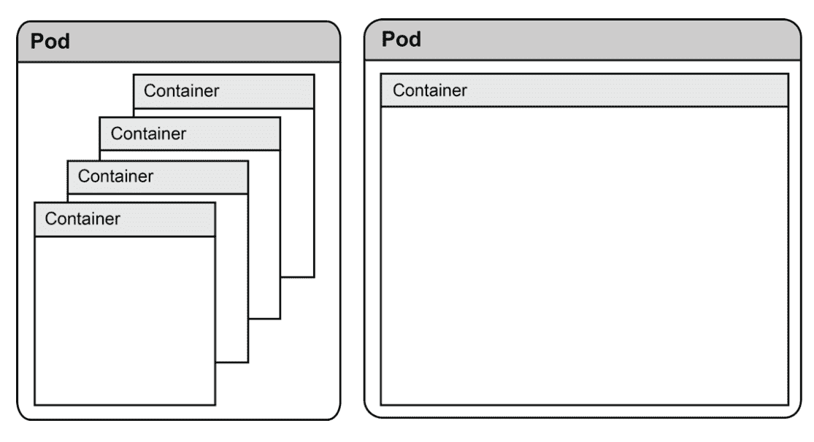
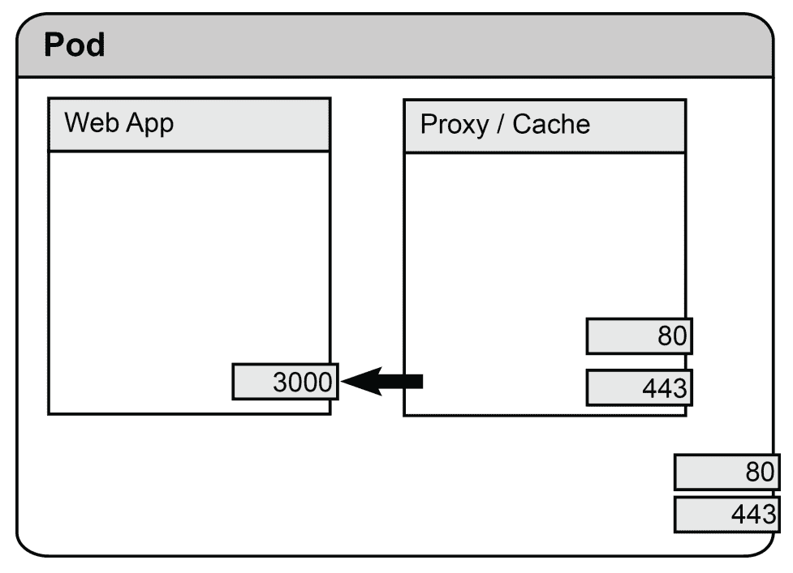
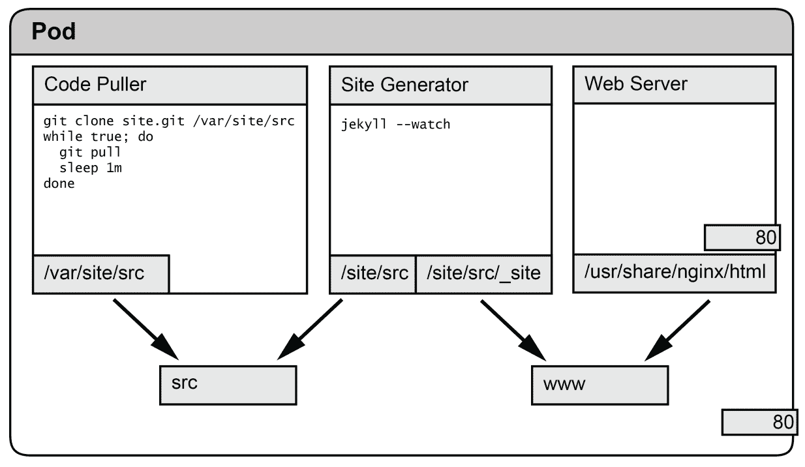
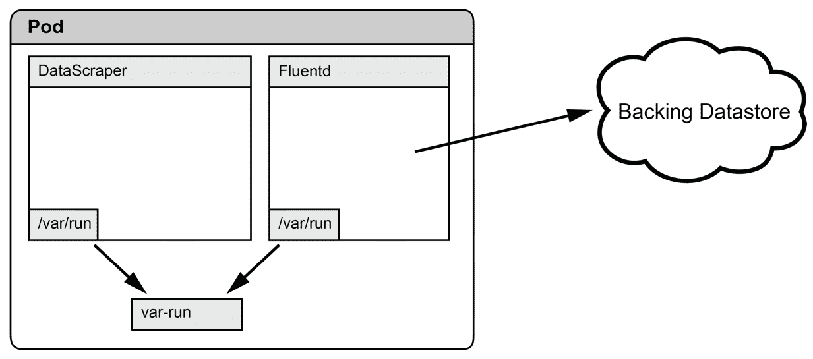
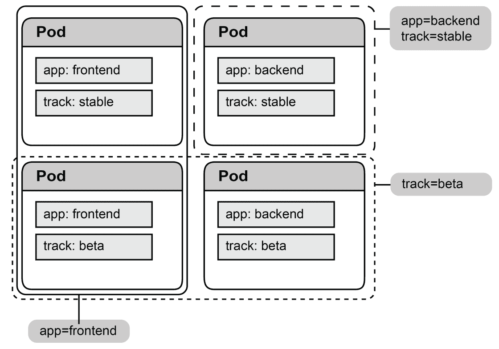
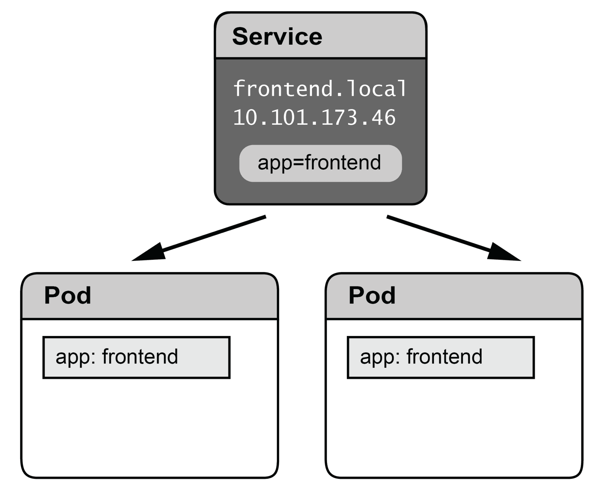
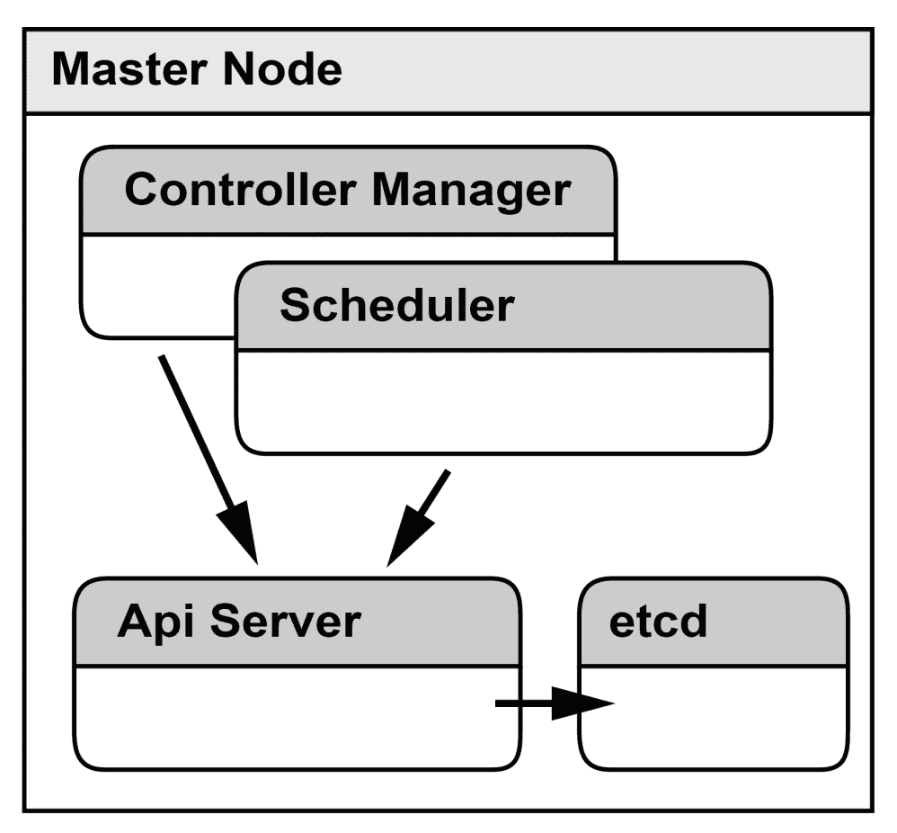

# 谷歌的基础设施服务于我们其他人

Kubernetes 最初是由谷歌的一些工程师构建的，他们负责谷歌内部的容器调度器 Borg。

学习如何使用 Kubernetes 运行自己的基础设施可以让你拥有一些谷歌的可靠性工程师利用的超能力，以确保谷歌的服务具有弹性、可靠和高效。使用 Kubernetes 可以让你利用谷歌和其他公司工程师通过其大规模积累的知识和专业技能。

你的组织可能永远不需要像谷歌这样的公司那样运营。然而，你会发现，许多在操作数万台机器的公司中开发的工具和技术对于运行规模小得多的组织也是适用的。

虽然一个小团队显然可以手动配置和操作数十台机器，但在更大规模上需要的自动化可以让你的生活更简单，你的软件更可靠。如果以后需要从数十台机器扩展到数百甚至数千台，你会知道你正在使用的工具已经在最恶劣的环境中经过了考验。

Kubernetes 的存在本身就是开源/自由软件运动成功的衡量标准和证明。Kubernetes 最初是一个项目，旨在开源谷歌内部容器编排系统 Borg 背后的思想和研究成果。现在它已经有了自己的生命，大部分代码现在都是由谷歌以外的工程师贡献的。

Kubernetes 的故事不仅仅是谷歌看到开源自己的知识间接地为自己的云业务带来好处，而且也是各种基础工具的开源实现成熟的故事。

Linux 容器在某种形式上已经存在了将近十年，但直到 Docker 项目（2013 年首次开源）使它们成为足够多用户广泛使用和理解。虽然 Docker 本身并没有为底层技术带来任何新的东西，但它的创新在于将已经存在的工具打包成一个简单易用的界面。

Kubernetes 也得益于 etcd 的存在，这是一个基于 Raft 一致性算法的键值存储，也是在 2013 年首次发布，用于构建 CoreOS 正在开发的另一个集群调度工具的基础。对于 Borg，Google 使用了基于非常相似的 Paxos 算法的底层状态存储，使 etcd 成为 Kubernetes 的完美选择。

谷歌准备采取主动措施，创建一个开源实现这些知识的项目，这在那个时候对于他们的工程组织来说是一个巨大的竞争优势，因为 Linux 容器由于 Docker 的影响开始变得更加流行。

Kubernetes、Docker、etcd 和许多其他构成 Linux 容器生态系统的工具都是用 Go 编程语言编写的。Go 提供了构建这些系统所需的所有功能，具有出色的并发支持和内置的优秀网络库。

然而，在我看来，语言本身的简单性使其成为开源基础设施工具的绝佳选择，因为如此广泛的开发人员可以在几个小时内掌握语言的基础知识，并开始对项目做出有生产力的贡献。

如果您对了解 Go 编程语言感兴趣，可以尝试查看[`tour.golang.org/welcome/1`](https://tour.golang.org/welcome/1)，然后花一个小时查看[`gobyexample.com`](https://gobyexample.com)。

# 我为什么需要一个 Kubernetes 集群？

Kubernetes 的核心是一个容器调度器，但它是一个更丰富和功能齐全的工具包，具有许多其他功能。可以扩展和增强 Kubernetes 提供的功能，就像 RedHat 的 OpenShift 产品所做的那样。Kubernetes 还允许您通过部署附加工具和服务到您的集群来扩展其核心功能。

以下是内置在 Kubernetes 中的一些关键功能：

+   **自愈**: Kubernetes 基于控制器的编排确保容器在失败时重新启动，并在它们所在的节点失败时重新调度。用户定义的健康检查允许用户决定如何以及何时从失败的服务中恢复，以及在这样做时如何引导流量。

+   **服务发现**：Kubernetes 从根本上设计为使服务发现变得简单，而无需对应用程序进行修改。您的应用程序的每个实例都有自己的 IP 地址，标准的发现机制，如 DNS 和负载均衡，让您的服务进行通信。

+   **扩展**：Kubernetes 可以通过按一下按钮实现水平扩展，并提供自动扩展功能。

+   **部署编排**：Kubernetes 不仅帮助您管理运行的应用程序，还具有工具来推出对应用程序及其配置的更改。其灵活性使您可以为自己构建复杂的部署模式，或者使用多个附加工具之一。

+   **存储管理**：Kubernetes 内置支持管理云提供商的底层存储技术，如 AWS Elastic Block Store 卷，以及其他标准的网络存储工具，如 NFS。

+   **集群优化**：Kubernetes 调度程序会根据工作负载的需求自动将其分配到机器上，从而更好地利用资源。

+   **批量工作负载**：除了长时间运行的工作负载，Kubernetes 还可以管理批处理作业，如 CI、批处理处理和定期作业。

# 容器的根源

询问普通用户 Docker 容器是什么，您可能会得到十几种回答之一。您可能会听到有关轻量级虚拟机的内容，或者这种炙手可热的新颠覆性技术将如何革新计算。实际上，Linux 容器绝对不是一个新概念，也并不像虚拟机那样。

1979 年，Unix 的第 7 版中添加了`chroot syscall`。调用 chroot 会改变当前运行进程及其子进程的根目录。在所谓的 chroot 监狱中运行程序可以防止其访问指定目录树之外的文件。

chroot 的最初用途之一是用于测试 BSD 构建系统，这是大多数现代 Linux 发行版的软件包构建系统所继承的。通过在干净的 chroot 环境中测试软件包，构建脚本可以检测到缺少的依赖信息。

Chroot 也常用于沙箱化不受信任的进程-例如，在共享 FTP 或 SFTP 服务器上的 shell 进程。专门考虑安全性的系统，例如 Postfix 邮件传输代理，利用 chroot 来隔离管道的各个组件，以防止一个组件的安全问题在系统中蔓延。

Chroot 实际上是一个非常简单的隔离工具，它从未旨在提供对文件系统访问以外的任何安全性或控制。对于提供类似构建工具的文件系统隔离的预期目的来说，它是完美的。但是对于在生产环境中隔离应用程序，我们需要更多的控制。

# 进入容器

试图理解 Linux 容器是什么可能有点困难。就 Linux 内核而言，根本不存在容器这样的东西。内核具有许多功能，允许对进程进行隔离，但这些功能比我们现在所认为的容器要低级和细粒度得多。诸如 Docker 之类的容器引擎使用两个主要的内核特性来隔离进程：

# Cgroups

**Cgroups**，或者控制组，提供了一个控制一个或一组进程的接口，因此得名。它们允许控制组的资源使用的几个方面。资源利用可以通过限制（例如，限制内存使用）来控制。Cgroups 还允许设置优先级，以便为进程提供更多或更少的时间限制资源，例如 CPU 利用率或 I/O。Cgroups 还可以用于快照（和恢复）运行进程的状态。

# 命名空间

容器隔离的另一部分是内核命名空间。它们的操作方式与我们使用 chroot 系统调用的方式有些相似，即容器引擎指示内核仅允许进程查看系统资源的特定视图。

与仅限制对文件系统内核的访问不同，命名空间限制对许多不同资源的访问。

每个进程可以分配到一个命名空间，然后只能看到与该命名空间连接的资源。可以命名空间化的资源类型如下：

+   **挂载**：挂载命名空间控制对文件系统的访问。

+   **用户**：每个命名空间都有自己的用户 ID 集。用户 ID 命名空间是嵌套的，因此高级命名空间中的用户可以映射到低级命名空间中的另一个用户。这就允许容器以 root 身份运行进程，而不会给予该进程对根系统的完全权限。

+   **PID**：进程 ID 命名空间与用户命名空间一样是嵌套的。这就是为什么主机可以在运行容器的系统上检查进程列表时看到容器内运行的进程。然而，在命名空间内部，数字是不同的；这意味着在 PID 命名空间内创建的第一个进程可以被分配为 PID 1，并且可以继承僵尸进程（如果需要）。

+   **网络**：网络命名空间包含一个或多个网络接口。该命名空间拥有自己的私有网络资源，如地址、路由表和防火墙。

还有用于 IPC、UTS 和 Cgroups 接口本身的命名空间。

# 将这些部分组合在一起

容器引擎（如 Docker 或 rkt 等软件）的工作是将这些部分组合在一起，为我们这些凡人创造出可用和可理解的东西。

虽然一个直接暴露 Cgroups 和命名空间所有细节的系统会非常灵活，但理解和管理起来会更加困难。使用诸如 Docker 之类的系统为我们提供了一个简单易懂的抽象，但必然会为我们做出许多关于这些低级概念如何使用的决定。

Docker 在先前的容器技术上取得的根本突破是采用了良好的默认设置来隔离单个进程，并将它们与允许开发人员提供进程运行所需的所有依赖项的镜像格式相结合。

这是非常好的一件事，因为它允许任何人安装 Docker 并快速理解发生了什么。它还使得这种 Linux 容器成为构建更大更复杂系统（如 Kubernetes）的完美基石。

# 在这里，安排一下...

在其核心，Kubernetes 是一个将工作调度到一组计算机的系统——一个调度器。但是为什么你需要一个调度器呢？

如果你考虑一下你自己的系统，你会意识到你可能已经有了一个调度器，但除非你已经在使用类似 Kubernetes 的东西，否则它可能看起来会非常不同。

也许你的调度程序是一个团队，有关于数据中心每台服务器上运行的服务的电子表格和文档。也许这个团队会查看过去的流量统计数据，试图猜测未来会有重负载的时间。也许你的调度程序依赖于用户在任何时间通知团队成员，如果你的应用程序停止运行。

这本书讨论了这些问题，讨论了我们如何摆脱手动流程和对系统未来使用的猜测。它是关于利用管理系统的人类的技能和经验，将我们的运营知识编码到可以每秒做出关于你的运行系统的决策的系统中，无缝地响应崩溃的进程、失败的机器和增加的负载，而无需任何人为干预。

Kubernetes 选择将其调度程序建模为控制循环，以便系统不断发现集群的当前状态，将其与期望状态进行比较，然后采取行动来减少期望状态和实际状态之间的差异。这在以下图表中总结如下：

典型的控制循环

能够声明我们希望系统处于的状态，然后让系统自己采取必要的行动来实现这种期望状态，是非常强大的。

您以前可能使用了一种命令式工具或脚本来管理系统，甚至可能使用了手动步骤的书面操作手册。这种方法非常像食谱：你一步一步地采取一系列行动，希望最终达到你所期望的状态。

当描述如何首次安装和引导系统时，这种方法效果很好，但当你需要运行你的脚本来管理已经运行的系统时，你的逻辑需要变得更加复杂，因为对于食谱中的每个阶段，你都需要停下来检查在执行之前需要做什么。

当使用像 Kubernetes 这样的声明性工具来管理系统时，你的配置变得简化，更容易理解。这种方法的一个重要副作用是，如果底层故障导致配置偏离你的期望状态，Kubernetes 将修复你的配置。

通过结合控制循环和声明性配置，Kubernetes 允许您告诉它为您做什么，而不是如何做。Kubernetes 赋予您，操作者，建筑师的角色，而 Kubernetes 则扮演建造者的角色。建筑师向建造者提供了详细的建筑计划，但不需要解释如何用砖和灰浆建造墙壁。您的责任是向 Kubernetes 提供应用程序的规范和所需的资源，但您不需要担心它将在哪里以及如何运行的细节。

# Kubernetes 的基础知识

让我们开始了解 Kubernetes，首先看一些大部分 Kubernetes 建立在其上的基本概念。清楚地了解这些核心构建块如何组合在一起将有助于我们探索组成 Kubernetes 的多种功能和工具。

如果您没有对 Kubernetes 有任何经验，那么在没有清楚理解这些核心构建块的情况下使用 Kubernetes 可能会有点困惑，因此，在继续之前，您应该花时间了解这些部分如何组合在一起。

# Pod

像一群鲸鱼，或者也许是豌豆荚一样，Kubernetes pod 是一组链接的容器。如下图所示，一个 pod 可以由一个或多个容器组成；通常一个 pod 可能只是一个单一的容器：

Pods 是一个或多个容器的逻辑分组

Kubernetes 调度的每个 pod 都被分配了独特的 IP 地址。网络命名空间（因此 pod 的 IP 地址）被每个 pod 中的每个容器共享。

这意味着方便地一起部署几个密切协作的容器。例如，您可以部署一个反向代理与 Web 应用程序一起，以为不本地支持它们的应用程序添加 SSL 或缓存功能。在下面的示例中，我们通过部署一个典型的 Web 应用程序服务器-例如 Ruby on Rails-以及一个反向代理-例如 NGINX 来实现这一点。这个额外的容器提供了可能不被原生应用程序提供的进一步功能。将功能从较小的隔离容器中组合在一起的这种模式意味着您能够更容易地重用组件，并且可以简单地向现有工具添加额外的功能。设置如下图所示：

通过组合多个容器提供额外的功能

除了共享网络命名空间外，Kubernetes 还允许在一个 pod 中的任意数量的容器之间非常灵活地共享卷挂载。这允许出现多种情况，其中几个组件可以协作执行特定任务。

在这个例子中，我们使用了三个容器来协调为使用 NGINX web 服务器构建的静态网站提供服务。

第一个容器使用 Git 从远程 Git 存储库中拉取和更新源代码。该存储库被克隆到与第二个容器共享的卷中。第二个容器使用 Jekyll 框架构建将由我们的 web 服务器提供的静态文件。Jekyll 监视文件系统上的共享目录的更改，并重新生成需要更新的任何文件。

Jekyll 写入生成文件的目录与运行 NGINX 的容器共享，用于为我们的网站提供 HTTP 请求，如下图所示：

我们在这里使用 Jekyll 作为例子，但是你可以使用许多工具来构建静态网站，比如 Hugo、Hexo 和 Gatsby。像这样将应用程序拆分成单独的容器意味着很容易升级单个组件，甚至尝试替代工具。

共享卷挂载的 pod 的另一个用途是支持使用 Unix 套接字进行通信的应用程序，如下图所示。例如，**提取转换加载**（**ETL**）系统可以被建模为使用 UNIX 套接字进行通信的几个独立进程。如果您能够利用第三方工具来处理管道的一部分或全部内容，或者在各种情况下重用您为内部使用构建的工具，这可能是有益的：

在这个例子中，一个定制的应用程序用于从网页中抓取数据，并通过共享卷中的 Unix 域套接字与 Fluentd 的实例进行通信。使用第三方工具（如 Fluentd）将数据推送到后端数据存储的模式不仅简化了定制工具的实现，还提供了与 Fluentd 选择支持的任何存储兼容的功能。

Kubernetes 为您提供了一些强有力的保证，即 pod 中的容器具有共享的生命周期。这意味着当您启动一个 pod 时，您可以确保每个容器将被调度到同一节点；这很重要，因为这意味着您可以依赖于 pod 中的其他容器将存在并且将是本地的。Pod 通常是将几个不同容器的功能粘合在一起的便捷方式，从而实现常见组件的重用。例如，您可以使用 sidecar 容器来增强应用程序的网络能力，或提供额外的日志管理或监控设施。

# 给所有东西贴标签

**标签**是附加到资源（如 pod）的键值对，旨在包含帮助您识别特定资源的信息。

您可以为您的 pod 添加标签，以标识正在运行的应用程序，以及其他元数据，例如版本号、环境名称或与您的应用程序相关的其他标签。

标签非常灵活，因为 Kubernetes 让您自行决定如何为自己的资源打上标签。

一旦您开始使用 Kubernetes，您将发现几乎可以为您创建的每个资源添加标签。

能够添加反映您自己应用程序架构的标签的强大之处在于，您可以使用选择器使用您为资源指定的任何标签组合来查询资源。这种设置如下图所示：

您可以为在 Kubernetes 中创建的许多资源添加标签，然后使用选择器进行查询。

Kubernetes 不强制执行任何特定的模式或布局，用于给集群中的对象打标签；您可以自由地为应用程序打上标签。但是，如果您想要一些结构，Kubernetes 确实对您可能想要应用于可以组合成逻辑应用程序的对象的标签提出了一些建议。您可以在 Kubernetes 文档中阅读更多信息：[`kubernetes.io/docs/concepts/overview/working-with-objects/common-labels/`](https://kubernetes.io/docs/concepts/overview/working-with-objects/common-labels/)。

# 副本集

在 Kubernetes 中，`ReplicaSet`是一个模板化创建 pod 的资源。副本集的定义包含它创建的 pod 的模板定义，副本的期望数量和用于发现其管理下的 pod 的选择器。

`ReplicaSet`用于确保始终运行所需数量的 pod。如果与选择器匹配的 pod 数量低于所需数量，则 Kubernetes 将安排另一个。

由于 pod 的生命周期与其运行的节点的生命周期相关，pod 可以被视为短暂的。有许多原因可能导致特定 pod 的生命周期结束。也许它被操作员或自动化流程移除了。Kubernetes 可能已经驱逐了 pod 以更好地利用集群的资源或准备节点进行关闭或重启。或者底层节点可能失败了。

`ReplicaSet`允许我们通过要求集群确保整个集群中运行正确数量的副本来管理我们的应用程序。这是 Kubernetes 在其许多 API 中采用的一种策略。

作为集群操作员，Kubernetes 会帮助用户减少运行应用程序的复杂性。当我决定需要运行我的应用程序的三个实例时，我不再需要考虑底层基础设施：我只需告诉 Kubernetes 执行我的愿望。如果最坏的情况发生，我的应用程序正在运行的底层机器之一失败，Kubernetes 将知道如何自我修复我的应用程序并启动一个新的 pod。不再需要寻呼机的呼叫，也不需要在半夜里尝试恢复或替换失败的实例。

`ReplicaSet`取代了您可能在旧教程和文档中了解过的`ReplicationController`。它们几乎完全相同，但在一些细微的方面有所不同。

通常，我们希望更新集群上运行的软件。因此，我们通常不直接使用`ReplicaSet`，而是使用`Deployment`对象来管理它们。在 Kubernetes 中，部署用于优雅地推出`ReplicaSet`的新版本。您将在第四章中了解更多关于部署的内容，*管理应用程序的变更*。

# 服务

Kubernetes 为我们管理应用程序提供的最后一个基本工具是服务。**服务**为我们提供了一种方便的方式，在集群内访问我们的服务，通常被称为*服务发现*。

实际上，服务允许我们定义一个标签选择器来引用一组 pod，然后将其映射到我们的应用程序可以使用的内容，而无需修改以查询 Kubernetes API 来收集这些信息。通常，服务将以轮询的方式提供一个稳定的 IP 地址或 DNS 名称，用于访问它所引用的底层 pod。

通过使用服务，我们的应用程序不需要知道它们正在 Kubernetes 上运行-我们只需要正确地配置它们，使用服务的 DNS 名称或 IP 地址。

服务提供了一种让集群中的其他应用程序发现符合特定标签选择器的 pod 的方法。它通过提供一个稳定的 IP 地址，以及可选的 DNS 名称来实现这一点。这个设置如下图所示：

# 底层

现在我们已经了解了 Kubernetes 为我们提供的功能，让我们深入一点，看看 Kubernetes 用来实现这些功能的组件。Kubernetes 通过具有微服务架构，使我们更容易查看每个组件的功能在一定程度上的隔离。

在接下来的几章中，我们将亲自部署和配置这些组件。但是现在，让我们通过查看以下图表，对每个组件的功能有一个基本的了解：

主节点上的主要 Kubernetes 组件

# API 服务器

**API 服务器**充当 Kubernetes 的中央枢纽。Kubernetes 中的所有其他组件通过读取、监视和更新 Kubernetes API 中的资源来进行通信。这个中央组件用于访问和操作集群当前状态的信息，允许 Kubernetes 在保持高度一致性的同时扩展和增强新功能。 

Kubernetes 使用 etcd 存储集群的当前状态。使用 etcd 存储是因为其设计意味着它既能抵抗故障，又能保证其一致性。然而，组成 Kubernetes 的不同组件从不直接与 etcd 交互；相反，它们与 API 服务器通信。对于我们作为集群的操作者来说，这是一个很好的设计，因为它允许我们将对 etcd 的访问限制在 API 服务器组件，提高安全性并简化管理。

虽然 API 服务器是 Kubernetes 架构中的组件，其他所有组件都与其通信以访问或更新状态，但它本身是无状态的，所有存储都被推迟到后端 etcd 集群。对于我们作为集群操作员来说，这再次是一个理想的设计决策，因为它允许我们部署多个 API 服务器的实例（如果我们希望）以提供高可用性。

# 控制器管理器

控制器管理器是运行实现 Kubernetes 功能的一些核心功能的核心控制循环（或控制器）的服务。这些控制器中的每一个都通过 API 服务器监视集群的状态，然后进行更改，以尝试将集群的状态移动到期望的状态。控制器管理器的设计意味着一次只能运行一个实例；然而，为了简化在高可用配置中的部署，控制器管理器具有内置的领导者选举功能，因此可以并排部署多个实例，但只有一个实际上会在任何时候执行工作。

# 调度器

调度器可能是使 Kubernetes 成为有用和实用工具的最重要的组件。它会监视处于未调度状态的新 pod，然后分析集群的当前状态，包括运行的工作负载、可用资源和其他基于策略的问题。然后决定最适合运行该 pod 的位置。与控制器管理器一样，调度器的单个实例一次只能工作一个，但在高可用配置中，可以进行领导者选举。

# Kubelet

kubelet 是在每个节点上运行的代理，负责启动 pod。它不直接运行容器，而是控制运行时，比如 Docker 或 rkt。通常，kubelet 会监视 API 服务器，以发现已经在其节点上调度的 pod。

kubelet 在`PodSpec`级别操作，因此它只知道如何启动 pod。Kubernetes API 中的任何更高级的概念都是由控制器实现的，最终使用特定配置创建或销毁 pod。

kubelet 还运行一个名为**cadvisor**的工具，它收集有关节点上资源使用情况的指标，并使用节点上运行的每个容器，这些信息可以被 Kubernetes 用来做调度决策。

# 总结

到目前为止，你应该对构建现代容器编排器（如 Kubernetes）的软件栈有基本的了解。

现在你应该理解以下内容：

+   容器是建立在 Linux 内核的更低级特性之上的，比如命名空间和 Cgroups。

+   在 Kubernetes 中，pod 是建立在容器之上的强大抽象。

+   Kubernetes 使用控制循环来构建一个强大的系统，允许操作员以声明方式指定应该运行什么。Kubernetes 会自动采取行动，推动系统朝着这个状态发展。这是 Kubernetes 自我修复特性的来源。

+   Kubernetes 中几乎所有的东西都可以被贴上标签，你应该给你的资源贴上标签，以便更简单地管理它们。

在下一章中，你将通过在工作站上运行一个小集群来获得一些使用 Kubernetes API 的实际经验。
