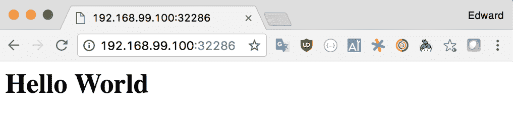
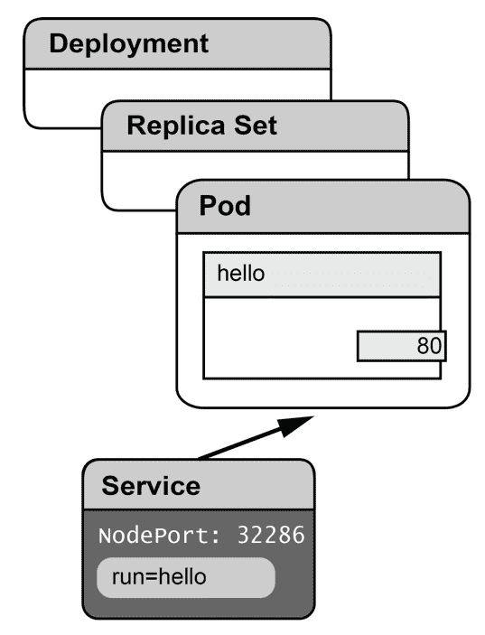
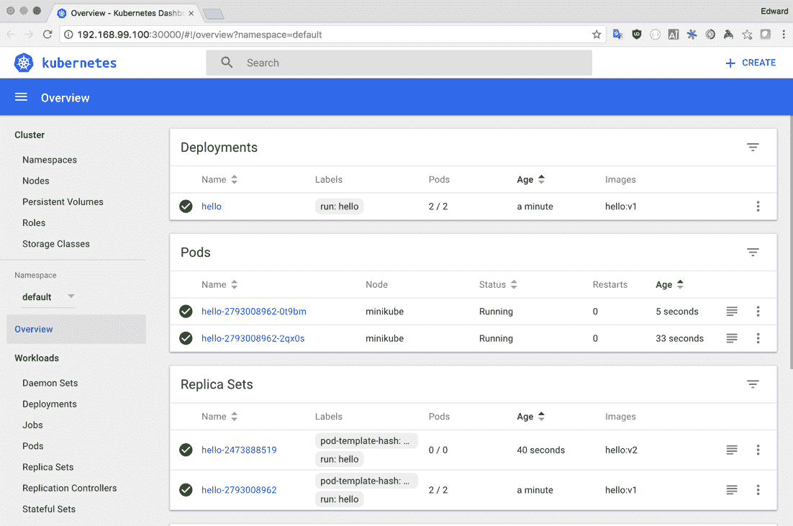
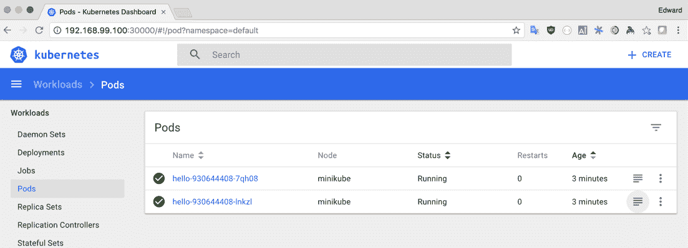
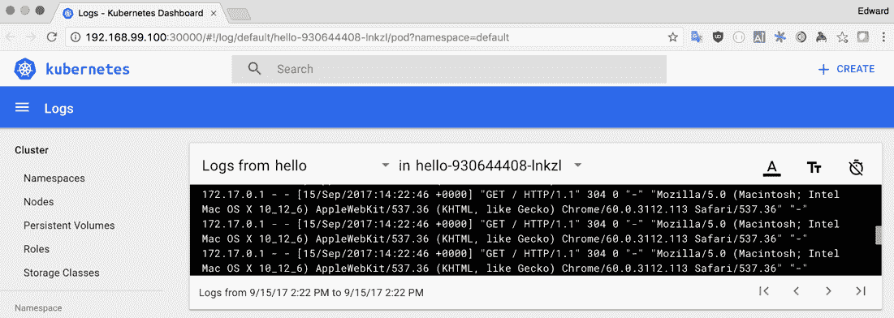
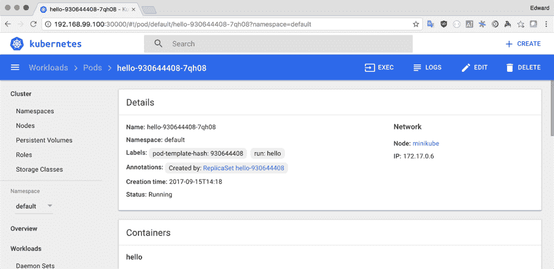
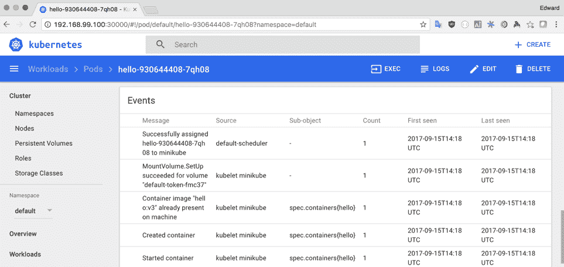
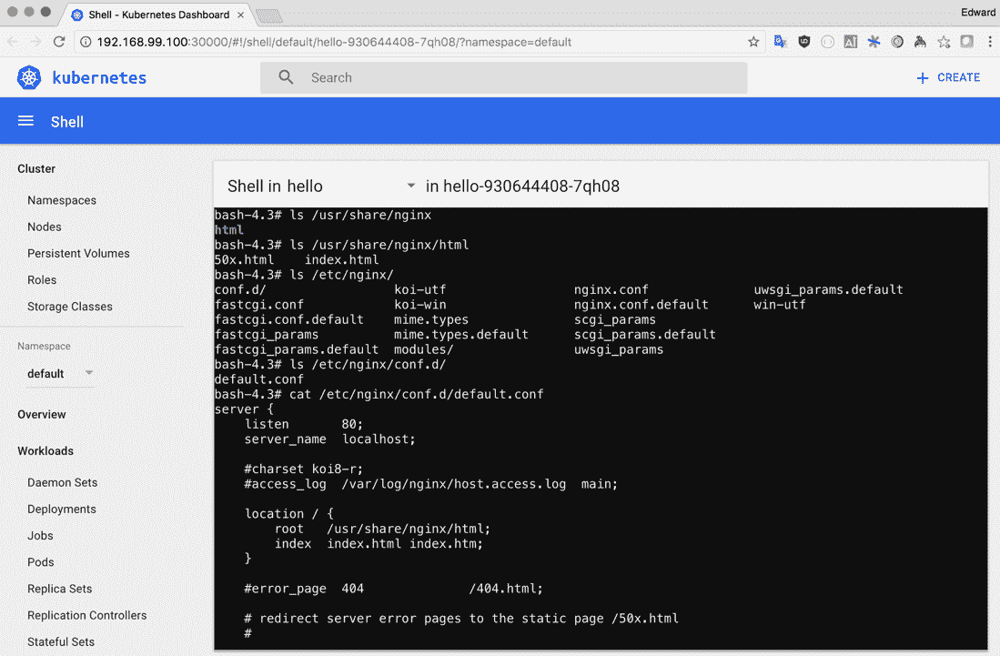

# 启动你的引擎

在本章中，我们将迈出 Kubernetes 的第一步。您将学习如何在自己的工作站上启动一个适合学习和开发使用的集群，并开始学习如何使用 Kubernetes 本身。在本章中，我们将做以下事情：

+   学习如何安装和使用 Minikube 来运行 Kubernetes

+   构建一个在 Docker 容器中运行的简单应用程序

+   使用 Kubernetes 来运行简单的应用程序

# 您自己的 Kubernetes

**Minikube**是一个工具，可以在您的工作站上轻松运行一个简单的 Kubernetes 集群。它非常有用，因为它允许您在本地测试应用程序和配置，并快速迭代应用程序，而无需访问更大的集群。对于我们的目的来说，它是获得一些实际的 Kubernetes 实践经验的理想工具。安装和配置非常简单，您会发现。

# 安装

您需要一些工具来在您的工作站上运行 Kubernetes：

+   `kubectl`是 Kubernetes 命令行界面。在本书中，您将使用它与 Kubernetes 进行交互。

在 Kubernetes 社区中，没有人同意如何发音`kubectl`。

尝试这些不同的方法并选择您喜欢的：

```
    kube-kuttle
    kube-control
    kube-cee-tee-ell
    kube-cuddle
```

+   `minikube`是一个在本地机器上管理 Kubernetes 的命令。它处理所有困难的事情，所以您可以立即开始使用 Kubernetes。

+   `docker`，`minikube`虚拟机内部运行着 Docker 守护程序，但如果您想直接与其交互，您可能需要在您的工作站上安装 Docker 命令行。

最好与虚拟机一起使用 Minikube，因为像 macOS 和 Windows 这样的平台不本地支持 Linux 容器，即使在 Linux 上，也有助于保持您的环境干净和隔离。根据您的操作系统，您可以使用各种虚拟化工具与`minikube`一起使用：

+   **VirtualBox**：它易于使用，可以安装在 macOS、Windows 和 Linux 上。

+   **VMware Fusion**：这是 macOS 上可用的商业工具。

+   **KVM**：这是一个众所周知的 Linux 虚拟化工具。

+   **xhyve**：这是一个利用 macOS 中的本机虚拟化框架的开源项目。它的性能非常好，但安装和使用可能有点困难。

+   **Hyper-V**：这是 Windows 的本地虚拟化工具。请记住，您可能需要在您的机器上手动启用它并设置其网络。

在本书中，我们将介绍默认选项 VirtualBox，但如果你经常使用 Minikube，你可能想探索一些其他选项，因为如果设置正确，它们可能更高效和可靠。

你可以在[`git.k8s.io/minikube/docs/drivers.md`](https://git.k8s.io/minikube/docs/drivers.md)找到一些关于不同驱动程序的文档。

# macOS

在 Mac 上，安装`minikube`和`kubectl`的最佳方法是使用 Homebrew 软件包管理器。

macOS 的 Homebrew 软件包管理器是安装开发工具的简单方法。你可以在网站上找到如何安装它：[`brew.sh/`](https://brew.sh/)。

1.  首先安装 Kubernetes 命令行客户端`kubectl`：

```
brew install kubernetes-cli
```

1.  接下来，安装`minikube`和`virtualbox`：

```
    brew cask install minikube virtualbox
```

# Linux

在 Linux 上，最简单的安装方法是下载并安装预构建的二进制文件：

1.  你应该下载`minikube`和`kubectl`的二进制文件：

```
    curl -Lo minikube https://storage.googleapis.com/minikube/releases/latest/minikube-linux-amd64
    curl -LO https://dl.k8s.io/v1.10.6/bin/linux/amd64/kubectl  
```

1.  一旦你下载了二进制文件，将它们设置为可执行，并将它们移动到你的路径中的某个位置：

```
    chmod +x minikube kubectl
    sudo mv minikube kubectl /usr/local/bin/
```

在 Linux 上安装 VirtualBox 的方法将取决于你的发行版。

请查看 VirtualBox 网站上的说明：[`www.virtualbox.org/wiki/Linux_Downloads`](https://www.virtualbox.org/wiki/Linux_Downloads)。

# Windows

在 Windows 机器上安装 Minikube 与在 Linux 或 macOS 上一样简单。

首先安装 VirtualBox。

你可以从[`www.virtualbox.org/wiki/Downloads`](https://www.virtualbox.org/wiki/Downloads)下载 VirtualBox 的 Windows 安装程序。

如果你使用 chocolatey 软件包管理器，请执行以下步骤：

1.  安装`minikube`：

```
    C:\> choco install minikube
```

1.  安装`kubectl`：

```
    C:\> choco install kubernetes-cli
```

如果你不使用 chocolatey，你可以手动安装`minikube`和`kubectl`。

1.  在[`storage.googleapis.com/minikube/releases/latest/minikube-windows-amd64.exe`](https://storage.googleapis.com/minikube/releases/latest/minikube-windows-amd64.exe)下载`minikube`并将其重命名为`minikube.exe`。然后将它移动到你路径上的某个位置。下载`kubectl`：[`dl.k8s.io/v1.10.6/bin/windows/amd64/kubectl.exe`](https://dl.k8s.io/v1.10.6/bin/windows/amd64/kubectl.exe)，然后将它移动到你路径上的某个位置。

# 启动 Minikube

一旦你安装好了`minikube`和你选择的虚拟化工具，我们就可以用它来构建和启动本地 Kubernetes 集群。

如果你选择使用`minikube`工具的默认设置，那么做起来就很简单。只需运行：

```
    minikube start  
```

然后，您应该会看到一些输出，类似于以下内容：

```
    Starting local Kubernetes v1.10.0 cluster...
    Starting VM...
    Getting VM IP address...
    Moving files into cluster...
    Setting up certs...
    Connecting to cluster...
    Setting up kubeconfig...
    Starting cluster components...
    Kubectl is now configured to use the cluster.

```

`minikube` start 有许多选项，可用于配置启动的集群。尝试运行`minikube` help start 以找出您可以自定义的内容。

您可能想要设置`--cpus`和/或`--memory`来自定义您的计算机资源用于 Minikube VM 的使用量。

假设一切都如预期那样进行，那就是了；您应该在本地机器上安装并运行了一个集群。

kubectl`配置`文件（默认情况下在`~/.kube/config`中找到）定义了上下文。上下文链接到一个集群和一个用户对象。集群定义了如何。

`minikube start`命令创建了一个指向 Minikube VM 内运行的 API 服务器的`kubectl`上下文，并且正确配置了一个允许访问 Kubernetes 的用户。

当您阅读本书时，您当然会想要添加额外的上下文，以便连接到您可能设置的远程集群。您应该能够通过运行以下命令随时切换回`minikube`上下文，以便使用`minikube`：

```
    kubectl config use-context minikube
```

# 使用 kubectl 的第一步

让我们首先验证`kubectl`是否确实已配置为正确使用您的集群，并且我们可以连接到它：

```
    kubectl version
```

您应该会看到类似于这样的输出：

```
    Client Version: version.Info{Major:"1", Minor:"10", GitVersion:"v1.10.4", GitCommit:"5ca598b4ba5abb89bb773071ce452e33fb66339d", GitTreeState:"clean", BuildDate:"2018-06-18T14:14:00Z", GoVersion:"go1.9.7", Compiler:"gc", Platform:"darwin/amd64"}
    Server Version: version.Info{Major:"1", Minor:"10", GitVersion:"v1.10.0", GitCommit:"fc32d2f3698e36b93322a3465f63a14e9f0eaead", GitTreeState:"clean", BuildDate:"2018-03-26T16:44:10Z", GoVersion:"go1.9.3", Compiler:"gc", Platform:"linux/amd64"}
```

您的输出可能显示略有不同的版本号，但是假设您从客户端和服务器都看到了一个版本号，那么您就可以连接到集群。

如果您看不到服务器版本，或者看到其他错误消息，请跳转到本章的*Minikube 故障排除*部分。

让我们开始使用一些在与集群交互时对我们有用的`kubectl`命令来与集群进行交互。

我们将要探索的第一个命令是`get`命令。这使我们能够列出有关集群上资源的基本信息。在这种情况下，我们正在获取所有节点资源的列表：

```
    kubectl get nodes
    NAME       STATUS    AGE       VERSION
    minikube   Ready    20h       v1.10.0
```

如您所见，在我们的 Minikube 安装中，这并不是很令人兴奋，因为我们只有一个节点。但是在具有许多节点的较大集群上，能够查看有关所有节点（或某些子集）的信息可能非常有用。

下一个命令将允许我们深入研究并查看有关特定资源的更详细信息。尝试运行以下命令来查看您可以发现有关 Minikube VM 的信息：

```
    $ kubectl describe node/minikube
```

随着您在本书中的进展，您将发现能够获取和描述 Kubernetes API 公开的各种资源将成为您的第二天性，无论何时您想要发现集群上发生了什么以及为什么。

在我们继续之前，`kubectl`还有一个技巧可以帮助我们。尝试运行以下命令，以获取集群上可用的每种资源类型的描述和一些示例：

```
    kubectl describe -h
```

# 在集群内构建 Docker 容器

您可能已经在工作站上安装了 Docker，但是当您在应用程序上工作时，将图像构建在托管 Kubernetes 集群的 Minikube VM 内部运行的 Docker 守护程序上可以改善您的工作流程。这意味着您可以跳过将图像推送到 Docker 仓库，然后在 Kubernetes 中使用它们。您只需要构建和标记您的图像，然后在 Kubernetes 资源中按名称引用它们。

如果您的工作站上已经安装了 Docker，那么您应该已经安装了与 Minikube Docker 守护程序交互所需的命令行客户端。如果没有，安装也很容易，可以通过安装适用于您平台的 Docker 软件包，或者如果您只想要命令行工具，可以下载二进制文件并将其复制到您的路径中。

为了正确配置 Docker CLI 与 minikube VM 内部的 Docker 守护进程通信，minikube 提供了一个命令，将返回环境变量以配置客户端：

```
    minikube docker-env
```

在 Mac 或 Linux 上，您可以通过运行正确地将这些变量扩展到当前的 shell 环境中：

```
    eval $(minikube docker-env)
```

尝试运行一些`docker`命令来检查一切是否设置正确：

```
    docker version
```

这应该向您显示在 Minikube VM 内运行的 Docker 版本。您可能会注意到，在 Minikube VM 中运行的 Docker 服务器版本略落后于最新版本的 Docker，因为 Kubernetes 需要一些时间来测试新版本的 Docker，以确保稳定性。

尝试列出正在运行的容器。您应该注意到一个正在运行 Kubernetes 仪表板的容器，以及 Kubernetes 启动的一些其他服务，如`kube-dns`和`addon`管理器：

```
    docker ps
```

# 在 Minikube 上构建和启动一个简单的应用程序

让我们迈出第一步，在我们的本地 minikube 集群上构建一个简单的应用程序并让它运行。

我们需要做的第一件事是为我们的应用程序构建一个容器映像。这样做的最简单方法是创建一个 Dockerfile 并使用 `docker build` 命令。

使用您喜欢的文本编辑器创建一个名为 Dockerfile 的文件，内容如下：

```
Dockerfile 
FROM nginx:alpine 
RUN echo "<h1>Hello World</h1>" > /usr/share/nginx/html/index.html 
```

要构建应用程序，首先确保您的 Docker 客户端指向 Minikube VM 内的 Docker 实例，方法是运行：

```
    eval $(minikube docker-env)
```

然后使用 Docker 构建映像。在这种情况下，我们给映像打了一个标签 `hello`，但您可以使用任何您想要的标签：

```
    docker build -t hello:v1 .
```

Kubectl 有一个 `run` 命令，我们可以使用它快速在 Kubernetes 集群上运行一个 pod。在后台，它创建了一个 Kubernetes 部署资源，确保我们的 `hello` 容器的单个实例在一个 pod 中运行（我们稍后会更多地了解这一点）：

```
    kubectl run hello --image=hello:v1 --image-pull-policy=Never \
    --port=80
```

我们在这里设置 `--image-pull-policy=Never` 是为了确保 Kubernetes 使用我们刚刚构建的本地映像，而不是默认从远程存储库（如 Docker Hub）拉取映像。

我们可以使用 `kubectl get` 来检查我们的容器是否已经正确启动：

```
    $ kubectl get pods
    NAME                     READY     STATUS    RESTARTS   AGE
    hello-2033763697-9g7cm   1/1       Running   0          1m
```

我们的 hello world 应用程序设置起来足够简单，但我们需要一些方法来访问它，以便我们的实验被认为是成功的。我们可以使用 `kubectl expose` 命令来创建一个指向刚刚创建的部署中的 pod 的服务：

```
    kubectl expose deployment/hello --port=80 --type="NodePort" \
    --name=hello 
```

在这种情况下，我们已将服务类型设置为 NodePort，这样 Kubernetes 将在 Minikube VM 上公开一个随机端口，以便我们可以轻松访问我们的服务。在第六章中，*生产规划*，我们将更详细地讨论将应用程序暴露给外部世界的问题。

当您创建一个`NodePort`类型的服务时，Kubernetes 会自动为我们分配一个端口号，以便服务可以在其上公开。在多节点集群中，此端口将在集群中的每个节点上打开。由于我们只有一个节点，因此找出如何访问集群会简单一些。

首先，我们需要发现 Minikube VM 的 IP 地址。幸运的是，我们可以运行一个简单的命令来获取这些信息：

```
    minikube ip
    192.168.99.100
```

很可能当`minikube` VM 在您的机器上启动时，它被分配了一个与我的不同的 IP 地址，所以请记下您自己机器上的 IP 地址。

接下来，为了发现 Kubernetes 已经在哪个端口上公开了我们的服务，让我们在服务上使用 `kubectl get`：

```
    $ kubectl get svc/hello
    NAME      CLUSTER-IP   EXTERNAL-IP   PORT(S)        AGE
    hello     10.0.0.104   <nodes>       80:32286/TCP   26m
```

在这种情况下，您可以看到 Kubernetes 已经将容器上的端口`80`暴露为节点上的端口`32286`。

现在，您应该能够构建一个 URL，在浏览器中访问该应用程序进行测试。在我的情况下，它是`http://192.168.99.100:32286`：

您应该能够使用浏览器访问您的应用程序

# 刚刚发生了什么？

到目前为止，我们已经成功在 Minikube 实例上构建、运行和暴露了一个单个容器。如果您习惯使用 Docker 执行类似的任务，您可能会注意到，虽然我们所采取的步骤非常简单，但要使一个简单的 hello world 应用程序运行起来还是有一些复杂性的。

很多这些都与工具的范围有关。Docker 提供了一个简单易用的工作流，用于在单个机器上构建和运行单个容器，而 Kubernetes 首先是一个旨在管理多个节点上运行的多个容器的工具。

为了理解 Kubernetes 即使在这个简单的例子中引入的一些复杂性，我们将探索 Kubernetes 在幕后工作以确保我们的应用程序可靠运行的方式。

当我们执行`kubectl run`时，Kubernetes 创建了一种新的资源：部署。部署是一个更高级的抽象，代表我们管理的底层`ReplicaSet`。这样做的好处是，如果我们想对应用程序进行更改，Kubernetes 可以管理向正在运行的应用程序滚动发布新配置：

我们简单的 Hello 应用程序的架构

当我们执行 kubectl expose 时，Kubernetes 创建了一个带有标签选择器的服务，该选择器与我们引用的部署管理的 pod 匹配。

# 滚动发布更改

部署资源的一个关键功能是管理应用程序的新版本的发布。让我们看一个如何执行这个操作的例子。

首先，让我们更新我们的`Hello World`应用程序的版本 2 的 Dockerfile：

```
Dockerfile 
FROM nginx:alpine 
COPY index.html /usr/share/nginx/html/index.html 
```

您可能已经注意到，我们在版本 1 中使用的 HTML 有点不完整，因此我们在`Dockerfile`中使用`COPY`命令将`index.html`文件复制到我们的容器镜像中。

使用文本编辑器创建一个`index.html`文件，它在视觉上与版本 1 有所区别。我抓住机会添加了一个合适的 DOCTYPE，并且当然，使用 CSS 重新实现了可悲的已经废弃的闪烁标签！由于这不是一本关于网页设计的书，随意进行任何想要的更改：

```
index.html 
<!DOCTYPE html> 
<html> 
  <head> 
    <style> 
      blink { animation: blink 1s steps(1) infinite; } 
      @keyframes blink { 50% { color: transparent; } } 
    </style> 
    <title>Hello World</title> 
  </head> 
  <body> 
    <h1>Hello <blink>1994</blink></h1> 
  </body> 
</html> 
```

接下来，使用 Docker 构建您的第 2 版镜像：

```
    docker build -t hello:v2 .
```

现在我们可以使用 kubectl 来更新部署资源以使用新的镜像：

```
    kubectl set image deployment/hello hello=hello:v2
```

等待几分钟，直到 Kubernetes 启动新的 pod，然后刷新您的浏览器；您应该能看到您的更改。

当我们更新一个部署时，Kubernetes 在幕后创建一个新的副本集，具有新的配置，并处理新版本的滚动部署。Kubernetes 还会跟踪您部署的不同配置。这也使您有能力在需要时回滚部署：

```
    $ kubectl rollout undo deployment/hello
    deployment "hello" rolled back
```

# 弹性和扩展性

能够提供对底层基础设施中的错误和问题具有弹性的服务是我们可能希望使用 Kubernetes 部署我们的容器化应用程序的关键原因之一。

我们将通过我们的`Hello World`部署来进行实验，以发现 Kubernetes 如何处理这些问题。

第一个实验是看当我们故意删除包含我们的`hello`容器的 pod 时会发生什么。

为了做到这一点，我们需要找到这个 pod 的名称，我们可以使用`kubectl get`命令来做到这一点：

```
    $ kubectl get pods
    NAME                     READY     STATUS    RESTARTS   AGE
    hello-2473888519-jc6km   1/1       Running   0          7m
```

在我们的 Minikube 集群中，目前只有一个来自我们迄今为止创建的一个部署的运行中的 pod。一旦开始部署更多的应用程序，诸如 kubectl get 之类的命令的输出就会变得更长。我们可以使用`-l`标志传递一个标签选择器来过滤结果。在这种情况下，我们将使用`kubectl get pods -l run=hello`来仅显示标签设置为`hello`的 pod。

然后我们可以使用`kubectl delete`命令来删除资源。删除一个 pod 也会终止其中的容器内运行的进程，有效地清理了我们节点上的 Docker 环境：

```
    $ kubectl delete pod/hello-2473888519-jc6km
    pod "hello-2473888519-jc6km" delete
```

如果然后重新运行`get pods`命令，您应该注意到我们删除的 pod 已被一个新的带有新名称的 pod 所取代：

```
    $ kubectl get pod
    NAME                     READY     STATUS    RESTARTS   AGE
    hello-2473888519-1d69q   1/1       Running   0          8s
```

在 Kubernetes 中，我们可以使用副本集（和部署）来确保尽管出现意外事件，例如服务器故障或管理员误删 pod（就像在这种情况下发生的那样），但 pod 实例仍然在我们的集群中运行。

你应该开始理解作为这个练习的一部分，pod 是一个短暂的实体。当它被删除或者它所在的节点失败时，它将永远消失。Kubernetes 确保缺失的 pod 被另一个替换，从相同的模板中创建。这意味着当 pod 不可避免地失败并被替换时，存储在本地文件系统或内存中的任何状态，pod 本身的身份也会丢失。

这使得 pod 非常适合一些工作负载，不需要在运行之间在本地存储状态，比如 Web 应用程序和大多数批处理作业。如果你正在构建打算部署到 Kubernetes 的新应用程序，通过将状态的存储委托给外部存储，比如数据库或像 Amazon S3 这样的服务，可以使它们更易于管理。

我们将在 Kubernetes 中探索允许我们部署需要存储本地状态和/或保持稳定身份的应用程序的功能，在*第九章*，*存储状态*中。

当我们测试 Kubernetes 替换被移除的 pod 的能力时，你可能已经注意到一个问题，那就是在短时间内，我们的服务变得不可用。对于这样一个简单的单节点集群上运行的示例服务，也许这并不是世界末日。但我们确实需要一种方式，让我们的应用程序以最小化甚至瞬间的停机时间运行。

答案当然是要求 Kubernetes 运行多个实例来运行我们的应用程序，因此即使一个丢失了，第二个也可以接管工作：

```
    $ kubectl scale deployment/hello --replicas=2
    deployment "hello" scaled
```

如果我们现在检查正在运行的 pod，我们可以看到第二个`hello` pod 已经加入了：

```
    $ kubectl get pods
    NAME                     READY     STATUS    RESTARTS   AGE
    hello-2473888519-10p63   1/1       Running   0          1m
    hello-2473888519-1d69q   1/1       Running   0          25m
```

# 使用仪表板

Kubernetes 仪表板是一个在 Kubernetes 集群内运行的 Web 应用程序，提供了一个替代的、更具图形化的解决方案，用于探索和监视你的集群。

Minikube 会自动安装仪表板，并提供一个命令，可以在你的 Web 浏览器中打开它：

```
    $ minikube dashboard
```

Kubernetes 仪表板

仪表板界面非常易于使用，你应该开始注意到与`kubectl`工作方式有更多相似之处，因为它们都允许你与相同的底层 API 进行交互。

屏幕左侧的导航栏可访问显示特定类型资源列表的屏幕。这类似于`kubectl get`命令提供的功能：

使用 Kubernetes 仪表板列出当前运行的 pod

在此视图中，我们可以单击看起来像一叠文件的图标，以打开日志查看器，查看从每个容器的标准输出中捕获的日志：

在 Kubernetes 仪表板中查看容器日志

其他资源具有适合其功能的其他选项。例如，部署和副本集具有对话框，用于增加或减少 pod 的数量。

通过单击特定资源的名称，我们可以获得一个显示类似于`kubectl describe`的信息的视图：



详细屏幕为我们提供了关于 Kubernetes 中的 pod 或其他资源的大量信息：



除了资源的配置和设置概览外，如果您滚动到页面底部，您应该能够看到事件的反馈。如果您正在尝试调试问题，这非常有用，并且将突出显示正在运行的资源的任何错误或问题。

对于 pod，我们有许多其他选项来管理和检查容器。例如，通过单击执行按钮在浏览器中打开终端：

在 Kubernetes 仪表板中使用交互式 shell 调试容器

目前，为了使此功能正常工作，您的容器需要有`/bin/bash`可用。这在未来版本的仪表板中可能会发生变化，但目前，为了使其工作，请将`RUN apk add --no-cache bash`添加到您的`Dockerfile`并部署新构建的映像。

# 代码配置

在本章中，我们通过使用`kubectl`提供的命令或 Kubernetes 仪表板与 Kubernetes 进行交互。在实践中，我发现这些工具对于快速在集群中运行容器非常有用。当配置变得更加复杂或者我想要能够将相同的应用程序部署到多个环境时，拥有一个可以提交到集群并存储在版本控制系统中的配置文件非常有用。

`kubectl`，实际上包括 Kubernetes 仪表板，将允许我们提交 YAML 或 JSON 格式的配置以创建集群上的资源。我们将再次看看如何使用 YAML 格式的文件而不是`kubectl run`等命令来部署相同的`Hello World`应用程序。

这个 Kubernetes 配置通常被称为清单，而 YAML 或 JSON 格式的文件被称为清单文件。

让我们首先删除我们用`kubectl`创建的配置，这样我们就有一个干净的状态来复制相同的配置：

```
    $ kubectl delete deployment/hello svc/hello
    deployment "hello" deleted
    service "hello" deleted
```

让我们为`hello`服务的版本 1 定义一个部署：

```
deployment.yaml 
apiVersion: apps/v1
kind: Deployment 
metadata: 
  name: hello 
spec: 
  replicas: 2 
  template: 
    metadata: 
      labels: 
        app: hello 
    spec: 
      containers: 
      - name: hello 
        image: hello:v1 
        ports: 
        - containerPort: 80 
```

现在我们可以使用`kubectl`将部署提交到 Kubernetes：

```
    $kubectl apply -f deployment.yaml
    deployment "hello" created  
```

接下来，让我们为一个服务做同样的事情：

```
service.yaml 
kind: Service 
apiVersion: v1 
metadata: 
  name: hello 
spec: 
  selector: 
    app: hello 
  type: NodePort 
  ports: 
  - protocol: TCP 
    port: 80 
    targetPort: 80 
```

使用`kubectl`提交定义到 Kubernetes：

```
    $ kubectl apply -f service.yaml
    service "hello" created  
```

你可以看到，虽然我们牺牲了只需运行一个命令来创建部署的速度和简单性，但通过明确指定我们想要创建的资源，我们可以更好地控制我们的 pod 的配置，并且现在我们可以将这个定义提交到版本控制，并可靠地更新。

在更新资源时，我们可以对文件进行编辑，然后使用`kubectl apply`命令来更新资源。`kubectl`会检测到我们正在更新现有资源，并将其更新以匹配我们的配置。尝试编辑`deployment.yaml`中的图像标记，然后重新提交到集群：

```
    $ kubectl apply -f deployment.yaml
    deployment "hello" configured 
```

如果我们只是在本地集群上对资源进行更改，我们可能只是想快速更改一些东西，而无需编辑文件。首先，就像在我们之前的例子中一样，您可以使用`kubectl set`来更新属性。Kubernetes 实际上并不关心我们如何创建资源，因此我们之前所做的一切仍然有效。进行快速更改的另一种方法是使用`kubectl edit`命令。假设您已经正确设置了`$EDITOR`环境变量与您喜欢的文本编辑器，您应该能够打开资源的 YAML，进行编辑，然后保存，而`kubectl`会无缝地为您更新资源。

# 故障排除 Minikube

在尝试使用 Minikube 时可能遇到的一个常见问题是，您可能无法访问 VM，因为其网络与您的计算机上配置的另一个网络重叠。如果您正在使用企业 VPN，或者连接到配置了默认情况下 Minikube 使用的`192.168.99.1/24` IP 地址范围的另一个网络，这种情况经常会发生。

使用替代 CIDR 启动 Minikube 非常简单，您可以选择任何您想要使用的私有范围；只需确保它不会与本地网络上的其他服务重叠：

```
    $ minikube start --host-only-cidr=172.16.0.1/24

```

# 总结

做得好，能走到这一步真不容易。如果您在本章的示例中跟着做，那么您应该已经在学习如何使用 Kubernetes 来管理自己的应用程序的路上了。您应该能够做到以下几点：

+   使用 Minikube 在您的工作站上设置单节点 Kubernetes 集群

+   使用 Docker 构建一个简单的应用程序容器

+   在 Minikube 集群上运行一个 pod

+   使用清单文件声明 Kubernetes 配置，以便您可以重现您的设置

+   设置一个服务，以便您可以访问您的应用程序
