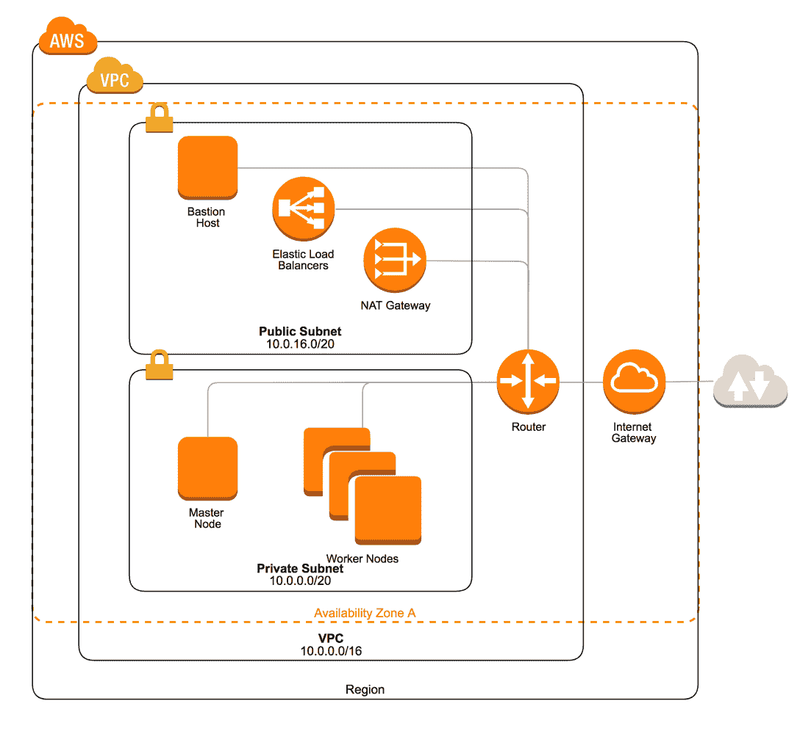
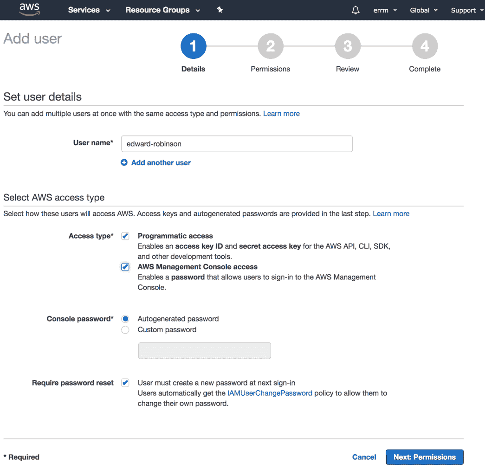
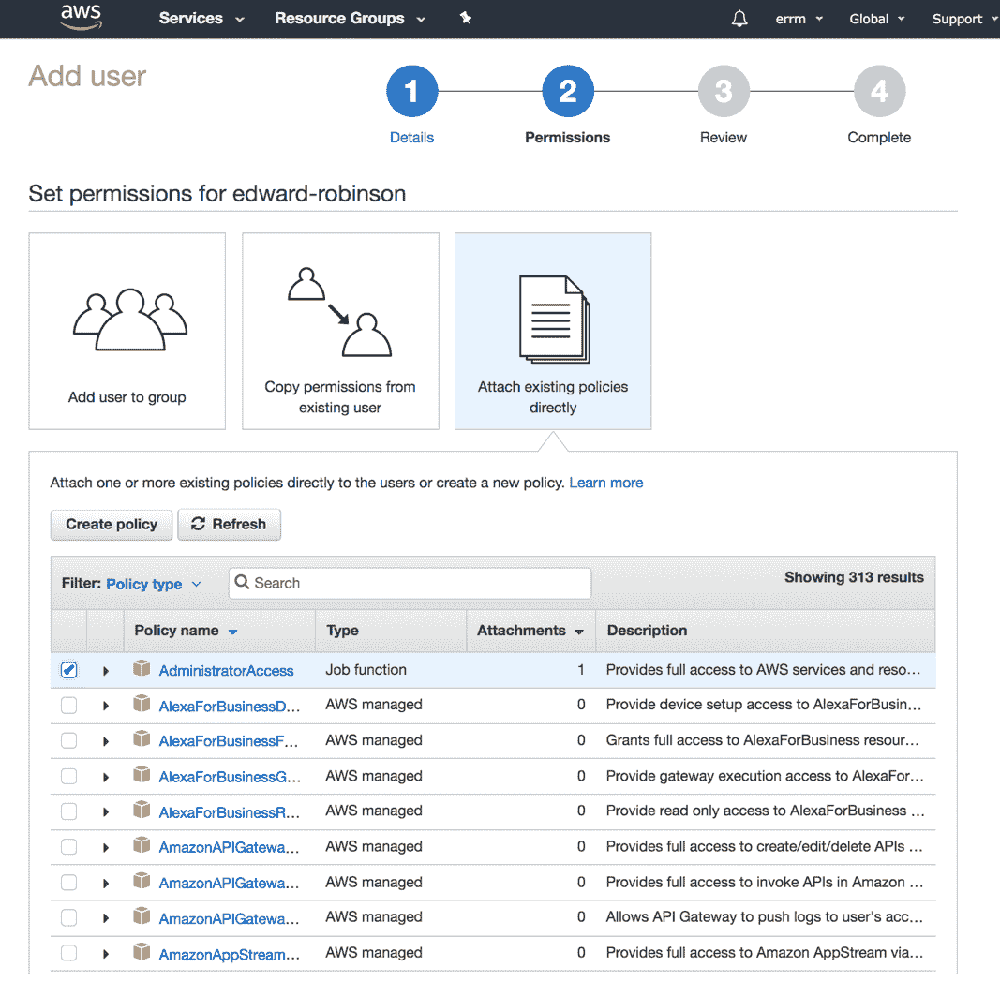
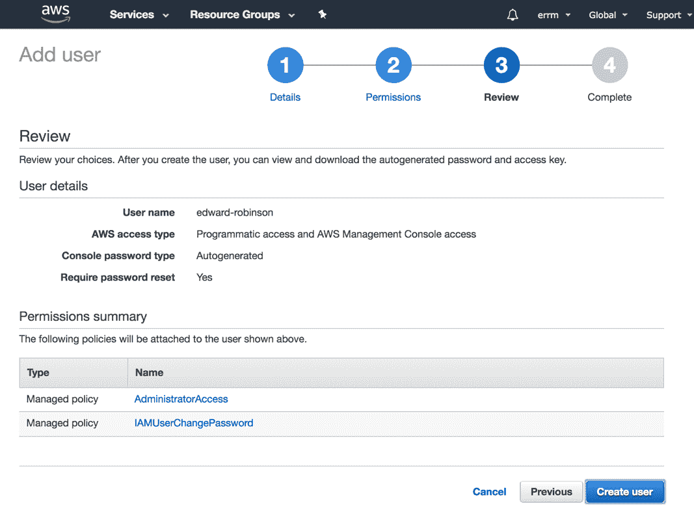
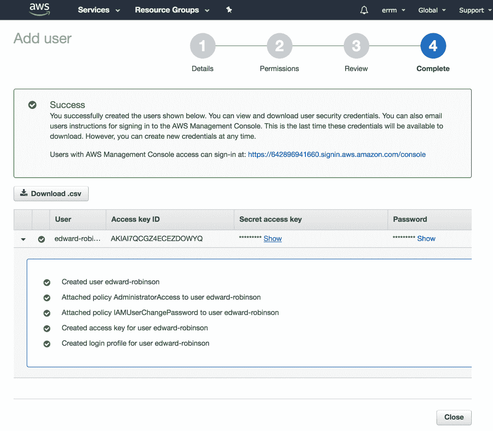
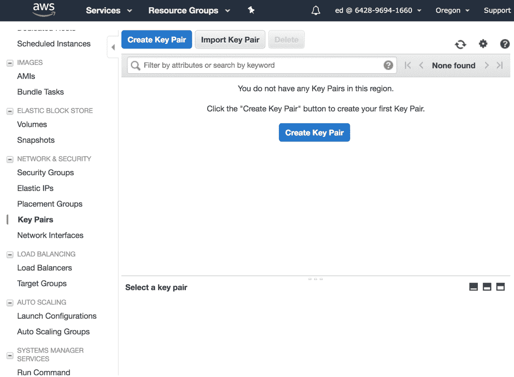
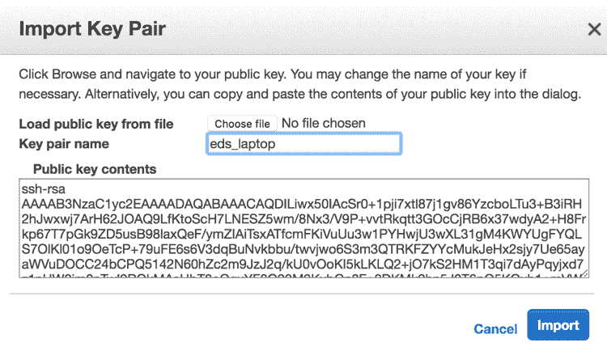

# 抓住云端

在本章中，我们将学习如何从头开始在亚马逊网络服务上构建一个运行 Kubernetes 集群。为了了解 Kubernetes 的工作原理，我们将手动启动将形成第一个集群的 EC2 实例，并手动安装和配置 Kubernetes 组件。

我们将构建的集群适合您在学习管理 Kubernetes 和开发可以在 Kubernetes 上运行的应用程序时使用。通过这些说明，我们的目标是构建最简单的集群，可以部署到 AWS。当然，这意味着在构建关键任务应用程序的集群时，您可能会有一些不同的需求。但不用担心——在第三部分《准备生产环境》中，我们将涵盖您需要了解的一切，以使您的集群准备好应对最苛刻的应用程序。

在 AWS 上运行 Kubernetes 集群是需要花钱的。根据我们的说明（一个带有一个主节点和一个工作节点的基本集群），目前的费用大约是每月 75 美元。因此，如果您只是用集群进行实验和学习，请记得在一天结束时关闭实例。

如果您已经完成了集群，终止实例并确保 EBS 卷已被删除，因为即使它们所附加的实例已经停止，您也会为这些存储卷付费。

本章旨在成为一个学习体验，因此请在阅读时阅读并输入命令。如果您有本书的电子书版本，请抵制复制粘贴的冲动，因为如果您输入命令并花些时间理解您正在做的事情，您会学到更多。有一些工具可以通过运行一个命令来完成本章所涵盖的一切甚至更多，但是希望通过逐步手动构建您的第一个集群，您将获得一些宝贵的见解，了解构建 Kubernetes 集群所需的一切。

# 集群架构

本章中我们要建立的集群将由两个 EC2 实例组成——一个将运行 Kubernetes 控制平面的所有组件，另一个是您可以用来运行应用程序的工作节点。

因为我们是从零开始的，本章还将阐述一种在私有网络中隔离 Kubernetes 集群并允许您从自己的工作站轻松访问机器的方法。

我们将通过使用额外的实例作为堡垒主机来实现这一点，该主机将允许来自外部世界的 SSH 连接，如下图所示。如果您的 AWS 账户已经有一些基础设施可以实现这一点，那么请随意跳过本节：

本章中您将设置的集群架构

# 创建 AWS 账户

如果您还没有 AWS 账户，请前往[`aws.amazon.com/`](https://aws.amazon.com/)注册一个。在您的账户中创建资源之前，您需要向您的账户添加信用卡以支付任何费用。

当您首次注册 AWS 账户时，您将在前 12 个月内有资格免费使用一些服务。不幸的是，这个免费层并不能提供足够的资源来运行 Kubernetes，但在本章中，我们已经优化了我们选择的实例，以降低成本，因此您应该能够在不花费太多的情况下跟随示例。

# 创建 IAM 用户

当您注册 AWS 账户时，您选择的电子邮件地址和密码将用于登录根账户。在开始与 AWS 进行交互之前，最好创建一个 IAM 用户，您将使用该用户与 AWS 进行交互。这样做的好处是，如果您愿意，您可以为每个 IAM 用户提供尽可能多或尽可能少的对 AWS 服务的访问权限。如果您使用根账户，您将自动拥有完全访问权限，并且无法管理或撤销权限。按照以下步骤设置账户：

1.  登录 AWS 控制台后，通过点击“服务”并在搜索框中输入`IAM`来进入身份和访问管理仪表板。

1.  从侧边栏中选择“用户”以查看 AWS 账户中的 IAM 用户。如果您刚刚设置了一个新账户，这里还没有任何用户——根账户不算在内。

1.  通过点击屏幕顶部的“添加用户”按钮开始设置新用户账户的流程。

1.  首先选择一个用户名作为您的用户。勾选两个框以启用**编程访问**（这样您就可以使用命令行客户端）和**AWS 管理控制台访问**，这样您就可以登录到 Web 控制台，如前面的屏幕截图所示：



1.  在下一个屏幕上，您可以为用户配置权限。选择**直接附加现有策略**，然后选择**AdministratorAccess**策略，如下图所示：



1.  审查您的设置，然后单击**创建用户**：



1.  创建用户后，请记下凭据。您将很快需要**访问密钥 ID**和**秘密访问密钥**来配置 AWS 命令行客户端。还要记下控制台登录链接，因为这是您的 AWS 帐户的唯一链接，如下所示：



1.  一旦您为自己设置了 IAM 用户，请从浏览器中注销根帐户，并检查您是否可以使用用户名和密码重新登录。

您可能希望为您的 AWS 帐户设置双因素身份验证以获得更高的安全性。请记住，对帐户具有管理员访问权限的任何人都可以访问或删除您帐户中的任何资源。

# 获取 CLI

您可以使用 Web 控制台控制 AWS，但如果您从 AWS 命令行客户端执行所有操作，您对 AWS 的控制将更加精确。

您应该按照 AWS 提供的说明在您的系统上安装命令行客户端（或者使用系统包管理器），使用以下链接中找到的说明：[`docs.aws.amazon.com/cli/latest/userguide/installing.html`](https://docs.aws.amazon.com/cli/latest/userguide/installing.html)。

一旦您安装了命令行客户端，请运行`aws configure`命令以使用您的凭据配置 CLI。此命令将更新您的主目录中的`aws config`文件。

在这个阶段，您应该为您的集群选择一个 AWS 区域。对于测试和实验，选择一个距离您位置相对较近的区域是有意义的。这样做将在您使用`ssh`或`connect`访问您的实例时改善延迟。

# 设置密钥对

当我们启动 EC2 实例时，我们希望能够通过 SSH 访问它。我们可以在 EC2 控制台中注册一个密钥对，以便在启动实例后登录。

我们可以要求 AWS 为您生成一个密钥对（然后您可以下载）。但最佳做法是在您的工作站上生成一个密钥对，并将公共部分上传到 AWS。这样可以确保您（只有您）控制您的实例，因为您的密钥的私有部分永远不会离开您自己的机器。要设置密钥对，请按照以下步骤进行：

1.  您可能已经在您的机器上有一个希望使用的密钥对。您可以通过查看`.ssh`目录中的现有密钥来检查，如下所示：

```
$ ls -la ~/.ssh
total 128
drwx------    6 edwardrobinson  staff    192 25 Feb 15:49 .
drwxr-xr-x+ 102 edwardrobinson  staff   3264 25 Feb 15:49 ..
-rw-r--r--    1 edwardrobinson  staff   1759 25 Feb 15:48 config
-rw-------    1 edwardrobinson  staff   3326 25 Feb 15:48 id_rsa
-rw-r--r--    1 edwardrobinson  staff    753 25 Feb 15:48 
id_rsa.pub
-rw-r--r--    1 edwardrobinson  staff  53042 25 Feb 15:48 
known_hosts  
```

1.  在此示例中，您可以看到我在`.ssh`目录中有一个密钥对——私钥的默认名称为`id_rsa`，公钥称为`id_rsa.pub`。

1.  如果您还没有设置密钥对，或者想要创建一个新的密钥对，那么您可以使用`ssh-keygen`命令创建一个新的，如下所示：

```
$ ssh-keygen -t rsa -b 4096 -C "email@example.com"
Generating public/private rsa key pair.  
```

1.  此命令使用您的电子邮件地址作为标签创建一个新的密钥对。

1.  接下来，选择保存新密钥对的位置。如果您还没有密钥对，只需按*Enter*将其写入默认位置，如下所示：

```
Enter file in which to save the key (/home/edwardrobinson/.ssh/id_rsa):  
```

1.  接下来，系统会要求您输入密码。如果只需按*Enter*，则密钥将在没有任何密码保护的情况下创建，如下命令所示。如果选择密码，请确保记住它或安全存储，否则您将无法在没有密码的情况下使用 SSH 密钥（或访问实例）。

```
Enter passphrase (empty for no passphrase):
Enter same passphrase again:
Your identification has been saved in /home/edwardrobinson/.ssh/id_rsa.
Your public key has been saved in /home/edwardrobinson/.ssh/id_rsa.
The key fingerprint is:
SHA256:noWDFhnDxcvFl7DGi6EnF9EM5yeRMfGX1wt85wnbxxQ email@example.com  
```

1.  一旦您在您的机器上有了 SSH 密钥对，您可以开始将其导入到您的 AWS 帐户中。请记住，您只需要导入密钥对的公共部分。这将在以`.pub`扩展名结尾的文件中。

1.  从 AWS EC2 控制台（单击“服务”，然后搜索 EC2），选择屏幕左侧菜单中的**密钥对**，如下截图所示：



1.  从此屏幕中，选择**导入密钥对**以打开对话框，您可以在其中上传您的密钥对，如下截图所示：



1.  选择一个在 AWS 中标识您的密钥对的名称（我选择了`eds_laptop`）。然后，要么导航到密钥的位置，要么只需将其文本粘贴到大文本框中，然后单击**导入**。导入密钥后，您应该在**密钥对**页面上看到它列出。

如果您在多个地区使用 AWS，则需要在要启动实例的每个地区导入一个密钥对。

# 准备网络

我们将在您的 AWS 账户中设置一个新的 VPC。VPC，或虚拟私有云，允许我们拥有一个与 EC2 和互联网上的所有其他用户隔离的私有网络，我们可以在其上启动实例。

它为我们构建集群的安全网络提供了一个安全的基础，如下命令所示：

```
$ VPC_ID=$(aws ec2 create-vpc --cidr-block 10.0.0.0/16 --query "Vpc.VpcId" --output text)
```

`VpcId`将是您的账户唯一的，所以我将设置一个 shell 变量，以便在需要时引用它。您可以使用来自您的帐户的`VpcId`做同样的事情，或者您可能更喜欢每次需要时将其键入。

本章的其余步骤遵循这种模式，但如果您不明白发生了什么，不要害怕查看 shell 变量，并将 ID 与 AWS 控制台中的资源进行关联，如下所示：

```
$ echo $VPC_ID  
```

Kubernetes 根据 AWS 分配给它们的内部 DNS 主机名命名您的实例。如果我们在 VPC 中启用 DNS 支持，那么我们将能够在使用 VPC 内提供的 DNS 服务器时解析这些主机名，如下所示：

```
$ aws ec2 modify-vpc-attribute \
    --enable-dns-support \
    --vpc-id $VPC_ID
$ aws ec2 modify-vpc-attribute \
    --enable-dns-hostnames \
    --vpc-id $VPC_ID  
```

Kubernetes 广泛使用 AWS 资源标记，因此它知道可以使用哪些资源，哪些资源由 Kubernetes 管理。这些标记的关键是`kubernetes.io/cluster/<cluster_name>`。对于可能在几个不同集群之间共享的资源，我们使用`shared`值。这意味着 Kubernetes 可以利用它们，但永远不会从您的帐户中删除它们。

我们将用于 VPC 等资源。Kubernetes 完全管理生命周期的资源具有`owned`的标记值，并且如果不再需要，Kubernetes 可能会删除它们。当 Kubernetes 创建资源，如自动缩放组中的实例、EBS 卷或负载均衡器时，通常会自动创建这些标记。

我喜欢在创建的集群之后以计算机科学历史上的著名人物命名。我为本章创建的集群以设计了 COBOL 编程语言的 Grace Hopper 命名。

让我们为我们的新 VPC 添加一个标签，以便 Kubernetes 能够使用它，如下命令所示：

```
aws ec2 create-tags \
--resources $VPC_ID \
--tags Key=Name,Value=hopper \
  Key=kubernetes.io/cluster/hopper,Value=shared  
```

当我们创建 VPC 时，一个主路由表会自动创建。我们将在私有子网中使用这个路由表进行路由。让我们先获取 ID 以备后用，如下命令所示：

```
$ PRIVATE_ROUTE_TABLE_ID=$(aws ec2 describe-route-tables \
    --filters Name=vpc-id,Values=$VPC_ID \
    --query "RouteTables[0].RouteTableId" \
    --output=text) 
```

现在我们将添加第二个路由表来管理我们 VPC 中公共子网的路由，如下所示：

```
$ PUBLIC_ROUTE_TABLE_ID=$(aws ec2 create-route-table \
  --vpc-id $VPC_ID \
  --query "RouteTable.RouteTableId" --output text)  
```

现在我们将为路由表命名，以便以后能够跟踪它们：

```
$ aws ec2 create-tags \
  --resources $PUBLIC_ROUTE_TABLE_ID \
  --tags Key=Name,Value=hopper-public
$ aws ec2 create-tags \
  --resources $PRIVATE_ROUTE_TABLE_ID \
  --tags Key=Name,Value=hopper-private  
```

接下来，我们将创建两个子网供我们的集群使用。因为我要在`eu-west-1`区域（爱尔兰）创建我的集群，我将在`eu-west-1a`子网中创建这些子网。您应该通过运行`aws ec2 describe-availability-zones`来选择您正在使用的区域中的可用区来为您的集群选择一个可用区。在第三部分，我们将学习如何创建跨多个可用区的高可用性集群。

让我们首先创建一个只能从我们的私有网络内部访问的实例子网。我们将在 CIDR 块上使用“/20 子网掩码”，如下命令所示；通过这样做，AWS 将为我们提供 4089 个 IP 地址，可供分配给我们的 EC2 实例和 Kubernetes 启动的 pod 使用：

```
$ PRIVATE_SUBNET_ID=$(aws ec2 create-subnet \
  --vpc-id $VPC_ID \
  --availability-zone eu-west-1a \
  --cidr-block 10.0.0.0/20 --query "Subnet.SubnetId" \
  --output text)

$ aws ec2 create-tags \
  --resources $PRIVATE_SUBNET_ID \
  --tags Key=Name,Value=hopper-private-1a \
    Key=kubernetes.io/cluster/hopper,Value=owned \
    Key=kubernetes.io/role/internal-elb,Value=1  
```

接下来，让我们在同一个可用区添加另一个子网，如下命令所示。我们将使用这个子网来放置需要从互联网访问的实例，比如公共负载均衡器和堡垒主机：

```
$ PUBLIC_SUBNET_ID=$(aws ec2 create-subnet \
  --vpc-id $VPC_ID \
  --availability-zone eu-west-1a \
 --cidr-block 10.0.16.0/20 --query "Subnet.SubnetId" \
  --output text)

$ aws ec2 create-tags \
 --resources $PUBLIC_SUBNET_ID \
 --tags Key=Name,Value=hopper-public-1a \
    Key=kubernetes.io/cluster/hopper,Value=owned \
    Key=kubernetes.io/role/elb,Value=1  
```

接下来，我们应该将这个子网与公共路由表关联，如下所示：

```
$ aws ec2 associate-route-table \
  --subnet-id $PUBLIC_SUBNET_ID \
  --route-table-id $PUBLIC_ROUTE_TABLE_ID  
```

为了使我们的公共子网中的实例能够与互联网通信，我们将创建一个互联网网关，将其附加到我们的 VPC，然后在路由表中添加一条路由，将流向互联网的流量路由到网关，如下命令所示：

```
$ INTERNET_GATEWAY_ID=$(aws ec2 create-internet-gateway \
    --query "InternetGateway.InternetGatewayId" --output text)

$ aws ec2 attach-internet-gateway \
    --internet-gateway-id $INTERNET_GATEWAY_ID \
    --vpc-id $VPC_ID

$ aws ec2 create-route \
    --route-table-id $PUBLIC_ROUTE_TABLE_ID \
    --destination-cidr-block 0.0.0.0/0 \
    --gateway-id $INTERNET_GATEWAY_ID
```

为了配置私有子网中的实例，我们需要它们能够建立对外部连接，以便安装软件包等。为了实现这一点，我们将在公共子网中添加一个 NAT 网关，然后为互联网出站流量在私有路由表中添加路由，如下所示：

```
$ NAT_GATEWAY_ALLOCATION_ID=$(aws ec2 allocate-address \
  --domain vpc --query AllocationId --output text)

$ NAT_GATEWAY_ID=$(aws ec2 create-nat-gateway \
  --subnet-id $PUBLIC_SUBNET_ID \
  --allocation-id $NAT_GATEWAY_ALLOCATION_ID \
  --query NatGateway.NatGatewayId --output text)  
```

在这个阶段，你可能需要等待一段时间，直到 NAT 网关被创建，然后再创建路由，如下命令所示：

```
$ aws ec2 create-route \
    --route-table-id $PRIVATE_ROUTE_TABLE_ID \
    --destination-cidr-block 0.0.0.0/0 \
    --nat-gateway-id $NAT_GATEWAY_ID  
```

# 建立堡垒

我们将使用我们要启动的第一个主机作为堡垒主机，这将允许我们连接到只能从 VPC 网络的私有侧访问的其他服务器。

我们将创建一个安全组，以允许 SSH 流量到这个实例。我们将使用`aws ec2 create-security-group`命令为我们的堡垒主机创建一个安全组，如下命令所示。安全组是 AWS 提供的一种抽象，用于将相关的防火墙规则分组并应用到主机组上：

```
$ BASTION_SG_ID=$(aws ec2 create-security-group \
    --group-name ssh-bastion \
    --description "SSH Bastion Hosts" \
    --vpc-id $VPC_ID \
    --query GroupId --output text)  
```

一旦我们创建了安全组，我们可以附加一个规则以允许端口`22`上的 SSH 入口，如下命令所示。这将允许您使用 SSH 客户端访问您的主机。在这里，我允许来自 CIDR 范围`0.0.0.0/0`的入口，但如果您的互联网连接有一个稳定的 IP 地址，您可能希望将访问限制在您自己的 IP 上：

```
$ aws ec2 authorize-security-group-ingress \
  --group-id $BASTION_SG_ID \
  --protocol tcp \
  --port 22 \
  --cidr 0.0.0.0/0  
```

现在我们已经为堡垒主机设置了安全组，我们可以开始启动我们的第一个 EC2 实例。在本章中，我将使用 Ubuntu Linux（一种流行的 Linux 发行版）。在启动实例之前，我们需要发现我们想要使用的操作系统的 AMI（Amazon 机器映像）的 ID。

Ubuntu 项目定期发布更新的映像到他们的 AWS 账户，可以用来启动 EC2 实例。我们可以运行以下命令来发现我们需要的映像的 ID：

```
$ UBUNTU_AMI_ID=$(aws ec2 describe-images --owners 099720109477 \
  --filters Name=root-device-type,Values=ebs \
            Name=architecture,Values=x86_64 \
            Name=name,Values='*hvm-ssd/ubuntu-xenial-16.04*' \
  --query "sort_by(Images, &Name)[-1].ImageId" --output text)  
```

我们将为堡垒主机使用一个`t2.micro`实例（如下命令所示），因为这种实例类型的使用包含在 AWS 免费套餐中，所以在设置 AWS 账户后的第一个 12 个月内，您不必为其付费。

```
$ BASTION_ID=$(aws ec2 run-instances \
  --image-id $UBUNTU_AMI_ID \
  --instance-type t2.micro \
  --key-name eds_laptop \
  --security-group-ids $BASTION_SG_ID \
  --subnet-id $PUBLIC_SUBNET_ID \
  --associate-public-ip-address \
  --query "Instances[0].InstanceId" \
  --output text)  
```

请注意，我们正在传递我们选择使用的子网的 ID，我们刚刚创建的安全组的 ID，以及我们上传的密钥对的名称。

接下来，让我们使用`Name`标签更新实例，这样我们在查看 EC2 控制台时就可以识别它，如下命令所示：

```
$ aws ec2 create-tags \
  --resources $BASTION_ID \
  --tags Key=Name,Value=ssh-bastion  
```

一旦实例启动，您应该能够运行`aws ec2 describe-instances`命令来发现您新实例的公共 IP 地址，如下所示：

```
$ BASTION_IP=$(aws ec2 describe-instances \
  --instance-ids $BASTION_ID \
  --query "Reservations[0].Instances[0].PublicIpAddress" \
  --output text)  
```

现在您应该能够使用 SSH 访问实例，如下所示：

```
$ ssh ubuntu@$BASTION_IP  
```

当您登录时，您应该会看到以下消息：

```
Welcome to Ubuntu 16.04.3 LTS (GNU/Linux 4.4.0-1052-aws x86_64)

 * Documentation:  https://help.ubuntu.com
 * Management:     https://landscape.canonical.com
 * Support:        https://ubuntu.com/advantage

  Get cloud support with Ubuntu Advantage Cloud Guest:
        http://www.ubuntu.com/business/services/cloud

 0 packages can be updated.
 0 updates are security updates.

 To run a command as administrator (user "root"), use "sudo <command>".
 See "man sudo_root" for details.

 ubuntu@ip-10-0-26-86:~$  
```

如果您将密钥对保存为除默认的`~/.ssh/id_rsa`之外的其他内容，您可以使用`-i`标志传递密钥的路径，如下所示：

`**ssh -i ~/.ssh/id_aws_rsa ubuntu@$BASTION_IP**`

作为替代，您可以首先将密钥添加到您的 SSH 代理中，方法如下：

`**ssh-add ~/.ssh/id_aws_rsa**`

# sshuttle

只需使用 SSH 就可以将流量从工作站转发到私有网络。但是，我们可以使用`sshuttle`工具更方便地访问堡垒实例上的服务器。

在您的工作站上安装`sshuttle`很简单。

您可以使用 Homebrew 在 macOS 上安装它，如下所示：

```
brew install sshuttle  
```

如果您在 Linux 上安装了 Python，也可以按照以下方式安装它：

```
    pip install sshuttle

```

为了透明地代理私有网络内的实例流量，我们可以运行以下命令：

```
$ sshuttle -r ubuntu@$BASTION_IP 10.0.0.0/16 --dns
[local sudo] Password:
client: Connected.  
```

首先，我们传递我们的`ubuntu@$BASTION_IP`堡垒实例的 SSH 登录详细信息，然后是我们 VPC 的 CIDR（这样只有目的地是私有网络的流量才会通过隧道传输）；这可以通过运行`aws ec2 describe-vpcs`来找到。最后，我们传递`--dns`标志，以便您的工作站上的 DNS 查询将由远程实例的 DNS 服务器解析。

使用`sshuttle`需要您输入本地 sudo 密码，以便设置其代理服务器。

您可能希望在单独的终端或后台运行`sshuttle`，以便您仍然可以访问我们一直在使用的 shell 变量。

我们可以通过尝试使用其私有 DNS 名称登录到我们的实例来验证此设置是否正常工作，方法如下：

```
$ aws ec2 describe-instances \
  --instance-ids $BASTION_ID \
  --query "Reservations[0].Instances[0].PrivateDnsName"

"ip-10-0-21-138.eu-west-1.compute.internal"

$ ssh ubuntu@ip-10-0-21-138.eu-west-1.compute.internal  
```

这将测试您是否可以从 AWS 提供的私有 DNS 解析 VPC 内运行的实例的 DNS 条目，并且查询返回的私有 IP 地址是否可达。

如果您遇到任何困难，请检查`sshuttle`是否有任何连接错误，并确保您已经记得在您的 VPC 中启用了 DNS 支持。

# 实例配置文件

为了让 Kubernetes 能够利用其与 AWS 云 API 的集成，我们需要设置 IAM 实例配置文件。实例配置文件是 Kubernetes 软件与 AWS API 进行身份验证的一种方式，也是我们为 Kubernetes 可以执行的操作分配细粒度权限的一种方式。

学习 Kubernetes 需要正确运行所需的所有权限可能会令人困惑。您可以设置允许对 AWS 进行完全访问的实例配置文件，但这将以牺牲安全最佳实践为代价。

每当我们分配安全权限时，我们应该致力于授予软件正常运行所需的最低权限。为此，我整理了一组最小的 IAM 策略，这些策略将允许我们的集群正常运行，而不会过度授予权限。

您可以在[`github.com/errm/k8s-iam-policies`](https://github.com/errm/k8s-iam-policies)查看这些策略，我已经用简要描述记录了每个策略的目的。

存储库包括一个简单的 shell 脚本，我们可以用它来为我们集群中的主节点和工作节点创建 IAM 实例配置文件，如下所示：

```
$ curl https://raw.githubusercontent.com/errm/k8s-iam-policies/master/setup.sh -o setup.sh
$ sh -e setup.sh
  {
      "InstanceProfile": {
          "Path": "/",
          "InstanceProfileName": "K8sMaster",
          "InstanceProfileId": "AIPAJ7YTS67QLILBZUQYE",
          "Arn": "arn:aws:iam::642896941660:instance-profile/K8sMaster",
          "CreateDate": "2018-02-26T19:06:19.831Z",
          "Roles": []
      }
  }
  {
      "InstanceProfile": {
          "Path": "/",
          "InstanceProfileName": "K8sNode",
          "InstanceProfileId": "AIPAJ27KNVOKTLZV7DDA4",
          "Arn": "arn:aws:iam::642896941660:instance-profile/K8sNode",
          "CreateDate": "2018-02-26T19:06:25.282Z",
          "Roles": []
      }
  }  
```

# Kubernetes 软件

我们将启动一个实例，在该实例中，我们将安装组成我们集群的不同节点所需的所有软件。然后，我们将创建一个 AMI，或 Amazon 机器映像，我们可以用它来启动我们集群上的节点。

首先，我们为这个实例创建一个安全组，如下所示：

```
$ K8S_AMI_SG_ID=$(aws ec2 create-security-group \
    --group-name k8s-ami \
    --description "Kubernetes AMI Instances" \
    --vpc-id $VPC_ID \
    --query GroupId \
    --output text)
```

我们需要能够从我们的堡垒主机访问这个实例，以便登录和安装软件，因此让我们添加一条规则，允许来自`ssh-bastion`安全组中实例的端口`22`的 SSH 流量，如下所示：

```
$ aws ec2 authorize-security-group-ingress \
    --group-id $K8S_AMI_SG_ID \
    --protocol tcp \
    --port 22 \
    --source-group $BASTION_SG_ID

```

我们只是在这里使用一个`t2.micro`实例，因为我们不需要一个非常强大的实例来安装软件包，如下命令所示：

```
$ K8S_AMI_INSTANCE_ID=$(aws ec2 run-instances \
    --subnet-id $PRIVATE_SUBNET_ID \
    --image-id $UBUNTU_AMI_ID \
    --instance-type t2.micro \
    --key-name eds_laptop \
    --security-group-ids $K8S_AMI_SG_ID \
    --query "Instances[0].InstanceId" \
    --output text) 
```

我们添加一个`Name`标签，这样我们以后可以识别实例，如果需要的话，如下所示：

```
$ aws ec2 create-tags \
    --resources $K8S_AMI_INSTANCE_ID \
    --tags Key=Name,Value=kubernetes-node-ami
```

获取实例的 IP 地址，如下所示：

```
$ K8S_AMI_IP=$(aws ec2 describe-instances \
    --instance-ids $K8S_AMI_INSTANCE_ID \
    --query "Reservations[0].Instances[0].PrivateIpAddress" \
    --output text)
```

然后使用`ssh`登录，如下所示：

```
$ ssh ubuntu@$K8S_AMI_IP  
```

现在我们准备开始配置实例，安装所有集群中所有节点都需要的软件和配置。首先同步 apt 存储库，如下所示：

```
$ sudo apt-get update  
```

# Docker

Kubernetes 可以与许多容器运行时一起工作，但 Docker 仍然是最广泛使用的。

在安装 Docker 之前，我们将向 Docker 服务添加一个`systemd` drop-in 配置文件，如下所示：

```
/etc/systemd/system/docker.service.d/10-iptables.conf
[Service]
ExecStartPost=/sbin/iptables -P FORWARD ACCEPT  
```

为了使我们的 Kubernetes pod 对集群中的其他实例可访问，我们需要设置`iptables FORWARD`链的默认策略，如下命令所示；否则，Docker 将将其设置为`DROP`，Kubernetes 服务的流量将被丢弃：

```
$ sudo mkdir -p /etc/systemd/system/docker.service.d/
$ printf "[Service]\nExecStartPost=/sbin/iptables -P FORWARD ACCEPT" |   sudo tee /etc/systemd/system/docker.service.d/10-iptables.conf
```

Kubernetes 将与 Ubuntu 存储库中包含的 Docker 版本很好地配合，因此我们可以通过安装`docker.io`软件包来简单地安装它，如下所示：

```
$ sudo apt-get install -y docker.io  
```

通过运行以下命令检查 Docker 是否已安装：

```
$ sudo docker version  
```

# 安装 Kubeadm

接下来，我们将安装我们在这个主机上设置 Kubernetes 控制平面所需的软件包。这些软件包在以下列表中描述：

+   `kubelet`：Kubernetes 用来控制容器运行时的节点代理。这用于在 Docker 容器中运行控制平面的所有其他组件。

+   `kubeadm`：这个实用程序负责引导 Kubernetes 集群。

+   `kubectl`：Kubernetes 命令行客户端，它将允许我们与 Kubernetes API 服务器交互。

首先，添加托管 Kubernetes 软件包的 apt 存储库的签名密钥，如下所示：

```
$ curl -s https://packages.cloud.google.com/apt/doc/apt-key.gpg | sudo apt-key add -
OK  
```

接下来，添加 Kubernetes apt 存储库，如下所示：

```
$ sudo apt-add-repository 'deb http://apt.kubernetes.io/ kubernetes-xenial main'  
```

然后，重新同步软件包索引，如下所示：

```
$ sudo apt-get update  
```

然后，按以下方式安装所需的软件包：

```
$ sudo apt-get install -y kubelet kubeadm kubectl  
```

这将安装软件包的最新版本。如果您想固定到特定版本的 Kubernetes，尝试运行`apt-cache madison kubeadm`来查看不同的可用版本。

我使用 Kubernetes 1.10 准备了这一章节。如果你想安装最新版本的 Kubernetes 1.10，你可以运行以下命令：

`**sudo apt-get install kubeadm=1.10.* kubectl=1.10.* kubelet=1.10.***`

# 构建 AMI

现在我们在这个实例上安装软件包完成后，可以关闭它，如下所示：

```
$ sudo shutdown -h now
Connection to 10.0.13.93 closed by remote host.
Connection to 10.0.13.93 closed.  
```

我们可以使用`create-image`命令指示 AWS 对我们的实例的根卷进行快照，并使用它来生成 AMI，如下命令所示（在运行命令之前，您可能需要等待一段时间，直到实例完全停止）：

```
$ K8S_AMI_ID=$(aws ec2 create-image \
 --name k8s-1.10.3-001 \
 --instance-id $K8S_AMI_INSTANCE_ID \
 --description "Kubernetes v1.10.3" \
 --query ImageId \ 
 --output text)
```

镜像变得可用需要一些时间，但您可以使用`describe-images`命令来检查其状态，如下所示：

```
aws ec2 describe-images \
     --image-ids $K8S_AMI_ID \
     --query "Images[0].State"
```

在构建镜像时，您将看到`pending`，但一旦准备好使用，状态将变为`available`。

# 引导集群

现在我们可以为 Kubernetes 控制平面组件启动一个实例。首先，我们将为这个新实例创建一个安全组，如下所示：

```
$ K8S_MASTER_SG_ID=$(aws ec2 create-security-group \
    --group-name k8s-master \
    --description "Kubernetes Master Hosts" \
    --vpc-id $VPC_ID \
    --query GroupId \
    --output text) 
```

我们需要能够从我们的堡垒主机访问这个实例，以便登录和配置集群。我们将添加一条规则，允许来自`ssh-bastion`安全组中实例的端口`22`上的 SSH 流量，如下所示：

```
$ aws ec2 authorize-security-group-ingress \
    --group-id $K8S_MASTER_SG_ID \
    --protocol tcp \
    --port 22 \
    --source-group $BASTION_SG_ID 
```

现在我们可以启动实例，如下所示：

```
$ K8S_MASTER_INSTANCE_ID=$(aws ec2 run-instances \
    --private-ip-address 10.0.0.10 \
    --subnet-id $PRIVATE_SUBNET_ID \
    --image-id $K8S_AMI_ID \
    --instance-type t2.medium \
    --key-name eds_laptop \
    --security-group-ids $K8S_MASTER_SG_ID \
    --credit-specification CpuCredits=unlimited \
    --iam-instance-profile Name=K8sMaster \
    --query "Instances[0].InstanceId" \
    --output text) 
```

我们应该给实例命名，并确保 Kubernetes 能够将所有资源与我们的集群关联起来，我们还将添加`KubernetesCluster`标签，并为此集群命名，如下所示：

```
$ aws ec2 create-tags \
  --resources $K8S_MASTER_INSTANCE_ID \
  --tags Key=Name,Value=hopper-k8s-master \
    Key=kubernetes.io/cluster/hopper,Value=owned

$ ssh ubuntu@10.0.0.10  
```

为了确保所有 Kubernetes 组件使用相同的名称，我们应该将主机名设置为与 AWS 元数据服务提供的名称相匹配，如下所示。这是因为元数据服务提供的名称被启用了 AWS 云提供程序的组件使用：

```
$ sudo hostnamectl set-hostname $(curl http://169.254.169.254/latest/meta-data/hostname)
$ hostnamectl status
   Static hostname: ip-10-0-0-10.eu-west-1.compute.internal  
```

为了正确配置 kubelet 使用 AWS 云提供程序，我们创建了一个 `systemd` drop-in 文件，向 kubelet 传递一些额外的参数，如下所示：

```
/etc/systemd/system/kubelet.service.d/20-aws.conf
[Service]
Environment="KUBELET_EXTRA_ARGS=--cloud-provider=aws --node ip=10.0.0.10"
$ printf '[Service]\nEnvironment="KUBELET_EXTRA_ARGS=--cloud-provider=aws --node-ip=10.0.0.10"' | sudo tee /etc/systemd/system/kubelet.service.d/20-aws.conf 
```

添加了这个文件后，重新加载 `systemd` 配置，如下所示：

```
$ sudo systemctl daemon-reload
$ sudo systemctl restart kubelet  
```

我们需要为 `kubeadm` 提供一个配置文件，以便在它启动的每个组件上启用 AWS 云提供程序。在这里，我们还将 `tokenTTL` 设置为 `0`，如下所示；这意味着发放给工作节点加入集群的令牌不会过期。这很重要，因为我们计划使用自动扩展组来管理我们的工作节点，新节点可能会在一段时间后加入该组：

```
kubeadm.config
apiVersion: kubeadm.k8s.io/v1alpha1
kind: MasterConfiguration
cloudProvider: aws
tokenTTL: "0"  
```

现在我们只需要运行以下命令来引导主节点：

```
$ sudo kubeadm init --config=kubeadm.config 
[init] Using Kubernetes version: v1.10.3 .. .
. . .
. . . 
Your Kubernetes master has initialized successfully!
. . .
```

您应该看到前面的消息，然后是一些设置集群其余部分的说明。记下 `kubeadm join` 命令，因为我们将需要它来设置工作节点。

我们可以通过按照 `kubeadm` 给出的指示在主机上设置 `kubectl` 来检查 API 服务器是否正常运行，如下所示：

```
$ mkdir -p $HOME/.kube
$ sudo cp -i /etc/kubernetes/admin.conf $HOME/.kube/config
$ sudo chown $(id -u):$(id -g) $HOME/.kube/config  
```

尝试运行 `kubectl` version。如果 `kubectl` 能够正确连接到主机，那么您应该能够看到客户端（`kubectl`）和服务器上 Kubernetes 软件的版本，如下所示：

```
$ kubectl version
Client Version: version.Info{Major:"1", Minor:"9", GitVersion:"v1.9.3", GitCommit:"d2835416544f298c919e2ead3be3d0864b52323b", GitTreeState:"clean", BuildDate:"2018-02-07T12:22:21Z", GoVersion:"go1.9.2", Compiler:"gc", Platform:"linux/amd64"}
Server Version: version.Info{Major:"1", Minor:"9", GitVersion:"v1.9.3", GitCommit:"d2835416544f298c919e2ead3be3d0864b52323b", GitTreeState:"clean", BuildDate:"2018-02-07T11:55:20Z", GoVersion:"go1.9.2", Compiler:"gc", Platform:"linux/amd64"}
```

# 刚刚发生了什么？

那很容易对吧？我们通过运行一个命令来启动和运行了 Kubernetes 控制平面。

`kubeadm` 命令是一个很棒的工具，因为它消除了正确配置 Kubernetes 的许多猜测。但是让我们暂时中断设置集群的过程，深入挖掘一下刚刚发生了什么。

查看 `kubeadm` 命令的输出应该给我们一些线索。

首先，`kubeadm`做的事情是建立一个私有密钥基础设施。如果你查看`/etc/kubernetes/pki`目录，你会看到一些`ssl`证书和私钥，以及一个用来签署每个密钥对的证书颁发机构。现在，当我们向集群添加工作节点时，它们将能够在 kubelet 和`apiserver`之间建立安全通信。

接下来，`kubedam`将静态 pod 清单写入`/etc/kubernetes/manifests/`目录。这些清单就像您将提交给 Kubernetes API 服务器以运行自己的应用程序的 pod 定义一样，但由于 API 服务器尚未启动，定义是由`kubelet`直接从磁盘读取的。

`kubelet`被配置为在`kubeadm`在`etc/systemd/system/kubelet.service.d/10-kubeadm.conf`创建的`systemd dropin`中读取这些静态 pod 清单。您可以在其他配置中看到以下标志：

```
--pod-manifest-path=/etc/kubernetes/manifests  
```

如果您查看`/etc/kubernetes/manifests/`，您将看到形成控制平面的每个组件的 Kubernetes pod 规范，如下列表所述：

+   `etcd.yaml`：存储 API 服务器状态的键值存储

+   `kube-apiserver.yaml`：API 服务器

+   `kube-controller-manager.yaml`：控制器管理器

+   `kube-scheduler.yaml`：调度程序

最后，一旦 API 服务器启动，`kubeadm`向 API 提交了两个插件，如下列表所述：

+   `kube-proxy`：这个进程在每个节点上配置 iptables，使服务 IP 正确路由。它在每个节点上以 DaemonSet 运行。您可以通过运行`kubectl -n kube-system describe ds kube-proxy`来查看此配置。

+   `kube-dns`：这个进程提供了可以被集群上运行的应用程序用于服务发现的 DNS 服务器。请注意，在为您的集群配置 pod 网络之前，它将无法正确运行。您可以通过运行`kubectl -n kube-system describe deployment kube-dns`来查看`kube-dns`的配置。

您可以尝试使用`kubectl`来探索组成 Kubernetes 控制平面的不同组件。尝试运行以下命令：

**$ kubectl -n kube-system get pods**

**$ kubectl -n kube-system describe pods**

**$ kubectl -n kube-system get daemonsets**

**$ kubectl -n kube-system get deployments**

**在继续下一节之前，请注销主实例，如下所示：**

**$ exit**

`**注销**`

`**连接到 10.0.0.10 已关闭。**`

# 从您的工作站访问 API

能够通过工作站上的`kubectl`访问 Kubernetes API 服务器非常方便。这意味着您可以将您可能一直在开发的任何清单提交到在 AWS 上运行的集群。

我们需要允许来自堡垒服务器访问 API 服务器的流量。让我们向`K8S-MASTER`安全组添加一条规则来允许此流量，如下所示：

```
$ aws ec2 authorize-security-group-ingress \
    --group-id $K8S_MASTER_SG_ID \
    --protocol tcp \
    --port 6443 \
    --source-group $BASTION_SG_ID
```

如果您尚未在工作站上安装 kubectl，请返回到第二章，“启动引擎”，进行学习。

现在我们可以从主实例复制`kubeconfig`文件。

如果您在本地的`~/.kube/config`文件中尚未配置任何集群，您可以按照以下步骤从主服务器复制文件：

```
$ scp ubuntu@10.0.0.10:~/.kube/config ~/.kube/config  
```

如果您已经配置了一个集群（例如，minikube），那么您可能希望合并您的新集群的配置，或者使用另一个文件并使用`--kubeconfig`标志将其位置传递给`kubectl`，或者在`KUBECONFIG`环境变量中传递。

检查您是否可以使用本地的`kubectl`连接到 API 服务器，如下所示：

```
$ kubectl get nodes
NAME               STATUS     AGE       VERSION
ip-10-0-9-172...   NotReady   5m        v1.9.3 
```

如果您在连接时遇到任何问题，请检查`sshuttle`是否仍在运行，并且您已经正确允许了从堡垒主机到 k8s-master 安全组的访问。

# 设置 pod 网络

您可能已经注意到，当运行`kubectl get nodes`时，`NodeStatus`为`NotReady`。这是因为我们引导的集群缺少一个基本组件——将允许在我们的集群上运行的 pod 相互通信的网络基础设施。

Kubernetes 集群的网络模型与标准 Docker 安装有些不同。有许多网络基础设施的实现可以为 Kubernetes 提供集群网络，但它们都具有一些共同的关键属性，如下列表所示：

+   每个 pod 都被分配了自己的 IP 地址

+   每个 pod 都可以与集群中的任何其他 pod 进行通信，而无需 NAT（尽管可能存在其他安全策略）

+   运行在 pod 内部的软件看到的内部网络与集群中其他 pod 看到的 pod 网络是相同的，即它看到的 IP 地址相同，并且不进行端口映射

这种网络安排对于集群的用户来说要简单得多（比 Docker 的标准网络方案要简单），Docker 的标准网络方案是将容器内部端口映射到主机上的其他端口。

但是，这需要网络基础设施和 Kubernetes 之间的一些集成。Kubernetes 通过一个名为**容器网络接口**（**CNI**）的接口来管理这种集成。通过 Kubernetes DaemonSet，可以简单地将**CNI**插件部署到集群的每个节点上。

如果您想了解更多关于 Kubernetes 集群网络的信息，我建议阅读底层概念的全面文档，网址为[`kubernetes.io/docs/concepts/cluster-administration/networking/`](https://kubernetes.io/docs/concepts/cluster-administration/networking/)。

我们将部署一个名为`amazon-vpc-cni-k8s`的 CNI 插件，它将 Kubernetes 与 AWS VPC 网络的本地网络功能集成在一起。该插件通过将次要私有 IP 地址附加到形成集群节点的 EC2 实例的弹性网络接口，然后在 Kubernetes 将它们调度到每个节点时分配给 Pod 来工作。然后，流量通过 AWS VPC 网络布线直接路由到正确的节点。

部署此插件与使用`kubectl`将任何其他清单提交到 Kubernetes API 的过程类似，如以下命令所示：

```
$ kubectl apply -f https://raw.githubusercontent.com/aws/amazon-vpc-cni-k8s/master/config/v1.3/aws-k8s-cni.yaml 
daemonset "aws-node" created
```

您可以通过运行以下命令来监视正在安装和启动的网络插件：

```
$ kubectl -n kube-system describe pods aws-node  
```

我们可以通过再次查看节点状态来检查网络是否已正确设置，方法如下：

```
$ kubectl get nodes
NAME               STATUS    ROLES     AGE       VERSION
ip-172-31-29-230   Ready     master    10m       v1.9.3  
```

# 启动工作节点

我们现在将为工作节点创建一个新的安全组，方法如下：

```
$ K8S_NODES_SG_ID=$(aws ec2 create-security-group \
    --group-name k8s-nodes \
    --description "Kubernetes Nodes" \
    --vpc-id $VPC_ID \
    --query GroupId \
    --output text)  
```

为了我们能够登录进行调试，我们将允许通过堡垒主机访问工作节点，方法如下：

```
$ aws ec2 authorize-security-group-ingress \
    --group-id $K8S_NODES_SG_ID \
    --protocol tcp \
    --port 22 \
    --source-group $BASTION_SG_ID
```

我们希望允许运行在工作节点上的 kubelet 和其他进程能够连接到主节点上的 API 服务器。我们可以通过以下命令来实现这一点：

```
$ aws ec2 authorize-security-group-ingress \
    --group-id $K8S_MASTER_SG_ID \
    --protocol tcp \
    --port 6443 \
    --source-group $K8S_NODES_SG_ID  
```

由于 kube-dns 插件可能在主节点上运行，让我们允许来自节点安全组的流量，方法如下：

```
$ aws ec2 authorize-security-group-ingress \
    --group-id $K8S_MASTER_SG_ID \
    --protocol all \
    --port 53 \
    --source-group $K8S_NODES_SG_ID 
```

我们还需要主节点能够连接到 kubelet 暴露的 API，以便流式传输日志和其他指标。我们可以通过输入以下命令来实现这一点：

```
$ aws ec2 authorize-security-group-ingress \
    --group-id $K8S_NODES_SG_ID \
    --protocol tcp \
    --port 10250 \
    --source-group $K8S_MASTER_SG_ID

$ aws ec2 authorize-security-group-ingress \
    --group-id $K8S_NODES_SG_ID \
    --protocol tcp \
    --port 10255 \
    --source-group $K8S_MASTER_SG_ID
```

最后，我们需要允许任何节点上的任何 Pod 能够连接到任何其他 Pod。我们可以使用以下命令来实现这一点：

```
$ aws ec2 authorize-security-group-ingress \
    --group-id $K8S_NODES_SG_ID \
    --protocol all \
    --port -1 \
    --source-group $K8S_NODES_SG_ID  
```

为了在启动时使工作节点自动注册到主节点，我们将创建一个用户数据脚本。

此脚本在节点首次启动时运行。它进行一些配置更改，然后运行`kubeadm join`，如下命令所示。当我们初始化主节点时，您应该已经记录了`kubeadm join`命令。

```
user-data.sh
#!/bin/bash

set -exuo pipefail
hostnamectl set-hostname $(curl http://169.254.169.254/latest/meta-data/hostname)

cat << EOF $ /etc/systemd/system/kubelet.service.d/20-aws.conf
[Service]
Environment="KUBELET_EXTRA_ARGS=--cloud-provider=aws --node-ip=$(curl http://169.254.169.254/latest/meta-data/local-ipv4)     --node-labels=node-role.kubernetes.io/node="
EOF

systemctl daemon-reload
systemctl restart kubelet

kubeadm join \
  --token fddaf9.1f07b60a8268aac0 \
  --discovery-token-ca-cert-hash sha256:872757bce0df91c2b046b0d8bb5d930bc1ecfa245b14c25ad8a52746cb8b8e8b \
10.0.0.10:6443  
```

首先，我们使用以下命令创建一个启动配置。这类似于自动缩放组将用于启动我们的工作节点的配置模板。许多参数类似于我们将传递给 EC2 run-instances 命令的参数：

```
$ aws autoscaling create-launch-configuration \
    --launch-configuration-name k8s-node-1.10.3-t2-medium-001 \
    --image-id $K8S_AMI_ID \ --key-name 
  eds_laptop \    
     --security-groups $K8S_NODES_SG_ID \  
     --user-data file://user-data.sh \    
     --instance-type t2.medium \    
     --iam-instance-profile K8sNode \    
     --no-associate-public-ip-address
```

创建启动配置后，我们可以创建一个自动缩放组，如下所示：

```
> aws autoscaling create-auto-scaling-group \
    --auto-scaling-group-name hopper-t2-medium-nodes \
    --launch-configuration-name k8s-node-1.10.3-t2-medium-001 \
    --min-size 1 \
    --max-size 1 \
    --vpc-zone-identifier $PRIVATE_SUBNET_ID \
    --tags Key=Name,Value=hopper-k8s-node \
      Key=kubernetes.io/cluster/hopper,Value=owned \
      Key=k8s.io/cluster-autoscaler/enabled,Value=1  
```

需要等待一段时间，直到自动缩放组启动节点，并使用`kubeadm`将其注册到主节点，如下所示。

```
> kubectl get nodes --watch
NAME              STATUS    AGE       VERSION
ip-10-0-0-10       Ready     37m       v1.10.3
ip-10-0-2-135      Ready     53s       v1.10.3  
```

如果您的节点启动但在几分钟后没有加入集群，请尝试登录节点并查看`cloud-init`日志文件。此日志的结尾将包括脚本的输出。

```
> cat /var/log/cloud-init-output.log  
```

# 演示时间

恭喜，如果您已经通过本章走到这一步！到目前为止，您应该已经拥有一个完全功能的 Kubernetes 集群，可以用来进行实验并更全面地探索 Kubernetes。

让我们通过部署一个应用程序到我们的集群来演示我们构建的集群正在工作，如下所示：

```
kubectl apply -f
 https://raw.githubusercontent.com/PacktPublishing/Kubernetes-on-AWS/master/chapter03/demo.yaml
```

此清单部署了一个简单的 Web 应用程序和一个服务，使用负载均衡器将应用程序暴露到互联网。我们可以使用`kubectl get service`命令查看负载均衡器的公共 DNS 名称，如下所示：

```
> kubectl get svc demo -o wide  
```

一旦您获得负载均衡器的公共地址，您可能需要等待一段时间，直到地址开始解析。在浏览器中访问该地址；您应该看到以下屏幕：


# 总结

到目前为止，您应该拥有一个完全功能的 Kubernetes 集群，可以用来进行实验并更全面地探索 Kubernetes。您的集群已正确配置，以充分利用 Kubernetes 与 AWS 的许多集成。

虽然有许多工具可以自动化和协助您在 AWS 上构建和管理 Kubernetes 集群的任务，但希望通过学习如何从头开始处理任务，您将更好地了解支持 Kubernetes 集群所需的网络和计算资源。

在第三部分，我们将在本章的知识基础上讨论您需要添加到集群中的其他组件，以使其适合托管生产服务。我们刚刚构建的集群是一个完全功能的 Kubernetes 安装。继续阅读，我们将研究在 Kubernetes 上成功运行生产服务所需的工具和技术：

+   我们将研究您可以采用的工具和程序，以有效地管理部署和更新您的服务，使用 Kubernetes

+   我们将研究您可以采用的策略和工具，以确保集群和其中运行的应用程序的安全

+   我们将研究与 Kubernetes 一起使用的监控和日志管理工具

+   我们将研究最佳的架构应用程序和集群的方式，以满足可用性目标
