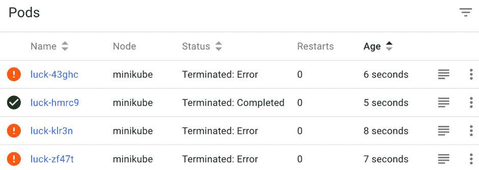
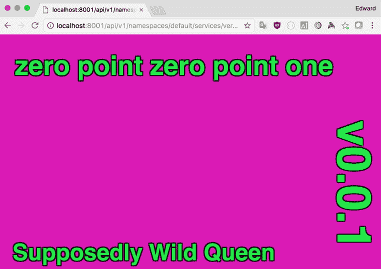
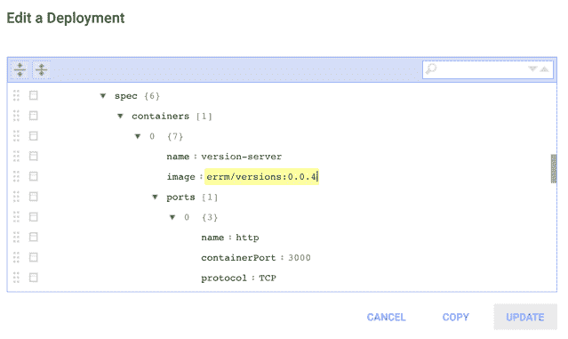

# 管理应用程序中的变更

在第二章 *启动引擎*中，我们首次尝试使用部署在 Kubernetes 上运行应用程序。在本章中，我们将深入了解 Kubernetes 提供的用于管理在集群上运行的 Pod 的工具。

+   我们将学习如何通过使用`Job`资源来确保批处理任务成功完成

+   我们将学习如何使用`CronJob`资源在预定时间间隔运行作业

+   最后，我们将学习如何使用部署来使长时间运行的应用程序无限期运行，并在需要进行更改时更新它们或其配置

我们将看看如何可以使用 Kubernetes 以不同的方式启动 Pod，这取决于我们正在运行的工作负载。

您将学到更多关于如何使用部署资源来控制 Kubernetes 如何推出对长时间运行的应用程序的更改。您将了解可以使用 Kubernetes 执行常见部署模式的方法，例如蓝绿部署和金丝雀部署。

按设计，Pod 不打算以任何方式持久。正如我们之前讨论过的，有一系列条件可能导致 Pod 的生命周期终止。它们包括：

+   **底层节点的故障**：可能是由于一些意外事件，例如硬件故障。或者可能是出于设计考虑；例如，在使用按需定价实例的集群中，如果实例需求增加，节点可以在没有警告的情况下被终止。

+   **调度程序启动的 Pod 驱逐**：调度程序在需要时可以启动 Pod 驱逐，以优化集群上资源的使用。这可能是因为某些进程的优先级比其他进程更高，或者只是为了优化集群上的装箱。

+   用户手动删除的 Pod。

+   由于计划维护而删除的 Pod；例如，使用`kubectl drain`命令。

+   由于网络分区，节点不再对集群可见。

+   为了准备缩减操作而从节点中删除的 Pod。

因此，如果 Kubernetes 的设计期望 pod 是短暂的，我们如何部署可靠的应用程序呢？当然，我们需要一种无法失败地运行我们的程序的方式。幸运的是，情况并非完全如此。这种设计的重要部分是它准确地模拟了由于底层硬件和软件以及管理过程而可能发生的各种问题。Kubernetes 并不试图使基本构建块（pod）本身对故障具有弹性，而是提供了许多控制器，我们作为用户可以直接与之交互来构建具有弹性的服务。这些控制器负责为因任何原因丢失的 pod 创建替代品。

这些控制器分为四组，我们的选择取决于我们想要运行的工作负载的类型：

+   对于我们期望结束的进程，比如批处理作业或其他有限的进程，Kubernetes 提供了作业抽象。作业确保一个 pod 至少运行一次完成。

+   对于我们期望长时间运行的 pod，比如 web 服务器或后台处理工作者，Kubernetes 提供了部署和较低级别的 ReplicationController 或 ReplicaSet。

+   对于我们希望在所有机器（或其中一部分）上运行的 pod，Kubernetes 提供了 DaemonSet。DaemonSet 通常用于提供作为平台一部分的特定于机器的服务，比如日志管理或监控代理，通常用于部署覆盖网络的每个节点组件。

+   对于每个 pod 都需要稳定标识或访问持久存储的 pod 组，Kubernetes 提供了`StatefulSets`。（我们将在第九章中介绍`StatefulSets`，*存储状态*。）

如果回想一下我们在第一章中学到的关于 Kubernetes 架构的知识，《谷歌的基础设施服务于我们其余的人》, 重要的是要记住控制器管理器（运行所有这些控制器的 Kubernetes 微服务）是一个独立的、不同的进程，与调度器分开。Kubernetes 的核心低级部分，比如调度器和 kubelet，只知道 pod，而高级控制器不需要了解实际调度和在节点上运行 pod 的任何细节。它们只是向 API 服务器发出请求创建一个 pod，而较低级的机制确保它们被正确地调度和运行。

在本章中，我们将逐步介绍作业、部署和 DaemonSet 提供给我们的重要功能和配置选项。通过一些示例，您将开始了解何时使用每个资源来部署您的应用程序。您应该花时间了解每个控制器正在做什么，以及为什么要使用它。

将软件部署到分布式环境可能会有点不同寻常，因为在部署到单台机器时可能会有很多假设不适用于分布式系统。

Kubernetes 非常擅长让我们能够部署大多数软件而无需进行任何修改。我认为 Kubernetes 让我们以一点简单性换取了很多可靠性。

# 直接运行 pod

Kubernetes 并不真的打算让用户直接在集群上提交和启动 pod。正如我们之前讨论的，pod 被设计为短暂存在，因此不适合运行需要确保执行已完成或需要确保进程保持运行的工作负载。

在这里，我们将从头开始，启动 pod，然后再使用控制器来帮助我们管理它们。请记住，这是一个学习练习；如果您需要它们可靠地运行，就不应该以这种方式提交 pod：

```
pod.yaml
apiVersion: v1
kind: Pod
metadata:
  name: hello-loop
spec:
  containers:
  - name: loop
    image: alpine
    command: ["/bin/sh"]
    args:
    - -c
    - while true; do echo "hello world"; sleep 2s; done

```

这个 pod 启动了一个无限循环，每 2 秒打印一次`hello world`。首先使用`kubectl`将 pod 提交到集群中：

```
$ kubectl create -f pod.yaml
pod "hello-loop" created
```

在容器运行时下载镜像的过程中，可能需要一些时间来创建 pod。在此期间，您可以通过运行`kubectl describe pod/hello-loop`或使用仪表板来检查 pod 的状态。

Kubernetes 使得即使是最低级别的抽象，比如 pod，也可以通过 API 来控制，这使得使用或构建附加工具来扩展 Kubernetes 的功能变得很容易，这些工具可以和内置的控制器一样强大。

一旦 pod 启动并运行，您可以使用`kubectl logs -f hello-loop`来跟踪输出，您应该每 2 秒看到一个`hello world`的输出。

`kubectl logs` 允许我们显示在集群上运行的 pod 的日志。如果您知道要从中获取日志的 pod 的名称，您可以将名称作为参数传递。但是，如果您使用控制器来启动 pod，您可以使用作业或部署的名称来代替 pod 名称，只需在名称前加上资源类型。

如果您对感兴趣的 pod 或 pod 有标签选择器，可以使用 `-l` 标志传递它们。使用 `-c` 标志，您可以针对具有多个容器的 pod 中的特定命名容器进行定位；如果 pod 只有一个容器，则可以省略此选项。

尝试运行 `kubectl`。它可以帮助查看一些更多的选项，以便查看您感兴趣的日志，包括将其限制在特定时间段内。

# 作业

作业的最简单用例是启动单个 pod，并确保它成功运行完成。

在我们的下一个示例中，我们将使用 Ruby 编程语言来计算并打印出前 100 个斐波那契数：

```
fib.yaml apiVersion: batch/v1
kind: Job
metadata:
  name: fib
spec:
  template:
     metadata:
       name: fib
     spec:
       containers:
       - name: fib
         image: ruby:alpine
         command: ["ruby"]
         args:
         - -e
         - |
           a,b = 0,1
           100.times { puts b = (a = a+b) - b }
       restartPolicy: Never
```

请注意，`spec` 和 `template` 的内容与我们直接启动 pod 时使用的规范非常相似。当我们为作业中的 pod 模板定义一个 pod 模板时，我们需要选择 `restartPolicy` 为 `Never` 或 `OnFailure`。

这是因为作业的最终目标是运行 pod 直到成功退出。如果基础 pod 在成功退出时重新启动，那么 pod 将继续重新启动，作业将永远无法完成。

将定义保存到文件，然后使用 `kubectl create` 将其提交到集群：

```
$ kubectl create -f fib.yaml
job "fib" created
```

一旦您向 Kubernetes 提交了作业，您可以使用 `kubectl describe` 命令来检查其状态。可能需要一点时间来下载 Docker 镜像并启动 pod。一旦 pod 运行，您应该在 `Pods Statues` 字段中看到首先是 `1 Running`，然后是 `1 Succeeded`：

```
$ kubectl describe jobs/fib
Name: fib
Namespace: default
Selector: controller-uid=278fa785-9b86-11e7-b25b-080027e071f1
Labels: controller-uid=278fa785-9b86-11e7-b25b-080027e071f1
 job-name=fib
Annotations: <none>
Parallelism: 1
Completions: 1
Start Time: Sun, 17 Sep 2017 09:56:54 +0100
Pods Statuses: 0 Running / 1 Succeeded / 0 Failed
```

在等待 Kubernetes 执行某些操作时，反复运行 `kubectl` 以了解发生了什么可能会变得乏味。我喜欢将 `watch` 命令与 `kubectl` 结合使用。要观察 Kubernetes 启动此作业，我可以运行：

`**$ watch kubectl describe jobs/fib**`

大多数 Linux 发行版将默认包含 `watch` 命令，或者可以通过软件包管理器轻松安装。如果您使用 macOS，可以通过 Homebrew 轻松安装：

`**$ brew install watch**`

我们可以使用`kubectl logs`来查看我们作业的输出。注意我们不需要知道底层 pod 的名称；我们只需要通过名称引用作业即可：

```
$ kubectl logs job/fib
...
83621143489848422977
135301852344706746049
218922995834555169026
```

我们还可以使用`kubectl get`查看由该作业创建的底层 pod，通过使用 Kubernetes 为我们添加到 pod 的`job-name`标签：

```
$ kubectl get pods -l job-name=fib --show-all
NAME READY STATUS RESTARTS AGE
fib-dg4zh 0/1 Completed 0 1m
```

`--show-all`标志意味着显示所有的 pod（即使那些不再具有运行状态的 pod）。

注意 Kubernetes 根据作业名称为我们的 pod 创建了一个唯一的名称。这很重要，因为如果第一个被创建的 pod 在某种方式上失败了，Kubernetes 需要根据相同的 pod 规范启动另一个 pod。

作业相对于直接启动 pod 的一个关键优势是，作业能够处理不仅是由底层基础设施引起的错误，可能导致 pod 在完成之前丢失，还有在运行时发生的错误。

为了说明这是如何工作的，这个作业模拟了一个（大部分）以非零退出状态失败的过程，但有时以（成功的）零退出状态退出。这个 Ruby 程序选择一个从 0 到 10 的随机整数并以它退出。因此，平均来说，Kubernetes 将不得不运行该 pod 10 次，直到它成功退出：

```
luck.yaml apiVersion: batch/v1
kind: Job
metadata:
  name: luck
spec:
  template:
    metadata:
      name: luck
    spec:
      containers:
      - name: luck
      image: ruby:alpine
      command: ["ruby"]
      args: ["-e", "exit rand(10)"]
restartPolicy: Never
```

像以前一样，使用`kubectl`将作业提交到你的集群中：

```
$ kubectl create -f luck.yaml
job "luck" created
```

除非你非常幸运，当你检查作业时，你应该看到 Kubernetes 需要启动多个 pod，直到有一个以 0 状态退出：



使用 Kubernetes 仪表板检查由 luck 作业启动的 pod

在这个例子中，pod 规范具有`restartPolicy`为`Never`。这意味着当 pod 以非零退出状态退出时，该 pod 被标记为终止，作业控制器会启动另一个 pod。还可以使用`restartPolicy`为`OnFailure`运行作业。

尝试编辑`luck.yaml`来进行这个更改。删除`luck`作业的第一个版本并提交你的新版本：

```
$ kubectl delete jobs/luck
job "luck" deleted
$ kubectl create -f luck.yaml
job "luck" created
```

这一次，你应该注意到，Kubernetes 不再快速启动新的 pod，直到一个成功退出，而是重启一个 pod 直到成功。你会注意到这需要更长的时间，因为当 Kubernetes 使用指数回退本地重启一个 pod 时，这种行为对于由于底层资源过载或不可用而导致的失败是有用的。你可能会注意到 pod 处于`CrashLoopBackoff`状态，而 Kubernetes 正在等待重新启动 pod：

```
$ kubectl get pods -l job-name=luck -a
NAME READY STATUS RESTARTS AGE
luck-0kptd 0/1 Completed 5 3m
```

允许作业控制器在每次终止时重新创建一个新的 pod，以确保新的 pod 在新的原始环境中运行，并导致作业资源保留每次执行尝试的记录。因此，通常最好不要在作业中使用 pod 重启策略，除非您必须处理定期失败的 pod，或者您希望在尝试之间保留执行环境。

# CronJob

现在您已经学会了如何使用作业运行一次性或批量任务，可以简单地扩展该概念以运行定时作业。在 Kubernetes 中，`CronJob`是一个控制器，根据给定的计划从模板创建新的作业。

让我们从一个简单的例子开始。以下示例将每分钟启动一个作业。该作业将输出当前日期和时间，然后退出：

```
fun-with-cron.yaml apiVersion: batch/v1beta1
kind: CronJob
metadata:
  name: fun-with-cron
spec:
  schedule: "* * * * *"
  jobTemplate:
    spec:
      template:
        metadata:
          labels:
            cronjob: fun-with-cron
        spec:
          restartPolicy: OnFailure
          containers:
          - name: how-soon-is-now
            image: alpine:3.6
            command: ["/bin/date"]
```

使用`kubectl`将 CronJob 推送到 Kubernetes：

```
$ kubectl apply -f fun-with-cron.yaml
```

过一段时间（不到一分钟），您应该会看到第一个作业被创建：

```
$ kubectl get jobs
NAME DESIRED SUCCESSFUL AGE
fun-with-cron-1533475680 1 1 9s
```

我们添加到 pod 模板规范的标签允许我们使用`kubectl logs`来查看 CronJob 创建的所有 pod 的输出：

```
$ kubectl logs -l cronjob=fun-with-cron
 Sun Aug 5 13:26:08 UTC 2018
 Sun Aug 5 13:27:08 UTC 2018
 Sun Aug 5 13:28:08 UTC 2018
```

# Cron 语法

调度字段的语法遵循标准的 Cron 格式，如果您曾在类 Unix 系统上设置过 CronJobs，这应该是很熟悉的。Kubernetes 支持带有一些常见扩展的标准 cron 字符串。

标准的 cron 字符串由五个字段组成，每个字段代表不同的时间单位。每个字段可以设置为表示特定时间的表达式，或者通配符(*)，表示匹配每个时间。例如，在**月份**列中的通配符将匹配每个月：

| 分钟 | 小时 | 月份中的日期 | 月份 | 星期中的日期 |
| --- | --- | --- | --- | --- |

Cron 字段的顺序

如果从左到右阅读，Cron 格式最容易理解。以下是一些示例：

+   `0 * * * *`：每小时整点

+   `15 * * * *`：每小时 15 分钟

+   `0 0 * * *`：每天午夜

+   `30 5 1 * *`：每个月的第一天上午 5:30

+   `30 17 * * 1`：每周一下午 3:30

除了通配符之外，还有一些其他具有特殊含义的字符。

斜杠用于指示步长：

+   `0/15 * * * *`：每 15 分钟一次，从 0 开始；例如，12:00, 12:15, 12:30 等

+   `15/15 * * * *`：每 15 分钟一次，从 15 开始；例如，12:15, 12:30, 12:45, 13:15, 13:30 等

+   `0 0 0/10 * *`：每 10 天的午夜

连字符表示范围：

+   `0 9-17 * * *`：在办公时间（上午 9 点至下午 5 点）每小时一次

+   `0 0 1-15/2 * *`：每月前 15 天隔一天

逗号表示列表：

+   `0 0 * * 6,0`：星期六和星期日午夜

+   `0 9,12,17 * * 1-5`：上午 9:00，中午 12:00 和下午 5:00，周一至周五

为了方便阅读，月份和星期几字段可以使用名称：

+   `0 0 * * SUN`：星期日午夜

+   `0 6 * MAR-MAY *`：每天上午 6 点在春季

如果你不介意作业的具体运行时间，你可以指定一个固定的间隔，Kubernetes 会按固定的间隔创建作业：

+   `@every 15m`：每 15 分钟

+   `@every 1h30m`：每 1 个半小时

+   `@every 12h`：每 12 小时

请记住，间隔不考虑作业运行所需的时间；它只是确保每个作业计划的时间间隔由给定的间隔分隔。

最后，有几个预定义的计划可以用作 cron 字符串的快捷方式：

| **快捷方式** | **等效的 cron** |  |
| --- | --- | --- |
| `@hourly` | `0 0 * * * *` | 每小时整点 |
| `@daily` | `0 0 0 * * *` | 每天午夜 |
| `@weekly` | `0 0 0 * * 0` | 每周星期日午夜 |
| 每月，每月 1 日午夜 |
| `@yearly` | `0 0 0 1 1 *` | 每年除夕午夜 |

# 并发策略

与传统的 CronJob 相比，Kubernetes CronJob 允许我们决定当作业超时并且在上一个作业仍在运行时到达计划时间时会发生什么。我们可以通过在 CronJob 上设置`spec.concurrencyPolicy`字段来控制这种行为。我们可以选择三种可能的策略：

+   默认情况下，如果字段未设置，则我们将获得`Allow`策略。这就像传统的 CronJob 一样工作，并允许多个作业实例同时运行。如果你坚持这一点，你应该确保你的作业确实在某个时候完成，否则你的集群可能会因为同时运行许多作业而不堪重负。

+   `Forbid`策略防止在现有作业仍在运行时启动任何新作业。这意味着如果作业超时，Kubernetes 将跳过下一次运行。如果一个作业的两个或更多实例可能会导致冲突或使用共享资源，这是一个很好的选择。当然，你的作业需要能够处理在这种情况下缺少的运行。

+   最后，`Replace`策略还可以防止多个作业同时运行，而不是跳过运行，它首先终止现有作业，然后启动新作业。

# 历史限制

默认情况下，当您使用 CronJob 时，它创建的作业将保留下来，因此您可以检查特定作业运行的情况以进行调试或报告。但是，当使用 CronJob 时，您可能会发现成功或失败状态的作业数量开始迅速增加。这可以通过`spec.successfulJobsHistoryLimit`和`spec.failedJobsHistoryLimit`字段简单管理。一旦成功或失败的作业达到限制中指定的数量，每次创建新作业时，最旧的作业都会被删除。如果将限制设置为 0，则作业在完成后立即删除。

# 使用部署管理长时间运行的进程

更新批处理进程，例如作业和 CronJobs，相对较容易。由于它们的寿命有限，更新代码或配置的最简单策略就是在再次使用之前更新相关资源。

长时间运行的进程更难处理，如果您将服务暴露给网络，管理起来更加困难。Kubernetes 为我们提供了部署资源，使部署和更新长时间运行的进程变得更简单。

在第二章 *启动引擎*中，我们首次了解了部署资源，既可以使用`kubectl run`创建部署，也可以通过在 YAML 文件中定义部署对象。在本章中，我们将回顾部署控制器用于推出更改的过程，然后深入研究一些更高级的选项，以精确控制新版本的 Pod 的可用性。我们将介绍如何使用部署与服务结合，在不中断服务的情况下对网络上提供的服务进行更改。

就像 CronJob 是作业的控制器一样，部署是 ReplicaSets 的控制器。 ReplicaSet 确保特定配置所需的 Pod 的数量正常运行。为了管理对此配置的更改，部署控制器创建一个具有新配置的新 ReplicaSet，然后根据特定策略缩减旧的 ReplicaSet 并扩展新的 ReplicaSet。即使新配置的部署完成后，部署也会保留对旧 ReplicaSet 的引用。这允许部署在需要时还可以协调回滚到以前的版本。

让我们从一个示例应用程序开始，这将让您快速了解部署提供的不同选项如何允许您在更新代码或配置时操纵应用程序的行为。

我们将部署一个我创建的应用程序，以便简单地说明如何使用 Kubernetes 部署新版本的软件。这是一个简单的 Ruby Web 应用程序，位于 Docker 存储库中，有许多版本标签。每个版本在浏览器中打开主页时都会显示一个独特的名称和颜色方案。

当我们将长时间运行的进程部署到 Kubernetes 时，我们可以使用标签以受控的方式推出对应用程序的访问。

实施的最简单策略是使用单个部署来推出对应用程序新版本的更改。

为了实现这一点，我们需要首先创建一个带有标签选择器的服务，该选择器将匹配我们现在或将来可能部署的应用程序的每个版本：

```
service.yaml 
apiVersion: v1
kind: Service
metadata:
  name: ver
spec:
  selector:
    app: ver
  ports:
  - protocol: TCP
    port: 80
    targetPort: http
```

在这种情况下，我们通过匹配具有与`selector`相匹配的标签`app: ver`的任何 pod 来实现这一点。

当运行一个更复杂的应用程序，该应用程序由多个部署管理的多个不同进程组成时，您的标签和选择器将需要更复杂。一个常见的模式是使用`component`标签区分应用程序的组件部分。

在开始任何 pod 之前提交服务定义是有意义的。这是因为调度程序将尽可能地尝试将特定服务使用的 pod 分布在多个节点上，以提高可靠性。

使用`kubectl apply -f service.yaml`将服务定义提交到您的集群。

一旦服务提交到集群，我们可以准备初始部署：

```
deployment.yaml apiVersion: apps/v1
kind: Deployment
metadata:
  name: versions
  labels:
    app: ver
spec:
  replicas: 2
  selector:
    matchLabels:
      app: ver
  template:
    metadata:
      labels:
        app: ver
        version: 0.0.1
    spec:
      containers:
      - name: version-server
        image: errm/versions:0.0.1
        ports:
        - name: http
          containerPort: 3000
```

要访问正在运行的服务，最简单的方法是使用`kubectl`打开代理到运行在您的集群上的 Kubernetes API：

```
$ kubectl proxy
Starting to serve on 127.0.0.1:8001
```

完成后，您应该能够使用浏览器在`http://localhost:8001/api/v1/namespaces/default/services/ver/proxy`查看应用程序。



在我们的集群中运行的版本 0.0.1

现在我们有许多方法可以对我们的部署进行更改。

# kubectl patch

要升级到版本 0.0.2，我们将执行以下命令：

```
$ kubectl patch deployment/versions -p ' {"spec":{"template":{"spec":{"containers":[{"name":"version-server", "image":"errm/versions:0.0.2"}] }}}}'
```

因为容器是一个列表，我们需要为 Kubernetes 指定合并键`name`，以便理解我们要更新图像字段的容器。

使用`patch`命令，Kubernetes 执行合并，将提供的 JSON 与`deployment/versions`对象的当前定义进行合并。

继续在浏览器中重新加载应用程序，然后您应该会注意到（几秒钟后）应用程序的新版本变为可用。

# kubectl edit

要升级到版本 0.0.3，我们将使用`kubectl edit`命令：

```
kubectl edit deployment/versions
```

`kubectl edit`使用您系统的*标准*编辑器来编辑 Kubernetes 资源。通常是 vi、vim，甚至是 ed，但如果您有其他更喜欢的文本编辑器，您应该设置`EDITOR`环境变量指向您的首选选择。

这应该会打开您的编辑器，这样您就可以对部署进行更改。一旦发生这种情况，请将图像字段编辑为使用版本 0.0.3 并保存文件。

您可能会注意到在您的编辑器中打开的对象中有比您提交给 Kubernetes 的原始文件中更多的字段。这是因为 Kubernetes 在此对象中存储有关部署当前状态的元数据。

# kubectl apply

要升级到版本 0.0.4，我们将使用`apply`命令。这允许我们将完整的资源提交给 Kubernetes，就像我们进行初始部署时一样。

首先编辑您的部署 YAML 文件，然后将图像字段更新为使用版本 0.0.4。保存文件，然后使用`kubectl`将其提交到 Kubernetes：

```
$ kubectl apply -f deployment.yaml
```

如果您使用`kubectl apply`来创建尚不存在的资源，它将为您创建。如果您在脚本化部署中使用它，这可能会很有用。

使用`kubectl apply`而不是 edit 或 patch 的优势在于，您可以保持将文件提交到版本控制以表示集群状态。

# Kubernetes 仪表板

Kubernetes 仪表板包括一个基于树的编辑器，允许您直接在浏览器中编辑资源。在 Minikube 上，您可以运行 Minikube 仪表板以在浏览器中打开仪表板。然后，您可以选择您的部署并单击页面顶部的编辑按钮：



您应该能够通过滚动或使用搜索功能找到容器图像字段。单击值进行编辑然后按**UPDATE**非常简单。

当您了解 Kubernetes 并尝试不同的配置时，您用于更新配置的方法应该是您自己的个人偏好。使用 Kubernetes 仪表板或诸如`kubectl edit`之类的工具非常适合学习和调试。但是，当您进入生产环境时，您将希望开始将您的配置检入版本控制，或者使用诸如 Helm（我们将在第五章中讨论的*使用 Helm 管理复杂应用*）之类的工具。

# 更好地控制您的部署

到目前为止，我们已经介绍了一些在 Kubernetes 中更新资源的方法。正如我们所观察到的，当我们在 Kubernetes 中更新部署时，集群中的 Pod 最终会更新以反映新的配置。

Kubernetes 通过在幕后管理 ReplicaSets 来实现这一点。

ReplicaSet 纯粹关注管理一组 Pod，以确保集群上运行所需数量的副本。在更新期间，现有 ReplicaSet 的 Pod 规范永远不会更改。部署控制器会使用新的 Pod 配置创建一个新的 ReplicaSet。通过改变每个 ReplicaSet 的所需副本数量来编排这种新配置的推出。

这种关注点的分离是 Kubernetes 中资源设计的典型方式。通过编排更简单的对象，其控制器实现更简单的行为来实现更复杂的行为。

这种设计还使我们（集群操作员）能够非常简单地决定在更新配置时我们想要的确切行为。`spec.stratergy`字段用于配置推出更改时使用的行为。

`.spec.strategy.type`字段定义了用于用新的 Pod 替换旧的 Pod 的策略。目前有两种策略：`Recreate`和`RollingUpdate`。`RollingUpdate`是默认策略，因此通常您不需要在配置中指定它。

# 滚动更新部署

`.spec.strategy.type=RollingUpdate 是默认策略`。这是我们迄今为止在示例中使用的策略。

当您想要在不中断服务的情况下进行更新时，您会明确选择滚动更新。相反，如果您使用此策略，您的应用程序必须在同时运行多个版本时正确工作。

在使用`RollingUpdate`策略时，有两个设置允许我们指定新的 ReplicaSet 如何快速扩展，旧的 ReplicaSet 如何快速缩减：

+   `.spec.strategy.rollingUpdate.maxUnavailable`：它指定在部署过程中可以不可用的 Pod 数量（超出所需总数）。

+   `.spec.strategy.rollingUpdate.maxSurge`：它指定在部署过程中可以创建的 Pod 数量，超出所需总数。

这些设置接受绝对值，例如 1 或 0，或部署中所需的总 Pod 数量的百分比。百分比值在以下情况下很有用：如果您打算使此配置可在不同级别进行扩展的不同部署中重复使用，或者如果您打算使用自动扩展机制来控制所需的 Pod 数量。

通过将`maxUnavailable`设置为`0`，Kubernetes 将等待替换的 Pod 被调度并运行，然后再杀死由旧的 ReplicationSet 管理的任何 Pod。如果以这种方式使用`maxUnavailable`，那么在部署过程中，Kubernetes 将运行超出所需数量的 Pod，因此`maxSurge`不能为`0`，并且您必须具有所需的资源（在集群中和用于后备服务）来支持在部署阶段临时运行额外的实例。

一旦 Kubernetes 启动了所有实例，它必须等待新的 Pod 处于服务状态并处于`Ready`状态。这意味着如果您为 Pod 设置了健康检查，如果这些检查失败，部署将暂停。

如果`maxSurge`和/或`maxUnavailable`设置为较低的值，部署将需要更长时间，因为部署将暂停并等待新的 Pod 可用后才能继续。这是有用的，因为它可以在部署损坏的代码或配置时提供一定程度的保护。

将`maxSurge`设置为更大的值将减少部署更新应用程序所需的扩展步骤的数量。例如，如果将`maxSurge`设置为 100%，`maxUnavailable`设置为 0，那么 Kubernetes 将在部署开始时创建所有替换的 Pod，并在新的 Pod 进入 Ready 状态时杀死现有的 Pod。

确切地配置部署将取决于应用程序的要求和集群可用的资源。

您应该记住，将`maxSurge`设置为较低的值将使部署速度较慢，需要更长的时间来完成，但可能更具有错误的弹性，而较高的`maxSurge`值将使您的部署进展更快。但您的集群需要具有足够的容量来支持额外的运行实例。如果您的应用程序访问其他服务，您还应该注意可能对它们施加的额外负载。例如，数据库可以配置为接受的连接数量有限。

# 重新创建部署

`.spec.strategy.type=Recreate`采用了一种更简单的方法来推出对应用程序的更改。首先，通过缩减活动的 ReplicaSet 来终止具有先前配置的所有 pod，然后创建一个启动替换 pod 的新 ReplicaSet。

当您不介意短暂的停机时间时，这种策略特别合适。例如，在后台处理中，当工作程序或其他任务不需要提供通过网络访问的服务时。在这些用例中的优势是双重的。首先，您不必担心由同时运行两个版本的代码引起的任何不兼容性。其次，当然，使用这种策略更新您的 pod 的过程不会使用比您的应用程序通常需要的更多资源。

# DaemonSet

如果您希望特定 pod 的单个实例在集群的每个节点（或节点的子集）上运行，则需要使用 DaemonSet。当您将 DaemonSet 调度到集群时，您的 pod 的一个实例将被调度到每个节点，并且当您添加新节点时，该 pod 也会被调度到那里。DaemonSet 非常适用于提供需要在集群的每个地方都可用的普遍服务。您可能会使用 DaemonSet 来提供以下服务：

+   用于摄取和传送日志的代理，如 Fluentd 或 Logstash

+   监控代理，如 collectd、Prometheus Node Exporter、datadog、NewRelic 或 SysDig 等

+   用于分布式存储系统的守护程序，如 Gluster 或 Ceph

+   用于覆盖网络的组件，如 Calico 或 Flannel

+   每个节点组件，如 OpenStack 虚拟化工具

在 Kubernetes 之前，这些类型的服务将要求您在基础设施中的每台服务器上配置一个 init 系统，例如`systemd`或 SysVnit。当您要更新服务或其配置时，您将不得不更新该配置并重新启动所有服务器上的服务，当您管理少量服务器时，这并不是问题，但是当您有数十、数百甚至数千台服务器时，事情很快变得更加难以管理。

DaemonSet 允许您使用与您正在管理基础设施的应用程序相同的配置和容器化。

让我们看一个简单的例子，以了解如何为有用的目的创建一个 DaemonSet。我们将部署 Prometheus Node Exporter。这个应用程序的目的是公开一个包含有关其正在运行的 Linux 系统的指标的 HTTP 端点。

如果您决定监视您的集群，Prometheus Node Exporter 是一个非常有用的工具。如果您决定在自己的集群中运行它，我建议您查看 GitHub 页面上提供的广泛文档[`github.com/prometheus/node_exporter`](https://github.com/prometheus/node_exporter)。

这个清单会导致在模板部分指定的 pod 被调度到您集群中的每个节点上：

```
node-exporter.yaml 
apiVersion: apps/v1 
kind: DaemonSet 
metadata: 
  labels: 
    app: node-exporter 
  name: node-exporter 
spec: 
  selector: 
    matchLabels: 
      app: node-exporter 
  template: 
    metadata: 
      labels: 
        app: node-exporter 
    spec: 
      containers: 
      - name: node-exporter 
        image: quay.io/prometheus/node-exporter:v0.15.2 
        args: 
        - --path.procfs=/host/proc 
        - --path.sysfs=/host/sys 
        volumeMounts: 
        - mountPath: /host/proc 
          name: proc 
          readOnly: false 
        - mountPath: /host/sys 
          name: sys 
          readOnly: false 
        ports: 
        - containerPort: 9100 
          hostPort: 9100 
      hostNetwork: true 
      hostPID: true 
      volumes: 
      - hostPath: 
          path: /proc 
        name: proc 
      - hostPath: 
          path: /sys 
        name: sys 
```

一旦您准备好 Node Exporter 的清单文件，通过运行`kubectl apply -f node-exporter.yaml`命令将其提交到 Kubernetes。

您可以通过运行`kubectl describe ds/node-exporter`命令来检查 DaemonSet 控制器是否已正确将我们的 pod 调度到集群中的节点。假设 pod 成功运行，您应该能够在其中一个节点的端口`9100`上发出 HTTP 请求，以查看其公开的指标。

如果您在 Minikube 上尝试此示例，可以通过运行`minikube ip`来发现集群中（唯一）节点的 IP 地址。

然后您可以使用`curl`等工具发出请求：

`**curl 192.168.99.100:9100/metrics**`

使用 DaemonSet 来管理基础设施工具和组件的一个关键优势是，它们可以像您在集群上运行的任何其他应用程序一样轻松更新，而不是依赖于节点上的静态配置来管理它们。

默认情况下，DaemonSet 具有`updateStrategy`为`RollingUpdate`。这意味着如果您编辑了 DaemonSet 中的 pod 模板，当前在集群上运行的现有 pod 将被逐个杀死并替换。

让我们尝试使用此功能来升级到 Prometheus Node Exporter 的新版本：

```
kubectl set image ds/node-exporter node-exporter=quay.io/prometheus/node-exporter:v0.16.0
```

您可以通过运行`kubectl rollout status ds/node-exporter`命令来查看替换旧版本的 pod 的进度。一旦更新完成，您应该会看到以下消息：`daemon set "node-exporter" successfully rolled out`。

您可能想知道 DaemonSet 还有哪些其他`updateStrategys`可用。唯一的其他选项是`OnDelete`。使用此选项时，当 DaemonSet 更新时，不会对集群上运行的现有 pod 进行任何更改，您需要手动删除运行的 pod，然后再启动新版本。这主要是为了与 Kubernetes 先前版本中的行为兼容，并且在实践中并不是非常有用。

值得注意的是，为了部署一个带有 DaemonSet 的新版本的 pod，旧的 pod 被杀死并启动新的 pod 之间会有一个短暂的时间，在此期间您运行的服务将不可用。

DaemonSet 也可以用于在集群中的节点子集上运行 pod。这可以通过为集群中的节点打标签并在 DaemonSet 的 pod 规范中添加`nodeSelector`来实现：

```
... 
    spec: 
      nodeSelector: 
        monitoring: prometheus 
      containers: 
      - name: node-exporter 
... 
```

一旦您编辑了清单以添加`nodeSelector`，请使用以下命令将新配置提交给 Kubernetes：`kubectl apply -f node-exporter.yaml`。

您应该注意到正在运行的节点导出器 pod 被终止并从集群中删除。这是因为您的集群中没有节点与我们添加到 DaemonSet 的标签选择器匹配。可以使用`kubectl`动态地为节点打标签。

```
kubectl label node/<node name> monitoring=prometheus      
```

一旦节点被正确标记，您应该注意到 DaemonSet 控制器会将一个 pod 调度到该节点上。

在 AWS 上，节点会自动带有标签，包括区域、可用区、实例类型和主机名等信息。您可能希望使用这些标签将服务部署到集群中的特定节点，或者为集群中不同类型的节点提供不同配置版本的工具。

如果您想添加额外的标签，可以使用`--node-labels`标志将它们作为参数传递给 kubelet。

# 总结

在本章中，我们学习了如何使用 Kubernetes 来运行我们的应用程序，以及如何推出新版本的应用程序和它们的配置。

我们在前几章基础知识的基础上构建了对 pod 和部署的了解。

+   Pod 是 Kubernetes 提供给我们的最低级抽象。

+   所有其他处理容器运行的资源，如作业、ScheduledJobs、部署，甚至 DaemonSet，都是通过特定方式创建 pod 来工作的。

+   通常，我们不希望直接创建 pod，因为如果运行 pod 的节点停止工作，那么 pod 也将停止工作。使用其中一个高级控制器可以确保创建新的 pod 来替换失败的 pod。

+   高级资源，如部署和 DaemonSet，提供了一种以受控方式用不同版本的 pod 替换另一个版本的机制。我们了解了可用于执行此操作的不同策略。

在进入下一章之前，花点时间通过观察部署过程中它们的行为来了解每种部署策略的工作方式。通过一些经验，您将了解在给定应用程序中选择哪些选项。

在下一章中，我们将学习如何使用一个工具，该工具基于这些概念提供了更强大的部署和更新应用程序的方式。
