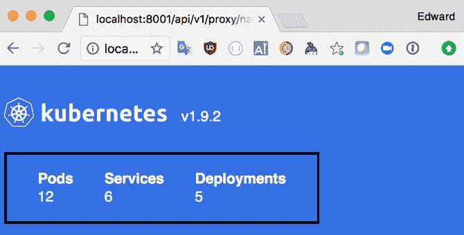

# 使用 Helm 管理复杂的应用程序

在之前的章节中，您开始学习如何构建和部署所需的配置，以在您的 Kubernetes 集群上运行不同的应用程序。

一旦您超越了部署最简单的应用程序，您会发现您的应用程序通常有一个或多个组件是协同工作的。例如，您可能有一个 Web 应用程序，它从数据库中显示信息，该数据库还使用定期作业定期更新该信息。为了使该应用程序能够正确运行，这两个组件都需要被部署并正确运行。此外，这两个组件可能共享一些配置，例如后端数据库的凭据。

在将应用程序部署到我们的 Kubernetes 集群时，我们可能会遇到另一个问题，即可重用性的问题。也许我们需要在多个上下文或环境中运行相同的工具或应用程序。例如，许多组织都有一个用于测试软件新版本的暂存环境。

在维护多个环境时，我们理想情况下希望每个环境中的配置尽可能匹配，但当然，配置中可能需要一些差异。维护每个环境的 Kubernetes 清单的多个副本可能会出错，并且不能保证在一个环境中运行的应用程序在另一个环境中也能正常工作。

Helm 是 Kubernetes 生态系统中的一款流行工具，它解决了这些问题。它为我们提供了一种构建相关 Kubernetes 对象的软件包（称为图表）的方式，可以以一种协调的方式部署到集群中。它还允许我们对这些软件包进行参数化，以便在不同的上下文中重复使用，并部署到可能需要这些服务的不同环境中。

与 Kubernetes 一样，Helm 的开发由 Cloud Native Computing Foundation 监督。除了 Helm（软件包管理器）之外，社区还维护了一个标准图表的存储库，用于安装和运行各种开源软件，例如 Jenkins CI 服务器、MySQL 或 Prometheus，使用 Helm 可以简单地安装和运行涉及许多基础 Kubernetes 资源的复杂部署。

在本章中，您将学习：

+   如何安装`helm`命令行工具

+   如何安装 Helm 的集群组件 Tiller

+   如何使用社区维护的图表将服务部署到您的集群

+   创建图表时需要了解的语法

+   如何在自己的图表存储库中托管图表，以便在组织内或更广泛地共享您的图表

+   将 Helm 图表集成到您自己的部署流程的策略

# 安装 Helm

如果您已经设置了自己的 Kubernetes 集群，并且在您的机器上正确配置了 `kubectl`，那么安装 Helm 就很简单。

# macOS

在 macOS 上，安装 Helm 客户端的最简单方法是使用 Homebrew：

```
$ brew install kubernetes-helm  
```

# Linux 和 Windows

Helm 的每个版本都包括 Linux、Windows 和 macOS 的预构建二进制文件。访问[`github.com/kubernetes/helm/releases`](https://github.com/kubernetes/helm/releases)下载您所需的平台版本。

要安装客户端，只需解压并将二进制文件复制到您的路径上。

例如，在 Linux 机器上，您可能会执行以下操作：

```
$ tar -zxvf helm-v2.7.2-linux-amd64.tar.gz
$ mv linux-amd64/helm /usr/local/bin/helm  
```

# 安装 Tiller

一旦您在您的机器上安装了 Helm CLI 工具，您可以开始安装 Helm 的服务器端组件 Tiller。

Helm 使用与 `kubectl` 相同的配置，因此首先检查您将要安装 Tiller 的上下文：

```
$ kubectl config current-context
minikube  
```

在这里，我们将把 Tiller 安装到 Minikube 上下文引用的集群中。在这种情况下，这正是我们想要的。如果您的 `kubectl` 当前没有指向另一个集群，您可以快速切换到您想要使用的上下文，就像这样：

```
$ kubectl config use-context minikube  
```

如果您仍然不确定是否使用了正确的上下文，请快速查看完整配置，并检查集群服务器字段是否正确：

```
$ kubectl config view --minify=true  
```

`minify` 标志会删除当前上下文中未引用的任何配置。一旦您确认 `kubectl` 连接的集群是正确的，我们可以设置 Helm 的本地环境并将 Tiller 安装到您的集群上：

```
$ helm init
$HELM_HOME has been configured at /Users/edwardrobinson/.helm.

Tiller (the Helm server-side component) has been installed into your Kubernetes Cluster.
Happy Helming!  
```

我们可以使用 `kubectl` 来检查 Tiller 是否确实在我们的集群上运行：

```
$ kubectl -n kube-system get deploy -l app=helm
NAME            DESIRED   CURRENT   UP-TO-DATE   AVAILABLE   AGE
tiller-deploy   1         1         1            1           3m  
```

一旦我们验证了 Tiller 在集群上正确运行，让我们使用 `version` 命令。这将验证我们能够正确连接到 Tiller 服务器的 API，并返回 CLI 和 Tiller 服务器的版本号：

```
$ helm version
Client: &version.Version{SemVer:"v2.7.2", GitCommit:"8478fb4fc723885b155c924d1c8c410b7a9444e6", GitTreeState:"clean"}
Server: &version.Version{SemVer:"v2.7.2", GitCommit:"8478fb4fc723885b155c924d1c8c410b7a9444e6", GitTreeState:"clean"}
```

# 安装图表

让我们首先通过使用社区提供的图表之一来安装一个应用程序。

您可以在[`hub.kubeapps.com/`](https://hub.kubeapps.com/)发现社区为 Helm 图表制作的应用程序。除了简化将各种应用程序部署到 Kubernetes 集群中，这也是一个学习社区在为 Helm 打包应用程序时使用的一些最佳实践的好资源。

Helm 图表可以存储在存储库中，因此可以通过名称简单安装它们。默认情况下，Helm 已配置为使用一个名为**Stable**的远程存储库。

这使我们可以在安装 Helm 后立即尝试一些常用的应用程序。

在安装图表之前，您需要了解三件事：

+   要安装的图表的名称

+   要为此发布指定的名称（如果省略此项，Helm 将为此发布创建一个随机名称）

+   要安装图表的集群上的命名空间（如果省略此项，Helm 将使用默认命名空间）

Helm 将特定图表的每个不同安装称为一个发布。每个发布都有一个唯一的名称，如果以后要更新、升级或删除集群中的发布，将使用该名称。能够在单个集群上安装多个图表实例使 Helm 与我们对传统软件包管理器的想法有些不同，传统软件包管理器通常与单台机器绑定，并且通常一次只允许安装一个特定软件包。但一旦您习惯了这些术语，就会非常容易理解：

+   **图表**是包含有关*如何*将特定应用程序或工具安装到集群的所有信息的软件包。您可以将其视为一个模板，可重复使用以创建打包的应用程序或工具的许多不同实例或发布。

+   **发布**是将图表命名安装到特定集群的过程。通过按名称引用发布，Helm 可以对特定发布进行升级，更新已安装工具的版本或进行配置更改。

+   **存储库**是存储图表以及索引文件的 HTTP 服务器。当配置了存储库的位置后，Helm 客户端可以通过从该存储库下载图表然后创建一个新的发布来安装该图表。

在将图表安装到集群之前，您需要确保 Helm 知道您要使用的存储库。您可以通过运行`helm repo list`命令列出当前使用的存储库：

```
$ helm repo list
NAME   URL
stable https://kubernetes-charts.storage.googleapis.com
local  http://127.0.0.1:8879/charts  
```

默认情况下，Helm 配置了一个名为 stable 的存储库，指向社区图表存储库，以及一个指向本地地址的本地存储库，用于测试您自己的本地存储库（您需要运行`helm serve`）。

使用`helm repo add`命令将 Helm 存储库添加到此列表非常简单。您可以通过运行以下命令添加包含与本书相关的一些示例应用程序的 Helm 存储库：

```
$ helm repo add errm https://charts.errm.co.uk
"errm" has been added to your repositories  
```

为了从配置的存储库中获取最新的图表信息，您可以运行以下命令：

```
$ helm repo update
Hang tight while we grab the latest from your chart repositories...
...Skip local chart repository
...Successfully got an update from the "errm" chart repository
...Successfully got an update from the "stable" chart repository
Update Complete.  Happy Helming!
```

让我们从我的 Helm 存储库中提供的最简单的应用程序之一`kubeslate`开始。这提供了有关您的集群的一些非常基本的信息，例如您正在运行的 Kubernetes 版本以及您的集群中的 Pod、部署和服务的数量。我们将从这个应用程序开始，因为它非常简单，不需要任何特殊的配置来在 Minikube 上运行，或者在任何其他集群上运行。

从集群上的存储库安装图表非常简单：

```
$ helm install --name=my-slate errm/kubeslate  
```

您应该会看到来自`helm`命令的大量输出。

首先，您将看到有关发布的一些元数据，例如其名称、状态和命名空间：

```
NAME:   my-slate
LAST DEPLOYED: Mon Mar 26 21:55:39 2018
NAMESPACE: default
STATUS: DEPLOYED  
```

接下来，您应该会看到有关 Helm 已指示 Kubernetes 在集群上创建的资源的一些信息。正如您所看到的，已创建了一个服务和一个部署：

```
RESOURCES:
==> v1/Service
NAME                TYPE       CLUSTER-IP     PORT(S)  AGE
my-slate-kubeslate  ClusterIP  10.100.209.48  80/TCP   0s

==> v1/Deployment
NAME                DESIRED  CURRENT  UP-TO-DATE  AVAILABLE  AGE
my-slate-kubeslate  2        0        0           0          0s

==> v1/Pod(related)
NAME                                 READY  STATUS             AGE
my-slate-kubeslate-77bd7479cf-gckf8  0/1    ContainerCreating  0s
my-slate-kubeslate-77bd7479cf-vvlnz 0/1 ContainerCreating 0s
```

最后，有一个部分包含图表作者提供的一些注释，以便为我们提供有关如何开始使用应用程序的一些信息：

**注意**：

访问`kubeslate`。

1.  首先启动 kubectl 代理：

`**kubectl proxy**`

1.  现在在浏览器中打开以下 URL：

`**http://localhost:8001/api/v1/namespaces/default/services/my-slate-kubeslate:http/proxy**`

如果您看到`ServiceUnavailable / no endpoints available for service`，请尝试重新加载页面，因为 Pod 的创建可能需要一些时间。

尝试按照这些说明自己打开 Kubeslate 在浏览器中。

使用 Helm 部署的 Kubeslate

# 配置图表

当您使用 Helm 发布图表时，可能需要更改某些属性或提供配置。幸运的是，Helm 为图表的用户提供了一种标准的方式来覆盖一些或所有的配置值。

在本节中，我们将看看作为图表用户，您可能如何向 Helm 提供配置。在本章的后面，我们将看看如何创建自己的图表，并使用传递的配置来允许您的图表进行自定义。

当我们调用`helm install`时，有两种方式可以提供配置值：将它们作为命令行参数传递，或者提供一个配置文件。

这些配置值与图表提供的默认值合并。这使得图表作者可以提供默认配置，让用户快速上手，但仍然允许用户调整重要设置或启用高级功能。

使用 set 标志在命令行上向 Helm 提供单个值。 `kubeslate`图表允许我们使用`podLabels`变量为其启动的 pod(s)指定附加标签。让我们发布 kubeslate 图表的新版本，然后使用`podLabels`变量添加一个额外的`hello`标签，其值为`world`：

```
$ helm install --name labeled-slate --set podLabels.hello=world errm/kubeslate
```

运行此命令后，您应该能够证明您传递给 Helm 的额外变量确实导致 Helm 启动的 pod 具有正确的标签。使用带有我们使用 Helm 应用的标签的标签选择器的`kubectl get pods`命令应返回刚刚使用 Helm 启动的 pod：

```
$ kubectl get pods -l hello=world
NAME                                      READY     STATUS
labeled-slate-kubeslate-5b75b58cb-7jpfk   1/1       Running
labeled-slate-kubeslate-5b75b58cb-hcpgj   1/1       Running  
```

除了在创建新版本时能够向 Helm 传递配置外，还可以使用升级命令更新预先存在的版本的配置。当我们使用 Helm 更新配置时，这个过程与上一章中更新部署资源时的过程大致相同，如果我们想要避免服务中断，许多考虑因素仍然适用。例如，通过启动服务的多个副本，我们可以避免停机时间，因为部署配置的新版本会被推出。

让我们还将我们原始的 kubeslate 发布升级，以包括我们应用于第二个发布的相同的`hello: world pod`标签。正如您所看到的，`upgrade`命令的结构与`install`命令非常相似。但是，我们不是使用`--name`标志指定发布的名称，而是将其作为第一个参数传递。这是因为当我们将图表安装到集群时，发布的名称是可选的。如果我们省略它，Helm 将为发布创建一个随机名称。但是，当执行升级时，我们需要针对要升级的现有发布，因此此参数是必需的：

```
$ helm upgrade my-slate --set podLabels.hello=world errm/kubeslate  
```

如果您现在运行`helm ls`，您应该会看到名为`my-slate`的发布已经升级到 Revision 2。您可以通过重复我们的`kubectl get`命令来测试由此发布管理的部署是否已升级以包括此 pod 标签：

```
$ kubectl get pods -l hello=world
NAME                                      READY     STATUS
labeled-slate-kubeslate-5b75b58cb-7jpfk   1/1       Running
labeled-slate-kubeslate-5b75b58cb-hcpgj   1/1       Running
my-slate-kubeslate-5c8c4bc77-4g4l4        1/1       Running
my-slate-kubeslate-5c8c4bc77-7pdtf        1/1       Running  
```

我们现在可以看到，我们的四个发布中的每个都有两个 pod，现在都与我们传递给`kubectl get`的标签选择器匹配。

使用`set`标志在命令行上传递变量在我们只想为一些变量提供值时很方便。但是，当我们想要传递更复杂的配置时，将值提供为文件可能更简单。让我们准备一个配置文件，将几个标签应用到我们的 kubeslate pod 上：

```
values.yml 
podLabels: 
  hello: world 
  access: internal 
  users: admin 
```

然后，我们可以使用`helm`命令将此配置文件应用到我们的发布上：

```
$ helm upgrade labeled-slate -f values.yml errm/kubeslate  
```

# 创建您自己的图表

现在您已经有了一点 Helm 的经验，并且可以使用命令行工具从社区存储库安装图表，我们将看看如何利用 Helm 为自己的应用程序构建图表。

我们将使用 Helm 来部署我们在第四章中手动部署的 versions 应用程序。这里的目标是复制我们在第四章中进行的部署，但这次将配置封装在 Helm 图表中，以便简单地进行配置更改，部署我们代码的新版本，甚至多次部署相同的配置。

Helm 使构建图表并将其部署到集群变得非常容易。Helm 命令行工具有一些命令，可以让我们非常快速地开始。`helm create`命令将为我们的新图表创建一个骨架，我们可以快速填写应用程序的配置。

```
$ helm create version-app
Creating version-app

$ tree version-app
version-app
├── Chart.yaml
├── values.yaml
└── templates
    ├── NOTES.txt
    ├── _helpers.tpl
    ├── deployment.yaml
    └── service.yaml

2 directories, 7 files  
```

让我们看看 Helm 创建的每个文件，然后看看我们需要添加的配置，以部署我们的版本化 Web 服务来自第四章，*管理应用程序中的变更*。

# Chart.yaml

该文件包含有关此图表的一些基本元数据，例如名称、描述和版本号。此文件是必需的。

# values.yaml

该文件包含此图表的默认配置值。这些值将在安装图表时用于渲染模板资源，除非提供了覆盖值。

# 模板

该目录包含将被渲染以生成此图表提供的资源定义的模板。当我们运行`helm new`命令时，会为我们创建一些骨架模板文件。

`NOTES.txt`是一个特殊文件，用于向您的图表用户提供安装后的消息。在本章早些时候，当我们安装 kube-ops-dashboard 时，您看到了一个示例。

与我们在之前章节手工创建的 YAML 资源一样，Helm 不会对我们为资源指定的文件名附加任何重要性。如何组织模板目录中的资源取决于您。我们刚刚创建的骨架图表带有一些文件，但如果您需要创建更多资源，可以向模板目录添加其他文件。

`deployment.yaml`包含一个部署的简单清单，`service.yaml`包含此部署的简单服务清单，`_helpers.tpl`包含一些预定义的辅助函数，您可以在整个图表中重复使用。

当您运行`helm new`时，可能会创建一些其他文件。这些是用于一些更高级功能的可选文件，我们现在可以忽略它们，但如果您愿意，可以从图表中完全删除它们。

有一些标准的模板目录工作方式，遵循社区图表存储库中的规则。您可能希望查看这些规则，因为它们有助于保持您的工作有条不紊。但除非您计划尝试将您的图表发布到社区存储库，否则没有必要严格遵循这些准则：[`docs.helm.sh/chart_best_practices`](https://docs.helm.sh/chart_best_practices)。

# 使其成为您自己的

让我们按照以下步骤来编辑这个图表，以便部署我们自己的应用程序。首先看一下生成的 `deployment.yaml` 文件。您会注意到它看起来非常类似于我们在第四章中生成的清单，*管理应用程序中的变更*，但有一个重要的区别：所有特定的配置值都已经替换为变量调用。例如，看一下指定容器镜像的那一行：

```
image: "{{ .Values.image.repository }}:{{ .Values.image.tag }}" 
```

您会注意到，当将变量的引用插入模板时，它被两个花括号括起来，就像这样：`{{ variable }}`。其次，您还会注意到用于访问对象的嵌套属性的点表示法。`.Values` 对象指的是所有的值，可以是从图表中的 `values.yaml` 文件（默认）提供的，也可以是在部署图表时从命令行覆盖的。

因此，为了配置我们部署中要使用的图像的源，让我们从编辑 `values.yaml` 文件开始。找到配置图像的部分，并编辑以拉取我们在第四章中部署的应用程序的版本：

```
image: 
  repository: errm/versions 
  tag: 0.0.1 
  pullPolicy: IfNotPresent 
```

在编辑 `values.yaml` 文件的同时，让我们也编辑用于配置 Helm 为我们的部署创建的服务的值。我们需要将容器暴露的端口从 `80` 更改为 `3000`，并且我们应该将服务的名称从 `nginx` 更改为更具描述性的名称：

```
service: 
  name: versions 
  type: ClusterIp 
  externalPort: 80 
  internalPort: 3000 
```

如果我们回过头来看 `deployment.yaml` 和 `service.yaml`，我们可以看到能够在我们的 Kubernetes 资源中使用模板注入变量的一个优势。

通过在 `values.yaml` 文件中更改 `service.internalPort` 的值，我们有了一个单一的真相来源；在这种情况下，就是我们的容器暴露的端口。这个单一的真相来源在 `deployment.yaml` 中被使用了三次，然后又在 `service.yaml` 中被使用了一次。当然，对于这样一个简单的例子，我们可以手动编辑这些文件，但这会增加维护配置的成本，需要搜索多个资源，并理解不同配置值之间的交互方式。

当我构建 Helm 图表时，我试图想象我的未来自己使用该图表。我的目标是暴露足够的变量，使图表足够灵活，可以在多个环境中重复使用和重新部署，而无需更改或甚至查看模板。为了实现这一点，选择描述性变量名称并为这些变量的使用提供清晰的文档非常重要

`README.md`文件。

使用 Helm 命令行客户端部署我们的图表非常简单，而不是引用远程存储库中图表的名称（例如，`stable/kube-ops-view`）。我们可以通过指向磁盘上的图表目录来运行我们的 Helm 命令：

```
$ helm install --name happy-bear version-app/
NAME:   happy-bear
LAST DEPLOYED: Sun Dec  3 13:22:13 2017
NAMESPACE: default
STATUS: DEPLOYED

RESOURCES:
==> v1/Service
NAME                    TYPE       CLUSTER-IP  EXTERNAL-IP  PORT(S)
happy-bear-version-app  ClusterIP  10.0.0.121  <none>       80/TCP

==> v1/Deployment
NAME                    DESIRED  CURRENT  UP-TO-DATE  AVAILABLE
happy-bear-version-app  1        1        1           0

==> v1/Pod(related)
NAME                                     READY  STATUS
happy-bear-version-app-6597799867-ct5lk  0/1    ContainerCreating
```

现在图表已安装到我们的集群上，让我们测试它是否正常工作。最简单的方法是运行`kubectl proxy`来设置到 kubernetes API 的本地代理，并使用服务端点来查看我们的服务。Helm 为我们创建的图表创建了一个服务，其名称由发布的名称和图表的名称组合而成。因此，假设`kubectl proxy`在端口`8001`上启动，我们应该能够在以下 URL 查看我们的服务：`http://localhost:8001/api/v1/namespaces/default/services/happy-bear-version-app:80/`。


# 开发和调试

随着我们的图表变得更加复杂，并且利用 Helm 提供的模板语言的更多功能来构建我们自己的抽象层，您可能会注意到，要推理 Kubernetes 返回的错误变得更加困难。因为我们无法直接看到我们提交给 Kubernetes 的资源，因此很难找出错误或错误配置的来源。

幸运的是，Helm 有一些选项可以帮助我们在开发图表时调试它们：

+   **`--dry-run`**：此选项允许我们将图表提交到 Tiller 服务器，在那里它将以与我们部署图表时完全相同的方式进行验证，而无需实际提交资源到 Kubernetes。这样我们可以快速查看和理解图表中的任何错误，而无需在我们的集群上使用资源。

+   `--debug`：此选项允许我们查看大量有用的调试信息；实际上，有时可能会有点压倒性。首先，我们看到一些标记为`[debug]`的日志信息。这包括有关 Helm 客户端如何连接到 Tiller 以及正在部署的图表的一些详细信息。

接下来是发布元数据。这由`Chart.yaml`中的图表元数据和有关发布的计算信息组成，例如其编号以及制作日期和时间。

下一节，“计算值”，显示了 Helm 在渲染模板以生成此版本的资源时将使用的确切值。如果在发布时没有传递任何额外的变量，这应该与`values.yaml`的内容相同，但如果您在调用 Helm 时提供了覆盖，这将非常有用，以便了解模板使用的确切变量。 `HOOKS`部分显示了将由 Helm 钩子机制创建的资源。您将在本章后面了解有关钩子的一些信息。

最后，`MANIFEST`部分列出了计算资源，因为它们将被提交到 Kubernetes。当您开发图表模板时，这是非常宝贵的，可以快速查看您的图表在不同值下的行为。您会发现，将这两个选项与`helm install`或`helm upgrade`一起使用非常有用，用于调试您的图表，以及验证您的工作并建立对图表或值的更改是否产生预期效果的信心。

# 模板语言

Helm 的模板语言基于 Go 模板语言。基本上，Helm 提供了来自 Go 编程语言的标准模板语言，以及一些额外的函数和使变量在模板内可用的机制。

您已经看到如何使用模板语言将信息放入 YAML 格式的 Kubernetes 资源中。Helm 提供的函数调用用双花括号括起来，如`{{ this }}`。

如果我们只是想将变量包含到我们的模板中，我们可以直接按名称引用它。Helm 将其变量命名空间化在一些对象内，这些对象暴露给模板。您可能已经注意到，我们的`values.yaml`文件中的值（由命令行传入的任何覆盖变量修改）在`.Values`对象中可用。除了这个对象，Helm 还在模板内提供了其他对象：

+   `.Release`: 此对象描述了发布本身，并包括许多属性，可用于自定义资源以适应其父发布。通常，您将使用这些值来确保此发布的资源不会与同一图表的另一个发布的资源发生冲突。

+   `.Release.Name`: 这是发布的名称。它可以通过`helm install`传递给`--name`标志，或者可能会自动生成。

+   `.Release.Time.Seconds`: 这是发布创建时的时间，作为 UNIX 风格的时间戳。如果您需要向资源名称添加唯一值，这可能很有用。

+   `.Release.Namespace`: 这表示此发布的 Kubernetes 命名空间。

+   `.Release.Service`: 这表示进行发布的服务。目前，这始终是 Tiller，但如果 Helm 有另一种实现，可能会以不同的方式填充此属性。

+   `.Release.Revision`: 这是一个用于跟踪发布更新的数字。它从 1 开始，每次通过`helm upgrade`升级发布时都会增加。

+   `.Release.IsUpgrade`和`.Release.IsInstall`: 这些是布尔值，指示生成此发布的操作是图表的新安装，还是对现有发布的升级。这些可能被用于仅在图表生命周期的特定阶段执行操作。

+   `.Chart`: 图表对象包含来自`Chart.yaml`的字段。

+   `.Files`: 此对象允许您访问图表中包含的非模板文件的内容。它公开了两个函数，`.Get`和`.GetBytes`，允许您以文本或字节的形式读取文件的内容。这对于提供静态配置文件或其他未包含在容器映像中的数据作为图表的一部分可能很有用。

+   `.Capabilities`: 此对象提供有关 Tiller 正在运行的集群的信息。如果要创建一个可以与多个版本的 Kubernetes 一起使用的图表，查询此信息可能很有用。您将在本章后面看到一个示例。

+   `.Template`: 此对象提供了一个`.Name`和一个`.BasePath`属性，其中包括 Helm 当前正在呈现的模板的文件名和目录。

# 函数

Helm 的模板语言提供了超过 60 个函数，可以操作和格式化我们传递给模板的数据。

其中一些函数是 Go 模板语言的一部分，但大多数是 Sprig 模板语言的一部分。

当您开始使用 Helm 时，随手准备文档可能会很有用，这样您就可以找到所需的函数。

+   [`godoc.org/text/template`](https://godoc.org/text/template)

+   [`godoc.org/github.com/Masterminds/sprig`](https://godoc.org/github.com/Masterminds/sprig)

在 Helm 模板语言中调用模板函数有两种方式。其中之一涉及调用一个函数，并将一个值作为参数传递。

例如，`{{ upper "hello" }}`将产生输出`HELLO`。

调用函数的第二种方式是作为管道。您可以将管道想象成类似于 UNIX 管道；它提供了一种简洁的方式将一个函数的结果传递给另一个函数。这使我们能够组合多个函数以获得我们想要的结果。

我们可以将我们的第一个示例重写为`{{ "hello" | upper }}`，结果将完全相同。这种形式的优势在于当我们想要对一个值应用多个函数时。当我们使用管道运算符时，上一个函数的结果被传递到下一个函数作为最后一个参数。这使我们还可以调用需要多个参数的函数，并且这也是 Helm 中大多数函数被优化为将要操作的值作为最后一个参数的原因。

例如，我们可以使用`trunc`函数形成一个流水线，将我们的字符串截断为一定数量的字符，然后使用`upper`函数将结果转换为大写，就像这样：`{{ "hello" | trunc 4 | upper }}`。当然，结果将是`HELL`。

# 流程控制

通过能够从图表中获取单个值并将其包含在图表的许多地方，我们已经从 Helm 中获得了很多价值，就像本章前面的示例中，我们在几个相关的地方引用了相同的端口号。例如，您还可以使用此技术来确保由不同容器提供的多个不同组件的系统始终部署到相同的版本号。

我们在 Helm 图表中使用变量的另一个重要方式是为我们的模板提供信号，以更改我们的配置，甚至将整个功能转换为可选的附加功能，可能并非始终启用。

有三种结构允许我们使用 Helm 模板构建非常强大的抽象：`if...else`，`range`和`with`。

Helm 中`if...else`结构的结构对于使用过编程语言的人来说应该非常熟悉。我们使用`if`关键字来测试变量或表达式。如果测试通过，我们执行第一个分支中的操作；如果不通过，则退回到`else`分支指示的操作。

以下是一个示例，您可以根据变量的值在`NOTES.txt`模板中提供自定义消息：

```
{{ if .Values.production }} 
WARNING THIS IS A PRODUCTION ENVIRONMENT - do not use for testing. 
{{ else }} 
THIS IS A TEST ENVIRONMENT; any data will be purged at midnight. 
{{ end }} 
```

`if`函数可以嵌套在`else`分支中，以提供更复杂的行为。在这个例子中，查询`Capabilities`对象，以便模板化资源可以为`CronJob`资源使用正确的 API 版本。这种能力很有用，因为它允许您更改配置以支持 Kubernetes 的更新版本，但保持向后兼容性。如果我们对支持的版本进行的两个测试都失败了，那么我们明确地抛出一个错误，这将停止图表的安装：

```
{{- if and ge .Capabilities.KubeVersion.Minor "8" -}} 
apiVersion: batch/v1beta1
 {{- else if ge .Capabilities.KubeVersion.Minor "5" -}} 
apiVersion: batch/v1alpha1 
{{- else -}} 
{{required "Kubernetes version 1.5 or higher required" nil }} 
{{- end -}} 
```

像这样围绕基于特性标志或甚至版本号的配置提供切换是管理配置中变化的非常有用的工具。它允许您向图表添加一个选项，在安全性中测试它，然后只有在您满意时才启用它。

`range`关键字用于循环遍历集合。它可以循环遍历简单列表或具有键值结构的集合。

让我们首先在我们的`values.yaml`文件中添加一个值列表：

```
users: 
  - yogi 
  - paddington 
  - teddy 
```

然后我们可以使用`range`关键字来循环遍历我们列表中的数据，并在我们的模板中使用值：

```
apiVersion: v1 
kind: ConfigMap 
metadata: 
  name: {{ .Release.Name }}-configmap 
data: 
  usernames: |- 
    {{- range .Values.users }} 
    {{ . }} 
    {{- end }} 
```

在这个例子中，我们使用了`|-`标记，这是 YAML 的一部分。它表示用户名字符串是多行的。这将导致每个用户名在`ConfigMap`中以新行分隔。

正如您在这里看到的，当我们在列表上使用 range 函数时，在每次迭代中，特殊的`.`变量都会被列表中的值替换。

渲染时，此模板产生以下结果：

```
apiVersion: v1 
kind: ConfigMap 
metadata: 
  name: ordered-dolphin-configmap 
data: 
  usernames: |- 
    yogi 
    paddington 
    teddy 
```

在下一个示例中，我们将把 range 函数的结果分配给两个变量。当我们对列表这样做时，第一个变量包括一个索引，您会注意到当我们分配一个变量时，我们会用`$`作为前缀：

```
apiVersion: v1 
kind: ConfigMap 
metadata: 
  name: {{ .Release.Name }}-configmap 
data: 
  user_id.properties: |- 
    {{- range $index, $user := .Values.users }} 
    user.{{ $user }}={{ $index }} 
    {{- end }} 
```

当渲染此模板时，输出如下：

```
apiVersion: v1 
kind: ConfigMap 
metadata: 
  name: interested-ibex-configmap 
data: 
  user_id.properties: |- 
    user.yogi.id=0 
    user.paddington.id=1 
    user.teddy.id=2 
```

在使用 range 函数循环遍历键值结构时，我们还可以使用变量来捕获键和值。

让我们在我们的`values.yaml`文件中考虑以下数据：

```
users:
   yogi:
     food: picnic 
    height: 1500 
  paddington:
     food: marmalade 
    height: 1066 
  teddy: 
    food: honey 
    height: 500  
```

现在我们在用户变量中有一些键值数据，让我们用它来配置一些 pod 的环境变量：

```
apiVersion: v1 
kind: Pod 
metadata: 
  name: {{ .Release.Name }}-env-pod 
spec: 
  containers: 
  - image: alpine 
    name: bear-env 
    env: 
    {{- range $name, $user := .Values.users }} 
      {{- range $var, $value := $user }} 
      - name: {{ $name | upper }}_BEAR_{{ $var | upper }} 
        value: {{ $value | quote }} 
      {{- end }} 
    {{- end }} 
    command: ["env"] 
```

当我们使用 range 关键字循环遍历键值结构时，键成为第一个返回的变量，值成为第二个。通过嵌套循环，就像在这种情况下一样，可以在值文件中使用相当复杂的数据结构。

Kubernetes 资源中某些变量的类型很重要。在前面的例子中，环境变量中的值必须始终是一个字符串，因此我们使用了`quote`管道函数来确保其他类型的值（如数字）是正确的字符串类型。

渲染时，此模板将生成一个 pod 清单，如下所示：

```
apiVersion: v1 
kind: Pod 
metadata: 
  name: solemn-whale-env-pod 
spec: 
  containers: 
  - image: alpine 
    name: bear-env 
    env: 
      - name: PADDINGTON_BEAR_FOOD 
        value: "marmalade" 
      - name: PADDINGTON_BEAR_HEIGHT 
        value: "1066" 
      - name: TEDDY_BEAR_FOOD 
        value: "honey" 
      - name: TEDDY_BEAR_HEIGHT 
        value: "500" 
      - name: YOGI_BEAR_FOOD 
        value: "picnic" 
      - name: YOGI_BEAR_HEIGHT 
        value: "1500" 
    command: ["env"] 
```

# 钩子

到目前为止，我们一直在使用 Helm 来帮助我们生成我们的应用程序需要提交到 Kubernetes 的资源。在理想的世界中，这将是 Helm 这样的工具所需要做的一切。Kubernetes 旨在是声明性的；换句话说，我们提交描述集群状态的资源，Kubernetes 会处理其余的工作。

不幸的是，在现实世界中，有时我们仍然需要明确地采取一些行动来使我们的应用程序正确运行。也许当您安装应用程序时，您需要运行脚本来初始化数据库架构或设置一些默认用户。也许当您安装应用程序的新版本时，您需要运行脚本来迁移数据库架构，以使其与应用程序的新版本兼容。

Helm 提供了一个钩子机制，允许我们在发布的生命周期的八个特定点上采取行动。为了在 Helm 图表中定义一个钩子，您需要向资源添加`helm.sh/hook`注释。您可以在任何资源上使用钩子注释，以确保它在适当的时间创建。但通常，创建作业类型的资源非常有用。如果您的资源是作业类型，Tiller 将阻塞，直到作业成功运行完成。这意味着如果您使用`pre-`钩子之一，那么您的应用程序可以依赖于该作业已经运行。

+   `pre-install`：此操作在 Tiller 渲染图表模板后但在任何资源提交到 Kubernetes API 之前运行。此操作在通过安装图表创建新发布时运行。如果您还需要在发布升级时运行钩子，您应该将此钩子与`pre-upgrade`钩子结合使用。您可以利用此钩子来初始化将被应用程序使用的资源。

+   `post-install`：此操作在所有资源已提交到 Kubernetes API 后运行。例如，您可以使用此操作运行一个脚本，向聊天室发送通知，或者向监控工具注册图表的新实例。

+   `pre-delete`：此钩子在删除请求发出时，在从 Kubernetes 删除任何资源之前运行。例如，如果您需要备份应用程序存储的数据，这可能会很有用。

+   `post-delete`：此钩子在 Helm 删除作为发布的一部分创建的资源后运行。您可以利用此钩子清理应用程序使用的任何未由 Helm 或 Kubernetes 管理的外部资源。

+   `pre-upgrade`：此钩子提供与`pre-install`钩子相同的功能，但每次升级发布时运行。您可以使用此钩子运行数据库迁移脚本。

+   `post-upgrade`：此钩子提供与`post-install`钩子相同的功能，但每次升级发布时运行。同样，这可能用于通知目的。

+   `pre-rollback`：此钩子在提交回滚发布升级的更改到 Kubernetes API 之前运行。

+   `post-rollback`：此钩子在提交回滚发布升级的请求到 Kubernetes 后运行。根据您的应用程序的期望，您可能在此处或在`pre-rollback`钩子中运行脚本来回滚数据库更改。

+   让我们看一个例子，我们将使用一个钩子来运行设置脚本：

```
apiVersion: batch/v1 
kind: Job 
metadata: 
  name: "{{.Release.Name}}-setup" 
  labels: 
    heritage: {{.Release.Service | quote }} 
    release: {{.Release.Name | quote }} 
    chart: "{{.Chart.Name}}-{{.Chart.Version}}" 
  annotations: 
    "helm.sh/hook": pre-install 
spec: 
  template: 
    metadata: 
      name: "{{.Release.Name}}-setup" 
    labels: 
      heritage: {{.Release.Service | quote }} 
      release: {{.Release.Name | quote }} 
      chart: "{{.Chart.Name}}-{{.Chart.Version}}" 
    spec: 
      restartPolicy: Never 
      containers: 
      - name: setup 
        image: errm/awesome-application 
        command: ["bin/setup"] 
```

关于此作业定义的一切都与我们在第四章中看到的标准 Kubernetes 资源定义相同，*管理应用程序中的变更*。是作业元数据中添加的注释使 Helm 能够将此定义视为钩子，而不是我们应用程序的受管部分。

单个资源可以用于实现多个钩子。例如，如果您希望设置脚本在每次更新发布时以及首次安装时运行，我们可以更改钩子注释为：

```
annotations: 
  "helm.sh/hook": pre-install,pre-upgrade 
```

Helm 允许您使用钩子机制创建任何 Kubernetes 资源。例如，如果使用钩子创建的作业依赖于`ConfigMap`或`Secret`，这可能很有用。

如果您有多个需要按特定顺序创建的钩子资源，可以使用`helm.sh/hook-weight`注释。此权重可以是任何正整数或负整数。当 Helm 评估特定的钩子时，资源将按照这些权重按升序排序。由于注释只能保存字符串，因此重要的是引用钩子权重中使用的数字。

例如，具有注释`"helm.sh/hook-weight": "-5"`的资源将在`"helm.sh/hook-weight": "5"`之前运行，但会在具有注释`"helm.sh/hook-weight": "-10"`的资源之后运行。

Helm 的钩子系统中有一个小问题，一开始可能会令人困惑，但幸运的是，一旦您理解了它，就有一些简单的方法来解决它。

Helm 跟踪您使用模板创建的几乎所有资源。这意味着当您升级发布时，Helm 可以更新发布管理的所有资源，当删除发布时，Helm 可以删除它创建的所有资源。唯一的例外是钩子创建的资源。一旦它们被创建，Helm 就不再管理它们，而是由 Kubernetes 接管。

在使用图表时，这可能会导致两个不同的问题：

首先，删除图表时，钩子创建的资源不会被删除。除非手动删除资源，否则这可能意外地使用集群中的资源。其次，如果您使用的钩子在图表发布的生命周期中可以被调用多次，那么您的资源名称可能会发生冲突。

使用我们的示例作业，如果我们将钩子注释更新为`"helm.sh/hook": pre-install,pre-upgrade`，我们会发现当安装图表时，作业将正确运行，但是当我们升级发布时，Helm 会尝试创建一个与`pre-install`钩子中已创建的作业同名的新作业。这将导致错误，从而阻止升级继续进行。

解决此问题的一种方法是在作业名称中包含发布修订号，如下所示：

```
metadata: 
  name: "{{.Release.Name}}-setup-{{ Release.Revision }}" 
```

虽然这可以防止作业名称冲突，但这意味着每次升级发布都会创建一个新资源，所有这些资源在不再需要时可能需要手动清理。

Helm 提供了另一个注释来帮助我们解决这个问题。`helm.sh/hook-delete-policy`允许我们指示 Helm 在成功执行后删除资源，或在失败后删除资源，或两者都删除。

注释`"helm.sh/hook-delete-policy": hook-succeeded`对于大多数用例非常有用，例如设置脚本作业示例。如果作业成功运行，则会被删除，清理资源，以便在下次升级图表时创建具有相同名称的新实例。如果作业失败，则会保留在 Kubernetes 服务器上，以便进行调试目的的检查。

如果您正在使用 Helm 作为自动化工作流程的一部分，确保通过安装图表创建的所有资源都被删除，无论结果如何，您可能希望使用以下注释：

`"helm.sh/hook-delete-policy": hook-succeeded,hook-failed`

# 打包 Helm 图表

在开发图表时，可以简单地使用 Helm CLI 直接从本地文件系统部署图表。但是，Helm 还允许您创建自己的存储库，以便共享您的图表。

Helm 存储库是存储在标准 HTTP Web 服务器上特定目录结构中的打包 Helm 图表的集合，以及索引。

一旦您满意您的图表，您将希望打包它，以便在 Helm 存储库中分发。使用`helm package`命令很容易做到这一点。当您开始使用存储库分发图表时，版本控制变得重要。Helm 存储库中图表的版本号需要遵循 SemVer 2 指南。

要构建打包的图表，首先要检查您是否在`Chart.yaml`中设置了适当的版本号。如果这是您第一次打包图表，那么默认值将是 OK：

```
$ helm package version-app
Successfully packaged chart and saved it to: ~/helm-charts/version-app-0.1.0.tgz  
```

您可以使用`helm serve`命令测试打包的图表，而无需将其上传到存储库。此命令将为当前目录中找到的所有打包图表提供服务，并动态生成索引：

```
$ helm serve
Regenerating index. This may take a moment.
Now serving you on 127.0.0.1:8879  
```

现在您可以尝试使用本地存储库安装您的图表：

```
$ helm install local/version-app  
```

# 您可以测试构建索引

Helm 存储库只是存储在目录中的一组打包图表。为了发现和搜索特定存储库中可用的图表和版本，Helm 客户端会下载一个包含有关每个打包图表及其可下载位置的元数据的特殊`index.yaml`。

为了生成这个索引文件，我们需要将我们想要在索引中的所有打包的图表复制到同一个目录中：

```
cp ~/helm-charts/version-app-0.1.0.tgz ~/helm-repo/ 
```

然后，为了生成`index.yaml`文件，我们使用`helm repo index`命令。您需要传递打包图表将被提供的根 URL。这可以是 Web 服务器的地址，或者在 AWS 上，您可以使用 S3 存储桶：

```
helm repo index ~/helm-repo --url https://helm-repo.example.org  
```

图表索引是一个非常简单的格式，列出了每个可用图表的名称，然后提供了每个命名图表的每个版本的列表。索引还包括一个校验和，以验证从存储库下载图表：

```
apiVersion: v1 
entries: 
  version-app: 
  - apiVersion: v1 
    created: 2018-01-10T19:28:27.802896842Z 
    description: A Helm chart for Kubernetes 
    digest: 79aee8b48cab65f0d3693b98ae8234fe889b22815db87861e590276a657912c1 
    name: version-app 
    urls: 
    - https://helm-repo.example.org/version-app-0.1.0.tgz 
    version: 0.1.0 
generated: 2018-01-10T19:28:27.802428278Z 
```

我们新的图表存储库生成的`index.yaml`文件。

一旦我们创建了`index.yaml`文件，只需将打包的图表和索引文件复制到您选择使用的主机上。如果您使用 S3，可能会像这样：

```
aws s3 sync ~/helm-repo s3://my-helm-repo-bucket  
```

为了使 Helm 能够使用您的存储库，您的 Web 服务器（或 S3）需要正确配置。

Web 服务器需要提供带有正确内容类型标头（`text/yaml`或`text/x-yaml`）的`index.yaml`文件。

图表需要在索引中列出的 URL 上可用。

# 使用您的存储库

一旦您设置了存储库，就可以配置 Helm 来使用它：

```
helm repo add my-repo https://helm-repo.example.org 
my-repo has been added to your repositories 
```

当您添加一个存储库时，Helm 会验证它确实可以连接到给定的 URL 并下载索引文件。

您可以通过使用`helm search`来搜索您的图表来检查这一点：

```
$ helm search version-app 
NAME                  VERSION     DESCRIPTION 
my-repo/version-app   0.1.1       A Helm chart for Kubernetes 
```

# Helm 的组织模式

在使用 Kubernetes 部署自己的应用程序的组织中，有一些策略您可能想要考虑，以便生成和维护用于管理您使用的应用程序的部署的图表。

# 每个应用程序一个图表

在您的组织中使用 Helm 的最简单方法是为要部署到 Kubernetes 的每个应用程序创建一个新的图表。

当您有一个可能部署到多个不同上下文的应用程序时，比如测试、暂存和生产环境，这可以确保在每个环境之间有一致性，同时也可以简单地提供可能是特定于环境的配置的覆盖。

为您的应用程序创建 Helm 图表可以帮助在较大的组织中，应用程序可能需要在没有构建和管理应用程序的团队的帮助下部署到多个不同的环境。

例如，移动应用程序或前端 Web 开发人员可能会使用 Helm 将另一个团队开发的后端 API 应用部署到测试或开发环境。如果开发后端的团队提供了一个 Helm 图表，那么其他团队可以简单地部署而无需深入了解如何安装和配置该应用程序。

如果相同的 Helm 图表用于部署到生产环境以及测试和开发环境，那么可以更简单地减少生产和开发环境之间不可避免的漂移。

使用 Helm 模板语言的控制流功能可以在适当的情况下提供不同的配置是很简单的。例如，在暂存或生产环境中，您的应用程序可能依赖将数据保存到 EBS 卷，而在开发机器上，应用程序可能只是保存到本地卷。

当您的图表部署时，可能需要覆盖一些值。例如，在生产环境中，您可能希望运行更多 pod 的副本，而在开发机器上，单个副本可能就足够了。

如果您的应用程序可以通过添加更多 pod 的副本来水平扩展，那么在所有环境中提供相同的内存和 CPU 限制，然后通过添加额外的 pod 来扩展生产流量，而不是给每个 pod 提供更大的资源限制是有意义的。这样做可以更容易地调试由于内存不足错误或 CPU 资源不足而导致应用程序被终止的问题，因为单个 pod 在开发和生产集群上将具有相同的资源。

# 共享图表

如果您的组织维护基于服务或微服务的系统，通常会在部署的不同服务之间保持一定程度的标准化。

在每个应用程序之间保持一致的部署模式的一种方法是提供一个 Helm 图表，可以用来部署所有服务。

如果这样做，您会发现需要为图表提供的配置和模板本身变得更加复杂。但这种工作方式的优势在于，它可以让您快速将新的配置最佳实践应用到所有应用程序中。

在更简单的 Helm 图表中，我们为应用程序的每个 pod 提供了一个新模板。当一个图表要被多个应用程序重用时，每个应用程序可能需要不同的 pod。

例如，一个应用程序可能需要一个 Web 服务器和一个每小时运行的批处理作业，而另一个服务提供一个管理界面和一个用于处理消息队列中的后台作业的工作程序。

为了能够使用一个图表部署两个不同类型的应用程序，您需要生成一个模板——不是针对应用程序中的每个 pod，而是针对您的服务合同支持的每种类型的 pod。

例如，您可能有一个用于管理长时间运行的 pod 的模板，该模板使用 Kubernetes 部署资源，以及另一个用于使用`CronJob`资源管理批处理作业的模板。然后，为了启用和配置这些模板，您可以在部署应用程序时提供应用程序需要的每个 pod 的列表。

我制作了一个采用这种方法的示例图表。它可以在[`github.com/errm/charts/tree/master/app`](https://github.com/errm/charts/tree/master/app)找到。

# 库图表

如果您的组织有配置和部署模式，您希望在不同的应用程序之间共享，但共享图表的方法提供的灵活性不够，或者在模板中导致过于复杂的逻辑，那么另一种选择是提供包含模板或函数的库图表，这些模板或函数可以作为应用程序的依赖项，为需要它们的每个图表提供共同的组件或配置。

这样可以让您在能够根据特定应用程序定制您的图表的同时，仍然能够使用共享功能，以减少配置的重复或强制执行最佳实践或其他组织范围的部署模式。

# 下一步

Helm 之所以强大，是因为它让你可以在一组 Kubernetes 资源上构建自己的抽象，而几乎不需要额外的努力。你可能需要花一点时间学习如何使用模板语言，以及如何集成构建和更新图表、制作和更新发布与你的开发和发布流程。

Helm 可用于各种场景，您可以在其中部署资源到 Kubernetes 集群，从为他人提供一种简单的方式在他们自己的集群上安装您编写的应用程序，到在更大的组织内形成内部平台即服务的基石。除了本章包含的内容之外，还有很多东西等待您去学习。

Helm 有出色的文档，可以在[`docs.helm.sh/`](https://docs.helm.sh/)上访问。

学习如何有效使用 Helm 的另一个很好的来源是社区维护的图表存储库[`github.com/helm/charts`](https://github.com/helm/charts)。您会发现在那里可以通过查看可用的图表学习到很多技巧和最佳实践。
