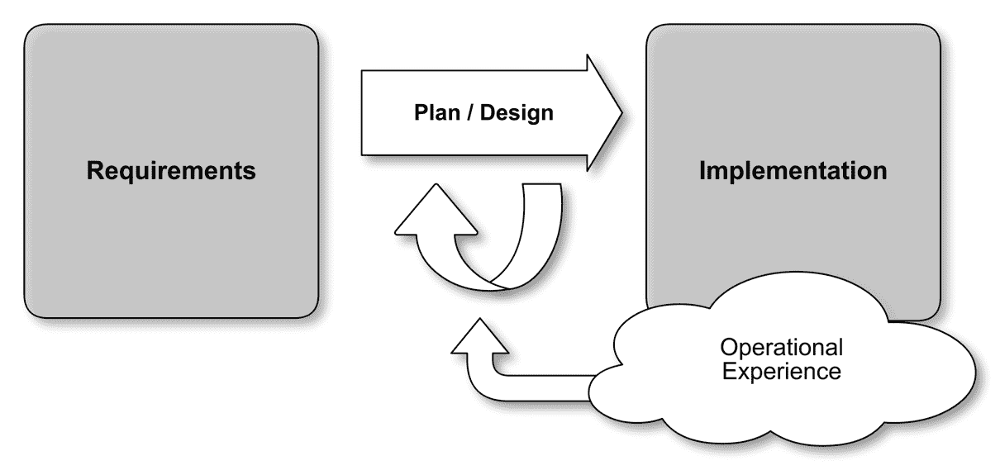
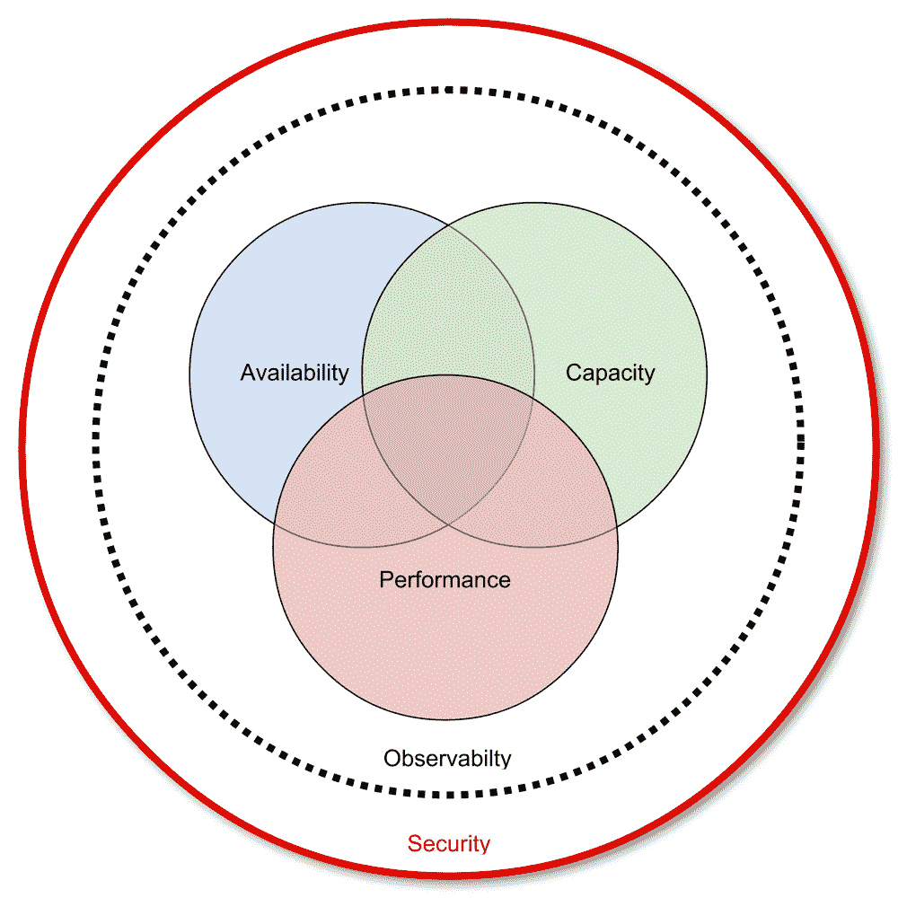
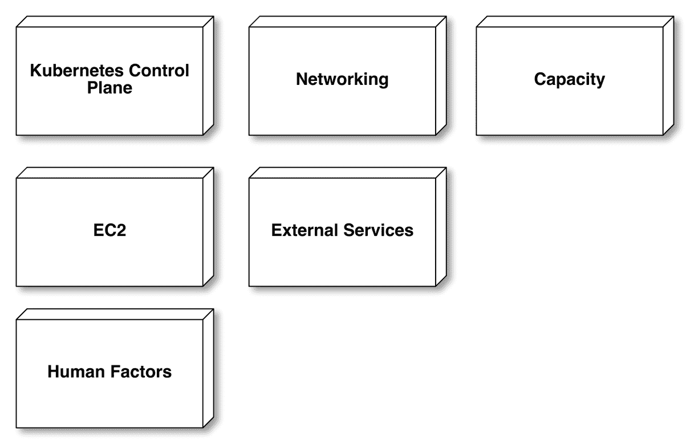
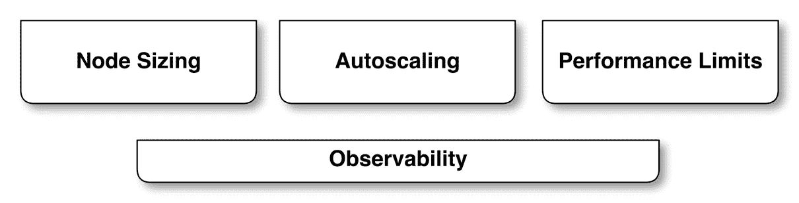
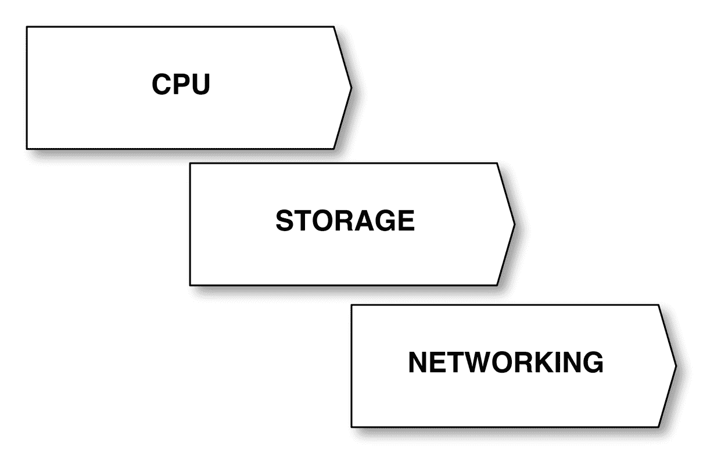
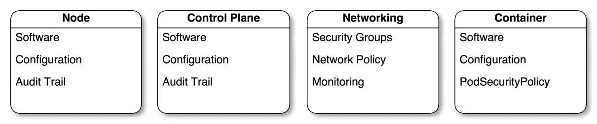
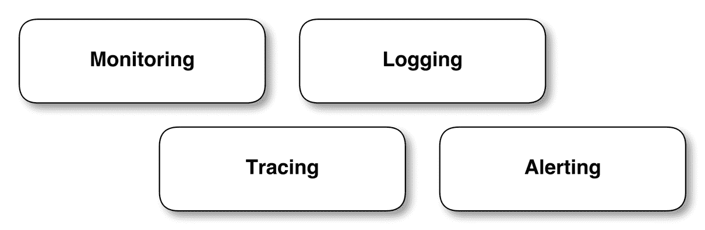

# 生产规划

Kubernetes 为开发人员提供了一个极好的平台，可以快速构建高度灵活的分布式应用程序。通过在 Kubernetes 上运行我们的应用程序，我们可以利用各种工具来简化它们的操作，并使它们更加可靠、抗错误，并且最终高度可用。

为了依赖于我们的应用程序可以从 Kubernetes 继承的一些保证和行为，重要的是我们了解 Kubernetes 的行为方式，以及对生产系统产生影响的一些因素。

作为集群管理员，重要的是你要了解你正在运行的应用程序的要求，以及这些应用程序的用户。

在生产中了解 Kubernetes 的行为方式至关重要，因此在开始提供关键任务流量之前，获得在 Kubernetes 上运行应用程序的实际经验是非常宝贵的。例如，当 GitHub 将他们的主要应用程序迁移到 Kubernetes 时，他们首先将内部用户的流量转移到他们基于 Kubernetes 的新基础设施，然后再切换到他们的主要生产流量。

“来自内部用户的负载帮助我们发现问题，修复错误，并开始逐渐熟悉 Kubernetes 在生产中的运行。在此期间，我们努力增加自己的信心，通过模拟未来预期执行的程序，编写运行手册，并进行故障测试。”—Jesse Newland ([`githubengineering.com/kubernetes-at-github/`](https://githubengineering.com/kubernetes-at-github/))

虽然我可以涵盖一些在 AWS 上使用 Kubernetes 进行生产时可能会遇到的事情，但重要的是要理解每个应用程序和组织在很多方面都是独特的。你应该把 Kubernetes 看作一个工具包，它将帮助你为你的组织构建一个强大而灵活的环境。Kubernetes 并不是一个能够消除对运维专业知识需求的魔法子弹；它是一个帮助你管理应用程序的工具。

# 设计过程

设计过程如下：



当你考虑准备使用 Kubernetes 来管理你的生产基础设施时，你不应该把 Kubernetes 看作你的最终目标。它是一个构建平台的基础，用于运行系统。

当你考虑构建一个满足组织中不同人员需求的平台时，定义你将对 Kubernetes 提出的要求变得更加简单。在尝试规划生产环境时，你需要了解你的组织的需求。显然，你想要管理的软件的技术要求很重要。但了解你的组织需要支持的运营流程也很关键。

采用 Kubernetes 为具有复杂软件要求的组织带来了许多好处。不幸的是，这种复杂性也可能导致在安全地成功采用 Kubernetes 方面出现挑战。

# 初始规划

你应该考虑你的初始推出的重点在哪里。你应该寻找一个既能够快速提供有价值的结果，又具有较低风险的应用程序。如果我们想想 GitHub 的例子，他们最初把重点放在为内部用户构建基础设施，以便快速测试他们软件的更改。通过专注于审查或分期基础设施，他们找到了一个适用于 Kubernetes 的应用程序，既能够为他们组织的开发人员快速提供价值，又是一个对他们的业务风险较低的领域，因为它只被内部用户访问。

像这样既具有即时有用性又对停机影响较小的应用程序非常有用。它们使你的组织能够在使用 Kubernetes 时获得宝贵的运营经验，并在尝试处理生产工作负载之前消除错误和其他问题。

在开始使用 Kubernetes 时，选择你的组织运营的最简单的应用程序并开始围绕它构建流程和工具可能是诱人的。然而，这可能是一个错误，因为这可能会导致你对应用程序应该如何操作做出假设，这可能会使将相同的流程和配置应用到更复杂的应用程序变得更加困难。

如果您选择开始构建支持不需要任何后端服务（如数据库）的简单应用程序的平台，您可能会错过一些需要考虑的事情作为部署过程的一部分。例如，由数据库支持的应用程序通常需要运行迁移脚本来在部署新版本的应用程序时更新架构。如果您首先设计部署流程以满足非常简单应用程序的需求，您可能要到后来才能发现这些要求。请记住，部署一个只需要平台提供的部分功能子集的简单应用程序将始终比部署一个需要您在设计时没有考虑到的更复杂的应用程序要简单得多。

如果您选择将精力集中在初始采用 Kubernetes 的单个应用程序上，请确保选择一个代表您组织需求的应用程序。很容易会开始为一个全新的项目使用 Kubernetes，因为您可以考虑平台的应用开发决策。但请记住，一个新应用程序可能会比使用时间更长的应用程序简单得多。在 GitHub 的例子中，他们选择首先部署的应用程序是他们组织运营的最大的应用程序，提供许多核心服务。

如果您的组织有一个每次部署都需要大量运营时间和精力的应用程序，那么这可能是初始采用 Kubernetes 的一个很好的选择。这些应用程序将因其需求而为您的开发和运营团队所熟知，并且他们将立即能够开始利用 Kubernetes 来解决以前花费时间和精力的问题。

# 成功的规划

为了成功地实施采用 Kubernetes 的项目，有一些事情您应该尽量避免。

一个很容易陷入的陷阱是改变得太快太多。如果您决定采用容器化和 Kubernetes，很容易会在此过程中采用许多新的流程和工具。这可能会显著减慢您的进展，因为最初是为了在容器中运行应用程序的项目很快就会扩展到包括您的组织想要采用的许多其他工具和流程。

您应该努力避免范围蔓延，并尽量改变尽可能少的内容，以便尽快交付您对 Kubernetes 的初始采用。重要的是不要试图一次实现太多容器化的承诺，因为这将阻碍您的采用，并可能导致整个项目的失败。

尝试考虑您当前部署应用程序的环境，并首先复制其功能，然后添加额外的功能。我们在本书的其余部分讨论的许多工具和流程可能确实是您的 Kubernetes 集群的可选项，可以在以后的日期添加，以提供额外的有价值的服务，但不应视为采用的障碍。

如果您有机会在额外的部署中减少 Kubernetes 部署提供的基础设施范围，您应该考虑这样做。这样可以减少组织需要理解的新工具和流程的范围。这将使您有机会在以后更详细地关注这个主题，并参考您在 Kubernetes 上运行应用程序时获得的运营经验。

以日志管理为例，如果您当前的流程是使用 SSH 登录服务器并查看日志文件，您可以使用`kubectl logs`命令为您的 Kubernetes 集群的操作员提供相同的功能。实施一个解决方案来聚合和搜索集群生成的日志可能是可取的，但不一定是使用 Kubernetes 的阻碍因素。

如果您当前将应用程序部署到运行 Linux 发行版的服务器上，该发行版作为容器映像 readily 可用，您应该坚持使用该发行版，而不是在这个阶段寻找替代方案，因为您的开发人员和运营人员已经了解它的工作原理，您不必投入时间来修复不兼容性。学习在 Kubernetes 上操作您的应用程序应该是您的重点，而不是学习如何配置新的操作系统发行版。

# 规划成功的部署。

改变组织中的流程和责任可能是诱人的。但在采用像 Kubernetes 这样的新工具时，尝试这样做可能是有风险的。例如，如果在您的组织中有一个负责部署和监控应用程序的运维团队，那么在采用 Kubernetes 时并不是将这一责任交给其他人（比如开发团队）或尝试自动化手动流程的正确时机。

这可能令人沮丧，因为通常采用 Kubernetes 是作为改进组织使用的流程和工具的更广泛计划的一部分。您应该等到成功建立 Kubernetes 的使用和操作后再进行。这将使您在有一个稳定的基础之后更好地引入新工具和流程。您应该将采用 Kubernetes 视为建立一个灵活的基础，以便在将来实施对工具和流程的任何更改。

一旦您的应用基础设施在 Kubernetes 上运行，您会发现实施新工具、服务和流程变得更加简单。一旦您拥有了一个 Kubernetes 集群，您会发现尝试新工具的障碍大大降低。您可以通过向集群提交新配置来快速评估和尝试新工具，而不是花费大量时间进行规划和配置。

# 发现需求

设计需求如下图所示：



在准备生产时，**可用性**、**容量**和**性能**是我们应该考虑的关键属性。在收集集群的功能需求时，可以帮助将需求归类为涉及这些属性的需求。

重要的是要明白，可能无法在不做出一些权衡的情况下优化所有三个属性。例如，对于依赖非常高网络性能的应用程序，AWS 提供了一个称为集群放置组的工具。这确保了通过在 AWS 数据中心内以某种方式配置 EC2 VM 来提供最佳网络性能，从而在它们之间提供快速的网络互连（可能是通过将它们放置在 AWS 数据中心内的相近位置）。通过这种方式配置实例，可以在集群放置组内的机器之间实现最高的网络吞吐量（超过 5 GB）和最低的延迟。对于一些需要这些性能水平的应用程序来说，这可能是一种值得的优化。

然而，由于集群放置组内的 EC2 实例不能跨多个可用区，因此这种设置的可靠性可能较低，因为潜在的电源或连接问题可能会影响特定区域内的所有实例，特别是如果它们被部署以最大化互连速度。如果您的应用程序对这种高性能网络没有要求，将可靠性换取更高性能的做法确实是不明智的。

这些属性的最重要的属性是生产系统的一个非常重要的属性——**可观察性**。可观察性实际上描述了集群操作员了解应用程序发生了什么的能力。如果无法了解应用程序是否按照预期执行和行为，就无法评估、改进和演变系统的设计。在设计集群时，这是一个重要的反馈循环，它使您能够根据运营经验维护和改进集群。如果在规划集群时不考虑可观察性，要调试集群本身和应用程序的问题就会更加困难。

在规划阶段讨论应用程序需求时，很难理解应用程序的需求会是什么。对集群性能、底层硬件以及运行在其上的应用程序有良好的可观察性，可以让您做出务实的决策，并且足够灵活，以便在发现更多关于它们在生产工作负载下的行为以及随着功能随时间的开发而发生变化时，支持应用程序所做出的更改。

最后，也许最重要的属性要考虑的是安全性。将集群的安全性留到规划过程的最后是一个错误。请记住，尽管单靠安全性本身不会导致项目的成功，但未能确保集群的安全性可能会导致灾难性后果。

最近的研究和披露显示，未加密的 Kubernetes 集群已经成为那些想要利用您的计算能力进行加密货币挖矿和其他不良目的的人的有吸引力的目标，更不用说访问您的集群可能被用来访问您组织内保存的敏感数据的潜力。

安全性应该在集群的整个生命周期中得到考虑和监控；事实上，您应该尝试并了解每一个其他要求的安全性影响。您需要考虑您的组织成员如何与 Kubernetes 进行交互，同时制定计划确保您的集群和在其上运行的应用程序的配置和软件的安全。

在本章的后续部分，我们将介绍一些想法，帮助您了解在这些属性方面可能需要考虑的事项。希望本章能够让您充分了解自己的需求，并开始规划生产集群。关于实施计划所需的具体知识，请继续阅读；本书的后半部分几乎完全专注于您实施计划所需的实用知识。

# 可用性

可用性如下图所示：



在规划生产系统时，考虑到可用性是最重要的事情之一。几乎总是我们运行软件来为用户提供服务。如果由于任何原因我们的软件无法满足用户的请求，那么通常我们就无法满足他们的期望。根据您的组织提供的服务，不可用可能会导致用户不满意、不便或甚至遭受损失或伤害。制定任何生产系统的充分计划的一部分是了解停机时间或错误可能如何影响您的用户。

可用性的定义取决于您的集群正在运行的工作负载类型和您的业务需求。规划 Kubernetes 集群的关键部分是了解用户对您正在运行的服务的需求。

例如，考虑一个每天给用户发送业务报告的批处理作业。只要您能确保它每天至少运行一次，大致在正确的时间，您就可以认为它的可用性达到 100％，而可以在白天或晚上任何时间访问的 Web 服务器需要在用户需要访问时可用且无错误。

当 CEO 在早上 9 点到达工作时，收件箱中已经准备好阅读的报告时，他们会很高兴。他们不会在意任务在午夜时分未能成功运行，并在几分钟后成功重试。然而，如果托管他们用来阅读电子邮件的 Web 邮件应用程序的应用服务器在一天中的任何时候甚至短暂不可用，他们可能会受到打扰和不便：

计算服务可用性的简单公式

一般来说，系统工程师认为给定服务的可用性是成功请求占总请求次数的百分比。

我们可以认为即使批处理作业失败了几次，也是可用的。我们对系统的要求（每天向正确的人发送报告）只需要作业至少成功完成一次。如果我们通过重试优雅地处理故障，对我们的用户没有影响。

您应该为系统计划的确切数字，当然，主要取决于用户的需求和组织的优先级。然而，值得记住的是，为了更高的可用性而设计的系统几乎总是比可以接受停机时间的类似系统更复杂，需要更多资源。随着服务接近 100％的可用性，实现额外可靠性的成本和复杂性呈指数增长。

如果您还不了解它们，可以合理地开始讨论组织内的可用性要求。您应该这样做，以便设定目标并了解在 Kubernetes 上运行软件的最佳方法。以下是一些您应该尝试回答的问题：

+   *你知道你的用户是如何访问你的服务的吗？* 例如，如果你的用户使用移动设备，那么连接到互联网可能本来就更不可靠，掩盖了你的服务的正常运行时间（或其他情况）。

+   如果你正在将你的服务迁移到 Kubernetes，*你知道它目前的可靠性吗？*

+   *你能够对不可用性进行货币价值评估吗？* 例如，电子商务或广告技术组织将知道在停机期间将会损失多少金额。

+   *你的用户准备接受多少不可用性水平？* *你有竞争对手吗？*

你可能已经注意到，所有这些问题都是关于你的用户和你的组织；对于任何一个问题，都没有确定的技术答案，但你需要能够回答它们以了解你正在构建的系统的要求。

为了提供一个在网络上可以访问的高可用服务，比如一个网页服务器，我们需要确保服务能够在需要时响应请求。由于我们无法确保我们的服务运行在的底层机器是 100%可靠的，我们需要运行多个实例的软件，并且只将流量路由到那些能够响应请求的实例上。

这个批处理作业的语义意味着（在合理范围内），我们并不太关心作业执行所需的时间，而网页服务器响应所需的时间则非常重要。有许多研究表明，即使是对网页加载时间增加了不到一秒的延迟，也会对用户产生显著和可测量的影响。因此，即使我们能够隐藏故障（例如通过重试失败的请求），我们的余地要小得多，甚至我们甚至可能认为高优先级的请求如果超过特定阈值的时间就已经失败了。

你可能选择在 Kubernetes 上运行你的应用程序的一个原因是因为你听说过它的自愈特性。Kubernetes 将管理我们的应用程序，并在需要时采取行动，以确保我们的应用程序继续以我们要求的方式运行。这是 Kubernetes 对配置的声明性方法的一个有益的效果。

使用 Kubernetes，我们将要求集群上运行某项服务的特定数量的副本。即使发生影响运行应用程序的情况，例如节点故障或应用程序实例由于内存泄漏而定期被终止，控制平面也能够采取行动来确保这种条件继续成立。

与依赖操作员选择特定基础机器（或一组机器）运行应用程序的命令式部署程序形成对比。如果机器故障，甚至如果应用程序实例表现不佳，则需要手动干预。我们希望为用户提供所需的服务而不中断。

对于始终开启或延迟敏感的应用程序，例如 Web 服务器，Kubernetes 为我们提供机制来运行我们应用程序的多个副本，并测试我们服务的健康状况，以便从服务中删除失败的实例，甚至重新启动。

对于批处理作业，Kubernetes 将重试失败的作业，并将它们重新调度到其他节点，如果底层节点失败。这种重启和重新调度失败应用程序的语义依赖于 Kubernetes 控制平面的功能。一旦 pod 在特定节点上运行，它将继续运行，直到发生以下情况：

+   它退出

+   它被 kubelet 终止，因为使用了太多内存

+   API 服务器请求将其终止（可能是为了重新平衡集群或为了为具有更高优先级的 pod 腾出空间）

这意味着控制平面本身可以暂时不可用，而不会影响集群上运行的应用程序。但是，直到控制平面再次可用之前，没有失败的 pod，或者在已经失败的节点上运行的 pod 将被重新调度。显然，您还需要 API 服务器可用以与其交互，因此还应考虑组织推送新配置到集群的需求（例如，部署应用程序的新版本）。

我们将讨论一些策略和工具，您可以使用它们来提供一个高可用的控制平面，详情请参阅第七章 *生产就绪的集群*。

# 容量

容量如下图所示：



运行诸如 Kubernetes 之类的系统意味着您可以在应用程序启动的时间内对服务的额外需求做出实际回应。这个过程甚至可以通过诸如**水平 Pod 自动缩放器**（我们将在第八章中讨论的*抱歉，我的应用程序吃掉了集群*）这样的工具自动化。

当我们将这种灵活性与我们随意启动新的 EC2 实例的能力相结合时，容量规划比过去要简单得多。Kubernetes 和 AWS 允许我们构建只在任何给定时间使用所需资源量的应用程序。我们可以对应用程序的使用要求做出反应，而不是预期对我们的应用程序的需求并预先承诺使用资源。Kubernetes 最终使我们能够实现云计算的一个承诺：我们只支付我们使用的资源。

在使用 AWS 支付的资源上最有效地使用资源时，您应该考虑一些因素。

# EC2 实例类型

在准备启动 Kubernetes 集群时，您可能会考虑集群中将使用的实例的类型和大小。您选择的实例可能会对 Kubernetes 集群的利用率、性能和成本产生重大影响。

当 Kubernetes 将您的 pod 调度到集群中的工作节点时，它会考虑作为 pod 定义的一部分的资源请求和限制。

通常，您的 pod 规范将请求一定数量的 CPU（或其分数）和一定数量的内存。在 AWS 上，Kubernetes 使用 AWS 的 vCPU 作为其度量单位。vCPU（在大多数实例类型上）是一个单 CPU（超）线程，而不是 CPU 核心。如果您请求了 CPU 的分数，则 Kubernetes 会为您的 pod 分配一个 vCPU 的份额。内存以字节为单位请求。

EC2 实例有几种不同类型，提供不同的 CPU 到内存比例。

# EC2 实例类型

EC2 实例类型显示在以下表中：

| **类别** | **类型** | **CPU 到内存比例：vCPU:GiB** | **备注** |
| --- | --- | --- | --- |
| 突发型 | T3 | 1 CPU : 2 GiB | 提供 5-40%的 CPU 基线+可突发额外使用。 |
| CPU 优化 | C5 | 1 CPU : 2 GiB |  |
| 通用型 | M5 | 1 CPU : 4 GiB |  |
| 内存优化 | R5 | 1 CPU : 8 GiB |  |
|  | X1 | 1 CPU : 15GiB |  |
|  | X1e | 1 CPU : 30GiB |  |
| 只有在需要它们提供的额外资源（GPU 和/或本地存储）时，您才应该考虑以下实例类型： |
| GPU | P3 | 1 CPU : 7.6GiB | 1 GPU : 8 CPU (NVIDIA Tesla V100) |
|  | P2 | 1 CPU : 4GiB | i. 1 GPU : 4 CPU (NVIDIA K80) |
| 存储 | H1 | 1 CPU : 4GiB | 2TB HDD : 8 CPU |
|  | D2 | 1 CPU : 7.6GiB | 3TB HDD : 2 CPU |
|  | I3 | 1 CPU : 7.6GiB | 475GiB SSD : 2 CPU |

在准备集群时，我们应该考虑组成集群的实例类型和实例大小。

当 Kubernetes 将我们的 pod 调度到集群中的节点时，它当然是希望尽可能多地将容器放入集群中。然而，如果大多数 pod 的 CPU 到内存请求比在底层节点中显着不同，这可能会受到阻碍。

例如，考虑这样一个场景：我们在集群中部署了请求 1 个 CPU 和 2GiB 内存的 pod。如果我们的集群由`m5.xlarge`实例（4 vCPU 和 16 GiB 内存）组成，每个节点将能够运行四个 pod。一旦这四个 pod 在该节点上运行，就无法再将更多的 pod 调度到该节点，但是一半的内存将被闲置，实际上处于被困的状态。

如果您的工作负载非常同质化，那么确定哪种实例类型将为您的应用程序提供最佳的 CPU 到内存比率当然是非常简单的。然而，大多数集群运行多个应用程序，每个应用程序需要不同数量的内存和 CPU（甚至可能还需要其他资源）。

在第八章中，*抱歉，我的应用程序吃掉了集群*，我们讨论了如何使用集群自动缩放器自动向 AWS 自动缩放组添加和删除实例，以便在任何给定时间将您的集群大小调整到与集群要求相匹配。我们还讨论了如何使用集群自动缩放器来扩展具有多种不同实例类型的集群，以应对在这些集群中运行的工作负载的大小和形状相当动态，可能会不时发生变化的 CPU 到内存比率的问题。

# 广度与深度

亚马逊为每个系列提供了许多不同的实例大小；例如，m5 和 c5 系列都有六种不同的实例大小，每一级别提供的资源是前一级别的两倍。因此，最大的实例比最小的实例多 48 倍资源。*我们应该如何选择用于构建集群的实例大小？*

+   您的实例大小限制了集群上可运行的最大 Pod 大小。实例需要比您最大的 Pod 大 10-20％，以考虑系统服务（如日志记录或监控工具、Docker 和 Kubernetes 本身）的开销。

+   较小的实例将允许您以较小的增量扩展您的集群，增加利用率。

+   较少（较大）的实例可能更容易管理。

+   较大的实例可能会使用较低比例的资源来执行集群级任务，例如日志传送和指标。

+   如果您想使用监控或日志记录工具，例如 Datadog、Sysdig、NewRelic 等，其定价是基于每个实例模型的，较少的较大实例可能更具成本效益。

+   较大的实例可以提供更多的磁盘和网络带宽，但如果您在每个实例上运行更多的进程，这可能不会带来任何优势。

+   较大的实例大小在超级管理程序级别更不太可能受到嘈杂邻居问题的影响。

+   较大的实例通常意味着更多的 Pod 共存。当旨在增加利用率时，这通常是有利的，但有时可能会导致意外的资源限制模式。

# 性能

影响性能的集群的关键组件如下图所示：



# 磁盘性能

如果您的一些应用程序依赖于磁盘性能，了解连接到您实例的 EBS 卷的性能特征可能会非常有用。

所有当前一代的 EC2 实例都依赖于 EBS 存储。EBS 存储实际上是共享的网络附加存储，因此性能可能会受到多种因素的影响。

如果您的集群正在运行在最新一代的 EC2 实例上，您将使用 EBS 优化。这意味着专用带宽可用于对 EBS 卷的 I/O 操作，有效消除了 EBS 和其他网络活动之间的竞争。

EBS 卷可用的总最大带宽取决于 EC2 实例的大小。在一个运行多个容器的系统中，可能每个容器都连接了一个或多个 EBS 卷，您应该意识到这个上限适用于实例上所有正在使用的卷的总和。

如果您计划运行期望进行大量磁盘 I/O 的工作负载，您可能需要考虑实例可用的总 I/O。

EBS 基于两种基本技术提供了四种卷类型。`gp2`和`io2`卷基于固态硬盘（SSD）技术，而 st1 和 sc1 卷基于硬盘驱动器（HDD）技术。

这种多样性的磁盘对我们很有用，因为广义上，我们可以将您的应用程序可能提供的工作负载分为两组。首先，那些需要对文件系统进行快速随机读取和/或写入的工作负载。属于这一类别的工作负载包括数据库、Web 服务器和引导卷。对于这些工作负载，性能的限制通常是每秒 I/O 操作（IOPS）。其次，有一些工作负载需要尽可能快地从磁盘进行顺序读取。这包括 Map Reduce、日志管理和数据存储，如 Kafka 或 Casandra，这些应用程序已经专门优化，尽可能地进行顺序读取和写入。

在实例级别存在硬性上限，限制了您可以通过 EBS 卷实现的最大性能。附加到单个实例的所有 EBS 卷的最大 IOPS 在 c5 和 m5 实例上可达到 64,000。最小的 c5 和 m5 实例只提供 1,600 IOPS。需要牢记这些限制，无论是如果您想在较小的 EC2 实例类型上运行需要更高磁盘性能的工作负载，还是在较大的实例类型上使用多个 EBS 卷。

# gp2

`gp2` EBS 卷应该是大多数通用应用的首选。它们以适中的价格提供固态硬盘（SSD）性能。`gp2`卷的性能基于一个信用系统。这些卷提供基准性能，并随着时间累积信用，允许在需要时性能突发到 3,000 IOPS，直到累积的信用用尽。

当创建一个`gp2`卷时，它会自动获得一个信用余额，允许它在 30 分钟内突发到 3,000 IOPS。当卷被用作引导卷或需要快速复制数据到卷作为引导过程的一部分时，这非常有用。

突发积分的积累速度和`gp2`卷的基准性能与卷的大小成正比。小于 33 GiB 的卷始终具有 100 IOPS 的最低基准性能。大于 1 TB 的卷的基准性能大于 3,000 IOPS，因此您不需要考虑突发积分。单个`gp2`卷可用的最大性能为 3.3 TB（及更大）的卷的 10,000 IOPS。

如果您的工作负载需要从`gp2`卷中获得更高的性能，一个快速的解决方法是使用更大的卷（即使您的应用程序不需要它提供的存储空间）。

您可以通过将 IOPS 乘以块大小（256 KiB）来计算卷支持的最大吞吐量。但是，`gp2`卷将总吞吐量限制为 160 MiB/s，因此大于 214 GiB 的卷将仅提供 160 MiB/s。

监视与磁盘使用相关的指标的能力对于了解磁盘性能如何影响您的应用程序，并确定您何时以及在哪里达到性能限制非常宝贵。

# io2

对于可靠性能至关重要且`gp2`卷无法提供足够 IOPS 的应用程序，可以使用`io2`卷（也称为预留 IOPS 卷）。如果它们所附加的实例支持它们，`io2`卷可以被配置为提供最多 32,000 IOPS。创建`io2`实例时，需要预先指定所需的 IOPS（我们将在第九章中讨论如何在 Kubernetes 中执行此操作，*存储状态*）。可以为单个卷配置的最大 IOPS 取决于卷的大小，IOPS 和存储的 GiB 之间的比率为`50:1`。因此，为了配置最大 IOPS，您需要请求至少 640 GiB 的卷。

对于所需 IOPS 数量小于`gp2`卷支持的 IOPS（10,000）且所需吞吐量小于 160 MiB/s 的情况，支持类似性能特征的`gp2`卷通常会比`io2`卷的价格低一半。除非您知道自己需要`io2`卷的增强性能特征，否则大多数通用用途都应坚持使用`gp2`卷。

# st1

对于已经针对顺序读取进行了优化的应用程序，其中主要的性能指标是吞吐量，也许令人惊讶的是，尽管 SSD 目前占据主导地位，但最佳性能仍然由旋转磁盘提供。

**st1**（和**sc1**）卷是 AWS 上可用的最新类型的 EBS 卷。它们旨在为诸如 Map Reduce、日志处理、数据仓库和流式工作负载（如 Kafka）等工作负载提供高吞吐量。st1 卷以不到 gp2 实例成本的一半提供高达 500 MiB/s 的吞吐量。缺点是它们支持的 IOPS 要低得多，因此对于随机或小写入来说性能要差得多。您可能会对 SSD 进行的 IOPS 计算略有不同，因为块大小要大得多（1 MB 对比 256 KB）。因此，进行小写入将花费与顺序写入完整 1 MB 块一样长的时间。

如果您的工作负载已经正确优化以利用 st1 卷的性能特性，那么考虑使用它们是非常值得的，因为成本大约是 gp2 卷的一半。

就像 gp2 卷一样，st1 使用了性能突发模型。然而，积累的信用额允许吞吐量突破基准性能。基准性能和信用额积累速度与卷大小成正比。对于大于 2 TiB 的卷，最大突发性能为 500 MiB/s，对于大于 12.5 TiB 的卷，最大基准性能为 500 MiB/s，对于这样大小（或更大）的卷，无需考虑突发特性，因为性能是恒定的。

# sc1

`sc1`卷提供了 AWS 上最低成本的块存储。它们提供了与`st1`卷类似的性能配置文件，但大约只有一半的速度，成本也只有一半。您可以考虑将它们用于需要从文件系统存储和检索数据，但访问不太频繁或性能对您来说不那么重要的应用程序。

`sc1`卷可以被视为归档或 blob 存储系统（如`s3`）的替代方案，因为其成本大致相似，但具有无需使用特殊库或工具即可读写数据的优势，并且在数据可以被读取和使用之前具有更低的延迟。

在 Kafka 或日志管理等用例中，你可能会考虑使用 `sc1` 卷来存储旧数据，这样可以保持在线存储，以便立即使用，但访问频率较低，因此你希望优化存储成本。

# 网络

在运行分布式系统时，网络性能可能是应用程序整体可观察性能的关键因素。

鼓励构建应用程序的架构模式，其中不同组件之间的通信主要通过网络进行（例如，SOA 和微服务），会导致应用程序中的集群内部网络成为性能瓶颈。集群数据存储在进行写操作以及在扩展或维护操作期间重新平衡集群时，也可能对集群内部网络提出高要求。

当运行暴露给互联网或其他广域网的服务时，网络性能当然也是需要考虑的因素。

最新一代的 EC2 实例类型受益于 AWS 描述为增强网络的网络接口。要从中受益，你需要运行相对较新的实例类型（M5、C5 或 R4），并安装亚马逊的弹性网络适配器的特殊网络驱动程序。幸运的是，如果你使用主要 Linux 发行版的官方 AMI，这些都应该已经为你完成。

你可以使用 `modinfo` 命令检查是否安装了正确的驱动程序：

```
    $ modinfo ena
    filename:          /lib/modules/4.4.11- 
    23.53.amzn1.x86_64/kernel/drivers/amazon/net/ena/ena.ko
    version:            0.6.6
    license:            GPL
    description:      Elastic Network Adapter (ENA)
    author:             Amazon.com, Inc. or its affiliates
    ... 
```

如果未安装 **弹性网络接口** 的驱动程序，你将看到类似以下的内容：

```
    $ modinfo ena
    ERROR: modinfo: could not find module ena
```

增强网络带来的性能提升并不需要额外费用，因此在准备生产时，你应该检查是否正确配置了增强网络。常见使用中唯一不支持增强网络的实例类型是 t2 可突发性能实例。

EC2 实例的网络性能与实例大小成正比，每种实例类型中最大的实例大小才能达到 10 或 20 GBps 的网络吞吐量。即使使用最大的 EC2 实例大小，只有在与集群放置组中的其他实例进行通信时，才能实现网络吞吐量的最大值。

集群放置组可用于请求亚马逊在其数据中心的特定区域同时启动您需要的每个实例，以便获得最快的速度（和最低的延迟）。为了提高网络性能，我们可以调整两个变量：

+   **增加实例大小**：这样可以使实例获得更快的网络，并增加共存，从而更有可能在服务之间进行本地主机网络调用。

+   **将您的实例添加到集群放置组**：这可以确保您的实例在物理上靠近，从而提高网络性能。

在做出这样的决定之前，你需要知道网络是否真的是你的性能瓶颈，因为所有这些选择会使你的集群更容易受到 AWS 基础设施中潜在故障的影响。因此，除非你已经知道你的特定应用程序会对集群网络提出特定要求，否则不应该试图优化以获得更高的性能。

# 安全

以下图表显示了一些影响安全性的关键领域：



保护集群基础设施的配置和软件的安全性至关重要，特别是如果您计划将其上运行的服务暴露到互联网上。

你应该考虑，如果你将服务暴露到公共互联网上，而这些服务有众所周知的软件漏洞或配置错误，可能只是几个小时之内，你的服务就会被用于扫描易受攻击系统的自动化工具所发现。

重要的是，你要将集群的安全性视为一个不断变化的目标。这意味着你或者你使用的工具需要意识到新的软件漏洞和配置漏洞。

Kubernetes 软件和主机的基础操作系统软件的漏洞将由 Kubernetes 社区和您的操作系统供应商进行更新和修补，只需要操作员有一个应用更新的程序即可。

环境配置更为关键，因为验证其安全性和正确性的责任完全落在你的肩上。除了花时间验证和测试配置外，你还应该将配置的安全性视为一个不断变化的目标。在更新时，你应该确保花时间审查 Kubernetes 变更日志中的更改和建议。

# 始终进行更新

Kubernetes 的新次要版本大约每三个月发布一次。该项目可以对每个发布的次要版本发布补丁级更新，频率最多每周一次。补丁级更新通常包括修复更重大的错误和安全问题的修复。Kubernetes 社区目前同时支持三个次要版本，随着每个新的次要版本发布，最旧的受支持版本的常规补丁级更新将结束。这意味着在计划和构建集群时，您需要计划对 Kubernetes 软件进行两种维护：

+   **补丁级更新**：每个月多次：

+   这些应该保持非常紧密的兼容性，大多数情况下应该是微不足道的。

+   它们应该简单易行，几乎没有（或没有）停机时间。

+   **次要版本升级**：每 3 到 9 个月：

+   在次要版本之间升级时，您可能需要对集群的配置进行微小更改。

+   Kubernetes 确实保持良好的向后兼容性，并且有一种在删除或更改配置选项之前废弃配置选项的策略。只需记住在更改日志和日志输出中注意废弃警告。

+   如果您正在使用第三方应用程序（或编写了自己的工具），这些应用程序依赖于测试版或 alpha API，则可能需要在升级集群之前更新这些工具。只使用稳定 API 的工具应该在次要版本更新之间继续工作。

+   +   您可能需要考虑以下事项：

+   一个测试环境，您可以在其中应用 Kubernetes 软件的更新，以验证任何更改，然后再将其发布到生产环境。

+   如果您检测到任何错误，可以通过程序或工具回滚任何版本升级。

+   监控可以让您确定您的集群是否按预期运行。

+   您用于更新组成集群的机器上的软件的程序确实取决于您使用的工具。

您可能采取两种主要策略——就地升级和基于不可变镜像的更新策略。

# 就地更新

有几种工具可以让您升级集群节点的底层操作系统。例如，对于基于 Debian 的系统，可以使用`unattended-upgrades`工具，对于基于 Red Hat 的系统，可以使用`yum-cron`工具，这些工具可以在没有任何操作员输入的情况下在节点上安装更新的软件包。

当然，在生产环境中，如果特定更新导致系统失败，这可能有一定风险。

通常，如果您正在管理具有自动更新的系统，您将使用软件包管理器将基本组件（如 Kubernetes 和 etcd）固定到特定版本，然后以更受控制的方式升级这些组件，可能使用配置管理工具，如 Puppet、Chef 或 Ansible。

以这种自动化方式升级软件包时，当更新某些组件时，系统需要重新启动。诸如 KUbernetes REboot Daemon（Kured）（[`github.com/weaveworks/kured`](https://github.com/weaveworks/kured)）之类的工具可以监视特定节点需要重新启动的信号，并编排重新启动集群中的节点，以维护集群上运行的服务的正常运行时间。首先通过发出信号通知 Kubernetes Scheduler 重新调度工作负载到其他节点，然后触发重新启动。

还有一种新型操作系统，例如 CoreOS 的 Container Linux 或 Google 的 Container-Optimized OS，对更新采取了略有不同的方法。这些新的面向容器的 Linux 发行版根本不提供传统的软件包管理器，而是要求您将不在基本系统中运行的所有内容（如 Kubernetes）作为容器运行。

这些系统处理基本操作系统的更新方式更像是在消费类电子产品中找到的固件更新系统。这些操作系统中的基本根文件系统是只读的，并且从两个特殊分区中挂载。这允许系统在后台下载新的操作系统镜像到未使用的分区。当系统准备好升级时，它将被重新启动，并且来自第二分区的新镜像将被挂载为根文件系统。

这样做的好处是，如果升级失败或导致系统变得不稳定，可以简单地回滚到上一个版本；事实上，这个过程甚至可以自动化。

如果您正在使用 Container Linux，您可以使用 Container Linux Update Operator 来编排由于操作系统更新而需要重新启动的操作（[`github.com/coreos/container-linux-update-operator`](https://github.com/coreos/container-linux-update-operator)）。使用这个工具，您可以确保在重新启动之前，主机上的工作负载被重新调度。

# 不可变镜像

虽然有工具可以帮助管理原地升级您的主机，但是采用不可变镜像的策略也有一些优势。

一旦您使用 Kubernetes 管理运行在基础架构上的应用程序，需要安装在节点上的软件就变得标准化了。这意味着管理主机配置的更新变得更加简单，因为它们是不可变的镜像。

这可能很有吸引力，因为它允许您以与使用 Docker 构建应用程序容器类似的方式来管理构建和部署节点软件。

通常，如果采用这种方法，您将希望使用一种工具来简化以 AMI 格式构建镜像并使其可用于其他工具启动新的 EC2 实例以替换使用先前镜像启动的实例。packer 就是这样一种工具。

# 网络安全

在 AWS 上运行 Kubernetes 时，您需要配置四个不同的层次，以正确地保护集群上的流量。

# 基础节点网络

为了使 Pod 和服务之间的流量在集群上传递，您需要配置应用于节点的 AWS 组以允许此流量。如果您使用覆盖网络，这通常意味着允许特定端口上的流量，因为所有通信都是封装在单个端口上传递的（通常作为 UDP 数据包）。例如，flannel 覆盖网络通常配置为通过端口 7890 上的 UDP 进行通信。

当使用原生 VPC 网络解决方案，比如`amazon-vpc-cni-k8s`时，通常需要允许所有流量在节点之间传递。`amazon-vpc-cni-k8s`插件将多个 Pod IP 地址与单个弹性网络接口关联起来，因此通常无法使用安全组以更精细的方式管理基础架构节点网络。

# 节点-主节点网络

在正常操作中，运行在您的节点上的 kubelet 需要连接到 Kubernetes API 以发现它预期运行的 Pod 的定义。

通常，这意味着允许工作节点向控制平面安全组的 443 端口进行 TCP 连接。

控制平面连接到暴露在端口 10250 上的 API 上的 kubelet。这对于`logs`和`exec`功能是必需的。

# 外部网络

正确理解外部集群允许访问节点的流量是保持集群安全的关键部分。

最近，一些研究人员发现了大量本来受到保护的集群，允许任何人在互联网上访问 Kubernetes 仪表板，从而访问集群本身。

通常，在这些情况下，集群管理员未能正确配置仪表板以对用户进行身份验证。但是，如果他们仔细考虑了向更广泛的互联网公开的服务，可能会避免这些违规行为。仅将这样的敏感服务暴露给特定 IP 地址或通过 VPN 访问您的 VPC 的用户，将提供额外的安全层。

当您想要将服务（或入口控制器）暴露给更广泛的互联网时，Kubernetes 负载均衡器服务类型将为您配置适当的安全组（以及提供**弹性负载均衡器**（**ELB**））。

# Kubernetes 基础设施- pod 网络

Kubernetes 默认情况下不提供控制集群上运行的 pod 之间的网络访问的任何设施。集群上运行的任何 pod 都可以连接到任何其他 pod 或服务。

对于完全受信任的应用程序的较小部署来说，这可能是合理的。如果您想要提供策略来限制集群上运行的不同应用程序之间的连接，则需要部署一个网络插件，该插件将执行 Kubernetes 网络策略，例如 Calico、Romana 或 WeaveNet。

虽然有很多网络插件可用于支持 Kubernetes 网络策略的执行，但如果您选择使用 AWS 支持的原生 VPC 网络，建议使用 Calico，因为 AWS 支持此配置。AWS 提供了示例配置，以在其 GitHub 存储库中部署 Calico 与`amazon-vpc-cni-k8s`插件：[`github.com/aws/amazon-vpc-cni-k8s`](https://github.com/aws/amazon-vpc-cni-k8s)。

Kubernetes API 提供了`NetworkPolicy`资源，以提供控制流量从 pod 进入和流出的策略。每个`NetworkPolicy`都以标签选择器和命名空间为目标，影响它将影响的 pod。由于默认情况下 pod 没有网络隔离，如果您希望严格提供默认的`NetworkPolicy`以阻止尚未提供特定网络策略的 pod 的流量，这可能是有用的。

请查看 Kubernetes 文档，了解一些默认网络策略的示例，以便默认情况下允许或拒绝所有流量：[`kubernetes.io/docs/concepts/services-networking/network-policies/#default-policies`](https://kubernetes.io/docs/concepts/services-networking/network-policies/#default-policies)。

# IAM 角色

Kubernetes 与 AWS 有一些深度集成。这意味着 Kubernetes 可以执行诸如提供 EBS 卷并将其附加到集群中的 EC2 实例、设置 ELB 以及为您配置安全组等任务。

为了使 Kubernetes 具有执行这些操作所需的访问权限，您需要提供 IAM 凭据，以允许控制平面和节点获得所需的访问权限。

通常，最方便的方法是将与相关 IAM 角色关联的实例配置文件附加到实例上，以授予实例上运行的 Kubernetes 进程所需的权限。在第三章中，*云端之手*中，我们使用`kubeadm`启动了一个小集群的示例。在规划生产集群时，您还应该考虑一些其他因素：

+   *您是否运行多个集群？* *您是否需要隔离集群资源？*

+   您的集群上运行的应用程序是否还需要访问需要身份验证的 AWS 内部资源？

+   您的集群中的节点是否需要使用 AWS IAM Authenticator 对 Kubernetes API 进行身份验证？如果您正在使用 Amazon EKS，这也适用。

如果您在 AWS 账户中运行多个集群（例如，用于生产和暂存或开发环境），值得考虑如何定制 IAM 角色，以防止集群干扰彼此的资源。

理论上，一个集群不应该干扰另一个集群创建的资源，但您可能会重视每个环境单独提供的 IAM 角色所提供的额外安全性。在生产和开发或分段环境之间不共享 IAM 角色是一个良好的做法，可以防止一个环境中的配置错误（甚至是 Kubernetes 中的错误）对与另一个集群关联的资源造成伤害。Kubernetes 交互的大多数资源都带有`kubernetes.io/cluster/<cluster name>`标签。对于其中一些资源，IAM 提供了将某些操作限制为与该标签匹配的资源的能力。以这种方式限制删除操作是减少潜在危害的一种方式。

当集群上运行的应用程序需要访问 AWS 资源时，有多种方法可以向 AWS 客户端库提供凭据，以便正确进行身份验证。您可以将凭据作为配置文件或环境变量挂载为秘密，然后提供给您的应用程序。但提供 IAM 凭据的最便捷的方法之一是使用与实例配置文件相同的机制将 IAM 角色与您的 pod 关联起来。

诸如`kube2iam`或`kiam`之类的工具拦截 AWS 客户端库对元数据服务的调用，并根据 pod 上设置的注释提供令牌。这允许 IAM 角色作为您正常部署过程的一部分进行分配。

**kiam** ([`github.com/uswitch/kiam`](https://github.com/uswitch/kiam)) 和 **kube2iam** ([`github.com/jtblin/kube2iam`](https://github.com/jtblin/kube2iam)) 是两个类似的项目，旨在为 Kubernetes pod 提供 IAM 凭据。这两个项目都作为每个节点上的代理运行，添加网络路由以路由到 AWS 元数据服务的流量。kiam 另外还运行一个负责从 AWS API 请求令牌并维护所有运行中 pod 所需凭据的缓存的中央服务器组件。这种方法在生产集群中被认为更可靠，并减少了节点代理所需的 IAM 权限。

使用这些工具之一的另一个优势是，它可以防止集群上运行的应用程序使用分配给底层实例的权限，从而减少了应用程序可能错误或恶意访问资源以提供控制平面服务的风险。

# 验证

在设置集群时，您可能会做出许多不同选择来配置您的集群。重要的是，您需要一种快速验证集群是否能够正确运行的方法。

这是 Kubernetes 社区为了证明不同的 Kubernetes 发行版是“一致的”而解决的问题。为了获得特定 Kubernetes 发行版的一致性认证，需要对集群运行一组集成测试。这些测试对于供应预打包的 Kubernetes 安装的供应商来证明其发行版是否正确运行非常有用。对于集群操作员来说，它也非常有用，可以快速验证软件更新或配置更改是否使集群处于可操作状态。

Kubernetes 一致性测试基于 Kubernetes 代码库中的一些特殊自动化测试。这些测试作为 Kubernetes 代码库端到端验证的一部分运行在测试集群上，并且在每次对代码库的更改合并之前必须通过。

当然，您可以下载 Kubernetes 代码库（并设置 Golang 开发环境）并配置它直接运行一致性测试。但是，有一个名为**Sonobuoy**的工具可以为您自动化这个过程。

Sonobuoy 可以简化在集群上以简单和标准化的方式运行一组 Kubernetes 一致性测试。使用 Sonobuoy 的最简单方法是使用托管的基于浏览器的服务[`scanner.heptio.com/`](https://scanner.heptio.com/)。该服务会提供一个清单供您提交到您的集群，然后在测试完成后显示测试结果。如果您想在自己的集群上运行所有内容，可以安装一个命令行工具，按照[`github.com/heptio/sonobuoy`](https://github.com/heptio/sonobuoy)上的说明运行测试并收集结果。

Kubernetes 一致性测试很重要，因为它涵盖了各种 Kubernetes 功能，可以在部署应用程序之前提前警告您是否存在任何配置错误。当您更改集群配置时，如果更改可能影响集群功能，这些测试会非常有帮助。

尽管 Kubernetes 一致性测试侧重于测试集群的功能，安全基准测试会检查集群的配置是否符合已知的不安全配置设置，确保集群配置符合当前的安全最佳实践。

**互联网安全中心**发布了逐步检查清单，您可以手动按照这些清单来测试集群是否符合安全最佳实践。

您可以免费下载这些基准测试的副本：[`www.cisecurity.org/benchmark/kubernetes/`](https://www.cisecurity.org/benchmark/kubernetes/)。

在构建集群时阅读并遵循这些清单中的建议可能会很有用，因为它将帮助您理解特定配置值的原因。

一旦您设置好了集群，自动验证配置可能会很有用，以便在更新和更改时避免配置意外偏离安全配置。

`kube-bench`是一个工具，它提供了一种自动运行 CIS 基准测试的方式：[`github.com/aquasecurity/kube-bench`](https://github.com/aquasecurity/kube-bench)。

您可能会发现编写自己的集成测试也很有用，这些测试可以检查您是否能成功部署和操作自己的一些应用程序。在快速开发集群配置时，这些测试可以作为一个重要的健全性检查。

有许多工具可以用来执行这样的测试。我建议使用您组织中的工程师已经熟悉的任何测试自动化工具。您可以使用专门设计用于运行自动化测试的工具，比如 cucumber，但是一个简单的 shell 脚本，部署一个应用程序到您的集群，然后检查它是否可访问，也是一个很好的开始。

# 可观测性

可观测性显示在以下图表中：



能够监视和调试集群是设计生产集群时最重要的要点之一。幸运的是，有许多解决方案可以很好地支持 Kubernetes 的日志和指标管理。

# 日志记录

每当您想要了解您的应用程序在做什么时，大多数运维人员首先想到的是查看应用程序生成的日志。

日志很容易理解，而且不需要任何特殊工具来生成，因为您的应用程序可能已经支持某种形式的日志记录。

在 Kubernetes 中，您可以直接查看和追踪应用程序写入标准输出和标准错误的日志。如果您在自己的计算机或服务器上使用过`docker logs`命令，那么使用`kubectl logs`命令应该对您来说很熟悉。

这比登录每个节点查看特定容器生成的日志更方便。除了查看特定 pod 的日志外，`kubectl logs`还可以显示与特定标签表达式匹配的所有 pod 的日志。

如果您需要搜索应用程序生成的日志以查找特定事件，或者如果您需要查看过去特定时间生成的日志，那么您需要考虑部署一个解决方案来聚合和管理您的日志。

实现此功能的最常用工具是**Fluentd**。Fluentd 是一个非常灵活的工具，可以用于从各种来源收集日志，然后将其推送到一个或多个目的地。如果您的组织已经维护或使用第三方工具来聚合应用程序日志，您几乎肯定会找到一种方法来配置 Fluentd 以将运行在 Kubernetes 上的应用程序的应用程序日志存储在您选择的工具中。Fluentd 团队和更广泛的社区维护着超过 800 个不同的插件，支持许多不同的输入、输出和过滤选项。

由于 Fluentd 是基于 Ruby 编程语言构建的，它的插件使用 Rubygems 软件包系统进行分发。按照惯例，所有 Fluentd 插件的名称都以**fluent-plugin**开头，并且当前所有可用的插件都在此处列出：[`www.fluentd.org/plugins/all`](https://www.fluentd.org/plugins/all)。由于其中一些插件是由更广泛的社区维护的，因此值得对您计划使用的插件进行一些初始测试。插件的质量可能有所不同，这取决于特定插件所处的开发阶段以及维护频率。您可以使用`gem install`命令安装和管理 Fluentd 插件，或者使用**bundler**工具控制 Fluentd 插件的确切版本。您可以在此处阅读有关在 Fluentd 安装中安装插件的更多信息：[`docs.fluentd.org/v1.0/articles/plugin-management`](https://docs.fluentd.org/v1.0/articles/plugin-management)。

# 监控

查看应用程序的日志输出可能是有用的，如果您知道应用程序存在问题并希望调试原因。但是，如果您不知道系统中出现问题的位置，或者只是想评估系统的健康状况，那么这将变得更加困难。

您的日志非常灵活，因为您的应用程序可以以非结构化的方式向日志端点写入任何信息。在大型系统中，这可能会变得非常压倒，以及需要过滤和分析此输出的工作量可能会变得复杂。

监控或指标收集采取了不同的方法。通过定义反映系统、Kubernetes 和基础设施的性能和运行情况的测量，您可以更快地回答有关系统健康和性能的问题。

收集的指标也是自动警报系统中最有用的信息源之一。它们可以警告您的组织成员有关应用程序或基础设施异常行为。

有许多商业和开源工具可用于收集指标并创建警报。您所做的决定很可能会受到您的组织和您的要求的影响。

正如我已经说过的，试图一次向您的组织引入太多新工具或流程可能会冒险。在许多情况下，许多监控工具已经支持与 Kubernetes 集成。如果是这种情况，考虑继续使用您的组织习惯使用的现有工具可能是明智的。

无论您选择哪些工具来记录应用程序、集群和基础设施的指标，您都应该仔细考虑如何使负责开发和部署应用程序的组织成员能够轻松地展示他们的指标。作为规划集群的一部分，尝试编写公开指标的流程文档，该文档应该由部署新应用程序到您的集群的开发人员遵循。您应该尽量使这个过程尽可能简单。如果需要自动化流程的步骤并提供默认配置值，您应该这样做以使流程简单化。如果从应用程序中导出新指标的过程复杂或需要大量手动步骤，那么您的组织的应用程序暴露它们的可能性就会降低。

如果流程简单且无摩擦，那么通过默认监控文化变得更加简单。例如，如果您选择使用 Prometheus，您可以像这样记录流程：

+   * 在端口`9102`上暴露一个端点`/metrics`

+   向您的 pod 添加注释`"prometheus.io/scrape": true`

在这个例子中，通过配置具有合理默认值的 Prometheus，从 pod 中暴露指标对于开发人员来说变得快速简单。可以暴露更复杂的配置方式，以便 Prometheus 抓取指标，但是通过使用众所周知的默认值，可以使设置过程更简单，并且可以更容易地在应用程序中包含标准的 Prometheus 库。无论您选择使用哪种系统来收集指标，尽量在可能的情况下遵循这些原则。

直接从应用程序 pod 和基础设施收集指标可以提供有关应用程序行为的深入丰富的信息。当您需要了解应用程序的具体信息时，这些信息非常有用，并且在预防问题方面非常有用。例如，关于磁盘使用情况的指标可以用于提供警报，警告操作员有可能导致应用程序失败的状态。

# 黑匣子监控

虽然特定于应用程序的指标提供了有用的根本原因分析和预警洞察，但黑匣子监控采取了相反的方法。通过将应用程序视为封闭实体，并执行面向用户的端点，您可以展现性能不佳的应用程序的症状。黑匣子监控可以通过使用诸如 Prometheus Blackbox 导出器之类的工具来实现。但另一个常见的模式是使用商业服务。其主要优势在于它们通常允许您从多个位置（也许是全球范围内）探测应用程序，真正地在用户和应用程序之间的完整基础设施堆栈上进行探测。

# 警报

记录关于在 Kubernetes 上运行的系统状态的指标是使您的系统易于观察的第一阶段。收集了指标之后，有几种方法可以使您收集的数据易于采取行动。

大多数指标收集工具都提供了一些方法来为组织中不同成员重要的指标构建图形和仪表板。例如，许多 Prometheus 用户使用 Grafana 构建仪表板来公开重要的指标。

虽然仪表板是了解特定系统或业务流程的表现的好方法，但你的系统有一些方面需要更主动的方法。

任何值得一试的度量收集系统都会提供一种向组织成员发出警报的方式。然而，当你收集度量和使用任何系统向团队发送警报时，有一些原则你应该考虑：

+   **警报应该是可执行的**：当将仪表板上的图表或仪表上的度量提升为警报时，确保只对需要立即人工干预的状态发送警报，而不仅仅是警告或信息。警告或信息性警报应该出现在你的仪表板上，而不是在你的寻呼机上。

+   **警报应该节制使用**：警报会打断人们当前正在做的事情：工作、休息，甚至最糟糕的是睡觉。如果一个人收到太多的警报，它们可能会成为压力的原因，并且在警报疲劳设置并且失去吸引注意力的力量。在设计警报机制时，你应该考虑记录你的组织成员被你的警报打断的频率。

警报应该是有针对性的——你应该考虑谁应该对特定的警报负责并适当地指导它。警报可以指向多个系统，如 bug 跟踪器、电子邮件、聊天系统，甚至寻呼应用程序。重要的是，接收组织中最关键的警报的人能够承担责任并管理响应。不太重要的警报可能会分配给 bug 跟踪工具中的一个团队或组。如果你的组织使用聊天系统，如 Slack、HipChat 或 IRC，你可能希望将特定应用程序的警报指向团队使用的频道或房间，该团队开发或负责该应用程序的运行。只需记住确保保持在可接受的水平，否则你的警报很快就会被需要知道它们的人忽视。

# 追踪

追踪是可观察性家族中最年轻的成员，因此通常是组织选择实施的最后一个。追踪系统的理念是测量单个请求通过你的应用程序所需的时间。

这可能不会暴露比为单体应用程序配置良好的指标更有趣的信息。但对于具有分布式或*微服务*架构的大规模系统，其中单个请求可能通过数十甚至数百个独立进程，跟踪可以帮助准确定位性能问题发生的时间和地点。

在实施从应用程序收集跟踪信息的系统时，您有多种选择。

AWS 的内置跟踪解决方案包括 X-Ray，支持 Java、Go、Node.js、Python、Ruby 和.NET 应用程序。对于这些技术，向您的应用程序添加分布式跟踪只是向应用程序添加库并正确配置的问题。[`aws.amazon.com/xray/`](https://aws.amazon.com/xray/)。

与 AWS 的解决方案竞争的是一些旨在在 OpenTracing 旗帜下共同工作的工具。

OpenTracing 为九种语言提供了客户端库，这些库与九种不同的开源和商业工具兼容，旨在收集跟踪数据。由于 OpenTracing 的开放性质，一些应用程序框架和基础设施组件选择添加对其跟踪格式的支持。您可以在[`opentracing.io`](http://opentracing.io)了解更多关于 OpenTracing 的信息。

# 总结

本章希望能让您了解在决定在生产环境中运行 Kubernetes 时，您可以做出的多种不同选项和决策。不要因为选项和选择的深度和广度而却步，因为 Kubernetes 非常容易上手，特别是在 AWS 上。

在下一章中，我们将开始实际工作，设置集群并准备开始工作。我们不可能涵盖所有选项，更不用说 Kubernetes 周围社区制作的所有附加组件和附加工具，但我们将提供一个稳定的起点，让您可以开始实施自己的计划。

希望本章能为您和您的团队提供一个指南，讨论和规划满足您组织需求的集群。然后，您可以开始实施在阅读本章时可能确定的功能和功能。

如果在启动自己的集群时有一件事要记住：保持简单，傻瓜。 Kubernetes 使您能够在需要时轻松向您的工具库中添加新工具，因此不要过于复杂或过快地过度设计。从可能起作用的最简单设置开始，即使您认为需要稍后添加复杂性；通常，您会发现简单的解决方案完全有效。

利用 Kubernetes 本身的优势，它将允许您快速发展基础设施，从小处开始，需要时再添加功能和工具到系统中，而不是提前添加！
