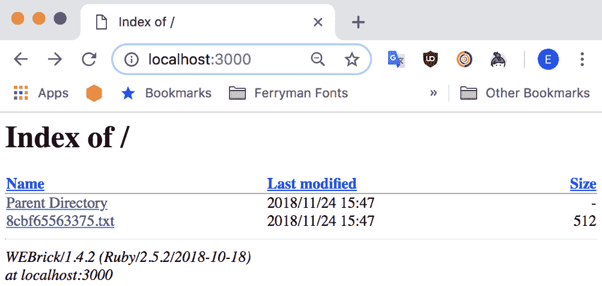
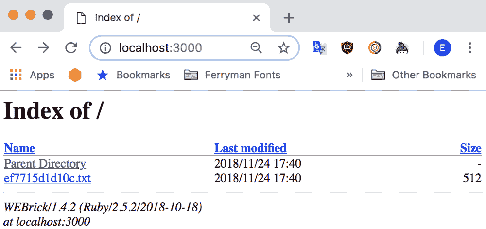
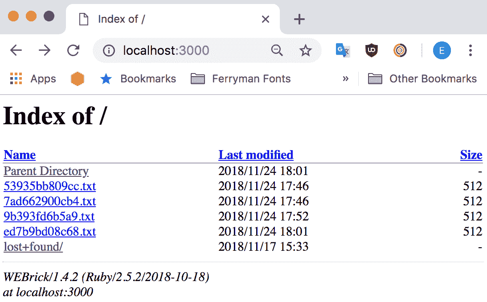

# 存储状态

本章主要介绍 Kubernetes 与 AWS 原生存储解决方案 Elastic Block Store（EBS）的深度集成。 Amazon EBS 提供网络附加存储作为服务，并且是提供块存储给 EC2 实例的主要解决方案。

几乎每个启动的 EC2 实例都由 EBS 根卷支持（从 AMI 机器映像创建）。由于 EBS 存储是网络附加的，如果支持 EC2 实例的底层机器以某种方式失败，存储在卷上的数据是安全的，因为它会自动在多个物理存储设备上复制。

除了用于存储 EC2 实例的根文件系统外，还可以通过 AWS API 将附加的 EBS 卷附加到 EC2 实例并按需挂载。 Kubernetes 与 AWS EBS 的集成利用了这一点，提供了可以被您的 pod 使用的持久卷。如果一个 pod 被杀死并被另一个 EC2 实例上的 pod 替换，Kubernetes 将处理将 EBS 卷从旧的 EC2 实例分离并附加到新实例，准备好根据需要挂载到新的 pod 中。

在本章中，我们将首先看看如何配置我们的 pod 以利用附加卷。然后，我们将研究 Kubernetes 提供的用于处理提供持久性的存储（如 EBS）的抽象。我们将看看 Kubernetes 如何根据我们在 pod 配置中请求的规格自动为我们提供 EBS 卷。

一旦您掌握了使用 Kubernetes 为您的 pod 提供持久存储，本章的下半部分将介绍有状态集，这是 Kubernetes 提供的一个抽象，用于运行一组 pod，每个 pod 都可以有自己的附加存储和即使重新调度到另一个节点也保持不变的身份。如果您想在 Kubernetes 集群上运行复杂的有状态应用程序，比如数据库，这是所需的最后一块拼图。

在本章中，我们将涵盖以下主题：

+   卷

+   存储类

+   有状态集

# 卷

让我们首先看一下如何将卷附加到我们的 Pod。可用的最简单的卷类型`emptyDir`只是一个与 Pod 的生命周期相关联的临时目录。当卷被创建时，它是空的，正如其名称所示，并且会一直保留在节点上，直到 Pod 从节点中移除。您在卷内存储的数据在同一节点上的 Pod 重启之间是持久的，因此可以用于需要在文件系统上缓存昂贵计算的进程，或者用于检查它们的进度。在第一章中，*Google 的基础设施供给我们*，我们讨论了`emptyDir`卷在 Pod 内不同容器之间共享文件的一些其他可能用途。

在这个例子中，我们将利用`emptyDir`卷来部署一个应用程序，该应用程序希望写入容器中的`/data`目录，而根文件系统已被设置为只读。

这个应用程序是为了说明 Kubernetes 中卷的一些属性而设计的。当它启动时，它会在`/data`目录中写入一个随机的文件名。然后它启动一个显示该目录内容的 Web 服务器：

```
apiVersion: apps/v1 
kind: Deployment 
metadata: 
  name: randserver 
spec: 
  selector: 
    matchLabels: 
      app: randserver 
  template: 
    metadata: 
      labels: 
        app: example 
    spec: 
      containers: 
      - image: errm/randserver 
        name: randserver 
        volumeMounts: 
        - mountPath: /data 
          name: data 
        securityContext: 
          readOnlyRootFilesystem: true 
      volumes: 
      - name: data 
        emptyDir: {} 
```

查看这个配置，有一些关于我们如何在 Pod 中使用卷的事项需要注意。这些规则不仅适用于`emptyDir`卷，也适用于您可能遇到的每一种卷类型：

+   每个卷都在 Pod 规范的顶层定义。即使一个卷被 Pod 中的多个容器使用，我们只需要定义一次。

+   当您想要从容器内访问卷时，您必须指定一个卷挂载点，将该卷挂载到容器的文件系统的特定位置。当我们挂载一个卷时，我们会用在`volumes`部分中定义它时使用的名称来引用它。

一旦您部署了这个示例清单，您应该能够使用`kubectl port-forward`命令来访问 Pod 内运行的 Web 服务器：

```
$ kubectl port-forward deployment/randserver 3000:3000   
Forwarding from 127.0.0.1:3000 -> 3000
Forwarding from [::1]:3000 -> 3000
```

现在您应该能够在浏览器中访问`http://localhost:3000`，以查看在容器启动时创建的一个随机文件：



如果您删除此 Pod，那么部署将重新创建一个新的 Pod。因为`emptyDir`卷的内容在 Pod 被销毁时会丢失，所以当第一个 Pod 启动时创建的文件将会消失，并且将创建一个具有不同名称的新文件：

```
$ kubectl delete pod -l app=randserver
pod "randserver-79559c5fb6-htnxm" deleted  
```

您需要重新运行`kubectl port-forward`以选择新的 pod：

```
$ kubectl port-forward deployment/randserver 3000:3000  
```

正在提供的新创建的文件

# EBS 卷

让 Kubernetes 附加 EBS 卷，然后将其挂载到我们的 pod 中的容器中，几乎与使用`emptyDir`卷一样简单。挂载 EBS 卷的最低级别和最简单的方法是使用`awsElasticBlockStore`卷类型。此卷类型处理将 EBS 卷附加到我们的 pod 将运行的节点，然后将卷挂载到容器中的路径。

在使用此卷类型时，Kubernetes 不处理实际为我们创建卷，因此我们需要手动执行此操作。我们可以使用 AWS CLI 来执行此操作：

```
$ aws ec2 create-volume --availability-zone=us-east-1a --size=5 --volume-type=gp2
{
 "AvailabilityZone": "us-east-1a",
 "CreateTime": "2018-11-17T15:17:54.000Z",
 "Encrypted": false,
 "Size": 5,
 "SnapshotId": "",
 "State": "creating",
 "VolumeId": "vol-04e744aad50d4911",
 "Iops": 100,
 "Tags": [],
 "VolumeType": "gp2"
} 
```

请记住，EBS 卷与特定的可用性区域（就像`ec2`实例一样）相关联，并且只能附加到该相同可用性区域中的实例，因此您需要在与集群中的实例相同的区域中创建卷。

在这里，我们已更新了上一个示例中创建的部署，以使用`awsElasticBlockStore`卷类型，并将我们刚刚创建的卷附加到我们的 pod。EBS 卷的 ID 作为参数传递给卷配置：

```
apiVersion: apps/v1 
kind: Deployment 
metadata: 
  name: randserver 
spec: 
  selector: 
    matchLabels: 
      app: randserver 
  template: 
    metadata: 
      labels: 
        app: randserver 
    spec: 
      containers: 
      - image: errm/randserver 
        name: randserver 
        volumeMounts: 
        - mountPath: /data 
          name: data 
        securityContext: 
          readOnlyRootFilesystem: true 
      volumes: 
      - name: data 
        awsElasticBlockStore: 
          volumeID: vol-04e744aad50d4911 
          fsType: ext4 
      nodeSelector: 
        "failure-domain.beta.kubernetes.io/zone": us-east-1a 
```

您将看到以这种方式手动附加 EBS 卷与使用更简单的`emptyDir`卷非常相似。

特殊的`failure-domain.beta.kubernetes.io/zone`标签由 AWS 云提供商自动添加到每个节点。在这里，我们在 pod 定义的`nodeSelector`中使用它，以将 pod 调度到与我们在其中创建卷的可用性区域相同的节点。Kubernetes 将自动向您的集群中的节点添加几个其他标签。您可以在 Kubernetes 文档中阅读有关它们的信息[`kubernetes.io/docs/reference/kubernetes-api/labels-annotations-taints/`](https://kubernetes.io/docs/reference/kubernetes-api/labels-annotations-taints/)。

当您首次提交此部署时，其行为将与先前版本完全相同。但是，当我们删除该 pod 并进行替换时，您会注意到在此容器的先前运行中创建的文件将保留，并且每次启动时都会向列表中添加一个新文件：

当我们的应用程序由 EBS 卷支持时，文件将在 pod 重新调度时保留

# 持久卷

虽然我们当然可以以这种方式手动创建 EBS 卷并在我们的清单中使用它们的 ID，但这种方法存在一些问题。

对于想要在集群上运行他们的应用程序的用户来说，首先考虑为应用程序提供 EBS 卷，然后再修改清单以引用硬编码的 ID，这是笨拙且耗时的。这意味着 pod 清单将需要包含特定于在 AWS 上运行所涉及的应用程序的配置。理想情况下，我们希望尽可能多地重用我们的配置，以避免由于不得不修改配置而引入错误的风险，这些配置可能在我们可能部署它的不同环境之间重复使用。

Kubernetes 提供了两个抽象，将帮助我们管理 EBS 卷：`PersistentVolume`和`PersistentVolumeClaim`。

`PersistentVolume`对象代表集群中的物理存储空间；在 AWS 上，这是一个 EBS 卷，就像`Node`对象代表集群中的 EC2 实例一样。该对象捕获了存储实现的细节，因此对于 EBS 卷，它记录了其 ID，以便 Kubernetes 在调度使用该卷的 pod 时将其附加到正确的节点上。

`PersistentVolumeClaim`是 Kubernetes 对象，允许我们在 pod 中表达对`PersistentVolume`的请求。当我们请求持久卷时，我们只需要请求所需的存储量，以及可选的存储类（请参见下一节）。`PersistentVolumeClaim`通常嵌入在 pod 规范中。当 pod 被调度时，它的`PersistentVolumeClaim`将与足够大以满足所请求存储量的特定`PersistentVolume`匹配。`PersistentVolume`绑定到请求的`PersistentVolumeClaim`，因此即使 pod 被重新调度，相同的基础卷也将附加到 pod 上。

这比手动提供 EBS 卷并在我们的配置中包含卷 ID 要大大改进，因为我们不需要在每次将我们的 pod 部署到新环境时修改我们的清单。

如果你手动操作 Kubernetes（例如，在裸金属部署中），集群管理员可能会预先提供一组`PersistentVolume`，然后在创建时与每个`PersistentVolumeClaim`匹配并绑定。在使用 AWS 时，无需预先提供存储，因为 Kubernetes 会根据需要使用 AWS API 动态创建`PersistentVolume`。

# 持久卷示例

让我们看看如何使用持久卷来简化我们示例应用程序的部署。

为了避免在 AWS 账户上产生额外的费用，你可能想要删除在上一个示例中手动创建的 EBS 卷。

首先，删除我们创建的部署，这样 Kubernetes 就可以卸载卷：

`**$ kubectl delete deployment/randserver**`然后，你可以使用 AWS CLI 来删除 EBS 卷：

`**$ aws ec2 delete-volume --volume-id vol-04e744aad50d4911**`

在开始之前，请确保您至少已将通用存储类添加到您的集群中。

使用 Kubernetes 动态卷提供创建 EBS 卷就像使用`kubectl`创建任何其他资源一样简单：

```
apiVersion: v1 
kind: PersistentVolumeClaim 
metadata: 
  name: randserver-data 
spec: 
  accessModes: 
    - ReadWriteOnce 
  storageClassName: general-purpose 
  resources: 
    requests: 
      storage: 1Gi 
```

如果你在集群中的存储类中添加了`storageclass.kubernetes.io/is-default-class`注释，如果你愿意，你可以省略`storageClassName`字段。

一旦你使用`kubernetes.io/aws-ebs`供应商为存储类创建了`PersistantVolumeClaim`，Kubernetes 将会根据你指定的大小和存储类参数来提供一个匹配的 EBS 卷。完成后，你可以使用`kubectl describe`来查看声明；你会看到状态已更新为`Bound`，`Volume`字段显示了声明绑定的底层`PersistentVolume`：

```
$ kubectl describe pvc/randserver-data
Name:          randserver-data
Namespace:     default
StorageClass:  general-purpose
Status:        Bound
Volume:        pvc-5c2dab0d-f017-11e8-92ac-0a56f9f52542
Capacity:      1Gi
Access Modes:  RWO

```

如果我们使用`kubectl describe`来检查这个`PersistentVolume`，我们可以看到自动提供的底层 EBS 卷的细节：

```
$ kubectl describe pv/pvc-5c2dab0d-f017-11e8-92ac-0a56f9f52542
Name: pvc-5c2dab0d-f017-11e8-92ac-0a56f9f52542
StorageClass: general-purpose
Status: Bound
Claim: default/randserver-data
Reclaim Policy: Delete
Access Modes: RWO
Capacity: 1Gi
Source:
 Type: AWSElasticBlockStore (a Persistent Disk resource in AWS)
 VolumeID: aws://us-east-1a/vol-04ad625aa4d5da62b
 FSType: ext4
 Partition: 0
 ReadOnly: false
```

在我们的部署中，我们可以更新 pod 规范的`volumes`部分，通过名称引用`PersistentVolumeClaim`：

```
apiVersion: apps/v1 
kind: Deployment 
metadata: 
  name: randserver 
spec: 
  selector: 
    matchLabels: 
      app: randserver 
  template: 
    metadata: 
      labels: 
        app: randserver 
    spec: 
      containers: 
      - image: errm/randserver 
        name: randserver 
        volumeMounts: 
        - mountPath: /data 
          name: data 
        securityContext: 
          readOnlyRootFilesystem: true 
      volumes: 
      - name: data 
        persistentVolumeClaim: 
          claimName: randserver-data 
```

# 存储类

在 AWS 上，有几种不同类型的卷可用，提供不同的价格和性能特性。

为了在我们提供卷时提供一种简单的选择卷类型（和其他一些设置），我们创建了一个`StorageClass`对象，然后在创建`PersistentVolumeClaim`时可以通过名称引用它。

存储类的创建方式与任何其他 Kubernetes 对象相同，通过使用`kubectl`向 API 提交清单来创建：

```
kind: StorageClass 
apiVersion: storage.k8s.io/v1 
metadata: 
  name: general-purpose 
  annotations: 
    "storageclass.kubernetes.io/is-default-class": "true" 
provisioner: kubernetes.io/aws-ebs 
parameters: 
  type: gp2 
```

此清单创建了一个名为`general-purpose`的存储类，该存储类创建具有`gp2`卷类型的卷。如果您还记得我们在第六章中关于 EBS 卷类型的讨论，*生产规划*，这种基于 SSD 的卷类型适用于大多数通用应用程序，提供了良好的性能和价格平衡。

您还会注意到`storageclass.kubernetes.io/is-default-class`注释，该注释使`StorageClass`成为任何未指定存储类的`PersistentVolumeClaim`要使用的默认存储类。您应该只将此注释应用于单个`StorageClass`。

`parameter`字段接受几种不同的选项。

最重要的参数字段是`type`，它允许我们选择`gp2`（默认值）、`io1`（预留 IOPS）、`sc1`（冷存储）或`st1`（吞吐量优化）中的一个。

如果您选择使用`io1`类型，还应使用`iopsPerGB`参数来指定每 GB 磁盘存储请求的 IOPS 数量。`io1` EBS 卷支持的最大 IOPS/GB 比率为 50:1。

请记住，预留 IOPS 的成本使`io1`卷的成本比等效的通用卷高得多。为了提供与相同大小的`gp2`卷相似的吞吐量，预留 IOPS 的`io1`卷的成本可能是后者的三倍。因此，您应该仅在需要超过`gp2`卷提供的性能时才使用`io1`卷。一个可以优化成本的技巧是使用比应用程序要求的更大的`gp2`卷，以提供额外的 IO 积分。

例如，您可以创建几个不同的使用`io1`类型的类，供具有不同性能要求的应用程序使用：

```
kind: StorageClass 
apiVersion: storage.k8s.io/v1 
metadata: 
  name: high-iops-ssd 
provisioner: kubernetes.io/aws-ebs 
parameters: 
  type: io1 
  iopsPerGB: "50" 
---
 kind: StorageClass 
apiVersion: storage.k8s.io/v1 
metadata: 
  name: medium-iops-ssd 
provisioner: kubernetes.io/aws-ebs 
parameters: 
  type: io1 
  iopsPerGB: "25" 
```

请注意，Kubernetes 期望为`iopsPerGb`字段提供字符串值，因此您需要引用此值。

如果您使用的应用程序经过优化，可以对文件系统进行顺序读写操作，那么您可能会从使用`st1`卷类型中受益，该类型使用优化的磁盘存储提供高吞吐量的读写。不建议将此存储用于通用用途，因为进行随机访问读取或写入时的性能将很差：

```
kind: StorageClass 
apiVersion: storage.k8s.io/v1 
metadata: 
  name: throughput 
provisioner: kubernetes.io/aws-ebs 
parameters: 
  type: st1 
```

`sc1` 卷类型提供了作为 EBS 卷可用的最低成本存储，并且适用于不经常访问的数据。与 `st1` 卷一样，`sc1` 优化了顺序读写，因此在具有随机读写的工作负载上性能较差。

```
kind: StorageClass 
apiVersion: storage.k8s.io/v1 
metadata: 
  name: cold-storage 
provisioner: kubernetes.io/aws-ebs 
parameters: 
  type: sc1 
```

提前决定您想在集群中提供的不同存储类，并向集群用户提供关于何时使用每个类的文档是一个好主意。

在您的配置过程中，考虑提交一个存储类列表到您的集群中，因为在配置 EKS 集群时，默认情况下不会创建任何存储类。

# 有状态集

到目前为止，我们已经看到了如何使用 Kubernetes 自动为 `PersistentVolumeClaim` 配置 EBS 卷。这对于许多需要单个卷为单个 pod 提供持久性的应用程序非常有用。

然而，当我们尝试扩展我们的部署时，我们会遇到问题。运行在同一节点上的 pod 可能最终共享卷。但是，由于 EBS 卷一次只能附加到单个实例，任何调度到另一个节点的 pod 都将被卡在 `ContainerCreating` 状态，无休止地等待 EBS 卷被附加。

如果您正在运行一个应用程序，希望每个副本都有自己独特的卷，我们可以使用有状态集。当我们想要部署每个副本都需要有自己的持久存储的应用程序时，有状态集比部署具有两个关键优势。

首先，我们可以提供一个模板来为每个 pod 创建一个新的持久卷，而不是通过名称引用单个持久卷。这使我们能够通过扩展有状态集为每个 pod 副本提供独立的 EBS 卷。如果我们想要通过部署实现这一点，我们需要为每个副本创建一个单独的部署，每个部署通过名称引用不同的持久卷。

其次，当通过 `StatefulSet` 调度 pod 时，每个副本都有一个一致和持久的主机名，即使 pod 被重新调度到另一个节点，主机名也保持不变。这在运行软件时非常有用，每个副本都希望能够连接到特定地址的同行。在 Kubernetes 添加有状态集之前，将这样的软件部署到 Kubernetes 通常依赖于使用 Kubernetes API 执行服务发现的特殊插件。

为了说明有状态集的工作原理，我们将重写我们的示例应用部署清单，以使用`StatefulSet`。因为`StatefulSet`中的每个副本 Pod 都有可预测的主机名，所以我们首先需要创建一个服务，以允许将流量路由到这些主机名并传递到底层的 Pod：

```
apiVersion: v1 
kind: Service 
metadata: 
  name: randserver 
  labels: 
    app: randserver 
spec: 
  ports: 
  - port: 80 
    name: web 
    targetPort: 3000 
  clusterIP: None 
  selector: 
    app: randserver 
```

每个 Pod 将被赋予一个由有状态集的名称和集合中的 Pod 编号构成的主机名。主机名的域是服务的名称。

因此，当我们创建一个名为`randserver`的有三个副本的有状态集。集合中的 Pod 将被赋予主机名`randserver-0`，`randserver-1`和`randserver-2`。集群中运行的其他服务将能够通过使用名称`randserver-0.randserver`，`randserver-1.randserver`和`randserver-2.randserver`连接到这些 Pod。

`StatefulSet`的配置与部署的配置非常相似。应该注意的主要区别如下：

+   `serviceName`字段是我们需要引用用于为 Pod 提供网络访问的服务。

+   `volumeClaimTemplates`字段，我们在其中包含一个`PersistentVolumeClaim`的模板，该模板将为`StatefulSet`中的每个 Pod 副本创建。您可以将其视为为每个创建的 Pod 提供模板的模板字段的类比：

```
apiVersion: apps/v1 
kind: StatefulSet 
metadata: 
  name: randserver 
spec: 
  selector: 
    matchLabels: 
      app: randserver 
  serviceName: randserver 
  replicas: 3 
  template: 
    metadata: 
      labels: 
        app: randserver 
    spec: 
      containers: 
      - image: errm/randserver 
        name: randserver 
        volumeMounts: 
        - mountPath: /data 
          name: data 
        securityContext: 
          readOnlyRootFilesystem: true 
  volumeClaimTemplates: 
    - metadata: 
        name: data 
      spec: 
        accessModes: 
          - ReadWriteOnce 
        storageClassName: general-purpose 
        resources: 
          requests: 
            storage: 1Gi 
```

一旦您将`StatefulSet`提交给 Kubernetes，您应该能够看到已成功调度到集群的 Pod：

```
$ kubectl get pods
NAME           READY     STATUS    RESTARTS   AGE
randserver-0   1/1       Running   0          39s
randserver-1   1/1       Running   0          21s
randserver-2   1/1       Running   0          10s  
```

请注意，每个 Pod 的名称都遵循可预测的模式，不像使用部署或副本集创建的 Pod，它们每个都有一个随机名称。

尝试删除有状态集中的一个 Pod，并注意它被一个与被删除的 Pod 完全相同的名称的 Pod 所替换：

```
$ kubectl delete pod/randserver-1
$ kubectl get pods
NAME           READY     STATUS    RESTARTS   AGE
randserver-0   1/1       Running   0          17m
randserver-1   1/1       Running   0          18s
randserver-2   1/1       Running   0          17m  
```

如果您查看持久卷索赔，您将看到它们的名称也遵循可预测的模式，索赔的名称是由卷索赔模板元数据中给定的名称，有状态集的名称和 Pod 编号组成的。

```
kubectl get pvc
NAME                STATUS    VOLUME
data-randserver-0   Bound     pvc-803210cf-f027-11e8-b16d
data-randserver-1   Bound     pvc-99192c41-f027-11e8-b16d
data-randserver-2   Bound     pvc-ab2b25b1-f027-11e8-b16d  
```

如果删除（或缩减）一个有状态集，那么相关的持久卷索赔将保留。这非常有利，因为它使得更难丢失应用程序创建的宝贵数据。如果稍后重新创建（或扩展）有状态集，那么由于使用可预测的名称，相同的卷将被重用。

如果您确实打算从集群中完全删除有状态集，您可能还需要另外删除相应的持久卷声明：

```
$ kubectl delete statefulset randserver
statefulset.apps "randserver" deleted
$ kubectl delete pvc -l app=randserver
persistentvolumeclaim "data-randserver-0" deleted
persistentvolumeclaim "data-randserver-1" deleted
persistentvolumeclaim "data-randserver-2" deleted  
```

# 摘要

在本章中，我们已经了解了 Kubernetes 为您的应用程序提供存储的丰富工具集。

您应该已经学会了以下内容：

+   如何为您的 pod 配置卷

+   如何将卷挂载到容器中

+   如何使用持久卷声明自动提供 EBS 卷

+   通过配置存储类来提供不同的 EBS 卷类型

+   如何为有状态集中的每个 pod 动态提供卷

现在您应该已经掌握足够的知识，可以将许多类型的应用程序部署到您的 Kubernetes 集群中。

# 进一步阅读

如果您想了解如何在 Kubernetes 中利用存储，这里有一些资源可能对您有用：

+   Kubernetes Helm Charts 包括许多配置示例，用于众所周知的数据存储，这些示例广泛使用持久卷：[`github.com/helm/charts`](https://github.com/helm/charts)

+   Kubernetes 文档详细介绍了在 Kubernetes 中使用存储的信息：[`kubernetes.io/docs/concepts/storage/`](https://kubernetes.io/docs/concepts/storage/)

+   Kubernetes EFS 供应程序提供了一个附加的供应程序，可以部署以提供由 AWS 弹性文件系统（EFS）支持的卷。如果您希望多个 pod 能够从同一卷中读取和写入，这可能是一个有用的工具：[`github.com/kubernetes-incubator/external-storage/tree/master/aws/efs`](https://github.com/kubernetes-incubator/external-storage/tree/master/aws/efs)
