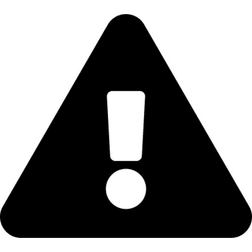

## 第一章：0：关于这本书

这是一本关于 Kubernetes 的**最新**书籍。它相对较短，而且直截了当。这本书的理念是您可以在几天内读完它！不需要任何先前的知识。

让我明确一点，因为我不想误导人... **这不是深入研究！**它涵盖了 Kubernetes 最重要的方面。我认为这是市场上最好的快速掌握的书籍！

### 平装书

平装版本在部分亚马逊市场上有售。我无法控制亚马逊在哪些市场上提供平装版 - 如果由我选择，我会让它在所有地方都有售。

我选择了一本**高质量的全彩版**，我认为您会喜欢。这意味着没有廉价的纸张，也没有来自上世纪 90 年代的黑白图表:-D

### 电子书和 Kindle 版本

获取电子副本的最简单的地方是 leanpub.com。这是一个流畅的平台，所有更新都是免费的。

您也可以在亚马逊上获得 Kindle 版本，还可以获得免费更新。然而，Kindle 在同步更新方面声名狼藉。如果您在将更新同步到您的 Kindle 上遇到问题，请联系 Kindle 支持，他们将解决问题。

### 反馈

我会很高兴如果您能在亚马逊上给这本书写一篇评论。写技术书是孤独的工作。我实际上花了几个月的时间让这本书尽可能地好，所以花几分钟时间写一篇评论对我来说是很好的。不过，没有压力，如果您不写，我也不会因此失眠。

### 为什么有人要读这本书或关心 Kubernetes？

Kubernetes 非常热门，Kubernetes 技能需求量很高。所以，如果您想在职业生涯上取得进展，并且想要使用塑造未来的技术，您需要阅读这本书。如果您不关心自己的职业生涯，并且愿意被抛在后面，那就不要读它。这就是事实。

### 如果我已经观看了您的视频培训课程，我应该买这本书吗？

Kubernetes 是 Kubernetes。所以我的书和视频课程之间显然有一些相似的内容。但阅读书籍和观看视频是完全不同的体验。在我看来，视频更有趣，但书籍更容易做笔记，当你试图找到某些东西时可以翻阅。

如果我是您，我会观看视频*并*购买这本书。它们互补，通过多种方法学习是一种被证明的策略。但您还能期待我说什么呢:-D

最后的话：我觉得我的书籍和视频课程已经得到了足够多的好评，可以让您放心它们将是很好的投资。

> **注意：**我的视频培训课程可在 pluralsight.com 和 acloud.guru 上找到。

### 书籍的版本

Kubernetes 正在快速发展！因此，这样一本书的价值与其年龄成反比！换句话说，这本书越老，价值就越低。考虑到这一点，**我承诺每年至少更新一次**。当我说“更新”时，我的意思是真正的更新 - 每个词和概念都经过审查，每个示例都经过测试和更新。**我对这本书百分之百的承诺！**

如果每年至少更新一次似乎很多...**欢迎来到新常态！**

我们不再生活在一个两年前的技术书籍有价值的世界。事实上，我对一个关于 Kubernetes 这样快速发展的主题的一年前的书籍的价值表示怀疑！作为作者，我希望这不是真的，但事实却是如此！再次...欢迎来到新常态！

### 书籍的免费更新

我已尽一切努力确保您对这本书的投资尽可能安全！

所有 Kindle 和 Leanpub 的客户都可以免费获得所有更新！Leanpub 上的更新效果很好，但在 Kindle 上情况就不一样了。许多读者抱怨他们的 Kindle 设备无法获得更新。这是一个常见问题，可以通过联系 Kindle 支持轻松解决。

如果您从**Amazon.com**购买平装书，您可以以$2.99 的折扣价获得 Kindle 版本。这是通过*Kindle Matchbook*计划完成的。不幸的是，Kindle Matchbook 只在美国提供，并且存在错误 - 有时 Kindle Matchbook 图标不会出现在书的亚马逊销售页面上。如果您遇到此类问题，联系 Kindle 支持，他们会帮助您解决问题。

这是我能做的最好的了！

如果您通过其他渠道购买这本书，情况会有所不同，因为我无法控制它们。嘿...我是一个技术人员，不是一个书籍分销商:-D

### 书籍的版本

+   **版本 3** 2018 年 11 月。将所有内容和概念与 Kubernetes 的最新版本以及云原生领域的最新动态保持一致。重新排列了一些章节以获得更好的流畅性。删除了*ReplicaSets*章节，并将该内容转移到改进的*Deployments*章节。添加了新章节，概述了其他未在专门章节中涵盖的重要概念。

+   **版本 2.2** 2018 年 1 月。修正了一些拼写错误，增加了一些解释，并添加了一些新的图表。

+   **版本 2.1** 2017 年 12 月。修正了一些拼写错误，并更新了图 6.11 和 6.12 以包括缺失的标签。

+   **版本 2.** 2017 年 10 月。更新了 Kubernetes 1.8.0 的内容。增加了关于 ReplicaSets 的新章节。对 Pods 章节进行了重大修改。修正了拼写错误，并对现有章节进行了一些其他小的更新。

+   **版本 1.** 初始版本。
