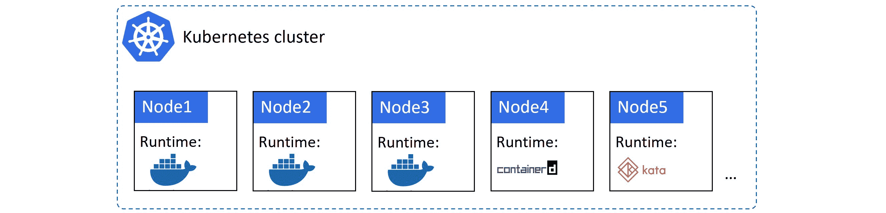
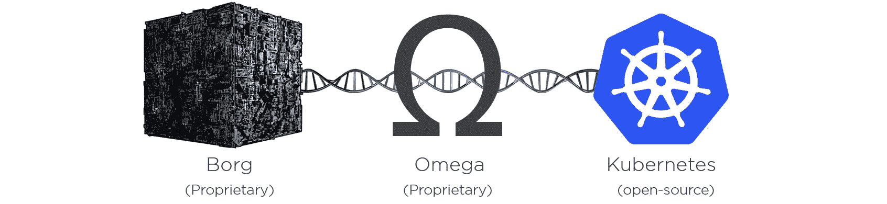

## 第二章：1：Kubernetes 入门

本章分为两个主要部分。

+   Kubernetes 背景-它来自何处等等。

+   将 Kubernetes 视为数据中心操作系统的想法

### Kubernetes 背景

Kubernetes 是一个编排器。在大多数情况下，它编排容器化的应用程序。但是，有一些项目使其能够编排虚拟机和函数（无服务器工作负载）。所有这些都使 Kubernetes 成为*云原生应用程序*的事实上的编排器。

那么，什么是*编排器*，什么是*云原生应用程序*？

*编排器*是一个部署和管理应用程序的后端系统。这意味着它可以帮助您部署应用程序，扩展和缩小它，执行更新和回滚等操作。如果它是一个好的编排器，它可以在您不需要监督的情况下完成这些操作。

*云原生应用程序*由一组小型独立服务组成，这些服务相互通信并形成一个有用的应用程序。正如其名称所示，这种设计使其能够应对类似云的需求并在云平台上本地运行。例如，云原生应用程序被设计和编写成可以轻松扩展和缩小以满足需求的变化。更新和回滚也很简单。它们还可以自我修复。

本书中将更多地涉及所有这些概念。

> **注意：**尽管名称如此，*云原生*应用程序也可以在本地运行。事实上，云原生应用程序的一个特性可能是能够在任何地方运行-任何云，或任何本地数据中心。

### Kubernetes 源自何处

让我们从头开始吧... Kubernetes 源自 Google！2014 年夏天，它被开源并移交给了云原生计算基金会（CNCF）。

图 1.1

从那时起，它已成为全球最重要的云原生技术。

像许多现代云原生项目一样，它是用 Go（Golang）编写的。它在 Github 上的`kubernetes/kubernetes`上。它在 IRC 频道上活跃讨论，你可以在 Twitter 上关注它（@kubernetesio），还有一个很好的 slack 频道-slack.k8s.io。全球各地也定期举行聚会！

#### Kubernetes 和 Docker

Kubernetes 和 Docker 是互补的技术。例如，通常会使用 Docker 开发应用程序，然后使用 Kubernetes 进行编排。

在这个模型中，你可以用你喜欢的语言编写代码，然后使用 Docker 对其进行打包、测试和部署。但在测试或生产中运行的最后一步是由 Kubernetes 处理的。

在高层次上，你可能会有一个包含 10 个节点的 Kubernetes 集群来运行你的生产应用程序。然而，在幕后，每个节点都在运行 Docker 作为其容器运行时。这意味着 Docker 是启动和停止容器等低级技术，而 Kubernetes 是处理更大范围事务的高级技术，比如决定在哪些节点上运行应用程序的某些部分，何时扩展或缩减，以及执行更新。

图 1.2 显示了一个简单的 Kubernetes 集群，其中的节点使用 Docker 作为容器运行时。

图 1.2

正如图 1.2 所示，Docker 并不是 Kubernetes 支持的唯一容器运行时。事实上，Kubernetes 有一些抽象运行时的特性：

1.  容器运行时接口（CRI）是一个抽象层，标准化第三方容器运行时与 Kubernetes 接口的方式。它允许容器运行时代码存在于 Kubernetes 之外，但以受支持和标准化的方式与其接口。

1.  *运行时类*是 Kubernetes 1.12（alpha）中的一个新功能，允许不同类别的运行时。例如，*gVisor*可能提供比 Docker 或 containerd 更好的隔离性。

在撰写本文时，`containerd`正在超越 Docker 成为 Kubernetes 中最常用的容器运行时。`containerd`实际上是 Docker 的精简版本，只包含 Kubernetes 所需的内容。

然而，这是低级的东西，不应该影响你作为 Kubernetes 用户的体验。无论你使用哪种容器运行时，常规的 Kubernetes 命令和模式将继续正常工作。

#### Kubernetes 与 Docker Swarm 有什么不同

在 2016 年和 2017 年，我们经历了*编排器之战*，Docker Swarm、Mesosphere DCOS 和 Kubernetes 争夺成为事实上的容器编排器。长话短说，Kubernetes 获胜了。

是的，Docker Swarm 和其他容器编排器仍然存在，但它们的发展和市场份额与 Kubernetes 相比微不足道。

#### Kubernetes 和 Borg：抵抗是徒劳的！

很有可能你会听到人们谈论 Kubernetes 与谷歌的*Borg*和*Omega*系统的关系。

谷歌多年来一直在容器上运行许多系统并不是什么秘密。传说中他们每周处理*数十亿个容器*的故事很常见。所以是的，很长一段时间以来 - 甚至在 Docker 出现之前 - 谷歌一直在容器上运行*搜索*、*Gmail*和*GFS*等东西 - **大量**的容器！

控制这数十亿个容器并保持其正常运行的是一些内部技术和框架，称为*Borg*和*Omega*。因此，把它们与 Kubernetes 联系起来并不是什么大问题 - 它们都在进行规模化容器编排的游戏，并且它们都与谷歌有关。

这有时让人们误以为 Kubernetes 是 Borg 或 Omega 的开源版本。但事实并非如此！它更像是与它们共享 DNA 和家族史。就像这样...一开始是 Borg...然后 Borg 产生了 Omega。Omega *认识*了开源社区，然后产生了她的 Kubernetes ;-)

图 1.3 - 共享的 DNA

关键是，这三者是分开的，但又是相关的。事实上，许多参与建立 Borg 和 Omega 的人也参与了建立 Kubernetes。

因此，尽管 Kubernetes 是从头开始构建的，但它利用了在谷歌与 Borg 和 Omega 学到的许多东西。

目前，Kubernetes 是 CNCF 下的一个开源项目，根据 Apache 2.0 许可证授权，并且 1.0 版本早在 2015 年 7 月就发布了。

#### Kubernetes - 名字的含义

**Kubernetes**这个名字来自希腊词，意思是*舵手* - 驾驶船只的人。这个主题反映在标志中。

图 1.4 - Kubernetes 标志

> **传闻：** Kubernetes 最初的名字是要叫*九号七*。如果你了解《星际迷航》，你会知道*九号七*是一位由凯瑟琳·詹妮薇船长指挥的 USS 航行者号救出的女性**Borg**。标志上的**7**个轮辐也是对*九号七*的一个参考。

在继续之前，关于名字的最后一件事...你经常会看到 Kubernetes 被缩写为**K8s**。这个想法是数字 8 替代了 K 和 S 之间的 8 个字符 - 对于推特和像我这样的懒惰打字者来说非常方便 ;-)

### 数据中心操作系统

一般来说，容器让我们以前的可扩展性挑战看起来很容易 - 我们刚刚说过谷歌每周处理数十亿个容器！

好吧……但并非每个人都像谷歌那样大。那么我们其他人呢？

一般来说，如果你的传统应用程序有数百个虚拟机(VM)，那么你的容器化云原生应用程序很可能会有数千个容器！考虑到这一点，我们迫切需要一种管理它们的方法。

对 Kubernetes 打个招呼！

当你开始理解像 Kubernetes 这样的东西时，重要的是要理解现代数据中心架构。例如，我们正在放弃将数据中心视为计算机集合的传统观点。相反，我们将其视为*一个大型计算机*。

但这意味着什么？

典型的计算机是由 CPU、RAM、存储和网络组成的。但是我们已经很好地构建了抽象掉许多细节的操作系统(OS)。例如，开发人员很少关心他们的应用程序使用哪个 CPU 核心或确切的内存地址 - 我们让操作系统决定所有这些。这是件好事，应用程序开发的世界因此变得更加友好。

因此，将这一点提升到下一个级别，并将这些相同的抽象应用于数据中心资源 - 将数据中心视为计算、网络和存储的池，并具有一个总体系统来对其进行抽象化是很自然的。这意味着我们不再需要关心我们的容器运行在哪台服务器或 LUN 上 - 只需将其留给数据中心操作系统处理。

在某些方面，Kubernetes 是一个数据中心操作系统。其他操作系统也存在，但它们都处于*牲畜业*中。忘掉给你的服务器命名，在电子表格中映射逻辑单元(LUN)，或者以其他方式像*宠物*一样对待它们。像 Kubernetes 这样的系统并不在乎。那种把你的应用程序拿出来然后说*“在这个节点上运行应用程序的这一部分，使用这个 IP，在这个特定的 LIUN 上……“*的日子已经过去了。在云原生的 Kubernetes 世界中，我们更多地是说*“嘿，Kubernetes，我有这个应用程序，它由这些部分组成……请帮我运行它”*。然后 Kubernetes 会去做所有艰难的调度和编排工作。

> **注意：**在使用术语*宠物*和*牲畜*时，不是针对任何人或任何动物。

让我们来看一个快速的类比……

考虑一下通过快递服务发送货物的过程。您将货物打包在快递公司的标准包装中，贴上标签，然后交给快递员。快递员会处理其他所有事情 - 所有复杂的物流，包括货物搭乘的飞机和卡车，使用哪些司机等等。他们还提供让您跟踪包裹的服务。关键是，快递员唯一需要的是货物按照他们的要求打包和贴标签。

对于 Kubernetes 中的应用程序也是一样。将它们打包为容器，给它们一个声明性清单，然后让 Kubernetes 负责运行它们并保持运行。您还会获得丰富的工具和 API，让您了解发生了什么。这是一件美好的事情！

虽然这些听起来都很棒，但不要把这个“数据中心操作系统”的比喻太过分。这不是一个 DVD 安装，你不会得到一个 shell 提示符来控制整个数据中心。而且你绝对不会得到一个纸牌游戏！我们还处于早期阶段，但 Kubernetes 正在引领潮流，我相信你会喜欢它。

### 章节总结

Kubernetes 是云原生应用程序的领先编排器。我们给它一个应用程序，告诉它我们希望应用程序看起来像什么，然后让 Kubernetes 实现。

它来自谷歌，根据 Apache 2.0 许可开源，并且属于 Cloud Native Computing Foundation（CNCF）。

提示！

Kubernetes 是一个快速发展的项目，正在积极开发中，所以事情变化很快！但不要因此而却步 - 拥抱它！快速变化是新常态！

除了阅读本书，我建议您关注 Twitter 上的@kubernetesio，加入各种 k8s 的 slack 频道，并参加当地的聚会。这些都将帮助您了解 Kubernetes 世界中的最新和最伟大的事物。我还会定期更新这本书，并制作更多的视频培训课程！请关注 pluralsight.com 和 acloud.guru 获取我的最新课程！
