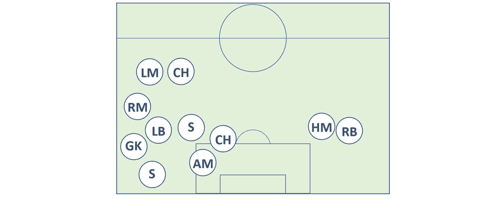
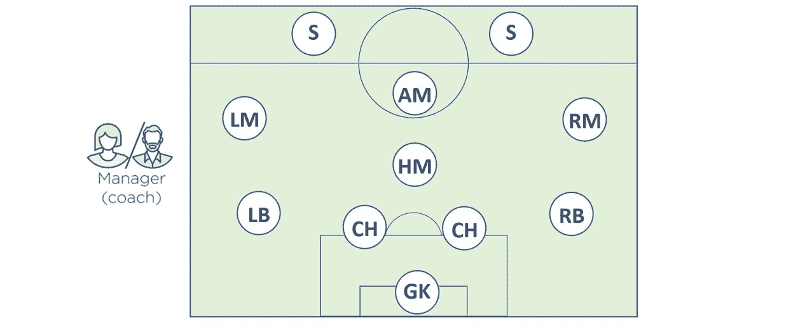

## 2：Kubernetes 操作原则

在这一章中，我们将学习构建 Kubernetes 集群和部署应用程序所需的主要组件。游戏的目的是为您提供主要概念的概述。但是如果您不立刻理解一切，不要担心，随着我们在书中的进展，我们将再次涵盖大部分内容。

我们将按以下方式划分本章：

+   从 40K 英尺高度看 Kubernetes

+   主节点和节点

+   打包应用程序

+   声明性配置和期望状态

+   Pods

+   部署

+   服务

### 从 40K 英尺高度看 Kubernetes

在最高层次上，Kubernetes 是云原生微服务应用程序的编排器。这只是一个由许多小独立服务组成的应用程序的花哨名称，它们共同工作形成一个有用的应用程序。

让我们看一个快速的类比。

在现实世界中，一个足球（足球）队由个体组成。没有两个是相同的，每个人在团队中扮演不同的角色 - 有些防守，有些进攻，有些擅长传球，有些擅长射门... 教练来了，他或她给每个人一个位置，并将他们组织成一个有目的的团队。我们从图 2.1 到图 2.2。

图 2.1

图 2.2

教练还确保团队保持队形，坚持计划，并处理任何伤病。好吧，猜猜… Kubernetes 世界中的微服务应用程序也是一样的！

跟着我…

我们从许多个体化的专业服务开始 - 有些提供网页，有些进行身份验证，有些进行搜索，其他一些持久化数据。Kubernetes 出现了 - 就像足球类比中的教练一样 - 将所有东西组织成一个有用的应用程序，并保持一切运行顺利。

在体育界，我们称之为*教练*。在应用程序世界中，我们称之为*编排*。

Kubernetes 是一个*编排器*。

为了实现这一点，我们从一个应用程序开始，打包它并将其交给集群（Kubernetes）。集群由一个或多个*主节点*和一堆*节点*组成。

主节点负责集群并做出所有调度决策。他们还监视集群，实施更改并响应事件。因此，我们经常将主节点称为*控制平面*。

节点是应用程序服务运行的地方，有时我们称它们为*数据平面*。它们向主节点汇报，并不断观察新的工作任务。

要在 Kubernetes 集群上运行应用程序，我们遵循这个简单的模式：

1.  用我们喜欢的语言将应用程序编写为小型独立服务。

1.  将每个服务打包在自己的容器中。

1.  将每个容器包装在自己的 Pod 中。

1.  通过更高级别的对象（例如；*Deployments, DaemonSets, StafeulSets, CronJobs 等）将 Pod 部署到集群中。

我们仍然处在书的开头阶段，不要指望你已经知道所有这些术语的含义。但在高层次上，*Deployments* 提供了可伸缩性和滚动更新，*DaemonSets* 在集群中的每个节点上运行一个 Pod 实例，*StatefulSets* 用于应用程序的有状态组件，*CronJobs* 用于需要在设定时间运行的工作。还有更多选项，但现在这些就够了。

Kubernetes 喜欢以声明方式管理应用程序。这是一种模式，我们在一组 YAML 文件中描述我们希望应用程序的外观和感觉，将这些文件发送到 Kubernetes，然后坐下来，让 Kubernetes 完成所有工作。

但事情并不止于此。Kubernetes 不断监视我们应用程序的不同部分，以确保它运行的方式完全符合预期。如果有什么不对劲，Kubernetes 会尝试修复它。

这是一个大局观。让我们深入一点。

### 主节点和节点

Kubernetes 集群由主节点和节点组成。这些是可以是虚拟机、数据中心中的裸金属服务器，或者是私有或公共云中的实例的 Linux 主机。

#### 主节点（控制平面）

Kubernetes 主节点是构成集群控制平面的系统服务的集合。

最简单的设置在单个主机上运行所有主服务。然而，多主高可用性对于生产环境变得越来越重要，并且对于生产环境来说是**必不可少**的。这就是为什么主要的云提供商在其 Kubernetes 作为服务平台中实现高可用性主节点，如 AKS、EKS 和 GKE。

还有一个被认为是一个好的实践**不要**在主节点上运行应用程序工作负载。这使得主节点可以完全集中于管理集群。

让我们快速看一下组成控制平面的 Kubernetes 主节点的主要部分。

##### API 服务器

API 服务器是进入 Kubernetes 的前门。它公开了一个 RESTful API，我们可以通过它向服务器发送 YAML 配置文件。这些 YAML 文件，有时我们称之为*清单*，包含了我们应用程序的期望状态。这包括诸如要使用哪个容器镜像、要暴露哪些端口以及有多少个 Pod 副本等内容。

对 API 服务器的所有请求都要经过身份验证和授权检查，但一旦完成这些步骤，YAML 文件中的配置将被验证，持久化到集群存储中，并部署到集群中。

您可以将 API 服务器视为集群的大脑 - 智能实现的地方。

##### 集群存储

如果 API 服务器是集群的大脑，那么*集群存储*就是它的记忆。它是控制平面中唯一有状态的部分，并且持久地存储了整个集群的配置和状态。因此，它是集群的重要组成部分 - 没有集群存储，就没有集群！

集群存储基于**etcd**，这是一个流行的分布式数据库。由于它是集群的*唯一真相来源*，您应该小心保护它，并提供足够的恢复方式以应对出现问题时的情况。

##### 控制器管理器

控制器管理器是*控制器的控制器*，有点像一个单体。虽然它作为一个单一的进程运行，但它实现了几个控制循环，监视集群并响应事件。其中一些控制循环包括：节点控制器、端点控制器和命名空间控制器。每个控制器通常作为一个后台监视循环运行，不断地监视 API 服务器的变化 - 游戏的目标是确保集群的*当前状态*与*期望状态*匹配（稍后会详细介绍）。

> **注意：**在整本书中，我们将使用*控制循环*、*监视循环*和*协调循环*等术语来表示相同的意思。

##### 调度器

在高层次上，调度器会监视新的工作并将其分配给节点。在幕后，它评估亲和性和反亲和性规则、约束和资源管理。

##### 云控制器管理器

如果您在受支持的公共云平台（如 AWS、Azure 或 GCP）上运行集群，则您的控制平面将运行一个*云控制器管理器*。它的工作是管理与底层云平台的集成，如节点、负载均衡器和存储。

##### 控制平面摘要

Kubernetes 的主节点运行着整个集群的控制平面服务。可以把它看作是集群的大脑 - 所有控制和调度决策都是在这里做出的。在幕后，主节点由许多小型专门的服务组成。这些包括 API 服务器、集群存储、控制器管理器和调度器。

API 服务器是控制平面的前端，也是我们直接交互的控制平面中唯一的组件。默认情况下，它在端口 443 上公开一个 RESTful 端点。

图 2.3 显示了 Kubernetes 主节点（控制平面）的高层视图。

图 2.3 - Kubernetes 主节点

#### 节点

*节点*是 Kubernetes 集群的工作者。在高层次上，它们有三个功能：

1.  监视 API 服务器以获取新的工作任务

1.  执行新的工作任务

1.  向控制平面报告

从图 2.4 可以看出，它们比*主节点*简单一些。让我们来看一下节点的三个主要组件。

图 2.4 - Kubernetes 节点（以前称为 Minion）

##### Kubelet

Kubelet 是在集群中所有节点上运行的主要 Kubernetes 代理。事实上，通常可以互换使用术语*节点*和*kubelet*。您在 Linux 主机上安装 kubelet，它会将主机注册为*节点*加入集群。然后它会监视 API 服务器以获取新的工作任务。每当它看到一个任务，它就会执行该任务并保持与主节点的报告通道。

如果 kubelet 无法运行特定的工作任务，它会向主节点报告，并让控制平面决定采取什么行动。例如，如果一个 Pod 在一个节点上失败，kubelet **不**负责找到另一个节点来运行它。它只是向控制平面报告，由控制平面决定如何处理。

##### 容器运行时

Kubelet 需要一个容器运行时来执行与容器相关的任务 - 诸如拉取镜像、启动和停止容器等。

在早期，Kubernetes 原生支持一些容器运行时，比如 Docker。最近，它已经转移到了一个名为容器运行时接口（CRI）的插件模型。这是一个用于外部（第三方）容器运行时插入的抽象层。基本上，CRI 掩盖了 Kubernetes 的内部机制，并为第三方容器运行时提供了一个清晰的文档化接口。

CRI 是将运行时集成到 Kubernetes 中的支持方法。

Kubernetes 有很多可用的容器运行时。`cri-containerd`是一个基于社区的开源项目，将 CNCF 的`containerd`运行时移植到 CRI 接口。它得到了很多支持，并且正在取代 Docker 成为 Kubernetes 中最流行的容器运行时。

> **注意：**`containerd`（发音为“container-dee”）是从 Docker Engine 中剥离出来的容器监督者和运行时逻辑。它由 Docker，Inc.捐赠给了 CNCF，并得到了很多社区支持。还有其他符合 CRI 标准的容器运行时存在。

##### Kube-proxy

*node*谜题的最后一部分是 kube-proxy。它在集群中的每个节点上运行，并负责本地网络。例如，它确保每个节点都有自己独特的 IP 地址，并实现本地的 IPTABLES 或 IPVS 规则来处理某些流量类型的路由和负载均衡。

既然我们了解了主节点和节点的基本原理，让我们转换方向，看看如何将应用程序打包运行在 Kubernetes 上。

### 打包应用程序

为了让应用程序在 Kubernetes 集群上运行，它需要满足一些条件。这些条件包括：

1.  打包为一个容器

1.  包装在 Pod 中

1.  通过清单文件部署（Pod，Deployment. DaemonSet…）

步骤如下…我们用我们喜欢的语言编写代码。我们将其构建成一个容器镜像并存储在注册表中。此时，我们的代码就是*containerized*的。

接下来，我们定义一个 Kubernetes Pod 来容纳我们的容器化应用程序。在我们目前的高级别上，Pod 只是一个包装器，允许容器在 Kubernetes 集群上运行。一旦我们为我们的容器定义了一个 Pod，我们就可以在集群上部署它了。

Kubernetes 提供了几种对象来部署和管理 Pods。最常见的是*Deployment*，它提供了可伸缩性、自愈性和滚动更新。它们在 YAML 文件中定义，并指定诸如 - 部署哪个 Pod 以及部署多少个副本等内容。

图 2.5 显示了打包为*container*的应用程序代码，运行在*Pod*内，由*Deployment*管理。

图 2.5 - Kubernetes 节点（以前是 Minion）

一旦在*Deployment* YAML 文件中定义了所有内容，我们就将其作为我们应用程序的*desired state*发布到集群中，让 Kubernetes 来实现它。

说到 desired state…

### 声明模型和 desired state

*声明模型*和*期望状态*的概念是 Kubernetes 核心的两个要素。如果把它们拿走，Kubernetes 就会崩溃！

在 Kubernetes 中，声明模型的工作方式如下：

1.  我们在清单文件中声明了应用程序（微服务）的期望状态

1.  我们将其 POST 到 Kubernetes API 服务器

1.  Kubernetes 将这些存储在集群存储中作为应用程序的*期望状态*

1.  Kubernetes 在集群上实现了期望状态

1.  Kubernetes 实现了监视循环，以确保应用程序的*当前状态*与*期望状态*不变

让我们更详细地看看每个步骤。

清单文件是用简单的 YAML 编写的，它们告诉 Kubernetes 我们希望应用程序看起来是什么样子。我们称之为*期望状态*。它包括诸如要使用哪个镜像，要有多少副本，要监听哪些网络端口以及如何执行更新等内容。

一旦我们创建了清单，我们就会使用`kubectl`命令行实用程序将其`POST`到 API 服务器。这样做的最常见方式是使用`kubectl`命令行实用程序。这将清单作为请求 POST 到控制平面，通常在端口 443 上。

一旦请求经过身份验证和授权，Kubernetes 会检查清单，确定要将其发送到哪个控制器（例如*部署控制器*），并将配置记录在集群存储中作为集群整体*期望状态*的一部分。完成这些工作后，工作会被安排在集群上。这包括拉取镜像、启动容器和构建网络的艰苦工作。

最后，Kubernetes 设置了后台协调循环，不断监视集群的状态。如果集群的*当前状态*与*期望状态*不符，Kubernetes 将执行必要的任务来协调解决问题。

图 2.6

重要的是要理解，我们所描述的是传统*命令模型*的相反。命令模型是指我们发出一长串特定于平台的命令来构建东西的模型。

声明模型不仅比长串的命令简单得多，而且还能实现自愈、扩展，并且适合版本控制和自我记录！它通过告诉集群*事物应该是什么样子*来实现这一点。如果它们停止看起来像这样，集群会注意到差异并做出所有艰苦的工作来协调情况（自我修复）。

但声明性的故事并不止于此-事情会出错，事情会改变。当这些事情发生时，集群的***当前状态***不再与***期望状态***匹配。一旦发生这种情况，Kubernetes 就会开始行动，并尝试将两者重新调和。

让我们看一个例子。

假设我们有一个应用程序，期望状态包括 10 个 web 前端 Pod 的副本。如果运行两个副本的节点失败，*当前状态*将减少到 8 个副本，但*期望状态*仍将是 10 个。协调循环将观察到这一点，并且 Kubernetes 将在集群中的其他节点上安排两个新副本。

如果我们有意地将期望的副本数量增加或减少，同样的事情也会发生。我们甚至可以更改我们想要使用的镜像。例如，如果应用程序当前使用图像的`v2.00`，并且我们更新期望状态以使用`v2.01`，Kubernetes 将注意到差异并经过更新所有副本的过程，以便它们使用*期望状态*中指定的新图像。

要清楚。我们不是写一长串命令来更新每个副本到新版本，而是简单地告诉 Kubernetes 我们想要新版本，Kubernetes 会为我们做艰苦的工作。

尽管这看起来很简单，但它非常强大！这也是 Kubernetes 运行的核心。我们给 Kubernetes 一个声明性清单，描述了我们希望应用程序的外观。这构成了应用程序期望状态的基础。Kubernetes 控制平面记录它，实施它，并运行后台协调循环，不断检查正在运行的内容是否符合我们要求的内容。当当前状态与期望状态匹配时，世界是一个快乐的地方。当不匹配时，Kubernetes 会忙起来并修复它。

### Pods

在 VMware 世界中，调度的原子单位是虚拟机（VM）。在 Docker 世界中，是容器。嗯...在 Kubernetes 世界中，是***Pod***。

图 2.7 - 调度的原子单位

#### Pods 和容器

Kubernetes 确实运行容器化的应用程序。但是你不能直接在 Kubernetes 集群上运行容器-容器必须**始终**运行在 Pod 内部！

最简单的模型是在一个 Pod 中运行一个单独的容器。然而，有一些高级用例在单个 Pod 内运行多个容器。这些*多容器 Pod*超出了我们在这里讨论的范围，但强大的例子包括：

+   服务网格。

+   由*helper*容器支持的 Web 容器，该容器拉取最新内容。

+   容器与紧密耦合的日志刮取器，将日志传送到其他地方的日志服务。

这只是三个简单的例子。图 2.8 显示了一个多容器 Pod。

图 2.8

#### Pod 解剖

在最高级别，*Pod*是一个用于运行容器的环境。Pod 本身实际上并不运行任何东西，它只是一个用于托管容器的沙箱。保持高层次，您将一个主机操作系统的区域划分出来，构建一个网络堆栈，创建一堆内核命名空间，并在其中运行一个或多个容器 - 这就是一个 Pod。

如果您在一个 Pod 中运行多个容器，它们都共享**相同的环境** - 诸如 IPC 命名空间、共享内存、卷、网络堆栈等。例如，这意味着同一 Pod 中的所有容器将共享相同的 IP 地址（Pod 的 IP）。这在图 2.8 中显示。

图 2.9

如果同一 Pod 中的两个容器需要相互通信（Pod 内的容器对容器），它们可以使用 Pod 的`localhost`接口，如图 2.10 所示。

图 2.10

当您需要紧密耦合的容器，并且可能需要共享内存和存储等要求时，多容器 Pod 是理想的。但是，如果您**不需要**紧密耦合您的容器，您应该将它们放在自己的 Pod 中，并通过网络松散耦合它们 - 这样每个容器只执行单个任务，保持清洁。

#### Pod 作为原子单位

Pod 也是 Kubernetes 中调度的最小单位。如果需要扩展应用程序，可以添加或删除 Pod。您**不**通过向现有 Pod 添加更多容器来扩展！多容器 Pod 仅用于两个不同但互补的容器需要共享资源的情况。图 2.11 显示了如何使用多个 Pod 作为扩展单元来扩展应用程序的`nginx`前端。

图 2.11 - 使用 Pod 进行扩展

Pod 的部署是一个原子操作。这意味着一个 Pod 要么完全部署，要么根本不部署。永远不会出现部分部署的 Pod 来处理请求的情况。整个 Pod 要么启动并投入使用，要么不启动，失败了。

一个 Pod 只能存在于一个节点上。多容器 Pod 也是如此。

#### Pod 生命周期

Pods 是有寿命的。它们被创建，生存，然后死亡。如果它们意外死亡，我们不会让它们复活！相反，Kubernetes 会在原地启动一个新的 Pod。但尽管新的 Pod 看起来、闻起来、感觉起来都像旧的，但它不是！它是一个全新的 Pod，有全新的 ID 和 IP 地址。

这对我们构建应用程序的方式有影响。不要构建它们与特定实例的 Pod 紧密耦合。相反，构建它们，以便当 Pod 失败时，一个全新的（带有新 ID 和 IP 地址）可以在集群的其他地方弹出并无缝地取代它。

### 部署

我们通常间接部署 Pod 作为更大的一部分。例如; *部署*，*守护进程集*和*有状态集*。

例如，部署是一个更高级别的 Kubernetes 对象，它包装了一组 Pod，并添加了诸如扩展、零停机更新和版本回滚等功能。

在幕后，它们实现了一个控制器和一个监视循环，始终监视集群，以确保当前状态与期望状态匹配。

自 Kubernetes 1.2 版本以来就存在部署，而在 1.9 版本中被提升为 GA（稳定）版本。你会经常看到它们。

### 服务

我们刚刚了解到 Pods 是有寿命的，可能会死亡。然而，如果它们通过部署或守护进程集部署，它们在失败时会被替换。但新的 Pod 会有完全不同的 IP！当我们进行扩展操作时，也会发生这种情况——扩展会添加具有新 IP 地址的新 Pod，而缩减会带走现有的 Pod。这些事件会导致大量的 IP 变动。

关键是**Pods 是不可靠的**。但这带来了一个挑战...假设我们有一个微服务应用程序，有一堆 Pod 执行视频渲染。如果应用程序的其他部分需要使用渲染服务，但不能依赖 Pod 在需要时存在，那该怎么办？

这就是*服务*发挥作用的地方。**服务为一组 Pod 提供可靠的网络。**

图 2.12 显示了上传微服务通过服务与渲染器微服务进行通信。服务提供可靠的名称和 IP，并在其后面的两个渲染器 Pods 之间进行请求的负载均衡。

图 2.12

再深入一点。服务是 Kubernetes API 中的完整对象 - 就像 Pods 和部署一样。它们有一个前端，包括稳定的 DNS 名称、IP 地址和端口。在后端，它们在一组动态的 Pods 之间进行负载均衡。Pods 会不断地出现和消失，服务会观察到这一点，自动更新自己，并继续提供稳定的网络端点。

如果我们扩展或缩减 Pods 的数量，情况也是一样的。新的 Pods 会无缝地添加到服务中，而终止的 Pods 也会无缝地被移除。

这就是服务的工作-它是一个稳定的网络抽象点，可以在一组动态的 Pods 之间进行流量负载均衡。

#### 将 Pods 连接到服务

服务使用*标签*和*标签选择器*来知道要将请求负载均衡到哪组 Pods。服务有一个包含所有*标签*的*标签选择器*，一个 Pod 必须具有这些*标签*才能从服务中接收流量。

图 2.13 显示了一个配置为将流量发送到集群上所有带有以下三个标签的 Pods 的服务：

+   zone=prod

+   env=be

+   ver=1.3

图中的两个 Pod 都具有这三个标签，因此服务将对它们进行流量负载均衡。

图 2.13

图 2.14 显示了类似的设置。然而，右侧的另一个 Pod 与服务标签选择器中配置的标签集不匹配。这意味着服务不会将请求负载均衡到它。

图 2.14

关于服务的最后一件事。它们只会将流量发送到**健康的 Pods**。这意味着未能通过健康检查的 Pod 将不会从服务中接收流量。

这就是基础知识 - 服务将稳定的 IP 地址和 DNS 名称带入了不稳定的 Pods 世界！

### 章节总结

在本章中，我们介绍了 Kubernetes 集群的一些主要组件。

主节点是控制平面组件运行的地方。在幕后，它们是几个系统服务的组合，包括公共 REST 接口到控制平面的 API 服务器。主节点做出所有部署和调度决策，多主高可用对于生产级环境非常重要。

节点是用户应用程序运行的地方。每个节点运行一个名为`kubelet`的服务，该服务将节点注册到集群并与控制平面通信。这包括接收新的工作任务并报告它们的情况。节点还具有容器运行时和`kube-proxy`服务。容器运行时，如 Docker 或 containerd，负责所有与容器相关的操作。`kube-proxy`服务负责节点上的网络。

我们还谈到了一些主要的 Kubernetes API 对象，如 Pods、Deployments 和 Services。Pod 是基本构建块。Deployments 添加了自愈、扩展和更新功能。Services 添加了稳定的网络和负载均衡。

现在我们知道了基础知识，我们将开始深入了解细节。
