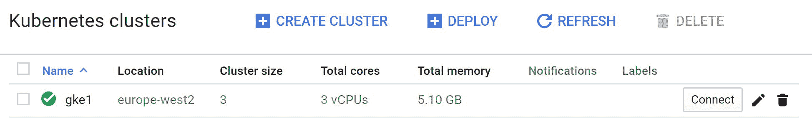
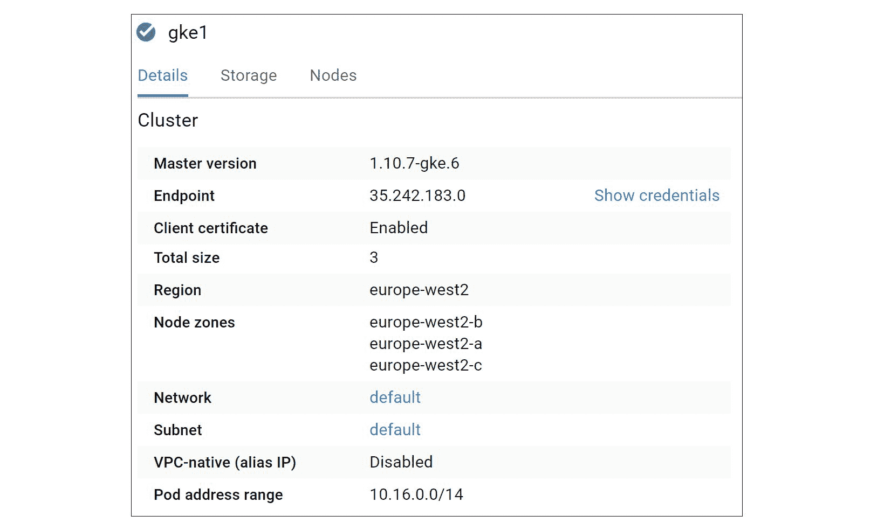

# 第四章：安装 Kubernetes

在本章中，我们将看一下安装 Kubernetes 的几种不同方法。

自 2017 年 7 月我写下这本书的第一版以来，事情发生了很大变化。那时，安装 Kubernetes 很困难。如今，情况好多了！事实上，我们正接近一个可以*要求一个 Kubernetes 集群，并获得一个*的时刻。这在*托管的 Kubernetes 服务*，如 Azure Kubernetes Service（AKS）和 Google Kubernetes Engine（GKE）中尤其如此。

关于*托管的 Kubernetes 服务*，越来越多的人选择使用托管的 Kubernetes 服务，而且像*GKE On-Prem（https://cloud.google.com/gke-on-prem/）*这样的服务，越来越可能会有大量的 Kubernetes 集群通过主要的云服务提供商构建和管理。

在考虑构建自己的 Kubernetes 集群之前，请问自己以下问题：*构建和管理自己的 Kubernetes 集群是你时间和精力的最佳利用吗？*如果答案不是一个坚定的**“是！”**，我强烈建议你考虑使用托管服务。

好的，我们将看一下以下安装类型：

+   使用 Kubernetes 玩（PWK）

+   Docker Desktop：在你的笔记本上进行本地开发集群

+   Minikube：在你的笔记本上进行本地开发集群

+   Google Kubernetes Engine（GKE）：生产级托管集群

+   Kops：在 AWS 上安装你自己的集群

+   Kubeadm：使用 kubeadm 手动安装

在深入之前，有几件事情需要指出...

首先，还有很多其他安装 Kubernetes 的方法。我们在这里涵盖的是我认为最有帮助的方法。

其次，*托管的 Kubernetes 服务*是指控制平面（主节点）由平台管理的服务。例如，AKS、EKS 和 GKE 都是托管的 Kubernetes 服务，其中控制平面的管理由平台负责（你不需要负责）。2018 年看到了托管的 Kubernetes 平台的大幅增长。

是时候看一些安装了。

### 使用 Kubernetes 玩耍

使用 Kubernetes 玩（PWK）是免费的，是一个很好的方法，可以在不必在自己的设备上安装任何软件的情况下获得 Kubernetes 集群。你所需要的只是一台电脑，一个互联网连接，以及一个 Docker Hub 或 GitHub 的账户。在我看来，这是获得 Kubernetes 的最快最简单的方法。

但它也有局限性。首先，它是一个有时间限制的游乐场-您会得到一个持续 4 小时的实验室。它还缺少与云基负载均衡器等外部服务的一些集成。然而，除了限制之外，它是一个很棒的工具，我一直在使用！

让我们看看它是什么样子。

1.  将浏览器指向 http://play-with-k8s.com

1.  使用您的 GitHub 或 Docker Hub 帐户登录并单击“开始”

1.  从浏览器左侧的导航窗格中单击“+添加新实例”

您将在浏览器右侧看到一个终端窗口。这是一个 Kubernetes 节点（`node1`）。

1.  运行一些命令，查看节点上预安装的一些组件。

```
$ docker version
Docker version 18

.09.0-ce...

$ kubectl version --output=

yaml
clientVersion:
...
  major: "1"

  minor: "11"

```

正如输出所显示的，节点已经预安装了 Docker 和`kubectl`（Kubernetes 客户端）。其他工具包括`kubeadm`也已经预安装。

值得注意的是，虽然命令提示符是`$`，但我们实际上是以`root`身份运行的。我们可以通过运行`whoami`或`id`来确认这一点。

1.  使用`kubeadm`命令初始化一个新的集群

当您在第 3 步中添加了一个新实例时，PWK 会给您一个初始化新 Kubernetes 集群的命令的简短列表。其中一个是`kubeadm init...`。以下命令将初始化一个新的集群并配置 API 服务器以侦听正确的 IP 接口。

您可以通过在命令中添加`--kubernetes-version`标志来指定要安装的 Kubernetes 版本。最新版本可以在 https://github.com/kubernetes/kubernetes/releases 上看到。并非所有版本都适用于 PWK。

```
$

 kubeadm

 init

 --

apiserver

-

advertise

-

address

 $

(

hostname

 -

i

)

[

kubeadm

]

 WARNING

:

 kubeadm

 is

 in

 beta

,

 do

 not

 use

 it

 for

 prod

...

[

init

]

 Using

 Kubernetes

 version

:

 v1

.11.1

[

init

]

 Using

 Authorization

 modes

:

 [

Node

 RBAC

]

<

Snip

>

Your

 Kubernetes

 master

 has

 initialized

 successfully

!

<

Snip

>

```

恭喜！您有一个全新的单节点 Kubernetes 集群！我们执行命令的节点（`node1`）被初始化为*master*。

`kubeadm init`的输出会给您一个要运行的命令的简短列表。这些命令将复制 Kubernetes 配置文件并设置权限。您可以忽略这些，因为 PWK 已经为您配置好了。随意在`$HOME/.kube`内部查看。

1.  使用以下`kubectl`命令验证集群。

```
$ kubectl get nodes
NAME      STATUS     AGE       VERSION
node1     NotReady   1m        v1.11.2

```

输出显示了一个单节点 Kubernetes 集群。但是，节点的状态是`NotReady`。这是因为我们还没有配置*Pod 网络*。当您首次登录到 PWK 节点时，您会得到一个配置集群的三个命令的列表。到目前为止，我们只执行了第一个（`kubeadm init...`）。

1.  初始化 Pod 网络（集群网络）。

从首次创建`node1`时屏幕上打印的三个命令列表中复制第二个命令（这将是一个`kubectl apply`命令）。将其粘贴到终端的新行中。在书中，命令可能会跨越多行并插入反斜杠（`\`）。您应该删除页面右边出现的任何反斜杠。

```
$ kubectl apply -n kube-system -f \

 "https://cloud.weave.works/k8s/net?k8s-version=

$(

kubectl version |

 base64 |

 tr\

 -d '\n'

)

"

 serviceaccount "weave-net"

 created
 clusterrole "weave-net"

 created
 clusterrolebinding "weave-net"

 created
 role "weave-net"

 created
 rolebinding "weave-net"

 created
 daemonset "weave-net"

 created

```

1.  再次验证集群，看看`node1`是否已更改为`Ready`。

```
$ kubectl get nodes
NAME      STATUS    AGE       VERSION
node1     Ready     2m        v1.11.2

```

现在*Pod 网络*已经初始化，控制平面为`Ready`，您可以添加一些工作节点了。

1.  从`kubeadm init`的输出中复制`kubeadm join`命令。

当您使用`kubeadm init`初始化新集群时，命令的最终输出列出了一个`kubeadm join`命令，用于添加节点时使用。此命令包括集群加入令牌、API 服务器正在侦听的 IP 套接字以及加入新节点到集群所需的其他位。复制此命令，并准备粘贴到新节点（`node2`）的终端中。

1.  在 PWK 窗口的左侧窗格中点击`+ ADD NEW INSTANCE`按钮。

将会给你一个名为`node2`的新节点。

1.  将`kubeadm join`命令粘贴到`node2`的终端中。

在您的环境中，加入令牌和 IP 地址将是不同的。

```
   $ kubeadm join --token 948f32.79bd6c8e951cf122 10.0.29.3:6443...
   Initializing machine ID from random generator.
   [preflight] Skipping pre-flight checks
   <Snip>
   Node join complete:
   * Certificate signing request sent to master and response received.
   * Kubelet informed of new secure connection details.

```

1.  切换回`node1`并运行另一个`kubectl get nodes`。

```
   $ kubectl get nodes
   NAME      STATUS    AGE       VERSION
   node1     Ready     5m        v1.11.2
   node2     Ready     1m        v1.11.2

```

您的 Kubernetes 集群现在有两个节点 - 一个主节点和一个工作节点。

随意添加更多节点。

恭喜！您现在拥有一个完全可用的 Kubernetes 集群，可以用作测试实验室。

值得指出的是，`node1`被初始化为 Kubernetes 的*master*，而其他节点将作为*nodes*加入集群。PWK 通常在*masters*旁边放置蓝色图标，在*nodes*旁边放置透明图标。这有助于您识别哪个是哪个。

最后，PWK 会话只持续 4 小时，显然不适用于生产环境。

玩得开心！

### Docker Desktop

在我看来，*Docker Desktop*是在 Mac 或 Windows 笔记本电脑上获得本地开发集群的最佳方式。通过简单的几个步骤，您可以获得一个单节点 Kubernetes 集群，可以进行开发和测试。我几乎每天都在使用它。

它通过在笔记本电脑上创建一个虚拟机（VM）并在该虚拟机内启动单节点 Kubernetes 集群来工作。它还配置您的`kubectl`客户端，以便能够与集群通信。最后，您将获得一个简单的 GUI，允许您执行基本操作，如在所有`kubectl`上下文之间切换。

> **注意：** kubectl 上下文是`kubectl`命令使用的一堆设置，以便它知道要向哪个集群发出命令。

1.  将您的网络浏览器指向`www.docker.com`，然后选择`Products` > `Docker Desktop`。

1.  点击下载按钮，选择 Mac 或 Windows 版本。

您可能需要登录到 Docker Store。账户是免费的，产品也是免费的。

1.  打开安装程序并按照简单的安装说明进行操作。

安装程序完成后，您将在 Windows 任务栏上或 Mac 的菜单栏上看到一个鲸鱼图标。

1.  点击鲸鱼图标（您可能需要右键单击），转到`Settings`并从`Kubernetes`选项卡中启用 Kubernetes。

您可以打开一个终端窗口并查看您的集群：

```
$ kubectl get nodes
NAME                 STATUS   ROLES    AGE   VERSION
docker-for-desktop   Ready    master   68d   v1.10.3

```

恭喜，您现在拥有一个本地开发集群！

### Minikube

Minikube 是另一个选项，如果您是开发人员，并且需要在笔记本电脑上的本地 Kubernetes 开发环境。与*Docker Desktop*一样，您可以在本地运行一个单节点 Kubernetes 集群进行开发。这不是用于生产！

> **注意：** 我对 Minikube 的结果参差不齐。当它工作时很棒，但有时很难让它工作。因此，我更喜欢 Docker Desktop for Mac 和 Windows。

您可以在 Mac、Windows 和 Linux 上获取 Minikube。我们将快速查看 Mac 和 Windows，因为这是大多数人在笔记本电脑上运行的系统。

> **注意：** Minikube 需要在系统的 BIOS 中启用虚拟化扩展。

#### 在 Mac 上安装 Minikube

在安装 Minikube 之前，最好先安装`kubectl`（Kubernetes 客户端）。稍后您将使用它来向 Minikube 集群发出命令。

1.  使用 Brew 安装`kubectl`。

```
$ brew install kubernetes-cli
Updating Homebrew...

```

这将把 kubectl 二进制文件放在`/usr/local/bin`中，并使其可执行。

1.  验证安装是否成功。

```
$ kubectl version --client
Client Version: version.Info{

Major:"1"

, Minor:"12"

...

```

现在我们已经安装了`kubectl`客户端，让我们安装 Minikube。

1.  使用 Brew 安装 Minikube。

```
$ brew cask install minikube

==

> Downloading https://storage.googlapis.com/minikube...

```

如果提示，请提供您的密码。

1.  使用 Brew 为 Mac 安装**hyperkit**轻量级超级管理程序。

其他的 Hypervisor 选项可用 - VirtualBox 和 VMware Fusion - 但我们只展示 hyperkit。

```
$ brew install hyperkit

==

> Downloading https://homebrew.bintray...

```

1.  使用以下命令启动 Minikube。

```
$ minikube start --vm-driver=

hyperkit
Starting local

 Kubernetes cluster...
Starting VM...

```

`minikube start`是启动 Minikube 的最简单方法。指定`--vm-driver=hyperkit`标志将强制其使用**hyperkit**超级管理程序，而不是 VirtualBox。

您现在在 Mac 上已经有一个 Minikube 实例在运行！

#### 在 Windows 10 上安装 Minikube

在本节中，我们将向您展示如何在 Windows 上使用 Hyper-V 作为虚拟机管理器使用 Minikube。还有其他选项，但我们在这里不展示它们。我们还将使用以管理员权限打开的 PowerShell 终端。

在安装 Minikube 之前，让我们安装`kubectl`客户端。有几种方法可以做到这一点：

1.  使用 Chocolaty 软件包管理器

1.  通过您的网络浏览器下载

如果您使用 Chocolaty，可以使用以下命令安装它。

```
> choco install kubernetes-cli

```

如果您不使用 Chocolaty，可以使用您的网络浏览器安装`kubectl`。

将您的网络浏览器指向 https://kubernetes.io/docs/tasks/tools/install-kubectl/，并单击`使用 curl 安装 kubectl 二进制文件`选项。单击`Windows`选项卡。将 URL 复制并粘贴到您的网络浏览器中 - 这将下载`kubectl`二进制文件。确保只复制和粘贴 URL，而不是完整的`curl`命令。

下载完成后，将`kubectl.exe`文件复制到系统的`%PATH%`文件夹中。

使用`kubectl version`命令验证安装。

```
> kubectl version --client=true --output=yaml
clientVersion:
  ...
  gitVersion: v1.12.0
  ...
  major: "1"
  minor: "12"
  platform: windows/amd64

```

现在您有了`kubectl`，可以继续安装 Windows 的 Minikube。

1.  在 GitHub 上的 Minikube 版本页面上打开一个网络浏览器

+   https://github.com/kubernetes/minikube/releases

1.  从 Minikube 的最新版本下方单击`minikube-installer.exe`。这将下载 64 位 Windows 安装程序。

1.  启动安装程序，并通过向导接受默认选项。

1.  确保 Hyper-V 有一个外部 vSwitch。

打开 Hyper-V 管理器（`virtmgmt.msc`），转到`虚拟交换机管理器...`。如果没有配置以下两个选项的虚拟交换机，请创建一个新的：

+   `连接类型=外部网络`

+   `允许管理操作系统共享此网络适配器`

在本节的其余部分，我们将假设您已经配置了一个名为`external`的 Hyper-V 外部 vSwitch。如果您的名称不同，您将需要在以下命令中替换您的名称。

1.  使用以下命令验证 Minikube 版本。

```
> minikube version
minikube version: v0.30.0

```

1.  使用以下命令启动运行 Kubernetes 版本 1.12.1 的本地 Minikube 实例。

该命令假定一个名为`external`的 Hyper-V vSwitch，并使用反引号“`”使命令跨多行以提高可读性。

第一次下载和启动集群可能需要一段时间。

```
> minikube start `
--vm-driver=hyperv `
--hyperv-virtual-switch="external" `
--kubernetes-version="v1.12.1" `
--memory=4096

  Starting local Kubernetes v1.12.1 cluster...
  Starting VM...
  139.09 MB / 139.09 MB [================] 100.00% 0s
  <Snip>
  Starting cluster components...
  Kubectl is now configured to use the cluster.

```

1.  通过检查 Kubernetes 主版本的版本来验证安装。

```
> kubectl version -o yaml
clientVersion:
<Snip>
serverVersion:
  buildDate: 2018-10-05T16:36:14Z
  compiler: gc
  gitCommit: 4ed3216f3ec431b140b1d899130a69fc671678f4
  gitTreeState: clean
  gitVersion: v1.12.1
  goVersion: go1.10.4
  major: "1"
  minor: "12"
  platform: linux/amd64

```

如果目标机器积极拒绝网络连接，并显示`无法连接到服务器：拨号 tcp...`错误，这很可能是与网络相关的错误。确保您的 vSwitch 已正确配置，并且您已使用`--hyperv-virtual-switch`标志正确指定了它。`kubectl`通过端口 8443 与`minikube` Hyper-V VM 内的 Kubernetes 进行通信。

恭喜！您已在 Windows 10 PC 上成功运行了一个完全可用的 Minikube 集群。

现在，您可以在命令行上键入`minikube`以查看 minikube 子命令的完整列表。一个值得尝试的好命令可能是`minikube ip`，它将为您提供 Minikube 集群正在运行的 IP 地址。

#### 使用`kubectl`验证 Minikube 安装

`minikube start`操作配置了一个*kubectl 上下文*，这样您就可以在新的 Minikube 环境中使用`kubectl`。通过从与您运行`minikube start`相同的 shell 中运行以下`kubectl`命令来测试这一点。

```
   $ kubectl config current-context
   minikube

```

太棒了，您的 kubectl 上下文已设置为 Minikube。这意味着`kubectl`命令将被发送到 Minikube 集群。

值得指出的是，`kubectl`可以通过设置不同的上下文来配置为与任何 Kubernetes 集群通信-您只需要在不同的上下文之间切换以向不同的集群发送命令。

使用`kubectl get nodes`命令列出集群中的节点。

```
   $ kubectl get nodes
   NAME       STATUS   AGE   VERSION
   minikube   Ready    1m    v1.12.1

```

这是一个准备好使用的单节点 Minikube 集群！

您可以使用`minikube ip`命令获取集群的 IP 地址。

###### 删除 Minikube 集群

我们使用单个`minikube start`命令启动了 Minikube 集群。我们可以使用`minikube stop`命令停止它。

```
   $ minikube stop
   Stopping local Kubernetes cluster...
   Machine stopped

```

停止 Minikube 会保留所有磁盘上的配置。这样可以轻松地重新启动它，并从您离开的地方继续进行。

完全清除它-不留痕迹-使用`minikube delete`命令。

```
   $ minikube delete
   Deleting local Kubernetes cluster...
   Machine deleted

```

###### 在 Minikube 内运行特定版本的 Kubernetes

Minikube 允许您使用`--kubernetes-version`标志指定要运行的 Kubernetes 版本。如果您需要匹配生产环境中使用的 Kubernetes 版本，这将非常有用。

以下命令将启动一个运行 Kubernetes 版本 1.10.7 的 Minikube 集群。

```
   $ minikube start \
     --kubernetes-version=v1.10.7

     Starting local Kubernetes cluster...
     Starting VM...

```

运行另一个`kubectl get nodes`命令来验证版本。

```
   $ kubectl get nodes
   NAME       STATUS   AGE   VERSION
   minikube   Ready    1m    v1.10.7

```

中了！

这就是 Minikube！在 Mac 或 PC 上快速启动一个简单的 Kubernetes 集群的绝佳方式。但这不适用于生产！

### Google Kubernetes Engine（GKE）

Google Kubernetes Engine 是在 Google Cloud（GCP）上运行的*托管 Kubernetes*服务。像大多数*托管 Kubernetes*服务一样，它提供：

+   快速轻松地获得生产级别的 Kubernetes 集群

+   托管的控制平面（您不管理*主节点*）

+   逐项计费

> **警告：**GKE 和其他托管的 Kubernetes 服务并非免费。一些服务可能提供*免费层*或*免费信用额*的初始金额。但是，一般来说，您必须付费才能使用它们。

#### 配置 GKE

要使用 GKE，您需要在 Google Cloud 上拥有一个已配置计费的账户和一个空白项目。这些都很容易设置，所以我们不会在这里花时间解释它们 - 在本节的其余部分，我们将假设您已经拥有这些。

以下步骤将指导您通过 Web 浏览器配置 GKE。一些细节可能会在将来发生变化，但整体流程将保持不变。

1.  在您的 Google Cloud Platform（GCP）项目的控制台中，打开左侧的导航窗格，然后选择`Kubernetes Engine` > `Clusters`。您可能需要点击控制台左上角的三个水平条，以使导航窗格可见。

1.  点击`创建集群`按钮。

这将启动创建新 Kubernetes 集群的向导。

1.  向导目前提供了一些模板选项。这可能会在将来改变，但整体流程将保持不变。选择一个模板（`Your first cluster` 或 `Standard cluster` 可能是不错的选择）。

1.  为集群命名并添加描述。

1.  选择您想要的`区域`或`区域内`集群。区域是更新的，可能更具弹性 - 您的主节点和节点将分布在多个区域，但仍可通过单个高可用端点访问。

1.  选择您的集群的区域或区域内。

1.  选择`集群版本`。这是将在您的主节点和节点上运行的 Kubernetes 版本。您只能选择下拉列表中可用的版本。选择一个最新版本。

1.  您可以在`节点池`部分选择工作节点的数量和大小。这允许您选择工作节点的大小和配置，以及数量。更大更快的节点会产生更高的成本。

如果您正在构建一个区域集群，您指定的数字将是**每个区域中的节点数**，而不是总数。

1.  将所有其他选项保持默认值，然后点击`创建`。

您还可以单击`更多`链接，查看您可以自定义的其他选项的长列表。值得一看，但我们不会在本书中讨论它们。

您的集群现在将被创建！

#### 探索 GKE

现在您已经有了一个集群，是时候快速查看一下了。

确保您已登录到 GCP 控制台，并在`Kubernetes Engine`下查看`Clusters`。

集群页面显示了您在项目中拥有的 Kubernetes 集群的高级概览。图 3.1 显示了一个名为`gke1`的单个 3 节点集群。



图 3.1

单击集群名称以查看更多详细信息。图 3.2 显示了一些您可以查看的详细信息的屏幕截图。



图 3.2

单击 Web UI 顶部的`> CONNECT`图标（图 3.2 中未显示）会给您一个命令，您可以在笔记本电脑上运行，以配置本地的`gcloud`和`kubectl`工具与您的集群通信。将此命令复制到剪贴板。

为了使以下步骤生效，您需要从`https://cloud.google.com/sdk/`下载并安装 Google Cloud SDK。这将下载几个实用程序，包括`gcloud`和`kubectl`命令行实用程序。

打开终端并将长的`gcloud`命令粘贴到其中。这将配置您的`kubectl`客户端以与您的新 GKE 集群通信。

运行`kubectl get nodes`命令以列出集群中的节点。

```
   $ kubectl get nodes
   NAME             STATUS     AGE    VERSION
   gke-cluster...   Ready      5m     v1.10.7-gke.6
   gke-cluster...   Ready      6m     v1.10.7-gke.6
   gke-cluster...   Ready      6m     v1.10.7-gke.6

```

恭喜！您知道如何使用 Google Kubernetes Engine（GKE）创建一个生产级别的 Kubernetes 集群。您还知道如何检查它并连接到它。

> **警告！**确保在使用完毕后立即删除您的 GKE 集群。即使不使用，GKE 和其他托管的 K8s 平台可能会产生费用。

### 使用`kops`在 AWS 上安装 Kubernetes

`kops`是 Kubernetes Operations 的缩写。它是一个*高度主观*的集群引导工具，使得在受支持的平台上安装 Kubernetes*相对简单*。

通过*高度主观*，我们的意思是在安装过程中您的自定义程度受到限制。如果您需要一个高度定制的集群，您应该看看`kubeadm`。

通过“相对简单”，我们的意思是比起自己编译二进制文件来说更容易:-D 如果你对这些领域没有经验，仍然有一些部分可能会很复杂。例如，当涉及到 DNS 配置时，`kops`非常主观 - 如果 DNS 配置错误，你将会陷入困境！幸运的是，它支持不使用 DNS 的基于八卦的安装。这适用于开发用例，不需要额外的 DNS 配置。

Kops 目前支持在 AWS 和 GCE 上引导集群。其他平台可能在将来得到支持。

在撰写本文时，`kops`命令行工具仅适用于 Mac 和 Linux。

您需要以下所有内容才能使用`kops`引导集群：

+   一个 AWS 账户和对 AWS 基础知识的良好理解

+   `kubectl`

+   适用于您的操作系统（Mac 或 Linux）的最新版本的`kops`二进制文件

+   `awscli`工具

+   具有以下权限的 AWS 账户凭据：

+   `AmazonEC2FullAccess`

+   `AmazonRoute53FullAccess`

+   `AmazonS3FullAccess`

+   `IAMFullAccess`

+   `AmazonVPCFullAccess`

以下示例来自 Linux 机器，但在 Mac 上（可能在将来也适用于 Windows）也是一样的。

以下示例展示了两种安装选项：

1.  DNS

1.  八卦

基于八卦的安装是最简单的，适用于私有 DNS 域不可用的情况。它也非常适合 AWS 位置，比如中国，那里没有 Route53。

DNS 安装更加复杂，需要顶级域和一个委托给 AWS Route53 的子域。本章中的 DNS 示例使用一个名为`tf1.com`的域，该域由 GoDaddy 等第三方提供商托管。它有一个名为`k8s`的子域，该子域被委托给 Amazon Route53。如果您要跟随 DNS 示例，您将需要自己的工作域。

#### 下载并安装`kubectl`

对于 Mac，下载和安装很简单，使用`brew install kubernetes-cli`。

以下步骤适用于 Linux 机器。

1.  使用以下命令将最新的`kubectl`二进制文件下载到您的主目录。

```
$ curl -LO https://storage.googleapis.com/kubernetes-release/release/$(

curl -s \

https://storage.googleapis.com/kubernetes-release/release/stable.txt)

/bin/linux\

/amd64/kubectl

```

该命令是一个单一的命令，但相当长，在书中会换行多次。这个过程可能会在打印页面的边缘引入反斜杠，这些反斜杠不是命令的一部分，需要被移除。

1.  使下载的二进制文件可执行，并将其移动到`PATH`中的目录。

```
$ chmod +x ./kubectl
$ mv ./kubectl /usr/local/bin/kubectl

```

运行`kubectl`命令，确保它已安装并正常工作。

#### 下载并安装`kops`。

对于 Mac，您只需要运行`brew install kops`。

对于 Linux，请使用以下过程。

1.  使用以下`curl`命令下载`kops`二进制文件。

命令应该在一行上发出，并且不应该有反斜杠`\`。它还嵌入了 URL 中`kops`工具的版本，您可以更改这个版本。请参阅 https://github.com/kubernetes/kops/releases 获取最新版本。

```
$ curl -LO https://github.com/kubernetes/kops/releases/download/1.10.0/kops-lin\

ux-amd64

```

1.  使下载的二进制文件可执行，并将其移动到系统`PATH`中的目录。

```
$ chmod +x kops-linux-amd64
$ mv kops-linux-amd64 /usr/local/bin/kops

```

运行`kops version`命令验证安装。

```
   $ kops version
   Version 1.10.0

```

#### 安装和配置 AWS CLI。

您可以使用`brew install awscli`在 Mac OS 上安装 AWS CLI 工具。

以下示例显示如何从 Ubuntu 18.04 使用的默认应用程序仓库安装 AWS CLI。如果您使用不同的 Linux 发行版，安装方法显然会有所不同。

1.  运行以下命令安装 AWS CLI。

```
$ sudo apt-get install awscli -y

```

1.  运行`aws configure`命令来配置 AWS CLI 的实例。

您将需要一个具有*AmazonEC2FullAccess*、*AmazonRoute53FullAccess*、*AmazonS3FullAccess*、*IAMFullAccess*和*AmazonVPCFullAccess*权限的 AWS IAM 帐户的凭据来完成此步骤。

```
$ aws configure
AWS Access Key ID [

None]

: **************
AWS Secret Access Key [

None]

: **************
Default region name [

None]

: enter-your-region-here
Default output format [

None]

:

```

1.  为 kops 创建一个新的 S3 存储桶，用于存储配置和状态信息。

Kops 要求集群名称必须是有效的 DNS 名称。在这些示例中，我们将使用名称`cluster1.k8s.tf1.com`。您将需要在您的环境中使用不同的名称。让我们快速分解一下它是如何工作的。该示例假设我拥有一个名为`tf1.com`的域，并且我已经将一个名为`k8s`的子域委派给了 AWS Route53。在该子域中，我可以创建任何我喜欢的名称的集群。在该示例中，我们将创建一个名为`cluster1`的集群。这将使集群的完全限定域名为`cluster1.k8s.tf1.com`。我已经在父域`tf1.com`中创建了`NS`记录，指向了 Route53 中托管的`k8s`域。`tf1.com`是虚构的，仅在这些示例中用于保持命令行参数的简洁。

如果您计划创建一个基于 gossip 的集群，您需要使用以`.k8s.local`结尾的集群名称。

```
$ aws s3 mb s3://cluster1.k8s.tf1.com
make_bucket: cluster1.k8s.tf1.com

```

1.  列出您的 S3 存储桶，并使用`grep`查找您创建的存储桶的名称。这将证明存储桶已成功创建。

```
$ aws s3 ls |

 grep k8s
2018

-10-10 13

:09:11 cluster1.k8s.tf1.com

```

1.  告诉**kops**在哪里找到它的配置和状态 - 这将是在上一步中创建的 S3 存储桶。

```
$ export

 KOPS_STATE_STORE

=

s3://cluster1.k8s.tf1.com

```

1.  使用以下`kops create cluster`命令之一创建新集群。

第一个命令使用 gossip 而不是 DNS 创建集群。要使用 gossip，集群名称**必须**以`.k8s.local`结尾。

第二个命令使用 DNS 创建集群，并假定之前已经解释过的工作 DNS 配置。

您需要一份 AWS 公钥的副本才能使命令生效。在示例中，密钥名为`np-k8s.pub`，位于当前工作目录中。

```
$ kops create cluster \

  --cloud-aws \

  --zones=

eu-west-1b \

  --name=

mycluster.k8s.local \

  --ssh-public-key ~/np-k8s.pub \

  --yes

```

```
$ kops create cluster \

  --cloud=

aws \

  --zones=

eu-west-1b \

  --dns-zone=

k8s.tf1.com \

  --name cluster1.k8s.tf1.com  \

  --ssh-public-key ~/np-k8s.pub \

  --yes

```

命令分解如下。`kops create cluster`告诉**kops**创建一个新的集群。`--cloud=aws`告诉它使用 AWS 提供程序在 AWS 中创建集群。`--zones=eu-west-1b`告诉**kops**在 eu-west-1b 区创建集群。如果使用 DNS 创建集群，`--dns-zone`标志告诉它使用委托区域。我们使用`--name`标志命名集群-如果使用 gossip 创建，请记住以“.k8s.local”结尾。`--ssh-public-key`告诉它使用哪个密钥。最后，`--yes`标志告诉**kops**继续部署集群。如果省略`--yes`标志，将创建集群配置，但不会部署。

集群部署可能需要几分钟时间。这是因为**kops**正在创建构建集群所需的 AWS 资源。这包括诸如 VPC、EC2 实例、启动配置、自动缩放组、安全组等。在构建了 AWS 基础设施之后，它还必须构建 Kubernetes 集群。

1.  部署集群后，您可以使用`kops validate cluster`命令对其进行验证。集群完全启动可能需要一段时间，所以请耐心等待。

```
$ kops validate cluster
Using cluster from kubectl context: cluster1.k8s.tf1.com

INSTANCE GROUPS
NAME      ROLE     MACHINETYPE  MIN  MAX  SUBNETS
master..  Master   m3.medium    1

    1

    eu-west-1b
nodes     Node     t2.medium    2

    2

    eu-west-1b

NODE STATUS
NAME             ROLE      READY
ip-172-20-38..   node      True
ip-172-20-58..   master    True
ip-172-20-59..   node      True

Your cluster cluster1.k8s.tf1.com is ready

```

恭喜！您现在知道如何使用`kops`工具在 AWS 中创建 Kubernetes 集群。

现在您的集群已经运行起来，您可以对其发出`kubectl`命令。也许值得在 AWS 控制台中查看一下`kops`创建的一些资源。

> **警告！**确保在使用完毕后删除您的集群。在云平台上运行的集群可能会产生费用，即使它们没有被积极使用。

#### 使用`kops`在 AWS 中删除 Kubernetes 集群

您可以使用`kops delete cluster`命令来删除您刚刚创建的集群。这也将删除为支持集群创建的所有 AWS 资源。

以下命令将删除前面步骤中创建的集群。

```
   $ kops delete cluster --name=cluster1.k8s.tf1.com --yes

```

### 使用`kubeadm`安装 Kubernetes

在这一部分，我们将看到如何使用`kubeadm`安装 Kubernetes。

`kubeadm`最好的一点是，您可以使用它在几乎任何地方安装 Kubernetes - 笔记本电脑、数据中心的裸机，甚至在公共云上。它不仅仅是安装 Kubernetes - 您还可以升级、管理和查询您的集群。人们经常说`kubeadm`是集群的`kubectl` - 一个用于构建**和**管理 Kubernetes 集群的绝佳工具。无论如何，`kubeadm`是一个核心的 Kubernetes 项目，并且有着光明的未来。

本节中的示例基于 Ubuntu 18.04。如果您使用不同的 Linux 发行版，则先决条件部分中的一些命令将有所不同。但是，我们展示的过程可以用于在笔记本电脑、数据中心甚至云中安装 Kubernetes。

我们将演示一个简单的示例，使用三台配置为一个主节点和两个节点的 Ubuntu 18.04 机器，如图 3.3 所示。


图 3.3

高级计划将如下：

1.  安装先决条件

1.  使用**node1**初始化一个新的集群作为主节点

1.  创建 Pod 网络

1.  将**node2**和**node3**添加为工作节点。

所有三个节点都将获得以下内容：

+   Docker

+   `kubeadm`

+   kubelet

+   `kubectl`

**Docker**是容器运行时。还存在其他运行时，但我们将使用 Docker。`kubeadm`是我们将用来构建集群的工具，**kubelet**是 Kubernetes 节点代理，`kubectl`是 Kubernetes 命令行实用程序。

#### 先决条件

以下命令特定于 Ubuntu 18.04，并且需要在**所有三个节点**上运行。它们设置了一些东西，以便我们可以从正确的存储库安装正确的软件包。其他 Linux 版本也存在等效的命令和软件包。

使用以下两个命令获取稍后步骤中将需要的一些软件包的最新版本。

```
$ sudo apt-get update
<Snip>

$ sudo apt-get install -y \

  apt-transport-https \

  ca-certificates \

  curl \

  software-properties-common

```

下载并安装以下两个存储库密钥。其中一个存储库包含 Kubernetes 工具，另一个存储库包含 Docker。我们将在稍后的步骤中需要这些密钥。

```
$ curl -s \

 https://packages.cloud.google.com/apt/doc/apt-key.gpg |

 sudo apt-key add -
OK

$ curl -fsSL \

 https://download.docker.com/linux/ubuntu/gpg |

 sudo apt-key add -
OK

```

创建或编辑以下文件，并添加安装 Kubernetes 软件包所需的存储库。

```
$ sudo vim /etc/apt/sources.list.d/kubernetes.list

```

添加以下行。

```
deb

 https://apt.kubernetes.io/

 kubernetes-xenial

 main

```

下一步是安装`kubeadm`，`kubectl`和`kubelet`。使用以下两个命令。

```
$ sudo apt-get update
<Snip>

$ sudo apt-get install -y kubelet kubeadm kubectl
<Snip>

```

如果再次运行`apt-get install`命令，您可以看到已安装的版本。

现在让我们安装 Docker...

添加所需的指纹。

```
$ sudo apt-key fingerprint 0EBFCD88
pub   rsa4096 2017

-02-22 [

SCEA]

      9DC8 5822

 9FC7 DD38 854A  E2D8 8D81 803C 0EBF CD88
uid           [

 unknown]

 Docker Release (

CE deb)

 <docker@docker.com>
sub   rsa4096 2017

-02-22 [

S]

```

现在添加*stable* Docker 仓库。这是一个单一的命令，使用反斜杠将其分布在多行上。

```
$ sudo add-apt-repository \

   "deb [arch=amd64] https://download.docker.com/linux/ubuntu \

$(

lsb_release -cs)

 \

 stable"

```

安装 Docker。

```
$ sudo apt-get update
<Snip>

$ sudo apt-get install docker-ce
<Snip>

```

这些是先决条件。

#### 初始化一个新的集群

使用`kubeadm init`初始化一个新的 Kubernetes 集群就像输入`kubeadm init`一样简单。

```
   $ sudo kubeadm init
   <SNIP>
   Your Kubernetes master has initialized successfully!

   To start using your cluster, you need to run (as a regular user):

   mkdir -p $HOME/.kube
   sudo cp -i /etc/kubernetes/admin.conf $HOME/.kube/config
   sudo chown $(id -u):$(id -g) $HOME/.kube/config

   <SNIP>
   You can join any number of machines by running the following...

   kubeadm join --token b90685.bd53aca93b758efc 172.31.32.74:6443

```

该命令拉取所有必需的镜像并构建集群。当过程完成时，它会输出一些简短的命令，让您可以作为普通用户管理集群。它还会给出`kubeadm join`命令，让您可以将其他节点添加到集群中。

恭喜！这是一个全新的单主 Kubernetes 集群。

通过运行`kubeadm init`输出中列出的命令来完成该过程。

```
   $ mkdir -p $HOME/.kube
   $ sudo cp -i /etc/kubernetes/admin.conf $HOME/.kube/config
   $ sudo chown $(id -u):$(id -g) $HOME/.kube/config

```

这些命令可能会有所不同，甚至在将来可能不再需要。但是，它们会将 Kubernetes 配置文件从`/etc/kubernetes`复制到您的主目录，并将所有权更改为您。

使用`kubectl`验证集群是否初始化成功。

```
   $ kubectl get nodes
   NAME    STATUS     ROLES    AGE     VERSION
   node1   NotReady   master   2m43s   v1.12.1

```

运行以下`kubectl`命令查找集群`STATUS`显示为`NotReady`的原因。

```
   $ kubectl get pods --all-namespaces
   NAMESPACE     NAME           READY   STATUS              RESTARTS   AGE
   kube-system   coredns-...vt  0/1     ContainerCreating   0          8m33s
   kube-system   coredns-...xw  0/1     ContainerCreating   0          8m33s
   kube-system   etcd...        1/1     Running             0          7m46s
   kube-system   kube-api...    1/1     Running             0          7m36s
   ...

```

该命令显示所有命名空间中的所有 Pods - 这包括系统命名空间（kube-system）中的系统 Pods。

正如我们所看到的，没有一个`coredns` Pods 在运行。这阻止了集群进入`Ready`状态，这是因为我们还没有创建 Pod 网络。

创建 Pod 网络。以下示例创建了一个由 Weaveworks 提供的多主机覆盖网络。还有其他选项可用，您不必选择这里显示的示例。

该命令可能会在书中跨越多行。在打印页面的边缘处的任何反斜杠（`\`）都应该被移除。

```
   $ kubectl apply -n kube-system -f \
   "https://cloud.weave.works/k8s/net?k8s-version=$(kubectl version | base64 | \
tr -d '\n')"

```

检查主节点的状态是否从`NotReady`变为`Ready`。

```
$ kubectl get nodes
NAME    STATUS   ROLES    AGE     VERSION
node1   Ready    master   3m51s   v1.12.1

```

好了，集群已经准备好了，DNS Pods 现在将会运行。

现在集群已经运行起来了，是时候添加一些节点了。

添加工作节点需要集群的加入令牌。您可能还记得，这是在集群首次初始化时作为输出的一部分提供的。滚动回到那个输出，将`kubeadm join`命令复制到剪贴板上，然后在**node2**和**node3**上运行它。

> **注意：**以下操作必须在**node2**和**node3**上执行，并且您必须已经在这些节点上安装了先决条件（Docker、kubeadm、kubectl 和 kubelet）。

```
   node2$ kubeadm join 172.31.32.74:6443 --token b90...
   <SNIP>
   Node join complete:
   * Certificate signing request sent to master and response received
   * Kubelet informed of new secure connection details.

```

在**node3**上重复该命令。

确保两个节点都成功注册，通过在主节点上再次运行 `kubectl get nodes` 来检查。

```
   $ kubectl get nodes
   NAME    STATUS   ROLES    AGE   VERSION
   node1   Ready    master   10m   v1.12.1
   node2   Ready    master   55s   v1.12.1
   node3   Ready    <none>   34s   v1.12.1

```

恭喜！您已经使用 `kubeadm` 手动构建了一个由 3 个节点组成的集群。但请记住，它只运行一个单一的主节点，没有 H/A。

随意使用 `kubeadm` 在集群中探索。您还应该调查 `kubeadm` 安装具有 H/A 管理器的集群的方法。

### 章节总结

在本章中，我们学习了如何在几种不同的平台上以几种不同的方式安装 Kubernetes。

我们看到了在 Play with Kubernetes (PWK) 上设置 Kubernetes 集群是多么快速简单。我们可以在没有在笔记本电脑或自己的云中安装任何东西的情况下获得 4 小时的游乐场。

我们在笔记本电脑上为开发人员提供了出色的开发体验，安装了 Docker Desktop 和 Minikube。

我们学习了如何在谷歌云中使用 Google Kubernetes Engine (GKE) 快速创建托管的 Kubernetes 集群。

然后我们看了如何使用 `kops` 工具在 AWS 上使用 AWS 提供程序快速创建集群。

我们完成了本章，看到了如何使用 `kubeadm` 工具执行手动安装。

我们可以在其他方式和地方安装 Kubernetes。但本章已经足够长了，我已经拔了太多头发了 :-D
