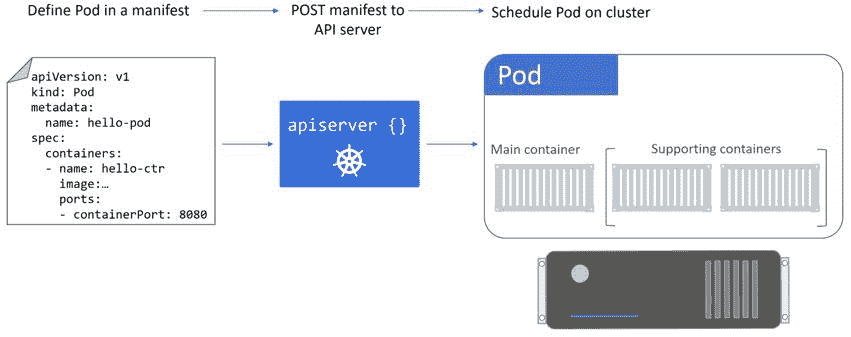

## 4：使用 Pods

我们将把本章分为两个主要部分：

+   理论

+   动手

让我们继续理论。

### Pod 理论

在虚拟化世界中，调度的原子单位是虚拟机（VM）。这意味着在虚拟化世界中**部署应用程序**意味着在 VM 上调度它们。

在 Docker 世界中，原子单位是容器。这意味着在 Docker 上**部署应用程序**意味着将它们部署在容器内。

在 Kubernetes 世界中，原子单位是*Pod*。因此，在 Kubernetes 上**部署应用程序**意味着将它们作为 Pods 部署。


图 4.1

确保将这一点记在脑海中并标记为重要 - 虚拟化使用 VM，Docker 使用容器，**Kubernetes 使用 Pods！**

由于 Pods 是 Kubernetes 集群上部署的基本单位，我们必须了解它们是如何工作的。

> **注意：**在本章中我们将大量讨论 Pods。然而，重要的是要记住 Pods 只是**部署应用程序**的一种工具。

#### Pods vs 容器

在高层次上，Pods 位于容器和 VM 之间。它们比容器大，但比 VM 小得多。

深入挖掘一下，Pod 是一个或多个容器的共享执行环境。往往情况下，一个 Pod 只有一个容器。但多容器 Pod 绝对是存在的，它们非常适合协同调度紧密耦合的工作负载。例如，共享资源并且如果它们被调度到集群中的不同节点上将无法正常工作的两个容器。多容器 Pod 越来越常见的另一个用例是日志记录和服务网格。

#### Pods：典型的例子

我们通常在比较单容器和多容器 Pods 时使用的例子是一个具有文件同步器的 Web 服务器。

在这个例子中，我们有两个明确的*关注点*：

1.  提供网页

1.  确保内容是最新的

> **注意：**将*关注点*视为需求/任务。在微服务架构中，我们经常将关注点称为*服务*。在前面的列表中，我们可能将*网页关注点*称为*网页服务*。每个*服务*处理一个*关注点*。

一般来说，微服务设计模式要求我们应该分离关注点。这意味着一个容器只处理一个*关注点*。假设前面的例子，一个容器用于 web 服务，另一个容器用于文件同步服务。

这种方法有很多优势。

我们不是构建单体应用程序，其中单个 Pod 运行 Web 服务*和*文件同步服务，而是构建两个微服务-每个微服务都有自己独特的关注点。这意味着我们可以有不同的团队负责这两个服务。我们可以独立扩展每个服务。我们也可以独立更新它们。如果运行文件同步服务的 Pod 失败，Web 服务可以保持运行（尽管可能会提供过时内容）。

然而，有时在单个 Pod 中共同调度多个容器是有意义的。使用情况包括；需要共享内存或共享卷的两个容器。见图 4.2。


图 4.2

在这种情况下，我们没有分离关注点-一个单独的 Pod 正在执行两项任务。然而，实现共享卷的最简单方法是将将共享卷的容器调度到同一节点上。通过在同一个 Pod 中运行 Web 服务容器和文件同步容器，我们确保它们部署到同一节点上。我们还为它们提供了一个共享的操作环境，两者都可以访问相同的共享内存和共享卷等。稍后会详细介绍所有这些。

总之，一般规则是通过设计 Pod 和容器来分离关注点，每个 Pod 执行单个任务，然后为每个 Pod 调度单个容器。然而，有些情况下打破这个规则是有优势的。

#### 我们如何部署 Pods

要将 Pod 部署到 Kubernetes 集群中，我们在*清单文件*中定义它，并将该清单文件`POST`到 API 服务器。控制平面检查它，将其记录在集群存储中，并调度器将其部署到具有足够可用资源的健康节点上。无论 Pod 运行多少个容器，这个过程都是相同的。



图 4.3

让我们深入一点…

#### Pod 的解剖

在最高级别上，Pod 是一个或多个容器的共享执行环境。“共享执行环境”意味着 Pod 具有一组资源，这些资源被 Pod 内的每个容器共享。这些资源包括；IP 地址，端口，主机名，套接字，内存，卷等等…

如果您将 Docker 用作 Kubernetes 的容器运行时，Pod 实际上是一种称为**暂停容器**的特殊容器。没错，Pod 只是一个特殊容器的花哨名称！

这意味着在 Pod 内运行的容器实际上是在容器内运行的容器！有关更多信息，请观看克里斯托弗·诺兰执导、莱昂纳多·迪卡普里奥主演的《盗梦空间》:-D

但是，Pod（暂停容器）只是容器内运行的容器将继承和共享的一组系统资源。这些“系统资源”是“内核命名空间”，包括：

+   网络命名空间：IP 地址、端口范围、路由表…

+   UTS 命名空间：主机名

+   IPC 命名空间：Unix 域套接字…

正如我们刚才提到的，这意味着 Pod 中的所有容器共享主机名、IP 地址、内存地址空间和卷。

让我们更仔细地看看这如何影响网络。

每个 Pod 都创建自己的网络命名空间 - 单个 IP 地址、单个端口范围和单个路由表。即使 Pod 是多容器 Pod，每个 Pod 中的容器也共享 Pod 的 IP、端口范围和路由表。

图 4.4 显示了两个具有自己 IP 的 Pod。即使其中一个 Pod 托管了两个容器，它仍然只有一个 IP。


图 4.4

在图 4.4 的示例中，我们可以使用 Pod IP 与容器的个别端口号（80 和 5000）来访问 Pod 1 中的各个容器。

最后一次（如果感觉我反复强调了，我很抱歉）… Pod 中的每个容器都共享**Pod**的整个网络命名空间 - IP、`localhost`适配器、端口范围、路由表等。

但正如我们所说，它不仅仅是网络。Pod 中的所有容器都可以访问相同的卷、相同的内存、相同的 IPC 套接字等。从技术上讲，Pod（暂停容器）包含所有命名空间，Pod 中的任何容器都会继承并共享它们。

这种网络模型使*Pod 间*通信变得非常简单。集群中的每个 Pod 都有自己的 IP 地址，在*Pod 网络*上是完全可路由的。如果您阅读了有关安装 Kubernetes 的章节，您会看到我们在*Play with Kubernetes*和*kubeadm*部分末尾创建了一个 Pod 网络。因为每个 Pod 都有自己的可路由 IP，所以每个 Pod 都可以直接与其他 Pod 通信。不需要处理像恶心的端口映射之类的东西！


图 4.5 Pod 间通信

*Pod 内部*通信-同一 Pod 中的两个容器需要通信-可以通过 Pod 的`localhost`接口进行。


图 4.6 Pod 内部通信

如果需要使同一 Pod 中的多个容器对外界可用，可以在各自的端口上公开它们。每个容器都需要自己的端口，同一 Pod 中的两个容器不能使用相同的端口。

总之。一切都关乎**Pod**！**Pod**被部署，**Pod**获得 IP，**Pod**拥有所有的命名空间... **Pod**是 Kuberverse 的中心！

#### Pods 和 cgroups

在高层次上，控制组（cgroups）是阻止单个容器在节点上消耗所有可用的 CPU、RAM 和 IOPS 的东西。我们可以说 cgroups“监管”资源使用。

单个容器有自己的 cgroup 限制。

这意味着单个 Pod 中的两个容器可以拥有自己的 cgroup 限制集。这是一个强大而灵活的模型。如果我们假设前面章节中的典型多容器 Pod 示例，我们可以在文件同步容器上设置 cgroup 限制，以便它可以访问比 web 服务容器更少的资源。这将减少它使 web 服务容器饥饿的 CPU 和内存的风险。

#### Pod 的原子部署

部署 Pod 是一个*原子操作*。这意味着这是一个全包或全不包的操作-没有部分部署的 Pod 可以提供服务。

例如，要么：Pod 中的所有内容都启动并且 Pod 变得可用，**或者**，所有内容都没有启动并且 Pod 失败。这意味着你永远不会出现一个多容器 Pod 的一部分容器启动并且可访问，但另一个容器处于失败状态的情况！这不是它的工作方式。直到整个 Pod 都启动后，Pod 中的任何内容都不可用。一旦所有 Pod 资源准备就绪，Pod 就变得可用。

同样重要的是强调，任何给定的 Pod 只能在单个节点上运行。这与容器和虚拟机相同-你不能让一个 Pod 的一部分在一个节点上，另一部分在另一个节点上。一个 Pod 被调度到一个节点上！

#### Pod 生命周期

典型 Pod 的生命周期大致如下。你在一个 YAML 清单文件中定义它。然后你将清单文件扔给 API 服务器，它定义的 Pod 被调度到一个健康的节点上。一旦它被调度到一个节点，它就进入*pending*状态，同时节点下载镜像并启动任何容器。Pod 将保持在这个*pending*状态，直到**它的所有资源**都准备就绪。一旦一切都准备就绪，Pod 进入*running*状态。一旦它完成了它需要做的一切，它就被终止并进入*succeeded*状态。

如果你独立部署一个 Pod（而不是通过更高级别的对象），并且该 Pod 失败了，它不会被重新调度！因此，我们很少直接部署它们。更常见的是通过更高级别的对象如*Deployments*和*DaemonSets*来部署它们，因为这些对象在它们失败时会重新调度 Pods。

当一个 Pod 无法启动时，它可以保持在*pending*状态或进入*failed*状态。这都显示在图 4.7 中。


图 4.7 Pod 生命周期

将 Pod 视为*有限的*也很重要。当它们死了，它们就死了！不能让它们从死亡中复活。这遵循*宠物与牛群*的类比 - Pods 应该被视为*牛群*。当它们死了，你用另一个替换它们。没有眼泪，没有葬礼。旧的消失了，一个全新的 - 具有相同的配置，但不同的 ID 和 IP - 神奇地出现并取代它的位置。

**注意：**在提到*宠物与牛群*的类比时，不是针对任何人或动物的冒犯。

这是你应该编写应用程序的主要原因之一，这样它们就不会在 Pods 中存储*状态*。这也是为什么我们不应该依赖于单个 Pod IP 等。

#### Pod 理论总结

1.  Pods 是 Kubernetes 中调度的原子单位

1.  一个 Pod 中可以有多个容器。单容器 Pods 是最简单的，但多容器 Pods 非常适合需要紧密耦合的容器 - 也许它们需要共享内存或卷。它们也非常适合日志记录和服务网格。

1.  Pods 被调度到节点上 - 你不能调度一个单个 Pod 实例跨越多个节点。

1.  Pods 在一个清单文件中被声明，并通过调度器分配给节点。

### 与 Pods 一起动手

是时候看看 Pods 的实际操作了！

在本章的其余示例中，我们将使用图 4.8 中显示的 3 节点集群。


图 4.8

这个集群在哪里并不重要，或者它是如何部署的。重要的是你有三个 Linux 主机配置成一个 Kubernetes 集群，至少有一个主节点和两个节点。你还需要安装并配置`kubectl`以便与集群通信。

如果您没有集群并希望跟随操作，请转到 http://play-with-k8s.com 并构建一个快速集群 - 这是免费且简单的。

遵循 Kubernetes 的*可组合基础设施*理念，我们在清单文件中定义 Pods，将清单发布到 API 服务器，并让调度器负责在集群上实例化 Pods。

#### Pod 清单文件

在本章的示例中，我们将使用以下 Pod 清单。它在书籍的 GitHub 存储库中的`pods`文件夹下的 pod.yml 中可用：

```
apiVersion

:

 v1

kind

:

 Pod

metadata

:

  name

:

 hello

-

pod

  labels

:

    zone

:

 prod

    version

:

 v1

spec

:

  containers

:

  -

 name

:

 hello

-

ctr

    image

:

 nigelpoulton

/

k8sbook

:

latest

    ports

:

    -

 containerPort

:

 8080

```

让我们逐步了解 YAML 文件在描述什么。

我们立即可以看到四个顶级资源：

+   `.apiVersion`

+   `.kind`

+   `.metadata`

+   `.spec`

`.apiVersion`字段告诉我们两件事 - 将用于创建对象的*API 组*和*API 版本*。通常格式为`<api-group>/<version>`。但是，Pods 定义在一个称为*core*组的特殊 API 组中，该组省略了*api-group*部分。例如，StorageClass 对象在`storage.k8s.io` API 组的`v1`中定义，并在 YAML 文件中描述为`storage.k8s.io/v1`。但是，Pods 位于特殊的*core* API 组中，它省略了 API 组名称。

一个对象可以在 API 组的多个版本中定义。例如，`some-api-group/v1`和`some-api-group/v2`。在这种情况下，较新组中的定义可能包括扩展对象功能的附加字段。将*version*字段视为定义对象模式 - 新版本通常更好。

无论如何，Pods 目前在`v1` API 组中。

`.kind`字段告诉我们部署的对象类型。它有两个明显的功能。首先，它使阅读 YAML 文件更容易。其次，它明确告诉控制平面正在定义的对象类型，因此应将其传递给哪个控制器。

到目前为止，我们知道我们正在部署一个在*core API 组*的`v1`中定义的 Pod 对象。

`.metadata`部分是我们附加名称和标签的地方。这些帮助我们在集群中识别对象。我们还定义了对象应该部署在哪个`namespace`中。简而言之，命名空间允许我们在管理目的上逻辑地划分集群。在现实世界中，强烈建议使用命名空间。但是，它们不应被视为强大的安全边界。

这个 Pod 清单的`.metadata`部分将 Pod 命名为“hello-pod”并分配了两个标签。标签是简单的键值对，但它们非常强大！随着我们知识的积累，我们将更多地讨论标签。

`.spec`部分是我们定义将在 Pod 中运行的任何容器的地方。我们的示例是部署一个基于`nigelpoulton/k8sbook:latest`镜像的单个容器的 Pod。它将其命名为 hello-ctr，并在端口`8080`上公开它。

如果这是一个多容器的 Pod，我们将在`.spec`部分定义额外的容器。

#### 清单文件：代码中的共情

快速侧步。

配置文件，比如 Kubernetes 清单文件，是文档的绝佳来源。因此，它们有一些次要的好处。其中两个包括：

+   帮助加快新团队成员的入职过程

+   帮助弥合开发人员和运维之间的鸿沟

例如，如果你需要一个新团队成员理解一个应用的基本功能和需求，让他们阅读用于部署它的 Kubernetes 清单文件。

另外，如果你对开发人员没有清晰表达他们的应用需求有问题，让他们使用 Kubernetes。当他们通过 Kubernetes 清单描述他们的应用时，运维人员可以使用这些清单来理解应用的工作原理以及它对环境的需求。

这些好处被 Nirmal Mehta 描述为他在 2017 年 DockerCon 演讲中所说的*代码中的共情*的一种形式。

我知道将这些 YAML 文件描述为*“代码中的共情”*听起来有点极端。然而，这个概念是有价值的-它们确实有帮助。

回到正题...

#### 从清单文件部署 Pod

如果你跟着示例操作，将以下清单文件保存为`pod.yml`在你当前的目录中。

```
apiVersion

:

 v1

kind

:

 Pod

metadata

:

  name

:

 hello

-

pod

  labels

:

    zone

:

 prod

    version

:

 v1

spec

:

  containers

:

  -

 name

:

 hello

-

ctr

    image

:

 nigelpoulton

/

k8sbook

:

latest

    ports

:

    -

 containerPort

:

 8080

```

使用以下`kubectl`命令将清单 POST 到 API 服务器，并从中部署一个 Pod。

```
$ kubectl apply -f pod.yml
pod "hello-pod"

 created

```

尽管 Pod 显示为已创建，但它可能尚未完全部署在集群上。这是因为拉取镜像可能需要一些时间。

运行`kubectl get pods`命令来检查状态。

```
$ kubectl get pods
NAME        READY    STATUS             RESTARTS   AGE
hello-pod   0

/1      ContainerCreating  0

          9s

```

我们可以看到容器仍在创建中 - 毫无疑问正在等待从 Docker Hub 拉取镜像。

您可以使用`kubectl describe pods hello-pod`命令来深入了解更多细节。

您可以向`kubectl get pods`命令添加`--watch`标志，以便可以监视它，并查看状态何时变为运行状态。

恭喜！您的 Pod 已被调度到集群中的健康节点，并且正在由节点上的本地`kubelet`进程监视。`kubelet`进程是在节点上运行的 Kubernetes 代理。

在以后的章节中，我们将看到如何连接到 Pod 中运行的 Web 服务器。

#### 审视运行中的 Pods

尽管`kubectl get pods`命令很好，但细节有点少。不过，不用担心，有很多选项可以进行更深入的内省。

首先，`kubectl get`提供了一些非常简单的标志，可以为您提供更多信息：

`-o wide`标志提供了更多的列，但仍然是单行输出。

`-o yaml`标志将事情提升到了一个新的水平！它返回了从集群存储中的 Pod 清单的完整副本。此输出包括期望状态（`.spec`）和当前观察状态（`.status`）。

以下命令显示了`kubectl get pods -o yaml`命令的剪辑版本。

```
$ kubectl get pods hello-pod -o yaml
apiVersion: v1
kind: Pod
metadata:
  annotations:
    kubectl.kubernetes.io/last-applied-configuration: |

      ...
  name: hello-pod
  namespace: default
spec:
  containers:
  - image: nigelpoulton/k8sbook:latest
    imagePullPolicy: Always
    name: hello-ctr
    ports:
status:
  conditions:
  - lastProbeTime: null
    lastTransitionTime: 2018

-10-19T15:24:24Z
    state:
      running:
        startedAt: 2018

-10-19T15:26:04Z
...

```

请注意，输出包含的值比我们最初在 13 行的 YAML 文件中设置的要多。这些额外的信息是从哪里来的？

两个主要来源：

+   Kubernetes Pod 对象包含许多属性 - 远远超过我们在清单中定义的属性。我们没有指定的属性将由 Kubernetes 自动扩展为默认值。

+   当您运行带有`-o yaml`的`kubectl get pods`时，您将获得 Pods 的*当前观察状态*以及其*期望状态*。此观察状态列在`.status`部分中。

另一个很棒的 Kubernetes 内省命令是`kubectl describe`。它提供了一个格式良好的、多行的对象概述。它甚至包括一些重要的对象生命周期事件。以下命令描述了 hello-pod Pod 的状态，并显示了一个剪辑输出。

```
$

 kubectl

 describe

 pods

 hello

-

pod

Name

:

         hello

-

pod

Namespace

:

    default

Node

:

         docker

-

for

-

desktop

/

192.168

.

65.3

Start

 Time

:

   Fri

,

 19

 Oct

 2018

 16

:

24

:

24

 +

0100

Labels

:

       version

=

v1

              zone

=

prod

Status

:

       Running

IP

:

           10.1

.

0.21

Containers

:

  hello

-

ctr

:

    Image

:

          nigelpoulton

/

k8sbook

:

latest

    Port

:

           8080

/

TCP

    Host

 Port

:

      0

/

TCP

    State

:

          Running

Conditions

:

  Type

           Status

  Initialized

    True

  Ready

          True

  PodScheduled

   True

...

Events

:

  Type

    Reason

     Age

   Message

  ----

    ------

     ----

  -------

  Normal

  Scheduled

  2

m

   Successfully

 assigned

...

  Normal

  Pulling

    2

m

   pulling

 image

 "nigelpoulton/k8sbook:latest"

  Normal

  Pulled

     2

m

   Successfully

 pulled

 image

  Normal

  Created

    2

m

   Created

 container

  Normal

  Started

    2

m

   Started

 container

```

输出已经被剪辑以使其适合页面。

内省运行中的 Pod 的另一种方法是登录到其中或在其中执行命令。我们使用`kubectl exec`命令来实现这一点。以下示例显示了如何在`hello-pod` Pod 中的第一个容器中执行`ps aux`命令。

```
$ kubectl exec

 hello-pod ps aux
PID   USER     TIME   COMMAND
  1

   root     0

:00   node ./app.js
 40

   root     0

:00   ps aux

```

您可以使用以下命令登录到 Pod 中的第一个容器。一旦进入容器，您可以执行正常的命令（只要命令二进制文件安装在容器中）。

`kubectl exec`命令将登录到 Pod 中的第一个容器并创建一个新的 shell 会话。一旦进入容器，`curl`命令将从在端口`8080`上监听的进程传输数据。

```
$ kubectl exec -it hello-pod sh

sh-4.1 # curl localhost:8080
<html><head><title>

Pluralsight Rocks</title><link

 rel=

"stylesheet"

 href=

"http:/\

/netdna.bootstrapcdn.com/bootstrap/3.1.1/css/bootstrap.min.css"

/></head><body>

<

\
div class="container"><div

 class=

"jumbotron"

><h1>

Yo Pluralsighters!!!</h1><p>

Cl\
ick the button below to head over to my podcast...</p><p>

 <a

 href=

"http://intec\

hwetrustpodcast.com"

 class=

"btn btn-primary"

>

Podcast</a></p><p></p></div></div>

\
</body></html>

```

`-it`标志使`exec`会话变得交互，并将您的终端窗口上的 STDIN 和 STDOUT 连接到 Pod 中第一个容器内的 STDIN 和 STDOUT。当命令完成时，您的 shell 提示符将更改，表示您的 shell 现在已连接到容器。

如果您正在运行多容器 Pods，您将需要传递`kubectl exec`命令`--container`标志，并给出要在其中创建 exec 会话的 Pod 中容器的名称。如果您不指定此标志，该命令将针对 Pod 中的第一个容器执行。您可以使用`kubectl describe pods <pod>`命令查看 Pod 中容器的顺序和名称。

另一个用于内省 Pod 的命令是`kubectl logs`命令。与其他与 Pod 相关的命令一样，如果您没有按名称指定容器，它将针对 Pod 中的第一个容器执行。命令的格式是`kubectl logs <pod>`。

显然，Pods 还有很多内容我们没有涉及到。但是，我们已经学到了足够的知识来开始。

使用以下命令清理您的实验室。

```
$ kubectl delete -f pod.yml
pod "hello-pod"

 deleted

```

### 章节总结

在本章中，我们了解到 Kubernetes 世界中部署的原子单位是*Pod*。每个 Pod 由一个或多个容器组成，并部署到集群中的单个节点。部署操作是一个全有或全无的*原子事务*。

使用 YAML 清单文件以声明方式部署 Pod 是最佳方式。我们使用`kubectl`命令将清单`POST`到 API 服务器，它将存储在集群存储中，并转换为一个 PodSpec，然后被调度到具有足够可用资源的健康集群节点上。

接受 PodSpec 的工作节点上的进程是`kubelet`。这是在集群中每个节点上运行的主要 Kubernetes 代理。它接受 PodSpec 并负责拉取所有镜像并启动 Pod 中的所有容器。

如果 Pod 失败，它不会自动重新调度。因此，我们通常通过更高级别的对象（如部署和守护进程）来部署它们。这些对象添加了诸如自愈和回滚之类的功能，是使 Kubernetes 如此强大的核心。
