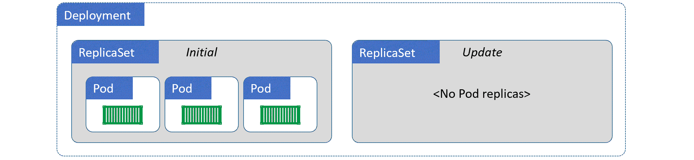
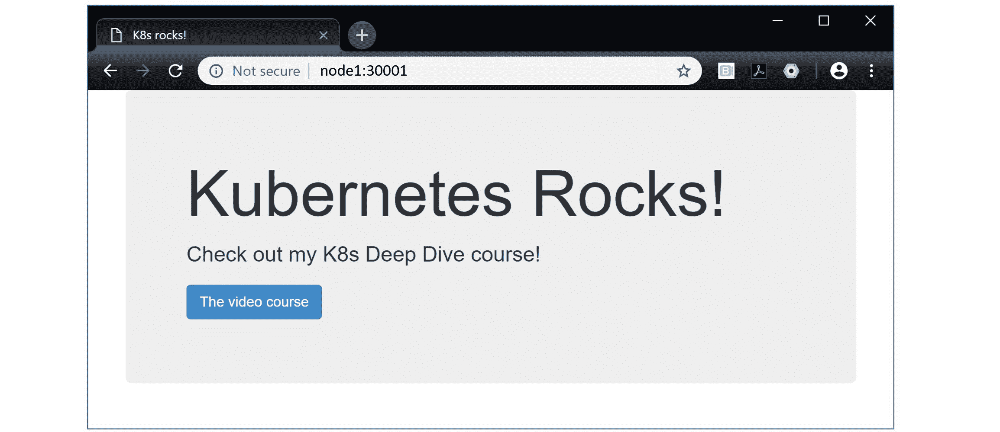
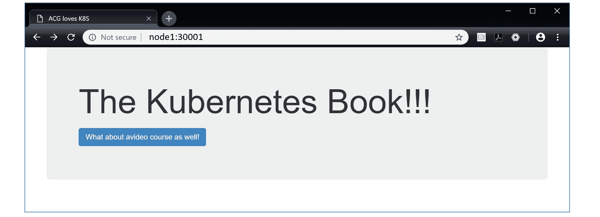

## 5：Kubernetes 部署

在本章中，我们将看到*部署*如何为 Kubernetes 带来自愈、可伸缩、滚动更新和回滚。

我们将按以下方式拆分本章：

+   部署理论

+   如何创建部署

+   如何执行滚动更新

+   如何执行回滚

### 部署理论

在高层次上，我们从应用程序代码开始。将其打包为容器，并包装在 Pod 中，以便在 Kubernetes 上运行。但是，Pod 不会自愈，它们不会扩展，也不会允许轻松更新。

部署可以做所有这些事情- *自愈、扩展和滚动更新*。因此，我们几乎总是通过部署部署 Pod。见图 5.1。

！[图 5.1]（Image00030.gif）

图 5.1

重要的是要知道，部署只管理一组相同的 Pod。例如，如果您有一个应用程序，其中一个 Pod 用于前端，另一个 Pod 用于后端，您将需要两个部署。

接下来要知道的是，部署是 Kubernetes API 中的完整对象。这意味着我们在清单文件中定义它们，然后将它们`POST`到 API 服务器。

最后要注意的是，幕后，部署利用了另一个称为副本集的对象。我们不直接管理副本集，但了解它们很重要，因为这将有助于解释我们即将描述的一些操作的机制。

保持高层次，部署使用副本集来提供自愈和可伸缩性。见图 5.2。

！[图 5.2]（Image00031.gif）

图 5.2

总之；*部署*管理*副本集*，而*副本集*管理*Pod*。把它们放在一起，我们有了一个在 Kubernetes 上部署和管理应用程序的好方法！

#### 自愈和可伸缩性

Pod 很棒。它们通过允许容器共存、共享卷、共享内存、简化网络等方式增强了容器。但是它们在自愈和可伸缩方面没有任何作用。

进入部署。

部署通过添加自愈和可伸缩等功能来增强 Pod。这意味着：

+   如果由部署管理的 Pod 失败，它将被替换- *自愈*。

+   如果由部署管理的 Pod 看到负载增加，您可以轻松地添加更多相同的 Pod 来处理负载- *扩展*。

然而，在幕后，部署使用一个称为 ReplicaSet 的对象来实现自愈和可伸缩性。但是，ReplicaSets 在后台运行，我们总是通过部署来管理它们。因此，我们将主要关注部署方面的事情。

##### 这一切都与*状态*有关。

在继续之前，了解三个对 Kubernetes 的一切都至关重要的概念是至关重要的：

+   期望状态

+   当前状态（有时称为*实际状态*或*观察状态*）

+   声明性模型

*期望状态*是您**想要**的。*当前状态*是您**拥有**的。如果两者匹配，每个人都很高兴。

*声明性模型*是告诉 Kubernetes 我们的*期望状态*是什么，而不涉及*如何*实现它的细节。

##### 声明性模型

有两种竞争模型。*声明性模型*和*命令模型*。

声明性模型是关于描述最终目标的 - 告诉 Kubernetes 你想要什么。命令模型是关于实现最终目标的命令列表 - 告诉 Kubernetes**如何**做某事。

让我们看一个例子。

假设您有一个具有两个服务 - 前端和后端的应用程序。您已经配置好了，这样您就有了一个用于前端服务的 Pod，以及一个用于后端服务的单独的 Pod。为了满足预期的需求，您总是需要 5 个前端 Pod 的实例和 2 个后端 Pod 的实例。

采用声明性方法，您创建一个配置文件，告诉 Kubernetes 您的前端和后端 Pod 应该是什么样子 - 例如要使用什么镜像和要暴露什么端口。在同一个文件中，您还告诉 Kubernetes 您想要 5 个前端 Pod 的副本和 2 个后端 Pod 的副本。这就是您的*期望状态*。然后将该文件交给 Kubernetes，然后坐下来，让 Kubernetes 来实现它的艰苦工作。但事情并不止于此... Kubernetes 实现了不断检查集群上的内容是否与您要求的内容匹配的监视循环（当前状态是否与期望状态匹配）。

太棒了！

声明性模型的相反是命令式模型。在命令式模型中，没有期望状态的概念。相反，您需要编写一堆脚本，其中包含构建所需的所有命令。而且你必须关心实现细节。例如，启动`containerd`容器的命令与启动`rkt`容器的命令不同。这最终会导致更多的工作，更容易出错，并且因为它没有声明期望状态，所以没有自我修复。

这不太好: -(

Kubernetes 支持两种模型，但强烈倾向于声明性模型。

##### 调和循环

期望状态的基础是后台调和循环的概念。

例如，ReplicaSets 实现了一个后台调和循环，不断检查集群上是否存在正确数量的 Pod 副本。如果不够，它会添加更多。如果太多，它会终止一些。

要非常清楚- **Kubernetes 不断检查*当前状态*是否与*期望状态*匹配！***

如果它们不匹配-可能期望状态是 10 个副本，但只有 8 个在运行-Kubernetes 会切换到红色警报，命令控制平面进入战斗状态，并启动另外两个副本。最好的部分是...它在清晨 4:20 不会给你打电话！

但这不仅仅是故障场景。这些完全相同的调和循环也实现了扩展！

例如，如果您将应用程序配置的更新发送到`POST`，将副本计数从 3 增加到 5。新值 5 将被注册为应用程序的新*期望状态*，并且在下一次调和循环运行时，它将注意到差异并遵循相同的过程-发出红色警报的警报声，并启动另外两个副本。

这是一件美好的事情！

#### 使用部署进行滚动更新

除了自我修复和扩展，部署还为我们提供了零停机滚动更新。

如前所述。部署使用 ReplicaSets 进行一些后台工作。实际上，每次创建部署时，我们都会自动获得一个管理部署 Pod 的 ReplicaSet。

> 注意：您不应直接管理作为部署的一部分创建的 ReplicaSets。您应该对部署对象执行所有操作，并让部署对象管理其自己的 ReplicaSets。

它的工作原理是这样的。我们将我们的应用程序设计为每个独立的服务作为一个 Pod。为了方便 - 自愈、扩展、滚动更新等 - 我们将 Pod 包装在一个部署中。这意味着创建一个描述以下所有内容的 YAML 配置文件：

+   有多少个 Pod 副本

+   用于 Pod 容器的镜像

+   使用哪些网络端口

+   关于如何执行滚动更新的详细信息

您将该 YAML 文件发布到 API 服务器，Kubernetes 会完成所有的艰苦工作来实施它。

一旦实施，Kubernetes 设置了一个监视循环，以确保观察到的状态与期望的状态相匹配。

到目前为止一切顺利。

现在，假设您想要更新 Pod 使用的镜像版本。为此，您使用新的镜像版本更新**相同的部署 YAML 文件**，并将其重新发布到 API 服务器。这在集群上注册了一个新的期望状态，请求相同数量的 Pod，但都运行新版本的镜像。为了实现这一点，Kubernetes 为具有新镜像的 Pod 创建了一个新的 ReplicaSet。现在我们有两个 ReplicaSets - 一个用于具有旧版本镜像的 Pod，另一个用于具有新版本的 Pod。当 Kubernetes 增加新 ReplicaSet 中的 Pod 数量（具有新版本的镜像）时，它会减少旧 ReplicaSet 中的 Pod 数量（具有旧版本的镜像）。最终结果是，我们可以实现零停机的平滑滚动更新。而且我们可以为将来的更新重复这个过程 - 只需不断更新那个清单文件（应该存储在版本控制系统中）。

太棒了！

图 5.3 显示了一个已经更新了一次的部署。初始部署在左侧创建了 ReplicaSet，更新在右侧创建了 ReplicaSet。我们可以看到初始部署的 ReplicaSet 已经被逐渐停止，不再拥有任何 Pod。与更新相关的 ReplicaSet 是活动的，并拥有所有的 Pod。


图 5.3

#### 回滚

正如我们在图 5.3 中看到的，旧的 ReplicaSets 仍然存在，不会被删除。它们已经被逐渐停止，因此不再管理任何 Pod，但它们仍然存在。这使它们成为恢复到先前版本的一个很好的选项。

回滚的过程本质上是滚动更新的相反过程 - 将旧的 ReplicaSet 逐渐启动，将当前的 ReplicaSet 逐渐停止。简单！

图 5.4 显示了同一应用程序回滚到初始修订版。



图 5.4

但这还不是结束！内置的智能让我们能够说出像*“在每个 Pod 启动后等待 X 秒再将其标记为健康…”* 这样的话。还有就绪探针和各种各样的东西。总的来说，部署非常适合执行滚动更新和版本回滚。

考虑到所有这些，让我们动手创建一个部署。

### 如何创建部署

在本节中，我们将从 YAML 文件创建一个全新的 Kubernetes 部署。我们可以使用 `kubectl run` 命令以命令方式执行相同的操作，但我们不应该这样做！正确的方式是声明式的方式！

以下代码片段是我们将使用的部署清单文件，示例假设它被称为 `deploy.yml`。

如果您正在使用较旧版本的 Kubernetes，应该使用 `apps/v1beta1` API。

```
apiVersion

:

 apps

/

v1

kind

:

 Deployment

metadata

:

  name

:

 hello

-

deploy

spec

:

  replicas

:

 10

  selector

:

    matchLabels

:

      app

:

 hello

-

world

  minReadySeconds

:

 10

  strategy

:

    type

:

 RollingUpdate

    rollingUpdate

:

      maxUnavailable

:

 1

      maxSurge

:

 1

  template

:

    metadata

:

      labels

:

        app

:

 hello

-

world

    spec

:

      containers

:

      -

 name

:

 hello

-

pod

        image

:

 nigelpoulton

/

k8sbook

:

latest

        ports

:

        -

 containerPort

:

 8080

```

> **警告：** 本书中使用的图像未经维护，将充满漏洞和其他安全问题。

让我们逐步浏览文件并解释一些重要部分。

就在最顶部，我们正在指定要使用的 API 版本。假设您正在使用最新版本的 Kubernetes，部署对象位于 `apps/v1` API 组中。如果您使用的是旧版本，可以尝试 `apps/v1beta1` 或 `extensions/v1beta2`。

接下来，`.kind` 字段告诉 Kubernetes 我们正在定义一个部署 - 这是 Kubernetes 知道将其发送到控制平面上的部署控制器的方式。

`.metadata` 部分是我们为部署指定名称和标签的地方。

`.spec` 部分是大部分操作发生的地方。`.spec.replicas` 告诉 Kubernetes 为这个部署创建多少个 Pod 副本。`spec.selector` 是 Pod 必须具有的标签列表，以便部署管理它们。而 `.spec.strategy` 告诉 Kubernetes 如何执行对部署的更新。

使用 `kubectl apply` 在集群上实现它。

> **注意：** `kubectl apply` 将 YAML 文件发送到 Kubernetes API 服务器。

```
$ kubectl apply deployment -f deploy.yml
deployment.apps "hello-deploy"

 created

```

部署在集群上实例化。

#### 检查部署

我们可以使用通常的 `kubectl get` 和 `kubectl describe` 命令来查看部署的详细信息。

```
$

 kubectl

 get

 deploy

 hello

-

deploy

NAME

          DESIRED

   CURRENT

  UP

-

TO

-

DATE

  AVAILABLE

   AGE

hello

-

deploy

  10

        10

       10

          10

          1

m

$

 kubectl

 describe

 deploy

 hello

-

deploy

Name

:

         hello

-

deploy

Namespace

:

    default

Selector

:

     app

=

hello

-

world

Replicas

:

               10

 desired

 |

 10

 updated

 |

 10

 total

 ...

StrategyType

:

           RollingUpdate

MinReadySeconds

:

        10

RollingUpdateStrategy

:

  1

 max

 unavailable

,

 1

 max

 surge

Pod

 Template

:

  Labels

:

               app

=

hello

-

world

  Containers

:

        hello

-

pod

:

          Image

:

        nigelpoulton

/

k8sbook

:

latest

          Port

:

         8080

/

TCP

<SNIP>

```

为了便于阅读，命令输出已被修剪。您的输出将显示更多信息。

正如我们之前提到的，部署会自动创建关联的 ReplicaSets。使用以下 `kubectl` 命令来确认这一点。

```
$ kubectl get rs
NAME                  DESIRED   CURRENT  READY   AGE
hello-deploy-7bbd...  10

        10

       10

      5m

```

现在，我们只有一个 ReplicaSet。这是因为我们只执行了部署的初始推出。然而，我们可以看到它与部署的名称相同，后面跟着 YAML 清单文件的 Pod 模板部分的哈希值。

我们可以使用通常的`kubectl describe`命令获取有关 ReplicaSet 的更详细信息。

#### 访问应用

为了从稳定的名称或 IP 地址访问应用，甚至从集群外部访问，我们需要一个 Kubernetes Service 对象（关于这些内容将在下一章中详细介绍）。现在，你只需要知道 Kubernetes Services 为一组 Pods 提供了稳定的 DNS 名称和 IP 地址。

以下的 YAML 定义了一个将与先前部署的 Pod 一起工作的 Service。

```
  apiVersion: v1
  kind: Service
  metadata:
    name: hello-svc
    labels:
      app: hello-world
  spec:
    type: NodePort
    ports:
    - port: 8080
      nodePort: 30001
      protocol: TCP
    selector:
      app: hello-world

```

使用以下命令部署它（该命令假设清单文件名为`svc.yml`）。

```
  $ kubectl apply -f svc.yml
  service "hello-svc" created

```

现在 Service 已经部署，你可以通过以下任一方式访问它：

1.  从集群内部使用 DNS 名称`hello-svc`在端口`8080`上。

1.  从集群外部，通过命中端口`30001`上的任何集群节点

图 5.5 显示了通过名为`node1`的节点在端口`30001`上从集群外部访问 Service。它假设`node1`是可解析的，并且端口`30001`被任何中间防火墙允许。

如果你正在使用 Minikube，你应该在 Minikube IP 地址的末尾添加端口`30001`。使用`minikube ip`命令获取你的 Minikube 的 IP 地址。



图 5.5

### 执行滚动更新

在本节中，我们将看到如何对我们刚刚部署的应用执行滚动更新。我们将假设应用的新版本已经被创建并作为带有`edge`标签的 Docker 镜像容器化。现在只需要使用 Kubernetes 将更新推送到生产环境。在本例中，我们将忽略真实的 CI/CD 工作流和版本控制工具。

我们需要做的第一件事是更新部署清单文件中使用的镜像标签。我们部署的应用的初始版本使用了标记为`nigelpoulton/k8sbook:latest`的镜像。我们将更新部署清单的`.spec.template.spec.containers`部分，以引用新的`nigelpoulton/k8sbook:edge`镜像。这将确保下次清单被 POST 到 API 服务器时，部署中的所有 Pod 将被更新为运行新的`edge`镜像。

以下是更新后的 `deploy.yml` 清单文件 - 唯一的更改是由注释行指示的 `.spec.template.spec.containers.image`。

```
apiVersion

:

 apps

/

v1

kind

:

 Deployment

metadata

:

  name

:

 hello

-

deploy

spec

:

  replicas

:

 10

  selector

:

    matchLabels

:

      app

:

 hello

-

world

  minReadySeconds

:

 10

  strategy

:

    type

:

 RollingUpdate

    rollingUpdate

:

      maxUnavailable

:

 1

      maxSurge

:

 1

  template

:

    metadata

:

      labels

:

        app

:

 hello

-

world

    spec

:

      containers

:

      -

 name

:

 hello

-

pod

        image

:

 nigelpoulton

/

k8sbook

:

edge

   #

 This

 line

 changed

        ports

:

        -

 containerPort

:

 8080

```

> 警告：本书中使用的图像未经维护，将充满漏洞和其他安全问题。

让我们来看看管理部署更新的设置。

清单的 `.spec` 部分包含了所有与更新执行相关的设置。感兴趣的第一个值是 `.spec.minReadySeconds`。我们将其设置为 `10`，告诉 Kubernetes 在更新每个 Pod 后等待 10 秒再继续更新下一个。这对于限制更新发生的速率很有用 - 较长的等待时间给我们发现问题的机会，并避免将所有 Pod 更新为有问题的 Pod 的情况。

我们还有一个嵌套的 `.spec.strategy` 映射，告诉 Kubernetes 我们希望这个部署：

+   使用 `RollingUpdate` 策略进行更新

+   永远不要低于期望状态的一个 Pod（`maxUnavailable: 1`）

+   永远不要超过期望状态的一个 Pod（`maxSurge: 1`）

由于应用的期望状态要求有 10 个副本，`maxSurge: 1` 意味着在更新过程中我们永远不会有超过 11 个 Pod，而 `maxUnavailable: 1` 意味着我们永远不会少于 9 个。

准备好更新的清单后，我们可以通过重新将更新后的 YAML 文件发送到 API 服务器来启动更新。

```
$ kubectl apply -f deploy.yml --record
deployment.apps "hello-deploy"

 configured

```

更新可能需要一些时间才能完成。这是因为它将逐个 Pod 迭代，每个节点下载新的图像，启动新的 Pod，并在移动到下一个 Pod 之前等待 10 秒。

我们可以使用 `kubectl rollout status` 监控更新的进度。

```
$ kubectl rollout status deployment hello-deploy
Waiting for

 rollout to finish: 4

 out of 10

 new replicas...
Waiting for

 rollout to finish: 4

 out of 10

 new replicas...
Waiting for

 rollout to finish: 5

 out of 10

 new replicas...
^C

```

如果按下 `Ctrl+C` 停止观察更新的进度，您可以在更新过程中运行 `kubectl get deploy` 命令。这样我们就可以看到清单中一些与更新相关的设置的效果。例如，以下命令显示有 5 个副本已经更新，当前有 11 个。11 比期望的 10 多了 1 个。这是清单中 `maxSurge=1` 值的结果。

```
$ kubectl get deploy
NAME           DESIRED   CURRENT   UP-TO-DATE   AVAILABLE   AGE
hello-deploy   10

        11

        5

            9

           28m

```

更新完成后，我们可以使用 `kubectl get deploy` 进行验证。

```
$ kubectl get deploy hello-deploy
NAME          DESIRED   CURRENT   UP-TO-DATE   AVAILABLE   AGE
hello-deploy  10

        10

        10

           10

          39m

```

输出显示更新已完成 - 10 个 Pod 已经是最新的。您可以使用 `kubectl describe deploy` 命令获取有关部署状态的更详细信息 - 这将包括输出的 `Pod 模板` 部分中的新图像版本。

如果您一直在关注示例，您可以在浏览器中点击“刷新”并查看更新后的应用程序（图 5.6）。



图 5.6

应用程序的旧版本显示“Kubernetes Rocks!”，新版本显示“The Kubernetes Book!!!”。

### 如何执行回滚

刚才，我们使用`kubectl apply`对部署执行了滚动更新。我们使用了`--record`标志，以便 Kubernetes 会维护部署的修订历史。以下`kubectl rollout history`命令显示了具有两个修订的部署。

```
$ kubectl rollout history

 deployment hello-deploy
deployments "hello-deploy"

REVISION  CHANGE-CAUSE
1

         <none>
2

         kubectl apply -filename-deploy.yml --record=

true

```

修订版`1`是使用`latest`图像标记的初始部署。修订版`2`是我们刚刚执行的滚动更新，我们可以看到我们用来调用更新的命令已记录在对象的历史记录中。这仅因为我们在调用更新命令时使用了`--record`标志。这可能是您使用`--record`标志的一个很好的理由。

在本章的前面，我们说更新部署会创建一个新的 ReplicaSet，并且以前的 ReplicaSets 不会被删除。我们可以使用`kubectl get rs`来验证这一点。

```
$ kubectl get rs
NAME                  DESIRED  CURRENT  READY  AGE
hello-deploy-6bc8...  10

       10

       10

     10m
hello-deploy-7bbd...  0

        0

        0

      52m

```

输出显示初始修订的 ReplicaSet 仍然存在（`hello-deploy-7bbd...`），但已被关闭，并且不再管理任何副本。`hello-deploy-6bc8...` ReplicaSet 是最新修订的 ReplicaSet，并且在管理下有 10 个副本。然而，以前的版本仍然存在使得回滚变得非常简单。

值得运行`kubectl describe rs`来证明旧的 ReplicaSet 的配置仍然存在。

以下示例使用`kubectl rollout`命令将应用程序回滚到修订版 1。这是一个命令式操作，不建议使用。但是，对于快速回滚来说可能很方便，只需记住更新源 YAML 文件以反映您对集群所做的命令式更改。

```
$ kubectl rollout undo deployment hello-deploy --to-revision=

1

deployment.apps "hello-deploy"

 rolled back

```

尽管回滚操作看起来可能是瞬时的，但实际上并非如此。回滚遵循部署清单中规定的相同规则-`minReadySeconds: 10`，`maxUnavailable: 1`和`maxSurge: 1`。您可以使用以下`kubectl get deploy`和`kubectl rollout`命令来验证这一点并跟踪进度。

```
$ kubectl get deploy hello-deploy
NAME          DESIRED  CURRNET  UP-TO-DATE  AVAILABE  AGE
hello-deploy  10

       11

       4

           9

         45m

$ kubectl rollout status deployment hello-deploy
Waiting for

 rollout to finish: 6

 out of 10

 new replicas have been updated...
Waiting for

 rollout to finish: 7

 out of 10

 new replicas have been updated...
Waiting for

 rollout to finish: 8

 out of 10

 new replicas have been updated...
Waiting for

 rollout to finish: 1

 old replicas are pending termination...
Waiting for

 rollout to finish: 9

 of 10

 updated replicas are available...
^C

```

恭喜。您已执行了滚动更新和成功的回滚。

使用`kubectl delete -f deploy.yml`来删除示例中使用的部署。

### 章节总结

在这一章中，我们了解到*部署*是管理 Kubernetes 应用程序的一种很好的方式。它们在 Pods 的基础上添加了自愈、可伸缩性、滚动更新和回滚功能。在幕后，它们利用 ReplicaSets 来实现自愈和可伸缩性。

与 Pods 一样，部署是 Kubernetes API 中的对象，我们应该以声明性的方式与它们一起工作。

当我们使用`kubectl apply`命令进行更新时，旧版本的 ReplicaSets 会被逐渐关闭，但它们仍然存在，这样就可以轻松进行回滚操作。
