## 6：Kubernetes Services

在之前的章节中，我们已经启动了 Pods 并使用 Deployments 来添加自愈、可伸缩性和滚动更新。然而，尽管所有这些，**我们仍然不能依赖 Pod IPs！**在本章中，我们将看到 Kubernetes *Services*如何给我们提供可靠的网络。

我们将把本章分成以下几部分：

+   设置场景

+   理论

+   实践操作

+   现实世界的例子

### 设置场景

在深入之前，我们需要提醒自己**Pod IPs 是不可靠的**。当 Pods 失败时，它们会被具有新 IP 的新 Pods 替换。扩展 Deployment 会引入具有新 IP 地址的新 Pods。缩减 Deployment 会移除 Pods。所有这些都会产生大量的 IP 变动，并且会导致无法依赖 Pod IPs 的情况。

我们还需要了解 Kubernetes Services 的 3 个基本要点。

首先，我们需要澄清一些术语。在本章中，当谈到*Service*时，我们指的是 Kubernetes API 中的 Service REST 对象。就像*Pod*、*ReplicaSet*或*Deployment*一样，Kubernetes ***Service***是 API 中的一个对象，我们在清单中定义并 POST 到 API 服务器中。

其次，我们需要知道每个 Service 都有自己的**稳定 IP 地址**，自己的**稳定 DNS 名称**和自己的**稳定端口**。

第三，我们需要知道 Services 使用标签来动态选择集群中要发送流量的 Pods。

最后两点是允许 Services 为动态的一组 Pods 提供稳定网络的关键。

### 理论

图 6.1 显示了通过 Kubernetes Deployment 部署的一个简单的基于 Pod 的应用程序。它显示了一个客户端（可能是应用程序的另一个组件），它没有可靠的网络端点来访问 Pods - 请记住 Pod IPs 是不可靠的。

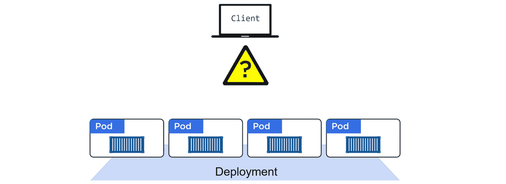

图 6.1

图 6.2 显示了相同的应用程序，其中添加了一个 Service。该 Service 与 Pods 关联，并为它们提供稳定的 IP、DNS 和端口。它还在 Pods 之间负载均衡请求。

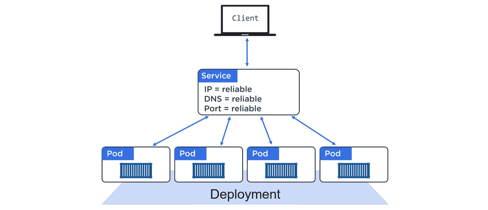

图 6.2

有了一个 Service 在一组 Pods 的前面，Pods 可以扩展和缩减，它们可以失败，它们可以被更新...当这些事情发生时，Service 会注意到这些变化并更新对 Pods 的了解。但它永远不会改变它暴露的稳定 IP、DNS 和端口！

#### 标签和松耦合

通过*标签*和*标签选择器*，Pod 和服务松散耦合。这与将部署与 Pod 链接的技术相同。图 6.3 显示了一个示例，其中 3 个 Pod 被标记为`zone=prod`和`version=1`，而 Service 具有一个*标签选择器*与之匹配。

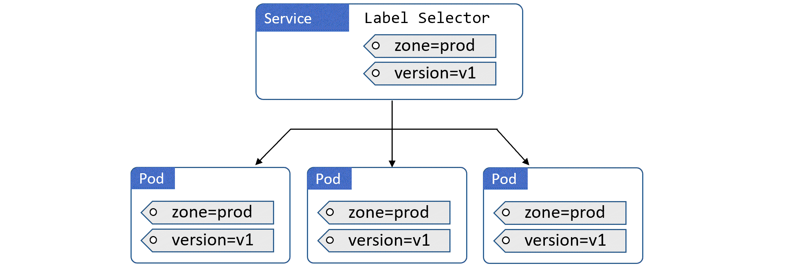

图 6.3

在图 6.3 中，服务为所有三个 Pod 提供稳定的网络 - 您可以向服务发送请求，它将代理它们到 Pod。它还提供简单的负载平衡。

为了使服务匹配一组 Pod，从而提供稳定的网络和负载平衡，它只需要匹配 Pod 上的*一些*标签。然而，为了使 Pod 匹配服务，它必须具有服务正在寻找的所有标签。如果这听起来令人困惑，图 6.4 和 6.5 中的示例应该有所帮助。

图 6.4 显示了一个示例，其中 Service 与任何 Pod 都不匹配。这是因为 Service 正在寻找具有两个标签的 Pod，但 Pod 只拥有其中一个。这背后的逻辑是布尔`AND`操作。

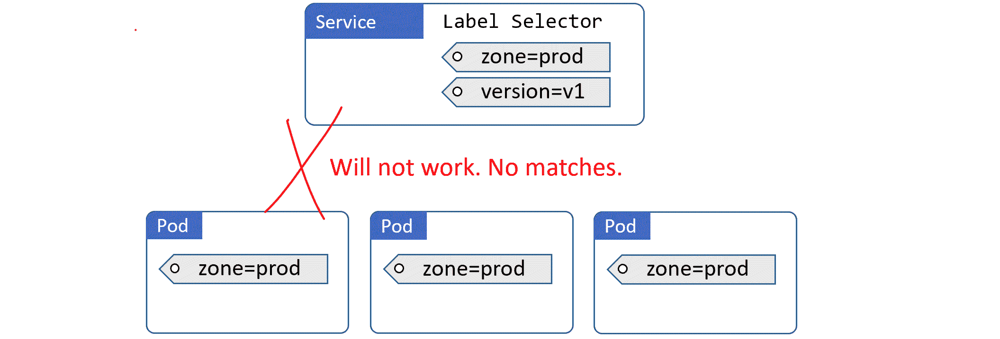

图 6.4

图 6.5 显示了一个确实有效的示例。这是因为服务正在选择两个标签，并且图中的 Pod 都具有这两个标签。并不重要 Pod 具有服务不在寻找的额外标签。服务正在寻找具有两个标签的 Pod，它找到了它们，并忽略了 Pod 具有额外标签的事实 - 重要的是 Pod 具有服务正在寻找的标签。

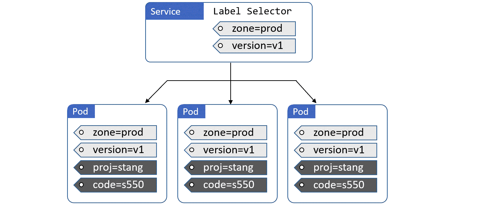

图 6.5

以下摘录来自 Service YAML 和 Deployment YAML，展示了*选择器*和*标签*的实现方式。我们已经在我们感兴趣的行上添加了注释。

**svc.yml**

```
apiVersion

:

 v1

kind

:

 Service

metadata

:

  name

:

 hello

-

svc

  labels

:

    app

:

 hello

-

world

spec

:

  type

:

 NodePort

  ports

:

  -

 port

:

 8080

    nodePort

:

 30001

    protocol

:

 TCP

  selector

:

    app

:

 hello

-

world

   #

 Label

 selector

    #

 Service

 is

 looking

 for

 Pods

 with

 the

 label

 `

app

=

hello

-

world

`

```

**deploy.yml**

```
apiVersion

:

 apps

/

v1

kind

:

 Deployment

metadata

:

  name

:

 hello

-

deploy

spec

:

  replicas

:

 10

  selector

:

    matchLabels

:

      app

:

 hello

-

world

  template

:

    metadata

:

      labels

:

        app

:

 hello

-

world

   #

 Pod

 labels

        #

 The

 label

 above

 matches

 what

 the

 svc

.

yml

 is

 looking

 for

    spec

:

      containers

:

      -

 name

:

 hello

-

ctr

        image

:

 nigelpoulton

/

k8sbook

:

latest

        ports

:

        -

 containerPort

:

 8080

```

在示例文件中，服务具有一个标签选择器（`.spec.selector`），其具有单个值`app=hello-world`。这是服务在查询匹配的 Pod 时寻找的标签。部署指定了具有相同`app=hello-world`标签的 Pod 模板（`.spec.template.metadata.labels`）。这意味着它部署的任何 Pod 都将具有`app=hello-world`标签。这两个属性松散地将服务与部署的 Pod 绑定在一起。

当部署和服务部署时，服务将选择所有 10 个 Pod 副本，并为它们提供稳定的网络端点并执行负载平衡。

#### 服务和端点对象

随着 Pod 的出现和消失（扩展和缩减，故障，滚动更新等），Service 动态更新其健康匹配 Pod 的列表。它通过标签选择器和一个称为*Endpoint*对象的构造来实现这一点。

每个创建的 Service 都会自动获得一个关联的*Endpoint*对象。这个 Endpoint 对象只是一个动态列表，列出了集群上与 Service 的标签选择器匹配的所有健康 Pod。

它的工作原理是这样的…

Kubernetes 不断评估 Service 的标签选择器与集群中当前健康 Pod 列表的匹配情况。任何新的匹配选择器的 Pod 都会被添加到 Endpoint 对象中，任何消失的 Pod 都会被移除。这意味着 Endpoint 始终是最新的。当 Service 向 Pod 发送流量时，它会查询其 Endpoint 以获取最新的健康匹配 Pod 列表-这确保了 Service 随着 Pod 的出现和消失而保持最新。

Endpoint 对象有自己的 API 端点，Kubernetes 本地应用程序可以查询匹配 Pod 的最新列表（就像 Service 对象一样）。非本地的 Kubernetes 应用程序可以直接使用 Service 的稳定 IP（VIP）。

现在我们知道了 Service 工作原理的基础，让我们来看一些用例。

#### 从集群内部访问服务

Kubernetes 支持几种*类型*的 Service。默认类型是**ClusterIP**。

ClusterIP Service 执行以下操作。它为 Service 获取一个稳定的 IP 地址（ClusterIP）和端口，只能从集群内部访问。然后将它们注册到集群的 DNS 服务的名称下。

集群中的所有 Pod 都知道集群的 DNS 服务，这意味着所有 Pod 都能解析 Service 的名称。

让我们看一个简单的例子。

创建一个名为“hellcat-svc”的新 Service 将触发以下操作。Kubernetes 将使用集群的 DNS 服务注册名称“hellcat-svc”，以及一个 IP 地址和端口。名称、IP 和端口保证是长期稳定的，集群中的所有 Pod 都能将“hellcat-svc”解析为 Service 的 ClusterIP。

网络网络…只要一个 Pod（应用微服务）知道一个 Service 的名称，它就可以将其解析为其 ClusterIP 地址并连接到它。

这仅适用于集群中的 Pod 和其他对象，因为它需要访问集群的 DNS 服务。它在集群外部无法工作。

#### 从集群外部访问

Kubernetes 还有另一种称为**NodePort 服务**的服务类型。这建立在 ClusterIP 之上，并允许从集群外部访问。

我们已经知道默认的服务类型是 ClusterIP，这会在集群的 DNS 中注册一个 DNS 名称、虚拟 IP 和端口。NodePort 服务通过添加另一个端口来扩展这一功能，该端口可用于从集群外部访问服务。这个额外的端口称为 NodePort。

以下示例代表一个 NodePort 服务：

+   **名称：**hellcat-svc

+   **ClusterIP：**172.12.5.17

+   **端口：**8080

+   **NodePort：**30050

这个服务可以通过前三个值（名称、ClusterIP、端口）之一直接从集群内部访问。也可以通过在端口`30050`上访问任何集群节点来从集群外部访问。

在最低级别，我们有集群中托管 Pod 的*节点*。然后我们创建一个服务，并使用标签将其与 Pod 关联起来。服务对象在集群中的每个节点上都有一个可靠的 NodePort 映射 - 每个节点上的 NodePort 都是相同的。这意味着来自集群外部的流量可以在集群中的任何节点上通过 NodePort 到达应用程序（Pod）。

图 6.6 显示了一个 NodePort 服务，其中 3 个 Pod 在集群中的每个节点上都在端口`30050`上对外开放。在第 1 步，外部客户端在端口`30050`上访问 Node2。在第 2 步，它被重定向到服务对象（即使 Node2 没有运行来自服务的 Pod，也会发生这种情况）。第 3 步显示服务有一个关联的 Endpoint 对象，其中包含一个始终保持最新的与标签选择器匹配的 Pod 列表。第 4 步显示客户端被引导到 Node1 上的 pod1。

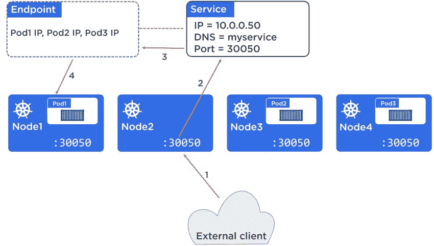

图 6.6

服务也可以轻松地将客户端引导到 pod2 或 pod3。事实上，未来的请求可能会在 Pod 之间进行负载均衡。

还有其他类型的服务，比如负载均衡器服务。这些服务与云提供商（如 AWS、Azure 和 GCP）的负载均衡器集成。它们建立在 NodePort 服务的基础上（NodePort 服务又建立在 ClusterIP 服务的基础上），允许互联网上的客户端通过云的负载均衡器之一访问您的 Pod。

负载均衡服务非常容易设置。但是，它们只在您在受支持的云平台上运行 Kubernetes 集群时才起作用。例如，如果您的 Kubernetes 集群是本地集群，则无法利用 AWS 上的 ELB 负载均衡器。

#### 服务发现

Kubernetes 以几种方式实现服务发现：

+   DNS（推荐）

+   环境变量（绝对不推荐）

基于 DNS 的服务发现需要 DNS *cluster-add-on* - 这只是本地 Kubernetes DNS 服务的一个花哨的名称。如果您按照“安装 Kubernetes”章节中的安装方法进行安装，您已经拥有了这个服务。它在集群中实现了基于 Pod 的 DNS 服务，并配置所有 kubelet（节点）以用于 DNS。

DNS 插件不断监视 API 服务器以获取新的服务，并自动在 DNS 中注册它们。这意味着每个服务都有一个可以在整个集群中解析的 DNS 名称。

另一种服务发现的形式是通过环境变量。每个 Pod 都会得到一组环境变量，解析出集群中当前的每个服务。但是，这是一种备用方法，以防您的集群中没有使用 DNS。

环境变量的问题在于它们只在 Pod 创建时插入。这意味着 Pod 在创建后无法了解添加到集群中的新服务的方式 - 这远非理想！这就是为什么 DNS 是首选方法。

#### 服务理论总结

服务主要提供 Pod 的稳定网络。它们还提供负载均衡和从集群外部访问的方式。它们使用标签和标签选择器动态与 Pod 相关联。

### 服务实践

我们将要动手实践并将理论付诸实践。

我们将使用 Kubernetes 服务来增强一个简单的单 Pod 应用程序。我们将展示两种方法：

+   命令式方式（仅在紧急情况下使用）

+   声明式方式

#### 命令式方式

**警告！** 命令式方式**不是**Kubernetes 的方式！它引入了一种风险，即通过命令方式进行的更改永远不会出现在声明式清单中，使得清单变得陈旧。这会导致陈旧的清单被用来在以后的某个日期更新集群，无意中覆盖了通过命令方式进行的重要更改。

使用`kubectl`以声明方式部署以下部署（后续步骤将以命令方式完成）。该命令假定部署在名为`deploy.yml`的文件中，并具有以下内容。

```
apiVersion

:

 apps

/

v1

kind

:

 Deployment

metadata

:

  name

:

 web

-

deploy

spec

:

  replicas

:

 10

  selector

:

    matchLabels

:

      app

:

 hello

-

world

  template

:

    metadata

:

      labels

:

        app

:

 hello

-

world

    spec

:

      containers

:

      -

 name

:

 hello

-

ctr

        image

:

 nigelpoulton

/

k8sbook

:

latest

        ports

:

        -

 containerPort

:

 8080

```

```
$ kubectl apply -f deploy.yml
deployment "web-deploy"

 created

```

现在部署正在运行，是时候为其部署一个服务了。

使用以下`kubectl`命令创建一个新的服务，为先前步骤部署的 Pod 提供网络和负载平衡。

```
$ kubectl expose deployment web-deploy \

  --name=

hello-svc \

  --target-port=

8080

 \

  --type=

NodePort

service "hello-svc"

 exposed

```

让我们解释一下这个命令在做什么。`kubectl expose`是创建一个新的*Service*对象的命令方式。`deployment web-deploy`告诉 Kubernetes 暴露先前创建的名为`web-deploy`的部署。`--name=hello-svc`告诉 Kubernetes 我们要将此服务称为“hello-svc”，`--target-port=8080`告诉它应用程序正在侦听的端口（这**不是**我们将访问服务的整个集群 NodePort）。最后，`--type=NodePort`告诉 Kubernetes 我们需要一个服务的整个集群端口。

创建服务后，您可以使用`kubectl describe svc hello-svc`命令检查它。

```
$

 kubectl

 describe

 svc

 hello

-

svc

Name

:

               hello

-

svc

Namespace

:

          default

Labels

:

             app

=

hello

-

world

Annotations

:

        <

none

>

Selector

:

           app

=

hello

-

world

Type

:

               NodePort

IP

:

                 100.70

.

80.47

Port

:

               <

unset

>

 8080

/

TCP

NodePort

:

           <

unset

>

 30175

/

TCP

Endpoints

:

          100.96

.

1.10

:

8080

,

 100.96

.

1.11

:

8080

,

 +

 more

...

Session

 Affinity

:

   None

Events

:

             <

none

>

```

输出中一些有趣的值包括：

+   `Selector` 是 Pod 必须具有的标签列表，以便服务将流量发送到它们

+   `IP` 是服务的永久 ClusterIP（VIP）

+   `Port`是应用程序和服务侦听的端口

+   `NodePort` 是整个集群可以用来外部访问的端口

+   `Endpoints` 是当前与服务标签选择器匹配的健康 Pod 的动态列表。

现在我们知道了服务可访问的整个集群端口，我们可以打开一个网页浏览器并访问该应用程序。为了做到这一点，您需要知道集群中至少一个节点的 IP 地址，并且需要能够从浏览器访问它 - 例如，如果您通过互联网访问，则需要一个公共可路由的 IP。

图 6.7 显示了一个网页浏览器访问具有 IP 地址`54.246.255.52`的集群节点，该节点使用整个集群 NodePort`30175`。

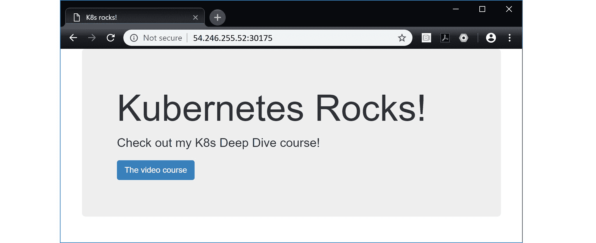

图 6.7

我们部署的应用程序是一个简单的 Web 应用程序。它构建为侦听端口 8080，并且我们已经配置了一个 Kubernetes *Service*，将每个集群节点上的端口`30175`映射回应用程序上的端口 8080。默认情况下，整个集群端口（NodePort 值）在 30,000 - 32,767 之间。

接下来，我们将看到如何以正确的方式进行相同的操作 - 声明式的方式！为了做到这一点，我们需要通过删除刚刚创建的服务来进行清理。我们可以使用`kubectl delete svc`命令来做到这一点

```
$ kubectl delete svc hello-svc
service "hello-svc"

 deleted

```

#### 声明式方式

是时候按照正确的方式来做事了... Kubernetes 的方式！

##### 服务清单文件

我们将使用以下服务清单文件来部署与上一节中部署的相同的*服务*。只是这一次我们将为整个集群端口指定一个值。

```
apiVersion

:

 v1

kind

:

 Service

metadata

:

  name

:

 hello

-

svc

  labels

:

    app

:

 hello

-

world

spec

:

  type

:

 NodePort

  ports

:

  -

 port

:

 8080

    nodePort

:

 30001

    protocol

:

 TCP

  selector

:

    app

:

 hello

-

world

```

让我们逐行解释一些内容。

服务是成熟的对象，并且在`v1` API（`.apiVersion`）中完全定义。

`.kind`字段告诉 Kubernetes 将清单传递给服务控制器以部署为服务。

`.metadata` 部分定义了服务的名称和标签。这里的标签是服务本身的标签。它不是服务用来选择 Pod 的标签。

`.spec` 部分是我们实际定义服务的地方。在这个例子中，我们告诉 Kubernetes 部署一个`NodePort`服务（其他类型如`ClusterIP`和`LoadBalancer`也存在），并将端口`8080`映射到集群中每个节点的端口`30001`。然后我们明确告诉它使用 TCP（默认）。

最后，`.spec.selector` 告诉服务将流量发送到集群中具有`app=hello-world`标签的所有 Pod。这意味着它将为具有该标签的所有 Pod 提供稳定的网络和负载均衡。

##### 常见的服务类型

三种常见的*ServiceTypes*是：

+   `ClusterIP.` 这是默认选项，并在集群内部为*服务*提供稳定的 IP 地址。它不会使服务在集群外部可用。

+   `NodePort.` 这是建立在`ClusterIP`之上，并添加了一个集群范围的 TCP 或 UDP 端口。它使服务在该端口在集群外部可用。

+   `LoadBalancer.` 这是建立在`NodePort`之上，并与基于云的负载均衡器集成。

清单需要通过 POST 发送到 API 服务器。最简单的方法是使用`kubectl apply`来做到这一点。

```
$ kubectl apply -f svc.yml
service "hello-svc"

 created

```

这个命令告诉 Kubernetes 从名为`svc.yml`的文件部署一个新对象。`-f`标志让您告诉 Kubernetes 使用哪个清单文件。Kubernetes 知道根据清单中`.kind`字段的值来部署服务对象。

##### 服务内省

现在服务已经部署，您可以使用通常的`kubectl get`和`kubectl describe`命令来检查它。

```
$

 kubectl

 get

 svc

 hello

-

svc

NAME

        CLUSTER

-

IP

      EXTERNAL

-

IP

   PORT

(

S

)

         AGE

hello

-

svc

   100.70

.

40.2

     <

nodes

>

       8080

:

30001

/

TCP

  8s

$

 kubectl

 describe

 svc

 hello

-

svc

Name

:

               hello

-

svc

Namespace

:

          default

Labels

:

             app

=

hello

-

world

Annotations

:

        <

none

>

Selector

:

           app

=

hello

-

world

Type

:

               NodePort

IP

:

                 100.70

.

40.2

Port

:

               <

unset

>

 8080

/

TCP

NodePort

:

           <

unset

>

 30001

/

TCP

Endpoints

:

          100.96

.

1.10

:

8080

,

 100.96

.

1.11

:

8080

,

 +

 more

...

Session

 Affinity

:

   None

Events

:

             <

none

>

```

在前面的例子中，我们已将 Service 暴露为整个集群上端口为`30001`的`NodePort`。这意味着我们可以将 Web 浏览器指向任何节点上的该端口并访问该服务。您需要使用可以访问的节点 IP，并确保任何防火墙和安全规则允许流量通过。

图 6.8 显示了一个 Web 浏览器通过集群节点的 IP 地址为`54.246.255.52`的集群范围端口`30001`访问应用程序。

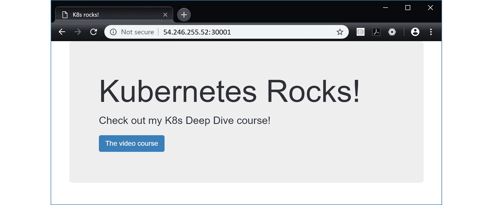

图 6.8

##### 端点对象

在本章的前面，我们说每个服务都有一个与服务同名的 Endpoint 对象。这个对象包含服务匹配的所有 Pod 的列表，并且随着 Pod 的出现和消失而动态更新。我们可以使用普通的`kubectl`命令查看 Endpoints。

在以下命令中，我们将 Endpoint 缩写为`ep`。

```
$

 kubectl

 get

 ep

 hello

-

svc

NAME

        ENDPOINTS

                           AGE

hello

-

svc

   100.96

.

1.10

:

8080

,

 100.96

.

1.11

:

8080

  1

m

kubernetes

  172.20

.

32.78

:

443

$

 Kubectl

 describe

 ep

 hello

-

svc

Name

:

         hello

-

svc

Namespace

:

    default

Labels

:

       app

=

hello

-

world

Annotations

:

  <

none

>

Subsets

:

  Addresses

:

  100.96

.

1.10

,

100.96

.

1.11

,

100.96

.

1.12

...

  NotReadyAddresses

:

   <

none

>

  Ports

:

    Name

      Port

     Protocol

    ----

      ----

     --------

    <

unset

>

   8080

     TCP

Events

:

 <

none

>

```

#### 部署服务的总结

与所有 Kubernetes 对象一样，部署和管理服务的首选方式是声明式的方式。利用标签使它们具有动态性。这意味着您可以部署新服务，这些服务将与集群中已经运行并正在使用的 Pod 和 Deployment 一起工作。每个服务都有自己的 Endpoint 对象，该对象维护与匹配的 Pod 的最新列表。

### 现实世界的例子

尽管我们到目前为止学到的一切都很酷和有趣，但重要的问题是：*它如何带来价值？*以及*它如何保持业务运行并使其更具敏捷性和弹性？*

让我们花一分钟来运行一个常见的现实世界的例子-更新应用程序。

我们都知道更新应用程序是生活中的一个事实-错误修复，新功能等。

图 6.9 显示了一个简单的应用程序部署在一个由 Deployment 管理的一堆 Pod 组成的 Kubernetes 集群上。作为其中的一部分，我们有一个 Service 选择了具有与`app=biz1`和`zone=prod`匹配的标签的 Pod（注意 Pod 具有标签选择器中列出的两个标签）。应用程序正在运行。

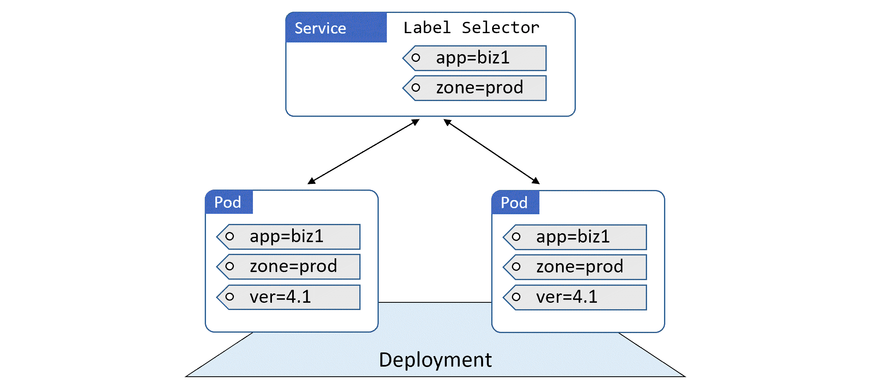

图 6.9

假设我们需要推送一个新版本。但我们需要在不产生停机时间的情况下进行。

为此，我们可以像图 6.10 所示添加运行新版本应用程序的 Pod。

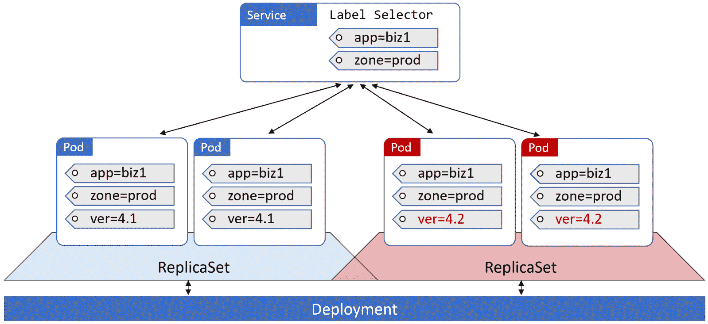

图 6.10

在幕后，更新后的*Pods*通过它们自己的 ReplicaSet 部署，并被标记，以便它们与现有的标签选择器匹配。服务现在正在跨**应用程序的两个版本**（`version=4.1`和`version=4.2`）进行负载均衡请求。

这是因为服务的标签选择器正在不断地进行评估，并且它的端点对象和 ClusterIP 正在不断地更新以匹配新的 Pods。

一旦您满意更新后的版本，强制所有流量使用它就像更新服务的标签选择器以包含标签`version=4.2`一样简单。突然之间，旧版本不再匹配，服务只转发流量到新版本（图 6.11）。

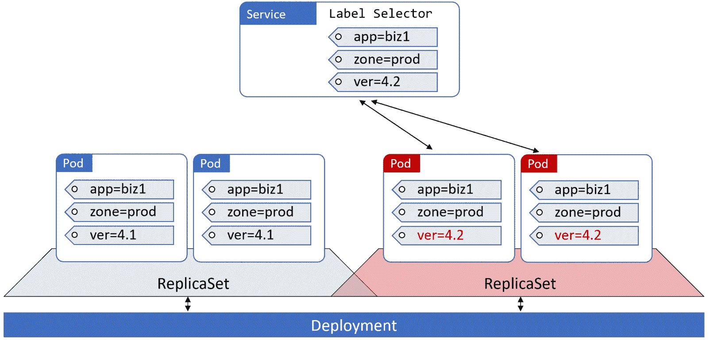

图 6.11

然而，旧版本仍然存在 - 我们只是不再向其发送流量。这意味着如果我们遇到新版本的问题，我们可以通过简单地将服务的标签选择器更改为包含`version=4.1`而不是`version=4.2`来切换回先前的版本。参见图 6.12。

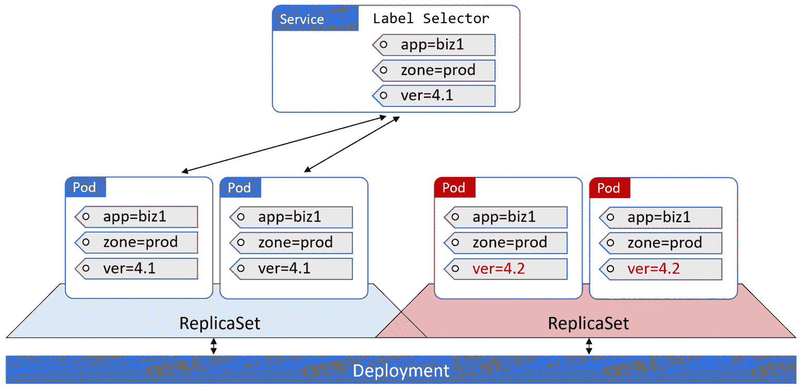

图 6.12

现在每个人都在使用旧版本。

这种功能可以用于各种事情 - 蓝绿部署，金丝雀发布，你想到的都可以。如此简单，却如此强大！

使用以下命令清理实验室。这些命令将删除示例中使用的部署和服务。

```
$ kubectl delete -f deploy.yml
$ kubectl delete -f svc.yml

```

### 章节总结

在本章中，我们了解到*服务*为部署在 Kubernetes 上的应用程序带来了稳定可靠的网络连接。它们还执行负载均衡，并允许我们将应用程序的元素暴露给外部世界（超出 Kubernetes 集群之外）。

服务是 Kubernetes API 中的一流对象，并可以在标准 YAML 清单文件中定义。它们使用标签选择器动态匹配 Pods，并且最好的工作方式是声明性地与它们一起工作。
