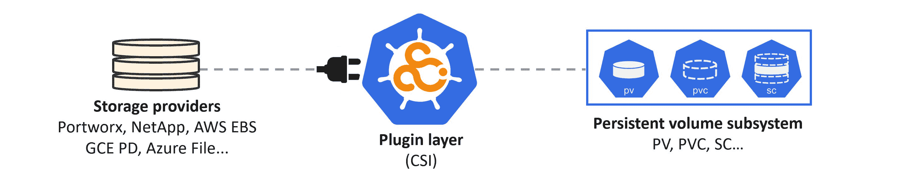

## 7：其他重要的 Kubernetes 内容

Kubernetes 还有很多内容无法在一本书中涵盖。如果我们尝试，将填满整整一套书！

在本章中，我们将简要提及 Kubernetes 的以下领域，这将带您进入下一个级别：

+   DaemonSets

+   StatefulSets

+   作业

+   定时作业

+   自动缩放

+   RBAC

+   存储

+   Helm

其中许多内容将成为未来版本书籍中的独立章节。现在，让我们先尝尝每个领域。

显然，还有更多内容，但就像我们已经说过的 - 它可以填满整整一套书！

### DaemonSets

DaemonSets 是`apps` API 组中的一种资源，它们管理 Pods。它们的用例是当您需要在集群中的每个节点上运行特定 Pod 的副本时。一些例子包括；*监控 Pods*和*日志 Pods*，您需要在集群中的每个节点上运行它们。

正如您所期望的，它实现了一个控制器和一个监视循环。这意味着您可以动态地向集群中添加和删除节点，而 DaemonSet 将确保您始终在每个节点上有一个 Pod 副本。

以下命令显示了`kube-system`命名空间中存在的两个 DaemonSets，在新安装的 3 节点集群上。

输出被修剪以适应页面。

```
kubectl get ds -n kube-system
NAME         DESIRED  CURRENT  READY  NODE SELECTOR
kube-proxy   3        3        3      beta.kubernetes.io/arch=amd64
weave-net    3        3        3      <none>

```

请注意，每个 DaemonSet 的*期望状态*为 3 个副本。您不需要在 DaemonSet YAML 文件中指定这一点，因为它是根据集群中的节点数自动暗示的。

DaemonSets 在`apps/v1` API 组中是稳定的，并且可以通过通常的`kubectl get`和`kubectl describe`命令等进行管理。如果您已经了解 Pods 和部署，您会发现 DaemonSets 非常简单。

### StatefulSets

StatefulSets 是`apps/v1` API 组中的稳定资源。它们的用例是有状态的 Pods - 即不打算是短暂的 Pods。

微服务应用程序的有状态组件通常是最难实现的，而像 Kubernetes 这样的平台在处理它们的功能方面进展缓慢。StatefulSets 是改进这一点的一步。

将它们视为类似于部署是有用的。例如，我们在 YAML 文件中定义它们，然后将其作为期望状态`POST`到 API 服务器。控制器在集群上实现工作，后台监视循环确保当前状态与期望状态匹配。然而，StatefulSet 和 Deployment 之间有一个主要区别 - **通过 StatefulSet 部署的 Pod 是不可互换的**。这意味着当 StatefulSet 管理的 Pod 失败时，会被具有相同 ID 和 IP 等的另一个 Pod 替换。

StatefulSets 的潜在用例是应用程序中维护状态的任何服务。这些可以包括：

+   需要访问特定命名卷的 Pod

+   需要持久网络标识的 Pod

+   必须按特定顺序上线 Pod 的情况

StatefulSet 保证所有这些在 Pod 失败和后续重新调度操作中都会被维护。

由于有状态应用程序的更复杂性，StatefulSets 的配置可能会很复杂。

### 作业和 CronJobs

作业，又称批处理作业，是`batch/v1` API 组中的稳定资源。当您需要运行特定数量的特定 Pod，并且需要保证它们都能成功完成时，它们就会很有用。

值得注意的一些微妙之处：

1.  作业没有期望状态的概念

1.  作业中的 Pod 是短暂的

这两个概念将*作业*与其他对象（如部署、守护进程集和 StatefulSets）分开。而那些对象会持续运行指定数量的某个 Pod，*作业*管理指定数量的某个 Pod，并确保它们完成并成功退出。

*作业*对象实现了通常的控制器和监视循环。如果*作业*对象生成的 Pod 失败，*作业*将在其位置创建另一个。*作业*本身直到所需数量的 Pod 成功完成才会完成。

用例包括典型的批处理工作负载。

有趣的是，*作业*即使只需要运行一个 Pod 完成也是有用的。基本上，每当您需要运行一个或多个短暂的 Pod，并且需要保证它们成功完成时，*作业*对象就是您的朋友！

*CronJobs*只是根据时间表运行的*作业*。

### 自动缩放

部署章节向我们展示了如何手动扩展 Pod 副本的数量。然而，手动扩展一组 Pod 并不会扩展（原谅双关语）。例如，如果您的应用程序在凌晨 4:20 需求激增，如果您需要呼叫操作员，然后登录到集群并手动增加副本数量，这远非理想。如果您需要扩展集群中的节点数量，情况也是一样。

考虑到这些挑战，Kubernetes 提供了几种自动扩展技术。

**水平 Pod 自动缩放器（HPA）**根据需求动态增加和减少部署中的*Pod*数量。

**集群自动缩放器（CA）**根据需求动态增加和减少集群中的*节点*数量。

**垂直 Pod 自动缩放器（VPA）**试图调整 Pod 的大小。目前是一个*alpha*产品。

#### 水平 Pod 自动缩放器（HPA）

HPA 是`autoscaling/v1` API 组中的稳定资源，它的工作是根据观察到的 CPU 指标来扩展部署中副本的数量。在撰写本文时，`v2` API 正在开发中，将允许根据不仅仅是 CPU 来进行扩展。

它的工作方式是这样的……您定义一个使用 Pod 资源请求的部署 - 其中 Pod 中的每个容器请求一定数量的 CPU。您将其部署到集群中。您还创建一个目标该部署的 HPA 对象，并设置一个规则，比如：*如果该部署中的任何 Pod 使用超过其请求的 CPU 的 60%，则增加一个额外的 Pod。*

一旦部署和 HPA 部署到集群中，扩展操作就会变得自动化。

值得注意的一点是，HPA 会更新目标部署的`.spec.replicas`字段。虽然此更新记录在集群存储中的部署对象中，但可能会导致您在外部版本控制系统中的部署 YAML 文件与当前在集群中观察到的内容不同步的情况。

#### 集群自动缩放器（CA）

CA 的目标是调整您的 Kubernetes 集群大小。在高层次上，它们根据需求增加和减少集群中的节点数量。

稍微深入一点……CA 定期检查 Kubernetes 中由于节点资源不足而处于*挂起*状态的 Pod。如果发现任何问题，它会向集群添加节点，以便可以安排挂起的 Pod。

这需要与集群的基础基础设施平台集成 - 一个公共 API，允许 Kubernetes 添加和删除节点。主要的云平台实现了具有不同支持级别的集群自动缩放器。查看您的云提供商文档以获取最新的支持信息。

### 基于角色的访问控制（RBAC）

Kubernetes 实现了最小特权 RBAC 子系统。启用后，它会锁定集群，并允许您基于特定用户和组授予权限。

该模型基于三个主要组件：

+   主体

+   操作

+   资源

*主体*是用户和组，它们必须在 Kubernetes 之外进行管理。*操作*是主体被允许执行的操作（创建、列出、删除等）。*资源*是集群上的对象，如 Pod。将这三者结合起来，就形成了一个 RBAC 规则。例如，**Abi**（主体）被允许**创建**（操作）**Pods**（资源）。

自 Kubernetes 1.8 以来，RBAC 一直稳定（`v1`），并利用在`authorization.rbac.k8s.io` API 组中定义的两个对象。这两个对象是`Roles`和`RoleBindings`。`Role`是您定义要允许的资源和操作的地方，而`RoleBinding`将其与主体连接起来。

### 存储

存储是大多数生产应用程序的重要组成部分。幸运的是，Kubernetes 拥有全面的存储子系统。

该模型的高级架构包括存储提供程序、插件接口和 Kubernetes 持久卷子系统。

存储提供程序负责创建实际的存储，可以是企业级存储阵列和云存储服务等。将它们连接到 Kubernetes 的首选方式是通过容器存储接口（CSI）插件。Kubernetes 持久卷子系统将存储暴露给集群，并提供了消费方式。参见图 7.1。



图 7.1

存储提供程序的示例包括：企业级存储阵列，如 EMC 和 NetApp，以及云存储服务，如 AWS Elastic Block Store（EBS）。这些通过 CSI 插件连接到 Kubernetes，Kubernetes 提供了允许 Pod 访问和使用存储的对象。

存储资源通过`PersistentVolume`（PV）对象在 Kubernetes 中表示，Pod 可以使用`PersistentVolumeClaim`（PVC）对象访问它们。这两者都是核心 API 组的`v1`中的资源。

`StorageClass`对象允许动态创建 PV，并位于`storage.k8s.io/v1` API 组中。

### Helm

Helm 是事实上的 Kubernetes 包管理器，极大地简化了 Kubernetes 应用的安装和管理。

Helm 于 2018 年被接纳为云原生计算基金会（CNCF）的官方顶级项目。因此，它与 Kubernetes、Prometheus、gRPC 等并列。

作为*包管理器*，它就像 Ubuntu 的`apt`和 Mac 的`brew`。在 Helm 的情况下，它隐藏了诸如部署、Pod 和持久卷之类的复杂性，放在一个叫做*chart*的构造中。把 chart 想象成 Helm 版的 YUM、DEB 或 homebrew 包。因此，您可以通过应用的 Helm chart 安装、更新和删除 Kubernetes 应用。

您还可以与社区分享您的 chart，并重复使用现有的 chart。

### 章节总结

本章的目的是让您了解*一些*其他重要的 Kubernetes 技术，以便您知道下一步可能要去哪里。但是，Kubernetes 非常庞大，我们还没有涵盖所有内容。

未来的计划是将其中一些主题作为书的未来版本中的独立章节。如果您等不及，我已经在 acloud.guru 的**Kubernetes 深入探讨**视频课程中涵盖了*自动扩展*、*RBAC*和*存储*。

https://acloud.guru/learn/kubernetes-deep-dive

# 读累了记得休息一会哦~

**公众号：古德猫宁李**

+   电子书搜索下载

+   书单分享

+   书友学习交流

**网站：**[沉金书屋 https://www.chenjin5.com](https://www.chenjin5.com)

+   电子书搜索下载

+   电子书打包资源分享

+   学习资源分享

# 读累了记得休息一会哦~

**公众号：古德猫宁李**

+   电子书搜索下载

+   书单分享

+   书友学习交流

**网站：**[沉金书屋 https://www.chenjin5.com](https://www.chenjin5.com)

+   电子书搜索下载

+   电子书打包资源分享

+   学习资源分享
