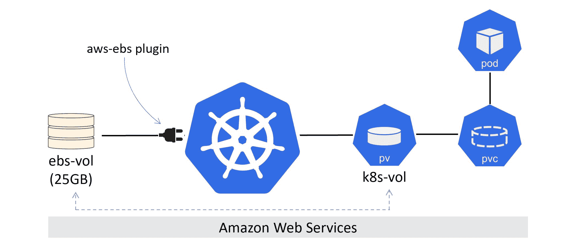
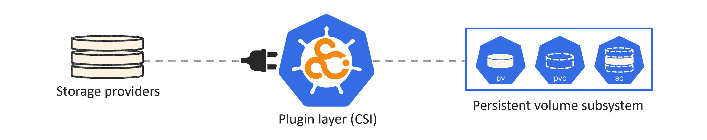

## 第九章：8：接下来做什么

有很多方法可以让你的 Kubernetes 之旅更上一层楼，而且大多数方法都很容易！

### 熟能生巧

亲自动手是无法替代的。幸运的是，现在从未有过如此容易建立一个 Kubernetes 游乐场，在那里你可以玩到你成为世界权威！

我非常喜欢 Play with Kubernetes（https://labs.play-with-k8s.com/）。我喜欢 Docker Desktop，并且我经常在 Google 的 GKE 上建立测试集群。

还有其他选择，它们都比以前简单多了！我记得我曾经为了我的 Windows NT 的 MSCE 考试而苦苦学习，每次我搞垮了实验室，就要花费无数个小时从光盘安装重建 NT 域。现在真的没有理由不动手了！

### 更多书籍

我有一本关于 Docker 的书，得到了极好的评价。Docker 和容器对于 Kubernetes 至关重要，所以如果你需要了解 Docker，去看看吧——它叫做 Docker 深入挖掘，你可以在亚马逊和 Leanpub 上买到。

### 视频培训

如果你喜欢这本书，你会**喜欢**我的视频课程！

我在 Pluralsight 上有一个**入门 Kubernetes**课程，还在 A Cloud Guru 上有一个**Kubernetes 深入**课程。如果你已经读完了所有的书，你可能想直接去深入挖掘课程。

https://acloud.guru/learn/kubernetes-deep-dive

我在 Pluralsight 上还有很多 Docker 课程。

如果你不是 Pluralsight 或 A Cloud Guru 的会员，我建议你成为其中一个！是的，它们是收费的，但它们可能是你职业生涯中做的最好的事情之一！每个平台的月度订阅都可以让你访问**该平台图书馆中的每门课程**——从开发人员到 IT 运维的所有课程。如果你不确定是否要花钱，通常会有一个免费试用期，你可以在有限的时间内免费访问。

### 活动和聚会

你应该参加 KubeCon 和你当地的 Kubernetes 聚会。那里有很多优秀的人，也是学习的好地方！

就这样了。继续学习吧！

### 反馈

谢谢你读我的书。希望你喜欢它。

现在是我请求一个忠告的时候（这是我们在英国拼写的方式）……

写一本书需要**荒谬**的时间和奉献精神。所以，我真的很感激在亚马逊上快速写一篇评论。只需要几分钟，如果你在其他地方买了这本书，你甚至可以在亚马逊上发表评论！欢迎各种类型的评论！

另外……随时可以在[Twitter](https://twitter.com/nigelpoulton)上找我。

就是这样。祝你驾驭职业生涯一帆风顺！
