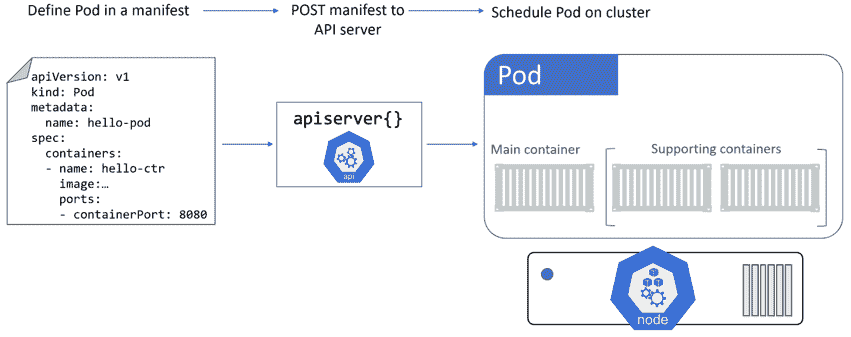

## 四、使用 Pods

我们将把这一章分成两个主要部分:

*   理论
*   动手

让我们继续这个理论。

### Pod 理论

虚拟化世界中的原子调度单元是虚拟机(VM)。这意味着**在虚拟化世界中部署应用**是通过在虚拟机上调度它们来完成的。

在 Docker 世界中，原子单位是容器。这意味着**在 Docker 上部署应用**是通过在容器内部调度它们来完成的。

在 Kubernetes 世界，原子单位是*POD*。因此，**在 Kubernetes 上部署应用**意味着在 Pods 中淘汰它们。

这是理解 Kubernetes 的基础，所以一定要在大脑中把它标记为重要>>虚拟化做虚拟机，Docker 做容器， **Kubernetes 做 Pods。**


<figcaption>Figure 4.1</figcaption>

由于 Pods 是 Kubernetes 中的基本部署单元，因此了解它们的工作方式至关重要。

> **注:**这一章我们会讲很多关于 Pods 的内容。然而，不要忽视这样一个事实，即 Pods 只是**部署应用**的工具。

#### POD 与容器

在前一章中，我们说过一个 Pod 承载一个或多个容器。从占用空间的角度来看，这将 Pods 置于容器和虚拟机之间，它们比容器大一点，但比虚拟机小得多。

再深入一点，Pod 是一个用于一个或多个容器的*共享执行环境*。

最简单的模型是每个 Pod 一个容器的模型。然而，多容器 Pods 越来越受欢迎，对于高级配置非常重要。

多容器 Pods 的一个以应用为中心的用例是共同调度紧密耦合的工作负载。例如，如果两个共享内存的容器被安排在集群中的不同节点上，它们将无法工作。通过将两个容器放在同一个 Pod 中，您可以确保它们被调度到同一个节点并共享同一个执行环境。

多容器 Pods 的以基础设施为中心的用例是服务网格。在服务网格模型中，代理容器被插入到每个应用 Pod 中。这个代理容器处理进出 Pod 的所有网络流量，这意味着它非常适合实现流量加密、网络遥测、智能路由等功能。

#### 多容器 POD:典型的例子

比较单容器和多容器 Pods 的一个常见例子是使用文件同步器的网络服务器。

在这个例子中，有两个明显的关注点:

1.  服务网页
2.  确保内容是最新的

问题是，是在单个容器中还是在两个独立的容器中解决这两个问题。

在这种情况下，一个*关注*是一个需求或任务。一般来说，微服务设计模式要求我们*分离关注点*。这意味着我们每个容器只处理一个问题。

假设前面的例子，这将需要两个容器:一个用于 web 服务，另一个用于文件同步服务。

这种分离关注点的模式有很多优点，包括:

*   不同的团队可以负责两个容器中的每一个
*   每个容器都可以独立缩放
*   每个容器都可以独立开发和迭代
*   每个容器都可以有自己的发布节奏
*   如果一个失败了，另一个继续运行

尽管分离关注点有好处，但通常需要在单个 Pod 中共同调度这些独立的容器。这确保了两个容器被调度到同一个节点，并且共享同一个执行环境(Pod 的环境)。

多容器 Pods 的常见用例包括:需要共享内存或共享一个卷的两个容器(见图 4.2)。


<figcaption>Figure 4.2</figcaption>

与两个容器共享一个卷的最简单方法是将这两个容器配置为同一个 Pod 的一部分。这将确保它们在同一个节点上运行，并且可以访问同一个共享执行环境(包括任何卷)。

总的来说，一般的规则是通过设计容器完成一项工作来分离关注点。最简单的模型为每个 Pod 安排一个容器，但是更高级的用例为每个 Pod 安排多个容器。

#### 我们如何部署 Pods

请记住，Pods 只是执行应用的工具。因此，每当我们谈论运行或部署 Pods 时，我们都在谈论运行和部署应用。

要将 Pod 部署到 Kubernetes 集群，您可以在*清单文件*和`POST`中定义它，该清单文件将应用编程接口服务器。控制平面验证 YAML 文件的配置，将其作为意图记录写入集群存储，调度程序将其部署到具有足够可用资源的健康节点。该过程对于单容器容器和多容器容器容器是相同的。



<figcaption>Figure 4.3</figcaption>

让我们再深入一点…

#### 豆荚的解剖学

在最高层次上，Pod 是一个或多个容器的共享执行环境。*共享执行环境*意味着 Pod 拥有一组资源，这些资源由作为 Pod 一部分的每个容器共享。这些资源包括:IP 地址、端口、主机名、套接字、内存、卷等等…

如果您使用 Docker 作为容器运行时，Pod 实际上是一种特殊类型的容器，称为**暂停容器**。没错，Pod 只是一个特殊容器的奇特名称。这意味着在 Pods 内部运行的容器实际上是在容器内部运行的容器。更多信息，请观看莱昂纳多·迪卡普里奥主演的克里斯托弗·诺兰《盗梦空间》；-)

不过，说真的，Pod(暂停容器)只是系统资源的集合，运行在其中的容器将继承和共享这些资源。这些系统资源是内核名称空间，包括:

*   **网络命名空间:** IP 地址、端口范围、路由表…
*   **UTS 名称空间:**主机名
*   **IPC 命名空间:** Unix 域套接字…

正如我们刚才提到的，这意味着 Pod 中的所有容器共享一个主机名、IP 地址、内存地址空间和卷。

让我们看看这是如何影响网络的。

#### 豆荚和共享网络

每个 Pod 创建自己的网络命名空间。这包括:单个 IP 地址、单个范围的 TCP 和 UDP 端口以及单个路由表。如果 Pod 只有一个容器，则该容器可以完全访问 IP、端口范围和路由表。如果是多容器 Pod，Pod 中的所有容器将共享 IP、端口范围和路由表。

图 4.4 显示了两个豆荚，每个豆荚都有自己的 IP。即使其中一个是多容器 Pod，它仍然只能获得一个 IP。


<figcaption>Figure 4.4</figcaption>

在图 4.4 中，对容器 1 中的容器的外部访问是通过容器的 IP 地址以及您希望到达的容器端口来实现的。例如，`10.0.10.15:80`会把你带到主容器。容器到容器的通信通过 Pod 的本地主机适配器和端口号工作。例如，主容器可以通过`localhost:5000`到达支撑容器。

最后一次(如果感觉我在重复自己的话，请道歉)…Pod 中的每个容器共享 **Pod 的**整个网络命名空间—IP、`localhost`适配器、端口范围、路由表等等。

然而，正如我们已经说过的，这不仅仅是网络。Pod 中的所有容器都可以访问相同的卷、相同的内存、相同的 IPC 套接字等等。从技术上讲，Pod 保存了所有的名称空间，作为 Pod 一部分的任何容器都继承并共享它们。

这种网络模式使得*Pod 间*的交流变得非常简单。集群中的每个 Pod 都有自己的 IP 地址，这些地址在 *Pod 网络*上是完全可路由的。如果您阅读了关于安装 Kubernetes 的章节，您将会看到我们如何在*玩转 Kubernetes* 和*kubernete*部分的末尾创建 Pod 网络。因为每个 Pod 都有自己的可路由 IP，所以 Pod 网络上的每个 Pod 都可以直接与其他 Pod 对话，而不需要糟糕的端口映射。


<figcaption>Figure 4.5 Inter-Pod communication</figcaption>

如前所述，*POD 内部*通信——同一 POD 中的两个容器需要通信——可以通过 POD 的`localhost`接口进行。


<figcaption>Figure 4.6 Intra-Pod communication</figcaption>

如果您需要让同一个 Pod 中的多个容器对外部世界可用，您可以在单独的端口上公开它们。每个容器都需要自己的端口，同一个 Pod 中的两个容器不能使用同一个端口。

总之。都是关于**POD 的！****POD**被部署，**POD**获得了 IP，**POD**拥有所有的名称空间……**POD**位于库服务器的中心。

#### Pods 和 cgroups

在高级别上，控制组(cgroups)是一种 Linux 内核技术，它防止单个容器消耗节点上所有可用的 CPU、内存和 IOPS。你可以说 cgroups 积极地*监管*资源的使用。

单个容器有自己的组限制。

这意味着同一个 Pod 中的两个容器可能有自己的一组组限制。这是一个强大而灵活的模型。如果我们采用本章前面的典型多容器 Pod 示例，您可以在文件同步容器上设置一个 cgroup 限制，这样它可以比 web 服务容器访问更少的资源。这可能会降低 web 服务容器的 CPU 和内存不足的风险。

#### POD 的原子部署

部署 POD 是一个*原子操作*。这意味着这是一个全有或全无的操作——没有部分部署的 Pod 可以服务请求。这也意味着 Pod 中的所有容器将被安排在同一个节点上。

一旦所有的 Pod 资源都准备好了，Pod 就可以开始服务请求了。

#### Pod 生命周期

典型 Pod 的生命周期是这样的。您在 YAML 清单文件中定义它，并将清单发送到应用编程接口服务器。一旦到达那里，清单的内容作为意图(期望状态)的记录被持久保存到集群存储中，并且 Pod 被调度到具有足够资源的健康节点。一旦它被调度到一个节点，它就进入*挂起*状态，同时节点上的容器运行时下载映像并启动任何容器。POD 保持在*等待*状态，直到**所有资源**都准备就绪。一旦一切就绪，POD 进入*运行*状态。一旦它完成了所有的任务，就会被终止并进入*成功*状态。

当 POD 不能启动时，它可以保持在*等待*状态或进入*失败*状态。这些都显示在图 4.7 中。


<figcaption>Figure 4.7 Pod lifecycle</figcaption>

通过 Pod 清单文件部署的 Pod 是*单件*-它们不由控制器管理，该控制器可能会添加自动扩展和自修复功能等功能。出于这个原因，我们几乎总是通过更高级别的控制器来部署 Pods，例如*部署*和*daemmonsets*，因为它们可以在 Pods 失败时重新安排它们。

关于这个话题，重要的是要把 Pods 想象成*凡人*。当他们死了，他们就走了。不可能让他们起死回生。这遵循了*宠物 vs 牛*的类比，Pods 应该被视为*牛*。当他们死了，你用另一个代替他们。没有眼泪，没有葬礼。旧的已经不在了，一个闪亮的新的——配置相同，但 ID 和 IP 不同——神奇地出现并取代了它的位置。

这是您应该设计应用的主要原因之一，这样它们就不会在 Pods 中存储*状态*。这也是为什么我们不应该依赖单个 Pod IPs 的原因。单体 POD 不可靠！

#### Pod 理论概述

1.  在 Kubernetes，荚是调度的原子单位
2.  一个 Pod 中可以有多个容器。单容器 Pods 是最简单的，但多容器 Pods 非常适合需要紧密耦合的容器。它们也非常适合日志记录和服务网格
3.  Pod 在节点上进行调度–您不能调度单个 Pod 实例跨越多个节点
4.  Pods 以声明方式在清单文件中定义，该清单文件被发布到 API 服务器并由调度程序分配给节点
5.  您几乎总是通过更高级别的控制器部署 Pods

### 用豆荚动手

是时候看看 Pods 的行动了。

对于本章剩余部分的示例，我们将使用图 4.8 所示的 3 节点集群。


<figcaption>Figure 4.8</figcaption>

这个集群在哪里或者它是如何部署的并不重要。重要的是，您将三个 Linux 主机配置到一个 Kubernetes 集群中，该集群至少有一个主节点和两个节点。您还需要安装并配置`kubectl`来与集群对话。

获得 Kubernetes 集群的三种超快速方法包括:

*   注册 msb.com 并访问您自己的私人在线集群(外加大量学习内容)
*   将 Docker Desktop 下载并安装到您的计算机上
*   搜索“与 kubernetes 一起玩”，获得一个临时的在线游乐场

遵循*可组合基础设施*的 Kubernetes 口头禅，您在清单文件中定义 Pods，将它们发布到 API 服务器，并让调度程序在集群上实例化它们。

#### Pod 清单文件

对于本章中的示例，我们将使用以下 Pod 清单。这本书的 GitHub repo 在名为 pod.yml 的`pods`文件夹下有售:

```
apiVersion: v1
kind: Pod
metadata:
  name: hello-pod
  labels:
    zone: prod
    version: v1
spec:
  containers:
  - name: hello-ctr
    image: nigelpoulton/k8sbook:latest
    ports:
    - containerPort: 8080 
```

 `让我们来看看 YAML 文件是怎么描述的。

我们可以直接看到四个顶级资源:

*   `apiVersion`
*   `kind`
*   `metadata`
*   `spec`

`.apiVersion`字段告诉您两件事-*API 组*和 *API 版本*。`apiVersion`通常的格式为`<api-group>/<version>`。然而，Pods 是在一个特殊的 API 组中定义的，该组称为*核心*组，省略了 *api 组*部分。例如，存储类对象在`storage.k8s.io`应用编程接口组的`v1`中定义，在 YAML 文件中描述为`storage.k8s.io/v1`。但是 Pods 在*核心* API 组中，比较特殊，因为省略了 API 组名，所以我们在 YAML 文件中描述为只是`v1`。

一个资源可以在一个应用编程接口组的多个版本中定义。例如`some-api-group/v1`和`some-api-group/v2`。在这种情况下，较新组中的定义可能会包括扩展资源功能的附加功能和字段。想象一下 *apiVersion* 字段定义了模式——更新通常更好。有趣的是，在某些情况下，您可以通过 YAML 文件中的一个版本来部署一个对象，但是当您反思它时，返回值显示它是另一个版本。例如，您可以通过在 YAML 文件中指定`v1`来部署一个对象，但是当您对其运行命令时，返回可能会将其显示为`v1beta1`。这是正常的行为。

总之，Pods 是在`v1`路径上定义的。

`.kind`字段告诉 Kubernetes 正在部署的对象类型。

到目前为止，您知道您正在部署一个在*核心应用编程接口组*的`v1`中定义的 Pod 对象。

`.metadata`部分是您附加名称和标签的地方。这些有助于您识别集群中的对象，并在不同对象之间创建松散耦合。您还可以定义对象应该部署到的命名空间。简而言之，名称空间是一种从逻辑上将集群划分为多个虚拟集群的方法，用于管理目的。在现实世界中，强烈建议使用名称空间，但是，您不应该将它们视为强安全边界。

这个 Pod 清单的`.metadata`部分将 Pod 命名为“你好-pod”，并为它分配了两个标签。标签是简单的键值对，但它们的功能强大得惊人。随着您知识的积累，我们将在后面更多地讨论标签。

由于`.metadata`部分没有指定名称空间，Pod 将被部署到`default`名称空间。在现实世界中使用默认的名称空间并不是一个好的做法，但是对于这些例子来说，这很好。

`.spec`部分是您定义将在 Pod 中运行的容器的地方。这个例子是基于`nigelpoulton/k8sbook:latest`映像部署一个带有单个容器的 Pod。它正在调用容器`hello-ctr`并在港口`8080`暴露它。

如果这是一个多容器 Pod，您可以在`.spec`部分定义额外的容器。

#### 清单文件:移情为代码

快速侧步。

配置文件，如 Kubernetes 清单文件，是很好的文档来源。因此，它们有一些次要的好处。其中两个包括:

*   加快新团队成员的入职流程
*   弥合开发人员和运营人员之间的差距

例如，如果您需要一个新的团队成员来理解一个应用的基本功能和需求，让他们阅读应用的 Kubernetes 清单文件。

此外，如果您的运营团队抱怨开发人员没有给出准确的应用需求和文档，请让您的开发人员使用 Kubernetes。Kubernetes 迫使开发人员通过 Kubernetes 清单来描述他们的应用，然后操作人员可以使用这些清单来了解应用是如何工作的，以及它对环境的要求。

尼马尔·梅塔在他 2017 年题为“坚定的信念，松散地持有:将同理心带入信息技术”的 DockerCon 演讲中，将这些好处描述为一种“像代码一样的同理心”。

我理解将 YAML 文件描述为*“移情为代码”*听起来有点极端。然而，这个概念也有优点——它们确实有帮助。

回到正轨…

#### 从清单文件部署 Pods

如果您正在跟随示例，请将清单文件保存为当前目录中的`pod.yml`，然后使用以下`kubectl`命令将清单发布到应用编程接口服务器。

```
$ kubectl apply -f pod.yml
pod/hello-pod created 
```

 `尽管 Pod 显示为已创建，但它可能尚未完全部署和可用。这是因为拉映像需要时间。

运行`kubectl get pods`命令检查状态。

```
$ kubectl get pods
NAME        READY    STATUS             RESTARTS   AGE
hello-pod   0/1      ContainerCreating  0          9s 
```

 `您可以看到容器仍在创建中——可能正在等待从 Docker Hub 中提取映像。

您可以将`--watch`标志添加到`kubectl get pods`命令中，这样您就可以对其进行监控，并查看状态何时变为`Running`。

恭喜你！您的 Pod 已被安排到集群中的一个健康节点，并由本地`kubelet`进程监控。`kubelet`进程是运行在节点上的 Kubernetes 代理。

在未来的章节中，您将看到如何连接到在 Pod 中运行的网络服务器。

#### 反思跑步 POD

虽然`kubectl get pods`命令不错，但细节上有点轻。不过，不用担心，有很多选项可以让你更深刻地反省。

首先，`kubectl get`命令提供了几个非常简单的标志，可以为您提供更多信息:

`-o wide`标志给出了更多的列，但仍然是单行输出。

`-o yaml`标志将事情带入下一个层次。这将从集群存储中返回 Pod 清单的完整副本。输出大致分为两部分:

*   期望状态(`.spec`)
*   当前观察状态(`.status`)

以下命令显示了`kubectl get pods -o yaml`命令的剪切版本。

```
$ kubectl get pods hello-pod -o yaml
apiVersion: v1
kind: Pod
metadata:
  annotations:
    kubectl.kubernetes.io/last-applied-configuration: |
      ...
  name: hello-pod
  namespace: default
spec:  #Desired state
  containers:
  - image: nigelpoulton/k8sbook:latest
    imagePullPolicy: Always
    name: hello-ctr
    ports:
status:  #Observed state
  conditions:
  - lastProbeTime: null
    lastTransitionTime: 2019-11-19T15:24:24Z
    state:
      running:
        startedAt: 2019-11-19T15:26:04Z
... 
```

 `请注意，输出包含的值比您最初在 13 行 YAML 文件中设置的值要多。这些额外的信息来自哪里？

两个主要来源:

*   Kubernetes Pod 对象的设置比我们在清单中定义的要多得多。Kubernetes 会自动用默认值扩展那些没有显式设置的。
*   当您使用`-o yaml`运行`kubectl get pods`时，您将获得 POD*当前观察状态*及其*期望状态*。这个观察到的状态列在`.status`部分。

#### Kubernetes 描述

另一个伟大的 Kubernetes 自省命令是`kubectl describe`。这提供了一个格式良好的对象多行概述。它甚至包括一些重要的对象生命周期事件。以下命令描述了 hello-pod Pod 的状态。

```
$ kubectl describe pods hello-pod
Name:         hello-pod
Namespace:    default
Node:         k8s-slave-lgpkjg/10.48.0.35
Start Time:   Tue, 19 Nov 2019 16:24:24 +0100
Labels:       version=v1
              zone=prod
Status:       Running
IP:           10.1.0.21
Containers:
  hello-ctr:
    Image:          nigelpoulton/k8sbook:latest
    Port:           8080/TCP
    Host Port:      0/TCP
    State:          Running
Conditions:
  Type           Status
  Initialized    True
  Ready          True
  PodScheduled   True
...
Events:
  Type    Reason     Age   Message
  ----    ------     ----  -------
  Normal  Scheduled  2m   Successfully assigned...
  Normal  Pulling    2m   pulling image "nigelpoulton/k8sbook:latest"
  Normal  Pulled     2m   Successfully pulled image
  Normal  Created    2m   Created container
  Normal  Started    2m   Started container 
```

 `输出被剪掉，以帮助它适合这本书。

#### kubectl exec:在 Pods 中运行命令

另一种反思正在运行的 Pod 的方法是登录它或在其中执行命令。您可以使用`kubectl exec`命令完成这两项操作。以下示例显示了如何在`hello-pod`POD 的第一个容器中执行`ps aux`命令。

```
$ kubectl exec hello-pod -- ps aux
PID   USER     TIME   COMMAND
  1   root     0:00   node ./app.js
 11   root     0:00   ps aux 
```

 `您也可以使用`kubectl exec`登录在 Pods 中运行的容器。当您这样做时，您的终端提示将会改变，以指示您的会话现在正在 Pod 中的容器内运行，并且您将能够从那里执行命令(只要命令二进制文件安装在容器中)。

以下`kubectl exec`命令将登录到`hello-container`POD 中的第一个容器。进入容器后，安装`curl`实用程序并运行`curl`命令，从监听端口`8080`传输数据。

```
$ kubectl exec -it hello-pod -- sh

# apk add curl
<Snip>

# curl localhost:8080
<html><head><title>Pluralsight Rocks</title><link rel="stylesheet" href="http://netdna.bootstrapcdn.co\
m/bootstrap/3.1.1/css/bootstrap.min.css"/></head><body><div class="container"><div class="jumbotron"><\
h1>Yo Pluralsighters!!!</h1><p>Click the button below to head over to my podcast...</p><p> <a href="ht\
tp://intechwetrustpodcast.com" class="btn btn-primary">Podcast</a></p><p></p></div></div></body></html\
> 
```

 ``-it`标志使`exec`会话具有交互性，并将终端上的标准输入和标准输出连接到 Pod 中第一个容器内的标准输入和标准输出。当命令完成时，您的 shell 提示符将会改变，以指示您的 shell 现在已连接到容器。

如果您正在运行多容器 Pods，您将需要向`kubectl exec`命令传递`--container`标志，并给它一个您想要与之创建 exec 会话的容器的名称。如果不指定此标志，该命令将对 Pod 中的第一个容器执行。您可以使用`kubectl describe pods <pod>`命令查看 Pod 中容器的顺序和名称。

#### 立方结构日志

另一个用于内省 Pods 的有用命令是`kubectl logs`命令。与其他与 Pod 相关的命令一样，如果不使用`--container`按名称指定容器，它将针对 Pod 中的第一个容器执行。命令的格式是`kubectl logs <pod>`。

很明显，Pods 的内容远不止我们所介绍的内容。然而，你已经学到了足够的东西，可以开始了。

通过键入`exit`退出容器内的执行会话，然后运行`kubectl delete`删除 Pod 来清理实验室。

```
# exit
$ kubectl delete -f pod.yml
pod "hello-pod" deleted 
```

 `### 章节总结

在本章中，您了解到 Kubernetes 世界中的原子部署单位是*POD*。每个 Pod 由一个或多个容器组成，并部署到集群中的单个节点。部署操作是一个全有或全无的*原子操作*。

Pods 是使用 YAML 清单文件以声明方式定义和部署的，通常通过部署等更高级别的控制器来部署它们。您使用`kubectl`命令将清单`POST`发送到应用编程接口服务器，它被存储在集群存储中，并被转换为 PodSpec，该 PodSpec 被调度到具有足够可用资源的健康集群节点。

工作节点上接受 PodSpec 的进程是`kubelet`。这是运行在集群中每个节点上的主 Kubernetes 代理。它接受 PodSpec 并负责拉取所有映像和启动 Pod 中的所有容器。

如果您将单例 Pod(不是通过控制器部署的 Pod)部署到您的集群，并且它运行的节点出现故障，则单例 Pod 不会在另一个节点上重新调度。因此，您几乎总是通过更高级别的控制器来部署 Pods，例如部署和 DaemonSets。这些增加了自我修复和回滚等功能，这些功能是 Kubernetes 如此强大的核心。````````