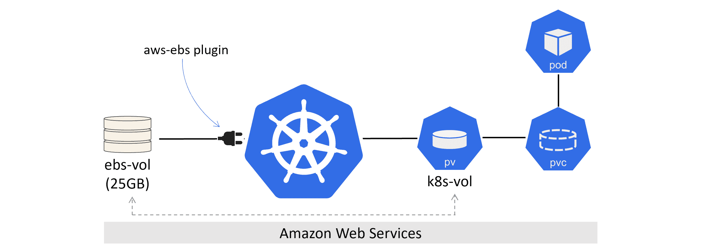
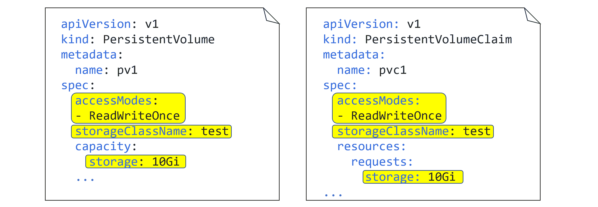

## 八、持久存储

存储对于大多数现实生产应用至关重要。幸运的是，Kubernetes 有一个成熟且功能丰富的存储子系统，称为*持久卷子系统*。

我们将这一章划分如下:

*   整体情况
*   存储供应程序
*   容器存储接口
*   Kubernetes 持久卷子系统
*   存储类别和动态资源调配
*   演示

### 整体情况

首先，Kubernetes 支持来自许多不同地方的许多类型的存储。例如，iSCSI、中小企业、NFS 和对象存储区，它们都来自各种外部存储系统，可以位于云中，也可以位于您的内部数据中心。然而，无论您有什么类型的存储，或者它来自哪里，当它暴露在您的 Kubernetes 集群上时，它被称为 ***卷*** 。例如，Kubernetes 中出现的 Azure 文件资源称为*卷*，AWS 弹性块存储中的块设备也是如此。Kubernetes 集群上的所有存储称为*卷*。

图 8.1 显示了高级架构。


<figcaption>Figure 8.1</figcaption>

左边是存储提供商。它们可以是来自 EMC 和 NetApp 等供应商的传统企业存储阵列，也可以是云存储服务，如 AWS 弹性数据块存储(EBS)和 GCE 持久磁盘(PD)。你只需要一个插件，允许他们的存储资源在 Kubernetes 中以卷的形式出现。

图的中间是插件层。最简单地说，这是连接外部存储和 Kubernetes 的粘合剂。未来，插件将基于容器存储接口(CSI)，这是一个开放标准，旨在为插件提供一个干净的接口。如果您是编写存储插件的开发人员，CSI 会提取内部 Kubernetes 存储细节，并让您在树外开发*。*

 *> **注意:**在 CSI 之前，所有存储插件都是作为 Kubernetes 主代码树的一部分实现的(*树内*)。这意味着它们都必须是开源的，所有的更新和错误修复都与 Kubernetes 的主要发布周期相关联。这对于插件开发人员和 Kubernetes 维护人员来说都是一场噩梦。然而，现在我们有了 CSI，存储供应商不再需要开源他们的代码，他们可以根据自己的时间框架发布更新和错误修复。

图 8.1 右侧是 Kubernetes 持久卷子系统。这是一组允许应用使用存储的应用编程接口对象。在高级别上，持久卷(PV)是您将外部存储映射到群集的方式，持久卷声明(PVC)就像授权应用(Pods)使用 PV 的票证。

让我们假设图 8.2 所示的快速例子。

一个 Kubernetes 集群正在 AWS 上运行，AWS 管理员创建了一个名为“ebs-vol”的 25GB EBS 卷。Kubernetes 管理员创建了一个名为“k8s-vol”的 PV，通过`kubernetes.io/aws-ebs`插件链接回“ebs-vol”。虽然这听起来很复杂，但事实并非如此。PV 只是表示 Kubernetes 集群上的外部存储的一种方式。最后，POD使用聚氯乙烯来声明进入光伏并开始使用它。



<figcaption>Figure 8.2</figcaption>

几分不值。

1.  有保护从多个 Pods 访问单个卷的规则(稍后将详细介绍)。
2.  单个外部存储卷只能由单个 PV 使用。例如，一个 50GB 的外部卷不能有两个 25GB 的 Kubernetes PVs，每个都使用其中的一半。

既然你已经了解了基本原理，让我们再深入一点。

### 存储提供商

Kubernetes 可以使用各种外部系统的存储。这些通常是原生云服务，如`AWSElasticBlockStore`或`AzureDisk`，但它们也可以是提供`iSCSI`或`NFS`卷的传统内部存储阵列。还有其他选择，但重点是 Kubernetes 从各种外部系统获得存储。

一些明显的限制适用。例如，如果您的 Kubernetes 集群在 Microsoft Azure 中运行，则不能使用`AWSElasticBlockStore`置备程序。

### 容器存储接口

CSI 是 Kubernetes 存储拼图的一个重要部分。然而，除非你是一个编写存储插件的开发人员，否则你不太可能经常与它交互。

这是一个开源项目，它定义了一个基于标准的接口，这样就可以在多个容器编排器之间以统一的方式利用存储。换句话说，存储供应商*应该能够编写一个单一的 CSI 插件，可以跨多个管弦乐队工作，比如 Kubernetes 和 Docker Swarm。现实中，Kubernetes是焦点。*

 *在 Kubernetes 世界中，CSI 是编写驱动程序(插件)的首选方式，这意味着插件代码不再需要存在于 Kubernetes 主代码树中。它还提供了一个简洁明了的界面，抽象了所有复杂的内部 Kubernetes 存储机制。基本上，CSI 公开了一个干净的界面，并隐藏了 Kubernetes 代码中所有丑陋的体积机制(无意冒犯)。

从日常管理的角度来看，您与 CSI 的唯一真正交互将是引用您的 YAML 清单文件中的适当插件。此外，现有的树内插件可能需要一段时间才能被 CSI 插件取代。

有时我们将插件*称为“提供者”*，尤其是当我们在本章后面讨论存储类时。

### Kubernetes 持久卷子系统

从日常角度来看，这是您花费大部分时间配置和交互 Kubernetes 存储的地方。

您从图 8.3 左侧的原始存储开始。这个*通过 CSI 插件插入*到 Kubernetes。然后，您可以使用持久卷子系统提供的资源来利用和使用应用中的存储。


<figcaption>Figure 8.3</figcaption>

持久卷子系统中的三个主要资源是:

*   持久卷
*   持续批量索赔
*   存储类别

从高层次上来说， **PVs** 就是你在 Kubernetes 中代表存储的方式。 **PVCs** 就像是授予 Pod 访问 PV 的门票。 **SCs** 让一切都充满活力。

让我们快速浏览一个例子。

假设您有一个 Kubernetes 集群和一个外部存储系统。存储供应商提供了一个 CSI 插件，以便您可以在 Kubernetes 集群中利用其存储资产。您可以在存储系统上调配 3 个 10GB 的卷，并创建 3 个 Kubernetes PV 对象，使它们在您的群集上可用。每个 PV 通过 CSI 插件引用存储阵列上的一个卷。此时，这三个卷是可见的，可以在 Kubernetes 集群上使用。

现在假设您将要部署一个需要 10GB 存储的应用。太好了，你已经有三个 10GB 的 PVs 了。为了让应用使用其中一个，它需要一个聚氯乙烯。如前所述，聚氯乙烯就像一张票，让一个POD(应用)使用光伏。一旦应用有了聚氯乙烯，它就可以将相应的光伏组件作为一个卷安装到其POD中。如果需要可视化表示，请参考图 8.2。

这是一个高层次的例子。开始吧。

这个例子是针对运行在谷歌云上的 Kubernetes 集群的。我正在使用云选项，因为它们最容易跟随，您*可能*能够使用云的免费层/初始免费信用。也可以通过改变一些值来跟随其他云。

该示例假设名为“超级磁盘”的 10GB 固态硬盘卷已在与群集相同的谷歌云区域或分区中预创建。Kubernetes 的步骤是:

1.  创建 PV
2.  创造聚氯乙烯
3.  将卷定义到 PodSpec 中
4.  将其装入容器中

下面的 YAML 文件创建了一个 PV 对象，该对象映射回预先创建的名为“超级磁盘”的谷歌永久磁盘。YAML 文件可以在该书名为`gke-pv.yml`的 GitHub repo 的`storage`文件夹中找到。

```
apiVersion: v1
kind: PersistentVolume
metadata:
  name: pv1
spec:
  accessModes:
  - ReadWriteOnce
  storageClassName: test
  capacity:
    storage: 10Gi
  persistentVolumeReclaimPolicy: Retain
  gcePersistentDisk:
    pdName: uber-disk 
```

 `让我们浏览一下文件。

持久卷资源在*核心*应用编程接口组的`v1`中定义。您将该 PV 命名为“pv1”，将其访问模式设置为`ReadWriteOnce`，并使其成为名为“test”的存储类的一部分。您将它定义为 10GB 卷，设置回收策略，并将其映射回一个名为“超级磁盘”的**预创建的** GCE 持久磁盘。

以下命令将创建 PV。它假设 YAML 文件在你的`PATH`中，并被称为`gke-pv.yml`。如果您没有在后端存储系统上预先创建“超级磁盘”，操作将会失败(在本例中，后端存储由谷歌计算引擎提供)。

```
$ kubectl apply -f gke-pv.yml
persistentvolume/pv1 created 
```

 `检查 PV 是否存在。

```
$ kubectl get pv pv1
NAME   CAPACITY   MODES   RECLAIM POLICY   STATUS      STORAGECLASS ...
pv1    10Gi       RWO     Retain           Available   test 
```

 `如果你愿意，你可以用`kubectl describe pv pv1`看到更详细的信息，但目前你有如图 8.4 所示的信息。


<figcaption>Figure 8.4</figcaption>

让我们快速解释一下 YAML 文件中列出的一些光伏特性。

`.spec.accessModes`定义如何安装光伏。有三种选择:

*   `ReadWriteOnce` (RWO)
*   `ReadWriteMany` (RWM)
*   `ReadOnlyMany`(罗马)

`ReadWriteOnce`定义了一个只能由单个聚氯乙烯安装/绑定为拆装的光伏。来自多个 PVC 的绑定(声明)尝试将会失败。

`ReadWriteMany`定义一个 PV，可以被多个 PV 绑定为 R/W。这种模式通常只受文件和对象存储(如 NFS)的支持。块存储通常只支持`RWO`。

`ReadOnlyMany`定义了一个可以被多个 PVC 绑定为 R/O 的 PV

有几件事值得注意。首先，一个光伏组件只能在一种模式下打开——在只读存储器模式下，单个光伏组件不能绑定一个聚氯乙烯，而在 RWM 模式下，另一个聚氯乙烯不能绑定到它。其次，Pods 不直接作用于 PVs，它们总是作用于与 PV 绑定的 PVC 对象。

`.spec.storageClassName`告诉 Kubernetes 将这个 PV 分组到一个名为“test”的存储类中。在本章的后面，您将了解更多关于存储类的信息，但是您需要在这里确保 PV 将在后面的步骤中与 PVC 正确绑定。

另一个属性是`spec.persistentVolumeReclaimPolicy`。这告诉 Kubernetes 当它的聚氯乙烯已经被释放时如何处理一个光伏。目前有两种政策:

*   `Delete`
*   `Retain`

`Delete`是最危险的，也是通过*存储类*动态创建的 PVs 的默认值(稍后将详细介绍)。此策略删除外部存储系统上的 PV **和相关存储资源，因此将导致数据丢失！你显然应该谨慎使用这项政策。**

`Retain`将保留集群上相关的`PV`对象以及存储在相关外部资产上的任何数据。然而，这将阻止另一个`PVC`在未来使用光伏。

如果你想重新使用一个*保留的* PV，你需要执行以下三个步骤:

1.  手动删除 Kubernetes 上的 PV
2.  重新格式化外部存储系统上的相关存储资产，以擦除任何数据
3.  重新创建 PV

> **提示:**如果您正在实验室中进行实验并重新使用 PV，很容易忘记在尝试重新使用具有*保留*策略的旧的已删除 PV 时，您必须执行前面的三个步骤。

`.spec.capacity`告诉 Kubernetes PV 应该有多大。该值可以小于实际物理存储资产，但不能大于该值。例如，您不能创建映射回外部存储系统上 50GB 设备的 100GB PV。但是你可以创建一个 50GB 的 PV，映射回一个 100GB 的外部卷(但是那会很浪费)。

最后，YAML 文件的最后一行将 PV 链接到后端预创建设备的名称。

您也可以使用光伏 YAML 的`.parameters`部分指定供应商特定的属性。稍后，当您查看*存储类*时，您会看到更多这方面的内容，但目前，如果您的存储系统支持粉色蓬松的 NVMe 设备，您可以在这里指定它们。

现在您已经有了一个 PV，让我们创建一个 PVC，这样 Pod 就可以声明访问存储。

下面的 YAML 定义了一个聚氯乙烯，可以被豆荚用来访问你之前创建的`pv1`光伏。该文件位于该书名为`gke-pvc.yml`的 GitHub repo 的`storage`文件夹中。

```
apiVersion: v1
kind: PersistentVolumeClaim
metadata:
  name: pvc1
spec:
  accessModes:
  - ReadWriteOnce
  storageClassName: test
  resources:
    requests:
      storage: 10Gi 
```

 `与光伏一样，光伏是*核心*原料药组中稳定的`v1`资源。

关于聚氯乙烯对象，最重要的一点是`.spec`部分的值必须与绑定它的光伏相匹配。在本例中，*访问模式*、*存储等级*和*容量*必须与光伏相匹配。

> **注:**光伏有可能比聚氯乙烯有更大的容量。例如，一个 10GB 的聚氯乙烯可以绑定到一个 15GB 的光伏(显然这将浪费 5GB 的光伏)。但是，15GB 聚氯乙烯不能绑定到 10GB 光伏。

图 8.5 显示了示例光伏和聚氯乙烯 YAML 文件的并排比较，并强调了需要匹配的属性。



<figcaption>Figure 8.5</figcaption>

使用以下命令部署聚氯乙烯。它假设 YAML 文件被称为“gke-pvc.yml”，并且存在于您的`PATH`中。

```
$ kubectl apply -f gke-pvc.yml
persistentvolumeclaim/pvc1 created 
```

 `检查聚氯乙烯是否已创建并绑定到光伏。

```
$ kubectl get pvc pvc1
NAME   STATUS   VOLUME   CAPACITY   ACCESS MODES   STORAGECLASS
pvc1   Bound    pv1      10Gi       RWO            test 
```

 `好的，在我们的 Kubernetes 集群上有一个名为`pv1`的 PV，代表 10GB 的外部存储，并且您已经将一个名为`pvc1`的 PVC 绑定到它。让我们了解一下 Pod 如何利用聚氯乙烯并使用实际存储。

通常情况下，您会通过更高级别的控制器来部署您的应用，例如*部署*和*状态集*，但是为了简单起见，您将部署单个 *Pod* 。像这样部署的POD通常被称为*“单件”*，不建议用于生产，因为它们不能提供高可用性，也不能自我修复。

下面的 YAML 定义了一个单容器 Pod，它有一个名为“数据”的卷，利用了您已经创建的 PVC 和 PV 对象。该文件位于该书名为`volpod.yml`的 GitHub repo 的`storage`文件夹中。

```
apiVersion: v1
kind: Pod
metadata:
  name: volpod
spec:
  volumes:
  - name: data
    persistentVolumeClaim:
      claimName: pvc1
  containers:
  - name: ubuntu-ctr
    image: ubuntu:latest
    command:
    - /bin/bash
    - "-c"
    - "sleep 60m"
    volumeMounts:
    - mountPath: /data
      name: data 
```

 `可以看到第一个提到存储的是`.spec.volumes`。这定义了一个称为“数据”的卷，它利用了以前创建的称为“pvc1”的 PVC。

您可以运行`kubectl get pv`和`kubectl get pvc`命令来显示您已经创建了一个名为“pvc1”的聚氯乙烯，该聚氯乙烯绑定到一个名为“pv1”的光伏上。`kubectl describe pv pv1`还将证明`pv1`与一个名为“超级磁盘”的 10GB GCE 持久磁盘有关。

使用以下命令部署 Pod。

```
$ kubectl apply -f volpod.yml
pod/volpod created 
```

 `您可以运行`kubectl describe pod volpod`命令来查看 Pod 是否成功使用`data`卷和`pvc1`声明。

在我们了解如何利用*存储类*实现所有这些动态之前，是时候进行快速总结了。

您从外部存储系统上的存储资产开始。您使用 CSI 插件将外部存储系统与 Kubernetes 集成，并使用持久卷(PV)对象使外部系统资产可访问和可用。每个 PV 都是 Kubernetes 集群上的一个对象，它映射回外部存储系统上的特定存储资产(LUN、共享、blob……)。最后，对于使用光伏的POD，它需要一个持久的体积索赔(聚氯乙烯)。这就像一张票，将POD授予光伏。一旦光伏和聚氯乙烯对象被创建和绑定，聚氯乙烯可以在 PodSpec 中被引用，并且关联的光伏作为卷安装在容器中。

如果这看起来很复杂，不要担心，我们将在本章末尾的演示中把它们整合在一起。

### 存储类别和动态资源调配

到目前为止，您所看到的一切都是正确的，也是 Kubernetes 存储的基础。但是它不能扩展——管理大型 Kubernetes 环境的人不可能手动创建和维护大量的 PVs 和 PVC。你需要更有活力的东西。

进入*存储类* …

顾名思义，存储类允许您定义不同的存储类或存储层。如何定义类由您决定，但取决于您可以访问的存储类型。例如，您可以定义一个*快速*类、*慢速*类和一个*加密*类(您的外部存储系统需要支持不同的存储速度并支持加密卷，因为 Kubernetes 不支持这些)。

就 Kubernetes 而言，存储类被定义为`storage.k8s.io/v1` API 组中的资源。资源类型是`StorageClass`，您可以在常规的 YAML 文件中定义它们，并将其发布到应用编程接口服务器进行部署。使用`kubectl`时，可以使用`sc`简称来指代存储类对象。

> **注意:**您可以使用`kubectl api-resources`命令查看完整的 API 资源列表及其简称。命令的输出显示:每个资源所属的应用编程接口组(空字符串表示*核心*应用编程接口组)，如果资源是命名空间的，写 YAML 文件时它的对等物`kind`是什么。

#### a 存储类 yaml

下面是一个简单的存储类 YAML 文件的例子。它定义了一个名为“fast”的存储类别，基于爱尔兰地区(`eu-west-1a`)的 AWS 固态硬盘(`io1`)。它还要求每千兆字节 10 IOPs 的性能水平。

```
kind: StorageClass
apiVersion: storage.k8s.io/v1
metadata:
  name: fast
provisioner: kubernetes.io/aws-ebs
parameters:
  type: io1
  zones: eu-west-1a
  iopsPerGB: "10" 
```

 `和所有的Kubernetes YAML 一样，`kind`告诉 API 服务器正在定义什么类型的对象，`apiVersion`告诉它将模式的哪个版本应用于资源。`metadata.name`是一个任意的字符串值，让你给对象一个友好的名字——这个例子定义了一个名为“fast”的类。`provisioner`告诉 Kubernetes 使用哪个插件，`parameters`字段让您可以微调后端要利用的存储类型。

一些快速的事情毫无价值:

1.  存储类对象是不可变的，这意味着一旦部署就不能修改它们
2.  `metadata.name`应该是有意义的，因为它是其他对象引用类的方式
3.  术语*供应器*和*插件*可以互换使用
4.  `parameters`部分是针对插件特定的值，每个插件都可以自由支持自己的一组值。配置本节需要存储插件和相关存储后端的知识

#### 多个存储评估

您可以根据需要配置任意多的存储类对象。但是，每一个都与单个置备程序相关。例如，如果您有一个带有 StorageOS 和 Portworx 存储后端的 Kubernetes 集群，您将至少需要两个 StorageClass 对象。也就是说，每个后端可以提供多个存储类/层，每个存储类/层都可以有自己的存储类。例如，您可以从同一个后端为不同类别的存储**拥有以下两个存储类对象:**

1.  高性能加密卷的“快速安全”
2.  高性能未加密卷的“快速”

存储类在 Portworx 后端定义加密卷的示例可能如下所示。它只有在你有 Portworx 的情况下才会起作用。

```
kind: StorageClass
apiVersion: storage.k8s.io/v1
metadata:
  name: portworx-db-secure
provisioner: kubernetes.io/portworx-volume
parameters:
  fs: "xfs"
  block_size: "32"
  repl: "2"
  snap_interval: "30"
  io-priority: "medium"
  secure: "true" 
```

 `如您所见，`.parameters`部分很长，列出了一些神秘的值。配置此部分需要了解插件以及存储后端支持什么。有关详细信息，请参考您的存储插件文档。

#### 实施存储评估

在集群上部署*和使用*存储类的基本工作流程如下:

1.  使用存储后端创建您的 Kubernetes 集群
2.  确保存储后端的插件可用
3.  创建存储类对象
4.  创建一个通过名称引用存储类的 pvc 对象
5.  部署一个使用基于聚氯乙烯的卷的 Pod

请注意，工作流程不包括创建 PV。这是因为存储类动态创建 PVs。

下面的 YAML 代码片段包含了存储类、持久卷声明和 Pod 的定义。通过用三个破折号(`---`)分隔每个对象，可以在单个 YAML 文件中定义所有三个对象。

请注意 PodSpec 如何通过名称引用聚氯乙烯，而聚氯乙烯又如何通过名称引用供应链。

```
kind: StorageClass
apiVersion: storage.k8s.io/v1
metadata:
  name: fast  # Referenced by the PVC
provisioner: kubernetes.io/gce-pd
parameters:
  type: pd-ssd
---
apiVersion: v1
kind: PersistentVolumeClaim
metadata:
  name: mypvc  # Referenced by the PodSpec
  namespace: mynamespace
spec:
  accessModes:
  - ReadWriteOnce
  resources:
    requests:
      storage: 50Gi
  storageClassName: fast    # Matches name of the SC
---
apiVersion: v1
kind: Pod
metadata:
  name: mypod
spec:
  volumes:
    - name: data
      persistentVolumeClaim:
        claimName: mypvc  # Matches PVC name
  containers: ...
  <SNIP> 
```

 `之前的 YAML 被截断，不包括完整的 PodSpec。

到目前为止，您已经看到了一些 SC 定义。但是，每一个都略有不同，因为每个都与不同的置备程序(存储插件/后端)相关。您需要参考存储插件的文档来了解您的置备程序支持哪些选项。

在演示之前，让我们快速总结一下您对存储课程的了解。

存储评估使您不必手动创建 PVs。您创建存储类对象，并使用插件将其绑定到特定存储后端的特定存储类型。例如，AWS 孟买地区的高性能 AWS 固态硬盘存储。SC 需要一个名称，并在您使用`kubectl`部署的 YAML 文件中定义。一旦部署完成，存储类就会监视应用编程接口服务器，寻找引用其名称的新的聚氯乙烯对象。当匹配的卷影副本出现时，存储类会在后端存储系统上动态创建所需的卷，并在 Kubernetes 上创建卷影副本。

总会有更多的细节，比如*挂载选项*和*卷绑定模式*，但是到目前为止你学到的已经足够让你不仅仅是开始。

让我们用一个演示把所有的东西集合起来。

### 演示

在本节中，您将浏览一个使用存储类的演示。演示的基本步骤是:

1.  创建存储类
2.  创建一个聚氯乙烯
3.  创建一个充分利用它的 Pod

Pod 将使用 PVC 映射一个卷，进而触发 SC 动态创建一个 PV 和相关的外部存储资产。演示将在谷歌云平台上进行，并假设您有一个正确配置了`kubectl`的工作集群。

#### 清理

如果你一直跟着，你会有一个豆荚，一个聚氯乙烯和光伏已经创建。在继续演示之前，让我们删除这些内容。

```
$ kubectl delete pods volpod
pod "volpod" deleted

$ kubectl delete pvc pvc1
persistentvolumeclaim "pvc1" deleted

$ kubectl delete pv pv1
persistentvolume "pv1" deleted 
```

 `#### 创建存储类

我们将使用下面的 YAML 创建一个名为“慢”的存储类，它基于谷歌 GCE 标准持久磁盘。我们不会讨论存储后端的细节，但可以说它是一个缓慢的磁盘层。YAML 还设置了回收策略，以便在释放聚氯乙烯绑定时不会丢失数据。最后，它使用*注释*来尝试将其设置为集群上的默认存储类。

这是 YAML 的文件，可以在这本书名为`google-sc.yml`的 GitHub repo 的存储文件夹中找到。

```
kind: StorageClass
apiVersion: storage.k8s.io/v1
metadata:
  name: slow
  annotations:
    storageclass.kubernetes.io/is-default-class: "true"
provisioner: kubernetes.io/gce-pd
parameters:
  type: pd-standard
reclaimPolicy: Retain 
```

 `部署供应链之前需要注意两件事:

1.  本实验室在 Kubernetes 1.16.2 上进行了测试
2.  在 Kubernetes 的测试版本上设置默认存储类是通过注释完成的。这在未来的版本中可能会改变。

使用以下命令部署供应链:

```
$ kubectl apply -f google-sc.yml
storageclass.storage.k8s.io/slow created 
```

 `可以用`kubectl get sc slow`和`kubectl describe sc slow`检查检查。例如:

```
$ kubectl get sc slow
NAME             PROVISIONER            AGE
slow (default)   kubernetes.io/gce-pd   32s 
```

 `#### 创建一个聚氯乙烯

使用以下 YAML 创建一个引用上一步创建的`slow`存储类的聚氯乙烯对象。YAML 可以在这本书名为`google-pvc.yml`的生长激素报告的存储文件夹中找到。

```
apiVersion: v1
kind: PersistentVolumeClaim
metadata:
  name: pv-ticket
spec:
  accessModes:
  - ReadWriteOnce
  storageClassName: slow
  resources:
    requests:
      storage: 25Gi 
```

 `需要注意的重要事情是，聚氯乙烯被称为`pv-ticket`，它链接到`slow`类，用于 25GB 的卷。

让我们部署它。

```
$ kubectl apply -f google-pvc.yml
persistentvolumeclaim/pv-ticket created 
```

 `用`kubectl get pvc`验证操作。

```
$ kubectl get pvc pv-ticket
NAME        STATUS   VOLUME         CAPACITY   ACCESS MODES   STORAGECLASS
pv-ticket   Bound    pvc-881a23...  25Gi       RWO            slow 
```

 `请注意，聚氯乙烯已经绑定到`pvc-881a23...`卷-您不必手动创建光伏。操作背后的机制如下:

1.  您创建了`slow`存储类
2.  创建了一个循环来监视应用编程接口服务器，以查找引用`slow`存储集的新物理卷
3.  您创建了`pv-ticket` PVC，该 PVC 请求绑定到来自**慢速存储类**的 25GB 卷
4.  存储类循环注意到了这个聚氯乙烯，并动态创建了请求的 PV

使用以下命令验证集群上是否存在自动创建的 PV。

```
$ kubectl get pv
NAME         CAPACITY  Mode  STATUS  CLAIM       STORAGECLASS
pvc-881...   25Gi      RWO   Bound   pv-ticket   slow 
```

 `为了更好地适应这本书，一些栏目已经从输出中删除了。

下面的 YAML 定义了单容器 Pod。Pod 模板使用`pv-ticket`聚氯乙烯定义了一个名为`data`的体积。它还定义了一个将`data`体积安装到`/data`的容器。YAML 的文件在该书名为`google-pod.yml`的 GitHub repo 的存储文件夹中。

```
apiVersion: v1
kind: Pod
metadata:
  name: class-pod
spec:
  volumes:
  - name: data
    persistentVolumeClaim:
      claimName: pv-ticket
  containers:
  - name: ubuntu-ctr
    image: ubuntu:latest
    command:
    - /bin/bash
    - "-c"
    - "sleep 60m"
    volumeMounts:
    - mountPath: /data
      name: data 
```

 `用`kubectl apply -f google-pod.yml`展开POD。

恭喜你。您已经部署了一个新的默认存储类，并使用了一个聚氯乙烯来动态创建一个光伏。您还有一个 Pod，它将聚氯乙烯作为一个卷安装在一个容器中。

#### 清理

如果您已经完成了演示，您将看到一个名为“类-pod”的 Pod，其卷使用了通过“慢速”SC 动态创建的“PV-ticket”PVC。以下命令将删除所有这些对象。

```
$ kubectl delete pod class-pod
pod "class-pod" deleted

$ kubectl delete pvc pv-ticket
persistentvolumeclaim "pv-ticket" deleted

$ kubectl delete sc slow
storageclass.storage.k8s.io "slow" deleted 
```

 `#### 使用默认存储类

最后一件事…

如果您的集群有一个*默认存储类*，您可以只使用一个 PodSpec 和一个 PVC 来部署 Pod。您不需要手动创建存储类。但是，实际的生产集群通常会有多个存储资产，因此最佳做法是创建和管理适合您的业务和应用需求的存储资产。默认存储类通常只在开发环境和没有特定存储要求的时候有用。

### 章节总结

在本章中，您了解到 Kubernetes 有一个强大的存储子系统，允许它利用各种外部存储后端的存储。

每个后端都需要一个插件，这样它的存储资产就可以在集群上使用，首选的插件类型是 CSI 插件。启用插件后，持久卷(PV)用于表示 Kubernetes 集群上的外部存储资源，持久卷声明(PVC)用于让 Pods 访问 PV 存储。

存储类通过允许应用动态请求存储，将事情推向了一个新的高度。您可以从存储后端创建引用存储类或存储层的存储类对象。一旦创建，存储类将监视应用编程接口服务器，寻找引用该存储类的新持久卷声明。当匹配的聚氯乙烯到达时，供应链动态创建存储，并使其作为光伏可用，可作为卷装入POD(容器)。`````````````````````**