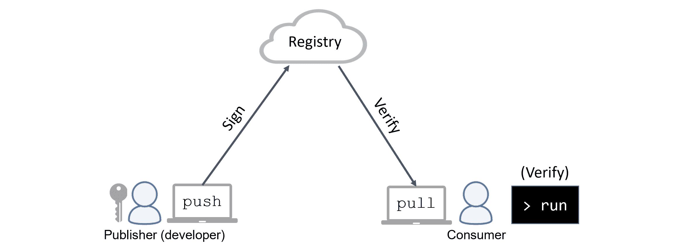

## 12:真实世界的 Kubernetes 安全

在前一章中，我们使用 STRIDE 对 Kubernetes 进行了威胁建模。在本章中，我们将介绍在现实世界中实现 Kubernetes 时，您可能会遇到的一些常见的安全相关挑战。

虽然我们承认每个 Kubernetes 部署都是不同的，但是有许多相似之处。因此，我们介绍的示例将影响大部分大大小小的 Kubernetes 部署。

现在，我们不会提供*食谱风格的*解决方案。相反，我们将从高层次的角度来看待事物，类似于*安全架构师*所拥有的。

我们将把这一章分成以下四个部分:

*   CI/CD 管道
*   基础设施和网络
*   身份和访问管理
*   安全监控和审计

### CI/CD 管道

容器是一种革命性的应用*包装*和*运行时*技术。

在打包方面，我们方便地将应用程序代码和依赖项捆绑到一个*图像*中。除了代码和依赖项，图像还包含运行应用程序所需的命令。这使得集装箱极大地简化了构建、运输和运行应用程序的过程。它还克服了臭名昭著的“*它在我的笔记本电脑上工作*”的问题。

然而，容器也使得运行危险的代码比以往任何时候都更容易。

考虑到这一点，让我们来看看一些可以保护应用程序代码从开发人员的笔记本电脑流向生产服务器的方法。

#### 图像存储库

我们将图像存储在注册表中，注册表可以是公共的，也可以是私有的。

> **注意:**每个注册表都分为一个或多个存储库，我们实际上是将图像存储在存储库中。

公共注册中心在互联网上，是下载图像和运行容器最简单的方式。然而，重要的是要理解他们主持混合了*官方图片*和*社区图片*。官方图片通常由产品供应商提供，并经过审查程序，以确保一定的质量水平。通常，官方图像会；实施最佳实践，扫描已知漏洞，包含最新代码，并得到产品供应商的支持。*社区图片*都不是。是的，有一些优秀的社区形象，但是你在使用它们时应该非常小心。

考虑到所有这些，为开发人员实现一种在您的环境中获取和使用映像的标准方式是非常重要的。对于开发人员来说，任何这样的过程都尽可能没有摩擦也是至关重要的——如果有太多的摩擦，您的开发人员将寻找绕过它们的方法。

让我们讨论一些可能有帮助的事情。

#### 使用批准的基本图像

图像由多层组成，这些层相互叠加形成有用的图像。但是所有的图像都是从基层开始的。

图 12.1 显示了一个包含三层的图像的简单示例。基础层包含应用程序运行所需的核心操作系统和文件系统组件。中间层包含应用程序库依赖项。顶层包含开发人员编写的代码。我们称这些层的组合为*图像*，它包含运行应用程序所需的一切。

<figcaption>Figure 12.1</figcaption>

由于所有映像都有一个包含应用程序所需的操作系统(OS)和文件系统结构的基础层，因此组织通常会有少量*批准的基础映像*。这些基础图片来源于*官方图片*，这也很常见，但并非必不可少。例如，如果您在 CentOS Linux 上开发您的应用程序，您的基础映像*可能*是基于官方 CentOS 映像的-您可以获取官方 CentOS 基础映像并根据您的需求进行调整。

在这个模型中，所有的应用程序都将建立在一个公共的批准的基础映像之上，如图 12.2 所示。

<figcaption>Figure 12.2</figcaption>

虽然创建和实施基本映像需要一些前期工作，但长期的安全优势是值得的。

从开发人员的角度来看，他们可以将全部精力集中在应用程序及其依赖关系上，而不必担心操作系统组件的维护，也不必担心补丁、驱动程序、审核设置等问题。

从运营角度来看，基本映像减少了软件蔓延。这使得测试更加容易，因为您将总是在已知的基础映像上进行测试。它使推送更新变得更容易，您只需要更新少量已批准的基本映像，并让这些映像轻松地推广到所有开发人员。它还使故障排除变得更加容易，因为您有少量众所周知的基本映像提供您的构建模块。它还可以减少需要绑定到支持合同的基本映像配置的数量。

#### 非标准基本图像

尽管拥有少量批准的基本图像很好，但应用程序仍然可能需要一些不同的东西。这意味着您需要适当的流程:

*   确定现有批准的基本映像无法使用的原因
*   确定现有批准的基本映像是否可以更新以满足要求(包括是否值得努力)
*   确定为环境带来全新映像的支持含义

一般来说，更新现有的基础映像(例如为 GPU 计算添加设备驱动程序)应该比引入全新的映像更受欢迎。

#### 控制图像访问

有多种选项允许您保护组织的容器映像。最安全实用的选择是在自己的防火墙内托管自己的私有注册表。这允许您的组织管理注册表的部署方式、复制方式以及修补方式。它还将权限与现有的身份管理提供程序(如活动目录)相集成，并允许您创建适合您的组织结构的存储库。

如果您没有专用的私有注册中心，您可以将映像托管在公共注册中心(如 Docker Hub)的私有存储库中。然而，这不如在自己的防火墙网络中托管自己的私有注册表安全。

无论选择哪种解决方案，您都应该只托管被批准在组织内使用的映像。通常，这些将来自*可信的*来源，并由您的信息安全团队审查。您应该对存储这些图像的存储库进行访问控制，以便只有经过批准的用户才能推送和拉取它们。

除了注册表本身，您还应该:

*   限制哪些群集节点可以访问互联网，记住您的映像注册表可能在互联网上
*   配置仅允许授权用户/节点可以`push`访问存储库的访问控制

在上面的列表中扩展…

如果您正在使用公共注册表，您可能需要授予您的工作节点访问互联网的权限，以便他们可以`pull`图像。在这种情况下，最佳做法是将互联网访问限制在您使用的任何注册表的地址和端口。您还应该实现强大的 RBAC 规则，以便您可以保持对谁从哪些存储库中推送和提取图像的控制。例如，开发人员可能应该能够从非生产存储库中获取`push`和`pull`，但不能从生产存储库中获取。而运营团队应该能够将`pull`从非生产，以及`push`和`pull`重新部署到生产。

最后，您可能只需要一个节点子集(*构建节点*)就可以生成`push`图像。您甚至可能希望锁定一些东西，以便只有您的自动化构建系统可以推送到某些存储库。

#### 将图像从非生产转移到生产

许多组织都有独立的开发、测试和生产环境。

一般来说，开发环境的规则较少，通常被用作开发人员可以进行实验的地方。这样的实验通常涉及使用非标准图像，这些图像是您的开发人员最终希望在生产中使用的。

以下小节将概述您可以采取的一些措施，以确保只有安全的映像才能获准投入生产。

#### 漏洞扫描

在允许图像进入生产之前，首先要审查的应该是*漏洞扫描*。这是一个在二进制级别扫描图像，并根据已知安全漏洞的数据库检查图像内容的过程。

如果您的组织有自动化的配置项/光盘构建管道，您肯定应该集成漏洞扫描。作为其中的一部分，您应该考虑定义自动失败构建的策略，并隔离包含特定类别漏洞的映像。例如，您可以实现一个构建阶段，该阶段扫描图像，并使用具有已知*关键*漏洞的图像自动使任何事情失败。

如果你这样做，要记住两件事…

首先，扫描引擎只和它们使用的漏洞数据库一样好。

其次，扫描引擎可能不会实现智能化。例如，当通用名称包含大量通配符时，Python 中执行 TLS 验证的方法可能容易受到拒绝服务攻击。但是，如果您从未以这种方式使用 Python，漏洞*可能*不相关，您*可能*想将其视为假阳性。考虑到这一点，您可能希望实现一个解决方案，该解决方案能够将某些漏洞标记为*不适用*。

#### 配置为代码

扫描应用程序代码中的漏洞是广泛采用的生产最佳实践。然而，审查应用程序配置，如 Dockerfiles 和 Kubernetes YAML 文件，并没有被广泛采用。

容器的*构建一次，运行在任何地方*口头禅意味着单个容器或 Pod 配置可以有数百或数千个运行实例。如果这些配置中的一个引入了易受攻击的代码，您很容易最终运行数百或数千个易受攻击的代码实例。考虑到这一点，如果您还没有检查您的 Dockerfiles 和 Kubernetes YAML 文件的安全问题，您应该现在就开始！

一个广为人知的不审查配置的例子是，一个 IBM 数据科学实验在其容器映像中嵌入了私有 TLS 密钥。这使得攻击者能够提取映像并获得对托管容器的节点的根访问权限。如果对应用程序的 Dockerfiles 执行了安全审查，就不会发生这种情况。

使用工具将*策略实现为代码*规则，在自动化这些类型的检查方面不断取得进步。

#### 签名容器图像

信任在当今世界是一件大事，在软件交付管道的每个阶段对内容进行加密签名正成为*必须具备的条件*。幸运的是，Kubernetes 和许多容器运行时支持加密签名和验证图像的能力。

在这个模型中，开发人员对他们的图像进行加密签名，消费者在`pull`和`run`时对其进行加密验证。这个过程让消费者相信，他们正在处理的图像是他们要求的图像，并且没有被篡改。

图 12.3 显示了高级图像签名和验证过程。

<figcaption>Figure 12.3</figcaption>

图像签名和签名验证通常由容器运行时实现，Kubernetes 并不积极参与。

除了像这样签署图像之外，更高级别的工具(如 Docker Universal Control Plane)还允许您实施企业范围的策略，这些策略要求某些团队在允许使用图像之前签署图像。

#### 形象推广工作流程

到目前为止，我们已经介绍了所有内容，用于将映像升级到产品的 CI/CD 管道应该包括尽可能多的以下安全相关步骤:

1.  仅将环境配置为`pull`和`run`签名图像
2.  配置网络规则，限制哪些节点可以`push`和`pull`镜像
3.  使用 RBAC 规则配置存储库
4.  开发人员使用批准的基础图像构建图像
5.  开发人员签署图像，并推动批准的回购
6.  对图像进行扫描，查找已知的漏洞
    *   策略根据扫描结果决定是升级还是隔离映像
7.  安全团队:
    *   查看源代码和扫描结果
    *   根据需要更新漏洞等级
    *   查看容器和 Pod 配置文件
8.  安全小组在图像上签名
9.  所有映像拉取和容器运行操作都会验证映像签名

这些步骤只是示例，并不代表确切的工作流程。

让我们将焦点从图像和 CI/CD 管道上移开。

### 基础设施和网络

在本节中，我们将了解一些隔离工作负载的方法。

我们将从集群级别开始，切换到运行时级别，然后在集群之外查看支持基础架构，如网络防火墙。

#### 集群级工作负载隔离

开门见山， **Kubernetes 不支持安全的多租户集群。Kubernetes 中唯一的集群级安全边界是集群本身。**

让我们仔细看看…

划分 Kubernetes 集群的唯一方法是创建*名称空间*。Kubernetes 命名空间与 Linux 内核命名空间不同，它是单个 Kubernetes 集群的逻辑分区。事实上，这只是一种资源分组和应用的方式，比如:

*   限制
*   定额
*   RBAC 规则
*   更多…

要点是 Kubernetes 命名空间不能保证一个命名空间中的 Pod 不会影响另一个命名空间中的 Pod。因此，您不应该在同一个物理集群上运行潜在的敌对生产工作负载。运行潜在恶意工作负载并保证真正隔离的唯一方法是在不同的集群上运行它们。

尽管如此，Kubernetes 名称空间还是有用的，您*应该*使用它们——只是不要把它们用作安全边界。

让我们看看名称空间如何与*软多租户*和*硬多租户*相关联。

##### 名称空间和软多租户

出于我们的目的，我们将*软多租户*定义为在共享基础架构上托管多个受信任的工作负载。我们所说的*可信*是指不需要绝对保证一个 Pod/容器不会影响另一个的工作负载。

两种可信工作负载的一个例子可能是一个电子商务应用程序，它有一个 web 前端服务和一个后端推荐服务。这两种服务都是同一个电子商务应用程序的一部分，因此没有敌意，但它们可能受益于:

*   隔离负责不同服务的团队
*   每个服务都有不同的资源限制和配额

在这种情况下，一个集群有一个名称空间用于前端服务，另一个名称空间用于后端服务可能是一个很好的解决方案。但是，利用一个服务中的漏洞可能会让攻击者访问另一个服务中的 Pods。

##### 名称空间和硬多租户

让我们将*硬多租户*定义为在共享基础架构上托管不受信任且可能有敌意的工作负载。只是……就像我们之前说的，这不是*目前*可能与库本内特斯。

这意味着真正敌对的工作负载—需要强大安全边界的工作负载—需要在单独的 Kubernetes 集群上运行！例子包括:

*   在专用集群上隔离生产和非生产工作负载
*   在专用集群上隔离不同的客户
*   将敏感项目和业务功能隔离在不同的集群上

还有其他例子，但你明白了。如果您有需要强分离的工作负载，请将它们放在自己的集群上。

> **注:**Kubernetes 项目有一个专门的*多租户工作组*，该工作组正在积极研究 Kubernetes 支持的多租户模型。这意味着 Kubernetes 的未来版本可能支持硬多租户。

#### 节点隔离

有时个别应用程序需要非标准权限，例如以 root 用户身份运行或执行非标准系统调用。将它们隔离在自己的集群上可能有些过分，但是附带损害风险的增加可能证明在隔离的工作节点子集上运行它们是合理的。在这种情况下，如果一个 Pod 受损，它只能影响同一节点上的其他 Pod。

您还应该通过在运行具有非标准权限的工作负载的节点上启用更严格的审计日志记录和更严格的运行时防御选项，来深入应用*防御*原则。

Kubernetes 提供了几种技术，例如标签、相似性和反相似性规则以及污点，以帮助将工作负载定位到节点子集。

#### 运行时隔离

到目前为止，我们已经了解了集群级隔离和节点级隔离。现在让我们将注意力转向各种类型的运行时隔离。

容器和虚拟机可能是一个两极分化的话题。但是，说到工作负载隔离，只有一个赢家…虚拟机！

典型的容器模型有多个共享单个内核的容器，隔离是由内核结构提供的，这些内核结构从未被设计为*强*安全边界。我们通常称这些*命名空间容器*。

在虚拟机管理程序模型中，每个虚拟机都有自己的专用内核，并使用硬件强制与其他虚拟机高度隔离。

从工作负载隔离的角度来看，虚拟机获胜。

然而，用额外的内核级隔离技术(如 apparmor 和 SELinux、seccomp、capabilities 和用户名称空间)来增强容器变得越来越容易和普遍。不幸的是，这些会大大增加设置的复杂性，并且仍然被认为不如虚拟机安全。

另一个需要考虑的是不同类的容器运行时。两个突出的例子是 **gVisor** 和 **Kata Containers** ，它们都在重写规则并提供更强的工作负载隔离级别。由于 Kubernetes 支持容器运行时接口(CRI)和运行时类，将这样的运行时与 Kubernetes 集成变得非常简单。

还有一些项目使 Kubernetes 能够协调其他工作负载，如虚拟机和功能。

虽然所有这些可能会让人感到难以承受，但在决定工作负载需要的隔离级别时，需要考虑这里讨论的所有内容。

总而言之，存在以下工作负载隔离选项:

1.  **虚拟机:**每个工作负载都有自己的虚拟机和内核。这提供了极好的隔离，但相对较慢且重量较重。
2.  **传统的命名空间容器:**每个工作负载都有自己的容器，但共享一个公共内核。不是最好的隔离，但是又快又轻。
3.  **在自己的虚拟机中运行每个容器:**该选项试图通过在自己的专用虚拟机中运行每个容器，将容器的多功能性与虚拟机的安全性结合起来。尽管使用了专门的轻量级虚拟机，但这失去了容器的一些吸引力，并且不是一个受欢迎的解决方案。
4.  **使用合适的运行时类:**这是一个非常新的东西，但有很大的潜力。所有工作负载都可以作为容器运行，但是需要更强隔离的工作负载被定向到一类提供适当隔离的容器运行时(gVisor、Kata Containers 等)。).运行时类目前是 Kubernetes 中的一个 alpha 特性。

还有几个与安全相关的问题需要考虑…

当需要修补操作系统时，运行大量虚拟机会使事情变得复杂。此外，混合运行容器和虚拟机会增加网络复杂性。

#### 网络隔离

就网络而言，防火墙是任何分层信息安全系统不可或缺的一部分。在高层，他们实施一套规则，要么*允许*要么*拒绝*系统到系统的通信。

顾名思义，*允许规则*允许交通流动，而*拒绝规则*阻止交通流动。总的意图是锁定一些东西，以便只发生授权的通信。

在库本内斯，豆荚通过一个特殊的内部网络相互通信，该网络被称为*豆荚网络*。但是，Kubernetes 并没有实现这个 *Pod 网络*，而是实现了一个名为容器网络接口(CNI)的插件模型。供应商和社区负责编写 CNI 插件，这些插件实际上提供了 *Pod 网络*。幸运的是，有很多可用的插件，它们支持的网络选项分为以下两类:

*   覆盖物
*   边界网关协议(Border Gateway Protocol)

每一个都是不同的，对防火墙的实现都有不同的影响。让我们快速看一下每一个。

##### Kubernetes 和覆盖网络

构建 *Pod 网络*最常见的方式是作为覆盖网络。在 Kubernetes 世界中，覆盖网络允许我们构建一个简单的平面 Pod 网络，隐藏集群中节点之间可能存在的任何复杂性。例如，您可能将集群部署在两个不同的网络上，但将所有 Pod 部署在一个平面 Pod 网络上。在这种情况下，Pod 只知道平面覆盖 Pod 网络，而不知道节点所在的网络。图 12.4 显示了两个不同网络上的四个节点，Pods 连接到一个重叠的 Pods 网络。

<figcaption>Figure 12.4</figcaption>

一般来说，覆盖网络封装数据包，以便通过 VXLAN 隧道传输。在这个模型中，覆盖网络是一个虚拟的第 2 层网络，运行在现有的第 3 层基础设施之上。流量被封装，以便在不同节点上的 Pods 之间传递。这简化了实现，但是封装给一些防火墙带来了挑战。参见图 12.5

<figcaption>Figure 12.5</figcaption>

##### 库比涅斯和 BGP

BGP 是为互联网提供动力的协议。然而，其核心是一个简单且可扩展的协议，它创建了用于共享路由和执行路由的对等关系。

如果你是 BGP 新手，下面的类比可能会有帮助。想象一下，你想给一个和你失去联系，不再有地址的朋友寄一张生日贺卡。然而，你的孩子在学校有一个朋友，他的父母仍然和你的老朋友保持联系。在这种情况下，你把卡片给你的孩子，让他们把它给他们在学校的朋友。这个朋友把它给他们的父母，他们把它交给你的朋友。

这类似于 BGP。BGP 路由通过一个由*对等体*组成的网络来实现，这些对等体相互帮助找到数据包从一个 Pod 到另一个 Pod 的路由。

BGP 不封装数据包，让防火墙的日子更轻松。见图 12.6。

<figcaption>Figure 12.6</figcaption>

##### 这对防火墙有何影响

我们已经将防火墙定义为基于源地址和目的地址允许或不允许流量的网络实体。例如:

*   允许来自 10.0.0.0/24 网络的流量
*   禁止来自 192.168.0.0/24 网络的流量

如果您的 Pod 网络是一个覆盖网络，源和目标 Pod IP 地址将被封装，以便它们可以遍历底层网络。这意味着不破解开放数据包并检查其内容的防火墙将无法根据 Pod 源和 Pod 目标 IP 进行过滤。在选择您的 Pod 网络和防火墙解决方案时，您应该考虑这一点。

考虑到这一点，如果您的 Pod 到 Pod 流量必须穿过不执行深度数据包检查的现有防火墙，那么选择基于 BGP 的 Pod 网络可能是一个更好的主意。这是因为 BGP 不会混淆 Pod 源地址和目的地址。

您还应该考虑是部署*物理防火墙*、*基于主机的防火墙*，还是两者的组合。

物理防火墙是专用的网络硬件设备，通常由一个中心团队管理。基于主机的防火墙是操作系统(OS)功能，通常由管理您的 OS 的团队管理。例如，Linux 系统管理员。这两种解决方案各有利弊，两者结合可能是最安全的。不过，你应该考虑的事情有；您的组织是否有一个漫长的过程来实现对物理防火墙的更改。如果是这样，它可能不适合您的 Kubernetes 部署的性质，不同的防火墙解决方案可能更可取。

##### 数据包捕获

关于网络和 IP 地址的话题，不仅 Pod/container IP 地址有时会被封装所掩盖，它们还是动态的。

豆荚和容器被设计成短暂的，这意味着它们不会长久。向上扩展应用程序的一部分会增加更多的 Pods 和 IP 地址，而向下扩展则会删除 Pods 和 IP 地址。IP 地址甚至可以被不同的 Pods 和容器回收再利用。这导致了大量的 *IP 流失*，降低了 IP 地址在识别系统和工作负载方面的有用性。考虑到这一点，将 IP 地址与 Kubernetes 特定的标识符相关联的能力，例如；当执行包捕获等操作时，容器标识、服务别名和容器标识非常有用。

让我们改变策略，看看控制用户访问 Kubernetes 的一些方法。

### 身份和访问管理

控制用户对 Kubernetes 的访问在任何生产环境中都很重要。幸运的是，Kubernetes 有一个强大的 RBAC 子系统，可以与现有的 IAM 提供程序(如活动目录和其他 LDAP 系统)集成。

大多数组织已经有一个集中的 IAM 提供者，例如 Active Directory，它与公司的人力资源系统集成在一起，以简化员工的生命周期管理。

幸运的是，Kubernetes 利用了现有的 IAM 提供者，而不是实现自己的提供者。例如，加入公司的新员工将自动在 Active Directory 中获得一个身份，该身份与 Kubernetes RBAC 集成，以自动授予该用户对 Kubernetes 的某些访问权限。同样，离开公司的员工将自动被删除或禁用其活动目录身份，导致其对 Kubernetes 的访问被撤销。

RBAC 在 Kubernetes 1.8 中正式上市，强烈建议您利用其全部功能。

#### 管理对集群节点的远程 SSH 访问

几乎所有的 Kubernetes 管理都是通过 API 服务器完成的，这意味着用户很少需要远程 SSH 访问 Kubernetes 集群节点。事实上，对集群节点的远程 SSH 访问应该仅出于以下几种原因:

*   执行*节点管理*不能通过 Kubernetes API 执行的活动
*   *打破玻璃*活动，例如当 API 服务器关闭时
*   深度故障排除

您可能应该更严格地控制谁可以远程访问控制平面节点。

##### 多因素认证

权力越大，责任越大…

拥有对 API 服务器的管理员访问权限和对集群节点的根访问权限的帐户非常强大，是攻击者和心怀不满的员工的主要目标。因此，在可能的情况下，它们的使用应该受到多因素身份验证的保护。这是用户必须输入用户名和密码，然后进行第二阶段身份验证的地方。例如:

*   第一阶段:测试用户名和密码的知识
*   第二阶段:测试*是否拥有类似一次性密码装置的东西*

或者…

*   第一阶段:测试用户名和密码的知识
*   第二阶段:测试用户的一些东西*，比如指纹或者面部识别*

 *实现多因素身份验证的一个简单而重要的地方是对集群节点的远程 SSH 访问。您还应该考虑使用它来访问安装了 kubectl 的工作站和用户配置文件。

### 审计和安全监控

没有一个系统是 100%安全的，你应该做好系统被攻破的准备。发生违规时，您至少要做两件事，这一点至关重要:

1.  认识到已经发生了违规行为
2.  为不可否认的事件建立一个详细的时间表

审核是这两个需求的关键，建立可靠时间表的能力有助于回答以下事后问题；*发生了什么，怎么发生的，什么时候发生的*和*是谁做的……*在极端情况下，像这样的信息甚至可以在法庭上被传唤。

好的审计和监控解决方案也有助于识别安全系统中的漏洞。

考虑到这些要点，您应该确保可靠的审计和监控在您的优先级列表中处于重要位置，并且您不应该在没有它们的情况下投入生产。

#### 安全配置

有各种工具和检查可用于确保您的 Kubernetes 环境根据最佳实践和公司政策进行配置。

信息安全中心(CIS)发布了 Kubernetes 安全的行业标准基准，Aqua Security(aquasec.com)编写了一个名为`kube-bench`的易于使用的工具来实施 CIS 测试。最基本的形式是，对集群中的每个节点运行`kube-bench`，并获得一份报告，概述哪些测试通过了，哪些测试失败了。

许多组织认为在所有生产节点上运行`kube-bench`作为节点供应流程的一部分是最佳做法。然后，根据您的风险偏好，您可以根据结果通过或失败资源调配任务。

`kube-bench`在事件发生后，报告也可以作为一个有价值的基线。在这种情况下，您可以在违规后运行额外的`kube-bench`，并将结果与初始基线进行比较，以确定配置是否以及在哪里发生了变化。

#### 容器和容器生命周期事件

如前所述，Pods 和容器本质上是短暂的，这意味着它们不会存在很长时间——当然不会像虚拟机和物理服务器那样长。这意味着您将看到许多宣布新 Pods 和容器的活动，以及许多宣布终止 Pods 和容器的活动。这也意味着您可能需要一种解决方案，将容器日志存储在外部系统中，并在它们的 Pods 和容器终止后保留一段时间。如果你没有，你*可能会*发现你没有旧的终止集装箱的日志可供检查是令人沮丧的。

与容器生命周期事件相关的日志条目也可以从容器运行时(引擎)日志中获得。

#### 应用程序日志

在某些情况下，Kubernetes 无法保护它正在运行的应用程序。例如，Kubernetes 无法阻止应用程序运行易受攻击的代码。这意味着捕获和分析应用程序日志作为识别潜在安全相关问题的一种方式非常重要。

幸运的是，大多数容器化的应用程序会将消息记录到标准输出(stdout)和标准错误(stderr)中，然后将它们定向到容器的日志中。但是，有些应用程序会将日志消息发送到其他位置，如专有日志文件，因此请务必检查应用程序的文档。

#### 用户执行的操作

您的大部分 Kubernetes 配置将通过应用编程接口服务器完成，所有请求都应该记录在该服务器上。但是，也可以获得对控制平面节点的远程 SSH 访问，并直接操作 Kubernetes 对象。这可能包括对 API 的本地未经验证的访问，以及直接修改控制平面系统，如 etcd。

我们已经谈到了限制谁可以远程 SSH 访问节点，并通过多因素身份验证等方式增强安全性。但是，强烈建议记录通过 SSH 会话执行的所有活动，并将这些日志传送到安全的日志聚合器。正如在远程访问会话中总是有第二双眼睛的做法一样。

#### 管理日志数据

容器的一个关键优势是应用程序密度，我们可以在服务器和数据中心运行更多的应用程序。虽然这很好，但它也有产生大量日志和审计相关数据的副作用，这些数据很容易变得太多，无法使用传统工具进行分析。在撰写本文时，有很多工作正在解决这个问题，包括机器学习等领域，但目前还没有简单的解决方案。

消极的一面是，如此大量的日志相关数据使得主动分析变得困难——太多的数据需要分析。然而，从积极的一面来看，我们有许多有价值的数据可供安全第一响应者以及事后反应分析使用。

#### 将现有应用程序迁移到 Kubernetes

每个企业都有各种各样的应用，有些比其他企业更关键。考虑到这一点，采用谨慎且有计划的方法将应用程序迁移到 Kubernetes 非常重要。

一种方法可以是爬行、行走和跑步策略，如下所示:

1.  *爬行*:对现有应用进行威胁建模将有助于您了解这些应用当前的安全态势。例如，您现有的哪些应用可以通过 TLS 进行通信，哪些不能。
2.  *行走*:移动到 Kubernetes 时，保证这些应用的安全姿态不变；既不低也不高，都一样。例如，如果某个应用程序不通过 TLS 进行通信，作为迁移的一部分，请不要进行**或**更改。
3.  *运行*:迁移成功后开始提升应用的安全性。从简单的非关键应用程序开始，然后小心地升级到关键任务应用程序。您可能还想有条不紊地部署更高级别的安全性。例如，最初将应用程序配置为通过单向顶级域名系统进行通信，然后最终通过双向顶级域名系统进行通信(可能使用服务网格)。

### 真实世界的例子

2019 年 2 月发生了一个与容器相关的漏洞的很好的例子，可以通过实现我们讨论的一些最佳实践来防止。CVE-2019-5736 允许作为`root`运行的容器进程逃离其容器，并获得主机**上的根访问权限和该主机上运行的所有容器的**访问权限。

尽管该漏洞很危险，但我们在本章中介绍的以下内容可以防止该问题:

*   漏洞扫描
*   不以根用户身份运行进程
*   启用 SELinux

由于该漏洞有一个 CVE 号码，安全扫描工具会发现它并发出警报。此外，不允许容器进程以根用户身份运行的组织将受到保护，因为该问题只影响以根用户身份运行的进程。最后，常见的 SELinux 策略(如 RHEL 和 CentOS 附带的策略)防止了这一问题。

总而言之，这是深度防御和其他与安全相关的最佳实践的一个很好的现实例子。

### 章节总结

本章的目的是让您了解影响许多 Kubernetes 集群的一些现实安全考虑。

我们首先通过讨论一些与图像相关的最佳实践来寻找保护软件交付管道的方法。其中包括:如何保护您的图像注册表、扫描图像漏洞以及加密签名图像。然后，我们查看了存在于基础架构堆栈不同层的一些工作负载隔离选项。特别是，我们研究了集群级隔离、节点级隔离以及一些不同的运行时隔离选项。我们讨论了身份和访问管理，包括附加安全措施可能有用的地方。然后我们讨论了审计，最后讨论了一个现实世界的问题，通过实现一些已经介绍过的最佳实践，这个问题很容易避免。

希望你现在有足够的理解去开始保护你自己的库本内特集群。*