# 第一章：构建您自己的 Kubernetes 集群

在本章中，我们将涵盖以下内容：

+   探索 Kubernetes 架构

+   通过 minikube 在 macOS 上设置 Kubernetes 集群

+   通过 minikube 在 Windows 上设置 Kubernetes 集群

+   通过 kubeadm 在 Linux 上设置 Kubernetes 集群

+   通过 Ansible（kubespray）在 Linux 上设置 Kubernetes 集群

+   在 Kubernetes 中运行您的第一个容器

# 介绍

欢迎来到您的 Kubernetes 之旅！在这个非常第一节中，您将学习如何构建自己的 Kubernetes 集群。除了理解每个组件并将它们连接在一起，您还将学习如何在 Kubernetes 上运行您的第一个容器。拥有一个 Kubernetes 集群将帮助您在接下来的章节中继续学习。

# 探索 Kubernetes 架构

Kubernetes 是一个开源的容器管理工具。它是基于 Go 语言（[`golang.org`](https://golang.org)）的，轻量级且便携的应用程序。您可以在基于 Linux 的操作系统上设置一个 Kubernetes 集群，以在多个主机上部署、管理和扩展 Docker 容器应用程序。

# 准备就绪

Kubernetes 由以下组件组成：

+   Kubernetes 主节点

+   Kubernetes 节点

+   etcd

+   Kubernetes 网络

这些组件通过网络连接，如下图所示：

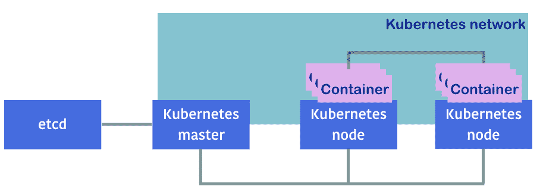

前面的图可以总结如下：

+   **Kubernetes 主节点**：它通过 HTTP 或 HTTPS 连接到 etcd 以存储数据

+   **Kubernetes 节点**：它通过 HTTP 或 HTTPS 连接到 Kubernetes 主节点以获取命令并报告状态

+   **Kubernetes 网络**：它的 L2、L3 或覆盖层连接其容器应用程序

# 如何做...

在本节中，我们将解释如何使用 Kubernetes 主节点和节点来实现 Kubernetes 系统的主要功能。

# Kubernetes 主节点

Kubernetes 主节点是 Kubernetes 集群的主要组件。它提供了多种功能，例如：

+   授权和认证

+   RESTful API 入口点

+   容器部署调度程序到 Kubernetes 节点

+   扩展和复制控制器

+   阅读配置以设置集群

以下图表显示了主节点守护程序如何共同实现上述功能：

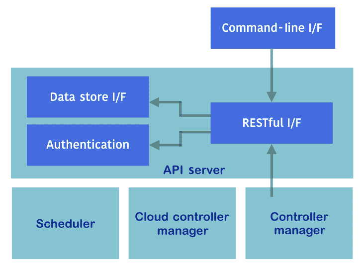

有几个守护进程组成了 Kubernetes 主节点的功能，例如`kube-apiserver`、`kube-scheduler`和`kube-controller-manager`。Hypercube，这个包装二进制文件，可以启动所有这些守护进程。

此外，Kubernetes 命令行界面 kubect 可以控制 Kubernetes 主节点的功能。

# API 服务器（kube-apiserver）

API 服务器提供基于 HTTP 或 HTTPS 的 RESTful API，它是 Kubernetes 组件之间的中心枢纽，例如 kubectl、调度程序、复制控制器、etcd 数据存储、运行在 Kubernetes 节点上的 kubelet 和 kube-proxy 等。

# 调度程序（kube-scheduler）

调度程序帮助选择哪个容器在哪个节点上运行。这是一个简单的算法，定义了分派和绑定容器到节点的优先级。例如：

+   CPU

+   内存

+   有多少容器正在运行？

# 控制器管理器（kube-controller-manager）

控制器管理器执行集群操作。例如：

+   管理 Kubernetes 节点

+   创建和更新 Kubernetes 内部信息

+   尝试将当前状态更改为期望的状态

# 命令行界面（kubectl）

安装 Kubernetes 主节点后，您可以使用 Kubernetes 命令行界面`kubectl`来控制 Kubernetes 集群。例如，`kubectl get cs`返回每个组件的状态。另外，`kubectl get nodes`返回 Kubernetes 节点的列表：

```
//see the Component Statuses
# kubectl get cs
NAME                 STATUS    MESSAGE              ERROR
controller-manager   Healthy   ok                   nil
scheduler            Healthy   ok                   nil
etcd-0               Healthy   {"health": "true"}   nil

//see the nodes
# kubectl get nodes
NAME          LABELS                           STATUS    AGE
kub-node1   kubernetes.io/hostname=kub-node1   Ready     26d
kub-node2   kubernetes.io/hostname=kub-node2   Ready     26d
```

# Kubernetes 节点

Kubernetes 节点是 Kubernetes 集群中的从属节点。它由 Kubernetes 主节点控制，使用 Docker（[`docker.com`](http://docker.com)）或 rkt（[`coreos.com/rkt/docs/latest/)`](http://coreos.com/rkt/docs/latest/)来运行容器应用程序。在本书中，我们将使用 Docker 容器运行时作为默认引擎。

节点还是从属节点？

术语“slave”在计算机行业中用于表示集群工作节点；然而，它也与歧视有关。Kubernetes 项目在早期版本中使用 minion，在当前版本中使用 node。

以下图表显示了节点中守护进程的角色和任务：

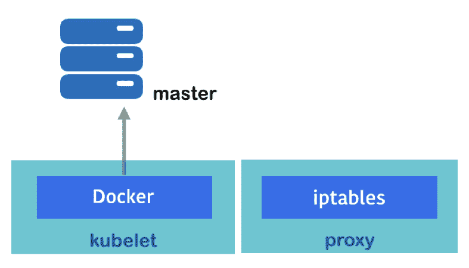

该节点还有两个守护进程，名为 kubelet 和 kube-proxy，以支持其功能。

# kubelet

kubelet 是 Kubernetes 节点上的主要进程，与 Kubernetes 主节点通信，处理以下操作：

+   定期访问 API 控制器以检查和报告

+   执行容器操作

+   运行 HTTP 服务器以提供简单的 API

# 代理（kube-proxy）

代理处理每个容器的网络代理和负载均衡器。它改变 Linux iptables 规则（nat 表）以控制容器之间的 TCP 和 UDP 数据包。

启动 kube-proxy 守护程序后，它会配置 iptables 规则；您可以使用`iptables -t nat -L`或`iptables -t nat -S`来检查 nat 表规则，如下所示：

```
//the result will be vary and dynamically changed by kube-proxy
# sudo iptables -t nat -S
-P PREROUTING ACCEPT
-P INPUT ACCEPT
-P OUTPUT ACCEPT
-P POSTROUTING ACCEPT
-N DOCKER
-N FLANNEL
-N KUBE-NODEPORT-CONTAINER
-N KUBE-NODEPORT-HOST
-N KUBE-PORTALS-CONTAINER
-N KUBE-PORTALS-HOST
-A PREROUTING -m comment --comment "handle ClusterIPs; NOTE: this must be before the NodePort rules" -j KUBE-PORTALS-CONTAINER
-A PREROUTING -m addrtype --dst-type LOCAL -m comment --comment "handle service NodePorts; NOTE: this must be the last rule in the chain" -j KUBE-NODEPORT-CONTAINER
-A PREROUTING -m addrtype --dst-type LOCAL -j DOCKER
-A OUTPUT -m comment --comment "handle ClusterIPs; NOTE: this must be before the NodePort rules" -j KUBE-PORTALS-HOST
-A OUTPUT -m addrtype --dst-type LOCAL -m comment --comment "handle service NodePorts; NOTE: this must be the last rule in the chain" -j KUBE-NODEPORT-HOST
-A OUTPUT ! -d 127.0.0.0/8 -m addrtype --dst-type LOCAL -j DOCKER
-A POSTROUTING -s 192.168.90.0/24 ! -o docker0 -j MASQUERADE
-A POSTROUTING -s 192.168.0.0/16 -j FLANNEL
-A FLANNEL -d 192.168.0.0/16 -j ACCEPT
-A FLANNEL ! -d 224.0.0.0/4 -j MASQUERADE
```

# 工作原理...

还有两个组件可以补充 Kubernetes 节点功能，即数据存储 etcd 和容器之间的网络。您可以在以下子节中了解它们如何支持 Kubernetes 系统。

# etcd

etcd（[`coreos.com/etcd/`](https://coreos.com/etcd/)）是分布式键值数据存储。可以通过 RESTful API 访问它，以在网络上执行 CRUD 操作。Kubernetes 使用 etcd 作为主要数据存储。

您可以使用`curl`命令在 etcd（`/registry`）中探索 Kubernetes 配置和状态，如下所示：

```
//example: etcd server is localhost and default port is 4001
# curl -L http://127.0.0.1:4001/v2/keys/registry
{"action":"get","node":{"key":"/registry","dir":true,"nodes":[{"key":"/registry/namespaces","dir":true,"modifiedIndex":6,"createdIndex":6},{"key":"/registry/pods","dir":true,"modifiedIndex":187,"createdIndex":187},{"key":"/registry/clusterroles","dir":true,"modifiedIndex":196,"createdIndex":196},{"key":"/registry/replicasets","dir":true,"modifiedIndex":178,"createdIndex":178},{"key":"/registry/limitranges","dir":true,"modifiedIndex":202,"createdIndex":202},{"key":"/registry/storageclasses","dir":true,"modifiedIndex":215,"createdIndex":215},{"key":"/registry/apiregistration.k8s.io","dir":true,"modifiedIndex":7,"createdIndex":7},{"key":"/registry/serviceaccounts","dir":true,"modifiedIndex":70,"createdIndex":70},{"key":"/registry/secrets","dir":true,"modifiedIndex":71,"createdIndex":71},{"key":"/registry/deployments","dir":true,"modifiedIndex":177,"createdIndex":177},{"key":"/registry/services","dir":true,"modifiedIndex":13,"createdIndex":13},{"key":"/registry/configmaps","dir":true,"modifiedIndex":52,"createdIndex":52},{"key":"/registry/ranges","dir":true,"modifiedIndex":4,"createdIndex":4},{"key":"/registry/minions","dir":true,"modifiedIndex":58,"createdIndex":58},{"key":"/registry/clusterrolebindings","dir":true,"modifiedIndex":171,"createdIndex":171}],"modifiedIndex":4,"createdIndex":4}}
```

# Kubernetes 网络

容器之间的网络通信是最困难的部分。因为 Kubernetes 管理着运行多个容器的多个节点（主机），不同节点上的容器可能需要相互通信。

如果容器的网络通信仅在单个节点内部，您可以使用 Docker 网络或 Docker compose 来发现对等体。然而，随着多个节点的出现，Kubernetes 使用覆盖网络或容器网络接口（CNI）来实现多个容器之间的通信。

# 另请参阅

本文介绍了 Kubernetes 及其相关组件的基本架构和方法论。理解 Kubernetes 并不容易，但逐步学习如何设置、配置和管理 Kubernetes 的过程确实很有趣。

# 通过 minikube 在 macOS 上设置 Kubernetes 集群

Kubernetes 由多个开源组件组合而成。这些组件由不同的团体开发，使得很难找到并下载所有相关的软件包，并从头开始安装、配置和使它们工作。

幸运的是，已经开发出了一些不同的解决方案和工具，可以轻松设置 Kubernetes 集群。因此，强烈建议您使用这样的工具在您的环境中设置 Kubernetes。

以下工具按不同类型的解决方案进行分类，以构建您自己的 Kubernetes：

+   自管理的解决方案包括：

+   minikube

+   kubeadm

+   kubespray

+   kops

+   包括企业解决方案：

+   OpenShift ([`www.openshift.com`](https://www.openshift.com))

+   Tectonic ([`coreos.com/tectonic/`](https://coreos.com/tectonic/))

+   包括的云托管解决方案：

+   Google Kubernetes engine ([`cloud.google.com/kubernetes-engine/`](https://cloud.google.com/kubernetes-engine/))

+   Amazon elastic container service for Kubernetes (Amazon EKS, [`aws.amazon.com/eks/`](https://aws.amazon.com/eks/))

+   Azure Container Service (AKS, [`azure.microsoft.com/en-us/services/container-service/`](https://azure.microsoft.com/en-us/services/container-service/))

如果我们只想构建开发环境或快速进行概念验证，自管理解决方案是合适的。

通过使用 minikube ([`github.com/kubernetes/minikube`](https://github.com/kubernetes/minikube)) 和 kubeadm ([`kubernetes.io/docs/admin/kubeadm/`](https://kubernetes.io/docs/admin/kubeadm/)), 我们可以在本地轻松构建所需的环境; 但是，如果我们想构建生产环境，这是不切实际的。

通过使用 kubespray ([`github.com/kubernetes-incubator/kubespray`](https://github.com/kubernetes-incubator/kubespray)) 和 kops ([`github.com/kubernetes/kops`](https://github.com/kubernetes/kops)), 我们也可以从头快速构建生产级环境。

如果我们想创建生产环境，企业解决方案或云托管解决方案是最简单的起点。特别是**Google Kubernetes Engine** (**GKE**), 被 Google 使用多年，具有全面的管理，意味着用户不需要过多关心安装和设置。此外，Amazon EKS 是一个新的服务，于 AWS re: Invent 2017 年推出，由 AWS 上的 Kubernetes 服务管理。

Kubernetes 也可以通过自定义解决方案在不同的云和本地 VM 上运行。在本章中，我们将在 macOS 桌面机上使用 minikube 构建 Kubernetes。

# 准备工作

minikube 在 macOS 上的 Linux VM 上运行 Kubernetes。它依赖于 hypervisor（虚拟化技术），例如 VirtualBox ([`www.virtualbox.org`](https://www.virtualbox.org))，VMWare fusion ([`www.vmware.com/products/fusion.html`](https://www.vmware.com/products/fusion.html))或 hyperkit ([`github.com/moby/hyperkit`](https://github.com/moby/hyperkit))。此外，我们还需要 Kubernetes **命令行界面**（**CLI**）`kubectl`，用于通过 hypervisor 连接和控制 Kubernetes。

使用 minikube，您可以在 macOS 上运行整个 Kubernetes 堆栈，包括 Kubernetes 主节点和 CLI。建议 macOS 具有足够的内存来运行 Kubernetes。默认情况下，minikube 使用 VirtualBox 作为 hypervisor。

然而，在本章中，我们将演示如何使用 hyperkit，这是最轻量级的解决方案。由于 Linux VM 消耗 2GB 内存，建议至少 4GB 内存。请注意，hyperkit 是建立在 macOS 的 hypervisor 框架（[`developer.apple.com/documentation/hypervisor`](https://developer.apple.com/documentation/hypervisor)）之上的，因此需要 macOS 10.10 Yosemite 或更高版本。

以下图表显示了 kubectl、hypervisor、minikube 和 macOS 之间的关系：

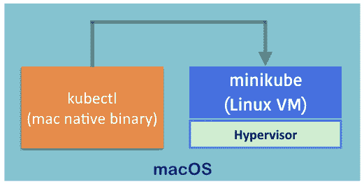

# 如何做...

macOS 没有官方的软件包管理工具，如 Linux 上的 yum 和 apt-get。但是有一些对 macOS 有用的工具。`Homebrew` ([`brew.sh`](https://brew.sh))是最流行的软件包管理工具，管理许多开源工具，包括 minikube。

要在 macOS 上安装`Homebrew`，请执行以下步骤：

1.  打开终端，然后输入以下命令：

```
$ /usr/bin/ruby -e "$(curl -fsSL https://raw.githubusercontent.com/Homebrew/install/master/install)"
```

1.  安装完成后，您可以输入`/usr/local/bin/brew help`来查看可用的命令选项。

如果您刚刚在 macOS 上安装或升级 Xcode，则可能会导致`Homebrew`安装停止。在这种情况下，打开 Xcode 以接受许可协议，或者事先输入`sudo xcodebuild -license`。

1.  接下来，为 minikube 安装`hyperkit driver`。在撰写本文时（2018 年 2 月），HomeBrew 不支持 hyperkit；因此，请输入以下命令进行安装：

```
$ curl -LO https://storage.googleapis.com/minikube/releases/latest/docker-machine-driver-hyperkit \
&& chmod +x docker-machine-driver-hyperkit \
&& sudo mv docker-machine-driver-hyperkit /usr/local/bin/ \
&& sudo chown root:wheel /usr/local/bin/docker-machine-driver-hyperkit \
&& sudo chmod u+s /usr/local/bin/docker-machine-driver-hyperkit
```

1.  接下来，让我们安装 Kubernetes CLI。使用 Homebrew 和以下命令在您的 macOS 上安装`kubectl`命令：

```
//install kubectl command by "kubernetes-cli" package
$ brew install kubernetes-cli
```

最后，您可以安装 minikube。它不是由 Homebrew 管理的；但是，Homebrew 有一个名为`homebrew-cask`的扩展（[`github.com/caskroom/homebrew-cask`](https://github.com/caskroom/homebrew-cask)）支持 minikube。

1.  为了通过`homebrew-cask`安装 minikube，只需简单地键入以下命令：

```
//add "cask" option
$ brew cask install minikube
```

1.  如果您从未在您的机器上安装过**Docker for Mac**，您也需要通过`homebrew-cask`安装它

```
//only if you don't have a Docker for Mac
$ brew cask install docker

//start Docker
$ open -a Docker.app
```

1.  现在您已经准备就绪！以下命令显示了您的 macOS 上是否已安装所需的软件包：

```
//check installed package by homebrew
$ brew list
kubernetes-cli

//check installed package by homebrew-cask
$ brew cask list
minikube
```

# 工作原理...

minikube 适用于使用以下命令在您的 macOS 上设置 Kubernetes，该命令下载并启动 Kubernetes VM stet，然后配置 kubectl 配置（`~/.kube/config`）：

```
//use --vm-driver=hyperkit to specify to use hyperkit
$ /usr/local/bin/minikube start --vm-driver=hyperkit
Starting local Kubernetes v1.10.0 cluster...
Starting VM...
Downloading Minikube ISO
 150.53 MB / 150.53 MB [============================================] 100.00% 0s
Getting VM IP address...
Moving files into cluster...
Downloading kubeadm v1.10.0
Downloading kubelet v1.10.0
Finished Downloading kubelet v1.10.0
Finished Downloading kubeadm v1.10.0
Setting up certs...
Connecting to cluster...
Setting up kubeconfig...
Starting cluster components...
Kubectl is now configured to use the cluster.
Loading cached images from config file.

//check whether .kube/config is configured or not
$ cat ~/.kube/config 
apiVersion: v1
clusters:
- cluster:
 certificate-authority: /Users/saito/.minikube/ca.crt
 server: https://192.168.64.26:8443
 name: minikube
contexts:
- context:
 cluster: minikube
 user: minikube
 name: minikube
current-context: minikube
kind: Config
preferences: {}
users:
- name: minikube
 user:
 as-user-extra: {}
 client-certificate: /Users/saito/.minikube/client.crt
 client-key: /Users/saito/.minikube/client.key 
```

获取所有必要的软件包后，执行以下步骤：

1.  等待几分钟，直到 Kubernetes 集群设置完成。

1.  使用`kubectl version`来检查 Kubernetes 主版本，使用`kubectl get cs`来查看组件状态。

1.  此外，使用`kubectl get nodes`命令来检查 Kubernetes 节点是否准备好：

```
//it shows kubectl (Client) is 1.10.1, and Kubernetes master (Server) is 1.10.0
$ /usr/local/bin/kubectl version --short
Client Version: v1.10.1
Server Version: v1.10.0

//get cs will shows Component Status
$ kubectl get cs
NAME                 STATUS    MESSAGE              ERROR
controller-manager   Healthy   ok 
scheduler            Healthy   ok 
etcd-0               Healthy   {"health": "true"} 

//Kubernetes node (minikube) is ready
$ /usr/local/bin/kubectl get nodes
NAME       STATUS    ROLES     AGE       VERSION
minikube  Ready  master  2m  v1.10.0
```

1.  现在您可以在您的机器上开始使用 Kubernetes。以下部分描述了如何使用`kubectl`命令来操作 Docker 容器。

1.  请注意，在某些情况下，您可能需要维护 Kubernetes 集群，例如启动/停止 VM 或完全删除它。以下命令维护 minikube 环境：

| **命令** | **目的** |
| --- | --- |
| `minikube start --vm-driver=hyperkit` | 使用 hyperkit 驱动程序启动 Kubernetes VM |
| `minikube stop` | 停止 Kubernetes VM |
| `minikube delete` | 删除 Kubernetes VM 镜像 |
| `minikube ssh` | ssh 到 Kubernetes VM guest |
| `minikube ip` | 显示 Kubernetes VM（节点）的 IP 地址 |
| `minikube update-context` | 检查并更新`~/.kube/config`，如果 VM IP 地址发生变化 |
| `minikube dashboard` | 打开 Web 浏览器连接 Kubernetes UI |

例如，minikube 默认启动仪表板（Kubernetes UI）。如果您想访问仪表板，请键入`minikube dashboard`；然后它会打开您的默认浏览器并连接 Kubernetes UI，如下面的屏幕截图所示：

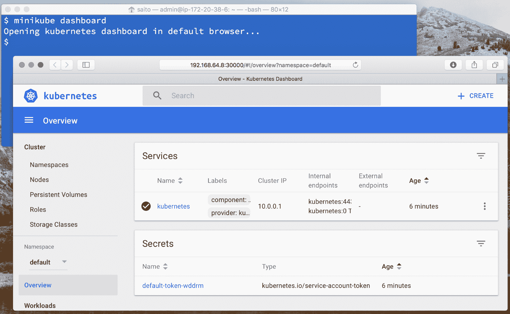

# 另请参阅

本教程描述了如何使用 minikube 在 macOS 上设置 Kubernetes 集群。这是开始使用 Kubernetes 的最简单方法。我们还学习了如何使用 kubectl，即 Kubernetes 命令行接口工具，这是控制我们的 Kubernetes 集群的入口点！

# 在 Windows 上通过 minikube 设置 Kubernetes 集群

从本质上讲，Docker 和 Kubernetes 是基于 Linux 操作系统的。虽然使用 Windows 操作系统来探索 Kubernetes 并不理想，但许多人将 Windows 操作系统用作他们的台式机或笔记本电脑。幸运的是，有很多方法可以使用虚拟化技术在 Windows 上运行 Linux 操作系统，这使得在 Windows 机器上运行 Kubernetes 集群成为可能。然后，我们可以在本地 Windows 机器上构建开发环境或进行概念验证。

您可以使用 Windows 上的任何 Hypervisor 来运行 Linux 虚拟机，从头开始设置 Kubernetes，但使用 minikube ([`github.com/kubernetes/minikube`](https://github.com/kubernetes/minikube)) 是在 Windows 上构建 Kubernetes 集群的最快方法。请注意，本教程并不适用于生产环境，因为它将在 Windows 上的 Linux 虚拟机上设置 Kubernetes。

# 准备工作

在 Windows 上设置 minikube 需要一个 Hypervisor，要么是 VirtualBox ([`www.virtualbox.org`](https://www.virtualbox.org)) 要么是 Hyper-V，因为 minikube 再次使用 Windows 上的 Linux 虚拟机。这意味着您不能使用 Windows 虚拟机（例如，在 macOS 上通过 parallels 运行 Windows 虚拟机）。

然而，`kubectl`，Kubernetes CLI，支持一个可以通过网络连接到 Kubernetes 的 Windows 本机二进制文件。因此，您可以在 Windows 机器上设置一个便携式的 Kubernetes 堆栈套件。

以下图表显示了 kubectl、Hypervisor、minikube 和 Windows 之间的关系：

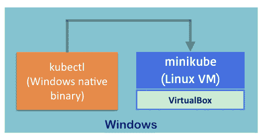

Windows 8 专业版或更高版本需要 Hyper-V。虽然许多用户仍在使用 Windows 7，但在本教程中我们将使用 VirtualBox 作为 minikube 的 Hypervisor。

# 操作步骤

首先，需要 Windows 的 VirtualBox：

1.  前往 VirtualBox 网站 ([`www.virtualbox.org/wiki/Downloads`](https://www.virtualbox.org/wiki/Downloads)) 下载 Windows 安装程序。

1.  安装非常简单，所以我们可以选择默认选项并点击下一步：

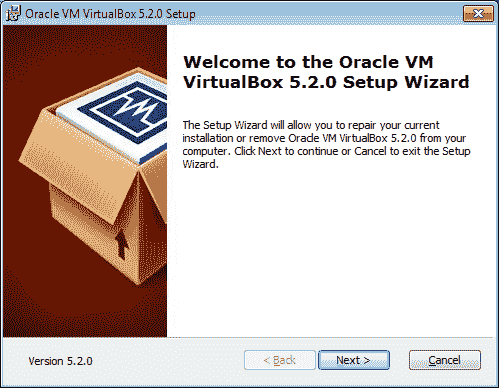

1.  接下来，创建用于存储 minikube 和 kubectl 二进制文件的 `Kubernetes` 文件夹。让我们在 `C:` 驱动器的顶部创建 `k8s` 文件夹，如下面的屏幕截图所示：

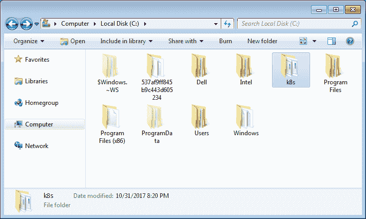

1.  此文件夹必须在命令搜索路径中，因此打开系统属性，然后转到高级选项卡。

1.  单击“环境变量...”按钮，然后选择“路径”，然后单击“编辑...”按钮，如下面的屏幕截图所示：

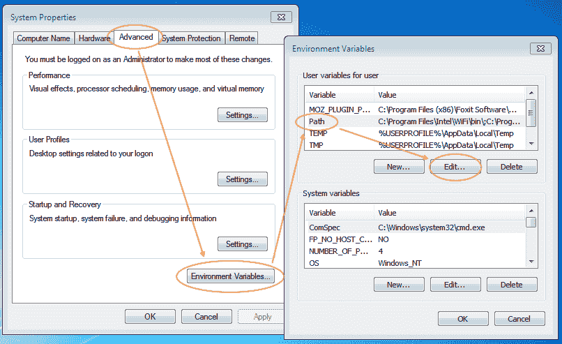

1.  然后，追加 `c:\k8s`，如下所示：

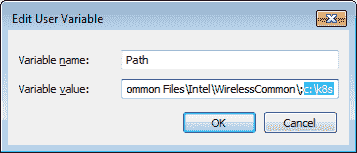

1.  单击“确定”按钮后，注销并重新登录到 Windows（或重新启动）以应用此更改。

1.  接下来，下载 Windows 版的 minikube。它是一个单一的二进制文件，因此可以使用任何网络浏览器下载 [`github.com/kubernetes/minikube/releases/download/v0.26.1/minikube-windows-amd64`](https://github.com/kubernetes/minikube/releases/download/v0.26.1/minikube-windows-amd64)，然后将其复制到 `c:\k8s` 文件夹，但将文件名更改为 `minikube.exe`。

1.  接下来，下载 Windows 版的 kubectl，它可以与 Kubernetes 进行通信。它也像 minikube 一样是单一的二进制文件。因此，下载 [`storage.googleapis.com/kubernetes-release/release/v1.10.2/bin/windows/amd64/kubectl.exe`](https://storage.googleapis.com/kubernetes-release/release/v1.10.2/bin/windows/amd64/kubectl.exe)，然后也将其复制到 `c:\k8s` 文件夹中。

1.  最终，您将在 `c:\k8s` 文件夹中看到两个二进制文件，如下面的屏幕截图所示：

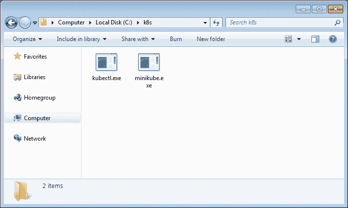如果您正在运行防病毒软件，可能会阻止您运行 `kubectl.exe` 和 `minikube.exe`。如果是这样，请更新您的防病毒软件设置，允许运行这两个二进制文件。

# 工作原理...

让我们开始吧！

1.  打开命令提示符，然后键入 `minikube start`，如下面的屏幕截图所示：

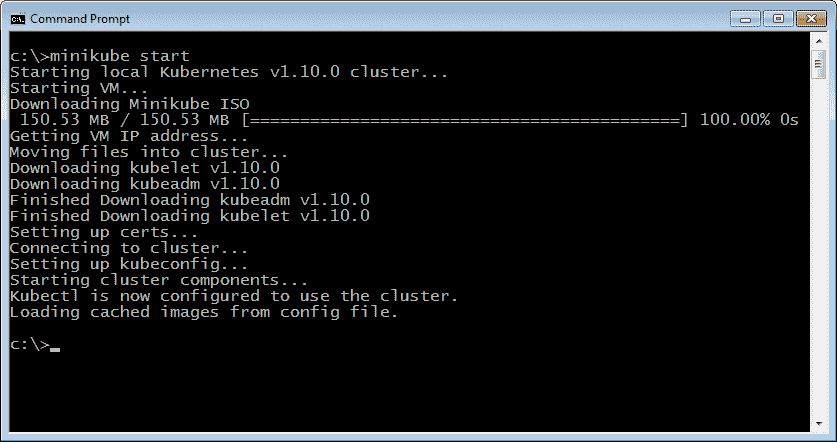

1.  minikube 下载 Linux VM 镜像，然后在 Linux VM 上设置 Kubernetes；现在，如果打开 VirtualBox，您可以看到 minikube 客户端已经注册，如下面的屏幕截图所示：

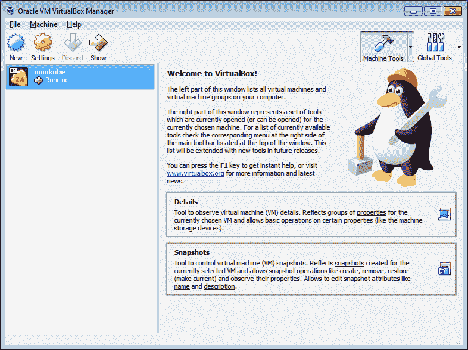

1.  等待几分钟，完成 Kubernetes 集群的设置。

1.  根据下面的屏幕截图，键入 `kubectl version` 来检查 Kubernetes 主版本。

1.  使用`kubectl get nodes`命令检查 Kubernetes 节点是否准备就绪：

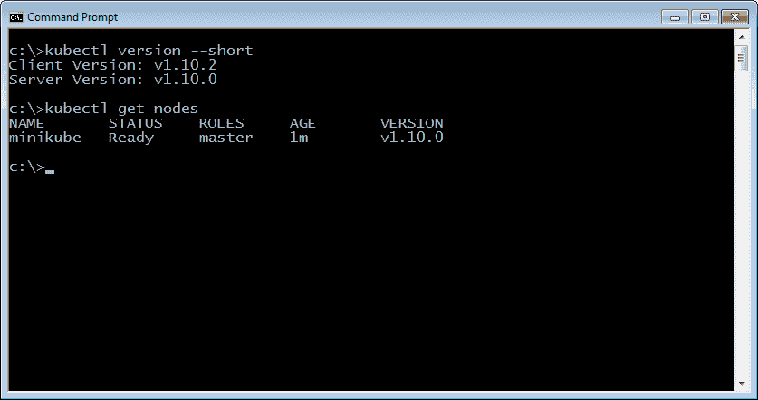

1.  现在您可以在您的机器上开始使用 Kubernetes 了！再次强调，Kubernetes 正在 Linux 虚拟机上运行，如下截图所示。

1.  使用`minikube ssh`允许您访问运行 Kubernetes 的 Linux 虚拟机：

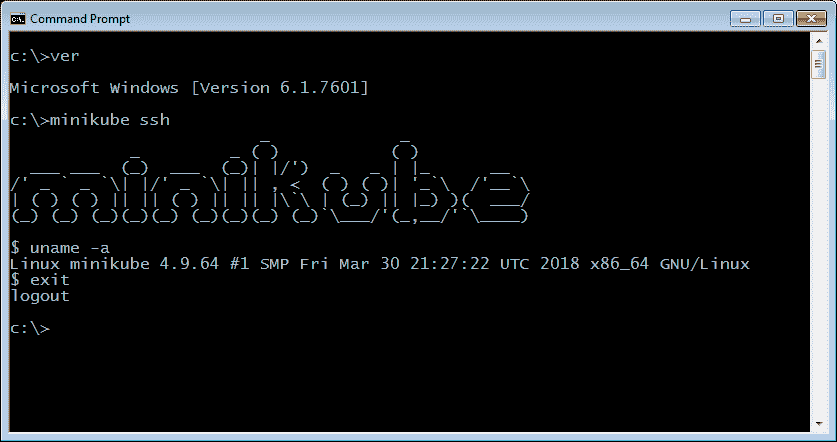

因此，任何基于 Linux 的 Docker 镜像都可以在您的 Windows 机器上运行。

1.  键入`minikube ip`以验证 Linux 虚拟机使用的 IP 地址，还可以使用`minikube dashboard`，打开默认的 Web 浏览器并导航到 Kubernetes UI，如下截图所示：

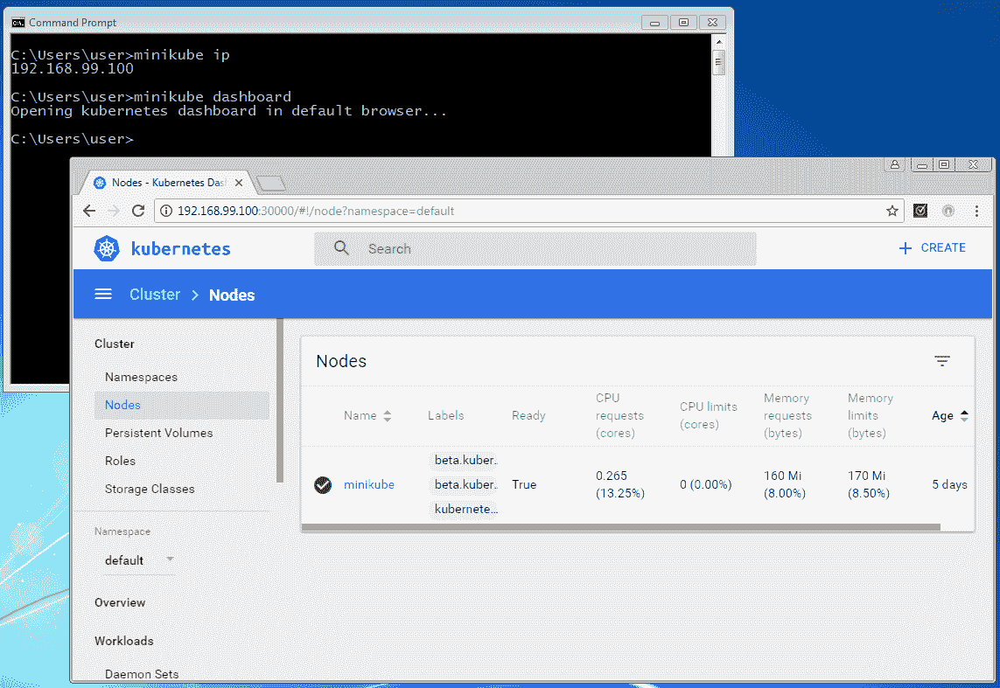

1.  如果您不再需要使用 Kubernetes，请键入`minikube stop`或打开 VirtualBox 停止 Linux 虚拟机并释放资源，如下截图所示：

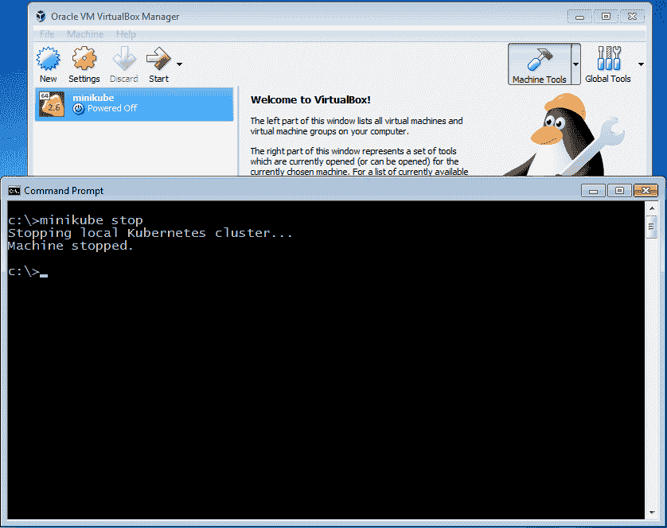

# 另请参阅

这个教程描述了如何在 Windows 操作系统上使用 minikube 设置 Kubernetes 集群。这是开始使用 Kubernetes 的最简单方法。它还描述了 kubectl，Kubernetes 命令行接口工具，这是控制 Kubernetes 的入口点。

# 通过 kubeadm 在 Linux 上设置 Kubernetes 集群

在这个教程中，我们将展示如何在 Linux 服务器上使用 kubeadm（[`github.com/kubernetes/kubeadm`](https://github.com/kubernetes/kubeadm)）创建 Kubernetes 集群。Kubeadm 是一个命令行工具，简化了创建和管理 Kubernetes 集群的过程。Kubeadm 利用 Docker 的快速部署功能，作为容器运行 Kubernetes 主节点和 etcd 服务器的系统服务。当由`kubeadm`命令触发时，容器服务将直接联系 Kubernetes 节点上的 kubelet；kubeadm 还会检查每个组件是否健康。通过 kubeadm 设置步骤，您可以避免在从头开始构建时使用大量安装和配置命令。

# 准备工作

我们将提供两种类型操作系统的说明：

+   Ubuntu Xenial 16.04（LTS）

+   CentOS 7.4

确保操作系统版本匹配后才能继续。此外，在进行下一步之前，还应验证软件依赖和网络设置。检查以下项目以准备环境：

+   **每个节点都有唯一的 MAC 地址和产品 UUID**：一些插件使用 MAC 地址或产品 UUID 作为唯一的机器 ID 来识别节点（例如，`kube-dns`）。如果它们在集群中重复，kubeadm 在启动插件时可能无法工作：

```
// check MAC address of your NIC $ ifconfig -a
// check the product UUID on your host
$ sudo cat /sys/class/dmi/id/product_uuid
```

+   **每个节点都有不同的主机名**：如果主机名重复，Kubernetes 系统可能会将多个节点的日志或状态收集到同一个节点中。

+   **已安装 Docker**：如前所述，Kubernetes 主节点将作为容器运行其守护程序，并且集群中的每个节点都应安装 Docker。有关如何执行 Docker 安装，您可以按照官方网站上的步骤进行：（Ubuntu：[`docs.docker.com/engine/installation/linux/docker-ce/ubuntu/`](https://docs.docker.com/engine/installation/linux/docker-ce/ubuntu/)，和 CentOS：[`docs.docker.com/engine/installation/linux/docker-ce/centos/`](https://docs.docker.com/engine/installation/linux/docker-ce/centos/)）在我们的机器上安装了 Docker CE 17.06；但是，仅验证了 Docker 版本 1.11.2 至 1.13.1 和 17.03.x 与 Kubernetes 版本 1.10 兼容。

+   **网络端口可用**：Kubernetes 系统服务需要网络端口进行通信。根据节点的角色，以下表中的端口现在应该被占用：

| **节点角色** | **端口** | **系统服务** |
| --- | --- | --- |
| 主节点 | `6443` | Kubernetes API 服务器 |
| `10248/10250/10255` | kubelet 本地 healthz 端点/Kubelet API/Heapster（只读） |
| `10251` | kube-scheduler |
| `10252` | kube-controller-manager |
| `10249/10256` | kube-proxy |
| `2379/2380` | etcd 客户端/etcd 服务器通信 |
| 节点 | `10250/10255` | Kubelet API/Heapster（只读） |
| `30000~32767` | 用于将容器服务暴露给外部世界的端口范围保留 |

+   Linux 命令`netstat`可以帮助检查端口是否正在使用：

```
// list every listening port
$ sudo netstat -tulpn | grep LISTEN
```

+   网络工具包已安装。 `ethtool` 和 `ebtables` 是 kubeadm 的两个必需实用程序。它们可以通过`apt-get`或`yum`软件包管理工具下载和安装。

# 如何做...

将分别介绍 Ubuntu 和 CentOS 两种 Linux 操作系统的安装程序，因为它们有不同的设置。

# 软件包安装

让我们首先获取 Kubernetes 软件包！需要在软件包管理系统的源列表中设置下载的存储库。然后，我们可以通过命令行轻松地将它们安装。

# Ubuntu

要在 Ubuntu 中安装 Kubernetes 软件包，请执行以下步骤：

1.  一些存储库是使用 HTTPS 的 URL。必须安装`apt-transport-https`软件包才能访问 HTTPS 端点：

```
$ sudo apt-get update && sudo apt-get install -y apt-transport-https
```

1.  下载访问 Google Cloud 软件包的公钥，并添加如下：

```
$ curl -s https://packages.cloud.google.com/apt/doc/apt-key.gpg | sudo apt-key add -
OK
```

1.  接下来，为 Kubernetes 软件包添加一个新的源列表：

```
$ sudo bash -c 'echo "deb http://apt.kubernetes.io/ kubernetes-xenial main" > /etc/apt/sources.list.d/kubernetes.list'
```

1.  最后，安装 Kubernetes 软件包是很好的：

```
// on Kubernetes master
$ sudo apt-get update && sudo apt-get install -y kubelet kubeadm kubectl
// on Kubernetes node
$ sudo apt-get update && sudo apt-get install -y kubelet
```

# CentOS

要在 CentOS 中安装 Kubernetes 软件包，请执行以下步骤：

1.  与 Ubuntu 一样，需要添加新的存储库信息：

```
$ sudo vim /etc/yum.repos.d/kubernetes.repo
[kubernetes]
name=Kubernetes
baseurl=https://packages.cloud.google.com/yum/repos/kubernetes-el7-x86_64
enabled=1
gpgcheck=1
repo_gpgcheck=1
gpgkey=https://packages.cloud.google.com/yum/doc/yum-key.gpg
 https://packages.cloud.google.com/yum/doc/rpm-package-key.gpg
```

1.  现在，我们准备通过`yum`命令从 Kubernetes 源基地拉取软件包：

```
// on Kubernetes master
$ sudo yum install -y kubelet kubeadm kubectl
// on Kubernetes node
$ sudo yum install -y kubelet
```

1.  无论是什么操作系统，都要检查你得到的软件包的版本！

```
// take it easy! server connection failed since there is not server running
$ kubectl version
Client Version: version.Info{Major:"1", Minor:"10", GitVersion:"v1.10.2", GitCommit:"81753b10df112992bf51bbc2c2f85208aad78335", GitTreeState:"clean", BuildDate:"2018-04-27T09:22:21Z", GoVersion:"go1.9.3", Compiler:"gc", Platform:"linux/amd64"}
The connection to the server 192.168.122.101:6443 was refused - did you specify the right host or port?
```

# 系统配置先决条件

在通过 kubeadm 运行整个系统之前，请检查 Docker 是否在您的机器上运行 Kubernetes。此外，为了避免在执行 kubeadm 时出现关键错误，我们将展示系统和 kubelet 上必要的服务配置。与主服务器一样，请在 Kubernetes 节点上设置以下配置，以使 kubelet 与 kubeadm 正常工作。

# CentOS 系统设置

在 CentOS 中还有其他额外的设置，以使 Kubernetes 行为正确。请注意，即使我们不使用 kubeadm 来管理 Kubernetes 集群，运行 kubelet 时应考虑以下设置：

1.  禁用 SELinux，因为 kubelet 不完全支持 SELinux：

```
// check the state of SELinux, if it has already been disabled, bypass below commands
$ sestatus
```

我们可以通过以下命令`禁用 SELinux`，或者`修改配置文件`：

```
// disable SELinux through command
$  sudo setenforce 0
// or modify the configuration file **$ sudo sed –I 's/ SELINUX=enforcing/SELINUX=disabled/g' /etc/sysconfig/selinux** 
```

然后我们需要`重新启动`机器：

```
// reboot is required
$ sudo reboot
```

1.  启用 iptables 的使用。为了防止发生一些路由错误，添加运行时参数：

```
// enable the parameters by setting them to 1
$ sudo bash -c 'echo "net.bridge.bridge-nf-call-ip6tables = 1" > /etc/sysctl.d/k8s.conf'
$ sudo bash -c 'echo "net.bridge.bridge-nf-call-iptables = 1" >> /etc/sysctl.d/k8s.conf'
// reload the configuration
$ sudo sysctl --system
```

# 启动服务

现在我们可以启动服务。首先在 Kubernetes 主服务器上启用，然后启动 kubelet：

```
$ sudo systemctl enable kubelet && sudo systemctl start kubelet
```

在检查 kubelet 的状态时，您可能会担心看到状态显示为激活（`自动重启`）；您可能会通过`journalctl`命令看到详细日志，如下所示：

`错误：无法加载客户端 CA 文件/etc/kubernetes/pki/ca.crt：打开/etc/kubernetes/pki/ca.crt：没有那个文件或目录`

别担心。kubeadm 会负责创建证书授权文件。它在服务配置文件`/etc/systemd/system/kubelet.service.d/10-kubeadm.conf`中定义，通过参数`KUBELET_AUTHZ_ARGS`。没有这个文件，kubelet 服务就不会正常工作，所以要不断尝试重新启动守护进程。

通过 kubeadm 启动所有主节点守护程序。 值得注意的是，使用 kubeadm 需要 root 权限才能实现服务级别的特权。 对于任何 sudoer，每个 kubeadm 都会在`sudo`命令之后执行：

```
$ sudo kubeadm init
```

在执行`kubeadm init`命令时发现预检错误？ 使用以下命令禁用运行交换。

`$ sudo kubeadm init --ignore-preflight-errors=Swap`

然后您将在屏幕上看到`Your Kubernetes master has initialized successfully!`的句子。 恭喜！ 您已经快完成了！ 只需按照问候消息下面关于用户环境设置的信息进行操作：

```
$ mkdir -p $HOME/.kube
$ sudo cp -i /etc/kubernetes/admin.conf $HOME/.kube/config
$ sudo chown $(id -u):$(id -g) $HOME/.kube/config
```

上述命令确保每个 Kubernetes 指令都是由您的帐户以正确的凭据执行并连接到正确的服务器门户：

```
// Your kubectl command works great now
$ kubectl version
Client Version: version.Info{Major:"1", Minor:"10", GitVersion:"v1.10.2", GitCommit:"81753b10df112992bf51bbc2c2f85208aad78335", GitTreeState:"clean", BuildDate:"2018-04-27T09:22:21Z", GoVersion:"go1.9.3", Compiler:"gc", Platform:"linux/amd64"}
Server Version: version.Info{Major:"1", Minor:"10", GitVersion:"v1.10.2", GitCommit:"81753b10df112992bf51bbc2c2f85208aad78335", GitTreeState:"clean", BuildDate:"2018-04-27T09:10:24Z", GoVersion:"go1.9.3", Compiler:"gc", Platform:"linux/amd64"}
```

更重要的是，kubelet 现在处于健康状态：

```
// check the status of kubelet
$ sudo systemctl status kubelet
...
Active: active (running) Mon 2018-04-30 18:46:58 EDT; 2min 43s ago
...
```

# 容器的网络配置

集群的主节点准备好处理作业并且服务正在运行后，为了使容器通过网络相互访问，我们需要为容器通信设置网络。 在使用 kubeadm 构建 Kubernetes 集群时尤为重要，因为主节点守护程序都在作为容器运行。 kubeadm 支持 CNI ([`github.com/containernetworking/cni`](https://github.com/containernetworking/cni))。 我们将通过 Kubernetes 网络插件附加 CNI。

有许多第三方 CNI 解决方案，提供安全可靠的容器网络环境。 Calico ([`www.projectcalico.org`](https://www.projectcalico.org))是一个提供稳定容器网络的 CNI。 Calico 轻巧简单，但仍然符合 CNI 标准，并与 Kubernetes 集成良好：

```
$ kubectl apply -f https://docs.projectcalico.org/v2.6/getting-started/kubernetes/installation/hosted/kubeadm/1.6/calico.yaml
```

在这里，无论您的主机操作系统是什么，命令 kubectl 都可以执行任何子命令来利用资源和管理系统。 我们使用`kubectl`将 Calico 的配置应用到我们新生的 Kubernetes。

更高级的网络管理和 Kubernetes 插件将在第七章中讨论，*在 GCP 上构建 Kubernetes*。

# 让一个节点参与

让我们登录到您的 Kubernetes 节点，加入由 kubeadm 控制的组：

1.  首先，启用并启动服务`kubelet`。 每台 Kubernetes 机器都应该在其上运行`kubelet`：

```
$ sudo systemctl enable kubelet && sudo systemctl start kubelet
```

1.  完成后，使用带有输入标记令牌和主节点的 IP 地址的`kubeadm`加入命令，通知主节点它是一个受保护和授权的节点。您可以通过`kubeadm`命令在主节点上获取令牌：

```
// on master node, list the token you have in the cluster
$ sudo kubeadm token list
TOKEN                     TTL       EXPIRES                     USAGES                   DESCRIPTION                                                EXTRA GROUPS
da3a90.9a119695a933a867   6h       2018-05-01T18:47:10-04:00   authentication,signing   The default bootstrap token generated by 'kubeadm init'.   system:bootstrappers:kubeadm:default-node-token
```

1.  在前面的输出中，如果`kubeadm init`成功，将生成默认令牌。复制令牌并将其粘贴到节点上，然后组成以下命令：

```
// The master IP is 192.168.122.101, token is da3a90.9a119695a933a867, 6443 is the port of api server.
$ sudo kubeadm join --token da3a90.9a119695a933a867 192.168.122.101:6443 --discovery-token-unsafe-skip-ca-verification
```

如果您调用`kubeadm token list`列出令牌，并且看到它们都已过期怎么办？您可以通过此命令手动创建一个新的：`kubeadm token create`。

1.  请确保主节点的防火墙不会阻止端口`6443`的任何流量，这是用于 API 服务器通信的端口。一旦在屏幕上看到“成功建立连接”这几个字，就是时候与主节点确认组是否有了新成员了：

```
// fire kubectl subcommand on master
$ kubectl get nodes
NAME       STATUS    ROLES     AGE       VERSION
ubuntu01   Ready     master    11h       v1.10.2
ubuntu02   Ready     <none>    26s       v1.10.2
```

干得好！无论您的操作系统是 Ubuntu 还是 CentOS，kubeadm 都已安装并且 kubelet 正在运行。您可以轻松地按照前面的步骤来构建您的 Kubernetes 集群。

您可能会对加入集群时使用的标记`discovery-token-unsafe-skip-ca-verification`感到困惑。还记得 kubelet 日志中说找不到证书文件吗？就是这样，因为我们的 Kubernetes 节点是全新的和干净的，并且以前从未连接过主节点。没有证书文件可供验证。但现在，因为节点已经与主节点握手，该文件存在。我们可以以这种方式加入（在某些情况下需要重新加入相同的集群）：

`kubeadm join --token $TOKEN $MASTER_IPADDR:6443 --discovery-token-ca-cert-hash sha256:$HASH`

哈希值可以通过`openssl`命令获得：

```
// rejoining the same cluster
$ HASH=$(openssl x509 -pubkey -in /etc/kubernetes/pki/ca.crt | openssl rsa -pubin -outform der 2>/dev/null | openssl dgst -sha256 -hex | sed 's/^.* //')
$ sudo kubeadm join --token da3a90.9a119695a933a867 192.168.122.101:6443 --discovery-token-ca-cert-hash sha256:$HASH
```

# 它是如何工作的...

当 kubeadm init 设置主节点时，有六个阶段：

1.  **生成服务的证书文件和密钥**：证书文件和密钥用于跨节点通信期间的安全管理。它们位于`/etc/kubernetes/pki`目录中。以 kubelet 为例。它在未经身份验证的情况下无法访问 Kubernetes API 服务器。

1.  **编写 kubeconfig 文件**：`kubeconfig`文件定义了 kubectl 操作的权限、身份验证和配置。在这种情况下，Kubernetes 控制器管理器和调度器有相关的`kubeconfig`文件来满足任何 API 请求。

1.  创建服务守护进程 YAML 文件：kubeadm 控制下的服务守护进程就像在主节点上运行的计算组件一样。与在磁盘上设置部署配置一样，kubelet 将确保每个守护进程处于活动状态。

1.  等待 kubelet 处于活动状态，将守护进程作为 pod 运行：当 kubelet 处于活动状态时，它将启动`/etc/kubernetes/manifests`目录下描述的服务 pod。此外，kubelet 保证保持它们激活，如果 pod 崩溃，将自动重新启动。

1.  为集群设置后配置：仍然需要设置一些集群配置，例如配置基于角色的访问控制（RBAC）规则，创建命名空间和标记资源。

1.  应用附加组件：DNS 和代理服务可以与 kubeadm 系统一起添加。

当用户输入 kubeadm 并加入 Kubernetes 节点时，kubeadm 将完成像主节点一样的前两个阶段。

如果您在早期版本的 Kubernetes 中面临繁重和复杂的设置过程，使用 kubeadm 设置 Kubernetes 集群会让人感到宽慰。kubeadm 减少了配置每个守护进程并逐个启动它们的开销。用户仍然可以在 kubelet 和主服务上进行自定义，只需修改熟悉的文件`10-kubeadm.conf`和`/etc/kubernetes/manifests`下的 YAML 文件。Kubeadm 不仅有助于建立集群，还增强了安全性和可用性，为您节省时间。

# 另请参阅

我们讨论了如何构建 Kubernetes 集群。如果您准备在其上运行第一个应用程序，请查看本章的最后一个配方并运行容器！对于对集群的高级管理，您还可以查看本书的第八章，“高级集群管理”：

+   kubeconfig 中的高级设置，在第八章，“高级集群管理”

# 通过 Ansible 在 Linux 上设置 Kubernetes 集群（kubespray）

如果您熟悉配置管理，例如 Puppet、Chef 和 Ansible，kubespray（[`github.com/kubernetes-incubator/kubespray`](https://github.com/kubernetes-incubator/kubespray)）是从头开始设置 Kubernetes 集群的最佳选择。它提供了支持大多数 Linux 发行版和 AWS、GCP 等公共云的 Ansible 剧本。

Ansible（[`www.ansible.com`](https://www.ansible.com)）是一种基于 Python 的 SSH 自动化工具，可以根据配置将 Linux 配置为所需状态，称为 playbook。本教程描述了如何使用 kubespray 在 Linux 上设置 Kubernetes。

# 准备工作

截至 2018 年 5 月，kubespray 的最新版本是 2.5.0，支持以下操作系统安装 Kubernetes：

+   RHEL/CentOS 7

+   Ubuntu 16.04 LTS

根据 kubespray 文档，它还支持 CoreOS 和 debian 发行版。然而，这些发行版可能需要一些额外的步骤或存在技术困难。本教程使用 CentOS 7 和 Ubuntu 16.04 LTS。

此外，您需要在您的机器上安装 Ansible。Ansible 适用于 Python 2.6、2.7 和 3.5 或更高版本。macOS 和 Linux 可能是安装 Ansible 的最佳选择，因为大多数 macOS 和 Linux 发行版默认情况下都预装了 Python。为了检查您的 Python 版本，打开终端并输入以下命令：

```
//Use capital V
$ python -V
Python 2.7.5
```

总的来说，您至少需要三台机器，如下表所示：

| **主机类型** | **推荐的操作系统/发行版** |
| --- | --- |
| Ansible | macOS 或任何安装了 Python 2.6、2.7 或 3.5 的 Linux |
| Kubernetes 主节点 | RHEL/CentOS 7 或 Ubuntu 16.04 LTS |
| Kubernetes 节点 | RHEL/CentOS 7 或 Ubuntu 16.04 LTS |

它们之间有一些网络通信，因此您至少需要打开一个网络端口（例如，AWS 安全组或 GCP 防火墙规则）：

+   **TCP/22（ssh）**：Ansible 到 Kubernetes 主节点/节点主机

+   **TCP/6443（Kubernetes API 服务器）**：Kubernetes 节点到主节点

+   **协议 4（IP 封装在 IP 中）**：Kubernetes 主节点和节点之间通过 Calico

在协议 4（IP 封装在 IP 中）中，如果您使用 AWS，设置一个入口规则以指定`aws ec2 authorize-security-group-ingress --group-id <your SG ID> --cidr <network CIDR> --protocol 4`。此外，如果您使用 GCP，设置防火墙规则以指定`cloud compute firewall-rules create allow-calico --allow 4 --network <your network name> --source-ranges <network CIDR>`。

# 安装 pip

安装 Ansible 的最简单方法是使用 pip，即 Python 包管理器。一些较新版本的 Python 已经有了`pip`（Python 2.7.9 或更高版本和 Python 3.4 或更高版本）：

1.  确认`pip`是否已安装，类似于 Python 命令，使用`-V`：

```
//use capital V
$ pip -V
pip 9.0.1 from /Library/Python/2.7/site-packages (python 2.7)
```

1.  另一方面，如果您看到以下结果，您需要安装`pip`：

```
//this result shows you don't have pip yet
$ pip -V
-bash: pip: command not found
```

1.  为了安装 pip，下载`get-pip.py`并使用以下命令安装：

```
//download pip install script
$ curl -LO https://bootstrap.pypa.io/get-pip.py

//run get-pip.py by privileged user (sudo)
$ sudo python get-pip.py 
Collecting pip
 Downloading pip-9.0.1-py2.py3-none-any.whl (1.3MB)
 100% |################################| 1.3MB 779kB/s 
Collecting wheel
 Downloading wheel-0.30.0-py2.py3-none-any.whl (49kB)
 100% |################################| 51kB 1.5MB/s 
Installing collected packages: pip, wheel
Successfully installed pip-9.0.1 wheel-0.30.0

//now you have pip command
$ pip -V
pip 9.0.1 from /usr/lib/python2.7/site-packages (python 2.7)
```

# 安装 Ansible

执行以下步骤安装 Ansible：

1.  一旦您安装了`pip`，您可以使用以下命令安装 Ansible：

```
//ran by privileged user (sudo)
$ sudo pip install ansible
```

`pip`扫描您的 Python 并安装 Ansible 所需的库，因此可能需要几分钟才能完成。

1.  成功安装了 Ansible 后，您可以使用以下命令验证，并查看输出如下：

```
$ which ansible
/usr/bin/ansible

$ ansible --version
ansible 2.4.1.0
```

# 安装 python-netaddr

接下来，根据 kubespray 的文档（[`github.com/kubernetes-incubator/kubespray#requirements`](https://github.com/kubernetes-incubator/kubespray#requirements)），它需要`python-netaddr`包。该包也可以通过 pip 安装，如下面的代码所示：

```
$ sudo pip install netaddr
```

# 设置 ssh 公钥身份验证

还有一件事，如前所述，Ansible 实际上是 ssh 自动化工具。如果您通过 ssh 登录到主机，您必须具有适当的凭据（用户/密码或 ssh 公钥）到目标机器。在这种情况下，目标机器指的是 Kubernetes 主节点和节点。

由于安全原因，特别是在公共云中，Kubernetes 仅使用 ssh 公钥身份验证而不是 ID/密码身份验证。

为了遵循最佳实践，让我们将 ssh 公钥从您的 Ansible 机器复制到 Kubernetes 主/节点机器：

如果您已经在 Ansible 机器和 Kubernetes 候选机器之间设置了 ssh 公钥身份验证，则可以跳过此步骤。

1.  为了从您的 Ansible 机器创建一个 ssh 公钥/私钥对，输入以下命令：

```
//with –q means, quiet output
$ ssh-keygen -q
```

1.  它会要求您设置一个密码。您可以设置或跳过（空），但您必须记住它。

1.  一旦您成功创建了密钥对，您可以看到私钥为`~/.ssh/id_rsa`，公钥为`~/.ssh/id_rsa.pub`。您需要将公钥附加到目标机器的`~/.ssh/authorized_keys`下，如下面的屏幕截图所示：

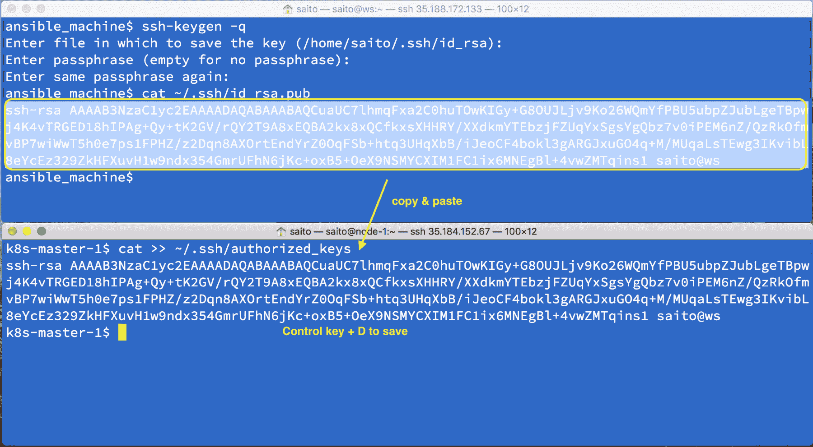

1.  您需要将您的公钥复制粘贴到所有 Kubernetes 主节点和节点候选机器上。

1.  确保您的 ssh 公钥身份验证有效后，只需从 Ansible 机器 ssh 到目标主机，它不会要求您的登录密码，如下所示：

```
//use ssh-agent to remember your private key and passphrase (if you set)
ansible_machine$ ssh-agent bash
ansible_machine$ ssh-add
Enter passphrase for /home/saito/.ssh/id_rsa: Identity added: /home/saito/.ssh/id_rsa (/home/saito/.ssh/id_rsa)

//logon from ansible machine to k8s machine which you copied public key
ansible_machine$ ssh 10.128.0.2
Last login: Sun Nov  5 17:05:32 2017 from 133.172.188.35.bc.googleusercontent.com
k8s-master-1$
```

现在您已经准备就绪！让我们从头开始使用 kubespray（Ansible）设置 Kubernetes。

# 如何做...

kubespray 通过 GitHub 仓库提供（[`github.com/kubernetes-incubator/kubespray/tags`](https://github.com/kubernetes-incubator/kubespray/tags)），如下截图所示：

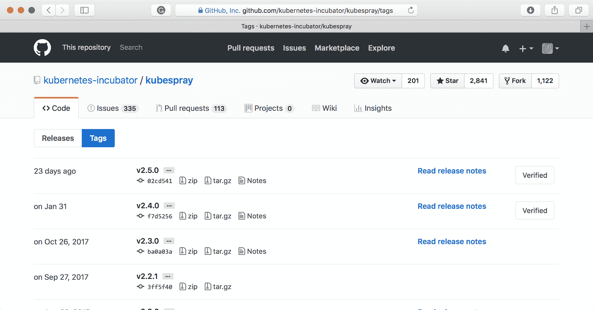

因为 kubespray 是一个 Ansible playbook，而不是一个二进制文件，您可以直接在 Ansible 机器上下载最新版本（截至 2018 年 5 月，版本 2.5.0 是最新版本）的 `zip` 或 `tar.gz` 并使用以下命令解压缩：

```
//download tar.gz format
ansible_machine$ curl -LO https://github.com/kubernetes-incubator/kubespray/archive/v2.5.0.tar.gz

//untar
ansible_machine$ tar zxvf v2.5.0.tar.gz 

//it unarchives under kubespray-2.5.0 directory
ansible_machine$ ls -F
get-pip.py  kubespray-2.5.0/  v2.5.0.tar.gz

//change to kubespray-2.5.0 directory
ansible_machine$ cd kubespray-2.5.0/
```

# 维护 Ansible 库存

为执行 Ansible playbook，您需要维护自己的包含目标机器 IP 地址的库存文件：

1.  在 inventory 目录下有一个示例库存文件，所以您可以使用以下命令进行复制：

```
//copy sample to mycluster
ansible_machine$ cp -rfp inventory/sample inventory/mycluster 
//edit hosts.ini
ansible_machine$ vi inventory/mycluster/hosts.ini 
```

1.  在本教程中，我们使用具有以下 IP 地址的目标机器：

+   Kubernetes 主节点：`10.128.0.2`

+   Kubernetes 节点：`10.128.0.4`

1.  在这种情况下，`hosts.ini` 应该采用以下格式：

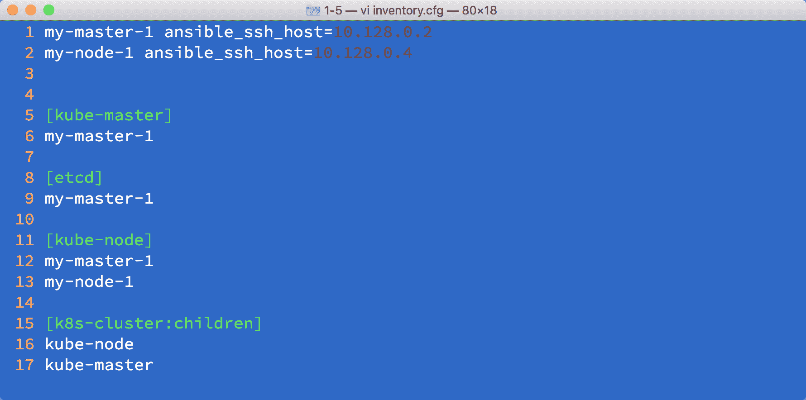

1.  请更改 IP 地址以匹配您的环境。

请注意，主机名（`my-master-1` 和 `my-node-1`）将根据此 `hosts.ini` 设置为 kubespray playbook，因此可以自由分配有意义的主机名。

# 运行 Ansible ad hoc 命令以测试您的环境

在运行 kubespray playbook 之前，让我们检查 `hosts.ini` 和 Ansible 本身是否正常工作：

1.  为此，请使用 Ansible ad hoc 命令，使用 ping 模块，如下截图所示：

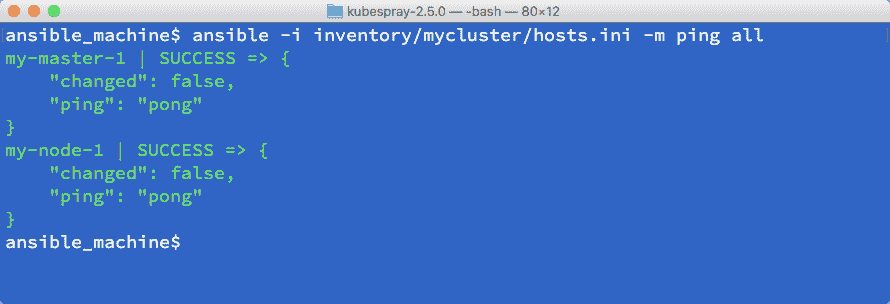

1.  此结果表示“成功”。但如果您看到以下错误，可能是 IP 地址错误或目标机器已关闭，请先检查目标机器：

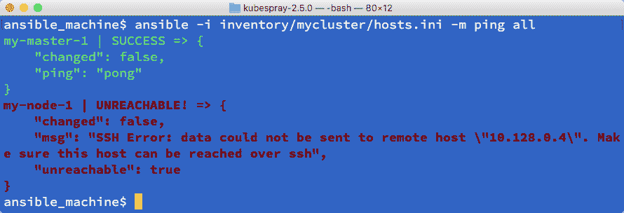

1.  接下来，检查您的权限是否可以在目标机器上提升权限。换句话说，您是否可以运行 `sudo`。这是因为您需要安装 Kubernetes、Docker 和一些需要 root 权限的相关二进制文件和配置。要确认这一点，请添加 `-b`（become）选项，如下截图所示：

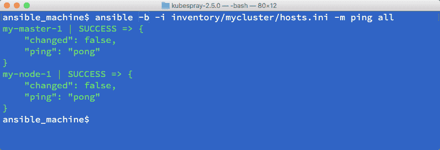

1.  使用 `-b` 选项，它实际上尝试在目标机器上执行 sudo。如果您看到“成功”，那就准备好了！转到 *它是如何工作的…* 部分来运行 kubespray。

如果不幸看到一些错误，请参考以下部分解决 Ansible 问题。

# Ansible 故障排除

理想情况是使用相同的 Linux 发行版、版本、设置和登录用户。然而，根据政策、兼容性和其他原因，环境会有所不同。Ansible 灵活并且可以支持许多用例来运行`ssh`和`sudo`。

# 需要指定 sudo 密码

根据您的 Linux 机器设置，当添加`-b`选项时，您可能会看到以下错误。在这种情况下，您需要在运行`sudo`命令时输入密码：

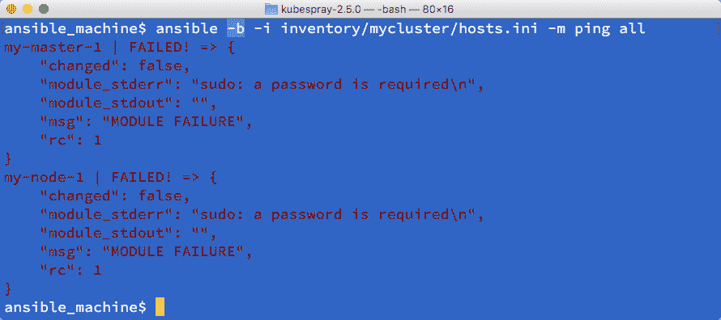

在这种情况下，添加`-K`（请求`sudo`密码）并重新运行。在运行 Ansible 命令时，它将要求您的 sudo 密码，如下截图所示：

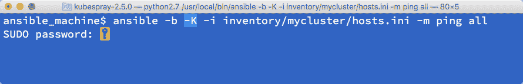

如果您的 Linux 使用`su`命令而不是`sudo`，在运行 Ansible 命令时添加`--become-method=su`可能会有所帮助。请阅读 Ansible 文档以获取更多详细信息：[`docs.ansible.com/ansible/latest/become.html`](http://docs.ansible.com/ansible/latest/become.html)

# 需要指定不同的 ssh 登录用户

有时您可能需要使用不同的登录用户 ssh 到目标机器。在这种情况下，您可以在`hosts.ini`中的单个主机后附加`ansible_user`参数。例如：

+   使用用户名`kirito`来通过`ssh`连接到`my-master-1`

+   使用用户名`asuna`来通过`ssh`连接到`my-node-1`

在这种情况下，更改`hosts.ini`，如下所示的代码：

```
my-master-1 ansible_ssh_host=10.128.0.2 ansible_user=kirito
my-node-1 ansible_ssh_host=10.128.0.4 ansible_user=asuna
```

# 需要更改 ssh 端口

另一种情况是您可能需要在某些特定端口号上运行 ssh 守护程序，而不是默认端口号`22`。Ansible 也支持这种情况，并在`hosts.ini`中的单个主机上使用`ansible_port`参数，如下所示的代码（在示例中，`ssh`守护程序在`my-node-1`上以`10022`运行）：

```
my-master-1 ansible_ssh_host=10.128.0.2
my-node-1 ansible_ssh_host=10.128.0.4 ansible_port=10022
```

# 常见的 ansible 问题

Ansible 足够灵活，可以支持任何其他情况。如果您需要任何特定参数来自定义目标主机的 ssh 登录，请阅读 Ansible 清单文档以找到特定参数：[`docs.ansible.com/ansible/latest/intro_inventory.html`](http://docs.ansible.com/ansible/latest/intro_inventory.html)

此外，Ansible 还有一个配置文件`ansible.cfg`，位于`kubespray`目录的顶部。它为 Ansible 定义了常见设置。例如，如果您使用的是通常会导致 Ansible 错误的非常长的用户名，请更改`ansible.cfg`以将`control_path`设置为解决该问题，如下面的代码所示：

```
[ssh_connection]
control_path = %(directory)s/%%h-%%r
```

如果您计划设置超过`10`个节点，则可能需要增加 ssh 同时会话。在这种情况下，添加`forks`参数还需要通过添加超时参数将 ssh 超时从`10`秒增加到`30`秒，如下面的代码所示：

```
[ssh_connection]
forks = 50
timeout = 30
```

以下屏幕截图包含`ansible.cfg`中的所有先前配置：

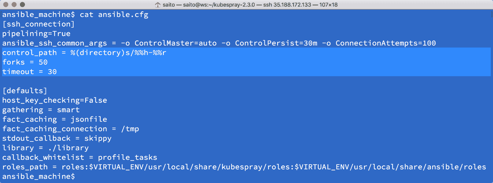

有关更多详细信息，请访问[`docs.ansible.com/ansible/latest/intro_configuration.html`](http://docs.ansible.com/ansible/latest/intro_configuration.html)中的 Ansible 配置文档。

# 它是如何工作的...

现在您可以开始运行 kubepray playbook：

1.  您已经创建了一个名为`inventory/mycluster/hosts.ini`的清单文件。除了`hosts.ini`，您还需要检查和更新`inventory/mycluster/group_vars/all.yml`中的全局变量配置文件。

1.  有很多变量被定义，但至少需要将一个变量`bootstrap_os`从`none`更改为目标 Linux 机器。如果您使用的是 RHEL/CentOS7，请将`bootstrap_os`设置为`centos`。如果您使用的是 Ubuntu 16.04 LTS，请将`bootstrap_os`设置为`ubuntu`，如下面的屏幕截图所示：

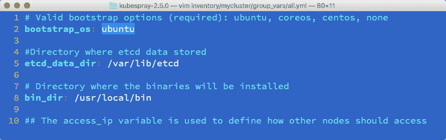

您还可以更新其他变量，例如`kube_version`，以更改或安装 Kubernetes 版本。有关更多详细信息，请阅读[`github.com/kubernetes-incubator/kubespray/blob/master/docs/vars.md`](https://github.com/kubernetes-incubator/kubespray/blob/master/docs/vars.md)中的文档。

1.  最后，您可以执行 playbook。使用`ansible-playbook`命令而不是 Ansible 命令。ansible-playbook 根据 playbook 中定义的任务和角色运行多个 Ansible 模块。

1.  运行 kubespray playbook，使用以下参数键入 ansible-playbook 命令：

```
//use –b (become), -i (inventory) and specify cluster.yml as playbook
$ ansible-playbook -b -i inventory/mycluster/hosts.ini cluster.yml 
```

ansible-playbook 参数与 Ansible 命令相同。因此，如果您需要使用`-K`（要求`sudo`密码）或`--become-method=su`，您也需要为 ansible-playbook 指定。

1.  根据机器规格和网络带宽，大约需要 5 到 10 分钟才能完成。但最终您可以看到`PLAY RECAP`，如下面的截图所示，以查看是否成功：

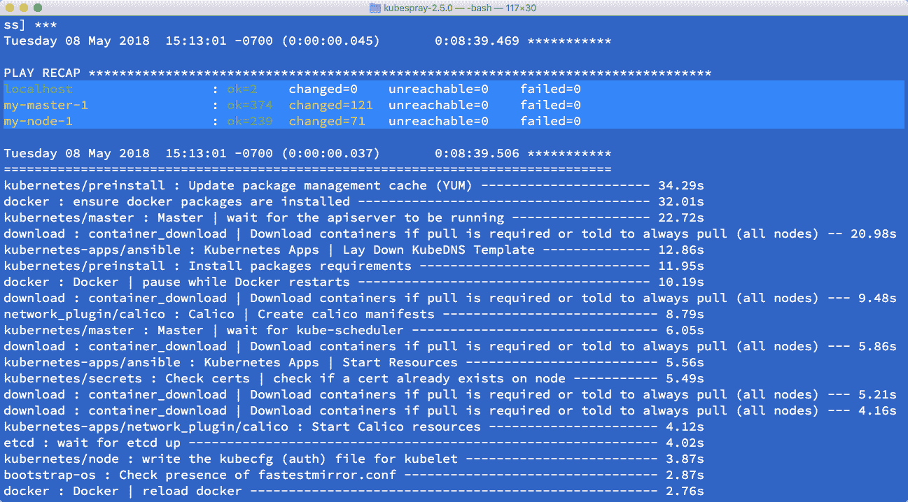

1.  如果您看到像前面的截图中的`failed=0`，则您已成功设置了 Kubernetes 集群。您可以 ssh 到 Kubernetes 主节点并运行`/usr/local/bin/kubectl`命令来查看状态，如下面的截图所示：

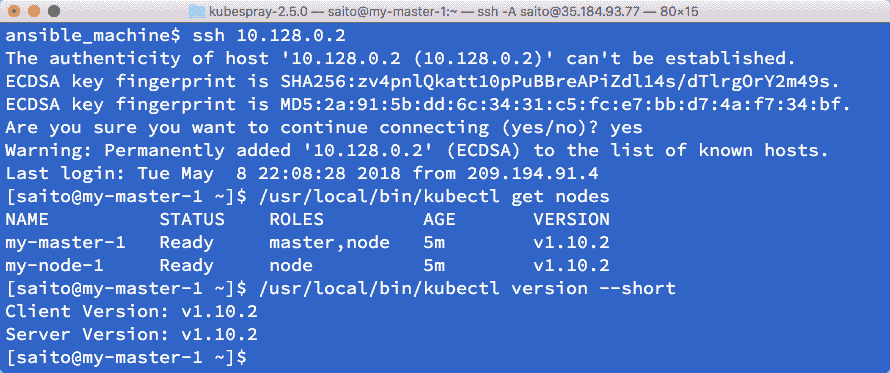

1.  前面的截图显示您已成功设置了 Kubernetes 版本 1.10.2 的主节点和节点。您可以继续使用`kubectl`命令在接下来的章节中配置 Kubernetes 集群。

1.  不幸的是，如果您看到失败计数超过 0，那么 Kubernetes 集群可能没有正确设置。由于失败的原因有很多，没有单一的解决方案。建议您附加`-v`选项以查看来自 Ansible 的更详细的输出，如下面的代码所示：

```
//use –b (become), -i (inventory) and –v (verbose)
$ ansible-playbook -v -b -i inventory/mycluster/hosts.ini cluster.yml
```

1.  如果失败是超时，只需重新运行 ansible-playbook 命令可能会解决问题。因为 Ansible 被设计为幂等性，如果您多次重新执行 ansible-playbook 命令，Ansible 仍然可以正确配置。

1.  如果失败是在运行 ansible-playbook 后更改目标 IP 地址（例如，重复使用 Ansible 机器设置另一个 Kubernetes 集群），则需要清理事实缓存文件。它位于`/tmp`目录下，所以您只需删除这个文件，如下面的截图所示：

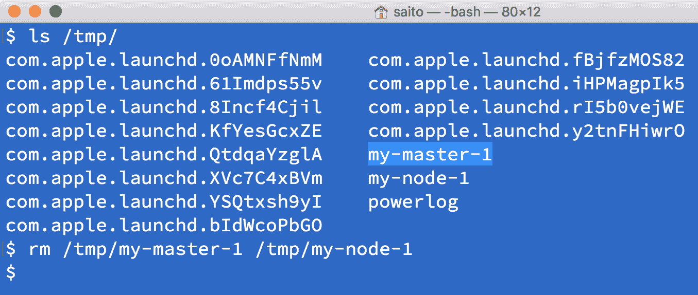

# 另请参阅

本节描述了如何在 Linux 操作系统上使用 kubespray 设置 Kubernetes 集群。这是一个支持主要 Linux 发行版的 Ansible 剧本。Ansible 很简单，但由于支持任何情况和环境，您需要关注一些不同的用例。特别是在 ssh 和 sudo 相关的配置方面，您需要更深入地了解 Ansible 以适应您的环境。

# 在 Kubernetes 中运行您的第一个容器

恭喜！您已经在之前的配方中构建了自己的 Kubernetes 集群。现在，让我们开始运行您的第一个容器，nginx（[`nginx.org/`](http://nginx.org/)），这是一个开源的反向代理服务器、负载均衡器和 Web 服务器。除了这个配方，您还将创建一个简单的 nginx 应用程序，并将其暴露给外部世界。

# 准备就绪

在 Kubernetes 中运行第一个容器之前，最好检查一下您的集群是否处于健康状态。列出以下项目的清单将使您的`kubectl`子命令稳定且成功，而不会因后台服务引起未知错误：

1.  检查主节点守护程序。检查 Kubernetes 组件是否正在运行：

```
// get the components status
$ kubectl get cs
NAME                 STATUS    MESSAGE              ERROR
controller-manager   Healthy   ok
scheduler            Healthy   ok
etcd-0               Healthy   {"health": "true"}
```

1.  检查 Kubernetes 主节点的状态：

```
// check if the master is running
$ kubectl cluster-info
Kubernetes master is running at https://192.168.122.101:6443
KubeDNS is running at https://192.168.122.101:6443/api/v1/namespaces/kube-system/services/kube-dns/proxy

To further debug and diagnose cluster problems, use 'kubectl cluster-info dump'. 
```

1.  检查所有节点是否准备就绪：

```
$ kubectl get nodes
NAME       STATUS    ROLES     AGE       VERSION
ubuntu01   Ready     master    20m       v1.10.2
ubuntu02   Ready     <none>    2m        v1.10.2
```

理想的结果应该类似于前面的输出。您可以成功执行`kubectl`命令并获得响应而无错误。如果所检查的项目中有任何一个未能达到预期结果，请根据您使用的管理工具在前面的配方中检查设置。

1.  检查 Docker 注册表的访问权限，因为我们将使用官方免费镜像作为示例。如果您想运行自己的应用程序，请务必先将其 docker 化！对于您的自定义应用程序，您需要编写一个 Dockerfile（[`docs.docker.com/engine/reference/builder/`](https://docs.docker.com/engine/reference/builder/)），并将其构建并推送到公共或私有 Docker 注册表。

测试您的节点与公共/私有 Docker 注册表的连接

在您的节点上，尝试运行 Docker pull nginx 命令，以测试您是否可以从 Docker Hub 拉取镜像。如果您在代理后面，请将`HTTP_PROXY`添加到您的 Docker 配置文件中（[`docs.docker.com/engine/admin/systemd/#httphttps-proxy`](https://docs.docker.com/engine/admin/systemd/#httphttps-proxy)）。如果您想从 Docker Hub 的私有存储库或私有 Docker 注册表中运行镜像，则需要一个 Kubernetes 秘密。请查看*使用秘密*，在第二章，*通过 Kubernetes 概念工作*，*获取说明*。

# 如何做...

我们将使用 nginx 的官方 Docker 镜像作为示例。该镜像在 Docker Hub（[`store.docker.com/images/nginx`](https://store.docker.com/images/nginx)）和 Docker Store（[`hub.docker.com/_/nginx/`](https://hub.docker.com/_/nginx/)）中提供。

许多官方和公共镜像都可以在 Docker Hub 或 Docker Store 上找到，因此你不需要从头构建它们。只需拉取它们并在其上设置自定义设置。

Docker Store 与 Docker Hub

你可能知道，有一个更熟悉的官方仓库，Docker Hub，它是为社区分享基于镜像而启动的。与 Docker Hub 相比，Docker Store 更专注于企业应用。它为企业级 Docker 镜像提供了一个地方，这些镜像可以是免费的，也可以是付费的软件。你可能更有信心在 Docker Store 上使用更可靠的镜像。

# 运行一个 HTTP 服务器（nginx）

在 Kubernetes 主节点上，我们可以使用`kubectl run`来创建一定数量的容器。Kubernetes 主节点将安排节点运行的 pod，一般的命令格式如下：

```
$ kubectl run <replication controller name> --image=<image name> --replicas=<number of replicas> [--port=<exposing port>]
```

以下示例将使用 nginx 镜像创建两个名称为`my-first-nginx`的副本，并暴露端口`80`。我们可以在所谓的 pod 中部署一个或多个容器。在这种情况下，我们将每个 pod 部署一个容器。就像正常的 Docker 行为一样，如果本地不存在 nginx 镜像，它将默认从 Docker Hub 中拉取：

```
// run a deployment with 2 replicas for the image nginx and expose the container port 80
$ kubectl run my-first-nginx --image=nginx --replicas=2 --port=80
deployment "my-first-nginx" created
```

部署的名称<my-first-nginx>不能重复

一个 Kubernetes 命名空间中的资源（pod、服务、部署等）不能重复。如果你运行上述命令两次，将会弹出以下错误：

```
Error from server (AlreadyExists): deployments.extensions "my-first-nginx" already exists
```

让我们继续看看所有 pod 的当前状态，使用`kubectl get pods`。通常，pod 的状态会在等待一段时间后保持在 Pending 状态，因为节点需要一些时间从注册表中拉取镜像：

```
// get all pods
$ kubectl get pods
NAME                              READY     STATUS    RESTARTS   AGE
my-first-nginx-7dcd87d4bf-jp572   1/1       Running   0          7m
my-first-nginx-7dcd87d4bf-ns7h4   1/1       Running   0          7m
```

如果 pod 状态长时间不是运行状态

您可以始终使用 kubectl get pods 来检查 pod 的当前状态，使用 kubectl describe pods `$pod_name`来检查 pod 中的详细信息。如果您输入了错误的镜像名称，可能会收到`ErrImagePull`错误消息，如果您从私有存储库或注册表中拉取镜像而没有适当的凭据，可能会收到`ImagePullBackOff`消息。如果您长时间收到`Pending`状态并检查节点容量，请确保您没有运行超出节点容量的副本。如果出现其他意外错误消息，您可以停止 pod 或整个复制控制器，以强制主节点重新安排任务。

您还可以检查部署的详细信息，以查看所有的 pod 是否已准备就绪：

```
// check the status of your deployment
$ kubectl get deployment
NAME             DESIRED   CURRENT   UP-TO-DATE   AVAILABLE   AGE
my-first-nginx   2         2         2            2           2m
```

# 公开端口以供外部访问

我们可能还想为 nginx 部署创建一个外部 IP 地址。在支持外部负载均衡器的云提供商上（例如 Google 计算引擎），使用`LoadBalancer`类型将为外部访问提供一个负载均衡器。另一方面，即使您不在支持外部负载均衡器的平台上运行，您仍然可以通过创建 Kubernetes 服务来公开端口，我们稍后将描述如何从外部访问这个服务：

```
// expose port 80 for replication controller named my-first-nginx
$ kubectl expose deployment my-first-nginx --port=80 --type=LoadBalancer
service "my-first-nginx" exposed
```

我们可以看到刚刚创建的服务状态：

```
// get all services
$ kubectl get service
NAME             TYPE           CLUSTER-IP      EXTERNAL-IP   PORT(S)        AGE
kubernetes       ClusterIP      10.96.0.1       <none>        443/TCP        2h
my-first-nginx   LoadBalancer   10.102.141.22   <pending>     80:31620/TCP   3m
```

如果服务守护程序以容器形式运行（例如使用 kubeadm 作为管理工具），您可能会发现一个名为`kubernetes`的额外服务。这是为了在内部公开 Kubernetes API 服务器的 REST API。`my-first-nginx`服务的外部 IP 处于挂起状态，表明它正在等待云提供商提供特定的公共 IP。更多细节请参阅第六章，“在 AWS 上构建 Kubernetes”，和第七章，“在 GCP 上构建 Kubernetes”。

恭喜！您刚刚运行了您的第一个 Kubernetes pod 并暴露了端口`80`。

# 停止应用程序

我们可以使用删除部署和服务等命令来停止应用程序。在此之前，我们建议您先阅读以下代码，以更多了解它的工作原理：

```
// stop deployment named my-first-nginx
$ kubectl delete deployment my-first-nginx
deployment.extensions "my-first-nginx" deleted

// stop service named my-first-nginx
$ kubectl delete service my-first-nginx
service "my-first-nginx" deleted
```

# 它是如何工作的…

让我们通过使用`kubectl`命令中的 describe 来深入了解服务。我们将创建一个类型为`LoadBalancer`的 Kubernetes 服务，它将把流量分发到两个端点`192.168.79.9`和`192.168.79.10`，端口为`80`：

```
$ kubectl describe service my-first-nginx
Name:                     my-first-nginx
Namespace:                default
Labels:                   run=my-first-nginx
Annotations:              <none>
Selector:                 run=my-first-nginx
Type:                     LoadBalancer
IP:                       10.103.85.175
Port:                     <unset>  80/TCP
TargetPort:               80/TCP
NodePort:                 <unset>  31723/TCP
Endpoints:                192.168.79.10:80,192.168.79.9:80
Session Affinity:         None
External Traffic Policy:  Cluster
Events:                   <none>
```

这里的端口是一个抽象的服务端口，它将允许任何其他资源在集群内访问服务。`nodePort`将指示外部端口以允许外部访问。`targetPort`是容器允许流量进入的端口；默认情况下，它将是相同的端口。

在下图中，外部访问将使用`nodePort`访问服务。服务充当负载均衡器，将流量分发到使用端口`80`的 pod。然后，pod 将通过`targetPort 80`将流量传递到相应的容器中：

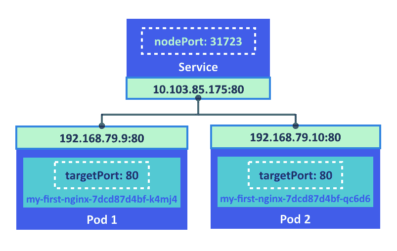

在任何节点或主节点上，一旦建立了互连网络，您应该能够使用`ClusterIP` `192.168.61.150`和端口`80`访问 nginx 服务：

```
// curl from service IP
$ curl 10.103.85.175:80
<!DOCTYPE html>
<html>
<head>
<title>Welcome to nginx!</title>
<style>
 body {
 width: 35em;
 margin: 0 auto;
 font-family: Tahoma, Verdana, Arial, sans-serif;
 }
</style>
</head>
<body>
<h1>Welcome to nginx!</h1>
<p>If you see this page, the nginx web server is successfully installed and
working. Further configuration is required.</p>
<p>For online documentation and support please refer to
<a href="http://nginx.org/">nginx.org</a>.<br/>
Commercial support is available at
<a href="http://nginx.com/">nginx.com</a>.</p>
<p><em>Thank you for using nginx.</em></p>
</body>
</html>
```

如果我们直接`curl`到 pod 的目标端口，将得到相同的结果：

```
// curl from endpoint, the content is the same as previous nginx html
$ curl 192.168.79.10:80
<!DOCTYPE html>
<html>
...
```

如果您想尝试外部访问，请使用浏览器访问外部 IP 地址。请注意，外部 IP 地址取决于您运行的环境。

在 Google 计算引擎中，您可以通过适当的防火墙规则设置通过`ClusterIP`进行访问：

```
$ curl http://<clusterIP>
```

在自定义环境中，例如本地数据中心，您可以通过节点的 IP 地址进行访问：

```
$ curl http://<nodeIP>:<nodePort>
```

您应该能够使用 Web 浏览器看到以下页面：

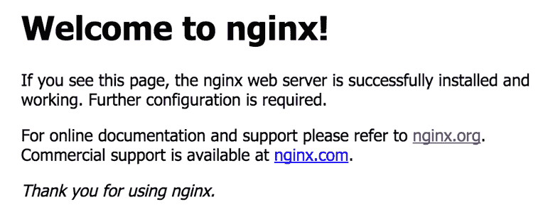

# 另请参阅

在本节中，我们已经运行了我们的第一个容器。继续阅读下一章，以获取更多关于 Kubernetes 的知识：

+   第二章，*深入了解 Kubernetes 概念*
