# 通过 Kubernetes 概念

在本章中，我们将涵盖以下配方：

+   链接 Pod 和容器

+   使用 ReplicaSets 管理 Pods

+   部署 API

+   处理服务

+   使用卷

+   处理机密

+   处理名称

+   使用命名空间

+   使用标签和选择器

# 介绍

在本章中，我们将首先在 Kubernetes 系统上创建不同类型的资源。为了在微服务结构中实现您的应用程序，阅读本章中的配方将是理解 Kubernetes 资源概念并加以巩固的良好开端。在您在 Kubernetes 中部署应用程序之后，您可以开始进行可伸缩和高效的容器管理，并完成微服务的 DevOps 交付流程。

# Kubernetes 概述

使用 Kubernetes 非常容易，可以使用**命令行界面**（**CLI**）或 API（RESTful）。本节将描述通过 CLI 控制 Kubernetes。本章中使用的 CLI 版本为 1.10.2。

安装 Kubernetes 主节点后，可以运行以下`kubectl`命令。它显示 kubectl 和 Kubernetes 主节点的版本（API 服务器和 CLI 都是 v1.10.2）：

```
$ kubectl version --short Client Version: v1.10.2 Server Version: v1.10.2
```

`kubectl`使用 RESTful API 连接 Kubernetes API 服务器。默认情况下，如果未配置`.kube/config`，它会尝试访问 localhost，否则您需要使用`--server`参数指定 API 服务器地址。因此，建议在 API 服务器机器上使用`kubectl`进行练习。

如果您通过网络使用 kubectl，您需要考虑 API 服务器的身份验证和授权。请参阅第七章，*在 GCP 上构建 Kubernetes*。

`kubectl`是 Kubernetes 集群的唯一命令，它控制 Kubernetes 集群管理器。在[`kubernetes.io/docs/user-guide/kubectl-overview/`](http://kubernetes.io/docs/user-guide/kubectl-overview/)找到更多信息。任何容器或 Kubernetes 集群操作都可以通过`kubectl`命令执行。

此外，kubectl 允许通过命令行的可选参数或文件（使用`-f`选项）输入信息；强烈建议使用文件，因为您可以将 Kubernetes 配置保持为代码。本章将对此进行详细描述。

这是一个典型的`kubectl`命令行参数：

```
kubectl [command] [TYPE] [NAME] [flags]
```

上述命令的属性如下：

+   `command`：指定要在一个或多个资源上执行的操作。

+   `TYPE`：指定资源类型。资源类型区分大小写，您可以指定单数、复数或缩写形式。

+   `NAME`：指定资源的名称。名称区分大小写。如果省略名称，则会显示所有资源的详细信息。

+   `flags`：指定可选标志。

例如，如果您想要启动`nginx`，您可以使用`kubectl run`命令或`kubectl create -f`命令与以下 YAML 文件：

1.  使用`run`命令：

```
$ kubectl run my-first-nginx --image=nginx "my-first-nginx"
```

1.  使用`create -f`命令与 YAML 文件：

```
$ cat nginx.yaml 
apiVersion: apps/v1 kind: Deployment metadata:
 name: my-first-nginx labels: app: nginx spec:
 replicas: 1 selector: matchLabels: app: nginx template: metadata: labels: app: nginx spec: containers: - name: nginx image: nginx 

//specify -f (filename) 
$ kubectl create -f nginx.yaml 
deployment.apps "my-first-nginx" created
```

1.  如果您想要查看部署的状态，请输入以下`kubectl get`命令：

```
$ kubectl get deployment NAME             DESIRED   CURRENT   UP-TO-DATE   AVAILABLE   AGE my-first-nginx   1         1         1            1           4s
```

1.  如果您还想要支持缩写，输入以下内容：

```
$ kubectl get deploy NAME             DESIRED   CURRENT   UP-TO-DATE   AVAILABLE   AGE my-first-nginx   1         1         1            1           38s
```

1.  如果要删除这些资源，请输入以下`kubectl delete`命令：

```
$ kubectl delete deploy my-first-nginx deployment.extensions "my-first-nginx" deleted
```

1.  `kubectl`命令支持许多种子命令；使用`-h`选项查看详细信息，例如：

```
//display whole sub command options 
$ kubectl -h 

//display sub command "get" options 
$ kubectl get -h 

//display sub command "run" options 
$ kubectl run -h 
```

本节描述如何使用`kubectl`命令来控制 Kubernetes 集群。以下示例描述了如何设置 Kubernetes 组件：

+   *在 macOS 上使用 minikube 设置 Kubernetes 集群*和*在 Windows 上使用 minikube 设置 Kubernetes 集群*在第一章，*构建您自己的 Kubernetes 集群*

+   *在 Linux 上使用 kubeadm 设置 Kubernetes 集群*在第一章，*构建您自己的 Kubernetes 集群*

+   *在 Linux 上使用 kubespray（Ansible）设置 Kubernetes 集群*在第一章，*构建您自己的 Kubernetes 集群*

# 链接 Pod 和容器

Pod 是一个或多个容器的组合，是 Kubernetes 中最小的可部署单元。Pod 始终是共同定位和共同调度的，并在共享上下文中运行。每个 Pod 都由以下 Linux 命名空间隔离：

+   **进程 ID**（**PID**）命名空间

+   网络命名空间

+   **进程间通信**（**IPC**）命名空间

+   **Unix 时间共享**（**UTS**）命名空间

在容器之前的世界中，它们将在同一台物理或虚拟机上执行。

构建自己的应用程序堆栈 Pod（例如，Web 服务器和数据库）是很有用的，这些 Pod 由不同的 Docker 镜像混合而成。

# 准备工作

您必须拥有一个 Kubernetes 集群，并确保 Kubernetes 节点可以访问 Docker Hub（[`hub.docker.com`](https://hub.docker.com)）以便下载 Docker 镜像。

如果您正在运行 minikube，请先使用 `minikube ssh` 登录到 minikube VM，然后运行 `docker pull` 命令。

您可以使用 `docker pull` 命令模拟下载 Docker 镜像：

```
//this step only if you are using minikube
$ minikube ssh
                         _ _ 
            _ _ ( ) ( ) 
  ___ ___ (_) ___ (_)| |/') _ _ | |_ __ 
/' _ ` _ `\| |/' _ `\| || , < ( ) ( )| '_`\ /'__`\
| ( ) ( ) || || ( ) || || |\`\ | (_) || |_) )( ___/
(_) (_) (_)(_)(_) (_)(_)(_) (_)`\___/'(_,__/'`\____)

//run docker pull to download CentOS docker image
$ docker pull centos
Using default tag: latest
latest: Pulling from library/centos
d9aaf4d82f24: Pull complete 
Digest: sha256:4565fe2dd7f4770e825d4bd9c761a81b26e49cc9e3c9631c58cfc3188be9505a
Status: Downloaded newer image for centos:latest
```

# 如何做...

以下是创建一个具有 2 个容器的 Pod 的步骤：

1.  登录到 Kubernetes 机器（如果使用 minikube，则无需登录），并准备以下 YAML 文件。它定义了启动 `nginx` 容器和 CentOS 容器。

1.  `nginx` 容器打开 HTTP 端口（TCP/`80`）。另一方面，CentOS 容器尝试每三秒使用 `curl` 命令访问 `localhost:80`：

```
$ cat my-first-pod.yaml apiVersion: v1 kind: Pod metadata: 
name: my-first-pod spec:
 containers: - name: my-nginx image: nginx - name: my-centos image: centos command: ["/bin/sh", "-c", "while : ;do curl http://localhost:80/; sleep 10; done"]
```

1.  然后，执行 `kubectl create` 命令启动 `my-first-pod`，如下所示：

```
$ kubectl create -f my-first-pod.yaml pod "my-first-pod" created 
```

这需要几秒到几分钟的时间，具体取决于 Docker Hub 和 Kubernetes 节点规格的网络带宽。

1.  您可以使用 `kubectl get pods` 命令查看状态，如下所示：

```
//still downloading Docker images (0/2)
$ kubectl get pods NAME           READY     STATUS              RESTARTS   AGE my-first-pod   **0/2**       ContainerCreating   0          14s //my-first-pod is running (2/2)
$ kubectl get pods NAME           READY     STATUS    RESTARTS   AGE my-first-pod   2/2       **Running  ** 0          1m
```

现在 `nginx` 容器（`my-nginx`）和 CentOS 容器（`my-centos`）都已准备就绪。

1.  让我们检查 CentOS 容器是否能够访问 `nginx`。您可以使用 `kubectl exec` 命令在 CentOS 容器上运行 bash，然后运行 `curl` 命令访问 `nginx`，如下所示：

```
//run bash on my-centos container
//then access to TCP/80 using curl
$ kubectl exec my-first-pod -it -c my-centos -- /bin/bash
[root@my-first-pod /]# 
[root@my-first-pod /]# curl -L http://localhost:80
<!DOCTYPE html>
<html>
<head>
<title>Welcome to nginx!</title>
<style>
    body {
        width: 35em;
        margin: 0 auto;
        font-family: Tahoma, Verdana, Arial, sans-serif;
    }
</style>
</head>
<body>
<h1>Welcome to nginx!</h1>
<p>If you see this page, the nginx web server is successfully installed and
working. Further configuration is required.</p>

<p>For online documentation and support please refer to
<a href="http://nginx.org/">nginx.org</a>.<br/>
Commercial support is available at
<a href="http://nginx.com/">nginx.com</a>.</p>

<p><em>Thank you for using nginx.</em></p>
</body>
</html>
```

如您所见，Pod 将两个不同的容器 `nginx` 和 `CentOS` 链接到相同的 Linux 网络命名空间中。

# 它是如何工作的...

在启动 Pod 时，Kubernetes 调度程序将分派给 kubelet 进程来处理在一个 Kubernetes 节点上启动 `nginx` 和 `CentOS` 容器的所有操作。

以下图示了这两个容器和 Pod；这两个容器可以通过本地主机网络进行通信，因为在 Pod 容器内部，它们共享网络接口：

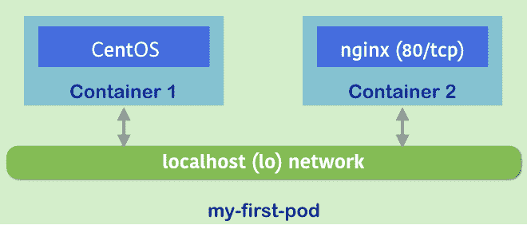一个 Pod 有两个容器，可以通过本地主机进行通信

如果您有两个或更多节点，可以使用 `-o wide` 选项查找运行 Pod 的节点：

```
//it indicates Node "minikube" runs my-first-pod 
$ kubectl get pods -o wide NAME           READY     STATUS    RESTARTS   AGE       IP           NODE my-first-pod   2/2       Running   0          43m       172.17.0.2   minikube
```

登录到该节点，然后您可以使用 `docker ps | grep my-first-pod` 命令查看正在运行的容器，如下所示：

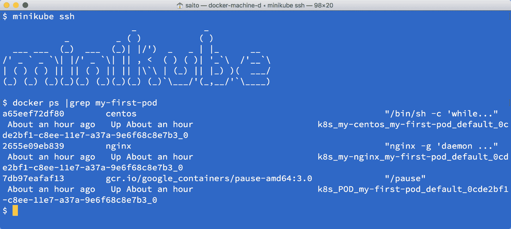属于我的第一个 Pod 的容器列表

您可能注意到`my-first-pod`包含三个容器；`centos`、`nginx`和`pause`正在运行，而不是两个。因为我们需要保留的每个 Pod 都属于特定的 Linux 命名空间，如果 CentOS 和 nginx 容器都死掉了，命名空间也会被销毁。因此，暂停容器只是留在 Pod 中以维护 Linux 命名空间。

让我们启动第二个 Pod，将其重命名为`my-second-pod`，并运行以下`kubectl` create 命令：

```
//just replace the name from my-first-pod to my-second-pod 
$ cat my-first-pod.yaml | sed -e 's/my-first-pod/my-second-pod/' > my-second-pod.yaml  //metadata.name has been changed to my-second-pod
$ cat my-second-pod.yaml apiVersion: v1 kind: Pod metadata: 
name: **my-second-pod** spec:
 containers: - name: my-nginx image: nginx - name: my-centos image: centos command: ["/bin/sh", "-c", "while : ;do curl
http://localhost:80/; sleep 10; done"] 

//create second pod
$ kubectl create -f my-second-pod.yaml pod "my-second-pod" created

//2 pods are running $ kubectl get pods NAME            READY     STATUS    RESTARTS   AGE my-first-pod    2/2       Running   0          1h my-second-pod   2/2       Running   0          43s
```

现在您有两个 Pod；每个 Pod 有两个容器，`centos`和`nginx`。因此，在您的 Kubernetes 集群上总共有四个容器正在运行，如下图所示：

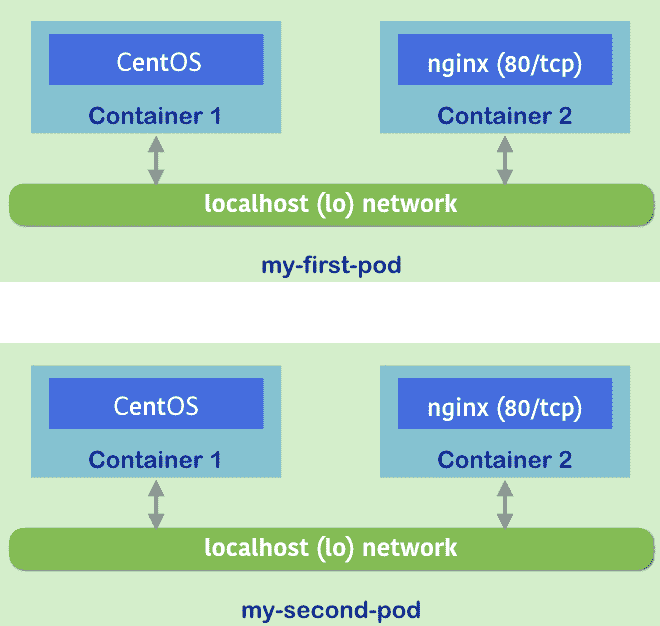从 my-first-pod 复制 Pod 到 my-second-pod 如果您想部署更多相同的 Pod，请考虑使用部署（ReplicaSet）。

在测试完成后，您可以运行`kubectl` delete 命令来从 Kubernetes 集群中删除您的 Pod：

```
//specify --all option to delete all pods
$ kubectl delete pods --all pod "my-first-pod" deleted pod "my-second-pod" deleted  //pods are terminating
$ kubectl get pods NAME            READY     STATUS        RESTARTS   AGE my-first-pod    2/2       Terminating   0          1h my-second-pod   2/2       Terminating   0          3m
```

# 另请参阅

本章中的这个配方描述了如何控制 Pods。它们是 Kubernetes 操作的基本组件。接下来的配方将描述如何使用 Deployments、Services 等来进行 Pods 的高级操作：

+   *使用 ReplicaSets 管理 Pods*

+   *部署 API*

+   *使用 Services 工作*

+   *使用标签和选择器*

# 使用 ReplicaSets 管理 Pods

ReplicaSet 是 Kubernetes 中指向 Pod 副本的 API 对象的术语。其想法是能够控制一组 Pod 的行为。ReplicaSet 确保用户指定数量的 Pods 始终运行。如果 ReplicaSet 中的一些 Pod 崩溃并终止，系统将自动在健康节点上使用原始配置重新创建 Pods，并保持一定数量的进程持续运行。在更改集的大小时，用户可以轻松地扩展或缩小应用程序。根据这个特性，无论您是否需要 Pod 的副本，您都可以始终依赖 ReplicaSet 进行自动恢复和可伸缩性。在这个配方中，您将学习如何使用 ReplicaSet 管理您的 Pods：

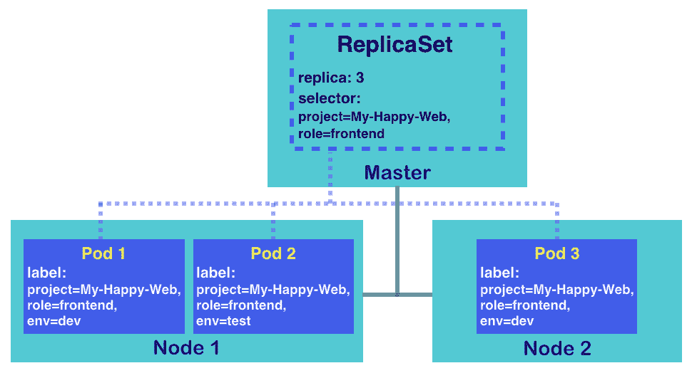两个节点上的 ReplicaSet 及其 Pods

ReplicaSet 通常处理一个应用程序层。如前图所示，我们启动了一个具有三个 Pod 副本的 ReplicaSet。一些机制细节列在下面：

+   kube-controller-manager 守护程序有助于保持资源以期望的状态运行。例如，图表中 ReplicaSet 的期望状态是三个 Pod 副本。

+   Kubernetes 主节点上的 kube-scheduler 守护程序负责将任务分配给健康的节点。

+   ReplicaSet 的选择器用于决定它覆盖的 Pods。如果 Pod 的标签中的键值对包括 ReplicaSet 选择器中的所有项目，则此 Pod 属于此 ReplicaSet。正如您将看到的那样，图表显示三个 Pod 属于 ReplicaSet 的管理范围。即使 Pod 2 具有不同的`env`标签，它也被选中，因为另外两个标签`role`和`project`与 ReplicaSet 的选择器匹配。

ReplicationController？ReplicaSet？对于有经验的 Kubernetes 玩家，您可能会注意到 ReplicaSet 看起来与 ReplicationController 非常相似。自 Kubernetes 1.2 版本以来，为了集中在不同的功能上，ReplicationController 的功能已被 ReplicaSet 和 Deployment 覆盖。ReplicaSet 专注于 Pod 副本，保持某些 Pod 处于健康状态。另一方面，Deployment 是一个更高级的 API，可以管理 ReplicaSet，执行应用程序滚动更新，并公开服务。在 Kubernetes v1.8.3 中，用户仍然可以创建复制控制器。但是，使用带有 ReplicaSet 的 Deployment 更加推荐，因为它们是最新的，并且具有更精细的配置。

# 准备就绪

创建 ReplicaSet 与创建任何 Kubernetes 资源相同；我们在 Kubernetes 主节点上使用`kubectl`命令。因此，我们确保您的 Kubernetes 环境已准备好接受您的命令。此外，Kubernetes 节点应该能够访问 Docker Hub。在接下来的几页的演示中，我们将以官方的`nginx` docker 镜像为例，该镜像也存储在公共 docker 注册表中。

准备好的 Kubernetes 系统评估：您可以通过检查以下项目来验证您的 Kubernetes 主节点是否实用：

+   检查守护程序是否正在运行：主节点上应该有三个工作中的守护进程：`apiserver`，`scheduler`和`controller-manager`。

+   **检查 kubectl 命令是否存在并且可用**：尝试使用命令`kubectl get cs`来覆盖此要点和第一个要点。您不仅可以验证组件的状态，还可以验证`kubectl`的可行性。

+   **检查节点是否准备就绪**：您可以使用命令`kubectl get nodes`来检查它们的状态。

如果此处列出的某些项目无效，请参考第一章，*构建您自己的 Kubernetes 集群*，根据您选择的安装进行正确的指南。

# 如何做...

在本节中，我们将演示 ReplicaSet 从创建到销毁的生命周期。

# 创建 ReplicaSet

当尝试使用命令行立即启动 Kubernetes 服务时，我们通常会使用`kubectl run`。然而，默认情况下会创建一个部署（Deployment），不仅负责 Pod 副本，还提供容器更新机制。为了简单地创建一个独立的 ReplicaSet，我们可以利用一个配置 YAML 文件并运行它：

```
$ cat my-first-replicaset.yaml
apiVersion: extensions/v1beta1
kind: ReplicaSet
metadata:
  name: my-first-replicaset
  labels:
    version: 0.0.1
spec:
  replicas: 3
  selector:
    matchLabels:
      project: My-Happy-Web
      role: frontend
  template:
    metadata:
      labels:
        project: My-Happy-Web
        role: frontend
        env: dev
    spec:
      containers:
      - name: happy-web
        image: nginx:latest
```

上述文件是我们第一个 ReplicaSet 的 YAML。它定义了一个名为`my-first-replicaset`的 ReplicaSet，其 Pod 有三个副本。标签和选择器是 ReplicaSet 最具特色的设置。有两组标签：一组用于 ReplicaSet，另一组用于 Pods。ReplicaSet 的第一个标签位于此资源的元数据下方，就在名称的下方，仅用于描述。然而，在模板的元数据下方，用于 Pods 的另一个标签值也用于标识。ReplicaSet 负责具有其选择器覆盖的标签的 Pods。

在我们的示例配置文件中，ReplicaSet 的选择器寻找具有`project: My-Happy-Web`和`role: frontend`标签的 Pods。由于我们在此 ReplicaSet 的控制下初始化 Pods，Pods 的标签应该明确包含选择器关心的内容。在创建具有不正确标记的 Pods 的 ReplicaSet 时，您可能会收到以下错误消息：``选择器`与模板`标签`不匹配``。

现在，让我们通过这个文件创建 ReplicaSet：

```
$ kubectl create -f my-first-replicaset.yaml
replicaset.extensions "my-first-replicaset" created
```

**Kubernetes v1.9 中 ReplicaSet 的 API 版本**

在本书编写时，Kubernetes v1.9 已发布。ReplicaSet 的 API 版本转为稳定版本`apps/v1`，而不再是`apps/v1beta2`。如果您使用较旧版本的 Kubernetes，请将`apiVersion`的值更改为`apps/v1beta2`，或者您可以更新您的 Kubernetes 系统。

# 获取 ReplicaSet 的详细信息

在我们创建 ReplicaSet 之后，子命令`get`和`describe`可以帮助我们捕获其信息和 Pod 的状态。在 Kubernetes 的 CLI 中，我们可以使用 rs 作为资源类型的缩写，而不是完整的 ReplicaSet 名称：

```
// use subcommand "get" to list all ReplicaSets
$ kubectl get rs
NAME                  DESIRED   CURRENT   READY     AGE
my-first-replicaset   3         3         3         4s
```

这个结果大致显示了`my-first-replicaset`的 Pod 副本都成功运行；当前运行的 Pod 数量符合预期，并且它们都准备好为请求提供服务。

要获取详细信息，请使用子命令`describe`：

```
// specify that we want to check ReplicaSet called my-first-replicaset
$ kubectl describe rs my-first-replicaset
Name:         my-first-replicaset
Namespace:    default
Selector:     project=My-Happy-Web,role=frontend
Labels:       version=0.0.1
Annotations:  <none>
Replicas:     3 current / 3 desired
Pods Status:  3 Running / 0 Waiting / 0 Succeeded / 0 Failed
Pod Template:
  Labels:  env=dev
           project=My-Happy-Web
           role=frontend
  Containers:
   happy-web:
    Image:        nginx:latest
    Port:         <none>
    Host Port:    <none>
    Environment:  <none>
    Mounts:       <none>
  Volumes:        <none>
Events:
  Type    Reason            Age   From                   Message
  ----    ------            ----  ----                   -------
  Normal  SuccessfulCreate  9s    replicaset-controller  Created pod: my-first-replicaset-8hg55
  Normal  SuccessfulCreate  9s    replicaset-controller  Created pod: my-first-replicaset-wtphz
  Normal  SuccessfulCreate  9s    replicaset-controller  Created pod: my-first-replicaset-xcrws
```

您可以看到输出列出了 ReplicaSet 的配置细节，就像我们在 YAML 文件中请求的那样。此外，创建 Pod 的日志也显示为 ReplicaSet 的一部分，这证实了 Pod 副本已成功创建并分配了唯一名称。您也可以通过名称检查 Pods：

```
// get the description according the name of Pod, please look at the Pod name shown on your screen, which should be different from this book.
$ kubectl describe pod my-first-replicaset-xcrws
```

# 更改 ReplicaSet 的配置

名为`edit`、`patch`和`replace`的子命令可以帮助更新 Kubernetes 资源。所有这些功能都通过修改配置文件来改变设置。这里我们以`edit`为例。

edit 子命令允许用户通过编辑器修改资源配置。尝试通过命令`kubectl edit rs $REPLICASET_NAME`来更新您的 ReplicaSet；您将通过默认编辑器访问这个资源，其中包含一个 YAML 配置文件：

```
// demonstrate to change the number of Pod replicas.
$ kubectl get rs
NAME                  DESIRED   CURRENT   READY     AGE
my-first-replicaset   3         3         3         2m

// get in the editor, modify the replica number, then save and leave
$ kubectl edit rs my-first-replicaset
# Please edit the object below. Lines beginning with a '#' will be ignored,
# and an empty file will abort the edit. If an error occurs while saving this file will be
# reopened with the relevant failures.
#
apiVersion: extensions/v1beta1
kind: ReplicaSet
metadata:
  creationTimestamp: 2018-05-05T20:48:38Z
  generation: 1
  labels:
    version: 0.0.1
  name: my-first-replicaset
  namespace: default
  resourceVersion: "1255241"
  selfLink: /apis/extensions/v1beta1/namespaces/default/replicasets/my-first-replicaset
  uid: 18330fa8-cd55-11e7-a4de-525400a9d353
spec:
  replicas: 4
  selector:
    matchLabels:
...
replicaset "my-first-replicaset" edited
$ kubectl get rs
NAME                  DESIRED   CURRENT   READY     AGE
my-first-replicaset   4         4         4         4m
```

在演示中，我们成功地向集合中添加了一个 Pod，但这并不是自动扩展 Pod 的最佳实践。参考第三章中的*使用配置文件*部分，尝试更改其他值。

# 删除 ReplicaSet

为了从 Kubernetes 系统中删除 ReplicaSet，您可以依赖于子命令`delete`。当我们使用`delete`来删除资源时，它会强制删除目标对象：

```
$ time kubectl delete rs my-first-replicaset && kubectl get pod
replicaset.extensions "my-first-replicaset" deleted
real  0m2.492s
user  0m0.188s
sys   0m0.048s
NAME                        READY     STATUS        RESTARTS   AGE
my-first-replicaset-8hg55   0/1       Terminating   0          53m
my-first-replicaset-b6kr2   1/1       Terminating   0          48m
my-first-replicaset-wtphz   0/1       Terminating   0          53m
my-first-replicaset-xcrws   1/1       Terminating   0          53m
```

我们发现响应时间非常短，效果也是瞬间的。

**删除 ReplicaSet 下的 Pod** 正如我们之前提到的，通过删除 Pod 来缩减 ReplicaSet 是不可能的，因为当一个 Pod 被移除时，ReplicaSet 就不再处于稳定状态：如果未达到期望的 Pod 数量，控制器管理器将要求 ReplicaSet 创建另一个 Pod。这个概念在以下命令中显示：

```
// check ReplicaSet and the Pods
 $ kubectl get rs,pod
 NAME DESIRED CURRENT READY AGE
 rs/my-first-replicaset 3 3 3 14s
 NAME READY STATUS RESTARTS AGE
 po/my-first-replicaset-bxf45 1/1 Running 0 14s
 po/my-first-replicaset-r6wpx 1/1 Running 0 14s
 po/my-first-replicaset-vt6fd 1/1 Running 0 14s

 // remove certain Pod and check what happened
 $ kubectl delete pod my-first-replicaset-bxf45
 pod "my-first-replicaset-bxf45" deleted
 $ kubectl get rs,pod
 NAME DESIRED CURRENT READY AGE
 rs/my-first-replicaset 3 3 3 2m
 NAME READY STATUS RESTARTS AGE
 po/my-first-replicaset-dvbpg 1/1 Running 0 6s
 po/my-first-replicaset-r6wpx 1/1 Running 0 2m
 po/my-first-replicaset-vt6fd 1/1 Running 0 2m

 // check the event log as well
 $ kubectl describe rs my-first-replicaset
 (ignored)
 :
 Events:
 Type Reason Age From Message
 ---- ------ ---- ---- -------
 Normal SuccessfulCreate 2m replicaset-controller Created pod: my-first-replicaset-bxf45
 Normal SuccessfulCreate 2m replicaset-controller Created pod: my-first-replicaset-r6wpx
 Normal SuccessfulCreate 2m replicaset-controller Created pod: my-first-replicaset-vt6fd
 Normal SuccessfulCreate 37s replicaset-controller Created pod: my-first-replicaset-dvbpg
```

您会发现，尽管`my-first-replicaset-bxf45` Pod 被删除，但`my-first-replicaset-dvbpg` Pod 会自动创建并附加到该 ReplicaSet。

# 它是如何工作的...

ReplicaSet 通过使用 Pod 模板和标签来定义一组 Pod。与前几节的想法一样，ReplicaSet 只通过它们的标签来管理 Pods。可能 Pod 模板和 Pod 的配置是不同的。这也意味着可以通过标签修改将独立的 Pod 添加到集合中。

让我们通过创建一个类似于本教程开头图表的 ReplicaSet 来评估选择器和标签的概念：

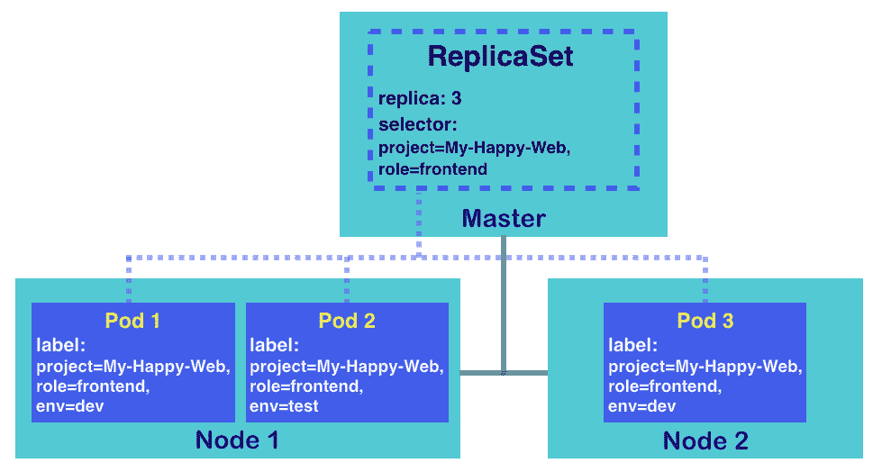ReplicaSet 将覆盖具有与其选择器中描述的相同标签的 Pod

首先，我们将创建一个带有标签 project: `My-Happy-Web`，`role: frontend`和`env: test`的 CentOS Pod：

```
// use subcommand "run" with tag restart=Never to create a Pod
$ kubectl run standalone-pod --image=centos --labels="project=My-Happy-Web,role=frontend,env=test" --restart=Never --command sleep 3600
pod "standalone-pod" created

// check Pod along with the labels
$ kubectl get pod -L project -L role -L env
NAME             READY     STATUS    RESTARTS   AGE       PROJECT        ROLE       ENV
standalone-pod   1/1       Running   0          3m        My-Happy-Web   frontend   test
```

添加了这个命令后，一个带有我们指定标签的独立 Pod 将运行。

接下来，再次使用 YAML 文件创建您的第一个 ReplicaSet 示例：

```
$ kubectl create -f my-first-replicaset.yaml
replicaset.apps "my-first-replicaset" created

// check the Pod again
$ kubectl get pod -L project -L role -L env
NAME                        READY     STATUS    RESTARTS   AGE       PROJECT        ROLE       ENV
my-first-replicaset-fgdc8   1/1       Running   0          14s       My-Happy-Web   frontend   dev
my-first-replicaset-flc9m   1/1       Running   0          14s       My-Happy-Web   frontend   dev
standalone-pod              1/1       Running   0          6m        My-Happy-Web   frontend   test
```

与前面的结果一样，只创建了两个 Pod。这是因为 Pod `standalone-pod`被视为`my-first-replicaset`的一部分。请记住，`my-first-replicaset`负责标记为 project: `My-Happy-Web`和`role:frontend`（忽略`env`标签）的 Pod。去检查独立的 Pod，您会发现它也属于 ReplicaSet 的成员：

```
$ kubectl describe pod standalone-pod
Name:           standalone-pod
Namespace:      default
Node:           ubuntu02/192.168.122.102
Start Time:     Sat, 05 May 2018 16:57:14 -0400
Labels:         env=test
                project=My-Happy-Web
                role=frontend
Annotations:    <none>
Status:         Running
IP:             192.168.79.57
Controlled By:  ReplicaSet/my-first-replicaset ...
```

同样，一旦我们删除了集合，独立的 Pod 将与该组一起被删除：

```
// remove the ReplicaSet and check pods immediately
$ kubectl delete rs my-first-replicaset && kubectl get pod
replicaset.extensions "my-first-replicaset" deleted
NAME                        READY     STATUS        RESTARTS   AGE
my-first-replicaset-fgdc8   0/1       Terminating   0          1m
my-first-replicaset-flc9m   0/1       Terminating   0          1m
standalone-pod              0/1       Terminating   0          7m
```

# 还有更多...

有多种用于 Pod 管理的 Kubernetes 资源。鼓励用户利用各种资源类型来满足不同的目的。让我们将下面列出的资源类型与 ReplicaSet 进行比较：

+   **Deployment**：在一般情况下，Kubernetes Deployments 通常与 ReplicaSet 一起用于完整的 Pod 管理：容器滚动更新，负载均衡和服务暴露。

+   **Job**：有时，我们希望 Pods 作为作业而不是服务运行。Kubernetes 作业适用于这种情况。您可以将其视为具有终止约束的 ReplicaSet。

+   **DaemonSet**：与 ReplicaSet 相比，Kubernetes DaemonSet 保证指定的集合在集群中的每个节点上都在运行。也就是说，每个节点上都有一个 ReplicaSet 的子集。

要了解更多想法和指导，您可以在第三章的*Playing with Containers*中查看食谱*Ensuring flexible usage of your containers*。

# 另请参阅

现在您了解了 ReplicaSet 的概念。继续查看本章中的以下食谱，以获取更多 Kubernetes 资源，这将使您能够探索 ReplicaSet 的神奇效果：

+   *部署 API*

+   *Working with Services*

+   *Working with labels an selectors*

此外，由于您已经使用配置文件构建了一个简单的 ReplicaSet，请参考有关为 Kubernetes 资源创建自己的配置文件的更多详细信息：

+   *Working with configuration files*部分在第三章的**Playing with Containers**

# 部署 API

部署 API 是在 Kubernetes 版本 1.2 中引入的。它正在取代复制控制器。通过复制控制器实现的滚动更新和回滚功能是通过客户端端（`kubectl`命令和`REST API`）实现的，`kubectl`在更新复制控制器时需要保持连接。另一方面，部署在服务器端负责滚动更新和回滚的过程。一旦该请求被接受，客户端可以立即断开连接。

因此，部署 API 被设计为更高级别的 API 来管理 ReplicaSet 对象。本节将探讨如何使用部署 API 来管理 ReplicaSets。

# 准备就绪

要创建部署对象，通常使用`kubectl run`命令或准备描述部署配置的 YAML/JSON 文件。此示例使用`kubectl run`命令创建`my-nginx`部署对象：

```
//create my-nginx Deployment (specify 3 replicas and nginx version 1.11.0)
$ kubectl run my-nginx --image=nginx:1.11.0 --port=80 --replicas=3
deployment.apps "my-nginx" created

//see status of my-nginx Deployment
$ kubectl get deploy
NAME       DESIRED   CURRENT   UP-TO-DATE   AVAILABLE   AGE
my-nginx   3         3         3            3           8s

//see status of ReplicaSet
$ kubectl get rs
NAME                 DESIRED   CURRENT   READY     AGE
my-nginx-5d69b5ff7   3         3         3         11s

//see status of Pod
$ kubectl get pods
NAME                       READY     STATUS    RESTARTS   AGE
my-nginx-5d69b5ff7-9mhbc   1/1       Running   0          14s
my-nginx-5d69b5ff7-mt6z7   1/1       Running   0          14s
my-nginx-5d69b5ff7-rdl2k   1/1       Running   0          14s
```

如您所见，部署对象`my-nginx`创建了一个`ReplicaSet`，其具有标识符：`<部署名称>-<十六进制哈希>`。然后 ReplicaSet 创建了三个具有标识符的 Pod：`<ReplicaSet id>-<random id>`。

直到 Kubernetes 版本 1.8，`<部署名称>-<pod-template-hash value (number)>`被用作 ReplicaSet 标识符，而不是十六进制哈希。

有关更多详细信息，请查看拉取请求：[`github.com/kubernetes/kubernetes/pull/51538`](https://github.com/kubernetes/kubernetes/pull/51538)。

此图示了**部署**、**ReplicaSet**和**Pod**之间的关系：

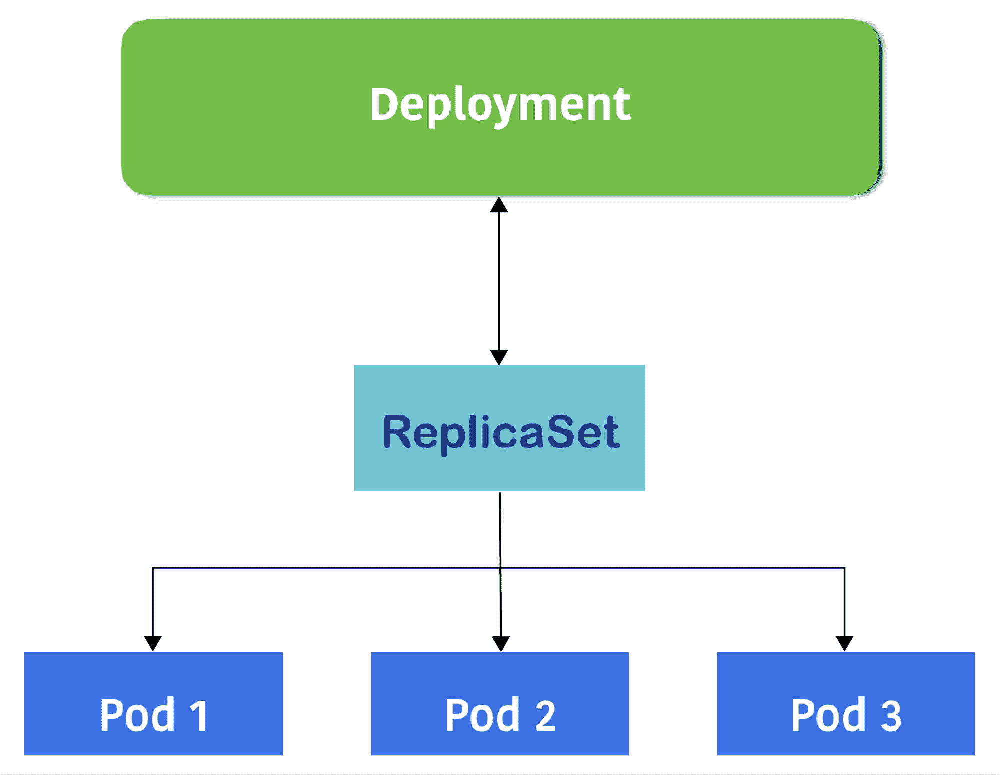部署、副本集和 Pod 的关系图

由于这种关系，如果您对 `my-nginx` 部署对象执行 `delete` 操作，它也会尝试分别删除 ReplicaSet 和 Pods：

```
//delete my-nginx Deployment
$ kubectl delete deploy my-nginx
deployment.extensions "my-nginx" deleted

//see status of ReplicaSet
$ kubectl get rs
No resources found.

//see status of Pod, it has been terminated
$ kubectl get pods
NAME                       READY     STATUS        RESTARTS   AGE
my-nginx-5d69b5ff7-9mhbc   0/1       Terminating   0          2m
my-nginx-5d69b5ff7-mt6z7   0/1       Terminating   0          2m
my-nginx-5d69b5ff7-rdl2k   0/1       Terminating   0          2m
```

这个例子只是一个简单的 `create` 和 `delete`，这个时刻很容易理解部署对象和 ReplicaSet 对象的 1:1 关系。然而，一个部署对象可以管理多个 ReplicaSet 以保留历史记录。因此，实际关系是 1:N，如下图所示：

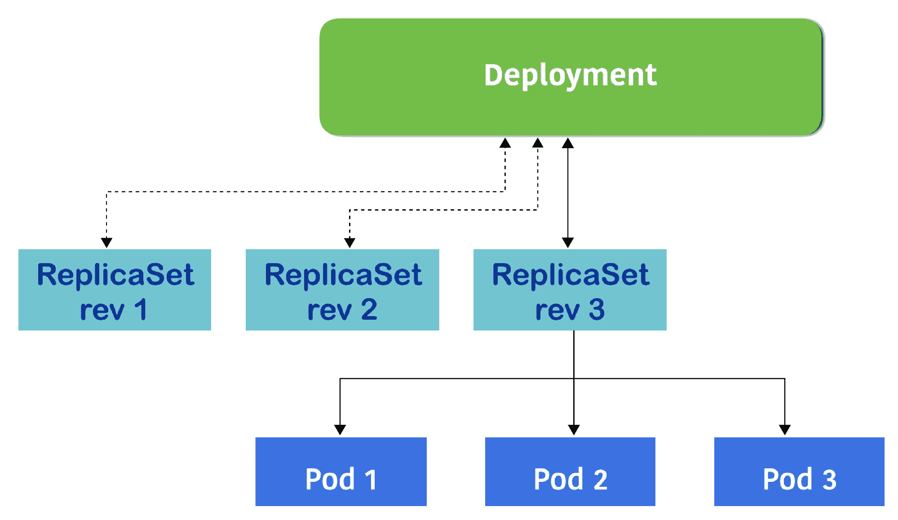部署维护 ReplicaSet 历史

为了理解 1:N 的关系，让我们重新创建这个部署对象，并进行一些更改，看看部署如何管理 ReplicaSet 历史。

# 如何做到这一点...

您可以运行 `kubectl run` 命令来重新创建 `my-nginx`，或者编写一个生成相同结果的部署配置文件。这是一个了解部署配置文件的绝佳机会。

这个例子相当于 `kubectl run my-nginx --image=nginx:1.11.0 --port=80 --replicas=3`：

```
$ cat deploy.yaml 
apiVersion: apps/v1
kind: Deployment
metadata:
  name: my-nginx
spec:
  replicas: 3
  selector:
    matchLabels:
      run: my-nginx
  template:
    metadata:
      labels:
        run: my-nginx
    spec:
      containers:
      - name: my-nginx
        image: nginx:1.11.0
        ports:
        - containerPort: 80
```

这些参数按键和值排序，描述如下：

| **键** | **值** | **描述** |
| --- | --- | --- |
| `apiVersion` | `apps/v1` | 直到 Kubernetes v1.8，它使用了 apps/v1Beta1，v1.8 使用了 apps/v1Beta2，然后 v1.9 或更高版本使用 apps/v1 |
| `kind` | `deployment` | 表示这是一组部署配置 |
| `metadata.name` | `my-nginx` | 部署的名称 |
| `spec.replicas` | `3` | 欲拥有三个 Pod |
| `spec.selector.matchLabels` | `run:my-nginx` | 控制具有此标签的 ReplicaSet/Pod |
| `spec.template.metadata.labels` | `run:my-nginx` | 创建 ReplicaSet/Pod 时分配此标签；它必须与 `spec.selector.matchLabels` 匹配 |

| `spec.template.spec.containers` | name: `my-nginx`image: `nginx:1.11.0`port:`- containerPort:80` | ReplicaSet 创建和管理具有以下内容的 Pods：

+   名称为 `my-nginx`

+   容器镜像为 nginx 版本 1.11.0

+   发布端口号 `80`

|

如果您使用此 YAML 文件创建一个部署，使用 `kubectl create` 命令而不是 `kubectl run`。

请注意，这次，您还应该指定 `--save-config`，这样可以允许您在将来使用 `kubectl apply` 命令更新资源。此外，指定 `--record` 可以存储命令行历史。这两个选项对于管理 ReplicaSet 历史并不是强制性的，但可以帮助您更好地保留信息：

```
//use -f to specify YAML file
$ kubectl create -f deploy.yaml --save-config --record
deployment.apps "my-nginx" created 

//check my-nginx Deployment
$ kubectl get deploy
NAME       DESIRED   CURRENT   UP-TO-DATE   AVAILABLE   AGE
my-nginx   3         3         3            3           5s

$ kubectl describe deploy my-nginx
Name:  my-nginx Namespace:  default CreationTimestamp:  Wed, 09 May 2018 03:40:09 +0000 Labels:  <none> Annotations:  deployment.kubernetes.io/revision=1
 kubectl.kubernetes.io/last-applied-configuration={"apiVersion":"apps/v1","kind":"Deployment","metadata":{"annotations":{},"name":"my-nginx","namespace":"default"},"spec":{"replicas":3,"selector":{"mat... kubernetes.io/change-cause=kubectl create --filename=deploy.yaml --save-config=true --record=true Selector:  run=my-nginx Replicas:  3 desired | 3 updated | 3 total | 3 available | 0 unavailable StrategyType:  RollingUpdate MinReadySeconds:  0 RollingUpdateStrategy:  25% max unavailable, 25% max surge Pod Template:
 Labels:  run=my-nginx Containers: my-nginx: Image:  nginx:1.11.0 Port:  80/TCP Host Port:  0/TCP Environment:  <none> Mounts:  <none> Volumes:  <none> Conditions:
 Type  Status  Reason ----  ------  ------ Available  True  MinimumReplicasAvailable Progressing  True  NewReplicaSetAvailable OldReplicaSets:  <none> NewReplicaSet:  my-nginx-54bb7bbcf9 (3/3 replicas created) Events:
 Type  Reason  Age  From  Message ----  ------  ----  ----  ------- Normal  ScalingReplicaSet  34s  deployment-controller  Scaled up replica set my-nginx-54bb7bbcf9 to 3
```

您可以在上述代码中看到`OldReplicaSets`和`NewReplicaSet`属性，这是 Deployment 和 ReplicaSet 之间的一些关联。

每当您更新容器模板的定义，例如，将 nginx 镜像版本从 1.11.0 更改为 1.12.0，然后 Deployment `my-nginx`将创建一个新的 ReplicaSet。然后，属性`NewReplicaSet`将指向具有 nginx 版本 1.12.0 的新 ReplicaSet。

另一方面，`OldReplicaSets`属性指向一个旧的 ReplicaSet，该 ReplicaSet 具有 nginx 版本 1.11.0，直到新的 ReplicaSet 完成设置新的 Pod。

这些旧/新的 ReplicaSet 关联了 Deployment，Kubernetes 管理员可以很容易地实现回滚操作，以防新的 ReplicaSet 出现任何问题。

此外，Deployment 可以保留与其关联的 ReplicaSet 的历史记录。因此，Deployment 随时可以回滚到任何旧的 ReplicaSet。

# 它是如何工作的...

如前所述，让我们将 nginx 镜像版本从 1.11.0 升级到 1.12.0。有两种方法可以更改容器镜像：使用`kubectl set`命令，或者更新 YAML 然后使用`kubectl apply`命令。

使用`kubectl set`命令更快，而且在使用`--record`选项时有更好的可见性。

另一方面，更新 YAML 并使用`kubectl apply`命令可以更好地保留整个 Deployment YAML 配置文件，这在使用诸如`git`之类的版本控制系统时更好。

# 使用 kubectl set 来更新容器镜像

使用`kubectl set`命令允许我们覆盖`spec.template.spec.containers[].image`属性，类似于使用`kubectl run`命令指定镜像文件。以下示例指定`my-nginx`部署以将容器`my-nginx`的镜像更改为 nginx 版本 1.12.0：

```
$ kubectl set image deployment my-nginx my-nginx=nginx:1.12.0 --record
deployment.apps "my-nginx" image updated

$ kubectl describe deploy my-nginx
Name:                   my-nginx
…
…
Conditions:
 Type  Status  Reason ----  ------  ------ Available  True  MinimumReplicasAvailable Progressing  True  ReplicaSetUpdated OldReplicaSets:  my-nginx-54bb7bbcf9 (3/3 replicas created) NewReplicaSet:  my-nginx-77769b7666 (1/1 replicas created) Events:
 Type  Reason  Age  From  Message ----  ------  ----  ----  ------- Normal  ScalingReplicaSet  27s  deployment-controller  Scaled up replica set my-nginx-54bb7bbcf9 to 3 Normal  ScalingReplicaSet  2s  deployment-controller  Scaled up replica set my-nginx-77769b7666 to 1
```

正如您所看到的，`OldReplicaSets`变成了以前的`ReplicaSet`（`my-nginx-54bb7bbcf9`），而`NewReplicaSet`变成了`my-nginx-77769b7666`。请注意，您可以在新的`ReplicaSet`成功启动之前看到`OldReplicaSets`属性，因此一旦新的`ReplicaSet`成功启动，`OldReplicaSet`就变成了`<none>`，如下所示：

```
$ kubectl describe deploy my-nginx
Name:                   my-nginx
…
…
  Type           Status  Reason
  ----           ------  ------
  Available      True    MinimumReplicasAvailable
  Progressing    True    NewReplicaSetAvailable
OldReplicaSets:  <none> NewReplicaSet:  my-nginx-77769b7666 (3/3 replicas created)
```

如果您通过`kubectl get rs`查看`ReplicaSet`列表，您会看到两个 ReplicaSet，如下所示：

```
$ kubectl get rs
NAME                  DESIRED   CURRENT   READY     AGE my-nginx-54bb7bbcf9  0  0  0  3m my-nginx-77769b7666  3  3  3  3m
```

正如您所看到的，在旧的`ReplicaSet`（`my-nginx-54bb7bbcf9`）中，`DESIRED/CURRENT/READY`的 Pod 数量都为零。

此外，因为前面的示例使用了`--record`选项，您可以使用`kubectl rollout history`命令查看 Deployment `my-nginx`的部署历史，如下所示：

```
$ kubectl rollout history deployment my-nginx
deployments "my-nginx"
REVISION  CHANGE-CAUSE
1         kubectl create --filename=deploy.yaml --save-config=true --record=true
2         kubectl set image deployment/my-nginx my-nginx=nginx:1.12.0 --record=true
```

# 更新 YAML 并使用 kubectl apply

为了演示目的，将`deploy.yaml`复制到`deploy_1.12.2.yaml`，并将`nginx`版本更改为`1.12.2`，如下所示：

```
        image: nginx:1.12.2
```

然后使用`--record`选项运行`kubectl apply`命令：

```
$ kubectl apply -f deploy_1.12.2.yaml --record
deployment.apps "my-nginx" configured
```

这将执行与`kubectl set` image 命令相同的操作，因此您可以看到 nginx 镜像版本已经提升到`1.12.2`；此外，`OldReplicaSets`/`NewReplicaSet`组合已更改如下：

```
$ kubectl describe deploy my-nginx
Name:                   my-nginx
…
…
Pod Template:
  Labels: run=my-nginx
  Containers:
   my-nginx:
    Image: nginx:1.12.2
...
...
Conditions:
  Type           Status  Reason
  ----           ------  ------
  Available      True    MinimumReplicasAvailable
  Progressing    True    ReplicaSetUpdated
OldReplicaSets: my-nginx-77769b7666 (3/3 replicas created)
NewReplicaSet: my-nginx-69fbc98fd4 (1/1 replicas created)
```

几分钟后，`NewReplicaSet`将准备就绪。然后系统上将存在三个`ReplicaSets`：

```
$ kubectl get rs
NAME                  DESIRED   CURRENT   READY     AGE my-nginx-54bb7bbcf9  0  0  0  7m my-nginx-69fbc98fd4  3  3  3  1m my-nginx-77769b7666  0  0  0  6m
```

您还可以查看部署历史：

```
$ kubectl rollout history deployment my-nginx
deployments "my-nginx"
REVISION  CHANGE-CAUSE
1         kubectl create --filename=deploy.yaml --save-config=true --record=true
2         kubectl set image deployment/my-nginx my-nginx=nginx:1.12.0 --record=true
3         kubectl apply --filename=deploy_1.12.2.yaml --record=true
```

每当您想要恢复到先前的`ReplicaSet`，也就是回滚到先前的 nginx 版本时，您可以使用`kubectl rollout undo`命令和`--to-revision`选项。例如，如果您想要回滚到历史记录中的第 2 个修订版本（`kubectl set image deployment/my-nginx my-nginx=nginx:1.12.0 --record=true`），请指定`--to-revision=2`：

```
$ kubectl rollout undo deployment my-nginx --to-revision=2
deployment.apps "my-nginx" rolled back'
```

几分钟后，Deployment 将停用当前使用`nginx`版本`1.12.2`的`ReplicaSet`，然后激活使用`nginx`版本`1.12`的`ReplicaSet`，如下所示：

```
$ kubectl get rs NAME                  DESIRED   CURRENT   READY     AGE my-nginx-54bb7bbcf9  0  0  0  8m my-nginx-69fbc98fd4  0  0  0  2m my-nginx-77769b7666  3  3  3  7m
```

# 另请参阅

在本节中，您了解了部署的概念。这是 Kubernetes ReplicaSet 生命周期管理中的一个重要核心功能。它允许我们实现部署和回滚功能，并可以集成到 CI/CD 中。在接下来的章节中，您将看到详细的部署和回滚操作：

+   *在第三章的*更新实时容器*部分，*玩转容器*

+   *在第五章的*设置持续交付管道*部分，*构建持续交付管道*

# 处理服务

网络服务是一个接收请求并提供解决方案的应用程序。客户端通过网络连接访问服务。他们不必了解服务的架构或其运行方式。客户端唯一需要验证的是服务的端点是否可以访问，然后遵循其使用策略以获取服务器的响应。Kubernetes 服务有类似的想法。在到达它们的功能之前，不需要了解每个 Pod。对于 Kubernetes 系统外的组件，它们只需通过公开的网络端口访问 Kubernetes 服务以与运行的 Pod 通信。不需要了解容器的 IP 和端口。在 Kubernetes 服务的背后，我们可以为我们的容器程序实现零停机更新而不费吹灰之力：

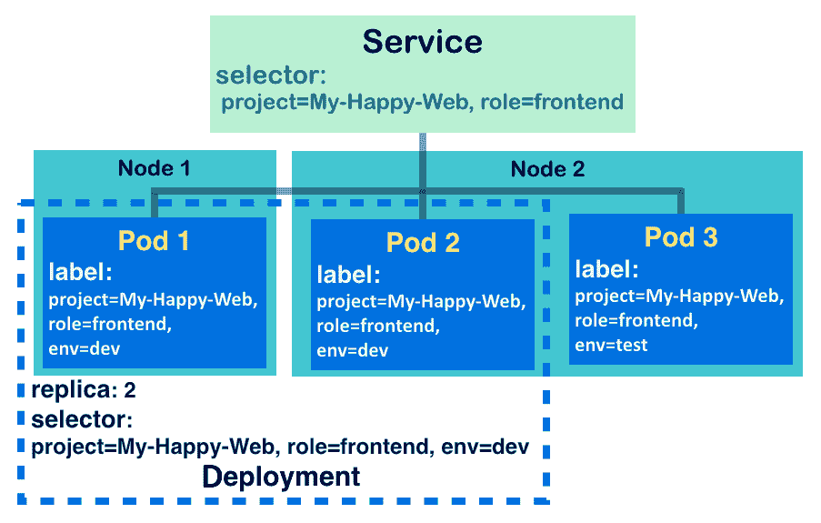Kubernetes 服务通过 Pod 的标签和它们的选择器进行覆盖

上图显示了**服务**的基本结构，并实现了以下概念：

+   与**部署**一样，**服务**将请求定向到具有包含服务选择器的标签的 Pod。换句话说，**服务**选择的 Pod 是基于它们的标签。

+   发送到服务的请求负载将分发到三个 Pod。

+   **部署**与 ReplicaSet 一起，确保运行的 Pod 的数量达到其期望的状态。它监视**服务**的 Pod，确保它们对于接管**服务**的职责是健康的。

+   **服务**是对分组 Pod 的抽象层，允许 Pod 在节点之间进行扩展。

在这个示例中，您将学习如何为请求在 Pods 前创建服务。

# 准备就绪

在应用 Kubernetes 服务之前，重要的是要验证系统中所有节点是否正在运行`kube-proxy`。守护进程`kube-proxy`作为节点中的网络代理工作。它帮助反映服务设置，如每个节点上的 IP 或端口，并进行网络转发。要检查`kube-proxy`是否正在运行，我们看一下网络连接：

```
// check by command netstat with proper tags for showing the information we need, t:tcp, u:udp, l:listening, p:program, n:numeric address
// use root privilege for grabbing all processes
$ sudo netstat -tulpn | grep kube-proxy
tcp        0      0 127.0.0.1:10249         0.0.0.0:*               LISTEN      2326/kube-proxy
tcp6       0      0 :::31723                :::*                    LISTEN      2326/kube-proxy
tcp6       0      0 :::10256                :::*                    LISTEN      2326/kube-proxy
```

一旦您看到输出，进程 ID`2326`，`kube-proxy`，在本地主机上的端口`10249`上监听，节点已准备好用于 Kubernetes 服务。继续验证您的 Kubernetes 集群中的所有节点是否都在运行`kube-proxy`。

# 如何做...

如前一节所述，Kubernetes 服务通过选择相应的标签来暴露 Pod。然而，还有另一个配置我们需要注意：网络端口。如下图所示，服务和 Pod 都有自己的键值对标签和端口：

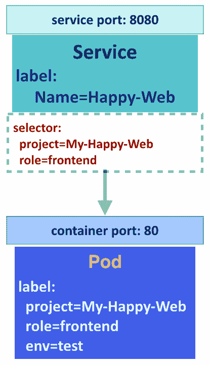服务和 Pod 之间的网络端口映射

因此，在创建服务时，需要设置服务的选择器并将服务暴露的端口绑定到容器端口。如果它们中的任何一个未能正确设置，客户端将无法获得响应或者会收到连接被拒绝的错误。

我们可以通过 CLI 或配置文件定义和创建新的 Kubernetes 服务。在这里，我们将解释如何通过命令部署服务。在以下命令中，子命令`expose`和`describe`用于各种场景。对于文件格式的创建，建议阅读第三章中的*使用配置文件*部分，进行详细讨论。

# 为不同资源创建服务

您可以将服务附加到 Pod、部署、Kubernetes 系统外的端点，甚至另一个服务。我们将在本节中依次展示这些内容。创建 Kubernetes 服务的方式与以下命令格式类似：`kubectl expose $RESOURCE_TYPE $RESOURCE_NAME [OTHER TAGS]`或`kubectl expose -f $CONFIG_FILE`。资源类型（Pod、部署和服务）都受到子命令`expose`的支持。配置文件也是如此，它遵循限制类型。因此，为了后续的演示，我们将通过配置文件将新创建的服务附加到端点。

# 为 Pod 创建服务

由服务覆盖的 Kubernetes Pods 需要标签，以便服务可以识别应该负责的对象。在下面的命令中，我们首先为 Pod 创建标签，然后在其上附加一个服务：

```
// using subcommand "run" with "never" restart policy, and without replica, you can get a Pod
// here we create a nginx container with port 80 exposed to outside world of Pod
$ kubectl run nginx-pod --image=nginx --port=80 --restart="Never" --labels="project=My-Happy-Web,role=frontend,env=test"
pod "nginx-pod" created

// expose Pod "nginx-pod" with a Service officially with port 8080, target port would be the exposed port of pod
$ kubectl expose pod nginx-pod --port=8080 --target-port=80 --name="nginx-service"
service "nginx-service" exposed
```

您可能会发现，根据前面的命令，我们没有为这个服务分配任何选择器。尽管如此，由于服务`nginx-service`承担了 Pod`nginx-pod`的端口转发任务，它将以 Pod 的标签作为其选择器。继续并使用子命令`describe`检查服务的详细信息：

```
// "svc" is the abbreviate of Service, for the description's resource type
$ kubectl describe svc nginx-service
Name:              nginx-service
Namespace:         default
Labels:            env=test
                   project=My-Happy-Web
                   role=frontend
Annotations:       <none>
Selector:          env=test,project=My-Happy-Web,role=frontend
Type:              ClusterIP
IP:                10.96.107.213
Port:              <unset>  8080/TCP
TargetPort:        80/TCP
Endpoints:         192.168.79.24:80
Session Affinity:  None
Events:            <none>
```

现在你可以看到，为了保证责任，这个成功暴露的服务只是复制了 Pod 的标签作为它的选择器。`Endpoints`后面的值列表是 Pod 的 IP 和它的暴露端口`80`。此外，服务将 Pod 的标签作为自己的标签。根据这个例子，可以通过访问`10.96.107.213:8080`来访问 Pod。

除了服务的选择器之外，如果用户绕过了一些参数，它们可以自动配置。一个参数是 Pod 的标签；另一个是服务的名称；另一个是服务的暴露端口。让我们看看如何管理这个简单的 Pod 和服务：

```
// create a Pod and a Service for it
$ kubectl run nginx-no-label --image=nginx --port=80 --restart="Never" && kubectl expose pod nginx-no-label
pod "nginx-no-label" created
service "nginx-no-label" exposed
// take a lookat the configurations of the Service
$ kubectl describe svc nginx-no-label
Name:              nginx-no-label
Namespace:         default
Labels:            run=nginx-no-label
Annotations:       <none>
Selector:          run=nginx-no-label Type:              ClusterIP
IP:                10.105.96.243
Port:              <unset>  80/TCP
TargetPort:        80/TCP
Endpoints:         192.168.79.10:80
Session Affinity:  None
Events:            <none>
```

在这里，我们可以看到服务从 Pod 那里继承了名称、标签和端口。选择器被分配了一个名为`run`的虚拟标签，值为 Pod 的名称，这与 Pod `nginx-no-label`的虚拟标签相同。用户也应该通过端口`80`访问服务。对于这样简单的设置，你也可以尝试使用以下命令同时创建 Pod 和服务：

```
// through leveraging tag "--expose", create the Service along with Pod
$ kubectl run another-nginx-no-label --image=nginx --port=80 --restart="Never" --expose
service "another-nginx-no-label" created
pod "another-nginx-no-label" created
```

# 为具有外部 IP 的部署创建服务

Kubernetes 部署是服务的理想资源类型。对于由 ReplicaSet 和 Deployment 监督的 Pod，Kubernetes 系统有一个控制器管理器来监视它们的生命周期。将现有服务绑定到另一个部署，也有助于更新程序的版本或状态。对于以下命令，我们首先创建一个部署，然后附加一个具有外部 IP 的服务：

```
// using subcommand "run" and assign 2 replicas
$ kubectl run nginx-deployment --image=nginx --port=80 --replicas=2 --labels="env=dev,project=My-Happy-Web,role=frontend"
deployment.apps "nginx-deployment" created
// explicitly indicate the selector of Service by tag "--selector", and assign the Service an external IP by tag "--external-ip"
// the IP 192.168.122.102 demonstrated here is the IP of one of the Kubernetes node in system
$ kubectl expose deployment nginx-deployment --port=8080 --target-port=80 --name="another-nginx-service" --selector="project=My-Happy-Web,role=frontend" --external-ip="192.168.122.102"
service "another-nginx-service" exposed
```

让我们继续检查新创建的服务`another-nginx-service`的详细信息：

```
$ kubectl describe svc another-nginx-service
Name:              another-nginx-service
Namespace:         default
Labels:            env=dev
                   project=My-Happy-Web
                   role=frontend
Annotations:       <none>
Selector:          project=My-Happy-Web,role=frontend
Type:              ClusterIP
IP:                10.100.109.230
External IPs:      192.168.122.102
Port:              <unset>  8080/TCP
TargetPort:        80/TCP
Endpoints:         192.168.79.15:80,192.168.79.21:80,192.168.79.24:80
Session Affinity:  None
Events:            <none>
```

除了服务 IP（在前面的命令中为`10.100.109.230`）可以在 Kubernetes 系统内访问之外，现在服务还可以通过 Kubernetes 系统之外的外部 IP（例如`192.168.122.102`）进行连接。虽然 Kubernetes 主节点能够与每个节点通信，但在这种情况下，我们可以向服务发送请求，比如以下命令：

```
$ curl 192.168.122.102:8080
<!DOCTYPE html>
<html>
<head>
<title>Welcome to nginx!</title>
...
```

# 为没有选择器的端点创建服务

首先，我们将创建一个指向外部服务的终端点。Kubernetes 终端点是一个抽象，使得 Kubernetes 之外的组件（例如其他系统中的数据库）成为 Kubernetes 资源的一部分。它为混合环境提供了一个可行的用例。要创建一个终端点，需要 IP 地址和端口。请看下面的模板：

```
$ cat k8s-endpoint.yaml
apiVersion: v1
kind: Endpoints
metadata:
  name: k8s-ep
subsets:
  - addresses:
      - hostname: kubernetes-io
        ip: 45.54.44.100
    ports:
      - port: 80
```

该模板定义了一个名为`k8s-ep`的终端点，它指向官方 Kubernetes 网站主机的 IP 地址（[`kubernetes.io`](https://kubernetes.io)）。不要紧，这个终端点转发到一个普通的 HTML；我们只是拿这个终端点作为一个例子。正如前面提到的，终端点不是 Kubernetes API 支持的资源，用于暴露：

```
// Give it a try!
$ kubectl expose -f k8s-endpoint.yaml
error: cannot expose a { Endpoints}
```

在 Kubernetes 中，终端点不仅代表外部服务；内部 Kubernetes 服务也是 Kubernetes 终端点。您可以使用命令`kubectl get endpoints`检查终端点资源。您会发现，并不是只有一个终端点`k8s-ep`（您刚刚创建的），而是许多与前几页中的服务同名的终端点。当创建一个带有选择器并暴露某些资源（如 Pod、部署或其他服务）的服务时，同时会创建一个同名的终端点。

因此，我们仍然可以使用相同的名称创建与终端点关联的服务，如下模板所示：

```
$ cat endpoint-service.yaml
apiVersion: v1
kind: Service
metadata:
  name: k8s-ep
spec:
  ports:
    - protocol: TCP
      port: 8080
      targetPort: 80
```

终端点和服务之间的关系是通过资源名称建立起来的。对于服务`k8s-ep`，我们没有指定选择器，因为它实际上并没有承担任何 Pod 的责任：

```
// go create the Service and the endpoint
$ kubectl create -f endpoint-service.yaml && kubectl create -f k8s-endpoint.yaml
service "k8s-ep" created
endpoints "k8s-ep" created
// verify the Service k8s-ep
$ kubectl describe svc k8s-ep
Name:              k8s-ep
Namespace:         default
Labels:            <none>
Annotations:       <none>
Selector:          <none>
Type:              ClusterIP
IP:                10.105.232.226
Port:              <unset>  8080/TCP
TargetPort:        80/TCP
Endpoints:         45.54.44.100:80
Session Affinity:  None
Events:            <none>
```

现在您可以看到服务的终端点就是在`k8s-endpoint.yaml`中定义的终端点。通过 Kubernetes 服务访问外部世界对我们来说很有用！在前面的情况下，我们可以使用以下命令验证结果：

```
$ curl 10.105.232.226:8080
```

# 为另一个具有会话亲和性的服务创建一个服务

在构建一个服务的同时，我们可能会考虑多层端口转发。尽管将流量从一个端口重定向到另一个端口，但暴露服务的操作实际上是将一个服务的设置复制到另一个服务。这种情况可以用作更新服务设置，而不会给当前的客户端和服务器带来麻烦：

```
// create a Service by expose an existed one
// take the one we created for Deployment for example
$ kubectl expose svc another-nginx-service --port=8081 --target-port=80 --name=yet-another-nginx-service --session-affinity="ClientIP"
service "yet-another-nginx-service" exposed
// check the newly created Service
$ kubectl describe svc yet-another-nginx-service
Name:              yet-another-nginx-service
Namespace:         default
Labels:            env=dev
                   project=My-Happy-Web
                   role=frontend
Annotations:       <none>
Selector:          project=My-Happy-Web,role=frontend
Type:              ClusterIP
IP:                10.110.218.136
Port:              <unset>  8081/TCP
TargetPort:        80/TCP
Endpoints:         192.168.79.15:80,192.168.79.21:80,192.168.79.24:80
Session Affinity:  ClientIP
Events:            <none>
```

在这里！我们成功地暴露了另一个具有类似设置的服务`another-nginx-service`。命令和输出可以总结如下：

+   **需要新的服务名称**：虽然我们可以从另一个服务复制配置，但资源类型的名称应始终是唯一的。当在不带`--name`标签的情况下暴露服务时，您将收到错误消息：`Error from server (AlreadyExists): services "another-nginx-service" already exists`。

+   添加或更新配置是可行的：我们可以添加新的配置，比如添加会话亲和性；或者我们可以更新服务的端口，就像这里，我们改为打开端口`8081`而不是`8080`。

+   **避免更改目标端口**：因为目标端口与 Pod 的 IP 一起，一旦服务暴露的目标端口发生变化，新复制的服务就无法将流量转发到相同的端点。在前面的例子中，由于定义了新的目标端口，我们应该再次指出容器端口。这样可以防止新服务将目标端口作为容器端口，并产生误导性的交易。

使用会话亲和性，描述标签的列表将会话亲和性描述为`ClientIP`。对于当前的 Kubernetes 版本，客户端 IP 是会话亲和性的唯一选项。它将采取哈希函数的操作：使用相同的 IP 地址，请求将始终发送到相同的 Pod。然而，如果在 Kubernetes 服务前面有负载均衡器或入口控制器，这可能会成为一个问题：请求将被视为来自相同的源，并且流量将被转发到单个 Pod。用户必须自行处理此问题，例如，通过构建一个 HA 代理服务器来代替使用 Kubernetes 服务。

# 删除服务

如果您在本节中执行每个命令，肯定会有一些演示的 Kubernetes 服务（我们数了其中六个）应该被删除。要删除服务，与任何其他 Kubernetes 资源一样，您可以通过子命令`delete`删除具有名称或配置文件的服务。当您尝试同时删除服务和端点时，将发生以下情况：

```
// the resource abbreviation of endpoint is "ep", separate different resource types by comma
$ kubectl delete svc,ep k8s-ep
service "k8s-ep" deleted
Error from server (NotFound): endpoints "k8s-ep" not found
```

这是因为服务也是 Kubernetes 端点。因此，尽管我们分别创建了服务和端点，一旦它们被视为一个单元工作，当服务被删除时，端点也将被删除。因此，错误消息表达了没有名为`k8s-ep`的端点，因为它已经随着服务的删除而被删除。

# 工作原理...

在网络协议栈上，Kubernetes 服务依赖于传输层，与 **覆盖网络** 和 `kube-proxy` 协同工作。Kubernetes 的覆盖网络通过在预配置的地址空间中分配子网租约并将网络配置存储在 `etcd` 中来构建集群网络；另一方面，`kube-proxy` 通过 `iptables` 设置帮助将来自服务端点的流量转发到 Pod。

代理模式和服务 `kube-proxy` 目前有三种不同的实现方法：`userspace`、`iptables` 和 `ipvs`。这些模式会影响客户端请求如何通过 Kubernetes 服务到达特定的 Pod：

+   `userspace`：`kube-proxy` 为每个本地节点上的服务打开一个随机端口，称为代理端口，然后更新 `iptables` 规则，捕获发送到服务的任何请求并将其转发到代理端口。最终，发送到代理端口的任何消息都将传递给服务覆盖的 Pod。这种方式效率较低，因为流量需要经过 `kube-proxy` 进行路由到 Pod。

+   `iptables`：与 `userspace` 模式一样，也需要 `iptables` 规则来重定向客户端流量。但是没有代理端口作为中介。速度更快，但需要注意 Pod 的存活状态。默认情况下，如果目标 Pod 失败，请求没有重试到另一个 Pod 的方式。为了避免访问不健康的 Pod，需要对 Pod 进行健康检查并及时更新 `iptables`。

+   `ipvs`：`ipvs` 是 Kubernetes v1.9 中的 beta 功能。在这种模式下，`kube-proxy` 在服务和其后端集之间建立了称为 netlink 的接口。`ipvs` 模式解决了`userspace` 和 `iptables` 的缺点；它甚至更快，因为路由规则存储在内核空间的哈希表结构中，而且`kube-proxy` 会不断检查 `netlinks` 的一致性。`ipvs` 甚至提供了多种负载均衡选项。

系统会选择最佳和稳定的模式作为 `kube-proxy` 的默认设置。目前，默认设置是 `iptables` 模式。

当 Pod 尝试与服务通信时，它可以通过环境变量或 DNS 主机查找来找到服务。让我们在以下访问 Pod 中尝试一下：

```
// run a Pod first, and ask it to be alive 600 seconds
$ kubectl run my-1st-centos --image=centos --restart=Never sleep 600
pod "my-1st-centos" created
// run a Deployment of nginx and its Service exposing port 8080 for nginx
$ kubectl run my-nginx --image=nginx --port=80
deployment.apps "my-nginx" created
$ kubectl expose deployment my-nginx --port=8080 --target-port=80 --name="my-nginx-service"
service "my-nginx-service" exposed
// run another pod
$ kubectl run my-2nd-centos --image=centos --restart=Never sleep 600
pod "my-2nd-centos" created
//Go check the environment variables on both pods.
$ kubectl exec my-1st-centos -- /bin/sh -c export
$ kubectl exec my-2nd-centos -- /bin/sh -c export
```

您会发现 Pod `my-2nd-centos` 显示了与服务 `my-nginx-service` 相关的额外变量信息，如下所示：

```
export MY_NGINX_SERVICE_PORT="tcp://10.104.218.20:8080"
export MY_NGINX_SERVICE_PORT_8080_TCP="tcp://10.104.218.20:8080"
export MY_NGINX_SERVICE_PORT_8080_TCP_ADDR="10.104.218.20"
export MY_NGINX_SERVICE_PORT_8080_TCP_PORT="8080"
export MY_NGINX_SERVICE_PORT_8080_TCP_PROTO="tcp"
export MY_NGINX_SERVICE_SERVICE_HOST="10.104.218.20"
export MY_NGINX_SERVICE_SERVICE_PORT="8080"
```

这是因为系统未能对服务进行实时更新；只有随后创建的 Pod 才能通过环境变量访问服务。在有序依赖的约束下，如果资源需要以这种方式相互交互，请注意按正确的顺序运行您的 Kubernetes 资源。表示服务主机的环境变量的键形成为`<SERVICE NAME>_SERVICE_HOST`，服务端口类似于`<SERVICE NAME>_SERVICE_PORT`。在前面的示例中，名称中的破折号也转换为下划线：

```
// For my-2nd-centos, getting information of Service by environment variables
$ kubectl exec my-2nd-centos -- /bin/sh -c 'curl $MY_NGINX_SERVICE_SERVICE_HOST:$MY_NGINX_SERVICE_SERVICE_PORT'
<!DOCTYPE html>
<html>
<head>
<title>Welcome to nginx!</title>
...
```

然而，如果安装了`kube-dns`附加组件，它是 Kubernetes 系统中的 DNS 服务器，同一命名空间中的任何 Pod 都可以访问服务，无论服务何时创建。服务的主机名将形成为`<SERVICE NAME>.<NAMESPACE>.svc.cluster.local`。`cluster.local`是在启动`kube-dns`时定义的默认集群域：

```
// go accessing my-nginx-service by A record provided by kube-dns
$ kubectl exec my-1st-centos -- /bin/sh -c 'curl my-nginx-service.default.svc.cluster.local:8080'
$ kubectl exec my-2nd-centos -- /bin/sh -c 'curl my-nginx-service.default.svc.cluster.local:8080'
```

# 还有更多...

Kubernetes 服务有四种类型：`ClusterIP`、`NodePort`、`LoadBalancer`和`ExternalName`。在本教程的*操作步骤*部分，我们只演示了默认类型`ClusterIP`。`ClusterIP`类型表示 Kubernetes 服务在覆盖网络中被分配了唯一的虚拟 IP，这也意味着在这个 Kubernetes 集群中的身份。`ClusterIP`保证了服务在内部是可访问的。

以下图表表示了各种类型的可用覆盖范围及其入口点：

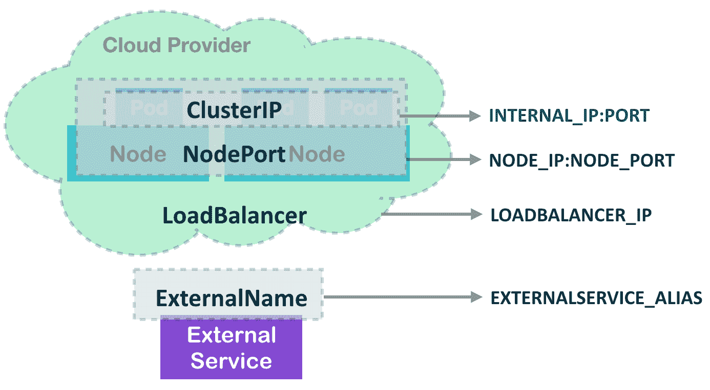四种服务类型及其入口点

对于`NodePort`类型，它覆盖了`ClusterIP`的功能，具有对等可访问的虚拟 IP，并且还允许用户在每个节点上使用相同端口暴露服务。`LoadBalancer`类型位于其他两种类型之上。`LoadBalancer`服务将在内部和节点上暴露。此外，如果您的云提供商支持外部负载均衡服务器，您可以将负载均衡器 IP 绑定到服务，这将成为另一个暴露点。另一方面，`ExternalName`类型用于 Kubernetes 系统之外的端点。它类似于我们在上一节中使用配置文件创建的端点；此外，单个`ExternalName`服务可以提供此功能。

我们可以使用子命令`create`来创建不同类型的服务：

```
// create a NodePort Service
// the tag "tcp" is for indicating port configuration: SERVICE_PORT:TARGET_PORT
$ kubectl create service nodeport my-nginx --tcp=8080:80
service "my-nginx" created
$ kubectl describe svc my-nginx
Name:                     my-nginx
Namespace:                default
Labels:                   app=my-nginx
Annotations:              <none>
Selector:                 app=my-nginx
Type:                     NodePort
IP:                       10.105.106.134
Port:                     8080-80  8080/TCP
TargetPort:               80/TCP
NodePort:                 8080-80  31336/TCP
Endpoints:                <none>
Session Affinity:         None
External Traffic Policy:  Cluster
Events:                   <none>
```

在这个`NodePort`服务的示例中，您可以看到它仍然在集群中具有虚拟 IP（`10.105.106.134`），并且可以通过任何 Kubernetes 节点的端口`31336`访问：

```
// run an nginx Deployment with the label as NodePort Service my-nginx's selector
$ kubectl run test-nodeport --image=nginx --labels="app=my-nginx"
deployment.apps "test-nodeport" created
// check the Kubernetes node with Service port on the node
$ curl ubuntu02:31336
<!DOCTYPE html>
<html>
<head>
<title>Welcome to nginx!</title>
...
```

在这种情况下，我们演示创建一个暴露`CNAME kubernetes.io`的`ExternalName`服务：

```
$ kubectl create service externalname k8s-website --external-name kubernetes.io
service "k8s-website" created
// create a CentOS Pod for testing the Service availability
$ kubectl run my-centos --image=centos --restart=Never sleep 600
pod "my-centos" created
//now you can check the Service by Service's DNS name
$ kubectl exec -it my-centos -- /bin/sh -c 'curl k8s-website.default.svc.cluster.local '
//Check all the Services we created in this section
//ExternalName Service has no cluster IP as defined
$ kubectl get svc
NAME                   TYPE           CLUSTER-IP       EXTERNAL-IP     PORT(S)          AGE
k8s-website            ExternalName   <none>           kubernetes.io   <none>           31m
kubernetes             ClusterIP      10.96.0.1        <none>          443/TCP          14d
my-nginx               NodePort       10.105.106.134   <none>          8080:31336/TCP   1h
```

然而，我们无法使用子命令`expose`在 CLI 中构建`ExternalName`服务，因为`expose`用于暴露 Kubernetes 资源，而`ExternalName`服务是为外部世界的资源。因此，`ExternalName`服务不需要使用选择器进行定义也是合理的。

**使用子命令"create"创建服务** 在创建服务时使用子命令`create`，命令行看起来像这样：`kubectl create service <SERVICE TYPE> <SERVICE NAME> [OPTIONS]`。我们可以在`<SERVICE TYPE>`处放置服务类型，例如`clusterip`、`nodeport`、`loadbalancer`和`externalname`。使用这种方法，我们无法指定服务的选择器。就像我们在那一节中创建的`NodePort`服务一样，只创建了一个默认选择器`app: my-nginx`，我们必须将此标签分配给稍后创建的部署`test-nodeport`。除了类型`ExternalName`，服务类型可以使用子命令`expose`和标签`type`来创建。尝试使用`kubectl expose`为现有资源创建`NodePort`服务！

# 另请参阅

要获得 Kubernetes 服务的最佳实践，建议阅读第二章中的以下示例，*深入了解 Kubernetes 概念*：

+   *部署 API*

+   *使用机密*

+   *使用标签和选择器*

有更多高级知识可以使您的服务更加功能强大和灵活。敬请关注：

+   *在第三章的*Playing with Containers*部分，*转发容器端口*

+   *在第三章的*Playing with Containers*部分，*确保容器的灵活使用*

# 使用卷

容器中的文件是临时的。当容器终止时，文件会消失。Docker 引入了数据卷来帮助我们持久化数据（[`docs.docker.com/engine/admin/volumes/volumes`](https://docs.docker.com/engine/admin/volumes/volumes)）。然而，当涉及到多个主机时，作为容器集群，跨所有容器和主机管理卷以进行文件共享或动态配置卷是很困难的。Kubernetes 引入了卷，它在容器的整个生命周期中与 Pod 一起存在。它支持各种类型的卷，包括流行的网络磁盘解决方案和不同公共云中的存储服务。以下是其中一些：

| **卷类型** | **存储提供程序** |
| --- | --- |
| `emptyDir` | 本地主机 |
| `hostPath` | 本地主机 |
| `glusterfs` | GlusterFS 集群 |
| `downwardAPI` | Kubernetes Pod 信息 |
| `nfs` | NFS 服务器 |
| `awsElasticBlockStore` | 亚马逊弹性块存储 |
| `gcePersistentDisk` | Google Compute Engine 持久磁盘 |
| `azureDisk` | Azure 磁盘存储 |
| `projected` | Kubernetes 资源；目前支持`secret`，`downwardAPI`和`configMap` |
| `secret` | Kubernetes Secret 资源 |
| `vSphereVolume` | vSphere VMDK 卷 |
| `gitRepo` | Git 仓库 |

# 准备工作

在开始在 Kubernetes 中使用卷时，需要存储提供程序，除了`emptyDir`，当 Pod 被删除时，它将被删除。对于其他存储提供程序，在使用它们之前，必须在 Pod 定义中构建文件夹、服务器或集群。动态配置在 Kubernetes 版本 1.6 中被提升为稳定版本，它允许您根据支持的云提供商来配置存储。

在本节中，我们将详细介绍`emptyDir`，`hostPath`，`nfs`，`glusterfs`，`downwardAPI`和`gitRepo`的细节。`Secret`用于存储凭据，将在下一节介绍。另一方面，`Projected`是一种将其他卷资源组合在一个单一挂载点下的方法。由于它只支持`secret`，`downwardAPI`和`configMap`，我们将在 Secret 部分介绍这一点。其余的卷类型具有类似的 Kubernetes 语法，只是具有不同的后端卷实现。

# 如何做...

卷在 pod 定义的卷部分中以唯一名称定义。每种类型的卷都有不同的配置要设置。一旦定义了卷，就可以在容器规范的 `volumeMounts` 部分中挂载它们。`volumeMounts.name` 和 `volumeMounts.mountPath` 是必需的，分别表示您定义的卷的名称和容器内的挂载路径。

我们将使用 YAML 格式的 Kubernetes 配置文件来创建以下示例中带有卷的 Pod。

# emptyDir

`emptyDir` 是最简单的卷类型，将为同一 Pod 中的容器创建一个空卷。当 Pod 被移除时，`emptyDir` 中的文件也将被删除。`emptyDir` 在创建 Pod 时创建。在下面的配置文件中，我们将创建一个运行 Ubuntu 的 Pod，并使用命令休眠 `3600` 秒。如您所见，卷在卷部分中以名称 data 定义，卷将在 Ubuntu 容器中的 `/data-mount` 路径下挂载：

```
// configuration file of emptyDir volume
# cat 2-6-1_emptyDir.yaml
apiVersion: v1
kind: Pod
metadata:
  name: ubuntu
  labels:
    name: ubuntu
spec:
  containers:
    - image: ubuntu
      command:
        - sleep
        - "3600"
      imagePullPolicy: IfNotPresent
      name: ubuntu
      volumeMounts:
        - mountPath: /data-mount
          name: data
      volumes:
        - name: data
          emptyDir: {}

// create pod by configuration file emptyDir.yaml
# kubectl create -f 2-6-1_emptyDir.yaml
pod "ubuntu" created
```

**检查 Pod 运行在哪个节点上** 通过使用 `kubectl describe pod <Pod name> | grep Node` 命令，您可以检查 Pod 运行在哪个节点上。

Pod 运行后，您可以在目标节点上使用 `docker inspect <container ID>` 来查看容器内的详细挂载点：

```
  "Mounts": [
     ...
  {
                "Type": "bind",
                "Source": "/var/lib/kubelet/pods/98c7c676-e9bd-11e7-9e8d-080027ac331c/volumes/kubernetes.io~empty-dir/data",
                "Destination": "/data-mount",
                "Mode": "",
                "RW": true,
                "Propagation": "rprivate"
            }
     ...
]
```

Kubernetes 将 `/var/lib/kubelet/pods/<id>/volumes/kubernetes.io~empty-dir/<volumeMount name>` 挂载到 `/data-mount`，以供 Pod 使用。如果创建一个具有多个容器的 Pod，所有这些容器都将使用相同的源挂载到相同的目标 `/data-mount`。默认的挂载传播是 `rprivate`，这意味着主机上的任何挂载点在容器中是不可见的，反之亦然。

通过将 `emptyDir.medium` 设置为 `Memory`，可以将 `emptyDir` 挂载为 `tmpfs`。

以前的配置文件 `2-6-1_emptyDir_mem.yaml` 作为示例，如下所示：

```
volumes:
    -
      name: data
      emptyDir:
        medium: Memory
```

我们可以使用 `kubectl exec <pod_name> <commands>` 命令来验证它是否成功挂载。我们将在此容器中运行 `df` 命令：

```
# kubectl exec ubuntu df
Filesystem 1K-blocks Used Available Use% Mounted on
...
tmpfs 1024036 0 1024036 0% /data-mount
...
```

请注意，`tmpfs` 存储在内存中而不是文件系统中。不会创建任何文件，并且在每次重启时都会被清除。此外，它受 Kubernetes 中的内存限制约束。有关容器资源约束的更多信息，请参阅本章中的 *使用命名空间*。

如果 Pod 中有多个容器，`Kubectl exec`命令将是`kubectl exec <pod 名称> <容器名称> <命令>`。

# hostPath

`hostPath`在 Docker 中充当数据卷。在`hostPath`中列出的节点上的本地文件夹将被挂载到 Pod 中。由于 Pod 可以在任何节点上运行，发生在卷中的读/写功能可能明确存在于 Pod 正在运行的节点上。然而，在 Kubernetes 中，Pod 不应该是节点感知的。请注意，当使用`hostPath`时，不同节点上的配置和文件可能是不同的。因此，通过相同的命令或配置文件创建的相同的 Pod 在不同的节点上可能会有不同的行为。

通过使用`hostPath`，你可以在容器和节点的本地磁盘之间读写文件。我们需要卷定义的是`hostPath.path`来指定节点上目标挂载的文件夹：

```
apiVersion: v1
# cat 2-6-2_hostPath.yaml
kind: Pod
metadata:
  name: ubuntu
spec:
  containers:
    -
      image: ubuntu
      command:
        - sleep
        - "3600"
      imagePullPolicy: IfNotPresent
      name: ubuntu
      volumeMounts:
        -
          mountPath: /data-mount
          name: data
  volumes:
    -
      name: data
      hostPath:
 path: /tmp/data
```

使用`docker inspect`来检查卷的详细信息，你会看到主机上的卷被挂载在`/data-mount`目的地上：

```
"Mounts": [
            {
                "Type": "bind",
                "Source": "/tmp/data",
                "Destination": "/data-mount",
                "Mode": "",
                "RW": true,
                "Propagation": "rprivate"
            },
                          ...
    ]
```

如果我们运行`kubectl exec ubuntu touch /data-mount/sample`，我们应该能够在主机上的`/tmp/data`下看到一个空文件，名为`sample`。

# NFS

你可以将**网络文件系统**（NFS）作为`nfs 卷`挂载到你的 Pod 上。多个 Pod 可以挂载和共享相同的`nfs 卷`中的文件。存储在`nfs 卷`中的数据将在 Pod 的整个生命周期中持久存在。在使用`nfs 卷`之前，你必须创建自己的 NFS 服务器，并确保 Kubernetes 的 minions 上安装了`nfs-utils`软件包。

在你离开之前，检查一下你的 NFS 服务器是否正常工作。你应该检查`/etc/exports`文件，使用适当的共享参数和目录，并使用`mount -t nfs <nfs 服务器>:<共享名称> <本地挂载点>`命令来检查它是否可以在本地挂载。

具有 NFS 类型的卷的配置文件与其他类型类似，但卷定义中需要`nfs.server`和`nfs.path`来指定 NFS 服务器信息和挂载路径。`nfs.readOnly`是一个可选字段，用于指定卷是否为只读（默认为`false`）：

```
# configuration file of nfs volume
$ cat 2-6-3_nfs.yaml
apiVersion: v1
kind: Pod
metadata:
  name: nfs
spec:
  containers:
    -
      name: nfs
      image: ubuntu
      volumeMounts:
          - name: nfs
            mountPath: "/data-mount"
  volumes:
  - name: nfs
    nfs:
 server: <your nfs server>
 path: "/"
```

在运行`kubectl create -f 2-6-3_nfs.yaml`之后，你可以使用`kubectl describe <pod 名称>`来描述你的 Pod，以检查挂载状态。如果成功挂载，它应该显示条件。就绪为 true 和你挂载的目标`nfs`：

```
Conditions:
  Type Status
  Ready True
Volumes:
  nfs:
    Type: NFS (an NFS mount that lasts the lifetime of a pod)
    Server: <your nfs server>
    Path: /
    ReadOnly: false
```

如果我们使用`docker`命令检查容器，我们可以在`Mounts`部分看到卷信息：

```
"Mounts": [
 {
            "Source": "/var/lib/kubelet/pods/<id>/volumes/kubernetes.io~nfs/nfs",
            "Destination": "/data-mount",
            "Mode": "",
            "RW": true
        },
                          ...
     ]
```

实际上，Kubernetes 只是将您的`<nfs 服务器>:<共享名称>`挂载到`/var/lib/kubelet/pods/<id>/volumes/kubernetes.io~nfs/nfs`，然后将其作为目标挂载到容器中的`/data-mount`。您还可以使用`kubectl exec`来触摸文件，以测试它是否被完美地挂载。

# glusterfs

GlusterFS（[`www.gluster.org`](https://www.gluster.org)）是一个可扩展的网络附加存储文件系统。`glusterfs`卷类型允许您将 GlusterFS 卷挂载到您的 Pod 中。就像 NFS 卷一样，`glusterfs`卷中的数据在整个 Pod 生命周期中是持久的。如果 Pod 被终止，数据仍然可以在`glusterfs`卷中访问。在使用`glusterfs`卷之前，您应该构建 GlusterFS 系统。

在进行之前，请检查`glusterfs`是否有效。通过在 GlusterFS 服务器上使用`glusterfs`卷信息，您可以查看当前可用的卷。通过在本地使用`mount -t glusterfs <glusterfs 服务器>:/<卷名称> <本地挂载点>`，您可以检查 GlusterFS 系统是否可以成功挂载。

由于 GlusterFS 中的卷副本必须大于`1`，让我们假设我们在服务器`gfs1`和`gfs2`上有两个副本，并且卷名称是`gvol`。

首先，我们需要创建一个作为`gfs1`和`gfs2`桥接的端点：

```
$ cat 2-6-4_gfs-endpoint.yaml
kind: Endpoints
apiVersion: v1
metadata:
  name: glusterfs-cluster
subsets:
  -
    addresses:
      -
        ip: <gfs1 server ip>
    ports:
      -
        port: 1
  -
    addresses:
      -
        ip: <gfs2 server ip>
    ports:
      -
        port: 1

# create endpoints
$ kubectl create –f 2-6-4_gfs-endpoint.yaml
```

然后，我们可以使用`kubectl get endpoints`来检查端点是否正确创建：

```
$kubectl get endpoints
NAME ENDPOINTS AGE
glusterfs-cluster <gfs1>:1,<gfs2>:1 12m
```

之后，我们应该能够通过`glusterfs.yaml`使用`glusterfs`卷创建 Pod。`glusterfs`卷定义的参数是`glusterfs.endpoints`，它指定了我们刚刚创建的端点名称，以及`glusterfs.path`，它是卷名称`gvol`。`glusterfs.readOnly`用于设置卷是否以只读模式挂载：

```
$ cat 2-6-4_glusterfs.yaml
apiVersion: v1
kind: Pod
metadata:
  name: ubuntu
spec:
  containers:
    -
      image: ubuntu
      command:
        - sleep
        - "3600"
      imagePullPolicy: IfNotPresent
      name: ubuntu
      volumeMounts:
        -
          mountPath: /data-mount
          name: data
  volumes:
    -
      name: data
      glusterfs:
 endpoints: glusterfs-cluster
 path: gvol
```

让我们使用`kubectl describle`来检查卷设置：

```
Volumes:
  data:
    Type: Glusterfs (a Glusterfs mount on the host that shares a pod's lifetime)
    EndpointsName: glusterfs-cluster
    Path: gvol
    ReadOnly: false
```

使用`docker inspect`，您应该能够看到挂载源是`/var/lib/kubelet/pods/<id>/volumes/kubernetes.io~glusterfs/data`到目的地`/data-mount`。

# downwardAPI

`downwardAPI`卷用于将 Pod 信息公开到容器中。`downwardAPI`的定义是一个项目列表。一个项目包含一个路径和`fieldRef`。Kubernetes 将转储到名为`path`的文件中的指定元数据列在`fieldRef`下，并将`<volume name>`挂载到您指定的目的地。目前支持的`downwardAPI`卷的元数据包括：

| **字段路径** | **范围** | **定义** |
| --- | --- | --- |
| `spec.nodeName` | Pod | Pod 正在运行的节点 |
| `spec.serviceAccountName` | Pod | 与当前 Pod 关联的服务账户 |
| `metadata.name` | Pod | Pod 的名称 |
| `metadata.namespace` | Pod | Pod 所属的命名空间 |
| `metadata.annotations` | Pod | Pod 的注释 |
| `metadata.labels` | Pod | Pod 的标签 |
| `status.podIP` | Pod | Pod 的 IP |
| `limits.cpu` | 容器 | 容器的 CPU 限制 |
| `requests.cpu` | 容器 | 容器的 CPU 请求 |
| `limits.memory` | 容器 | 容器的内存限制 |
| `requests.memory` | 容器 | 容器的内存请求 |
| `limits.ephemeral-storage` | 容器 | 容器的临时存储限制 |
| `requests.ephemeral-storage` | 容器 | 容器的临时存储请求 |

如果范围是 Pod，则使用`fieldRef.fieldPath`；如果范围是容器，则使用`resourceFieldRef`。例如，以下配置文件可以在 Ubuntu 容器中的`/data-mount`卷中公开`metadata.labels`：

```
// pod scope example
# cat 2-6-5_downward_api.yaml
apiVersion: v1
kind: Pod
metadata:
  name: downwardapi
  labels:
    env: demo
spec:
  containers:
    -
      name: downwardapi
      image: ubuntu
      command:
        - sleep
        - "3600"
      volumeMounts:
          - name: podinfo
            mountPath: "/data-mount"
  volumes:
    - name: podinfo
      downwardAPI:
        items:
          - path: metadata
            fieldRef:
 fieldPath: metadata.labels
```

通过描述`pod`，我们可以检查卷是否成功挂载到`/data-mount`，并且`metadata.labels`指向`metadata`文件：

```
// describe the pod
# kubectl describe pod downwardapi
...
    Mounts:
      /data-mount from podinfo (rw)
...
Volumes:
  podinfo:
    Type: DownwardAPI (a volume populated by information about the pod)
    Items:
      metadata.labels -> metadata
```

我们可以使用`kubectl exec downwardapi cat /data-mount/metadata`来检查容器内的文件，您应该能够看到`env="example"`的存在。

如果在容器范围内，我们将不得不指定容器名称：

```
# cat 2-6-5_downward_api_container.yaml
apiVersion: v1
kind: Pod
metadata:
  name: downwardapi-container
spec:
  containers:
    -
      name: downwardapi
      image: ubuntu
      command:
        - sleep
        - "3600"
      volumeMounts:
          - name: podinfo
            mountPath: "/data-mount"
  volumes:
    - name: podinfo
      downwardAPI:
        items:
          - path: "cpu_limit"
            resourceFieldRef:
 containerName: downwardapi
 resource: limits.cpu
```

我们可以在节点内部使用`docker inspect <container_name>`命令来检查实现：

```
{
            "Source": "/var/lib/kubelet/pods/<id>/volumes/kubernetes.io~downward-api/<volume name>",
            "Destination": "/data-mount",
            "Mode": "",
            "RW": true
 }
```

Kubernetes 在源卷中公开`pod`信息，并将其挂载到`/data-mount`。

对于 Pod 的 IP，使用环境变量在 Pod 规范中传播将更容易：

```
spec:
  containers:
    - name: envsample-pod-info
      env:
        - name: MY_POD_IP
          valueFrom:
            fieldRef:
              fieldPath: status.podIP
```

Kubernetes GitHub 中的示例文件夹（[`kubernetes.io/docs/tasks/inject-data-application/downward-api-volume-expose-pod-information`](https://kubernetes.io/docs/tasks/inject-data-application/downward-api-volume-expose-pod-information)）包含了环境变量和`downwardAPI`卷的更多示例。

# gitRepo

`gitRepo`是一种方便的卷类型，可以将现有的 Git 存储库克隆到容器中：

```
// an example of how to use gitRepo volume type
# cat 2-6-6_gitRepo.yaml
apiVersion: v1
kind: Pod
metadata:
  name: gitrepo
spec:
  containers:
  - image: ubuntu
    name: ubuntu
    command:
      - sleep
      - "3600"
    volumeMounts:
    - mountPath: /app
      name: app-git
  volumes:
  - name: app-git
    gitRepo:
 repository: "https://github.com/kubernetes-cookbook/second-edition.git"
 revision: "9d8e845e2f55a5c65da01ac4235da6d88ef6bcd0"

# kubectl create -f 2-6-6_gitRepo.yaml
pod "gitrepo" created
```

在上面的示例中，卷插件挂载一个空目录，并运行`git clone `<gitRepo.repolist>`来将存储库克隆到其中。然后 Ubuntu 容器将能够访问它。

# 还有更多...

在以前的情况下，用户需要了解存储提供程序的详细信息。Kubernetes 提供了`PersistentVolumes`和`PersistentVolumeClaim`来抽象存储提供程序和存储消费者的细节。

# 持久卷

`PersistentVolume`的示例如下图所示。首先，管理员配置`PersistentVolume`的规范。然后，使用`PersistentVolumeClaim`请求存储。最后，Pod 使用`PersistentVolumeClaim`的引用挂载卷：

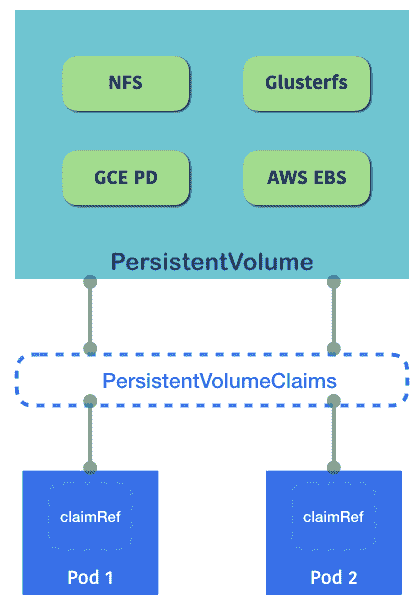PersistentVolumeClaims 是一个抽象层，用于解耦 Pod 和物理卷资源的卷

这是一个使用`NFS`的示例。管理员需要首先分配和配置`PersistentVolume`：

```
# example of PV with NFS
$ cat 2-6-7_pv.yaml
  apiVersion: "v1"
  kind: "PersistentVolume"
  metadata:
    name: "pvnfs01"
  spec:
    capacity:
      storage: "3Gi"
    accessModes:
      - "ReadWriteOnce"
    nfs:
      path: "/"
      server: "<your nfs server>"
    persistentVolumeReclaimPolicy: "Recycle"

# create the pv
$ kubectl create -f 2-6-7_pv.yaml
persistentvolume "pvnfs01" created
```

我们可以看到这里有三个参数：`capacity`，`accessModes`和`persistentVolumeReclaimPolicy`。`capacity`是这个`PersistentVolume`的大小。现在，`accessModes`是基于存储提供程序的功能，并且可以在分配期间设置为特定模式。例如，NFS 支持同时多个读者和写入者，然后我们可以将`accessModes`指定为`ReadWriteOnce`，`ReadOnlyMany`或`ReadWriteMany`中的一个。现在，`persistentVolumeReclaimPolicy`用于定义`PersistentVolume`释放时的行为。当前支持的策略是`nfs`和`hostPath`的保留和回收。在保留模式下，您必须自己清理卷；另一方面，Kubernetes 将在回收模式下清理卷。

PV 就像一个节点资源。我们可以使用`kubectl get pv`来查看当前分配的 PVs：

```
# list current PVs
$ kubectl get pv
NAME LABELS CAPACITY ACCESSMODES STATUS CLAIM REASON AGE
pvnfs01 <none> 3Gi RWO Bound default/pvclaim01 37m
```

接下来，我们需要将`PersistentVolume`与`PersistentVolumeClaim`绑定，以便将其作为卷挂载到`pod`中：

```
# example of PersistentVolumeClaim
$ cat claim.yaml
apiVersion: "v1"
kind: "PersistentVolumeClaim"
metadata:
  name: "pvclaim01"
spec:
  accessModes:
    - ReadWriteOnce
  resources:
    requests:
      storage: 1Gi

# create the claim
$ kubectl create -f claim.yaml
persistentvolumeclaim "pvclaim01" created

# list the PersistentVolumeClaim (pvc)
$ kubectl get pvc
NAME LABELS STATUS VOLUME CAPACITY ACCESSMODES AGE
pvclaim01 <none> Bound pvnfs01 3Gi RWO 59m
```

可以在`PersistentVolumeClaim`中设置`accessModes`和存储的约束。如果声明成功绑定，其状态将变为`Bound`；另一方面，如果状态为`Unbound`，这意味着当前没有与请求匹配的 PV。

然后我们可以使用`PersistentVolumeClaim`的引用将 PV 挂载为卷：

```
# example of mounting into Pod
$ cat nginx.yaml
apiVersion: v1
kind: Pod
metadata:
  name: nginx
  labels:
    project: pilot
    environment: staging
    tier: frontend
spec:
  containers:
    -
      image: nginx
      imagePullPolicy: IfNotPresent
      name: nginx
      volumeMounts:
      - name: pv
        mountPath: "/usr/share/nginx/html"
      ports:
      - containerPort: 80
  volumes:
    - name: pv
      persistentVolumeClaim:
 claimName: "pvclaim01"

# create the pod
$ kubectl create -f nginx.yaml
pod "nginx" created
```

它将类似于其他卷类型的语法。只需在卷定义中添加`persistentVolumeClaim`的`claimName`。我们已经准备好了！让我们检查细节，看看我们是否成功挂载了它：

```
# check the details of a pod
$ kubectl describe pod nginx
...
Volumes:
  pv:
    Type: PersistentVolumeClaim (a reference to a PersistentVolumeClaim in the same namespace)
    ClaimName: pvclaim01
    ReadOnly: false
...
```

我们可以看到我们在 Pod`nginx`中挂载了一个卷，类型为`pv pvclaim01`。使用`docker inspect`查看它是如何挂载的：

```
"Mounts": [
        {
            "Source": "/var/lib/kubelet/pods/<id>/volumes/kubernetes.io~nfs/pvnfs01",
            "Destination": "/usr/share/nginx/html",
            "Mode": "",
            "RW": true
        },
                ...
    ]
```

Kubernetes 将`/var/lib/kubelet/pods/<id>/volumes/kubernetes.io~nfs/< persistentvolume name>`挂载到 Pod 中的目的地。

# 使用存储类

在云世界中，人们动态配置存储或数据卷。虽然`PersistentVolumeClaim`基于由管理员配置的现有静态`PersistentVolume`，但如果云卷在需要时可以动态请求，这可能会非常有益。存储类旨在解决这个问题。要在集群中使用存储类，需要满足三个条件。首先，必须启用`DefaultStorageClass`准入控制器（参见第七章，*在 GCP 上构建 Kubernetes*）。然后，`PersistentVolumeClaim`需要请求存储类。最后一个条件是微不足道的；管理员必须配置存储类以使动态配置工作：

存储类动态分配 PV 并将其与 PVC 关联

默认存储类各种各样，基本上取决于您的基础云提供商。存储类是定义底层存储提供程序的抽象方式。它们根据不同类型的提供程序具有不同的语法。默认存储类可以更改，但不能删除。默认存储类具有注释`storageclass.beta.kubernetes.io/is-default-class=true`。删除该注释可以禁用动态配置。将注释移动到另一个存储类可以切换默认存储类。如果没有存储类具有该注释，当有新的`PersistentVolumeClaim`时，将不会触发动态配置。

# gcePersistentDisk

`gcePersistentDisk`卷将**Google 计算引擎**（**GCE**）**持久磁盘**（**PD**）挂载到一个 Pod 中。如果您静态配置它，您将需要首先使用`gcloud`命令或在 GCE 控制台中创建它。以下是一个示例：

```
# cat 2-6-8_gce/static_mount.yaml
apiVersion: v1
kind: Pod
metadata:
  name: gce-pd-pod
spec:
  containers:
  - image: nginx
    name: gce-pd-example
    volumeMounts:
    - mountPath: /mount-path
      name: gce-pd
      ports:
        - containerPort: 80
  volumes:
  - name: gce-pd
    gcePersistentDisk:
 pdName: example
 fsType: ext4
```

或者，更具成本效益地，我们可以使用动态配置。然后我们就不需要事先配置 PD。要启用动态配置，API 服务器上必须启用`DefaultStorageClass`准入控制器。在一些 Kubernetes 环境中，默认情况下已经启用了，比如在 GCE 中。我们可以通过在 Pod/Deployment/ReplicaSet 的配置文件中设置`storageClassName: ""`来显式禁用它。

接下来，我们将介绍如何创建一个非默认的`StorageClass`：

```
// list storageclasses (sc)
# kubectl get sc
NAME PROVISIONER
standard (default) kubernetes.io/gce-pd
```

我们可以看到我们有一个名为`standard`的默认存储类。如果这是所需的提供者，那么您就不需要创建自己的存储类。在下面的示例中，我们将创建一个名为`example`的新存储类：

```
// gce storage class
# cat 2-6-8_gce/storageclass.yaml
kind: StorageClass
apiVersion: storage.k8s.io/v1
metadata:
  name: example
provisioner: kubernetes.io/gce-pd
parameters:
 type: pd-standard
 zones: us-central1-a

// create storage class
# kubectl create -f storageclass.yaml
   storageclass "example" created

// check current storage classes
# kubectl get sc
NAME PROVISIONER
example kubernetes.io/gce-pd
   standard (default) kubernetes.io/gce-pd
```

对于类型，您可以指定 GCE 支持的任何存储类型，比如`pd-ssd`。您也可以通过更改区域参数来指定区域。接下来，我们将添加一个`PersistentVolumeClaim`来使用这个存储类：

```
# 2-6-8_gce/pvc.yaml
apiVersion: v1
kind: PersistentVolumeClaim
metadata:
  name: gce-example
spec:
  accessModes:
    - ReadWriteOnce
 storageClassName: example
 resources:
 requests:
 storage: 5Gi

// create pvc
# kubectl create -f pvc.yaml
persistentvolumeclaim "gce-example" created

// check pvc status
# kubectl get pvc
NAME STATUS VOLUME CAPACITY ACCESS MODES STORAGECLASS AGE
gce-example Bound pvc-d04218e3-ede5-11e7-aef7-42010a8001f4 5Gi RWO example 1h
```

这个配置文件将通过指定名为`example`的存储类来创建一个 PVC。声明将创建一个 PV。当 PVC 处于`Bound`状态时，Kubernetes 将始终将 PV 绑定到匹配的 PVC。然后，让我们使用这个 PVC 来创建一个 Pod：

```
# cat 2-6-8_gce/pod.yaml
kind: Pod
apiVersion: v1
metadata:
  name: gce-pd-pod
spec:
  volumes:
    - name: gce-pd
 persistentVolumeClaim:
 claimName: gce-example
 containers:
    - name: gce-pd-example
      image: nginx
      ports:
        - containerPort: 80
      volumeMounts:
        - mountPath: /mount-path
          name: gce-pd

// create a pod
# kubectl create -f pod.yaml
pod "gce-pd-pod" created

// check the volume setting in pod
# kubectl describe pod gce-pd-pod
...
Containers:
  gce-pd-example:
    Container ID: 
    Mounts:
      /mount-path from gce-pd (rw)
...
Volumes:
  gce-pd:
    Type: PersistentVolumeClaim (a reference to a PersistentVolumeClaim in the same namespace)
    ClaimName: gce-example
    ReadOnly: false
```

我们可以看到`gce-pd`被挂载在`/mount-path`下。让我们看看这个卷是否已经动态配置。

或者，您可以在 GCE 中使用`gcloud compute disks list. gcloud`命令行工具。

# awsElasticBlockStore

`awsElasticBlockStore`卷挂载了一个**亚马逊网络服务弹性块存储**（**AWS EBS**）卷。这是为亚马逊 EC2 提供持久块存储的服务。就像 GCE 持久磁盘一样，我们可以静态或动态地进行配置。

要静态配置它，管理员必须事先通过 AWS 控制台或 AWS CLI 创建一个 EBS 卷。以下是如何将现有的 EBS 卷挂载到部署中的容器的示例：

```
// example of how we used pre-created EBS volume.
# cat 2-6-8_aws/static_mount.yaml
kind: Deployment
apiVersion: apps/v1
metadata:
  name: aws-ebs-deployment
spec:
  replicas: 2
  selector:
    matchLabels:
      run: nginx
  template:
    metadata:
      labels:
        run: nginx
    spec:
      volumes:
 - name: aws-ebs
 awsElasticBlockStore:
 volumeID: <ebs volume ID>
 fsType: ext4
      containers:
      - name: aws-ebs-example
        image: nginx
        ports:
          - containerPort: 80
        volumeMounts:
          - mountPath: /mount-path
            name: aws-ebs
```

另一方面，要动态配置它，就像我们在 GCE 持久磁盘中演示的那样，我们首先创建一个非默认的存储类；您也可以使用默认的存储类。在这里，我们的环境是由 kops（[`github.com/kubernetes/kops`](https://github.com/kubernetes/kops)；有关更多信息，请参阅第六章，*在 AWS 上构建 Kubernetes*）。该环境已绑定所需的 IAM 策略，如`ec2:AttachVolume`、`ec2:CreateVolume`、`ec2:DetachVolume`和`ec2:DeleteVolume`。如果您从头开始配置它，请确保您有所需的策略附加到主节点：

```
// declare a storage class
# cat 2-6-8_aws/storageclass.yaml
kind: StorageClass
apiVersion: storage.k8s.io/v1
metadata:
  name: example-ebs
provisioner: kubernetes.io/aws-ebs
parameters:
 type: io1
 zones: us-east-1a

// create storage class
# kubectl create -f storageclass.yaml
storageclass "example-ebs" created

// check if example-ebs sc is created
# kubectl get sc
NAME PROVISIONER
default kubernetes.io/aws-ebs
example-ebs kubernetes.io/aws-ebs
gp2 (default) kubernetes.io/aws-ebs
```

接下来，我们使用刚刚创建的存储类名称创建一个 PVC：

```
// declare a PVC
# cat 2-6-8_aws/pvc.yaml
apiVersion: v1
kind: PersistentVolumeClaim
metadata:
  name: aws-example
spec:
 accessModes:
 - ReadWriteOnce
 storageClassName: example-ebs
 resources:
 requests:
 storage: 5Gi

// create a PVC
# kubectl create -f pvc.yaml
persistentvolumeclaim "aws-example" created

// check if PVC has been created
# kubectl get pvc
NAME STATUS VOLUME CAPACITY ACCESS MODES STORAGECLASS AGE
aws-example Bound pvc-d1cddc08-ee31-11e7-8582-022bb4c3719e 5Gi RWO example-ebs 5s
```

当 Kubernetes 接收到`PersistentVolumeClaim`的请求时，它将尝试分配一个新的`PersistentVolume`，或者如果可能的话，绑定到现有的 PV：

```
// check if a PV is created by a PVC.
# kubectl get pv
NAME CAPACITY ACCESS MODES RECLAIM POLICY STATUS CLAIM STORAGECLASS REASON AGE
pvc-d1cddc08-ee31-11e7-8582-022bb4c3719e 5Gi RWO Delete Bound default/aws-example example-ebs 36m
```

我们也可以在 AWS 控制台中检查相应的 PV。

最后，我们通过在规范中指定`persistentVolumeClaim`来创建一个带有这个卷的部署：

```
// create a deployment
# cat 2-6-8_aws/deployment.yaml
kind: Deployment
apiVersion: apps/v1
metadata:
  name: aws-ebs-deployment
spec:
  replicas: 2
  selector:
    matchLabels:
      run: nginx
  template:
    metadata:
      labels:
        run: nginx
    spec:
      volumes:
      - name: aws-ebs
        persistentVolumeClaim:
 claimName: aws-example
      containers:
      - name: aws-ebs-example
        image: nginx
        ports:
          - containerPort: 80
        volumeMounts:
          - mountPath: /mount-path
            name: aws-ebs
```

通过将`claimName`指定为`aws-example`，然后它将使用我们刚刚通过 PVC 创建的 EBS 卷，该卷是动态请求到 AWS 的。如果我们使用`kubectl describe pod <pod_name>`查看 Pod 描述，我们可以看到卷的详细信息：

```
// kubectl describe pod <pod_name>
# kubectl describe pod aws-ebs-deployment-68bdc6f546-246s7
Containers:
  aws-ebs-example:
    ...
    Mounts:
      /mount-path from aws-ebs (rw)
Volumes:
  aws-ebs:
    Type: AWSElasticBlockStore (a Persistent Disk resource in AWS)
    VolumeID: vol-0fccc3b0af8c17727
    FSType: ext4
    Partition: 0
    ReadOnly: false
...
```

EBS 卷`vol-0fccc3b0af8c17727`被挂载在容器内的`/mount-path`下。

如果卷是动态配置的，默认的回收策略设置为`delete`。如果要保留它们，即使 PVC 被删除，将其设置为`retain`。

**StorageObjectInUseProtection 准入控制器**

即使 PVC 被 Pod 使用，也可能会被用户意外删除。在 Kubernetes v1.10 中，添加了一个新的准入控制器来防止这种情况发生。`kubernetes.io/pv-protection`或`kubernetes.io/pvc-protection`终结器将被`StorageObjectInUseProtection`准入控制器添加到 PV 或 PVC 中。然后，当对象删除请求被发送时，准入控制器将进行预删除检查，并查看是否有任何 Pod 正在使用它。这将防止数据丢失。

# 参见

通过在 Pods 或 ReplicaSet 规范中声明，可以挂载卷。查看以下配方以唤起您的记忆：

+   *在第二章的*Pods 工作*部分，*走进 Kubernetes 概念*

+   在《走进 Kubernetes 概念》的第二章中的*使用副本集*部分

+   在《走进 Kubernetes 概念》的第二章中的*使用 Secrets*部分

+   在《高级集群管理》的第八章中的*在节点中设置资源*部分

+   在《高级集群管理》的第八章中的*身份验证和授权*部分

# 使用 Secrets

Kubernetes Secrets 以键值格式管理编码后的信息。它可以是密码、访问密钥或令牌。使用 Secrets，用户不必在配置文件中暴露敏感数据。Secrets 可以减少凭据泄露的风险，并使我们的资源配置更有条理。

目前，有三种类型的 Secrets：

+   Generic/Opaque: [`en.wikipedia.org/wiki/Opaque_data_type`](https://en.wikipedia.org/wiki/Opaque_data_type)

+   Docker 注册表

+   TLS

Generic/Opaque 是我们应用程序中使用的默认类型。Docker 注册表用于存储私有 Docker 注册表的凭据。TLS Secret 用于存储用于集群管理的 CA 证书包。

Kubernetes 为访问 API 服务器的凭据创建了内置的 Secrets。

# 准备工作

在使用 Secrets 之前，我们必须记住，Secret 应该在依赖的 Pods 之前创建，这样依赖的 Pods 才能正确引用它。此外，Secrets 有 1MB 的大小限制。这对于在单个 Secret 中定义一堆信息是有效的。但是，Secret 并不适用于存储大量数据。对于配置数据，请考虑使用`ConfigMaps`。对于大量的非敏感数据，请考虑使用卷代替。

# 如何做...

在以下示例中，我们将演示如何创建一个 Generic/Opaque Secret，并在 Pod 中使用它，假设我们有一个访问令牌需要在 Pod 内使用。

# 创建一个 Secret

创建 Secret 有两种方法。第一种是在命令行中使用`kubectl create secret`，另一种是在配置文件中直接创建资源。

# 使用 kubectl create 命令行

通过使用`kubectl create secret`命令行，您可以从文件、目录或文字值创建一个 Secret。使用这种方法，您不需要自己对 Secret 进行编码。Kubernetes 会为您完成这项工作：

# 从文件

1.  如果文件是 Secret 的来源，我们首先必须创建一个包含我们敏感数据的文本文件：

```
// assume we have a sensitive credential named access token.
# cat 2-7-1_access-token
9S!g0U61699r
```

1.  接下来，我们可以使用命令行中的`kubectl create secret`来创建 Secret。语法是：

```
Kubectl create secret <secret-type> --from-file <file1> (--from-file <file2> ...)
```

1.  在我们的情况下，我们使用通用的 Secret 类型，因为访问令牌既不是 Docker 注册表镜像拉取 Secrets 也不是 TLS 信息：

```
# kubectl create secret generic access-token --from-file 2-7-1_access-token
secret "access-token" created
```

1.  您可以使用`kubectl get secret`命令检查详细的 Secret 信息：

```
// get the detailed information for a Secret.
# kubectl get secret access-token -o yaml
apiVersion: v1
data:
  2-7-1_access-token: OVMhZzBVNjE2OTlyCg==
kind: Secret
metadata:
  creationTimestamp: 2018-01-01T20:26:24Z
  name: access-token
  namespace: default
  resourceVersion: "127883"
  selfLink: /api/v1/namespaces/default/secrets/access-token
  uid: 0987ec7d-ef32-11e7-ac53-080027ac331c
type: Opaque
```

1.  您可以使用 Linux 中的`base64`命令（[`linux.die.net/man/1/base64`](https://linux.die.net/man/1/base64)）来解码编码的 Secret：

```
// decode encoded Secret
# echo "OVMhZzBVNjE2OTlyCg==" | base64 --decode
9S!g0U61699r
```

# 从目录

从目录创建 Secret 与从文件创建类似，使用相同的命令，但使用`directory`。Kubernetes 将迭代该目录中的所有文件，并为您创建一个 Secret：

```
// show directory structure
# tree
.
├── 2-7-1_access-token-dir
│ └── 2-7-1_access-token

// create Secrets from a directory
# kubectl create secret generic access-token --from-file 2-7-1_access-token-dir/
secret "access-token" created
```

您可以再次使用`kubectl get secret access-token -o yaml`命令检查 Secret，并查看它们是否与文件中的相同。

# 从文字值

Kubernetes 支持使用单个命令行创建一个 Secret，如下所示：

```
// create a Secret via plain text in command line
# kubectl create secret generic access-token --from-literal=2-7-1_access-token=9S\!g0U61699r
secret "access-token" created
```

然后我们可以使用`get secret`命令来检查它们是否与以前的方法相同：

```
// check the details of a Secret
# kubectl get secret access-token -o yaml
apiVersion: v1
data:
  2-7-1_access-token: OVMhZzBVNjE2OTlyCg==
kind: Secret
metadata:
  creationTimestamp: 2018-01-01T21:44:32Z
  name: access-token
  ...
type: Opaque
```

# 通过配置文件

Secret 也可以直接通过配置文件创建；但是，您必须手动编码 Secret。只需使用 Secret 的种类：

```
// encode Secret manually
# echo '9S!g0U61699r' | base64
OVMhZzBVNjE2OTlyCg==

// create a Secret via configuration file, put encoded Secret into the file
# cat 2-7-1_secret.yaml
apiVersion: v1
kind: Secret
metadata:
  name: access-token
type: Opaque
data:
  2-7-1_access-token: OVMhZzBVNjE2OTlyCg==

// create the resource
# kubectl create -f 2-7-1_secret.yaml
secret "access-token" created

```

# 在 Pod 中使用 Secrets

要在 Pod 内部使用 Secrets，我们可以选择将它们暴露为环境变量或将 Secrets 挂载为卷。

# 通过环境变量

在 Pod 内部访问 Secret 方面，需要在容器规范中添加`env`部分，如下所示：

```
// using access-token Secret inside a Pod
# cat 2-7-2_env.yaml
apiVersion: v1
kind: Pod
metadata:
  name: secret-example-env
spec:
  containers:
  - name: ubuntu
    image: ubuntu
    command: ["/bin/sh", "-c", "while : ;do echo $ACCESS_TOKEN; sleep 10; done"]
    env:
 - name: ACCESS_TOKEN
 valueFrom:
 secretKeyRef:
 name: access-token
 key: 2-7-1_access-token

// create a pod
# kubectl create -f 2-7-2_env.yaml
pod "secret-example-env" created
```

在前面的例子中，我们将`2-7-1_access-token`密钥暴露为`ACCESS_TOKEN`环境变量，通过一个无限循环打印出来。通过`kubectl`日志命令检查`stdout`：

```
// check stdout logs
# kubectl logs -f secret-example-env
9S!g0U61699r
```

请注意，在 Pod 创建期间暴露了环境变量。如果推送了新的 Secret 值，您将不得不重新启动/滚动更新 Pod 或 Deployment 以反映这一点。

如果我们描述`secret-example-env` Pod，我们可以看到一个环境变量被设置为一个 Secret：

```
# kubectl describe pods secret-example-env
Name: secret-example-env
...
Environment:
      ACCESS_TOKEN: <set to the key '2-7-1_access-token' in secret 'access-token'> 
```

# 通过卷

也可以通过使用卷的 Secret 类型将 Secret 挂载为卷。以下是如何使用它的示例：

```
// example of using Secret volume
# cat 2-7-3_volumes.yaml
apiVersion: v1
kind: Pod
metadata:
  name: secret-example-volume
spec:
  containers:
  - name: ubuntu
    image: ubuntu
    command: ["/bin/sh", "-c", "while : ;do cat /secret/token; sleep 10; done"]
    volumeMounts:
      - name: secret-volume
        mountPath: /secret
        readOnly: true
  volumes:
    - name: secret-volume
      secret:
 secretName: access-token
 items:
 - key: 2-7-1_access-token
 path: token

// create the Pod
kubectl create -f 2-7-3_volumes.yaml
pod "secret-example-volume" created
```

前面的例子将`secret-volume`挂载到 Pod 内部的`/secret`挂载点。`/secret`将包含一个名为 token 的文件，其中包含我们的访问令牌。如果我们检查 Pod 的详细信息，它将显示我们挂载了一个只读的 Secret 卷：

```
// check the Pod details
# kubectl describe pods secret-example-volume
Name: secret-example-volume
...
Containers:
  ubuntu:
    ...
    Mounts:
      /secret from secret-volume (ro)
      ...
Volumes:
  secret-volume:
    Type: Secret (a volume populated by a Secret)
    SecretName: access-token
    Optional: false
...
```

如果我们检查`stdout`，它将显示 Pod 可以正确检索预期的值：

```
# kubectl logs -f secret-example-volume
9S!g0U61699r
```

与环境变量一样，挂载卷中的文件是在 Pod 创建时创建的。当 Pod 创建后更新 Secret 值时，它不会动态更改。

# 删除秘密

删除秘密，只需使用`kubectl delete secret`命令：

```
# kubectl delete secret access-token
secret "access-token" deleted
```

如果在附加了 Secret 卷的情况下删除了 Secret，每当卷引用消失时都会显示错误消息：

```
# kubectl describe pods secret-example-volume
...
Events:
  Warning FailedMount 53s (x8 over 1m) kubelet, minikube MountVolume.SetUp failed for volume "secret-volume" : secrets "access-token" not found
```

# 它是如何工作的...

为了减少泄露 Secrets 内容的风险，Secret 不会落地到磁盘上。相反，kubelet 在节点上创建一个`tmpfs`文件系统来存储 Secret。Kubernetes API 服务器将 Secret 推送到要求容器正在运行的节点上。当容器被销毁时，数据将被擦除。

# 还有更多...

Secrets 保存少量敏感数据。对于应用程序配置，请考虑使用`ConfigMaps`保存非敏感信息。

# 使用 ConfigMaps

以下是使用`ConfigMaps`的示例：

```
# cat configmap/2-7-4_configmap.yaml
apiVersion: v1
kind: ConfigMap
metadata:
  name: config-example
data:
  app.properties: |
    name=kubernetes-cookbook
    port=443

// create configmap
# kubectl create -f configmap/2-7-4_configmap.yaml
configmap "config-example" created
```

与 Secret 类似，`ConfigMaps`可以通过环境变量或卷检索：

```
# cat configmap/2-7-4_env.yaml
apiVersion: v1
kind: Pod
metadata:
  name: configmap-env
spec:
  containers:
    - name: configmap
      image: ubuntu
      command: ["/bin/sh", "-c", "while : ;do echo $APP_NAME; sleep 10; done"]
      env:
 - name: APP_NAME
 valueFrom:
 configMapKeyRef:
 name: config-example
 key: app.properties

// create the pod
#kubectl create -f configmap/2-7-4_env.yaml
pod "configmap-env" created
```

或者，您可以使用`ConfigMaps`卷来检索配置信息：

```
// using configmap in a pod
# cat configmap/2-7-4_volumes.yaml
apiVersion: v1
kind: Pod
metadata:
  name: configmap-volume
spec:
  containers:
    - name: configmap
      image: ubuntu
      command: ["/bin/sh", "-c", "while : ;do cat /src/app/config/app.properties; sleep 10; done"]
      volumeMounts:
      - name: config-volume
        mountPath: /src/app/config
  volumes:
    - name: config-volume
      configMap:
 name: config-example
```

# 在同一卷中挂载 Secrets 和 ConfigMap

投影卷是将多个卷源组合到同一挂载点的一种方式。目前，它支持 Secrets、`ConfigMap`和`downwardAPI`。

以下是我们在本章中使用的 Secrets 和`ConfigMaps`示例的分组示例：

```
// using projected volume
# cat 2-7-5_projected_volume.yaml
apiVersion: v1
kind: Pod
metadata:
  name: projected-volume-example
spec:
  containers:
  - name: container-tes
    image: ubuntu
    command: ["/bin/sh", "-c", "while : ;do cat /projected-volume/configmap && cat /projected-volume/token; sleep 10; done"]
    volumeMounts:
    - name: projected-volume
      mountPath: "/projected-volume"
  volumes:
  - name: projected-volume
    projected:
 sources:
      - secret:
          name: access-token
          items:
            - key: 2-7-1_access-token
              path: token
      - configMap:
          name: config-example
          items:
            - key: app.properties
              path: configmap

// create projected volume
# kubectl create -f 2-7-5_projected_volume.yaml
pod "projected-volume-example" created
```

让我们检查`stdout`，看看它是否正常工作：

```
# kubectl logs -f projected-volume-example
name=kubernetes-cookbook
port=443
9S!g0U61699r
```

# 另请参阅

+   *第二章**中的*Working with Volumes*部分，*Walking through Kubernetes Concepts*

+   *第三章*中的*使用配置文件*部分，*与容器一起玩*

+   *第五章*中的*将单片式转换为微服务*和*使用私有 Docker 注册表*部分，*构建持续交付管道*

+   *第七章*中的*kubeconfig 中的高级设置*部分，*在 GCP 上构建 Kubernetes*

# 使用名称

当您创建任何 Kubernetes 对象，如 Pod、Deployment 和 Service 时，可以为其分配一个名称。Kubernetes 中的名称在空间上是唯一的，这意味着您不能在 Pod 中分配相同的名称。

# 准备工作

Kubernetes 允许我们分配以下限制的名称：

+   最多 253 个字符

+   小写字母和数字字符

+   可能包含特殊字符，但只能是破折号（-）和点（.）。

# 如何做...

为 Pod 分配名称，请按照以下步骤操作：

1.  以下示例是 Pod YAML 配置，将 Pod 名称分配为`my-pod`，将容器名称分配为`my-container`；您可以成功创建它如下：

```
# cat my-pod.yaml
apiVersion: v1
kind: Pod
metadata:
 name: my-pod
spec: containers:
  - name: **my-container** image: nginx # kubectl create -f my-pod.yaml pod "my-pod" created  # kubectl get pods  NAME      READY     STATUS    RESTARTS   AGE my-pod    0/1       Running   0          4s
```

1.  您可以使用`kubectl describe`命令查看名为`my-container`的容器，如下所示：

```
$ kubectl describe pod my-pod Name:         my-pod Namespace:    default Node:         minikube/192.168.64.12 Start Time:   Sat, 16 Dec 2017 10:53:38 -0800 Labels:       <none> Annotations:  <none> Status:       Running IP:           172.17.0.3 Containers:
 **my-container**: Container ID:   docker://fcf36d0a96a49c5a08eb6de1ef27ca761b4ca1c6b4a3a4312df836cb8e0a5304 Image:          nginx Image ID:       docker-pullable://nginx@sha256:2ffc60a51c9d658594b63ef5acfac9d92f4e1550f633a3a16d898925c4e7f5a7 Port:           <none> State:          Running Started:      Sat, 16 Dec 2017 10:54:43 -0800 Ready:          True Restart Count:  0 Environment:    <none> Mounts: /var/run/secrets/kubernetes.io/serviceaccount from default-token-lmd62 (ro) Conditions:
 Type           Status Initialized    True  Ready          True 
PodScheduled   True Volumes:
 default-token-lmd62: Type:        Secret (a volume populated by a Secret) SecretName:  default-token-lmd62 Optional:    false QoS Class:       BestEffort Node-Selectors:  <none> Tolerations:     <none> Events:
 Type    Reason                 Age   From               Message ----    ------                 ----  ----               ------- Normal  Scheduled              1m    default-scheduler  Successfully assigned my-pod to minikube Normal  SuccessfulMountVolume  1m    kubelet, minikube  MountVolume.SetUp succeeded for volume "default-token-lmd62" Normal  Pulling                1m    kubelet, minikube  pulling image "nginx" Normal  Pulled                 50s   kubelet, minikube  Successfully pulled image "nginx" Normal  Created                50s   kubelet, minikube  Created container Normal  Started                50s   kubelet, minikube  Started container
```

1.  另一方面，以下示例包含两个容器，但分配相同的名称`my-container`；因此，`kubectl create`命令返回错误，无法创建 Pod：

```
//delete previous Pod $ kubectl delete pod --all pod "my-pod" deleted  $ cat duplicate.yaml apiVersion: v1 kind: Pod metadata:
 name: my-pod spec:
 containers: - name: **my-container** image: nginx - name: **my-container** image: centos command: ["/bin/sh", "-c", "while : ;do curl http://localhost:80/; sleep 3; done"] $ kubectl create -f duplicate.yaml The Pod "my-pod" is invalid: spec.containers[1].name: Duplicate value: "my-container"
```

您可以添加`--validate`标志。例如，命令`kubectl create -f duplicate.yaml --validate`在发送之前使用模式验证输入。

在另一个示例中，YAML 包含一个 ReplicationController 和一个 Service，两者都使用相同的名称`my-nginx`，但它成功创建，因为 Deployment 和 Service 是不同的对象：

```
$ cat my-nginx.yaml 
apiVersion: apps/v1
kind: Deployment
metadata:
  name: my-nginx
spec:
  replicas: 3
  selector:
    matchLabels:
      run: my-label
  template:
    metadata:
      labels:
        run: my-label
    spec:
      containers:
      - name: my-container
        image: nginx
        ports:
        - containerPort: 80
---
apiVersion: v1
kind: Service
metadata:
  name: my-nginx
spec:
  ports:
    - protocol: TCP
      port: 80
  type: NodePort
  selector:
    run: my-label

//create Deployment and Service
$ kubectl create -f my-nginx.yaml 
deployment.apps "my-nginx" created
service "my-nginx" created

//Deployment "my-nginx" is created
$ kubectl get deploy
NAME  DESIRED  CURRENT  UP-TO-DATE  AVAILABLE  AGE my-nginx  3  3  3  3  1m

//Service "my-nginx" is also created
$ kubectl get svc
NAME TYPE CLUSTER-IP EXTERNAL-IP PORT(S) AGE
kubernetes ClusterIP 10.0.0.1 <none> 443/TCP 13d
my-nginx NodePort 10.0.0.246 <none> 80:31168/TCP 1m
```

# 它是如何工作的...

名称只是一个唯一标识符，所有命名约定都是好的；但是，建议查找和识别容器映像。例如：

+   `memcached-pod1`

+   `haproxy.us-west`

+   `my-project1.mysql`

另一方面，以下示例由于 Kubernetes 的限制而无法工作：

+   `Memcache-pod1`（包含大写）

+   `haproxy.us_west`（包含下划线）

+   `my-project1.mysql.`（最后一个点）

请注意，Kubernetes 支持一个标签，允许分配`key=value`样式的标识符。它还允许重复。因此，如果您想分配类似以下信息的内容，请改用标签：

+   环境（例如：暂存，生产）

+   版本（例如：v1.2）

+   应用程序角色（例如：前端，工作人员）

此外，Kubernetes 还支持具有不同命名空间的名称。这意味着您可以在不同的命名空间中使用相同的名称（例如：`nginx`）。因此，如果您只想分配一个应用程序名称，请改用命名空间。

# 另请参阅

本章节描述了如何分配和查找对象的名称。这只是一种基本方法，但 Kubernetes 还有更强大的命名工具，如命名空间和选择器，用于管理集群：

+   *与 Pod 一起工作*

+   *部署 API*

+   *与服务一起工作*

+   *与命名空间一起工作*

+   *使用标签和选择器*

# 使用命名空间

在 Kubernetes 集群中，资源的名称是命名空间内的唯一标识符。使用 Kubernetes 命名空间可以将同一集群中的不同环境的用户空间分开。它使您能够创建一个隔离的环境，并将资源分区到不同的项目和团队。您可以将命名空间视为虚拟集群。Pod、服务和部署都包含在某个命名空间中。一些低级资源，如节点和`persistentVolumes`，不属于任何命名空间。

在我们深入资源命名空间之前，让我们先了解`kubeconfig`和一些关键词：

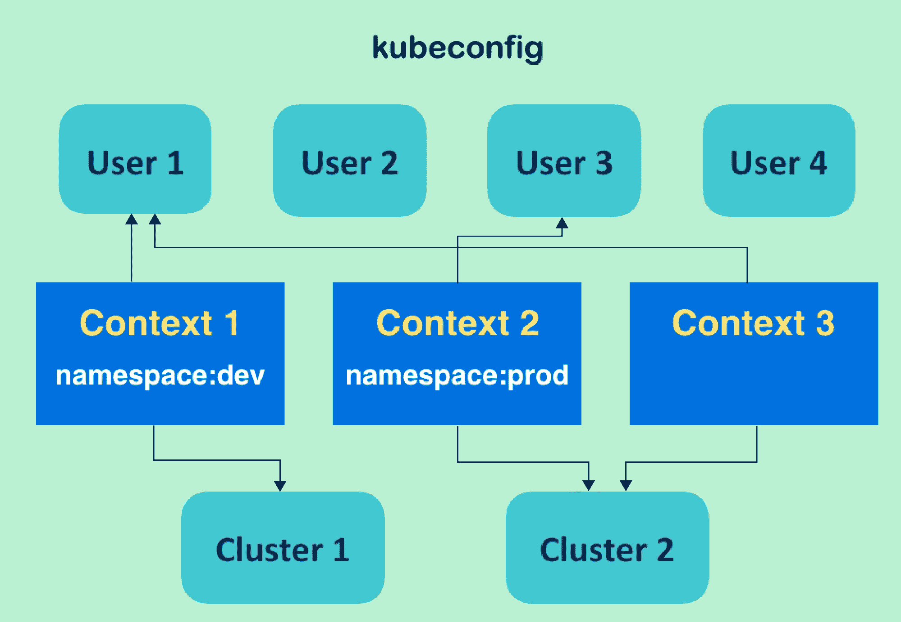kubeconfig 组件的关系

`kubeconfig`用于调用配置 Kubernetes 集群访问权限的文件。作为系统的原始配置，Kubernetes 将`$HOME/.kube/config`作为`kubeconfig`文件。前面图表所说明的一些概念如下：

+   **kubeconfig 定义用户、集群和上下文**：`kubeconfig`列出了多个用户来定义身份验证，以及多个集群来指示 Kubernetes API 服务器。此外，`kubeconfig`中的上下文是用户和集群的组合：使用何种身份验证访问特定的 Kubernetes 集群。

+   **用户和集群在上下文之间是可共享的**：在前面的图表中，**上下文 1**和**上下文 3**都将**用户 1**作为其用户内容。然而，每个上下文只能有一个用户和一个集群定义。

+   **命名空间可以附加到上下文**：每个上下文都可以分配给一个现有的命名空间。如果没有，比如**上下文 3**，它将与默认命名空间`default`一起。

+   当前上下文是客户端的默认环境：我们可能在`kubeconfig`中有几个上下文，但当前上下文只有一个。当前上下文和附加在其上的命名空间将构建用户的默认计算环境。

现在您会明白，由于命名空间与`kubeconfig`一起工作，用户可以通过切换`kubeconfig`中的当前上下文轻松切换默认资源以供使用。然而，用户仍然可以在指定的命名空间中启动任何资源。在本教程中，您将学习如何创建自己的命名空间以及如何使用它。

# 准备工作

默认情况下，Kubernetes 已经创建了一个名为`default`的命名空间。所有创建的对象，如果没有指定命名空间，将被放入`default`命名空间。Kubernetes 还将创建另一个名为`kube-system`的初始命名空间，用于定位 Kubernetes 系统对象，例如插件或叠加网络。尝试列出所有命名空间：

```
// check all Namespaces, "ns" is the resource abbreviation of Namespace
$ kubectl get ns
NAME          STATUS    AGE
default       Active    15d
kube-public   Active    15d
kube-system   Active    15d
```

您可能会在初始阶段找到一个额外的命名空间`kube-public`。它旨在为即使没有权限访问 Kubernetes 系统的用户呈现一些公共配置。在启动系统时，`minikube`和`kubeadm`都会创建它。

命名空间的名称必须是 DNS 标签，并遵循以下规则：

+   最多 63 个字符

+   匹配正则表达式 a-z0-9

# 如何做...

在本节中，我们将演示如何创建命名空间，更改默认命名空间和删除命名空间。

# 创建命名空间

要创建一个命名空间，请按照以下步骤：

1.  在确定我们想要的命名空间名称后，让我们使用配置文件创建它：

```
$ cat my-first-namespace.yaml
apiVersion: v1
kind: Namespace
metadata:
  name: my-namespace

// create the resource by subcommand "create"
$ kubectl create -f my-first-namespace.yaml
namespace "my-namespace" created
// list the namespaces again
$ kubectl get ns
NAME           STATUS    AGE
default        Active    16d
kube-public    Active    16d
kube-system    Active    16d
my-namespace   Active    6s
```

1.  您现在可以看到我们有一个名为`my-namespace`的额外命名空间。接下来，让我们在这个新的命名空间中运行一个 Kubernetes 部署：

```
// run a Deployment with a flag specifying Namespace
$ kubectl run my-nginx --image=nginx --namespace=my-namespace
deployment.apps "my-nginx" created
```

1.  在尝试检查新创建的资源时，我们无法像通常那样轻松找到它们：

```
$ kubectl get deployment
No resources found.
```

1.  相反，部署显示了与命名空间相关的标志：

```
// list any Deployment in all Namespaces
$ kubectl get deployment --all-namespaces
NAMESPACE      NAME                       DESIRED   CURRENT   UP-TO-DATE   AVAILABLE   AGE
kube-system    calico-kube-controllers    1         1         1            1           16d
kube-system    calico-policy-controller   0         0         0            0           16d
kube-system    kube-dns                   1         1         1            1           16d
my-namespace   my-nginx                   1         1         1            1           1m

// get Deployments from my-namespace
$ kubectl get deployment --namespace=my-namespace
NAME       DESIRED   CURRENT   UP-TO-DATE   AVAILABLE   AGE
my-nginx   1         1         1            1           1m
```

现在您可以找到刚刚创建的资源。

# 更改默认命名空间

如前所述，我们可以通过将`kubeconfig`中的当前上下文切换到另一个上下文来更改默认命名空间：

1.  首先，我们可以使用子命令`config`检查当前上下文：

```
// check the current context in kubeconfig
$ kubectl config current-context
kubernetes-admin@kubernetes
```

在检查当前上下文时，您可能会对输出感到陌生。上一个当前上下文的值是由`kubeadm`定义和创建的。如果您使用`minikube`作为 Kubernetes 系统管理工具，您可能会在屏幕上看到`minikube`。

1.  无论您从`kubeconfig`中检查当前上下文得到什么，都可以使用子命令`config set-context`来创建一个新的上下文：

```
// create a new context called "my-context"
// the new context is going to follow the cluster and the user of current context, but attached with new Namespace
//This is for kubeadm environment
$ kubectl config set-context my-context --namespace=my-namespace --cluster=kubernetes --user=kubernetes-admin
Context "my-context" created.
```

1.  上述命令是基于`kubeadm`管理的 Kubernetes；您可以为`minikube`发出类似的命令，其中包括`kubeconfig`中默认集群和用户的名称：

```
// for minikube environemt
$ kubectl config set-context my-context --namespace=my-namespace --cluster=minikube --user=minikube
```

1.  接下来，检查`kubeconfig`以验证更改：

```
//check kubectlconfig for the new context
$ kubectl config view
apiVersion: v1
clusters:
- cluster:
    certificate-authority-data: REDACTED
    server: https://192.168.122.101:6443
  name: kubernetes
contexts:
- context:
    cluster: kubernetes
    user: kubernetes-admin
  name: kubernetes-admin@kubernetes
- context:
 cluster: kubernetes namespace: my-namespace user: kubernetes-admin name: my-context current-context: kubernetes-admin@kubernetes
kind: Config
preferences: {}
users:
- name: kubernetes-admin
  user:
    client-certificate-data: REDACTED
    client-key-data: REDACTED
```

在检查`kubeconfig`配置时，在上下文部分，您可以找到一个与我们定义的完全相同的上下文，并且还将我们新创建的命名空间。

1.  执行以下命令以切换到使用新的上下文：

```
$ kubectl config use-context my-context
Switched to context "my-context".
// check current context
$ kubectl config current-context
my-context
```

现在当前的上下文是我们定制的一个，它与命名空间`my-namespace`一起。

1.  由于默认的命名空间已更改为`my-namespace`，因此我们可以在不指定命名空间的情况下获取部署：

```
$ kubectl get deployment
NAME       DESIRED   CURRENT   UP-TO-DATE   AVAILABLE   AGE
my-nginx   1         1         1            1           20m

//double check the namespace of resource
$ kubectl describe deployment my-nginx
Name:                   my-nginx
Namespace:              my-namespace CreationTimestamp:      Mon, 18 Dec 2017 15:39:46 -0500
Labels:                 run=my-nginx
:
(ignored)
```

# 删除一个命名空间

如果您按照之前的页面了解 Kubernetes 资源，您可能已经知道子命令`delete`用于删除资源。在删除命名空间的情况下是可行的。同时，如果我们尝试删除一个命名空间，其中的资源也将被删除：

```
// first, go ahead to remove the Namespace "my-namespace"
$ kubectl delete ns my-namespace
namespace "my-namespace" deleted
// check the Deployment again, the exited "my-nginx" is terminated
$ kubectl get deployment
No resources found.

// while trying to create anything, the error message showing the default Namespace is not existed
$ kubectl run my-alpine --image=alpine
Error from server (NotFound): namespaces "my-namespace" not found
```

为了解决这个问题，您可以将另一个命名空间附加到当前上下文，或者只是将当前上下文更改为以前的上下文：

```
// first solution: use set-context to update the Namespace
// here we just leave Namespace empty, which means to use default Namespace
$ kubectl config set-context my-context --namespace=""
Context "my-context" modified.

// second solution: switch current context to another context
// in this case, it is kubeadm environment
$ kubectl config use-context kubernetes-admin@kubernetes
Switched to context "kubernetes-admin@kubernetes".
```

# 它是如何工作的...

尽管我们讨论了`kubeconfig`的命名空间和上下文，但它们是 Kubernetes 系统中独立的对象。`kubeconfig`的上下文是一个客户端概念，只能由特定用户控制，并且可以更轻松地与命名空间和集群一起工作。另一方面，命名空间是服务器端的概念，在集群中用于资源隔离，并且可以在客户端之间共享。

# 还有更多...

我们不仅利用命名空间来分隔我们的资源，还可以实现更精细的计算资源配置。通过限制命名空间的计算能力的使用量，系统管理员可以避免客户端创建过多资源并使服务器超载。

# 创建一个 LimitRange

要设置每个命名空间的资源限制，应该在 Kubernetes API 服务器中添加准入控制器`LimitRanger`。如果您的系统管理者是`minikube`或`kubeadm`，则无需担心此设置。

**Kubernetes API 服务器中的准入控制器** 准入控制器是 Kubernetes API 服务器中的一个设置，它定义了 API 服务器中的更高级功能。准入控制器中可以设置几个功能。用户可以在启动 API 服务器时通过配置文件或使用 CLI 和标志`--admission-control`添加这些功能。依赖于`minikube`或`kubeadm`进行系统管理，它们在准入控制器中有自己的初始设置：

+   **kubeadm 中的默认准入控制器**：`Initializers`，`NamespaceLifecycle`，`LimitRanger`，`ServiceAccount`，`PersistentVolumeLabel`，`DefaultStorageClass`，`DefaultTolerationSeconds`，`NodeRestriction`，`ResourceQuota`

+   minikube 中的默认准入控制器：`NamespaceLifecycle`，`LimitRanger`，`ServiceAccount`，`DefaultStorageClass`，`ResourceQuota`

根据您的 API 服务器版本，在官方文档[`kubernetes.io/docs/admin/admission-controllers/#is-there-a-recommended-set-of-admission-controllers-to-use`](https://kubernetes.io/docs/admin/admission-controllers/#is-there-a-recommended-set-of-admission-controllers-to-use)中有一个推荐的列表。查看更多想法！

一个普通的新 Namespace 在资源配额上没有限制。一开始，我们创建一个 Namespace 并查看其初始设置：

```
// create a Namespace by YAML file
$ kubectl create -f my-first-namespace.yaml
namespace "my-namespace" created            

$ kubectl describe ns my-namespace
Name:         my-namespace
Labels:       <none>
Annotations:  <none>
Status:       Active

No resource quota.

No resource limits.
```

之后，我们创建一个名为`LimitRange`的资源，用于指定 Namespace 的资源限制。以下是创建 Namespace 限制的一个很好的例子：

```
$ cat my-first-limitrange.yaml
apiVersion: v1
kind: LimitRange
metadata:
  name: my-limitrange
spec:
  limits:
  - type: Pod
    max:
      cpu: 2
      memory: 1Gi
    min:
      cpu: 200m
      memory: 6Mi
  - type: Container
    default:
      cpu: 300m
      memory: 200Mi
    defaultRequest:
      cpu: 200m
      memory: 100Mi
    max:
      cpu: 2
      memory: 1Gi
    min:
      cpu: 100m
      memory: 3Mi
```

然后，我们将使用`2`作为 CPU 的`max`值，`200m`作为`min`值来限制 Pod 中的资源，并且使用`1Gi`作为内存的最大值，`6Mi`作为最小值。对于容器，CPU 限制在`100m - 2`之间，内存在`3Mi` - `1Gi`之间。如果设置了最大值，则必须在资源创建时在 Pod/container 规范中指定限制；如果设置了最小值，则必须在 Pod/container 创建时指定请求。`LimitRange`中的`default`和`defaultRequest`部分用于指定容器规范中的默认限制和请求。

在文件`my-first-limitrange.yaml`中，`LimitRange`中的 CPU 限制的值是什么意思？整数值表示 CPU 的数量；值中的“m”表示毫 CPU，所以`200m`表示 0.2 CPU（200 * 0.001）。同样，容器的默认 CPU 限制是 0.2 到 0.3，实际限制是 0.1 到 2。

随后，我们在普通的 Namespace 中创建`LimitRange`并检查会发生什么：

```
// create the limitrange by file with the flag of Namespace
// the flag --namespace can be abbreviated to "n"
$ kubectl create -f my-first-limitrange.yaml -n my-namespace
limitrange "my-limitrange" created

// check the resource by subcommand "get"
$ kubectl get limitrange -n my-namespace
NAME            AGE
my-limitrange   23s

// check the customized Namespace
$ kubectl describe ns my-namespace
Name:         my-namespace
Labels:       <none>
Annotations:  <none>
Status:       Active

No resource quota.

Resource Limits
 Type       Resource  Min   Max  Default Request  Default Limit  Max Limit/Request Ratio
 ----       --------  ---   ---  ---------------  -------------  -----------------------
 Pod        cpu       200m  2    -                -              -
 Pod        memory    6Mi   1Gi  -                -              -
 Container  memory    3Mi   1Gi  100Mi            200Mi          -
 Container  cpu       100m  2    200m             300m           -
```

当您查询`my-namespace`的详细描述时，您将看到直接附加到 Namespace 的约束。不需要添加`LimitRange`。现在，此 Namespace 中创建的所有 Pod 和容器都必须遵循此处列出的资源限制。如果定义违反规则，将相应地抛出验证错误：

```
// Try to request an overcommitted Pod, check the error message
$ kubectl run my-greedy-nginx --image=nginx --namespace=my-namespace --restart=Never --requests="cpu=4"
The Pod "my-greedy-nginx" is invalid: spec.containers[0].resources.requests: Invalid value: "4": must be less than or equal to cpu limit
```

# 删除`LimitRange`

我们可以使用子命令`delete`删除 LimitRange 资源。与创建`LimitRange`类似，在命名空间中删除`LimitRange`将自动删除命名空间中的约束：

```
$ kubectl delete -f my-first-limitrange.yaml -n=my-namespace
limitrange "my-limitrange" deleted
$ kubectl describe ns my-namespace
Name:         my-namespace
Labels:       <none>
Annotations:  <none>
Status:       Active

No resource quota.

No resource limits.
```

# 另请参阅

许多 Kubernetes 资源能够在命名空间下运行。为了实现良好的资源管理，请查看以下的方法：

+   *使用 Pod*

+   *部署 API*

+   *使用名称*

+   *在*第七章，在 GCP 上构建 Kubernetes*中的*在节点中设置资源*部分*

# 使用标签和选择器

**标签**是一组键/值对，附加到对象元数据。我们可以使用标签来选择、组织和分组对象，如 Pod、ReplicaSets 和 Services。标签不一定是唯一的。对象可以携带相同的一组标签。

标签选择器用于查询具有以下类型标签的对象：

+   基于相等性：

+   使用等于(`=`或`==`)或不等于(`!=`)运算符

+   基于集合：

+   使用`in`或`notin`运算符

# 准备工作

在对象中设置标签之前，您应该考虑键和值的有效命名约定。

有效的键应遵循以下规则：

+   一个可选的前缀名称，用斜杠分隔。

+   前缀必须是 DNS 子域，由点分隔，不超过 253 个字符。

+   名称必须少于 63 个字符，由[a-z0-9A-Z]和破折号、下划线和点的组合组成。请注意，如果放在开头和结尾，符号是不合法的。

有效的值应遵循以下规则：

+   名称必须少于 63 个字符，由[a-z0-9A-Z]和破折号、下划线和点的组合组成。请注意，如果放在开头和结尾，符号是不合法的。

您还应该考虑目的。例如，有两个项目，`pilot`和`poc`。此外，这些项目处于不同的环境下，如`develop`和`production`。此外，一些包含多个层次，如`frontend`、`cache`和`backend`。我们可以将我们的标签键和值组合如下：

```
  labels:
    project: pilot
    environment: develop
    tier: frontend
```

# 如何做...

1.  让我们尝试使用先前的标签创建几个 Pod，以区分不同的项目、环境和层次，如下所示：

| **YAML 文件名** | **Pod 镜像** | **项目** | **环境** | **层次** |
| --- | --- | --- | --- | --- |
| `pilot-dev.yaml` | `nginx` | pilot | develop | `frontend` |
| `pilot-dev.yaml` | `memcached` | `cache` |
| `pilot-prod.yaml` | `nginx` | production | `frontend` |
| `pilot-prod.yaml` | `memcached` | `cache` |
| `poc-dev.yaml` | `httpd` | poc | develop | `frontend` |
| `poc-dev.yaml` | `memcached` | `cache` |

1.  为了方便起见，我们将准备三个包含两个`Pods`的`YAML`文件，`Pods`之间有一个`YAML`分隔符`---`：

+   `pilot-dev.yaml`：

```
apiVersion: v1
kind: Pod
metadata:
  name: pilot.dev.nginx
 labels:
 project: pilot
 environment: develop
 tier: frontend
spec:
  containers:
    - name: nginx
      image: nginx
---
apiVersion: v1
kind: Pod
metadata:
  name: pilot.dev.memcached
 labels:
 project: pilot
 environment: develop
 tier: cache
spec:
  containers:
    - name: memcached
      image: memcached
```

+   `pilot-prod.yaml`：

```
apiVersion: v1
kind: Pod
metadata:
  name: pilot.prod.nginx
 labels:
 project: pilot
 environment: production
 tier: frontend
spec:
  containers:
    - name : nginx
      image: nginx
---
apiVersion: v1
kind: Pod
metadata:
  name: pilot.prod.memcached
 labels:
 project: pilot
 environment: production
 tier: cache
spec:
  containers:
    - name: memcached
      image: memcached
```

+   `poc-dev.yaml`：

```
apiVersion: v1
kind: Pod
metadata:
  name: poc.dev.httpd
 labels:
 project: poc
 environment: develop
 tier: frontend
spec:
  containers:
    - name: httpd
      image: httpd
---
apiVersion: v1
kind: Pod
metadata:
  name: poc.dev.memcached
 labels:
 project: poc
 environment: develop
 tier: cache
spec:
  containers:
    - name: memcached
      image: memcached
```

1.  使用`kubectl create`命令创建这六个`Pods`，如下所示，以查看标签的定义：

```
$ kubectl create -f pilot-dev.yaml
pod "pilot.dev.nginx" created
pod "pilot.dev.memcached" created

$ kubectl create -f pilot-prod.yaml
pod "pilot.prod.nginx" created
pod "pilot.prod.memcached" created

$ kubectl create -f poc-dev.yaml
pod "poc.dev.httpd" created
pod "poc.dev.memcached" created
```

1.  运行`kubectl describe <Pod name>`来检查标签，如下所示。看起来不错，所以让我们使用标签选择器根据不同的条件查询这些`Pods`：

```
$ kubectl describe pod poc.dev.memcache
Name: poc.dev.memcached
Namespace: default
Node: minikube/192.168.99.100
Start Time: Sun, 17 Dec 2017 17:23:15 -0800
Labels: environment=develop
 project=poc
 tier=cache
Annotations: <none>
Status: Running
...
```

# 工作原理...

如前所述，在本节中有两种类型的标签选择器：基于相等性或基于集合。这些类型有不同的运算符来指定条件。

# 基于相等性的标签选择器

基于相等性的选择器可以指定相等或不相等，并且还使用逗号添加更多条件。使用`-l`或`--selector`选项指定这些条件来过滤对象的名称；例如：

+   查询属于试点项目的`Pods`：

```
$ kubectl get pods -l "project=pilot"
NAME READY STATUS RESTARTS AGE
pilot.dev.memcached 1/1 Running 0 21m
pilot.dev.nginx 1/1 Running 0 21m
pilot.prod.memcached 1/1 Running 0 21m
pilot.prod.nginx 1/1 Running 0 21m
```

+   查询属于前端层的`Pods`：

```
$ kubectl get pods -l "tier=frontend"
NAME READY STATUS RESTARTS AGE
pilot.dev.nginx 1/1 Running 0 21m
pilot.prod.nginx 1/1 Running 0 21m
poc.dev.httpd 1/1 Running 0 21m
```

+   查询属于前端层和正在开发的环境的`Pods`：

```
$ kubectl get pods -l "tier=frontend,environment=develop"
NAME READY STATUS RESTARTS AGE
pilot.dev.nginx 1/1 Running 0 22m
poc.dev.httpd 1/1 Running 0 21m
```

+   查询属于前端层而不属于正在开发的环境的`Pods`：

```
$ kubectl get pods -l "tier=frontend,environment!=develop"
NAME READY STATUS RESTARTS AGE
pilot.prod.nginx 1/1 Running 0 29m
```

# 基于集合的标签选择器

使用基于集合的选择器，您可以使用`in`或`notin`运算符，这类似于`SQL IN`子句，可以指定多个关键字，如以下示例所示：

+   查询属于`pilot`项目的`Pods`：

```
$ kubectl get pods -l "project in (pilot)"
NAME READY STATUS RESTARTS AGE
pilot.dev.memcached 1/1 Running 0 36m
pilot.dev.nginx 1/1 Running 0 36m
pilot.prod.memcached 1/1 Running 0 36m
pilot.prod.nginx 1/1 Running 0 36m

```

+   查询属于试点项目和`frontend`层的`Pods`：

```
$ kubectl get pods -l "project in (pilot), tier in (frontend)"
NAME READY STATUS RESTARTS AGE
pilot.dev.nginx 1/1 Running 0 37m
pilot.prod.nginx 1/1 Running 0 37m
```

+   查询属于试点项目和`frontend`或`cache`层的`Pods`：

```
$ kubectl get pods -l "project in (pilot), tier in (frontend,cache)"
NAME READY STATUS RESTARTS AGE
pilot.dev.memcached 1/1 Running 0 37m
pilot.dev.nginx 1/1 Running 0 37m
pilot.prod.memcached 1/1 Running 0 37m
pilot.prod.nginx 1/1 Running 0 37m
```

+   查询属于试点项目而不属于`frontend`或`backend`层的`Pods`（请注意，我们没有创建`backend`层对象）：

```
$ kubectl get pods -l "project in (pilot), tier notin (frontend, backend)"
NAME READY STATUS RESTARTS AGE
pilot.dev.memcached 1/1 Running 0 50m
pilot.prod.memcached 1/1 Running 0 50m
```

正如您在前面的示例中所看到的，基于相等性和基于集合的标签选择器，基于相等性更简单，基于集合更具表现力。请注意，您可以混合使用这两种运算符，如下所示：

+   查询不属于试点项目和开发环境的`Pods`：

```
$ kubectl get pods -l "project notin (pilot), environment=develop"
NAME READY STATUS RESTARTS AGE
poc.dev.httpd 1/1 Running 0 2m
poc.dev.memcached 1/1 Running 0 2m
```

因此，您可以使用最有效的方式来过滤 Kubernetes 对象。此外，您还可以使用任一或两种类型的选择器来配置 Kubernetes 服务、部署等。但是，某些对象支持基于相等性的选择器，某些对象同时支持两种选择器。因此，让我们看看如何定义它。

# 还有更多...

标签选择器不仅有助于列出对象，还有助于指定要绑定对象的 Kubernetes Service 和 Deployment。

# 使用标签选择器将 Service 链接到 Pods 或 ReplicaSets

截至 Kubernetes 版本 1.9，Service 仅支持基于相等性的选择器来绑定到 Pods 或 ReplicaSet。

让我们创建一个绑定到属于生产环境和试点项目的 `nginx` 的 Service。请记住，`nginx` 也属于前端层。

```
//check your selector filter is correct or not
$ kubectl get pods -l 'environment=production,project=pilot,tier=frontend'
NAME READY STATUS RESTARTS AGE
pilot.prod.nginx 1/1 Running 0 19m

//create Service yaml that specify selector
$ cat pilot-nginx-svc.yaml apiVersion: v1 kind: Service metadata:
 name: pilot-nginx-svc spec:
 type: NodePort ports: - protocol: TCP port: 80 selector:
    project: pilot
    environment: production **tier: frontend**

//create pilot-nginx-svc 
$ kubectl create -f pilot-nginx-svc.yaml 
service "pilot-nginx-svc" created 
```

以下是等效的，您可以使用 `kubectl expose` 命令来指定标签选择器：

```
$ kubectl expose pod pilot.prod.nginx --name=pilot-nginx-svc2 --type=NodePort --port=80 --selector="project=pilot,environment=develop,tier=frontend"
service "pilot-nginx-svc2" exposed
```

根据您的 Kubernetes 环境，如果您使用 minikube，则可以更轻松地使用 `minikube service <Service name>` 检查您的 Service，如以下屏幕截图所示。如果您没有使用 minikube，则可以访问任何 Kubernetes 节点和分配的 Service 端口号。对于以下屏幕截图，它将是 `<node ip>:31981 或 <node ip>:31820`：

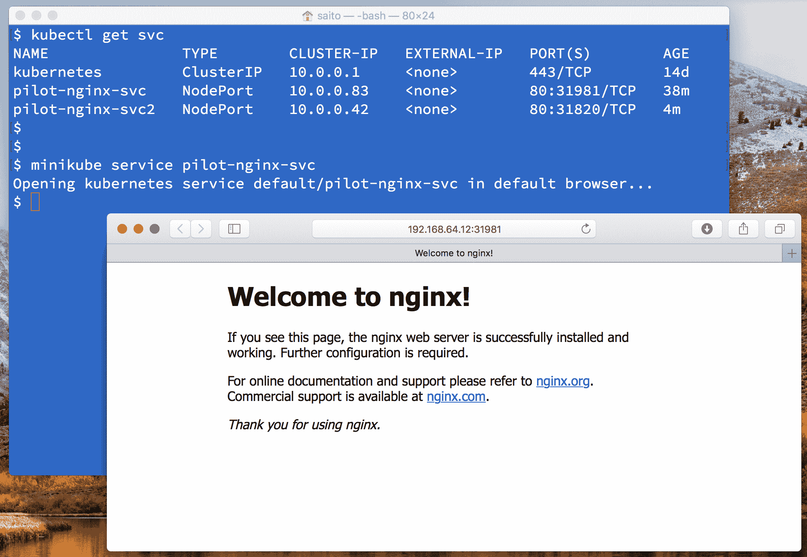访问在 minikube 上运行的 Service

# 使用基于集合的选择器将 Deployment 链接到 ReplicaSet

Deployment 不仅支持基于相等性的选择器，还支持基于集合的选择器，以指定 `ReplicaSet`。为此，您可以编写 `spec.selector.matchExpressions[]` 来指定键和 `in`/`notin` 运算符。例如，如果您想要指定 `project in (poc), environment in (staging), tier notn (backend,cache)`，那么 `matchExpressions` 将如下所示：

```
$ cat deploy_set_selector.yaml 
apiVersion: apps/v1
kind: Deployment
metadata:
  name: my-nginx
spec:
  replicas: 3
 selector:
 matchExpressions:
 - {key: project, operator: In, values: [poc]}
 - {key: environment, operator: In, values: [staging]}
 - {key: tier, operator: NotIn, values: [backend,cache]}
  template:
    metadata:
      labels:
        project: poc
        environment: staging
        tier: frontend
    spec:
      containers:
      - name: my-nginx
        image: nginx
        ports:
        - containerPort: 80
```

正如您所看到的，YAML 数组表示为 `*-*`，映射对象表示为 `{}`，以指定键、运算符和值。请注意，值也将是一个数组，因此使用方括号 `[]` 来指定一个或多个值。

您需要注意的一件事是一个标签，称为 `pod-template-hash` 标签，它是由 Deployment 创建的。当您创建一个 Deployment 时，它还将创建一个 `ReplicaSet` 对象。此时，Deployment 还将分配 `pod-template-hash` 标签给 `ReplicaSet`。让我们看看它是如何工作的：

```
$ kubectl create -f deploy_set_selector.yaml
deployment.apps "my-nginx" created

$ kubectl get rs
NAME  DESIRED  CURRENT  READY  AGE my-nginx2-764d7cfff  3  3  3  19s

$ kubectl describe rs my-nginx2-764d7cfff
Name:  my-nginx2-764d7cfff Namespace:  default Selector:  environment in (staging),pod-template-hash=320837999,project in (poc),tier notin (backend,cache) ...
...
Pod Template:
 Labels:  environment=staging **pod-template-hash=320837999** project=poc tier=frontend
...
...
```

正如您所看到的，`ReplicaSet` `my-nginx2-764d7cfff` 具有基于相等性的选择器，因为 `pod-template-hash=320837999` 被附加到选择器和 Pod 模板中。它将用于使用特定哈希函数生成 `ReplicaSet` 和 Pod 名称（例如，`my-nginx2-764d7cfff`）。

# 另请参阅

在本节中，您了解到为您的 Kubernetes 对象分配标签是多么灵活。此外，基于相等性和基于集合的选择器允许我们通过标签来过滤对象。选择器很重要，它可以松散地耦合对象，比如 Service 和 ReplicaSet/Pod，以及 Deployment 和 ReplicaSet。

以下部分还将使用标签和选择器的概念来利用容器管理：

+   *在*第三章, 与容器一起玩*中的*更新实时容器*部分

+   *在*第七章, 在 GCP 上构建 Kubernetes*中的*管理 GKE 上的 Kubernetes 集群*部分
