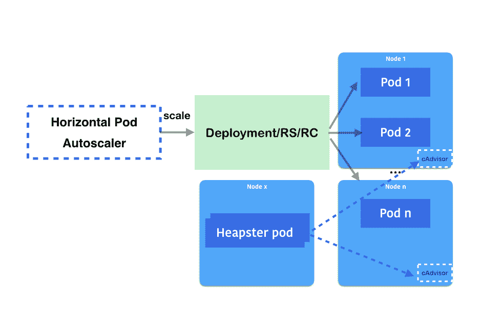
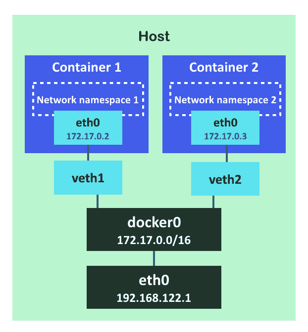
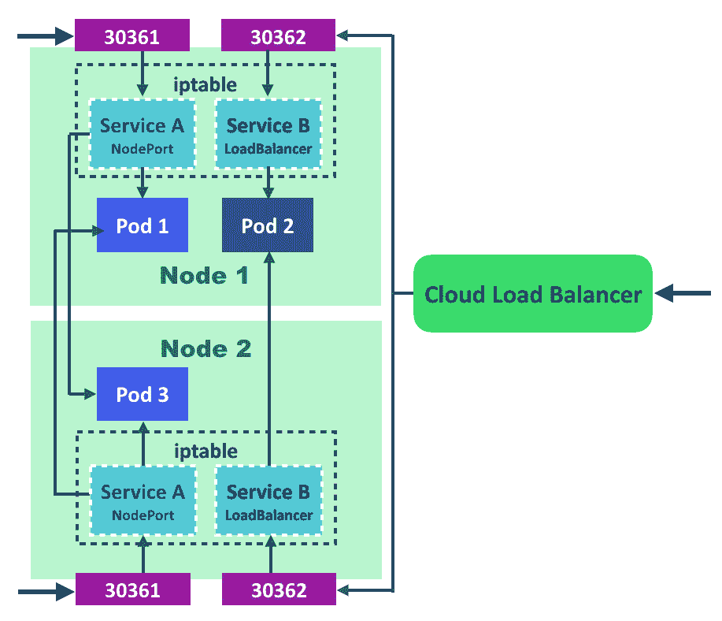
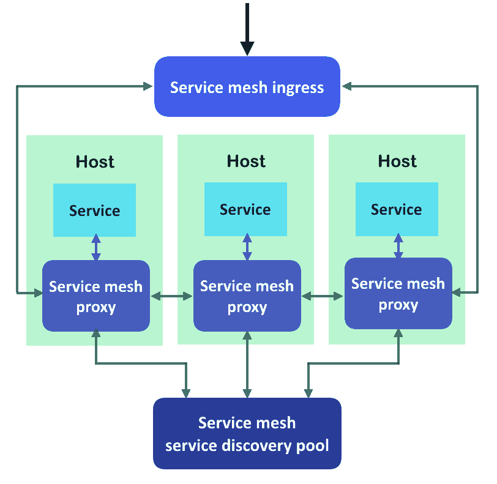
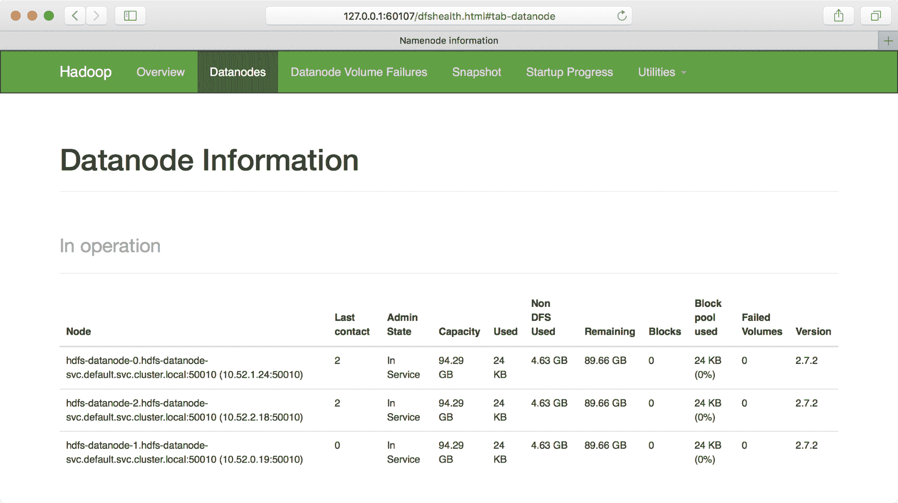
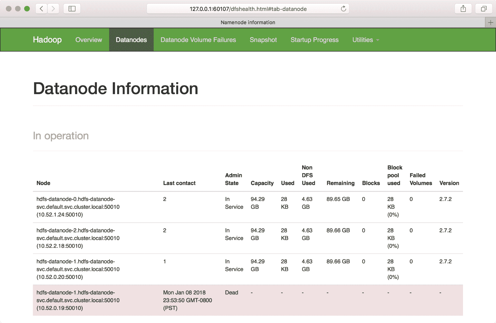
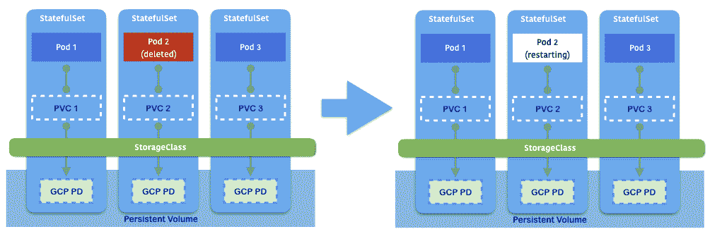
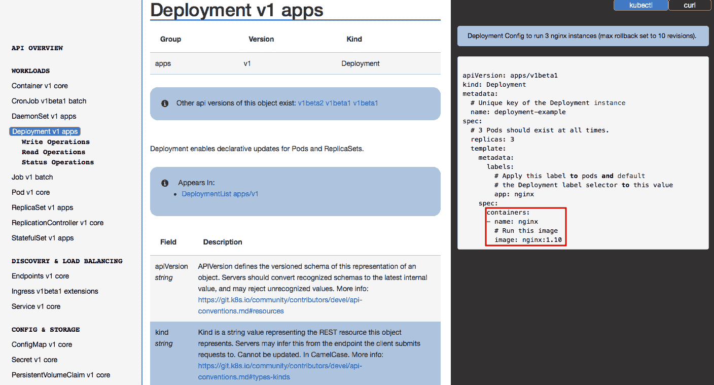
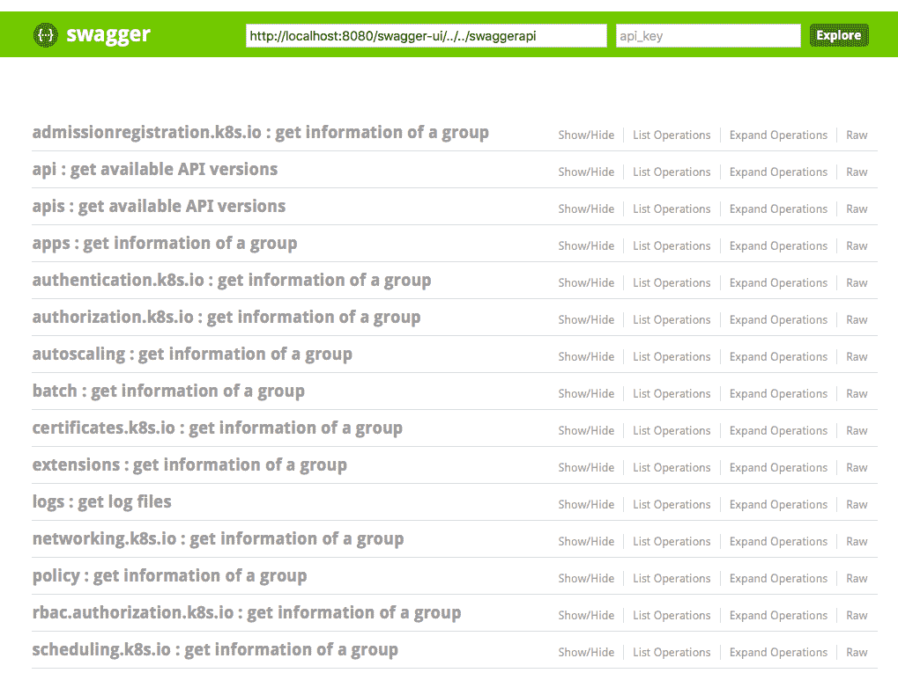

# 第三章：玩转容器

在本章中，我们将涵盖以下主题：

+   扩展您的容器

+   更新实时容器

+   转发容器端口

+   确保灵活使用您的容器

+   在 Kubernetes 上提交作业

+   使用配置文件

# 介绍

在谈论容器管理时，您需要了解与应用程序包管理（如`rpm`/`dpkg`）相比的一些差异，因为您可以在同一台机器上运行多个容器。您还需要关心网络端口冲突。本章介绍了如何使用 Kubernetes 更新、扩展和启动容器应用程序。

# 扩展您的容器

根据预定义的标准扩展和缩小应用程序或服务的规模是利用最有效的计算资源的常见方式。在 Kubernetes 中，您可以手动扩展和缩小，也可以使用**水平 Pod 自动缩放器**（**HPA**）进行自动缩放。在本节中，我们将描述如何执行这两个操作。

# 做好准备

准备以下 YAML 文件，这是一个简单的部署，启动了两个`nginx`容器。还有一个暴露了 TCP-`30080`的 NodePort 服务：

```
# cat 3-1-1_deployment.yaml
apiVersion: apps/v1
kind: Deployment
metadata:
  name: my-nginx
spec:
  replicas: 2
  selector:
    matchLabels:
      service : nginx
  template:
    metadata:
      labels:
        service : nginx
    spec:
      containers:
        - name: my-container
          image: nginx
---
apiVersion: v1
kind: Service
metadata:
  name: my-nginx
spec:
  ports:
    - protocol: TCP
      port: 80
      nodePort: 30080
  type: NodePort
  selector:
    service: nginx
```

`NodePort`将绑定到所有 Kubernetes 节点（端口范围：`30000`到`32767`）；因此，请确保`NodePort`没有被其他进程使用。

让我们使用`kubectl`来创建前面配置文件使用的资源：

```
// create deployment and service
# kubectl create -f 3-1-1_deployment.yaml
deployment "my-nginx" created
service "my-nginx" created
```

几秒钟后，我们应该看到`pods`已经被调度并正在运行：

```
# kubectl get pods
NAME READY STATUS RESTARTS AGE
my-nginx-6484b5fc4c-9v7dc 1/1 Running 0 7s
my-nginx-6484b5fc4c-krd7p 1/1 Running 0 7s
```

服务也已经启动：

```
# kubectl get services
NAME TYPE CLUSTER-IP EXTERNAL-IP PORT(S) AGE
kubernetes ClusterIP 10.96.0.1 <none> 443/TCP 20d
my-nginx NodePort 10.105.9.153 <none> 80:30080/TCP 59s
```

# 如何做...

假设我们的服务预计在某个时间会有流量激增。作为 DevOps，您可能希望手动扩展它，并在高峰时间之后缩小它。在 Kubernetes 中，我们可以使用`kubectl scale`命令来做到这一点。或者，我们可以利用 HPA 根据计算资源条件或自定义指标自动扩展和缩小。

让我们看看如何在 Kubernetes 中手动和自动执行。

# 使用 kubectl scale 命令手动扩展和缩小规模

假设今天我们想要将我们的`nginx` Pod 从两个扩展到四个：

```
// kubectl scale --replicas=<expected_replica_num> deployment <deployment_name>
# kubectl scale --replicas=4 deployment my-nginx
deployment "my-nginx" scaled
```

让我们检查一下现在有多少`pods`：

```
# kubectl get pods
NAME READY STATUS RESTARTS AGE
my-nginx-6484b5fc4c-9v7dc 1/1 Running 0 1m
my-nginx-6484b5fc4c-krd7p 1/1 Running 0 1m
my-nginx-6484b5fc4c-nsvzt 0/1 ContainerCreating 0 2s
my-nginx-6484b5fc4c-v68dr 1/1 Running 0 2s
```

我们可能会发现另外两个 Pod 已经被调度。一个已经在运行，另一个正在创建。如果我们有足够的计算资源，最终我们将有四个 Pod 正在运行。

Kubectl scale（也支持 kubectl autoscale！）也支持**复制控制器**（**RC**）和**副本集**（**RS**）。但是，部署是部署 Pod 的推荐方式。

我们也可以使用相同的`kubectl`命令进行缩减，只需将`replicas`参数设置为较低：

```
// kubectl scale –replicas=<expected_replica_num> deployment <deployment_name>
# kubectl scale --replicas=2 deployment my-nginx
deployment "my-nginx" scaled
```

现在，我们将看到两个 Pod 被安排终止：

```
# kubectl get pods
NAME READY STATUS RESTARTS AGE
my-nginx-6484b5fc4c-9v7dc 1/1 Running 0 1m
my-nginx-6484b5fc4c-krd7p 1/1 Running 0 1m
my-nginx-6484b5fc4c-nsvzt 0/1 Terminating 0 23s
my-nginx-6484b5fc4c-v68dr 0/1 Terminating 0 23s
```

有一个选项，`--current-replicas`，它指定了预期的当前副本。如果不匹配，Kubernetes 不会执行如下的扩展功能：

```
// adding –-current-replicas to precheck the condistion for scaling.
# kubectl scale --current-replicas=3 --replicas=4 deployment my-nginx
error: Expected replicas to be 3, was 2
```

# 水平 Pod 自动缩放（HPA）

HPA 定期查询指标的来源，并根据其获取的指标确定是否需要由控制器进行扩展。可以获取两种类型的指标；一种是来自 Heapster（[`github.com/kubernetes/heapster`](https://github.com/kubernetes/heapster)），另一种是来自 RESTful 客户端访问。在下面的示例中，我们将向您展示如何使用 Heapster 来监视 Pod 并将指标暴露给 HPA。

首先，Heapster 必须部署在集群中：

如果您正在运行 minikube，请使用`minikube addons enable heapster`命令在您的集群中启用 heapster。请注意，`minikube logs | grep heapster command`也可以用来检查 heapster 的日志。

```
// at the time we're writing this book, the latest configuration file of heapster in kops is 1.7.0\. Check out https://github.com/kubernetes/kops/tree/master/addons/monitoring-standalone for the latest version when you use it. 
# kubectl create -f https://raw.githubusercontent.com/kubernetes/kops/master/addons/monitoring-standalone/v1.7.0.yaml
deployment "heapster" created
service "heapster" created
serviceaccount "heapster" created
clusterrolebinding "heapster" created
rolebinding "heapster-binding" created
```

检查`heapster` `pods`是否正在运行：

```
# kubectl get pods --all-namespaces | grep heapster
kube-system heapster-56d577b559-dnjvn 2/2 Running 0 26m
kube-system heapster-v1.4.3-6947497b4-jrczl 3/3 Running 0 5d
```

假设我们在*准备就绪*部分之后继续，我们将在我们的集群中运行两个`my-nginx` Pod：

```
# kubectl get pods
NAME READY STATUS RESTARTS AGE
my-nginx-6484b5fc4c-9v7dc 1/1 Running 0 40m
my-nginx-6484b5fc4c-krd7p 1/1 Running 0 40m
```

然后，我们可以使用`kubectl autoscale`命令来部署 HPA：

```
# kubectl autoscale deployment my-nginx --cpu-percent=50 --min=2 --max=5 
deployment "my-nginx" autoscaled 
# cat 3-1-2_hpa.yaml
apiVersion: autoscaling/v1
kind: HorizontalPodAutoscaler
metadata:
  name: my-nginx
spec:
  scaleTargetRef:
    kind: Deployment
    name: my-nginx
  minReplicas: 2
  maxReplicas: 5
  targetCPUUtilizationPercentage: 50
```

检查它是否按预期运行：

```
// check horizontal pod autoscaler (HPA)
# kubectl get hpa
NAME REFERENCE TARGETS MINPODS MAXPODS REPLICAS AGE
my-nginx Deployment/my-nginx <unknown> / 50% 2 5 0 3s
```

我们发现目标显示为未知，副本为 0。为什么会这样？它以默认间隔 30 秒的控制循环运行。在它反映真实指标之前可能会有延迟。

HPA 的默认同步周期可以通过更改控制管理器中的以下参数来改变：`--horizontal-pod-autoscaler-sync-period`。

等待几秒钟后，我们将发现当前指标现在已经存在。在目标列中显示的数字表示（`current / target`）。这意味着负载当前为`0%`，扩展目标为`50%`：

```
# kubectl get hpa
NAME REFERENCE TARGETS MINPODS MAXPODS REPLICAS AGE
my-nginx Deployment/my-nginx 0% / 50% 2 5 2 48m

// check details of a hpa
# kubectl describe hpa my-nginx
Name: my-nginx
Namespace: default
Labels: <none>
Annotations: <none>
CreationTimestamp: Mon, 15 Jan 2018 22:48:28 -0500
Reference: Deployment/my-nginx
Metrics: ( current / target )
  resource cpu on pods (as a percentage of request): 0% (0) / 50%
Min replicas: 2
Max replicas: 5
```

为了测试 HPA 是否可以正确地扩展 Pod，我们将手动为`my-nginx`服务生成一些负载：

```
// generate the load
# kubectl run -it --rm --restart=Never <pod_name> --image=busybox -- sh -c "while true; do wget -O - -q http://my-nginx; done"
```

在上述命令中，我们运行了一个`busybox`镜像，这使我们能够在其上运行一个简单的命令。我们使用`-c`参数来指定默认命令，这是一个无限循环，用于查询`my-nginx`服务。

大约一分钟后，您可以看到当前值正在改变：

```
// check current value – it's 43% now. not exceeding scaling condition yet.
# kubectl get hpa
NAME REFERENCE TARGETS MINPODS MAXPODS REPLICAS AGE
my-nginx Deployment/my-nginx 43% / 50% 2 5 2 56m
```

使用相同的命令，我们可以重复使用不同的 Pod 名称运行更多负载。最后，我们看到条件已经满足。它正在扩展到`3`个副本，之后再扩展到`4`个副本：

```
# kubectl get hpa
NAME REFERENCE TARGETS MINPODS MAXPODS REPLICAS AGE
my-nginx Deployment/my-nginx 73% / 50% 2 5 3 1h

# kubectl get hpa
NAME REFERENCE TARGETS MINPODS MAXPODS REPLICAS AGE
my-nginx Deployment/my-nginx 87% / 50% 2 5 4 15m
Keeping observing it and deleting some busybox we deployed. It will eventually cool down and scale down without manual operation involved.
# kubectl get hpa
NAME REFERENCE TARGETS MINPODS MAXPODS REPLICAS AGE
my-nginx Deployment/my-nginx 40% / 50% 2 5 2 27m
```

我们可以看到，HPA 刚刚将我们的 Pod 从`4`扩展到`2`。

# 它是如何工作的... 

请注意，cAdvisor 充当容器资源利用监控服务，运行在每个节点的 kubelet 内。我们刚刚监控的 CPU 利用率是由 cAdvisor 收集并由 Heapster 聚合的。Heapster 是在集群中运行的监视和聚合指标的服务。它从每个 cAdvisor 查询指标。当 HPA 部署时，控制器将继续观察由 Heapster 报告的指标，并相应地扩展和缩小。该过程的示意图如下：

基于指定的指标，HPA 确定是否需要扩展

# 还有更多...

或者，您可以使用自定义指标，例如 Pod 指标或对象指标，来确定是时候扩展还是缩小规模。Kubernetes 还支持多个指标。HPA 将依次考虑每个指标。请查看[`kubernetes.io/docs/tasks/run-application/horizontal-pod-autoscale`](https://kubernetes.io/docs/tasks/run-application/horizontal-pod-autoscale)获取更多示例。

# 另请参阅

本配方描述了如何使用部署的扩展选项来更改 Pod 的数量。这对于快速扩展和缩小应用程序非常有用。要了解有关如何更新容器的更多信息，请参考以下配方：

+   *更新实时容器*在第三章，*玩转容器*

+   *确保您的容器的灵活使用*在第三章*，玩转容器*

# 更新实时容器

为了容器的利益，我们可以通过执行最新的镜像轻松发布新程序，并减少环境设置的麻烦。但是，在运行容器上发布程序怎么办？在本地管理容器时，我们必须在启动具有最新镜像和相同配置的新容器之前停止正在运行的容器。在 Kubernetes 系统中，有一些简单而有效的方法来更新您的程序。其中一种称为滚动更新，意味着 Deployment 可以在不影响客户端的情况下更新其 Pod。另一种方法称为*重新创建*，它只是终止所有 Pod，然后创建一个新集合。我们将演示这些解决方案是如何应用在这个配方中。

Docker swarm 中的滚动更新为了实现零停机应用程序更新，在 Docker swarm 中有一个类似的管理功能。在 Docker swarm 中，您可以利用带有`--update-delay`、`--update-parallelism`和`--update-failure-action`标志的 docker service update 命令。有关 Docker swarm 滚动更新的更多详细信息，请查看官方网站：[`docs.docker.com/engine/swarm/swarm-tutorial/rolling-update/`](https://docs.docker.com/engine/swarm/swarm-tutorial/rolling-update/)。

# 准备工作

为了以后的演示，我们将更新`nginx` Pods。请确保所有 Kubernetes 节点和组件都正常工作：

```
// check components
$ kubectl get cs
// check nodes
$ kubectl get node
```

此外，为了更好地理解 ReplicaSet 和部署之间的关系，请查看*第二章*中的*部署 API*部分，深入了解 Kubernetes 概念。

为了说明 Kubernetes 系统中容器的更新，我们将创建一个部署，改变其应用程序的配置，然后检查更新机制如何处理。让我们准备好所有资源：

```
// create a simple nginx Deployment with specified labels
$ kubectl run simple-nginx --image=nginx --port=80 --replicas=5 --labels="project=My-Happy-Web,role=frontend,env=test"
deployment.apps "simple-nginx" created
```

这个部署是用`5`个副本创建的。对我们来说，使用多个 Pod 的更新过程是很好的发现：

```
// expose the Deployment, and named the service "nginx-service"
$ kubectl expose deployment simple-nginx --port=8080 --target-port=80 --name="nginx-service"
service "nginx-service" exposed
// For minikube environment only, since Kubernetes is installed in a VM, add Service type as NodePort for accessing outside the VM.
$ kubectl expose deployment simple-nginx --port=8080 --target-port=80 --name="nginx-service" --type=NodePort service "nginx-service" exposed
```

在部署上附加一个服务将有助于模拟客户端的真实体验。

# 如何做...

首先，通过执行以下代码块来查看您刚刚创建的部署及其 ReplicaSet：

```
$ kubectl describe deployment simple-nginx
Name:                   simple-nginx
Namespace:              default
CreationTimestamp:      Fri, 04 May 2018 12:14:21 -0400
Labels:                 env=test
                        project=My-Happy-Web
                        role=frontend
Annotations:            deployment.kubernetes.io/revision=1
Selector:               env=test,project=My-Happy-Web,role=frontend
Replicas:               5 desired | 5 updated | 5 total | 5 available | 0 unavailable
StrategyType:           RollingUpdate MinReadySeconds:        0
RollingUpdateStrategy:  1 max unavailable, 1 max surge
Pod Template:
  Labels:  env=test
           project=My-Happy-Web
           role=frontend
  Containers:
   simple-nginx:
    Image:        nginx
    Port:         80/TCP
    Environment:  <none>
    Mounts:       <none>
  Volumes:        <none>
Conditions:
  Type           Status  Reason
  ----           ------  ------
  Available      True    MinimumReplicasAvailable
  Progressing    True    NewReplicaSetAvailable
OldReplicaSets:  <none>
NewReplicaSet:   simple-nginx-585f6cddcd (5/5 replicas created)
Events:
  Type    Reason             Age   From                   Message
  ----    ------             ----  ----                   -------
  Normal  ScalingReplicaSet  1h    deployment-controller  Scaled up replica set simple-nginx-585f6cddcd to 5
// rs is the abbreviated resource key of replicaset
$ kubectl get rs
NAME                      DESIRED   CURRENT   READY     AGE
simple-nginx-585f6cddcd   5         5         5         1h
```

根据前面的输出，我们知道部署的默认更新策略是滚动更新。此外，还创建了一个名为`<Deployment Name>-<hex decimal hash>`的单个 ReplicaSet，与部署一起创建。

接下来，为了验证我们的更新，立即检查当前服务端点的内容：

```
// record the cluster IP of Service "nginx-service"
$ export SERVICE_URL=$(kubectl get svc | grep nginx-service | awk '{print $3}'):8080

// For minikube environment only, record the VM host IP and port for the service
$ export SERVICE_URL=$(minikube service nginx-service --url)
$ curl $SERVICE_URL | grep "title"
<title>Welcome to nginx!</title>
```

我们将在 HTML 响应的标题中得到欢迎消息，使用原始的`nginx`镜像。

# 部署更新策略-滚动更新

以下将介绍`edit`和`set`子命令，用于更新部署下的容器：

1.  首先，让我们用一个新命令更新部署中的 Pods：

```
// get into editor mode with the command below
// the flag "--record" is for recording the update
// add the command argument as below and save the change
$ kubectl edit deployment simple-nginx --record
spec:
  replicas: 5
  ...
  template:
    ...
    spec:
      containers:
      - image: nginx
 command:         - sh
 - -c - echo "Happy Programming with Kubernetes!" > /usr/share/nginx/html/index.html && service nginx stop && nginx -g "daemon off;"
        imagePullPolicy: Always
        ...
deployment.extensions "simple-nginx" edited
```

我们不仅在做更新；我们也记录这个改变。使用`--record`标志，我们将命令行作为标签保存在修订中。

1.  编辑部署后，立即使用子命令`rollout`检查滚动更新的状态：

```
// you may see different output on your screen, but definitely has the last line showing update successfully
$ kubectl rollout status deployment simple-nginx
Waiting for rollout to finish: 4 out of 5 new replicas have been updated...
Waiting for rollout to finish: 4 out of 5 new replicas have been updated...
Waiting for rollout to finish: 4 out of 5 new replicas have been updated...
Waiting for rollout to finish: 4 out of 5 new replicas have been updated...
Waiting for rollout to finish: 1 old replicas are pending termination...
Waiting for rollout to finish: 1 old replicas are pending termination...
Waiting for rollout to finish: 1 old replicas are pending termination...
Waiting for rollout to finish: 4 of 5 updated replicas are available...
deployment "simple-nginx" successfully rolled out
```

可能会出现几行`等待...`，如前面的代码所示。它们是标准输出，显示更新的状态。

1.  对于整个更新过程，请检查部署的详细信息以列出其事件：

```
// describe the Deployment again
$ kubectl describe deployment simple-nginx
Name:                   simple-nginx
...
Events:
  Type    Reason             Age   From                   Message
  ----    ------             ----  ----                   -------
  Normal  ScalingReplicaSet  1h    deployment-controller  Scaled up replica set simple-nginx-585f6cddcd to 5
  Normal  ScalingReplicaSet  1h    deployment-controller  Scaled up replica set simple-nginx-694f94f77d to 1
  Normal  ScalingReplicaSet  1h    deployment-controller  Scaled down replica set simple-nginx-585f6cddcd to 4
  Normal  ScalingReplicaSet  1h    deployment-controller  Scaled up replica set simple-nginx-694f94f77d to 2
  Normal  ScalingReplicaSet  1h    deployment-controller  Scaled down replica set simple-nginx-585f6cddcd to 3
  Normal  ScalingReplicaSet  1h    deployment-controller  Scaled up replica set simple-nginx-694f94f77d to 3
  Normal  ScalingReplicaSet  1h    deployment-controller  Scaled down replica set simple-nginx-585f6cddcd to 2
  Normal  ScalingReplicaSet  1h    deployment-controller  Scaled up replica set simple-nginx-694f94f77d to 4
  Normal  ScalingReplicaSet  1h    deployment-controller  Scaled down replica set simple-nginx-585f6cddcd to 
  Normal  ScalingReplicaSet  1h    deployment-controller  Scaled up replica set simple-nginx-694f94f77d to 5
  Normal  ScalingReplicaSet  1h    deployment-controller  (combined from similar events): Scaled down replica set simple-nginx-585f6cddcd to 0
```

如您所见，在部署`simple-nginx`中创建了一个新的`replica set simple-nginx-694f94f77d`。每当新的 ReplicaSet 成功扩展一个 Pod 时，旧的 ReplicaSet 将缩减一个 Pod。扩展过程在新的 ReplicaSet 满足原始期望的 Pod 数量（如所说的`5`个 Pod）并且旧的 ReplicaSet 没有 Pod 时结束。

1.  继续检查这次更新的新 ReplicaSet 和现有的 Service：

```
// look at the new ReplicaSet in detail, you will find it copied the labels of the old one
$ kubectl describe rs simple-nginx-694f94f77d
Name:           simple-nginx-694f94f77d
Namespace:      default
Selector:       env=test,pod-template-hash=2509509338,project=My-Happy-Web,role=frontend Labels:         env=test
                pod-template-hash=2509509338
                project=My-Happy-Web
                role=frontend
...
// send request to the same endpoint of Service.
$ curl $SERVICE_URL
Happy Programming with Kubernetes!
```

1.  让我们进行另一个更新！这次，使用子命令`set`来修改 Pod 的特定配置。

1.  要将新图像设置为部署中某些容器的子命令格式如下：`kubectl set image deployment <Deployment name> <Container name>=<image name>`：

```
// change the image version with the subcommand "set"
// when describing the deployment, we can know that the container name is the same as the name of the Deployment
// record this change as well
$ kubectl set image deployment simple-nginx simple-nginx=nginx:stable --record
deployment.apps "simple-nginx" image updated
```

子命令"set"还可以帮助配置什么？子命令 set 有助于定义应用程序的配置。直到 1.9 版本，具有 set 的 CLI 可以分配或更新以下资源：

| 在设置之后的子命令 | 操作资源 | 更新项目 |
| --- | --- | --- |
| `env` | Pod | 环境变量 |
| `image` | Pod | 容器镜像 |
| `resources` | Pod | 计算资源需求或限制 |
| `selector` | 任何资源 | 选择器 |
| `serviceaccount` | 任何资源 | ServiceAccount |
| `subject` | RoleBinding 或 ClusterRoleBinding | 用户、组或 ServiceAccount |

1.  现在，检查更新是否已完成，以及图像是否已更改：

```
// check update status by rollout
$ kubectl rollout status deployment simple-nginx
...                                            
deployment "simple-nginx" successfully rolled out
// check the image of Pod in simple-nginx
$ kubectl describe deployment simple-nginx
Name:                   simple-nginx
...
Pod Template:
  Labels:  env=test
           project=My-Happy-Web
           role=frontend
  Containers:
   simple-nginx:
    Image:  nginx:stable
    Port:   80/TCP
    Host Port:  0/TCP
...
```

1.  您还可以查看 ReplicaSets。应该有另一个负责部署 Pod 的 ReplicaSet：

```
$ kubectl get rs
NAME                      DESIRED   CURRENT   READY     AGE
simple-nginx-585f6cddcd   0         0         0         1h
simple-nginx-694f94f77d   0         0         0         1h
simple-nginx-b549cc75c    5         5         5         1h
```

# 回滚更新

Kubernetes 系统记录每次部署的更新：

1.  我们可以使用子命令`rollout`列出所有的修订版本：

```
// check the rollout history
$ kubectl rollout history deployment simple-nginx
deployments "simple-nginx"
REVISION  CHANGE-CAUSE
1         <none>
2         kubectl edit deployment simple-nginx --record=true
3         kubectl set image deployment simple-nginx simple-nginx=nginx:stable --record=true
```

您将得到三个修订版本，就像前面的行一样，用于部署`simple-nginx`。对于 Kubernetes 部署，每个修订版本都有一个匹配的`ReplicaSet`，代表运行更新命令的阶段。第一个修订版本是`simple-nginx`的初始状态。尽管没有命令标签来指示，但 Kubernetes 将其创建视为其第一个版本。但是，您仍然可以在创建部署时记录命令。

1.  在子命令`create`或`run`之后添加标志`--record`。

1.  有了修订版，我们可以轻松恢复更改，这意味着回滚更新。使用以下命令回滚到以前的修订版：

```
// let's jump back to initial Deployment!
// with flag --to-revision, we can specify which revision for rollback processing
$ kubectl rollout undo deployment simple-nginx --to-revision=1
deployment.apps "simple-nginx"
// check if the rollback update is finished
$ kubectl rollout status deployment simple-nginx
...                                             
deployment "simple-nginx" successfully rolled out
// take a look at ReplicaSets, you will find that the old ReplicaSet takes charge of the business now
$ kubectl get rs
NAME                      DESIRED   CURRENT   READY     AGE
simple-nginx-585f6cddcd   5         5         5         4h
simple-nginx-694f94f77d   0         0         0         4h
simple-nginx-b549cc75c    0         0         0         3h
// go ahead and check the nginx webpage or the details of Deployment
$ curl $SERVICE_URL
$ kubectl describe deployment simple-nginx
```

1.  不指定修订号，回滚过程将简单地跳回到以前的版本：

```
// just go back to previous status
$ kubectl rollout undo deployment simple-nginx
deployment.apps "simple-nginx"
// look at the ReplicaSets agin, now the latest one takes the job again
$ kubectl get rs
NAME                      DESIRED   CURRENT   READY     AGE
simple-nginx-585f6cddcd   0         0         0         4h
simple-nginx-694f94f77d   0         0         0         4h
simple-nginx-b549cc75c    5         5         5         4h
```

# 部署更新策略 - 重新创建

接下来，我们将介绍另一种部署的更新策略，“重新创建”。虽然没有子命令或标志来创建重新创建策略的部署，但用户可以通过覆盖指定配置的默认元素来实现此创建：

```
// create a new Deployment, and override the update strategy.
$ kubectl run recreate-nginx --image=nginx --port=80 --replicas=5 --overrides='{"apiVersion": "apps/v1", "spec": {"strategy": {"type": "Recreate"}}}'
deployment.apps "recreate-nginx" created
// verify our new Deployment
$ kubectl describe deployment recreate-nginx
Name:               recreate-nginx
Namespace:          default
CreationTimestamp:  Sat, 05 May 2018 18:17:07 -0400
Labels:             run=recreate-nginx
Annotations:        deployment.kubernetes.io/revision=1
Selector:           run=recreate-nginx
Replicas:           5 desired | 5 updated | 5 total | 0 available | 5 unavailable
StrategyType:       Recreate ...
```

在我们的理解中，“重新创建”模式适用于正在开发中的应用程序。使用“重新创建”，Kubernetes 只是将当前的 ReplicaSet 缩减为零个 Pod，并创建一个新的 ReplicaSet，其中包含完整数量的 Pod。因此，“重新创建”比滚动更新具有更短的总更新时间，因为它只是简单地扩展或缩减 ReplicaSets，一次性完成。由于正在开发的部署不需要关注任何用户体验，因此在更新时出现停机是可以接受的，并且可以享受更快的更新：

```
// try to update recreate-strategy Deployment
$ kubectl set image deployment recreate-nginx recreate-nginx=nginx:stable
deployment.apps "recreate-nginx" image updated
// check both the rollout status and the events of Deployment
$ kubectl rollout status deployment recreate-nginx
$ kubectl describe deployment recreate-nginx
...
Events:
  Type    Reason             Age   From                   Message
  ----    ------             ----  ----                   -------
  Normal  ScalingReplicaSet  3h    deployment-controller  Scaled up replica set recreate-nginx-9d5b69986 to 5
  Normal  ScalingReplicaSet  2h    deployment-controller  Scaled down replica set recreate-nginx-9d5b69986 to 0
  Normal  ScalingReplicaSet  2h    deployment-controller  Scaled up replica set recreate-nginx-674d7f9c7f to 5
```

# 它是如何工作的...

滚动更新适用于部署中 ReplicaSet 的单位。其效果是创建一个新的 ReplicaSet 来替换旧的 ReplicaSet。然后，新的 ReplicaSet 正在扩展以满足所需的数量，而旧的 ReplicaSet 正在缩减以终止其中的所有 Pod。新 ReplicaSet 中的 Pod 附加到原始标签。因此，如果任何服务公开此部署，它将直接接管新创建的 Pod。

有经验的 Kubernetes 用户可能知道，资源 ReplicationController 也可以进行滚动更新。那么，滚动更新在 ReplicationController 和部署之间有什么区别？扩展处理使用 ReplicationController 和客户端（如`kubectl`）的组合。将创建一个新的 ReplicationController 来替换以前的 ReplicationController。客户端在进行替换时不会感到任何中断，因为服务位于 ReplicationController 之前。然而，开发人员很难回滚到以前的 ReplicationController（它们已被删除），因为没有记录更新历史的内置机制。

此外，如果在滚动更新工作时客户端连接断开，滚动更新可能会失败。最重要的是，部署与 ReplicaSet 是比 ReplicationController 或独立 ReplicaSet 更推荐的部署资源。

在关注部署更新历史时，请注意它并不总是按顺序列出。添加修订的算法可以澄清为以下要点所示：

+   将最后修订的编号视为*N*

+   当新的滚动更新到来时，它将是*N+1*

+   回滚到特定修订编号*X*，*X*将被移除，它将变为*N+1*

+   回滚到上一个版本，也就是*N-1*，然后*N-1*将被移除，它将变为*N+1*

通过这种修订管理，不会有陈旧和重叠的更新占据滚动历史。

# 还有更多...

考虑部署更新是构建 CI/CD（持续集成和持续交付）流水线的一个良好步骤。对于更常见的用法，开发人员不会利用命令行来更新部署。他们可能更喜欢从 CI/CD 平台发出一些 API 调用，或者从先前的配置文件进行更新。以下是一个使用子命令`apply`的示例：

```
// A simple nginx Kubernetes configuration file
$ cat my-update-nginx.yaml
apiVersion: apps/v1
kind: Deployment
metadata:
  name: my-update-nginx
spec:
  replicas: 5
  selector:
    matchLabels:
      run: simple-nginx
  template:
    metadata:
      labels:
        run: simple-nginx
    spec:
      containers:
      - name: simple-nginx
        image: nginx
        ports:
        - containerPort: 80

// create the Deployment by file and recording the command in the revision tag
$ kubectl create -f my-update-nginx.yaml --record
deployment.apps "my-update-nginx" created
```

作为演示，将容器镜像从`nginx`修改为`nginx:stable`（您可以检查代码包`my-update-nginx-updated.yaml`进行修改）。然后，我们可以使用更改后的文件来使用子命令`apply`进行更新：

```
$ kubectl apply -f my-update-nginx-updated.yaml --record
Warning: kubectl apply should be used on resource created by either kubectl create --save-config or kubectl apply
deployment.apps "my-update-nginx" configured
// check the update revisions and status
$ kubectl rollout history deployment my-update-nginx
deployments "my-update-nginx"
REVISION  CHANGE-CAUSE
1         kubectl create --filename=my-update-nginx.yaml --record=true
2         kubectl apply --filename=my-update-nginx-updated.yaml --record=true
$ kubectl rollout status deployment my-update-nginx
deployment "my-update-nginx" successfully rolled out
```

现在，您可以学习另一种更新部署的方法。

深入研究部署中的滚动更新，我们可能会利用一些参数进行更新：

+   `minReadySeconds`：在 Pod 被视为就绪后，系统仍然会等待一段时间才能进行下一步。这个时间段是最小就绪秒数，在等待应用程序完成后配置时会很有帮助。

+   `maxUnavailable`：在更新期间可以不可用的 Pod 的最大数量。该值可以是百分比（默认为 25%）或整数。如果`maxSurge`的值为`0`，这意味着 Pod 的数量不能超过所需数量，`maxUnavailable`的值不能为`0`。

+   `maxSurge`：在更新期间可以创建的 Pod 的最大数量，超过所需的 ReplicaSet 数量。该值可以是百分比（默认为 25%）或整数。如果`maxUnavailable`的值为`0`，这意味着正在提供的 Pod 的数量应始终满足所需的数量，`maxSurge`的值不能为`0`。

根据代码包中的配置文件`my-update-nginx-advanced.yaml`，尝试自己玩弄这些参数，并看看您是否能感受到这些想法的运作。

# 另请参阅

您可以继续学习以下配方，以了解更多关于有效部署 Kubernetes 资源的想法：

+   扩展您的容器

+   使用配置文件

+   在第五章*，构建持续交付管道*中的*将单片式转换为微服务*、*与 Jenkins 集成*、*使用私有 Docker 注册表*和*设置持续交付管道*配方

# 转发容器端口

在之前的章节中，您已经学会了如何使用 Kubernetes 服务来在内部和外部转发容器端口。现在，是时候更进一步，看看它是如何工作的了。

Kubernetes 中有四种网络模型，我们将在以下部分探讨详细信息：

+   容器到容器的通信

+   Pod 到 Pod 的通信

+   Pod 到服务的通信

+   外部到内部的通信

# 准备就绪

在深入研究 Kubernetes 网络之前，让我们学习 Docker 的网络，以了解基本概念。每个容器都有自己的网络命名空间，具有自己的路由表和路由策略。默认情况下，网络桥`docker0`连接物理网络接口和容器的虚拟网络接口，虚拟网络接口是容器网络命名空间和主机之间的双向电缆。因此，对于单个容器，存在一对虚拟网络接口：容器上的以太网接口（**eth0**）和主机上的虚拟以太网接口（**veth-**）。

网络结构可以用以下图像表示：

主机上的容器网络接口什么是网络命名空间？网络命名空间是 Linux 内核提供的技术。有了这个功能，操作系统可以通过将网络功能分离为独立的资源来实现网络虚拟化。每个网络命名空间都有自己的 iptables 设置和网络设备。

# 如何做...

一个 Pod 包含一个或多个容器，它们在同一主机上运行。每个 Pod 在覆盖网络上都有自己的 IP 地址；Pod 内的所有容器都将彼此视为同一主机上的容器。Pod 内的容器将几乎同时创建、部署和删除。我们将阐述容器、Pod 和服务之间的四种通信模型。

# 容器到容器的通信

在这种情况下，我们将关注单个 Pod 内容器之间的通信：

1.  让我们在一个 Pod 中创建两个容器：一个是 nginx web 应用程序，另一个是 CentOS，它会检查本地主机上的端口`80`：

```
// configuration file of creating two containers within a pod
$ cat two-container-pod.yaml
apiVersion: v1
kind: Pod
metadata:
  name: two-container
spec:
  containers:
    - name: web
      image: nginx
      ports:
        - containerPort: 80
          hostPort: 80
    - name: centos
      image: centos
      command: ["/bin/sh", "-c", "while : ;do curl http://localhost:80/; sleep 30; done"]

// create the pod
$ kubectl create -f two-container-pod.yaml
pod "two-container" created
// check the status of the newly-created Pod
$ kubectl get pod two-container
NAME            READY     STATUS    RESTARTS   AGE
two-container   2/2       Running   0          5s
```

我们看到`READY`列中的计数变为`2/2`，因为这个 Pod 中有两个容器。

1.  使用`kubectl describe`命令，我们可以查看 Pod 的详细信息：

```
$ kubectl describe pod two-container
Name:         two-container
Namespace:    default
Node:         ubuntu02/192.168.122.102
Start Time:   Sat, 05 May 2018 18:28:22 -0400
Labels:       <none>
Annotations:  <none>
Status:       Running
IP:           192.168.79.198 Containers:
  web:
    Container ID:   docker://e832d294f176f643d604445096439d485d94780faf60eab7ae5d3849cbf15d75
...
  centos:
    Container ID:  docker://9e35275934c1acdcfac4017963dc046f9517a8c1fc972df56ca37e69d7389a72
...
```

我们可以看到 Pod 运行在节点`ubuntu02`上，它的 IP 是`192.168.79.198`。

1.  此外，我们可能会发现 Centos 容器可以访问本地的`nginx`：

```
$ kubectl logs two-container centos | grep "title"
<title>Welcome to nginx!</title>
...
```

1.  让我们登录到节点`ubuntu02`，检查这两个容器的网络设置：

```
// list containers of the Pod
$ docker ps | grep "two-container"
9e35275934c1        centos                                      "/bin/sh -c 'while..."   11 hours ago        Up 11 hours                             k8s_centos_two-container_default_113e727f-f440-11e7-ac3f-525400a9d353_0
e832d294f176        nginx                                       "nginx -g 'daemon ..."   11 hours ago        Up 11 hours                             k8s_web_two-container_default_113e727f-f440-11e7-ac3f-525400a9d353_0
9b3e9caf5149        gcr.io/google_containers/pause-amd64:3.1    "/pause"                 11 hours ago        Up 11 hours                             k8s_POD_two-container_default_113e727f-f440-11e7-ac3f-525400a9d353_0
```

现在，我们知道创建的两个容器分别是`9e35275934c1`和`e832d294f176`。另一方面，还有另一个容器`9b3e9caf5149`，由 Kubernetes 使用 Docker 镜像`gcr.io/google_containers/pause-amd64`创建。我们稍后会介绍它。之后，我们可以使用`docker inspect`命令对容器进行详细检查，并通过添加`jq`命令([`stedolan.github.io/jq/`](https://stedolan.github.io/jq/))作为管道，来解析输出信息以仅显示网络设置。

1.  看看在同一个 Pod 中覆盖的两个容器：

```
// inspect the nginx container, and use jq to parse it
$ docker inspect e832d294f176 | jq '.[]| {NetworkMode: .HostConfig.NetworkMode, NetworkSettings: .NetworkSettings}'
{
  "NetworkMode": "container:9b3e9caf5149ffb0ec14c1ffc36f94b2dd55b223d0d20e4d48c4e33228103723",
  "NetworkSettings": {
    "Bridge": "",
    "SandboxID": "",
    "HairpinMode": false,
    "LinkLocalIPv6Address": "",
    "LinkLocalIPv6PrefixLen": 0,
    "Ports": {},
    "SandboxKey": "",
    "SecondaryIPAddresses": null,
    "SecondaryIPv6Addresses": null,
    "EndpointID": "",
    "Gateway": "",
    "GlobalIPv6Address": "",
    "GlobalIPv6PrefixLen": 0,
    "IPAddress": "",
    "IPPrefixLen": 0,
    "IPv6Gateway": "",
    "MacAddress": "",
    "Networks": {}
  }
}
// then inspect the centos one
$ docker inspect 9e35275934c1 | jq '.[]| {NetworkMode: .HostConfig.NetworkMode, NetworkSettings: .NetworkSettings}'
{
  "NetworkMode": "container:9b3e9caf5149ffb0ec14c1ffc36f94b2dd55b223d0d20e4d48c4e33228103723",
...
```

我们可以看到两个容器具有相同的网络设置；网络模式设置为映射容器模式，其他配置被清除。网络桥接容器是`container:9b3e9caf5149ffb0ec14c1ffc36f94b2dd55b223d0d20e4d48c4e33228103723`。这个容器是什么？它是由 Kubernetes 创建的，容器 ID 是`9b3e9caf5149`，使用的镜像是`gcr.io/google_containers/pause-amd64`。

"pause"容器是做什么的？正如其名字所暗示的，这个容器除了“暂停”之外什么也不做。然而，它保留了网络设置和 Linux 网络命名空间，供 Pod 使用。每当容器关闭和重新启动时，网络配置仍然保持不变，无需重新创建，因为“pause”容器保存了它。您可以在 [`github.com/kubernetes/kubernetes/tree/master/build/pause`](https://github.com/kubernetes/kubernetes/tree/master/build/pause) 查看它的代码和 Dockerfile 以获取更多信息。

“pause”容器是一个网络容器，当 Pod 创建时会被创建。

它被创建并用于处理 Pod 网络的路由。然后，两个容器将与 pause 共享网络命名空间；这就是为什么它们将彼此视为本地主机。

在 Docker 中创建网络容器在 Docker 中，您可以轻松地将一个容器变成一个网络容器，与另一个容器共享其网络命名空间。使用命令行：`$ docker run --network=container:<CONTAINER_ID or CONTAINER_NAME> [other options].`然后，您将能够启动一个使用分配的容器的网络命名空间的容器。

# Pod 与 Pod 之间的通信

正如前面提到的，Pod 中的容器共享相同的网络命名空间。Pod 是 Kubernetes 中的基本计算单元。Kubernetes 为 Pod 在其世界中分配一个 IP。每个 Pod 都可以在 Kubernetes 网络中使用虚拟 IP 看到其他 Pod。在谈论 Pod 之间的通信时，我们可以分为两种情况：在节点内部通信的 Pod，或者在节点之间通信的 Pod。对于单个节点中的 Pod，由于它们有单独的 IP，它们的传输可以通过桥接来实现，就像 Docker 节点中的容器一样。然而，对于跨节点之间的 Pod 通信，当 Pod 没有主机信息（主机 IP）时，数据包的路由工作将如何进行？

Kubernetes 使用 CNI 来处理集群网络。CNI 是一个用于管理连接容器的框架，用于为容器分配或删除网络资源。虽然 Kubernetes 将 CNI 作为插件，用户可以根据需要选择 CNI 的实现。通常有以下类型的 CNI：

+   **覆盖**：使用数据封装技术。每个数据都包装有主机 IP，因此可以在互联网中进行路由。一个例子是 flannel ([`github.com/coreos/flannel`](https://github.com/coreos/flannel))。

+   **L3 网关**：容器之间的传输首先经过网关节点。网关将维护路由表，将容器子网和主机 IP 进行映射。一个例子是 Project Calico ([`www.projectcalico.org/`](https://www.projectcalico.org/))。

+   **L2 邻接**：发生在 L2 交换上。在以太网中，如果数据包可以直接从源传输到目的地，而不经过其他节点，则两个节点具有邻接性。一个例子是 Cisco ACI ([`www.cisco.com/c/en/us/td/docs/switches/datacenter/aci/apic/sw/kb/b_Kubernetes_Integration_with_ACI.html`](https://www.cisco.com/c/en/us/td/docs/switches/datacenter/aci/apic/sw/kb/b_Kubernetes_Integration_with_ACI.html))。

每种类型的 CNI 都有优缺点。前一种类型在可扩展性方面更好，但性能较差，而后一种类型的延迟较短，但需要复杂和定制的设置。一些 CNI 以不同模式覆盖了所有三种类型，例如 Contiv（[`github.com/contiv/netplugin`](https://github.com/contiv/netplugin)）。您可以在[`github.com/containernetworking/cni`](https://github.com/containernetworking/cni)上检查其规范以获取有关 CNI 的更多信息。此外，查看 Kubernetes 官方网站上的 CNI 列表，以尝试这些 CNI：[`kubernetes.io/docs/concepts/cluster-administration/networking/#how-to-achieve-this`](https://kubernetes.io/docs/concepts/cluster-administration/networking/#how-to-achieve-this)。

在介绍了 Pod 之间的数据包传输的基本知识后，我们将继续为您带来一个 Kubernetes API，即`NetworkPolicy`，它提供了 Pod 之间通信的高级管理。

# 使用 NetworkPolicy

作为 Kubernetes 的资源，NetworkPolicy 使用标签选择器来配置 Pod 的基础级别防火墙。没有指定的 NetworkPolicy，同一集群中的任何 Pod 默认情况下都可以相互通信。另一方面，一旦将具有规则的 NetworkPolicy 附加到 Pod，无论是入口还是出口，或者两者都是如此，所有不遵循规则的流量都将被阻止。

在演示如何构建 NetworkPolicy 之前，我们应该确保 Kubernetes 集群中的网络插件支持它。有几种 CNI 支持 NetworkPolicy：Calico、Contive、Romana（[`github.com/romana/kube`](https://github.com/romana/kube)）、Weave Net（[`github.com/weaveworks/weave`](https://github.com/weaveworks/weave)）、Trireme（[`github.com/aporeto-inc/trireme-kubernetes`](https://github.com/aporeto-inc/trireme-kubernetes)）等。

在 minikube 中将 CNI 与 NetworkPolicy 支持作为网络插件启用。在 minikube 上工作时，用户不需要专门附加 CNI，因为它被设计为单个本地 Kubernetes 节点。但是，为了启用 NetworkPolicy 的功能，有必要启动一个支持 NetworkPolicy 的 CNI。请注意，当您配置 minikube 与 CNI 时，配置选项和流程可能与各种 CNI 实现大不相同。以下步骤向您展示了如何使用 CNI Calico 启动 minikube：

1.  我们将这个问题[`github.com/projectcalico/calico/issues/1013#issuecomment-325689943`](https://github.com/projectcalico/calico/issues/1013#issuecomment-325689943)作为这些构建步骤的参考。

1.  这里使用的 minikube 是最新版本 0.24.1。

1.  重新启动您的 minikube：`minikube start --network-plugin=cni \` `--host-only-cidr 172.17.17.1/24 \ --extra-config=kubelet.PodCIDR=192.168.0.0/16 \ --extra-config=proxy.ClusterCIDR=192.168.0.0/16 \` `--extra-config=controller-manager.ClusterCIDR=192.168.0.0/16`。

1.  使用代码包中的配置文件"minikube-calico.yaml"创建 Calico `kubectl create -f minikue-calico.yaml`。

为了说明 NetworkPolicy 的功能，我们将创建一个 Pod 并将其公开为服务，然后在 Pod 上附加一个 NetworkPolicy 来查看发生了什么：

```
// start a pod of our favourite example, nginx
$ kubectl run nginx-pod --image=nginx --port=80 --restart=Never
pod "nginx-pod" created
//expose the pod as a service listening on port 8080
$ kubectl expose pod nginx-pod --port=8080 --target-port=80
service "nginx-pod" exposed
// check the service IP
$ kubectl get svc
NAME         TYPE        CLUSTER-IP       EXTERNAL-IP   PORT(S)    AGE
kubernetes   ClusterIP   10.96.0.1        <none>        443/TCP    1h
nginx-pod    ClusterIP   10.102.153.182   <none>        8080/TCP   1m
```

现在，我们可以继续并使用`wget`命令和`--spider`标志从一个简单的部署`busybox`检查 Pod 的连接，以验证端点的存在。

```
// check the accessibility of the service
// create busybox and open standard input and independent terminal by flag "i" and "t", similar to docker command
$ kubectl run busybox -it --image=busybox /bin/sh
If you don't see a command prompt, try pressing enter.
/ # wget --spider 10.102.153.182:8080
Connecting to 10.102.153.182:8080 (10.102.153.182:8080)
```

如前面的结果所示，我们知道`nginx`服务可以在没有任何限制的情况下访问。稍后，让我们运行一个`NetworkPolicy`，限制只有标记为`<test: inbound>`的 Pod 可以访问`nginx`服务：

```
// a configuration file defining NetworkPolicy of pod nginx-pod
$ cat networkpolicy.yaml
kind: NetworkPolicy
apiVersion: networking.k8s.io/v1
metadata:
  name: nginx-networkpolicy
spec:
  podSelector:
    matchLabels:
      run: nginx-pod
  ingress:
    - from:
      - podSelector:
          matchLabels:
            test: inbound
```

正如您所看到的，在 NeworkPolicy 的规范中，它被配置为应用于具有标签`<run: nginx-pod>`的 Pod，这是我们在`pod nginx-pod`上拥有的标签。此外，策略中附加了一个入口规则，表明只有具有特定标签的 Pod 才能访问`nginx-pod`：

```
// create the NetworkPolicy
$ kubectl create -f networkpolicy.yaml
networkpolicy.networking.k8s.io "nginx-networkpolicy" created
// check the details of NetworkPolicy
$ kubectl describe networkpolicy nginx-networkpolicy
Name:         nginx-networkpolicy
Namespace:    default
Created on:   2018-05-05 18:36:56 -0400 EDT
Labels:       <none>
Annotations:  <none>
Spec:
  PodSelector:     run=nginx-pod
  Allowing ingress traffic:
    To Port: <any> (traffic allowed to all ports)
    From PodSelector: test=inbound
  Allowing egress traffic:
    <none> (Selected pods are isolated for egress connectivity)
  Policy Types: Ingress
```

很好，一切看起来都和我们预期的一样。接下来，检查我们之前的`busybox` Pod 上的相同服务端点：

```
// if you turned off the terminal, resume it with the subcommand attach
$ kubectl attach busybox-598b87455b-s2mfq -c busybox -i -t
// we add flag to specify timeout interval, otherwise it will just keep hanging on wget
/ # wget --spider 10.102.153.182:8080 --timeout=3
wget: download timed out
```

再次如预期，现在在 NetworkPolicy 附加后我们无法访问`nginx-pod`服务。`nginx-pod`只能被标记为`<test: inbound>`的 Pod 访问：

```
// verify the connection by yourself with new busybox
$ kubectl run busybox-labelled --labels="test=inbound" -it --image=busybox /bin/sh
```

在第二章的*使用标签和选择器*中，了解标签和选择器的概念。

在这种情况下，您已经学会了如何通过 Pod 选择器创建具有入口限制的 NetworkPolicy。但是，您可能还希望在您的 Pod 上构建其他设置：

+   **出口限制**：出口规则可以通过`.spec.egress`应用，其设置与入口类似。

+   **端口限制**：每个入口和出口规则都可以指出要接受或阻止的端口以及端口协议的类型。端口配置可以通过`.spec.ingress.ports`或`.spec.egress.ports`来应用。

+   **命名空间选择器**：我们还可以对特定的命名空间进行限制。例如，系统守护程序的 Pod 可能只允许访问`kube-system`命名空间中的其他 Pod。命名空间选择器可以通过`.spec.ingress.from.namespaceSelector`或`.spec.egress.to.namespaceSelector`来应用。

+   **IP 块**：更定制化的配置是在某些 CIDR 范围上设置规则，这与我们使用 iptables 的想法类似。我们可以通过`.spec.ingress.from.ipBlock`或`.spec.egress.to.ipBlock`来利用这种配置。

建议查看 API 文档中的更多详细信息：[`kubernetes.io/docs/reference/generated/kubernetes-api/v1.10/#networkpolicyspec-v1-networking`](https://kubernetes.io/docs/reference/generated/kubernetes-api/v1.10/#networkpolicyspec-v1-networking)。此外，我们还想向您展示一些更有趣的设置来满足一般情况：

+   **适用于所有 Pod**：可以通过将`.spec.podSelector`设置为空值，轻松地将 NetworkPolicy 推送到每个 Pod。

+   **允许所有流量**：我们可以通过将`.spec.ingress`分配为空值（空数组）来允许所有传入流量；相应地，可以通过将`.spec.egress`分配为空值来设置无限制的传出流量。

+   **拒绝所有流量**：我们可以通过简单地指定 NetworkPolicy 的类型而不设置任何规则来拒绝所有传入或传出的流量。NetworkPolicy 的类型可以在`.spec.policyTypes`中设置。同时，不要设置`.spec.ingress`或`.spec.egress`。

去检查示例文件`networkpolicy-allow-all.yaml`和`networkpolicy-deny-all.yaml`的代码包。

# Pod 与 Service 之间的通信

在正常情况下，Pod 可能会意外停止。然后，Pod 的 IP 可能会更改。当我们为 Pod 或 Deployment 公开端口时，我们创建一个充当代理或负载均衡器的 Kubernetes 服务。Kubernetes 会创建一个虚拟 IP，该 IP 接收来自客户端的请求，并将流量代理到服务中的 Pod。让我们来看看如何做到这一点：

1.  首先，我们将创建一个 Deployment 并将其公开为一个 Service：

```
$ cat nodeport-deployment.yaml
apiVersion: apps/v1
kind: Deployment
metadata:
  name: nodeport-deploy
spec:
  replicas: 2
  selector:
    matchLabels:
      app: nginx
  template:
    metadata:
      labels:
        app: nginx
    spec:
      containers:
      - name: my-nginx
        image: nginx
---
apiVersion: v1
kind: Service
metadata:
  name: nodeport-svc
spec:
  type: NodePort
  selector:
    app: nginx
  ports:
    - protocol: TCP
      port: 8080
      targetPort: 80
$ kubectl create -f nodeport-deployment.yaml
deployment.apps "nodeport-deploy" created
service "nodeport-svc" created
```

1.  此时，使用子命令`describe`来检查服务的详细信息：

```
$ kubectl describe service nodeport-svc
Name:                     nodeport-svc
Namespace:                default
Labels:                   <none>
Annotations:              <none>
Selector:                 app=nginx
Type:                     NodePort
IP:                       10.101.160.245
Port:                     <unset>  8080/TCP
TargetPort:               80/TCP
NodePort:                 <unset>  30615/TCP
Endpoints:                192.168.80.5:80,192.168.80.6:80
Session Affinity:         None
External Traffic Policy:  Cluster
Events:                   <none>
```

服务的虚拟 IP 是`10.101.160.245`，暴露端口`8080`。然后，服务将流量分发到两个端点`192.168.80.5:80`和`192.168.80.6:80`。此外，由于服务是以`NodePort`类型创建的，客户端可以在每个 Kubernetes 节点上通过`<NODE_IP>:30615`访问此服务。根据我们在第二章中*使用服务*的理解，*深入了解 Kubernetes 概念*，是 Kubernetes 守护程序`kube-proxy`帮助在每个节点上维护和更新路由策略。

1.  继续，在任何 Kubernetes 节点上检查`iptable`。

注意！如果您在 minikube 环境中，您应该使用命令`minikube ssh`跳转到节点。

```
// Take a look at following marked "Chain"
$ sudo iptables -t nat -nL
...
Chain KUBE-NODEPORTS (1 references)
target     prot opt source               destination
KUBE-MARK-MASQ  tcp  --  0.0.0.0/0            0.0.0.0/0            /* default/nodeport-svc: */ tcp dpt:30615
KUBE-SVC-GFPAJ7EGCNM4QF4H  tcp  --  0.0.0.0/0            0.0.0.0/0            /* default/nodeport-svc: */ tcp dpt:30615
...
Chain KUBE-SEP-DIS6NYZTQKZ5ALQS (1 references)
target     prot opt source               destination
KUBE-MARK-MASQ  all  --  192.168.80.6         0.0.0.0/0            /* default/nodeport-svc: */
DNAT       tcp  --  0.0.0.0/0            0.0.0.0/0            /* default/nodeport-svc: */ tcp to:192.168.80.6:80
...
Chain KUBE-SEP-TC6HXYYMMLGUSFNZ (1 references)
target     prot opt source               destination
KUBE-MARK-MASQ  all  --  192.168.80.5         0.0.0.0/0            /* default/nodeport-svc: */
DNAT       tcp  --  0.0.0.0/0            0.0.0.0/0            /* default/nodeport-svc: */ tcp to:192.168.80.5:80
Chain KUBE-SERVICES (2 references)
target     prot opt source               destination
...
KUBE-SVC-GFPAJ7EGCNM4QF4H  tcp  --  0.0.0.0/0            10.101.160.245       /* default/nodeport-svc: cluster IP */ tcp dpt:8080
...
KUBE-NODEPORTS  all  --  0.0.0.0/0            0.0.0.0/0            /* kubernetes service nodeports; NOTE: this must be the last rule in this chain */ ADDRTYPE match dst-type LOCAL
...
Chain KUBE-SVC-GFPAJ7EGCNM4QF4H (2 references)
target     prot opt source               destination
KUBE-SEP-TC6HXYYMMLGUSFNZ  all  --  0.0.0.0/0            0.0.0.0/0            /* default/nodeport-svc: */ statistic mode random probability 0.50000000000
KUBE-SEP-DIS6NYZTQKZ5ALQS  all  --  0.0.0.0/0            0.0.0.0/0            /* default/nodeport-svc: */
...
```

将会显示很多规则。为了专注于与服务`nodeport-svc`相关的策略，请按以下步骤检查它们。您屏幕上的输出可能不会按预期顺序列出：

1.  在带有提到`nodeport-svc`注释的`Chain KUBE-NODEPORTS`下找到目标。一个目标将以前缀`KUBE-SVC-`命名。在前面的输出中，它是名为`KUBE-SVC-GFPAJ7EGCNM4QF4H`的目标。与其他目标`KUBE-MARK-MASQ`一起，它们用于将端口`30615`的流量传递到服务。

1.  在`Chain KUBE-SERVICES`下找到名为`KUBE-SVC-XXX`的特定目标。在这种情况下，它是名为`KUBE-SVC-GFPAJ7EGCNM4QF4H`的目标，规定允许来自“任何地方”的流量到达`nodeport-svc`的端点`10.160.245:8080`。

1.  在特定的`Chain KUBE-SVC-XXX`下找到目标。在这种情况下，它是`Chain KUBE-SVC-GFPAJ7EGCNM4QF4H`。在服务链下，您将根据相应的 Pods 的前缀`KUBE-SEP-`拥有多个目标。在前面的输出中，它们是`KUBE-SEP-TC6HXYYMMLGUSFNZ`和`KUBE-SEP-DIS6NYZTQKZ5ALQS`。

1.  在特定的`Chain KUBE-SEP-YYY`下找到目标。在这种情况下，需要查看的两个链是`Chain KUBE-SEP-TC6HXYYMMLGUSFNZ`和`Chain KUBE-SEP-DIS6NYZTQKZ5ALQS`。它们各自涵盖两个目标，`KUBE-MARK-MASQ`和`DNAT`，用于“任何地方”到 Pod 端点`192.168.80.5:80`或`192.168.80.6:80`的进出流量。

这里的一个关键点是，服务目标`KUBE-SVC-GFPAJ7EGCNM4QF4H`将其集群 IP 暴露给外部世界，将流量分发到链`KUBE-SEP-TC6HXYYMMLGUSFNZ`和`KUBE-SEP-DIS6NYZTQKZ5ALQS`，统计模式为随机概率 0.5。这两个链都有 DNAT 目标，用于改变数据包的目标 IP 为私有子网的 IP，即特定 Pod 的 IP。

# 外部到内部的通信

要在 Kubernetes 中发布应用程序，我们可以利用 Kubernetes 服务，类型为`NodePort`或`LoadBalancer`，或 Kubernetes Ingress。对于 NodePort 服务，如前一节介绍的，节点的端口号将与服务配对。就像下图中所示，节点 1 和节点 2 上的端口`30361`指向服务 A，该服务将流量分发到 Pod1 和一个具有静态概率的 Pod。

负载均衡器服务，正如您可能从第二章*中的*“使用服务”中学到的那样，包括 NodePort 的配置。此外，负载均衡器服务可以与外部负载均衡器一起工作，为用户提供在云基础架构和 Kubernetes 资源之间集成负载平衡程序的功能，例如设置`healthCheckNodePort`和`externalTrafficPolicy`。下图中的**服务 B**是一个负载均衡器服务。在内部，**服务 B**与**服务 A**的工作方式相同，依赖于**iptables**将数据包重定向到 Pod；在外部，云负载均衡器并不了解 Pod 或容器，它只根据节点数量分发流量。无论选择哪个节点来获取请求，它仍然能够将数据包传递给正确的 Pod：

带有 NodePort 和 LoadBalancer 类型的 Kubernetes 服务

# 使用 Ingress

在 Kubernetes 网络的旅程中，用户会了解到每个 Pod 和 Service 都有自己的私有 IP 和相应的端口来监听请求。在实践中，开发人员可以为内部客户端提供服务的端点，即私有 IP 或 Kubernetes DNS 名称；或者，开发人员可以通过 NodePort 或 LoadBalancer 类型将服务外部暴露。虽然 Service 的端点比 Pod 更稳定，但服务是分开提供的，客户端应该记录这些 IP 而没有太多意义。在本节中，我们将介绍`Ingress`，这是一个使您的服务作为一个组工作的资源。更重要的是，我们可以在设置 Ingress 规则以识别不同的 URL 时，轻松地将我们的服务联合打包为一个 API 服务器，然后 Ingress 控制器根据规则将请求传递给特定的服务。

在我们尝试 Kubernetes Ingress 之前，我们应该在集群中创建一个 Ingress 控制器。与`kube-controller-manager`中的其他控制器不同，Ingress 控制器是由自定义实现而不是作为守护程序运行的。在最新的 Kubernetes 版本 1.10 中，nginx Ingress 控制器是最稳定的，通常也支持许多平台。查看部署的官方文档：[`github.com/kubernetes/ingress-nginx/blob/master/README.md`](https://github.com/kubernetes/ingress-nginx/blob/master/README.md)。我们将只在 minikube 上演示我们的示例；请查看以下信息框以设置 Ingress 控制器。

在 minikube 中启用 Ingress 功能 Ingress 在 minikube 中是一个附加功能。按照以下步骤在您的环境中启用此功能：

1.  检查附加功能 ingress 是否已启用：在终端上输入命令`minikube addons list`。如果未启用，表示显示为`ingress: disabled`，则应继续以下步骤。

1.  启用 ingress：输入命令`minikube addons enable ingress`，您将看到类似`ingress was successfully enabled`的输出。

1.  再次检查附加功能列表，以验证上一步是否有效。我们期望字段 ingress 显示为`enabled`。

下面是一个示例，演示如何使用 Ingress。我们将启动两个部署和它们的服务，以及一个额外的 Ingress 将它们公开为一个联合体。首先，我们将在 Kubernetes 主节点的主机文件中添加一个新的主机名。这是我们演示的一个简单方法。如果您在生产环境中工作，一个常见的用例是将主机名作为记录添加到 DNS 服务器中：

```
// add a dummy hostname in local host file
$ sudo sh -c "echo `minikube ip` happy.k8s.io >> /etc/hosts"
```

我们的第一个 Kubernetes 部署和服务将是`echoserver`，一个显示服务器和请求信息的虚拟服务。对于另一对部署和服务，我们将重用上一节中的 NodePort 服务示例：

```
$ cat echoserver.yaml
apiVersion: apps/v1
kind: Deployment
metadata:
  name: echoserver-deploy
spec:
  replicas: 2
  selector:
    matchLabels:
      app: echo
  template:
    metadata:
      labels:
        app: echo
    spec:
      containers:
        - name: my-echo
          image: gcr.io/google_containers/echoserver:1.8
---
apiVersion: v1
kind: Service
metadata:
  name: echoserver-svc
spec:
  selector:
    app: echo
  ports:
    - protocol: TCP
      port: 8080
      targetPort: 8080
```

继续通过配置文件创建这两组资源：

```
$ kubectl create -f echoserver.yaml
deployment.apps "echoserver-deploy" created
service "echoserver-svc" created
$ kubectl create -f nodeport-deployment.yaml
deployment.apps "nodeport-deploy" created
service "nodeport-svc" created
```

我们的第一个 Ingress 使两个服务在不同的 URL `/nginx` 和 `/echoserver` 上监听，主机名为`happy.k8s.io`，这是我们在本地主机文件中添加的虚拟主机名。我们使用注释`rewrite-target`来确保流量重定向从根目录`/`开始。否则，客户端可能因为浏览错误的路径而得到页面未找到的错误。我们可以使用的更多注释列在[`github.com/kubernetes/ingress-nginx/blob/master/docs/user-guide/nginx-configuration/annotations.md`](https://github.com/kubernetes/ingress-nginx/blob/master/docs/user-guide/nginx-configuration/annotations.md)上：

```
$ cat ingress.yaml
apiVersion: extensions/v1beta1
kind: Ingress
metadata:
  name: happy-ingress
  annotations:
 nginx.ingress.kubernetes.io/rewrite-target: spec:
  rules:
    - host: happy.k8s.io
      http:
        paths:
          - path: /nginx
            backend:
              serviceName: nodeport-svc
              servicePort: 8080
          - path: /echoserver
            backend:
              serviceName: echoserver-svc
              servicePort: 8080
```

然后，只需创建 Ingress 并立即检查其信息：

```
$ kubectl create -f ingress.yaml
ingress.extensions "happy-ingress" created
// "ing" is the abbreviation of "ingress"
$ kubectl describe ing happy-ingress
Name:             happy-ingress
Namespace:        default
Address:
Default backend:  default-http-backend:80 (172.17.0.3:8080)
Rules:
  Host          Path  Backends
  ----          ----  --------
  happy.k8s.io
                /nginx        nodeport-svc:8080 (<none>)
                /echoserver   echoserver-svc:8080 (<none>)
Annotations:
  nginx.ingress.kubernetes.io/rewrite-target
Events:
  Type    Reason  Age   From                Message
  ----    ------  ----  ----                -------
  Normal  CREATE  14s   ingress-controller  Ingress default/happy-ingress
```

在描述字段中可能找不到 IP 地址。在第一次 DNS 查找后，它将被附加：

```
// verify the URL set in ingress rules
$ curl http://happy.k8s.io/nginx
...
<title>Welcome to nginx!</title>
...
$ curl http://happy.k8s.io/echoserver
Hostname: echoserver-deploy-5598f5796f-d8cr4
Pod Information:
     -no pod information available-
Server values:
     server_version=nginx: 1.13.3 - lua: 10008
...
// the IP address would be added after connection
$ kubectl get ing
NAME            HOSTS          ADDRESS        PORTS     AGE
happy-ingress   happy.k8s.io   192.168.64.4   80        1m
```

虽然使用 Ingress 不像其他资源那样直接，因为你必须自己启动 Ingress 控制器的实现，但它仍然使我们的应用程序暴露和灵活。即将推出的许多网络功能更加稳定和用户友好。保持最新更新并且玩得开心！

# 还有更多...

在外部到内部通信的最后部分，我们了解了 Kubernetes Ingress，这是使服务作为一个整体工作并将请求分派给目标服务的资源。你脑海中是否跳出了类似的想法？听起来像是微服务，这是一个由几个松散耦合的服务组成的应用结构。一个复杂的应用会分布到多个轻量级服务中。每个服务都是独立开发的，同时它们都可以覆盖原始功能。许多工作单元，比如 Kubernetes 中的 Pod，都是不稳定的，并且可以由系统控制器动态地调度到服务上。然而，这样的多层结构增加了网络的复杂性，也会带来潜在的开销。

外部负载均衡器不知道 Pod 的存在；它们只会将工作负载平衡到主机上。没有运行任何 Pod 的主机将把负载重定向到其他主机。这种情况是用户对公平负载均衡的期望所导致的。此外，Pod 可能会意外崩溃，在这种情况下很难进行故障转移和完成请求。为弥补这些缺点，服务网格的理念专注于微服务的网络管理，致力于在像 Kubernetes 这样的编排中提供更可靠和高性能的通信：

简单的服务网格结构

上图说明了服务网格中的主要组件。它们共同工作以实现以下功能：

+   **服务网格入口**：使用应用的入口规则来决定哪个服务应该处理传入的请求。它也可以是一个能够检查运行时策略的代理。

+   **服务网格代理**：每个节点上的代理不仅指导数据包，还可以作为报告服务整体状态的咨询代理。

+   **服务网格服务发现池**：为网格提供中央管理，并控制代理。其责任包括网络能力、认证、故障转移和负载均衡的程序。

尽管诸如 Linkerd（[`linkerd.io`](https://linkerd.io)）和 Istio（[`istio.io`](https://istio.io)）等著名服务网格实现尚不够成熟以用于生产，但服务网格的理念却是不可忽视的。

# 另请参阅

Kubernetes 基于覆盖网络转发端口。在本章中，我们还将使用 nginx 运行 Pod 和服务。回顾之前的部分将帮助您更多地了解如何操作它。另外，看看以下的食谱：

+   第一章中的*创建覆盖网络*和*在 Kubernetes 中运行您的第一个容器*食谱，*构建您自己的 Kubernetes 集群*

+   第二章**中的*使用 Pod*和*使用服务*食谱，深入了解 Kubernetes 概念**

+   第五章*中的*将单片式转换为微服务*食谱，构建持续交付管道*

# 确保容器的灵活使用

Pod，在 Kubernetes 中意味着一组容器，也是最小的计算单元。您可能已经了解了上一篇文章中 Pod 的基本用法。Pod 通常由部署管理，并由服务公开；它们在这种情况下作为应用程序工作。

在这个食谱中，我们将讨论两个新功能：**DaemonSets**和**StatefulSets**。这两个功能可以管理具有更具体目的的 Pod。

# 准备就绪

什么是**类似守护程序的 Pod**和**有状态的 Pod**？Kubernetes 中的常规 Pod 将根据当前节点资源使用情况和您的配置确定并分派到特定的 Kubernetes 节点。

然而，**类似守护程序的 Pod**将在每个节点上创建。例如，如果您有三个节点，将创建三个类似守护程序的 Pod，并部署到每个节点。每当添加新节点时，守护程序 Pod 将自动部署到新节点。因此，使用节点级监控或日志更正将非常有用。

另一方面，**Stateful Pod**将固定一些资源，如网络标识符（Pod 名称和 DNS）和**持久卷（PV）**。这也保证了在部署多个 Pod 时的顺序和在滚动更新期间的顺序。例如，如果您部署了一个名为`my-pod`的 Pod，并将规模设置为**4**，那么 Pod 名称将被分配为`my-pod-0`、`my-pod-1`、`my-pod-2`和`my-pod-3`。不仅 Pod 名称，DNS 和持久卷也会被保留。例如，当`my-pod-2`由于资源短缺或应用程序崩溃而重新创建时，这些名称和卷将被新的名为`my-pod-2`的 Pod 接管。这对于一些基于集群的应用程序如 HDFS 和 ElasticSearch 非常有用。

在这个示例中，我们将演示如何使用 DaemonSets 和 StatefulSet；然而，为了更好地理解，应该使用多个 Kubernetes 节点环境。为了做到这一点，minikube 并不理想，所以可以使用 kubeadm/kubespray 来创建多个节点环境。

使用 kubeadm 或 kubespray 来设置 Kubernetes 集群在《构建您自己的 Kubernetes 集群》一章中有描述。

要确认是否有 2 个或更多节点，输入`kubectl get nodes`来检查你有多少个节点：

```
//this result indicates you have 2 nodes
$ kubectl get nodes NAME  STATUS  ROLES  AGE  VERSION node1        Ready  master,**node ** 6h  v1.10.2 node2  Ready  **node**  6h  v1.10.2
```

此外，如果您想在本章后面执行 StatefulSet 示例，您需要一个 StorageClass 来设置一个动态配置环境。这在《走进 Kubernetes 概念》一章中的《使用卷》部分中有描述。建议使用 AWS 和 GCP 等公共云与 CloudProvider；这将在《在 AWS 上构建 Kubernetes》和《在 GCP 上构建 Kubernetes》中描述。

要检查`StorageClass`是否配置了，使用`kubectl get sc`命令：

```
//in Google Kubernetes Engine Environment
$ kubectl get sc NAME                 PROVISIONER standard (default)   kubernetes.io/gce-pd
```

# 如何做...

我们没有 CLI 来创建 DaemonSets 或 StatefulSets。因此，我们将通过在 YAML 文件中编写所有配置来构建这两种资源类型。

# Pod 作为 DaemonSets

如果创建了一个 Kubernetes DaemonSet，定义的 Pod 将部署在每个单独的节点上。保证运行的容器在每个节点上占用相等的资源。在这种情况下，容器通常作为守护进程运行。

例如，以下模板有一个 Ubuntu 镜像容器，每隔半分钟检查一次内存使用情况：

1.  要将其构建为 DaemonSet，请执行以下代码块：

```
$ cat daemonset-free.yaml
apiVersion: apps/v1 kind: DaemonSet metadata:
 name: ram-check spec:
 selector: matchLabels: name: checkRam template: metadata: labels: name: checkRam spec: containers: - name: ubuntu-free image: ubuntu command: ["/bin/bash","-c","while true; do free; sleep 30; done"] restartPolicy: Always
```

与 Job 一样，选择器可以被忽略，但它会获取标签的值。我们将始终将 DaemonSet 的重启策略配置为`Always`，以确保每个节点都有一个正在运行的 Pod。

1.  `daemonset`的缩写在`kubectl`命令中是`ds`，在 CLI 中使用这个更短的命令更方便：

```
$ kubectl create -f daemonset-free.yaml
daemonset.apps "ram-check" created

$ kubectl get ds
NAME        DESIRED   CURRENT   READY     UP-TO-DATE   AVAILABLE   NODE SELECTOR   AGE
ram-check   2         2         2         2            2           <none>          5m
```

1.  在这里，我们有两个运行在不同节点的 Pods。它们仍然可以在`pod`的通道中被识别：

```
$ kubectl get pods -o wide
NAME              READY     STATUS    RESTARTS   AGE       IP               NODE
ram-check-6ldng   1/1       Running   0          9m        10.233.102.130   node1
ram-check-ddpdb   1/1       Running   0          9m        10.233.75.4      node2
```

1.  使用子命令`kubectl logs`来评估结果是很好的：

```
$ kubectl logs ram-check-6ldng
              total        used        free      shared  buff/cache   available
Mem:        3623848      790144      329076        9128     2504628     2416976
Swap:             0           0           0
              total        used        free      shared  buff/cache   available
Mem:        3623848      786304      328028        9160     2509516     2420524
Swap:             0           0           0
              total        used        free      shared  buff/cache   available
Mem:        3623848      786344      323332        9160     2514172     2415944
Swap:             0           0           0
.
.
```

每当你向现有集群添加一个 Kubernetes 节点时，DaemonSets 会自动识别并部署一个 Pod。

1.  让我们再次检查 DaemonSets 的当前状态，由于有两个节点，已经部署了两个 Pods：

```
$ kubectl get ds
NAME        DESIRED   CURRENT   READY     UP-TO-DATE   AVAILABLE   NODE SELECTOR   AGE
ram-check   2         2         2         2            2           <none>          14m

$ kubectl get nodes
NAME  STATUS  ROLES  AGE  VERSION node1  Ready  master,node  6h  v1.10.2 node2  Ready  node  6h  v1.10.2
```

1.  所以，现在我们通过`kubespray`或`kubeadm`向集群添加了一个节点，具体取决于你的设置：

```
$ kubectl get nodes
NAME  STATUS  ROLES  AGE  VERSION node1  Ready  master,node  6h  v1.10.2 node2  Ready  node  6h  v1.10.2 node3         Ready     node          3m        v1.10.2
```

1.  几分钟后，没有任何操作，DaemonSet 的大小会自动变为`3`，与节点的数量保持一致：

```
$ kubectl get ds
NAME        DESIRED   CURRENT   READY     UP-TO-DATE   AVAILABLE   NODE SELECTOR   AGE
ram-check   3         3         3         3            3           <none>          18m

$ kubectl get pods -o wide
NAME              READY     STATUS    RESTARTS   AGE       IP               NODE
ram-check-6ldng   1/1       Running   0          18m       10.233.102.130   node1
ram-check-ddpdb   1/1       Running   0          18m       10.233.75.4      node2
ram-check-dpdmt   1/1       Running   0          3m        10.233.71.0      node3
```

# 运行一个有状态的 Pod

让我们看另一个用例。我们使用 Deployments/ReplicaSets 来复制 Pods。它的扩展性很好，易于维护，Kubernetes 会为 Pod 分配一个 DNS，使用 Pod 的 IP 地址，例如`<Pod IP address>.<namespace>.pod.cluster.local`。

以下示例演示了如何分配 Pod 的 DNS：

```
$ kubectl run apache2 --image=httpd --replicas=3 deployment "apache2" created

//one of Pod has an IP address as 10.52.1.8 $ kubectl get pods -o wide NAME                       READY     STATUS    RESTARTS   AGE       IP          NODE apache2-55c684c66b-7m5zq   1/1       Running   0          5s        **10.52.1.8**   gke-chap7-default-pool-64212da9-z96q apache2-55c684c66b-cjkcz   1/1       Running   0          1m        10.52.0.7   gke-chap7-default-pool-64212da9-8gzm apache2-55c684c66b-v78tq   1/1       Running   0          1m        10.52.2.5   gke-chap7-default-pool-64212da9-bbs6

//another Pod can reach to **10-52-1-8.default.pod.cluster.local** $ kubectl exec apache2-55c684c66b-cjkcz -- ping -c 2 **10-52-1-8.default.pod.cluster.local** PING 10-52-1-8.default.pod.cluster.local (10.52.1.8): 56 data bytes 64 bytes from 10.52.1.8: icmp_seq=0 ttl=62 time=1.642 ms 64 bytes from 10.52.1.8: icmp_seq=1 ttl=62 time=0.322 ms --- 10-52-1-8.default.pod.cluster.local ping statistics --- 2 packets transmitted, 2 packets received, 0% packet loss round-trip min/avg/max/stddev = 0.322/0.982/1.642/0.660 ms  
```

然而，这个 DNS 条目不能保证会一直用于这个 Pod，因为 Pod 可能会因为应用程序错误或节点资源短缺而崩溃。在这种情况下，IP 地址可能会发生变化：

```
$ kubectl delete pod apache2-55c684c66b-7m5zq pod "apache2-55c684c66b-7m5zq" deleted

//Pod IP address has been changed to 10.52.0.**7** $ kubectl get pods -o wide NAME                       READY     STATUS        RESTARTS   AGE       IP          NODE apache2-55c684c66b-7m5zq   0/1       Terminating   0          1m        <none>      gke-chap7-default-pool-64212da9-z96q apache2-55c684c66b-cjkcz   1/1       Running       0          2m        **10.52.0.7**   gke-chap7-default-pool-64212da9-8gzm apache2-55c684c66b-l9vqt   1/1       Running       0          7s        10.52.1.9   gke-chap7-default-pool-64212da9-z96q apache2-55c684c66b-v78tq   1/1       Running       0          2m        10.52.2.5   gke-chap7-default-pool-64212da9-bbs6

//DNS entry also changed $ kubectl exec apache2-55c684c66b-cjkcz -- ping -c 2 **10-52-1-8**.default.pod.cluster.local PING 10-52-1-8.default.pod.cluster.local (10.52.1.8): 56 data bytes 92 bytes from gke-chap7-default-pool-64212da9-z96q.c.kubernetes-cookbook.internal (192.168.2.4): **Destination Host Unreachable** 92 bytes from gke-chap7-default-pool-64212da9-z96q.c.kubernetes-cookbook.internal (192.168.2.4): **Destination Host Unreachable** --- 10-52-1-8.default.pod.cluster.local ping statistics --- 2 packets transmitted, 0 packets received, 100% packet loss
```

对于一些应用程序，这可能会导致问题；例如，如果你管理一个需要通过 DNS 或 IP 地址进行管理的集群应用程序。根据当前的 Kubernetes 实现，IP 地址无法保留给 Pods。那我们使用 Kubernetes Service 怎么样？Service 会保留一个 DNS 名称。不幸的是，创建与 Pod 相同数量的 Service 并不现实。在之前的情况下，创建三个绑定到三个 Pods 的 Service。

Kubernetes 针对这种类型的用例有一个解决方案，即使用**StatefulSet**。它不仅保留了 DNS，还保留了持久卷，以保持与同一 Pod 的绑定。即使 Pod 崩溃，StatefulSet 也保证将相同的 DNS 和持久卷绑定到新的 Pod。请注意，由于当前 Kubernetes 实现，IP 地址不会被保留。

为了演示，使用**Hadoop 分布式文件系统**（**HDFS**）启动一个 NameNode 和三个 DataNodes。为此，使用来自[`hub.docker.com/r/uhopper/hadoop/`](https://hub.docker.com/r/uhopper/hadoop/)的 Docker 镜像，其中包含 NameNode 和 DataNode 镜像。此外，从[`gist.github.com/polvi/34ef498a967de563dc4252a7bfb7d582`](https://gist.github.com/polvi/34ef498a967de563dc4252a7bfb7d582)借用 YAML 配置文件`namenode.yaml`和`datanode.yaml`并稍作修改：

1.  让我们为`namenode`和`datanode`启动一个 Service 和 StatefulSet：

```
//create NameNode
$ kubectl create -f https://raw.githubusercontent.com/kubernetes-cookbook/second-edition/master/chapter3/3-4/namenode.yaml 
service "hdfs-namenode-svc" created
statefulset "hdfs-namenode" created

$ kubectl get statefulset
NAME            DESIRED   CURRENT   AGE
hdfs-namenode   1         1         19s

$ kubectl get pods
NAME              READY     STATUS    RESTARTS   AGE
hdfs-namenode-0   1/1       Running   0          26s

//create DataNodes
$ kubectl create -f https://raw.githubusercontent.com/kubernetes-cookbook/second-edition/master/chapter3/3-4/datanode.yaml 
statefulset "hdfs-datanode" created

$ kubectl get statefulset
NAME            DESIRED   CURRENT   AGE
hdfs-datanode   3         3         50s
hdfs-namenode   1         1         5m

$ kubectl get pods
NAME              READY     STATUS    RESTARTS   AGE
hdfs-datanode-0   1/1       Running   0          9m
hdfs-datanode-1   1/1       Running   0          9m
hdfs-datanode-2   1/1       Running   0          9m
hdfs-namenode-0   1/1       Running   0          9m
```

正如您所看到的，Pod 的命名约定是`<StatefulSet-name>-<sequence number>`。例如，NameNode Pod 的名称是`hdfs-namenode-0`。此外，DataNode Pod 的名称分别是`hdfs-datanode-0`、`hdfs-datanode-1`和`hdfs-datanode-2`。

此外，NameNode 和 DataNode 都有一个配置为无头模式的服务（通过`spec.clusterIP: None`）。因此，您可以使用 DNS 来访问这些 Pod，格式为`<pod-name>.<service-name>.<namespace>.svc.cluster.local`。在这种情况下，NameNode 的 DNS 条目可能是`hdfs-namenode-0.hdfs-namenode-svc.default.svc.cluster.local`。

1.  让我们检查一下 NameNode Pod 的 IP 地址，您可以使用`kubectl get pods -o wide`来获取：

```
//Pod hdfs-namenode-0 has an IP address as 10.52.2.8
$ kubectl get pods hdfs-namenode-0 -o wide
NAME              READY     STATUS    RESTARTS   AGE       IP          NODE hdfs-namenode-0   1/1       Running   0          9m        **10.52.2.8**   gke-chapter3-default-pool-97d2e17c-0dr5 
```

1.  接下来，登录（运行`/bin/bash`）到其中一个 DataNodes，使用`kubectl exec`来解析此 DNS 名称，并检查 IP 地址是否为`10.52.2.8`：

```
$ kubectl exec hdfs-datanode-1 -it -- /bin/bash
root@hdfs-datanode-1:/#
root@hdfs-datanode-1:/# ping -c 1 hdfs-namenode-0.hdfs-namenode-svc.default.svc.cluster.local
PING hdfs-namenode-0.hdfs-namenode-svc.default.svc.cluster.local (10.52.2.8): 56 data bytes
...
...
```

看起来一切正常！为了演示目的，让我们访问 HDFS Web 控制台以查看 DataNode 的状态。

1.  为了做到这一点，使用`kubectl port-forward`来访问 NameNode 的 web 端口（tcp/`50070`）：

```
//check the status by HDFS web console
$ kubectl port-forward hdfs-namenode-0 :50070
Forwarding from 127.0.0.1:60107 -> 50070
```

1.  上述结果表明，您的本地机器 TCP 端口`60107`（您的结果会有所不同）已被转发到 NameNode Pod 的 TCP 端口`50070`。因此，请使用 Web 浏览器访问`http://127.0.0.1:60107/`如下：

HDFS Web 控制台显示三个 DataNodes

正如您所看到的，三个 DataNodes 已成功注册到 NameNode。DataNodes 也在使用无头服务，因此相同的命名约定也为 DataNode 分配了 DNS 名称。

# 它是如何工作的...

DaemonSets 和 StatefulSets；这两个概念都很相似，但行为不同，特别是在 Pod 崩溃时。让我们看看它是如何工作的。

# 由 DaemonSets 进行的 Pod 恢复

DaemonSets 会监视每个 Kubernetes 节点，因此当其中一个 Pod 崩溃时，DaemonSets 会在同一 Kubernetes 节点上重新创建它。

模拟这一点，回到 DaemonSets 的示例，并使用`kubectl delete pods`手动从`node1`中删除一个现有的 Pod，如下所示：

```
$ kubectl delete pod ram-check-6ldng
pod "ram-check-6ldng" deleted

$ kubectl get pods -o wide
NAME              READY     STATUS        RESTARTS   AGE       IP               NODE
ram-check-6ldng   1/1       Terminating 0          29m       10.233.102.132   node1
ram-check-ddpdb   1/1       Running       0          29m       10.233.75.5      node2
ram-check-dpdmt   1/1       Running       0          13m       10.233.71.0      node3

$ kubectl get pods -o wide
NAME              READY     STATUS    RESTARTS   AGE       IP               NODE
ram-check-ddpdb   1/1       Running   0          30m       10.233.75.5      node2
ram-check-dh5hq   1/1       Running   0          24s       10.233.102.135   node1 ram-check-dpdmt   1/1       Running   0          14m       10.233.71.0      node3
```

正如您所看到的，一个新的 Pod 已经自动创建以恢复`node1`中的 Pod。请注意，Pod 的名称已从`ram-check-6ldng`更改为`ram-check-dh5hq`—它已被分配了一个随机后缀名称。在这种用例中，Pod 名称并不重要，因为我们不使用主机名或 DNS 来管理此应用程序。

# 由 StatefulSet 进行的 Pod 恢复

在 Pod 重新创建期间，StatefulSet 的行为与 DaemonSet 不同。在 StatefulSet 管理的 Pod 中，Pod 的名称始终保持一致，分配一个有序的编号，例如`hdfs-datanode-0`，`hdfs-datanode-1`和`hdfs-datanode-2`，如果您删除其中一个，新的 Pod 将接管相同的 Pod 名称。

为了模拟这一点，让我们删除一个 DataNode（`hdfs-datanode-1`）来看看 StatefulSet 如何重新创建一个 Pod：

```
$ kubectl get pods
NAME              READY     STATUS    RESTARTS   AGE
hdfs-datanode-0   1/1       Running   0          3m
hdfs-datanode-1   1/1       Running   0          2m
hdfs-datanode-2   1/1       Running   0          2m
hdfs-namenode-0   1/1       Running   0          23m

//delete DataNode-1
$ kubectl delete pod hdfs-datanode-1
pod "hdfs-datanode-1" deleted

//DataNode-1 is Terminating
$ kubectl get pods
NAME              READY     STATUS        RESTARTS   AGE
hdfs-datanode-0   1/1       Running       0          3m
hdfs-datanode-1   1/1       Terminating   0          3m
hdfs-datanode-2   1/1       Running       0          2m
hdfs-namenode-0   1/1       Running       0          23m

//DataNode-1 is recreating automatically by statefulset 
$ kubectl get pods
NAME              READY     STATUS              RESTARTS   AGE
hdfs-datanode-0   1/1       Running             0          4m
hdfs-datanode-1   0/1       ContainerCreating   0          16s
hdfs-datanode-2   1/1       Running             0          3m
hdfs-namenode-0   1/1       Running             0          24m

//DataNode-1 is recovered
$ kubectl get pods
NAME              READY     STATUS    RESTARTS   AGE
hdfs-datanode-0   1/1       Running   0          4m
hdfs-datanode-1   1/1       Running   0          22s
hdfs-datanode-2   1/1       Running   0          3m
hdfs-namenode-0   1/1       Running   0          24m
```

如您所见，已分配了相同的 Pod 名称（`hdfs-datanode-1`）。大约 10 分钟后（由于 HDFS 的心跳间隔），HDFS Web 控制台显示旧的 Pod 已被标记为死亡，新的 Pod 处于服务状态，如下所示：

一个 DataNode 死亡时的状态

请注意，这对于 HDFS 来说并不是一个完美的理想情况，因为 DataNode-1 丢失了数据，并希望从其他 DataNodes 重新同步。如果数据量更大，可能需要很长时间才能完成重新同步。

幸运的是，StatefulSets 具有保留持久卷的能力，同时替换 Pod。让我们看看 HDFS DataNode 在 Pod 重新创建期间如何保留数据。

# 还有更多...

具有持久卷的 StatefulSet；它需要一个`StorageClass`来动态分配卷。因为每个 Pod 都是由 StatefulSets 创建的，它将创建一个具有不同标识符的**持久卷索赔**（**PVC**）。如果您的 StatefulSets 指定了 PVC 的静态名称，如果多个 Pod 尝试附加相同的 PVC，将会出现问题。

如果您的集群上有`StorageClass`，请更新`datanode.yaml`以添加`spec.volumeClaimTemplates`如下：

```
$ curl https://raw.githubusercontent.com/kubernetes-cookbook/second-edition/master/chapter3/3-4/datanode-pv.yaml ... volumeClaimTemplates:
  - metadata:
  name: hdfs-data  spec:
  accessModes:  [  "ReadWriteOnce"  ]
  resources:
  requests:
  storage: 10Gi
```

这告诉 Kubernetes 在 StatefulSet 创建新的 Pod 时创建 PVC 和 PV。因此，该 Pod 模板（`spec.template.spec.containers.volumeMounts`）应指定`hdfs-data`，如下所示：

```
$ curl https://raw.githubusercontent.com/kubernetes-cookbook/second-edition/master/chapter3/3-4/datanode-pv.yaml ...
          volumeMounts: - mountPath: /hadoop/dfs/data name: hdfs-data
```

让我们再次重新创建 HDFS 集群：

```
//delete DataNodes
$ kubectl delete -f https://raw.githubusercontent.com/kubernetes-cookbook/second-edition/master/chapter3/3-4/datanode.yaml service "hdfs-datanode-svc" deleted statefulset "hdfs-datanode" deleted

//delete NameNode
$ kubectl delete -f https://raw.githubusercontent.com/kubernetes-cookbook/second-edition/master/chapter3/3-4/namenode.yaml 
service "hdfs-namenode-svc" deleted
statefulset "hdfs-namenode" deleted

//create NameNode again
$ kubectl create -f https://raw.githubusercontent.com/kubernetes-cookbook/second-edition/master/chapter3/3-4/namenode.yaml
service "hdfs-namenode-svc" created
statefulset "hdfs-namenode" created

//create DataNode which uses Persistent Volume (datanode-pv.yaml)
$ kubectl create -f https://raw.githubusercontent.com/kubernetes-cookbook/second-edition/master/chapter3/3-4/**datanode-pv**.yaml
service "hdfs-datanode-svc" created
statefulset "hdfs-datanode" created

//3 PVC has been created automatically
$ kubectl get pvc
NAME STATUS VOLUME CAPACITY ACCESS MODES STORAGECLASS AGE
hdfs-data-hdfs-datanode-0 Bound pvc-bc79975d-f5bd-11e7-ac7a-42010a8a00ef 10Gi RWO standard 53s
hdfs-data-hdfs-datanode-1 Bound pvc-c753a336-f5bd-11e7-ac7a-42010a8a00ef 10Gi RWO standard 35s
hdfs-data-hdfs-datanode-2 Bound pvc-d1e10587-f5bd-11e7-ac7a-42010a8a00ef 10Gi RWO standard 17s 
```

为了演示，使用`kubectl exec`访问 NameNode，然后将一些虚拟文件复制到 HDFS：

```
$ kubectl exec -it hdfs-namenode-0 -- /bin/bash root@hdfs-namenode-0:/# hadoop fs -put /lib/x86_64-linux-gnu/* /
root@hdfs-namenode-0:/# exit
command terminated with exit code 255

//delete DataNode-1
$ kubectl delete pod hdfs-datanode-1
pod "hdfs-datanode-1" deleted
```

此时，`DataNode-1`正在重新启动，如下图所示。但是，`DataNode-1`的数据目录由 PVC 保留为`hdfs-data-hdfs-datanode-1`。新的 Pod `hdfs-datanode-1`将再次接管此 PVC：

StatefulSet 在重新启动时保留 PVC/PV

因此，在`hdfs-datanode-1`恢复后访问 HDFS 时，您不会看到任何数据丢失或重新同步过程：

```
$ kubectl exec -it hdfs-namenode-0 -- /bin/bash
root@hdfs-namenode-0:/# hdfs fsck /
Connecting to namenode via http://hdfs-namenode-0.hdfs-namenode-svc.default.svc.cluster.local:50070/fsck?ugi=root&path=%2F
FSCK started by root (auth:SIMPLE) from /10.52.1.13 for path / at Wed Jan 10 04:32:30 UTC 2018
....................................................................................................
.................................................................Status: HEALTHY
 Total size: 22045160 B
 Total dirs: 2
 Total files: 165
 Total symlinks: 0
 Total blocks (validated): 165 (avg. block size 133607 B)
 Minimally replicated blocks: 165 (100.0 %)
 Over-replicated blocks: 0 (0.0 %)
 Under-replicated blocks: 0 (0.0 %)
 Mis-replicated blocks: 0 (0.0 %)
 Default replication factor: 3
 Average block replication: 3.0
 Corrupt blocks: 0
 Missing replicas: 0 (0.0 %)
 Number of data-nodes: 3
 Number of racks: 1
FSCK ended at Wed Jan 10 04:32:30 UTC 2018 in 85 milliseconds

The filesystem under path '/' is HEALTHY
```

如您所见，Pod 和 PV 对由 StatefulSets 完全管理。如果您想要通过`kubectl scale`命令轻松扩展更多的 HDFS DataNode，只需将其加倍或增加到数百个，这将非常方便：

```
//make double size of HDFS DataNodes
$ kubectl scale statefulset hdfs-datanode --replicas=6
statefulset "hdfs-datanode" scaled

$ kubectl get pods
NAME READY STATUS RESTARTS AGE
hdfs-datanode-0 1/1 Running 0 20m
hdfs-datanode-1 1/1 Running 0 13m
hdfs-datanode-2 1/1 Running 0 20m
hdfs-datanode-3 1/1 Running 0 56s
hdfs-datanode-4 1/1 Running 0 38s
hdfs-datanode-5 1/1 Running 0 21s
hdfs-namenode-0 1/1 Running 0 21m

$ kubectl get pvc
NAME STATUS VOLUME CAPACITY ACCESS MODES STORAGECLASS AGE
hdfs-data-hdfs-datanode-0 Bound pvc-bc79975d-f5bd-11e7-ac7a-42010a8a00ef 10Gi RWO standard 21m
hdfs-data-hdfs-datanode-1 Bound pvc-c753a336-f5bd-11e7-ac7a-42010a8a00ef 10Gi RWO standard 21m
hdfs-data-hdfs-datanode-2 Bound pvc-d1e10587-f5bd-11e7-ac7a-42010a8a00ef 10Gi RWO standard 21m
hdfs-data-hdfs-datanode-3 Bound pvc-888b6e0d-f5c0-11e7-ac7a-42010a8a00ef 10Gi RWO standard 1m
hdfs-data-hdfs-datanode-4 Bound pvc-932e6148-f5c0-11e7-ac7a-42010a8a00ef 10Gi RWO standard 1m
hdfs-data-hdfs-datanode-5 Bound pvc-9dd71bf5-f5c0-11e7-ac7a-42010a8a00ef 10Gi RWO standard 1m
```

您还可以使用 PV 将元数据持久化到 NameNode。但是，由于 HDFS 架构，`kubectl` scale 的效果不佳。为了实现 HDFS NameNode 的高可用性或扩展，请访问 HDFS 联邦文档：[`hadoop.apache.org/docs/stable/hadoop-project-dist/hadoop-hdfs/Federation.html`](https://hadoop.apache.org/docs/stable/hadoop-project-dist/hadoop-hdfs/Federation.html)。

# 另请参阅

在这个示例中，我们深入介绍了通过 DaemonSets 和 StatefulSet 管理 Kubernetes Pod。它以一种特定的方式管理 Pod，比如每个节点一个 Pod 和一致的 Pod 名称。当 Deployments/ReplicaSets 无法满足您的应用程序用例时，它非常有用。有关更多信息，请参考以下内容：

+   在第二章的*Working with Pods*示例中，*深入了解 Kubernetes 概念*

+   使用配置文件

# 在 Kubernetes 上提交作业

您的容器应用程序不仅适用于诸如 nginx 之类的守护进程，还适用于一些批处理作业，这些作业在任务完成时最终退出。Kubernetes 支持这种情况；您可以将一个容器提交为一个作业，Kubernetes 将分派到一个适当的节点并执行您的作业。

在这个示例中，我们将讨论两个新功能：**作业**和**CronJob**。这两个功能可以利用 Pod 来利用你的资源。

# 准备就绪

自 Kubernetes 版本 1.2 以来，Kubernetes Jobs 已经作为一个稳定的功能引入（`apiVersion: batch/v1`）。此外，CronJob 是一个 beta 功能（`apiVersion: batch/v1beta1`），截至 Kubernetes 版本 1.10。

在**minikube**上都能很好地工作，这是在第一章中介绍的，*构建您自己的 Kubernetes 集群。*因此，这个示例将使用 minikube 版本 0.24.1。

# 如何做...

在向 Kubernetes 提交作业时，您可以定义三种类型的作业：

+   单个作业

+   重复作业

+   并行作业

# Pod 作为单个作业

类似作业的 Pod 适合测试您的容器，可以用于单元测试或集成测试；或者，它可以用于批处理程序：

1.  在下面的示例中，我们将编写一个 Job 模板来检查 Ubuntu 镜像中安装的软件包：

```
$ cat job-dpkg.yaml
apiVersion: batch/v1
kind: Job
metadata:
  name: package-check
spec:
  template:
    spec:
      containers:
      - name: package-check
        image: ubuntu
        command: ["dpkg-query", "-l"]
      restartPolicy: Never
```

请注意，作业中创建的 Pod 的重启策略应设置为`Never`或`OnFailure`，因为一旦成功完成作业，作业就会终止。

1.  现在，您可以使用您的模板创建一个`job`：

```
$ kubectl create -f job-dpkg.yaml
job.batch "package-check" created
```

1.  创建`job`对象后，可以验证 Pod 和 Job 的状态：

```
$ kubectl get jobs
NAME            DESIRED   SUCCESSFUL   AGE
package-check   1         1            26s
```

1.  这个结果表明作业已经完成，在`26`秒内执行（通过`SUCCESSFUL = 1`）。在这种情况下，Pod 已经消失：

```
$ kubectl get pods
No resources found, use --show-all to see completed objects.
```

1.  正如您所看到的，`kubectl`命令提示我们可以使用`--show-all`或`-a`选项来查找已完成的 Pod，如下所示：

```
$ kubectl get pods --show-all
NAME                  READY     STATUS      RESTARTS   AGE
package-check-hmjxj   0/1       Completed   0          3m
```

就是这样。那么为什么`Completed` Pod 对象会保留呢？因为您可能希望在程序结束后查看结果。您会发现一个 Pod 正在启动来处理这个任务。这个 Pod 将在进程结束时很快停止。

1.  使用子命令`kubectl logs`获取结果：

```
$ kubectl logs package-check-hmjxj
Desired=Unknown/Install/Remove/Purge/Hold
| Status=Not/Inst/Conf-files/Unpacked/halF-conf/Half-inst/trig-aWait/Trig-pend
|/ Err?=(none)/Reinst-required (Status,Err: uppercase=bad)
||/ Name                     Version                       Architecture Description
+++-========================-=============================-============-======================================================================
ii  adduser                  3.113+nmu3ubuntu4             all          add and remove users and groups
ii  apt                      1.2.24                        amd64        commandline package manager
ii  base-files               9.4ubuntu4.5                  amd64        Debian base system miscellaneous files
ii  base-passwd              3.5.39                        amd64        Debian base system master password and group files
ii  bash                     4.3-14ubuntu1.2               amd64        GNU Bourne Again SHell
.
.
.
```

1.  请继续使用子命令`kubectl describe`检查`job package-check`；Pod 完成和其他消息的确认显示为系统信息：

```
$ kubectl describe job package-check
Name:           package-check
Namespace:      default
Selector:       controller-uid=9dfd1857-f5d1-11e7-8233-ae782244bd54
Labels:         controller-uid=9dfd1857-f5d1-11e7-8233-ae782244bd54
                job-name=package-check
Annotations:    <none>
Parallelism:    1
Completions:    1
Start Time:     Tue, 09 Jan 2018 22:43:50 -0800
Pods Statuses:  0 Running / 1 Succeeded / 0 Failed
.
.
.
```

1.  稍后，要删除您刚刚创建的`job`，请使用名称将其删除。这也会删除已完成的 Pod：

```
$ kubectl delete jobs package-check
job.batch "package-check" deleted

$ kubectl get pods --show-all
No resources found.
```

# 创建一个可重复的作业

用户还可以决定在单个作业中应完成的任务数量。这有助于解决一些随机和抽样问题。让我们在前面示例中的相同模板上尝试一下：

1.  添加`spec.completions`项目以指示 Pod 的数量：

```
$ cat job-dpkg-repeat.yaml
apiVersion: batch/v1
kind: Job
metadata:
  name: package-check
spec:
  completions: 3
  template:
    spec:
      containers:
      - name: package-check
        image: ubuntu
        command: ["dpkg-query", "-l"]
      restartPolicy: Never
```

1.  创建此作业后，使用子命令`kubectl describe`检查 Pod 的外观：

```
$ kubectl create -f job-dpkg-repeat.yaml 
job.batch "package-check" created

$ kubectl describe jobs package-check
Name:           package-check
Namespace:      default
...
...
Annotations:    <none>
Parallelism:    1
Completions:    3
Start Time:     Tue, 09 Jan 2018 22:58:09 -0800
Pods Statuses:  0 Running / 3 Succeeded / 0 Failed
...
...
Events:
  Type    Reason            Age   From            Message
  ----    ------            ----  ----            -------
  Normal  SuccessfulCreate  42s   job-controller  Created pod: package-check-f72wk
  Normal  SuccessfulCreate  32s   job-controller  Created pod: package-check-2mnw8
  Normal  SuccessfulCreate  27s   job-controller  Created pod: package-check-whbr6
```

如您所见，创建了三个 Pod 来完成此作业。如果您需要在特定时间重复运行程序，这将非常有用。但是，正如您从前面结果的`Age`列中注意到的那样，这些 Pod 是顺序运行的，一个接一个。这意味着第二个作业在第一个作业完成后开始，第三个作业在第二个作业完成后开始。

# 创建一个并行作业

如果您的批处理作业没有状态或作业之间的依赖关系，您可以考虑并行提交作业。与`spec.completions`参数类似，作业模板具有一个`spec.parallelism`参数，用于指定要并行运行多少个作业：

1. 重复使用一个可重复的作业，但更改它以指定`spec.parallelism: 3`如下：

```
$ cat job-dpkg-parallel.yaml 
apiVersion: batch/v1
kind: Job
metadata:
  name: package-check
spec:
  parallelism: 3
  template:
    spec:
      containers:
      - name: package-check
        image: ubuntu
        command: ["dpkg-query", "-l"]
      restartPolicy: Never
```

1.  结果类似于`spec.completions=3`，这使得`3`个 Pod 来运行您的应用程序：

```
$ kubectl get pods --show-all
NAME                  READY     STATUS      RESTARTS   AGE
package-check-5jhr8   0/1       Completed   0          1m
package-check-5zlmx   0/1       Completed   0          1m
package-check-glkpc   0/1       Completed   0          1m
```

1.  但是，如果您通过`kubectl describe`命令看到一个`Age`列，表示`3`个 Pod 同时运行：

```
$ kubectl describe jobs package-check
Name:           package-check
Namespace:      default
Selector:       controller-uid=de41164e-f5d6-11e7-8233-ae782244bd54
Labels:         controller-uid=de41164e-f5d6-11e7-8233-ae782244bd54
                job-name=package-check
Annotations:    <none>
Parallelism:    3
Completions:    <unset>
…
Events:
  Type    Reason            Age   From            Message
  ----    ------            ----  ----            -------
  Normal  SuccessfulCreate  24s   job-controller  Created pod: package-check-5jhr8
  Normal  SuccessfulCreate  24s   job-controller  Created pod: package-check-glkpc
  Normal  SuccessfulCreate  24s   job-controller  Created pod: package-check-5zlmx
```

在这种设置中，Kubernetes 可以分派到可用节点来运行您的应用程序，并且可以轻松扩展您的作业。如果您想要运行类似工作程序的东西，将一堆 Pod 分发到不同的节点上，这将非常有用。

# 使用 CronJob 调度运行作业

如果您熟悉**UNIX CronJob**或**Java Quartz**（[`www.quartz-scheduler.org`](http://www.quartz-scheduler.org)），Kubernetes CronJob 是一个非常直接的工具，您可以定义特定的时间来重复运行您的 Kubernetes 作业。

调度格式非常简单；它指定了以下五个项目：

+   分钟（0 - 59）

+   小时（0 - 23）

+   月份（1 - 12）

+   月份（1 - 12）

+   星期几（0：星期日 - 6：星期六）

例如，如果您想要在每年的 11 月 12 日上午 9:00 运行您的作业，以向我发送生日祝福:-)，调度格式可以是`0 9 12 11 *`。

您还可以使用斜杠（`/`）来指定步长值；对于前面作业示例的`每 5 分钟运行一次`间隔，将具有以下调度格式：`*/5 * * * *`。

此外，还有一个可选参数`spec.concurrencyPolicy`，您可以指定一个行为，如果前一个作业没有完成，但下一个作业的计划接近，以确定下一个作业的运行方式。您可以设置为：

+   **Allow**：允许执行下一个作业

+   **Forbid**：跳过执行下一个作业

+   **Replace**：删除当前作业，然后执行下一个作业

如果设置为`Allow`，可能会在 Kubernetes 集群中积累一些未完成的作业潜在风险。因此，在测试阶段，您应该设置为`Forbid`或`Replace`以监视作业的执行和完成：

```
$ cat cron-job.yaml 
apiVersion: batch/v1beta1
kind: CronJob
metadata:
  name: package-check
spec:
  schedule: "*/5 * * * *"
  concurrencyPolicy: "Forbid"
  jobTemplate:
    spec:
      template:
        spec:
          containers:
          - name: package-check
            image: ubuntu
            command: ["dpkg-query", "-l"]
          restartPolicy: Never

//create CronJob
$ kubectl create -f cron-job.yaml 
cronjob.batch "package-check" created

$ kubectl get cronjob
NAME            SCHEDULE      SUSPEND   ACTIVE    LAST SCHEDULE   AGE
package-check   */5 * * * *   False     0         <none>
```

几分钟后，作业将按照您期望的时间触发——在本例中，每 5 分钟。然后，您可以通过`kubectl get jobs`和`kubectl get pods -a`命令查看作业条目，如下所示：

```
//around 9 minutes later, 2 jobs have been submitted already
$ kubectl get jobs
NAME                       DESIRED   SUCCESSFUL   AGE
package-check-1515571800   1         1            7m
package-check-1515572100   1         1            2m

//correspond Pod are remain and find by -a option
$ kubectl get pods -a
NAME                             READY     STATUS      RESTARTS   AGE
package-check-1515571800-jbzbr   0/1       Completed   0          7m
package-check-1515572100-bp5fz   0/1       Completed   0          2m
```

CronJob 将保持剩余状态，直到您删除；这意味着，每 5 分钟，CronJob 将创建一个新的作业条目，并且相关的 Pod 也将继续被创建。这将影响 Kubernetes 资源的消耗。因此，默认情况下，CronJob 将保留最多`3`个成功的作业（通过`spec.successfulJobsHistoryLimit`）和一个失败的作业（通过`spec.failedJobsHistoryLimit`）。您可以根据自己的需求更改这些参数。

总的来说，CronJob 补充允许作业根据所需的时间自动运行在您的应用程序中。您可以利用 CronJob 来运行一些报告生成作业，每日或每周批处理作业等。

# 它是如何工作的...

尽管作业和 CronJob 是 Pod 的特殊实用程序，但 Kubernetes 系统在它们和 Pod 之间有不同的管理系统。

对于作业，其选择器不能指向现有的 Pod。将由部署/副本集控制的 Pod 作为作业是一个不好的主意。部署/副本集有一个期望数量的正在运行的 Pod，这与作业的理想情况相违背：Pod 应该在完成任务后被删除。部署/副本集中的 Pod 将无法达到结束状态。

# 另请参阅

在这个示例中，我们执行了作业和 CronJob，展示了 Kubernetes Pod 具有完成状态的另一种用法。即使 Pod 完成了，Kubernetes 也可以保留日志和 Pod 对象，以便您可以轻松检索结果。有关更多信息，请参考：

+   第二章中的*使用 Pod*示例，*深入了解 Kubernetes 概念*

+   *使用配置文件*

# 使用配置文件

Kubernetes 支持两种不同的文件格式，*YAML*和*JSON*。每种格式都可以描述 Kubernetes 的相同功能。

# 准备工作

在学习如何编写 Kubernetes 配置文件之前，学习如何编写正确的模板格式是很重要的。我们可以从它们的官方网站学习 YAML 和 JSON 的标准格式。

# YAML

YAML 格式非常简单，语法规则很少；因此，即使对用户来说，它也很容易阅读和编写。要了解更多关于 YAML 的信息，可以参考以下网站链接：[`www.yaml.org/spec/1.2/spec.html`](http://www.yaml.org/spec/1.2/spec.html)。以下示例使用 YAML 格式设置`nginx` Pod：

```
$ cat nginx-pod.yaml
apiVersion: v1
kind: Pod
metadata:
  name: my-nginx
  labels:
    env: dev
spec:
  containers:
  - name: my-nginx
    image: nginx
    ports:
    - containerPort: 80
```

# JSON

JSON 格式对用户来说也很简单易读，但更适合程序使用。因为它具有数据类型（数字、字符串、布尔和对象），所以在系统之间交换数据很受欢迎。从技术上讲，YAML 是 JSON 的超集，因此 JSON 是有效的 YAML，但反之则不然。要了解更多关于 JSON 的信息，可以参考以下网站链接：[`json.org/`](http://json.org/)。

以下 Pod 的示例与前面的 YAML 格式相同，但使用 JSON 格式：

```
$ cat nginx-pod.json
{
  "apiVersion": "v1",
  "kind": "Pod",
  "metadata": {
       "name": "my-nginx",
       "labels": {
              "env": "dev"
       }
  },
  "spec": {
    "containers": [
      {
        "name": "my-nginx",
        "image": "nginx",
        "ports": [
          {
            "containerPort": 80    
          }
        ]
      } 
    ]
  }
}
```

# 操作步骤

Kubernetes 有一个使用验证配置格式定义的模式；在使用配置文件运行子命令`create`的第一个实例后，可以生成模式。缓存的模式将根据您运行的 API 服务器版本存储在`.kube/cache/discovery/<SERVICE_IP>_<PORT>`下：

```
// create the resource by either YAML or JSON file introduced before
$ kubectl create -f nginx-pod.yaml
// or
$ kubectl create -f nginx-pod.json
// as an example of v1.10.0, the content of schema directory may look like following
// you would have different endpoint of server
ll ~/.kube/cache/discovery/192.168.99.100_8443/
total 76
drwxr-xr-x 18 nosus nosus 4096 May 6 10:10 ./
drwxr-xr-x 4 nosus nosus 4096 May 6 10:00 ../
drwxr-xr-x 3 nosus nosus 4096 May 6 10:00 admissionregistration.k8s.io/
drwxr-xr-x 3 nosus nosus 4096 May 6 10:00 apiextensions.k8s.io/
drwxr-xr-x 4 nosus nosus 4096 May 6 10:00 apiregistration.k8s.io/
drwxr-xr-x 5 nosus nosus 4096 May 6 10:00 apps/
drwxr-xr-x 4 nosus nosus 4096 May 6 10:00 authentication.k8s.io/
drwxr-xr-x 4 nosus nosus 4096 May 6 10:00 authorization.k8s.io/
drwxr-xr-x 4 nosus nosus 4096 May 6 10:00 autoscaling/
drwxr-xr-x 4 nosus nosus 4096 May 6 10:00 batch/
drwxr-xr-x 3 nosus nosus 4096 May 6 10:00 certificates.k8s.io/
drwxr-xr-x 3 nosus nosus 4096 May 6 10:00 events.k8s.io/
drwxr-xr-x 3 nosus nosus 4096 May 6 10:00 extensions/
drwxr-xr-x 3 nosus nosus 4096 May 6 10:00 networking.k8s.io/
drwxr-xr-x 3 nosus nosus 4096 May 6 10:00 policy/
drwxr-xr-x 4 nosus nosus 4096 May 6 10:00 rbac.authorization.k8s.io/
-rwxr-xr-x 1 nosus nosus 3898 May 6 10:10 servergroups.json*
drwxr-xr-x 4 nosus nosus 4096 May 6 10:00 storage.k8s.io/
drwxr-xr-x 2 nosus nosus 4096 May 6 10:10 v1/
```

每个列出的目录代表一个 API 类别。您将在每个目录的最后一层下看到一个名为`serverresources.json`的文件，其中清楚地定义了此 API 类别涵盖的每个资源。但是，还有一些替代和更简单的方法来检查模式。从 Kubernetes 的网站上，我们可以获取如何编写特定资源的配置文件的任何细节。继续并检查最新版本的官方 API 文档：[`kubernetes.io/docs/reference/generated/kubernetes-api/v1.10/`](https://kubernetes.io/docs/reference/generated/kubernetes-api/v1.10/)。在网页上，有三个面板：从左到右，它们是资源列表，描述以及 HTTP 请求或 kubectl 命令的输入和输出。以 Deployment 为例，您可以在资源列表，最左边的面板中点击 Deployment v1 app，然后会显示以下截图：

**类型**：用户应始终为项目设置相应的类型。Kubernetes Deployment API 文档的说明

点击 spec DeploymentSpec

跟踪 Deployment 容器配置的解决方案

+   现在你明白了！

+   点击 containers Container array

+   点击 template PodTemplateSpec

+   以下是前面示例的解决方案：

点击 spec PodSpec

但是，我们如何知道在前面图像的标记位置设置容器部分的详细信息？在对象描述的字段部分，有两个值。第一个，如 apiVersion，表示名称，第二个，如 string，是类型。类型可以是整数、字符串、数组或其他资源对象。因此，要搜索部署的容器配置，我们需要了解对象的层次结构。首先，根据网页上的示例配置文件，到容器的对象层是`spec.template.spec.containers.`。因此，首先点击 Deployment 的字段下的超链接 spec DeploymentSpec，这是资源对象的类型，并进行分层搜索。最后，您可以在此页面上找到列出的详细信息：[`kubernetes.io/docs/reference/generated/kubernetes-api/v1.10/#container-v1-core`](https://kubernetes.io/docs/reference/generated/kubernetes-api/v1.10/#container-v1-core)。

+   仔细查看容器配置的定义。以下是一些您应该注意的常见描述：

+   **可选或不可选**：一些项目被标记为可选，这意味着不是必需的，并且可以作为默认值应用，或者如果你不指定它，就不设置它。 

+   **无法更新**：如果项目被指示为无法更新，则在创建资源时会被固定。你需要重新创建一个新的，而不是更新它。

+   **只读**：一些项目被标记为`只读`，比如 UID。Kubernetes 生成这些项目。如果你在配置文件中指定了这些项目，它们将被忽略。

通过 swagger UI 来检查模式的另一种方法。Kubernetes 使用 swagger ([https://](https://swagger.io)[swagger.io/](https://swagger.io)) 和 OpenAPI ([`www.openapis.org`](https://www.openapis.org)) 来生成 REST API。然而，默认情况下，swagger 的 web 控制台在 API 服务器中是被禁用的。要启用你自己的 Kubernetes API 服务器的 swagger UI，只需在启动 API 服务器时添加标志`--enable-swagger-ui=ture`。然后，通过访问端点`https://<KUBERNETES_MASTER>:<API_SERVER_PORT>/swagger-ui`，你可以成功地通过 web 控制台浏览 API 文档：

Kubernetes API 的 swagger web 控制台

# 它是如何工作的...

让我们介绍一些在创建 Pod、Deployment 和 Service 的配置文件中必要的项目。

# Pod

| **项目** | **类型** | **示例** |
| --- | --- | --- |
| `apiVersion` | 字符串 | `v1` |
| `kind` | 字符串 | `Pod` |
| `metadata.name` | 字符串 | `my-nginx-pod` |
| `spec` | `v1.PodSpec` |  |
| `v1.PodSpec.containers` | 数组[`v1.Container`] |  |
| `v1.Container.name` | 字符串 | `my-nginx` |
| `v1.Container.image` | String | `nginx` |

# 部署

| **项目** | **类型** | **示例** |
| --- | --- | --- |
| `apiVersion` | 字符串 | `apps`/`v1beta1` |
| `kind` | 字符串 | `Deployment` |
| `metadata.name` | 字符串 | `my-nginx-deploy` |
| `spec` | `v1.DeploymentSpec` |  |
| `v1.DeploymentSpec.template` | `v1.PodTemplateSpec` |  |
| `v1.PodTemplateSpec.metadata.labels` | 字符串映射 | `env: test` |
| `v1.PodTemplateSpec.spec` | `v1.PodSpec` | `my-nginx` |
| `v1.PodSpec.containers` | 数组[`v1.Container`] | 与 Pod 相同 |

# 服务

| **项目** | **类型** | **示例** |
| --- | --- | --- |
| `apiVersion` | 字符串 | `v1` |
| `kind` | 字符串 | `Service` |
| `metadata.name` | 字符串 | `my-nginx-svc` |
| `spec` | `v1.ServiceSpec` |  |
| `v1.ServiceSpec.selector` | 字符串映射 | `env: test` |
| `v1.ServiceSpec.ports` | 数组[`v1.ServicePort`] |  |
| `v1.ServicePort.protocol` | 字符串 | `TCP` |
| `v1.ServicePort.port` | 整数 | `80` |

请检查代码包文件`minimal-conf-resource.yaml`，找到这三个资源的最小配置。

# 另请参阅

这个食谱描述了如何找到和理解配置语法。Kubernetes 有一些详细的选项来定义容器和组件。更多细节，请参考以下食谱，将描述如何定义 Pods、Deployments 和 Services：

+   在第二章的*使用 Pods*、*部署 API*和*使用服务*食谱，*Kubernetes 概念概述*中。
