# 第七章：在 GCP 上构建 Kubernetes

在本章中，我们将在以下食谱中使用**Google Cloud Platform**（**GCP**）：

+   玩转 GCP

+   通过**Google Kubernetes Engine**（**GKE**）设置托管的 Kubernetes

+   探索 GKE 上的 Kubernetes CloudProvider

+   在 GKE 上管理 Kubernetes 集群

# 玩转 GCP

GCP 在公共云行业变得越来越受欢迎。它有类似于 AWS 的概念，如 VPC、计算引擎、持久性磁盘、负载均衡和几个托管服务。最有趣的服务是 GKE，这是托管的 Kubernetes 集群。我们将探索如何使用 GCP 和 GKE。

# 准备工作

要使用 GCP，您需要拥有一个谷歌账号，比如 Gmail（[`mail.google.com/mail/`](https://mail.google.com/mail/)），很多人已经有了。然后按照以下步骤使用您的谷歌账号注册 GCP：

1.  转到[`cloud.google.com`](https://cloud.google.com)网站，然后点击“免费试用”按钮

1.  使用您的谷歌账号登录谷歌

1.  注册 GCP 并输入个人信息和结算信息

就是这样！

注册完成后，您将看到 GCP Web 控制台页面。一开始，它可能会要求您创建一个项目；默认名称可能是“My First Project”。您可以保留它，但在本章中我们将创建另一个项目，以帮助您更好地理解。

GCP Web 控制台作为第一步就足够了。但是不建议继续使用 Web 控制台进行 DevOps，因为人工手动输入总会导致人为错误，而且 Google 可能会在将来更改 Web 控制台的设计。

因此，我们将使用 CLI。GCP 提供了一个名为 Cloud SDK 的 CLI 工具（[`cloud.google.com/sdk/`](https://cloud.google.com/sdk/)）。因此，让我们创建一个新的 GCP 项目，然后在您的计算机上安装 Cloud SDK。

# 创建一个 GCP 项目

我们将通过以下步骤从头开始创建一个新项目。这将帮助您了解 GCP 项目的工作原理：

1.  点击“My First Project”链接转到项目页面：

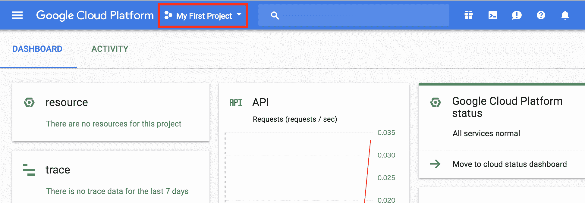导航到项目链接

1.  您可能会看到您自己的项目可供选择，但这次请点击“+”按钮创建一个新项目：

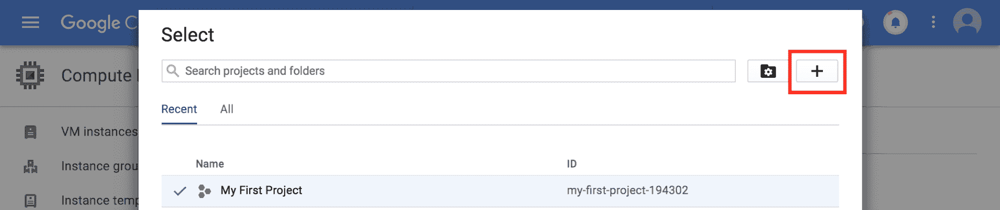创建一个新项目

1.  将项目名称输入为`Kubernetes Cookbook`。然后 GCP 将生成并分配一个项目 ID，如 kubernetes-cookbook-12345。请记住这个项目 ID。

您可能会注意到您的项目 ID 不是 kubernetes-cookbook，就像屏幕截图中显示的 kubernetes-cookbook-194302 一样。即使您尝试点击“编辑”来尝试将其更改为 kubernetes-cookbook，也不允许，因为项目 ID 是所有 GCP 用户的唯一字符串。而我们已经使用了 kubernetes-cookbook 项目 ID。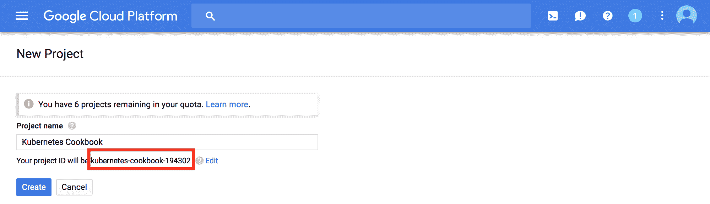项目名称和项目 ID

1.  几分钟后，您的项目就准备好使用了。返回顶部横幅上的项目选择页面，然后选择您的 Kubernetes Cookbook 项目：

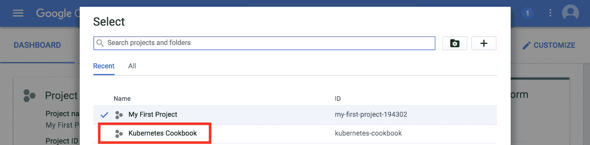选择 Kubernetes Cookbook 项目

完成！您随时可以切换到您的项目和 Kubernetes Cookbook 项目。这是一个隔离的环境；任何 VPC、VM、IAM 用户甚至计费方法都是独立的。

# 安装 Cloud SDK

接下来，在您的计算机上安装 Cloud SDK。它支持 Windows、Mac 和 Linux 平台。所有这些都需要 Python 解释器版本 2.7，但大多数 macOS 和 Linux 安装都使用默认设置。

另一方面，Windows 默认情况下没有 Python 解释器。但是，在 Windows 的 Cloud SDK 安装程序中，可以安装 Python。让我们逐步在 Windows 和 macOS 上安装 Cloud SDK。

# 在 Windows 上安装 Cloud SDK

Cloud SDK 为 Windows 提供了一个安装程序。它还包括 Windows 的 Python 解释器。请按照以下步骤在您的 Windows 计算机上安装：

1.  在 Windows 上下载 Cloud SDK 安装程序 ([`dl.google.com/dl/cloudsdk/channels/rapid/GoogleCloudSDKInstaller.exe`](https://dl.google.com/dl/cloudsdk/channels/rapid/GoogleCloudSDKInstaller.exe))。

1.  运行 Cloud SDK 安装程序。

如果您从未在 Windows 计算机上安装过 Python 解释器，您必须选择“捆绑的 Python”选项：

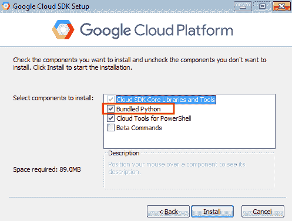Windows 的 Cloud SDK 安装程序

1.  除此之外，使用默认选项继续安装。

1.  安装完成后，您可以在 Google Cloud SDK 程序组中找到 Google Cloud SDK Shell。单击它以启动 Google Cloud SDK Shell：

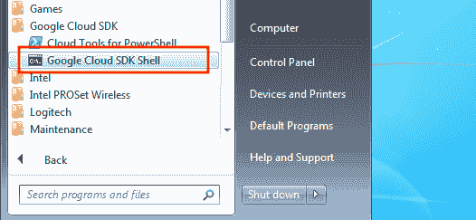Google Cloud SDK 程序组中的 Google Cloud SDK Shell

1.  键入 `gcloud info` 以检查您是否可以查看 Cloud SDK 版本：

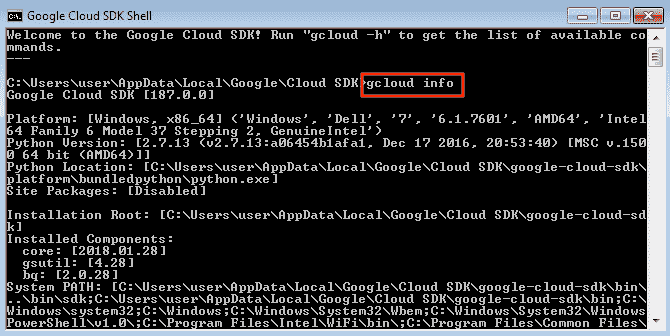在 Windows 上运行 gcloud 命令

# 在 Linux 和 macOS 上安装 Cloud SDK

在 Linux 和 macOS 上安装 Cloud SDK 遵循这里列出的步骤。让我们在您的主目录下安装 Cloud SDK：

1.  打开终端。

1.  输入以下命令以下载并运行 Cloud SDK 安装程序：

```
$ curl https://sdk.cloud.google.com | bash
```

1.  它会询问您期望的安装目录。默认情况下，它位于您的主目录下。因此，输入`return`：

```
Installation directory (this will create a google-cloud-sdk subdirectory) (/Users/saito):
```

1.  它会询问是否发送用户使用数据；当它崩溃时，它会发送一些信息。根据您的隐私政策，如果不希望向 Google 发送任何数据，请选择`n`。否则选择`Y`以提高它们的质量：

```
Do you want to help improve the Google Cloud SDK (Y/n)? n
```

1.  它会询问是否通过将`gcloud`命令添加到您的命令搜索路径来更新`.bash_profile`；输入`y`继续：

```
Modify profile to update your $PATH and enable shell command
completion?
Do you want to continue (Y/n)?  y
The Google Cloud SDK installer will now prompt you to update an rc
file to bring the Google Cloud CLIs into your environment.
Enter a path to an rc file to update, or leave blank to use
[/Users/saito/.bash_profile]:
```

1.  打开另一个终端或输入`exec -l $SHELL`以刷新您的命令搜索路径：

```
//reload .bash_profile
$ exec -l $SHELL

//check gcloud command is in your search path
$ which gcloud
/Users/saito/google-cloud-sdk/bin/gcloud
```

1.  输入`gcloud info`以检查是否可以看到 Cloud SDK 版本：

```
$ gcloud info
Google Cloud SDK [187.0.0]
Platform: [Mac OS X, x86_64] ('Darwin', 'Hideto-Saito-no-MacBook.local', '17.4.0', 'Darwin Kernel Version 17.4.0: Sun Dec 17 09:19:54 PST 2017; root:xnu-4570.41.2~1/RELEASE_X86_64', 'x86_64', 'i386')
Python Version: [2.7.14 (default, Jan 21 2018, 12:22:04)  [GCC 4.2.1 Compatible Apple LLVM 9.0.0 (clang-900.0.38)]]
Python Location: [/usr/local/Cellar/python/2.7.14_2/Frameworks/Python.framework/Versions/2.7/Resources/Python.app/Contents/MacOS/Python]
```

现在您可以开始配置 Cloud SDK 了！

# 配置 Cloud SDK

您可以通过以下步骤配置 Windows 和 Linux/macOS 的 Cloud SDK：

1.  启动 Google Cloud SDK Shell（Windows）或打开终端（Linux/macOS）。

1.  输入`gcloud init`；它会要求您登录您的 Google 帐户。输入`y`并按回车键：

```
You must log in to continue. Would you like to log in (Y/n)? y
```

1.  它将打开一个网页浏览器，导航到 Google 登录页面；继续使用您的 Google 帐户和 GCP 帐户登录。

1.  它会询问您是否 Cloud SDK 可以访问您的 Google 帐户信息。点击“允许”按钮。

1.  回到终端-它会询问您要使用哪个项目。让我们选择您创建的“Kubernetes Cookbook”项目：

```
Pick cloud project to use:
 [1] my-first-project-194302
 [2] kubernetes-cookbook
 [3] Create a new project
Please enter numeric choice or text value (must exactly match list item):  2
```

1.  它会询问您是否要配置`Compute Engine`。这次让我们输入`n`跳过它：

```
Do you want to configure Google Compute Engine
(https://cloud.google.com/compute) settings (Y/n)?  n
```

现在您可以开始使用 Cloud SDK 来控制 GCP。让我们创建 VPC、子网和防火墙规则，然后启动一个 VM 实例来设置我们自己的 GCP 基础设施。

如果您选择了错误的项目或者想要重试，您可以随时通过`gcloud init`命令重新配置您的设置。

# 如何做...

我们将通过使用`gcloud`命令，了解 GCP 的基本功能，以在“Kubernetes Cookbook”项目下设置基础设施。我们将创建这些组件：

+   一个新的 VPC

+   VPC 中的两个子网（`us-central1`和`us-east1`）

+   三个防火墙规则（`public-ssh`，`public-http`和`private-ssh`）

+   我们将把您的 ssh 公钥添加到项目范围的元数据

总体而言，您的基础设施将如下所示。让我们逐个配置组件：

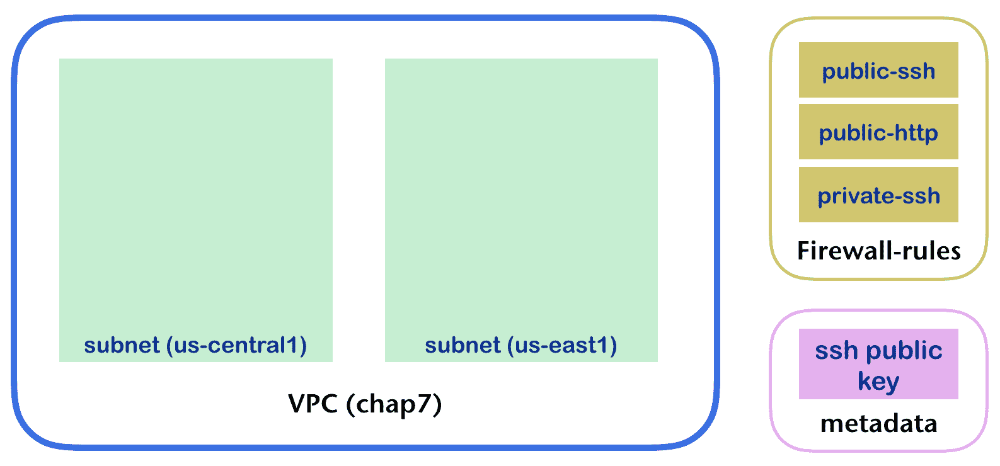目标基础设施

# 创建一个 VPC

GCP 中的 VPC 类似于 AWS，但无需绑定特定区域，也无需设置 CIDR 地址范围。这意味着您可以创建一个覆盖所有区域的 VPC。默认情况下，您的 Kubernetes Cookbook 项目具有一个默认 VPC。

但是，为了更好地理解，让我们按照以下步骤创建一个新的 VPC：

1.  运行`gcloud compute networks`命令来创建一个新的 VPC。名称为`chap7`，子网模式为`custom`，这意味着子网不会自动创建。因此，我们将在下一步手动添加它：

```
$ gcloud compute networks create chap7 --subnet-mode=custom
```

1.  检查 VPC 列表；您应该有两个 VPC，`default` VPC 和`chap7` VPC：

```
$ gcloud compute networks list
NAME     SUBNET_MODE  BGP_ROUTING_MODE  IPV4_RANGE  GATEWAY_IPV4 **chap7    CUSTOM       REGIONAL** default  AUTO         REGIONAL
```

# 创建子网

让我们按照以下步骤在`chap7` VPC（网络）下创建两个子网：

1.  为了创建一个子网，您必须选择区域。通过输入`gcloud compute regions list`，您将知道哪些区域对您可用：

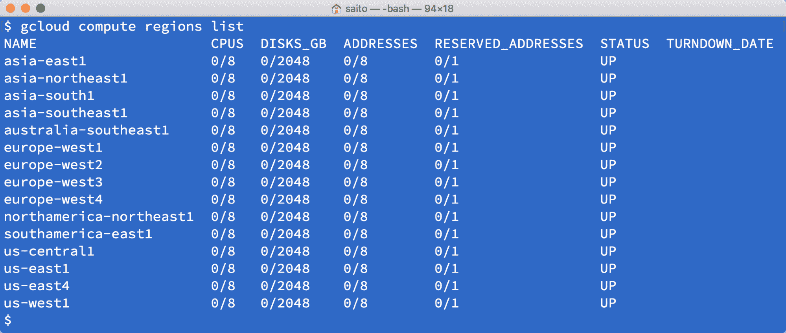显示 GCP 区域列表

1.  让我们选择`us-central1`和`us-east1`，按照以下配置在`chap7` VPC 下创建两个子网：

| **子网名称** | **VPC** | **CIDR 范围** | **区域** |
| --- | --- | --- | --- |
| `chap7-us-central1` | `chap7` | `192.168.1.0/24` | `us-central1` |
| `chap7-us-east1` | `chap7` | `192.168.2.0/24` | `us-east1` |

```
$ gcloud compute networks subnets create chap7-us-central1 --network=chap7 --range=192.168.1.0/24 --region us-central1

$ gcloud compute networks subnets create chap7-us-east1 --network=chap7 --range=192.168.2.0/24 --region us-east1
```

1.  检查以下命令，以查看子网是否正确配置：

```
$ gcloud compute networks subnets list --network=chap7
NAME               REGION       NETWORK  RANGE chap7-us-east1     us-east1     chap7    192.168.2.0/24 chap7-us-central1  us-central1  chap7    192.168.1.0/24
```

# 创建防火墙规则

防火墙规则类似于 AWS 安全组，您可以定义传入和传出的数据包过滤器。它们使用网络标记来区分防火墙规则和 VM 实例。因此，VM 实例可以指定零个或一些网络标记，然后防火墙规则将应用于具有相同网络标记的 VM。

因此，在创建防火墙规则时，我们需要设置一个目标网络标记。总的来说，我们将创建三个具有这些配置的防火墙规则：

| **防火墙规则名称** | **目标 VPC** | **允许端口** | **允许来自** | **目标网络标记** |
| --- | --- | --- | --- | --- |
| `public-ssh` | `chap7` | `ssh` (22/tcp) | 所有 (`0.0.0.0/0`) | public |
| `public-http` | `chap7` | `http` (80/tcp) | 所有 (`0.0.0.0/0`) | public |
| `private-ssh` | `chap7` | `ssh` (22/tcp) | 具有公共网络标记的主机 | private |

1.  创建一个`public-ssh`规则：

```
$ gcloud compute firewall-rules create public-ssh --network=chap7 --allow="tcp:22" --source-ranges="0.0.0.0/0" --target-tags="public"
```

1.  创建一个`public-http`规则：

```
$ gcloud compute firewall-rules create public-http --network=chap7 --allow="tcp:80" --source-ranges="0.0.0.0/0" --target-tags="public"
```

1.  创建一个`private-ssh`规则：

```
$ gcloud compute firewall-rules create private-ssh --network=chap7 --allow="tcp:22" --source-tags="public" --target-tags="private"
```

1.  检查所有防火墙规则：

```
$ gcloud compute firewall-rules list --filter='NETWORK=chap7'
NAME         NETWORK  DIRECTION  PRIORITY  ALLOW   DENY private-ssh  chap7    INGRESS    1000      tcp:22 public-http  chap7    INGRESS    1000      tcp:80 public-ssh   chap7    INGRESS    1000      tcp:22
```

# 将您的 ssh 公钥添加到 GCP

在启动 VM 实例之前，您需要上传您的 ssh 公钥以便登录到 VM。如果您没有任何 ssh 密钥，您必须运行`ssh-keygen`命令生成一对密钥（公钥和私钥）。假设您有一个名为`~/.ssh/id_rsa.pub`的公钥和一个名为`~/.ssh/id_rsa`的私钥

1.  使用`whoami`命令检查您的登录用户名，然后使用`gcloud compute config-ssh`通过以下命令上传您的密钥：

```
$ whoami
saito

$ gcloud compute config-ssh --ssh-key-file=~/.ssh/id_rsa
```

1.  检查您的 ssh 公钥是否注册为元数据：

```
$ gcloud compute project-info describe --format=json
{
 "commonInstanceMetadata": { "fingerprint": "fAqDGp0oSMs=", "items":  { "key": "**ssh-keys**", "value": "**saito**:ssh-rsa AAAAB3NzaC1yc2EAAAADAQABAAABAQDAr1cHrrONuaPgN20sXCPH8uT2lOjWRB3zEncOTxOI2lCW6DM6Mr31boboDe0kAtUMdoDU43yyMe4r734SmtMuh... 
```

就是这样。这些是启动 VM 实例的最小配置。因此，让我们在这个基础设施上启动一些 VM 实例。

# 它是如何工作的...

现在您拥有自己的 VPC、子网和防火墙规则。这个基础设施将被计算引擎（VM 实例）、Kubernetes 引擎和一些其他 GCP 产品使用。让我们在您的 VPC 上部署两个 VM 实例，如下图所示，看看它是如何工作的：

![最终状态# 启动 VM 实例我们将使用以下配置在`us-central1`和`us-east1`上启动两个 VM 实例：| **VM 实例名称** | **目标 VPC** | **区域（参见以下步骤）** | **目标子网** | **分配网络标签** || --- | --- | --- | --- | --- || `chap7-public` | `chap7` | `us-central1-a` | `chap7-us-central1` | public || `chap7-private` | `chap7` | `us-east1-b` | `chap7-us-east1` | private |1.  使用以下命令检查`us-central1`和`us-east1`中可用的区域：```$ gcloud compute zones list --filter='name:(us-east1,us-central1)'NAME           REGION       STATUS  NEXT_MAINTENANCE  TURNDOWN_DATE **us-east1-b**     us-east1     UP us-east1-c     us-east1     UP us-east1-d     us-east1     UP us-central1-c  us-central1  UP **us-central1-a**  us-central1  UP us-central1-f  us-central1  UP us-central1-b  us-central1  UP```因此，让我们选择`us-central1-a`作为`chap7-public`，选择`us-east1-b`作为`chap7-private`：1.  输入以下命令创建两个 VM 实例：```$ gcloud compute instances create chap7-public --network=chap7 --subnet=chap7-us-central1 --zone=us-central1-a --tags=public --machine-type=f1-micro$ gcloud compute instances create chap7-private --network=chap7 --subnet=chap7-us-east1 --zone=us-east1-b --tags=private --machine-type=f1-micro```1.  通过以下命令检查 VM 实例的外部 IP 地址：```$ gcloud compute instances listNAME           ZONE           MACHINE_TYPE  PREEMPTIBLE  INTERNAL_IP  EXTERNAL_IP    STATUS chap7-public   us-central1-a  f1-micro                   192.168.1.2  **35.224.14.45**   RUNNING chap7-private  us-east1-b     f1-micro                   **192.168.2.2**  35.229.95.179  RUNNING```1.  运行`ssh-agent`以记住您的 ssh 密钥：```$ ssh-add ~/.ssh/id_rsa```1.  从您的机器通过`-A`选项（转发身份验证）和使用外部 IP 地址 ssh 到`chap7-public`：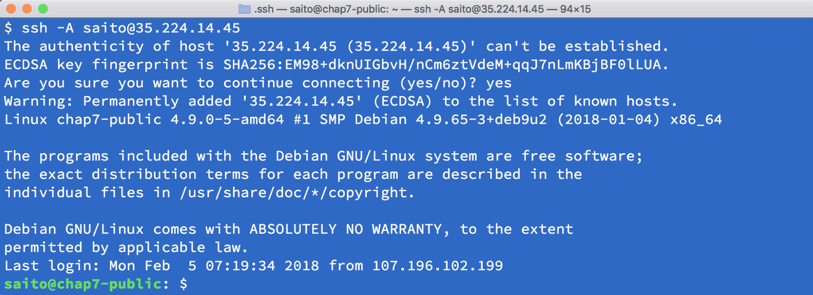ssh 到公共 VM 实例

1.  通过内部 IP 地址从`chap7-public`到`chap7-private`进行 ssh：

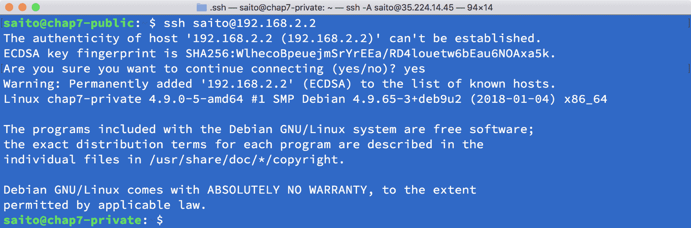ssh 到私有 VM 实例

1.  输入`exit`命令返回到`chap7-public`主机，然后使用`apt-get`命令安装`nginx`：

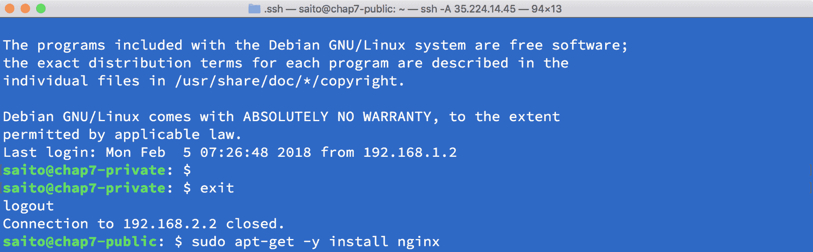在公共 VM 实例上安装 nginx

1.  使用以下命令启动`nginx`：

```
$ sudo systemctl start nginx
```

1.  使用您的 Web 浏览器访问`chap7-public`（通过外部 IP）：

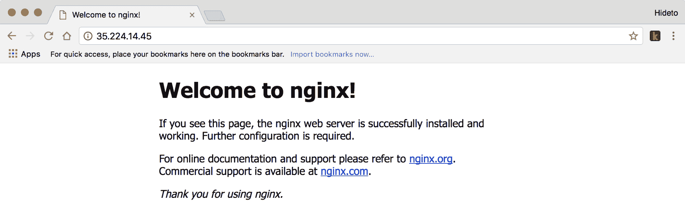访问公共 VM 实例上的 nginx web 服务器

恭喜！您已经完成了设置 GCP VPC、子网和防火墙规则，并启动了 VM 实例！这些都是 Google Compute Engine 的非常基本和常见的用法。您可以登录并在这些机器上安装软件，甚至可以从头开始构建一个 Kubernetes 集群。但是，GCP 还有一个名为 Kubernetes Engine 的托管 Kubernetes 产品。我们将在本章中探讨它。

# 玩转 Google Kubernetes Engine

Kubernetes 是由谷歌设计的，并在谷歌内部广泛使用多年。Google Cloud Platform 提供托管的 GKE。使用 GKE，我们不需要从头开始构建集群。相反，集群可以按需启动和关闭。

# 准备就绪

我们可以使用 GCP 控制台中的 Kubernetes Engine 仪表板或 gcloud CLI 来启动和配置集群。使用控制台非常直观和直观。但是，使用 CLI 是使操作可重复或与现有管道集成的更灵活的方式。在这个教程中，我们将介绍如何使用 gcloud 启动和设置 Kubernetes 集群，以及 GCP 中的一些重要概念。

在 GCP 中，一切都与项目相关联。GCP 项目是使用 GCP 服务、计费和权限控制的基本单位。首先，我们需要从 GCP 控制台创建一个项目[`console.cloud.google.com`](https://console.cloud.google.com)。

在 GCP 中，项目 ID 是全局唯一的。项目正确创建后，我们将看到分配了一个唯一的项目编号。在主页仪表板上，我们将清楚地看到我们使用了多少资源。我们可以从这里设置权限、存储、网络、计费和其他资源。在我们继续之前，我们需要安装 gcloud。gcloud 是 Google Cloud SDK 的一部分。除了 gcloud 可以在 GCP 中执行大多数常见操作之外，Google Cloud SDK 还包括其他常见的 GCP 工具，例如 gsutil（用于管理 Cloud Storage）、bq（用于 BigQuery 的命令行工具）和 core（Cloud SDK 库）。这些工具可以在 Google Cloud SDK 下载页面上找到：[`cloud.google.com/sdk/docs/#install_the_latest_cloud_tools_version_cloudsdk_current_version`](https://cloud.google.com/sdk/docs/#install_the_latest_cloud_tools_version_cloudsdk_current_version)。

安装 gcloud 后，运行 gcloud init 以登录并设置您的身份与 gcloud 并创建一个名为**k8s-cookbook-2e**的项目。我们可以使用 gcloud 来操作 Google Cloud 中的几乎所有服务；主要的命令组是：

```
gcloud container [builds|clusters|images|node-pools|operations] | $COMMAND $FLAG…
```

gcloud 容器命令行集用于管理我们在 Google Kubernetes Engine 中的容器和集群。对于启动集群，最重要的参数是网络设置。让我们花一些时间在这里了解 GCP 中的网络术语。就像 AWS 一样，GCP 也有 VPC 概念。这是一种私有和更安全的方式，可以将您的计算、存储和云资源与公共互联网隔离开来。它可以在项目之间进行对等连接，或者与本地数据中心建立 VPN，创建混合云环境：

```
// create GCP VPC, it might take few minutes.
# gcloud compute networks create k8s-network
Created [https://www.googleapis.com/compute/v1/projects/kubernetes-cookbook/global/networks/k8s-network].
NAME         SUBNET_MODE  BGP_ROUTING_MODE  IPV4_RANGE  GATEWAY_IPV4
k8s-network  AUTO         REGIONAL
```

在此网络上的实例在创建防火墙规则之前将无法访问。例如，您可以通过运行以下命令允许实例之间的所有内部流量以及 SSH、RDP 和 ICMP：

```
$ gcloud compute firewall-rules create <FIREWALL_NAME> --network k8s-network --allow tcp,udp,icmp --source-ranges <IP_RANGE>
$ gcloud compute firewall-rules create <FIREWALL_NAME> --network k8s-network --allow tcp:22,tcp:3389,icmp
```

默认情况下，VPC 以自动模式创建，这将在每个区域创建一个子网。我们可以通过子命令`describe`观察到这一点：

```
// gcloud compute networks describe <VPC name>
# gcloud compute networks describe k8s-network
autoCreateSubnetworks: true
creationTimestamp: '2018-02-25T13:54:28.867-08:00'
id: '1580862590680993403'
kind: compute#network
name: k8s-network
routingConfig:
  routingMode: REGIONAL
selfLink: https://www.googleapis.com/compute/v1/projects/kubernetes-cookbook/global/networks/k8s-network
subnetworks:
- https://www.googleapis.com/compute/v1/projects/kubernetes-cookbook/regions/australia-southeast1/subnetworks/k8s-network
- https://www.googleapis.com/compute/v1/projects/kubernetes-cookbook/regions/europe-west4/subnetworks/k8s-network
- https://www.googleapis.com/compute/v1/projects/kubernetes-cookbook/regions/northamerica-northeast1/subnetworks/k8s-network
- https://www.googleapis.com/compute/v1/projects/kubernetes-cookbook/regions/europe-west1/subnetworks/k8s-network
- https://www.googleapis.com/compute/v1/projects/kubernetes-cookbook/regions/southamerica-east1/subnetworks/k8s-network
- https://www.googleapis.com/compute/v1/projects/kubernetes-cookbook/regions/us-central1/subnetworks/k8s-network
- https://www.googleapis.com/compute/v1/projects/kubernetes-cookbook/regions/us-east1/subnetworks/k8s-network
- https://www.googleapis.com/compute/v1/projects/kubernetes-cookbook/regions/asia-east1/subnetworks/k8s-network
- https://www.googleapis.com/compute/v1/projects/kubernetes-cookbook/regions/us-west1/subnetworks/k8s-network
- https://www.googleapis.com/compute/v1/projects/kubernetes-cookbook/regions/europe-west3/subnetworks/k8s-network
- https://www.googleapis.com/compute/v1/projects/kubernetes-cookbook/regions/asia-southeast1/subnetworks/k8s-network
- https://www.googleapis.com/compute/v1/projects/kubernetes-cookbook/regions/us-east4/subnetworks/k8s-network
- https://www.googleapis.com/compute/v1/projects/kubernetes-cookbook/regions/europe-west2/subnetworks/k8s-network
- https://www.googleapis.com/compute/v1/projects/kubernetes-cookbook/regions/asia-northeast1/subnetworks/k8s-network
- https://www.googleapis.com/compute/v1/projects/kubernetes-cookbook/regions/asia-south1/subnetworks/k8s-network
x_gcloud_bgp_routing_mode: REGIONAL
x_gcloud_subnet_mode: AUTO
```

在 GCP 中，每个子网都跨越一个区域。区域是一个区域中的隔离位置，这与 AWS 中的可用区概念类似。

或者，您可以通过添加参数`--subnet-mode=custom`以自定义模式创建网络，这允许您定义所需的 IP 范围、区域和所有路由规则。有关更多详细信息，请参阅前一节。

自动模式还可以帮助您设置所有默认的路由规则。路由用于定义某些 IP 范围的目的地。例如，此路由将将数据包定向到虚拟网络`10.158.0.0/20`：

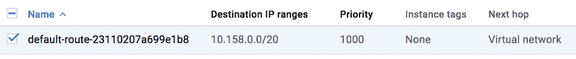默认路由示例

有一个用于将数据包定向到外部世界的路由。此路由的下一跳是默认的互联网网关，类似于 AWS 中的 igw。但是，在 GCP 中，您不需要显式创建互联网网关：

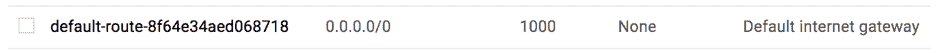用于互联网访问的默认路由

GCP 网络中的另一个重要概念是防火墙规则，用于控制实例的入站和出站。在 GCP 中，防火墙规则与 VM 实例之间的关联是通过网络标签实现的。

防火墙规则也可以分配给网络中的所有实例或一组具有特定服务帐户的实例（仅入口）。服务帐户是 GCP 中 VM 实例的身份。一个或多个角色可以分配给一个服务帐户，因此它可以访问其他 GCP 资源。这类似于 AWS 实例配置文件。

一个 VM 实例可以有多个网络标签，这意味着可以应用多个网络路由。这张图表展示了标签的工作原理。在下面的图表中，第一个防火墙规则应用于 VM1 和 VM2，而 VM2 有两个与之相关联的防火墙规则：

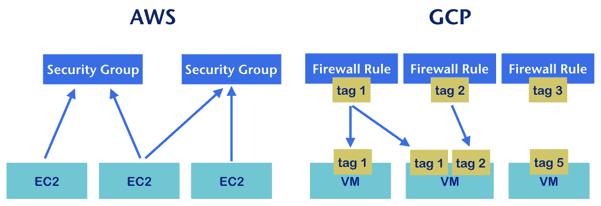AWS 安全组和 GCP 防火墙规则的示意图

在**AWS**中，一个或多个入口/出口规则被定义在一个**安全组**中，一个或多个安全组可以分配给一个**EC2**实例。而在**GCP**中，一个或多个防火墙规则被定义，并且与一个或多个标签相关联。一个实例可以分配一个或多个标签。通过映射网络标签，防火墙规则可以控制和限制实例的出入访问。

# 如何做…

我们已经学习了 GCP 中的基本网络概念。让我们启动我们的第一个 GKE 集群：

| **参数** | **描述** | **示例中的值** |
| --- | --- | --- |
| `--cluster-version` | 支持的集群版本（参考[`cloud.google.com/kubernetes-engine/release-notes`](https://cloud.google.com/kubernetes-engine/release-notes)） | `1.9.2-gke.1` |
| `--machine-type` | 节点的实例类型（参考[`cloud.google.com/compute/docs/machine-types`](https://cloud.google.com/compute/docs/machine-types)） | `f1-micro` |
| `--num-nodes` | 集群中节点的数量 | `3` |
| `--network` | 目标 VPC 网络 | `k8s-network`（我们刚刚创建的网络） |
| `--zone` | 目标区域 | `us-central1-a`（您可以自由选择任何区域） |
| `--tags` | 要附加到节点的网络标签 | private |
| `--service-account &#124; --scopes` | 节点身份（参考[`cloud.google.com/sdk/gcloud/reference/container/clusters/create`](https://cloud.google.com/sdk/gcloud/reference/container/clusters/create)获取更多范围值） | `storage-rw`,`compute-ro` |

通过引用前面的参数，让我们使用`gcloud`命令启动一个三节点集群：

```
// create GKE cluster
$ gcloud container clusters create my-k8s-cluster --cluster-version 1.9.2-gke.1 --machine-type f1-micro --num-nodes 3 --network k8s-network --zone us-central1-a --tags private --scopes=storage-rw,compute-ro
WARNING: The behavior of --scopes will change in a future gcloud release: service-control and service-management scopes will no longer be added to what is specified in --scopes. To use these scopes, add them explicitly to --scopes. To use the new behavior, set container/new_scopes_behavior property (gcloud config set container/new_scopes_behavior true).
WARNING: Starting in Kubernetes v1.10, new clusters will no longer get compute-rw and storage-ro scopes added to what is specified in --scopes (though the latter will remain included in the default --scopes). To use these scopes, add them explicitly to --scopes. To use the new behavior, set container/new_scopes_behavior property (gcloud config set container/new_scopes_behavior true).
Creating cluster my-k8s-cluster...done.
Created [https://container.googleapis.com/v1/projects/kubernetes-cookbook/zones/us-central1-a/clusters/my-k8s-cluster].
To inspect the contents of your cluster, go to: https://console.cloud.google.com/kubernetes/workload_/gcloud/us-central1-a/my-k8s-cluster?project=kubernetes-cookbook
kubeconfig entry generated for my-k8s-cluster.
NAME            LOCATION       MASTER_VERSION  MASTER_IP    MACHINE_TYPE  NODE_VERSION  NUM_NODES  STATUS
my-k8s-cluster  us-central1-a  1.9.2-gke.1     35.225.24.4  f1-micro      1.9.2-gke.1   3          RUNNING
```

在集群运行起来后，我们可以通过配置`kubectl`开始连接到集群：

```
# gcloud container clusters get-credentials my-k8s-cluster --zone us-central1-a --project kubernetes-cookbook
Fetching cluster endpoint and auth data.
kubeconfig entry generated for my-k8s-cluster.
```

让我们看看集群是否健康：

```
// list cluster components
# kubectl get componentstatuses
NAME                 STATUS    MESSAGE              ERROR
controller-manager   Healthy   ok
scheduler            Healthy   ok
etcd-0               Healthy   {"health": "true"}
etcd-1               Healthy   {"health": "true"}
```

我们可以检查集群中的节点：

```
// list the nodes in cluster
# kubectl get nodes
NAME                                            STATUS    ROLES     AGE       VERSION
gke-my-k8s-cluster-default-pool-7d0359ed-0rl8   Ready     <none>    21m       v1.9.2-gke.1
gke-my-k8s-cluster-default-pool-7d0359ed-1s2v   Ready     <none>    21m       v1.9.2-gke.1
gke-my-k8s-cluster-default-pool-7d0359ed-61px   Ready     <none>    21m       v1.9.2-gke.1
```

我们还可以使用`kubectl`来检查集群信息：

```
// list cluster info
# kubectl cluster-info
Kubernetes master is running at https://35.225.24.4
GLBCDefaultBackend is running at https://35.225.24.4/api/v1/namespaces/kube-system/services/default-http-backend:http/proxy
Heapster is running at https://35.225.24.4/api/v1/namespaces/kube-system/services/heapster/proxy
KubeDNS is running at https://35.225.24.4/api/v1/namespaces/kube-system/services/kube-dns:dns/proxy
kubernetes-dashboard is running at https://35.225.24.4/api/v1/namespaces/kube-system/services/https:kubernetes-dashboard:/proxy
Metrics-server is running at https://35.225.24.4/api/v1/namespaces/kube-system/services/https:metrics-server:/proxy
```

# 它是如何工作的...

在幕后，gcloud 创建了一个具有三个节点的 Kubernetes 集群，以及一个控制器管理器，调度程序和具有两个成员的 etcd 集群。我们还可以看到主节点启动了一些服务，包括控制器使用的默认后端，用于监视的 heapster，集群中的 DNS 服务的 KubeDNS，用于 Kubernetes UI 的仪表板，以及用于资源使用度量的 metrics-server。

我们看到`Kubernetes-dashboard`有一个 URL；让我们尝试访问它：

！[](assets/4e58c86e-2d4e-4495-a79f-3bdc37c3da1b.png)禁止访问 Kubernetes 仪表板

我们得到了`HTTP 403 Forbidden`。我们从哪里获取访问和凭据呢？一种方法是通过`kubectl proxy`命令运行代理。它将主 IP 绑定到本地`127.0.0.1:8001`：

```
# kubectl proxy
Starting to serve on 127.0.0.1:8001
```

之后，当我们访问`http://127.0.0.1:8001/ui`时，它将被重定向到`http://127.0.0.1:8001/api/v1/namespaces/kube-system/services/https:kubernetes-dashboard:/proxy`。

自 Kubernetes 1.7 以来，仪表板已支持基于持有者令牌或`Kubeconfig`文件的用户身份验证：

！[](assets/fd85ef71-b10b-40b8-af0e-31ba8d287dee.png)登录到 Kubernetes 仪表板

您可以创建一个用户并将其绑定到当前上下文（请参阅第八章“高级集群管理”中的*身份验证和授权*配方）。只是为了方便起见，我们可以检查是否有任何现有用户。首先，我们需要知道我们当前的上下文名称。上下文包括集群信息，用于身份验证的用户和一个命名空间：

```
// check our current context name
# kubectl config current-context
gke_kubernetes-cookbook_us-central1-a_my-k8s-cluster
```

知道上下文名称后，我们可以通过`kubectl`配置视图`$CONTEXT_NAME`来描述它：

```
// kubectl config view $CONTEXT_NAME
# kubectl config view gke_kubernetes-cookbook_us-central1-a_my-k8s-cluster
current-context: gke_kubernetes-cookbook_us-central1-a_my-k8s-cluster
kind: Config
preferences: {}
users:
- name: gke_kubernetes-cookbook_us-central1-a_my-k8s-cluster
  user:
    auth-provider:
      config:
        access-token: $ACCESS_TOKEN
        cmd-args: config config-helper --format=json
        cmd-path: /Users/chloelee/Downloads/google-cloud-sdk-2/bin/gcloud
        expiry: 2018-02-27T03:46:57Z
        expiry-key: '{.credential.token_expiry}'
        token-key: '{.credential.access_token}'
      name: gcp
```

我们可能会发现我们的集群中存在一个默认用户；使用其`$ACCESS_TOKEN`，您可以一窥 Kubernetes 控制台。

！[](assets/6825b49d-6934-41d2-83a8-cb3a098d2675.png)Kubernetes 仪表板概述

我们在 GKE 中的集群已经运行起来了！让我们尝试看看是否可以在上面运行一个简单的部署：

```
# kubectl run nginx --image nginx --replicas=2
deployment "nginx" created
# kubectl get pods
NAME                   READY     STATUS    RESTARTS   AGE
nginx-8586cf59-x27bj   1/1       Running   0          12s
nginx-8586cf59-zkl8j   1/1       Running   0          12s
```

让我们检查一下我们的 Kubernetes 仪表板：

！[](assets/8a069c1f-b7cb-4441-8f32-90576dcdab69.png)Kubernetes 仪表板中的工作负载

万岁！部署已创建，结果是安排和创建了两个 pod。

# 另请参阅

+   在第八章“高级集群管理”中的* kubeconfig 高级设置*

+   在第八章“高级集群管理”中设置节点资源

+   在第八章中*高级集群管理*中*使用 Web UI*。

+   在第八章中*高级集群管理*中*在 Kubernetes 集群中设置 DNS 服务器*。

+   在第八章中*高级集群管理*中*身份验证和授权*。

# 在 GKE 上探索 CloudProvider

GKE 作为本地 Kubernetes 云提供商运行，与 Kubernetes 中的资源无缝集成，并允许您按需进行配置，例如，为网络配置 VPC 路由，为 StorageClass 配置**持久磁盘**（PD），为服务配置 L4 负载均衡器，为入口配置 L4 负载均衡器。

# 准备就绪

默认情况下，在 Google Cloud Platform 中创建网络并启动 Kubernetes 集群时，具有适当路由的容器可以在不设置显式网络的情况下相互通信。除了前面列出的资源，我们在大多数情况下不需要显式设置任何设置。GKE 会自动运行。

# 如何操作…

让我们看看 GKE 提供的存储、网络等功能有多方便。

# StorageClass

在第二章中*深入了解 Kubernetes 概念*中，我们学习了如何声明`PersistentVolume`和`PersistentVolumeClaim`。通过动态配置，您可以定义一组具有不同物理存储后端的`StorageClass`，并在`PersistentVolume`或`PersistentVolumeClaim`中使用它们。让我们看看它是如何工作的。

要检查当前默认的`StorageClass`，请使用`kubectl get storageclasses`命令：

```
# kubectl get storageclasses
NAME                 PROVISIONER            AGE
standard (default)   kubernetes.io/gce-pd   1h
```

我们可以看到我们有一个名为 standard 的默认存储类，其提供程序是 GCE PD。

让我们创建一个`PersistentVolumeClaim`请求，并使用标准的`StorageClass`作为后端：

```
# cat gke-pvc.yaml
apiVersion: v1
kind: PersistentVolumeClaim
metadata:
    name: pvc-example-pv
spec:
  storageClassName: standard
  accessModes:
    - ReadWriteOnce
  resources:
    requests:
      storage: 10Gi

// create resources
# kubectl create -f gke-pvc.yaml
persistentvolumeclaim "pvc-example-pv" created
```

`storageClassName`是放置`StorageClass`名称的地方。如果放入不存在的内容，PVC 将不会被创建，因为没有适当映射的`StorageClass`可用：

```
// check pvc status
# kubectl get pvc
NAME              STATUS    VOLUME                                     CAPACITY   ACCESS MODES   STORAGECLASS   AGE
pvc-example-pv    Bound     pvc-1491b08e-1cfc-11e8-8589-42010a800360   10Gi       RWO            standard       12m

// describe the details of created PVC
# kubectl describe pvc pvc-example-pv
Name:          pvc-example-pv
Namespace:     default
StorageClass:  standard
Status:        Bound
Volume:        pvc-1491b08e-1cfc-11e8-8589-42010a800360
Labels:        <none>
Annotations:   pv.kubernetes.io/bind-completed=yes
               pv.kubernetes.io/bound-by-controller=yes
               volume.beta.kubernetes.io/storage-provisioner=kubernetes.io/gce-pd
Finalizers:    []
Capacity:      10Gi
Access Modes:  RWO
Events:
  Type    Reason                 Age   From                         Message
  ----    ------                 ----  ----                         -------
  Normal  ProvisioningSucceeded  12m   persistentvolume-controller  Successfully provisioned volume pvc-1491b08e-1cfc-11e8-8589-42010a800360 using kubernetes.io/gce-pd
```

我们可以看到卷`pvc-1491b08e-1cfc-11e8-8589-42010a800360`已经被创建并绑定。如果我们列出 GCP 磁盘，我们会发现已经创建了一个持久磁盘；磁盘名称的后缀表示 Kubernetes 中的卷名称。这就是动态卷配置的魔力：

```
# gcloud compute disks list
NAME                                                             ZONE           SIZE_GB  TYPE         STATUS
gke-my-k8s-cluster-5ef-pvc-1491b08e-1cfc-11e8-8589-42010a800360  us-central1-a  10       pd-standard  READY
```

除了默认的`StorageClass`，您还可以创建自己的。在第二章中进行了回顾，*深入了解 Kubernetes 概念*。

# 服务（负载均衡器）

`LoadBalancer`服务类型仅在支持外部负载均衡器的云环境中起作用。这允许外部流量路由到目标 Pod。在 GCP 中，`LoadBalancer`服务类型将创建一个 TCP 负载均衡器：

1.  用于允许负载均衡器和节点之间流量的防火墙规则将自动创建：

```
// leveraging LoadBalancer service
# cat gke-service.yaml
apiVersion: apps/v1
kind: Deployment
metadata:
  name: nginx
spec:
  replicas: 1
  selector:
    matchLabels:
      run: nginx
  template:
    metadata:
      labels:
        run: nginx
    spec:
      containers:
        - image: nginx
          name: nginx
          ports:
            - containerPort: 80
---
apiVersion: v1
kind: Service
metadata:
  name: nginx
spec:
  ports:
    - port: 80
      targetPort: 80
  type: LoadBalancer
  selector:
    run: nginx

// create resources
# kubectl create -f gke-service.yaml
deployment "nginx" created
service "nginx" created
```

1.  让我们来检查服务。如果负载均衡器仍在进行配置，`EXTERNAL-IP`将显示`<pending>`。等一会儿，负载均衡器 IP 最终会显示出来：

```
# kubectl get svc nginx
NAME      TYPE           CLUSTER-IP      EXTERNAL-IP      PORT(S)        AGE
nginx     LoadBalancer   10.35.250.183   35.225.223.151   80:30383/TCP   11m
```

1.  让我们使用`$EXTERNAL-IP:80`进行 curl，看看它是否正常工作：

```
# curl -I 35.225.223.151
HTTP/1.1 200 OK
Server: nginx/1.13.9
Date: Thu, 01 Mar 2018 03:57:05 GMT
Content-Type: text/html
Content-Length: 612
Last-Modified: Tue, 20 Feb 2018 12:21:20 GMT
Connection: keep-alive
ETag: "5a8c12c0-264"
Accept-Ranges: bytes
```

1.  如果我们在 GCP 中检查转发规则，我们可以找到一个定义了外部 IP 到目标池的流量如何走的规则：

```
# gcloud compute forwarding-rules list
NAME                              REGION       IP_ADDRESS      IP_PROTOCOL  TARGET
ae1f2ad0c1d0211e8858942010a80036  us-central1  35.225.223.151  TCP          us-central1/targetPools/ae1f2ad0c1d0211e8858942010a80036
```

1.  目标池是一组实例，它们接收来自转发规则的流量。我们也可以使用 gcloud 命令来检查目标池：

```
// list target pools
# gcloud compute target-pools list
NAME                              REGION       SESSION_AFFINITY  BACKUP  HEALTH_CHECKS
ae1f2ad0c1d0211e8858942010a80036  us-central1  NONE                      k8s-1a4c86537c370d21-node

// check target pools info, replace $GCP_REGION as your default region.
# gcloud compute target-pools describe ae1f2ad0c1d0211e8858942010a80036 --region=$GCP_REGION
creationTimestamp: '2018-02-28T19:45:46.052-08:00'
description: '{"kubernetes.io/service-name":"default/nginx"}'
healthChecks:
- https://www.googleapis.com/compute/v1/projects/kubernetes-cookbook/global/httpHealthChecks/k8s-1a4c86537c370d21-node
id: '3515096241941432709'
instances:
- https://www.googleapis.com/compute/v1/projects/kubernetes-cookbook/zones/us-central1-a/instances/gke-my-k8s-cluster-default-pool-36121894-71wg
- https://www.googleapis.com/compute/v1/projects/kubernetes-cookbook/zones/us-central1-a/instances/gke-my-k8s-cluster-default-pool-36121894-04rv
- https://www.googleapis.com/compute/v1/projects/kubernetes-cookbook/zones/us-central1-a/instances/gke-my-k8s-cluster-default-pool-36121894-3mxm
kind: compute#targetPool
name: ae1f2ad0c1d0211e8858942010a80036
region: https://www.googleapis.com/compute/v1/projects/kubernetes-cookbook/regions/us-central1
selfLink: https://www.googleapis.com/compute/v1/projects/kubernetes-cookbook/regions/us-central1/targetPools/ae1f2ad0c1d0211e8858942010a80036
sessionAffinity: NONE
```

我们可以看到目标池内有三个节点。这些节点与我们的 Kubernetes 集群中的三个节点相同。负载均衡器将根据源/定义 IP 和端口的哈希将流量分发到节点上。`LoadBalancer`类型的服务看起来很方便；然而，它无法进行基于路径的路由。现在是 Ingress 发挥作用的时候了。Ingress 支持虚拟主机、基于路径的路由和 TLS 终止，这是对您的 Web 服务更灵活的方法。

# Ingress

在第五章中，*构建持续交付流水线*，我们学习了关于 Ingress 的概念，以及何时以及如何使用它。Ingress 定义了一组规则，允许入站连接访问 Kubernetes 集群服务。它在 L7 级别将流量路由到集群，并且控制器将流量带到节点。当 GCP 是云提供商时，如果创建了 Ingress，将创建一个 L7 负载均衡器，以及相关的防火墙规则、健康检查、后端服务、转发规则和 URL 映射。在 GCP 中，URL 映射是一个包含一组规则并将请求转发到相应后端服务的机制。

在这个示例中，我们将重用第五章中的示例，*构建持续交付流水线*，`Nodeport-deployment.yaml`和`echoserver.yaml`。接下来是这两个服务如何工作的示例，来自第五章，*构建持续交付流水线*：

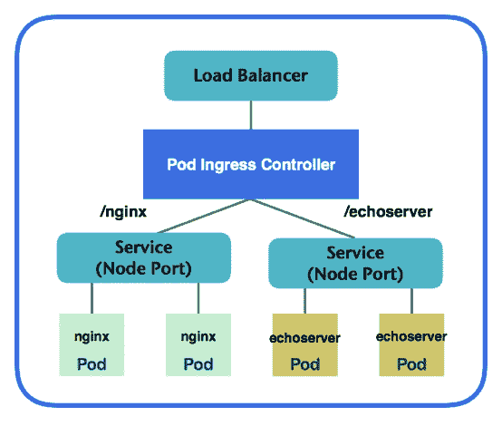Ingress 示例

我们将为 nginx 和 echoserver 创建一个 Ingress，路由到不同的服务。当流量进入时，pod Ingress 控制器将决定路由到哪个服务。

这是一个 Ingress 的示例。请注意，如果您希望底层服务始终从特定主机名访问，可能需要在规则部分内添加主机名：

```
# cat INGRESS.yaml
apiVersion: extensions/v1beta1
kind: INGRESS
metadata:
  name: my-INGRESS
  annotations:
    INGRESS.kubernetes.io/rewrite-target: /
spec:
  rules:
    - http:
        paths:
          - path: /
            # default backend
            backend:
              serviceName: nodeport-svc
              servicePort: 8080
          - path: /nginx
            # nginx service
            backend:
              serviceName: nodeport-svc
              servicePort: 8080
          - path: /echoserver
            # echoserver service
            backend:
              serviceName: echoserver-svc
              servicePort: 8080

// create nodeport-svc (nginx) service
# kubectl create -f nodeport-deployment.yaml
deployment "nodeport-deploy" created
service "nodeport-svc" created

// create echoserver-svc (echoserver) service
# kubectl create -f echoserver.yaml
deployment "echoserver-deploy" created
service "echoserver-svc" created

// create INGRESS
# kubectl create -f INGRESS.yaml
INGRESS "my-INGRESS" created
```

请仔细检查底层服务是否配置为`NodePort`类型。否则，您可能会遇到诸如`googleapi: Error 400: Invalid value for field 'namedPorts[1].port': '0'. Must be greater than or equal to 1, invalid error`的错误，来自`loadbalancer-controller`。

几分钟后，L7 负载均衡器将被创建，您可以从 GCP 控制台或使用 gcloud 命令来查看它。让我们使用`kubectl`来检查 INGRESS 中的后端服务是否健康：

```
// kubectl describe INGRESS $INGRESS_name
# kubectl describe INGRESS my-INGRESS

curl Name:             my-INGRESS
Namespace:        default
Address:          35.190.46.137
Default backend:  default-http-backend:80 (10.32.2.3:8080)
Rules:
  Host  Path  Backends
  ----  ----  --------
  *
        /             nodeport-svc:8080 (<none>)
        /nginx        nodeport-svc:8080 (<none>)
        /echoserver   echoserver-svc:8080 (<none>)
Annotations:
  backends:         {"k8s-be-31513--91cf30ccf285becb":"HEALTHY","k8s-be-31780--91cf30ccf285becb":"HEALTHY","k8s-be-32691--91cf30ccf285becb":"HEALTHY"}
  forwarding-rule:  k8s-fw-default-my-INGRESS--91cf30ccf285becb
  rewrite-target:   /
  target-proxy:     k8s-tp-default-my-INGRESS--91cf30ccf285becb
  url-map:          k8s-um-default-my-INGRESS--91cf30ccf285becb
Events:
  Type    Reason   Age               From                     Message
  ----    ------   ----              ----                     -------
  Normal  Service  2m (x11 over 1h)  loadbalancer-controller  no user specified default backend, using system default
```

我们可以看到三个后端服务都是健康的，并且相关的转发规则、目标代理和 URL 映射都已创建。我们可以通过访问 GCP 控制台中的 GKE 中的发现和负载均衡或网络服务中的负载均衡选项卡来全面了解情况：

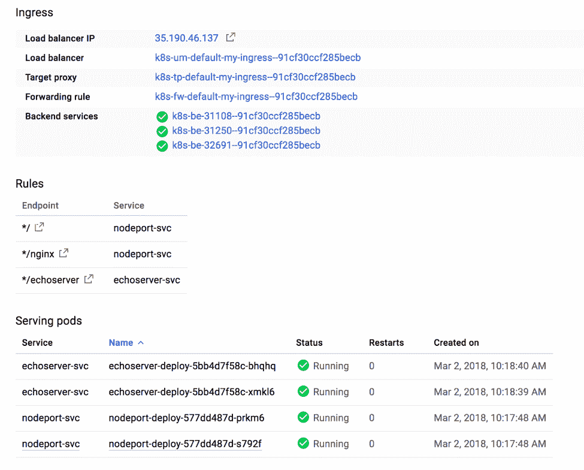发现和负载均衡

后端服务如下所示：

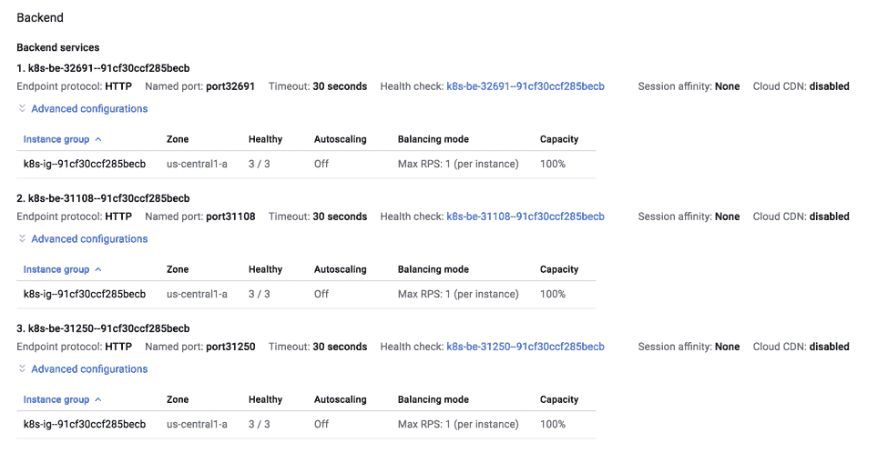后端服务

您的 Ingress 资源可能会不时遇到更新。当您重新部署它时，不能保证 GCP 会为您的负载均衡器分配相同的 IP 地址。当 IP 地址与 DNS 名称关联时，这可能会引入问题。每次 IP 更改时，目标 IP 地址都需要更新。这可以通过静态外部 IP 地址加上`kubernetes.io/INGRESS.global-static-ip-name`注释来解决：

```
// allocate static IP as my-external-ip
# gcloud compute addresses create my-external-ip –global

// check external-ip
# gcloud compute addresses list
NAME            REGION  ADDRESS        STATUS
my-external-ip          130.211.37.61  RESERVED
After external IP is prepared, we could start launching our INGRESS now.
# cat INGRESS-static-ip.yaml
apiVersion: extensions/v1beta1
kind: INGRESS
metadata:
  name: my-INGRESS-static-ip
  annotations:
    INGRESS.kubernetes.io/rewrite-target: /
    kubernetes.io/INGRESS.global-static-ip-name: my-external-ip
spec:
  rules:
    - http:
        paths:
          - path: /
            # default backend
            backend:
              serviceName: nodeport-svc
              servicePort: 8080
          - path: /nginx
            # nginx service
            backend:
              serviceName: nodeport-svc
              servicePort: 8080
          - path: /echoserver
            # echoserver service
            backend:
              serviceName: echoserver-svc
              servicePort: 8080

# kubectl create -f INGRESS-static-ip.yaml
INGRESS "my-INGRESS-stati-ip" created
```

让我们描述`my-INGRESS`，看看它是否正确绑定了我们创建的外部 IP：

```
# kubectl describe INGRESS my-INGRESS
Name:             my-INGRESS
Namespace:        default
Address:          130.211.37.61
Default backend:  default-http-backend:80 (10.32.2.3:8080)
Rules:
  Host  Path  Backends
  ----  ----  --------
  *        /             nodeport-svc:8080 (<none>)
        /nginx        nodeport-svc:8080 (<none>)        /echoserver   echoserver-svc:8080 (<none>)Annotations:
  backends:         {"k8s-be-31108--91cf30ccf285becb":"HEALTHY","k8s-be-31250--91cf30ccf285becb":"HEALTHY","k8s-be-32691--91cf30ccf285becb":"HEALTHY"}  forwarding-rule:  k8s-fw-default-my-INGRESS--91cf30ccf285becb  rewrite-target:   /  target-proxy:     k8s-tp-default-my-INGRESS--91cf30ccf285becb  url-map:          k8s-um-default-my-INGRESS--91cf30ccf285becbEvents:  Type    Reason   Age               From                     Message  ----    ------   ----              ----                     -------  Normal  ADD      27m               loadbalancer-controller  default/my-INGRESS  Normal  CREATE   25m               loadbalancer-controller  ip: 130.211.37.61
  Normal  Service  4m (x6 over 25m)  loadbalancer-controller  no user specified default backend, using system default
```

我们已经准备就绪。`Nginx`和`echoserver`可以通过外部静态 IP`130.211.37.61`访问，并且我们可以通过在 GCP 中使用云 DNS 服务来将 DNS 名称与其关联。

# 还有更多...

在 Kubernetes v.1.9 中，Kubernetes 云控制器管理器被提升为 alpha 版。云控制器管理器旨在通过其自身的发布周期支持云提供商的发布功能，这可以独立于 Kubernetes 的发布周期。然后它可以独立于 Kubernetes 核心发布周期。它提供了每个云提供商都可以实现的通用接口，与 Kubernetes 核心逻辑解耦。在不久的将来，我们将看到来自不同云提供商的更全面的支持！

# 另请参阅

+   *在第二章中使用服务*，*深入了解 Kubernetes 概念*

+   *在第二章中使用卷*，*深入了解 Kubernetes 概念*

+   *在第三章中转发容器端口*，*玩转容器*

# 在 GKE 上管理 Kubernetes 集群

Google Kubernetes Engines 为我们提供了运行 Kubernetes 的无缝体验；它还使 Kubernetes 管理变得如此简单。根据预期的高峰时间，我们可能希望扩展或缩小 Kubernetes 节点。或者，我们可以使用自动缩放器来对节点进行自动缩放。Kubernetes 是一个不断发展的平台。发布速度很快。我们可能需要不时地升级集群版本，这非常容易做到。我们还可以使用 Autoupgrade 功能通过在 GKE 中启用自动调度功能来升级集群。让我们看看如何做到这一点。

# 准备工作

在设置 GCP 提供的管理功能之前，我们必须有一个正在运行的集群。我们将在本章中重复使用我们在“玩转 Google Kubernetes Engine”示例中创建的集群。

# 如何做…

在这个示例中，我们将介绍如何根据使用情况和要求来管理节点数量。此外，我们还将学习如何处理集群升级。最后，我们将看到如何在 GKE 中提供多区域集群，以防止物理区域的故障。

# 节点池

节点池是 GCP 中共享相同配置的一组实例。当我们从`gcloud`命令启动集群时，我们传递`--num-node=3`和其余参数。然后将在同一池内启动三个实例，共享相同的配置，使用相同的方法：

```
# gcloud compute instance-groups list NAME LOCATION SCOPE NETWORK MANAGED INSTANCES gke-my-k8s-cluster-default-pool-36121894-grp us-central1-a zone k8s-network Yes 3 
```

假设您的服务预计会出现高峰时间。作为 Kubernetes 管理员，您可能希望调整集群内的节点池大小。

```
# gcloud container clusters resize my-k8s-cluster --size 5 --zone us-central1-a --node-pool default-pool
Pool [default-pool] for [my-k8s-cluster] will be resized to 5.
Do you want to continue (Y/n)?  y
Resizing my-k8s-cluster...done.
Updated [https://container.googleapis.com/v1/projects/kubernetes-cookbook/zones/us-central1-a/clusters/my-k8s-cluster].
# kubectl get nodes
NAME                                               STATUS    ROLES     AGE       VERSION
gke-my-k8s-cluster-default-pool-36121894-04rv      Ready     <none>    6h        v1.9.2-gke.1
gke-my-k8s-cluster-default-pool-36121894-71wg      Ready     <none>    6h        v1.9.2-gke.1
gke-my-k8s-cluster-default-pool-36121894-8km3      Ready     <none>    39s       v1.9.2-gke.1
gke-my-k8s-cluster-default-pool-36121894-9j9p      Ready     <none>    31m       v1.9.2-gke.1
gke-my-k8s-cluster-default-pool-36121894-9jmv      Ready     <none>    36s       v1.9.2-gke.1
```

调整大小命令可以帮助您扩展和缩小。如果调整大小后的节点数少于之前，调度器将迁移 pod 以在可用节点上运行。

您可以为规范中的每个容器设置计算资源边界。您可以为 pod 容器设置请求和限制。假设我们有一个需要 1024 MB 内存的超级 nginx：

```
# cat super-nginx.yaml
apiVersion: apps/v1
kind: Deployment
metadata:
  name: super-nginx
  labels:
    app: nginx
spec:
  replicas: 1
  selector:
    matchLabels:
      app: nginx
  template:
    metadata:
      labels:
        app: nginx
    spec:
      containers:
      - name: nginx
        image: nginx
        resources:
          requests:
            memory: 1024Mi 

// create super nginx deployment
# kubectl create -f super-nginx.yaml
deployment "super-nginx" created

# kubectl get pods
NAME                           READY     STATUS    RESTARTS   AGE
super-nginx-df79db98-5vfmv      0/1       Pending   0          10s
# kubectl describe po super-nginx-779494d88f-74xjp
Name:           super-nginx-df79db98-5vfmv
Namespace:      default
Node:           <none>
Labels:         app=nginx
                pod-template-hash=89358654
Annotations:    kubernetes.io/limit-ranger=LimitRanger plugin set: cpu request for container nginx
Status:         PendingIP:
Controlled By:  ReplicaSet/super-nginx-df79db98
...
Events:
  Type     Reason            Age                From               Message
  ----     ------            ----               ----               -------
  Warning  FailedScheduling  11s (x5 over 18s)  default-scheduler  0/5 nodes are available: 5 Insufficient memory.
```

我们创建的节点大小是`f1-miro`，每个节点只有 0.6 GB 内存。这意味着调度器永远无法找到具有足够内存来运行`super-nginx`的节点。在这种情况下，我们可以通过创建另一个节点池向集群中添加具有更高内存的更多节点。我们将使用`g1-small`作为示例，其中包含 1.7 GB 内存：

```
// create a node pool named larger-mem-pool with n1-standard-1 instance type
# gcloud container node-pools create larger-mem-pool --cluster my-k8s-cluster --machine-type n1-standard-1 --num-nodes 2 --tags private --zone us-central1-a --scopes=storage-rw,compute-ro
...
Creating node pool larger-mem-pool...done.
Created [https://container.googleapis.com/v1/projects/kubernetes-cookbook/zones/us-central1-a/clusters/my-k8s-cluster/nodePools/larger-mem-pool].
NAME             MACHINE_TYPE   DISK_SIZE_GB  NODE_VERSION
larger-mem-pool  n1-standard-1  100           1.9.2-gke.1

// check node pools
# gcloud container node-pools list --cluster my-k8s-cluster --zone us-central1-a
NAME             MACHINE_TYPE   DISK_SIZE_GB  NODE_VERSION
default-pool     f1-micro       100           1.9.2-gke.1
larger-mem-pool  n1-standard-1  100           1.9.2-gke.1

// check current nodes
# kubectl get nodes
NAME                                               STATUS    ROLES     AGE       VERSION
gke-my-k8s-cluster-default-pool-36121894-04rv      Ready     <none>    7h        v1.9.2-gke.1
gke-my-k8s-cluster-default-pool-36121894-71wg      Ready     <none>    7h        v1.9.2-gke.1
gke-my-k8s-cluster-default-pool-36121894-8km3      Ready     <none>    9m        v1.9.2-gke.1
gke-my-k8s-cluster-default-pool-36121894-9j9p      Ready     <none>    40m       v1.9.2-gke.1
gke-my-k8s-cluster-default-pool-36121894-9jmv      Ready     <none>    9m        v1.9.2-gke.1
gke-my-k8s-cluster-larger-mem-pool-a51c8da3-f1tb   Ready     <none>    1m        v1.9.2-gke.1
gke-my-k8s-cluster-larger-mem-pool-a51c8da3-scw1   Ready     <none>    1m        v1.9.2-gke.1
```

看起来我们有两个更强大的节点。让我们来看看我们超级 nginx 的状态：

```
# kubectl get pods
NAME                         READY     STATUS    RESTARTS   AGE
super-nginx-df79db98-5vfmv   1/1       Running   0          23m
```

它正在运行！Kubernetes 调度器将始终尝试找到足够的资源来调度 pod。在这种情况下，集群中添加了两个新节点，可以满足资源需求，因此 pod 被调度并运行：

```
// check the event of super nginx
# kubectl describe pods super-nginx-df79db98-5vfmv
...
Events:
  Warning  FailedScheduling       3m (x7 over 4m)     default-scheduler                                          0/5 nodes are available: 5 Insufficient memory.
  Normal   Scheduled              1m                  default-scheduler                                          Successfully assigned super-nginx-df79db98-5vfmv to gke-my-k8s-cluster-larger-mem-pool-a51c8da3-scw1
  Normal   SuccessfulMountVolume  1m                  kubelet, gke-my-k8s-cluster-larger-mem-pool-a51c8da3-scw1  MountVolume.SetUp succeeded for volume "default-token-bk8p2"
  Normal   Pulling                1m                  kubelet, gke-my-k8s-cluster-larger-mem-pool-a51c8da3-scw1  pulling image "nginx"
  Normal   Pulled                 1m                  kubelet, gke-my-k8s-cluster-larger-mem-pool-a51c8da3-scw1  Successfully pulled image "nginx"
  Normal   Created                1m                  kubelet, gke-my-k8s-cluster-larger-mem-pool-a51c8da3-scw1  Created container
  Normal   Started                1m                  kubelet, gke-my-k8s-cluster-larger-mem-pool-a51c8da3-scw1  Started container
```

从 pod 的事件中，我们知道它经过了哪些路径。最初，它找不到具有足够资源的节点，最终被调度到名为`gke-my-k8s-cluster-larger-mem-pool-a51c8da3-scw1`的新节点上。

为了使用户对在特定节点上调度 pod 的偏好，引入了`nodeSelector`。您可以在 pod 规范中使用内置的节点标签，例如`beta.kubernetes.io/instance-type: n1-standard-1`，或使用自定义标签来实现。有关更多信息，请参阅[`kubernetes.io/docs/concepts/configuration/assign-pod-node`](https://kubernetes.io/docs/concepts/configuration/assign-pod-node)。

Kubernetes 还支持**集群自动缩放**，根据容量自动调整集群大小，如果所有节点都没有足够的资源来运行请求的 pod。为此，我们在创建新节点池时添加`–enable-autoscaling`并指定最大和最小节点数：

```
# cloud container node-pools create larger-mem-pool --cluster my-k8s-cluster --machine-type n1-standard-1 --tags private --zone us-central1-a --scopes=storage-rw,compute-ro --enable-autoscaling --min-nodes 1 --max-nodes 5
...
Creating node pool larger-mem-pool...done.
Created [https://container.googleapis.com/v1/projects/kubernetes-cookbook/zones/us-central1-a/clusters/my-k8s-cluster/nodePools/larger-mem-pool].
NAME             MACHINE_TYPE   DISK_SIZE_GB  NODE_VERSION
larger-mem-pool  n1-standard-1  100           1.9.2-gke.1
```

几分钟后，我们可以看到我们的集群中有一个新节点：

```
#  kubectl get nodes
NAME                                               STATUS    ROLES     AGE       VERSION
gke-my-k8s-cluster-default-pool-36121894-04rv      Ready     <none>    8h        v1.9.2-gke.1
gke-my-k8s-cluster-default-pool-36121894-71wg      Ready     <none>    8h        v1.9.2-gke.1
gke-my-k8s-cluster-default-pool-36121894-8km3      Ready     <none>    1h        v1.9.2-gke.1
gke-my-k8s-cluster-default-pool-36121894-9j9p      Ready     <none>    1h        v1.9.2-gke.1
gke-my-k8s-cluster-default-pool-36121894-9jmv      Ready     <none>    1h        v1.9.2-gke.1
gke-my-k8s-cluster-larger-mem-pool-a51c8da3-s6s6   Ready     <none>    15m       v1.9.2-gke.1
```

现在，让我们通过使用`kubectl`编辑或创建新的部署，将我们的超级 nginx 的副本从 1 更改为 4：

```
// check current pods
# kubectl get pods
NAME                         READY     STATUS    RESTARTS   AGE
super-nginx-df79db98-5q9mj   0/1       Pending   0          3m
super-nginx-df79db98-72fcz   1/1       Running   0          3m
super-nginx-df79db98-78lbr   0/1       Pending   0          3m
super-nginx-df79db98-fngp2   1/1       Running   0          3m
```

我们发现有两个处于挂起状态的 pod：

```
// check nodes status
# kubectl get nodes
NAME                                               STATUS     ROLES     AGE       VERSION
gke-my-k8s-cluster-default-pool-36121894-04rv      Ready   <none>    8h        v1.9.2-gke.1
gke-my-k8s-cluster-default-pool-36121894-71wg      Ready      <none>    8h        v1.9.2-gke.1
gke-my-k8s-cluster-default-pool-36121894-9j9p      Ready      <none>    2h        v1.9.2-gke.1
gke-my-k8s-cluster-larger-mem-pool-a51c8da3-d766   Ready      <none>    4m        v1.9.2-gke.1
gke-my-k8s-cluster-larger-mem-pool-a51c8da3-gtsn   Ready      <none>    3m        v1.9.2-gke.1
gke-my-k8s-cluster-larger-mem-pool-a51c8da3-s6s6   Ready      <none>    25m       v1.9.2-gke.1
```

几分钟后，我们看到我们的大内存池中有新成员，并且所有我们的 pod 都可以运行：

```
// check pods status
# kubectl get pods
NAME                         READY     STATUS    RESTARTS   AGE
super-nginx-df79db98-5q9mj   1/1       Running   0          3m
super-nginx-df79db98-72fcz   1/1       Running   0          3m
super-nginx-df79db98-78lbr   1/1       Running   0          3m
super-nginx-df79db98-fngp2   1/1       Running   0          3m
```

集群自动缩放非常方便且具有成本效益。当节点过度配置时，节点池中的额外节点将被自动终止。

# 多区域和区域性集群

我们的`my-k8s-cluster`目前部署在`us-central1-a`区域。虽然区域是一个区域内的物理隔离位置，但它可能会发生故障。Google Kubernetes Engine 支持多区域和区域部署。多区域集群在一个区域中创建一个主节点，并在多个区域中提供节点；另一方面，区域集群在三个区域中创建多个主节点，并在多个区域中提供节点。

# 多区域集群

启用多区域集群，创建集群时在命令中添加`--additional-zones $zone2, $zone3, …`。

就像 AWS 一样，GCP 也有服务配额限制。如果需要，您可以使用`gcloud compute project-info describe –project $PROJECT_NAME`来检查配额，并从 GCP 控制台请求增加。

让我们首先启动每个区域的两个节点集群：

```
// launch a multi-zone cluster with 2 nodes per zone.
# gcloud container clusters create my-k8s-cluster --cluster-version 1.9.2-gke.1 --machine-type f1-micro --num-nodes 2 --network k8s-network --tags private --scopes=storage-rw,compute-ro --zone us-central1-a --additional-zones us-central1-b,us-central1-c
Creating cluster my-k8s-cluster...done.
Created [https://container.googleapis.com/v1/projects/kubernetes-cookbook/zones/us-central1-a/clusters/my-k8s-cluster].
To inspect the contents of your cluster, go to: https://console.cloud.google.com/kubernetes/workload_/gcloud/us-central1-a/my-k8s-cluster?project=kubernetes-cookbook
kubeconfig entry generated for my-k8s-cluster.
NAME            LOCATION       MASTER_VERSION  MASTER_IP      MACHINE_TYPE  NODE_VERSION  NUM_NODES  STATUS
my-k8s-cluster  us-central1-a  1.9.2-gke.1     35.226.67.179  f1-micro      1.9.2-gke.1   6          RUNNING
```

我们发现现在有六个节点：

```
# kubectl get nodes
NAME                                            STATUS    ROLES     AGE       VERSION
gke-my-k8s-cluster-default-pool-068d31a2-q909   Ready     <none>    8m        v1.9.2-gke.1
gke-my-k8s-cluster-default-pool-068d31a2-rqzw   Ready     <none>    8m        v1.9.2-gke.1
gke-my-k8s-cluster-default-pool-64a6ead8-qf6z   Ready     <none>    8m        v1.9.2-gke.1
gke-my-k8s-cluster-default-pool-64a6ead8-x8cc   Ready     <none>    8m        v1.9.2-gke.1
gke-my-k8s-cluster-default-pool-798c4248-2r4p   Ready     <none>    8m        v1.9.2-gke.1
gke-my-k8s-cluster-default-pool-798c4248-skdn   Ready     <none>    8m        v1.9.2-gke.1
```

让我们检查一下节点是否分布在我们指定的三个区域中：

```
# gcloud compute instance-groups list NAME LOCATION SCOPE NETWORK MANAGED INSTANCES gke-my-k8s-cluster-default-pool-068d31a2-grp us-central1-a zone k8s-network Yes 2 gke-my-k8s-cluster-default-pool-64a6ead8-grp us-central1-c zone k8s-network Yes 2 gke-my-k8s-cluster-default-pool-798c4248-grp us-central1-b zone k8s-network Yes 2 
```

# 区域集群

区域集群仍处于测试阶段。要使用这些，我们需要启用 gcloud beta 命令。我们可以通过以下命令启用它：

```
# export CLOUDSDK_CONTAINER_USE_V1_API_CLIENT=false # gcloud config set container/use_v1_api false 
Updated property [container/use_v1_api].
```

然后我们应该能够使用`gcloud v1beta`命令启动区域集群：

```
# gcloud beta container clusters create my-k8s-cluster --cluster-version 1.9.2-gke.1 --machine-type f1-micro --num-nodes 2 --network k8s-network --tags private --scopes=storage-rw,compute-ro --region us-central1 

Creating cluster my-k8s-cluster...done. Created [https://container.googleapis.com/v1beta1/projects/kubernetes-cookbook/zones/us-central1/clusters/my-k8s-cluster]. To inspect the contents of your cluster, go to: https://console.cloud.google.com/kubernetes/workload_/gcloud/us-central1/my-k8s-cluster?project=kubernetes-cookbook 

kubeconfig entry generated for my-k8s-cluster. NAME LOCATION MASTER_VERSION MASTER_IP MACHINE_TYPE NODE_VERSION NUM_NODES STATUS my-k8s-cluster us-central1 1.9.2-gke.1 35.225.71.127 f1-micro 1.9.2-gke.1 6 RUNNING
```

该命令与创建集群的命令非常相似，只有两个不同之处：在组名 container 之前添加了一个 beta 标志，表示这是一个`v1beta`命令。第二个不同之处是将`--zone`更改为`--region`：

```
// list instance groups
# gcloud compute instance-groups list
NAME                                          LOCATION       SCOPE  NETWORK      MANAGED  INSTANCES
gke-my-k8s-cluster-default-pool-074ab64e-grp  us-central1-a  zone   k8s-network  Yes      2
gke-my-k8s-cluster-default-pool-11492dfc-grp  us-central1-c  zone   k8s-network  Yes      2
gke-my-k8s-cluster-default-pool-f2c90100-grp  us-central1-b  zone   k8s-network  Yes      2
```

# 集群升级

Kubernetes 是一个快速发布的项目。GKE 也不断支持新版本。一个月内有多个次要版本更新并不罕见。检查 GKE 控制台：

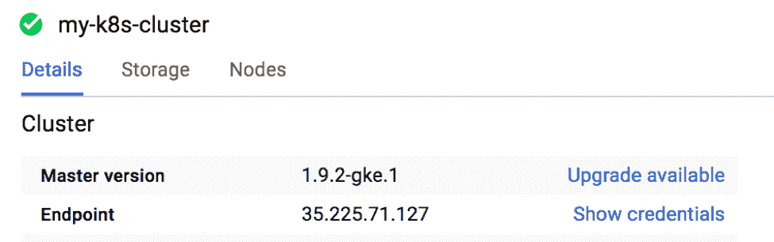GCP 控制台中的可升级信息

我们看到有一个可用的升级。截图中的 1.9.3-gke.1 刚刚发布，我们的集群可以升级：

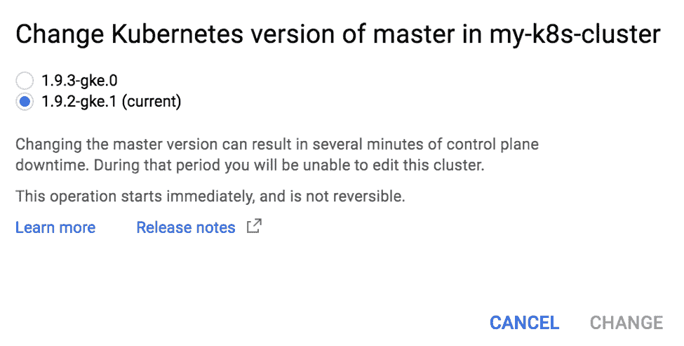可升级至 1.9.3-gke.0

我们可以通过 GKE 控制台或使用 gcloud 命令升级集群。我们将使用单区域（`us-central1-a`）集群来演示如何在下一个示例中进行升级。在升级集群时，主节点始终是首先进行升级的节点。期望的节点版本不能大于当前主节点版本。

```
# gcloud container clusters upgrade my-k8s-cluster --zone us-central1-a --cluster-version 1.9.3-gke.0 –master
Master of cluster [my-k8s-cluster] will be upgraded from version
[1.9.2-gke.1] to version [1.9.3-gke.0]. This operation is long-running
 and will block other operations on the cluster (including delete)
until it has run to completion.
Do you want to continue (Y/n)?  y
Upgrading my-k8s-cluster...done.
Updated [https://container.googleapis.com/v1/projects/kubernetes-cookbook/zones/us-central1-a/clusters/my-k8s-cluster].
```

让我们检查一下主节点的版本：

```
# kubectl version
...
Server Version: version.Info{Major:"1", Minor:"9+", GitVersion:"v1.9.3-gke.0", GitCommit:"a7b719f7d3463eb5431cf8a3caf5d485827b4210", GitTreeState:"clean", BuildDate:"2018-02-16T18:26:01Z", GoVersion:"go1.9.2b4", Compiler:"gc", Platform:"linux/amd64"}
```

看起来不错。主节点已升级到`v1.9.3-gke.0`，但我们的节点还没有升级：

```
# kubectl get nodes
NAME                                            STATUS    ROLES     AGE       VERSION
gke-my-k8s-cluster-default-pool-978ca614-3jxx   Ready     <none>    8m        v1.9.2-gke.1
gke-my-k8s-cluster-default-pool-978ca614-njrs   Ready     <none>    8m        v1.9.2-gke.1
gke-my-k8s-cluster-default-pool-978ca614-xmlw   Ready     <none>    8m        v1.9.2-gke.1
```

对于节点升级，GKE 不会一次性升级所有节点，而是执行滚动升级。它将首先从节点池中排空和注销一个节点，删除旧实例，然后使用所需版本重新创建一个新实例，然后将其添加回集群中：

```
// perform node upgrades.
# gcloud container clusters upgrade my-k8s-cluster --zone us-central1-a --cluster-version 1.9.3-gke.0
All nodes (3 nodes) of cluster [my-k8s-cluster] will be upgraded from
version [1.9.2-gke.1] to version [1.9.3-gke.0]. This operation is
long-running and will block other operations on the cluster (including
 delete) until it has run to completion.
Do you want to continue (Y/n)?  y
Upgrading my-k8s-cluster...done.
Updated [https://container.googleapis.com/v1/projects/kubernetes-cookbook/zones/us-central1-a/clusters/my-k8s-cluster].
```

节点池可以通过在集群创建期间使用`--enable-autoupgrade`标志进行自动升级，或者使用 gcloud 容器`node-pools`更新命令来更新现有节点池。有关更多信息，请参阅[`cloud.google.com/kubernetes-engine/docs/concepts/node-auto-upgrades`](https://cloud.google.com/kubernetes-engine/docs/concepts/node-auto-upgrades)。

这将需要超过 10 分钟。之后，集群中的所有节点都将升级到`1.9.3-gke.0`。

# 另请参阅

+   *在第八章中 kubeconfig 的高级设置*，*高级集群管理*

+   *在第八章中设置节点资源*，*高级集群管理*
