# 高级集群管理

在本章中，我们将涵盖以下内容：

+   kubeconfig 中的高级设置

+   在节点中设置资源

+   使用 WebUI 玩耍

+   使用 RESTful API 工作

+   使用 Kubernetes DNS 工作

+   认证和授权

# 介绍

在本章中，我们将介绍一些高级管理主题。首先，您将学习如何使用 kubeconfig 来管理不同的集群。然后，我们将在节点中处理计算资源。Kubernetes 提供了友好的用户界面，用于展示资源的当前状态，例如部署、节点和 Pod。您将学习如何构建和管理它。

接下来，您将学习如何使用 Kubernetes 公开的 RESTful API。这将是与其他系统集成的便捷方式。最后，我们希望构建一个安全的集群；最后一节将介绍如何在 Kubernetes 中设置认证和授权。

# kubeconfig 中的高级设置

**kubeconfig**是一个配置文件，在客户端上管理 Kubernetes 中的集群、上下文和认证设置。使用`kubeconfig`文件，我们可以设置不同的集群凭据、用户和命名空间，以在集群之间或集群内的上下文之间切换。它可以通过使用`kubectl config`子命令来配置命令行，也可以通过直接更新配置文件来配置。在本节中，我们将描述如何使用`kubectl config`来操作 kubeconfig 以及如何直接输入 kubeconfig 文件。

如果您已经阅读了第二章中的*使用命名空间*，即*走进 Kubernetes 概念*，那里我们首次提到了 kubeconfig，您将了解其基本概念。让我们回顾一些关键点：

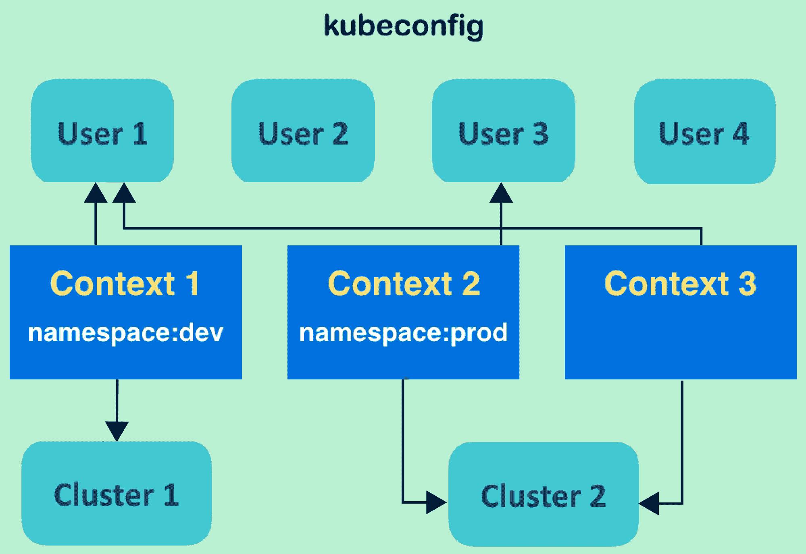kubeconfig 包含三个参数：用户、集群和上下文

从上图可以注意到以下内容：

+   **kubeconfig 中有三个参数**：用户、集群和上下文—用户有自己的认证，而集群确定了具有专用计算资源的特定 API 服务器。上下文既是*用户*又是集群。

+   **为各种设置组合构建多个上下文**：用户和集群可以在不同的上下文中共享。

+   **命名空间可以在一个上下文中对齐**：命名空间的当前上下文设置了规则。任何请求都应遵循当前上下文中的用户和集群映射。

# 做好准备

请运行两个 Kubernetes 集群，并为它们指定主机名。您可以在主节点上更新 hostfile（`/etc/hosts`）。一个在本地主机上，API 服务器端点为`http://localhost:8080`，另一个在远程端点，端点为`http://$REMOTE_MASTER_NODE:8080`。我们将使用这两个集群进行演示。这里的 API 服务器端点是不安全的通道。这是一个简单的 API 服务器配置，用于虚拟访问权限。

**在 kubeadm 上启用 API 服务器的不安全端点**

在运行`kubeadm init`时，我们必须传递额外的参数给 API 服务器。在这种情况下，应用标志`--config`指示的自定义配置文件：

```
// you can also get this file through code bundle $ cat additional-kubeadm-config apiVersion: kubeadm.k8s.io/v1alpha1 kind: MasterConfiguration apiServerExtraArgs:
 insecure-bind-address: "0.0.0.0" insecure-port: "8080" // start cluster with additional system settings $ sudo kubeadm init --config ./additional-kubeadm-config
```

在启动了两个具有不安全访问 API 服务器端点的集群之后，确保您可以在本地主机集群上访问它们：

```
// on localhost cluster, the following commands should be successful
$ curl http://localhost:8080
$ curl http://$REMOTE_MASTER_NODE:8080
```

请注意，不安全的地址配置只是为了我们即将进行的教程。用户应该小心在实际系统中正确设置它。

在开始之前，我们应该检查默认的 kubeconfig，以便观察任何更新后的更改。执行命令`kubectl config view`来查看您的初始 kubeconfig：

```
// the settings created by kubeadm
$ kubectl config view
apiVersion: v1
clusters:
- cluster:
    certificate-authority-data: REDACTED
    server: https://192.168.122.101:6443
  name: kubernetes
contexts:
- context:
    cluster: kubernetes
    user: kubernetes-admin
  name: kubernetes-admin@kubernetes
current-context: kubernetes-admin@kubernetes kind: Config
preferences: {}
users:
- name: kubernetes-admin
  user:
    client-certificate-data: REDACTED
    client-key-data: REDACTED
```

根据您的安装方法，可能会有一些不同的设置。但是我们也可以发现工具已经初始化了一个基本上下文，即`kubeadm`中的`kubernetes-admin@kubernetes`。继续复制物理的`kubeconfig`文件作为以后更新的基础，并在练习后恢复我们的原始环境。

```
// in default, the kubeconfig used by client is the one under $HOME
$ cp ~/.kube/config ~/original-kubeconfig
```

# 如何做...

在这个教程中，我们将使用本地主机集群作为主控制台，通过上下文更改来切换集群。首先，在两个集群中运行不同数量的`nginx`，并确保所有的 pod 都在运行：

```
// in the terminal of localhost cluster
$ kubectl run local-nginx --image=nginx --replicas=2 --port=80
deployment "local-nginx" created
// check the running pods
$ kubectl get pod
NAME                           READY     STATUS    RESTARTS   AGE
local-nginx-6484bbb57d-xpjp2   1/1       Running   0          1m
local-nginx-6484bbb57d-z4qgp   1/1       Running   0          1m
// in the terminal of remote cluster
$ kubectl run remote-nginx --image=nginx --replicas=4 --port=80
deployment "remote-nginx" created
$ kubectl get pod
NAME                            READY     STATUS    RESTARTS   AGE
remote-nginx-5dd7b9cb7d-fxr9m   1/1       Running   0          29s
remote-nginx-5dd7b9cb7d-gj2ft   1/1       Running   0          29s
remote-nginx-5dd7b9cb7d-h7lmj   1/1       Running   0          29s
remote-nginx-5dd7b9cb7d-hz766   1/1       Running   0          29s
```

# 设置新的凭据

接下来，我们将为每个集群设置两个凭据。使用子命令`set-credentials`，如`kubectl config set-credentials <CREDENTIAL_NAME>`，将凭据添加到 kubeconfig 中。Kubernetes 支持不同的身份验证方法。我们可以使用密码、客户端证书或令牌。在这个例子中，我们将使用 HTTP 基本身份验证来简化场景。Kubernetes 还支持客户端证书和令牌身份验证。有关更多信息，请使用标志`-h`执行`set-credentials`命令，以详细介绍其功能：

```
// check the details of setting up credentials
$ kubectl config set-credentials -h
// in localhost cluster, copy the based file into a new one
$ cp ~/original-kubeconfig ~/new-kubeconfig
// add a user "user-local" with credential named "myself@localhost" in kubeconfig "new-kubeconfig"
$ kubectl config set-credentials myself@localhost --username=user-local --password=passwordlocal --kubeconfig="new-kubeconfig"
User "myself@local" set.
```

通过上述步骤，我们成功在`"new-kubeconfig"` kubeconfig 文件中添加了新的凭据。kubeconfig 文件将默认格式化为 YAML-您可以通过文本编辑器检查文件。通过这种方法，我们能够定制新的配置而不干扰当前的设置。另一方面，如果没有`--kubeconfig`标志，更新将直接附加到`live kubeconfig`上：

```
// renew live kubeconfig file with previous update
$ cp ~/new-kubeconfig ~/.kube/config
// add another credential in localhost cluster, this time, let's update current settings directly
$ kubectl config set-credentials myself@remote --username=user-remote --password=passwordremote
User "myself@remote" set.
```

此时，请检查您的 live kubeconfig 设置，并找出新的凭据：

```
$ kubectl config view
...
users:
- name: myself@local
  user:
    password: passwordlocal
    username: user-local
- name: myself@remote
  user:
    password: passwordremote
    username: user-remote
```

# 设置新的集群

要设置一个新的集群，我们使用命令`kubectl config set-cluster <CLUSTER_NAME>`。需要额外的`--server`标志来指示访问集群。其他标志用于定义安全级别，例如`--insecure-skip-tls-verify`标志，它可以绕过对服务器证书的检查。如果您正在设置一个带有 HTTPS 的受信任服务器，您将需要使用`--certificate-authority=$PATH_OF_CERT --embed-certs=true`代替。要获取更多信息，请使用`-h`标志执行命令以获取更多信息。在接下来的命令中，我们在本地主机环境中设置了两个集群配置：

```
// in localhost cluster, create a cluster information pointing to itself
 $ kubectl config set-cluster local-cluster --insecure-skip-tls-verify=true --server=http://localhost:8080
 Cluster "local-cluster" set.
 // another cluster information is about the remote one
 $ kubectl config set-cluster remote-cluster --insecure-skip-tls-verify=true --server=http://$REMOTE_MASTER_NODE:8080
 Cluster "remote-cluster" set.
 // check kubeconfig in localhost cluster, in this example, the remote master node has the hostname "node01"
 $ kubectl config view
 apiVersion: v1
 clusters:
 ...
 - cluster:
     insecure-skip-tls-verify: true
     server: http://localhost:8080
   name: local-cluster
 - cluster:
     insecure-skip-tls-verify: true
     server: http://node01:8080
   name: remote-cluster
 ...
```

我们尚未将任何内容与**用户**和**集群**关联起来。我们将在下一节通过**上下文**将它们关联起来。

# 设置上下文并更改当前上下文

一个上下文包含一个集群、命名空间和用户。根据当前上下文，客户端将使用指定的*用户*信息和命名空间向集群发送请求。要设置上下文，我们将使用`kubectl config set-context <CONTEXT_NAME> --user=<CREDENTIAL_NAME> --namespace=<NAMESPACE> --cluster=<CLUSTER_NAME>`命令来创建或更新它：

```
// in localhost cluster, create a context for accessing local cluster's default namespace
$ kubectl config set-context default/local/myself --user=myself@local --namespace=default --cluster=local-cluster
Context "default/local/myself" created.
// furthermore, create another context for remote cluster
$ kubectl config set-context default/remote/myself --user=myself@remote --namespace=default --cluster=remote-cluster
Context "default/remote/myself" created.
```

让我们检查当前的 kubeconfig。我们可以找到两个新的上下文：

```
$ kubectl config view
...
contexts:
- context:
    cluster: local-cluster
    namespace: default
    user: myself@local
  name: default/local/myself
- context:
    cluster: remote-cluster
    namespace: default
    user: myself@remote
  name: default/remote/myself
...
```

创建上下文后，我们可以切换上下文以管理不同的集群。在这里，我们将使用`kubectl config use-context <CONTEXT_NAME>`命令：

```
// check current context
$ kubectl config current-context
kubernetes-admin@kubernetes

// use the new local context instead
$ kubectl config use-context default/local/myself
Switched to context "default/local/myself".
// check resource for the status of context
$ kubectl get pod
NAME                           READY     STATUS    RESTARTS   AGE
local-nginx-6484bbb57d-xpjp2   1/1       Running   0          2h
local-nginx-6484bbb57d-z4qgp   1/1       Running   0          2h
```

是的，看起来不错。如果我们切换到具有远程集群设置的上下文呢？

```
// switch to the context of remote cluster
$ kubectl config use-context default/remote/myself
Switched to context "default/remote/myself".
// check the pods
$ kubectl get pod
NAME                            READY     STATUS    RESTARTS   AGE
remote-nginx-5dd7b9cb7d-fxr9m   1/1       Running   0          2h
remote-nginx-5dd7b9cb7d-gj2ft   1/1       Running   0          2h
remote-nginx-5dd7b9cb7d-h7lmj   1/1       Running   0          2h
remote-nginx-5dd7b9cb7d-hz766   1/1       Running   0          2h
```

我们所做的所有操作都是在本地主机集群中进行的。kubeconfig 使得在多个集群上以多个用户的身份工作变得更加容易。

# 清理 kubeconfig

我们仍然可以利用`kubectl config`来删除 kubeconfig 中的配置。对于集群和上下文，您可以使用子命令`delete-cluster`和`delete-context`来删除被忽略的配置。或者，对于这三个类别，`unset`子命令可以完成删除：

```
// delete the customized local context
$ kubectl config delete-cluster local-cluster
deleted cluster local-cluster from $HOME/.kube/config

// unset the local user // to remove cluster, using property clusters.CLUSTER_NAME; to remove contexts, using property contexts.CONTEXT_NAME $ kubectl config unset users.myself@local
Property "users.myself@local" unset.
```

尽管前面的命令会立即应用于实时 kubeconfig，但更新另一个 kubeconfig 文件以进行替换的方式更快、更可靠。kubeconfig 文件是文本文件`new-kubeconfig`，我们刚刚更新的文件，或者我们从初始语句中复制的文件`original-kubeconfig`：

```
// remove all of our practices
$ cp ~/original-kubeconfig ~/.kube/config
// check your kubeconfig to make sure it has been cleaned
$ kubectl config view
```

# 还有更多...

正如我们在前一节中提到的，凭据和权限的实际用例不能被忽视，就像在我们的演示中穿越不安全的端点一样。为了避免安全问题，您可以在授予用户权限时查看官方文档（位于[`kubernetes.io/docs/admin/authentication/`](https://kubernetes.io/docs/admin/authentication/)）。

# 另请参阅

kubeconfig 管理集群、凭据和命名空间设置。查看以下完整概念的配方：

+   在第二章中的*使用秘密*配方，*深入了解 Kubernetes 概念*

+   在第二章中的*使用命名空间*配方，*深入了解 Kubernetes 概念*

# 在节点中设置资源

在任何基础设施中，计算资源管理都非常重要。我们应该很好地了解我们的应用程序，并保留足够的 CPU 和内存容量，以避免资源耗尽。在本节中，我们将介绍如何管理 Kubernetes 节点中的节点容量。此外，我们还将描述如何管理 Pod 计算资源。

Kubernetes 具有资源**服务质量**（**QoS**）的概念。它允许管理员优先考虑分配资源。根据 Pod 的设置，Kubernetes 将每个 Pod 分类为以下之一：

+   保证的 Pod

+   可突发的 Pod

+   最佳努力的 Pod

优先级为保证 > 可突发 > 最佳努力。例如，如果在同一 Kubernetes 节点中存在一个最佳努力的 Pod 和一个保证的 Pod，并且该节点遇到 CPU 问题或内存耗尽，Kubernetes 主节点将首先终止最佳努力的 Pod。让我们看看它是如何工作的。

# 准备就绪

有两种设置资源 QoS 的方法：pod 配置或命名空间配置。如果将资源 QoS 设置为命名空间，它将应用于属于同一命名空间的所有 pod。如果将资源 QoS 设置为 pod，它将仅应用于该 pod。此外，如果同时将其设置为命名空间和 pod，它将首先从命名空间配置中获取一个值，然后用 pod 配置覆盖它。因此，我们将设置两个命名空间，一个具有资源 QoS，另一个没有资源 QoS，以查看它们之间的不同：

1.  使用`kubectl`命令创建两个命名空间：

```
$ kubectl create namespace chap8-no-qos
namespace "chap8-no-qos" created

$ kubectl create namespace chap8-qos
namespace "chap8-qos" created
```

1.  准备一个 YAML 文件，设置`spec.limits.defaultRequest.cpu: 0.1`如下：

```
$ cat resource-request-cpu.yml
apiVersion: v1
kind: LimitRange
metadata:
  name: resource-request-cpu
spec:
  limits:
  - defaultRequest:
 cpu: 0.1
    type: Container
```

1.  通过输入`kubectl`命令，使其仅适用于`chap8-qos`命名空间：

```
$ kubectl create -f resource-request-cpu.yml --namespace=chap8-qos
limitrange "resource-request-cpu" created
```

1.  使用`kubectl`命令检查`chap8-qos`和`chap8-no-qos`上的资源限制：

```
//chap8-no-qos doesn't have any resource limits value
$ kubectl describe namespaces chap8-no-qos
Name:         chap8-no-qos
Labels:       <none>
Annotations:  <none>
Status:       Active
No resource quota.
No resource limits.

//chap8-qos namespace has a resource limits value
$ kubectl describe namespaces chap8-qos
Name:         chap8-qos
Labels:       <none>
Annotations:  <none>
Status:       Active
No resource quota.
Resource Limits
 Type       Resource  Min  Max  Default Request  Default Limit  Max Limit/Request Ratio
 ----       --------  ---  ---  ---------------  -------------  -----------------------
 Container  cpu       -    -    100m             -              -
```

# 如何做...

让我们逐步配置一个 BestEffort pod，一个 Guaranteed pod，然后是一个 Burstable pod。

# 配置一个 BestEffort pod

BestEffort pod 在资源 QoS 类中具有最低的优先级。因此，在资源短缺的情况下，Kubernetes 调度程序将终止此 BestEffort pod，然后将 CPU 和内存资源让给其他优先级更高的 pod。

为了将 pod 配置为 BestEffort，您需要将资源限制设置为`0`（显式），或者不指定资源限制（隐式）。

1.  准备一个 pod 配置，明确将`spec.containers.resources.limits`设置为`0`：

```
$ cat besteffort-explicit.yml
apiVersion: v1
kind: Pod
metadata:
  name: besteffort
spec:
  containers:
  - name: nginx
    image: nginx
    resources:
      limits:
 cpu: 0
 memory: 0
```

1.  在`chap8-qos`和`chap8-no-qos`命名空间上创建 pod：

```
$ kubectl create -f besteffort-explicit.yml --namespace=chap8-qos
pod "besteffort" created

$ kubectl create -f besteffort-explicit.yml --namespace=chap8-no-qos
pod "besteffort" created
```

1.  检查`QoS`类；两个 pod 都有`BestEffort`类：

```
$ kubectl describe pods besteffort --namespace=chap8-qos | grep QoS
QoS Class:       BestEffort

$ kubectl describe pods besteffort --namespace=chap8-no-qos | grep QoS
QoS Class:       BestEffort
```

有一个陷阱：如果在 pod 配置中没有设置任何资源设置，pod 将从命名空间的默认设置中获取一个值。因此，如果创建一个没有资源设置的 pod，在`chap8-qos`和`chap8-no-qos`之间的结果将会不同。以下示例演示了命名空间设置如何影响结果：

1.  从`chap8-qos`和`chap8-no-qos`命名空间中删除之前的 pod：

```
$ kubectl delete pod --all --namespace=chap8-qos
pod "besteffort" deleted

$ kubectl delete pod --all --namespace=chap8-no-qos
pod "besteffort" deleted
```

1.  准备一个没有资源设置的 pod 配置：

```
$ cat besteffort-implicit.yml
apiVersion: v1
kind: Pod
metadata:
  name: besteffort
spec:
  containers:
  - name: nginx
    image: nginx
```

1.  在两个命名空间上创建 pod：

```
$ kubectl create -f besteffort-implicit.yml --namespace=chap8-qos
pod "besteffort" created

$ kubectl create -f besteffort-implicit.yml --namespace=chap8-no-qos
pod "besteffort" created
```

1.  `QoS`类的结果是不同的：

```
$ kubectl describe pods besteffort --namespace=chap8-no-qos |grep QoS
QoS Class:       BestEffort

$ kubectl describe pods besteffort --namespace=chap8-qos |grep QoS
QoS Class:       Burstable
```

因为`chap8-qos`命名空间具有默认设置`request.cpu: 0.1`，这导致 pod 配置为`Burstable`类。因此，我们将使用`chap8-no-qos`命名空间，避免这种意外结果。

# 配置一个 Guaranteed pod

保证类具有资源`QoS`类的最高优先级。在资源短缺的情况下，Kubernetes 调度程序将尽量保留保证的 pod。

为了将 pod 配置为具有`保证`类，明确设置资源限制和资源请求为相同的值，或者只设置资源限制：

1.  准备一个 pod 配置，`resources.limit`和`resources.request`具有相同的值：

```
$ cat guaranteed.yml
apiVersion: v1
kind: Pod
metadata:
  name: guaranteed-pod
spec:
  containers:
  - name: nginx
    image: nginx
    resources:
      limits:
 cpu: 0.3
 memory: 350Mi
 requests:
 cpu: 0.3
 memory: 350Mi
```

1.  在`chap8-no-qos`命名空间上创建 pod：

```
$ kubectl create -f guaranteed.yml --namespace=chap8-no-qos
pod "guaranteed-pod" created
```

1.  检查`QoS`类；它有`保证`类：

```
$ kubectl describe pods guaranteed-pod --namespace=chap8-no-qos |grep QoS
QoS Class:       Guaranteed
```

# 配置一个可突发的 pod

可突发的 pod 的优先级高于 BestEffort，但低于 Guaranteed。为了将 pod 配置为可突发 Pod，您需要设置`resources.request`。`resources.limit`是可选的，但`resources.request`和`resources.limit`的值不能相等：

1.  准备一个只有`resources.request`的 pod 配置：

```
$ cat burstable.yml
apiVersion: v1
kind: Pod
metadata:
  name: burstable-pod
spec:
  containers:
  - name: nginx
    image: nginx
    resources:
      requests:
 cpu: 0.1
 memory: 10Mi
 limits:
 cpu: 0.5
 memory: 300Mi
```

1.  创建 pod：

```
$ kubectl create -f burstable.yml --namespace=chap8-no-qos
pod "burstable-pod" created
```

1.  检查`QoS`类；它是`可突发`：

```
$ kubectl describe pods burstable-pod --namespace=chap8-no-qos |grep QoS
QoS Class:       Burstable
```

# 工作原理...

让我们看看资源请求/限制如何影响资源管理。先前的可突发的 YAML 配置通过不同的阈值声明了请求和限制：

| **资源定义类型** | **资源名称** | **值** | **描述** |
| --- | --- | --- | --- |
| **请求** | CPU | 0.1 | 至少占用 1 个 CPU 核心的 10% |
| 内存 | 10Mi | 至少 10 兆字节的内存 |
| **限制** | CPU | 0.5 | 最大 1 个 CPU 核心的 50% |
| 内存 | 300Mi | 最大 300 兆字节的内存 |

对于 CPU 资源，可接受的值表达式要么是核心（0.1、0.2...1.0、2.0），要么是毫核（100 m、200 m...1000 m、2000 m）。1000 m 相当于 1.0 个核心。例如，如果 Kubernetes 节点有 2 个核心 CPU（或者 1 个带超线程的核心），则总共有 2.0 个核心或 2000 毫核，如下图所示：

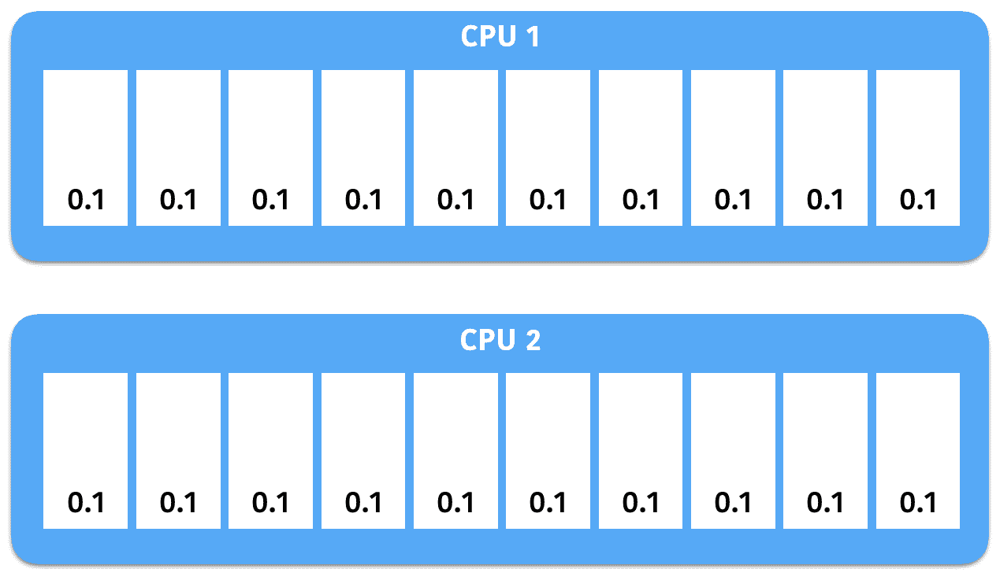代表 2.0 个 CPU 资源

通过输入`kubectl describe node <node name>`，您可以检查节点上有哪些资源：

```
//Find a node name
$ kubectl get nodes
NAME       STATUS    ROLES     AGE       VERSION
minikube   Ready     <none>    22h       v1.9.0

//Specify node name 'minikube' 
$ kubectl describe nodes minikube
Name:               minikube
Roles:              <none>
Labels:             beta.kubernetes.io/arch=amd64
...
...
Allocatable:
 cpu:     2 memory:  1945652Ki pods:    110
```

这显示了节点`minikube`，它有 2.0 个 CPU 和大约 1945 MB 的内存。如果运行 nginx 示例（`requests.cpu: 0.1`），它至少占用 0.1 个核心，如下图所示：

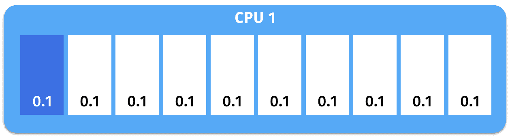请求 0.1 个 CPU 资源

只要 CPU 有足够的空间，它可以占用高达 0.5 个核心（`limits.cpu: 0.5`），如下图所示：

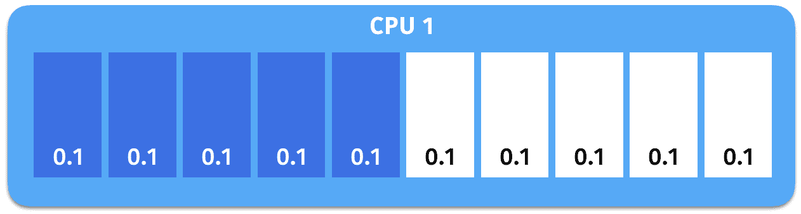它可能占用高达 0.5 个 CPU 资源

因此，如果将`requests.cpu`设置为大于 2.0，则该 pod 将不会分配给此节点，因为可分配的 CPU 为 2.0，而 nginx pod 已经占用了至少 0.1 个 CPU。

# 另请参阅

在本节中，您学会了如何通过设置资源请求和限制来配置资源 QoS。命名空间的默认值会影响生成的 pod 配置，因此您应该明确指定资源请求和限制。

请回顾以下章节，以复习如何配置命名空间：

+   *在第二章中的*使用命名空间*，*深入了解 Kubernetes 概念*

# 玩转 WebUI

Kubernetes 有一个 WebUI，可以可视化资源和机器的状态，并且还可以作为管理应用程序的附加界面，无需使用命令行。在这个示例中，我们将介绍 Kubernetes 仪表板。

# 准备就绪

Kubernetes 仪表板（[`github.com/kubernetes/dashboard`](https://github.com/kubernetes/dashboard)）就像一个服务器端应用程序。首先确保您有一个正常运行的 Kubernetes 集群，我们将在接下来的页面中进行安装和相关设置。由于仪表板将被浏览器访问，我们可以使用通过 minikube 引导的笔记本电脑运行的 Kubernetes 系统，并减少转发网络端口或设置防火墙规则的程序。

对于通过 minikube 引导的 Kubernetes 系统，请检查 minikube 和系统本身是否正常工作：

```
// check if minikube runs well
$ minikube status
minikube: Running
cluster: Running
kubectl: Correctly Configured: pointing to minikube-vm at 192.168.99.100
// check the Kubernetes system by components
$ kubectl get cs
NAME                 STATUS    MESSAGE              ERROR
scheduler            Healthy   ok
controller-manager   Healthy   ok
etcd-0               Healthy   {"health": "true"}
```

# 如何做...

在使用 minikube 引导 Kubernetes 系统时，默认情况下会创建仪表板。因此，我们将分别讨论这两种情况。

# 依赖于 minikube 创建的仪表板

因为 Kubernetes 仪表板已经启动，我们所要做的就是使用特定的 URL 打开 Web UI。这很方便；您只需在终端上输入一个命令：

```
$ minikube dashboard
Opening kubernetes dashboard in default browser...
```

然后，您将看到您喜爱的浏览器打开一个新的网页，就像我们在第一章中介绍的那样，*构建您自己的 Kubernetes 集群*。其 URL 将类似于[`MINIKUBE_VM_IP:30000/#!/overview?namespace=default`](http://MINIKUBE_VM_IP:30000/#!/overview?namespace=default)。最重要的是，我们绕过了预期的网络代理和身份验证程序。

# 手动在系统上使用其他引导工具创建仪表板

要运行 Kubernetes 仪表板，我们只需执行一个命令来应用一个配置文件，然后每个资源将自动创建：

```
$ kubectl create -f
https://raw.githubusercontent.com/kubernetes/dashboard/master/src/deploy/recommended/kubernetes-dashboard.yaml
secret "kubernetes-dashboard-certs" created
serviceaccount "kubernetes-dashboard" created
role "kubernetes-dashboard-minimal" created
rolebinding "kubernetes-dashboard-minimal" created
deployment "kubernetes-dashboard" created
service "kubernetes-dashboard" created
```

接下来，让我们使用命令`kubectl proxy`打开一个连接本地主机和 API 服务器的网关。然后，我们就可以通过浏览器访问仪表板了：

```
$ kubectl proxy
Starting to serve on 127.0.0.1:8001
```

一旦您看到类似于上述代码的停止结果，您现在可以通过 URL 访问仪表板：[`localhost:8001/api/v1/namespaces/kube-system/services/https:kubernetes-dashboard:/proxy/`](http://localhost:8001/api/v1/namespaces/kube-system/services/https:kubernetes-dashboard:/proxy/)。在那里，您将在浏览器中看到以下屏幕：

！[](assets/1b64d4fc-7349-4385-bf46-7877f2e3fc06.png)Kubernetes 仪表板的登录门户

为了快速进入我们的演示，我们将使用现有服务帐户的令牌进行登录。无论您使用什么引导工具，都可以在任何情况下利用仪表板创建的工具：

```
// check the service account in your system
$ kubectl get secret -n kube-system
NAME                               TYPE                                  DATA      AGE
default-token-7jfmd                kubernetes.io/service-account-token   3         51d
kubernetes-dashboard-certs         Opaque                                0         2d
kubernetes-dashboard-key-holder    Opaque                                2         51d
kubernetes-dashboard-token-jw42n   kubernetes.io/service-account-token   3         2d
// grabbing token by checking the detail information of the service account with prefix "kubernetes-dashboard-token-"
$ kubectl describe secret kubernetes-dashboard-token-jw42n -n kube-system
Name:         kubernetes-dashboard-token-jw42n
Namespace:    kube-system
Labels:       <none>
Annotations:  kubernetes.io/service-account.name=kubernetes-dashboard
              kubernetes.io/service-account.uid=253a1a8f-210b-11e8-b301-8230b6ac4959
Type:  kubernetes.io/service-account-token
Data
====
ca.crt:     1066 bytes
namespace:  11 bytes
token:     
eyJhbGciOiJSUzI1NiIsInR5cCI6IkpXVCJ9.eyJpc3MiOiJrdWJlcm5ldGVzL3NlcnZpY2VhY2NvdW50Ii....
```

复制令牌并粘贴到浏览器控制台中，然后点击“登录”：

！[](assets/fe682158-1db8-4f8a-8f62-041683a327a0.png)使用服务帐户的令牌进行身份验证

欢迎来到仪表板主页：

！[](assets/9319f189-19d4-40e2-a573-e10dd4ec8e91.png)Kubernetes 仪表板的主页

# 它是如何工作的...

Kubernetes 仪表板有两个主要功能：检查资源的状态和部署资源。它可以覆盖我们在客户端终端使用`kubectl`命令的大部分工作，但是图形界面更加友好。

# 通过仪表板浏览您的资源

我们可以在仪表板上检查硬件和软件资源。例如，要查看集群中的节点，请在左侧菜单的“集群”部分下点击“节点”；当前集群中的每个节点将显示在页面上，并附有一些基本信息：

！[](assets/9d2d70c8-65d3-4df0-aebb-133b8dda5fb4.png)仪表板上 Kubernetes 节点的状态

您屏幕上的结果可能与上述截图不同，因为它将基于您的环境。继续点击一个节点的名称；甚至会显示更多详细信息。其中一些以美丽的图表呈现：

！[](assets/b21650a8-65fe-4a70-91b4-40202faef84a.png)计算节点资源状态

展示软件资源，让我们来看看持有这个仪表板的资源。在左侧菜单中，将 Namespace 更改为 kube-system，并单击概述，这将汇总该 Namespace 下的所有资源。通过在单个页面上将资源放在一起并使用清晰的图表，很容易找出任何问题：

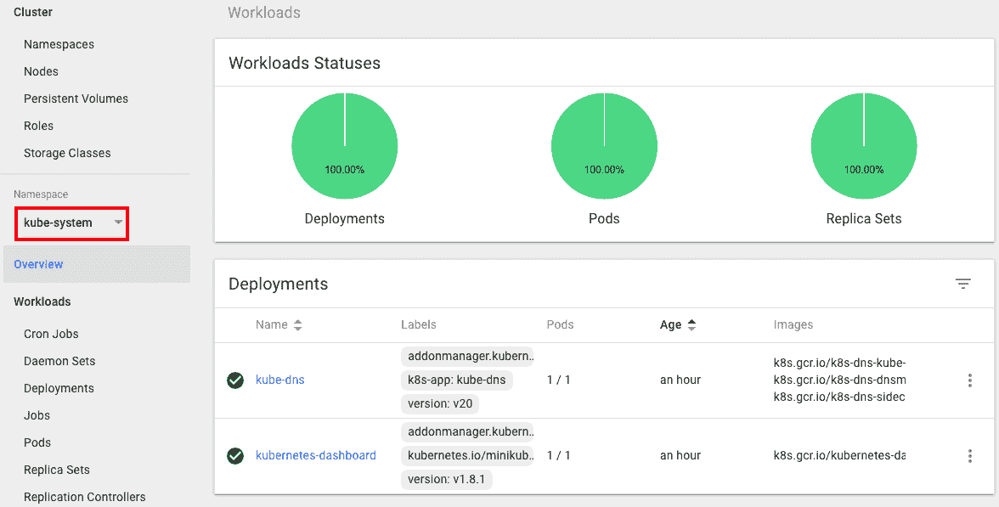kube-system 命名空间的资源概述

还有更多；单击 kubernetes-dashboard 的部署，然后单击副本集中唯一 pod 右侧的小文本文件图标。您可以查看容器的日志：

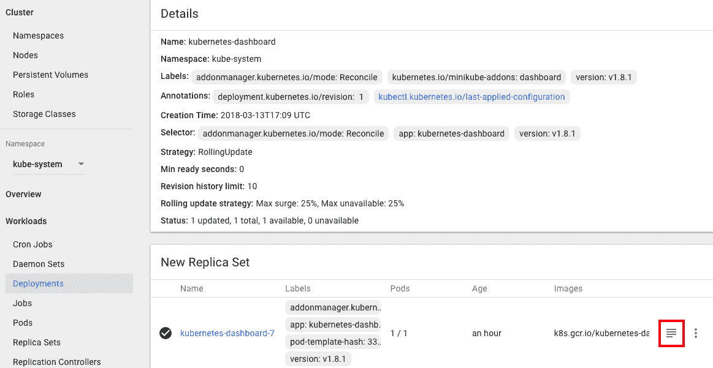kubernetes-dashboard 的部署信息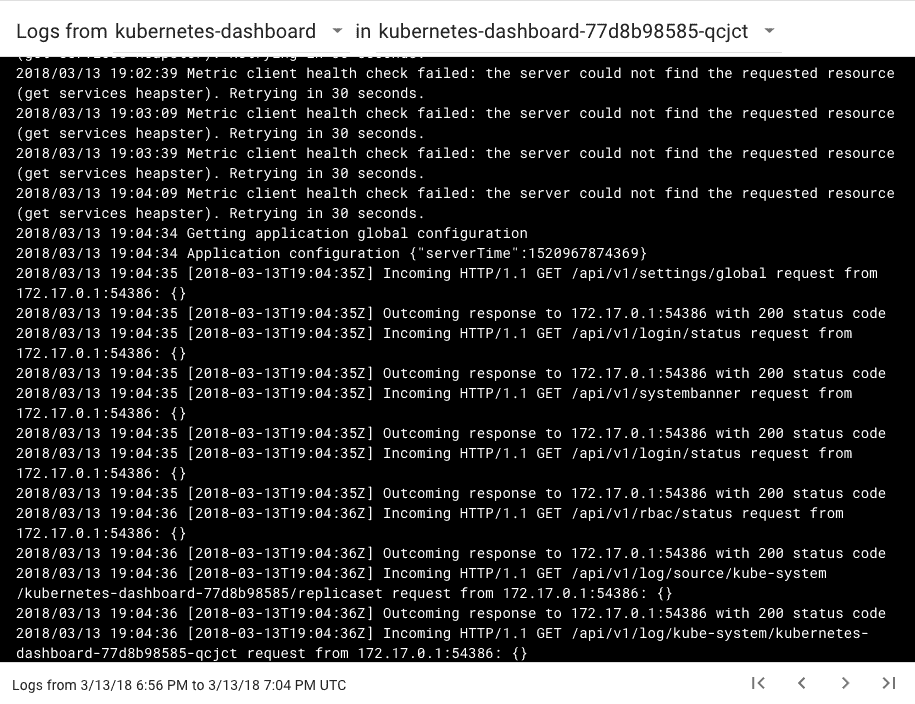仪表板应用程序的日志

现在，我们已经看到 Kubernetes 仪表板提供了一个出色的界面，用于显示资源状态，包括节点、Kubernetes 工作负载和控制器，以及应用程序日志。

# 通过仪表板部署资源

在这里，我们将准备一个 YAML 配置文件，用于在新的 Namespace 下创建 Kubernetes 部署和相关服务。它将用于通过仪表板构建资源：

```
// the configuration file for creating Deployment and Service on new Namespace: dashboard-test
$ cat my-nginx.yaml
apiVersion: apps/v1beta2
kind: Deployment
metadata:
  name: my-nginx
  namespace: dashboard-test
spec:
  replicas: 3
  selector:
    matchLabels:
      run: demo
  template:
    metadata:
      labels:
        run: demo
    spec:
      containers:
      - name: my-container
        image: nginx
        ports:
        - containerPort: 80
---
apiVersion: v1
kind: Service
metadata:
  name: my-nginx
  namespace: dashboard-test
spec:
  ports:
    - protocol: TCP
      port: 80
  type: NodePort
  selector:
    run: demo
```

首先，单击网页右上角的 CREATE 按钮。

部署有三种方法。让我们选择第二种方法并上传先前介绍的配置文件。单击 UPLOAD 按钮：

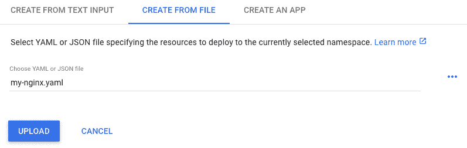通过配置文件创建资源

不幸的是，发生了错误：

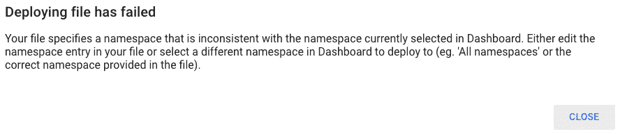由于错误部署而导致的问题的错误消息

仪表板根据左侧菜单上*用户*选择的 Namespace 显示资源。此错误消息弹出并告诉用户，文件中提到的 Namespace 与仪表板中的不匹配。我们需要做的是创建一个新的 Namespace 并切换到它。

这一次，我们将使用纯文本创建一个 Namespace。再次单击 CREATE 按钮，并选择从文本输入方法创建。将以下行粘贴到网页上以创建一个新的 Namespace：

```
apiVersion: v1
kind: Namespace
metadata:
  name: dashboard-test
```

现在，我们有一个新的 Namespace，`dashboard-test`。在仪表板上选择它作为主 Namespace，并再次提交`my-nginx.yaml`文件：

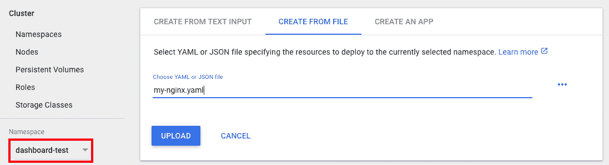在提交配置文件之前选择正确的 Namespace

现在您可以查看此部署的概述！黄色圆圈表示挂起状态。一旦 pod 准备就绪，它们将变为绿色，或者如果失败，它们将变为红色，但是如果您按照以下步骤操作，您将看不到红色的圆圈：

创建资源的状态图

# 通过仪表板删除资源

我们还可以通过仪表板删除 Kubernetes 资源。尝试自己找到我们刚刚创建的 Service `my-nginx`！执行以下操作：

+   在左侧菜单上更改 Namespace 为 dashboard-test

+   单击左侧菜单中的 Discovery and load balancing 部分下的 Services

+   单击超链接名称上的 Service my-nginx

+   单击页面右上角的 DELETE，位于 CREATE 按钮下方

就是这样！一旦您看到屏幕上弹出确认消息，只需单击即可。最后，您不仅创建了一个资源，还从 Kubernetes 仪表板中删除了它。

# 另请参阅

本教程介绍了如何启动一个 Web 界面，以便轻松地探索和管理 Kubernetes 实例，如 pod、部署和服务，而无需使用`kubectl`命令。请参考第二章中的以下教程，了解如何通过`kubectl`命令获取详细信息。

+   在第二章中的*使用 Pod*、*部署 API*和*使用服务*教程，深入了解 Kubernetes 概念

# 使用 RESTful API 进行操作

用户可以通过`kubectl`命令控制 Kubernetes 集群；它支持本地和远程执行。但是，一些管理员或操作员可能需要集成一个程序来控制 Kubernetes 集群。

Kubernetes 具有一个 RESTful API，通过 API 控制 Kubernetes 集群，类似于`kubectl`命令。让我们学习如何通过提交 API 请求来管理 Kubernetes 资源。

# 准备工作

在本教程中，为了绕过额外的网络设置和验证权限，我们将演示使用*minikube-*创建的集群与 Kubernetes 代理：在主机上轻松创建 Kubernetes 集群，并使用代理条目启用对 API 服务器的本地接近。

首先，运行代理以快速转发 API 请求：

```
//curl by API endpoint
$ kubectl proxy
Starting to serve on 127.0.0.1:8001
```

在使用 Kubernetes 代理工作一段时间后，您可能会发现`kubectl proxy`命令会在终端上停止，迫使您为后续命令打开一个新的通道，这有点让人讨厌。为了避免这种情况，只需在命令的最后一个参数中添加`&`。在 shell 中，这个`&`符号将使您的命令在后台运行：

```
$ kubectl proxy &
[1] 6372
Starting to serve on 127.0.0.1:8001
```

请注意，如果您不使用代理，应手动终止此进程：

```
$ kill -j9 6372
```

然后，尝试使用简单的路径`/api`来测试终端点：

```
$ curl http://127.0.0.1:8001/api
{
  "kind": "APIVersions",
  "versions": [
    "v1"
  ],
  "serverAddressByClientCIDRs": [
    {
      "clientCIDR": "0.0.0.0/0",
      "serverAddress": "10.0.2.15:8443"
    }
  ]
}
```

一旦您看到一些基本的 API 服务器信息显示在前面的代码中，恭喜！您现在可以使用 Kubernetes 的 Kubernetes RESTful API 进行操作。

**访问 Kubernetes API 服务器的安全方式**

但是，如果您考虑访问更安全的 API 服务器，比如 kubeadm 集群，则应注意以下事项：

+   API 服务器的终端点

+   用于身份验证的令牌

我们可以通过以下命令获取所需的信息。然后，您可以成功地请求版本的 API：

```
$ APISERVER=$(kubectl config view | grep server | cut -f 2- -d ":" | tr -d " ")
// get the token of default service account
$ TOKEN=$(kubectl get secret --field-selector type=kubernetes.io/service-account-token -o name | grep default-token- | head -n 1 | xargs kubectl get -o 'jsonpath={.data.token}' | base64 -d)
$ curl $APISERVER/api -H "Authorization: Bearer $TOKEN" --insecure
```

另一方面，当在 kubeadm 中访问资源时，您可能会看到显示“权限被拒绝”的消息。如果是这样，解决方案是将默认服务账户绑定到管理员角色，即 kubeadm 系统中的`cluster-admin`。我们在代码包中提供了配置文件`rbac.yaml`，如果需要，请查看：

```
$ curl $APISERVER/api/v1/namespaces/default/services -H "Authorization: Bearer $TOKEN" --insecure
...
 "status": "Failure",
 "message": "services is forbidden: User \"system:serviceaccount:default:default\" cannot list services in the namespace \"default\"",
 "reason": "Forbidden",
...
$ kubectl create -f rbac.yaml
clusterrolebinding "fabric8-rbac" created
// now the API request is successful
$ curl $APISERVER/api/v1/namespaces/default/services -H "Authorization: Bearer $TOKEN" --insecure
{
   "kind": "ServiceList",
   "apiVersion": "v1",
   "metadata": {
      "selfLink": "/api/v1/namespaces/default/services",
      "resourceVersion": "291954"
    },
...
```

小心使用`--insecure`标志，因为终端点使用 HTTPS 协议，而`-H`则添加带有令牌的标头。这些是与我们的天真演示设置相比的额外设置。

# 如何做到...

在本节中，我们将向您展示如何通过 RESTful API 管理资源。通常，`curl`的命令行模式将涵盖以下想法：

+   **操作**：`curl`没有指定操作将默认触发`GET`。要指定操作，请添加`X`标志。

+   **主体数据**：就像使用`kubectl`创建 Kubernetes 资源一样，我们使用`d`标志应用资源配置。带有`@`符号的值可以附加一个文件。此外，`h`标志有助于添加请求标头；在这里，我们需要以 JSON 格式添加内容类型。

+   **URL**：在终端点之后有各种路径，基于不同的功能。

让我们使用以下 JSON 配置文件创建一个部署：

```
$ cat nginx-deployment.json
{
  "apiVersion": "apps/v1",
  "kind": "Deployment",
  "metadata": {
    "name": "my-nginx"
  },
  "spec": {
    "replicas": 2,
       "selector": {
      "matchLabels": {
        "app": "nginx"
      }
    },
    "template": {
      "metadata": {
        "labels": {
          "app": "nginx"
        }
      },
      "spec": {
        "containers": [
          {
            "image": "nginx",
            "name": "my-nginx"
          }
        ]
      }
    }
  }
}
```

我们可以在 API 参考页面中找到每个功能（[`kubernetes.io/docs/reference/generated/kubernetes-api/v1.10/`](https://kubernetes.io/docs/reference/generated/kubernetes-api/v1.10/)）。这类似于在编写配置文件时搜索资源的配置。要提交 API 请求，您应该知道要处理哪种资源，以及要在其上执行什么操作。执行以下步骤在参考网页上找到相应的信息：

1.  选择一个资源。

1.  选择一个操作，例如读取或写入。

1.  选择操作的详细信息，例如创建或删除。

1.  信息将显示在网页的中间面板上。一个可选的步骤是在控制台右上角将`kubectl`切换到`curl`。更多细节，比如命令标志，将显示在右侧面板上。

要检查创建部署的信息，您的 Web 控制台可能看起来像这个屏幕截图一样：

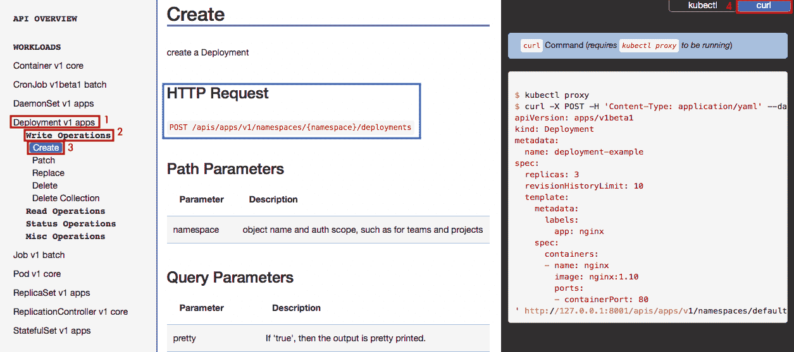使用 API 创建部署的路径查找步骤

根据参考页面，我们可以组合一个指定的`curl`命令并立即发出请求：

```
$ curl -X POST -H "Content-type: application/json" -d @nginx-deployment.json http://localhost:8001/apis/apps/v1/namespaces/default/deployments
{
  "kind": "Deployment",
  "apiVersion": "apps/v1",
  "metadata": {
    "name": "my-nginx",
    "namespace": "default",
    "selfLink": "/apis/apps/v1/namespaces/default/deployments/my-nginx",
    "uid": "6eca324e-2cc8-11e8-806a-080027b04dc6",
    "resourceVersion": "209",
    "generation": 1,
    "creationTimestamp": "2018-03-21T05:26:39Z",
    "labels": {
      "app": "nginx"
    }
  },
...
```

对于成功的请求，服务器将返回资源的状态。继续检查是否可以通过`kubectl`命令找到新的部署：

```
$ kubectl get deployment
NAME       DESIRED   CURRENT   UP-TO-DATE   AVAILABLE   AGE
my-nginx   2         2         2            2           1m
```

当然，也可以通过 RESTful API 进行检查：

```
// the operation "-X GET" can be ignored, since
$ curl -X GET http://localhost:8001/apis/apps/v1/namespaces/default/deployments
```

接下来，尝试删除这个新的 Deployment，`my-nginx`，这也是一种`写`操作：

```
$ curl -X DELETE http://localhost:8001/apis/apps/v1/namespaces/default/deployments/my-nginx
{
  "kind": "Status",
  "apiVersion": "v1",
  "metadata": {
  },
  "status": "Success",
  "details": {
    "name": "my-nginx",
    "group": "apps",
    "kind": "deployments",
    "uid": "386a3aaa-2d2d-11e8-9843-080027b04dc6"
  }
}
```

# 它是如何工作的...

RESTful API 允许 CRUD（创建、读取、更新和删除）操作，这是每个现代 Web 应用程序背后的相同概念。有关更多详细信息，请参阅[`en.wikipedia.org/wiki/Create,_read,_update_and_delete`](https://en.wikipedia.org/wiki/Create,_read,_update_and_delete)。

根据 CRUD 结构，Kubernetes RESTful API 具有以下基本方法：

| **操作** | **HTTP 方法** | **示例** |
| --- | --- | --- |
| 创建 | `POST` | `POST /api/v1/namespaces/default/pods` |
| 读取 | `GET` | `GET /api/v1/componentstatuses` |
| 更新 | `PUT` | `PUT /apis/apps/v1/namespaces/default/deployments/my-nginx` |
| 删除 | `DELETE` | `DELETE /api/v1/namespaces/default/services/nginx-service` |

正如我们在第三章的*使用配置文件*配方中提到的，Kubernetes 使用*swagger*（[`swagger.io/`](https://swagger.io)）和 OpenAPI（[`www.openapis.org`](https://www.openapis.org)）构建 RESTful API。我们可以打开集群的 swagger UI 控制台来检查 API 功能。然而，建议您通过官方网站进行检查，就像我们在上一节中演示的那样。网站上的描述更加详细和用户友好。

# 还有更多...

更加程序化的利用 Kubernetes API 的方法是使用客户端库（[`kubernetes.io/docs/reference/client-libraries/`](https://kubernetes.io/docs/reference/client-libraries/)）。充分利用这些客户端工具不仅可以节省资源管理时间，还可以产生稳健可靠的 CI/CD 环境。在这里，我们想介绍 Python 的 Kubernetes 客户端库：[`github.com/kubernetes-client/python`](https://github.com/kubernetes-client/python)。首先，您应该安装 Kubernetes 的 Python 库：

```
$ pip install kubernetes
```

然后，请将以下 Python 文件放在与 JSON 配置文件`nginx-deployment.json`相同的位置，其中在系统上运行`kubectl`有效：

```
$ cat create_deployment.py
from kubernetes import client, config
import json
config.load_kube_config()
resource_config = json.load(open("./nginx-deployment.json"))
api_instance = client.AppsV1Api()
response = api_instance.create_namespaced_deployment(body=resource_config, namespace="default")
print("success, status={}".format(response.status))
```

现在甚至不需要启用 Kubernetes 代理；继续直接运行此脚本，看看会发生什么：

```
$ python create_deployment.py
```

# 另请参阅

本文介绍了如何通过程序使用 Kubernetes RESTful API。将其与远程自动化程序集成非常重要。有关详细参数和安全增强，请参考以下配方：

+   第三章中的*使用配置文件*配方，*与容器一起玩*

+   第七章中的*身份验证和授权*配方，*在 GCP 上构建 Kubernetes*

# 使用 Kubernetes DNS

当您将许多 Pod 部署到 Kubernetes 集群时，服务发现是最重要的功能之一，因为 Pod 可能依赖于其他 Pod，但是当 Pod 重新启动时，其 IP 地址将发生变化。您需要一种灵活的方式来将 Pod 的 IP 地址传达给其他 Pod。Kubernetes 有一个名为`kube-dns`的附加功能，可以帮助解决这种情况。它可以为 Pod 和 Kubernetes 服务注册和查找 IP 地址。

在本节中，我们将探讨如何使用`kube-dns`，它为您提供了一种灵活的方式来配置 Kubernetes 集群中的 DNS。

# 准备工作

自 Kubernetes 版本 1.3 以来，`kube-dns`已经随 Kubernetes 一起提供，并且默认情况下已启用。要检查`kube-dns`是否工作，请使用以下命令检查`kube-system`命名空间：

```
$ kubectl get deploy kube-dns --namespace=kube-system NAME       DESIRED   CURRENT   UP-TO-DATE   AVAILABLE   AGE kube-dns   1         1         1            1           1d
```

如果您正在使用 minikube，请输入以下命令来查看插件的状态：

```
$ minikube addons list |grep kube-dns
- kube-dns: enabled
```

如果显示为禁用状态，则需要使用以下命令启用它：

```
$ minikube addons enable kube-dns
```

此外，准备两个命名空间`chap8-domain1`和`chap8-domain2`，以演示`kube-dns`如何分配域名：

```
$ kubectl create namespace chap8-domain1 namespace "chap8-domain1" created $ kubectl create namespace chap8-domain2 namespace "chap8-domain2" created //check chap8-domain1 and chap8-domain2 $ kubectl get namespaces NAME            STATUS    AGE chap8-domain1 Active    16s chap8-domain2 **Active    14s** default         Active    4h kube-public     Active    4h kube-system     Active    4h  
```

# 如何做...

`kube-dns`为 pod 和 Kubernetes 服务分配**完全** **限定域名**（**FQDN**）。让我们看看一些不同之处。

# pod 的 DNS

Kubernetes 为 pod 分配的域名为`<IP 地址>.<命名空间名称>.pod.cluster.local`。因为它使用了 pod 的 IP 地址，所以 FQDN 不能保证永久存在，但如果应用程序需要 FQDN，那么拥有它是很好的。

让我们在`chap8-domain1`和`chap8-domain2`上部署 apache2（`httpd`），如下所示：

```
$ kubectl run my-apache --image=httpd --namespace chap8-domain1 deployment "my-apache" created $ kubectl run my-apache --image=httpd --namespace chap8-domain2 deployment "my-apache" created
```

键入`kubectl get pod -o wide`以捕获这些 pod 的 IP 地址：

```
$ kubectl get pods -o wide --namespace=chap8-domain**1** NAME                         READY     STATUS    RESTARTS   AGE       IP           NODE my-apache-55fb679f49-qw58f   1/1       Running   0          27s        **172.17.0.4**   minikube   $ kubectl get pods -o wide --namespace=chap8-domain**2** NAME                         READY     STATUS    RESTARTS   AGE       IP           NODE my-apache-55fb679f49-z9gsr   1/1       Running   0          26s        **172.17.0.5**   minikube
```

这显示了`chap8-domain1`上的`my-apache-55fb679f49-qw58f`使用`172.17.0.4`。另一方面，`chap8-domain2`上的`my-apache-55fb679f49-z9gsr`使用`172.17.0.5`。

在这种情况下，FQDN 将是：

+   `172-17-0-4.chap8-domain1.pod.cluster.local` (`chap8-domain1`)

+   `172-17-0-5.chap8-domain2.pod.cluster.local` (`chap8-domain2`)

请注意，IP 地址中的点（`.`）被更改为连字符（`-`）。这是因为点是用来确定子域的分隔符。

要检查名称解析是否有效，请在前台启动`busybox` pod（使用`-it`选项）。然后使用`nslookup`命令来解析 FQDN 到 IP 地址，如下面的步骤所示：

1.  使用`-it`选项运行`busybox`：

```
$ kubectl run -it busybox --restart=Never --image=busybox
```

1.  在 busybox pod 中，键入`nslookup`来解析`chap8-domain1`上 apache 的 FQDN：

```
# nslookup 172-17-0-4.chap8-domain1.pod.cluster.local Server: 10.96.0.10 Address 1: 10.96.0.10 kube-dns.kube-system.svc.cluster.local Name: 172-17-0-4.chap8-domain1.pod.cluster.local Address 1: 172.17.0.4
```

1.  还要输入`nslookup`来解析`chap8-domain`2 上 apache 的 FQDN：

```
# nslookup 172-17-0-5.chap8-domain2.pod.cluster.local Server: 10.96.0.10 Address 1: 10.96.0.10 kube-dns.kube-system.svc.cluster.local Name: 172-17-0-5.chap8-domain2.pod.cluster.local Address 1: 172.17.0.5
```

1.  退出 busybox pod，然后删除它以释放资源：

```
# exit $ kubectl delete pod busybox pod "busybox" deleted
```

# Kubernetes 服务的 DNS

首先，从服务发现的角度来看，Kubernetes 服务的 DNS 是最重要的。这是因为应用程序通常连接到 Kubernetes 服务，而不是连接到 pod。这就是为什么应用程序更经常查找 Kubernetes 服务的 DNS 条目，而不是查找 pod 的原因。

其次，Kubernetes 服务的 DNS 条目将使用 Kubernetes 服务的名称而不是 IP 地址。例如，它看起来像这样：`<服务名称>.<命名空间名称>.svc.cluster.local`。

最后，Kubernetes 服务对 DNS 有两种不同的行为；普通服务或无头服务。普通服务有自己的 IP 地址，而无头服务使用 pod 的 IP 地址。让我们先了解普通服务。

普通服务是默认的 Kubernetes 服务。它将分配一个 IP 地址。执行以下步骤来创建一个普通服务并检查 DNS 的工作原理：

1.  为`chap8-domain1`和`chap8-domain2`上的 apache 创建一个普通服务：

```
$ kubectl expose deploy my-apache --namespace=chap8-domain1 --name=my-apache-svc --port=80 --type=ClusterIP service "my-apache-svc" exposed $ kubectl expose deploy my-apache --namespace=chap8-domain2 --name=my-apache-svc --port=80 --type=ClusterIP service "my-apache-svc" exposed
```

1.  通过运行以下命令检查这两个服务的 IP 地址：

```
$ kubectl get svc my-apache-svc --namespace=chap8-domain1 NAME            TYPE        CLUSTER-IP      EXTERNAL-IP   PORT(S)   AGE my-apache-svc   ClusterIP   **10.96.117.206**   <none>        80/TCP    32s $ kubectl get svc my-apache-svc --namespace=chap8-domain2 NAME            TYPE        CLUSTER-IP     EXTERNAL-IP   PORT(S)   AGE my-apache-svc   ClusterIP   **10.105.27.49**   <none>        80/TCP    49s
```

1.  为了进行名称解析，在前台使用 busybox pod：

```
$ kubectl run -it busybox --restart=Never --image=busybox 
```

1.  在 busybox pod 中，使用`nslookup`命令查询这两个服务的 IP 地址：

```
//query Normal Service on chap8-domain1
# nslookup my-apache-svc.chap8-domain1.svc.cluster.local Server: 10.96.0.10 Address 1: 10.96.0.10 kube-dns.kube-system.svc.cluster.local  Name: my-apache-svc.chap8-domain1.svc.cluster.local Address 1: 10.96.117.206 my-apache-svc.chap8-domain1.svc.cluster.local

//query Normal Service on chap8-domain2 # nslookup my-apache-svc.chap8-domain2.svc.cluster.local Server: 10.96.0.10 Address 1: 10.96.0.10 kube-dns.kube-system.svc.cluster.local  Name: my-apache-svc.chap8-domain2.svc.cluster.local Address 1: 10.105.27.49 my-apache-svc.chap8-domain2.svc.cluster.local
```

1.  访问 apache 服务以查看流量是否可以分发到后端 apache pod：

```
# wget -q -O - my-apache-svc.chap8-domain1.svc.cluster.local <html><body><h1>It works!</h1></body></html> # wget -q -O - my-apache-svc.chap8-domain2.svc.cluster.local <html><body><h1>It works!</h1></body></html>
```

1.  退出`busybox` pod 并删除它：

```
# exit  $ kubectl delete pod busybox pod "busybox" deleted
```

DNS 对于普通服务的行为类似于代理；流量会先到达普通服务，然后再分发到 pod。那么无头服务呢？这将在*它是如何工作的...*部分进行讨论。

# StatefulSet 的 DNS

StatefulSet 在第三章中有描述，*与容器一起玩耍*。它为 pod 名称分配一个序列号，例如，`my-nginx-0`，`my-nginx-1`，`my-nginx-2`。StatefulSet 还使用这些 pod 名称来分配 DNS 条目，而不是 IP 地址。因为它使用 Kubernetes 服务，FQDN 看起来如下：`<StatefulSet 名称>-<序列号>.<服务名称>.<命名空间名称>.svc.cluster.local`。

让我们创建 StatefulSet 来检查 StatefulSet 中 DNS 是如何工作的：

1.  准备 StatefulSet 和普通服务的 YAML 配置如下：

```
$ cat nginx-sts.yaml apiVersion: v1 kind: Service metadata:
 name: nginx-sts-svc labels: app: nginx-sts spec:
 ports: - port: 80 selector: app: nginx-sts ---
apiVersion: apps/v1beta1 kind: StatefulSet metadata:
 name: nginx-sts spec:
 serviceName: "nginx-sts-svc" replicas: 3 template: metadata: labels: app: nginx-sts spec: containers: - name: nginx-sts image: nginx ports: - containerPort: 80 restartPolicy: Always
```

1.  在`chap8-domain2`上创建 StatefulSet：

```
$ kubectl create -f nginx-sts.yaml --namespace=chap8-domain2 service "nginx-sts-svc" created
statefulset "nginx-sts" created
```

1.  使用`kubectl`命令检查 pod 和服务创建的状态：

```
//check StatefulSet (in short sts)
$ kubectl get sts --namespace=chap8-domain2 NAME        DESIRED   CURRENT   AGE nginx-sts   3         3         46s  //check Service (in short svc) $ kubectl get svc nginx-sts-svc --namespace=chap8-domain2 NAME            TYPE        CLUSTER-IP      EXTERNAL-IP   PORT(S)   AGE nginx-sts-svc   ClusterIP   **10.104.63.124**   <none>        80/TCP    8m  //check Pod with "-o wide" to show an IP address
$ kubectl get pods --namespace=chap8-domain2 -o wide NAME                         READY     STATUS    RESTARTS   AGE       IP            NODE my-apache-55fb679f49-z9gsr   1/1       Running   1          22h       172.17.0.4    minikube nginx-sts-0                  1/1       Running   0          2m        **172.17.0.2**    minikube nginx-sts-1                  1/1       Running   0          2m        **172.17.0.9**    minikube nginx-sts-2                  1/1       Running   0          1m        **172.17.0.10**   minikube
```

1.  在前台启动`busybox` pod：

```
$ kubectl run -it busybox --restart=Never --image=busybox 
```

1.  使用`nslookup`命令查询服务的 IP 地址：

```
# nslookup nginx-sts-svc.chap8-domain2.svc.cluster.local Server:    10.96.0.10 Address 1: 10.96.0.10 kube-dns.kube-system.svc.cluster.local  Name:      nginx-sts-svc.chap8-domain2.svc.cluster.local Address 1: **10.104.63.124** nginx-sts-svc.chap8-domain2.svc.cluster.local
```

1.  使用`nslookup`命令查询单个 pod 的 IP 地址：

```
# nslookup nginx-sts-0.nginx-sts-svc.chap8-domain2.svc.cluster.local Server:    10.96.0.10 Address 1: 10.96.0.10 kube-dns.kube-system.svc.cluster.local Name:      nginx-sts-0.nginx-sts-svc.chap8-domain2.svc.cluster.local Address 1: **172.17.0.2** nginx-sts-0.nginx-sts-svc.chap8-domain2.svc.cluster.local # nslookup nginx-sts-1.nginx-sts-svc.chap8-domain2.svc.cluster.local Server:    10.96.0.10 Address 1: 10.96.0.10 kube-dns.kube-system.svc.cluster.local Name:      nginx-sts-1.nginx-sts-svc.chap8-domain2.svc.cluster.local Address 1: **172.17.0.9** nginx-sts-1.nginx-sts-svc.chap8-domain2.svc.cluster.local # nslookup nginx-sts-2.nginx-sts-svc.chap8-domain2.svc.cluster.local Server:    10.96.0.10 Address 1: 10.96.0.10 kube-dns.kube-system.svc.cluster.local Name:      nginx-sts-2.nginx-sts-svc.chap8-domain2.svc.cluster.local Address 1: **172.17.0.10** nginx-sts-2.nginx-sts-svc.chap8-domain2.svc.cluster.local
```

1.  清理`busybox` pod：

```
# exit $ kubectl delete pod busybox pod "busybox" deleted
```

# 它是如何工作的...

我们已经设置了几个组件来查看最初如何创建 DNS 条目。Kubernetes 服务名称对于确定 DNS 的名称尤为重要。

然而，Kubernetes 服务有两种模式，即普通服务或无头服务。普通服务已在前一节中描述过；它有自己的 IP 地址。另一方面，无头服务没有 IP 地址。

让我们看看如何创建一个无头服务以及名称解析是如何工作的：

1.  为`chap8-domain1`和`chap8-domain2`上的 apache 创建一个无头服务（指定`--cluster-ip=None`）：

```
$ kubectl expose deploy my-apache --namespace=chap8-domain1 --name=my-apache-svc-hl --port=80 --type=ClusterIP **--cluster-ip=None** service "my-apache-svc-hl" exposed $ kubectl expose deploy my-apache --namespace=chap8-domain2 --name=my-apache-svc-hl --port=80 --type=ClusterIP **--cluster-ip=None** service "my-apache-svc-hl" exposed
```

1.  使用以下命令检查这两个无头服务是否没有 IP 地址：

```
$ kubectl get svc my-apache-svc-hl --namespace=chap8-domain1 NAME               TYPE        CLUSTER-IP   EXTERNAL-IP   PORT(S)   AGE my-apache-svc-hl   ClusterIP   **None**         <none>        80/TCP    13m $ kubectl get svc my-apache-svc-hl --namespace=chap8-domain2 NAME               TYPE        CLUSTER-IP   EXTERNAL-IP   PORT(S)   AGE my-apache-svc-hl   ClusterIP   **None**         <none>        80/TCP    13m
```

1.  在前台启动`busybox` pod：

```
$ kubectl run -it busybox --restart=Never --image=busybox 
```

1.  在`busybox` pod 中，查询这两个服务。它必须显示地址作为 pod 的地址（`172.168.0.4`和`172.168.0.5`）：

```
# nslookup my-apache-svc-hl.chap8-domain1.svc.cluster.local Server: 10.96.0.10 Address 1: 10.96.0.10 kube-dns.kube-system.svc.cluster.local Name: my-apache-svc-hl.chap8-domain1.svc.cluster.local Address 1: 172.17.0.4 # nslookup my-apache-svc-hl.chap8-domain2.svc.cluster.local Server: 10.96.0.10 Address 1: 10.96.0.10 kube-dns.kube-system.svc.cluster.local  Name: my-apache-svc-hl.chap8-domain2.svc.cluster.local Address 1: 172.17.0.5 
```

1.  退出`busybox` pod 并删除它：

```
# exit $ kubectl delete pod busybox pod "busybox" deleted
```

# 无头服务在 pod 扩展时

前面的示例只显示一个 IP 地址，因为我们只设置了一个 Pod。如果使用`kubectl scale`命令增加一个实例会发生什么？

让我们将`chap8-domain1`上的 Apache 实例数量从 1 增加到 3，然后看看无头服务 DNS 是如何工作的：

```
//specify --replicas=3 
$ kubectl scale deploy my-apache --namespace=chap8-domain1 --replicas=3 deployment "my-apache" scaled  //Now there are 3 Apache Pods $ kubectl get pods --namespace=chap8-domain1 -o wide NAME                         READY     STATUS    RESTARTS   AGE       IP           NODE my-apache-55fb679f49-c8wg7   1/1       Running   0          1m        **172.17.0.7**   minikube my-apache-55fb679f49-cgnj8   1/1       Running   0          1m        **172.17.0.8**   minikube my-apache-55fb679f49-qw58f   1/1       Running   0          8h       **172.17.0.4**   minikube

//launch busybox to run nslookup command $ kubectl run -it busybox --restart=Never --image=busybox  //query Headless service name # nslookup my-apache-svc-hl.chap8-domain1.svc.cluster.local Server: 10.96.0.10 Address 1: 10.96.0.10 kube-dns.kube-system.svc.cluster.local Name: my-apache-svc-hl.chap8-domain1.svc.cluster.local Address 1: **172.17.0.4** Address 2: **172.17.0.7** Address 3: **172.17.0.8**  //quit busybox and release it
# exit $ kubectl delete pod busybox  pod "busybox" deleted
```

结果很简单：一个 DNS 条目，`my-apache-svc-hl.chap8-domain1.svc.cluster.local`返回 3 个 IP 地址。因此，当您的 HTTP 客户端尝试访问 Kubernetes 服务`my-apache-svc-hl.chap8-domain1.svc.cluster.local`时，它会从`kube-dns`获取这 3 个 IP 地址，然后直接访问其中一个，如下图所示：

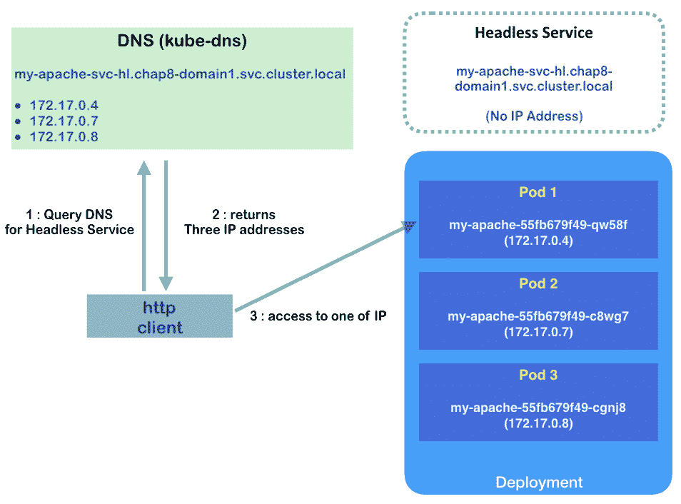访问无头服务和 pod 的顺序

因此，Kubernetes 无头服务不进行任何流量分发。这就是为什么它被称为无头的。

# 另请参阅

本节描述了`kube-dns`如何在 DNS 中为 pod 和服务命名。了解普通服务和无头服务之间的区别对于理解如何连接到您的应用程序非常重要。下一节还描述了 StatefulSet 的用例：

+   *在第三章中*，*确保容器的灵活使用*，*玩转容器*

# 身份验证和授权

对于 Kubernetes 这样的平台，身份验证和授权都至关重要。身份验证确保用户是他们声称的那个人。授权验证用户是否有足够的权限执行某些操作。Kubernetes 支持各种身份验证和授权插件。

# 准备就绪

当请求到达 API 服务器时，首先通过验证客户端的证书与 API 服务器中的**证书颁发机构**（**CA**）建立 TLS 连接。API 服务器中的 CA 通常位于`/etc/kubernetes/`，客户端的证书通常位于`$HOME/.kube/config`。握手完成后，进入认证阶段。在 Kubernetes 中，认证模块是基于链的。我们可以使用多个认证模块。当请求到来时，Kubernetes 将依次尝试所有认证器，直到成功。如果请求在所有认证模块上失败，将被拒绝为 HTTP 401 未经授权。否则，其中一个认证器将验证用户的身份，并对请求进行认证。然后，Kubernetes 授权模块开始发挥作用。它们验证*用户*是否有权限执行他们请求的操作，使用一组策略。授权模块逐一检查。就像认证模块一样，如果所有模块都失败，请求将被拒绝。如果用户有资格发出请求，请求将通过认证和授权模块，并进入准入控制模块。请求将逐一通过各种准入控制器进行检查。如果任何准入控制器拒绝请求，请求将立即被拒绝。

以下图表演示了这个顺序：

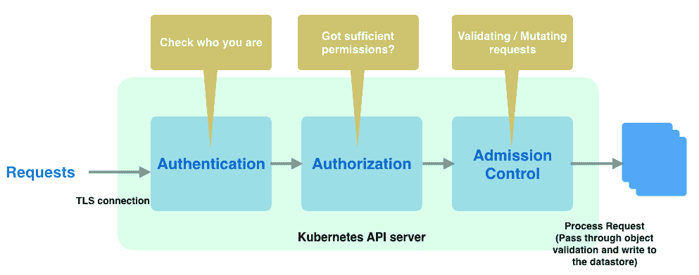通过 Kubernetes API 服务器传递的请求

# 如何做...

在 Kubernetes 中，有两种类型的账户；服务账户和用户账户。它们之间的主要区别在于用户账户不存储和管理在 Kubernetes 本身。它们不能通过 API 调用添加。以下表格是一个简单的比较：

|  | **服务账户** | **用户账户** |
| --- | --- | --- |
| **范围** | 命名空间 | 全局 |
| **被使用** | 进程 | 普通用户 |
| **由谁创建** | API 服务器或通过 API 调用 | 管理员，不能通过 API 调用添加 |
| **由谁管理** | API 服务器 | 集群外部 |

服务账户用于 Pod 内的进程与 API 服务器联系。Kubernetes 默认会创建一个名为**default**的服务账户。如果一个 Pod 没有与服务账户关联，它将被分配给默认服务账户：

```
// check default service accoun
# kubectl describe serviceaccount default
Name:                default
Namespace:           default
Labels:              <none>
Annotations:         <none>
Image pull secrets:  <none>
Mountable secrets:   default-token-q4qdh
Tokens:              default-token-q4qdh
Events:              <none>
```

我们可能会发现与此服务帐户关联的一个 Secret。这由令牌控制器管理。当创建新的服务帐户时，控制器将创建一个令牌，并使用`kubernetes.io/service-account.name`注释将其与服务帐户关联，从而允许 API 访问。在 Kubernetes 中，令牌以 Secret 格式存在。拥有 Secret 查看权限的任何人都可以看到令牌。以下是创建服务帐户的示例：

```
// configuration file of a ServiceAccount named chapter8-serviceaccount
# cat serviceaccount.yaml
apiVersion: v1
kind: ServiceAccount
metadata:
  name: chapter8-serviceaccount
// create service account
# kubectl create -f serviceaccount.yaml
serviceaccount "chapter8-serviceaccount" created
// describe the service account we just created
# kubectl describe serviceaccount chapter8-serviceaccount
Name:                chapter8-serviceaccount
Namespace:           default
Labels:              <none>
Annotations:         <none>
Image pull secrets:  <none>
Mountable secrets:   chapter8-serviceaccount-token-nxh47
Tokens:              chapter8-serviceaccount-token-nxh47
Events:              <none>
```

# 认证

Kuberentes 支持几种帐户认证策略，从客户端证书、持有者令牌和静态文件到 OpenID 连接令牌。可以选择多个选项，并与其他认证链组合使用。在本教程中，我们将介绍如何使用令牌、客户端证书和 OpenID 连接令牌进行认证。

# 服务帐户令牌认证

在上一节中，我们创建了一个服务帐户；现在，让我们看看如何使用服务帐户令牌进行认证。我们首先需要检索令牌：

```
// check the details of the secret
# kubectl get secret chapter8-serviceaccount-token-nxh47 -o yaml
apiVersion: v1
data:
  ca.crt: <base64 encoded>
  namespace: ZGVmYXVsdA==
  token: <bearer token, base64 encoded>
kind: Secret
metadata:
  annotations:
    kubernetes.io/service-account.name: chapter8-serviceaccount
    name: chapter8-serviceaccount-token-nxh47
  namespace: default
  ...
type: kubernetes.io/service-account-token
```

我们可以看到数据下的三个项目都是 base64 编码的。我们可以在 Linux 中使用`echo "encoded content" | base64 --decode`命令轻松解码它们。例如，我们可以解码编码的命名空间内容：

```
# echo "ZGVmYXVsdA==" | base64 --decode 
default 
```

使用相同的命令，我们可以获取令牌并在请求中使用它。API 服务器期望在请求中使用`Authorization: Bearer $TOKEN`的 HTTP 头。以下是如何使用令牌进行身份验证并直接向 API 服务器发出请求的示例。

首先，我们需要获取我们解码后的令牌：

```
// get the decoded token from secret chapter8-serviceaccount-token-nxh47 
# TOKEN=`echo "<bearer token, base64 encoded>" | base64 --decode` 
```

其次，我们还需要解码`ca.crt`：

```
// get the decoded ca.crt from secret chapter8-serviceaccount-token-nxh47 
# echo "<ca.crt, base64 encoded>" | base64 --decode > cert 
```

接下来，我们需要知道 API 服务器是什么。使用`kubectl config view`命令，我们可以得到服务器列表：

```
# kubectl config view
apiVersion: v1
clusters:
- cluster:
    certificate-authority-data: REDACTED
    server: https://api.demo-k8s.net
  name: demo-k8s.net
- cluster:
    certificate-authority: /Users/chloelee/.minikube/ca.crt
    server: https://192.168.99.100:8443
  name: minikube
...
```

找到您当前正在使用的。在这个例子中，我们正在使用 minikube。服务器位于`https://192.168.99.100:8443`。

您可以使用`kubectl config current-context`命令找到当前上下文。

然后我们应该可以开始了！我们将通过`https://$APISERVER/api`直接请求 API 端点，使用`--cacert`和`--header`。

```
# curl --cacert cert https://192.168.99.100:8443/api --header "Authorization: Bearer $TOKEN"
{
  "kind": "APIVersions",
  "versions": [
    "v1"
  ],
  "serverAddressByClientCIDRs": [
    {
      "clientCIDR": "0.0.0.0/0",
      "serverAddress": "10.0.2.15:8443"
    }
  ]
}
```

我们可以看到可用版本是`v1`。让我们看看在`/api/v1`端点中有什么：

```
# curl --cacert cert https://192.168.99.100:8443/api/v1 --header "Authorization: Bearer $TOKEN"
{
  "kind": "APIResourceList",
  "groupVersion": "v1",
  "resources": [
   ...
   {
      "name": "configmaps",
      "singularName": "",
      "namespaced": true,
      "kind": "ConfigMap",
      "verbs": [
        "create",
        "delete",
        "deletecollection",
        "get",
        "list",
        "patch",
        "update",
        "watch"
      ],      
      "shortNames": ["cm"]
    }
  ],  ...
}
```

它将列出我们请求的所有端点和动词。让我们以`configmaps`为例，并使用`grep`命令查找名称：

```
# curl --cacert cert https://192.168.99.100:8443/api/v1/configmaps --header "Authorization: Bearer $TOKEN" |grep \"name\"
        "name": "extension-apiserver-authentication",
        "name": "ingress-controller-leader-nginx",
        "name": "kube-dns",
        "name": "nginx-load-balancer-conf",
```

在这个例子中，我的集群中列出了四个默认的 configmaps。我们可以使用`kubectl`来验证这一点。结果应该与我们之前得到的相匹配：

```
# kubectl get configmaps --all-namespaces
NAMESPACE     NAME                                 DATA      AGE
kube-system   extension-apiserver-authentication   6         6d
kube-system   ingress-controller-leader-nginx      0         6d
kube-system   kube-dns                             0         6d
kube-system   nginx-load-balancer-conf             1         6d
```

# X509 客户端证书

用户帐户的常见身份验证策略是使用客户端证书。在下面的示例中，我们将创建一个名为琳达的用户，并为她生成一个客户端证书：

```
// generate a private key for Linda
# openssl genrsa -out linda.key 2048
Generating RSA private key, 2048 bit long modulus
..............+++
..............+++
e is 65537 (0x10001)
// generate a certificate sign request (.csr) for Linda. Make sure /CN is equal to the username.
# openssl req -new -key linda.key -out linda.csr -subj "/CN=linda"
```

接下来，我们将通过私钥和签名请求文件为琳达生成一个证书，以及我们集群的 CA 和私钥：

在 minikube 中，它位于`~/.minikube/`。对于其他自托管解决方案，通常位于`/etc/kubernetes/`下。如果您使用`kops`部署集群，则位置位于`/srv/kubernetes`下，您可以在`/etc/kubernetes/manifests/kube-apiserver.manifest`文件中找到路径。

```
// generate a cert
# openssl x509 -req -in linda.csr -CA ca.crt -CAkey ca.key -CAcreateserial -out linda.crt -days 30
Signature ok
subject=/CN=linda
Getting CA Private Key
```

我们已经用我们集群证书签署了琳达；现在我们可以将其设置到我们的`kubeconfig`文件中：

```
# kubectl config set-credentials linda --client-certificate=linda.crt --client-key=linda.key 
User "linda" set. 
```

我们可以使用`kubectl config view`来验证用户是否已设置：

```
# kubectl config view
current-context: minikube
kind: Config
users:
  - name: linda
  user:
    client-certificate: /k8s-cookbooks-2e/ch8/linda.crt
    client-key: /k8s-cookbooks-2e/ch8/linda.key
...
```

创建用户后，我们可以创建一个上下文，将命名空间和集群与该用户关联起来：

```
# kubectl config set-context linda-context --cluster=minikube --user=linda
```

之后，Kubernetes 应该能够识别琳达并将其传递到授权阶段。

# OpenID 连接令牌

另一种流行的身份验证策略是 OpenID 连接令牌。将身份验证委托给 OAuth2 提供程序是管理用户的一种便利方式。要启用该功能，必须将两个必需的标志设置为 API 服务器：`--oidc-issuer-url`，它指示发行者 URL，允许 API 服务器发现公共签名密钥，以及`--oidc-client-id`，它是要与发行者关联的应用程序的客户端 ID。有关完整信息，请参阅官方文档[`kubernetes.io/docs/admin/authentication/#configuring-the-api-server`](https://kubernetes.io/docs/admin/authentication/#configuring-the-api-server)。以下是我们如何在 minikube 集群中设置 Google OpenID 身份验证的示例。以下步骤可以轻松地用于身份验证用途。

首先，我们将不得不从 Google 请求一组由客户端 ID、客户端密钥和重定向 URL 组成的集合。以下是从 Google 请求和下载密钥的步骤：

1.  在 GCP 控制台中，转到 API 和服务|凭据|创建凭据|OAuth 客户端 ID。

1.  在应用程序类型中选择其他，然后单击创建。

1.  下载 JSON 文件。

之后，凭据已成功创建。我们可以查看 JSON 文件。以下是我们从示例项目 kubernetes-cookbook 中获得的文件：

```
# cat client_secret_140285873781-f9h7d7bmi6ec1qa0892mk52t3o874j5d.apps.googleusercontent.com.json
{
    "installed":{
        "client_id":"140285873781
f9h7d7bmi6ec1qa0892mk52t3o874j5d.apps.googleusercontent.com",
        "project_id":"kubernetes-cookbook",
        "auth_uri":"https://accounts.google.com/o/oauth2/auth",
        "token_uri":"https://accounts.google.com/o/oauth2/token",
        "auth_provider_x509_cert_url":"https://www.googleapis.com/oauth2/v1/certs",
        "client_secret":"Ez0m1L7436mlJQErhalp3Gda",
        "redirect_uris":[
            "urn:ietf:wg:oauth:2.0:oob",
            "http://localhost"
        ]
    }
}
```

现在，我们应该能够启动我们的集群。不要忘记必须传递 OIDC 标志。在 minikube 中，可以通过`--extra-config`参数来完成：

```
// start minikube cluster and passing oidc parameters. 
# minikube start --extra-config=apiserver.Authorization.Mode=RBAC --extra-config=apiserver.Authentication.OIDC.IssuerURL=https://accounts.google.com --extra-config=apiserver.Authentication.OIDC.UsernameClaim=email --extra-config=apiserver.Authentication.OIDC.ClientID="140285873781-f9h7d7bmi6ec1qa0892mk52t3o874j5d.apps.googleusercontent.com" 
```

集群启动后，用户必须登录到身份提供者以获取`access_token`、`id_token`和`refresh_token`。在 Google 中，登录后您将获得一个代码，然后将代码与请求一起传递以获取令牌。然后，我们通过 kubectl 将令牌传递给 API 服务器的请求。以下是此过程的顺序图：

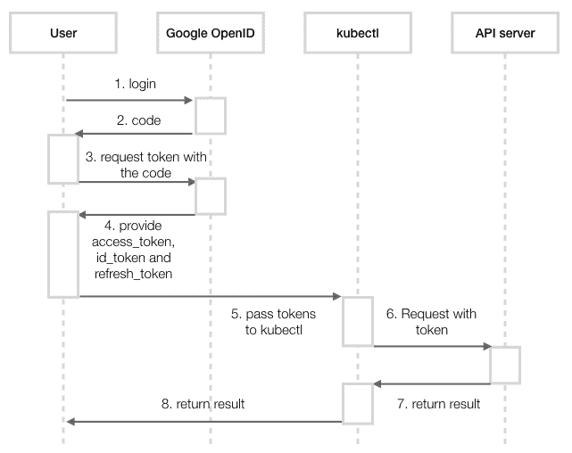Google OpenID 连接身份验证的时间图

要请求代码，您的应用程序应以以下格式发送 HTTP 请求：

```
// https://accounts.google.com/o/oauth2/v2/auth?client_id=<client_id>&response_type=code&scope=openid%20email&redirect_uri=urn:ietf:wg:oauth:2.0:oob
# https://accounts.google.com/o/oauth2/v2/auth?client_id=140285873781-f9h7d7bmi6ec1qa0892mk52t3o874j5d.apps.googleusercontent.com&response_type=code&scope=openid%20email&redirect_uri=urn:ietf:wg:oauth:2.0:oob
```

然后，一个浏览器窗口将弹出要求登录到 Google。登录后，代码将显示在控制台中：

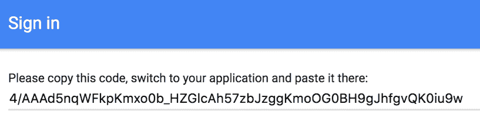

接下来，我们传递请求令牌的代码到`https://www.googleapis.com/oauth2/v4/token`。然后，我们应该能够从响应中获取`access_token`、`refresh_token`和`id_token`：

```
// curl -d "grant_type=authorization_code&client_id=<client_id>&client_secret=<client_secret>&redirect_uri=urn:ietf:wg:oauth:2.0:oob&code=<code>" -X POST https://www.googleapis.com/oauth2/v4/token
# curl -d "grant_type=authorization_code&client_id=140285873781-f9h7d7bmi6ec1qa0892mk52t3o874j5d.apps.googleusercontent.com&client_secret=Ez0m1L7436mlJQErhalp3Gda&redirect_uri=urn:ietf:wg:oauth:2.0:oob&code=4/AAAd5nqWFkpKmxo0b_HZGlcAh57zbJzggKmoOG0BH9gJhfgvQK0iu9w" -X POST https://www.googleapis.com/oauth2/v4/token
{
 "access_token": "ya29.GluJBQIhJy34vqJl7V6lPF9YSXmKauvvctjUJHwx72gKDDJikiKzQed9iUnmqEv8gLYg43H6zTSYn1qohkNce1Q3fMl6wbrGMCuXfRlipTcPtZnFt1jNalqMMTCm",
 "token_type": "Bearer",
 "expires_in": 3600,
 "refresh_token": "1/72xFflvdTRdqhjn70Bcar3qyWDiFw-8KoNm6LdFPorQ",
 "id_token": "eyJhbGc...mapQ"
}
```

假设我们将用户`chloe-k8scookbook@gmail.com`与此 Google 帐户关联。让我们在我们的集群中创建它。我们可以将用户信息附加到我们的 kubeconfig 中。文件的默认位置是`$HOME/.kube/config`：

```
// append to kubeconfig file.
- name: chloe-k8scookbook@gmail.com
  user:
    auth-provider:
      config:
        client-id: 140285873781-f9h7d7bmi6ec1qa0892mk52t3o874j5d.apps.googleusercontent.com
        client-secret: Ez0m1L7436mlJQErhalp3Gda
        id-token: eyJhbGc...mapQ
        idp-issuer-url: https://accounts.google.com
        refresh-token: 1/72xFflvdTRdqhjn70Bcar3qyWDiFw-8KoNm6LdFPorQ
      name: oidc
```

之后，让我们使用用户列出节点并查看是否可以通过身份验证：

```
# kubectl --user=chloe-k8scookbook@gmail.com get nodes 
Error from server (Forbidden): nodes is forbidden: User "chloe-k8scookbook@gmail.com" cannot list nodes at the cluster scope 
```

我们遇到了授权错误！在验证身份后，下一步将是检查用户是否有足够的权限来执行请求。

# 授权

经过身份验证阶段后，授权者开始工作。在我们继续讨论授权策略之前，让我们先谈谈`Role`和`RoleBinding`。

# Role 和 RoleBinding

Kubernetes 中的`Role`包含一组规则。规则通过指定`apiGroups`、`resources`和`verbs`来定义某些操作和资源的权限集。例如，以下角色定义了对`configmaps`的只读规则：

```
# cat role.yaml
kind: Role
apiVersion: rbac.authorization.k8s.io/v1
metadata:
  name: configmap-ro
rules:
  - apiGroups: ["*"]
    resources: ["configmaps"]
    verbs: ["watch", "get", "list"]
```

`RoleBinding`用于将角色与帐户列表关联。以下示例显示我们将`configmap-ro`角色分配给一组主体。在这种情况下，只有用户`linda`：

```
# cat rolebinding.yaml
kind: RoleBinding
apiVersion: rbac.authorization.k8s.io/v1
metadata:
  name: devops-role-binding
subjects:
- apiGroup: ""
  kind: User
  name: linda
roleRef:
  apiGroup: ""
  kind: Role
  name: configmap-ro
```

`Role`和`RoleBinding`是有命名空间的。它们的范围仅限于单个命名空间。要访问`整个集群`资源，我们需要`ClusterRole`和`ClusterRoleBinding`。

要将命名空间添加到`Role`或`RoleBinding`中，只需在配置文件的元数据中添加一个命名空间字段。

# ClusterRole 和 ClusterRoleBinding

`ClusterRole`和`ClusterRoleBinding`基本上类似于`Role`和`RoleBinding`。与`Role`和`RoleBinding`仅限于单个命名空间的方式不同，`ClusterRole`和`ClusterRoleBinding`用于授予整个集群范围的资源。因此，可以将对所有命名空间、非命名空间资源和非资源端点的访问授予`ClusterRole`，并且我们可以使用`ClusterRoleBinding`将用户和角色绑定。

我们还可以将服务账户与`ClusterRole`绑定。由于服务账户是有命名空间的，我们必须指定其完整名称，其中包括它所在的命名空间：

```
system:serviceaccount:<namespace>:<serviceaccountname>
```

以下是`ClusterRole`和`ClusterRoleBinding`的示例。在此角色中，我们授予了许多资源的所有操作权限，例如`deployments`、`replicasets`、`ingresses`、`pods`和`services`，并且我们将命名空间和事件的权限限制为只读：

```
# cat serviceaccount_clusterrole.yaml
apiVersion: rbac.authorization.k8s.io/v1
kind: ClusterRole
metadata:
  name: cd-role
rules:
- apiGroups: ["extensions", "apps"]
  resources:
  - deployments
  - replicasets
  - ingresses
  verbs: ["*"]
- apiGroups: [""]
  resources:
  - namespaces
  - events
  verbs: ["get", "list", "watch"]
- apiGroups: [""]
  resources:
  - pods
  - services
  - secrets
  - replicationcontrollers
  - persistentvolumeclaims
  - jobs
  - cronjobs
  verbs: ["*"]---
apiVersion: rbac.authorization.k8s.io/v1
kind: ClusterRoleBinding
metadata:
  name: cd-role-binding
roleRef:
  apiGroup: rbac.authorization.k8s.io
  kind: ClusterRole
  name: cd-role
subjects:
- apiGroup: rbac.authorization.k8s.io
  kind: User
  name: system:serviceaccount:default:chapter8-serviceaccount
```

在`apiGroup`中的[`""`]表示 Kubernetes 中的核心组。要查看资源和动词的完整列表，请查看 Kubernetes API 参考站点：[`kubernetes.io/docs/reference/`](https://kubernetes.io/docs/reference/)。

在这种情况下，我们创建了一个`cd-role`，这是执行持续部署的角色。此外，我们创建了一个`ClusterRoleBinding`，将服务账户`chapter8-serviceaccount`与`cd-role`关联起来。

# 基于角色的访问控制（RBAC）

基于角色的访问控制的概念围绕着`Role`、`ClusterRole`、`RoleBinding`和`ClusterRoleBinding`。通过`role.yaml`和`rolebinding.yaml`，正如我们之前展示的，Linda 应该对`configmaps`资源获得只读访问权限。要将授权规则应用于`chloe-k8scookbook@gmail.com`，只需将`ClusterRole`和`ClusteRoleBinding`与其关联即可：

```
# cat oidc_clusterrole.yaml
kind: ClusterRole
apiVersion: rbac.authorization.k8s.io/v1
metadata:
  name: oidc-admin-role
rules:
  - apiGroups: ["*"]
    resources: ["*"]
    verbs: ["*"]
---
kind: ClusterRoleBinding
apiVersion: rbac.authorization.k8s.io/v1
metadata:
  name: admin-binding
subjects:
  - kind: User
    name: chloe-k8scookbook@gmail.com
    apiGroup: rbac.authorization.k8s.io
roleRef:
  kind: ClusterRole
  name: oidc-admin-role
  apiGroup: rbac.authorization.k8s.io
```

然后，我们应该能够看到我们是否可以使用`chloe-k8scookbook@gmail.com`用户获取节点：

```
# kubectl --user=chloe-k8scookbook@gmail.com get nodes 
NAME STATUS ROLES AGE VERSION minikube Ready <none> 6d v1.9.4 
```

它的运行效果很好。我们不再遇到 Forbidden 错误。

在 RBAC 之前，Kubernetes 提供了**基于属性的访问控制**（**ABAC**），允许集群管理员将一组用户授权策略定义为一个 JSON 格式的文件。然而，该文件必须在启动 API 服务器时存在，这使得它在现实世界中无法使用。在 Kubernetes 1.6 中引入 RBAC 之后，ABAC 变得过时并被弃用。

# 准入控制

准入控制模块在 Kubernetes 验证谁发出请求以及请求者是否具有足够的权限执行它们之后开始发挥作用。与身份验证和授权不同，准入控制可以查看请求的内容，甚至有能力对其进行验证或修改。如果请求未经过准入控制器之一，请求将立即被拒绝。要在 Kubernetes 中启用准入控制器，只需在启动 API 服务器时传递`--admission-control（版本<1.10）--enable-admission-plugins（版本>=1.10）`参数。

根据集群的配置方式，传递`--enable-admission-plugin`参数的方法可能会有所不同。在 minikube 中，添加`--extra-config=apiserver.Admission.PluginNames=$ADMISSION_CONTROLLERS`并用逗号分隔不同的控制器应该就可以了。

不同的准入控制器设计用于不同的目的。在接下来的教程中，我们将介绍一些重要的准入控制器以及 Kubernetes 官方建议用户拥有的准入控制器。版本>=1.6.0 的推荐列表如下：`NamespaceLifecycle`、`LimitRanger`、`ServiceAccount`、`PersistentVolumeLabel`、`DefaultStorageClass`、`DefaultTolerationSeconds`、`ResourceQuota`。

请注意，准入控制器的顺序很重要，因为请求会依次通过（这对于 1.10 版本之前使用`--admission-control`选项的情况是正确的；在 v1.10 中，该参数被`--enable-admission-plugins`替换，顺序就不再重要）。我们不希望首先进行`ResourceQuota`检查，然后在检查了一长串准入控制器后发现资源信息已过时。

如果版本是>=1.9.0，则`MutatingAdmissionWebhook`和`ValidatingAdmissionWebhook`将在`ResourceQuota`之前添加。有关`MutatingAdmissionWebhook`和`ValidatingAdmissionWebhook`的更多信息，请参阅本教程中的*更多内容*部分。

# NamespaceLifecycle

当命名空间被删除时，该命名空间中的所有对象也将被清除。此插件确保在终止或不存在的命名空间中无法进行新对象的创建请求。它还可以防止 Kubernetes 本机命名空间被删除。

# LimitRanger

此插件确保 `LimitRange` 可以正常工作。使用 `LimitRange`，我们可以在命名空间中设置默认请求和限制，在启动 pod 时使用，而无需指定请求和限制。

# ServiceAccount

如果您打算在用例中利用 ServiceAccount 对象，则必须添加 ServiceAccount 插件。有关 ServiceAccount 的更多信息，请重新查看本教程中学到的 ServiceAccount 部分。

# PersistentVolumeLabel（从 v1.8 版本开始已弃用）

`PersistentVolumeLabel` 根据底层云提供商提供的标签，为新创建的 PV 添加标签。从 1.8 版本开始，此准入控制器已被弃用。此控制器的功能现在由云控制器管理器负责，它定义了特定于云的控制逻辑并作为守护程序运行。

# 默认存储类

此插件确保默认存储类在未在 `PersistentVolumeClaim` 中设置 `StorageClass` 的情况下可以正常工作。不同的云提供商使用不同的供应工具来利用 `DefaultStorageClass`（例如 GKE 使用 Google Cloud Persistent Disk）。请确保您已启用此功能。

# 默认容忍时间

污点和容忍度用于阻止一组 pod 在某些节点上调度运行。污点应用于节点，而容忍度则针对 pod 进行指定。污点的值可以是 `NoSchedule` 或 `NoExecute`。如果在一个带有污点的节点上运行的 pod 没有匹配的容忍度，那么这些 pod 将被驱逐。

`DefaultTolerationSeconds` 插件用于设置那些没有设置容忍度的 pod。然后，它将为 `notready:NoExecute` 和 `unreachable:NoExecute` 的默认容忍度申请 300 秒。如果节点不可用或不可达，等待 300 秒后再将 pod 从节点中驱逐。

# ResourceQuota

就像 `LimitRange` 一样，如果您正在使用 `ResourceQuota` 对象来管理不同级别的 QoS，则必须启用此插件。`ResourceQuota` 应始终放在准入控制插件列表的末尾。正如我们在 `ResourceQuota` 部分提到的，如果使用的配额少于硬配额，资源配额使用将被更新，以确保集群有足够的资源来接受请求。将其放在 ServiceAccount 准入控制器列表的末尾可以防止请求在被后续控制器拒绝之前过早增加配额使用。

# DenyEscalatingExec

这个插件拒绝了任何 kubectl exec 和 kubectl attach 命令的提升特权模式。具有特权模式的 pod 可以访问主机命名空间，这可能会带来安全风险。

# AlwaysPullImages

拉取策略定义了 kubelet 拉取镜像时的行为。默认的拉取策略是 `IfNotPresent`，也就是说，如果本地不存在镜像，它会拉取镜像。如果启用了这个插件，那么默认的拉取策略将变为 Always，也就是说，总是拉取最新的镜像。这个插件还提供了另一个好处，如果你的集群被不同的团队共享。每当一个 pod 被调度，它都会拉取最新的镜像，无论本地是否存在该镜像。这样我们就可以确保 pod 创建请求始终通过镜像的授权检查。

有关准入控制器的完整列表，请访问官方网站（[`kubernetes.io/docs/admin/admission-controllers`](https://kubernetes.io/docs/admin/admission-controllers)）获取更多信息。

# 还有更多...

在 Kubernetes 1.7 之前，准入控制器需要与 API 服务器一起编译，并在 API 服务器启动之前进行配置。**动态准入控制**旨在打破这些限制。由于我们撰写本书时，动态准入控制的两个主要组件都还不是 GA，除了将它们添加到准入控制链中，还需要在 API 服务器中进行额外的运行时配置：`--runtime-config=admissionregistration.k8s.io/v1alpha1`。

在 minikube 中，ServiceAccount 运行时配置设置为 `api/all`，因此默认情况下已启用。

# Initializers（alpha）

Initializers 是对象初始化阶段的一组任务。它们可以是一组检查或变更，用于执行强制策略或注入默认值。例如，你可以实现一个 Initializer 来向 pod 注入一个 sidecar 容器或包含测试数据的卷。Initializers 在对象的 `metadata.initializers.pending` 中进行配置。在相应的 Initializer 控制器（通过名称标识）执行任务后，它将从元数据中删除其名称。如果由于某些原因某个 Initializer 不起作用，所有具有该 Initializer 的对象将被卡在未初始化阶段，并且在 API 中不可见。请谨慎使用。

# Webhook 准入控制器（v1.9 中的 beta 版本）

截至 v1.10，有两种类型的 webhook 准入控制器：

+   `ValidatingAdmissionWebhook`：它可以进行额外的自定义验证来拒绝请求

+   `MutatingAdmissionWebhooks`：它可以改变对象以强制执行默认策略

有关更多实施信息，请参考官方文档：

[`kubernetes.io/docs/admin/extensible-admission-controllers/`](https://kubernetes.io/docs/admin/extensible-admission-controllers/)

# 参见

以下食谱与本节相关：

+   *在第二章中的*使用命名空间*

+   *在第五章*中的*设置持续交付流水线*，构建持续交付流水线*

+   *在第八章*中的*kubeconfig 的高级设置*，高级集群管理*

+   *在第八章*中的*使用 ServiceAccount RESTful API*，高级集群管理*
