# 第九章：日志记录和监控

本章将涵盖以下内容：

+   使用 EFK

+   使用 Google Stackdriver 进行工作

+   监控主节点和节点

# 介绍

日志记录和监控是 Kubernetes 中最重要的任务之一。然而，在 Kubernetes 中实现日志记录和监控有许多方法，因为有许多日志记录和监控开源应用程序，以及许多公共云服务。

Kubernetes 有一个最佳实践，用于设置大多数 Kubernetes 配置工具支持的日志记录和监控基础设施的附加组件。此外，托管的 Kubernetes 服务，如 Google Kubernetes Engine，集成了 GCP 日志和监控服务。

让我们在您的 Kubernetes 集群上设置日志记录和监控服务。

# 使用 EFK

在容器世界中，日志管理总是面临技术困难，因为容器有自己的文件系统，当容器死亡或被驱逐时，日志文件就会消失。此外，Kubernetes 可以轻松地扩展和缩减 Pods，因此我们需要关注一个集中式的日志持久化机制。

Kubernetes 有一个用于设置集中式日志管理的附加组件，称为 EFK。EFK 代表**Elasticsearch**，**Fluentd**和**Kibana**。这些应用程序的堆栈为您提供了完整的日志收集、索引和 UI 功能。

# 准备工作

在第一章中，*构建您自己的 Kubernetes 集群*，我们使用了几种不同的配置工具来设置我们的 Kubernetes 集群。根据您的 Kubernetes 配置工具，有一种简单的方法可以设置 EFK 堆栈。请注意，Elasticsearch 和 Kibana 是重型的 Java 应用程序。它们每个都需要至少 2GB 的内存。

因此，如果您使用 minikube，您的计算机应至少有 8GB 的内存（建议使用 16GB）。如果您使用 kubespray 或 kops 来设置 Kubernetes 集群，Kubernetes 节点应至少具有总共 4 个核心 CPU 和 16GB 的内存（换句话说，如果您有 2 个节点，每个节点应至少具有 2 个核心 CPU 和 8GB 的内存）。

此外，为了演示如何有效地收集应用程序日志，我们创建了一个额外的命名空间。这将帮助您轻松搜索您的应用程序日志：

```
$ kubectl create namespace chap9
namespace "chap9" created
```

# 如何做...

在这个配方中，我们将使用以下 Kubernetes 配置工具来设置 EFK 堆栈。根据您的 Kubernetes 集群，请阅读本配方的适当部分：

+   minikube

+   kubespray（ansible）

+   kops

请注意，在 Google Cloud Platform 上的 GKE，我们将介绍另一种设置日志基础设施的方法。

# 使用 minikube 设置 EFK

minikube 提供了一个 EFK 的插件功能，但默认情况下是禁用的。因此，您需要手动在 minikube 上启用 EFK。EFK 消耗大量堆内存，但 minikube 默认只分配 2GB，这绝对不足以在 minikube 中运行 EFK 堆栈。因此，我们需要显式地扩大 minikube 的内存大小。

此外，您应该使用最新版本的 minikube，因为在编写本教程时对 EFK 进行了几个错误修复。因此，我们使用 minikube 版本 0.25.2。让我们按照以下步骤配置 minikube 以启用 EFK：

1.  如果您已经运行`minikube`，请先停止`minikube`：

```
$ minikube stop
```

1.  更新到最新版本的 minikube：

```
//if you are using macOS 
$ brew update
$ brew cask upgrade

//if you are using Windows, download a latest binary from
https://github.com/kubernetes/minikube/releases 
```

1.  由于 EFK 消耗大量堆内存，使用 5GB 内存启动`minikube`：

```
$ minikube start --vm-driver=hyperkit --memory 5120
```

1.  确保`kube-system`命名空间中的所有 Pod 都已启动，因为 EFK 依赖于`kube-addon-manager-minikube`：

```
$ kubectl get pods --all-namespaces
NAMESPACE     NAME                                    READY     STATUS    RESTARTS   AGE
kube-system   kube-addon-manager-minikube             1/1       Running   0          1m
kube-system   kube-dns-54cccfbdf8-rc7gf               3/3       Running   0          1m
kube-system   kubernetes-dashboard-77d8b98585-hkjrr   1/1       Running   0          1m
kube-system   storage-provisioner                     1/1       Running   0          1m
```

1.  启用`efk`插件：

```
$ minikube addons enable efk
efk was successfully enabled
```

1.  等待一段时间；Elasticsearch、fluentd 和 kibana Pod 已经自动部署在`kube-system`命名空间中。等待`STATUS`变为`Running`。这至少需要 10 分钟才能完成：

```
$ kubectl get pods --namespace=kube-system
NAME                                    READY     STATUS              RESTARTS   AGE
$ kubectl get pods --all-namespaces
NAMESPACE     NAME                                    READY     STATUS    RESTARTS   AGE
kube-system   elasticsearch-logging-t5tq7             1/1       Running   0          9m
kube-system   fluentd-es-8z2tr                        1/1       Running   0          9m
kube-system   kibana-logging-dgql7                    1/1       Running   0          9m
kube-system   kube-addon-manager-minikube             1/1       Running   1          34m
…
```

1.  使用`kubectl logs`来观察等待状态变为`green`的 kibana。这还需要额外的五分钟：

```
$ kubectl logs -f kibana-logging-dgql7  --namespace=kube-system
{"type":"log","@timestamp":"2018-03-25T18:53:54Z","tags":["info","optimize"],"pid":1,"message":"Optimizing and caching bundles for graph, ml, kibana, stateSessionStorageRedirect, timelion and status_page. This may take a few minutes"}

*(wait for around 5min)*

{"type":"log","@timestamp":"2018-03-25T19:03:10Z","tags":["status","plugin:elasticsearch@5.6.2","info"],"pid":1,"state":"yellow","message":"Status changed from yellow to yellow - No existing Kibana index found","prevState":"yellow","prevMsg":"Waiting for Elasticsearch"}
{"type":"log","@timestamp":"2018-03-25T19:03:15Z","tags":["status","plugin:elasticsearch@5.6.2","info"],"pid":1,"state":"green","message":"Status changed from yellow to green - Kibana index ready","prevState":"yellow","prevMsg":"No existing Kibana index found"}
```

1.  使用`minikube service`命令访问 kibana 服务：

```
$ minikube service kibana-logging --namespace=kube-system
Opening kubernetes service kube-system/kibana-logging in default browser...
```

现在，您可以从您的机器访问 Kibana UI。您只需要设置一个索引。由于 Fluentd 保持发送一个以`logstash-yyyy.mm.dd`为索引名称的日志，索引模式默认为`logstash-*`。点击`Create`按钮：

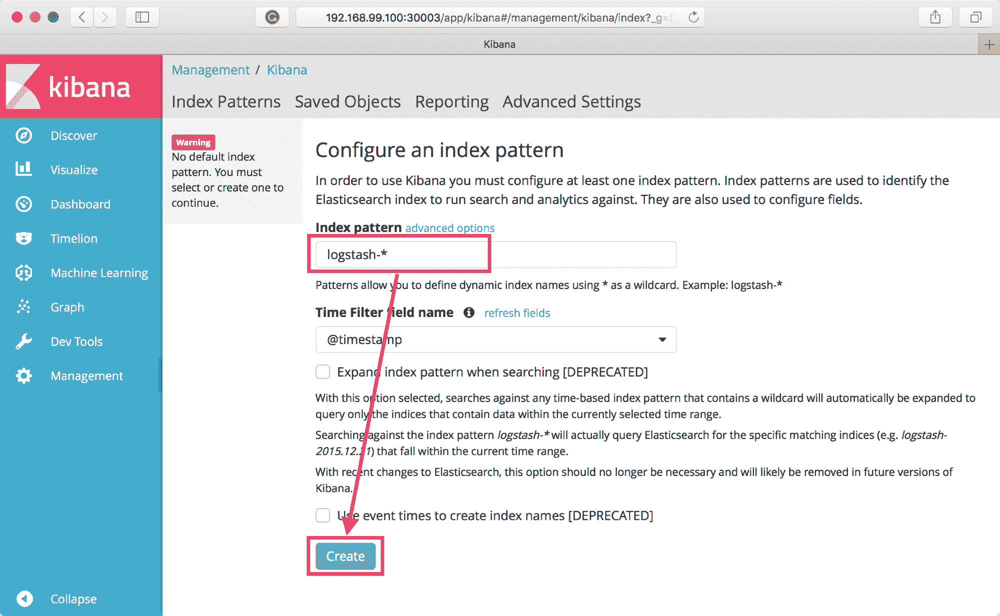

# 使用 kubespray 设置 EFK

kubespray 有一个关于是否启用 EFK 的配置。默认情况下是禁用的，因此您需要按照以下步骤启用它：

1.  打开`<kubespray dir>/inventory/mycluster/group_vars/k8s-cluster.yaml`。

1.  在`k8s-cluster.yml`文件的第 152 行左右，将`efk_enabled`的值更改为`true`：

```
# Monitoring apps for k8s
efk_enabled: true
```

1.  运行`ansible-playbook`命令来更新您的 Kubernetes 集群：

```
$ ansible-playbook -b -i inventory/mycluster/hosts.ini cluster.yml
```

1.  检查 Elasticsearch、Fluentd 和 Kibana Pod 的状态是否变为 Running；如果看到超过 10 分钟的 Pending 状态，请检查`kubectl describe pod <Pod name>`以查看状态。在大多数情况下，您会收到一个错误，说`内存不足`。如果是这样，您需要添加更多的节点或增加可用的 RAM：

```
$ kubectl get pods --all-namespaces
NAMESPACE     NAME                                        READY     STATUS    RESTARTS   AGE
kube-system   calico-node-9wnwn                           1/1       Running   0          2m
kube-system   calico-node-jg67p                           1/1       Running   0          2m
kube-system   elasticsearch-logging-v1-776b8b856c-97qrq   1/1       Running   0          1m kube-system   elasticsearch-logging-v1-776b8b856c-z7jhm   1/1       Running   0          1m kube-system   fluentd-es-v1.22-gtvzg                      1/1       Running   0          49s kube-system   fluentd-es-v1.22-h8r4h                      1/1       Running   0          49s kube-system   kibana-logging-57d98b74f9-x8nz5             1/1       Running   0          44s kube-system   kube-apiserver-master-1                     1/1       Running   0          3m
kube-system   kube-controller-manager-master-1            1/1       Running   0          3m
…
```

1.  检查 kibana 日志，查看状态是否变为`green`：

```
$ kubectl logs -f kibana-logging-57d98b74f9-x8nz5 --namespace=kube-system
ELASTICSEARCH_URL=http://elasticsearch-logging:9200
server.basePath: /api/v1/proxy/namespaces/kube-system/services/kibana-logging
{"type":"log","@timestamp":"2018-03-25T05:11:10Z","tags":["info","optimize"],"pid":5,"message":"Optimizing and caching bundles for kibana and statusPage. This may take a few minutes"}

*(wait for around 5min)*

{"type":"log","@timestamp":"2018-03-25T05:17:55Z","tags":["status","plugin:elasticsearch@1.0.0","info"],"pid":5,"state":"yellow","message":"Status changed from yellow to yellow - No existing Kibana index found","prevState":"yellow","prevMsg":"Waiting for Elasticsearch"}
{"type":"log","@timestamp":"2018-03-25T05:17:58Z","tags":["status","plugin:elasticsearch@1.0.0","info"],"pid":5,"state":"green","message":"Status changed from yellow to green - Kibana index ready","prevState":"yellow","prevMsg":"No existing Kibana index found"}
```

1.  运行`kubectl cluster-info`，确认 Kibana 正在运行，并捕获 Kibana 的 URL：

```
$ kubectl cluster-info
Kubernetes master is running at http://localhost:8080
Elasticsearch is running at http://localhost:8080/api/v1/namespaces/kube-system/services/elasticsearch-logging/proxy
Kibana is running at http://localhost:8080/api/v1/namespaces/kube-system/services/kibana-logging/proxy KubeDNS is running at http://localhost:8080/api/v1/namespaces/kube-system/services/kube-dns:dns/proxy
```

1.  为了从远程机器访问 Kibana WebUI，最好使用 ssh 端口转发从您的机器到 Kubernetes 主节点：

```
$ ssh -L 8080:127.0.0.1:8080 <Kubernetes master IP address>
```

1.  使用以下 URL 从您的机器访问 Kibana WebUI：`http://localhost:8080/api/v1/namespaces/kube-system/services/kibana-logging/proxy`。

现在您可以从您的机器访问 Kibana。您还需要配置索引。只需确保索引名称的默认值为`logstash-*`。然后，点击`Create`按钮：

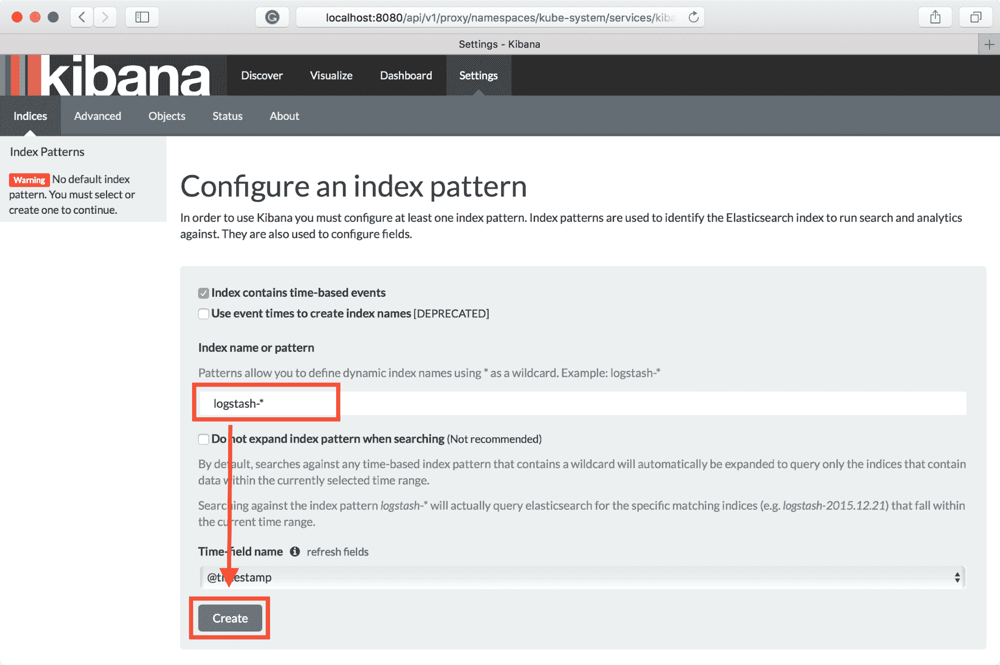

# 使用 kops 设置 EFK

kops 还有一个用于在 Kubernetes 集群上轻松设置 EFK 堆栈的插件。按照以下步骤在 Kubernetes 上运行 EFK 堆栈：

1.  运行`kubectl create`来指定 kops EFK 插件：

```
$ kubectl create -f https://raw.githubusercontent.com/kubernetes/kops/master/addons/logging-elasticsearch/v1.6.0.yaml
serviceaccount "elasticsearch-logging" created
clusterrole "elasticsearch-logging" created
clusterrolebinding "elasticsearch-logging" created
serviceaccount "fluentd-es" created
clusterrole "fluentd-es" created
clusterrolebinding "fluentd-es" created
daemonset "fluentd-es" created
service "elasticsearch-logging" created
statefulset "elasticsearch-logging" created
deployment "kibana-logging" created
service "kibana-logging" created
```

1.  等待所有 Pod 的`STATUS`变为`Running`：

```
$ kubectl get pods --all-namespaces
NAMESPACE     NAME                                                  READY     STATUS    RESTARTS   AGE
kube-system   dns-controller-dc46485d8-pql7r                        1/1       Running   0          5m
kube-system   elasticsearch-logging-0                               1/1       Running   0          1m kube-system   elasticsearch-logging-1                               1/1       Running   0          53s kube-system   etcd-server-events-ip-10-0-48-239.ec2.internal        1/1       Running   0          5m
kube-system   etcd-server-ip-10-0-48-239.ec2.internal               1/1       Running   0          5m
kube-system   fluentd-es-29xh9                                      1/1       Running   0          1m kube-system   fluentd-es-xfbd6                                      1/1       Running   0          1m kube-system   kibana-logging-649d7dcc87-mrtzc                       1/1       Running   0          1m kube-system   kube-apiserver-ip-10-0-48-239.ec2.internal            1/1       Running   0          5m
...
```

1.  检查 Kibana 的日志，并等待状态变为`green`：

```
$ kubectl logs -f kibana-logging-649d7dcc87-mrtzc --namespace=kube-system
ELASTICSEARCH_URL=http://elasticsearch-logging:9200
server.basePath: /api/v1/proxy/namespaces/kube-system/services/kibana-logging
{"type":"log","@timestamp":"2018-03-26T01:02:04Z","tags":["info","optimize"],"pid":6,"message":"Optimizing and caching bundles for kibana and statusPage. This may take a few minutes"}

*(wait for around 5min)*

{"type":"log","@timestamp":"2018-03-26T01:08:00Z","tags":["status","plugin:elasticsearch@1.0.0","info"],"pid":6,"state":"yellow","message":"Status changed from yellow to yellow - No existing Kibana index found","prevState":"yellow","prevMsg":"Waiting for Elasticsearch"}
{"type":"log","@timestamp":"2018-03-26T01:08:03Z","tags":["status","plugin:elasticsearch@1.0.0","info"],"pid":6,"state":"green","message":"Status changed from yellow to green - Kibana index ready","prevState":"yellow","prevMsg":"No existing Kibana index found"}
```

1.  运行`kubetl cluster-info`来捕获 Kibana 的 URL：

```
$ kubectl cluster-info
Kubernetes master is running at https://api.chap9.k8s-devops.net
Elasticsearch is running at https://api.chap9.k8s-devops.net/api/v1/namespaces/kube-system/services/elasticsearch-logging/proxy
Kibana is running at https://api.chap9.k8s-devops.net/api/v1/namespaces/kube-system/services/kibana-logging/proxy KubeDNS is running at https://api.chap9.k8s-devops.net/api/v1/namespaces/kube-system/services/kube-dns:dns/proxy
```

1.  使用`kubectl proxy`将您的机器转发到 Kubernetes API 服务器：

```
$ kubectl proxy --port=8080
Starting to serve on 127.0.0.1:8080
```

1.  使用以下 URL 从您的机器访问 Kibana WebUI：`http://127.0.0.1:8080/api/v1/namespaces/kube-system/services/kibana-logging/proxy`。请注意 IP 地址为 127.0.0.1，这是正确的，因为我们正在使用 kubectl 代理。

现在，您可以开始使用 Kibana。按照前面的 minikube 和 kubespray 部分的描述配置索引。

# 工作原理...

如您所见，根据 Kubernetes 配置工具，安装的 Kibana 版本是不同的。但是，本教程探讨了 Kibana 的基本功能。因此，无需担心特定于版本的操作。

让我们启动一个示例应用程序，然后学习如何使用 Kibana 监视应用程序日志：

1.  准备一个示例应用程序，该应用程序不断打印`DateTime`和 hello 消息到`stdout`：

```
$ cat myapp.yaml
apiVersion: v1
kind: Pod
metadata:
  name: myapp
spec:
  containers:
  - image: busybox
    name: application
    args:
      - /bin/sh
      - -c
      - >
        while true; do
        echo "$(date) INFO hello";
        sleep 1;
        done
```

1.  在`chap9`命名空间中创建一个示例应用程序：

```
$ kubectl create -f myapp.yaml --namespace=chap9
pod "myapp" created
```

1.  访问 Kibana WebUI，然后点击 Discover 选项卡：

1.  确保时间范围为“最近 15 分钟”，然后在搜索框中输入`kubernetes.namespace_name: chap9`，然后按下*Enter*键：

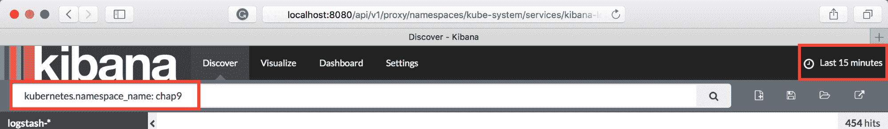在 15 分钟内搜索 chap9 命名空间的日志

1.  您可以看到`chap9`命名空间中的所有日志如下。屏幕截图显示的信息比您预期的要多得多。通过点击`kubernetes.host`，`kubernetes.pod_name`和`log`的添加按钮，将仅显示此目的所需的字段：

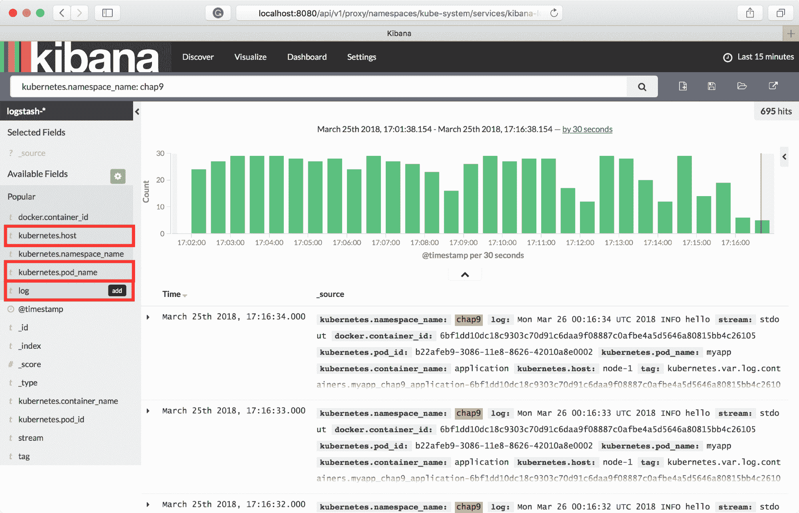选择日志列

1.  现在您可以看到这个应用程序的更简单的日志视图：

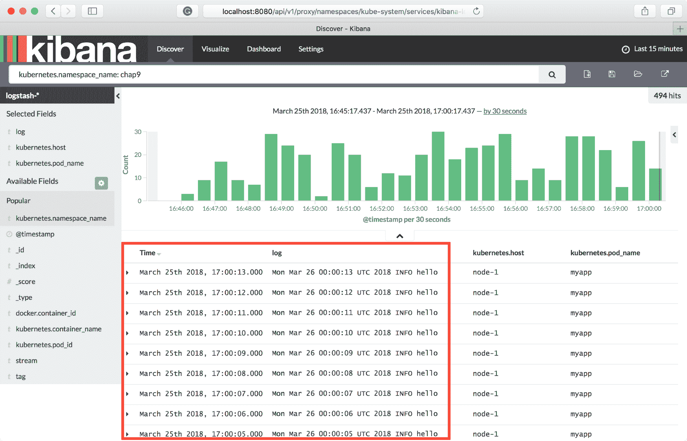显示自定义 Kibana 视图的最终状态

恭喜！您现在在您的 Kubernetes 集群中拥有了一个集中式日志管理系统。您可以观察一些 Pod 的部署，看看如何查看应用程序日志。

# 还有更多...

前面的 EFK 堆栈只收集 Pod 的日志，因为 Fluentd 正在监视 Kubernetes 节点主机上的`/var/log/containers/*`。这已经足够监视应用程序的行为，但作为 Kubernetes 管理员，您还需要一些 Kubernetes 系统日志，如主节点和节点日志。

有一个简单的方法可以实现与 EFK 堆栈集成的 Kubernetes 系统日志管理；添加一个 Kubernetes 事件导出器，它会持续监视 Kubernetes 事件。当发生新事件时，将日志发送到 Elasticsearch。因此，您也可以使用 Kibana 监视 Kubernetes 事件。

我们准备了一个 Eventer（事件导出器）附加组件（[`raw.githubusercontent.com/kubernetes-cookbook/second-edition/master/chapter9/9-1/eventer.yml`](https://raw.githubusercontent.com/kubernetes-cookbook/second-edition/master/chapter9/9-1/eventer.yml)）。它是基于 Heapster（[`github.com/kubernetes/heapster`](https://github.com/kubernetes/heapster)）的，并且预期在 EFK 附加组件之上运行。我们可以使用这个 Eventer 来通过 EFK 监视 Kubernetes 事件：

Heapster 的详细信息将在下一节“监控主节点和节点”中描述。

1.  将 eventer 添加到您现有的 Kubernetes 集群中：

```
$ kubectl create -f https://raw.githubusercontent.com/kubernetes-cookbook/second-edition/master/chapter9/9-1/eventer.yml deployment "eventer-v1.5.2" created serviceaccount "heapster" created clusterrolebinding "heapster" created
```

1.  确保 Eventer Pod 的`STATUS`为`Running`：

```
$ kubectl get pods --all-namespaces NAMESPACE     NAME                                        READY     STATUS    RESTARTS   AGE kube-system   elasticsearch-logging-v1-776b8b856c-9vvfl   1/1       Running   0          9m kube-system   elasticsearch-logging-v1-776b8b856c-gg5gx   1/1       Running   0          9m **kube-system   eventer-v1.5.2-857bcc76d9-9gwn8             1/1       Running   0          29s** kube-system   fluentd-es-v1.22-8prkn                      1/1       Running   0          9m
...
```

1.  使用`kubectl logs`继续观察 Heapster 以及它是否能够捕获事件：

```
$ kubectl logs -f eventer-v1.5.2-857bcc76d9-9gwn8 --namespace=kube-system I0327 03:49:53.988961       1 eventer.go:68] /eventer --source=kubernetes:'' --sink=elasticsearch:http://elasticsearch-logging:9200?sniff=false I0327 03:49:53.989025       1 eventer.go:69] Eventer version v1.5.2 I0327 03:49:54.087982       1 eventer.go:95] Starting with ElasticSearch Sink sink I0327 03:49:54.088040       1 eventer.go:109] Starting eventer I0327 03:49:54.088048       1 eventer.go:117] Starting eventer http service I0327 03:50:00.000199       1 manager.go:100] **Exporting 0 events**
```

1.  出于测试目的，打开另一个终端，然后创建一个`nginx` Pod：

```
$ kubectl run my-nginx --image=nginx deployment "my-nginx" created
```

1.  观察 Heapster 的日志；一些新事件已被捕获：

```
I0327 03:52:00.000235       1 manager.go:100] Exporting 0 events I0327 03:52:30.000166       1 manager.go:100] Exporting **8 events** I0327 03:53:00.000241       1 manager.go:100] Exporting 0 events
```

1.  打开 Kibana 并导航到设置|索引|添加新内容。这将添加一个新索引。

1.  将索引名称设置为`heapster-*`，将时间字段名称设置为`Metadata.creationTimestamp`，然后单击“创建”：

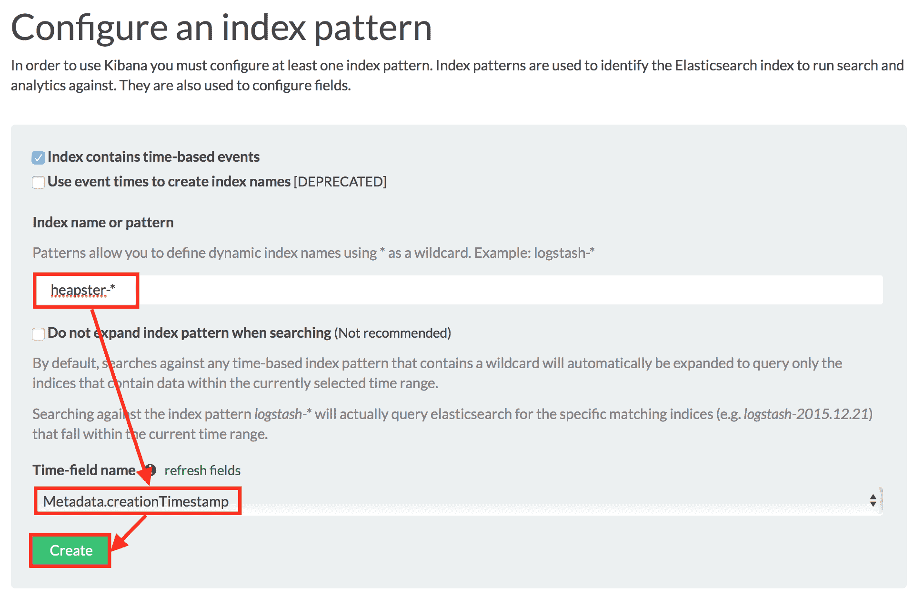配置 Heapster 索引

1.  返回“发现”页面，然后从左侧面板中选择`heapster-*`索引。

1.  选择（单击“添加”按钮）“Message”，“Source.component”和“Source.host”：

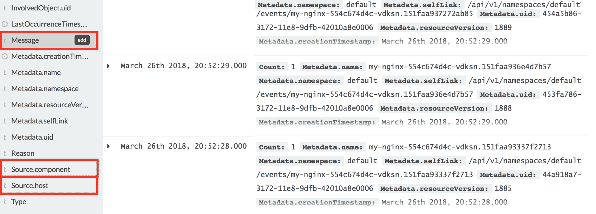选择必要的列

1.  现在您可以看到 Kubernetes 系统日志，其中显示了`nginx` Pod 的创建事件如下：

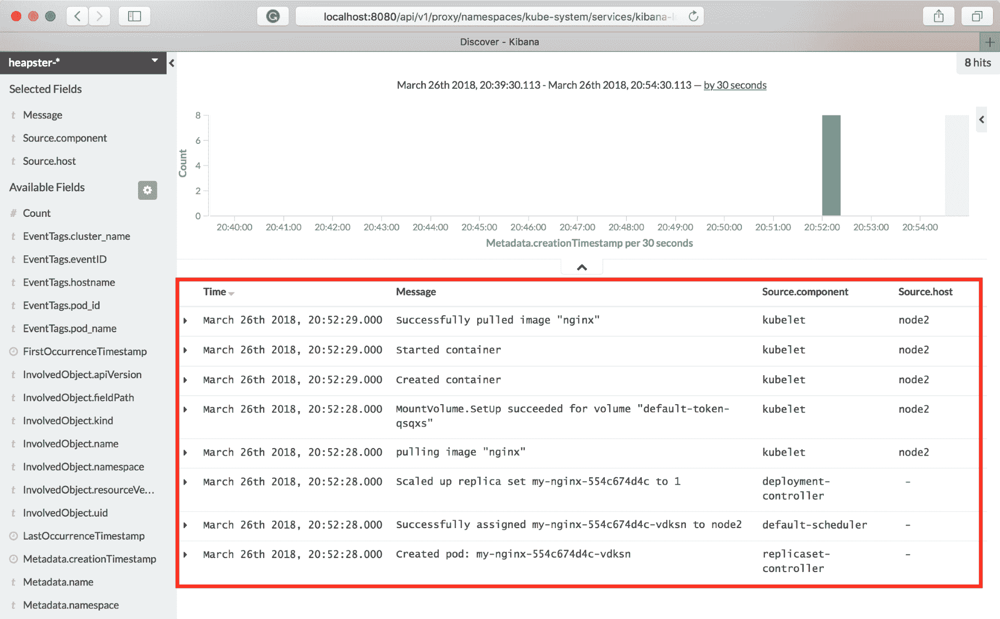显示 Kibana 中系统日志视图的最终状态

现在您不仅可以监视应用程序日志，还可以在 EFK 堆栈中监视 Kubernetes 系统日志。通过在`logstash-*`（应用程序日志）或`heapster-*`（系统日志）之间切换索引，您可以获得灵活的日志管理环境。

# 另请参阅

在本食谱中，我们学习了如何为您的 Kubernetes 集群启用 EFK 堆栈。Kibana 是一个强大的工具，您可以使用它创建自己的仪表板并更有效地检查日志。请访问 Kibana 的在线文档以了解如何使用它：

+   Kibana 用户指南参考：[`www.elastic.co/guide/en/kibana/index.html`](https://www.elastic.co/guide/en/kibana/current/index.html)

# 使用 Google Stackdriver

在第七章，“在 GCP 上构建 Kubernetes”中，我们介绍了 GKE。它具有集成的日志记录机制，称为 Google Stackdriver。在本节中，我们将探索 GKE 和 Stackdriver 之间的集成。

# 准备工作

要使用 Stackdriver，您只需要一个 GCP 帐户。如果您从未使用过 GCP，请返回并阅读第七章，“在 GCP 上构建 Kubernetes”，以设置 GCP 帐户和`gcloud`命令行界面。

要在 GKE 上使用 Stackdriver，无需采取任何操作，因为 GKE 默认使用 Stackdriver 作为日志记录平台。但是，如果要显式启用 Stackdriver，请在使用`gcloud`命令启动 Kubernetes 时指定`--enable-cloud-logging`，如下所示：

```
$ gcloud container clusters create my-gke --cluster-version 1.9.4-gke.1 --enable-cloud-logging --network default --zone us-west1-b
```

如果由于某种原因，您的 GKE 未启用 Stackdriver，您可以使用`gcloud`命令在之后启用它：

```
$ gcloud container clusters update my-gke --logging-service logging.googleapis.com --zone us-west1-b
```

# 如何做…

为了演示 GKE 的 Stackdriver，我们将在 Kubernetes 上创建一个命名空间，然后启动一个示例 Pod 以查看 Stackdriver 上的一些日志，如下所示：

1.  创建`chap9`命名空间：

```
$ kubectl create namespace chap9
namespace "chap9" created
```

1.  准备一个示例应用程序 Pod：

```
$ cat myapp.yaml apiVersion: v1 kind: Pod metadata:
 name: myapp spec:
 containers: - image: busybox name: application args: - /bin/sh - -c - > while true; do echo "$(date) INFO hello"; sleep 1; done
```

1.  在`chap9`命名空间上创建 Pod：

```
$ kubectl create -f myapp.yaml --namespace=chap9 pod "myapp" created
```

1.  访问 GCP Web 控制台，导航到 Logging | Logs。

1.  选择 Audited Resources | GKE Container | Your GKE cluster name (ex: my-gke) | chap9 namespace：

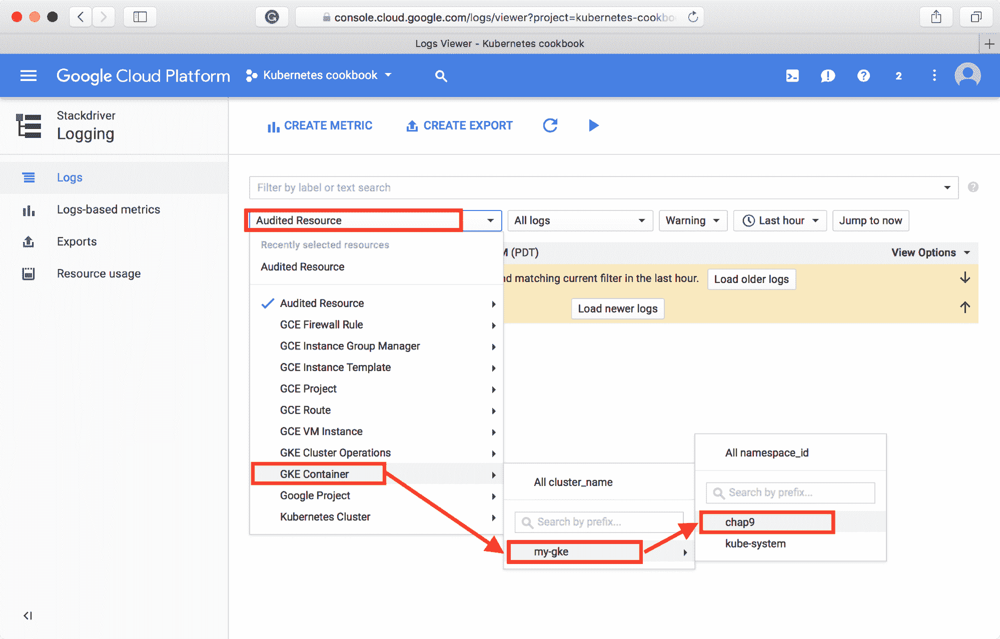选择 chap9 命名空间 Pod 日志

1.  作为访问`chap9`命名空间日志的另一种方式，您可以选择高级过滤器。 然后，将以下标准输入到文本字段中，然后单击 Submit Filter 按钮：

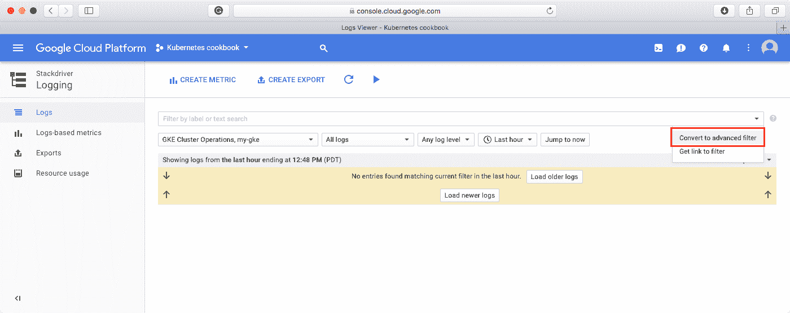使用高级过滤器

```
resource.type="container" 
resource.labels.cluster_name="<Your GKE name>"
resource.labels.namespace_id="chap9"
```

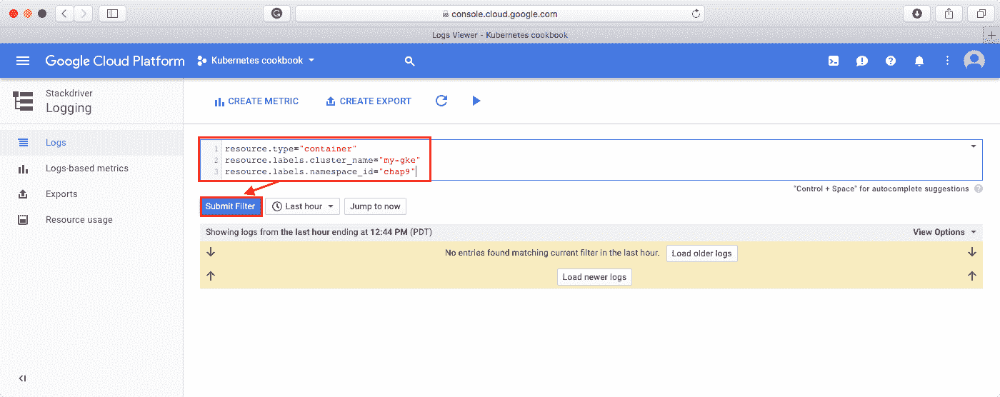输入高级过滤器标准

1.  现在，您可以在 Stackdriver 上看到`myapp`日志：

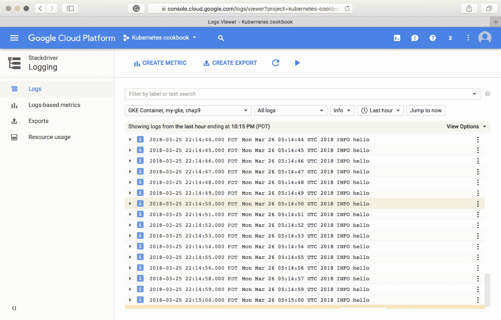在 Stackdriver 中显示 chap9 Pod 日志

# 它是如何工作的...

Stackdriver 具有缩小日期、严重性和关键字搜索的基本功能。它有助于监视应用程序的行为。那么系统级行为呢，比如主节点活动？Stackdriver 还支持系统级日志的搜索。实际上，`fluentd`不仅捕获应用程序日志，还捕获系统日志。通过执行以下步骤，您可以在 Stackdriver 中查看系统日志：

1.  选择 GKE Cluster Operations | Your GKE name (例如，my-gke) | All location:

您应该选择 All location 而不是特定位置，因为某些 Kubernetes 操作日志不包含位置值。 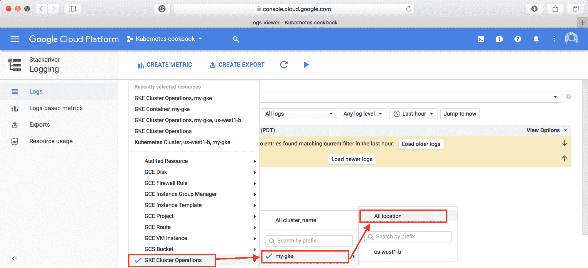在 Stackdriver 中选择 GKE 系统日志

1.  作为替代，输入以下高级过滤器：

```
resource.type="gke_cluster"
resource.labels.cluster_name="<Your GKE name>"
```

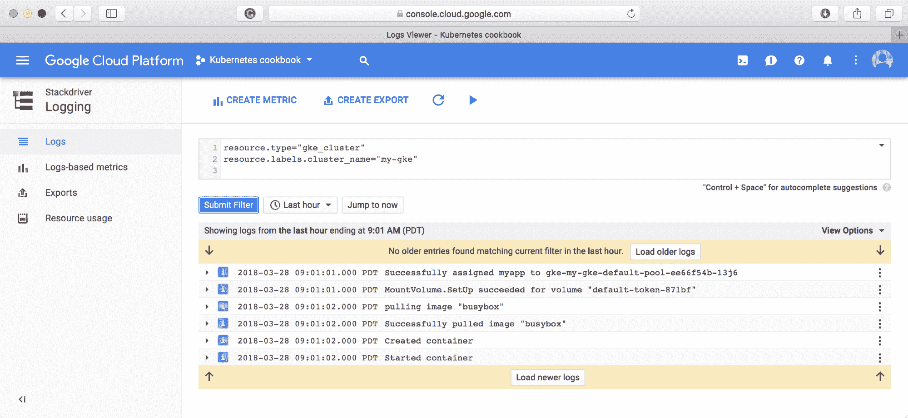在 Stackdriver 中显示 GKE 系统日志

# 另请参阅

在这个配方中，我们介绍了 Google Stackdriver。它是 Google Kubernetes Engine 的内置功能。Stackdriver 是一个简单但功能强大的日志管理工具。此外，Stackdriver 能够监视系统状态。您可以创建内置或自定义指标来监视并提供有关事件的警报。这将在下一个配方中描述。

此外，请阅读以下章节以回顾 GCP 和 GKE 的基础知识：

+   第七章，*在 GCP 上构建 Kubernetes*

# 监控主节点和节点

在之前的教程中，您学会了如何构建自己的集群，运行各种资源，享受不同的使用场景，甚至增强了集群管理。现在，您的 Kubernetes 集群将迎来一个新的视角。在这个教程中，我们将讨论监控。通过监控工具，用户不仅可以了解节点的资源消耗，还可以了解 Pods 的情况。这将帮助我们更有效地利用资源。

# 准备工作

与之前的教程一样，您只需准备一个健康的 Kubernetes 集群。以下命令和 kubectl 将帮助您验证 Kubernetes 系统的状态：

```
// check the components
$ kubectl get cs
```

为了后续演示，我们将在一个 minikube-booted 集群上部署监控系统。但是，它适用于任何类型的良好安装的集群。

# 如何操作...

在本节中，我们将介绍如何安装监控系统并介绍其仪表板。这个监控系统是基于 Heapster（https://github.com/kubernetes/heapster）的，它是一个资源使用收集和分析工具。Heapster 与 kubelet 通信，获取机器和容器的资源使用情况。除了 Heapster，我们还有 influxDB（https://influxdata.com）用于存储，以及 Grafana（http://grafana.org）作为前端仪表板，可视化资源状态在几个用户友好的图表中。

监控组件的交互

Heapster 从每个节点的 kubelet 收集信息，并为其他平台提供数据。在我们的情况下，influxDB 是保存历史数据的汇聚点。用户可以进一步进行数据分析，比如预测高峰工作负载，然后进行相应的资源调整。我们有 Grafana 作为友好的 Web 控制台；用户可以通过浏览器管理监控状态。此外，kubectl 有子命令 top，可以通过 Heapster 获取整个集群的信息。

```
// try kubectl top before installing Heapster
$ kubectl top node
Error from server (NotFound): the server could not find the requested resource (get services http:heapster:)
```

这个命令会出现错误消息。

安装监控系统可能比预期的要容易得多。通过应用来自开源社区和公司的配置文件，我们可以借助几个命令在 Kubernetes 上简单地设置组件监控：

```
// installing influxDB
$ kubectl create -f https://raw.githubusercontent.com/kubernetes/heapster/master/deploy/kube-config/influxdb/influxdb.yaml
deployment "monitoring-influxdb" created
service "monitoring-influxdb" created
// installing Heapster
$ kubectl create -f https://raw.githubusercontent.com/kubernetes/heapster/master/deploy/kube-config/influxdb/heapster.yaml
serviceaccount "heapster" created
deployment "heapster" created
//installing Grafana
$kubectl create -f https://raw.githubusercontent.com/kubernetes/heapster/master/deploy/kube-config/influxdb/grafana.yaml
deployment "monitoring-grafana" created
service "monitoring-grafana" created
```

您会发现，应用在线资源也可以用于创建 Kubernetes 应用程序。

# 它是如何工作的...

安装了 influxDB、Heapster 和 Grafana 之后，让我们学习如何获取资源的状态。首先，您现在可以使用`kubectl top`。检查节点和 Pod 的利用率，并验证监控功能的功能：

```
// check the status of nodes
$ kubectl top node
NAME       CPU(cores)   CPU%      MEMORY(bytes)   MEMORY%
minikube   236m         11%       672Mi           35%
// check the status of Pods in Namespace kube-system
$ kubectl top pod -n kube-system
NAME                                    CPU(cores)   MEMORY(bytes)
heapster-5c448886d-k9wt7                1m           18Mi
kube-addon-manager-minikube             36m          32Mi
kube-dns-54cccfbdf8-j65x6               3m           22Mi
kubernetes-dashboard-77d8b98585-z8hch   0m           12Mi
monitoring-grafana-65757b9656-8cl6d     0m           13Mi
monitoring-influxdb-66946c9f58-hwv8g    1m           26Mi
```

目前，`kubectl top`只涵盖节点和 Pod，并显示它们的 CPU 和 RAM 使用情况。

根据`kubectl top`的输出，**m**在 CPU 使用量方面代表什么？它代表"毫"，如毫秒和毫米。 Millicpu 被视为 10^(-3) CPU。例如，如果 Heapster Pod 使用 1 m CPU，那么它在这一刻只占用了 0.1%的 CPU 计算能力。

# 介绍 Grafana 仪表板

现在，让我们来看看 Grafana 仪表板。在我们的情况下，对于 minikube 启动的集群，我们应该打开代理，以便从本地主机访问 Kubernetes 集群：

```
$ kubectl proxy
Starting to serve on 127.0.0.1:8001
```

您可以通过以下 URL 访问 Grafana：`http://localhost:8001/api/v1/namespaces/kube-system/services/monitoring-grafana/proxy/`。使我们能够看到网页的魔法是由 Kubernetes DNS 服务器和代理完成的：

**在反 minikube Kubernetes 中访问 Grafana 仪表板**

要通过浏览器访问 Grafana，这取决于节点的网络配置和 Grafana 的 Kubernetes 服务。按照以下步骤将网页转发到您的客户端：

+   **升级 Grafana 的服务类型**：我们应用的配置文件创建了一个带有 ClusterIP 服务的 Grafana。您应该将其更改为`NodePort`或`LoadBalancer`，以将 Grafana 暴露给外部世界。

+   **检查防火墙**：确保您的客户端或负载均衡器能够访问集群的节点。

+   **通过目标端口访问仪表板**：与我们在 minikube 集群上所做的详细 URL 不同，您可以使用简单的 URL 访问 Grafana，例如`NODE_ENTRYPOINT:3000`（Grafana 默认在配置文件中请求端口 3000）或负载均衡器的入口点。

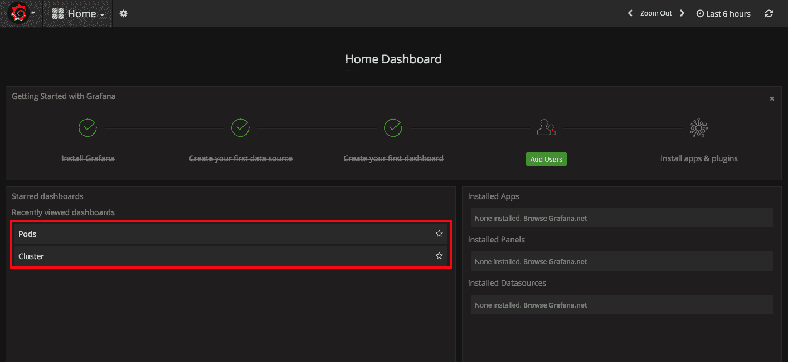Grafana 的主页

在 Grafana 的默认设置中，我们有两个仪表板，**Cluster**和**Pods**。**Cluster**仪表板涵盖了节点的资源利用情况，如 CPU、内存、网络事务和存储。**Pods**仪表板为每个 Pod 提供了类似的图表，您可以检查 Pod 中的每个容器：

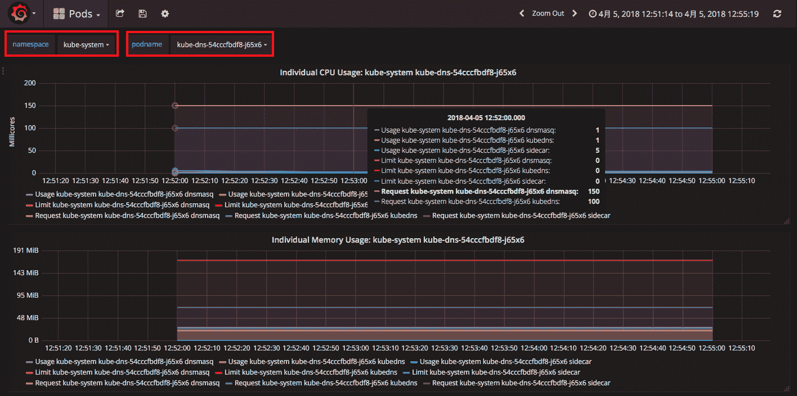通过 Pod 仪表板查看 Pod kube-dns

如前面的截图所示，例如，我们可以观察`kube-system`命名空间中`kube-dns` Pod 中各个容器的 CPU 利用率，这是 DNS 服务器的集群。您可以发现这个 Pod 中有三个容器，`kubedns`，`dnsmasq`和`sidecar`，图中的线分别表示容器的 CPU 限制、请求和实际使用情况。

# 创建一个新的指标来监控 Pod

对于正在运行的应用程序，指标是我们可以收集和用来分析其行为和性能的数据。指标可以来自系统方面，比如 CPU 的使用，也可以基于应用程序的功能，比如某些功能的请求频率。Heapster 提供了几个用于监控的指标（[`github.com/kubernetes/heapster/blob/master/docs/storage-schema.md`](https://github.com/kubernetes/heapster/blob/master/docs/storage-schema.md)）。我们将向您展示如何自己创建一个定制面板。请参考以下步骤：

1.  进入 Pod 的仪表板，将网页拖动到底部。有一个名为“添加行”的按钮；点击它以添加一个指标。然后，选择第一个类别图形作为表达这个指标的新面板：

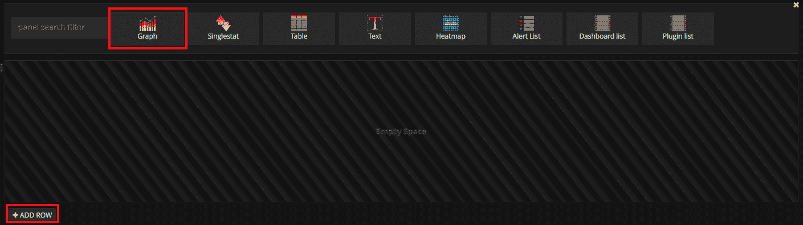使用图表表达添加新的指标

1.  出现一个空的面板块。继续点击它进行进一步配置。当您选择面板后，编辑块出现时，只需选择编辑：

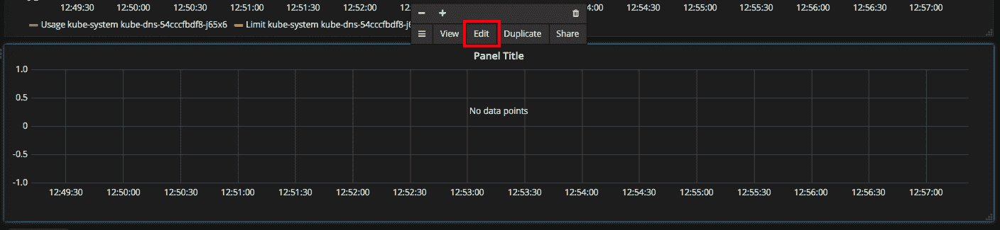开始编辑一个面板

1.  首先，给你的面板起一个名字。例如，`CPU 利用率`。我们想要创建一个显示 CPU 利用率的面板：

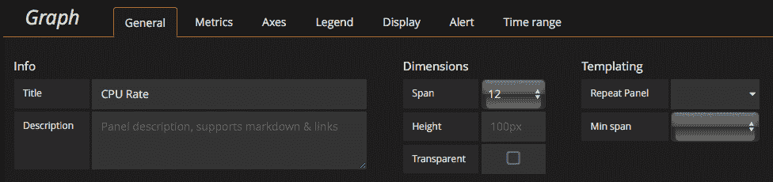在“常规”页面上给面板一个标题

1.  设置以下参数以进行特定数据查询。参考以下截图：

+   FROM: `cpu/usage_rate`

+   WHERE: `type = pod_container`

+   AND: `namespace_name=$namespace, pod_name=$podname value`

+   GROUP BY: `tag(container_name)`

+   ALIAS BY: `$tag_container_name`

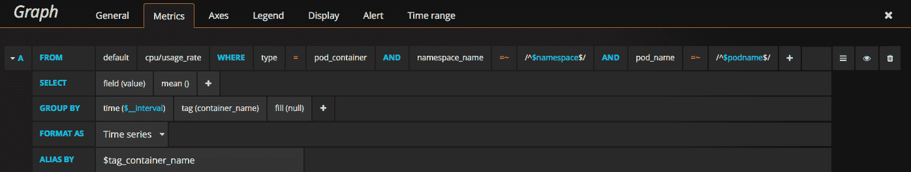CPU 利用率指标的数据查询参数

1.  是否有任何状态线显示？如果没有，修改显示页面中的配置将帮助您构建最好看的图表。使空值连接，您将发现线条显示出来：

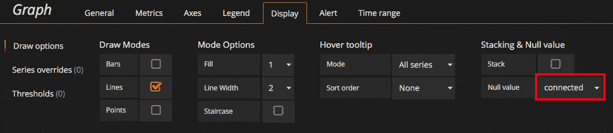编辑您的指标外观。检查空值是否为“连接”以显示线条

1.  就是这样！随意关闭编辑模式。现在您为每个 Pod 都有了一个新的指标。

尝试发现 Grafana 仪表板和 Heapster 监控工具的更多功能。通过监控系统的信息，您将获得有关系统、服务和容器的进一步细节。

# 还有更多...

我们建立了一个基于 Heapster 的监控系统，由 Kubernetes 小组维护。然而，一些专注于容器集群的工具和平台已经涌现出来，以支持社区，比如 Prometheus ([`prometheus.io`](https://prometheus.io))。另一方面，公共云可能会在 VM 上运行守护程序来默认抓取指标，并提供相应的服务。我们不必在集群内构建一个。接下来，我们将介绍在 AWS 和 GCP 上的监控方法。您可能希望查看 C*hapter 6*，*在 AWS 上构建 Kubernetes*，和 C*hapter 7*，*在 GCP 上构建 Kubernetes*，以构建一个集群并了解更多概念。

# 在 AWS 上监控您的 Kubernetes 集群

在 AWS 上工作时，我们通常依赖 AWS CloudWatch([`aws.amazon.com/cloudwatch/`](https://aws.amazon.com/cloudwatch/))进行监控。您可以创建一个仪表板，并选择任何您想要的基本指标。CloudWatch 已经为您收集了大量的指标：

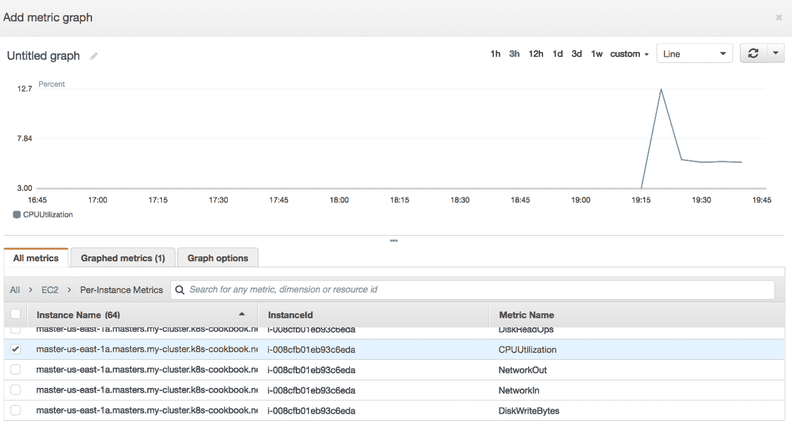使用 AWS CloudWatch 创建一个新的指标

但是，对于 Kubernetes 的资源，比如 Pods，需要通过手动配置将它们的自定义指标发送到 CloudWatch。使用 kops 安装时，建议您使用 Heapster 或 Prometheus 构建您的监控系统。

AWS 有自己的容器集群服务，Amazon ECS。这可能是 AWS 没有深度支持 Kubernetes 的原因，我们必须通过 kops 和 terraform 构建集群，以及其他附加服务。然而，根据最近的消息，将会有一个名为**Amazon Elastic Container Service for Kubernetes** (**Amazon EKS**)的新服务。我们可以期待 Kubernetes 与其他 AWS 服务的集成。

# 在 GCP 上监控您的 Kubernetes 集群

在我们查看 GCP 的监控平台之前，GKE 集群的节点应该承认被扫描以获取任何应用状态：

```
// add nodes with monitoring scope
$ gcloud container clusters create my-k8s-cluster --cluster-version 1.9.7-gke.0 - -machine-type f1-micro --num-nodes 3 --network k8s-network --zone us-central1-a - -tags private --scopes=storage-rw,compute-ro, https://www.googleapis.com/auth/monitoring
```

*Google Stackdriver*在混合云环境中提供系统监控。除了其自己的 GCP，它还可以覆盖您在 AWS 上的计算资源。要访问其 Web 控制台，您可以在左侧菜单中找到其部分。Stackdriver 中有多个服务类别。选择监控以检查相关功能。

作为新用户，您将获得 30 天的免费试用。初始配置很简单；只需启用一个帐户并绑定您的项目。由于我们只是想检查 GKE 集群，您可以避免安装代理和设置 AWS 帐户。成功登录 Stackdriver 后，点击左侧面板上的资源，然后选择基础设施类型下的 Kubernetes Engine。

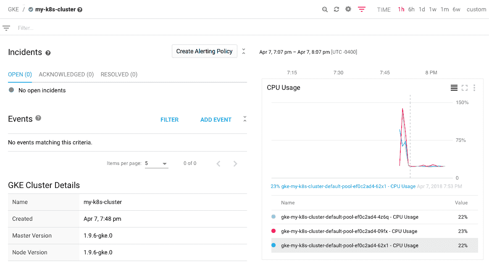GKE on Strackdriver 监控的主页

已经为从节点到容器的计算资源设置了多个指标。花些时间探索并查看官方介绍以获取更多功能：[`cloud.google.com/kubernetes-engine/docs/how-to/monitoring`](https://cloud.google.com/kubernetes-engine/docs/how-to/monitoring)。

# 另请参阅

这个食谱向您展示了如何监控 Kubernetes 系统中的机器。然而，研究主要组件和守护程序的食谱是明智的。您可以更多地了解工作流程和资源使用情况。此外，由于我们已经使用了几项服务来构建我们的监控系统，再次审查有关 Kubernetes 服务的食谱将让您清楚地了解如何构建这个监控系统：

+   第一章中的*探索架构*食谱，*构建您自己的 Kubernetes 集群*

+   第二章中的*使用服务*食谱，*深入了解 Kubernetes 概念*

Kubernetes 是一个不断向前发展和升级的项目。跟进的推荐方法是在其官方网站上查看新功能：[`kubernetes.io`](http://kubernetes.io)。此外，您还可以在 GitHub 上获取新的 Kubernetes 版本：[`github.com/kubernetes/kubernetes/releases`](https://github.com/kubernetes/kubernetes/releases)。保持您的 Kubernetes 系统最新，并实际学习新功能，是持续访问 Kubernetes 技术的最佳方法。
