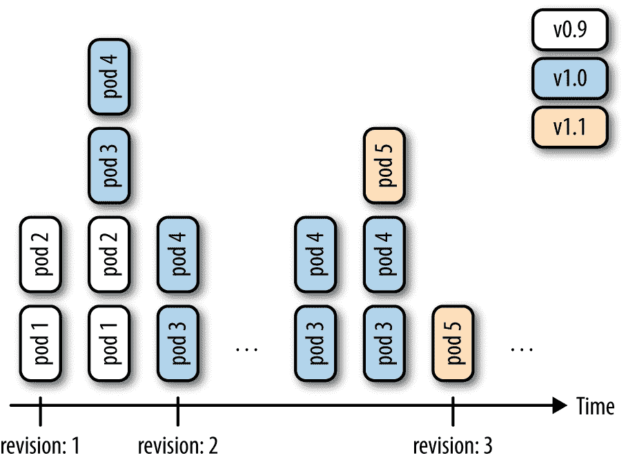

# 四、创建和修改基本工作负载

在本章中，我们将向您展示如何管理基本的 Kubernetes 工作负载类型:pods 和部署。我们展示了如何通过 CLI 命令和从 YAML 清单创建部署和 pods，并解释了如何扩展和更新部署。

# 4.1 使用 kubectl 运行创建部署

## 问题

您希望快速启动长时间运行的应用，如 web 服务器。

## 解决办法

使用`kubectl run`命令，这是一个动态创建部署清单的生成器。例如，要创建运行 Ghost 微博平台的部署，请执行以下操作:

```
$ kubectl run ghost --image=ghost:0.9

$ kubectl get deploy/ghost
NAME      DESIRED   CURRENT   UP-TO-DATE   AVAILABLE   AGE
ghost     1         1         1            0           16s

```

## 讨论

`kubectl run`命令可以采用许多参数来配置部署的附加参数。 例如，您可以执行以下操作:

*   用`--env`设置环境变量

*   用`--port`定义容器港口

*   使用`--command`定义要运行的命令

*   自动创建与`--expose`关联的服务

*   使用`--replicas`定义豆荚的数量

典型用法如下。要在端口 2368 上启动 Ghost 服务并创建服务，请输入:

```
$ kubectl run ghost --image=ghost:0.9 --port=2368 --expose

```

要启动设置了根密码的 MySQL，请输入:

```
$ kubectl run mysql --image=mysql:5.5 --env=MYSQL_ROOT_PASSWORD=root

```

要启动一个`busybox`容器并在启动时执行命令`sleep 3600`，输入:

```
$ kubectl run myshell --image=busybox --command -- sh -c "sleep 3600"

```

有关可用参数的更多详细信息，请参见`kubectl run --help`。

# 4.2 从文件清单创建对象

## 问题

您希望显式声明对象的属性，然后创建它，而不是通过生成器(如`kubectl run`)来创建对象。

## 解决办法

像这样使用`kubectl create`:

```
$ kubectl create -f *<manifest>*

```

在[配方 6.3](06.html#namespace) 中，您将看到如何使用 YAML 清单创建名称空间。这是最简单的例子之一，因为清单很短。它可以用 YAML 或 JSON 编写——例如，像这样用 YAML 清单文件 *myns.yaml* :

```
apiVersion:    v1
kind:          namespace
metadata:
  name:        myns
```

您可以使用`kubectl create -f myns.yaml`创建该对象。

## 讨论

您可以将`kubectl create`指向一个网址，或者本地文件系统中的一个文件名。例如，要创建规范留言簿应用的前端，请在单个清单中获取定义该应用的原始 YAML 的 URL，然后输入:

```
$ kubectl create -f https://raw.githubusercontent.com/kubernetes/kubernetes/ \
                    master/examples/guestbook/frontend-deployment.yaml

```

# 4.3 从头开始编写 Pod 清单

## 问题

你想从头开始写一个 pod 清单，而不是使用像`kubectl run`这样的生成器。

## 解决办法

一个`Pod`是一个`/api/v1`对象，和任何其他Kubernetes对象一样，它的清单文件包含以下字段:

*   `apiVersion`，指定 API 版本

*   `kind`，表示对象的类型

*   `metadata`，提供一些关于对象的元数据

*   `spec`，提供对象规范

pod 清单包含一组容器和一组可选的卷(参见第 8 章[)。](08.html#ch_volumes_config)最简单的形式，只有一个容器，没有容积，看起来如下:

```
apiVersion:    v1
kind:          Pod
metadata:
  name:        oreilly
spec:
  containers:
  - name:      oreilly
    image:     nginx
```

将此 YAML 清单保存在名为*or illy . YAML*的文件中，然后使用`kubectl`创建它:

```
$ kubectl create -f oreilly.yaml

```

## 讨论

容器的应用编程接口规范比解决方案中显示的要丰富得多，解决方案是最基本的功能容器。例如，一个容器可以包含多个容器，如下所示:

```
apiVersion: v1
kind:       Pod
metadata:
  name:     oreilly
spec:
  containers:
  - name:   oreilly
    image:  nginx
  - name:   safari
    image:  redis
```

容器还可以包含用于在容器中加载数据的体积定义(参见[配方 8.1](08.html#data_exchange_local_volume) ，以及用于检查容器化应用运行状况的探测器(参见[配方 11.2](11.html#liveness) 和[配方 11.3](11.html#readiness) )。

在[文档](https://kubernetes.io/docs/concepts/workloads/pods/pod/)中详细描述了许多规范字段背后的思想和完整的 API 对象规范的链接。

###### 注意

除非有非常具体的原因，否则永远不要自己创造一个豆荚。使用一个`Deployment`对象(参见[配方 4.4](#deployments) )来监控豆荚——它将通过另一个名为`ReplicaSet`的对象来监控豆荚。

## 请参见

*   Kubernetes [Pods 参考文件](https://kubernetes.io/docs/api-reference/v1.7/#pod-v1-core)。

*   [`ReplicaSet`文档](https://kubernetes.io/docs/concepts/workloads/controllers/replicaset/)

# 4.4 使用清单启动部署

## 问题

你想完全控制一个(长时间运行的)应用是如何启动和监管的。

## 解决办法

使用其中的`Deployment`对象编写清单。关于基础知识，另请参见[配方 4.3](#pod_manifest) 。

假设您有一个名为*fan yapp . YAML*的清单文件，内容如下:

```
apiVersion:       extensions/v1beta1
kind:             Deployment
metadata:
  name:           fancyapp
spec:
  replicas:       5
  template:
    metadata:
      labels:
        app:      fancy
        env:      development
    spec:
      containers:
      - name:     sise
        image:    mhausenblas/simpleservice:0.5.0
        ports:
        - containerPort: 9876
        env:
        - name:   SIMPLE_SERVICE_VERSION
          value:  "0.9"
```

如您所见，在启动应用时，您可能需要明确做几件事:

*   设置应启动和监督的POD(`replicas`)或相同副本的数量。

*   给它贴上标签，如`env=development`(另见[配方 6.5](06.html#easy_label)[配方 6.6](06.html#labels) )。

*   设置环境变量，如`SIMPLE_SERVICE_VERSION`。

现在让我们看看部署需要什么:

```
$ kubectl create -f fancyapp.yaml
deployment "fancyapp" created

$ kubectl get deploy
NAME       DESIRED   CURRENT   UP-TO-DATE   AVAILABLE   AGE
fancyapp   5         5         5            0           8s

$ kubectl get rs
NAME                  DESIRED   CURRENT   READY     AGE
fancyapp-1223770997   5         5         0         13s

$ kubectl get po
NAME                        READY     STATUS              RESTARTS   AGE
fancyapp-1223770997-18msl   0/1       ContainerCreating   0          15s
fancyapp-1223770997-1zdg4   0/1       ContainerCreating   0          15s
fancyapp-1223770997-6rqn2   0/1       ContainerCreating   0          15s
fancyapp-1223770997-7bnbh   0/1       ContainerCreating   0          15s
fancyapp-1223770997-qxg4v   0/1       ContainerCreating   0          15s

```

如果我们几秒钟后重复这个:

```
$ kubectl get po
NAME                        READY     STATUS    RESTARTS   AGE
fancyapp-1223770997-18msl   1/1       Running   0          1m
fancyapp-1223770997-1zdg4   1/1       Running   0          1m
fancyapp-1223770997-6rqn2   1/1       Running   0          1m
fancyapp-1223770997-7bnbh   1/1       Running   0          1m
fancyapp-1223770997-qxg4v   1/1       Running   0          1m

```

###### 警告

当你想要摆脱一个部署，以及它所管理的副本集和POD时，执行一个类似`kubectl delete deploy/fancyapp`的命令。不要*试图删除单个POD，因为它们将由部署重新创建。这是经常让初学者困惑的事情。*

 *部署允许您扩展应用(参见[配方 9.1](09.html#scaling-deployments) )以及推出新版本或回滚到以前的版本。总的来说，它们适用于需要相同特征的 pods 的无状态应用。

## 讨论

部署是 pod 和副本集(RSs)的监管者，让您可以精细地控制如何以及何时推出新的 pod 版本或回滚到以前的状态。 部署监督的 RSs 和 pod 通常对您不感兴趣，除非您需要调试 pod(参见[食谱 12.5](12.html#debug_pods) )。[图 4-1](#deployment-revisions) 展示了如何在部署版本之间来回移动。



###### 图 4-1。部署修订

请注意，从未来来看，RS 将取代原始的复制控制器(RC)，因此从 RS 而不是 RCs 的角度开始考虑是一件好事。目前，唯一的区别是，RSs 支持基于集合的标签/查询，但我们可以预计，将有更多的功能添加到 RS，RC 最终将被弃用。

最后，要生成清单，您可以使用`kubectl create`命令和`--dry-run`选项。它将允许您以 YAML 或 JSON 格式生成清单，并保存清单以备后用。 例如，要使用 Docker 映像`nginx`创建名为`fancy-app`的部署清单，请发出以下命令:

```
$ kubectl create deployment fancyapp --image nginx -o json --dry-run
{
    "kind": "Deployment",
    "apiVersion": "extensions/v1beta1",
    "metadata": {
        "name": "fancy-app",
        "creationTimestamp": null,
        "labels": {
            "app": "fancy-app"
        }
    },
...
```

## 请参见

*   文档中的 Kubernetes [部署](https://kubernetes.io/docs/concepts/workloads/controllers/deployment/)

# 4.5 更新部署

## 问题

您有一个部署，想要推出新版本的应用。

## 解决办法

更新您的部署，并让默认的更新策略`RollingUpdate`，自动处理卷展栏。

例如，假设您创建了一个新的容器映像，并希望基于它更新部署:

```
$ kubectl run sise --image=mhausenblas/simpleservice:0.4.0
deployment "sise" created

$ kubectl set image deployment sise mhausenblas/simpleservice:0.5.0
deployment "sise" image updated

$ kubectl rollout status deployment sise
deployment "sise" successfully rolled out

$ kubectl rollout history deployment sise
deployments "sise"
REVISION        CHANGE-CAUSE
1               <none>
2               <none>

```

现在，您已经成功地推出了部署的新版本，其中仅使用的容器映像发生了更改。部署的所有其他属性(如副本数量)保持不变。但是如果你想更新部署的其他方面，比如改变环境变量，该怎么办？您可以使用多个`kubectl`命令来更新部署。 例如，要向当前部署添加端口定义，可以使用`kubectl edit`:

```
$ kubectl edit deploy sise

```

该命令将在默认编辑器中打开当前部署，或者在设置和导出时，在环境变量`KUBE_EDITOR`指定的编辑器中打开当前部署。

假设您想要添加以下端口定义:

```
...
  ports:
  - containerPort: 9876
...
```

编辑过程的结果(在这种情况下，`KUBE_EDITOR`设置为`vi`)显示在[图 4-2](#deployment-edit) 中。


###### 图 4-2。编辑部署

一旦保存并退出编辑器，Kubernetes 就开始新的部署，现在已经定义了端口。让我们验证一下:

```
$ kubectl rollout history deployment sise
deployments "sise"
REVISION        CHANGE-CAUSE
1               <none>
2               <none>
3               <none>

```

事实上，我们看到修订版 3 已经推出了我们用`kubectl edit`引入的变更。`CHANGE-CAUSE`列为空的原因是您没有将`kubectl create`与`--record`选项一起使用。如果您想查看是什么触发了修订，请添加此选项。

如前所述，您可以使用更多`kubectl`命令来更新您的部署:

*   使用`kubectl apply`从清单文件中更新一个部署(或创建它，如果它不存在的话)，例如`kubectl apply -f simpleservice.yaml`。

*   使用`kubectl replace`从清单文件中替换部署，例如`kubectl replace -f simpleservice.yaml`。请注意，与`apply`不同，为了使用`replace`，部署必须已经存在。

*   使用`kubectl patch`更新特定的键，例如:

    ```
    kubectl patch deployment sise -p '{"spec": {"template":
    {"spec": {"containers":
    [{"name": "sise", "image": "mhausenblas/simpleservice:0.5.0"}]}}}}'
    ```

如果您在部署的新版本中犯了错误或遇到了问题，该怎么办？幸运的是，Kubernetes 使得使用`kubectl rollout undo`命令回滚到已知的良好状态变得非常容易。例如，假设最后一次编辑是一个错误，您想要回滚到修订版 2。您可以使用以下命令来完成此操作:

```
$ kubectl rollout undo deployment sise ‐‐to‐revision=2

```

然后，您可以使用`kubectl get deploy/sise -o yaml`验证端口定义是否已被删除。

###### 注意

仅当 pod 模板的部分(即`.spec.template`下的键)发生变化时，才会触发部署的展开，例如环境变量、端口或容器映像。对部署方面的更改(如副本数量)不会触发新的部署。*